# Angular

- Angular is a JavaScript Framework which allows you to create reactive Single-Page-Applications.
- Every changes is render in the browser.
- Metadata is `@` decorator which instruct Angular how to deal with class:
    - `@NgModule`
    - `@Component`
    - `@Injectable`
    - `@Input`
    - `@Output`
    
**Angular versioning**

- AngularJS (Angular 1)
- Angular 2
- Angular 4
- ... (New version every 6 months).
- Angular 9
- Small, incremental, backwards-compatible changes.

**Updating NodeJS**

- By downloaded the latest version from a website, and uninstall old one.

**Updating npm**

```console
sudo npm install -g npm
```

**Updating the CLI**

```console
sudo npm uninstall -g angular-cli @angular/cli
npm cache verify
sudo npm install -g @angular/cli 
```

***

## Project setup

- **Node JS:** Bundle and optimize project, uses npm to add dependencies.

```console
npm install -g @angular/cli@latest
ng new my-first-app
cd my-first-app
ng serve
```

**Directives**

```html
<input type="text" [(ngModel)]="name">
<p>{{ name }}</p>
```

- **[(ngModel)]:** Listen anything enter in input field and store in **name** property and also 
output of this property to input.
- To use **ngModel** add **FormsModule** to **AppModule**.

```ts
import { BrowserModule } from '@angular/platform-browser';
import { NgModule } from '@angular/core';
import { AppComponent } from './app.component';
import { FormsModule } from '@angular/forms';

@NgModule({
  declarations: [
    AppComponent
  ],
  imports: [
    BrowserModule, 
    FormsModule         // <---
  ],
  providers: [],
  bootstrap: [AppComponent]
})
export class AppModule { }
```

### TypeScript

- **TypeScript:** More features than vanilla JS:
    - Types, Classes, Interfaces
- TypeScript is compiled to JavaScript, handled by CLI.

### Setup Bootstrap styling

- Install bootstrap locally in project.

```bash
npm install --save bootstrap@3
```

***

## The Basics

### How Angular gets loaded and started

**index.html** 

- Single page that is rendered, contains `<app-root></app-root>`.

```html
<!doctype html>
<html lang="en">
<head>
  <meta charset="utf-8">
  <title>MyFirstApp</title>
  <base href="/">
  <meta name="viewport" content="width=device-width, initial-scale=1">
  <link rel="icon" type="image/x-icon" href="favicon.ico">
</head>
<body>
  <app-root></app-root>  <!--  <-- Root component for our application -->
</body>
</html>
```

**app.component.ts**

```ts
import { Component } from '@angular/core';

@Component({
  selector: 'app-root',     // <--- component name used in template
  templateUrl: './app.component.html',
  styleUrls: ['./app.component.css']
})
export class AppComponent {
}
```

**main.ts**
 
- Bootstraping **app.module.ts**.

```ts
import { enableProdMode } from '@angular/core';
import { platformBrowserDynamic } from '@angular/platform-browser-dynamic';

import { AppModule } from './app/app.module';
import { environment } from './environments/environment';

if (environment.production) {
  enableProdMode();
}

platformBrowserDynamic().bootstrapModule(AppModule)
  .catch(err => console.error(err));
```

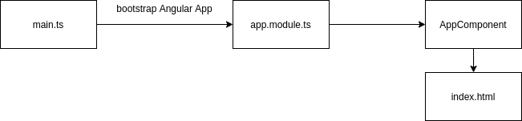

### Components

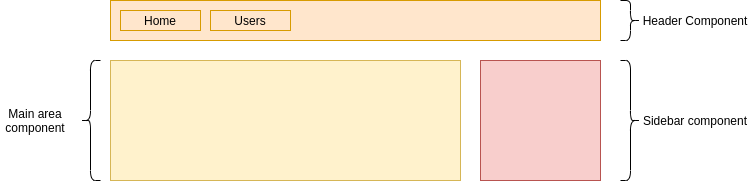

**Creating a new component**

- **Decorator:** Typescript features allowing you to enhance elements you use in code.
    - `selector:` Html tag which you will be able to use in other components.
    - `templateUrl:` Html template file path.
    
```ts
import { Component } from '@angular/core';

@Component({
    selector: 'app-server',
    templateUrl: './server.component.html'
})
export class ServerComponent {
}
```

**AppModule and Component Declaration**

```ts
import { ServerComponent } from './server/server.component';

@NgModule({
    declarations: [
        // what is a part of this specific Angular module
        AppComponent,
        ServerComponent
    ],
    imports: [
        // what is needed to work
        BrowserModule
    ],
    providers: [
        // for DI
    ],
    bootstrap: [
        AppComponent,
        // which component should be loaded as well
    ]
})
```

- Newly created component **ServerComponent** must be registered in **AppModule**.
- Angular application is group of Angular modules.
- JavaScript Module is any TypeScript or JavaScript file with code in it!

**Creating Component CLI**

```console
ng g c servers
```

**Component Template**

```ts
@Component({
  template: `<app-server></app-server>
            <app-server></app-server>`,
})
```

**Component Styles**

```ts
@Component({
// styleUrls: ['./app.component.css']
  styles: [`
    h3 {
      color: dodgerblue;
    }
  `]
})
```

**Component Selector**

```ts
@Component({
  selector: 'app-servers'
  // selector: '[app-servers]'
  // selector: '.app-servers'
})
```

**Use in a template**

```html
<app-servers></app-servers>
<!--<div app-servers></div>-->
<!--<div class="app-servers"></div>-->
```

### Databinding (communication)

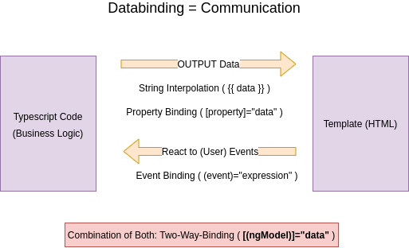

- **EventBinding:** Listen to click `(click)`
- **String Interpolation:** Output data
- **Property binding:** `[property]="data"`
- **Two way binding:** `[(ngModel)]="data"`
- **String interpolation:** `{{ data }}`

**String interpolation**

```ts
import { Component } from '@angular/core';

@Component({
    selector: 'app-server',
    templateUrl: './server.component.html'
})
export class ServerComponent {
    serverId: number = 10;
    serverStatus: string = 'offline';
    getServerStatus() {
        return this.serverStatus;
    }
}
```

```html
<p>Server with ID {{ serverId }} is {{ getServerStatus() }}</p> <!-- **String interpolation:** `{{ data }}` -->
```

**Property Binding**

```html
<button 
    class="btn btn-primary" 
    [disabled]="!allowNewServer">Add Server</button> <!-- **Property binding:** `[property]="data"` -->
```

```html
<a href="#" class="list-group-item clearfix" *ngFor="let recipe of recipes">
    <div class="pull-left">
        <h4 class="list-group-item-heading">{{ recipe.name }}</h4>
        <p class="list-group-item-text">{{ recipe.description }}</p>
    </div>
    <span class="pull-right">
        
    </span>
</a>
```

**Property Binding vs String Interpolation**

```html
<p [innerText]="allowNewServer"></p>
```

- Do not use String Interpolation with bindings.

**Event Binding**

```html
<button 
    class="btn btn-primary" 
    [disabled]="!allowNewServer"
    (click)="onCreateServer()">Add Server</button> <!-- **EventBinding:** Listen to click `(click)` -->
<p>{{ serverCreationStatus }}</p>
```

**Passing and Using Data with Event Binding**

```html
<label>Server Name</label>
<input 
    type="text"
    class="form-control"
    (input)="onUpdateServerName($event)">
<p>{{ serverName }}</p>
```

```ts
onUpdateServerName(event: any) {
    console.log(event);
    this.serverName = (<HTMLInputElement>event.target).value;
}
```

**Two-Way Databinding**

```html
<input 
    type="text"
    class="form-control"
    [(ngModel)]="serverName">    <!-- **Two way binding:** `[(ngModel)]="data"` -->
<p>{{ serverName }}</p>
```

### Directives

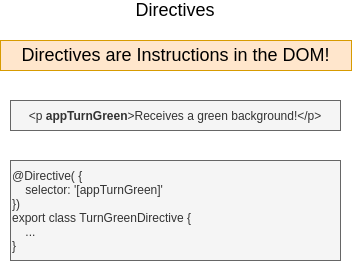

- **ngIf:** Structural directive
- **ngStyle:** Attribute directives don't add or remove elements. They only change the element they were placed to
- **ngClass**
- **ngFor**

**ngIf**

```html
<p *ngIf="serverCreated">Server was created, server name is {{ serverName }}</p>
```

**ngIf - else**

```html
<p *ngIf="serverCreated; else noServer">Server was created, server name is {{ serverName }}</p>
<ng-template #noServer>
    <p>No server was created!</p>
</ng-template>
```

**ngStyle**

```html
<p [ngStyle]="{backgroundColor: getColor()}">Server with ID {{ serverId }} is {{ getServerStatus() }}</p>
```

```ts
getColor() {
    return this.serverStatus === 'online' ? 'green' : 'red';
}
```

**ngClass (css class)**

```html
<p 
    [ngStyle]="{backgroundColor: getColor()}"
    [ngClass]="{online: serverStatus === 'online'}">
    Server with ID {{ serverId }} is {{ getServerStatus() }}
</p>
```

```ts
@Component({
    selector: 'app-server',
    templateUrl: './server.component.html',
    styles: [`
        .online {
            color: white;
        }
    `]
})
```

**ngFor**

```html
<app-server *ngFor="let server of servers"></app-server>
```

- Getting index when working with `ngFor`.

```html
<div 
    *ngFor="let logItem of log; let i = index"
    [ngStyle]="{backgroundColor: i >= 4 ? 'blue' : 'transparent'}"
    [ngClass]="{'white-text': i >= 4}"
>{{ logItem }}</div>
```

### Project setup

- Create component using CLI without spec (test) file.

```console
ng g c recipes --skipTests true
ng g c recipes/recipe-list --skipTests true
ng g c recipes/recipe-detail --skipTests true
ng g c recipes/recipe-list/recipe-item --skipTests true

ng g c shopping-list --skipTests true
ng g c shopping-list/shopping-edit --skipTests true
```

***

## Components & Data Binding

### Property & Event Binding

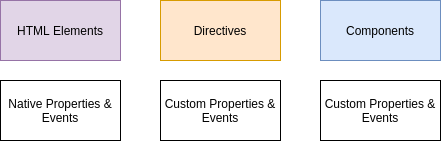

**server-element.component.ts**

```ts
import { Component, OnInit, Input } from '@angular/core';

@Component({
  selector: 'app-server-element',
  templateUrl: './server-element.component.html',
  styleUrls: ['./server-element.component.css']
})
export class ServerElementComponent implements OnInit {

  @Input('srvElement') element: {type: string, name: string, content: string};

  constructor() { }
  ngOnInit(): void {
  }
}
```

**app-component.html**

```html
<div class="container">
  <app-cockpit></app-cockpit>
  <hr>
  <div class="row">
    <div class="col-xs-12">
      <app-server-element 
        *ngFor="let serverElement of serverElements"
        [srvElement]="serverElement"></app-server-element> <!-- clue is selector we input [] into selector from other selector -->
    </div>
  </div>
</div>
```

### Binding to Custom Events

**cockpit.component.ts**

```ts
import { Component, OnInit, EventEmitter, Output } from '@angular/core';

@Component({
  selector: 'app-cockpit',
  templateUrl: './cockpit.component.html',
  styleUrls: ['./cockpit.component.css']
})
export class CockpitComponent implements OnInit {
  @Output() serverCreated = new EventEmitter<{serverName: string, serverContent: string}>();
  @Output('bpCreated') blueprintCreated = new EventEmitter<{serverName: string, serverContent: string}>();

  newServerName = '';
  newServerContent = '';

  constructor() { }

  ngOnInit(): void {
  }

  onAddServer() {
    this.serverCreated.emit({
      serverName: this.newServerName, serverContent: this.newServerContent
    });
  }

  onAddBlueprint() {
    this.blueprintCreated.emit({
      serverName: this.newServerName, serverContent: this.newServerContent
    });
  }
}
```

**app.component.ts**

```ts
import { Component } from '@angular/core';

@Component({
  selector: 'app-root',
  templateUrl: './app.component.html',
  styleUrls: ['./app.component.css']
})
export class AppComponent {
  serverElements = [{type: 'server', name: 'Testserver', content: 'Just a test!'}];
  
  onServerAdded(serverData: {serverName: string, serverContent: string}) {
    this.serverElements.push({
      type: 'server',
      name: serverData.serverName,
      content: serverData.serverContent
    });
  }

  onBlueprintAdded(blueprintData: {serverName: string, serverContent: string}) {
    this.serverElements.push({
      type: 'blueprint',
      name: blueprintData.serverName,
      content: blueprintData.serverContent
    });
  }
}
```

**app.component.html**

```html
<div class="container">
  <app-cockpit 
    (serverCreated)="onServerAdded($event)"
    (bpCreated)="onBlueprintAdded($event)"  
  ></app-cockpit> <!-- app-cockpit selector -->
  <hr>
  <div class="row">
    <div class="col-xs-12">
      <app-server-element 
        *ngFor="let serverElement of serverElements"
        [srvElement]="serverElement"></app-server-element>
    </div>
  </div>
</div>
```

***

## View Encapsulation

### Getting Access to the Template & DOM 

```html
<input 
    type="text" 
    class="form-control" 
    #serverContentInput>
```

```ts
@ViewChild('serverContentInput') serverContentInput: ElementRef;

onAddServer(nameInput: HTMLInputElement) {
    this.serverCreated.emit({
      serverName: nameInput.value, 
      serverContent: this.serverContentInput.nativeElement.value
    });
}
```

***

## Bootstraping of Angular Application

- Root Module & Component

**main.ts**

```ts
if (environment.production) {
  enableProdMode();
}

platformBrowserDynamic().bootstrapModule(AppModule).catch(err => console.error(err));
```

#### index.html

```html
<!DOCTYPE html>
<html lang="en">
  <head>
    <meta charset="utf-8" />
    <title>My todos application</title>
    <base href="/" />

    <meta name="viewport" content="width=device-width, initial-scale=1" />
    <link rel="icon" type="image/x-icon" href="favicon.ico" />
  </head>
  <body>
    <app-root></app-root> <!-- AppComponent -->
    <!-- <div>Index HTML content</div> -->
  </body>
</html>
```

**app.component.ts**

```ts
@Component({
  selector: "app-root",
  templateUrl: "./app.component.html",
  styleUrls: ["./app.component.css"]
})
export class AppComponent {
}
```

**app.component.html (view source)**

```html
<router-outlet></router-outlet>
```

***

## Components

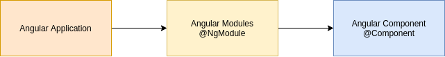

- Component:
    - Template HTML: **.component.html**
    - Style CSS: **.component.css**
    - Code TypeScript: **.component.ts**
- Types of directives in Angular:
    - Components directives
    - Structural directives
    - Attribute directives
- Key part of application:
    - AppComponent root component
- Header:
    - Items on header
- Main area
- Sidebar

### Component decorator

- Like annotations in Java:
    - `selector:` Tag name for component
    - `templateUrl:` Location of html template
    - `styleUrls:` Styles location

```ts
@Component({
    selector: 'app-servers',
    templateUrl: './servers.component.html'
})
export class ServersComponent implements OnInit {
```

- Directly define a template

```ts
template: "<h1>{{title}}</h1>",
``` 

- `{{ interpolation }}`
- Every Angular Component `@Component` has to be associated with an Angular Module `@NgModule`.

### To use component

```ts
@NgModule({
  declarations: [
    AppComponent,
    ServersComponent
  ],
  imports: [
    BrowserModule,
    FormsModule
  ],
  providers: [],
  bootstrap: [AppComponent]
})
export class AppModule { }
```

### Display component in template

```html
<div class="container">
    <app-servers></app-servers>
</div>
```

### Creating component using CLI

```console
ng g c videogames
```

### Components template and styles

```ts
@Component({
    selector: 'app-server',
    template: '
        <app-server></app-server>
        <app-server></app-server>',
    styles: [`
        .online {
            color: white;
        }
    `]
})
export class ServerComponent {
```

### Component selector 

- Unique identifier of component

```ts
@Component({
    selector: '[app-servers]', // enclosed attribute in []
    selector: '.app-servers', // enclosed attribute in []
})
```

- Use in template.

```html
<app-servers></app-servers>
<div app-servers></div>
<div class="app-servers"></div>
```

***

## Databinding

- **Databinding === Communication**


- Supported binding DOM Component:
    - `{{ value }}`
    - `[property]=value`
    - `(event)="functionHandler"`
    - `[(ng-model)]="property"`

### String Interpolation

```ts
userIP: number = 11.11.10.10;
userLocation: string = 'Nevada';
enableButton: boolean = false;

constructor() {
    this.enableButton = true;
}

getUserLocation() {
    return this.userLocation;
}
```

```html
<p>{{ 'User' }} address {{ userIP }} / {{ getUserLocation() }} </p>
```

### Property binding

```html
<button
    class="btn btn-primary"
    [disabled]="!enableButton">Submit</button>
<p>{{ enableButton }}</p>
<p [innerText]="enableButton"></p>>
```

### Event binding

```html
User Name: <input type="text" name="username" value="{{username}}" /> <!-- string interpolation -->
Password: <input type="password" name="password" value="{{password}}" />

<button (click)="handleLogin()">Login</button> <!-- event binding -->
```

- Take data from view element, 2 way data binding, banana in box approach

```html
User Name: <input type="text" name="username" [(ngModel)]="username" />
Password: <input type="password" name="password" [(ngModel)]="password" />

<button (click)="handleLogin()">Login</button>
```

- Summing up:
    - `{{username}}:` String interpolation, bind up view to value of component property
    - `(client)="handleLogin()":` Event binding, user event to component event
    - `[(ngModel)]="username":` Two way data binding, `ngModel` -> angular directive adding on top of regular html

```ts
buttonSays: string = "Waiting"; // component property
onButtonClicked() { // component event
    this.buttonSays = "Button was clicked";
}
```

```html
<button
    class="btn btn-primary"
    [disabled]="!enableButton"
    (click)="onButtonClicked">Click me</button>
<p>{{ buttonSays }}</p>
```

- Passing data using event binding `$event`

```html
<label>Text to display</label>
<input
    type="text"
    class="form-control"
    (input)="onUpdateButton($event)">
<p>{{ customerName }}</p>

<button
    class="btn btn-primary"
    [disabled]="!enableButton"
    (click)="onButtonClicked">Click me</button>
<p>{{ buttonSays }}</p>
```

```ts
customerName = '';

onUpdateButton(event: Event) {
    console.log(event);
    this.customerName = (<HTMLInputElement>event.target).value;
}
```

```html
  <fieldset class="form-group">
    <label>Target date</label>
    <input
      type="date"
      [(ngModel)]="todo.targetDate"
      class="form-control"
      name="targetDate"
      required="required"
    />
  </fieldset>
```

- Is equivalent to.

```html
  <fieldset class="form-group">
    <label>Target date</label>
    <input
      type="date"
      [ngModel]="todo.targetDate"
      (ngModelChange)="todo.targetDate = $event"
      class="form-control"
      name="targetDate"
      required="required"
    />
  </fieldset>
```

### Two way binding

- To use two way binding FormsModule need to be added to `imports[]` array in the **AppModule**

```html
<input
    type="text"
    class="form-control"
    [(ngModel)]="customerName">
<p>{{ customerName }}</p>
```

***

## Directives

- Directives are Instructions in the DOM!
    - Components
    - `<p lightsUp>5 lights light up</p>`

```ts
@Directive({
    selector: '[lightsUp]'
})
export class LightsUpDirective {
}
```

### ngIf (structural directive)

```html
<p *ngIf="userCreated; else noUser">{{ customerName }}</p>
<ng-template #noUser>
    <p>No customer</p>
</ng-template>
```

```html
<small *ngIf="invalidLogin">{{ errorMessage }}</small>

<div>
  User Name: <input type="text" name="username" [(ngModel)]="username" />
  Password: <input type="password" name="password" [(ngModel)]="password" />
  <button (click)="handleLogin()">Login</button>
</div>
```

### ngStyle (attribute directive)

```ts
getColor() {
    return this.status === 'online' ? 'green' : 'red';
}
```

```html
<p [ngStyle]="{ 'background-color' : getColor() }">User status</p>
```

### ngClass, dynamically add or remove css classes

```html
<p [ngStyle]="{ 'background-color' : getColor() }"
   [ngClass]="{ online: userStatus === 'online'  }">User status</p>
```

### ngFor

```html
<app-user *ngFor="let user of users"></app-user>

  <tbody>
    <!-- for (Todo todo : todos) -->
    <tr *ngFor="let todo of todos">
      <td>{{ todo.id }}</td>
      <td>{{ todo.description }}</td>
    </tr>
  </tbody>
```

***

## Property & Event Binding

- HTML Elements :arrow_forward: Directives :arrow_forward: Components
- Native Properties & Events  :arrow_forward: Custom Properties & Events  :arrow_forward: Custom Properties & Events

### Lifecycle

1. `ngOnChanges:` Called after a bound input property changed
2. `ngOnInit:` Called once the component initialized
3. `ngDoCheck:` Called during every change detection run
4. `ngAfterContentInit:` Called after content (ng-content) has been projected into view
5. `ngAfterContentChecked:` Called every time the projected content has been checked
6. `ngAfterViewInit:` Called after the content's view (and child views) has been initialized
7. `ngAfterViewChecked:` Called every time the view (and child views) has been checked
8. `ngOnDestroy:` Called once the component is about to be destroyed

### Attribute vs Structural

- Attribute Directives:
    - Looks like normal HTML Attribute
    - Only affect element they are added to
- Structural Directives:
    - Looks like normal HTML Attribute, have a leading `*`
    - Affects on whole area in DOM

### Services & Dependency Injection

- **Service:** Logic common for multiple components.

```console
ng g s service/authentication
```

- Normal class with `@Injectable` annotation, i can inject in any place I want use
- Get info about your services from `@NgModule` provider so that it can use the dependencies in components
- Services are singletons shared across components
- Service is place where app business logic is
- Should have only one purpose
- `@Injectable` annotation to make service ready to be injected

```ts
// Router
// Angular.giveMeRouter
// Dependency Injection
// Find a router and inject to this component
// router (constructor argument) will be available as member variable
constructor(private router: Router, private authenticate: AuthenticationService) {}
```

### Hierarchical Injector

- **AppModule:** Same Instance of Service is available Application-wide
- **AppComponent:** Same Instance of Service is available from all Components (but not for other Services)
- **Any other Component:** Same Instance of Service is available for the Component and all its child components

### Routing

- An Relative path, appends to current path.

### Observables

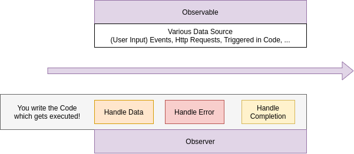

**Operators**

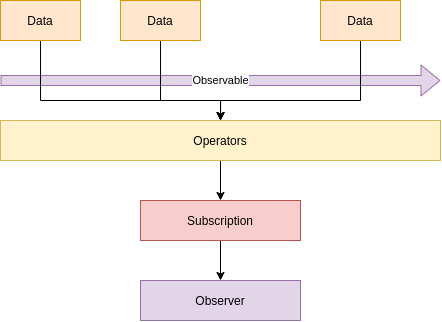

## Angular and forms

```html
<form>
    <label>Name</label>
    <input type="text" name="name">
    <label>Mail</label>
    <input type="text" name="email">
    <button type="submit">Save</button>
</form>
```

**Template driven**

- Angular infers the Form Object from the DOM

**Reactive**

- Form created programmatically and synchronized with the DOM

**Pipes**

- Allows transform output in a template

```html
<p>{{ username | uppercase }}</p>
```

- Create a custom pipe, implements PipeTransform, override transform method
- Pipe arguments after **:**, for example **shorten:8**

***

## Compilation

### Just in Time

Development :arrow_forward: Production :arrow_forward: App download in browser :arrow_forward: 
Parses and compiles a template to Java Script

### Ahead of Time

Development :arrow_forward: Parses and compiles a template to Java Script :arrow_forward: Production :arrow_forward: 
App download in a browser
- Faster Startup, parsing and compilation doesn't happen in a browser
- Templates checked during Development
- Smaller File Size

***

## Deployment

- Build App
- AOT Compilation
- Set base element
- Return **index.html** in case of 404 error

**Questions**

- Convert String to number use **+: this.id = +params['id'];**
- Make link active: **routerLinkActive="active"**

**Change detector**

- Each component has own change detector
- You can eventually also trigger manually the change detector
- When a component change it triggers change detector in all other components
- changeDetection input parameter of `@Component`, you can change strategy
- **Zone.js** library for Angular2 is used in change detection
- Zone trigger change detection for:
    - DOM Events fired
    - XHR call get resolved
    - Timer triggered (setInterval)

### Http call

- HttpModule:
    - **@angular/http**
    - **import HttpModule** in AppModule.ts
    - Http Module use XMLHttpRequest (XHR) to transfer data from the server to the client
    - RequestOptions to add options and headers to the calls
- RequestHeader
- RequestOptions
- Response
- Supported REST methods:
    - GET
    - POST
    - PUT
    - DELETE
    - PATCH

### Single page application

- Spring boot application packaging war
- **angular.json**

```json
"outputPath": "../src/main/resources/static",
"outputPath": "dist",
```

### Session Storage

- Associate with browser window
- Allows us to access to session storage object
- When close browser no session reloaded
- You can only access data from **Local/Session Storage** that was set from your website
- Values set into Local Storage persist across browser restarts. Hence, it's less secure!

```ts
authenticate(username, password) {
    if (username === "panda" && password === "panda") {
        sessionStorage.setItem("authenticatedUser", username);
        return true;
    } else {
        return false;
    }
}

isUserLoggedIn() {
    const user = sessionStorage.getItem("authenticatedUser");
    return !(user === null);
}

logout() {
    sessionStorage.removeItem("authenticatedUser");
}
```

### Guard routes canActivate

```ts
export class RouteGuardService implements CanActivate {
  constructor() {}

  canActivate(route: ActivatedRouteSnapshot, state: RouterStateSnapshot) {
    return true;
  }
}
```

```ts
const routes: Routes = [
  { path: "", component: LoginComponent, canActivate: [RouteGuardService] }, // canActivate, RouteGuardService
  { path: "login", component: LoginComponent }
];
```

### HttpClient

```ts
import { Injectable } from "@angular/core";
import { HttpClient } from "@angular/common/http";

@Injectable({
  providedIn: "root"
})
export class WelcomeDataService {
  constructor(private http: HttpClient) {}

  executeHelloWorldBeanService() {
    // console.log("execute hello world bean service");
    return this.http.get("http://localhost:8080/hello-world-bean");
  }
}
```

### Commands

```console
ng new project-name 
npm install
ng g d directive-name
ng g c page-not-found
npm install --save rxjs-compat
```

**Ahead of time compilation** 

```console
ng build --prod --aot
ng build --prod --aot --base-href /application/
ng build --watch
npm install rxjs-compat --save
// React, Redux, Axios
npm i redux react-redux redux-thunk
npm i axios
```

**Angular material**

```console
npm i --save @angular/cdk @angular/material @angular/animations hammerjs
```

***

## Angular Http Requests

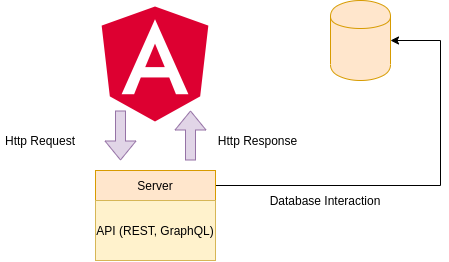

### Anatomy of a Http Request

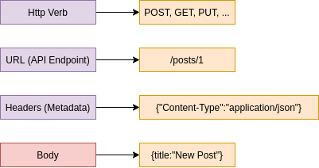

### Authentication

**How Authentication Works**

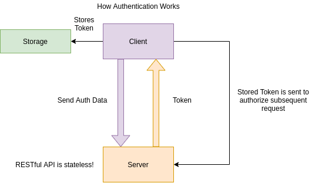

### Dynamic Components

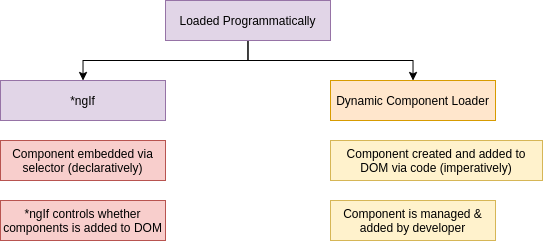

***

## Modules

**What are "Modules"?**

- Angular analyzes **NgModules** to "understand" your application and its features
- Angular modules define all building blocks your app uses: Components, Directives, Services
- An app requires at least one module **AppModule** but may split into multiple modules
- Core Angular features are included in Angular modules (e.g. **FormsModule**) to load them only when needed
- You can't use a feature/building block without including it in a module

**Working with multiple modules (feature modules)**

- Shared Modules
- CoreModule
- Lazy Loading
- Services & Modules

**Modules**

- AppModule:
    - Service available app-wide
    - Use root injector
    - **Should be the default!**
- AppComponent (or other Components): 
    - Service available in component tree
    - Use component-specific injector
    - **Use if service is only relevant for component tree**
- Eager-loaded Module: 
    - Service available app-wide
    - Use root injector
    - **Avoid this!**
- Lazy-loaded Module:
    - Service available in loaded module
    - Use child injector
    - **Use if service should be scoped to loaded module**

### Ahead of Time (AoT) vs Just in Time (JiT) Compilation

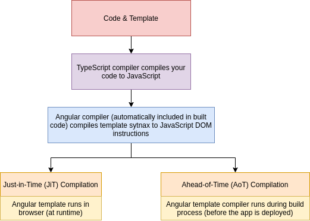

```console
ng build --prod
```

- Generated **dist** folder

***

## Deployment

- Use & check environment variables
- Polish & test code
- `ng build --prod:` Uses ahead-of-time compilation
- Deploy build artifacts (generated files) to static host - Because it's only HTML, JS, CSS!

***

## NgRx

**What is Application State?**

```console
ng add @nguniversal/express-engine --clientProject ng4-complete-guide

npm run build:ssr
npm run serve:ssr
```

**NestJS**

```console
ng add @nestjs/ng-universal
```

### Compiling an Angular project 

```console
ng build -c local

ng build --prod

cd /dist/<PROJECT_NAME>
# copy content to server to deploy app
```

**configure nginx**

```conf
events {
  worker_connections  4096;  ## Default: 1024
}

http {
   map $http_upgrade $connection_upgrade {
       default upgrade;
      '' close;
   }

   include /etc/nginx/mime.types;

   server {
      listen 80;

      location / {
         root /usr/share/nginx/html;
         try_files $uri $uri/ /index.html;
      }
    }
}
```

**Dockerfile**

```dockerfile
FROM nginx:1.14.0-alpine

MAINTAINER Your name "youremail@server.com"

RUN apk add --update bash && rm -rf /var/cache/apk/*

RUN rm -rf /usr/share/nginx/html/*

COPY /dist/YOUR_PROJECT_NAME/ /usr/share/nginx/html

COPY nginx.conf /etc/nginx/

CMD ["nginx", "-g", "daemon off;"]
```

## The Observer Design Pattern

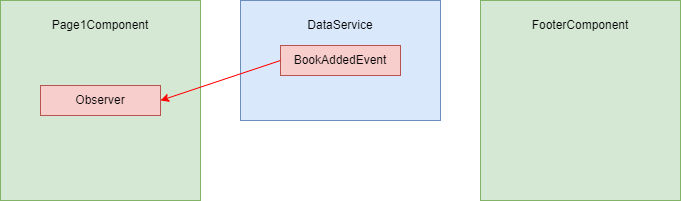

## Testing

- Run test

```
ng test
```


