# Performance and Memory Management

## What happens inside the JVM?

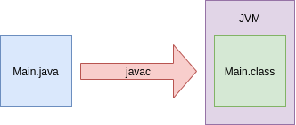

**Traditional interpreted language**

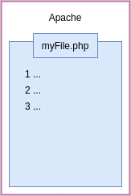

### JVM bytecode interpretation

**Just In Time (JIT) compilation**

- Code runs faster the longer it is left to run. VM can profile your code.

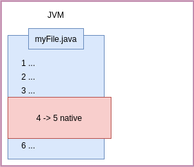

### Compiler Flags

```
-XX:+PrintCompilation

java -XX:+PrintCompilation main.Main 10
```

### JVM JIT Compilers

```
java -XX:+UnlockDiagnosticVMOptions -XX:+LogCompilation main.Main 5000
```


**Tuning the code cache size**

```
VM warning: CodeCache is full. Compiler has been disabled.
```

```
-XX:+PrintCodeCache
```

- InitialCodeCacheSize
- ReservedCodeCacheSize
- CodeCacheExpansionSize

```console
java -XX:ReservedCodeCacheSize=28m -XX:+PrintCodeCache main.Main 5000
```

**Remotely monitoring the code cache with JConsole**

```
/usr/lib/jvm/java-11-amazon-corretto/bin/jconsole
```

### The differences between 32 bit and 64 bit JVM

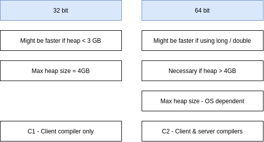

**Which compiler to use at runtime**

- Client compilation, quicker startup time.

```
-client

java -client -XX:+PrintCompilation main.Main 15000
```

**JVM Compiler flags**

- `-client`
- `-server`
- `-d64`

**Turn off Tiered Compilation**

- Run in interpreted mode only.

```
-XX:-TieredCompilation

java -XX:-TieredCompilation main.Main 5000
```

**Native Compilation Tuning**

```
-XX:CICompilerCount=n

-XX:CompileThreshold=n
```

```console
java -XX:+PrintFlagsFinal
java -XX:+PrintFlagsFinal | grep CICompilerCount
```

- Check all running java processes.

```console
jps

jinfo -flag CICompilerCount <PID>

java -XX:CICompilerCount=6 -XX:+PrintCompilation main.Main 15000
```

## How Memory Works

- Objects are stored on the heap.
- Variables are a reference to the object.
- Local variables are stored on the stack.


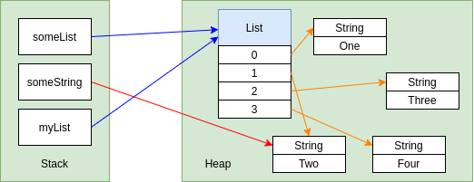

### Passing Values

- For objects passed into methods, the REFERENCE to the object is passed BY VALUE.

### The final Keyword

```java
final Customer c = new Customer("John");
```

```java
final Customer c;
c = new Customer("John");
c = new Customer("Susan"); // compile error

s.setName("Susan"); // ok
```

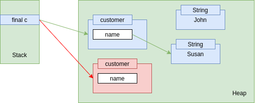

## Escaping References

```java
public class CustomerRecords {
    private Map<String, Customer> records;
    
    public CustomerRecords() {
        this.records = new HashMap<String, Customer>();
    }

    public void addCustomer(Customer c) {
        this.records.put(c.getName(), c);
    }

    public Map<String, Customer> getCustomers() {
        return this.records; // problem: violate encapsulation
    }   
}
```

**1. Duplicating collections**

- Creating new collection in memory.

```java
public Map<String, Customer> getCustomers() {
    return new HashMap<>(this.records); // duplicating collections
}  
```

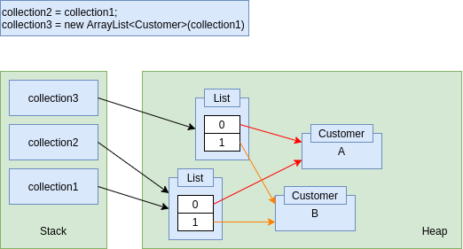

**2. Using Immutable Collections**

```java
public Map<String, Customer> getCustomers() {
//    return Collections.unmodifableMap(records); // JDK <= 10 always create copy

    return Map.copyOf(records); // JDK >= 11 create copy if version not already unmodifable
}  
```

**3. Duplicating Objects**

```java
public Customer find(String name) {
    return new Customer(records.get(name));
}
```

**4. Using interfaces to create immutable objects**

```java
public interface ReadonlyCustomer {
    String getName();
}
```

**5. Using modules to hide implementation**

## The Metaspace

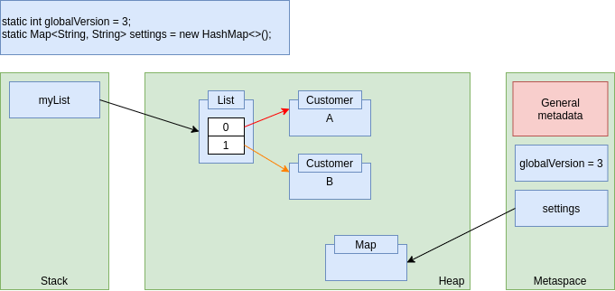

### Public vs Private

```java
public class Customer {
    private Integer id;
    public String name;
    // ...
}
```

```java
Customer c = new Customer();
c.name = "Maciek";
```

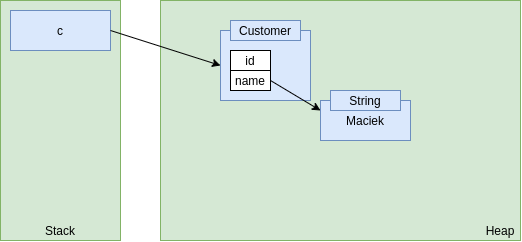

### Java 7 - the PermGen

```
java.lang.OutOfMemoryError:PermGen
```

```
-XX:PermSize=N
-XX:MaxPermSize=N
```

### Are objects always on the heap?

- Sometimes JVM created objects on the stack, based on most efficient choice.

### String pool

## JVM Tuning - Flags

- HashMap

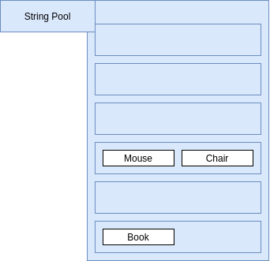

```
-XX:+PrintStringTableStatistics
```

```
-XX:StringTableSize=120121
```

### Tuning JVM Heap Size

```
java -XX:+UnlockDiagnosticVMOptions -XX:+PrintFlagsFinal main.Main 5000
java -XX:+UnlockDiagnosticVMOptions -XX:+PrintFlagsFinal main.Main 5000 | grep MaxHeapSize
java -XX:+UnlockDiagnosticVMOptions -XX:+PrintFlagsFinal main.Main 5000 | grep InitialHeapSize
```

```console
java -XX:MaxHeapSize=600m -XX:+PrintStringTableStatistics -XX:StringTableSize=120121 main.Main 5000 


java -XX:InitialHeapSize=1g -XX:+PrintStringTableStatistics -XX:StringTableSize=120121 main.Main 5000 
```

**JVM Tuning**

- `-XX:+PrintStringTableStatistics`: How big String pool is.
- `-XX:StringTableSize=n`: Change number of buckets. 
- `-XX:MaxHeapSize=n`: **-Xmx**
- `-XX:InitialHeapSize=n`: **-Xms**
- `-XX:+UnlockDiagnosticVMOptions`: Default values of Max and Initial Heap Size.
- `-XX:+PrintFlagsFinal`

## Garbage Collection

### Managed Languages

- Java works out when objects are no longer needed.
- Memory leaks shouldn't be possible in Java.
- Garbage Collection is the process to free up memory.

```
Any object on the heap which cannot be reached through a reference from the stack is "eligible for garbage collection".
```

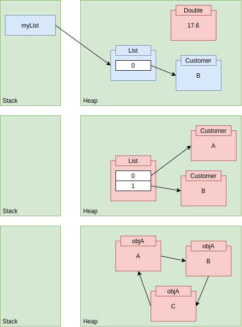

- Java 11 garbage collector can give unused memory back to the OS.

**When should you tell GC to run?**

- Evaluate performance of some code block.
- It is recommended to never run **System.gc()**.

## Monitoring the Heap

### Memory Leaks

- Memory leaks shouldn't be possible in Java.
- **Soft leaks** - when an object remains referenced when no longer needed.

```
jvisualvm
```

### Generating a Heap Dump

- Use **jvisualvm** (Java VisualVM) - click **Heap Dump** button.
- Command line argument:
    - **-XX:+HeapDumpOnOutOfMemoryError -XX:HeapDumpPath=someFilePath**

### Viewing a heap dump

- Use **Memory Analyzer (MAT)** from eclipse.
    - Also this tool can get Heap Dump.

## Generational GC

### Garbage Collection

- The "Mark and Sweep" process:

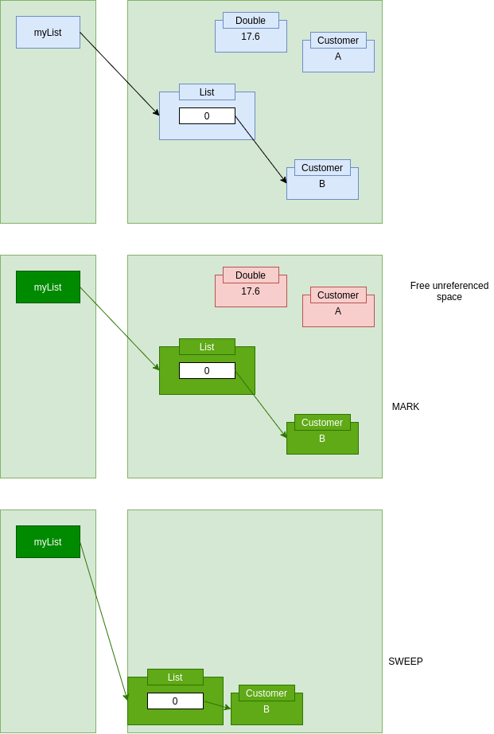

### Generational Garbage Collection

- Most objects don't live for long.
- If an object survives it is likely to live forever.
- Minor collection: GC on young generation space.
- Major collection: GC on old generation space.

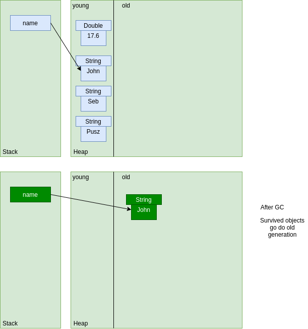

### Young generation - survivor spaces

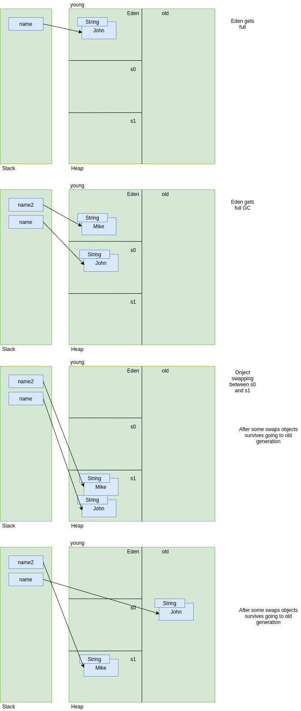

## GC Tuning & Selection

```
-verbose:gc
```

### Tuning off automated heap allocation sizing

```
-XX:-UseAdaptiveSizePolicy
```

```console
jinfo -flag UseAdaptiveSizePolicy <PID> 

jinfo -flag UseAdaptiveSizePolicy 62794
```

### Tuning Garbage Collection

- **-XX:NewRatio=n**

```
jinfo -flag NewRatio <PID>
2
# Old gen will be 2x bigger that young
```

- **-XX:SurvivorRatio=n**

```
jinfo -flag SurvivorRatio <PID>
8
# s0 and s1 should be 1/8 th of young generation
```

- **-XX:MaxTenuringThreshold=n**
    - How many times object survives before moving to old generation.
    
```
jinfo -flag MaxTenuringThreshold <PID>
15
```

### Choosing a Garbage Collector

- Types of collectors:
    - Serial: **-XX:+UseSerialGC**
    - Parallel: **-XX:+UseParallelGC**
    - Mostly Concurrent: 
        - **-XX:UseConcMarkSweepGC**
        - **-XX:+UseG1GC**

### How G1 works

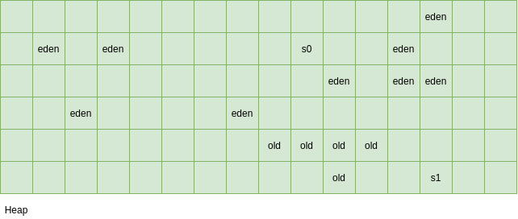

### Tuning G1

```
-XX:ConcGCThreads=n

-XX:InitiatingHeapOccupancyPercent=n
```

### String De-duplication

```
-XX:UseStringDeDuplication
```

- Only available if using G1.

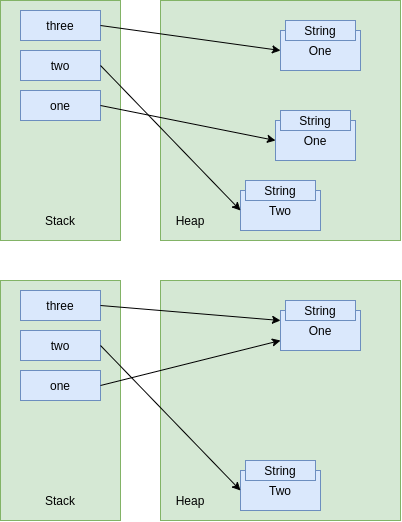

## Using a profiler

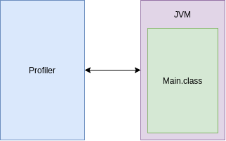

### Flight Recording

```
-XX:StartFlightRecording=delay=2min,
duration=60s,name=Test,
filename=recording.jfr,
settings=profile
```

## Assessing Performance

- Complications:
    - Native Compilation
    - Garbage Collection
    
### Benchmarking

- Microbenchmark - measuring the performance of a small piece of code
- More Complications:
    - Assessing in isolation
    - Different Hardware
    
**Turn off native compilation**

```
-XX:-TiredCompilation
```

**Check whether native compilation took place**

```
-XX:+PrintCompilation
```

## Benchmarking with JHM

## How Lists Works

### Types of List

- ArrayList
- CopyOnWriteArrayList
- LinkedList
- AttributeList
- RoleList
- RoleUnresolvedList
- Stack
- Vector

**CopyOnWriteArrayList**

- Consider using it when:
    - Multi-threaded application
    - Multiple threads accessing the same list
    - Lots of iterations / reads
    - Few writes / additions / deletions

**ArrayList**

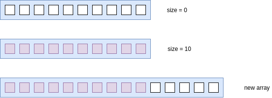

- Resizing ArrayList cost performance.
- Allocate size in advance to not require resizing.

```java
List<Book> books = new ArrayList<Book>(500000);
```

**Vector**

- Thread safe

**Stack**

- LIFO operations

**LinkedList**


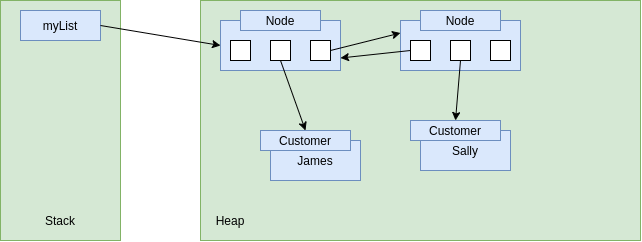

**Choosing List**

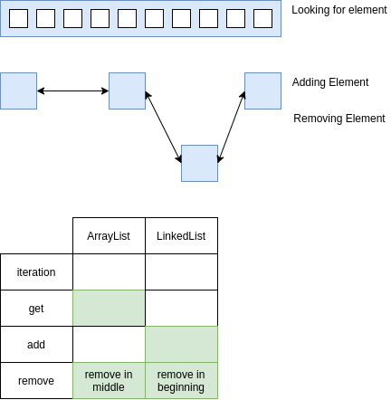

**Sorting Lists**

- ArrayList and LinkedList using Arrays.sort(). Difference is LinkedList is converted toArray() before sort.
- Pretty much the same performance.

## How maps work

### HashMap

```java
Map<Integer, Book> books = new HashMap<>();

books.put(3, book1);
```

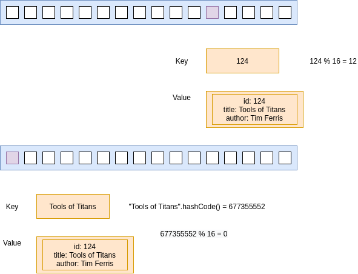

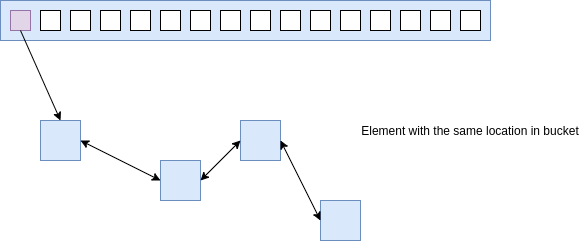

**HashMap factor**


```java
Map<String, Book> books = new HashMap<>(500000, 0.6f); // 0.6f factor
```

- Larger array gives better performance, than smaller and navigate within linkedlist of the same bucket entry.

**Rules for hashcodes**

- HashCodes:
    - Good range of numbers
    - Equal objects must have equal hashcodes

**LinkedHashMap**

- HashMap:
    - Items iterate in a "random" order
- LinkedHashMap:
    - Items iterate in a defined order

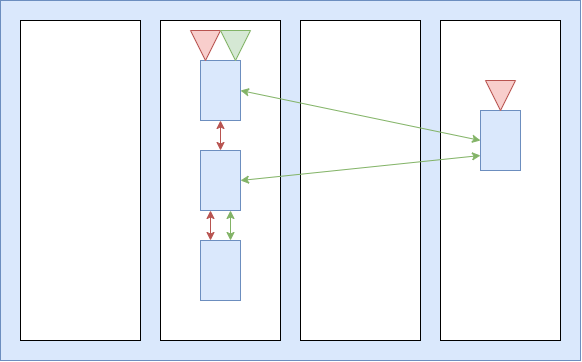

**Hashtable and TreeMap**

- Hashtable thread safe HashMap
- TreeMap maintains insertion order insert (a,c,b,d) -> retrieve (a,b,c,d)

## Coding Choices

- Primitives vs Objects
- BigDecimal vs Double
- StringBuilder vs Concatenating Strings
    - StringBuilder better performance
    - Strings in single line concatenation, optimized by JVM. JVM detects that and convert to StringBuilder.
- Loops vs Streams

## GraalVM

- Alternative JVM
- Alternative Java Compiler
- Native Compiler (no JVM required)
- Using the Graal compiler with OpenJDK 11 (Linux Only)

```
-XX:+UnlockExperimentalVMOptions
-XX:+EnableJVMCI
-XX:+UseJVMCICompiler
```

## Other JVM Languages

- Java
- JRuby
- Clojure
- Kotlin
- Scala
- Groovy

**javap**

- Look at bytecode using **javap**

**decompiler**

- CFR


