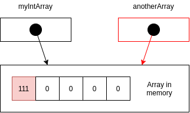

# Java 11

## OOP

- Object: State, behavior.
- Class: Template for objects.

### Reference vs Object vs Instance vs Class

- A class is a blueprint for a house, using the blueprint (plans) we can build as many houses as we like based on
those plans. 
- Each house you build (in other words **instantiate** using the **new** operator) is an `Object` also known as an instance.
- Each house you build has an address (a physical location). 
- In other words if you want to tell someone where you live, you give them your address (perhaps written on a piece of paper). 
- This is known as a **reference**.
- You can copy that **reference** as many times as you like but there is still just one house. 
- In other words we are copying the paper that has address on it not the house itself.
- We can pass **references** as **parameters** to **constructors** and **methods**.
- In Java you always have **reference** to an **object** in memory, there is no way to access an **object** directly
everything is done using a **reference**.

### this vs super

- The keyword **super** is used to access / call the parent class members (variables and methods).
- The keyword **this** is used to call the current class members (variables and methods). This is required when we have
a parameter with the same name as an instance variable (field).
- We can use both of them anywhere is a class except static area (the static block or a static method).
Any attempt to do so will lead to compile-time error.

**Keyword this**

- The keyword **this** is commonly used with **constructors** and **setters**, and optionally in getters.

```java
class House {
    private String color;
    
    public House(String color) {
        // this keyword is required, same parameter name as field
        this.color = color;
    }
    
    public String getColor() {
        // this is optional
        return color;
    }   
    
    public void setColor(String color) {
        // this keyword is required, same parameter name as field
        this.color = color; 
    }   
}
```

**Keyword super**

- The keyword **super** is commonly used with **method overriding**, when we call a method with the same name from the 
parent class. 
- In example, we have a method `printMethod` that calls `super.printMethod`.

```java
class SuperClass { // parent class aka super class
    public void printMethod() {
        System.out.println("Printed in Superclass.");
    }
}

class SubClass extends SuperClass { // subclass aka child class
    // overrides method from parent
    @Override
    public void printMethod() {
        super.printMethod(); // calls method in SuperClass (parent)
        System.out.println("Printed in Subclass");
    }
}

class MainClass {
    public static void main(String[] args) {
        SubClass s = new SubClass();
        s.printMethod();
    }
}
```

**this() vs super() call**

- In Java, we have the **this()** call, and the **super()** call. Notice the braces it is known as a call since it looks like 
a regular method call.
- Use **this()** to call a constructor from another overloaded constructor is the same class.
- The call to **this()** can be used only in a constructor, and it must be the first statement in a constructor.
- It's used with constructor chaining, in other words when one constructor calls another constructor, and helps to
reduce duplicated code.
- The only way to call a parent constructor is by calling **super()**. This calls the parent constructor.
- The Java Compiler puts a default call to **super()** if we don't add it, and it is always the no-args **super** which is
inserted by compiler (constructor without arguments).
- The call to **super()** must be the first statement in each constructor.
- Even Abstract classes have constructors, although you can never instantiate an abstract class using the new keyword.
- An abstract class is still a **super** class, so its constructors run when someone makes an instance of a 
concrete subclass.
- A constructor can have a call to **super()** or **this()** but never both.

```java
class Rectangle {
    private int x;
    private int y;
    private int width;
    private int height;
        
    // 1st constructor
    public Rectangle() {
        this(0, 0); // calls 2nd constructor
    }

    // 2nd constructor
    public Rectangle(int width, int height) {
        this(0, 0, width, height); // calls 3rd constructor
    }   
    
    // 3rd constructor
    public Rectangle(int x, int y, int width, int height) {
        // initialize variables
        this.x = x;
        this.y = y;
        this.width = width;
        this.height = height;
    }
}
```

- The 1st constructor calls the 2nd, the 2nd constructor cals the 3rd constructor, and 3rd constructor initializes 
the instance variables.
- The 3rd constructor does all the work.
- No matter what constructor we call, the variables will always be initialized in 3rd constructor.
- This is known as **constructor chaining**, the last constructor has the "responsibility" to initialize the variables.

**super() call example**

```java
class Shape {
    private int x;
    private int y;

    public Shape(int x, int y) {
        this.x = x;
        this.y = y;
    }   
}

class Rectangle extends Shape {
    private int width;
    private int height;

    // 1st constructor
    public Rectangle(int x, int y) {
        this(x, y, 0, 0); // calls 2nd constructor
    }

    // 2nd constructor
    public Rectangle(int x, int y, int width, int height) {
        super(x, y); // calls constructor from parent (Shape)
        this.width = width;
        this.height = height;
    }
}
```

- The parent constructor will initialize `x`, `y` variables while 2nd Rectangle constructor will initialize the `width` 
and, `height` variables.

## Method overriding vs overloading

#### Method Overloading

- Method **Overloading** means providing two or more separate methods in a class with **same name** but 
**different parameters**.
- Method return type may or may not be different and that allows us to **reuse** the same method name.
- **Overloading** is very handy, it reduces duplicated code and we don't have to remember multiple method names.
- **Overloading** does not have anything to do with **polymorphism** but Java developers often refer to
overloading as Compile Time Polymorphism.
- In other words the compiler decided which method is going to be called based on the method name, return type and
argument list.
- We **can overload static** and **instance** methods.
- Usually **Overloading** happens inside a single class, but a method can also be treated as **Overloaded** in the
subclass of that class.
- That is because a **subclass inherits** one version of the method from the parent class and then the subclass can have 
another overloaded version of the method.

**Method Overloading Rules**

- Methods will be considered overloaded if both follow the following rules:
    - Methods must have the same method name.
    - Methods must have different parameters.
- If methods follow the rules above then they may or may not:
    - Have different return types.
    - Have different access modifiers.
    - Throw different checked or unchecked exceptions.    
    
```java
class Dog {
    public void bark() {
        System.out.println("woof");
    }

    public void bark(int number) { // same name different parameters
        for (int i = 0; i < number; i++) {
            System.out.println("woof");
        }
    }
}
```    

### Method Overriding

- Method **Overriding** means defining a method in a child class that already exists in the parent class with same
signature (same name, same arguments).
- By extending the parent class the child class gets all the methods defined in the parent class (those methods are
also known as derived methods).
- Method **Overriding** is also known as **Runtime Polymorphism** and **Dynamic Method Dispatch**, because the method
that is going to be called is decided at runtime by the JVM.
- When we **Override** a method it's recommended to put **@Override** immediately above the method definition.
- This is an annotation that the compiler reads and will then show us an error if we don't follow overriding rules
correctly.
- We **can't override static** methods **only instance** methods.
- There are also some **important points** about method overriding to keep in mind:
    - **Only inherited methods can be overriden**, in other words methods can be overridden only in child classes.
    - **Constructors and private methods cannot be overridden**.
    - Methods that are final cannot be overridden.
    - A subclass can use **super.methodName()** to call the superclass version of an overridden method.

**Method Overriding Rules**

- Method will be considered overridden if we follow these rules:
    - It must have same name and same arguments.
    - Return type can be a subclass of the return type in the parent class.
    - It can't have a lower access modifier.
    - For example if the parent method is protected then using private in the child is not allowed but using public
    in the child would be allowed.

```java
// ***** OVERRIDING *****
class Dog {
    public void bark() {
        System.out.println("woof");
    }
}

class GermanShepherd extends Dog {
    @Override
    public void bark() { // same name, same parameters
        System.out.println("woof woof woof");
    }
}
```

#### Recap

| Method Overloading | Method Overriding |
|---|---|
| Provides functionality to reuse a method name with different parameters. | Used to override a behavior which the class has inherited from the parent class. |
| Usually in a single class but may also be used in a child class. | **Always in two classes** that have a child-parent or IS-A relationship. |
| **Must have** different parameters. | **Must have** the same parameters and same name. |
| May have different return types. | Must have the same return type of covariant return type (child class). |
| May have different access modifiers (private, protected, public). | **Must NOT** have a lower modifier but may have a higher modifier. |
| May throw different exceptions. | **Must NOT** throw a new or broader checked exception. |

**Covariant return type**

```java
class Burger {
    // fields, methods ...
}

class HealthyBurger extends Burger {
    // fields, methods ...
}

class BurgerFactory {
    public Burger createBurger() {
        return new Burger();
    }
}

class HealthyBurgerFactory extends BurgerFactory {
    @Override
    public HealthyBurger createBurger() {
        return new HealthyBurger();
    }
}
```

## Static vs Instance methods

### Static Methods

- **Static methods** are declared using a **static** modifier.
- **Static methods can't** access instance methods and instance variables directly.
- They are usually used for operations that don't require any data from an instance of the class (from 'this').
- **this** keyword is the current instance of a class.
- In **static methods** we can't use the **this** keyword.
- :star: Whenever you see a method that **does not use instance variables** that method should be declared as a **static method**.
- For example main is a static method, and it is called by the JVM when it starts an application.

**Static Method Example**

```java
class Calculator {
    public static void printSum(int a, int b) {
        System.out.println("sum= " + (a + b));
    }
}

public class Main {
    public static void main(String[] args){
        Calculator.printSum(5, 10);
        printHello(); // shorter form of Main.printHello(); 
    }
    
    public static void printHello() {
        System.out.println("Hello");
    }
}
```

### Instance Methods

- **Instance methods** belong to an instance of a class.
- To use an **instance method** we have to instantiate the class first usually by using the **new** keyword.
- **Instance methods** can access instance methods and instance variables directly.
- **Instance methods** can also access static methods and static variables directly.

**Instance Methods Example**

```java
class Dog {
    public void bark() {
        System.out.println("woof");
    }
}

public class Main {
    public static void main(String[] args){
        Dog rex = new Dog(); // create instance
        rex.bark(); // call instance method
    }
}
```

**Static or Instance Method?**


## Static vs Instance Variables

### Static Variables

- Declared by using the keyword **static**.
- **Static variables** are also known as **static member variables**.
- Every instance of that class **shares** the same static variables.
- If changes are made to that variable, all other instances will see the same effect of the change.
- **Static variables** are not used very often but can sometimes be very useful.
- For example when reading user input using **Scanner** we will declare scanner as a static variable.
- That way **static methods** can access it directly.

```java
class Dog {
    private static String name;
    
    public Dog(String name) {
        Dog.name = name;
    }
    
    public void printName() {
        System.out.println("name= " + name);
    }
}

public class Main {
    public static void main(String[] args){
        Dog rex = new Dog("rex"); // create instance (rex)
        Dog fluffy = new Dog("fluffy"); // create instance (fluffy)
        rex.printName(); // prints fluffy
        fluffy.printName(); // prints fluffy
    }
}
```

### Instance Variables

- They **don't** sue the **static** keyword.
- Instance variables are also known as fields or member variables.
- **Instance variables** belong to an instance of a class.
- Every instance has it's own copy of an instance variable.
- Every instance can have a different value (state).
- Instance variables represent the state of an instance.

```java
class Dog {
    private String name;
    
    public Dog(String name) {
        this.name = name;
    }

    public void printName() {
        System.out.println("name= " + name);
    }
}

public class Main {
    public static void main(String[] args){
        Dog rex = new Dog("rex"); // create instance (rex)
        Dog fluffy = new Dog("fluffy"); // create instance (fluffy)
        rex.printName(); // prints rex
        fluffy.printName(); // prints fluffy
    }
}
```

## Arrays

- An array is a data structure that allows you to store multiple values of the same type into a single variable.
- The default values of numeric array elements are set to zero.
- Arrays are zero indexed: an array with n elements is indexed from 0 to n - 1, for example 10 elements index
range is from 0 to 9.
- If we try to access index that is out of range Java will give us an ArrayIndexOutOfBoundsException, which indicates 
that the index is out of range in other words out of bounds.
- To access array elements we use the square braces `[` and `]`, also known as array access operator.

```java
int[] array = new int[5];
```

- This array contains elements from `array[0]` to `array[4]`.
- It has 5 elements and index range 0 to 4.
- The **new** operator or keyword is used to create the array and initialize the array elements to their default values.
- In this example, all the array elements are initialized to zero:
    - For boolean array elements they would be initialized to false.
    - For string and other objects that would be null.
    
```java
int[] myNumbers = {12. 34, 56, 1, 234};
```    

- We can also initialize an array inline by using array initializer block `{` and `}`. 
- Values we defined need to be separated by a comma.
- This way of initializing an array is also known as an anonymous array.
- It has 5 elements and index range 0 to 4.

### Reference Types vs Value Types

```java
int[] myIntArray = new int[5];
int[] anotherArray = myIntArray;

System.out.println("myIntArray = " + Arrays.toString(myIntArray));
System.out.println("anotherArray = " + Arrays.toString(anotherArray));

System.out.println("=====");

anotherArray[0] = 111;
System.out.println("myIntArray = " + Arrays.toString(myIntArray));
System.out.println("anotherArray = " + Arrays.toString(anotherArray));
```



***

## Abstract class vs an Interface

### Abstract Class

- Abstract classes are similar to Interfaces. 
- You cannot instantiate them, and they may contain a mix of methods declared with or without an implementation.
- However, with Abstract classes, you can declare fields that are not static and final, and define public, protected
and private concrete methods.
- An Abstract class can extend only one parent class, but it can implement multiple interfaces.
- When an Abstract class is subclassed, the subclass usually provides implementations for all of the abstract methods 
in its parent class.
- However, if it does not, then the subclass must also be declared abstract.

**Use an Abstract class when...**

- You want to share code among several closely related classes (Animal - with fields name, age...)
- You expect classes that extend your abstract class to have many common methods or fields or required access 
modifiers other than public (protected, private).
- You want to declare non static or non final fields (for example name, age), this enables you to define methods
that can access and modify the state of an object (getName, setName).
- When you have a requirement for your base class to provide a default implementation of certain methods but other
methods should be open to be overridden by child classes.
- **Summary:** The purpose of an Abstract class is to provide a common definition of a base class that multiple derived
classes can share.

### Interface

- An interface is just the declaration of methods of an Class, it's not the implementation.
- In an Interface, we define what kind of operation an object can perform. 
- These operations are defined by the class that implement the Interface.
- Interfaces form a contract between the class and the outside world, and this contract is enforced at build time
by the compiler.
- You cannot instantiate them, and they may contain a mix of methods declared with or without an implementation.
- All methods in interfaces are automatically public and abstract.
- An Interface can extend another interface.
- Interfaces are more flexible and can deal with a lot more stress on the design of your program than the 
implementation.
- By introducing interfaces into your program, you are really introduce points of variation at which you can plug in
different implementations for that interface. 
- An Interfaces primary purpose is abstraction, decoupling the "what" from the "how". 
- Since Java 8 interfaces can contain default methods. In other words methods with implementation. 
- The keyword default is used (mostly for backward compatibility), and static methods as well before Java 8 that was 
not possible.
- Since Java 9 an Interface can also contain private methods (commonly used when two default methods
in an Interface share common code).

**Use an Interface when...**

- You expect that unrelated classes will implement your interface. 
- For example, the interfaces Comparable and Cloneable are implemented by many unrelated classes.
- You want to specify the behavior of a particular data type, but you are not concerned about who implements
its behavior.
- You want to separate different behavior.
- The Collections API is an excellent example, we have the List interface and implementations ArrayList and
LinkedList.
- The JDBC API is another example. It exist of almost only interfaces. The concrete implementations are provided
as "JDBC drivers". This enables you to write all the JDBC code independent of the database (DB) vendor.

**Series, Factorial, Fibonacci**

```java
public class Series {

    public static long nSum(int n) {
        return (n * (n + 1)) / 2;
    }

    public static long factorial(int n) {
        if (n == 0) {
            return 1;
        }
        long fact = 1;
        for (int i = 1; i <= n; i++) {
            fact *= i;
        }
        return fact;
    }

    public static long fibonacci(int n) {
        if (n == 0) {
            return 0;
        } else if (n == 1) {
            return 1;
        }
        long nMinus1 = 1;
        long nMinus2 = 0;
        long fib = 0;
        for (int i = 0; i < n; i++) {
            fib = (nMinus2 + nMinus1);
            nMinus2 = nMinus1;
            nMinus1 = fib;
        }
        return fib;
    }

}
```

## Access Modifiers

### Top Level

- Only classes, interfaces and enums can exist at the top level, everything else must be included within on of
these.
- **public:** The object is visible to all classes everywhere, whether they are in the same package of have 
imported the package containing the public class.
- **package-private:** The object is only available within its own package (and is visible to every class within
the same package). Package-private is specified by not specifying, i.e it is the default is you do not specify
public. There is not a "package-private" keyword.

### Member level

- **public:** At the member level, public has the same meaning as at top level. A public class member (or field) 
and public method can be accessed from any other class anywhere, even in different package.
- **package-private:** This also has the same meaning as it does at the top level. An object with no access
modifier is visible to every class within the same package (but not to classes in external packages).
- **private:** The object is only visible within the class it is declared. It is not visible anywhere else
(including in subclasses of its class).
- **protected:** The object is visible anywhere in its own package (like package-private) but also in subclasses 
even if they are in another package.

***

## Concurrency in Java

- A process is a unit of execution that has its own memory space. 
- Each instance of JVM runs as a process.
- When we run a Java console application, we're kicking off a process.
- If one Java application is running and we run another one, each application has its own memory space of **heap**.
- The first Java application can't access the heap that belongs to the second Java application. 
- The heap isn't shared between them. They each have their own.

### Thread

- A **thread** is a unit of execution within a process. 
- Each process can have multiple threads. 
- In Java, every process (or application) has at least one thread, the **main thread** (for UI applications, this is 
called the JavaFX  application thread). 
- In fact, just about every Java process also has multiple system threads that handle tasks like memory management and I/O. 
- We the developers, don't explicitly create and code those threads. 
- Our code runs on the main thread, or in other threads that we explicitly create.
- Creating a thread doesn't require as many resources as creating a process. 
- Every thread created by process shares the process's memory and files.
- In addition to the process's memory, or heap, each thread has what's called a thread stack, which is the memory
that only that thread can access. 
- Every Java application runs as a single process, and each process can have multiple threads. 
- Every process has a heap, and every thread has a thread stack.

### Concurrency

- Refers to an application doing more than one thing at a time. 
- That doesn't necessarily mean that the application is doing more than one thing at the same time. 
- It means that progress can be made on more than one task.
- Concurrency means that one task doesn't have to complete before another can start. 
- Java provides thread-related classes so that we can create Java concurrent applications.

### Producer - Consumer

```java
public class Messages {
    public static void main(String[] args) {
        Message message = new Message();
        (new Thread(new Writer(message))).start();
        (new Thread(new Reader(message))).start();
    }
}

class Message {
    private String message;
    private boolean empty = true;

    public synchronized String read() {
        while (empty) {
            try {
                wait();
            } catch (InterruptedException e) {

            }
        }
        empty = true;
        notifyAll();
        return message;
    }

    public synchronized void write(String message) {
        while (!empty) {
            try {
                wait();
            } catch (InterruptedException e) {

            }
        }
        empty = false;
        this.message = message;
        notifyAll();
    }
}

class Writer implements Runnable {
    private Message message;

    public Writer(Message message) {
        this.message = message;
    }

    public void run() {
        String messages[] = {
                "Humpty Dumpty sat on a wall",
                "Humpty Dumpty had a great fall",
                "All the king's horses and all the king's men",
                "Couldn't put Humpty together again"
        };

        Random random = new Random();

        for (int i = 0; i < messages.length; i++) {
            message.write(messages[i]);
            try {
                Thread.sleep(random.nextInt(2000));
            } catch (InterruptedException e) {

            }
        }
        message.write("Finished");
    }
}

class Reader implements Runnable {
    private Message message;

    public Reader(Message message) {
        this.message = message;
    }

    public void run() {
        Random random = new Random();
        for (String latestMessage = message.read(); !latestMessage.equals("Finished");
            latestMessage = message.read()) {
            System.out.println(latestMessage);
            try {
                Thread.sleep(random.nextInt(2000));
            } catch (InterruptedException e) {

            }
        }
    }
}
```

### Deadlock

**Deadlock synchronized example**

```java
public class Deadlock {

    public static Object lock1 = new Object();
    public static Object lock2 = new Object();

    public static void main(String[] args) {
        new Thread1().start();
        new Thread2().start();
    }

    private static class Thread1 extends Thread {
        public void run() {
            synchronized (lock1) {
                System.out.println("Thread 1: Has lock1");
                try {
                    Thread.sleep(100);
                } catch (InterruptedException e) {

                }
                System.out.println("Thread 1: Waiting for lock2");
                synchronized (lock2) {
                    System.out.println("Thread 1: Has lock1 and lock2");
                }
                System.out.println("Thread 1: Released lock2");
            }
            System.out.println("Thread 1: Released lock1. Exiting...");
        }
    }

    private static class Thread2 extends Thread {
        public void run() {
            synchronized (lock2) {
                System.out.println("Thread 2: Has lock2");
                try {
                    Thread.sleep(100);
                } catch (InterruptedException e) {

                }
                System.out.println("Thread 2: Waiting for lock1");
                synchronized (lock1) {
                    System.out.println("Thread 2: Has lock2 and lock1");
                }
                System.out.println("Thread 2: released lock1");
            }
            System.out.println("Thread 2: Released lock2. Exiting...");
        }
    }
}
```

**Deadlock synchronized fix**

```java
public class Deadlock {

    public static Object lock1 = new Object();
    public static Object lock2 = new Object();

    public static void main(String[] args) {
        new Thread1().start();
        new Thread2().start();
    }

    private static class Thread1 extends Thread {
        public void run() {
            synchronized (lock1) {
                System.out.println("Thread 1: Has lock1");
                try {
                    Thread.sleep(100);
                } catch (InterruptedException e) {

                }
                System.out.println("Thread 1: Waiting for lock2");
                synchronized (lock2) {
                    System.out.println("Thread 1: Has lock1 and lock2");
                }
                System.out.println("Thread 1: Released lock2");
            }
            System.out.println("Thread 1: Released lock1. Exiting...");
        }
    }

    private static class Thread2 extends Thread {
        public void run() {
            synchronized (lock1) { // <-- lock 1
                System.out.println("Thread 2: Has lock1"); // <-- thread 2
                try {
                    Thread.sleep(100);
                } catch (InterruptedException e) {

                }
                System.out.println("Thread 2: Waiting for lock2");
                synchronized (lock2) {
                    System.out.println("Thread 2: Has lock1 and lock2");
                }
                System.out.println("Thread 2: released lock2");
            }
            System.out.println("Thread 2: Released lock1. Exiting...");
        }
    }
}
```

### Live Lock

**Live lock example**

```java
public class Worker {
    private String name;
    private boolean active;

    public Worker(String name, boolean active) {
        this.name = name;
        this.active = active;
    }

    public String getName() {
        return name;
    }

    public boolean isActive() {
        return active;
    }

    public synchronized void work(SharedResource sharedResource, Worker otherWorker) {
        while (active) {
            if (sharedResource.getOwner() != this) {
                try {
                    wait(10);
                } catch (InterruptedException e) {

                }
                continue;
            }

            if (otherWorker.isActive()) {
                System.out.println(getName() + " : give the resource to the worker " + otherWorker.getName());
                sharedResource.setOwner(otherWorker);
                continue;
            }

            System.out.println(getName() + ": working on the common resource");
            active = false;
            sharedResource.setOwner(otherWorker);
        }
    }
}

public class LiveLocks {
    public static void main(String[] args) {
        final Worker worker1 = new Worker("Worker 1", true);
        final Worker worker2 = new Worker("Worker 2", true);

        final SharedResource sharedResource = new SharedResource(worker1);

        new Thread(new Runnable() {
            @Override
            public void run() {
                worker1.work(sharedResource, worker2);
            }
        }).start();

        new Thread(new Runnable() {
            @Override
            public void run() {
                worker2.work(sharedResource, worker1);
            }
        }).start();

    }
}
```

### Slipped condition

- Slipped condition is a specific type of race condition (aka thread interference).
- It can occur when a thread can be suspended between reading a condition and acting on it.
- Two threads reading from a buffer, each does the following:
    - Checks the status.
    - If it's OK, reads data from the buffer.
    - If the data is EOF, it sets the status to EOF and terminates. If the data isn't EOF, it sets the status to OK.
- If we haven't synchronized the code properly, the following can happen:
    - Thread1 check the status and gets OK. It suspends.
    - Thread2 checks the status and gets OK. It reads EOF from the buffer and sets the status to EOF, then terminates.
    - Thread1 runs again. It tries to read data from the buffer, but, there's no data. It throws an exception or crashes.
- Because the threads cab interfere with each other when checking and setting the condition, Thread1 tried to do
something based on obsolete information. When it checked the status, it was OK.
- But by the time it acted on the condition it checked, the status had been updated by Thread2. Unfortunately, Thread1
doesn't see the updated information, and because of that, it does something erroneous.
- The solution to this is the same as it is for any type of thread interference: use synchronized blocks or locks
to synchronize the critical section of code.
- When using multiple locks, the order in which the locks can be acquired can also result in a slipped condition.

### Thread Issues

- An atomic action can't be suspended in the middle of being executed. It either completes, or it doesn't happen at all.
Once a thread starts to run an atomic action, we can be confident that it won't be suspended until it has completed
the action.
- :star: In Java, we mentioned that the following operations are atomic:
    - Reading and writing reference variables. For example, the statement **myObject1 = myObject2** would be atomic.
    A thread can't be suspended in the middle of executing this statement. 
    - Reading and writing primitive variables, except those of type long and double. The JVM may require two operations to
    read and write longs and doubles, and a thread can be suspended between each operation. For example, a thread can't 
    be suspended in the middle of executing **myInt = 10**. But it can be suspended in the middle of executing
    **myDouble = 1.234**.
    - Reading and writing all variables declared **volatile**. 

**volatile**

- Since we don't have to worry about thread interference with atomic actions, that we don't need to synchronize them,
but that isn't true.
- Because of the way Java manages memory, it's possible to get memory consistency error when multiple threads can read
and write the same variable.
- Each thread has a CPU cache, which can contain copies of values that are in main memory.
- Since it's faster to read from the cache, this can improve the performance of an application. There wouldn't be a 
problem if there was only one CPU, but these days, most computers have more than one CPU.
- When running an application, each thread may be running on a different CPU, and each CPU has its own cache.
It's possible for the values in the caches to become out of synch with each other, and with the value in main memory
(a memory consistency error).
- Suppose we have two threads that use the same int counter. Thread1 reads and writes the counter. Thread2 only reads 
the counter. Reading and writing to an int is an atomic action. A thread won't be suspended in the middle of reading
or writing the value to memory. Let's suppose that Thread1 is running on CPU1, and Thread2 is running on CPU2.
Because of CPU caching, the following can happen:
    - The value of the counter is 0 in main memory.
    - Thread1 reads the value of 0 from main memory.
    - Thread1 adds 1 to the value.
    - Thread1 writes the value of 1 to its CPU cache.
    - Thread2 reads the value of counter from main memory and gets 0, rather than the latest value, which is 1.
- This is where volatile variables came in. When we use a non-volatile variable the JVM doesn't guarantee when
it writes and updated value back to main memory. When we use a volatile variable, the JVM writes the value back to main
memory immediately after a thread updates the value in its CPU cache. It also guarantees that every time a variable reads
from a volatile variable, it will get the latest value.
- If more than one thread can update the value of a volatile variable, we can still get a race condition.
- Let's assume that we have two threads that share a volatile int counter, and each thread can run the following code.

```java
counter++;
```

- This isn't an atomic operation. A thread has to do the following:
    - Read the value of counter from memory.
    - Add 1 to counter.
    - Write the new value of counter back to memory.
- A thread can be suspended after any of those steps. Because of that, the following can happen:
    - The value of the counter is 1 in main memory and in Thread1 and Thread2's CPU caches.
    - Thread1 reads the value of counter and gets 1.
    - Thread2 reads the value of counter and gets 1.
    - Thread1 increments the value and gets 2. It writes 2 to its cache. The JVM immediately writes 2 to main memory.
    - Thread2 increments the value and gets 2. It writes 2 to its cache. The JVM immediately writes 2 to main memory.
    - The counter has beecn incremented twice, so its value should now be 3.
- A memory consistency error like this can occur when a thread can update the value of the variable in a way that 
depends on the existing value of the variable. In the counter++ case, the result of the increment depends on the existing 
value of the variable.
- Whether to synchronize when using a volatile variable will depend on the code and what the threads will be doing.
A common use of volatile is with variables of type long and double. Reading and writing longs and doubles isn't
atomic.
- Using volatile makes them atomic, but we'd still have to use synchronization, when a thread reads the value of a
variable and then uses the value, which may be stale, to generate a new value for the variable.
- When only one thread can change the value of a shared variable, or none of the threads update the value of a shared 
variable in a way that depends on its existing value, using the volatile keyword does mean that we don't need to synchronize
the code. We can be confident that the value in main memory is always the latest value.
- **java.util.concurrent.atomic** package provides us with classes that we can use to ensure that reading and writing 
variables is atomic.

```java
class Counter {
    private int counter = 0;
    
    public void inc() {
        counter++;
    }

    public void dec() {
        counter--;
    }

    public int value() {
        return counter;
    }
}
``` 

- When using one of the Atomic types, we don't have to worry about thread interference. Classes in 
java.util.concurrent.atomic package "support lock-free thread-safe programming on single variables".

```java
import java.util.concurrent.atomic.AtomicInteger;

class Counter {
    private AtomicInteger counter = new AtomicInteger(0);
    
    public void inc() {
        counter.incrementAndGet();
    }

    public void dec() {
        counter.decrementAndGet();
    }

    public int value() {
        return counter.get();
    }
}
```

- We can't use AtomicInteger as a substitute for an Integer object. AtomicIntegers are meant to be used in specific
situations like the one above, when thread interference can take place because a thread is changing the value of the 
variable in a way that depends on the existing value.
- There are Atomic classes for the following types: boolean, integer, integer array, long, long array, object reference
and double.
- Atomic classes are really meant to be used in situations when a value is being incremented or decremented.
They're intended to be used when the code is using a loop counter, or generating a sequence of numbers for some other 
reason.
- `compareAndSet()` method takes two parameters, the expected value and the new value that you want to set. If the current
value doesn't equal the expected value, the method returns false and set doesn't take place.
- If the current value equals the expected value, then the set goes ahead, and the method return true. We can see how this 
would be useful when a thread knows that it might be suspended between getting a value and updating it.

## Lambdas

### java.util.function Functions

| Interface | Functional Method | Num of args | Return value | Can be chained |
|---|---|---|---|---|
| Consumer | accept() | 1 or 2 (Bi) | No | Yes |
| Supplier | get() | 0 | Yes | No |
| Predicate | test() | 1 or 2 (Bi) | Yes - boolean | Yes |
| Function | apply() | 1 or 2 (Bi) | Yes | Yes |
| UnaryOperator | depends on type | 1 | Yes - same type s argument | Yes |

### Best Practices

- Specified the types of parameters vs. letting the compiler infer them.
- Used a return statement with curly braces for one-statement lambda expressions vs. not using return because
it's implied (and hence not requiring curly braces).
- Used lambda expressions that contain one statement vs. Lambda expressions that have more than one statement.
- Using parenthesis when a lambda expression only has one argument vs. not using parenthesis, since they're optional
when there's only one argument.

