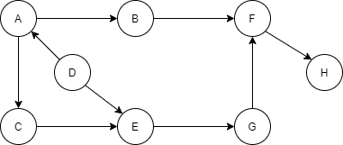

## Complexity

Is a measure of how resource requirements change as the size of problem gets larger. <br/>
**Big O Notation** - allows express complexity as a resource of input size.

## Sorting

### 1. Selection sort O(N^2)

- At each iteration 1 element is selected and compared with every other element in the list to find the smallest.
- Complexity `O(N^2)`
- `O(N^2)` - comparisons
- `O(N)` - swaps

```java
public static void selectionSort(int[] list) {
    for (int i = 0; i < list.length; i++) {
        for (int j = i + 1; j < list.length; j++) {
            if (list[i] > list[j]) {
                swap(listToSort, i, j);
                print(listToSort);
            }
        }
    }
}
```

### 2. Bubble sort O(N^2)

- At each iteration, every element is compared with its neighbor and swapped if they are not in order.
- Smaller element bubbling to the beginning of the list.
- If no swaps that means list is sorted.
- Complexity `O(N^2)`
- `O(N^2)` - comparisons
- `O(N^2)` - swaps

```java
public static void bubbleSort(int[] list) {
    for (int i = 0; i < list.length; i++) {
        boolean swapped = false;
        for (int j = list.length - 1; j > i; j--) {
            if (list[j] < list[j-1]) {
                swap(list, j, j-1);
                swapped = true;
            }
        }
        print(list);
        if (!swapped) {
            break;  // if no swap break
        }
    }
}
```

### 3.Insertion Sort O(N^2)

- Start with sorted list of size 1. Insert next element into list at right position.
- Complexity `O(N^2)`
- `O(N^2)` - comparisons
- `O(N^2)` - swaps

```java
public static void insertionSort(int[] list) {
    for (int i = 0; i < list.length - 1; i++) {
        for (int j = i + 1; j > 0; j--) {
            if (list[j] < list[j-1]) {
                swap(list, j, j-1);
            } else {
                break;
            }
            print(list);
        }
    }
}
```

### 4. Shell Sort between O(N) and O(N^2)

- Partitions the original list into sub-list where a sub-list is made of elements separated by an increment.
- Each sub-list is then sorted using insertion sort. The increment is reduced by 1.
- Sort on almost sorted list. Complexity depends on increment value chosen.
- Complexity `O(N) and O(N^2)`

### 5. Merge Sort O(N(Log(N)))

- Follows divide and conquer approach to create smaller sub problems.
- Then merge together sorted lists to get fully sorted list.
- Complexity `O(N(Log(N)))`
- Is not adaptive = takes advantage over input (nearly sorted list)

### 6. Quick Sort

- Divide and conquer algorithm which partitions the list at every step.
- Partition is based on **pivot** element from the list.
- The list is partitioned with all elements smaller than pivot on one side and larger than pivot on the other.
- Pivots is usually first or last element in the list.
- Complexity `O(N(Log(N)))`
- `O(Log(N))` extra space
- Is not adaptive

### :star: 7. Binary search

- How to search **sorted list**.
- Choose element at mid point of sorted list.
- Check whether it is smaller or greater then element you are looking for.
- `Complexity O(Log(N))`

```java
public static int binarySearch(int[] list, int number) {
    int min = 0;
    int max = list.length - 1;
    while (min <= max) {
        int mid = (max + min)/2;
        if (list[mid] == number) {
            return mid;
        }
        if (list[mid] > number) {
            max = mid - 1;
        } else {
            min = mid + 1;
        }
    }
    return -1;
}
```

```java
public static int binarySearch(int[] sortedArray, int number, int min, int max) {
    if (min > max) {
        return -1;
    }

    int mid = (max + min) / 2;
    if (sortedArray[mid] == number) {
        return mid;
    }

    if (sortedArray[mid] > number) {
        return binarySearch(sortedArray, number, min, mid - 1);
    } else {
        return binarySearch(sortedArray, number, mid + 1, max);
    }
}
```

## Recursion

- Iterative solutions involves loops.
- The recursive solutions involves functions that call themselves.
- Better space complexity comparing iterative binary search

## Binary Tree

- A binary tree is one where every node can have maximum of two children
    - Left children and right children
- Two binary trees are the same if:
    - Every corresponding node has the same value.
    - The structure of the tree at every corresponding node is the same
- **Complexity O(N)**

```java
public static class Node {
    private int id;
    private Node left;
    private Node right;

    public Node(int id) {
        this.id = id;
    }

    public int getId() {
        return id;
    }

    public void addChildren(Node left, Node right) {
        this.left = left;
        this.right = right;
    }

    public Node getLeft() {
        return left;
    }

    public Node getRight() {
        return right;
    }
}
```

- **Check whether trees are the same**

```java
public static boolean sameTree(Node head1, Node head2) {
    if (head1 == null && head2 == null) {
        return true;
    }

    if (head1 == null) {
        return false;
    }

    if (head2 == null) {
        return false;
    }

    if (sameTree(head1.getLeft(),head2.getLeft()) && sameTree(head1.getRight(), head2.getRight()) {
        return head1.getId() == head2.getId();
    }

    return false;
}
```

## Stack and Queues

### Stack

- The stack last in first out **LIFO**
- **PUSH** adding element at the top of stack   **O(1)**
- **POP** removing element from the top of stack **O(1)**
- **PEEK** see what element at top of the stack is. Does not change data structure.
- **ISEMPTY O(1)**
- **ISFULL O(1)**
- **SIZE O(1)**
- `StackOverflowException` - pushing into full stack
- `StackUnderflowException` - popping or peeking empty element
- **LinkedList** is used to build a stack
- Stack is used to implementing undo, back button

```java
public static class Element<T> {
    private T data;
    private Element next;

    public T getData() {
        return data;
    }

    public void setData(T data) {
        this.data = data;
    }

    public Element getElement() {
        return element;
    }

    public void setElement(Element next) {
        this.next = next;
    }

    public Element(T data, Element next) {
        this.data = data;
        this.element = element;
    }
}
```

### Queue

- Add element to the End of the Queue and remove elements from the beginning of the queue. FIFO, LIFO.
- Removal at beginning, addition at the end.
- ENQUEUE - adding new element at the end of the queue **O(1)**
- DEQUEUE - removing an element from the beginning of the queue **O(1)**
- PEEK - see first element. Does not change data structure
- OFFER - add to a queue if space is available
- ISEMPTY
- ISFULL
- Linked List with pointer to the head and tail works well, or stack (2 stacks)

## Trees

### Binary Tree

- Tree is a data structure which is made up of nodes.
- The order of element is not important in a Tree. Non-linear data structure (data organized without any sequence).
- In binary tree each node can have 0, 1 or 2 children.
    - ROOT - parent node
    - EDGE - Link from parent to leaf
    - LEAF - border Nodes no children
    - SIBLINGS - Nodes at the same level

```java
public static class Node<T> {
    private T data;
    private Node<T> leftChild;
    private Node<T> rightChild;
    public Node(T data) {
        this.data = data;
    }
    // getters, setters
}
```

### Binary Tree traversal

- Breadth-First - Visit node at every level before moving the next level.
- Depth-First - Involves going right to the leaf of the binary tree first before moving up the tree.
  - PRE-ORDER -  NODE         -> LEFT SUBTREE  -> RIGHT SUBTREE
  - IN-ORDER -  LEFT SUBTREE -> NODE          -> RIGHT SUBTREE
  - POST-ORDER - LEFT SUBTREE -> RIGHT SUBTREE -> NODE

```java
public static void preOrder(Node<Character> root) {
    if (root == null) {
        return;                 // Base case nothing to traverse
    }

    // process the node before recurse to the left and right subtrees

    print(root);                        // NODE
    preOrder(root.getLeftChild());      // LEFT SUBTREE
    preOrder(root.getRightChild());     // RIGHT SUBTREE
}
```


### Binary search tree

- Each node in the left subtree of Node has a value less than or equal to the value of the Node.
- Each node in the right subtree of Node has a value greater than the value of the Node.
- Binary search tree are typically used for **Fast insertion and fast lookup**
- `INSERTION O(Log(N))`
- `LOOKUP O(Log(N))`
- Complexity is based on shape. For example if only right or left child both insertion and lookup `O(N)`

## Heaps

### Priority Queue

- The highest priority element has to be processed first.
    - INSERT
    - ACCESS - the highest priority element
    - REMOVE - the highest priority element

| operation| Array or List unordered | Array or List ordered | Balanced binary search tree | The binary heap |
|---|---|---|---|---|
| INSERTION | O(1) | O(N) | O(Log(N)) | O(Log(N)) |
| ACCESS | O(N) | O(1) | O(Log(N)) | O(1) |
| REMOVE | O(N) | O(1) | O(Log(N)) | O(Log(N)) |

### The Binary Heap

- A heap is a tree with special properties or constraints on the values of it's nodes. Heap property.
- Two types of Heaps.
    - MINIMUM HEAP - node with smallest value is root.
    - MAXIMUM HEAP - node with largest value is root.
        - Operations travels upwards (leaf -> root),
        - travels downwards (root -> leaf).
        - Heaps can be represented using tree or array
- GET PARENT - Node at index: `i` -> has parent at index `(i-1)/2`
- GET LEFT CHILD - Node at index: `(2*i + 1)`
- GET RIGHT CHILD : Node at index: `(2*i + 2)`

```
             5
           /   \
          8     6
         / \   /  \
        9  12 11   7
       / \
      15  10

{5,8,6,9,12,11,7,15,10}
```

- Heapify : which is the right position of element
    - SIFT DOWN
    - SIFT UP

### Heap Sort

- Use Heap to help sort elements in ascending or descending order.
- Use the heap to access the maximum element and put it in right position in array.
- `O(1)` access to smallest and highest element
- Complexity `O(N(Log(N)))`
- Space complexity `O(1)`

## GRAPH

- Graph is used to represent relationship between entities.
    - VERTEX
    - EDGE
- Graphs is set of vertices and edges


- A and B are **Adjacent** Nodes


- 3 edges are Indicent of vertex F
- F is said to have a degree of 3
- Series of edges is called **PATH**

### UNDIRECTED ACYCLIC GRAPH

- A connected graph with no cycles is a TREE


### DIRECTED ACYCLIC GRAPH (DAG)



- 3 ways to represent Graph
    - Adjacency matrix
    - Adjacency list
    - Adjacency set

### ADJACENCY MATRIX

- Use a matrix with ROWS and COLUMNS a matrix is table
- The Row labels and the column labels represent the Vertices
- Each cell represent relationship between the vertices i.e. the EDGES

```
        +---+     +---+                   A  B  C  D  E
        | A +---->+ B |                 +----------------
        +-+-+     +-+-+               A | 0  1  1  0  0
          |         A   V             B | 0  0  0  1  0
          |         |    +---+        C | 0  0  0  0  1
          |         |    | D |        D | 0  0  0  0  0
          |         |    +---+        E | 0  1  0  1  0
          V         |  A
        +-+-+     +-+-+
        | C +---->+ E |
        +---+     +---+
```

### ADJACENCY LIST

- Each vertex is a node.
- Each vertex has a pointer to LinkedList
- Problem - deleting node need to go through all data structure

### ADJACENCY SET

- Instead of List use Set

### Graph representation

- `E` - Number of Edges
- `V` - Number of Vertices

| | Adjacency Matrix | Adjacency List | Adjacency Set |
|---|---|---|---|
| SPACE | V^2 | E + V | E + V |
| IS EDGE PRESENT | 1 | Degree of V | log(Degree of V) |
| ITERATE OVER EDGES ON VERTEX | V | Degree of V | Degree of V |

### Graph Traversal

- Depth First
- Breadth First
- In a tree is usually one path from root to a specific Node.
- In graph multiple paths can lead from one node to another. Graph can have cycles.

### Graph Algorithms

- Topological Sort - Directed Acyclic Graph. If no vertices with in degree of 0 no topological sort
- Running time `O(V + E)`

## MVC

- Separating data from its visual representation
- Separating data from its manipulation
- Allowing different simultaneous representations of the same data
- The user "sees" the model through the view, and "manipulates" it via controller

### Charts
- Charts and tables are views
- Numeric data are model
- `Controller` - A slider to adjust volume in a media player app
- `Model` - The MP3 file of a movie to be played in a media-player app
- `View` - The area of the media player app that actually displays video

***

## Questions

### 1. How to interrupt thread.

```java
} catch (InterruptedException e) {
    Thread.currentThread().interrupt();
}
```

### 2. Sleep current thread

```java
TimeUnit.SECONDS.sleep(1);
```

### 3. What happened if extends String

- Failed String is final so cannot be extended.

### 4. Why private constructor in inner class

- TODO ???

### 5. Where apply synchronization

- Methods
- Code blocks

### 6. Remote exception

- Super class for exception related to remote method execution.

### 7. Ways to parse XML in Java

- `DOM` - entire XML structure in tree.
- `SAX` - parse line after line and triggers events while meet elements like open tag, close tag etc.

### 8. Iterate through enum values

```java
public enum Numbers {
    ONE("One"),
    TWO("Two"),
    THREE("Three");
}

for (Numbers n : Numbers.values()) {
    System.out.println(n.getName());
}
```

### 9. Class to work with dates

- java.time.Date
- Duration
- LocalDateTime
- TemporalAdjuster
- LocalTime

### 10. Iterator and how it works

- Mechanism to process elements in order.
- `Iterable<T>` interface defines `Iterator<T> iterator()` method which returns an iterator, which can be used to visit all
elements in collection.

### 11. How parallel streams works in Java?

- Stream is split and then each parts are processed and then join.
- When task last for long time it blocks all threads in pools. As a result it block rest of task that uses parallelStream.

### 12. Stream API in Java8

- Java use Fork Join Framework.
- ParallelStream split big task on small sub tasks process them and then join together.
- Java8 Streams is based on convert collection to streams.

### 13. Collections vs Streams

- Collections in memory data structures. Each element is calculated before become part of collection.
- Streams are computed on demand.
- Streams can be defined as sequences of elements that supports aggregate operations like:
    - filter, map, reduce, find.
- Streams don't have methods like foreach which internally iterate through elements. Code is unaware iteration logic.

### 14. How map and filter works in Java

- map - process data to stream
- filter - argument of filter is Predicate<T>, function that converts T to boolean

```java
List<String> names = students.stream().map(student::getName).filter(name->name.startsWith("A"))
    .collect(Collectors.toList());
```

### 15. How Optional works?

- It helps work with null pointers.
- ofNullable - create optional value if exists
- ifPresent - is triggered when Optional is null

### 16. Default methods in interfaces.

- It is possible to provide default implementation of method in interface.

```java
public interface IntSeq {
    default boolean hasNext() {
        return true;
    }
}
```
- Class that implements this interface can override this method or provide new implementation.

### 17. In what format keep prices

- BigDecimal

### 18. Factorial

```java
public class Factorial {
    public static void main(String[] args) {
        System.out.println(factorial(5));
    }

    public static int factorial(int num) {
        int result = 1;
        if (num == 0 || num == 1) {
            return result;
        } else {
            for (int i = 2; i < num; i++) {
                result *= i;
            }
            return result;
        }
    }
}
```

```java
public class FactorialRecursive {
    public int calculateFactorial(int num) {
        if (num == 0 || num == 1) {
            return 1;
        } else {
            return num * calculateFactorial(num - 1);
        }
    }

}
```

### 19. Fibonacci

```java
public class FibonacciIterative {
    public int calculateFibo(int number) {
        int result = 0;
        int a = 1; // for 1
        int b = 1; // for 2
        if (number == 0) {
            return 0;
        } else if (number == 1 || number == 2) {
            return 1;
        } else {
            for (int i = 3; i <= number; i++) {
                result = a + b;
                a = b;
                b = result;
            }
        }
        return result;

    }

    public int[] calculateFiboArr(int number) {
        int[] result = new int[number];
        for (int i = 0; i < number; i++) {
            result[i] = calculateFibo(i);
        }
        return result;
    }
}
```

### 20. Is power of

```java
public class IsPowerOf {
    public boolean check(int num, int power) {
        int j = power;
        for (int i = 1; i < 10; i++) {
            if (Math.pow(j, 1.0/i) == power) {
                System.out.println(j + " is power of " + power);
            }
            j *= power;
        }
    }
}
```

### 21. Reverse String

```java
public class ReverseString {
    public static void main(String[] args) {
        reverseString("Panda");
    }

    public static void reverseString(String str) {
        char[] strChar = str.toCharArray();
        for (int i = 0; i < str.length(); i++) {
            strChar[i] = str.charAt(str.length()-i-1);
        }
        String strValue = String.valueOf(strChar);
        System.out.println(strValue);
    }
}
```

### 22. Big or small

```java
public class BigOrSmall {
    public static void main(String[] args) {
        Scanner scanner = new Scanner(System.in);
        String str = scanner.nextLine();
        char ch = str.charAt(0);
        // check unicode
        if (ch >= 65 || ch < 90) {
            System.out.println("First letter is Big");
        } else {
            System.out.println("First letter is small");
        }
    }
}
```

### 23. hashCode

- If objects are equal by equals, they also need to have the same hashCode.
- If hashCode has following implementation

```java
public int hashCode() {
    return 42;
}
```

- Then all objects are signed to the same bucket and hash table will degrade to normal list

### 24. :star: Palindrome

```java
public class Palindrome {
    public static boolean isPalindrome(String str) {
        if (str.length() == 0 || str.length() == 1) {
            return true;
        }
        if (str.charAt(0) == str.charAt(str.length() - 1) {
            return isPalindrome(str.substring(1,str.length()-1));
        }
        return false;
    }
}

// ABCDCBA ==> true
// BCDCB   ==> true
// CDC     ==> true
// D       ==> true
```

### 25. First not repeat

```java
public class FirstNonRepeat {
    public static Character firstNonRepeat(String str) {
        Map<Character, Integer> map = new HashMap<>();

        for (int i = 0; i < str.length(); i++) {
            if (map.contains(str.charAt(i)) {
                map.put(str.charAt(i), map.get(str.charAt(i)) + 1);
            } else {
                map.put(str.charAt(i), 1);
            }
        }

        for (int i = 0; i < str.length(); i++) {
            if (map.get(str.charAt(i)) == 1) {
                return str.charAt(i);
            }
        }
        return null;
    }
}
```

### 26. Bigger and Smaller

```java
public class BiggerAndSmaller {
    private int bigger = Integer.MIN_VALUE;
    private int smaller = Integer.MAX_VALUE;

    public void find(int[] numbers) {
        for (int next : numbers) {
            if (next > bigger) bigger = next;
            if (next < smaller) smaller = next;
        }
    }

    public int getBigger() {
        return bigger;
    }

    public int getSmaller() {
        return smaller;
    }
}
```

### 27. Linked List

- Sequence of elements in which every element links to next element.
- Can contain any type of data.
- Elements Unsorted, Sorted, Duplicates, Unique
- Disadvantages
    - Slow to get k th element O(N)
- Advantages
    - insert and delete can be quick O(1) prepend, O(n) append

### 28. Stacks and Queues

- Linear data structure
- Flexible sizes

### 29. Heap


### 30. Tree

- The binary TREE to 2 child nodes (left, right)
- The binary tree
    - Left node is less than root node
    - Insert like find
- Balanced
    - insert: `O(log(N))`
    - find: `O(log(N))`
- Unbalanced (H height of tree)
    - insert: `O(H)`
    - find: `O(H)`


### 31. Big O Notation

- Equation that describes how the run time change with respect to input
    - Different steps got added                    `O(a + b)`
    - Drop constants                               `O(2N) => O(N)`
    - Different inputs => different variables      `O(a * b)`
    - Drop non dominate terms                      `O(N + N^2) => O(N^2)`

### 32. Algorithm efficiencies

| Algorithm | Concrete Type | Time |
|---|---|---|
| get, set | ArrayList | O(1) |
| add, remove | ArrayList | O(N) |
| contains, index of | ArrayList | O(N) |
| get, put, remove, contains key | HashMap | O(1) |
| add, remove, contains | HashSet | O(1) |
| add, remove, contains | LinkedHashSet | O(1) |
| get, set, add, remove (from either end) | LinkedList | O(1) |
| get, set, add, remove (from index) | LinkedList | O(N) |
| contains, index of | LinkedList | O(N) |
| peek | PriorityQueue | O(1) |
| add, remove | PriorityQueue | O(log(N)) |
| remove, get, put, contains key | TreeMap | O(log(N)) |
| add, remove, contains | TreeSet | O(log(N)) |

- **Big O notation** is used to indicate time efficiencies, where `n` is the number of elements

| Notation | Description |
|---|---|
| O(1) | Time is constant, regardless of the number of element |
| O(N) | Time is linear to the number of elements |
| O(log(N)) | Time is logarithmic to the number of elements |
| O(Nlog(N)) | Time is linearithmic to the number of elements |

### 33. Collections

- The Collections are objects that group multiple elements and store, retrieve and manipulate these objects.
- The Collection interface is the root of the Collection hierarchy.
- Sub interfaces of Collection include List, Queue and Set

| Interface | Ordered | Duplications | Notes |
|---|---|---|---|
| List | Yes | Yes | Positional access, element insertion control |
| Map | Can be | No | Unique keys, one value mapping max per key |
| Queue | Yes | Yes | Holds elements, usually FIFO |
| Set | Can be | No | Unique matters |

- Collection.stream() returns a sequential stream with the context collection as its source.
- Collection.parallelStream() returns a parallel stream with the context collection as its source
- Collection.addAll(), .max(), .min(), .remove(), .rotate()

### 34. Garbage Collector


- Permanent generation is used to store metadata. Store String pool also.
- Types of Garbage collectors:
    - Throughput GC - parallel version young generation     `-XX:+UseParallelGC`
    - Concurrent low pause collector                        `-XX:+UseConcMarkSweepGC`
    - Most GC is executed multithreaded at the same time app is executed
    - Incremented low pause collector                       `-XX:+UseTrainGC`
- Full GC Concurrent GC
    - Executed on single GC thread, which executes with app thread to execute before tenured generation.
    - Full GC, application is stopped and GC is executed as all application thread is stopped

### 35. How XML DOM parser works

- DOM standard to access and manipulate XML document.

### 36. How SAX parser works

- Streaming API
- Read only, no for creating XML
- Event based parser
- Faster and uses less memory than tree based processors
- Push parser - pusher data into callback methods
- Works on Android
- Entire document does not need to be put in memory
- :star: One way impossible to parse from end to begin of document

| Data Event | Error Handling Events | Other Events |
|---|---|---|
| StartDocument | Warning | Notation Detected |
| EndDocument | Error | IgnoreWhiteSpaces |
| StartElement | Fatal Error | |
| EndElement | | |
| Characters | | |

### :star: 37. How to build own annotation

**TrackTimer.java**

```java
@Target(ElementType.METHOD)
@Retention(RetentionPolicy.RUNTIME)
public @interface TrackTime {
}
```

**JoinPointConfig.java**

```java
public class JoinPointConfig {
    @Pointcut("@annotation(com.panda.spring.aop.aspect.TrackTime)")
    public void trackTime() {
    }
}

```

**AroundAspect.java**

```java
@Aspect
@Configuration
public class AroundAspect {

    @Around("com.panda.spring.aop.aspect.JoinPointConfig.trackTime()")
    public void around(ProceedingJoinPoint joinPoint) throws Throwable {
        long startTime = System.currentTimeMillis();
        joinPoint.proceed();
        long entTime = System.currentTimeMillis() - startTime;
        logger.info("Time taken by this {} is {}", joinPoint, entTime);
    }

}
```

**Use**
```java
@Repository
public class Dao1 {

    @TrackTime
    public String retrieve() {
        return "Dao Repo";
    }
}
```

### 38. Thread Local

- Allow to build variables that can be saved and read through the same thread. Thus ever though two threads
are executed the same code, and it has a reference to thread local, as a result both threads cannot see
their ThreadLocal variables.

```java
private ThreadLocal myThreadLocal = new ThreadLocal();
// ...
myThreadLocal.set("A thread local");
String myThreadLocalValue = (String) myThreadLocal.get();
```

### 39. How Garbage Collector works?

- Objects are created on Heap
- Class variables are on method area
- Before destroy object from memory GC thread start `finalize()` method as a result needed cleanup operation can be executed.
- Ergonomics to allow good performance JVM with minimal code lines to tuning.

### 40. When object is candidate to GC?

- All reference to this object are set to null
- Object was created in block which range changed after leave block
- Parent object set to null
- Object has only weak reference via WeakHashMap

### 41. Heap Generations

- Heap is separated with three parts
    - Young Generation,
    - Tenured or Old Generation
    - Perm Area
- Generation are then separated on 3 parts
    - Eden Space
    - Survivor 1
    - Survivor 2
- New object is then created on heap in new generation in Eden space, and after few GC it goes to Survivor1 and then
to Survivor2.

### 42. WSDL file?

- Web service description language.
    - Determines what is required in service
    - How to consume and how to deliver them
- Definitions
    - types
    - binding
    - messages
    - service
    - operation
    - prototype

### 43. What is RMI?

- Remote execute object methods. Object can be placed in different JVM on other computers.

### 44. XML Schema

- Grammar, blueprint to xml document
- XSD extension
    - deliver contract between 2 users (to not send unnecessary information).
    - if xml follows scheme that means it is valid document
```xml
    <xsd:schema>            <!-- root element -->
        <xsd:restriction>   <!-- restricted dane -->
        <xsd:sequence>      <!-- elements order assured -->
```

### 45. HTTP errors protocols qualification

- `1xx` - information
- `2xx` - success 201 created, 200 OK, 204
- `3xx` - redirection
- `4xx` - client error, 404, 400, 403 forbidden, 401 unauthorized
- `5xx` - server error

### 46. SOLID
- Single Responsible Principle - One class should have one and only one responsibility
- Open closed principle - Software component should be open for extension, but closed for modification
- Liskov substitution principle - Derived type must be completely substitutable for their base type
- Interface segregation principle - Client should not be forced to implement unnecessary methods which they will not use
- Dependency Inversion principle - Dependent on abstraction not on concretion

**SOLID**

- Single Responsible Principle
    - Every class should have a single responsibility
    - Class should be small
    - Avoid very big classes, split it into smaller classes
- Open close principle
    - Class should be open for extension but closed for modification
    - You should be able to extend class behavior without modifying it
    - Use private variables with getters and setters only when you need them
    - Use abstract base class
- Liskov substitution principle
    - Objects in program would be replaceable with instances of their subtypes WITHOUT altering the correctness of the program
    - Violations will often fail the "Is a" test
    - A Square "Is a" Rectangle
    - Rectangle "Is not" a Square
- Interface Segregation principle
    - Make fine grained interfaces that are client specific
    - Keep component focused and minimize dependencies between them
    - Avoid super interface
- Dependency Inversion Principle
    - Abstraction should not depend upon detail
    - Details should not depend upon abstraction
    - How object obtain dependent objects

### 47. ACID

- Atomic
- Consistency - data must follows validation rules
- Isolation - concurrency control
- Durability - committed transaction stays committed even in case of power loss

### 48. What is a primary key?

- A primary key is a combination of fields which uniquely specify a row.
- This is a special kind of unique key, and it has implicit not null constraint. It means, primary value cannot be null.

### 49. What is a unique key?

- A unique key constraint uniquely identified each record in the db

### 50. What is a foreign key?

- A foreign key is one table which can be related to the primary key of another table.

### 51. What is a view?

- A view is a virtual table which consists of subset of data contained in a table. View are not virtually stored, and it
takes less space to store.

### 52. What is an index?

- An index is performance tuning method of allowing faster retrieval of records from the table.
- An index creates an entry for each value and it will be faster to retrieve data.

### 53. What is cursor?

- Is a control which enables traversal over the rows or records in the table.

### 54. What is a trigger?

- Code or programs that automatically execute with response to some event on a table or view in a database.
- Mainly trigger helps to maintain the integrity of the database. Student is added to DB, new record should be created in
related tables like Exams, Score.

### 55. What is constraint?

- Not Null
- Check
- Default
- Unique
- Primary Key
- Foreign Key

### 56. What is Union?

- Union operator is used to combine the results of two tables, and it eliminates duplicate row from the table.

### 57. :star: How to generate stack overflow ?

```java
public class StackOverflowException {

    public static void main(String[] args) {
        new StackOverflowException().generateException(89);
    }

    public int generateException(int i) {
        return i * generateException(i);
    }

}
```

### 58. BigO notation

- What is a resource requirements as input of a problem gets larger
    - Access to element in table - `O(N)`
    - Access to element in sorted table - `O(1)`
    - Access to element in hashTable - `O(1)`
    - Access to element in tree (binary tree) - `O(log(N))` or `O(N)`
    - Quick Sort - `O(N(log(N)))`
    - Bubble Sort - `O(N^2)`

###  59. Stability of sorting algorithm

- Elements with the same hashCode stays on the same position after sorting. For example in bubble sort, panda, panda, pies.
panda would change position with other panda in even though of a fact that they have the same hashCode.

***

## Multithreading

- Access to variable marked **volatile** is synchronized on the variable itself.
- Variable marked as volatile are safe to use in different thread.
- The default single thread is called the main thread
- Command Pattern - Separates execution of an action from an action itself.
    - In Threading we define the action that we would like to new thread to undertake
- The volatile keyword ensures a variable is never cached, and only read from main memory,
and wraps the action in the body of an object that implements an interface with just one method.

- Threads are controlled by process
    - PROGRAM : PROCESS - `1 : 1`
    - PROCESS : THREADS - `1 : MANY`
    - CALLABLE
    - LOCK OBJECTS
    - EXECUTORS
    - CONCURRENT COLLECTIONS
    - THREAD POOLS
    - ATOMIC VARIABLES

### Synchronization problems

- Thread interference - Different thread access the same data
- Memory consistency error - inconsistent value of variable
- Thread contention - Threads get in each other way and slow down or even have to be killed by java
    - starvation
    - livelock
    - deadlock

### Completion Service

- Returns the queue of feature objects in the order in which they finish

### Callable

- It's a generic class that explicitly returns the thread results. Correctly passes exception from one thread to another.
- Submit the callable to an Executor object and get a Future object as the result.
- `Future.cancel()` interrupt operation midway
- `Future.get()` to wait for the callable to finish running

| Old school | New school |
|---|---|
| Runnable Interface | Callable interface |
| Thread class | Executors in build class |
| Thread.join() | Future.get() |

- `Future<Integer> oneFuture = executor.submit(oneCallable);`
- To interrupt another thread, call the .interrupt() member function on that thread
- Calling `Future.cancel()` is like calling `thread.interrupt()`
- Two ways for a thread to check if it has been interrupted
    - Catch an InterruptedException
    - Thread.interrupt() static method

| Process | Thread |
|---|---|
| Self execution environment | Fewer resources |
| Run-time resources provide | Exists within process |
| Own memory space | Share process resources |
| IPC Process Builder | |

## Concurrency

- Threads in Java allow the use of multiple processors or multiple cores in one processor more efficiently.
- On a single processor, threads provide for concurrent options such as overlapping I/O with processing.
- Java supports it with the Thread class or Runnable interface.

### Creating threads

- extends Thread class
- implements Runnable interface - a single Runnable instance can be processed to multiple thread objects.

### Thread states

Enumerated Thread.state provides six thread states

| State | Description |
|---|---|
| New | A thread that is created but not started |
| RUNNABLE | A thread state that is available to run |
| BLOCKED | An alive thread that is blocked waiting for a monitor lock |
| WAITING | An alive thread that calls its own wait() and join() while waiting on another thread |
| THREAD_WAITING | An alive thread that is waiting on another thread for a specified period of time, sleeping |
| TERMINATED | A thread that is completed |

### Thread priorities

- MIN_PRIORITY
- NORM_PRIORITY
- MAX_PRIORITY
- Lower priority threads yield to higher priority thread

### Common methods

- getPriority()
- getState()
- interrupt()
- isAlive()
- isInterrupted()
- join() - causes the thread that invokes this method to wait for the thread that this object represents to finish

### Common methods used for threads from the Object class

- notify() - tells the thread to wake up and run
- notifyAll() - Tells threads that are waiting on a thread or resource to wake up, and then the scheduler will
select one of the thread to run
- wait() - Pauses a thread in a wait state until another thread calls notify or notifyAll
- Common static methods used for threads from Thread class
    - activeCount()
    - concurrentThread()
    - interrupted()
    - sleep()
- yield() - Pauses the current thread to allow other thread to run
- Synchronization - Apply locks to blocks and methods. A lock is also known as monitor or mutex (mutually exclusive lock)

### Concurrent utilities

- Executors
    - ThreadPoolExecutor as well as its subclass ScheduledThreadPoolExecutor implements the Executor
interface to provide configurable, flexible thread pools.

| Collections | Concurrent Collections  |
|---|---|
| HashMap | ConcurrentHashMap |
| TreeMap | ConcurrentSkipListMap |
| TreeSet | ConcurrentSkipListSet |
| Map sub types | ConcurrentMap |
| List sub types | CopyOnWriteArrayList |
| Set sub types | CopyOnWriteArraySet |
| PriorityQueue | PriorityBlockingQueue |
| Dequeue | BlockingDequeue |
| Queue | BlockingQueue |

### Synchronizers

Special purpose synchronization tools

| Semaphore | Maintain a Set of permits |
|---|---|
| CountDownLatch | Implements waits against sets of operations being performed |
| CyclicBarrier | Implements waits against common barrier parts |
| Exchanger | Synchronization point where threads can exchange elements |

***

## Memory Management

- Garbage collector principal tasks are allocating memory, maintaining referenced objects in memory, and
recovering memory from objects that no longer have reference to them.
- Tune GC
    - Maximum pause time goal - time GC pauses application to recover memory
- Throughput goal
    - Time spent outside of GC

### Serial GC

- Is performed via a single thread on a single CPU.
- When this GC thread is run, the execution of the application will pause until the collection is completed.
- Small data setup up to 100 MB, no requirement for low pause time.

### Parallel Collector

- Can be performed with multiple threads across several CPUs.
- Using those multiple threads significantly speeds up GC.
- No pause time constraints and app performance is the most important aspect of your program.

### Parallel Compacting Collector

- Similar to parallel Collector except for refined algorithms that reduce collection pause times.
- This collector is best used for apps that do have pause time constraints.

### Concurrent Mark Sweep Collector

- CMS low latency collector, implements algorithm to handle large collections that might warrant long pauses.
- Use when response time take precedence over throughput times and GC pauses.

### Garbage-First G1 Collector

- Is used for multiprocessor machines with large memories.
- This server-style GC meets pause time goal with high probability, while achieving high throughput.
- Whole heap operations (global marking) are performed
concurrently with the app thread, which prevents interruptions proportional to the heap or live-data size.

| Memory Management Tools | Description |
|---|---|
| jvisualvm | |
| jconsole | Java Management Extensions (JMX) |
| jinfo | |
| jmap | Memory map tool |
| jstack | Stack trace tool |
| jstat | JVM statistics monitoring tool |
| jhat | Heap analysis tool |
| hprof profiler | CPU usage, heap statistics, and monitor contentions profiler |
| jdb | Java debugger tool |

### Resizing the JVM

- The heap is an area in memory that stores all objects created by executing Java program.
- If you are having performance problems or seeing the Permanent Generation (PermGen) error message
    - java.lang.OutOfMemory, you may be running out of heap space.
- **Metaspace** - Used for representation class metadata. Metaspace is a successor to PermGen model.

***

## TDD

### Test Parts

- Scenario
- Execute actions
- Validate behavior
- Refactor
- All jUnit test must be public void
- Eliminating repeated code
    - `@Before` - execute setup before unit test

### Mock

- Simulating objects, dependencies
- Impossible to mock static method
- Avoid static methods. Programming for testability

### Clean Code

- SRP (Single responsible principle)
    - A functional unit on a given level of abstraction should only be responsible for a single
aspect of system's requirements. An aspect of requirements, which can change independently
of other aspects.
- The language you wrote your code should look like it was made for the problem.
- DRY (Don't repeat yourself)
- KISS (Keep it simple stupid)
- YANGE (You ain't gonna need it)
- Can be easy extended by other developers
- Should have minimal dependencies
- Smaller is better
- It should have unit and acceptable tests
- It should be expressive


