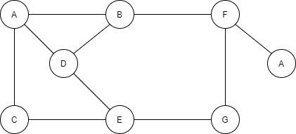
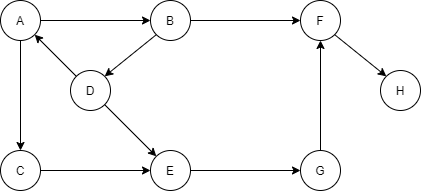
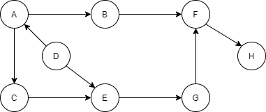
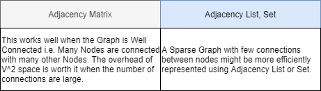
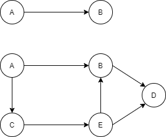

# Tree

## The tree

- A tree is a data structure which is made up of nodes. 
- Each node can point to a number of nodes.
- Unlike Stacks, Queues, LinkedLists the order of the elements is not important in a tree.
- It is a non linear data structure.
- A trees is typically used to represent hierarchical information.

## The Binary Tree

- In general tree Data Structure can have any number of children but these trees are less useful and not very commonly
used as data structure.
- In binary tree each node can have, **0**, **1** or **2** children.
- **Root**: A node with no parents, every tree has exactly one root.
- **Edge**: Link from a parent node to a child node.

### A tree node

```java
public static class Node<T> {
    private T data;
    private Node<T> leftChild;  // A generic tree node can hold data of any type
    private Node<T> rightChild; // A node can have a maximum of 2 children

    public Node(T data) {
        this.data = data;
    }

    public T getData() {
        return data;
    }

    public Node<T> getLeftChild() {
        return leftChild;
    }

    public void setLeftChild(Node<T> leftChild) {
        this.leftChild = leftChild;
    }

    public Node<T> getRightChild() {
        return rightChild;
    }

    public void setRightChild(Node<T> rightChild) {
        this.rightChild = rightChild;
    }
}
```

### Breadth first traversal

- There are a wide number of ways to visit the nodes of a tree.
- They vary based on the order in which the Nodes are accessed.
- Visiting nodes of a tree is called **traversing a tree**.

**Breadth-First**

- Breadth first traversal involves visiting nodes at every level before moving on the next level.
- Start with the root node it's at level 0 and is the first node to visit.
- Next step is to check whether there are other Nodes at the same level and visit them.
- Once a level is exhausted then we move to the next level.
- We continue this till every node of the tree has been visited.

**Implementing Breadth First Traversal**

- Start from the root and add it to the Queue.
- Dequeue and process the Node.
- Add it's left and then right child.
- Continue this as long as the queue is not empty.
- The nodes get added level wise from left to right to the queue.
- And are de queued and processed in that order.

```java
public static void breadthFirst(Node root) throws Queue.QueueUnderflowException, Queue.QueueOverflowException {

    // null root indicating nothing to traverse
    if (root == null) {
        return;
    }

    Queue<Node> queue = new Queue<>(Node.class);

    // Set up a queue and start by enqueueing the root node
    queue.enqueue(root); 

    // As long as the queue is not empty, process the node at the head of the queue
    while (!queue.isEmpty()) { 
        Node node = queue.dequeue();
        print(node);

        if (node.getLeftChild() != null) {
            queue.enqueue(node.getLeftChild());
        }

        if (node.getRightChild() != null) {
            queue.enqueue(node.getRightChild());    // Add its left and right child to queue
        }
    }
}
```

- Adding the left child first ensures that the nodes at the same level and processed from left to right.

### Depth first traversal

- Depth first traversal involves going right to the leaf of the binary tree first before moving up the tree.
- Going deep before moving up.
- Here there are a whole variety of possibilities in how the nodes are processed.
- Depth first traversal can be:
    - Pre Order.
    - In Order.
    - Post Order.
- All depth first traversal are most efficiently and intuitively implemented using recursion.
- The base case is when the root is null.
- At every point we work with a subtree rooted at some Node.
- The recursive step is on 2 subtrees the left and right.
- The processing can be performed:
    - Before: **PRE-ORDER**.
    - In between: **IN-ORDER**.
    - After: **POST-ORDER**.

**PRE-ORDER**

- Each node is processed first, before it's right and left subtrees.
- The left sub-trees are processed before the right subtrees.

```java
public static void preOrder(Node<Character> root) {

    // Base case nothing to traverse
    if (root == null) {
        return;                 
    }

    // process the node before recurse to the left and right subtrees
    print(root);                        // NODE
    preOrder(root.getLeftChild());      // LEFT SUBTREE
    preOrder(root.getRightChild());     // RIGHT SUBTREE
}
```

**IN-ORDER**

- The left subtree is processed first, then the node, then the right subtree.
- The subtree rooted at B is processed before A and the subtree rooted at C.
- Each time a node not a left child, we have to move deeper into the left subtree.

```java
public static void inOrder(Node root) {

    // base case nothing to traverse
    if (root == null) {
        return;                 
    }

    inOrder(root.getLeftChild());
    print(root);                // Process the left subtree before the node and then recurse to the right subtree
    inOrder(root.getRightChild());
}
```

**POST-ORDER**

- Both subtrees are processed before the node itself. 
- The node is processed after POST the subtree.
- The subtree rooted at B is processed before the subtree rooted at C, A is processed last.

```java
public static void postOrder(Node root) {

    // base case nothing to traverse
    if (root == null) {
        return;                 
    }

    postOrder(root.getLeftChild());
    postOrder(root.getRightChild());
    print(root);                // Process the left and right subtree before processing the node itself.
}
```

### Binary Search Trees

- This is also called an Ordered binary tree, and it's a tree with some specific characteristics.
- For every node in the tree:
    - Each node in the left subtree of that node has a value less than or equal to the value of the node.
    - Each node in the right subtree of that node has a value greater than the value of the node.

```
Every node on                   Every node on
the left subtree is <= 8        the right subtree is > 8

                        8
                       / \
                      7   14
                     /   /  \
                    4   12   16
                   / \    \    \
                  2   5    13   18
```

- Recursively every node in the tree should obey the same constraint.
- Binary search tree are typically used for fast insertion and fast lookup.

**Insertion**

- In a tree when a new node is added there is exactly one place that it can be.
- The structure of a tree depends on the order in which the nodes are added.

**Lookup**

- While searching for a node in the tree there is only one place where that node can be found.
- We can simply follow the right or left subtrees based on the value we want to find.

**Insertion and lookup in binary search tree**

- Insert the node **2** into the tree.

```
        8
       / \
      6   14
     / \    \
    4   7    16
               \
                18
```

- Steps:
    - Compare node **2** with root **8**.
    - Root **8** has left child so continue comparing.
    - **6** has left child continue comparing.
    - **2** < **4** insert **2** in this place.

```
        8
       / \
      6   14
     / \    \
    4   7    16
   /           \
 [2]            18
```

```java
public static Node<Integer> insert(Node<Integer> head, Node<Integer> node) {

    // Base case if the head is null then the node itself is the head
    if (head == null) {
        return node;
    }

    if (node.getData() <= head.getData()) {
        // If the Node values is smaller then the head then it's correct place is somewhere in the left subtree
        // we insert the node into the left subtree
        head.setLeftChild(insert(head.getLeftChild(), node));
    } else {
        // If the Node is greater than the head then it's correct place is somewhere in the right subtree
        // we insert the node into the right subtree
        head.setRightChild(insert(head.getRightChild(), node));
    }

    return head;
}
```

**Lookup in a binary search tree**

- Lookup the value **7** in the tree.

```
        8
       / \
      6   14
     / \    \
    4   7    16
               \
                18
```

- Steps:
    - Compare **7** with root **8**.
    - **8** has left child, so we continue comparing.
    - Compare **7** with **6** go to right child.
    - Match the node has been found.

```java
public static Node<Integer> lookup(Node<Integer> head, int data) {

    // Base case if the head is null then the node has not been found, return null
    if (head == null) {
        return null;        
    }

    // Check if the value of the head matches the value we're looking for, if yes we have found a match
    if (head.getData() == data) {
        return head;
    }

    // If the lookup value is smaller than or equal to the head then lookup the left subtree otherwise
    // lookup he right subtree
    if (data <= head.getData()) {
        return lookup(head.getLeftChild(), data);
    } else {
        return lookup(head.getRightChild(), data);
    }
}
```

### The Binary Search Tree

- Insertion:
    - The Complexity for node insertion is **O(log(n))** in average case **O(lg(n)) ln(e^x) = x**.
    - The actual complexity depends on the shape of the tree for example if all left or right children only complexity 
    is **O(N)**.
- Lookup:
    - The Complexity for value lookup is **O(log(n))** in the average case.
    - For both insertion and lookup we have tree traverse at every step. 
    - This gives us the **log(n)** complexity.

### Binary Tree Problems

**:star: Find the minimum value in a binary search tree**

- The minimum value in a binary search tree can be found by traversing the left subtree of every node.
- For every node it's left child will have a value smaller than the node's value.
- If a node has no left child that is the node with the smallest value. 
- The left most leaf node in the tree.

```java
public static int minimumValue(Node<Integer> head) {

    // Base case, if the head is null then the tree has no nodes, return the minimum integer value
    if (head == null) {
        return Integer.MIN_VALUE;
    }

    // Follows the left child for every node, if the left child is null then this is the minimum value node
    if (head.getLeftChild() == null) {
        return head.getData();
    }

    // Recurse till a left child is Available
    return minimumValue(head.getLeftChild());   
}
```

**:star: Find the maximum depth of a binary tree**

- The max depth will be the furthest distance of the leaf node from the root.

```java
public static int maxDepth(Node root) {

    // Base case if the root is null then the tree has no nodes, the max depth is 0
    if (root == null) {
        return 0;   
    }

    // If both left and right child of the node is null then there is a leaf and has a depth of 0
    if (root.getLeftChild() == null && root.getRightChild() == null) {
        return 0;   
    }

    // Find the max depth on the left and right subtrees. 
    // Add 1 to account for the current depth of the tree.
    int leftMaxDepth = 1 + maxDepth(root.getLeftChild());
    int rightMaxDepth = 1 + maxDepth(root.getRightChild());

    // Find the max depth between the left and right subtrees
    return Math.max(leftMaxDepth, rightMaxDepth);   
}
```

**:star: Mirror a binary tree**

- Every left child is now right child and vice versa.

```java
public static void mirror(Node<Integer> root) {

    // Base case if the head is null then the tree has no nodes, there is nothing to mirror
    if (root == null) {
        return; 
    }

    // Call mirror recursively on every node in the left and right subtrees
    mirror(root.getLeftChild());    
    mirror(root.getRightChild());

    // swap the left and the right child of each node
    Node<Integer> temp = root.getLeftChild();
    root.setLeftChild(root.getRightChild());
    // Swap the left and right children of this node
    root.setRightChild(temp);      
}
```

**Count trees**

- Count the number of structurally unique binary trees possible.
- For example for 3 nodes.

```
        O           O               O
       / \           \               \
      O   O           O               O        .....
                       \             /
                        O           O
```

```java
public static int countTrees(int numNodes) {

    // When the number of nodes is 1 there is just one possible tree, this is the base case
    if (numNodes <= 1) {
        return 1;       
    }

    int sum = 0;

    // Consider that at every node can be the root, the nodes before it will be on the left and the nodes after it
    // on the right.
    // Nodes on the left and right from their own subtrees.
    for (int i = 1; i < numNodes; i++) {
        int countLeftTrees = countTrees(i - 1);
        int countRightTrees = countTrees(numNodes - i);
        // This is the number of possible trees with this root, the combination of right and left subtrees
        sum = sum + (countLeftTrees + countRightTrees);
    }
}
```

**Print all nodes within a range in a binary search tree**

- A range will include a subset to nodes in binary search tree.
- This subset can include 0 nodes as well.
- Check every node to see if it's in within the range, print it to screen if the range constraints are met.

```java
public static void printRange(Node<Integer> root, int low, int high) {

    // Pass in the min and max indicating the range we care about

    // Base case
    if (root == null) {
        return;     
    }

    // If the range low values is less than the current node, run the operation on the left node
    if (low <= root.getData()) {
        printRange(root.getLeftChild(), low, high);
    }

    // Check the node value to see if it's within the range if yes print
    if (low <= root.getData() && root.getData() <= high) {
        System.out.println(root.getData());
    }

    // If range high value is greater than the current node, run the operation on the right subtree
    if (high > root.getData()) {
        printRange(root.getRightChild(), low, high);
    }
}
```

**Check if a binary tree is a binary search tree.**

- For every node in a binary search tree the nodes with values `<=` node are in the left subtree and nodes with
values `>` node are in a right subtree.
- Check every node to see if this constraint is violated.
- It can be solved iteratively and recursively.

```java
public static boolean isBinarySearchTree(Node<Integer> root, int min, int max) {

    // Pass in the min and max indicating the range for the subtree

    // A null node is a valid binary tree
    if (root == null) {
        return true;    
    }

    // If a node lies outside the range then the BST constraint has been violated and we return false
    if (root.getData() <= min || root.getData() > max) {
        return false;
    }

    // Check the left and Right subtrees to see if they're valid search trees
    return isBinaryTree(root.getLeftChild(), min, root.getData()) &&
           isBinaryTree(root.getRightChild(), root.getData(), max);
}

```

- For the left subtree the current nodes value should be the max.
- For the right subtree the current node's value should be the min.

**Has path sum**

- Check if a path from root leaf node sums up to a certain value.
- At every leaf node check if the path to it sums to the value specified.
- Subtract the current node's value from the sum when recursing left and right towards the leaf node.

```java
public static boolean hasPathSum(Node<Integer> root, int sum) {

    // Pass in the current running sum

    // In the case of a leaf node, check if the sum is exactly equal to the value of the node
    if (root.getLeftChild() == null && root.getRightChild() == null) {
        return sum = root.getData();    
    }

    // For internal non leaf nodes subtract the current node value from the sum
    int subSum = sum - root.getData();  

    // Recurse left and right to see if the sub sum is satisfied in any of the paths
    if (root.getLeftChild() != null) {
        boolean hasPathSum = hasPathSum(root.getLeftChild(), subSum);
        if (hasPathSum) {
            return true;
        }
    }

    if (root.getRightChild() != null) {
        boolean hasPathSum = hasPathSum(root.getRightChild(), subSum);
        if (hasPathSum) {
            return true;
        }
    }
    return false;
}
```

**Print paths**

- Keep track of the current path followed to reach the leaf node.
- At a leaf node print the current path.
- For internal nodes add the node to the path and recurse to the left and right children.

```java
public static void printPaths(Node<Integer> root, List<Node<Integer>> pathList) {

    // A list keep track of the current path to this node

    // Base case
    if (root == null) {
        return;     
    }

    pathList.add(root);

    // Add the current node to the path and recurse to the left and right child
    printPaths(root.getLeftChild(), pathList);
    printPaths(root.getRightChild(), pathList);

    // If this is leaf node, print the current path, which has all nodes leading to this leaf node
    if (root.getLeftChild() == null && root.getRightChild() == null) {
        print(pathList);
    }

    // Remove the current node from the pathList as all paths from this node has been processed and printed
    pathList.remove(root);

}
```

**Find the least common ancestor for 2 nodes.**

```
        1
       / \
      2   3
         / \
        7  [6]
       / \    \
     [8]  5    4
```

- 3 is the least common ancestor for 8 and 6.
- 1 is also a common ancestor but not the least one.

```java
// I. leastCommonAncestor(1, 6, 8) <-- 1 root
public static Node<Integer> leastCommonAncestor(Node<Integer> root, Node<Integer> a, Node<Integer> b) {
    // III. null == null -> null
    if (root == null) {
        return null;
    }

    // I. 1 == 6 || 1 == 8
    // II. 2 == 6 || 2 == 8
    // IV. 3 == 6 || 3 == 8
    // V. 6 == 6 || 6 == 8
    // If the current root is either of two nodes then return the root itself
    if (root == a || root == b) {
        return root;
    }

    // II. leastCommonAncestor(2, 6, 8)
    // III. leastCommonAncestor(null, 6, 8)
    Node<Integer> leftCA = leastCommonAncestor(root.getLeftChild(), a, b); // null
    // IV. leastCommonAncestor(3, 6, 8)
    // V. leastCommonAncestor(6, 6, 8)
    Node<Integer> rightCA = leastCommonAncestor(root.getRightChild(), a, b); // 6

    // If both exists it means either the node or it's ancestor exists in the left and right subtree so the current 
    // node is LCA
    if (leftCA != null && rightCA != null) {
        return root;    
    }

    // If only of the common ancestor is non null return that
    if (leftCA != null)  {
        return leftCA;  
    }

    // 6 ??
    return rightCA;
}
```

## Heaps

### The Priority Queue

- When a certain element in a collection has the highest weightage or priority a common use case is to process that first.
- The data structure you use to store elements where the highest priority has to be processed first can be called 
a **priority queue**.
- At every step we access the element with the highest priority.
- The data structure needs to understand the priorities of the elements it holds.
- Common operations on a priority queue:
    - Insert elements.
    - Access the highest priority element.
    - Remove the highest priority element.
- Priority queues has a whole number of practical use cases in event simulation, thread scheduling,  handling emergency 
room cases.

**An Array or a List**

| Event | Unordered | Ordered |
|---|---|---|
| Insertion | Can be anywhere in the list or array **O(1)** | Requires finding right position **O(N)** |
| Access | Accessing the highest priorities element requires going through all elements of list **O(N)** | Easy access highest priority element **O(1)** |
| Remove | Removing the highest priorities element requires going through all elements of list **O(N)** | Easy access highest priority element **O(1)** |

**Balanced binary search tree**

| Action | Complexity |
|---|---|
| Insertion | `O(log(n))` |
| Access | `O(log(n))` |
| Remove | `O(log(n))` |

- Both insertion and access moderately fast.
- List solutions make one of these super fast while comparing heavily on the other.

**The Binary Heap**

| Action | Complexity |
|---|---|
| Insertion | `O(log(n))` |
| Access | `O(1)` |
| Remove | `O(log(n))` |

### The Binary Heap

- A heap is just a tree with a special properties or constraints on the values of it's nodes.
- This is called heap property.
- Heaps can be of two types:
    - **Minimum Heap**: Every node should be `<=` value of its children, the node with the smallest value should be the 
    root of the tree.
    - **Maximum heap**: Every node should be `>=` value of its children, the node with the largest value should be the 
    root of the tree.
- If **H** is the high of the tree - the leaf nodes should be only at level **H** or **H - 1** (shape property).
- The heap should form a **complete binary tree**, all levels except the last should be filled.

```
        47          maximum value in the entire tree
       /  \
      32   28
     /  \    \
    9   12    7
```

- All leaf nodes are at high **H** or **H - 1**.
- These nodes cannot have children till all the nodes at level **H-1** have both left and right children.
- All nodes at level **H-1** have to be filled before moving on to level **H**.

**The binary heap implementation**

- The logical structure of a binary heap is a tree so theoretically we could represent a heap just as we would represent
a tree.
- The operations typically performed on a heap requires us to use:
    - Traverse downwards from the root towards the leaf nodes.
    - Traverse upwards from the leaf node towards the root.
- Each node would have a pointer to the left and right child.
- On a heap we want to be able to:
    - Get left child.
    - Get right child.
    - Get parent.
- A node would need 2 childrens pointers and a parent pointer.
- This is a lot of extra space.
- Heaps can be represented much more efficiently by using an array and having an implicit relationship to determine
the parent, left and right child of a node.
- Contiguous slots in an array can be used to represent binary tree levels.
- Node at index: 0 - `(i)`
    - Left child at index: 1 - `(2*i + 1)`
    - Right child at index: 2 - `(2*i + 2)`
    - Node at index **i** get parent has parent at index: `(i-1)/2`.

```
                 5                  [ 5 8 6 9 12 11 7 15 10 ]
               /   \
              8     6
             / \   / \
            9  12 11  7
           / \
          15 10
```

```java
// A generic heap, can hold data of any type.
// Note that the generic type has to extends Comparable this is how we check for highest priority.
public abstract class Heap<T extends Comparable> {

    private static int MAX_SIZE = 40;
    // Use an array to store the heap elements
    private T[] array;
    private int count;

    public Heap(Class<T> clazz) {
        this(clazz, MAX_SIZE);
    }

    public Heap(Class<T> clazz, size) {
        // This is how instantiate a generic array in Java
        array = (T[]) Array.newInstance(clazz, size);
    }
}
```

**Get the left child index**

```java
public int getLeftChildIndex(int index) {

    // Calculate the left child index using the formula
    int leftChildIndex = 2 * index + 1;     

    if (leftChildIndex >= count) {
        // Check to see if a left child of this node is present.
        // If it's less than count (the number of nodes) then it is a valid left child.
        return -1;
    }
    return leftChildIndex;
}
```

**Get the right child index**

```java
public int getRightChildIndex(int index) {

    // Calculate the right child index using the formula
    int rightChildIndex = 2 * index + 2;     

    if (rightChildIndex >= count) {
        // Check to see if a right child of this node is present.
        // If it's less than count (the number of nodes) then it is a valid left child.
        return -1;
    }

    return rightChildIndex;
}
```

**Get parent index**

```java
public int getParentIndex(int index) {  

    // Check that the index is not out of range
    if (index < 0 || index > count) {       
        return -1;
    }

    // Formula to get the parent index
    return (index - 1) / 2;                   
}
```

**Helper methods**

```java
protected void swap(int index1, int index2) {
    // Swap 2 elements in the heap array
    T tempValue = array[index1];
    array[index1] = array[index2]; 
    array[index2] = tempValue;
}

public int getCount() {
    return count;
}

public boolean isEmpty() {
    return count == 0;
}

public boolean isFull() {
    return count == array.length;
}

public T getElementAtIndex(int index) {
    return array[index];
}
```

### The Binary Heap

- While inserting or removing an element into the heap how do we know which is the right position for the element 
to occupy?
- We place a single element in the wrong place.
- Then try to find the right position for the element.
- This process is called **heapify**.

**Shift down**

- An element is in the wrong position with respect to other elements below it in the heap.
- It has to be moved downwards in the heap towards the leaf node to find it's right position.

**Shift up**

- An element is in the wrong position with respect to other elements above it in the heap.
- It has to be moved upwards in the heap towards the root node to find it's right position.

**Heap**

- Insertion: `O(log(n))`
- Access the highest priority element: `O(1)`
- Remove: `O(log(n))`

### The Heap Sort

- First converts the unsorted list or array into the heap.
- Use the heap to access the maximum element and put it in the right position in the Array.
- Heapify:
    - First converts the unsorted list or array into a head.
    - Take a position of the array make all elements in that position satisfy the heap property.
    - Keep adding additional elements into the heap portion ensuring that these additional elements also
    satisfy the heap property.
    - The heap will grow to encompass all elements in the array.
- Sort:
    - Use the heap to access the maximum element and put it in the right position in the array.
    - A heap offers `O(1)` access to the largest or the smallest element.
    - Remove the largest element from the heap and position it at the end of sorted array.
    - The sorted array will grow to encompass all elements in the array.

**Heap Sort Heapify**

- We'll use a maximum heap, so we can always access the largest element in `O(1)` time.
- A heap can be represented using an array.
- Heapify is the operation to convert the unsorted array to a heap.
- We use the same array with no additional space to do the heapify.
- Insertion is done N times to get all the elements in heap form.
- Removal of the maximum element is done N times, followed by heapify.
- Insertion and removal have `log(n)` time complexity so doing it for N elements means the average case complexity of
heap sort id `O(n log(n))`.
- Heap sort is not adaptive.
- It is not a stable sort.
- It does not need additional space, space complexity `O(1)`.

### Heap Problems

**Find the maximum element in a minimum heap**

- One of the leaf nodes is the maximum element if we only scan the leaf nodes we will find it.
- The first left node comes after the last internal node, it's the parent of the last node in the heap.

```java
public static int getMaximum(MinHeap<Integer> minHeap) {

    // Get the last node in the heap - present at the last index of the array
    int lastIndex = minHeap.getCount() - 1;

    // Find the parent of the very last index, this is the last internal node
    int lastParentIndex = minHeap.getParentIndex(lastIndex);
    int findChildIndex = lastParentIndex + 1;

    int maxElement = minHeap.getElementAtIndex(firstChildIndex);

    // Iterate through all the leaf nodes starting at the index after the index of the last parent node
    for (int i = firstChildIndex; i < lastIndex; i++) {
        if (maxElement < minHeap.getElementAtIndex(i)) {
            maxElement = minHeap.getElementAtIndex(i);
        }
    }
    // Return the maximum element this is now a simple scan
    return maxElement;
}
```

***

## The Graph

- A graph is used to represent relationship between entities.
- The entities can be anything, graphs find applications in variety of ways in the real world.
- These relationships can be arbitrarily complicated and of a variety of different types.

**VERTEX**

- The entities are people (professional graph, social graph).
- Entities are locations (maps).

**EDGE**

- Professional relationships: People work together.
- Personal relationships: People are friends.
- A way to get from one location to another road, rail, air.
- Graphs are used to represent information in many real world applications.
- There are many algorithms to optimize different problems represented using graph.

**What is a graph**

- Graph is a set of vertices and edges.

```
(V, E) A --------------- B
```

- Two vertices and a single edge is also valid graph.        

```
A, B                | Vertex
---------------     | Edge
```

- Arrow on the edge means the relationship is directed.      

```
A --------------> B
```

- Undirected edges represent 2 way relationship such as:
    - Two ways road.
    - I am his friend, and he is mine.
- Directed edges represent 1 way relationship such as:
    - One way road.
    - I report to my manager.

**Undirected Graph**



- **A - C** are ADJACENT Nodes.
- 3 edges are INDICENT Vertex F.
- The way to go from C to B:
    - **C -> A -> B**
- This series of edges is called a **PATH**.

**Undirected Acyclic Graph**


- Every Node is CONNECTED TO EVERY OTHER NODE via a series of edges.
- This Graph has no cycles.
- A Connected graph with no cycles. 
- This is a connected graph.

```
               B
             / | \
            A  D  F
           /     / \
          C     G   H
         /
        E
```

- :star: Graph with no cycle is tree.

**Directed Graph**



- Nodes **A,B,D,A** form a cycle.

**Directed Acyclic Graph (DAG)**



**A Graph Representation**

- To represent a Graph there is a need a way to model a vertex which may held some information.
- A way to model directed or undirected EDGES.
- There are 3 standard ways that Graphs can be represented:
    - ADJACENCY MATRIX.
    - ADJACENCY SET.
    - ADJACENCY LIST.

```java
// Set up an interface with methods all graph should implement, the implementations can use the 
// adjacency matrix, adjacency list or adjacency set
public interface Graph {

    // An Enum to indicate whether the Graph represents an Undirected or Directed Graph
    enum GraphType {
        DIRECTED,
        UNDIRECTED
    }

    // An edge lies between two vertices, vertices are represented by numbers
    void addEdge(int v1, int v2);

    // Helper to get the Adjacent vertices from any vertex,
    // a method which is required for all algorithms involving graphs
    List<Integer> getAdjacentVertices(int v);
}
```

**ADJACENCY MATRIX**

- Use a matrix with Rows and Columns a matrix is table.
- The Row labels and, the column labels represent the Vertices.
- Each cell represent relationship between the vertices i.e. the EDGES.

```
        DIRECTED GRAPH

        +---+     +---+                   A  B  C  D  E
        | A +---->+ B |                 +----------------
        +-+-+     +-+-+               A | 0  1  1  0  0
          |         A   V             B | 0  0  0  1  0
          |         |    +---+        C | 0  0  0  0  1
          |         |    | D |        D | 0  0  0  0  0
          |         |    +---+        E | 0  1  0  1  0
          V         |  A
        +-+-+     +-+-+
        | C +---->+ E |
        +---+     +---+
```

- A value 1 or true in (row A, column B) indicates Edge from A to B.

```
        UN DIRECTED GRAPH

        +---+     +---+                   A  B  C  D  E
        | A +-----+ B |                 +----------------
        +-+-+     +-+-+               A | 0  1  1  0  0
          |         |   \             B | 1  0  0  1  1
          |         |    +---+        C | 1  0  0  0  1
          |         |    | D |        D | 0  1  0  0  1
          |         |    +---+        E | 0  1  1  1  0
          |         |  /
        +-+-+     +-+-+
        | C +-----+ E |
        +---+     +---+
```

```java
class Graph {
    int[][] adjacencyMatrix;
    int numVertices;
}
```

```java
// This implements the graph interface to use of the adjacency matrix is an implementation details
public class AdjacencyMatrixGraph implements Graph {

    // Set up a V x V matrix to hold the vertices and Edges relationship
    private int[][] adjacencyMatrix;

    private GraphType graphType = GraphType.DIRECTED;

    private int numVertices = 0;

    public AdjacencyMatrixGraph(int numVertices, GraphType graphType) {
        this.numVertices = numVertices;
        this.graphType = graphType;
        adjacencyMatrix = new int[numVertices][numVertices];

        for (int i = 0; i < numVertices; i++) {
            for (int j = 0; j < numVertices; j++) {
                // initialize the matrix and other information in the constructor
                adjacencyMatrix[i][j] = 0;
            }
        }
    }

    @Override
    public void addEdge(int v1, int v2) {
        if (v1 > numVertices || v1 < 0 || v2 >= numVertices || v2 < 0) {
            throw new IllegalArgumentException("Vertex number is not valid");
        }
        // Set the cell at row v1 and column v2
        adjacencyMatrix[v1][v2] = 1;

        if (graphType == GraphType.UNDIRECTED) {
            // If the graph is undirected then the connection goes both ways - set row v2 and column v2 as well
            adjacencyMatrix[v2][v1] = 1;
        }
    }

    @Override
    public List<Integer> getAdjacencyVertices(int v) {
        if (v >= numVertices ||  v < 0) {
            throw new IllegalArgumentException("Vertex number is not valid");
        }

        List<Integer> adjacencyVerticesList = new ArrayList<>();

        for (int i = 0; i < numVertices; i++) {
            if (adjacencyMatrix[v][i] == 1) {
                adjacencyVerticesList.add(i);
            }
        }

        Collections.sort(adjacentVerticesList);
        return adjacentVerticesList;
    }
}
```

**Adjacency List (adjacent means neighbors cells)**

- Each vertex is a node.
- Each vertex as a pointer to a LinkedList.
- This LinkedList contains all the other nodes this vertex connects to directly.
- If a vertex V has an Edge leading to Another Vertex U.
- Then U is present in V's LinkedList.

```
        +---+     +---+                   DIRECTED GRAPH
        | A +---->+ B |               A -> B -> C
        +-+-+     +-+-+               B -> D
          |         A   V             C -> E
          |         |    +---+        D
          |         |    | D |        E -> B -> D
          |         |    +---+
          V         |  A
        +-+-+     +-+-+
        | C +---->+ E |
        +---+     +---+

        +---+     +---+                   UNDIRECTED GRAPH
        | A +-----+ B |
        +---+     +-+-+               A -> B -> C
          |         |   \             B -> A -> D -> E
          |         |    +---+        C -> A -> E
          |         |    | D |        D -> B -> E
          |         |    +---+        E -> C -> B -> D
          |         |  /
        +-+-+     +-+-+
        | C +-----+ E |
        +---+     +---+
```

- Adjacency List Downsides:
    - The ORDER of the Vertices in the AdjacencyList is MATTER.
    - The same Graph can have MULTIPLE REPRESENTATIONS.
    - Certain operation become tricky e.g. deleting a Node involves looking through all the adjacency List
    to remove the Node from all Lists.

**Adjacency Set**

- Similar to AdjacencyList.
- Instead of a LinkedList to maintain the adjacent vertices Use A Set.
- The Graph Representations.



- **E**: Number of Edges.
- **V**: Number of Vertices.

| | Adjacency Matrix | Adjacency List | Adjacency Set |
|---|---|---|---|
| Space | V^2 | E + V | E + V |
| Is edge present | 1 | Degree of V | Log(Degree of V) |
| Iterate over edges on a vertex | V | Degree of V | Degree of V |

### The Graph Traversal

- DEPTH-FIRST, BREADTH-FIRST:
    - In a graph multiple paths can lead from one node to another
- A Graph can also have cycles, the same Node can be visited multiple times.
- In order to avoid infinite looping In a Graph we need to keep track of the Node previously visited.

### Topological Sort

- It is an ordering of vertices in a directed acyclic graph in which each node comes before all the nodes to which
it has outgoing edges



- A graph can have multiple topological sort.
- We first find a vertex which has no incoming edges.
- It is the destination of no edge no arrow points to it.
- **A** is the only vertex with no incoming edge - this is the first element of the sort.
- Indegree number of inward directed graph edges for a given graph vertex.
- Indegree of A is 0.
- **If there are no vertices with 0 indegree, then there would have been no topological sort**.
- If remove A from graph we have to reduce the indegree of all its immediate neighbors.
- The next vertex in this sort the one with indegree 0, C is the next element.
- Remove C from graph decrease indegree next element is E.
- Running time of topological sort is `O(V + E)`.
- Every edge and every vertex is visited once.

**Indegree in Adjacency List**

```java
public int getIndegree(int v) {
    if (v < 0 || v >= numVertices) {
        throw new IllegalArgumentException("Vertex number is not valid");
    }

    int indegree = 0;
    for (int i = 0; i < numVertices; i++) {
        // If the current vertex is present as an adjacent vertex for any other vertex then increment the indegree
        // count for the current vertex
        if (getAdjacentVertex(i).contains(v)) {
            indegree++;
        }
    }

    return indegree;
}
```

**Indegree in Adjacency Matrix**

```java
public int getIndegree(int v) {
    if (v < 0 || v >= numVertices) {
        throw new IllegalArgumentException("Vertex number is not valid");
    }

    int indegree = 0;
    for (int i = 0; i < numVertices; i++) {
        if (adjacencyMatrix[0][v] != 0) {
            indegree++;
        }
    }

    return indegree;
}
```
