### String Reversal

- Turn 'str' into an array.
- Call 'reverse' method on the array.
- Join the array back into a string.
- Return the result.

### Max Chars

- What is the most common character in the string?
- Does string A have the same characters as string B (is it an anagram)?
- Does the given string have any repeated characters in it?

**Use Map**

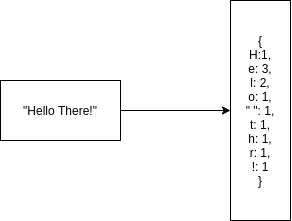

### Array Chunking

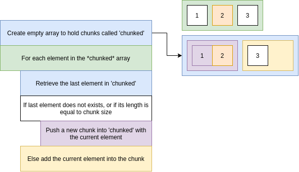

### Recursion Tips

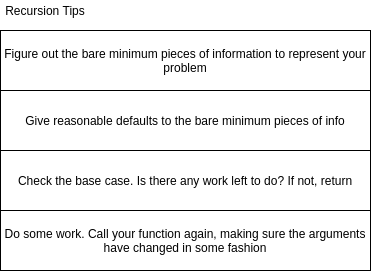

## Complexity

### Determining Complexity

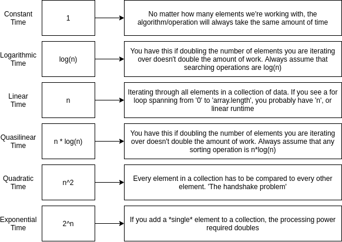

### Big 'O' Notation

### Identifying Runtime Complexity

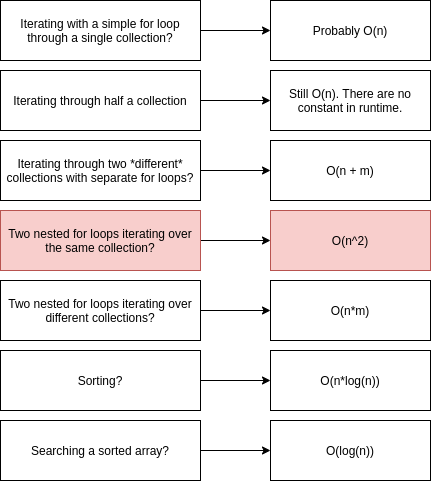

## Data Structures

- Ways of organizing information with optimal 'runtime complexity' for adding or removing records.

### Queue

- FIFO - first in first out

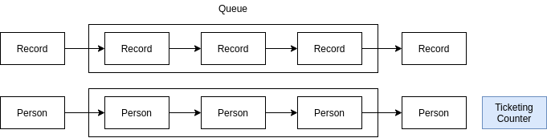

| Queue | Array Equivalent - Java Script |
|---|---|
| Add to queue | array.unshift(); |
| Remove from queue | array.pop(); |

### Stack

- FILO - first in last out.
- LIFO - last in first out.

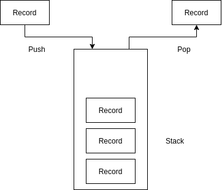

- push - Add a record to the stack.
- pop - Remove the "top" record in the stack.
- peek - Return the "top" record without popping it.

**Build Queue using 2 Stacks**

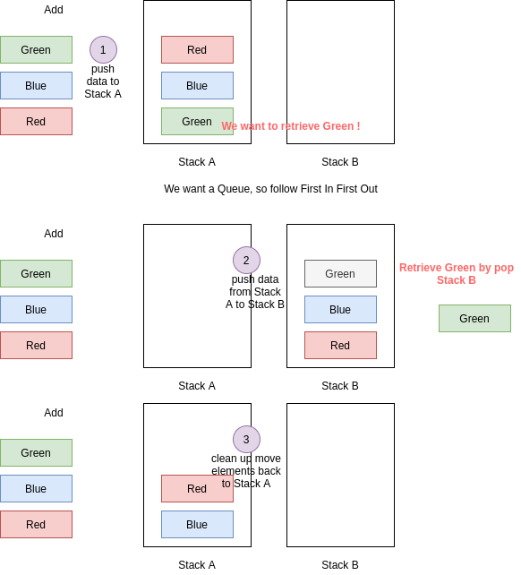

### Tree

**Breadth-First Traversal**

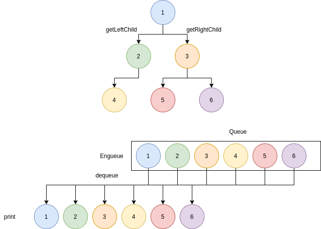

**Depth-First Traversal**

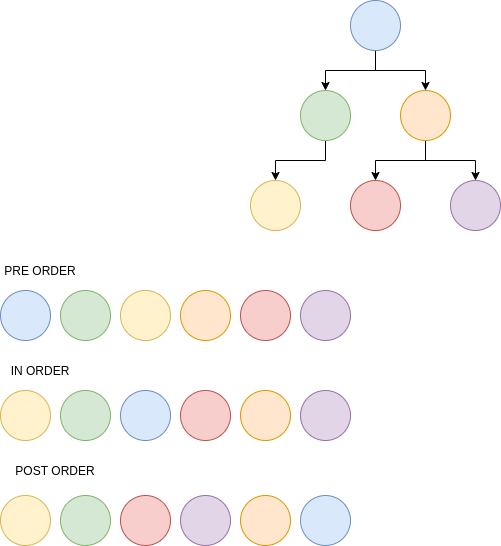

**Minimum Value**

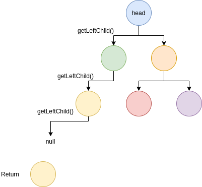

### Linked List

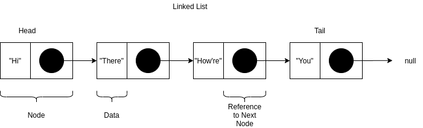

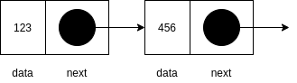

- Linked List only knows about first node.

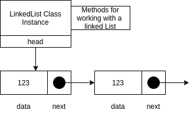

**Linked List Remove Last**

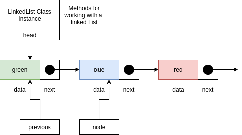

**Linked List Insert Last**

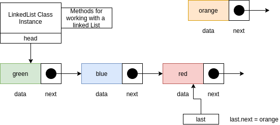

**Linked List get at**

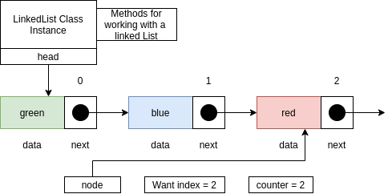

**Linked List remove at**

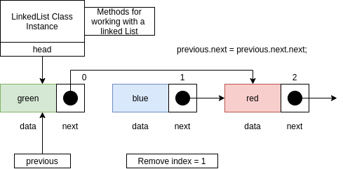

**Linked List insert at**

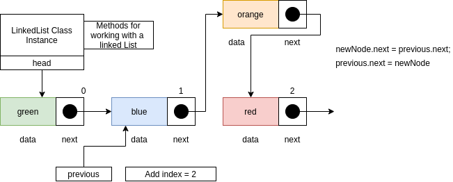

**Midpoint**

- Advance slow by one node.
- Advance fast by two nodes.

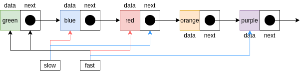

**Circular Linked List**

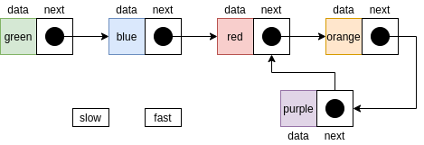

**From Last**

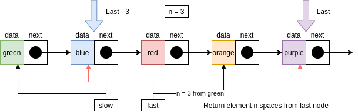

### Tree

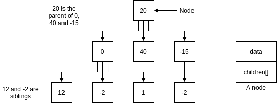

- Iterating through a tree = traversal.
- There are different orders of traversal.

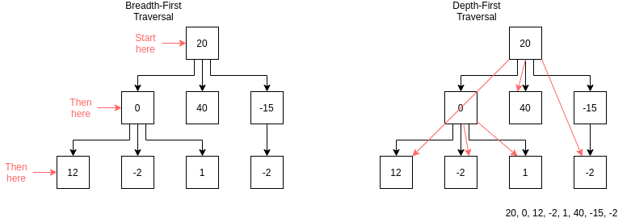

**Tree add**

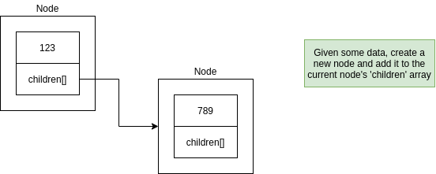

**Tree remove**

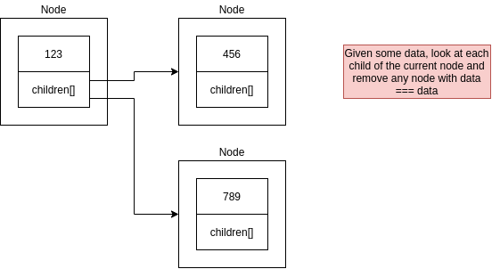

**Tree class**

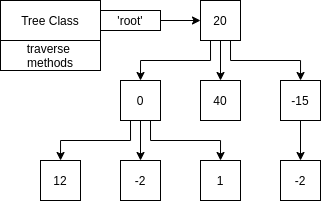

### Binary Search Tree

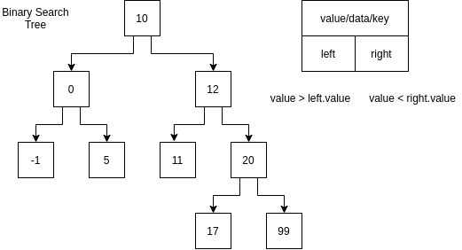

**Validate**

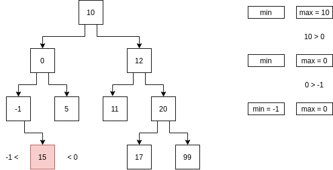

## Sorting Algorithms

### Bubble Sort

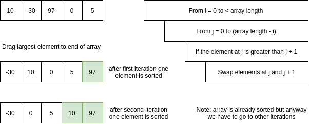

### Selection Sort

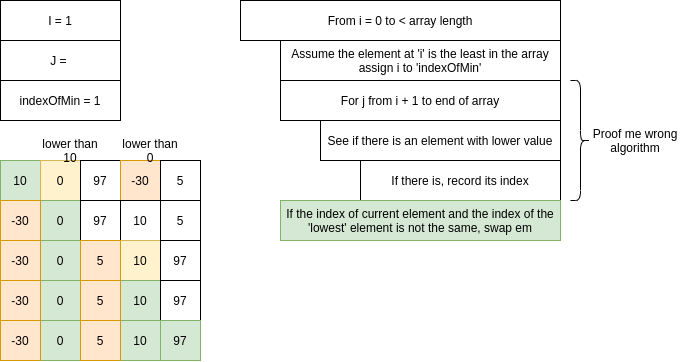

### Merge Sort

**Merge**

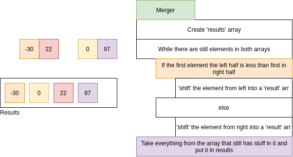

**Merge Sort**

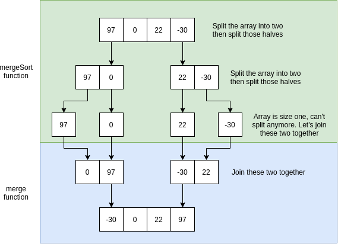
