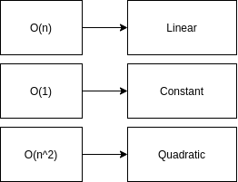

### String Reversal

- Turn 'str' into an array.
- Call 'reverse' method on the array.
- Join the array back into a string.
- Return the result.

### Max Chars

- What is the most common character in the string?
- Does string A have the same characters as string B (is it an anagram)?
- Does the given string have any repeated characters in it?

**Use Map**

### Array Chunking

### Recursion Tips

## Complexity

### Determining Complexity

### Big 'O' Notation

### Identifying Runtime Complexity

## Data Structures

- Ways of organizing information with optimal 'runtime complexity' for adding or removing records.

### Queue

- FIFO - first in first out

| Queue | Array Equivalent - Java Script |
|---|---|
| Add to queue | array.unshift(); |
| Remove from queue | array.pop(); |

### Stack

- FILO - first in last out.
- LIFO - last in first out.

- push - Add a record to the stack.
- pop - Remove the "top" record in the stack.
- peek - Return the "top" record without popping it.

**Build Queue using 2 Stacks**

### Tree

**Breadth-First Traversal**

**Depth-First Traversal**

**Minimum Value**

### Linked List

- Linked List only knows about first node.

**Linked List Remove Last**

**Linked List Insert Last**

**Linked List get at**

**Linked List remove at**

**Linked List insert at**

**Midpoint**

- Advance slow by one node.
- Advance fast by two nodes.

**Circular Linked List**

**From Last**

### Tree

- Iterating through a tree = traversal.
- There are different orders of traversal.

**Tree add**

**Tree remove**

**Tree class**

### Binary Search Tree

**Validate**

## Sorting Algorithms

### Bubble Sort

### Selection Sort

### Merge Sort

**Merge**

**Merge Sort**

