# Docker

**Why use Docker?**

```console
docker run -it redis
```

- Docker makes it really easy to install and run software without worrying about setup or dependencies.

**What is Docker?**


- **What is Docker:** Docker is a platform or ecosystem around creating and running containers.


- **Image:** Single file with all the dependencies and config required to run a program.
- **Container:** Instance of an image. Runs a program (running program).

**Docker for Windows/Mac**


- **Docker Client CLI:** Tool that we are going to issue commands to.
- **Docker Server (Docker Daemon):** Tool that is responsible for creating images, running containers etc.

```console
docker run hello-world
```

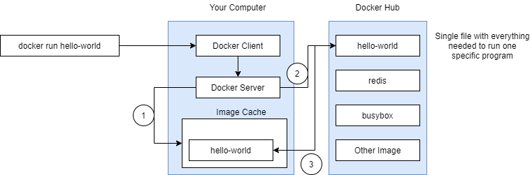

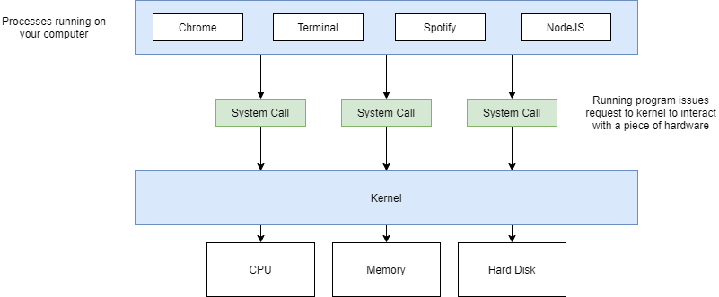


**Namespacing**

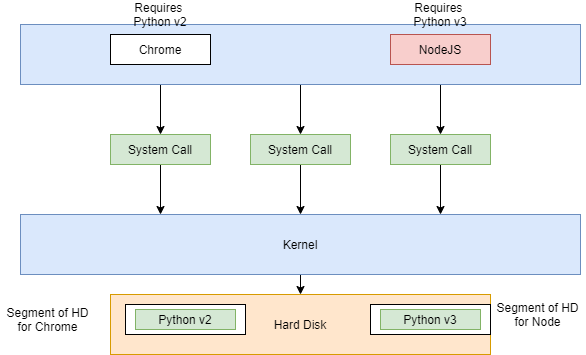

**Container**

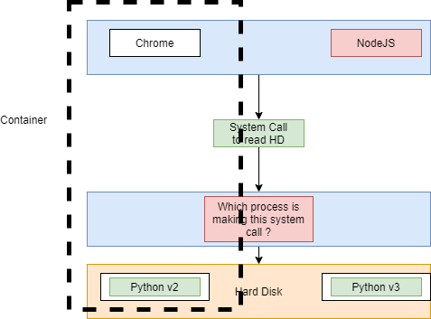

- **Namespacing:** Isolating resources per process (or group of processes), say - this area of hard drive is for this process:
    - Processes
    - Hard drive
    - Network
    - Users
    - Hostnames
    - IPC
- **Control Groups (cgroups):** Limit amount of resources used per process, say - amount of bandwidth process can use:
    - Memory
    - CPU Usage
    - HD I/O
    - Network Bandwidth
- **Container:** group of processes assignee to it.


**Containers vs Images**


**How Docker Running on Your Computer?**

- **Namespacing** and **Control groups** are Linux OS features.
- On MacOS/Windows docker runs through Linux Virtual Machine.

***

## Docker Client CLI

```
docker run <image_name> <command>
```

```console
docker run hello-world
```

```console
docker run busybox echo hi there

# list content of container
docker run busybox ls
```

**Listing running containers**

```console
docker ps
docker run busybox ping google.com

# on second terminal - see running busybox container
docker ps

# lists all containers ever created
docker ps -a
docker ps | wc -l
```

**Container lifecycle**

```
docker run = docker create + docker start
docker create IMAGE_NAME
docker start CONTAINER_ID
```

```console
docker create hello-world

# '-a' watch for output from container and prints out in terminal
docker start -a CONTAINER_ID
```

**Restarting stopped container**

```console
docker ps -all
docker start CONTAINER_ID
```

**Removing stopped container**

```console
docker ps --all
docker system prune
```

**Retrieving log output**

```console
docker create busybox echo hi there
docker start CONTAINER_ID

# retrieve logs from stopped container (no rerun container)
docker logs CONTAINER_ID
```

**Stopping Containers**

```
docker stop CONTAINER_ID
docker kill CONTAINER_ID
```

- **SIGTERM:** Stop container with cleanup time.
- **SIGKILL:** Shut down immediately.

```console
docker create busybox ping google.com
docker start CONTAINER_ID
docker logs CONTAINER_ID

# after 10 s kill signal
docker stop CONTAINER_ID
docker start CONTAINER_ID

# kill immediately
docker kill CONTAINER_ID
```

### Multi command container

```console
redis-server
redis-cli
```

**With Docker**

- Execute an additional command in a container.

```
docker exec -it CONTAINER_ID COMMAND
```

```console
docker run redis

# it - type input to container
docker exec -it CONTEINER_ID redis-cli

# Inside redis-cli docker container
> set myvalue 5
> get myvalue
```

- Communication Channels, communicate information to linux process:
    - **STDIN:** Communicate information into a process.
    - **STDOUT:** Communicate information outside a process.
    - **STDERR:** Like STDOUT but error info.

```
-it flag
-i means execute STDIN on redis cli
-t show text pretty
```

```console
docker exec -i CONTAINER_ID redis-cli
```

**Shell access (exec) to running container**

```console
docker exec -it CONTAINER_ID sh

> redis-cli
```

- Command Preprocessor:
    - bash
    - powershell
    - zsh
    - sh

**Starting with a shell**

- Execute an additional command in a container.

```console
docker run -it busybox sh
```

**Container isolation**

```console
docker run -it busybox sh
```

- No sharing data between separate running containers.

***

## Creating Docker Images

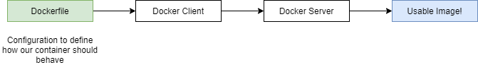

**Creating a Dockerfile**

- Specify a base image.
- Run some commands to install additional programs.
- Specify a command to run on container startup.

### Building Dockerfile

**Create an image that runs redis-server**

```Dockerfile
# Use an existing docker image as a base
FROM alpine

# Download and install a dependency
RUN apk add --update redis

# Tell the image what to do when it starts as a container
CMD ["redis-server"]
```

```console
docker build .
docker run CONTAINER_ID
```

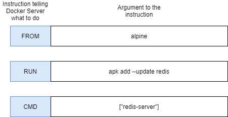

**Writing a Dockerfile == Being given a computer with no OS and being told to install Chrome**

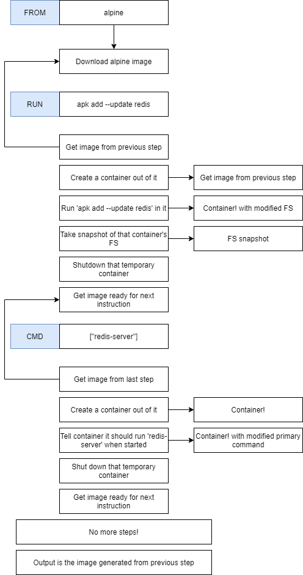

### Rebuilds with cache

**Tagging an Image**

- **-t:** Tag argument.
    - **<docker_id>/<repo_project_name>:<version>**

```console
docker build -t majka/redis:latest .

# run image
docker run majka/redis
```

**Manual image generation**

- **Alpine base image:** They come with a pre-installed set of programs that are useful.
- Docker commit.

```console
docker run -it alpine sh
# inside image
> apk add --update redis

# On second terminal
docker ps
# container id from previous step
docker commit -c 'CMD ["redis-server"]' CONTAINER_ID

# Container id from previous step
docker run CONTAINER_ID
```

***

## Project with Docker


**Below steps are not quite correct**

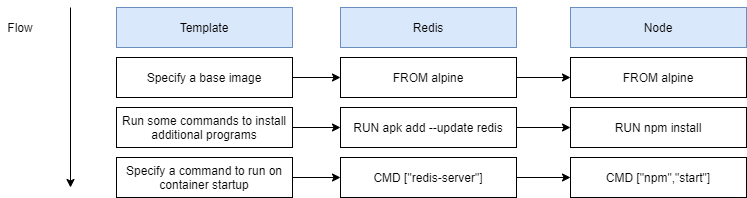

### Base Images issues

- **alpine:** In Docker world image as small and compact as possible (no npm).
- **node:alpine:** Alpine version of node.

**Missing files**

- Make sure that created **index.js** and **package.json** are copied to container image. 
- Container has its own filesystem.
- **COPY:** Instruction to move file and folders from our local system to filesystem in a container.
    - `COPY <path on your machine> <path inside container>`

```console
# build with tag
docker build -t majka/simpleweb .
docker run majka/simpleweb
```

### Container port mapping

- Any time someone makes request on a local network, take that request and port it to port in a container.
    - **LOCALHOST_PORT:INSIDE_CONTAINER_PORT**

```console
docker run -p LOCALHOST_PORT:INSIDE_CONTAINER_PORT IMAGE_ID`
docker run -p 8080:8080 majka/simpleweb`
```

- On windows **http://192.168.99.100:8080/**

**Shell into container**

```console
docker run -it majka/simpleweb sh
```

- Any following command will be executed relative to this path in the container.

```Dockerfile
WORKDIR /usr/app
```

**Another way to shell into a container**

```console
docker exec -it CONTAINER_ID sh
```

**Dockerfile**

```Dockerfile
# Specify a base image
FROM node:alpine

# Execute command relative to this path
WORKDIR /usr/app

# Copy required files for npm
COPY ./package.json ./

# Install some dependencies
RUN npm install

# Copy rest of files
COPY ./ ./

# Default command
CMD ["npm", "start"]
```

***

## Docker Compose

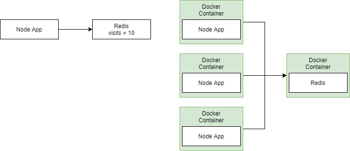

- Node App.
- Redis (in memory data store).

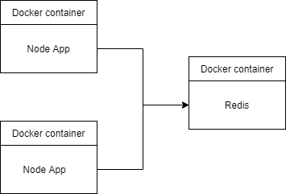

- Node App.

```Dockerfile
FROM node:alpine

WORKDIR /app

COPY package.json .
RUN npm install
COPY . .

CMD ["npm", "start"]
```

```console
docker build -t majka/visits:latest .
```

- Redis.

```console
docker run redis
```

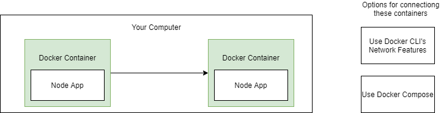

**Docker Compose**

- Separate CLI that gets installed along with Docker.
- Used to start up **multiple Docker containers** at the same time.
- Automates some long-winded arguments we were passing to **docker run**.


**docker-compose.yml**

```yml
version: '3'
services:
  redis-server:
    image: 'redis'
  node-app:
    build: .
    ports:
      - "4001:8081"
```

**Docker Compose commands**

| docker | docker-compose |
|---|---|
| docker run myimage | docker-compose up |
| docker build . | docker-compose up --build |
| docker run myimage | docker-compose up --build |

```console
docker-compose up
docker-compose up --build
```

```console
docker run -d redis
docker ps
docker stop CONTAINER_ID
```

**Lunch in background**

```console
docker-compose up -d
```

**Stop Containers**

```console
docker-compose down
```

**Container restarts**

| Status Code | Description |
|---|---|
| 0 | We exited and everything is OK |
| 1,2,3, etc | We exited because something went wrong! |

| Case | Description |
|---|---|
| no | Never attempt to restart this container if it  stops or crashes |
| always | If this container stops always attempt to restart it |
| on-failure | Only restart if the container stops with an error code |
| unless-stopped | Always restart unless forcibly stopped |

**Docker Container status**

```console
docker-compose ps
```

***

## Production Grade Workflow

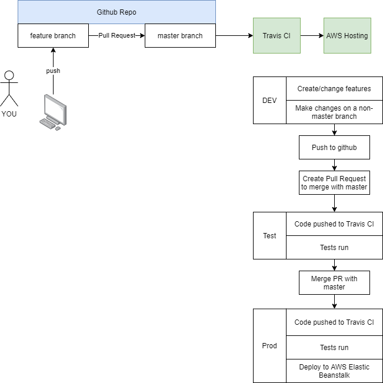

- React application.

```console
npm install -g create-react-app
create-react-app frontend
```

| Command | Description |
|---|---|
| npm run start | Starts up a development server. For development use only |
| npm run test | Runs tests associated with the project |
| npm run build | Builds a production version of the application |


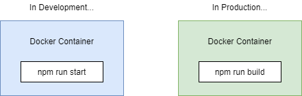

**Dockerfile.dev**

```Dockerfile
FROM node:alpine

WORKDIR /app

COPY package.json .
RUN npm install

COPY . .

CMD ["npm", "run", "start"]
```

- Docker build with specified file **-f** option.

```console
docker build -f Dockerfile.dev .
docker run -p 3000:3000 IMAGE_ID
```

### Docker Volumes

```console
docker run -p 3000:3000 -v /app/node_modules -v $(pwd):/app IMAGE_ID
docker build -f Dockerfile.dev .
docker run -p 3000:3000 -v /app/node_modules -v $(pwd):/app CONTAINER_ID

# Windows
# http://192.168.99.100:3000/
docker run -it -p 3000:3000 -v /app/node_modules -v ${PWD}:/app -e CHOKIDAR_USEPOLLING=true CONTAINER_ID
```

### Docker Compose

- Makes execute **docker run** easier.

```yml
version: '3'
services:
  web:
    build:
      context: .
      dockerfile: Dockerfile.dev
    ports:
      - "3000:3000"
    volumes:
      - /app/node_modules
      - .:/app
```

```console
docker-compose up
```

**Executing tests**

```console
npm run test

docker build -f Dockerfile.dev .
docker run -it CONTAINER_ID npm run test

# Live updating test
docker-compose up
docker exec -it CONTAINER_ID npm run test
```

**Docker compose for running tests**

```Dockerfile
tests:
    build:
        context: .
        dockerfile: Dockerfile.dev
    volumes:
        - /app/node_modules
        - .:/app
    # override command
    command: ["npm", "run", "test"]
```

- **docker attach:** Attach to container STDIN, STDOUT, STDERR to primary process.
    - Can now execute commands from **our terminal**.

```console
docker-compose up --build
docker attach CONTAINER_ID

# Shell into container
docker exec -it CONTAINER_ID sh

# Run test inside container
docker exec -it CONTAINER_ID npm run test
```

### NGINX

**Dev Environment**


***

**Prod Environment**


***

**Prod Environment nginx**

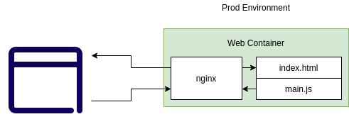

- Web server. Taking incoming traffic, route it and response to it.

**Multi Step Docker Builds**


```Dockerfile
# Build Phase
FROM node:alpine as builder
WORKDIR /app
COPY package.json .
RUN npm install
COPY . .
RUN npm run build

# Run Phase
FROM nginx
COPY --from=builder /app/build /usr/share/nginx/html
```

**Running nginx**

```console
docker build .
# 80 in nginx port inside docker container
docker run -p 8080:80 CONTAINER_ID
```

***

## CI Deployment with AWS

### Github Setup


### Travis CI


```yml
sudo: required
services:
  - docker
before_install:
  - docker build -t matn7/docker-react -f Dockerfile.dev .
script:
  - docker run -e CI=true matn7/docker-react npm run test
```

### AWS Elastic Beanstalk

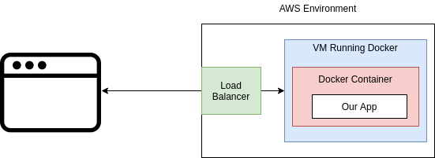

- Automatically scale up.

### Travis config for deployment

**.travis.yml**

```yml
sudo: required
services:
  - docker
before_install:
  - docker build -t matn7/docker-react -f Dockerfile.dev .
script:
  - docker run -e CI=true matn7/docker-react npm run test
deploy:
  provider: elasticbeanstalk
  region: "us-east-1"
  app: "docker"
  env: "Docker-env"
  bucket_name: "elasticbeanstalk-us-east-1-ID"
  bucket_path: "docker"
  on:
    branch: master
  access_key_id: $AWS_ACCESS_KEY
  secret_access_key: $AWS_SECRET_KEY
```

**Exposing port in Dockerfile - final version**

```Dockerfile
FROM node:alpine
WORKDIR /app
COPY package*.json ./
RUN npm install
COPY . .
RUN npm run build

FROM nginx
EXPOSE 80
COPY --from=0 /app/build /usr/share/nginx/html
```

***

## Multi Container Deployment

- Single Container Deployment Issues:
    - The app was simple, no outside dependencies.
    - Our image built multiple times.
    - How do we connect to a database from a container?

**Multi container**

- **Redis:** In memory data store
- **Postgres:** Database

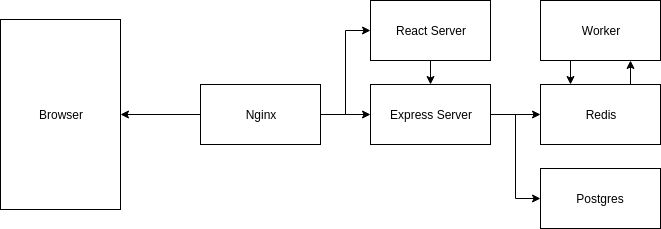

**Application Architecture**


```console
create-react-app client
```

**client - Dockerfile**

```Dockerfile
FROM node:alpine
WORKDIR /app
COPY ./package.json ./
RUN npm install
COPY . .
CMD ["npm", "run", "start"]
```

```console
docker build -f Dockerfile.dev .
```

**server - Dockerfile**

```Dockerfile
FROM node:alpine
WORKDIR /app
COPY ./package.json ./
RUN npm install
COPY . .
CMD ["npm", "run", "dev"]
```

**worker - Dockerfile**

```Dockerfile
FROM node:alpine
WORKDIR /app
COPY ./package.json ./
RUN npm install
COPY . .
CMD ["npm", "run", "dev"]
```

**Multi Service docker compose**

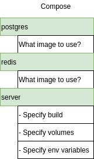

### NGINX Path Routing

- NGINX will look for all of these requests (**index.html**, **main.js**, **/api/values/all**, **/api/values/current**) 
and decide which server route request to.


**default.conf**

```conf
upstream client {
    server client:3000;
}

upstream api {
    server api:5000;
}

server {
    listen: 80;

    location / {
        proxy_pass http://client;
    }

    location /api {
        rewrite /api/(.*) /$1 break;
        proxy_pass http://api;
    }
}
```

**docker-compose.yml**

```yml
version: '3'
services:
  postgres:
    image: 'postgres:latest'
  redis:
    image: 'redis:latest'
  nginx:
    restart: always
    build:
      dockerfile: Dockerfile.dev
      context: ./nginx
    ports:
      - '3050:80'
  api:
    build:
      dockerfile: Dockerfile.dev
      context: ./server
    volumes:
      - /app/node_modules
      - ./server:/app
    environment:
      - REDIS_HOST=redis
      - REDIS_PORT=6379
      - PGUSER=postgres
      - PGHOST=postgres
      - PGDATABASE=postgres
      - PGPASSWORD=postgres_password
      - PGPORT=5432
  client:
    build:
      dockerfile: Dockerfile.dev
      context: ./client
    volumes:
      - /app/node_modules
      - ./client:/app
  worker:
    build:
      dockerfile: Dockerfile.dev
      context: ./worker
    volumes:
      - /app/node_modules
      - ./worker:/app
```

```
http://localhost:3050/
```

***

## CI Flow for Multiple Images

### Multi Container Deployments

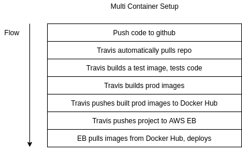

**worker, server - Dockerfile**

```Dockerfile
FROM node:alpine
WORKDIR /app
COPY ./package.json ./
RUN npm install
COPY . .
CMD ["npm", "run", "start"]
```

**nginx - Dockerfile**

```Dockerfile
FROM nginx
COPY ./default.conf /etc/nginx/conf.d/default.conf
```

### Multiple Nginx instances


### Travis configuration

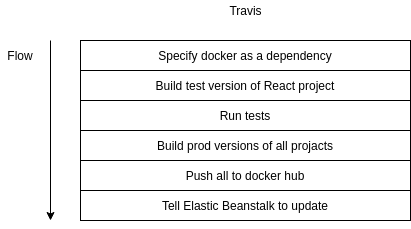

**.travis.yml**

```yml
sudo: required
services:
  - docker
before_install:
  - docker build -t [:secure:]/react-test -f ./client/Dockerfile.dev ./client
script:
  - docker run -e CI=true [:secure:]/react-test npm test
after_success:
  - docker build -t [:secure:]/multi-client ./client
  - docker build -t [:secure:]/multi-nginx ./nginx
  - docker build -t [:secure:]/multi-server ./server
  - docker build -t [:secure:]/multi-worker ./worker
  # Log in to the docker CLI
  - echo "$DOCKER_PASSWORD" | docker login -u "$DOCKER_ID" --password-stdin
  # Take those images and push them to docker hub
  - docker push [:secure:]/multi-client
  - docker push [:secure:]/multi-nginx
  - docker push [:secure:]/multi-server
  - docker push [:secure:]/multi-worker
```

***

## Multi Container Deployments to AWS

### Multi Container Definition Files


**Amazon ECS tasks definitions**

**ECS**

- Tell Elastic Beanstalk how to run containers.

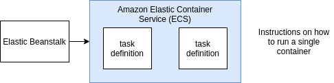

**nginx-links**


**aws.amazon.com**

### Managed Data Service Provider


**AWS Elastic Cache**

- Automatically creates and maintains **Redis** instances for you.
- Easy to scale.
- Build in **logging + maintenance**.
- Good security.
- Easier to migrate off of EB with.

**AWS Relational Database Service**

- Automatically creates and maintains Postgres instances for you.
- Easy to scale.
- Built in **logging + maintenance**.
- Good security.
- Automated backups and rollbacks.
- Easier to migrate off of EB with.

### AWS VPC's and Security Groups

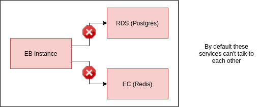

- EB Instance.
- EC (Redis).
- RDS (Postgres).
- Setup links between EB and EC and RDS.

**VPC**

- Private little network.
- Isolated to just your account.
- Implements Security rules.


**Security Group (Firewall Rules)**

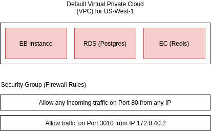


- Allow any incoming traffic on Port **80** from any IP.
- Allow traffic on Port **3010** from IP **172.0.40.2**.
- Allow any traffic from any other AWS service has this security group (new group):
    - If any instance EB, RDS, EC belong to this group let the traffic go between them.

## RDS Database Creation

### ElasticCache (EC) Redis

**Dockerrun.aws.json**

```json
{
    "AWSEBDockerrunVersion": 2,
    "containerDefinitions": [
        {
            "name": "client",
            "image": "[:secure:]/multi-client",
            "hostname": "client",
            "essential": false,
            "memory": 128
        },
        {
            "name": "server",
            "image": "[:secure:]/multi-server",
            "hostname": "api",
            "essential": false,
            "memory": 128
        },
        {
            "name": "worker",
            "image": "[:secure:]/multi-worker",
            "hostname": "worker",
            "essential": false,
            "memory": 128
        },
        {
            "name": "nginx",
            "image": "[:secure:]/multi-nginx",
            "hostname": "nginx",
            "essential": true,
            "portMappings": [
                {
                    "hostPort": 80,
                    "containerPort": 80
                }
            ],
            "links": ["client", "server"],
            "memory": 128
        }
    ]
}
```

**.travis.yml**

```yml
sudo: required
services:
  - docker
before_install:
  - docker build -t [:secure:]/react-test -f ./client/Dockerfile.dev ./client
script:
  - docker run -e CI=true [:secure:]/react-test npm test
after_success:
  - docker build -t [:secure:]/multi-client ./client
  - docker build -t [:secure:]/multi-nginx ./nginx
  - docker build -t [:secure:]/multi-server ./server
  - docker build -t [:secure:]/multi-worker ./worker
  # Log in to the docker CLI
  - echo "$DOCKER_PASSWORD" | docker login -u "$DOCKER_ID" --password-stdin
  # Take those images and push them to docker hub
  - docker push [:secure:]/multi-client
  - docker push [:secure:]/multi-nginx
  - docker push [:secure:]/multi-server
  - docker push [:secure:]/multi-worker
deploy:
  edge: true
  provider: elasticbeanstalk
  region: us-east-1
  app: multi-docker
  env: MultiDocker-env
  bucket_name: elasticbeanstalk-us-east-1-NUM
  bucket_path: docker-multi
  on:
    branch: master
  access_key_id: $AWS_ACCESS_KEY
  secret_access_key: $AWS_SECRET_KEY 
```

***

## Kubernetes

**Scaling Strategy for Elastic Beanstalk**


**Preferred Solution**

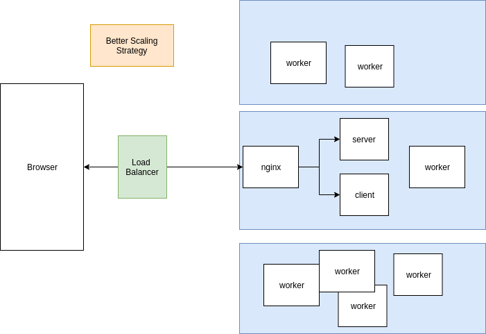

**Kubernetes Cluster**


**What is Kubernetes?**

- System for running **many containers over multiple different machines**.

**Why use Kubernetes?**

- When you need to run many containers with different images.

### Kubernetes DEV and PROD


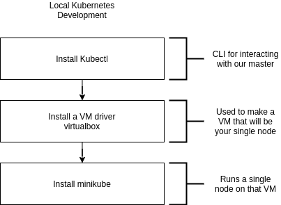

```console
minikube start
minikube status
kubectl cluster-info
```

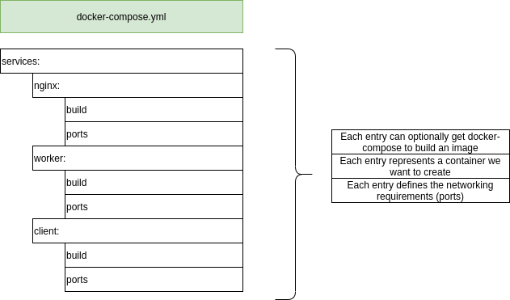

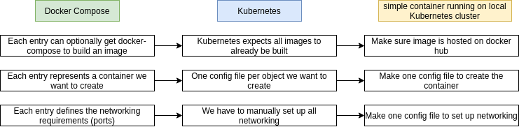

### Object Types and API Versions


**client-pod.yaml**

```yaml
apiVersion: v1
kind: Pod
metadata:
  name: client-pod
  labels:
    component: web
spec:
  containers:
    - name: client
      image: [:secure:]/multi-client
      ports:
        - containerPort: 3000
```

**client-node-port.yaml**

```yaml
apiVersion: v1
kind: Service
metadata:
  name: client-node-port
spec:
  type: NodePort
  ports:
    - ports: 3050
      targetPort: 3000
      nodePort: 31515
  selector:
    component: web
```

**Config File**

- **Pod:** Run a container.
- **Service:** Setup networking inside Kubernetes cluster.
- **StatefulSet**
- **ReplicaController**

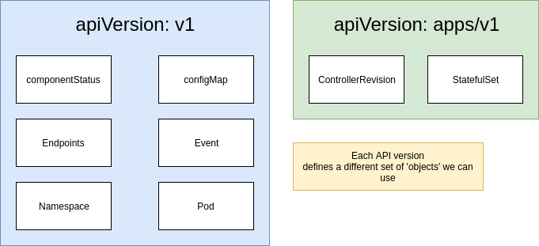

### Pod

- Node used by Kubernetes to run some number of different objects.
- The smallest thing that we can deploy. 
- Can run one or more container inside it.


**Containers related to each other**

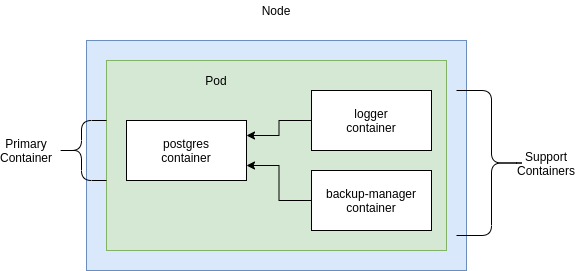

**Object Types**

- **Pods:** Runs one or more closely related containers.
- **Services:** Sets up **networking** in a Kubernetes Cluster.
    - **ClusterIP**
    - **NodePort:** Exposes a container to the outside world (for DEV only).
    - **LoadBalancer**
    - **Ingress**

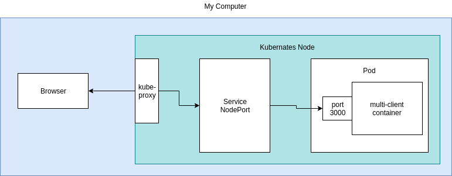

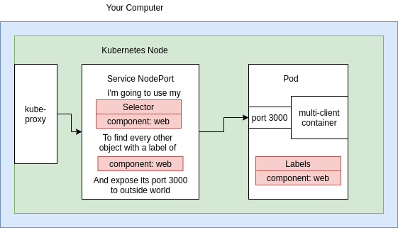

**NodePort Service**

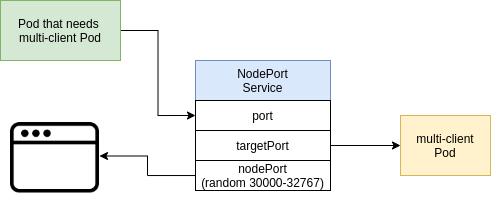

### Connecting to Running containers

**Feed a config file to kubectl**

```
kubectl apply -f FILENAME
```

```console
kubectl apply -f client-node-port.yaml
kubectl apply -f client-pod.yaml

# print status of all running pods
kubectl get pods
# NAME         READY   STATUS    RESTARTS   AGE
# client-pod   1/1     Running   0          93s

# print the status of all running services
kubectl get services
# NAME               TYPE        CLUSTER-IP       EXTERNAL-IP   PORT(S)          AGE
# client-node-port   NodePort    10.106.137.174   <none>        3050:31515/TCP   71s
# kubernetes         ClusterIP   10.96.0.1        <none>        443/TCP          29h

# print ip address of minikube vm
minikube ip

# 192.168.99.100:31515
```

### Deployment Process

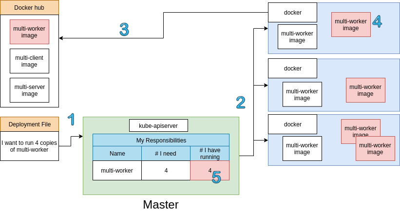

### Imperative vs Declarative Deployments

- Kubernetes is a system to deploy containerized apps.
- **Nodes** are individual machines (or vm's) that run containers.
- **Master** are machines (or vm's) with a set of programs to manage nodes.
- Kubernetes didn't build our images - it got them from somewhere else (DockerHub).
- Kubernetes (the master) decided where to run each container - each node can run a dissimilar set of containers.
- To deploy something, we update the desired state of the master with a config file.
- The master works constantly to meet your desired state.


- **Always use Declarative Approach.**

***

## Maintaining Containers

**Imperative**

- Run a command to list out current running pods.
- Run a command to update the current pod to use a new image.

**Declarative**

- Update our config file that originally created the pod.
- Throw the updated config file into **kubectl**.

**Update existing object**

```console
kubectl apply -f client-pod.yaml
# pod/client-pod configured

# Get detailed info about object
kubectl describe pod client-pod

kubectl apply -f client-pod.yaml
```

**Limitations in config updates**

- **Pod Config:**
    - **containers:** Can't be updated.
    - **name:** Can't be updated.
    - **port:** Can't be updated.
    - **image:** Can be updated.
    
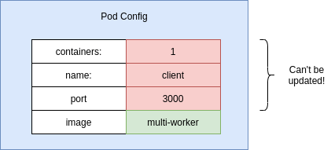    

**Object Types**

- **Pods:** Runs one or more closely related containers.
- **Services:** Sets up networking in a Kubernetes cluster.
- :star: **Deployment:** Maintains a set of identical pods, ensuring that they have the correct config and  that the
right number exists.

| Pods | Deployment |
|---|---|
| Runs a single set of containers | Runs a set of identical pods (one or more) |
| Good for one-off dev purposes | Monitors the state of each pod, updating as necessary |
| Rarely used directly in production | Good for dev |
| | Good for production |

   

**Deployment configuration file**

```yaml
apiVersion: apps/v1
kind: Deployment
metadata:
  name: client-deployment
spec:
  replicas: 1
  selector:
    matchLabels:
      component: web
  template:
    metadata:
      labels:
        component: web
    spec:
      containers:
        - name: client
          image: [:secure:]/multi-client
          ports:
            - containerPort: 3000
```

**Applying a Deployment**

```console
kubectl get pods
# delete pod
kubectl delete -f client-pod.yaml
kubectl get pods

# apply deployment object
kubectl apply -f client-deployment.yaml
kubectl get pods
kubectl get deployments

minikube ip
# 192.168.99.100:31515

kubectl get pods -o wide

kubectl get deployments
kubectl describe pods
```

**Why use service?**

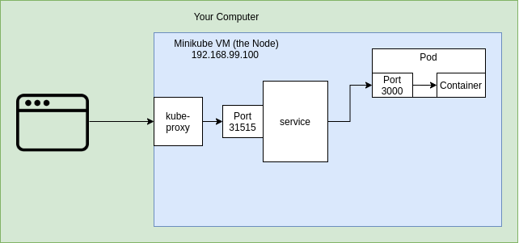

- Each Pods are identified from ip address.
- How to connect directly to Pod?
- Service looks at Pod that matches it selector and **automatically route traffic over to**.

**Scaling and Changing Deployments**

- Change replicas in **yaml** file to 5.

```yaml
...
spec:
  replicas: 5
...
```

```console
kubectl apply -f client-deployment.yaml

kubectl get deployments
# NAME                READY   UP-TO-DATE   AVAILABLE   AGE
# client-deployment   4/5     5            4           23m

kubectl get pods
# NAME                                 READY   STATUS    RESTARTS   AGE
# client-deployment-79cb4cc8f5-2ltfj   1/1     Running   0          33s
# client-deployment-79cb4cc8f5-6tdkx   1/1     Running   0          33s
# client-deployment-79cb4cc8f5-8svl2   1/1     Running   0          33s
# client-deployment-79cb4cc8f5-k59kb   1/1     Running   0          2m57s
# client-deployment-79cb4cc8f5-wdv2k   1/1     Running   0          33s
```

### Update Image Version

- Change deployment to use **multi-client** again.
- Update the **multi-client** image, push to Docker Hub.
- Get the deployment to recreate our Pods with the latest version of **multi-client**.

**Triggering Deployment updates**

```console
kubectl apply -f client-deployment.yaml
# deployment.apps/client-deployment unchanged
```


**Imperative command to update image**

- Tag the image with a version number, push to docker hub.

```console
docker build -t [:secure:]/multi-client:v5 .
docker push [:secure:]/multi-client:v5
```

- Run a **kubectl** command forcing the deployment to use the new image version.

```
kubectl set image OBJECT_TYPE/OBJECT_NAME CONTAINER_NAME = NEW_IMAGE_NAME
```

```console
kubectl set image deployment/client-deployment client=[:secure:]/multi-client:v5
kubectl get pods
# test on
# http://192.168.99.100:31515
```

### Reconfiguring docker CLI


**Configure the VM to use your docker server**

```console
eval $(minikube docker-env)
```

**This only configures current terminal window**

```console
minikube docker-env
```

**Why use docker in Node**

- Use debugging techniques from Docker CLI - many commands available through **kubectl**.
- Manually kill containers to test Kubernetes ability to **self-heal**.
- Delete a cached image in the node - **docker system prune -a**.

```console
# see logs/shell to console using docker cli
docker logs CONTAINER_ID
docker exec -it CONTAINER_ID sh

# see logs/shell to console using kubectl
> kubectl get pods
# NAME                                 READY   STATUS    RESTARTS   AGE
# client-deployment-ID                 1/1     Running   0          31m

> kubectl logs client-deployment-ID
> kubectl exec -it client-deployment-ID sh
```

***

## Production


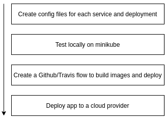

**NodePort vs ClusterIP service**


**NodePort Service (outside world)**

- **port:** Other Pod that needs multi-client Pod.
- **targetPort:** multi-client Pod.
- **nodePort:** Random 30000-32767.

**Applying files with kubectl**

```console
# delete old deployments
kubectl get deployments
kubectl delete deployment client-deployment
# deployment.apps "client-deployment" deleted

kubectl get deployments
# No resources found in default namespace.

kubectl get services
kubectl delete service client-node-port
# service "client-node-port" deleted

# apply a group of config files
kubectl apply -f k8s
kubectl get pods
kubectl get services
```

**Express API Deployment Config**


```console
kubectl apply -f k8s
kubectl get pods
kubectl get deployments
kubectl get services

kubectl get pods
kubectl logs SERVER-DEPLOYMENT-ID
```

### Postgres PVC (Persistent Volume Claim)


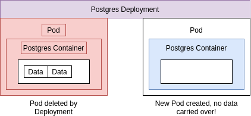

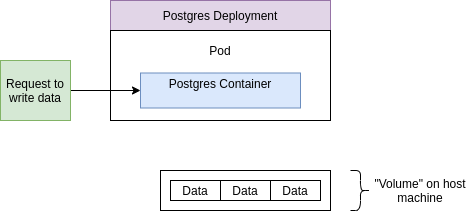

- Volume on host machine exists outside of host machine.

**Kubernetes Volumes**

- Volume in generic container terminology.

```
Some type of mechanism that allows a container to access a filesystem outside itself.
```

- Volume in Kubernetes.

```
An object that allows a container to store data at the Pod level.
```

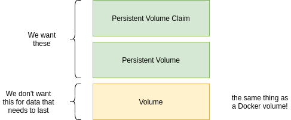

**Kubernetes Volume**


- Volumes tied to Pod. 
- If Pod crashes volumes crash as well.
- Not appropriate for storing data.

**Persistent Volume**


- Long term durable storage not tied to specific Pod or container.
- **Statically Provisioned Persistent Volume:** Persistent Volumes created ahead of time.
- **Dynamically provisioned Persistent Volume:** Persistent Volumes created on fly.
- **Persistent Volume Claim:** Advertisement for storage options.

**Persistence Volume Claim**

- **Access Modes:**
    - **ReadWriteOnce:** Can be used by a single node.
    - **ReadOnlyMany:** Multiple nodes can read from this.
    - **ReadWriteMany:** Can be read and written by many nodes.
- Allocate Persistent Volume.

```console
kubectl get storageclass
# NAME                 PROVISIONER                RECLAIMPOLICY   VOLUMEBINDINGMODE   ALLOWVOLUMEEXPANSION   AGE
# standard (default)   k8s.io/minikube-hostpath   Delete          Immediate           false                  2d23h

kubectl describe storageclass
```

**On Cloud Provider**

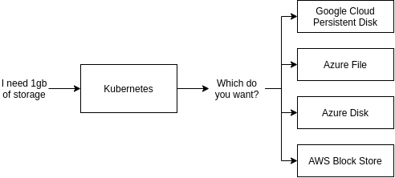

```console
kubectl apply -f k8s
kubectl get pods

#:q! get persistent volume
kubectl get pv
```

### Setup Environment Variables

```yaml
spec:
  containers:
    - name: worker
      image: [:secure:]/multi-worker
      env:
        - name: REDIS_HOST
          value: redis-cluster-ip-service
        - name: REDIS_PORT
          value: 6379
```

**[Deployment:multi-worker pod] -- http://redis-cluster-ip-service --> ClusterIP Service [Deployment:Redis pod]**

### Secret


**Create Secret**

```
kubectl create secret generic SECRET_NAME --from-literal key=value
```

- **create:** Imperative command to create a new object.
- **secret:** Type of object we are going to create.
- **generic:** Type of secret.
    - tls
    - docker-registry
- **SECRET_NAME:** Name of secret, for later reference in a Pod config.
- **--from-literal:** We are going to add the secret info into this command, as opposed to from **.** file.
- **key=value:** Key-value pair of the secret information.

```console
kubectl create secret generic pgpassword --from-literal PGPASSWORD=12345asdf
kubectl get secrets

# NAME                  TYPE                                  DATA   AGE
# default-token-wflvs   kubernetes.io/service-account-token   3      3d5h
# pgpassword            Opaque                                1      22s
```

```yaml
env:
    - name: POSTGRES_PASSWORD
      valueFrom:
        secretKeyRef:
          name: pgpassword
          key: PGPASSWORD
```

### Load Balancer Services


- Load Balancer give access to one set of Pods.

**Ingress**

- NGINX Ingress.
- **ingress-nginx:** A community project.

**https://github.com/kubernetes/ingress-nginx`**

- **kubernetes-ingress:** A project led by the company nginx.
- Setup of ingress-nginx changes depending on environment (local, GC, AWS, Azure).
- Ingress routing rules to get traffic to services.


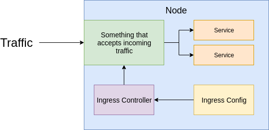

- **Ingress Controller:** Watches for changes to the ingress and updates the **thing** that handles traffic.
- **Ingress Config:** Object that has a set of configuration rules describing how traffic should be routed.


**Ingress on Google Cloud**


- New service **default-backend** pod. 
- Health checks make sure cluster is working.

### Setting up Ingress locally

```console
# for mac
kubectl apply -f https://raw.githubusercontent.com/kubernetes/ingress-nginx/master/deploy/static/mandatory.yaml
minikube addons enable ingress
```

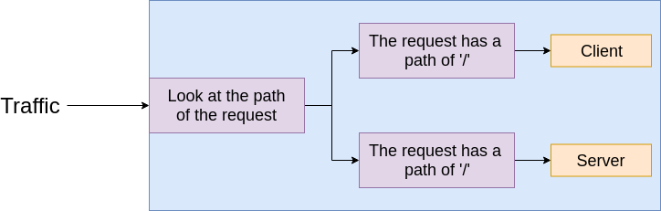

```yaml
spec:
  rules:
    - http:
        paths:
          - path: /
            backend:
              serviceName: client-cluster-ip-service
              servicePort: 3000
          - path: /api/
            backend:
              serviceName: server-cluster-ip-service
              servicePort: 5000
```

```console
minikube ip
kubectl apply -f k8s
```

**minikube Dashboard**

**http://192.168.99.100**

```console
minikube dashboard
```

***

## Kubernetes Prod Deployment


### Google Cloud vs AWS for Kubernetes

**Why Google Cloud?**

- Google created Kubernetes!
- AWS got Kubernetes support.
- Easier to use Kubernetes on Google Cloud.
- A good documentation.

**Travis Deployment**

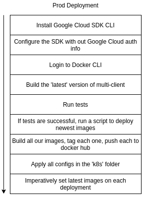

### Generating a Service Account


**Install Ruby in a container**

```console
docker run -it -v $(pwd):/app ruby:2.4 sh
```

**Install Travis CLI inside container**

```console
docker run -it -v $(pwd):/app ruby:2.4 sh

gem install travis --no-rdoc --no-ri
gem install travis
travis login
# copy json file form GCP into volumed dir
travis encrypt-file service-account.json -r [:secure:]/multi-k8s
```

### GCP setup

**.travis.yml**

```yaml
sudo: required
services:
  - docker 
before_install:
  - openssl aes-256-cbc -K $encrypted_HASH_key -iv $encrypted_HASH_iv -in service-account.json.enc -out service-account.json -d
  - curl https://sdk.cloud.google.com | bash > /dev/null;
  - source $HOME/google-cloud-sdk/path.bash.inc
  - gcloud components update kubectl
  - gcloud auth activate-service-account --key-file service-account.json
  - gcloud config set project PROJECT_ID
  - gcloud config set compute/zone PROJECT_ZONE
  - gcloud container clusters get-credentials KUBERNETES_CLUSTER_NAME
```

**Run tests**

**.travis.yml**

```yaml
  - echo "$DOCKER_PASSWORD" | docker login -u "$DOCKER_USERNAME" --password-stdin
  - docker build -t [:secire:]/react-test -f ./client/Dockerfile.dev ./client
script:
  - docker run -e CI=true [:secure:]/docker-react npm run test
```

**Travis deployment**

**.travis.yml**

```yaml
deploy:
  provider: script
  script: bash ./deploy.sh
  on:
    branch: master
```

**Update image version**

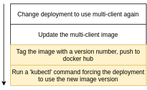

**GIT_SHA**

```console
git rev-parse HEAD
```

```yaml
env:
  global:
    - SHA=$(git rev-parse HEAD)
```

**deploy.sh**

```shell script
docker build -t [:secure:]/multi-client:latest -t [:secure:]/multi-client:$SHA -f ./client/Dockerfile ./client
docker build -t [:secure:]/multi-server:latest -t [:secure:]/multi-server:$SHA -f ./server/Dockerfile ./server
docker build -t [:secure:]/multi-worker:latest -t [:secure:]/multi-worker:$SHA -f ./worker/Dockerfile ./worker
docker push [:secure:]/multi-client:latest
docker push [:secure:]/multi-server:latest
docker push [:secure:]/multi-worker:latest
docker push [:secure:]/multi-client:$SHA
docker push [:secure:]/multi-server:$SHA
docker push [:secure:]/multi-worker:$SHA
kubectl apply -f k8s
kubectl set image deployments/server-deployment server=[:secure:]/multi-server:$SHA
kubectl set image deployments/client-deployment client=[:secure:]/multi-client:$SHA
kubectl set image deployments/worker-deployment worker=[:secure:]/multi-worker:$SHA
```

### GCloud CLI on Cloud Console

```console
gcloud config set project PROJECT_ID
gcloud config set compute/zone PROJECT_ZONE
gcloud container clusters get-credentials KUBERNETES_CLUSTER_NAME
```

**Creating a Secret on Google Cloud**

```console
kubectl get pods

# create secret
kubectl create secret generic pgpassword --from-literal PGPASSWORD=mypgpassword123
```

**Helm setup**

- Helm program to administrate third party software inside Kubernetes cluster.
- Tiller Pod inside Kubernetes to make configurations.

### Kubernetes Security with RBAC

**Role Based Access Control (RBAC)**

- Limits who can access and modify objects in our cluster.
- Enabled on Google Cloud by default.
- Tiller wants to make changes to our cluster, so it needs to get some permissions set.

**Terminology**

- **User Accounts:** Identifies a person administering our cluster.
- **Service Accounts:** Identifies a **Pod** administering a cluster.
- **ClusterRoleBinding:** Authorizes an account to do a certain set of actions across the entire cluster.
- **RoleBinding:** Authorizes an account to do a certain set of actions in a single namespace.

```console
kubectl get namespaces
# NAME              STATUS   AGE
# default           Active   165m
# kube-node-lease   Active   165m
# kube-public       Active   165m
# kube-system       Active   165m
```

**Assigning Tiller a Service Account**

```console
# Create a new service account called tiller in the kube-system namespace
kubectl create serviceaccount --namespace kube-system tiller

# Create a new clusterrolebinding with the role 'cluster-admin' and assign it to service account 'tiller'
kubectl create clusterrolebinding tiller-cluster-role --clusterrole=cluster-admin --serviceaccount=kube-system:tiller

# init helm
helm init --service-account tiller --upgrade
```

### Ingress-NGINX with Helm

```console
helm install stable/nginx-ingress --name my-nginx --set rbac.create=true
```

**A workflow for changing in Prod**

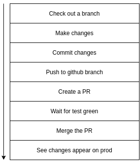

```console
git checkout -b dev
```

## HTTPS setup with Kubernetes

### Cert manager

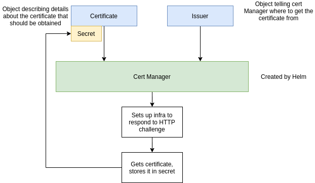

**issuer.yaml**

```yaml
apiVersion: certmanager.k8s.io/v1alpha1
kind: ClusterIssuer
metadata:
  name: letsencrypt-prod
spec:
  acme:
    server: https://acme-v02.api.letsencrypt.org/directory
    email: ''
    privateKeySecretRef:
     name: letsencrypt-prod
    http01: {}
```

**certificate.yaml**

```yaml
apiVersion: certmanager.k8s.io/v1alpha1
kind: Certificate
metadata:
  name: MY-DOMAIN-NAME-tls
spec:
  secretName: MY-DOMAIN-NAME
  issuerRef:
    name: letsencrypt-prod
    kind: ClusterIssuer
  commonName: MY_DOMAIN_NAME
  dnsNames:
    - MY_DOMAIN_NAME
    - www.MY_DOMAIN_NAME
  acme:
    config:
      - http01:
          ingressClass: nginx
        domains:
          - MY_DOMAIN_NAME
          - www.MY_DOMAIN_NAME
```

```console
kubectl get certificates
kubectl describe certificates 
```

### Ingress Config for HTTPS

**ingress-service.yaml**

```yaml
    certmanager.k8s.io/cluster-issuer: 'letsencrypt-prod'
    nginx.ingress.kubernetes.io/ssl-redirect: 'true'
spec:
  tls:
    - hosts:
      - MY_DOMAIN_NAME
      - www.MY_DOMAIN_NAME
    secretName: MY-DOMAIN-NAME
  rules:
    - host: MY_DOMAIN_NAME
```

## Development with Skaffold


**skaffold.yaml**

```yaml
apiVersion: skaffold/v1beta2
kind: Config
build:
  local:
    push: false
  artifacts:
    - image: [:secure:]/multi-client
      context: client
      docker:
        dockerfile: Dockerfile.dev
      sync:
        '**/*.js': .
        '**/*.css': .
        '**/*.html': .
    - image: [:secure:]/multi-server
      context: server
      docker:
        dockerfile: Dockerfile.dev
      sync:
        '**/*.js': .
    - image: [:secure:]/multi-worker
      context: worker
      docker:
        dockerfile: Dockerfile.dev
      sync:
        '**/*.js': .
deploy:
  kubectl:
    manifests:
      - k8s/client-deployment.yaml
      - k8s/server-deployment.yaml
      - k8s/worker-deployment.yaml
      - k8s/server-cluster-ip-service.yaml
      - k8s/client-cluster-ip-service.yaml
```

```console
skaffold dev
```
