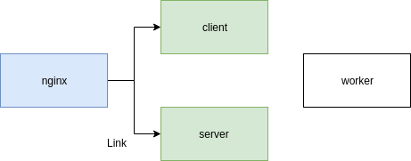
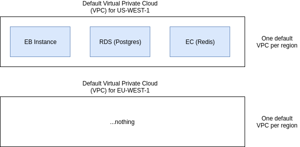
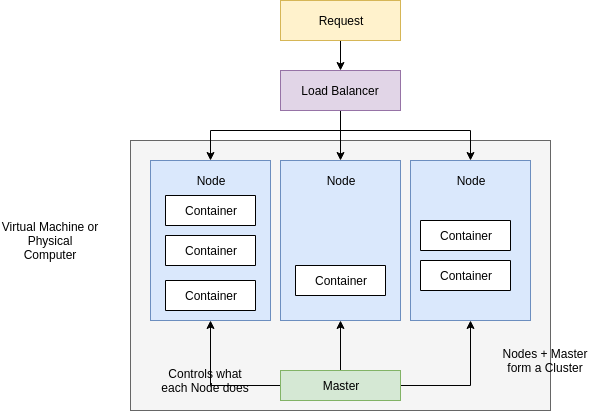
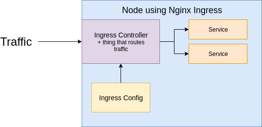

# Docker

- Docker makes it really easy to install and run software without worrying about setup or
dependencies

```
docker run -it redis
```

- What is Docker
    - Docker is a platform or ecosystem around creating and running containers

- Image
    - Single file with all the deps and config required to run a program

- Container
    - Instance of an image. Runs a program

- Docker Client CLI
    - Tool thet we are going to issue commands to

- Docker Server (Docker Daemon)
    - Tool that is responsible for creating images, running containers etc

```
docker run hello-world
```

- Namespacing: Isolating resources per process (or group of processes)
    - Processes, Hard drive, Network, Users, Hostnames, IPC
- Control Groups (cgroups): Limit amount of resources used per process
    - Memory, CPU Usage, HD I/O, Network Bandwidth

- Container: group of processes assigne to it

## Docker Client CLI

```
docker run hello-world
```

```
docker run <image_name> <command>
```

```
docker run busybox echo hi there
docker run busybox ls
```

- Listing running containers

```
docker ps
docker ps -a
docker ps | wc -l
```

- Container lifecycle

```
docker run = docker create + docker start

docker create <image_name>
docker start <container id>
```

```
docker create hello-world
docker start -a bc219e7a88bb1fabb72c19fd502dfb16c5cb12f24a43c5699f796c6fe10d61eb

// -a wath for output from container
```

- Removing stopped container

```
docker system prune
```

- Retrieving log output

```
docker create busybox echo hi there
docker start e207a006e63dee92d178f0b4f4cd619987c3b6782ad3e332ed6d49bcb9c015a7

docker logs e207a006e63dee92d178f0b4f4cd619987c3b6782ad3e332ed6d49bcb9c015a7
```

- Stopping Containers

```
docker stop <container_id>
docker kill <container_id>
```

- SIGTERM: stop conteiner with cleanup time
- SIGKILL: shut down immediately

```
docker create busybox ping google.com
docker start bb656a399364f374a4a701fdd34783381894f550979365dca464d407c061205f

docker stop bb656a399364 // after 10 s kill signal

docker start bb656a399364
docker kill bb656a399364 // kill immediately
```

- Multi-command container

```
redis-server
redis-cli
```

**with docker**

- Execute an additional command in a container

```
docker exec -it <conteiner_id> <command>
```

```
docker run redis
docker exec -it b67b8ebf2444 redis-cli
```

- STDIN, STDOUT, STDERR: communicate information to linux process
- STDIN: communicate information into a process
- STDOUT: communicate information outside a process
- STDERR: line STDOUT but error info

```
-it flag
-i means execute STDIN on redis cli
-t show text pretty

docker exec -i b67b8ebf2444 redis-cli
```

- shell access to running container

```
docker exec -it b67b8ebf2444 sh
```

```
bash | powershell | zsh | sh

Command Processors
```

- Starting with a shell

```
docker run -it busybox sh
```

- Container isolation

---

## Creating Docker Images

```
Dockerfile -> Docker Client -> Docker Server -> Usable Image!
```

- **Creating a Dockerfile**
    - Specify a base image
    - Run some commands to install additional programs
    - Specify a command to run  on container startup

```
docker build .

docker run 81615c9d8a9c
```

- Dockerfile

```Dockerfile
# Use an existing docker image as a base
FROM alpine

# Download and install a dependency
RUN apk add --update redis

# Tell the image what to do when it starts
# as a container
CMD ["redis-server"]
```

- Instruction elling Docker Server what to do
    - FROM alpine : startup pre installed set of programs that are useful to you! Sort of OS
    - RUN apk add --update redis : package manager preinstalled in alpine base image
    - CMD

- Alpine base image

- Docker commit
```
docker run -it alpine sh
#  apk add --update redis

// On second terminal
docker ps // container id from previous step
docker commit -c 'CMD ["redis-server"]' d9332e55b0c9

// Container id from previous step
docker run 5a9f892320a6e23c098da4c84bbb22986b48bf1272f736a710011e696187c4ab
```

---

## Docker project

- Node JS application

- alpine: in Docker world image as small and compact as possible
- COPY: instruction to move file and folders from our local system to filesystem in container

```
// build with tar
docker build -t majka/simpleweb .
docker run majka/simpleweb
```

- Container port mapping

```
// localhost port : container port
docker run -p 8080 : 8080 <image id>

docker run -p 8080:8080 majka/simpleweb
```

- Shell into container

```
docker run -it majka/simpleweb sh

docker run -p 8080:8080 majka/simpleweb

docker exec -it 15dbf4eedbbf sh
```

- Any following command will be executed relative to this path in the container

```
WORKDIR /usr/app
```

- Final version

```Dockerfile
# Specify a base image
FROM node:alpine

WORKDIR /usr/app

# From current working directory to ./ in container
COPY ./package.json ./

# Install some dependencies
RUN npm Install

COPY ./ ./

# Default command
CMD ["npm", "start"]
```

***

## Docker Compose

```
Node App ---> Redis (in memory data store)


+------------------+
| Docker Container |
|------------------|
| Node App         |------+
|                  |      |     +------------------+
+------------------+      |     | Docker Container |
                          +---->|------------------|
+------------------+            |                  |
| Docker Container |      +---->|   Redis          |
|------------------|      |     +------------------+
| Node App         |------+
|                  |
+------------------+
```

- Node App

```Dockerfile
FROM node:alpine

WORKDIR '/app'

COPY package.json .
RUN npm install
COPY . .

CMD ["npm", "start"]
```

```
docker build -t majka/visits:latest .
```

- Redis

```
docker run redis
```

- Docker compose
    - Separate CLI that gets installed along with Docker
    - Used to start up multiple Docker containers at the same time
    - Automates some of the long-winded arguments we were passing to 'docker run'

**docker-compose.yml**

```yml
version: '3'
services:
  redis-server:
    image: 'redis'
  node-app:
    build: .
    ports:
      - "4001:8081"
```

```
docker run myimage -----> docker-compose up


docker build .     -----> docker-compose up --build
docker run myimage
```

```
docker run -d redis
docker ps
docker stop <docker_id>
```

**Lunch in background**
```
docker-compose up -d
```

**Stop Containers**
```
docker-compose down
```

**Container restarts**

| "no" | Never attempt to restart this container if it  stops or crashes |
|---|---|
| always | If this container stops always attempt to restart it |
| on-failure | Only restart if the container stops with an error code |
| unless-stopped | Always restart unless forcibly stoped |

**Docker Container status**
```
docker-compose ps
```

***

## Production Grade Workflow

- React application

```
npm install -g create-react-app
create-react-app frontend

npm run start       // Starts up dev server
npm run test        // Runs tests
npm run build       // Builds a production version of the application
```

**Dockerfile.dev**
```Dockerfile
FROM node:alpine

WORKDIR '/app'

COPY package.json .
RUN npm install

COPY . .

CMD ["npm", "run", "start"]
```

```
docker build -f Dockerfile.dev .

docker run -p 3000:3000 <image_id>
```

### Docker Volumes

```
docker run -p 3000:3000 -v /app/node_modules -v $(pwd):/app <image_id>

docker build -f Dockerfile.dev .
docker run -p 3000:3000 -v /app/node_modules -v $(pwd):/app bef5d9a97007
```

### Docker Compose

- Makes execute `docker run` easier

```yml
version: '3'
services:
  web:
    build:
      context: .
      dockerfile: Dockerfile.dev
    ports:
      - "3000:3000"
    volumes:
      - /app/node_modules
      - .:/app
```

```
docker-compose up
```

- Run test

```
npm run test

docker build -f Dockerfile.dev .
docker run -it d3d34d267455 npm run test

docker-compose up
docker exec -it 9eb9e2d28f6f npm run test
```

```Dockerfile.dev
  tests:
    build:
      context: .
      dockerfile: Dockerfile.dev
    volumes:
      - /app/node_modules
      - .:/app
    command: ["npm", "run", "test"]
```

```
docker-compose up --build
docker attach 93e1fcc6fa7f

# Shell into container
docker exec -it 93e1fcc6fa7f sh
```

### nginx

- Web server. Taking incomming traffic, route it and response to it

### Multi-Step Docker Builds

```
1. Use node:alpine
2. Copy the package.json file
3. Install dependencies     // deps only needed to execute 'npm run build'
4. Run 'npm run build'
5. Start nginx              // Where nginx compong from ?
```

```Dockerfile
FROM node:alpine as builder
WORKDIR '/app'
COPY package.json .
RUN npm install
COPY . .
RUN npm run build

FROM nginx
COPY --from=builder /app/build /usr/share/nginx/html
```

```
docker build .
// 80 in nginx port inside docker container
docker run -p 8080:80 c2edc713ec9c
```

***

## CI deployment with AWS

### Github Setup

```
1. Create github repo
2. Create local git repo
3. Connect local git to github remote
4. Push work to github
```

### Travic CI

```
1. Tell Travis we need a copy of docker running
2. Build our image using Dockerfile.dev
3. Tell Travis how to run our test suite
4. Tell travis how to deploy our code to AWS
```

```yml
sudo: required
services:
  - docker

before_install:
  - docker build -t matn7/docker-react -f Dockerfile.dev .


script:
  - docker run -e CI=true matn7/docker-react npm run test
```

### AWS Elastic Beanstalk

**.travis.yml**

```yml
deploy:
  provider: elasticbeanstalk
  region: us-west-2
  app: "docker"
  env: "Docker-env"
  bucket-name: "elastickeanstalk-us-west-2-<some_nums>"
  bucket-path: "docker"
  on:
    branch: "master"
  access_key_id:
    secure: $AWS_ACCESS_KEY
  secret_access_key:
    secure: $AWS_SECRET_KEY
```

**Exposing port in Dockerfile**

```Dockerfile
EXPOSE 80
```

***

## Multi Container Deployment

- Single Container Deployment Issues
    - The app was simple - no outside dependencies
    - Our image was built multiple times
    - How do we connect to a database from a container?

**Multi container**


```console
create-react-app client
```

```Dockerfile
FROM node:alpine
WORKDIR '/app'
COPY ./package.json ./
RUN npm install
COPY . .
CMD ["npm", "run", "start"]
```

```console
docker build -f Dockerfile.dev .
```

```Dockerfile
FROM node:alpine
WORKDIR "/app"
COPY ./package.json ./
RUN npm install
COPY . .
CMD ["npm", "run", "dev"]
```

```yml
version: '3'
services:
  postgres:
    image: 'postgres:latest'
  redis:
    image: 'redis:latest'
  nginx:
    restart: always
    build:
      dockerfile: Dockerfile.dev
      context: ./nginx
    ports:
      - '3050:80'
  api:
    build:
      dockerfile: Dockerfile.dev
      context: ./server
    volumes:
      - /app/node_modules
      - ./server:/app
    environment:
      - REDIS_HOST=redis
      - REDIS_PORT=6379
      - PGUSER=postgres
      - PGHOST=postgres
      - PGDATABASE=postgres
      - PGPASSWORD=postgres_password
      - PGPORT=5432
  client:
    build:
      dockerfile: Dockerfile.dev
      context: ./client
    volumes:
      - /app/node_modules
      - ./client:/app
  worker:
    build:
      dockerfile: Dockerfile.dev
      context: ./worker
    volumes:
      - /app/node_modules
      - ./worker:/app
```

### Nginx Path Routing

- Nginx will look for all of these requests (index.html, main.js, values/all, values/current) and decide
which server route request to.


**default.conf**

```conf
upstream client {
    server client:3000;
}

upstream api {
    server api:5000;
}

server {
    listen: 80;

    location / {
        proxy_pass http://client;
    }

    location /api {
        rewrite /api/(.*) /$1 break;
        proxy_pass http://api;
    }
}
```

### Nginx Image

```console
docker-compose up --build
```

**test app**
```
http://localhost:3050/
```

## CI flow for Multiple Images

### Multi-Container Deployments


1. Push code to github
2. Travis automatically pulls repo
3. Travis builds a test image, tests code
4. Travis builds prod images
5. Travis pushes build prod image to Docker Hub
6. Travis pushes project to AWS EB
7. EB pulls image from Docker Hub, deploys

```Dockerfile
FROM node:alpine
WORKDIR "/app"
COPY ./package.json ./
RUN npm install
COPY . .
CMD ["npm", "run", "start"]
```

***

## Multi Container Deployments to AWS

### Multi-Container Definition Files


```
Amazon ECS tasks definitions
```

**nginx-links**



```
aws.amazon.com
```

### Managed Data Service Provider


**AWS Elastic Cache**

- Automatically creates and maintains Redis instances for you
- Easy to scale
- Build in logging + maintenance
- Good security
- Easier to migrate off of EB with

**AWS Relational Database Service**

- Automatically creates and maintains Postgres instances for you
- Easy to scale
- Built in logging + maintenance
- Good security
- Automated backups and rollbacks
- Easier to migrate off of EB with

### AWS VPC's and Security Groups

- EB Instance
- EC (Redis)
- RDS (Postgres)

- Setup links between EB and EC and RDS



**Security Group (Firewall Rules)**

- Allow any incoming traffic on Port 80 from any IP
- Allow traffic on Port 3010 from IP 172.0.40.2

- Allow any traffic from any other AWS service that has this security group (new group)
    - If any instance EB, RDS, EC belong to this group let the traffic go between them

### RDS Database Creation

### ElastiCache Redis

***

## Kubernates

**Scaling Strategy for Elastic Beanstalk**


**Prefer Solution**


**Kubernates Cluster**



- What is Kubernates?
    - System for running many different containers over multiple different machines
- Why use Kubernates?
    - When you need to run many different containers with different images

### Kubernates DEV and PROD

- Development
    - minikube
- Production
    - Amazon Elastic Container Service for Kubernates (EKS)
    - Google Cloud Kubernates Engine (GKE)


### Object Types and API Versions
- Config File:
    - Pod - Run a container
    - Service - setup networking inside Kubernates cluster
    - StatefulSet
    - ReplicaController

```
Config File - Used to create Objects
- Objects server different purposes, running a container, monitoring a container, setting up networking
```


### Pod


- Containers related to each others

- Pod for postgres
    - postgres container
    - logger container  - support container
    - backup manager    - support container

**Object Types**
- Pods - Runs one or more closely related containers
- Services - Sets up networking in a Kubernates Cluster
    - ClusterIP
    - NodePort - Exposes a container to the outside world (for DEV only)
    - LoadBalancer
    - Ingress


**Feed a config file t Kubectl**

```console
kubectl apply -f <filename>
kubectl apply -f client-node-port.yaml
kubectl apply -f client-pod.yaml

# print status of all running pods
kubectl get pods

# print the status of all running services
kubectl get services

# print ip address of minikube vm
minikube ip

#192.168.99.100:31515
```

### Deployment Process

```console
kubectl get pods
docker ps

docker kill <pod_container_id>
docker ps   // container still there
```


### Imperative vs Declarative Deployments

- Kubernates - is a system to deploy containerized apps
- Nodes - are individual machines (or vm's) that run containers
- Master - are machines (or vm's) with a set of programs to manage nodes
- Kubernates didn't build our images - it got them from somewhere else (DockerHub)
- Kubernates (the master) decided where to run each container - each node can run a dissimilar set of containers
- To deploy something, we update the desired state of the master with a config file
- The master works constantly to meet your desired state

- Imperative Deployments
    - Do exactly these steps to arrive at this container setup
- Declarative Deployments
    - Our container setup should look like this, make it happen

## Maintaining Containers

- Imperative:
    - Run a command to list out current running pods
    - Run a command to update the current pod to use a new image
- Declarative:
    - Update our config file that originally created the pod
    - Throw the updated config file into kubectl

**update existing object**

```console
kubectl apply -f client-pod.yaml
# pod/client-pod configured

// Get detailed info about object
kubectl describe pod client-pod
```

```console
kubectl apply -f client-pod.yaml
```

- Pod Config
    - containers - can't be updated
    - name       - can't be updated
    - port       - can't be updated
    - image      - can be updated

**Object Types**

- Pods
    - Runs one or more closely related containers
- Services
    - Sets up networking in a Kubernates cluster
- Deployment
    - Maintains a set of identical pods, ensuring that they have the correct config and
    that the right number exists

| Pods | Deployment |
|---|---|
| Runs a single set of containers | Runs a set of identical pods (one or more) |
| Good for one-off dev purposes | Monitors the state of each pod, updating as necessary |
| Rarely used directly in production | Good for dev |
| | Good for production |

### Applying a Deployment

```console
kubectl get pods
kubectl delete -f client-pod.yaml
kubectl get pods

kubectl apply -f client-deployment.yaml
kubectl get pods
kubectl get deployments

minikube ip
// 192.168.99.100:31515

kubectl get pods -o wide

kubectl get deployments
kubectl describe pods
```

**Update Image Version**

- Change deployment to use multi-client again
- Update the multi-client image, push to Docker-Hub
- Get the deployment to recreate our pods with the latest version of multi-client

```
minikube ip
// 192.168.0.1:31515
```

### Triggering Deployment updates

```console
kubectl apply -f client-deployment.yaml
```

- Manually delete pods to get the deployment to recreate them with the latest version
- Tag built images with a real version number and specify version in the config file
    - Adds an extra step in the production deployment process
- Use an imperative command to update the image version the deployment should use
    - Uses an imperative command

```console
docker build -t majki/multi-client:v5 .
docker push majki/multi-client:v5

// Imperative command to update image
kubectl set image <Object_type> / <object_name> <container_name> = <new image to use>

kubectl set image deployment/client-deployment client=majki/multi-client:v5
kubectl get pods
minikube ip
// 31515 port
```

### Reconfiguring docker CLI

- Configure the VM to use your docker server

```console
eval $(minikube docker-env)
```

- this only configures current terminal window

```console
minikube docker-env
```

## Production


- Create config files for each service and deployment
- Test locally on minikube
- Create a Github/Travis flow to build images and deploy
- Deploy app to a cloud provider

- Services: Sets up networking in a Kubernates Cluster
    - ClusterIP:    Exposes a set of pods to other objects in the cluster
    - NodePort:     Exposes a set of pods to the outside world (only good for dev purposes!!!)
    - LoadBalancer
    - Ingress

- NodePort Service:
    - port: OTHER Pod that needs multi-client Pod
    - targetPort: multi-client Pod
    - nodePort (random 30000-32767)

```console
kubectl get deployments
kubectl delete deployment client-deployment
kubectl get deployments
kubectl get services
kubectl delete service client-node-port
```

```console
kubectl apply -f k8s
kubectl get pods
kubectl get services
```


```console
kubectl apply -f k8s
kubectl get pods
kubectl get deployments
kubectl get services

kubectl get pods
kubectl logs <deployment-name>
```

### Postgres PVC (Persistent Volume Claim)


- Volume on host machine exists outside of host machine

**Kubernates Volumes**

- Volume in generic container terminology

```
Some type of mechanism that allows a container to access a filesystem outside itself
```

- Volume in Kubernates

```
An object that allows a container to store data at the pod level
```

```
Persistent Volume Claim

Persistent Volume

Volume
```

**Kubernates Volume**


**Persistent Volume**


**Persistence Volume Claim**

- Access Modes
    - ReadWriteOnce - Can be used by a single node
    - ReadOnlyMany - Multiple nodes can read from this
    - ReadWriteMany - Can be read and written by many nodes

- Allocate Persistent Volume

```console
kubectl get storageclass
kubectl describe storageclass
```

- On a Cloud Provider
    - Google Cloud Persistent Disk
    - Azure File
    - Azure Disk
    - AWS Block Store

```console
kubectl apply -f k8s
kubectl get pods
kubectl get pv          // get persistent volume
```

### Setup Environment Variables

- REDIS_HOST
- REDIS_PORT
- PGUSER
- PGHOST
- PGDATABASE
- PGPORT
- PGPASSWORD


```
[Deployment:multi-worker pod] -- http://redis-cluster-ip-service --> ClusterIP Service [Deployment:Redis pod]
```

### Secret

- Object Type
    - Secrets - Securely stores a piece of information in the cluster, such as a database password

**Create Secret**

```
kubectl create secret generic <secret-name> --from-literal key=value

- create - Imperative command to create a new object
- secret - Type of object we are going to create
- generic - Type of secret
    - tls
    - docker-registry
- <secret-name> - Name of secret, for later reference in a pod config
- --from-literal - We are going to add the secret info into this command, as opposed to from . file
- key=value - Key-value pair of the secret information
```

- Run locally

```console
kubectl create secret generic pgpassword --from-literal PGPASSWORD=12345asdf

kubectl get secrets

kubectl apply -f k8s
```

### Load Balancer Services

- Services
    - LoadBalancer - Legacy way of getting network traffic into a cluster
    - Ingress - Exposes a set of services to the outside world

**Ingress**

- Nginx ingress

- ingress-nginx - a community project

```
https://github.com/kubernetes/ingress-nginx
```

- kubernates-ingress - a project led by the company nginx

- Setup of ingress-nginx changes depending on environment (local, GC, AWS, Azure)

- Ingress routing rules to get traffic to services


- Ingress Controller - Watches for changes to the ingress and updates the 'thing' that handles traffic
- Ingress Config - Object that has a set of configuration rules describing how traffic should be routed



**Ingress on Google Cloud**


### Setting up Ingress locally

```
kubectl apply -f https://raw.githubusercontent.com/kubernetes/ingress-nginx/master/deploy/static/mandatory.yaml
minikube addons enable ingress
```


```console
minikube ip
kubectl apply -f k8s
```

### Minikube Dashboard

```
http://192.168.99.100
```

```console
minikube dashboard

# http://192.168.99.100:30000
```

***

## Prod Deployment

```
- Create Github Repo
- Tie repo to Travis CI
- Create Google Cloud project
- Enable billing for the project
- Add deployment scripts to the repo
```

### Google Cloud vs AWS for Kubernates

- Why Google Cloud ?
    - Google created Kubernates!
    - AWS got Kubernates support
    - Easier to use Kubernates on Google Cloud
    - Good documentation


