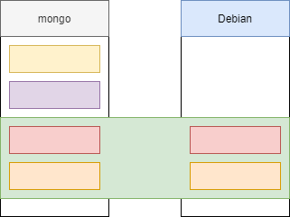

# Docker

- Docker is a standard for Linux containers.
- A "Container" is an isolated runtime inside of Linux.
- A "Container" provides a private machine like space under Linux.
- Containers will run under any modern Linux Kernel.

## Containers

- Have their own process space.
- Their own network interface.
- Run processes as **root** (inside the container).
- Have their own disk space:
    - Can share with a host.

## Docker Terminology

- Docker Image:
    - The representation of a Docker Container.
    - :star: Like JAR or WAR file in Java.
- Docker Container:
    - The standard runtime of Docker.
    - Effectively a deployed and running Docker Image.
    - :star: Like a Spring Boot Executable JAR.
- Docker Engine:
    - The code which manages Docker stuff.
    - Creates and runs Docker Containers.

## Docker Engine Runtime

```
Client Docker CLI ---> REST API ---> Server Docker Daemon
```

***

## Docker Editions

### Docker Enterprise Edition

- Announced Match 2nd, 2017.
- CaaS (Container as a Service) platform subscription.
- Enterprise class support.
- Quarterly Released.
- Backported patches for 1 year.
- Certified infrastructure.
- Important for regulatory compliance (PCI, SOX, SAS-70).

### Docker Community Edition

- Free Docker edition for developers and operations.
- Monthly edge release with latest features for developers.
- Quarterly releases for operations.

### Which use

- Functionally, the two editions are the same:
    - Like CentOS vs Red Hat Enterprise Linux.
- For Java developers fine to use Docker Community Edition.
- Docker Enterprise Edition is not available on some commercial OS such as RHEL, SUSE.

***

## Why Docker

- Before containers and docker the apps are deployed and run on Application server created on top
of physical server.

### What is container

- Container consists of:
    - Runtime Environment.
    - An Application.
    - Dependencies and Libraries.
    - Configuration files.

**Advantages**

- Lightweight and faster.
- Consumes very less system resources.

### Docker

- Open source platform, and it consists:
    - Docker Engine: A runtime and software packaging tool.
    - Docker Hub: Service for sharing the application in the cloud similar to github.
- The output of a Docker build is a Docker Image.
- To run Docker, we need to have docker running in our machine.
- When the Docker image is run it creates a container.

**Advantages**

- Rapid application deployment.
- Easy sharing of artifacts.
- Faster and Light Weight.

**Dockerfile**

- `FROM`: It pulls the image from the docker hub. 
    - Here it pulls the java image `alpine-oraclejdk8:slim`.
- `ADD`: Add command takes two arguments, one is source and the destination.
- `COPY`: `./docker-entrypoint.sh /docker-endpoint.sh`.
    - This step copies the `docker-entrypoint.sh` in to the docker image that gets built.
- `RUN`: `chmod +x / docker-entrypoint.sh`
- `ENTRYPOINT`:
    - Argument sets the concrete default app that is used every time a container is created using the image.
    - Often times ENTRYPOINT with CMS, you can remove "application" from CMS and just leave "arguments"
    which will be passed to the ENTRYPOINT.

```
sudo docker run hello-world

docker rmi $(docker images -q)
```

### Running MongoDB Docker Container

```
docker ps
docker ps -a
docker images
docker run mongo
docker run -d mongo

docker ps

------------------------------------------------------------------------------------------------------------------
CONTAINER ID        IMAGE               COMMAND                  CREATED              STATUS              PORTS               NAMES
3d6beb4ac7a2        mongo               "docker-entrypoint.s…"   About a minute ago   Up About a minute   27017/tcp           compassionate_yalow


docker stop 3d6beb4ac7a2
docker ps
docker run -p 27017:27017 -d mongo
docker ps

-------------------------------------------------------------------------------------------------------------------
CONTAINER ID        IMAGE               COMMAND                  CREATED             STATUS              PORTS                      NAMES
b3ca782bc1cd        mongo               "docker-entrypoint.s…"   21 seconds ago      Up 20 seconds       0.0.0.0:27017->27017/tcp   cool_lumiere


docker logs -f b3ca782bc1cd
docker run -p 27017:27017 -v /home/matikomp/udemy_courses/DOCKER/dockerdata/mongo:/data/db -d mongo
docker ps
```

### Docker Images

- Images like class file in Java.
- Instance of class is docker container.
- An Image defines a Docker Container:
    - Similar in concept to a snapshot of a VM.
    - Or a class vs an instance of the class.
- Images are immutable:
    - Once built, the files making up an image do not change.

**Layers**

- Images are built layers.
- Each layer is an immutable file, but is a collection of files and directories.
- Layers receive an ID, calculated via a SHA 256 hash of the layer contents:
    - Thus, if the layer contents change, the SHA 256 hash changes also.

```
docker image inspect mongo
```

**Image Ids**

- Image Ids are a SHA 256 hash derived from the layers:
    - Thus if the layers of the image changes, the SHA 256 hash changes.
- The Image ID listed by docker commands (ie 'docker images') is the first 12 characters of the hash.

```
docker images -q --no-trunc
docker images
```

**Image Tag Names**

- The hash value of images are referred to by 'tag' names.
- The format of the full tag name is:
    - `[REGISTRYHOST/][USERNAME/]NAME[:TAG]`
- For Registry Host 'registry.hub.docker.com' is inferred.
- For `:TAG` - `latest` is default, and inferred.
- Full tag example:
    - `registry.hub.docker.com/mongo:latest`



### Running Rabbit MQ Docker Container

```console
docker run -d --hostname panda-rabbit --name some-rabbit -p 8080:15672 -p 5671:5671 -p 5672:5672 rabbitmq:3-management
docker ps
```

### Running MySQL Docker Container

```console
docker logs c4174507511b
docker run --name panda-mysql-4 -e MYSQL_ALLOW_EMPTY_PASSWORD=yes -v /[PATH]/DOCKER/mysqldata:/var/lib/mysql  -p 3306:3306 -d mysql
```

## Docker House Keeping

- There are 3 key areas of house keeping:
    - Containers
    - Images
    - Volumes
- Shell to running docker image.

```
docker exec -it CONTAINER_NAME bash
```

### Containers

- Kill all Running Docker Containers.

```console
docker kill $(docker ps -q)
```

- Delete all Stopped Docker Containers.

```console
docker rm $(docker ps -a -q)
```

### Images

- Remove a Docker Image.

```console
docker rmi IMAGE_NAME
```

- Delete Untagged (dangling) Images.

```console
docker rmi $(docker images -q -f dangling=true)
```

- Delete All Images.

```console
docker rmi $(docker images -q)
```

### Volumes

- Once a volume is no longer associated with a container, it is considered **dangling**.
- Remove all dangling volumes.

```console
docker volume rm $(docker volume ls -f dangling=true -q)
```

- NOTE: Does not remove files from host system in shared volumes.

***

## Spring Boot in CentOS

```console
docker run -d centos tail -f /dev/null

# shell into docker centos
docker exec -it epic_snyder bash

# inside centos docker
java -version
yum install java
java -version
```

**Dockerfile**

```Dockerfile
FROM centos

RUN yum install -y java

VOLUME /tmp
ADD /spring-boot-web-0.0.1-SNAPSHOT.jar myapp.jar
RUN sh -c 'touch /myapp.jar'
ENTRYPOINT ["java", "-Djava.security.egd=file:/dev/./urandom", "-jar", "/myapp.jar"]
```

**Run Dockerfile**

```console
docker build -t spring-boot-docker .

docker run -d -p 8080:8080 spring-boot-docker

docker logs bcf1b6fbb61a

// localhost:8080
docker logs -f bcf1b6fbb61a
```

## Automatic Building of Docker Images

### Creating Docker Image in Fabric 8

- Add fabric8 dependency to pom.xml.

**Dockerfile**

```console
FROM openjdk

VOLUME /tmp
ADD maven/spring-boot-docker-0.0.1-SNAPSHOT.jar myapp.jar
RUN sh -c 'touch /myapp.jar'
ENTRYPOINT ["java","-Djava.security.egd=file:/dev/./urandom","-jar","/myapp.jar"]
```

```console
mvn clean package
mvn clean package docker:build
```

### Publishing to Docker Hub

```console
mvn clean package docker:build docker:push
```

### Docker template

```console
mvn docker:stop

mvn clean package docker:build

docker rm CONTAINER_NAME

mvn docker:start
```

### Running Docker from maven

```console
mvn docker:run
```

**pom.xml**

```xml
<images>
    <image>
        <name>${docker.image.prefix}/${docker.image.name}</name>
        <build>
            <dockerFileDir>${project.basedir}/target/dockerfile/</dockerFileDir>

            <!--copies artficact to docker build dir in target-->
            <assembly>
                <descriptorRef>artifact</descriptorRef>
            </assembly>
            <tags>
                <tag>latest</tag>
                <tag>${project.version}</tag>
            </tags>
        </build>
        <run>
            <ports>
                <port>8080:8080</port>
            </ports>
        </run>
    </image>
</images>
```

```console
systemctl stop mysql

# Use to run mysql db docker image
docker run --name mysqldb -p 3306:3306 -e MYSQL_DATABASE=pageviewservice -e MYSQL_ALLOW_EMPTY_PASSWORD=yes -d mysql

systemctl stop rabbitmq-server.service

# Use to run RabbitMQ
docker run --name rabbitmq -p 5671:5671 -p 5672:5672 rabbitmq

# Does not work
docker run --name pageviewservice -p 8081:8081  spring/pageviewservice

// Does not work
docker run --name pageviewservice -p 8081:8081 -e SPRING_DATASOURCE_URL=jdbc:mysql://127.0.0.1:3306/pageviewservice \ 
-e SPRING_PROFILES_ACTIVE=mysql spring/pageviewservice

docker run --name pageviewservice2 -p 8081:8081 \
--link rabbitmq:rabbitmq \
--link mysqldb:mysqldb \
-e SPRING_DATASOURCE_URL=jdbc:mysql://mysqldb:3306/pageviewservice \
-e SPRING_PROFILES_ACTIVE=mysql  \
-e SPRING_RABBITMQ_HOST=rabbitmq \
springframeworkguru/pageviewservice
```

