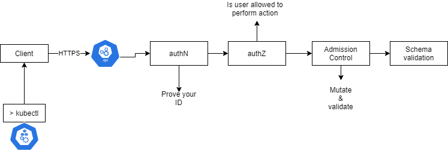
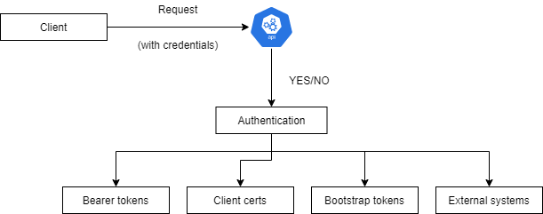
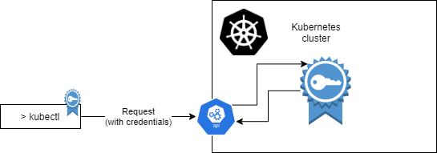

# GCP

## Security

```
Ensuring proper data flow.
```

### Proper data flow (CIA)?

- You cannot view data you shouldn't        Confidentiality
- You cannot change data you shouldn't      Integrity
- You can access data you should            Availability

### CIA Data flow example

**How do we control data flow? (AAA)**

- Authentication - Who are you?
- Authorization - What are you allowed to do?
- Accounting - What did you do?

- **Resiliency - Keep it running**

```
AuthN       AuthZ       Acc
```

### What enables security in GCP?

- Security Products
- Security Features
- Security Mindset
    - Includes Availability Mindset

**Key Security Mindset (Principles)**

- Least privilege
- Defense in depth
- Fail securely
- OWASPs "Security by Design" Principles

**Key Security Products/Features - AuthZ**

- Identity
    - Humans in G Suite, Cloud Identity
    - Applications & services use Service Accounts
- Identity hierarchy
    - Google Groups
- Can use Google Cloud Directory Sync (GCDS) to pull from LDAP (no push)

**Key Security Products/Features - AuthZ**

- Identity hierarchy (Google Groups)
- Resource hierarchy (Organization, Folders, Projects
- Identity and Access Management (IAM)
    - Permissions
    - Roles
    - Bindings
- GCS ACLs (Access Control Lists)
- Billing management
- Networking structure & restrictions

**Key Security Products/Features - Acct**

- Audit / Activity Logs (provided by Stackdriver)
- Billing export
    - To BigQuery
    - To file (in GCS bucket)
        - JSON or CSV
- GCS Object Lifecycle Management

### Identity and Access Management (IAM)

**Resource Hierarchy**

- Resource
    - Something you create in GCP
- Project
    - Container for a set of related resources
- Folder
    - Contains any number of Projects and Subfolders
- Organization
    - Tied to G Suite or Cloud Identity domain

### IAM - Permissions & Roles

**Permissions**

- A Permission allows you to perform a certain action
- Each one follows the form `Service.Resource.Verb`
- Usually correspond to REST API methods
- Example:
    - `pubsub.subscription.consume`
    - `pubsub.topics.publish`

**Roles**

- A Role is a collection of Permissions to use or manage GCP resources
- Primitive Roles - Project-level and often too broad
    - Viewer is read-only
    - Editor can view and change things
    - Owner can also control access & billing
- Predefined Roles - Give granular access to specific GCP resources
    - `E.g.:roles/bigquery.dataEditor, roles/pubsub.subscriber`
- Custom Role - Project or Org-level collection you define of granular permissions

**Predefined Role App Engine**

- `roles/appengine.appAdmin`
- `roles/appengine.serviceAdmin`
- `roles/appengine.deployer`
- `roles/appengine.appViewer`
- `roles/appengine.codeViewer`

### IAM - Members & Groups

**Members**

- A Member is some Google-known identity
- Each Member is identified by a unique email address
- Can be:
    - `user`: Specific Google account
        - G Suite, Cloud Identity, Gmail, or validated email
    - `serviceAccount`: Service account for apps/services
    - `group`: Google group of users and service accounts
    - `domain`: Whole domain managed by G Suite or Cloud Identity
    - `allAuthenticatedUsers` - Any Google account or service account
    - `allUsers` - Anyone on the Internet (Public)

**Groups**

- "A Google group is a named collection of Google accounts and service accounts."
- "Every group has a unique email address this is associated with the group."
- You never act as the group
    - But membership in a group can grant capabilities to individuals
- Use them for everything!
- Can be used for owner when within an organization
- Can nest groups in an organization
    - Example: one group for each department, all those in group for all staff

### IAM - Policies

**Policies**

- A Policy binds Members to Roles for some scope of Resources
- Answers: Who can do what to which thing(s)?
- Attached to some level in the Resource Hierarchy
    - Organization, Folder, Project, Resource
- Roles and Members listed in policy, but Resources identified by attachment
- Always additive ("Allow") and never subtractive (no "Deny")
    - "Child policies cannot restrict access granted at a higher level."

```json
{
    "bindings": [
        {
            "role": "roles/owner",
            "members": ["user:non@example.com"]
        },
        {
            "role": "roles/compute.networkViewer",
            "members": [
                "user:maki@example.com",
                "group:admins@example.com",
                "domain:example2.com",
                "serviceAccount:my-app@appspot.gserviceaccount.com"
            ]
        }
    ]
}
```

- One policy per resource
- Max 1500 member bindings per policy
    - Use groups, instead!!!
- You should use groups!
- Usually takes less than 60s to apply changes (both granting and revoking)
- "May take up to 7 minutes for ... changes to fully propagate across the system"

**Managing Policy Bindings**

- Can use `get-iam-policy`, edit the JSON/YAML, and `set-iam-policy` back (But don't! use commands)
- `gcloud [GROUP] add-iam-policy-binding [RESOURCE-NAME] --role [ROLE-ID-TO-GRANT] --member user:[USER-EMAIL]`
- `gcloud [GROUP] remove-iam-policy-binding [RESOURCE-NAME] --role [ROLE-ID-TO-REVOKE] --member user:[USER-EMAIL]`
- Atomic operations are better because changes:
    - Are simpler, less work, and less error-prone (then editing JSON/YAML)
    - Avoid race conditions, so can happen simultaneously

```
gcloud beta compute instances add-iam-policy-binding myhappyvm --role roles/compute.instanceAdmin
--member user:me@example.com
```

**Wrap up**

- A Permission allows you to perform a certain action: `Service.Resource.Verb`
- A Role is a collection of Permissions to use or manage GCP resources
    - Primitive Roles are Owner, Editor, Viewer
    - Predefined Roles give granular access to specific GCP resources (IAM)
    - Custom Roles let you define your own granular permissions
- A Member is some Google account identity tied to an email address
- A Policy binds Members to Roles for some scope of Resources
    - Answering: Who can do what to which thing(s)?
- Prefer `add-iam-policy-binding` & `remove-iam-policy-binding`
    - Over `get-iam-policy`, edit, then `set-iam-policy`

### Billing Access Control

**Billing Accounts**

- A Billing Account represents some way to pay for GCP service usage
- Type of Resource that lives outside of Projects
- Can belong to an Organization (i.e. be owned by it)
    - Inherits Org-level IAM policies
- Can be linked to projects
    - But does not own them
        - No impact on project IAM

**Billing Account User**

```
Role: Billing Account User
Purpose: Link projects to billing accounts.
Level: Organization or billing account.
```

**Billing IAM Roles**

- Billing Account Creator
- Billing Account Administrator
- Billing Account User
- Billing Account Viewer
- Project Billing Manager

**Monthly Invoiced Billing**

- Get billed monthly and pay by invoice due date
- Can pay via check or write transfer
- Can increase project and quota limits
- Billing administrator of org's current billing account contacts Cloud Billing Support
    - To determine eligibility
    - To apply to switch to monthly invoicing
- Eligibility depends on
    - account age
    - typical monthly spend
    - country

## Networking

- Software-Defined Networking (SDN)
- More general than the OSI 7-layer model of networking

- Routing is about deciding where data should go next
    - Many local decisions - No full map or path

- Where routing happen
    - On the way to Google's network
    - On the way to the right resource
    - On the way from one resource to another
    - There and Back Again

### Routing: to Google's Network

### Routing: To the Right Resource

- Latency reduction
    - Use servers physically close to clients

- Load balancing
    - Separate from auto-scaling

- System design
    - Different servers may handle different parts of the system
    - Especially when using microservices (instead of a monolith)

- Cross-Region Load Balancing (with Global Anycast IPs)

- Cloud Load Balancer (internal and external)

- HTTP(S) Load Balancer (with URL Map)

**Unicast vs Anycast**

- Unicast: There is only one unique device in the world that can handle this; send it there.
- Anycast: There are multiple devices that could handle this; send it to any one - but ideally the closest.

**Layer 4 vs Layer 7**

- TCP (of TCP/IP) is usually called Layer 4 (L4)
    - It works solely with IP addresses
- HTTP and HTTPS work at Layer 7 (L7)
    - These know about URLs and paths
- Each layer is built on the one below it
- Therefore:
    - To route based on URL paths, routing needs to understand L7
    - L4 cannot route based on the URL paths defined in L7

**DNS**

- Name resolution (via the Domain Name System) can be the first step in routing
    - Layer 4 - Cannot route L4 based on L7's URL paths
    - Chunky - DNS queries often cached and reused for huge client sets
    - Sticky - DNS lookup "locks on" and refreshing per request has high cost
        - Extra latency because each request includes another round-trip!
        - More money for additional DNS request processing
    - Not Robust - Relies on the client always doing the right thing (they don't)
- Premium tier "cold potato" routing with global anycast IPs avoids these problems

### Routing: Among Resources (VPC)

**Getting data from one resource to another**

- VPC (global) is Virtual Private Cloud - Your private SDN space in GCP
    - Not just resource-to-resource - Also manages the doors to outside & peers
- Subnets (regional) create logical spaces to contain resources
    - All Subnets can reach all others - globally, without any need for VPNs
- Routes (global) define "next hop" for traffic based on destination IP
    - Routes are global and apply by Instance-level Tags, not by Subnet
    - No route to the internet gateway means no such data can flow
- Firewall Rules (global) further filter data flow that would otherwise rout
    - All Firewall Rules are global and apply by Instance-level Tags or Service Acct.
    - Default Firewall Rules are restrictive inbound and permissive outbound

**IPs and CIDRs**

- IP address is `abc.def.ghi.jkl` (dotted quad) where each piece is 0-255
- CIDR block is group of IP addresses specified in `<IP>/xy` notation
    - Turn IP address into 32-bit binary number
        - `10.10.0.254 --> 00001010 00001010 000000000 11111110`
    - `/xy` in CIDR notation locks highest (leftmost) bits in IP address (0-32)
    - `abc.def.ghi.jkl/32` is single IP address because all 32 bits are locked
    - `abc.def.ghi.jkl/24` is 256 IP addresses because last 8 bits (jkl) can vary
    - `0.0.0.0/0` means "any IP address" because no bits are locked
- RFC1918 defines private (i.e. non-Internet) address ranges you can use:
    - 10.0.0.0/8, 172.16.0.0/12, and 192.168.0.0/16

***

## Kubernetes

**Kubernetes Objects**

- pod - Wrap one or more containers
- deploy - Scalability and application releases
- ds - One Pod per node
- sts - Stateful app components

### Networking

- All Nodes can talk
- All Pods can talk (No NAT)
- Every Pod gets its own IP

**Kubernetes Services**

- ClusterIP:
    - Gets own IP
    - Only accessible from within cluster
- NodePort:
    - Gets cluster-wide port
    - Also accessible from outside of cluster
- LoadBalancer:
    - Integrates with public cloud platform

**Service Network**

```console
kubectl get nodes

kubectl apply -f ping-deploy.yml

kubectl get deploy

kubectl get pods -o wide
```

**Node Network**

- All nodes need to be able to talk
    - Kubelet <--> API Server
    - Pod network ports
- Not implemented by Kubernetes

**Pod Network**

- Implemented via CNI plugins
- Big & Flat
- IP-per-Pod
- All Pods can communicate

**The Service Network**

- It's not really a network

```console
kubectl describe svc nginx-service

ipvsadm -ln
```

- Kube-proxy in IPVS mode does create dummy interfaces on the Service Network (usually called kube-ipvs0).
Kube-proxy in IPTABLES mode does not.

## Storage in Kubernetes

- Kubernetes Volumes
    - All about decoupling storage from Pods

**Volumes**

- LUNs, devices, shares, mounts, spaces
- Storage is Vital!
- File & Block First-class Citizens in Kubernetes
    - Standard-based
    - Pluggable backend
    - Rich API

- Fundamental storage requirements
    - Storage Backend:
        - Speed
        - Replicated
        - Resiliency
        - ...

```
PersistentVolume        (PV)        [Storage: 20GB]
PersistentVolumeClaim   (PVC)       [Ticket to use PV]
StorageClass            (SC)        [Makes it dynamic]
```

### Container Storage Interface (CSI)

**The K8s PersistentVolume Subsystem**

```
PV  <----- Claim ----->     PVC

Size: 30GB
IOPS: 60
```

**Dynamic Provisioning with StorageClasses**

```yml
kind: StorageClass
apiVersion: storage.k8s.io/v1
metadata:
    name: sc-fast
provisioner: kubernetes.io/aws-ebs
parameters:
    type: gp2
reclaimPolicy: Retain
```

### From Code to Kubernetes

### Kubernetes Deployments

### Auto scaling

**Horizontal Pod Autoscaler**

### Kubernetes Security

**RBAC and Admission Control**



- Some cluster open an insecure local port!
- Bypasses authN and authZ!
- Disable for production!

**RBAC**

- Enabled since 1.6
- GA since 1.8
- Deny-by-default

**Authentication (authN)**



- Kubernetes does NOT do Users!!
- Manage Users externally
    - Active Directory
    - IAM
    - Other...



- Service Accounts
    - For System components
    - Managed by Kubernetes
    - You can (should) manage them

**Authorization (authZ)**

```
Who can perform which actions on which resources?

Who - Subject
actions - Verb
```

- Powerful default users (Too powerful for production)
- Roles & RoleBindings (For least privilege)

**RBAC Role**

```yml
kind: Role | ClusterRole
apiVersion: rbac.authorization.k8s.io/v1
metadata:
  name: argrbac
  namespace: acg
rules:
- apiGroups: [""]
  resources: ["pods"]
  verbs: ["get", "list", "watch"]
```

**RBAC RoleBinding**

```yml
kind: RoleBinding | ClusterRoleBinding
apiVersion: rbac.authorization.k8s.io/v1
metadata:
  name: argrbac
  namespace: acg
subjects:
- kind: User
  name: panda@panda.com
  apiGroup: ""
roleRef:
  kind: Role
  name: acgrbac
  apiGroup: ""
```

**Admission Control**

- Admission Control
    - Policy enforcement
    - Webhooks -> External admission controller

```console
$ openssl genrsa -out mia.key 2048
$ openssl req -new -key  mia.key -out mia.csr -subj "/CN=mia/O=acg"

$ openssl x509 -req -in mia.csr -CA /home/ubuntu/ca/ca.cert -CAkey /home/ubuntu/ca/ca.key -CAcreateserial -out mia.crt -days 365
```

- We got **mia.crt** certificate

```console
$ kubectl config set-credentials mia --client-certificate=/home/ubuntu/mia.crt --client-key=/home/ubuntu/mia.key

$ kubectl config set-context mia --cluster=acg.k8s.local --namespace=acg --user=mia

$ kubectl get pods --namespace=acg
```

**yml/role.yml**

```yml
kind: ClusterRole
apiVersion: rbac.authorization.k8s.io/v1
metadata:
  name: acgrbac
rules:
- apiGroups: [""]
  resources: ["pods"]
  verbs: ["get", "list", "watch"]
```

```console
$ kubectl apply -f yml/role.yml
```

**yml/rolebinding.yml**

```yml
kind: RoleBinding
apiVersion: rbac.authorization.k8s.io/v1
metadata:
  name: acgrbac
  namespace: acg
subjects:
- kind: User
  name: mia
  apiGroup: ""
roleRef:
  kind: ClusterRole
  name: acgrbac
  apiGroup: ""
```

```console
$ kubectl apply -f yml/rolebinding.yml

$ kubectl config current-context

$ kubectl get pods --namespace=acg
```

- Request
    - API Group: apps/v1
    - Subject: mia
    - Verb: create (HTTP POST method)
    - Resource: Deployments
    - Namespace: acg

### Other Kubernetes

- DaemonSet
- StatefulSet
- Job
- CronJob
- PodSecurityPolicy
- Pod resource requests and limits
- ResourceQuota
- CustomResourceDefinition

### AppEngine

- The OG
    - The Original Google cloud service

### Service Breadth

**Google Compute Engine (GCE)**

- Fast-booting Virtual Machines (VMs) you can rent, on demand
- Infrastructure as a Service (IaaS)
- Pick set machine type - standard, highmem, highcpu - or custom CPU/RAM
- Pay by the second (60 second min.) for CPUs, RAM
- Automatically cheaper if you keep running it ("sustained use discount")
- Even cheaper for "preemptible" or long-term use commitment in a region
- Can add GPUs and paid OSes for extra cost
- Live Migration: Google seamlessly moves instance across hosts as needed

**Google Kubernetes Engine (GKE)**

- Managed Kubernetes cluster for running Docker containers (with autoscaling)
- Kubernetes DNS on by default for service discovery
- No IAM integration (unlike AWS's ECS)
- Integrates with Persistent Disk for storage
- Pay for underlying GCE instances
    - Production cluster should have 3+ nodes
- No GKE management fee, no matter how many nodes is cluster


**App Engine (GAE)**

- Platform as a Service (PaaS) that takes your code and runs it (Elastic Beanstalk, Herooku)
- Much more than just compute - Integrates storage, queues, NoSQL
- Flex mode ("App Engine Flex") can run any container & access VPC
- Auto-scales based on load
    - Standard (non-Flex) mode can turn off last instance when no traffic
- Effectively pay for underlying GCE instances and other services

**Cloud Functions (GCF)**

- Runs code in response to an event - Node.js, Python, Java, Go
- Functions as a Service (FaaS), "Serverless"
- Pay for CPU and RAM assigned to function, per 100 ms
- Each function automatically gets an HTTP endpoint
- Can be triggered by GCS objects, Pub/Sub messages
- Massively scalable (horizontally) - Runs many copies when needed
- Often used for chatbots, message processor, IoT, automation

### Storage

**Local SSD**

- Very fast 375GB solid state drives physically attached to the server
    - EC2 Instance Store Vols.
    - Direct-Attached Storage (DAS)
- Can stripe across eight of them (3TB) for even better performance
- Data will be lost whenever the instance shuts down
    - Can survive a Live Migration
- Like all data at rest, always encrypted
- Pay by GB-month provisioned

**Persistent Disk (PD)**

- Flexible, block-based network-attached storage; boot disk for every GCE instance
    - Elastic Block Storage (EBS)
    - Storage Area Network (SAN)
- Perf scales with volume size; max way below Local SSD, but still plenty fast
- Persistent disks persist, and are replicated (zone or regional) for durability
- Can resize while in use (up to 64TB), but will need file system update within VM
- Snapshots (and machine images) add even more capability and flexibility
    - "Magical": Pay for incremental ($ and time), but use/delete like full backups
- Not file-based NAS, but can mount to multiple instances if all are read-only
- Pay for GB/mo provisioned depending on perf. class; plus snapshot GB/mo used

**Cloud Filestore**

- Fully-managed file-based storage
    - Elastic File System (EFS)
    - Network-Attached Storage (NAS)
- Predictably fast performance for your file-based workloads
- Accessible to GCE and GKE through your VPC, via NFSv3 protocol
- Primary use case is application migration to cloud ("lift and shift")
- Fully manages file serving, but not backups
- Pay for provisioned TBs in "Standard" (slow) or "Premium" (fast) mode
- Minimum provisioned capacity of 1TB (Standard) or 2.5TB (Premium)

**Cloud Storage**

- Infinitely scalable, fully-managed, versioned and highly-durable object storage
    - Amazon S3
- Strongly consistent (even for PUTs abd DELETEs)
- Integrated site hosting and CDN functionality
- Lifecycle transitions across classes: Multi-Regional, Regional, Nearline, Coldline
    - Differences in cost & availabilities
- All classes have same API, so can use gsutil and gcsfuse
- Pay for data operations & GB-months stored by class
- Nearline/Coldline: Also pay for GBs retrieved - plus early deletion fee if < 30/90 days

### Databases

**Cloud SQL**

- Fully managed and reliable MySQL and PostgreSQL databases
    - Amazon RDS
    - Self-Managed MySQL
- Supports automatic replication, backup, failover
- Scaling is manual (both vertically and horizontally)
- Effectively pay for underlying GCE instances and PDs
    - Plus some backed-in service fees

**Cloud Spanner**

- The first horizontally scalable, strongly consistent, relational database service
    - Shared MySQL
    - CockroachDB
    - From 1 to hundreds or thousands of nodes
    - Minimum of 3 nodes is recommended for production environments
- Chooses Consistency and Partition-Tolerance (CP of CAP theorem)
- But still high Availability
    - Not based on fail-over
- Pay for provisioned node time plus used storage-time

**BigQuery**

- Serverless column-store data warehouse for analytics using SQL
    - Amazon Redshift
- Scales internally, so it "can scan TB in seconds and PB in minutes**"
- Pay for GBs actually considered (scanned) during queries
    - Attempts to reuse cached results, which are free
- Pay for data stored (GB-months)
- Pay for GBs added via streaming inserts

**Cloud BigTable**

- Low latency & high throughput NoSQL DB for large operational & analytical apps
    - DynamoDB
    - Cassandra
    - Apache HBASE
- Supports open-source HBase API
- Integrates with Hadoop, Dataflow, Dataproc
- Scales seamlessly and unlimitedly
    - Storage autoscales
    - Processing nodes must be scaled manually
- Pay for processing node hours
- Pay for GB-hours used for storage (cheap HDD or fast SSD)

**Cloud Datastore**

- Managed & autoscaled NoSQL DB with indexes, queries and ACID trans. support
    - DynamoDB
    - MongoDB
- NoSQL, so queries can get complicated
    - No joins or aggregates and must line up with indexes
    - NOT, OR and NOT EQUALS (<>,!=) operations natively supported
- Automatic "built-in" indexes for simple filtering and sorting (ASC, DESC)
- Manual "composite" indexes for more complicated, but beware them "exploding"
- Pay for GB-months of storage used
- Pay for IO operations (deletes, reads, writes) performed (i.e. no pre-provisioning)

**Firebase Realtime DB, Cloud Firebase**

- NoSQL document stores with real-time client updates via managed sockets
    - DynamoDB
    - MongoDB
- Firebase DB is single JSON doc, located only in central US
- Cloud Firestore has collections, documents and contained data
- Free tier (Spark), flat tier (Flame) or usage-based pricing (Blaze)
    - Realtime DB: Pay more for GB/month stored and GB downloaded
    - Firestore: Pay for operations and much less for storage and transfer

### Data Transfer

**Data Transfer Appliance**

- Rackable, high-capacity storage server to physically ship data to GCS
- Ingest only; not a way to avoid egress charges
- 100TB or 480TB versions
- 480TB/week is faster than saturated 6Gbps link

**Storage Transfer Service**

- Copies objects for you, so you don't need to set up a machine to do it
- Destination is always GCS bucket
- Source can be S3, HTTP/HTTPS endpoint or another GCS bucket
- One-time or scheduled recurring transfers
- Free to use, but you pay for its actions

### External Networking

**Google Domains**

- Google's registrar for domain names
    - Amazon Route 53
    - GoDaddy
- Private Whois records
- Built-in DNS or custom nameservers
- Supports DNSSEC
- Email forwarding with automatic setup of SPF and DKIM (for built-in DNS)

**Cloud DNS**

- Scalable, reliable & managed authoritative Domain Name System (DNS) service
    - Amazon Route 53
    - Dyn
- 100% uptime guarantee
- Public and private managed zones
- Low latency globally
- Supports DNSSEC
- Managed via UI, CLI or API
- Pay fixed fee per managed zone to store and distribute DNS records
- Pay for DNS lookups (i.e. usage)

**Static IP**

- Reserve static IP address in projects and assign them to resources
    - Amazon Elastic IP Address
- Regional IPs used for GCE instances & Network Load Balancers
- Global IPs used for global load balancers:
    - HTTP(s), SSL proxy, and TCP proxy
    - "Anycast IP" simplifies DNS
- Pay for reserved IPs that are not in use, to discourage wasting them

**Load Balancing**

- High perf, scalable traffic distribution integrated with autoscaling & Cloud CDN
    - Amazon Elastic Load Balancing
    - HA PROXY
    - NgINX
- SDN naturally handles spikes without any prewarming; no instances or devices
- Regional Network Load Balancer: health checks, round robin, session affinity
    - Forwarding rules based on IP, protocol (e.g. TCP, UDP) and (optionally) port
- Global load balancers multi-region failover for HTTP(S), SSL proxy & TCP proxy
    - Prioritize low-latency connection to region near use, then gently fail over in bits
    - Reacts quickly (unlike DNS) to changes in users, traffic, network, health etc.
- Pay by making ingress traffic billable (cheaper than egress) plus hourly per rule

**Cloud CDN**

- Low-latency content delivery based on HTTP(S) CLB & integrated GCE & GCS
    - Amazon CloudFront
    - Akamai
    - Cloudflare
- Supports HTTP/2 and HTTPS, but no custom origins (GCP only)
- Simple checkbox on HTTP(S) Load Balancer config turns this on
- On cache miss, pay origin -> POP "cache fill" egress charges (cheaper for in-region)
- Always pay POP -> client egress charges, depending on location
- Pay for HTTP(S) request volume
- Pay per cache invalidation request (not per resource invalidated)
- Origin costs (e.g. CLB, GCS) can be much lower because cache hits reduce load

### Internal Networking

**VPC**

- Global I{v4 unicast Software-Defined Network (SDN) for GCP resources
    - Amazon VPC
    - OpenFlow
- Automatic mode; custom mode
- Configure subnets (each with a private IP range), routes, firewalls, VPNs, BGP
- VPC is global and subnets are regional
- Can be shared across multiple projects in same org and peered with other VPCs
- Can be private (internal IP) access to some GCP services (e.g. BQ, GCS)
- Free to configure VPC (container)
- Pay to use certain services (e.g. VPN) and for network egress

**Cloud Interconnect**

- Options for connecting external networks to Google's network
- Private connections to VPC via Cloud VPN or Dedicated/Partner Interconnect
- Public Google services (including GCP) accessible via External Peering (no SLAs)
    - Direct Peering for high volume
    - Carrier Peering via a partner for lower volume
- Significantly lower egress fees
    - Except Cloud VPN, which remains unchanged

**Cloud VPN**

- IPsec VPN to connect to VPC via public internet for low-volume data connections
    - AWS VPN
    - OpenVPN
- For persistent, static connections between gateways
    - Peer VPN gateway must have static IP
- Encrypted link to VPC into one subnet
- Supports both static and dynamic routing
- Pay for tunnel-hour
- Normal traffic charges apply

**Dedicated Interconnect**

- Direct physical link between VPC abd on-prem for high-volume data connections
    - AWS Direct Connect
- VLAN attachment is provate connection to VPC in one region no public GCP APIs
    - Region chosen from those supported by particular Interconnect Location
- Links are private but not encrypted; can layer your won encryption
- Redundant connections in different locations recommended for critical apps
- Pay fee per 10 Gbps link plus fee per VLAN attachment

**Cloud Router**

- Dynamic routing (BGP) for hybrid networks GCP VPCs to external networks
- Works with Cloud VPN and Dedicated Interconnect
- Automatically learns subnets in VPC and announces them to on-prem network
- Without Cloud Router you must manage static routes for VPN
- Free to setup
- Pay for usual VPC egress

**CDN Interconnect**

- DIrect, low-latency connectivity to certain CDN providers, with cheaper egress
- For external CDNs, not Google's Cloud CDN service
    - Supports Akamai, Cloudflare , Fastly
- Work for both pull and push cache fills
    - Because it's for all traffic with that CDN

### Machine Learning

**Cloud ML Engine**

**Cloud Vision API**

**Cloud Speech API**

**Cloud Natural Language API**

**Cloud Translation API**

**Dialogflow**

**Cloud Video Intelligence API**

**Cloud Job Discovery**

### Big Data & IoT

**Cloud IoT Core**

**Cloud Pub/Sub**

- Apache Kafka
- RabbitMQ

**Cloud Dataprep**

**Cloud Dataproc**

**Cloud Dataflow**

**Cloud Datalab**

**Cloud Data Studio**

**Cloud Genomics**

### Identity & Access (Core Security)

**Roles**

- Roles are collections of Permissions to use or manage GCP resources
    - AWS IAM Policies
- Permissions allow you to perform certain actions: `Service.Resource.Verb`
- Primitive Roles: Owner, Editor, Viewer
    - Viewer is read-only; Editor can change things; Owner can control access & billing
    - Pre-date IAM service, may still be useful (e.g. dev/test envs), but often too broad
- Predefined Roles: Give granular access to specific GCP resources (IAM)
    - E.g.: roles/bigquery.dataEditor, roles/pubsub.subscriber
- Custom Roles: Project or Org-level collections you define of granular permissions

**Cloud IAM**

- Controls access to GCP resources: authorization, not really authentication/identity
    - AWS IAM
- Member is user, group, domain, service account or the public (e.g. allUsers)
    - Individual Google account, Google group, G Suite / Cloud Identity domain
    - Service account belongs to application/instance, not individual end user
    - Every identity has a unique e-mail address, including service accounts
- Policies bind Members to Roles at a hierarchy level; Org, Folder, Project, Resource
    - Answer: Who can do what to which thing(s)?
- IAM is free; pay for authorized GCP service usage

**Service Accounts**

- Special type of Google account that represents an application, not an end user
    - AWS IAM Roles
- Can be assumed by applications or individual users (when so authorized)
- For almost all cases, whether you are developing locally or in a production application, you should use service
accounts, rather than user accounts or API keys
- Consider resources and permissions required by application; use least privilege
- Cloud Platform managed keys for GCP
    - No direct downloading: Google manages private keys & rotates them once a day

**Cloud Identity**

- Identity as a Service (IDaaS, not DaaS) to provision and manage users and groups
    - AWS IAM
    - G Suite
    - GMail/Google Account
- Free Google Accounts for non-G-Suite users, tied to a verified domain
- Centrally manage all users in Google Admin console; supports compliance
- 2-Step verification (2SV/MFA) and enforcement, including security keys
- Sync from Active Directory and LDAP directories via Google Cloud Directory Sync
- Identity work with other Google services (e.g. Chrome)
- Identities can be used to SSO with other apps via OIDC, SAML, OAUTH2

**Security Key Enforcement**

- USB or Bluetooth 2-step verification device that prevents phishing
- Not like just getting a code via email or text message
- Device also verifies the target service
- Eliminates man-in-the-middle (MITM) attacks against GCP credentials

**Resource Manager**

- Centrally manage & secure organization's projects with custom folder hierarchy
    - AWS Organizations
- Organization resource is root node in hierarchy; folders per your business needs
- Tied 1:1 to a Cloud Identity / G Suite domain, then owns all newly-created projects
    - Without this organization, specific identities (people) must own GCP projects
- Recycle bin allows undeleting projects
- Define custom IAM roles at org level
- Apply IAM policies at organization, folder, or project levels

**Cloud Identity - Aware Proxy (IAP)**

- Guards apps running on GCP via identity verification, not VPN access
- Based on CLB & IAM, and only passes authed requests through
    - Amazon API Gateway
- Grant access to any IAM identities, including groups & service accounts
- Pay for load balancing / protocol forwarding rules and traffic

**Cloud Audit Logging**

- Answers the questions "Who didi what, where and when?" within GCP project
    - AWS Cloud Trail Service
- Maintains non-temperable audit logs for each project and organization:
    - Admin Activity and System Events (400 day retention)
    - Access Transparency (400 day retention)
    - Data Access (30 day retention)

### Security Management - Monitoring & Response

**Cloud Armor**

- Edge-level protection from DDoS & other attacks on global HTTP(S) LB
    - AWS Shield
- Offload work: Blocked attacks never reach your system
- Monitor: Detailed request-level logs available in Stackdriver Logging
- Manage IPs with CIDR-based allow/block lists (aka whitelist/blacklist)
- More intelligent rules forthcoming (e.g. XSS, SQLi, geo-based, custom)

**Security Scanner**

- Free but limited GAE app vulnerability scanner
    - AWS Inspector
- Can identify:
    - XSS
    - Flash injection
    - Mixed content (HTTP in HTTPS)
    - Outdated/insecure libraries

**Cloud DLP API**

**Event Threat Detection (ETD)**

**Cloud Security Command Center (SCC)**

### Encryption Keys

**Cloud Key Management Service (KMS)**

- Low-latency service to manage and use cryptographic keys
- Supports symmetric (e.g. AES) and asymmetric (e.g. RSA, EC) algorithms
    - AWS KMS
- Move secrets out of code and into the environment in secure way
- Integrated with IAM & Cloud Audit Logging to authorize & track key usage
- Rotate keys used for new encryption either automatically or on demand
    - Still keeps old active key versions, to allow decrypting

**Cloud Hardware Security Module (HSM)**

- Cloud KMS keys management by FIPS 140-2 Level 3 certified HSMs
- Device hosts encryption keys and performs cryptographic operations
- Enables you to meet compliance that mandates hardware environment
    - AWS CloudHSM
- Fully integrated with Cloud KMS

### Operations and Management

**Stackdriver**

**Stackdriver Monitoring**

**Stackdriver Logging**

**Stackdriver Error Reporting**

**Stackdriver Trace**

**Stackdriver Debugger**

**Stackdriver Profiler**

**Cloud Deployment Manager**

**Cloud Billing API**

### Development & APIS

**Cloud Source Repositories**

**Cloud Build**

**Container Registry (GCR)**

**Cloud Endpoints**

**Apigee**

**Test Lab for Android**


