# Google Cloud

## Core Infrastructure

### What is Cloud Computing?

- **On-demand self-service**: No human intervention needed to get resources.
- **Broad network access**: Access from anywhere.
- **Resource pooling**: Provider shares resources to customers.
- **Rapid elasticity**: Get more resources quickly as needed.
- **Measured service**: Pay only for what you consume.

### Before cloud

- **Physical/Colocation**: Storage, Processing, Memory, Network; User-configured, managed and maintained.
- **Virtualized**: Storage, Processing, Memory, Network; User-configured Provider-manages and maintained.
- **Serverless**: Fully automated.

### GCP computing architectures

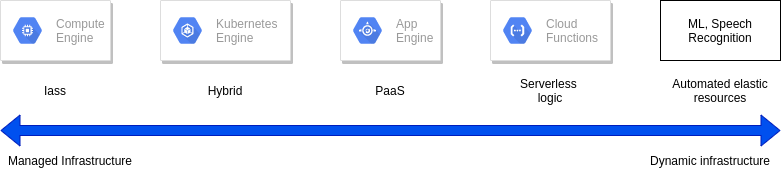

### The Google network

- 100,000s of km of fiber cable, 8 subsea cables.

### GCP regions and zones

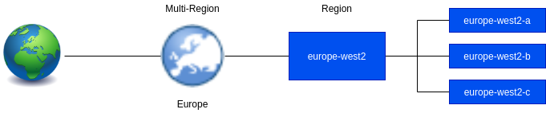

### Pricing

- **Billing in sub-hour increments**: For compute, data processing and services.
- **Discounts for sustained use**: Automatically applied to virtual machine use over 25% of a month.
- **Discounts for committed use**: Pay less for steady, long-term workloads.
- **Discounts for preemptible use**: Pay less for interruptible workloads.
- **Custom VM instance types**: Pay only for the resources you need for your application.

### Open APIs

- Open APIs and open source mean customers can leave.
- Open APIs, capability with open-source services:
    - Cloud Bigtable
    - Cloud Dataproc
- Open source for a rich ecosystem:
    - TensorFlow
    - Kubernetes
    - Forseti Security
- Multi-vendor-friendly technologies:
    - Google Stackdrive
    - Kubernetes Engine        

**Why choose GCP?**

```
Google Cloud Platform enables developers to build, test, and deploy apps on Google's highly secure, reliable,
and scalable infrastructure.
```

- **GCP compute services**:
    - Compute Engine
    - Kubernetes Engine
    - App Engine
    - Cloud Functions
- **GCP storage services**:
    - Bigtable
    - Cloud Storage
    - Cloud SQL
    - Cloud Spanner
    - Cloud Datastore
- **GCP Big Data services**:
    - Big Query
    - Pub/Sub
    - Data flow
    - Data proc
    - Data lab
- **GCP Machine Learning services**:
    - Natural Language API
    - Vision API
    - Machine Learning
    - Speech API
    - Translate API

### Multi-layered security approach

**Google technical infrastructure**

| Layer | Security measures |
|---|---|
| Operational security | Intrusion detection; reduce insider risks; employee U2F use; software dev practices |
| Internet communication | Google Front End; designed-in Denial of Service protection |
| Storage services | Encryption at rest |
| User identity | Central identity service with support for U2F |
| Service deployment | Encryption of inter-service communication |
| Hardware infrastructure | Hardware design and provenance; secure boot stack; premises security |

### Budgets and Billing

- Budgets and alerts keep billing under control.
- Billing export allows you to store detailed billing information.
- Reports is a visual tool to monitor expenditure.
- Quotas limits:
    - Rate quota: GKE API: 1,000 requests per 100 seconds.
    - Allocation quota: 5 networks per project.
    - Many quotas are changeable.

***

## Google Cloud Platform

**Cloud security requires collaboration**

- Google is responsible for managing its infrastructure security.
- You are responsible for securing your data.
- Google helps with best practices, templates, products and solutions.

### The GCP resource hierarchy

**Resource hierarchy levels define trust boundaries**

- Group your resources according to your organization structure.
- Levels of the hierarchy provide trust boundaries and resource isolation.

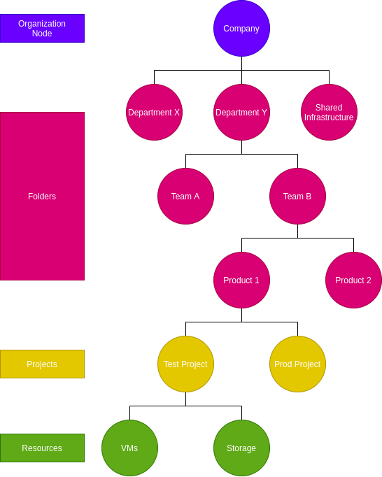

**All GCP services you use are associated with a project**

- Track resource and quota usage.
- Enable billing.
- Manage permissions and credentials.
- Enable services and APIs.

**Projects have three identifying attributes**

| Attribute |  |  | |
|---|---|---|---|
| Project ID | Globally unique | Chosen by you | Immutable |
| Project name | Need not to be unique | Chosen by you | Mutable |
| Project number | Globally unique | Assigned by GCP | Immutable |

**Folders offer flexible management**

- Folders group projects under an organization.
- Folders can contain projects, other folders, or both.
- Use folders to assign policies.

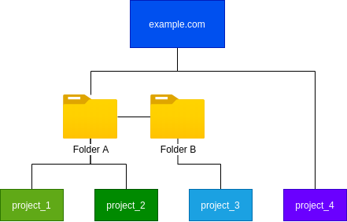

**The organization node organizes projects**


- Organization Policy Administrator: Broad controls over all cloud resources.
- Project Creator: Fine-grained control of project creation.

**An example IAM resource hierarchy**

- A policy is set on a resource.
    - Each policy contains a set of roles and role members.
- Resources inherit policies from parent.
    - Resource policies are a union of parent and resource.
- A less restrictive parent policy overrides a more restrictive resource policy.

***

## Identity and Access Management (IAM)

**Google Cloud Identity and Access Management**

- Defines, **who** can do **what** on which **resource**.

**IAM policies can apply to any of four types of principals**

- Who:
    - Google account or Cloud Identity user.
    - Service account.
    - Google group.
    - Cloud Identity or G Suite domain.
    
**Three types of IAM roles**

- Primitive
- Predefined
- Custom

**IAM primitive roles apply across all GCP services in a project**

- **can do what** - **on all resources**

**IAM primitive roles offer fixed, coarse-grained levels of access**

| Owner | Editor | Viewer | Billing administrator |
|---|---|---|---|
| Invite members | Deploy applications | Read-only access | Manage Billing |
| Remove members | Modify code | | Add and remove administrators |
| Delete projects | Configure services | | |
| And --> | And --> | | |

- A project can have multiple owners, editors, viewers, and billing administrators.

**IAM predefined roles apply to a particular GCP service in a project**

- **can do what** - on Compute Engine resources in this project, or folder, or org.

**IAM predefined roles offer more find-grained permissions on particular services**

- Google Group, on **project_a**, **InstanceAdmin** role:
    - `compute.instance.delete`
    - `compute.instance.get`
    - `compute.instance.list`
    - `compute.instance.setMachineType`
    - `compute.instance.start`
    - `compute.instance.stop`
- Google Group, on **project_a**, **InstanceOperator** role:
    - `compute.instance.get`
    - `compute.instance.list`
    - `compute.instance.start`
    - `compute.instance.stop`

**Service Accounts control server-to-server interactions**

- Provide an identity for carrying out **server-to-server** interactions in a project.
- Used to **authenticate** from one service to another.
- Used to **control privileges** used by resources:
    - So that apps can perform actions on behalf of authenticated end users.
- Identity with an **email** address:
    - `PROJECT_NUMBER-compute@developer.gserviceaccount.com`
    - `PROJECT_ID@appspot.gserviceaccount.com`    

**Service Accounts an IAM**

- Service accounts authenticate using keys:
    - Google manages keys for Compute Engine and App Engine.
- You can assign a predefined or custom IAM role to the service account.    

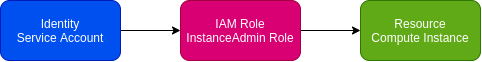

**Example: Service Accounts and IAM**

- VMs running **component_1** are granted **Editor** access to **project_b** using **Service Account 1**.
- VMs running **component_2** are granted **objectViewer** access to **bucket_1** using **Service Account 2**.
- Service account permissions can be changed without recreating VMs.

### Interacting with Google Cloud Platform

- **Cloud Platform Console**: Web user interface.
- **Cloud Shell and Cloud SDK**: Command-line interface.
- **Cloud Console Mobile App**: For iOS and Android.
- **REST-based API**: For custom applications.

**Cloud Platform Console**

- Manage and create projects.
- Access to Google Cloud Platform APIs.
- Offers access to Cloud Shell:
    - A temporary vistual machine with Google Cloud SDK preinstalled.

**Google Cloud SDK**

- Includes command-line tools for Cloud Platform products and services:
    - `gcloud`, `gsutil` (Cloud Storage), `bq` (BigQuery).
- Available via Cloud Shell.
- Available as docker image.

**RESTful APIs**

- Programmatic access to products and services:
    - Typically, use JSON as an interchange format.
    - Use OAuth 2.0 for authentication and authorization.
- Enable through the Google Cloud Platform Console.
- Most APIs include daily quotas and rates (limits) that can be raised by request.
    - Important to plan ahead to manage your required capacity.    

**API Explorer**

- API Explorer is an interactive tool that lets you easily try Google APIs using a browser.
- With the API Explorer:
    - Browse through available APIs and versions.
    - See methods available for each API and what parameters they support along with documentation.
    - Execute requests and see responses in real time.
    - Easily make authenticated and authorized API calls.

**Client libraries to control GCP resources from within your code**

- Cloud Client Libraries: Community-owned, hand-crafted client libraries.
- Google API Client Libraries:
    - Open source, generated.
    - Support various languages:
        - Java, Python, JS, PHP, .NET, etc.

**Cloud Console Mobile App**

- Manage VM and database instances.
- Manage apps in Google App Engine.
- Manage billing.
- Virtualize projects with a customizable dashboard.

### Cloud Launcher

- A solution marketplace containing pre-packaged, ready-to-deploy solutions:
    - Offered by Google.
    - Third-party vendors.

***

## Compute Engine

### Virtual Private Cloud (VPC) Network

**Virtual Private Cloud Networking**

- Each VPC network is contained in a GCP project.
- You can provision Cloud Platform resources, connect them to each other, and isolate them from one another.

**Google Cloud VPC networks are global; subnets are regional**

- Resilient.
- Simple network layout.


### Compute Engine

**Compute Engine offers managed virtual machines**

- No upfront investment.
- Fast and consistent performance.
- Create VMs with GCP Console or **gcloud**.
- Run images of Linux or Windows Server.
- Pick memory and CPU, use predefined types, or make a custom VM.
- Pick GPUs if you need them.
- Pick persistent disks, standard or SSD.
- Pick local SSD for scratch space too if you need it.
- Pick a boot image, Linux or Windows Server.
- Define a startup script if you like.
- Take disk snapshots as backups or as migration tools.

**Compute Engine offers innovative pricing**

- Per-second billing, sustained use discounts.
- Preemptilbe instances.
- High throughput to storage at no extra cost.
- Custom machine types: Only pay for the hardware you need.

**Scale up or scale out with Compute Engine**

- Use big VMs for memory-and-compute-intensive applications.
- Use Autoscaling for resilient, scalable apps.

### Important VPC capabilities

**You control the topology of your VPC network**

- Use its route table to forward traffic within the network, even across subnets.
- Use its firewall to control what network traffic is allowed.
- Use Shared VPC to share a network, or individual subnets, with other GCP projects.
- Use VPC Peering to interconnect networks in GCP projects.

**With global Cloud Load Balancing, your application presents a single front-end to the world**

- Users get a single, global anycast IP address.
- Traffic goes over the Google backbone from the closest point-of-presence to the user.
- Backends are selected based on load.
- Only healthy backends receive traffic.
- No pre-warming is required.

**Google VPC offers a suite of load-balancing options** <--

- **Global HTTP(S)**:
    - Layer 7 load balancing based on load.
    - Can route different URLs to different back ends.
- **Global SSL Proxy**:
    - Layer 4 load balancing of non-HTTPS SSL traffic based load.
    - Supported on specific port numbers.
- **Global TCP Proxy**:
    - Layer 4 load balancing of non-SSL TCP traffic.
    - Supported on specific port numbers.
- **Regional**:
    - Load balancing of any traffic (TCP, UDP).
    - Supported on any port number.
- **Regional internal**:
    - Load balancing of traffic inside a VPC.
    - Use for the internal tiers of multi-tier apps.                

**Cloud DNS is highly available and scalable**

- Create managed zones, then add, edit, delete DNS records.
- Programmatically manage zones and records using RESTful API or command-line interface.

**Cloud CDN (Content Delivery Network)**

- Use Google's globally distributed edge caches to cache content close to your users.
- Or use CDN Interconnect if you'd prefer to use a different CDN.

**Google Cloud Platform offers many interconnect options**

- **VPN**: Secure multi-Gbps connection over VPN tunnels. Cloud Router.
- **Direct Peering**: Private connection between you and Google for your hybrid cloud workloads.
- **Carrier Peering**: Connection through the largest partner network of service providers.
- **Dedicated Interconnect**: Connect N X 10G transport circuits for private cloud traffic to Google Cloud 
at Google POPs.

***

## Storage in the Cloud

### Cloud Storage

**Cloud Storage is binary large-object storage**

- High performance, internet-scale.
- Simple administration:
    - Does not require capacity management.
- Data encryption at rest.
- Data encryption in transit by default from Google to endpoint.    
- Online and offline import services are available.

**Cloud Storage files are organized into buckets**

| Bucket attributes | Bucket contents |
|---|---|
| Globally unique name | Files (in a flat namespace) |
| Storage class | |
| Location (region or multi-region) | |
| IAM policies or Access Control Lists | Access Control Lists |
| Object versioning setting | |
| Object lifecycle management rules | |

- Cloud Storage is object storage rather than file storage. Compute Engine virtual machines use Persistent 
Disk storage to contain their file systems. 

**Choosing among Cloud Storage classes**

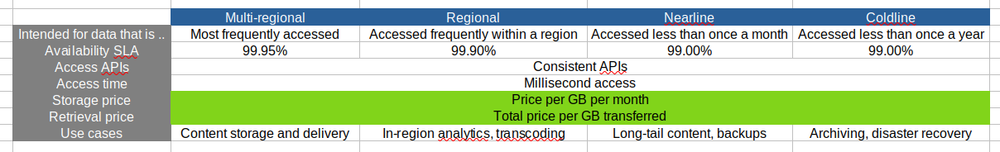

- Multi-regional: Storage price; Price Per GB stored per month highest.
- Multi-regional: Retrieval price; Total price per GB transferred lowest.

**There are several ways to bring data into Cloud Storage**

- **Online transfer**: Self-managed copies using command-line tools or drag-and-drop.
- **Storage Transfer Service**: Scheduled, managed batch transfers.
- **Transfer Appliance (Beta)**: Rackable appliances to securely ship your data.

**Cloud Storage works with other GCP services**

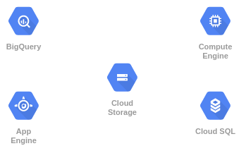

- BigQuery: Import and export tables.
- App Engine: Object storage, logs, and Datastore backups.
- Compute Engine: Startup scripts, images, and general object storage.
- Cloud SQL: Import and export tables.

### Cloud Bigtable

**Cloud Bigtable is managed NoSQL**

- Fully managed NoSQL, wide-column database service for terabyte applications.
- Accessed using HBase API.
- Native compatibility with big data, Hadoop ecosystems.

**Why choose Cloud Bigtable?**

- Manages, scalable storage.
- Data encryption in-flight and at rest.
- Control access with IAM.
- Bigtable drives major applications such as Google Analytics and Gmail.

**Bigtable Access Patterns**

- Application API: Managed VMs, HBase REST Server, Java Server using HBase client.
- Streaming: Written event by event, Cloud Dataflow Streaming, Spark Streaming, Storm.
- Batch Processing: Hadoop MapReduce, Dataflow, Spark.

### Cloud SQL and Cloud Spanner

**Cloud SQL is a managed RDBMS**

- Offers MySQL and PostgreSQLBeta databases as a service.
- Automatic replication.
- Managed backups.
- Vertical scaling (read and write).
- Horizontal scaling (read).
- Google security (network firewalls, encrypted data, backups).

**Cloud SQL + App Engine**

```
Cloud SQL can be used with App Engine using standard drivers.

You can configure a Cloud SQL instance to follow an App Engine application.
```

**Cloud SQL + Compute Engine**

```
Compute Engine instances can be authorized to access Cloud SQL instances using an external IP address.

Cloud SQL instances can be configured with a preferred zone.
```

**Cloud SQL + External Service**

```
Cloud SQL can be used with external applications and clients.

Standard tools can be used to administer database.

External read replicas can be configured.
```

**Cloud Spanner is a horizontally scalable RDBMS**

- Strong global consistency.
- Managed instances with high availability.
- SQL queries:
    - ANSI 2011 with extensions.
- Automatic replication.    
- Financial/Inventory applications.
- Cloud Spanner offers transactional consistency at global scale.

### Cloud Datastore

**Cloud Datastore is a horizontally scalable NoSQL DB**

- Designed for apps backends.
- Supports transactions.
- Includes a free daily quota.

### Comparing storage options

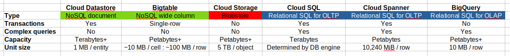

- **OLTP**: Online Transaction Processes.

**Use cases**

- Cloud Datastore:
    - Semi-structured application data, durable key-value data.
    - Getting started, App Engine apps.
- Cloud Bigtable:
    - "Flat" data, Heavy read/write, events, analytical data.
    - AdTech, Financial and IoT data.
- Cloud Storage:
    - Structured and unstructured binary or object data.
    - Images, large media files, backups.
- Cloud SQL:
    - Web frameworks, existing apps.
    - User credentials, customer orders.
- Cloud Spanner:
    - Large-scale database apps (> ~2 TB).
    - Whenever high I/O, global consistency is needed.
- BigQuery:
    - Interactive querying, offline analytics.
    - Data warehousing.                    

***

## Containers, Kubernetes, and Kubernetes Engine

**Introduction**

- **IaaS** (Compute Engine): Servers, storage, networking.
- **PaaS** (App Engine): Preset runtimes, managed services.

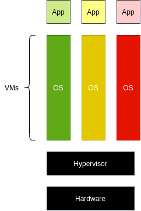

- The smallest unit of compute is VM, with App.

**App Engine**

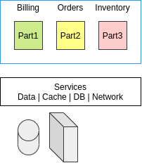

**Kubernetes**

-  Containers start much faster than virtual machines and use fewer resources, because each container does not 
have its own instance of the operating system.

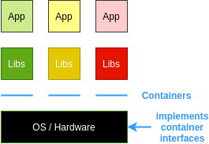

- Orchestrate many containers, on many hosts.
- Scale them, rolluot new version of them, rollback to old version when things go wrong.

**app.py**

```python
from flask import Flask
app = Flask(__name__)

@app.route("/")
def hello():
    return "Hello World!\n"

@app.route("/version")
def version():
    return "HelloWorld 1.0\n"

if __name__ == "__main__":
    app.run(host='0.0.0.0')
```

- Requirements:
    - Flask == 0.12
    - uwsgi == 2.015

**Dockerfile**

```Dockerfile
FROM ubuntu:18.10
RUN apt-get update -y && \
    apt-get install -y python3-pip python3-dev
COPY requirements.txt /app/requirements.txt
WORKDIR /app
RUN pip3 install -r requirements.txt
COPY . /app
ENTRYPOINT ["python3", "app.py"]
```

**Build and run**

```console
$> docker build -t py-server .
$> docker run -d py-server
```

### Kubernetes and GKE

- Open source orchestrator for containers.
- Lets deploy containers on set of nodes, clusters.
- Cluster: Set of master components, that control systems as a whole, and set of nodes that runs a containers.
- Node: Computing instance. In Google Cloud nodes are VMs running in Compute Engine.

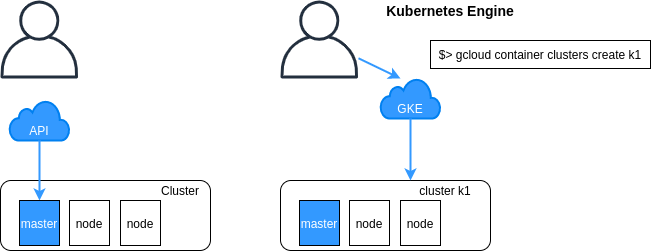

**Kubernetes pod**


- pod: Smallest deployable unit in Kubernetes. 

```console
$> kubectl run nginx --image=nginx:1.15.7
```

- Starts a deployment.
- nginx image running in pod.

**Deployment**

- Group of replicas with the same pod. Keeps pod running. Contain component of your application, or entire app.

```console
$> kubectl get pods

$> kubectl expose deployments nginx --port=80 --type=LoadBalancer
```

**Kubernetes Service**

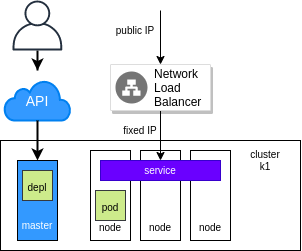

- Service group couple pods together. Provides an endpoint for them.


**Replicas**

```console
$> kubectl scale nginx --replicas=3

$> kubectl autoscale nginx --min=10 --max=15 --cpu=80

$> kubectl get pods -l "app=nginx" -o yaml
```

```yaml
apiVersion: v1
kind: Deployment
metadata:
    name: nginx
    labels:
      app: nginx
spec:
    replicas: 3
    selector:
      matchLabels:
        app: nginx
    template:
      metadata:
        labels:
          app: nginx
      spec:
        containers:
          - name: nginx
            image: nginx:1.15.7
            ports:
            - containerPort: 80
```

```console
$> kubectl apply -f nginx-deployment.yaml

$> kubectl get replicasets
NAME        DESIRED     CURRENT     READY       AGE
nginx-12344 5           5           5           12m

$> kubectl get pods
NAME            READY   STATUS      RESTARTS    AGE
nginx-12344-abc 1/1     Running     0           12m
nginx-12344-def 1/1     Running     0           12m
nginx-12344-ghi 1/1     Running     0           12m
nginx-12344-jkl 1/1     Running     0           12m
nginx-12344-mno 1/1     Running     0           12m

$> kubectl get deployments
NAME        DESIRED     CURRENT     UP-TO-DATA  AVAILABLE       AGE
nginx       5           5           5           5               12m
```

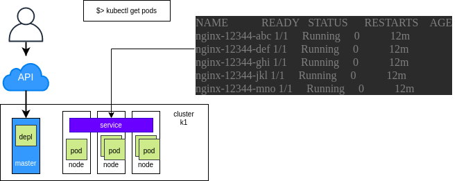

**Kubernetes rollingUpdate**

- Manages new-versions. Spare users from experiencing downtime.

```yaml
spec:
    # ...
    replicas: 5
    strategy:
      rollingUpdate:
        maxSurge: 1
        maxUnavailable: 0
      type: TollingUpdate
    # ...
```

### Hybrid and Multi-Cloud Computing (Anthos)

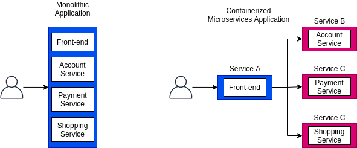

**Distributed systems housed on-premises are difficult to upgrade**

- Increasing capacity means buying more servers.
- Lead time for new capacity could be up to a year or more.
- Upgrades are expensive.
- The practical life of a server is short.

**Modern distributed systems allow a more agile approach to managing your compute resources.**

- Move only some of your compute workloads to the Cloud.
- Move at your own pace.
- Take advantage of Cloud's scalability and lower costs.
- Add specialized services to your compute resources stack.

**Anthos is Google's modern solution for hybrid and multi-cloud systems and services management**

- Kubernetes and GKE On-Prem create the foundation.
- On-premises and Cloud environments stay in sync.
- A rich set of tools is provided for:
    - Managing services on-premises an in the Cloud.
    - Monitoring systems and services.
    - Migrating apps from VMs into your clusters.
    - Maintaining consistent policies across all clusters, whether on-premises ot in the CLoud.

**Steps**

- **Google Kubernetes Engine** for production ready apps.
- **GKE On-Prem** is turn-key production-grade Kubernetes.
- Marketplace apps are available to all clusters.
- Service Meshes make apps more secure & observable.
- Stackdriver Logging and Monitoring watches all sides.
- Configuration Manager is the single source of truth.

***

## App Engine

- When you do not want to focus on infrastructure at all, only focus on your code.

**App Engine is a PaaS for building scalable applications**

- App Engine makes deployment, maintenance, and scalability easy so you can focus on code.
- Especially suited for building scalable web apps and mobile backends.

### App Engine Standard Environment

- Easily deploy your apps.
- Autoscale workloads.
- Free daily quota.
- Usage based pricing.
- SDKs for development, testing and deployment.

**App Engine standard environment: Requirements**

- Specific versions of Java, Python, PHP and Go are supported.

**Sandbox constraints**

- No writing to local files.
- All requests time out at 60s.
- Limits on third-party software.
 
**App Engine standard workflow: Web apps**
 
 - **1**: Develop & test the web app locally.
 - **2**: Use the SDK to deploy to App Engine.
 - **3**: App Engine automatically scales & reliably serves your web app.
    - App Engine can access a variety of services using dedicated APIs.

### App Engine Flexible Environment

- Build and deploy containerized apps with a click.
- No sandbox constraints.
- Can access App Engine resources.

**Comparing the App Engine environments**

| | Standard Environment | Flexible Environment |
|---|---|---|
| Instance startup | Milliseconds | Minutes |
| SSH access | No | Yes (although not by default) |
| Write to local disk | No | Yes (but writes are ephemeral) |
| Support for 3rd-party binaries | No | Yes |
| Network access | Via App Engine services | Yes |
| Pricing model | After free daily use, pay per instance class, with automatic shutdown | Pay for resource allocation per hour; no auto shutdown |

**Deploying Apps: Kubernetes Engine vs App Engine**

| | Kubernetes Engine | App Engine Flexible | App Engine Standard |
|---|---|---|---|
| Language support | Any | Any | Java, Python, Go, PHP |
| Service model | Hybrid | PaaS | PaaS |
| Primary use case | Container-based workloads | Web and mobile apps, container-based workloads | Web and mobile apps |

### Cloud Endpoints and Apigee Edge

**API hide detail, enforce contracts**

**Cloud Endpoints helps you create and maintain APIs**

- Distributed API management through an API console.
- Expose your API using a RESTful interface.
- Control access and validate calls with JSON Web Tokens and Google API keys:
    - Identify web, mobile users with Auth0 and Firebase Authentication.
- Generate client libraries.    

**Cloud Endpoints: Supported platforms**

| Runtime environments |
|---|
| App Engine Flexible Environment |
| Kubernetes Engine |
| Compute Engine |

| Clients |
|---|
| Android |
| iOS |
|Javascript |

**Apigee Edge helps you secure and monetize APIs**

- A platform for making API available to your customers and partners.
- Contains analytics, monetization, and a developer portal.

***

## Development in the Cloud

**Cloud Source Repositories**

- Fully featured Git repositories hosted on Google Cloud Platform.

**Cloud Functions (Beta)**

- Create single-purpose functions that respond to events without a server or runtime.
- Written in Javascript; execute in managed Node.js environment on Google Cloud Platform.

### Deployment: Infrastructure as code

**Deployment Manager**

- Provides repeatable deployments.
- Create a .yaml template describing your environment and use Deployment Manager to create resources.

### Monitoring: Proactive instrumentation

**Stackdriver**

- Monitoring
- Logging
- Debug
- Error Reporting
- Trace

**Stackdriver offers capabilities in six areas**

- Monitoring:
    - Platform, system, and app metrics.
    - Uptime / health checks.
    - Dashboards and alerts.
- Logging:
    - Platform, system, and app logs.
    - Log search, view, filter, and export.
    - Log-based metrics.
- Trace:
    - Latency reporting and sampling.
    - Per-URL latency and statistics.
- Error Reporting:
    - Error notifications.
    - Error dashboard.
- Debugger:
    - Debug apps.
- Profiler (Beta):
    - Continuous profiling of CPU and memory consumption.                    

***

## Big Data and Machine Learning

### Google Cloud Big Data Platform

**Google Cloud's big data services are fully managed and scalable**

- **Cloud Dataproc**: Managed Hadoop MapReduce, Spark, Pig, and Hive service.
- **Cloud Dataflow**: Stream and batch processing; unified and simplified pipelines.
- **BigQuery**: Analytics database; stream data at 100,000 rows per second.
- **Cloud Pub/Sub**: Scalable and flexible enterprise messaging.
- **Cloud Datalab**: Interactive data exploration.

**Cloud Dataproc is managed Hadoop**

- Fast, easy, managed way to run Hadoop and Spark/Hive/Pig on GCP.
- Create clusters in 90 seconds or less on average.
- Scale clusters up and down even when jobs are running.

**Why use Cloud Dataproc?**

- Easily migrate on-premises Hadoop jobs to the cloud.
- Save money with preemptible instances.
- Use Spark Machine Learning Libraries (MLlib) to run classification algorithms.

### Cloud Dataflow

**Cloud Dataflow offers managed data pipelines**

- Processes data using Compute Engine instances:
    - Clusters are sized for you.
    - Automated scaling, no instance provisioning required.
- Write code once and get batch and streaming.
    - Transform-based programming model.
- **Dataflow pipeline flow data from a source through transforms**

**Why use Cloud Dataflow?**

- ETL (extract/transform/load) pipelines to move, filter, enrich, shape data.
- Data analysis: Batch computation or continuous computation using streaming.
- Orchestration: Create pipelines that coordinate services, including external services.
- Integrates with GCP services like Cloud Storage, Cloud Pub/Sub, BigQuery and Bigtable:
    - Open source Java and Python SDKs.
    
### BigQuery

**BigQuery is a fully managed data warehouse**

- Provides near real-time interactive analysis of massive datasets (hundreds of TBs) using SQL syntax (SQL 2011).
- No cluster maintenance is required.

**BigQuery runs on Google's infrastructure**

- Compute and storage are separated with a terabit network in between.
- You only pay for storage and processing used.
- Automatic discount for long-term data storage.

### Cloud Pub/Sub & Cloud Datalab
    
**Cloud Pub/Sub is scalable, reliable messaging**

- Supports many-to-many asynchronous messaging.
- Application components make push/pull subscriptions to topics.
- Includes support for offline consumers.

**Why use Cloud Pub/Sub?**

- Building block for data ingestion in Dataflow, IoT, Marketing Analytics.
- Foundation for Dataflow streaming.
- Push notifications for cloud-based apps.
- Connect apps across GCP (push/pull between Compute Engine and App Engine).

**Cloud Datalab offers interactive data exploration**

- Interactive tool for large-scale data exploration, transformation, analysis and visualization.
- Integrated, open source:
    - Built in Jupyter (formerly IPython).
- Analyze data in BigQuery, Compute Engine, and Cloud Storage using Python, SQL, and JavaScript.
- Easily deploy models to BigQuery.    

### Google Cloud Machine Learning Platform

**Machine Learning APIs enable apps that see, hear, and understand**

- Open source tool to build and run neural network models:
    - Wide platform support: CPU or GPU; mobile, server, or cloud.
- Fully managed machine learning service:
    - Familiar notebook-based developer experience.
    - Optimized for Google infrastructure; integrates with BigQuery and Cloud Storage.
- Pre-trained machine learning models built by Google:
    - Speech: Stream result in real time, detects 80 languages.
    - Vision: Identify objects, landmarks, text, and content.
    - Translate: Language translation including detection.
    - Natural language: Structure, meaning of text.        

**Why use the Cloud Machine Learning platform?**

- **For structured data**:
    - Classification and regression
    - Recommendation
    - Anomaly detection
- **For unstructured data**:
    - Image and video analytics
    - Text analytics

### Machine Learning API

**Cloud Vision API**

- Analyze images with a simple REST API:
    - Logo detection, label detection, etc.
- Gain insight from images.
- Detect inappropriate content.
- Analyze sentiment.
- Extract text.

**Cloud Natural Language API**

- Can return text in real time.
- High accurate, even in noisy environment.
- Access from any device.
- Uses ML models to reveal structure and meaning of text.
- Extract info about items mentioned in text docs, news articles, and blog posts.

**Cloud Translation API**

- Translate arbitrary strings between thousands of language pairs.
- Programmatically detect a document's language.
- Support for dozens of languages.

**Cloud Video Intelligence API (Beta)**

- Annotate the contents of videos.
- Detect scene changes.
- Flag inappropriate content.
- Support for a variety of video formats.

**Terms**

- **Datasets**: A dataset is a grouping mechanism that holds zero or more tables. 
A dataset is the lowest level unit of access control. Datasets are owned by GCP projects. 
Each dataset can be shared with individual users.
- **Tables**: A table is a row-column structure that contains actual data. 
Each table has a schema that describes strongly typed columns of values. 
Each table belongs to a dataset.

***

# App Development

## Developing Applications

### Loosely Coupled Microservices and API Gateways

**Build for the Cloud**

- Global Reach.
- Scalability and High Availability.
- Security.

**Implement best practice to build scalable, secure and highly available applications**

- Code and Environment Management.
- Scalability and Reliability.
- Design and Development.
- Migration.

**Manage your apps code and environment**

- Code Repository.
- Dependency Management.
- Configuration Settings:
    - Configurations as environment variables.

**Consider implementing microservices**

- Monolithic application:
    - Codebase becomes large.
    - Packages have tangled dependencies.
- Microservices:
    - Service boundaries match business boundaries.
    - Codebase is modular.
    - Each service can be independently updated, deployed, and scaled.    

**Perform asynchronous operations**

- Keep UI responsive; perform backend operations asynchronously.
- Use event-driven processing.
    - Cloud Storage: User uploads image. Cloud Function is triggered.
    - Cloud Function: Uploads output image.

**Design for loose coupling**

- Publishers and subscribers are loosely coupled.

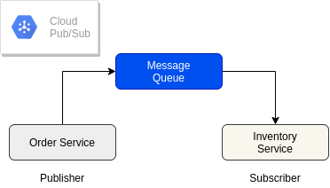

- Consumers of HTTP APIs should bind loosely with publisher payloads (use only email and name in email service). 

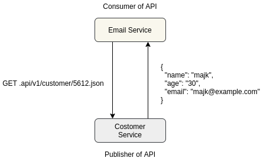

**Implement stateless components for scalability**

- Worker pattern: Workers perform compute tasks without sharing state. Can scale up and down reliably.
    - IoT data streams into Pub/Sub topic. Cloud Function is triggered.

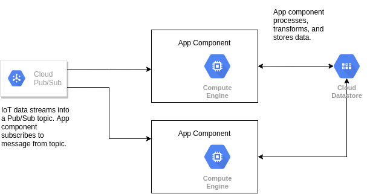

**Cache content**

- Cache app data.
- Cache hit: Return data from cache.
- Cache miss: Retrieve data from db and recompute results.
- Update cache with new results.
- Examples: Memcached, Redis.

**Cache frontend content**

- Cloud CDN.
- Cache load-balanced frontend content that comes from Compute Engine VM instance group.
- Cache static content that is served from Cloud Storage.

**Implement API gateway to make backend functionality available to consumer apps**

- apigee

### Security, Reliability, and Migration

**Use federated identity management**

- Sign in with Google.
- Sign in with Twitter.
- Sign in with GitHub.
- Sign in with email.

**Implement health-check endpoints**

- Health Monitoring Agent (Stackdriver Monitoring):
    - `/health`:
        - Storage
        - Database
        - Network connections

**Set up logging and monitor your application's performance**

- Google Cloud's operations suite:
    - Debugging
    - Error reporting
    - Tracing
    - Logs-based metrics
    - Monitoring 
- Stackdriver is Google Cloud's operations suite.

**Handle transient and long-lasting errors gracefully**

- Transient errors: Retry with exponential backoff.
- Service availability errors: Implement a circuit breaker.

**Consider data sovereignty and compliance requirements**

- EU-U.S. & Swiss-U.S Privacy Shield Framework.

**Perform high availability testing and develop disaster recovery plans**

- In addition to functional and performance testing, perform high-availability testing and develop disaster 
recovery plans.
- Testing:
    - Identify failure scenarios.
    - Create disaster recovery plans (people, processes, tools).
    - Perform tabletop tests. Team discuss how to react of unexpected situations.
- Production:
    - Perform canary testing and blue/green deployments.
    - Validate your disaster recovery plan.    

**Example failure Scenario**

- Connectivity failure.
- On-premises data center ot other cloud-provider failure.
- GCP zonal or regional failure.
- Deployment rollback.
- Data corruption caused by network or application issues.

**Implement CI and delivery pipelines**

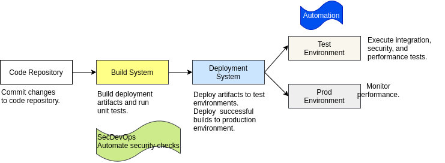

**Use the strangler pattern to re-architect applications**

- Strangler pattern: Incrementally replace components of the old application with new services.

### Cloud SDK, Cloud Client Libraries and Firebase SDK

**The Cloud Client Libraries**

- Are the latest and recommended way to make requests to the server.
- Provide idiomatic code in each language.
- Receive performance benefits from gRPS APIs (Google Remote Procedure Calls).

**Get started with the Cloud Client Libraries**

- GitHub repos:
    - Provided for each supported language and individual services.
    - Contain installation instructions and Client Library code.
- Reference libraries:
    - Link to docs.
    - Link to relevant StackOverflow posts.
    - Provide code examples.    

**Import the Datastore client library using Python**

```python
from google.cloud import datastore      # import libs

datastore_client = datastore.Client()   # instantiate client

kind = 'Task'
name = 'task1'
task_key = datastore_client.key(kind, name)

task = datastore.Entity(key=task_key)
task['description'] = 'Go running'

datastore_client.put(task)

print('Saved {}: {}'.format(task.key.name, task['description']))
```

**Cloud SDK is a set of command-line tools**

- The SDK:
    - Allows you to access GCP products and services.
    - Consists of:
        - `gcloud`
    - Allows to run tools:
        - Interactively
        - In automated scripts         

**Cloud SDK: gcloud**

- Is a command-line tool.
- Allows you to perform common tasks on GCP.
- Allows you to create and manage GCP resources.

```console
$> gcloud compute instances list

NAME            ZONE            MACHINE_TYPE    INTERNAL_IP     EXTERNAL_IP     STATUS
example-1       us-central1-a   n1-standard-1   10.240.95.198   10.167.182.XX   RUNNING
example-2       eu-west1-c      n1-standard-1   10.240.173.253  23.251.148.XX   RUNNING
```

**Cloud SDK: bq**

- Is a command-line tool to work with BigQuery.
- Allows you to manage datasets, tables, and other BigQuery entities.
- Allows you to run queries.

```console
$> bq query "SELECT word, SUM(word_count) as count FROM data:sample.ferris WHERE word CONTAINS 'Arnold' GROUP BY word"
```

**Cloud SDK: gsutil**

- Is a command-line tool to perform tasks in Cloud Storage.
- Allows you to:
    - Create and manage buckets.
    - Upload, download, and delete objects.
    - Move, copy, and rename objects.
    - Manage access to stored data.
    
```console
$> gsutil cp /home/mike/pictures/cloud-logo.png gs://my-bucket
```    

**Installing and configuring Cloud SDK**

- Initialize: `gcloud init`
- Manage components.
- Use gcloud Interactive Shell.
- Script gcloud commands.

**Cloud Shell**

- A browser-based command-line tool.
- Gives access to a temporary VM instance with:
    - 5 GB of persistent disk storage.
    - The Cloud SDK is pre-installed.
- Provides built-in authorization on Cloud Console projects and resources.
- Has a built-in code editor.    

**Cloud developer tools are available for various IDEs**

- Android Studio
- Eclipse
- IntelliJ
- PowerShell
- Visual Studio

**Firebase**

- Is a mobile and web app development platform.
- Supported platforms:
    - Android
    - iOS
    - Web
    - C++
    - Unity
    - Node.js
- Integration with GCP includes:
    - Firebase SDKs for Cloud Storage.
    - App Engine standard environment + Firebase.
    - Trusted execution added to Firebase app.
    - User authentication.
    - Cloud Functions for Firebase.
    - Cloud Vision API.
    - Cloud Speech API.    
    
### :star: Run Java App

- This command (above) to configure the IP tables redirects requests on Port 80 to Port 8080 - 
the Java Web application listens on Port 8080.

```
sudo iptables -t nat -A PREROUTING -p tcp --dport 80 -j REDIRECT --to-port 8080

mvn clean install

mvn spring-boot:run
```

***

## Cloud Storage, Datastore, Cloud Bigtable, Cloud SQL, and Cloud Spanner

### Overview of Data Storage Options

**Google Cloud provides a full suite of storage service options**

```
Cloud Storage, Firestore, Datastore, Cloud Bigtable, Cloud SQL, Cloud Spanner, BigQuery
```

- Cost-effective.
- Varied choices based on your:
    - Application
    - Workload

**Cloud Storage**

| Overview | Ideal for |
|---|---|
| Fully managed, highly reliable | Images and videos |
| Cost-effective, scalable object/blob store | Objects and blobs |
| Objects access via HTTP requests | Unstructured Data |
| Object name is the only key | Static website hosting |

**Firestore**

| Overview | Ideal for |
|---|---|
| Fully managed, serverless, NoSQL | Native mobile and web clients |
| Scalable | Document-oriented data |
| Native mobile and web client libraries | Large collections of small documents |
| Real-time updates and offline features | Durable key-value data |
| | Hierarchical data |
| | Managing multiple indexes |
| | Transactions |

**Datastore (Firestore in Datastore mode)**

| Overview | Ideal for |
|---|---|
| Fully managed NoSQL | Server applications |
| Scalable | Semi-structured app data |
| No mobile and web client libraries | Durable key-value data |
| No real-time and offline features | Hierarchical data |
| | Managing multiple indexes |
| | Transactions |

**Cloud Bigtable**

| Overview | Ideal for |
|---|---|
| High performance wide column NoSQL database service | Operational applications |
| Sparsely populated table | Analytical applications |
| Can scala to billions of rows and thousands of columns | Storing large amounts of single-keyed data |
| Can store TB to PB of data | MapReduce operations |

**Cloud SQL**

| Overview | Ideal for |
|---|---|
| Managed service (replication, failover, backups) | Web frameworks |
| MySQL, PostgreSQL, and SQL Server | Structured data |
| Relational database service | OLTP workloads (Online Transaction Processes) |
| Proxy allows for secure access to your Cloud SQL Second Generation instances without setting Allow rules | Applications using MySQL/PGS |

**Cloud Spanner**

| Overview | Ideal for |
|---|---|
| Mission-critical relational database service | Mission-critical applications |
| Transactional consistency | High transactions |
| Global scale | Scale and consistency requirements |
| High availability | |
| Multi-region replication | |
| 99.999% SLA | |

**BigQuery**

| Overview | Ideal for |
|---|---|
| Low-cost enterprise data warehouse for analytics | Online Analytical Processing (OLAP) workloads |
| Fully-managed | Big data exploration and processing |
| Petabyte scale | Reporting via Business Intelligence (BI) tools |
| Fast response times | |
| Serverless | |

**Run Microsoft SQL Server on Google Cloud**

- SQL images on Google Compute Engine.
- Compute Engine VMs can be preloaded with SQL Server.
- Licensing from Microsoft is included automatically.
- Supported versions:
    - SQL Server Standard
    - SQL Server Web
    - SQL Server Enterprise

### Storage options for mobile

**Cloud Store for Firebase**

- Overview:
    - Mobile and web access to Google Cloud Storage.
    - Serverless third-party authentication and authorization.
- Ideal for:
    - Images, pictures and videos.
    - Objects and blobs.
    - Unstructured data.
    
**Firebase Relational Database**

- Overview:
    - Realtime.
    - NoSQL JSON database
- Ideal for:
    - Mobile and web applications.
    - Realtime.
    
**Firebase Hosting**

- Overview:
    - Web and mobile content hosting.
    - Production-grade.
- Ideal for:
    - Atomic release management.
    - JS app support.
    - Firebase integration.             

**Cache your application data**

- Memorystore automates complex tasks for Redis and Memcached caching engine.
- Fully protocol compatible with each engine.
- Ideal for high-performance, scalable web applications, gaming, and stream processing.
- Fully managed service.
- Google-grade security.

**Summary**

| Product | Description | Ideal for | Not ideal for |
|---|---|---|---|
| Cloud Storage | Binary/Object store | Large or rarely accessed unstructured data | Structured data, building fast apps |
| Firestore | Real-time NoSQL database to store and sync data | Mobile, web, multi-user, IoT & real-time apps | Analytic data, heavy writes |
| Datastore | Scalable store for structured data | App Engine and server apps, heavy read/write | Relational or analytic data |
| BigTable | High-volume, low-latency database | "Flat", heavy read/write, or analytic data | High structure or transactional data |
| Cloud SQL | Well-understood VM-based RDBMS | Web frameworks, existing apps | Scaling, analytics, heavy writes |
| Spanner | Relational database service | Low-latency transactional systems | Analytic data |
| BigQuery | Auto-scaling analytic data warehouse | Interactive analysis of static datasets | Building fast apps |

| Product | Read/Write latency | Typical size | Storage type |
|---|---|---|---|
| Cloud Storage | Medium (100s of ms) | Any | Object |
| Firestore | Medium (10 of ms) | <200 TB | Document |
| Datastore | Medium (10s of ms) | <200 TB | Document |
| Bigtable | Low (ms) | 2 TB - 10 PB | Key-Value |
| Cloud SQL | Low (ms) | < 30 TB | Relational |
| Spanner | Low (ms) | Any | Relational |
| BigQuery | High(s) | Any | Columnar |

### Datastore Concepts and Indexes

**Datastore = Firestore in Datastore mode**

- Fully backward compatibile with original Datastore but uses Firestore's improved storage layer.
- The Datastore page is used to manage the database.
- A project can have onlt a Firestore Native mode database or Datastore mode database, but not both.
- How to decide:
    - Choose Datastore mode when creating a new server application.
        - Automatically scales to millions of writes per second.
    - Choose Native mode for new mobile and web apps or when requiring real-time and offline features.
        - Automatically scales to millions of concurrent clients.        

**Datastore concepts**

- Data objects are called entities.
- Entities are made up of one or more properties.
- Each entity has a key that uniquely identifies it, composed of:
    - Namespace
    - Entity kind
    - Identifier (either a string or numeric ID)
    - Ancestor Path (optional)
- Operations on one more entities are called transactions.    

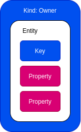

**You can specify ancestors of an entity**

- Complete key of Pencil entity:
```yaml
[Customer:John, Invoice: April, Product: Pencil]
```

**Datastore has two types of indexes**

| Built-in indexes | Composite indexes |
|---|---|
| Automatically pre-defined indexes for each property of each entity kind | Index multiple property values for indexed entity |
| Are suitable for simple types of queries | Support complex queries |
| | Are defined in an index configuration file |

**Create and delete your composite indexes**

- Defined in configuration file named index.yaml
- To create a composite index:
    - Add index definition to index.yaml
    - Run: `gcloud datastore indexes create`
- To delete a composite index:
    - Remove indexes you no longer need from index.yaml
    - Run: `gcloud datastore indexes cleanup`    

**Datastore as compared to relational databases**

- Datastore:
    - Is designed to automatically scale to very large data sets.
    - Doesn't support join operations, inequality filtering on multiple properties, or filtering on data base on 
    results of a subquery.
    - Doesn't require entities of the same kind to have a consistent property set.
    
| Concept | Datastore | Relational database |
|---|---|---|
| Category of an object | Kind | Table |
| One object | Entity | Row |
| Individual data for an object | Property | Field |
| Unique ID for an object | Key | Primary Key |    

### Design Considerations & Sharding

**Design your app with these considerations in mind**

- Use UTF-8 characters for:
    - Namespace names
    - Kind names
    - Property names
    - Key names
- Avoid forward shlash (/) in:
    - Kind names
    - Custom key names
    
**OK**

```
key = client.key('Task', 'hard_task')
```

**Not OK**

```
key = client.key('Task', 'hard/task')
```

**Use sharding to increase rate of writes**

- Datastore will shard entities automatically.
- You can shard manually if the number of writes exceeds Datastore limits.

**Shard counters to avoid contention with high writes**

- Reduce contention by building a shared counter, breaking the counter up into N different counters in N entities.
- To increment, pick a shard at random and increment its counter.
- To retrieve the count, read all of the sharded entities and sum their individual counts.

**Use replication to read a portion of the key range**

- Use replication to read a portion of the key range at higher rate.
- You can store N copies of the same entity, allowing an N times higher rate of reads.

### Replication, Query Types, Transactions, and Handling Errors

- Use batch operations for reads, writes, and deletes.
- Roll back failed transactions.
- Use asynchronous calls.

**Use query types based on needs**

- Keys-only:
    - Retrieve only the key.
    - Return results at lower latency and cost (free).
    - `SELECT __key__ FROM Task`
- Projection:
    - Retrieve specific properties from an entity.
    - Retrieve only the properties included in the query filter.
    - Return results at lower latency and cost (free).
    - `SELECT priority, percent_complete FROM Task`    
- Ancestor:
    - Limits results to the specified entity and its descendants.
    - `SELECT * FROM Task WHERE __key__ HAS ANCESTOR KEY(TaskList, 'default')`
- Entity:
    - Retrieve an entity kind, zero or more filters, and zero or more sort orders.
    - `SELECT * FROM Task WHERE done = FALSE`    

**Improve query latency by using cursors instead of offsets**

- Integer offsets:
    - Don't return skipped entities to your application.
    - Still retrieve the entities internally.
    - Cause your app to be billed for read operations.
- Query cursors:
    - Retrieve a query's results in convenient batches.
    - Don't incur the overhead of query offset.    

**Numeric IDs as keys**

- Do not use a negative number.
- Do not use the value 0.
- If you wish to manually assign numeric IDs to your entities, get a block of IDs using the allocateIds() method.
- Avoid monotonically increasing values.

**Transaction design considerations**

- Atomic:
    - All are applied or.
    - None are applied.
- Max duration: 270 sec.
- Idle expiration: 60 sec.
- Can fail when:
    - Too many concurrent modifications are attempted on the same entity.
    - A resource limits is exceeded.
    - Datastore encounters an internal error.

> Make your Datastore transaction idempotent whenever possible!

**Design app to handle errors**        

***

## Cloud Storage Concepts & Classes

**Google Cloud Storage Concepts**

- Resources are entities in Google Cloud Platform including:
    - Projects
    - Buckets: The basic Cloud Storage container.
    - Objects: The individual pieces of data that you store in Google Cloud Storage.

### Storage Classes

**Multi-Regional**

- Characteristics:
    - 99.95% availability.
    - Geo-redundant.
- Use Cases:
    - Serving website  content.
    - Streaming videos.
    - Mobile apps.
- Price (per GB per month):
    - $0.026
- APIs name:    
    - `multi_regional`
    
**Regional Storage**

- Characteristics:
    - 99.9% availability.
    - Data stored in a narrow geographic region.
- Use Cases:
    - Data analytics.
- Price (per GB per month):
    - $0.02    
- APIs name:
    - `regional`    
    
**Nearline Storage**

- Characteristics:
    - 99.0% availability.
    - Data retrieval costs.
    - Higher per-operation costs.
    - 30-day minimum storage duration.
- Use Cases:
    - Back-up.
    - Serving long-tail multimedia content.
- Price (per GB per month):
    - $0.01
- APIs name:
    - `nearline`
    
**Coldline Storage**

- Characteristics:
    - 99.0% availability.
    - Data retrieval costs.
    - Higher per-operation costs.
    - 90-day minimum storage duration.
- Use Cases:
    - Disaster recovery.
    - Data archiving.
- Price (per GB per month):
    - $0.007
- APIs name:
    - `coldline`
    
### Bucket / Object Operations and Truncated Exponential Backoff

**The following operations are strongly consistent**

```
Strongly consistent: When you perform an operation in Cloud Storage and receive a success response, the object is
immediately available for download and metadata operations.
```

- Read-after-write
- Read-after-metadata-update
- Read-after-delete
- Bucket listing
- Object listing
- Granting access to resources.

**The following operations are eventually consistent**

```
Eventually consistent: When you perform an operation, it may take some time for the operations to take effect.
```

- Revoking access from objects.
- Accessing publicly readable cached objects.
                          
**Use the following request endpoints**

- Typical API requests: 
    - XML, JSON.
- CNAME redirects: 
    - Use the following URI in the host name portion of your CNAME record: `c.storage.googleapis.com`.
- Authenticated browser downloads:
    - To download an object using cookie-based authentications.
- Content-based load balancing:
    - Create backend Cloud Storage buckets and serve content based on the URL sent to an external HTTPS load balancer.                    

**Composite objects and parallel uploads**

- Combine up to 32 objects into a single new object.
- Use cases include:
    - Dividing your data and uploading each chunk to a distinct object, composing your final object, and deleting
    any temporary objects.
    - Uploading data to a temporary new object, composing it with the object you want to append to it, and delete
    the temporary object.
- Compose object of smaller chunks using gsutil:

```
gsutil compose gs://example-bucket/component-obj-1
gs://example-bucket/component-obj-2
gs://example-bucket/composite-object
```    

**Design your app to handle network failures with truncated exponential backoff**

- Truncated exponential backoff:
    - Is a standard error-handling strategy for network applications.
    - Periodically retries failed requests with increasing delays between requests.
    - Should be used for all requests to Cloud Storage that return HTTP 5xx and 429 response codes.

```python
@retry(wait_exponential_multiplier=1000, wait_exponential_max=10000)

def wait_exponential_1000():
    print "Wait 2^x * 1000 milliseconds between each retry, up to 10 seconds, then 10 seconds afterwards"
```    

### Best Practices for Cloud Storage

**Follow these best practices for naming**

- Use globally unique names: `eu-west1-app-bucket01`.
- Use GIDs or the equivalent if your application needs a lot of buckets.
- Confirm to standard DNS naming conventions: `app-unique-bucket01`.

**Don't**

- Use personally identifiable information (PII): `majkiseba`.
- Use user IDs, email, project names/IDs, etc: `majki`, `project-gcp-marketing`.
- Use IP address notation: `192.169.0.1`.
- Use the **goog** prefix or include any spelling or close misspelling to google: `goog_backet56555`.

**Follow these best practices for Cloud Storage traffic**

- Consider:
    - Operations per second
    - Bandwidth
    - Cache control
- Design your app to minimize spikes in traffic.
- Use a exponential backoff if you get an error.
- For request rates > **1000 write requests.second** or **5000 read requests/second** :
    - Start with a request rate below or near the threshold.
    - Double the request rate no faster than every 20 minutes.   

**Consider the characteristics of your data**

- Standard Storage:
    - Use for data served at a high rate with high availability.
    - No minimum storage duration and lowest operation charges.
- Nearline Storage and Coldline Storage:
    - Use for infrequently accessed data that tolerates slightly lower availability.
    - 30 and 90 day minimum storage durations respectively with proportionate operation and storage charges.
- Archive Storage:
    - Use for data accessed less than once a year with no availability SLA.
    - 365 days minimum storage duration and lowest per-month storage charges.        

**Secure buckets using the following options**

- Use Cloud Identity and Access Management (Cloud IAM) permissions to grant:
    - Access to buckets.
    - Bulk access to a bucket's objects.
- Use Access Control Lists (ACLs) to grant:
    - Read or write access to users for indicidual buckets or objects.
    - Access when fine-grained control over individual objects is required.
- Signed URLs (query string authentication):
    - Provide time-limited read or write access to an object through a generated URL.        
    - Can be created using **gsutil** or programmatically.
- Use Signed Policy Documents to:
    - Specify what can be uploaded to a bucket.
    - Control size, content type, and other upload characteristics.
- Firebase Security Rules provide:
    - Granular, attribute-based access control to mobile and web apps using the Firebase SDKs for Cloud Storage.
    
**Consider these additional security best practices**

- Use TLS (HTTPS) to transport data.
- Use an HTTPS library that validates server certificates.
- Revoke authentication credentials for apps that no longer need access to data.
- Securely store credentials.
- Use groups instead of large numbers of users.
- Bucket and object ACLs are independent for each other.
- Avoid making buckets publicly readable or publicly writable.            

**Consider retention policies and retention policy locks**

- Add a retention policy to a bucket to specify a retention period.
    - If no policy exists, you can delete or replace objects.
    - If a policy exists, objects can only be deleted or replaced once their age is greater than the policy.
    - Applies retroactively to existing and new objects added to the bucket.
- Lock a retention policy to permanently set it on the bucket:
    - Once set, you cannot remove or reduce the retention period.
    - A bucket cannot be deleted unless every object in the bucket has met the retention period.
    - The retention period of a locked object can be increased.
    - Locking a retention policy can help with data compliance regulations.

**Uniformly control access to Cloud Storage resources**

- Uniform bucket-level access allows you to uniformly control access to Cloud Storage resources.
- The feature disables ACLs. Only IAM permissions grant access to the bucket and it's objects.
- Uniform bucket-level access is recommended, because it unifies and simplifies how you grant access to your 
Cloud Storage resources.

**Best practices for uploading data**

- If using XMLHttpRequest:
    - Don't close and re-open the connection.
    - Set reasonably long timeouts for upload traffic.
- Make the request to create the resumable upload URL from the same region as the bucket and upload location.    
- Avoid breaking transfers into smaller chunks.
- Avoid uploading content that has both:
    - `content-encoding gzip`
    - `content-type that is compressed`

**Consider the following when using gsutil for Cloud Storage**

- `gsutil -D` will include OAuth2 refresh and access tokens in the output.
- `gsutil --trace-token` will include OAuth2 tokens and the contents of any files accessed during the trace.
- Customer-supplied encryption key information in **.boto** config security-sensitive.
- In a production environment, use a service account for `gsutil`.

**Validate your data**

- Data can be corrupted during upload or download by:
    - Noisy network links.
    - Memory errors on:
        - Client computer
        - Server computer
        - Routes along the path
    - Software bugs
- Validate data transferred to/from bucket using:
    - CRC32c Hash:
        - Is available for all cloud storage objects.
        - Can be computed using these libraries:
            - Boost for C++
            - crcmod for Python
            - digest-crc for Ruby
        - gsutil automatically performs integrity checks on all uploads and downloads.
    - MD5 Hash:
        - Is supported for non-composite objects.
        - Cannot be used for partial downloads.                                

**You can host static websites**

- You can allow scripts hosted on other websites to access static resources stored in a Cloud Storage bucket.
- You can also allow scripts hosted in Cloud Storage to access static resources hosted on a website external to
Cloud Storage.


