# GCP Networking

## Networking in Google Cloud 

**Defining and Implementing Networks**

- Google Cloud VPC Networking Fundamentals.
- Controlling Access to VPC Networks.
- Sharing Networks across Projects.
- Load Balancing.

**Hybrid Connectivity and Network Management**

- Hybrid Connectivity.
- Pricing and Billing.
- Network Design and Deployment.
- Network Monitoring and Troubleshooting.

## Google Cloud VPC Networking Fundamentals

### Virtual Private Cloud

**VPC objects**

- Projects
- Networks:
    - Default, auto mode, custom mode.
- Subnetworks
- Regions
- Zones
- IP addresses:
    - Internal, external, range.
- Virtual machines (VMs)
- Routes
- Firewall rules        

### Projects, networks, and subnetworks

**Projects and networks**

- **Project**:
    - Associates objects and services with billing.
    - Contains networks (up to 5).
    - Natworks can be shared/peered.
- **Network**:
    - No IP address range.
    - Global and spans all available regions.
    - Contains subnetworks.
    - Type: default, auto, or custom.

**3 VPC network types**

- Default:
    - Every project.
    - One subnet per region.
    - Default firewall Rules.
- Auto Mode:
    - Default network.
    - One subnet per region.
    - Regional IP allocation.
    - Fixed **/20** subnetwork per region.
    - Expendable up to **/16**.
- Custom Mode:
    - No default subnets created.
    - Full control of IP ranges.
    - Regional IP allocation.
    - Expendable to any RFC 1918 size.        

**Network isolate systems**


- A and B can communicate over internal IPs even though they are in different regions.
- C and D must communicate over external IPs even though they are in the same region. 

**Google's VPC is global**


**Subnetworks cross zones**


- VMs can be on the same subnet but in different zones.
- A single firewall rule can apply to both VMs.

**Expand subnets without re-creating instances**

- Cannot overlap with other subnets.
- Inside the RFC 1918 address spaces.
- Can expand but not shrink.
- Auto mode can be expanded from **/20** to **/16**.
- Avoid large subnets.


### IP addresses

**VMs can have internal and external IP addresses**

| Internal IP | External IP |
|---|---|
| Allocated from subnet range to VMs by DHCP | Assigned from pool (ephemeral) |
| DHCP lease is renewed every 24 hours | Reserved (static) and billed more when not attached to a running VM |
| VM name + IP is registered with network-scoped DNS | VM doesn't know external IP; it is mapped to the internal IP |

### Mapping IP addresses

**External IPs are mapped to internal IPs**

```console
$> sudo /sbin/ifconfig
```

**DNS resolution for internal addresses**

- Each instance has a hostname that can be resolved to an internal IP address:
    - The hostname is the same as the instance name.
    - FQDN is `[hostname].c.[project-id].internal`.
    - Example: `shipping-test.c.shipping-98341.internal`
- Name resolution is handled by internal DNS resolver:
    - Provided as part of Compute Engine (192.254.198.253).
    - Configured for use on instance via DHCP.
    - Provides answer for internal and external addresses.    

**DNS resolution for external addresses**

- Instances with external IP addresses can allow connections from hosts outside of the project.
    - Users connect directly using external IP address.
    - Admins can also publish public DNS records pointing to the instance.
        - Public DNS record are not published automatically.
- DNS records for external addresses can be published using existing DNS servers (outside of GCP).
- DNS zones can be hosted using Cloud DNS.        

**Host DNS zones using Cloud DNS**

- Google's DNS service.
- Translate domain names into IP address.
- Low latency.
- High availability (100% uptime SLA).
- Create and update millions of DNS records.
- UI, command line, or API.

**Assing a range of IP addresses**

- Assign a range of IP addresses as aliases to a VM's network interface using alias IP ranges.


### Routes and firewall rules

**A route is a mapping of an IP  range to a destination**

- Every network has:
    - Routes that let instances in a network send traffic directly to each other.
    - A default route that directs packets to destinations that are outside the network.
- **Firewall rules must also allow the packet**.    

**Routes map traffic to destination networks**

- Destination in CIDR notation.
- Applies to traffic egressing a VM.
- Forwards traffic to most specific route.
- Traffic is delivered only if it also matches a firewall rule.
- Created when a subnet is created.
- Enables VMs on same network to communicate.


**Instance routing tables**

- **vpngateway**:
    - `10.100.0.0/16 -> default-route-87...`
    - `0.0.0.0/0 -> default-route-0086`
- **vm2**:
    - `10.100.0.0/16 -> default-route-87...`
    - `0.0.0.0/0 -> default-route-0086`
    - `172.12.0.0/16 -> vpngateway`
- **vm1**:
    - `10.100.0.0/16 -> default-route-87...`
    - `0.0.0.0/0 -> default-route-0086`
    - `172.12.0.0/16 -> vpngateway`

**Firewall rules protect your VM instance from unapproved connections**

- VPC network functions as a distributed firewall.
- Firewall rules are applied to the network as a whole.
- Connections are allowed or denied at the instance level.
- Firewall rules are stateful.
- Implied deny all ingress and allow all egress.

**Routes map traffic to destination networks**

- `direction`:
    - Inbound connections are matched against `ingress` rules only.
    - Outbound connections are matched against `egress` rules only.
- `source or destination`:
    - For the `ingress` direction, `sources` can be specified as part of the rule with IP addresses, source tags, or a
    source service account.
    - For the `egress` direction, `destinations` can be specified as part of the rule with one or more ranges of 
    IP addresses.
- `protocol` and `port`:
    - Any rule can be restricted to apply to specific protocols only or specific combinations of protocols and ports only.
- `action`:
    - To allow or deny packets that match the direction, protocol, port, and source or destination of the rule.
- `priority`:
    - Governs the order in which rules are evaluated; the first matching rule is applied.
- Rule assignment:
    - All rules are assigned to all instances, but you can assign certain rules to certain instances only.                 

**GCP firewall use case: Egress**

- Conditions:
    - Destination CIDR ranges.
    - Protocols
    - Ports
- Action:
    - Allow: permit the matching egress connection.
    - Deny: block the matching egress connection.

  
    
**GCP firewall use case: Ingress**

- Conditions:
    - Source CIDR ranges.
    - Protocols
    - Ports
- Action:
    - Allow: permit the matching ingress connection.
    - Deny: block the matching ingress connection.    

  

**Hierarchical firewall policies**

- My-Org: `Ingress from 1.1.1.10/24 priority 1 fo to_next Ingress any:any priority 2 deny`.
- My-Org/my-folder-1: `Ingress tcp:80,443 priority 1 allow Ingress any:any priority 2 deny`
- My-Org/my-folder-1/project_1/vps1: `Default ingress deny all, egress allow all`
- My-Org/my-folder-2/project_2/vpc2: `Ingress tcp 80,443,22 priority 1000 allow Default ingress deny all, egress allow all`

***

## Multiple network interfaces

**Multiple network interfaces**

- VPC networks are isolated (by default):
    - Communicate within networks using **internal IP**.
    - Communicate across networks using **external IP**.
- Multiple Network Interfaces:
    - Network interface controllesr (NICs).
    - Each NIC is attached to a VPC network.
    - Communicate across networks using **internal IP**.    


**Multiple network interfaces limitations**

- Configure when you create instance.
- Each interface in different network.
- Networks' IP range cannot overlap.
- Networks must exists to create VM.
- Cannot delete interface without deleting VM.
- Internal DNS only associated to nic0
- Up to 8 NICs, depends on VM.

| Type of instance | # of virtual NICs |
|---|---|
| VM <= 2 vCPU | 2 NICs |
| VM > 2vCPU | 1 NIC per vCPU (Max: 8) |

***

## Cloud IAM

### Cloud Identity and Access Management

```
Who can do what on which resources.
```

**Cloud IAM objects**

- Organization
- Folders
- Projects
- Resources
- Roles
- Members

**Cloud IAM resource hierarchy**

- A policy is set on a resource, and each policy contains a set of:
    - Roles
    - Members
- Resources inherit policies from the parent.
- If the parent policy is less restrictive, it overrides a more restrictive resource policy.

    

### IAM members

**Members**

**G Suite is now Google Workspace**

- Members Identity:
    - Google Account
    - Service Account
    - Google Group
    - Cloud Identity or Google Workspace Domain
- Roles:
    - `compute.instanceAdmin`
    - `storage.objectAdmin`
    - `appengine.appAdmin`
    - `logging.viewer`
    - `pubsub.publisher`
- Note: You cannot use Cloud IAM to create or manage your users or groups.    


### IAM roles

**Basic roles**

- **Owner**:
    - Invite members
    - Remove Members
    - Delete projects
    - And... **Editor** roles
- **Editor**:
    - Deploy applications
    - Modify code
    - Configure services
    - And... **Viewer** roles
- **Viewer**:
    - Read-only access.
- **Billing Administrator**:
    - Manage billing
    - Add and remove administrators

```
A project can have multiple owners, editors, viewers, and billing administrators.
```            

**Predefines roles**

- Cloud IAM:
    - Google Groups
    - Network Viewer Role:
        - List of Permissions:
            - `compute.addresses.get`
            - `compute.addresses.list`
            - `compute.globalAddresses.get`
            - `compute.globalAddresses.list`
            - `compute.backendBuckets.get`
            - `compute.backendBuckets.list`
            - `compute.networks.list`
            - `...`
    - **project_a**            

**Network-related IAM roles**

| Role Title | Description |
|---|---|
| Network Viewer | Read-only access to all networking resources |
| Network Admin | Permissions to create, modify, and delete networking resources, except for firewall rules and SSL certificates |
| Security Admin | Permissions to create, modify, and delete firewall rules and SSL certificates |

**Custom roles**

- **List of Permissions**:
    - :heavy_check_mark: `compute.firewalls.*`
    - :heavy_check_mark: `compute.sslCertificates.get`
    - :heavy_check_mark: `compute.sslCertificates.list`
    - `...`
- **Custom Role**
    - My Network Admin Role    
    
**The Organization Policy Service gives you centralized and programmatic control over your cloud resources**

      

**Organization policy constraints**

- Defines what behaviors are controlled.
- List of boolean.
- Supported by multiple Google Cloud services.
- VPC networking examples:
    - Restrict VM IP Forwarding.
    - Restrict Shared VPC Subnetworks.
    - Restrict Shared VPC Host Projects.
    - Restrict VPC peering usage.

***

## Firewall Rules

**Firewall rules protect your VM instances from unapproved connections**

- VPC network functions as a distributed firewall.
- Firewall rules are applied to the network as a whole.
- Connections are allowed or denied at the instance level.
- Firewall rules are stateful.
- Deny all ingress and allow all egress rules are implied.

**Firewall rule parameters: Target and Source**

- Target:
    - All instances in the network.
    - Specified target tags.
    - Specified service accounts.
- Source:
    - IP ranges
    - Subnets
    - Source Tage    
    - Service account

  

### Shared VPC

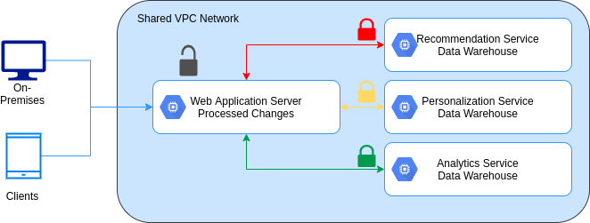  

**Provisioning shared VPC**

- **Organization Admin**:
    - Organization is the root node.
    - Workplace or Cloud Identity super administrators assign Organization Admins.
    - Nominates Shared VPC Admin (compute.xpnAdmin).
- **Shared VPC Admin**:
    - Enables shared VPC for host project.
    - Attaches service projects.
    - Delegates access to some or all subnets in shared VPC network (compute.networkUser).
- **Service Project Admin**:
    - Network User.
    - Control over service project resources:
        - Compute instance Admin.
        - Project Owner.
    - Create resources in shared VPC:
        - VM instances.
        - Instance templates and groups.
        - Static internal IP.
        - Load balancers.        

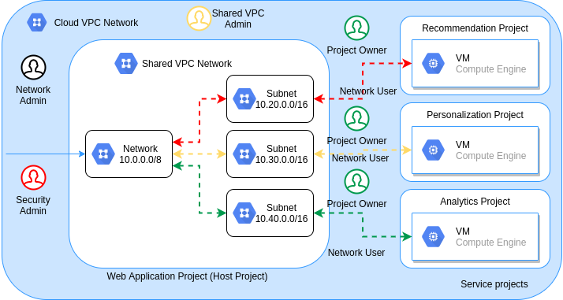 

### VPC Network Peering

**VPC peering**

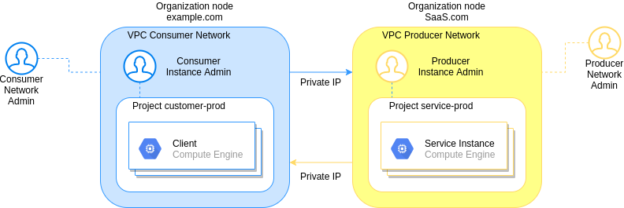 

**When using VPC peering**

- Compute Engine, Kubernetes Engine, and App Engine flexible environments.
- Peered VPC networks remain administratively separate.
- Each side of a peering association is set up independently.
- No subnet IP range overlap across peered VPC networks.
- Transactive peering is not supported.

**Shared VPC vs. VPC peering**

| Consideration | Shared VPC | VPC Network Peering |
|---|---|---|
| Across organizations | No | Yes |
| Within project | No | Yes |
| Network Administration | Centralized | Decentralized |

**Network Administration:**

- Centralized:
    - Organization Admin:
        - Shared VPC Admin.
        - Security and Network Admins.
- Decentralized:
    - Organization Admin (if same org):
        - Security and Network Admins

**Peering with a shared VPC**

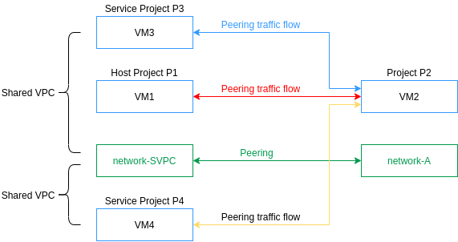 

***

## Load Balancing

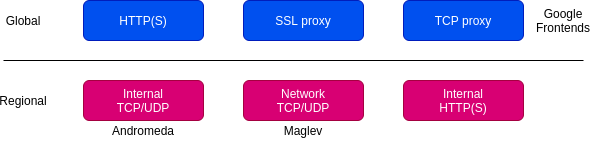 

### Managed Instances

- Deploys identical instances based on instance template.
- Instance group can be resized.
- Manager ensures all instances are RUNNING.
- Typically, used with autoscaler.
- Can be single zone or regional.

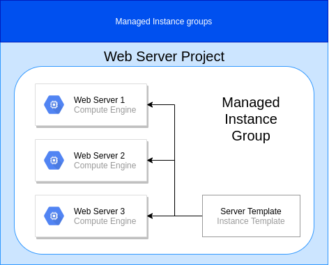 

**Create an instance template**

**Create a managed instance group**

- Determine instance group be single or multi-zoned, and location.
- Choose ports they're going to allow and load balance across.
- Select instance template you want to use.
- Decide if you want autoscale and under what circumstances.
- Consider creating health checks.

**Managed instance groups offer autoscaling capabilities**

- Dynamically add/remove instances:
    - Increases in load.
    - Decreases in load.
- Autoscaling policy:
    - CPU utilization.
    - Load balancing capacity.
    - Monitoring metrics.
    - Queue-based workload.
    
**Target CPU utilization = 75%**

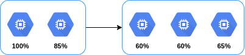 

### HTTP(S) load balancing

- Global load balancing.
- Anycast IP address.
- HTTP on port 80 or 8080.
- HTTPs on port 443.
- IPv4 or IPv6 clients.
- Autoscaling.
- URL maps.

**Architecture of an HTTP(S) load balancer**

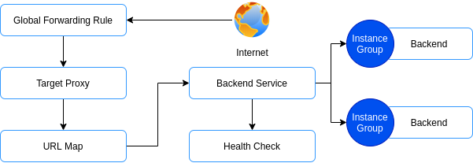

**Backend services**

- Health check.
- Session affinity (optional).
- Timeout setting (30-sec default).
- One or more backends:
    - An instance group (managed or unmanaged).
    - A balancing mode (CPU utilization or RPS).
    - A capacity scaler (ceiling % of CPU/Rate targets).

**HTTP(S) load balancing**

- Target HTTP(S) proxy.
- One signed SSL certificate installed (at least).
- Client SSL session terminates at the load balancer.
- Support the QUIC transport layer protocol:
    - Allows faster client connection initiation.
    - Eliminates head of line blocking in multiplex streams.
    - Supports connection migration when the client's IP address changes.

**SSL certificates**

- Required for HTTP(S) load balancing.
- Up to 10 SSL certificates (per target proxy).
- Create an SSL certificate resource.

### Cloud Armor

**Cloud Armor works with HTTP(S) load balancing**

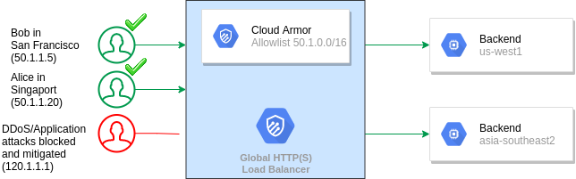

**Security policies with deny and allow rules**

- Denying: Block source IPa address or CIDR range.
- Allowing: Allow source IP address or CIDR range.
- IPv4 and IPv6 addresses.
- Deny rule: 403, 404, or 504 error code.
- Priority: Rule order.

**Cloud Armor Web Application Firewall**

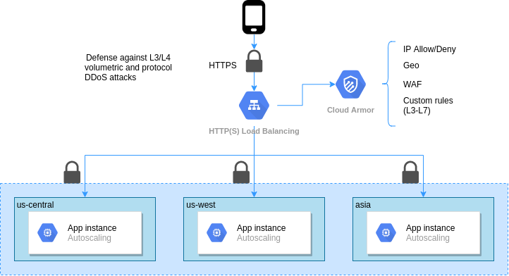

**Google Cloud Armor integrates with the Security Command Center**

- Alerts of potential Layer 7 attacks.
- Findings automatically sent to Security Command Center.
- Organizations with Security Command Center enabled and Cloud Armor receive real-time notifications of two events:
    - Allowed Traffic Spike.
    - Increasing Deny Ratio. 

**Network endpoint groups**

- Specifies a group of backend endpoints or services.
- Used as a backend for certain load balancers.
- Zonal, internet and serverless endpoint types.

### Cloud CDN

**Caching content with Cloud CDN**

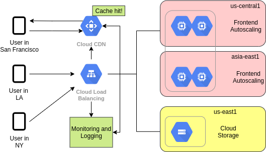

**Cloud CDN cache modes**

- Cache modes control the factors that determine whether or not Cloud CDN caches your content.
- Cloud CDN offers three cache modes:
    - USE_ORIGIN_HEADERS
    - CACHE_ALL_STATIC
    - FORCE_CACHE_ALL

### SSL/TCP proxy load balancing

**SSL proxy load balancing**

- Global load balancing for encrypted, non-HTTP traffic.
- Terminates SSL sessions at load balancing layer.
- IPv4 or IPv6 clients.
- Benefits:
    - Intelligent routing.
    - Certificate management.
    - Security patching.
    - SSL policies.

**TCP proxy load balancing**

- Global load balancing for unencrypted, non-HTTP traffic.
- Terminates TCP sessions at load balancing layer.
- IPv4 or IPv6 clients.
- Benefits:
    - Intelligent routing
    - Security patching
    
### Network load balancing

- Regional, non-proxied load balancer.
- Forwarding rules (IP protocol data).
- Traffic:
    - UDP
    - TCP/SSL ports
- Backends:
    - Instance group
    - Target pool    

**Target pool resource defines a group of instances that receive incoming traffic from forwarding rules**

- Forwarding rules (TCP and UDP).
- Up to 50 per project.
- One health check.
- Instances must be in the same region.

### Internal Load Balancing

**Internal TCP/UDP load balancing**

- Regional load balancer:
    - VM instances in same region.
- TCP/UDP traffic.
- Reduce latency, simpler configuration.
- Software-defined, fully distributed load balancing.
- Global access option. 
    
**Software-defined, fully distributed load balancing**    

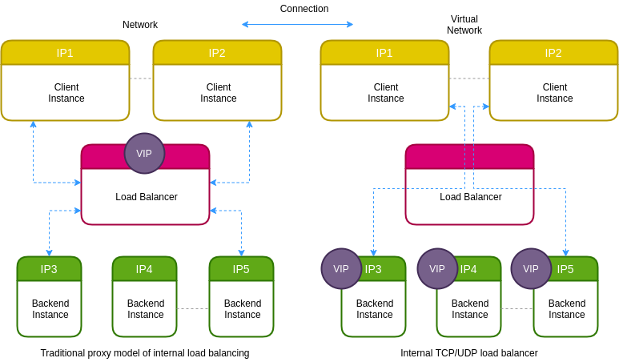

**Internal HTTP(S) load balancing**

- Regional, private load balancing:
    - VM instances in same region.
    - RFC 1918 IP addresses.
- HTTP, HTTPS, or HTTP/2 protocols.
- Based on open source Envoy proxy.    

**Internal load balancing supports 3-tier web services**

### Choosing Load Balancer

**IPv6 termination for load balancing**

- Https, SSL proxy, and TCP proxy load balancing services support IPv6 clients.

**Load Balancing aspects to consider**

- Global vs Regional Load Balancing.
- Internal vs External Load Balancing.
- Traffic type:
    - HTTP, HTTPS: Use HTTP(S) service as a layer 7 load balancer.
    - Otherwise, use TCP and UDP traffic path:
        - SSL proxy
        - TCP proxy
        - Network Load Balancer
- Internal:
    - Internal TCP, UDP, and HTTP(S) depending on traffic type.
    
| Load balancer | Traffic type | Global/Regional | External/Internal | External ports for load balancing |
|---|---|---|---|---|
| HTTP(S) | HTTP or HTTPS | Global IPv4, IPv6 | External | HTTP on 80 or 8080; HTTPS on 443 |
| SSL Proxy | TCP with SSL offload | --- | --- | 25, 43, 110, 143, 195, 443, 465, 587, 700, 993, 995, 1883, 5222 |
| TCP Proxy | * TCP without SSL offload. * Does not preserve client IP addresses. | --- | --- | 25, 43, 110, 143, 195, 443, 465, 587, 700, 993, 995, 1883, 5222 |
| Network TCP/UDP | * TCP/UDP without SSL offload. * Preserves client IP addresses | Regional IPv4 | --- | Any |
| Internal TCP/UDP | TCP or UDP | --- | Internal | Any |
| Internal HTTP(S) | HTTP or HTTPS | --- | --- | HTTP on 80 or 8080; HTTPS on 443 |

***

## Hybrid Connectivity

| | Dedicated | Shared |
|---|---|---|
| Layer 3 | Direct Peering | Carrier Peering |
| Layer 2 | Dedicated Interconnect | Partner Interconnect | 

### Cloud VPN

**Cloud VPN securely connects your on-premises network to your GCP VPC network**

- Useful for low-volume data connections.
- Classic VPN: 99.9% SLA.
- High-availability (HA) VPN: 99.99% SLA.
- Supports:
    - Site-to-site VPN.
    - Static routes (Classic VPN).
    - Dynamic routes (Cloud Router).
    - IKEv1 and IKEv2 ciphers.
    
**Dynamic routing with Cloud Router**    

- To use dynamic routes, you need to configure Cloud Router.
- Cloud Router can manage routes for a cloud VPN tunnel using Border Gateway Protocol or BGP.
- This routing method allows for routes to be updated and exchanged without changing the tunnel configuration.
- To setup BGP an additional IP address has to be assigned to each end of the VPN tunnel. 
- These two IP addresses must be linked local IP addresses.

### Cloud Interconnect

**Dedicated Interconnect provides direct physical connections**

- Allows to transfer large amounts of data between network.

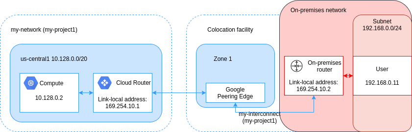

**Partner interconnect**

**Partner Interconnect provides connectivity through a supported service provider**

- If your data center is in a physical location that can't reach a dedicated interconnect collocation facility.
- Or if your data needs don't warrant dedicated interconnect.
- Work with a supported service provider to connect your VPC and on-premises network.
- The service providers have existing physical connections to googles network.
- Establish BGP session between your router and cloud router. To start passing traffic between your networks via the
service provider network.

**Comparision of Interconnect options**

| Connection | Provides | Capacity | Requirements | Access Type |
|---|---|---|---|---|
| IPsec VPN tunnel | Encrypted tunnel to VPC net through the public internet | 1.5-3 Gbps per tunnel | On-premises VPN gateway | |
| Dedicated Interconnect | Dedicate, direct connection to VPC net | 10 Gbps or 100 Gbps per link | Connection in collocation facility | Internal IP addresses |
| Partner Interconnect | Dedicated bandwidth, connection to VPC network through a service provider |  50 Mbps - 10 Gbps per connection | Service provider | |

**Common Interconnect use cases**

- Dedicated and Partner Interconnect have techincal feature parity.
- Partner Interconnect use cases:
    - Customer is not physically in Google POP or is looking for holistic solution.
    - Lower bandwidth needs (<10 Gbps).
    - Customer wants a single port for multi-cloud use, such as VLAN A to Google, VLAB B to AWS.
- Dedicated Interconnect use cases:
    - Higher bandwidth needs (10 Gbps, 100 Gbps).    
    
### Cloud Peering    

**Direct Peering Provides a direct connection between your business network and Google's**

- Broad-reaching edge network locations.
- Exchange BGP routes.
- Reach all of Google's services.
- Peering requirements.
- No SLA.

**Carrier Peering provides connectivity through a supported partner**

- Carrier Peering partner.
- Reach all of Google's services.
- Partner requirements.
- No SLA.

**Comparision of Peering options**

| Connection | Provides | Capacity | Requirements | Access Type |
|---|---|---|---|---|
| Direct Peering | Dedicated, direct connection to Google's network | 10 Gbps Per link | Connection in GCP PoPs | Public IP addresses |
| Carrier Peering | Peering through service provider to Google's public network | Varies based on partner offering | Service provider | Public IP addresses |

**Choosing a connection option**

- **Interconnect**:
    - Direct access to RFC1918 IPs in your VPC - with SLA:
        - Dedicated Interconnect
        - Partner Interconnect
        - Cloud VPN
- **Peering**:
    - Access to Google public IPs only - without SLA:
        - Direct Peering
        - Carrier Peering        

## Network Pricing and Billing

### Network Pricing

- Each GCP service has its own pricing model.

**Estimate costs with the GCP Pricing Calculator**

```
Compute Engin               Cloud Network
n1-standard-1       +       100 GB egress/monthly
us-central 1                Americas and EMEA
```

**General network pricing**

| Traffic Type | Price (USD) |
|---|---|
| Ingress | No charge |
| Egress to the same zone (Internal IP address) | No charge |
| Egress to Google products (YouTube, Maps, Drive) | No charge |
| Egress to a different GCP service (within the same region) | No charge |
| Egress between zones in the same region (per GB) | $0.01 |
| Egress to the same zone (external IP address, per GB) | $0.01 |
| Egress between regions within the US (per GB) | $0.01 |
| Egress between regions, not including traffic between US regions | Varies by region |

**External IP address pricing (us-central1)**

| Type | Price/Hour (USD) |
|---|---|
| Static IP address (assigned but unused) | $0.010 |
| Static and ephemeral IP addresses in use on standard VM instances | $0.004 |
| Static and ephemeral IP addresses in use on preemptible VM instances | $0.002 |
| Static and ephemeral IP addresses attached to forwarding rules | No charge |

### Network Service Tiers

**Use Network Service Tiers to optimize your network for performance or cost**

| Premium Tier | Standard Tier |
|---|---|
| High performance routing (Google's network) | Lower price and performance than Premium |
| Unique to Google Cloud | Comparable to other public cloud offerings |
| Global SLA | No global SLA |
| Global load balancing, Cloud CDN | Regional load balancing |
| Performance is main consideration | Cost is main consideration |  

**Optimize performance with Premium Tier**

- Google Cloud Platform Region.
- Google Network:
    - Cold potato routing limits distance travel and number of traceroute hops, resulting in faster more secure transport.
- Pop:
    - More than 100 PoPs world-wide means data egress as close to end-user ISP.
- Internet Service Provider.
- End User.

**Optimize cost with Standard Network Tier**

- Google Cloud Platform Region.
- Pop:
    - Traffic exists Google network near source.
- Public Internet:
    - Standard routing is hot potato, resulting in lower costs but also lower quality than Premium Tier.
- Internet Service Provider.
- End User.        

### Billing
        
**Billing is accumulated from the bottom up**

```
Resource -> Projects -> Folders -> GCP Organization        
```

**Control budgets and alerts to control costs**

**Labels can help you optimize network spend**

- BigQuery

```sql
SELECT
    TO_JSON_STRING(labels) as labels,
    sum(cost) as cost
FROM `project.dataset.table`
GROUP BY labels;
```

**Visualize network spend with Data Studio**

- Daily View
- Monthly view
- Overall

***

## Networking Design and Deployment

### Common network design

**Increased availability with multiple zones**

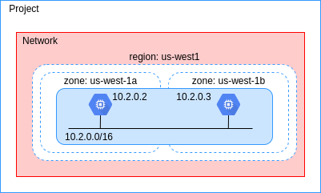

**Globalization with multiple regions**

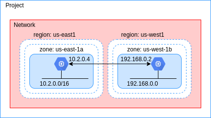

**Access Internal loab balancer using HTTP(S) load balancer**

 LB")

**Access internal load balancer using Cloud VPN**

**Use security appliance for next-generation firewall**

### Private Instances

**Private Google Access to Google APIs and services**

- Allows VM instances that only have internal IP addresses to reach the external IP addresses
of Google APIs and services.
- Enable private google access on subnet by subnet basis.
- Has no effect on instances that have external IP addresses.

**Different private access options**

 - **Private Google AccessConnect**
    - **Connection**: Connect to the public IP addresses if Google APIs and services through the VPC network's default 
    internet gateway.
    - **Usage**: Connect to Google APIs and services without giving your external IP addresses |
- **Private Google Access for on-premises**:
    - **Connection**: Connect to the public IP addresses of Google APIs and services through a VPN tunnel, or 
    interconnect by using a restricted IP address range.
    - **Usage**: Connect to Google APIs and services through a VPN network without requiring your on-premises hosts
    have external IP addresses.
- **Private service access**:
    - **Connection**: Connect to a Google or a third-party managed VPC network through a VPC Peering connection.
    - **Usage**: Connect to specific Google and third-party services without assigning external IP addresses to your
    GCP and Google or third-party resources.  

**Cloud NAT provides internet access to private instances**

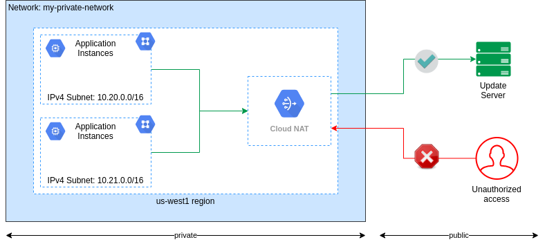

**Cloud NAT is a fully managed, software-defined service**


