# GCP Networking

## Networking in Google Cloud 

**Defining and Implementing Networks**

- Google Cloud VPC Networking Fundamentals.
- Controlling Access to VPC Networks.
- Sharing Networks across Projects.
- Load Balancing.

**Hybrid Connectivity and Network Management**

- Hybrid Connectivity.
- Pricing and Billing.
- Network Design and Deployment.
- Network Monitoring and Troubleshooting.

## Google Cloud VPC Networking Fundamentals

### Virtual Private Cloud

**VPC objects**

- Projects
- Networks:
    - Default, auto mode, custom mode.
- Subnetworks
- Regions
- Zones
- IP addresses:
    - Internal, external, range.
- Virtual machines (VMs)
- Routes
- Firewall rules        

### Projects, networks, and subnetworks

**Projects and networks**

- **Project**:
    - Associates objects and services with billing.
    - Contains networks (up to 5).
    - Natworks can be shared/peered.
- **Network**:
    - No IP address range.
    - Global and spans all available regions.
    - Contains subnetworks.
    - Type: default, auto, or custom.

**3 VPC network types**

- Default:
    - Every project.
    - One subnet per region.
    - Default firewall Rules.
- Auto Mode:
    - Default network.
    - One subnet per region.
    - Regional IP allocation.
    - Fixed **/20** subnetwork per region.
    - Expendable up to **/16**.
- Custom Mode:
    - No default subnets created.
    - Full control of IP ranges.
    - Regional IP allocation.
    - Expendable to any RFC 1918 size.        

**Network isolate systems**

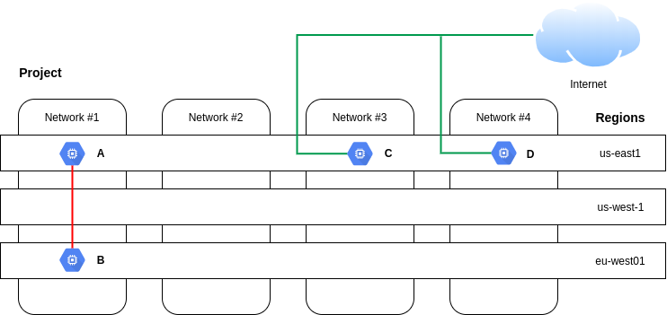

- A and B can communicate over internal IPs even though they are in different regions.
- C and D must communicate over external IPs even though they are in the same region. 

**Google's VPC is global**

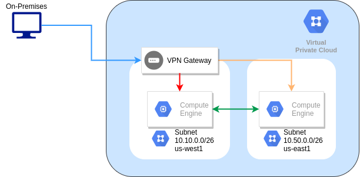

**Subnetworks cross zones**

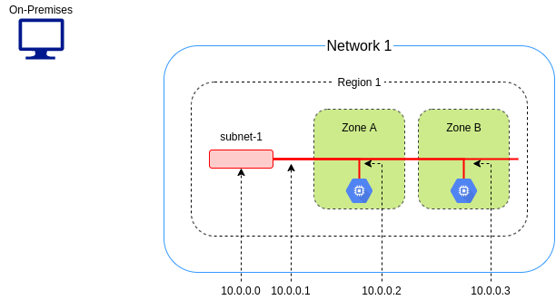

- VMs can be on the same subnet but in different zones.
- A single firewall rule can apply to both VMs.

**Expand subnets without re-creating instances**

- Cannot overlap with other subnets.
- Inside the RFC 1918 address spaces.
- Can expand but not shrink.
- Auto mode can be expanded from **/20** to **/16**.
- Avoid large subnets.

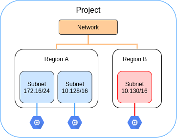

### IP addresses

**VMs can have internal and external IP addresses**

| Internal IP | External IP |
|---|---|
| Allocated from subnet range to VMs by DHCP | Assigned from pool (ephemeral) |
| DHCP lease is renewed every 24 hours | Reserved (static) and billed more when not attached to a running VM |
| VM name + IP is registered with network-scoped DNS | VM doesn't know external IP; it is mapped to the internal IP |

### Mapping IP addresses

**External IPs are mapped to internal IPs**

```console
$> sudo /sbin/ifconfig
```

**DNS resolution for internal addresses**

- Each instance has a hostname that can be resolved to an internal IP address:
    - The hostname is the same as the instance name.
    - FQDN is `[hostname].c.[project-id].internal`.
    - Example: `shipping-test.c.shipping-98341.internal`
- Name resolution is handled by internal DNS resolver:
    - Provided as part of Compute Engine (192.254.198.253).
    - Configured for use on instance via DHCP.
    - Provides answer for internal and external addresses.    

**DNS resolution for external addresses**

- Instances with external IP addresses can allow connections from hosts outside of the project.
    - Users connect directly using external IP address.
    - Admins can also publish public DNS records pointing to the instance.
        - Public DNS record are not published automatically.
- DNS records for external addresses can be published using existing DNS servers (outside of GCP).
- DNS zones can be hosted using Cloud DNS.        

**Host DNS zones using Cloud DNS**

- Google's DNS service.
- Translate domain names into IP address.
- Low latency.
- High availability (100% uptime SLA).
- Create and update millions of DNS records.
- UI, command line, or API.

**Assing a range of IP addresses**

- Assign a range of IP addresses as aliases to a VM's network interface using alias IP ranges.

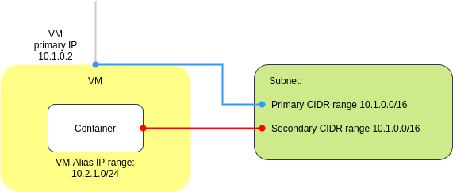

### Routes and firewall rules

**A route is a mapping of an IP  range to a destination**

- Every network has:
    - Routes that let instances in a network send traffic directly to each other.
    - A default route that directs packets to destinations that are outside the network.
- **Firewall rules must also allow the packet**.    

**Routes map traffic to destination networks**

- Destination in CIDR notation.
- Applies to traffic egressing a VM.
- Forwards traffic to most specific route.
- Traffic is delivered only if it also matches a firewall rule.
- Created when a subnet is created.
- Enables VMs on same network to communicate.

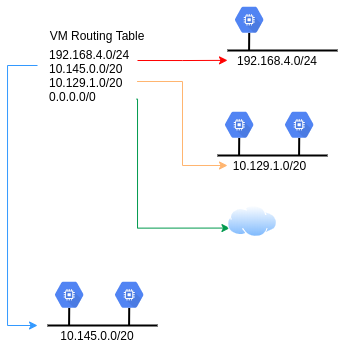

**Instance routing tables**

- **vpngateway**:
    - `10.100.0.0/16 -> default-route-87...`
    - `0.0.0.0/0 -> default-route-0086`
- **vm2**:
    - `10.100.0.0/16 -> default-route-87...`
    - `0.0.0.0/0 -> default-route-0086`
    - `172.12.0.0/16 -> vpngateway`
- **vm1**:
    - `10.100.0.0/16 -> default-route-87...`
    - `0.0.0.0/0 -> default-route-0086`
    - `172.12.0.0/16 -> vpngateway`

**Firewall rules protect your VM instance from unapproved connections**

- VPC network functions as a distributed firewall.
- Firewall rules are applied to the network as a whole.
- Connections are allowed or denied at the instance level.
- Firewall rules are stateful.
- Implied deny all ingress and allow all egress.

**Routes map traffic to destination networks**

- `direction`:
    - Inbound connections are matched against `ingress` rules only.
    - Outbound connections are matched against `egress` rules only.
- `source or destination`:
    - For the `ingress` direction, `sources` can be specified as part of the rule with IP addresses, source tags, or a
    source service account.
    - For the `egress` direction, `destinations` can be specified as part of the rule with one or more ranges of 
    IP addresses.
- `protocol` and `port`:
    - Any rule can be restricted to apply to specific protocols only or specific combinations of protocols and ports only.
- `action`:
    - To allow or deny packets that match the direction, protocol, port, and source or destination of the rule.
- `priority`:
    - Governs the order in which rules are evaluated; the first matching rule is applied.
- Rule assignment:
    - All rules are assigned to all instances, but you can assign certain rules to certain instances only.                 

**GCP firewall use case: Egress**

- Conditions:
    - Destination CIDR ranges.
    - Protocols
    - Ports
- Action:
    - Allow: permit the matching egress connection.
    - Deny: block the matching egress connection.

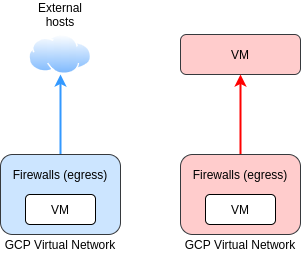  
    
**GCP firewall use case: Ingress**

- Conditions:
    - Source CIDR ranges.
    - Protocols
    - Ports
- Action:
    - Allow: permit the matching ingress connection.
    - Deny: block the matching ingress connection.    

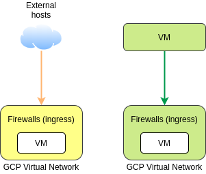  

**Hierarchical firewall policies**

- My-Org: `Ingress from 1.1.1.10/24 priority 1 fo to_next Ingress any:any priority 2 deny`.
- My-Org/my-folder-1: `Ingress tcp:80,443 priority 1 allow Ingress any:any priority 2 deny`
- My-Org/my-folder-1/project_1/vps1: `Default ingress deny all, egress allow all`
- My-Org/my-folder-2/project_2/vpc2: `Ingress tcp 80,443,22 priority 1000 allow Default ingress deny all, egress allow all`

***

## Multiple network interfaces

**Multiple network interfaces**

- VPC networks are isolated (by default):
    - Communicate within networks using **internal IP**.
    - Communicate across networks using **external IP**.
- Multiple Network Interfaces:
    - Network interface controllesr (NICs).
    - Each NIC is attached to a VPC network.
    - Communicate across networks using **internal IP**.    

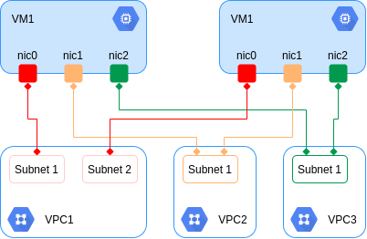

**Multiple network interfaces limitations**

- Configure when you create instance.
- Each interface in different network.
- Networks' IP range cannot overlap.
- Networks must exists to create VM.
- Cannot delete interface without deleting VM.
- Internal DNS only associated to nic0
- Up to 8 NICs, depends on VM.

| Type of instance | # of virtual NICs |
|---|---|
| VM <= 2 vCPU | 2 NICs |
| VM > 2vCPU | 1 NIC per vCPU (Max: 8) |

***

## Cloud IAM

### Cloud Identity and Access Management

```
Who can do what on which resources.
```

**Cloud IAM objects**

- Organization
- Folders
- Projects
- Resources
- Roles
- Members

**Cloud IAM resource hierarchy**

- A policy is set on a resource, and each policy contains a set of:
    - Roles
    - Members
- Resources inherit policies from the parent.
- If the parent policy is less restrictive, it overrides a more restrictive resource policy.

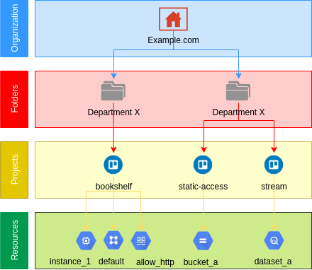    

### IAM members

**Members**

**G Suite is now Google Workspace**

- Members Identity:
    - Google Account
    - Service Account
    - Google Group
    - Cloud Identity or Google Workspace Domain
- Roles:
    - `compute.instanceAdmin`
    - `storage.objectAdmin`
    - `appengine.appAdmin`
    - `logging.viewer`
    - `pubsub.publisher`
- Note: You cannot use Cloud IAM to create or manage your users or groups.    


### IAM roles

**Basic roles**

- **Owner**:
    - Invite members
    - Remove Members
    - Delete projects
    - And... **Editor** roles
- **Editor**:
    - Deploy applications
    - Modify code
    - Configure services
    - And... **Viewer** roles
- **Viewer**:
    - Read-only access.
- **Billing Administrator**:
    - Manage billing
    - Add and remove administrators

```
A project can have multiple owners, editors, viewers, and billing administrators.
```            

**Predefines roles**

- Cloud IAM:
    - Google Groups
    - Network Viewer Role:
        - List of Permissions:
            - `compute.addresses.get`
            - `compute.addresses.list`
            - `compute.globalAddresses.get`
            - `compute.globalAddresses.list`
            - `compute.backendBuckets.get`
            - `compute.backendBuckets.list`
            - `compute.networks.list`
            - `...`
    - **project_a**            

**Network-related IAM roles**

| Role Title | Description |
|---|---|
| Network Viewer | Read-only access to all networking resources |
| Network Admin | Permissions to create, modify, and delete networking resources, except for firewall rules and SSL certificates |
| Security Admin | Permissions to create, modify, and delete firewall rules and SSL certificates |

**Custom roles**

- **List of Permissions**:
    - :heavy_check_mark: `compute.firewalls.*`
    - :heavy_check_mark: `compute.sslCertificates.get`
    - :heavy_check_mark: `compute.sslCertificates.list`
    - `...`
- **Custom Role**
    - My Network Admin Role    
    
**The Organization Policy Service gives you centralized and programmatic control over your cloud resources**

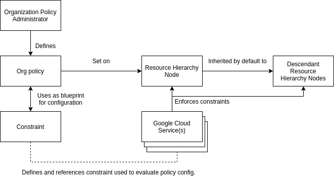      

**Organization policy constraints**

- Defines what behaviors are controlled.
- List of boolean.
- Supported by multiple Google Cloud services.
- VPC networking examples:
    - Restrict VM IP Forwarding.
    - Restrict Shared VPC Subnetworks.
    - Restrict Shared VPC Host Projects.
    - Restrict VPC peering usage.

***

## Firewall Rules

**Firewall rules protect your VM instances from unapproved connections**

- VPC network functions as a distributed firewall.
- Firewall rules are applied to the network as a whole.
- Connections are allowed or denied at the instance level.
- Firewall rules are stateful.
- Deny all ingress and allow all egress rules are implied.

**Firewall rule parameters: Target and Source**

- Target:
    - All instances in the network.
    - Specified target tags.
    - Specified service accounts.
- Source:
    - IP ranges
    - Subnets
    - Source Tage    
    - Service account

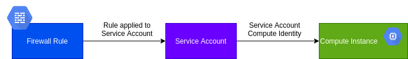  


