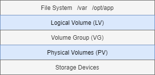
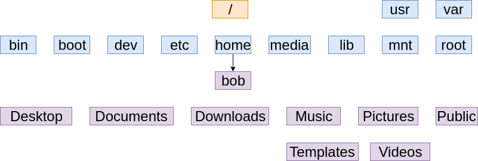

# Linux

**Linux Distributions**

- Linux OS = Linux Distribution
    - Curated software
- Distro/Flavor = Distribution

**Linux Kernel**

- The kernel is the core.
- Linux Kernel + Apps = Distro
- RedHat
    - Banks
    - Airlines
    - Telecoms
    - Health care
- Ubuntu
    - Startups
    - SaaS
    - Social Networks
    - Cloud Based
- Linux Mint
- Debian
- Mageia
- Fedora
- openSUSE
- Arch Linux
- Slackware
- Linux concepts are universal.
- Each distro is slightly different.
- You can accomplish the same goals on most Linux distros.

## Linux Fundamentals

### Common Directory

- `/`: "Root" the top of the file system hierarchy.
- `/bin`: Binaries and other executable programs.
- `/etc`: System configuration files.
- `/home`: Home directories.
- `/opt`: Optional or third party software.
- `/tmp`: Temporary space, typically cleared on reboot.
- `/usr`: User relate programs.
- `/var`: Variable data, most notably log data.
- `/boot`: Files needed to boot the operating system.
- `/cdrom`: Mount points for CD-ROMs.
- `/cgroup`: Control Groups hierarchy.
- `/srv`: Contains data which is served by the system.
- `/srv/www`: Web server files.
- `/srv/ftp`: FTP files.
- `/sys`: Used to display and sometimes configure the devices known to the Linux kernel.

**App Directory Structure**

```
/usr/local/crashplan/bin
/usr/local/crashplan/etc
/usr/local/crashplan/lib
/usr/local/crashplan/log

/etc/opt/myapp
/opt/myapp/bin
/opt/myapp/lib
/var/opt/myapp
```

**The Shell**

- The default interface to Linux.
- A program that accepts your commands and executes those commands.
- Called a command line interpreter.
- Server distributions do not include GUIs.

**The Prompt**

```console
[majka@linuxsvr ~]$
[root@linuxsvr:~]#
```

**Root, the Superuser**

- Root is all powerful.
- Normal accounts can only do a subset of the things root can do.
- Root access is typically restricted to system administrator.
- Root access may be required to install, start, stop an application.
- Day to day activities will be performed using normal account.

**Tilde Expansion**

```
~majka = /home/majka
~seb   = /home/seb
~root  = /root
~ftp   = /srv/ftp
```

**Basic Linux Commands**

- `ls`: Lists directory contents.
- `cd`: Changes the current directory.
- `pwd`: Displays the present working directory.
- `cat`: Concatenates and displays files.
- `echo`: Displays arguments to the screen.
- `man`: Displays the online manual.
- `exit`: Exits the shell or your current session.
- `clear`: Clears the screen.

### Environment Variables

- Storage location that has a name and a value.
- Typically, uppercase.
- Access the contents by executing.

```console
echo $VAR_NAME
```

**PATH**

- An environment variable.
- Controls the command search path.
- Contains a list of directories.

```console
echo $PATH
```

- `which`: Locate a command.

```console
which tac
```

**Listing Files**

- Use `ls -F` to reveal file types.

```
/   Directory
@   Link
*   Executable
```

**Symbolic Links**

- A link is a point to the actual file or directory.
- Use the link as if it were the file.
- A link can be used to create a shortcut:
    - Use for long file or directory names.
    - Use to indicate the current version of software.

```console
ls -F
ls -latr
ls -d
ls --color
```

**The tree Command**

- Similar to `ls -R`, but creates virtual output.

```
tree -d     List directories only.
tree -C     Colorized output.
```

### Permissions

```console
ls -l

-rw-rw-r--
```

| Symbol | Type |
|---|---|
| - | Regular file |
| d | Directory |
| l | Symbolic link |

| Symbol | Permission |
|---|---|
| r | Read |
| w | Write |
| x | Execute |

| Permission | File | Directory |
|---|---|---|
| Read (r) | Allows a file to be read | Allows file names in the directory to be read |
| Write (w) | Allows a file to modified | Allows entries to be modified within the directory |
| Execute (x) | Allows the execution of a file | Allows access to contents and metadata for entries |

**Permission Categories**

| Symbol | Category |
|---|---|
| u | User |
| g | Group |
| o | Other |
| a | All |

**Groups**

- Every user is in at least one group.
- Users can belong to many groups.
- Groups are used to organize users.
- The `groups` command displays a user's groups.
- You can also use `id -Gn`.

```console
id -Gn
groups pat
```

**Changing Permissions**

| Item | Meaning |
|---|---|
| chmod | Change mode command |
| ugoa | User category user, group, other, all. |
| +-= | Add, subtract, or set permissions. |
| rwx | Read, Write, Execute. |

```console
chmod g+r sales.data

chmod g-w sales.data

chmod g+wx sales.data

chmod u+rwx,g-x sales.data
```

**Order has meaning**

| | u | g | o |
|---|---|---|---|
| Symbolic | rwx | r-x | r-- |
| Binary | 111 | 101 | 100 |
| Decimal | 7 | 5 | 4 |

```
-rwx------  700
-rwxr-xr-x  755
-rw-rw-r--  664
-rw-rw----  660
-rw-r--r--  644
```

**Working with Groups**

- New files belong to your primary group.
- The `chgrp` command changes the group.

```console
groups
chgrp sales sales.data
chmod g+w sales.data
```

**Directory Permissions**

- Permissions on a directory can effect the files in the directory.
- If the file permissions look correct, start checking directory permissions.
- Work your way up th the root.

```console
chmod 400 my-cat
chmod 500 my-cat
my-cat/cat
```

**File Creation Mask**

- File creation mask determines default permissions.
- If no mask were used permissions would be:
    - `777`: for directories.
    - `666`: for files.

**The Umask Command**

```
umask [-S] [mode]
```

- Sets the file creation mask to mode, if given.
- Use `-S` to for symbolic notation.

**Special Modes**

- umask `0022` is the same as umask `022`.
- chmod `0644` is the same as chmod `644`.
- The special modes are:
    - `setuid`
    - `setgid`
    - `sticky`

```console
mkdir testumask
cd testumask
umask
> 0022

umask -S
> u=rwx,g=rx,o=rx

mkdir a-dir
touch a-file
ls -l
> drwxr-xr-x a-dir
> -rw-r--r-- a-file

umask 007
umask -S
> u=rwx,g=rwx,o=

mkdir a-dir
touch a-file
ls -l
> drwxrwx--- a-dir
> -rw-rw---- a-file
```

### Finding Files and Directories

```console
find
find .
find /sbean -iname make
find /bin -name *v
find . -mtime +10 -mtime -13
find . -name s* -ls
find . -size +1M
find . -type d -newer file.txt

find . -exec file {} \;
file .bash_profile
```

**A Fast Find - `locate`**

```
locate pattern
```

- Lists file that match pattern.
- Faster than the find command.
- Queries an index.
- Results are not in real time.
- May not be enabled on all systems.

```console
locate sales
locate tpsre
```

### Viewing files

- `cat file`: Display the contents of file.
- `more file`: Browse through a text file.
- `less file`: More features than more.
- `head file`: Output the beginning (or top) portion of file.
- `tail file`: Output the ending (or bottom) portion of file.

**Head and Tail**

- Displays only 10 lines by default.
- Change this behavior with `-n`:
    - `n`: Number of lines.
    - `tail -15 file.txt`.

**Viewing Files in Real Time**

```
tail -f file        Follow the file.
```

- Displays data as it is being written to the file.

**Sort Options**

- `-k F`: Sort by key. F is the field number.
- `-r`: Sort in reverse order.
- `-u`: Sort unique.

**Creating a Collection of Files**

```
tar [-] c|x|t f tarfile [pattern]
```

- Create, extract or list contents of a tar archive using pattern, if supplied.

**Compressing Files To Save Space**

- `gzip`: Compress files.
- `gunzip`: Uncompress files.
- `gzcat`: Concatenates compressed files.
- `zcat`: Concatenates compressed files.

**Disk Usage**

- `du`: Estimates file usage.
- `du -k`: Display sizes in Kilobytes.
- `du -h`: Display sizes in human readable format.

**Wildcards**

- A character or string used for a pattern matching.
- Globbing expands the wildcard pattern into a list of files and/or directories.
- Wildcards can be used with most commands:
    - `ls`
    - `rm`
    - `cp`
- `*`: Matches zero or more characters:
    - `*.txt`
    - `a*`
    - `a*.txt`
- `?`: Matches exactly one character:
    - `?.txt`
    - `a?`
    - `a?.txt`
- `[]`: A character class:
    - Matches any of the characters included between the brackets. Matches exactly one character.
    - `[eaiou]`
    - `ca[nt]`:
        - `can, cat, candy, catch`
- `[!]`: Matches any of the characters NOT included between the brackets. Matches exactly one character.
    - `[!aeiou]*`
        - baseball (first character in not a, e, i, o or u)
        - `cricket`
- Use two characters separated by a hyphen to create a range in a character class.
- `[a-g]*`: Matches all files that start with `a, b, c, d, e, f or g`.
- `[3-6]*`: Matches all files that start with `3,4,5 or 6`.

**Named Character Classes**

```
[[:alpha:]]
[[:alnum:]]
[[:digit:]]
[[:lower:]]
[[:space:]]
[[:upper:]]
```

**Matching Wildcard patterns**

- `\`: Escape character. Use if you want to match a wildcard character.
- Match all files that end with a question mark:
    - `*\?`: Example done?

### Input, Output and Redirection

| I/O Name | Abbreviation | File Descriptor |
|---|---|---|
| Standard Input | stdin | 0 |
| Standard Output | stdout | 1 |
| Standard Error | stderr | 2 |

**Redirection**

- `>`: Redirects standard output to a file. Overwrites (truncating) existing contents.
- `>>`: Redirects standard output to a file. Appends to any existing content.
- `<`: Redirects input from a file to a command.
- `&`: Used with redirection to signal that file descriptor is being used.
- `2>&1`: Combine stderr and standard output.
- `2>file`: Redirect standard error to a file.
- `>/dev/null`:  Redirect output to nowhere.

```console
ls here not-here 2> /dev/null
here

ls here not-here > /dev/null 2>&1
```

```
sort files.txt === sort < files.txt
```

**Comparing the Contents of Files**

- `diff file1 file2`: Compare two files.
- `sdiff file1 file2`: Side-by-side comparision.
- `vimdiff file1 file2`: Highlight differences in vim.

**diff Output**

```console
diff file1 file2
3c3
```

```
> LineNumFile1-Action-LineNumFile2
> Action = (A)dd (C)hange (D)elete
```

## Searching in files

- `grep`: Display lines matching a pattern.

```
grep pattern file

-i  Perform a search, ignoring case.
-c  Count the number of occurrences in a file.
-n  Precede output with line numbers.
-v  Invert Match. Print lines that don't match.
```

**The file Command**

```
file file_name Display the file type.
```

```console
file sales.data
sales.data: ASCII text

file *
bin directory
json.tar: POSIX tar archive
```

**Searching for Text in Binary Files**

- `strings` : Display printable strings.

**Pipes**

- `|` : Pipe symbol

```
command-output | command-input
```

```
grep pattern file

cat file | grep pattern
```

**The cut Command**

- `cut [file]` : Cut out selected portions of file. If file is omitted, use standard input.
- `-d delimiter` : Use delimiter as the field separator.
- `-f N` : Display the `Nth` field.

```console
grep -i john jezz.mp3

file jezz.mp3
cat jezz.mp3
strings jezz.mp3
strings jezz.mp3 | grep -i john | head -1 | cut -d ' ' -f2
```

```console
grep bob /etc/passwd
grep bob /etc/passwd | cut -d: -f1,5
grep bob /etc/passwd | cut -d: -f1,5 | sort
grep bob /etc/passwd | cut -d: -f1,5 | sort | tr ":" " "
grep bob /etc/passwd | cut -d: -f1,5 | sort | tr ":" " " | column -t

bobb    Bob     Barker
bob     Bob     Smith
```

**Piping Output to a Pager**

- `more`
- `less`

```console
cat /etc/passwd | less
less /etc/passwd
grep bin /etc/passwd | less
```

**Transferring files over the network**

- `scp` : Secure copy.
- `sftp` : SSH file transfer protocol.

| Command | Description |
|---|---|
| scp SOURCE DESTINATION | Copy source to destination |
| sftp HOST | Start a secure file transfer session with host |
| ftp HOST | Start file transfer session with host |

**Customizing the Shell Prompt**

```console
echo 'export PS1="[\u@\h \w]\$ "' >> ~/.bash_profile
```

### Aliases

- Shortcuts.
- Use for long commands.
- Use for commands you type often.

**Creating Aliases**

```
alias [name=[=value]]
```

- List or create aliases.
- Use `name=value` to create a new alias.
- Fix Typos.

```console
alias grpe='grep'
```

- Make Linux behave like another OS.

```console
alias cls='clear'
```

**Removing Aliases**

| Command | Description |
|---|---|
| unalias NAME | Remove the "name" alias. |
| unalias -a | Remove all aliases. |

**Persisting Aliases**

- Add aliases to your personal initialization files.

```console
vim .bash_profile
```

### Environment Variables

- `Name/Value` pairs.
- Can change how an application behaves.
- An Example Environment Variable.

```
EDITOR=nano
```

**Viewing Environment Variables**

```console
printenv
echo $HOME
```

**Creating Environment Variables**

- Syntax.

```console
export VAR="value"
export EDITOR="vi"
```

**Removing Environment Variables**

- Syntax.

```console
unset VAR
unset TZ

export TZ="US/Pacific"
date
unset TZ
echo $TZ
```

### Processes and Job Control

```
ps - Display process status
```

**ps Options**

- `-e` : Everything, all processes.
- `-f` : Full format listing.
- `-u username` : Display username's processes.
- `-p pid` : Display information for PID.

**Common ps Commands**

- `ps -e` : Display all processes.
- `ps -ef` : Display all processes, full.
- `ps -eH` : Display a process tree.
- `ps -e --forest` : Display a process tree.
- `ps -u username` : Display user's processes.
- `pstree` : Display processes in a tree format.
- `top` : Interactive process viewer.
- `htop` : Interactive process viewer.

```console
ps
ps -p 1530
ps -f
pa -ef
ps -fu majka
ps -fu root
ps --forest

pstree
top
htop
```

**Background and Foreground Processes**

| Action | Description |
|---|---|
| `command` & | Start command in background |
| ctrl-c | Kill the foreground process |
| ctrl-z | Suspend the foreground process |
| `bg [%num]` | Background a suspended process |
| `fg [%num]` | Foreground a background process |
| `kill` | Kill a process by job number or PID |
| `jobs [%num]` | List jobs |

**Killing Processes**

- `Ctrl-c` : Kills the foreground process.
- `kill [-sig] pid` : Send a signal to a process.
- `kill -l` : Display a list of signals.

```console
kill 123
kill -15 123

kill -TERM 123
kill -9 123
```

```console
ps -p 2373

jobs
jobs %1

fg

jobs %%
jobs %+
jobs %-

kill %1
jobs

kill 2394
kill -9 2396
```

### Scheduling Repeated Jobs with Cron

- Cron service.
- Crontab format.
- Crontab command.

**Cron**

- `cron` : A time based job scheduling service.
- `crontab` : A program to create, read, update and delete your job schedules.
- Use cron to schedule and automate tasks.

**Crontab Format**

```
    *   *   *   *   *   command
    |   |   |   |   |
    |   |   |   |   +-- Day of the Week     (0-6)
    |   |   |   +------ Month of the Year   (1-12)
    |   |   +---------- Day of the Month    (1-31)
    |   +-------------- Hour                (0-23)
    +------------------ Minute              (0-59)
```

**Run every Monday at 07:00.**

```
0 7 * * 1 /opt/sales/bin/weekly-report
```

**Redirecting Output**

```console
# Run at 02:00 every day and
# send output to a log file.
0 2 * * * /root/backupdb > /tmp/db.log 2>&1
```

**Examples**

```console
# Run every 30 minutes.
0,30 * * * * /opt/acme/bin/half-hour-check

# Another way to do the same thing.
*/2 * * * * /opt/acme/bin/half-hour-check

# Run for the first 5 minutes of the hour
0-4 * * * * /opt/acme/bin/first-five-minus
```

**Crontab Shortcuts**

```
@yearly     0 0 1 1 *
@annually   0 0 1 1 *
@monthly    0 0 1 * *
@weekly     0 0 * * 0
@daily      0 0 * * *
@midnight   0 0 * * *
@hourly     0 * * * *
```

**Using the Crontab Command**

- `crontab file` : Install a new crontab from a file.
- `crontab -l` : List your crontab jobs.
- `crontab -e` : Edit your cron jobs.
- `crontab -r` : Remove all of your cron jobs.

### Switching Users and Running Commands

**The su Command**

- `su [username]` : Change user ID or become superuser.

**su Options**

- `-` : A hyphen is used to provide an environment similar to what the user would expect had the user logged in directly.
- `-c command` : Specify a command to be executed.
- `whoami` : Displays the effective username.

**sudo - Super User Do**

- `sudo` : Execute a command as another user, typically the superuser.
- `sudo -l` : List available commands.
- `sudo command` : Run command as root.
- `sudo -u root command`
- `sudo -u user command`
- `sudo su` : Switch to the superuser account.
- `sudo su -` : Switch to the superuser account with root's environment.
- `sudo su - username` : Switch to the username account.
- `sudo -s` : Start a shell.
- `sudo -u root -s`
- `sudo -u user -s`

**sudoers Format**

```
user host=(users)[NOPASSWD:]commands
```

```console
adminuser ALL=(ALL)NOPASSWD:ALL
majka linuxsvr=(root) /etc/init.d/oracle
```

### History command

- `history` : Displays the shell history.
- `HISTSIZE` : Controls the number of commands to retain in history.

```console
export HISTSIZE=1000
```

### Installing Software

**Package**

- A collection of files.
- Data / Metadata:
    - Package description
    - Version
    - Dependencies

**Package Manager**

- Installs, upgrades, and removes packages.
- Manages dependencies.
- Keeps track of what is installed.

**RPM**

- RedHat; CentOS; Fedore; Oracle Linux; Scientific Linux.
- `rpm -qa` : List all installed packages.
- `rpm -qf /path/to/file` : List the file's package.
- `rpm -ql package` : List package's files.
- `rpm -ivh package.rpm` : Install package.
- `rpm -e package` : Erase (uninstall) package.

**yum**

- `yum search string`: Search for string.
- `yum info [package]`: Display info.
- `yum install [-y] package`: Install package.
- `yum remove package`: Remove package.

**APT - Advanced Packaging Tool**

- `apt-cache search string`: Search for string.
- `apt-get install [-y] package`: Install package.
- `apt-get remove package`: Remove package, leaving configuration.
- `apt-get purge package`: Remove package, deleting configuration.
- `apt-cache show package`: Display information about package.

**dpkg**

- `dpkg -l`: List installed packages.
- `dpkg -S /apth/to/file`: List file's package.
- `dpkg -L package`: List all files in package.
- `dpkg -i package.deb`: Install package.

### Linux Boot Process

**BIOS**

- Basic Input/Output System.
- Special firmware.
- It's operating system independent:
    - This is not unique to the Linux OS.
- Primary purpose is to find and execute boot loader.
- Performs the POST:
    - Power-On Self Test.
- Knows about bootable devices:
    - Hard drives.
    - USB drives.
    - DVD drives.
- The boot device search order can be changed.

**Boot Loaders**

- LILO: Linux Loader.
- GRUB:
    - Grand Unified Bootloader.
    - Replaced LILO.
- Boot loaders start the operating system.
- Boot loaders can start the operating system with different options.

**Initial RAM Disk**

- `initrd`: Initial RAM disk.
- A temporary filesystem that is loaded from disk and stored in memory.
- Contains helpers and modules required to load the permanent OS file system.

**The /boot Directory**

- `/boot`:
    - Contains the files required to boot Linux.
    - `initrd`
    - `kernel`
    - Boot loader configuration.

```console
ls -F /boot
```

**Kernel Ring Buffer**

- Contains messages from the Linux kernel.
- `dmesg`
- `/var/log/dmesg`

**Runlevels / Description**

| Runlevel | Description |
|---|---|
| 0 | Shuts down the system |
| 1,S,s | Single user mode, used for maintenance |
| 2 | Multi-user mode with graphical interface |
| 3 | Multi-user text mode (RedHat/CentOS)
| 4 | Undefined |
| 5 | Multi-user mode with graphical interface. (RedHat/CentOS) |
| 6 | Reboot |

**Init**

```console
/etc/inittab:

id:3:initdefault:
```

- Being phased out by systemd.

**Systemd**

- Use targets instead of run-levels.

```console
cd /lib/systemd/system
ls -l runlevel5.target

systemctl set-default graphical.target
```

**Changing runlevels or targets**

- telinit RUNLEVEL: `telinit 5`
- systemctl isolate TARGET: `systemctl isolate graphical.target`

**Rebooting**

```console
telinit 6
systemctl isolate reboot.target
reboot
```

```
shutdown    [options]   time    [message]
```

```console
shutdown -r 15:30 "rebooting!"
shutdown -r +5 "rebooting soon!"
shutdown -r now
```

**Poweroff**

```console
telinit 0
systemctl isolate poweroff.target
poweroff
```

## System Logging

**The Syslog Standard**

- Aids in the processing of messages.
- Allows logging to be centrally controlled.
- Uses facilities and severities to categorize messages.

**Syslog Servers**

- Process syslog messages based on rules.
- `syslogd`
- `rsyslog`
- `syslog-ng`

**rsyslog**

```console
/etc/rsyslog.conf:

$IncludeConfig /etc/rsyslog.d/*.conf
```

**Logging Rules**

- Selector field:
    - `FACILITY.SEVERITY`
    - `main.*`
    - `main`
    - `FACILITY.none`
    - `FACILITY_1.SEVERITY;FACILITY_2.SEVERITY`
- Action field: Determines how a message is processed.

**Caching vs Non-caching**

- Caching is used if the path starts with a hyphen: `mail.info    -/var/log/mail.info`.
- You may lose some messages during a system crash if you are using caching mode.
- Using caching mode can improve I/O performance.

**logger**

```
logger [options] message
```

- Options:
    - `-p FACILITY.SEVERITY`
    - `-t TAG`

**logrotate**

```console
/etc/logrotate.conf:

include /etc/logrotate.d
```

**Example logrotate.conf**

```conf
weekly
rotate 4
create
compressed
include /etc/logrotate.d
```

**Test the logrotate configuration**

```console
logrotate -fv /etc/logrotate.conf
```

## Disk Management

- Partitions
- MBR
- GPT
- Mount points
- `fdisk`

**Partitions**

- Disks can be divided into parts, called partitions.
- Partitions allow you to separate data.
- Partitioning schemes:
    - OS, Application, User, Swap.
    - OS, User home directories.
    - As a system admin, you decide.
- Can protect the overall system.
- Keep users from creating outages by using a home directory partition.

```console
df -h
```

**MBR**

- Master Boot Record.
- Can only address 2 TB of disk space.
- Being phased out by GPT:
    - `GPT = GUID Partition Table`
- 4 Primary Partitions.
- Extended partitions allow you to create logical partitions.

**GPT**

- GPT: GUID Partition Table.
- GUID: Global Unique Identifier.
- Replacing the MBR partitioning scheme.
- Part of UEFI.
- UEFI: Unified Extensible Firmware Interface.
- UEFI is replacing BIOS.
- Supports up to 128 partitions.
- Supports up to 9.4 ZB disk sizes.
- Not supported by older operating systems.
- May require newer or special tools.

**Mount Points**

- A directory used to access the data on a partition.
- `/`: Is always a mount point.
- `/home`: `/home/majka` is on the partition mounted on `/home`.
- `/export/home`: `/export/home/majka`.

:star: **Mounting over existing data**

```console
mkdir /home/sarah
mount /dev/sdb2 /home
```
- You will not be able to see `/home/sarah` now.

```console
unmount /home
```

- You can now see `/home/sarach` again.

**Mount Points on Mount Points**

```console
/home
/home/majka
```

**fdisk**

- Alternatives: `gdisk`, `parted`.
- Earlier versions of `fdisk` did not support GPT.

```console
fdisk /path/to/device
```

```console
fdisk -l
fdisk /dev/sdb
fdisk /dev/sdc
fdisk -l
```

**File System**

- `ext`: Extended file system:
    - `ext2`, `ext3` and `ext4` are later releases.
    - Often the default file system type.
- Other file systems:
    - `ReiserFS`
    - `JFS`
    - `XFS`
    - `ZFS`
    - `Btrfs`

**mkfs**

```
mkfs -t TYPE DEVICE
```

```console
mkfs -t ext3 /dev/sdb2
mkfs -t ext4 /dev/sdb3
mkfs.ext4 /dev/sdb3
ls -1 /sbin/mkfs*
```

**Mounting with mount**

```
mount DEVICE MOUNT_POINT
```

```console
mount /dev/sdb3 /opt
```

**The df command**

```console
df -h
```

- In order to make mounts persist between reboots, add an entry in the `/etc/fstab` file.

**Unmount**

```
unmount DEVICE_OR_MOUNT_POINT
```

```console
umount /opt
umount /dev/sdb3
```

**Preparing swap space**

```console
mkdwp /dev/sdb1

swapon /dev/sdb1
swapon -s
```

**/etc/fstab - The File System Table**

- Controls what devices get mounted and where on boot.
- Each entry is made up of 6 fields:
    - device
    - mount point
    - file system type
    - mount options
    - dump
    - fsck order

**Viewing Labels and UUIDs**

```console
lsblk 0f
blkid
```

**Labeling a file system**

```console
e2label /dev/sdb3 opt
```

## LVM - The Logical Volume Manager

**Flexible Capacity**

- You can create file systems that extend across multiple storage devices.
- You can aggregate multiple storage devices into a single logical volume.
- Expand or shrink file systems in real-time while the data remains online and fully accessible.
- Easily migrate data from one storage device to another while online.
- You can use human-readable device names of your choosing.

```console
/dev/vg_database/lv_db_logsvs/dev/sdb3
```

- Increase throughput by allowing your system to read data in parallel.
- Increase fault tolerance and reliability by having more than one copy of your data.
- Create point-in-time snapshots of your filesystems.

**Layer of abstraction**



**Logical Volume Creation Process**

- Create one or more physical volume.
- Create a volume group from those one or more physical volumes.
- Create one or more logical volumes from volume group.

**Extending Volume**

```console
lvmdiskscan
pvcreated /dev/sdc
vgextend vg_app /dev/sdc
pvs
lvextend -L +5G -r /dev/vg_app/lv_data
lvs
df -h /data
```

**Mirroring Logical Volume**

```console
pvcreate /dev/sdd /dev/sde
vgcreate vg_safe /dev/sdd /dev/sde

lvcreate -m 1
```

- Logical Volume Manager introduces layers abstraction including:
    - Physical Volumes (PVs).
    - Volume Groups (VGs).
    - Logical Volumes (LVs).

**Creating LVs**

```console
pvcreate /dev/sdb
vgcreate vg_name /dev/sdb
lvcreate -L 100G -n lv_name vg_name
mkfs -t ext4 /dev/vg_name/lv_name
```

**Extending LVs**

```console
lvextend -L +10G -r /dev/vg_name/lv_name
pvcreate /dev/sdc
vgextend cg_name /dev/sdc
```

**Mirrored LVs**

```console
lvcreate -m 1 -L 100G -n lv_name vg_name
```

**Removing LVs**

```console
lvremove /dev/vg_name/lv_name
vgreduce vg_name /dev/sdb
vgremove vg_name
pvremove /dev/sdb
```

## User Management

**Accounts have**

- Username (or login ID).
- UID (user ID): This is unique number.
- Default group.
- Comments.
- Shell.
- Home directory location.

**/etc/passwd**

```console
root:x:0:0:root:/root:/bin/bash
```

- The format of the `/etc/passwd`.

```
username:password:UID:GUI:comments:home_dir:shell
```

```console
joe:x:1000:1000:Joe Jones:/home/joe:bin/bash
```

**Custom for username < 8 characters**

```console
ps -fu joe
```

**Usernames**

- Less than 8 characters in length by convention.
- Case sensitive.
- In all lowercase by convention.
- Numbers are allowed in usernames.
- Special characters are not allowed.

**Passwords are stored in /etc/shadow**

- Encrypted password used to be stored in `/etc/passwd`.
- `/etc/passwd`: Is readable by everyone.
- Now, encrypted passwords are stored in `/etc/shadow`.
- `/etc/shadow`: Is only readable by a root.
- Prevents users trying to crack passwords.

**UIDs**

- The root account is always UID 0.
- UIDs are unique numbers.
- System accounts have **UIDs < 1000**, configured in `/etc/login.defs`.

**GID**

- The GID listed in the `/etc/passwd` for is the default group for an account.
- New files belong to a user's default group.
- Users can switch groups by using the **newgrp** command.

**Comment Field**

- Typically, contains the user's full name.
- In the case of a system or application account, it often contains what the account is used for.
- May contain additional information like a phone number.
- Also called the GECOS field.

**Home Directory**

- Upon login the user is placed in their home directory.
- If that directory does not exist, they are placed in `/`.

**Shell**

- The shell will be executed when a user logs in.
- A list of available shells are in `/etc/shells`.
- The shell doesn't have to be a shell.
- To prevent interactive use of an account, use **/usr/sbin/nologin** or **/bin/false** as the shell.
- Shells can be command line applications.

**useradd**

```
useradd [options] username

-c "COMMENT"        Comments for the account
-m                  Create the home directory
-s /shell/path      The path to the user's shell

-g GROUP            Specify the default group
-G GROUP1,GROUPN    Additional groups

-r                  Create a system account
-d /home/dir        Specify the home directory
```

```console
useradd -c "Majka Majka" -m -s /bin/bash majk
useradd -c "Eddie Harris" -m -s /bin/bash -g sales -G projectx
```

**Create a password using passwd**

```console
passwd majk
```

**Account information for "majk"**

```console
tail -1 /etc/passwd
tail -1 /etc/shadow
```

**System or Application Accounts**

```console
useradd -c "Apache Web Server User" -d /opt/apache -r -s /usr/sbin/nologin apache
tail -1 /etc/passwd
```

**/etc/skel**

- When using `-m` the home directory for the account is created.
- The contents of `/etc/skel` are copied into the home directory.
- `/etc/skel` typically, contains shell configuration files (.profile, .bashrc).

**Use -u to specify the UID**

```console
useradd -c "MySQL Server" -d /opt/mysql -u 97 -s /usr/sbin/nologin mysql
tail -1 /etc/passwd
```

**userdel [-r] username**

```console
userdel eharris
userdel -r grant
```

**usermod**

```
usermod [ options ] username

-c "COMMENT"        Comments account
-g GROUP            Specify the default group
-D GROUP1,GROUPN    Additional groups
-s /shell/path      Path to the user's shell
```

**/etc/group**

```console
root:x:0:
sales:x:1001:john,mary
```

- The format of `/etc/group` file.

```
group_name:password:GID:account1,accountN
```

**groups [username]**

```console
groups root
```

**groupadd [options] group_name**

```console
groupadd web
tail -1 /etc/group
> web:x:1003:

groupadd -g 2500 db
tail -1 /etc/group
> db:x:2500:
```

**groupdel group_name**

```console
groupdel db
```

**groupmod**

```
groupmod [options] group_name

-g GID      Change the group ID to GID
-n GROUP    Rename the group to GROUP
```

- Create groups:
    - writers
    - tv
    - movie
- Create user accounts:
    - All users will have the default group of writers.
    - Some will also be in the tv group.
    - Others will be in the movie group.

```console
groupadd writers
groupadd tv
groupadd movie
tail -3 /etc/group
> writers:x:1002:
> tv:x:1003
> movie:x:1004

useradd -c "Carlot Cuse" -g writers -G tv -m -s /bin/bash ccuse
passwd ccuse
groups ccuse
> ccuse : writers tv

useradd -c "Levis Fury" -g writers -G tv -m -s /bin/bash lfury
passwd lfury

useradd -c "Mike Tyson" -g writers -G movie -m -s /bin/bash mtyson
passwd mtyson

useradd -c "Ben Franklin" -g writers -G movie,tv -s /bin/bash bfra
passwd bfra

tail -3 /etc/group
```

- Account information is stored in:
    - `/etc/passwd`
    - `/etc/shadow`
- Accounts have the following attributes:
    - username
    - UID
    - GID (default group)
    - Comment
    - home directory
    - shell
- `useradd`: Create accounts.
- `userdel`: Delete accounts.
- `usermod`: Modify accounts.
- Group information is stored in - `/etc/group`.
- `groupadd`: Create groups.
- `groupdel`: Delete group.
- `groupmod`: Modify groups.
- To view group memberships use **groups**.

## Networking TCP/IP

- TCP/IP.
- Class full networks.
- Subnet masks.
- Broadcast addresses.
- CIDR.
- Private address space.

### TCP/IP Networking for Linux System Admin

- TCP/IP:
    - Used for network communications.
    - TCP: Transmission Control Protocol.
    - IP: Internet Protocol.
- TCP: Controls data exchange.
- IP: Sends data from one device to another.
- Hosts: Devices on a network that have an IP address.

**IP Networking**

- IP address: `201.88.129.187`
- subnet mask: `255.255.255.0`
- broadcast address: `201.88.129.255`
- Network Address.
- Host Address.
- Each must be unique for proper routing.
- Address Classes: Used to determine the network address and host address.

**Class full Networks**

| Class | Network | Hosts Allowed |
|---|---|---|
| A | 1 -> 127                  ### 17.24.88.9 | 16,777,216 |
| B | 128.0 -> 191.255          ### 183.194.46.31 | 65,536 |
| C | 192.0.0 -> 233.255.255    ### 199.83.131.186 | 255 |


**Subnet Masks**

| Class | Subnet Mask |
|---|---|
| A | 255.0.0.0 |
| B | 255.255.0.0 |
| C | 255.255.255.0 |

**Broadcast Addresses**

| Class | Network | Subnet Mask | Broadcast |
|---|---|---|---|
| A | 17.0.0.0 | 255.0.0.0 | 17.255.255.255 |
| B | 183.194.0.0 | 255.255.0.0 | 183.194.255.255 |
| C | 199.83.131.0 | 255.255.255.0 | 199.83.131.255 |

**Classless Inter-Domain Routing / CIDR**

- IP `121.67.198.94`:
    - Class A network: `121.0.0.0`
    - Class A subnet: `255.0.0.0`
    - Class A broadcast: `121.255.255.255`
- IP: `121.67.198.94`:
    - Subnet: `255.255.255.0`
    - CIDR network: `121.67.198.0`
    - CIDR subnet: `255.255.255.0`
    - CIDR broadcast: `121.67.198.255`

**Reserved Private Address Space**

| Class | Range | Private Address Space |
|---|---|---|
| A | 1.0.0.0 - 127.255.255.255 | 10.0.0.0 - 10.255.255.255 |
| B | 128.0.0.0 - 191.255.255.255 | 172.16.0.0 - 172.31.255.255 |
| C | 192.0.0.0 - 233.255.255.255 | 192.168.0.0 - 192.168.255.255 |


### Networking - DNS and Hostnames

- Determining your IP address.
- `ip` and `ifconfig` utilities.
- `hostnames`
- DNS and name resolution.
- `/etc/hosts`.
- `/etc/nsswitch.conf`.

**Determining your IP address**

```console
ip address

# deprecated
ifconfig
```

**hostnames**

- Human-readable name for an IP address: `webprod01 = 10.109.155.174`

**DNS hostnames**

- FQDN, Fully Qualified Domain Name: `webprod01.mycompany.com`
- TLD: `.com, .net, .org, etc.`
- Domains: Delow (to the left of) TLD.
- Sub domain:
    - Below (to the left of) the domain.
    - `webprod01.ny.us.mycompany.com`

**Displaying the hostname**

```console
hostname
uname -n
hostname -f
```

**Setting the hostname**

```console
hostname webprod01

# ubuntu, redhat
echo 'webprod01' > /etc/hostname

vim /etc/sysconfig/network
> HOSTNAME=webprod01
```

**Resolving DNS Names**

- `host`
- `dig`

```console
host www.mycompany.com
```

**The /etc/hosts file**

- Format:
    - IP FQDN alias(es).
    - `10.11.12.13 webprod02.mycorp.com webprod02`.
- Now we can refer to the host by name:
    - `webprod02.mycorp.com OR webprod02`
- `/etc/hosts`: Is local to your linux system. It does not propagate to the rest of the network.

**/etc/hosts**

```
127.0.0.1       localhost
1.2.1.6         webprod01.mycorp.com webprod01
10.11.13.7      dbcluster
```

**/etc/nsswitch.conf**

- NSS: Name Service Switch.
- Controls the search order for resolutions.

```
hosts: files dns        // /etc search first
hosts: files nis dns
```

### Networking - DHCP, Dynamic and Static Addressing

- Network ports.
- DHCP
- Static IP addresses.
- `ifup` / `ifdown`.
- GUI / TUI tools.

**Network Ports**

- When a service starts it binds itself to a port.
- Ports **1 - 1023** are well-known ports:
    - 22 - SSH
    - 25 - SMTP
    - 80 - HTTP
    - 143 - IMAP
    - 389 - LDAP
    - 443 - HTTPS

**/etc/services**

- Maps port names to port numbers.

```
ssh     22/tcp      # SSH Remote Login Protocol
smtp    25/tcp      # SMTP
http    80/tcp      # http
ldap    389/tcp     # LDAP
https   443/tcp     # http protocol over TLS/SSL
```

**DHCP**

- Dynamic Host Configuration Protocol.
- DHCP servers assign IP address to DHCP clients:
    - IP Address
    - netmask
    - gateway
    - DNS servers
- Each IP is "leased" from the pool of IP addresses the DHCP server manages:
    - The lease expiration time is configurable on DHCP server. (1hr, 1day, 1week, etc.)
    - The client must renew the lease if it wants to keep using the IP address. If no renewal is received, the IP
    is available to other DHCP clients.

**Configuring a DHCP Client - RHEL**

```console
ifconfig -a or -ip link
```

```console
/etc/sysconfig/network-scripts/ifcfg-DEVICE
/etc/sysconfig/network-scripts/ifcfg-eth0
/etc/sysconfig/network-scripts/ifcfg-enp5s2
BOOTPROTO=dhcp
```

**Configuring a DHCP Client - Ubuntu**

```console
/etc/network/interfaces

auto eth0
iface eth0 inet dhcp
```

**Assigning a Static IP Address - RHEL**

- `/etc/sysconfig/network-scripts/ifcfg-eth0`

```console
DEVICE=eth0
BOOTPROTO=static
IPADDR=10.109.155.174
NETMASK=255.255.255.0
NETWORK=10.109.155.0
BROADCAST=10.109.155.255
GATEWAY=10.109.155.1
ONBOOT=yes
```

**Assigning a Static IP Address - Ubuntu**

- `/etc/network/interfaces`

```
auto eth0
iface eth0 inet static
> address 10.109.155.174
> netmask 255.255.255.0
> gateway 10.109.155.1
```

**Manually Assigning an IP Address**

- Format.

```
ip address add IP[/netmask] dev NETWORK_DEVICE
```

```console
ip address add 10.11.12.13 dev eth0

ip address add 10.11.12.13/255.255.255.0 dev eth0

ip link set eth0 up
```

```
ifconfig NETWORK_DEVICE addr netmask SUBNET_MASK
```

```console
ifconfig eth0 10.11.12.13
ifconfig eth0 10.11.12.13 netmask 255.255.255.0

ifconfig eth0 up
```

**ifup / ifdown**

- Can be used instead of `ifconfig` / `ip`.
- Distribution dependent.
- Uses configuration files.
- Examples.

```console
ifup eth0
ifup enp5s2
ifdown eth0
ifdown enp5s2
```

**GUI / TUI Tools**

- RedHat:
    - nmtui
    - system-config-network
- SUSE:
    - YaST
- Ubuntu:
    - No official tool available.

### Network Troubleshooting

- `ping`
- `traceroute` / `tracepath`
- `netstat`
- `tcpdump`
- `telnet`

**Testing Connectivity with Ping**

- Uses ICMP.

```
ping HOST
ping -c COUNT HOST
```

```console
ping -c 3 google.com
ping -c 3 10.0.2.2
```

**traceroute**

```console
tracerout -n google.com
```

**tracepath**

```console
tracepath -n google.com
```

**The netstat Command**

- `-n`: Display numerical address and ports.
- `-i`: Displays a list of network interfaces.
- `-r`: Displays the route table (netstat -rn).
- `-p`: Display the PID and program used.
- `-l`: Display listening sockets (netstat -nlp).
- `-t`: Limit the output to TCP (netstat -ntlp).
- `-u`: Limit the output to UDP (netstat -nulp).

```console
netstat -l
netstat -rn
sudp netstat -ntlp
```

**Packet sniffing with tcpdump**

- `-n`: Display numerical addresses and ports.
- `-A`: Display ASCII (text) output.
- `-v`: Verbose mode. Produce more output.
- `-vvv`: Even more verbose output.

```console
sudo tcpdump
sudo tcpdump -Anvvv
```

```
telnet HOST_OR_IP PORT_NUMBER
```

```console
telnet google.com 80
```

## Advanced Linux Permissions

**Setuid**

- When a process is started, it runs using starting user's UID and GID.
- setuid - Set User ID upon execution.

```console
-rwsr-xr-x 1 root root /usr/bin/passwd
```

- ping
- chsh
- setuid files are an attack surface.
- Not honored on shell scripts.

| setuid | setgid | sticky | |
|---|---|---|---|
| 0 | 0 | 0 | Value for off |
| 1 | 1 | 1 | Binary value for on |
| 4 | 2 | 1 | Base 10 value for on |

**Adding the setuid Attribute**

```console
chmod u+s /path/to/file

chmod 4755 /path/to/file
```

**Removing the setuid Attribute**

```console
chmod u-s /path/to/file

chmod 0755 /path/to/file
```

**Finding setuid Files**

```console
find / -perm /4000
find / -perm /4000 -ls
```

**Only the Owner Should Edit setuid Files**

| | Symbolic | Octal |
|---|---|---|
| Good | -rwsr-xr-x | 4755 |
| Bad | -rwsrwxr-x | 4775 |
| Really bad | -rwsrwxrwx | 4777 |

**setgid**

- `setgid`: Set Group ID upon execution.
- `-rwxr-sr-x 1 root tty /usr/bin/wall`.
- `crw--w---- 1 bob  tty /dev/pts/0`.

**Finding setgid Files**

```console
find / -perm /2000 -ls
```

**Adding the setgid Attribute**

```console
chmod g+s /path/to/file
chmod 2755 /path/to/file
```

**Adding the setuid & setgid Attribute**

```console
chmod ug+s /path/to/file
chmod 6755 /path/to/file
```

**Removing the setgid Attribute**

```console
chmod g-s /path/to/file

chmod 0755 /path/to/file
```

**setgid on Directories**

- setgid on a directory causes new files to inherit the group of the directory.
- setgid causes directories to inherit the setgid bit.
- Is not retroactive (changes only new directories cannot modify existing one).
- Great for working with groups.

**The sticky bit**

- Use on a directory to only allow the owner of the fle/directory to delete it.
- Used on `/tmp` (rw t --> t).
- `drwxrwxrwt 10 root root 4096 Apr 1 08:48 /tmp`

**Adding the Sticky Bit**

```console
chmod o+t /path/to/directory
chmod 1777 /path/to/directory
```

**Removing the Sticky Bit**

```console
chmod o-t /path/to/directory
chmod 0777 /path/to/directory
```

**Reading ls Output**

- A capitalized special permission means the underlying normal permission is not set.
- A lowercase special permission means the underlying normal permission set.

## Shell Scripting

- Contain a series of commands.
- An interpreter executes commands in the script.
- Anything you can type at the command line, you can put in a script.

```bash
#!/bin/bash
echo "Hello world"
```

```console
chmod 755 script.sh
./script.sh
```

**More than shell scripts**

```python
#!/usr/bin/python
```

**Variables**

- Storage locations that have a name.
- Name-value pairs.
- Syntax: `VARIABLE_NAME="Value"`.
- Variables are a case sensitive.
- By convention variables are uppercase.

**Variable Usage**

```bash
#!/bin/bash
MY_SHELL="bash"
echo $MY_SHELL

echo ${MY_SHELL}
```

**Assign command output to a variable**

```bash
#!/bin/bash
SERVER_NAME=$(hostname)
SERVER_NAME_2=`hostname`    # older syntax
echo ${SERVER_NAME}
```

**Tests**

- Syntax: `[ condition-to-test-for ]`
- Example :`[ -e /etc/passwd ]`

**The `if/elif/else` statement**

```bash
if [ condition-is-true ]
then
    command 1
    command N
elif [ condition-is-true ]
then
    command N
else
    command N
fi
```

**For loop**

```bash
for VARIABLE_NAME in ITEM_1 INTEM_N
do
    command 1
    command N
done
```

**Positional Parameters**

```console
script.sh parameter1 parameter2 parameter3
```

**Accepting User Input (STDIN)**

- The read command accepts STDIN.

```bash
read -p "PROMPT" VARIABLE
```

```nasg
#!/path/to/interpreter
VARIABLE_NAME="Value"
$VARIABLE_NAME
${VARIABLE_NAME}
VARIABLE_NAME=$(command)
```

- Positional Parameters:

```
$0, $1, $2 ... $9
$@
```

- Comments start with **#**.
- Use **read** to accept input.

***

# Linux

- Commands are text you type in terminal.
- Commands are interpreted by the shell.
- Different shells can interpret the same text in different ways.
- Terminal is the window to the shell.
- Commands are case-sensitive.

```
commandName options input
```

```console
echo $PATH

which cal
/usr/bin/cal
```

### Redirection - Standard Output

- Data Streams have numbers associated with them:
    - `0`: Standard input.
    - `1`: Standard output.
    - `2`: Standard error.

```console
cat 1> output.txt
cat > output.txt
cat 1>> output.txt
cat >> output.txt
```

### Redirection - Standard Error, Standard Input

```console
cat 2>> error.txt
cat -k bla 2>> error.txt

cat 1>> output.txt 2>> error.txt

cat > input.txt

cat < input.txt     // standard input

cat 0< input.txt 1> hello.txt
```

**On one terminal**

```console
cat tty     # /dev/pts/1
```

**On second terminal**

```console
cat 0< input.txt > /dev/pts/1
```

- Standard Input, Standard Output and Standard Error are Data Streams.
- Using redirection you can control where those streams "flow".
- Standard Input = 0, Standard Output = 1, Standard Error = 2.
- `>` will overwrite a file before writing to it.
- `>>` will append to what's already there.

### Piping

```console
date 1> date.txt

cut 0< date.txt --delimiter " " --fields 1

date | cut --delimiter " " --fields 1
```

### tee command

```console
date

date | cut --delimiter " " --fields 1
```

```console
ls -l | tee file.txt | less
```

```console
date | tee fulldate.txt | cut --delimiter " " --field 1

date | tee fulldate.txt | cut --delimiter " " --field 1 > today.txt
```

- `tee`: Take a snapshot and continue piping.

### xargs command

- :star: `xargs`: Takes data from standard input and convert to command line arguments.
- `echo`: Does not accept standard input.

```console
date | xargs echo

date | xargs echo "hello"

date | cut --delimiter " " --fields 1 | xargs echo

rm deleteme.txt

# filetodelete.txt
# --> fulldate.txt
# --> today.txt
cat filestodelete.txt | xargs rm
```

- Piping connects STDOUT of one command to STDIN of another.
- Redirection of STDOUT breaks pipelines.
- To save a data "snapshot" without breaking pipelines, use the **tee** command.
- If a command doesn't accept STDIN, but you want to pipe to it, use **xargs**.
- Commands you use with **xargs** can still have their own arguments.

### Aliases

- `.filename`: Hidden file.

**.bash_aliases**

```bash
alias getdates='date | tee /home/matikomp/fulldate.txt | cut --delimiter " " --fields 1 | tee /home/matikomp/shortdate.txt | xargs echo hello'
alias calmagic='xargs cal -A 1 -B 1 > /home/matikomp/thing.txt'
```

```console
getdates

echo "12 2017" | calmagic
```

- An alias is a custom nickname for a command or pipeline.
- Aliases go in a **.bash_aliases** file in your home folder.
- Alias aliasName="command1 -options args | command2 -options args ..."
- Aliases are accessible when you restart your terminal.

## Linux filesystem

**The Linux File System**

- The Linux File system follows a tree like structure.
- Everything can be tracked back to the `/` directory.
- The root user has absolute power of the system.
- `/home` stores home directories for all regular users on the system.
- `/root` is the home directory for the root user.



- `/`: The Very Top (Root) of The File Tree. Holds Everything Else.
- `/bin`: Stores Common Linux user command binaries, e.g. date, cat, cal commands are in there.
- `/boot`: Bootable linux Kernel and bootloader config files `http://192.168.99.100`.
- `/dev`: Files representing devices, `tty=terminal`, `fd=floppydisk`, `(sd or hd)=harddisk`, `ram=RAM`, `cd=CD-ROM`.
- `/etc`: Administrative Configuration files.
- `/home`: Where the home directories for regular users are stored.
- `/media`: Is usually where removable media (USB sticks, external hard drives etc.) are mounted.
- `/lib`: Contains shared libraries needed by applications in `/bin` and `/sbin` to boot the system.
- `/mnt`: A place to mount external devices. Superseded by `/media`.
- `/misc`: A directory used to sometimes automount filesystems on request.
- `/opt`: Directory Structure used to store additional (i.e. optional) software.
- `/proc`: Information about System Resources.
- `/root`: The home folder for the root user aka the superuser (similar to the administrator on Windows).
- `/sbin`: Contains administrative commands (binaries) for the root (super) user.
- `/tmp`: Contains temporary files used by running applications.
- `/usr`: Contains files pertaining to users that in theory don't change after installation.
- `/var`: Contains directives of variable data that could be used by various applications. System log files are
usually found there.

### Navigating the File System

```console
pwd
ls
ls -F
ls -l
ls -lh

cd /home/KOMP_NAME/Downloads
cd ~/Downloads
cd Downloads

ls -a
```

### File Extensions

```console
file today.txt
```

### Wildcards

- Wildcards are used to build patterns called "regular expressions".
- Anything that matches the pattern will pass as a command line argument to a command.
- `*`: Matches anything, regardless of length.
- `?`: Matches anything, but just for one place.
- `[]`: Matches just one place, but allows you to specify options.

```console
ls Documents/ Downloads/ Pictures/

# list contant of all folders
ls *

ls D*

# list only files in txt format
ls *.txt

# Match A.txt, B.txt etc.
ls ?.txt

# Match AA.txt, BB.txt etc.
ls ??.txt

# [] match letters or nums listed
# match file1.txt, file2.txt
ls file[1234567890].txt
ls file[0-9].txt

# match fileA.txt, fileB.txt
ls file[A-Z].tzt

# match file9Aa.txt
ls file[0-9][A-Z][a-z].tzt

# match file9a.txt
ls file[0-9abc].txt
```

### Creating Files and Directories

```console
touch file1
echo "hello" > hello.txt

# create entire path of folders
mkdir -p thing/more/things
```

- Create 100 files.
- Braces expansion.

```console
mkdir {jan,feb,mar,apr,may,jun,jul,aug,sep,oct,nov,dec}_{2017,2018,2019,2020,2021,2022}
mkdir {jan,feb,mar,apr,may,jun,jul,aug,sep,oct,nov,dec}_{2017..2022}

touch {jan,feb,mar,apr,may,jun,jul,aug,sep,oct,nov,dec}_{2017..2022}/file{1..100}

ls {jan,feb,mar,apr,may,jun,jul,aug,sep,oct,nov,dec}_{2017..2022}

touch file{A..C}.txt
```

- `mkdir -p`: Can be used to create entire folder paths.
- Don't put spaces in your filenames. User underscores instead.

### Deleting Files and Folders

```console
rm file1 Documents/file2.txt Downloads/file3.txt

rm *.txt
rm file*
rm *[2,3]*

rm -r Linux
touch delfolder/deleteme{1,2,3}/file{1,2,3}
rm -r delfolder
rm -ri delfolder

mkdir -p delfolder/deleteme{1,2,3}
touch delfolder/deleteme{1,2,3}/file{1,2,3}

mkdir -p delfolder/folder{1..3}
touch delfolder{1,2}/file{1..10}.txt

rmdir delfolder/*
```

### Copying Files and Folders

```console
cp file1.txt file2.txt destination/
rm file*
cp destination/* .

cp -r source/ destination/
```

### Moving and Renaming Files and Folders

```console
mv oldname.txt newname.txt
mv oldfolder/ newfolder/
mv newfolder/* .

mv file* newfolder/
mv newfolder/ ~/Documents/
mv ~/Documents/newfolder

mv ~/Documents/newfolder/ ./jackpot
```

### Locate Command

- Locate command searches a database for files and returns a list of results.
- Using a database is very fast, but requires updating.
- To help protect against errors you can use the --existing and --follow options.
- Best thing to do is update the database (done automatically daily).
- This requires admin privileges and therefore the sudo command is used.

```console
locate *.conf
locate -i *.CONF
locate -i --limit 3 *.conf
locate -S
locate -e *.conf

locate --follow *.conf

touch findme.txt
locate findme.txt
updatedb

sudo updatedb
```

### The find command

- The find command can be used to execute sophisticated search tasks.
- You can search by `-name`, `-type`, `-size` and more.
- You can use the `-exec` option to execute another command on each of the results - remember to end with `\`.

```console
find /
find /etc

find . -maxdepth 1

# find only files
find . -type f

# find only directories
find . -type d

find . -maxdepth 1 -type d

find . -name "5.txt"

find / -type f -size +100k
sudo find / -type f -size -100k -o -size -5M | wc -l

find -iname "*.TXT"

mkdir copy_here
sudo find / -type f -size +100k -size -5M
sudo find / -type f -size +100k -size -5M | wc -l

sudo find / -type f -size +100k -size -5M -exec cp {} ~/Desktop/copy_here \;

sudo find / -maxdepth 3 -type f -size +100k -size -5M -exec cp {} ~/Desktop/copy_here \;

# asks for confirmation
sudo find / -maxdepth 3 -type f -size +100k -size -5M -ok cp {} ~/Desktop/copy_here \;

mkdir haystack
mkdir haystack/folder{1..500}
touch haystack/folder{1..500}/file{1..100}

touch haystack/folder$(shuf -i 1-500 -n 1)/needle.txt

# find needle
find haystack/ -type f -name "needle.txt" -exec mv {} ~/Desktop \;
```

### Viewing Files

- `cat`: Concatenate.
- You can join files together using the `cat` command.
- Reverse files vertically using `tac` command.
- Reverse files horizontally using the `rev` command.
- Use `less` to page through large amounts of output.
- Use `head` and `tail` to cut out just what you want.

```console
cat file1.txt
> hello

cat file2.txt
> there

cat file1.txt file2.txt > hello_there.txt
cat file[1-5].txt > hello_there.txt

# cat - works also for mp3 format and so on

echo "abc" > alpha.txt
echo "def" >> alpha.txt
cat alpha.txt
> abc
> def

tac alpha.txt
> def
> abc

cat file[1-5].txt | tac > reversed.txt

tac myfile.mp3 > myreversedfile.mp3

# reverse content of each line
cat file[1-5].txt | rev

cat file[1-5].txt | rev | rev

sudo find / -maxdepth 4 -name "*.conf" -size +20k
cat /etc/brltty.conf

less /etc/brltty.conf

cat /etc/brltty.conf | less

find | less

# see first 3 lines
cat file[1-5].txt | head -n 3

find | head -n 5
find | head -n 5 | tac

cat /etc/brltty.conf | wc -l
head -n 20 /etc/brltty.conf

cat file[1-5].txt | tail -n 2

head -n 20 /etc/brltty.conf | tail -n 3

find | tail -n 3 > filtered.txt
```

### Sorting data

- You can sort data using the `sort` command.
- The `sort` command tends to sort "the smallest first" (a-z, 0-9 etc).
- You can reverse this using the `-r` option.
- To sort numerically give the `-n` option.
- To only provide unique results, use the `-u` option.
- You can sort tabular data using the `-k` option.
- You need to give the `-k` option a KEYDEF.
- `3nr` means sort using column 3, and use the `-n` and `-r` option.
- To sort human readable data use the `-h` option.
- To sort month data use the `-M` option.
- Order of options in the KEYDEF don't matter.

```console
sort words.txt

sort words.txt > sorted.txt
sort words.txt | tac

sort -r words.txt | less

sort -n numbers.txt | less
sort -nr numbers.txt | less

# unique
sort -u numbers0-9.txt | less

# sort tabular data
ls -l /etc | head -n 20
ls -l /etc | head -n 20 | sort -k 5nr
ls -lh /etc | head -n 20 | sort -k 5nr
ls -lh /etc | head -n 20 | sort -k 5hr

# sort by month
ls -lh /etc | head -n 20 | sort -k 6M
ls -lh /etc | head -n 20 | sort -k 2n
ls -lh /etc | head -n 20 | sort -k 2nr
```

### Searching File Content

- `grep` is used to search data for certain text.
- `grep` returns lines that contain a piece of text (wildcards too).
- The `-c` option will return the line count.
- The `-i` option will search in a case-insensitive manner.
- The `-v` option will invert the search.
- `grep` works great with piped data.

```console
cat hello.txt
grep e hello.txt

grep e hello.txt | wc -l
grep -c e hello.txt

grep Gadsby gadsby_manuscript.txt
grep -i gadsby gadsby_manuscript.txt
grep -ic a gadsby_manuscript.txt

# how many time used letter e
grep -ic e gadsby_manuscript.txt

grep -ic "our boys" gadsby_manuscript.txt

wc -l gadsby_manuscript.txt
# line without letter e
grep -vc e gadsby_manuscript.txt

grep -i "e" gadsby/gadsby_manuscript.txt hello.txt
grep -ci "e" gadsby/gadsby_manuscript.txt hello.txt

touch hello/file{1..100}
ls hello/

ls hello/ | grep hello.txt

ls -lF / | grep root
ls -F /etc | grep -v /
ls -F /etc | grep -v / | sort -r > files.txt

man -k print | grep files
```

### File Archiving and Compression

- Tarballs are containers to store files in for compression.
- Tarball can be compressed using various compression algorithms.
- `gzip` and `bzip2` are common options on Linux. `xz` is another option.
- You can also use the `zip` and `unzip` commands to create/extract .zip files.

```
1) make tarball
2) compress tarball
```

```console
ls -lh

# c - create new archive
# v - verbose, display output
# f - accept files
tar -cvf ourarchive.tar file[1-3].txt
ls -lh | grep .tar
file ourarchive.tar

# x - extract archive
tar -xvf ourarchive.tar

# list content
tar -tf ourarchive.tar
```

- `gzip`: Faster compression, less power.
- `bzip2`: Compress to smaller size, require more power.

```console
gzip ourarchive.tar
gunzip ourarchive.tar.gz

bzip2 ourarchive.tar

zip ourthing.zip file1.txt file2.txt file3.txt

# z - compress using gzip
tar -cvzf ourarchive.tar file[1-3].txt
file ourarchive.tar.gz

# j - compress using bzip2
tar -cvjf ourarchive.tar file[1-3].txt
file ourarchive.tar.gz

# extract
tar -xvzf ourarchive.tar.gz
tar -xvjf ourarchive.tar.bz2
```

***

## Task Automation

### Bash Scripts


