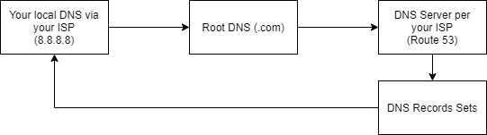

## Linux Version

- The Unix operating system released by Ken Thompson and Dennis Ritchie of AT@T Bell Lab in 1970.
- Unix later rewritten in C, to make it portable.
- In 1977 Berkley Software Distribution (BSD) was developed.
- In 1985 Intel released the 80386, the first x86 microprocessor.
- Commercial Unix was too expensive for private users using Intel 386 PCs.
- In 1987, Andrew Tanebaum released MINIX, a Unix like system intended for academic use:
    - Source code was available, but modification and redistribution restricted.
    - The 16 bit design of MINIX was not well suited for the 32 bit design of the cheap and popular Intel 386 PCs.
- In 1991 Linus Torvalds released a project called **Freax** which later become **Linux**.
- In 1992 Torvalds released the Linux kernel under GNU license.
- Initially Linux only referred to the kernel, not the distribution as a whole (shell, compilers, editors).
- The Debian project started in 1993 to create a distribution of GNU tools (shell, compilers, editors) and was called
GNU/Linux.

### Popular Linux Distributions

- **Debian:** Non commercial, maintained by a volunteer developer community.
    - Knoppix
    - Linux Mint Debian Edition.
    - Ubuntu maintained by Canonical Ltd.
- **Fedora:** A community distribution sponsored by Red Hat.
    - **Red Hat Enterprise Linux (RHEL):** Commercially licensed and supported by Red Hat.
        - CentOS same sources as RHEL.
        - Oracle Linux based on RHEL.
        - Amazon Linux based on RHEL.
- **openSUSE:** A community edition sponsered by the company SUSE.
    - SUSE Linux Enterprise: Commercially licensed and supported by SUSE.

### Which Linux Distribution to Use

- Mint / Ubuntu highly popular with desktop users.
- RHEL dominates with 67% of the enterprise market.
- SUSE Enterprise Linux has 20%.
- Oracle Linux has 12%.
- Fedora derived Linux Distributions have 79% of the enterprise market share (RHEL / Oracle).
- CentOS effectively RHEL, with any references to **Red Hat** removed.
    - Red Hat enforces licensing via Trademark low of the term **Red Hat**.

## Amazon Web Services

- **EC2:** Virtual Machines via AMIs (Amazon Machine Images).
- **RDS:** Relational Database Service - Managed MySQL.
- **Route 53:** DNS Services.

## Docker

```console
# list all images
docker images -a
docker ps
docker images -q --no-trunc

# delete all images
docker rmi $(docker images -q)
docker rmi -f $(docker images -a -q)
docker rm $(docker ps --all -q)

# docker inspect NAME
# run hello world
docker run hello-world
docker images -a

# running mongo db
docker pull mongo
docker run --name some-mongo -d mongo:tag
docker run mongo
docker run -d mongo
docker run -p 27017:21017 -d mongo
docker run -p 27017:21017 -d mongo:4.0.5
docker run -p 27017:21017 -v /{some_path}/dockerdata/mongo:/data/db -d mongo
docker image inspect mongo

# see docker logs
docker logs -f facfcd7e8e01

# running rabbitmq
docker run -d --hostname panda-rabbit --name some-rabbit -p 8080:15672 -p 5671:5671 -p 5672:5672 rabbitmq:3-management
docker kill fa6a7240010f

# running mysql
docker run --name panda-mysql -e MYSQL_ALLOW_EMPTY_PASSWORD=yes -v /{some_path}/mysql:/var/lib/mysql -p 3306:3306 -d mysql
```

### Docker Hub

- Public docker registry, like maven centrals.

### Docker Images

- An Image defines a Docker Container:
    - Similar in a concept to a snapshot of a VM.
    - Or a class vs an instance of the class.
- Images are immutable:
    - Once built, the files making up an image do not change.
- Images are built in layers.
- Each layer is an immutable file, but is a collection of files and directories.
- Layers receive an ID, calculated via a SHA 256 hash of the layer contents:
    - Thus, if the layer contents change, the SHA 256 hash changes also.
- Image Ids are a SHA 256 hash derived from the layer:
    - Thus if the layers of the image changes, the SHA 256 hash changes.
- The Image ID listed by docker commands (**docker image**) is the first 12 characters of the hash.
- The hash values of images referred to by **tag** names.
- The format of the full tag name is: **[REGISTRYHOST/][USERNAME/]NAME[:TAG]**.
- For Registry Host **registry.hub.docker.com** is inferred.
- For **:TAG** - **latest** is default, an inferred.
- Full tag example: **registry.hub.docker.com/mongo:latest**.

## Docker

- There are 3 key areas of house keeping:
    - Containers
    - Images
    - Volumes

### Containers cleaning up

- Kill all Running Docker Containers:
    - **docker kill $(docker ps -q)**
- Delete all Stopped Docker Containers:
    - **docker rm $(docker ps -a -q)**

### Images cleaning up

- Remove a Docker Image:
    - **docker rmi IMAGE_NAME**
- Delete Untagged (dangling) Images:
    - **docker rmi $(docker images -q -f dangling=true)**
- Delete All Images:
    - **docker rmi $(docker images -q)**

### Volumes cleaning up

- Once a volume is no longer associated with a container, it is considered **dangling**.
- Remove all dangling volumes:
    - **docker volume rm $(docker volume ls -f dangling=true -q)**
- Does not remove files from host system in shared volumes.

### Questions

- Show running containers: 
    - **docker ps**
- Show all containers? Running and stopped: 
    - **docker ps -a**
- What s the default tag? 
    - **latest** is selected if no other value is specified.
- Command to run docker image: 
    - **docker run IMAGE_NAME**
- How to see the console output of a docker container? 
    - **docker logs CONTAINER_NAME**
- Command to build a docker image? 
    - **docker build -t TAG_NAME**
- Stop a docker container: 
    - **docker stop CONTAINER_NAME** or **docker kill CONTAINER_NAME**
- Parameter tells docker to run the container as a background process: 
    - **-d**, **docker run -d IMAGE_NAME**
- List all docker images on your system: 
    - **docker images**
- Map a host port to a container port:
    - **-p HOST_PORT:CONTAINER_PORT**
    - **docker run -p 8080:8080 IMAGE_NAME**
- Tail the console output of a running docker container? 
    - **docker logs -f CONTAINER_NAME**
- What is like a .java file to a docker image? ie, the source code?
    - The Dockerfile.
- Command to remove a stopped docker container? 
    - **docker rm CONTAINER_NAME**
- Specify an environment variable for a docker container:
    - **docker run -e MY_VAR=my_prop IMAGE_NAME**
- Remove a docker image from your system:
    - **docker rmi IMAGE_NAME**
- Shell into a running docker container: 
    - **docker exec -it CONTAINER_NAME bash**
- Share storage on the host system with a docker container:
    - **-v HOST_PATH:CONTAINER_PATH**
    - **docker run -v MY_HOST_PATH:THE_CONTAINER_PATH IMAGE_NAME**

***

## Spring Boot in CentOS

- **docker run -d centos**
- **docker ps**
- **docker run -d centos tail -f /dev/null**
- **docker exec -it lucid_turing(<NAMES>) bash**

```console
java -version
yum install java
```

### Running Spring Boot from docker

**Dockerfile**

```Dockerfile
FROM centos

RUN yum install -y java

VOLUME /tmp
ADD /spring-boot-web-0.0.1-SNAPSHOT.jar myapp.jar
RUN sh -c 'touch /myapp.jar'
ENTRYPOINT ["java","-Djava.security.egd=file:/dev/./urandom","-jar","/myapp.jar"]
```

- At location where dockerfile is.

```console
ll
> -rw-r--r-- 1 Mati 197121      209 kwi 29  2017 Dockerfile
> -rw-r--r-- 1 Mati 197121 37845015 lut 15  2017 spring-boot-web-0.0.1-SNAPSHOT.jar

docker build -t spring-boot-docker .

docker run -d -p 8080:8080 spring-boot-docker
```

### :red_circle: MySQL Service account

```sql
SHOW VARIABLES LIKE 'validate_password%';

SET GLOBAL validate_password_length = 0;
SET GLOBAL validate_password_number_count = 0;
SET GLOBAL validate_password_policy=LOW;
```

- Create custom user without root privileges.

```sql
# -- ptr-dev is databasename
# -- panda - password

CREATE USER 'ptr-dev'@'localhost' IDENTIFIED BY 'panda';

GRANT SELECT ON ptr-dev.* to 'ptr'@'localhost';
GRANT INSERT ON ptr-dev.* to 'ptr'@'localhost';
GRANT DELETE ON ptr-dev.* to 'ptr'@'localhost';
GRANT UPDATE ON ptr-dev.* to 'ptr'@'localhost';
```

### :red_circle: Encrypting properties

- SpringDevOps Lecture 30

```xml
<dependency>
    <groupId>com.github.ulisesbocchio</groupId>
	<artifactId>jasypt-spring-boot-starter</artifactId>
	<version>1.6</version>
</dependency>
```

- Use jasypt shell script to encode.

```console
jasypt-1.9.2/bin$ ./encrypt.sh input=panda password=password__this__one
```

- Use in properties files

```properties
jasypt.encryptor.password=password__this__one

spring.datasource.username=ENC(AB2jknGes56KGq1ABPAqr8eUjfdrEeUu)
spring.datasource.password=ENC(WR7WN1GGfcqdhi0VU9hMhQ==)
```

***

## Amazon Web Service

- Provisioning server
- EC2

### Installing Jenkins

```console
# ssh -i "/home/matikomp/Downloads/dev_ops_course.pem" ec2-user@abcdef123.amazonaws.com

which wget
sudo su

# install java
yum install wget
pwd
mkdir install
cd install
wget ---[rest of commands] java
tar xzf jdk-8u201-linux-x64.tar.gz
cp -r ./jdk1.8.0_201/ /opt/
cd /opt
ll
alternatives --install /usr/bin/java java /opt/jdk1.8.0_201/bin/java 2
alternatives --config java
alternatives --install /usr/bin/jar jar /opt/jdk1.8.0_201/bin/jar 2
alternatives --install /usr/bin/javac javac /opt/jdk1.8.0_201/bin/javac 2
alternatives --set jar /opt/jdk1.8.0_201/bin/jar
alternatives --set javac /opt/jdk1.8.0_201/bin/javac
java -version

# install jenkins
cd /home/ec2-user/install/
sudo wget -O /etc/yum.repos.d/jenkins.repo http://pkg.jenkins-ci.org/redhat/jenkins.repo
sudo rpm --import https://jenkins-ci.org/redhat/jenkins-ci.org.key
sudo yum install jenkins
service jenkins start
ps -ef | grep jenkins
```

### How DNS (Domain Names Server) works

- Protocol for obtaining an IP address associated with text.
- Check domain from command line.

**nslookup panda.com**



### Route 53

**Setting up Apache with Jenkins**

```console
yum install httpd
service httpd start
cd /etc/httpd/conf
vi httpd.conf
```

```xml
<VirtualHost *:80>
servername http://xxx.yyy.zzz.www:8080/
ProxyRequests Off
ProxyPreserveHost On
AllowEncodedSlashes NoDecode
ProxyPass / http://localhost:8080/ nocanon
ProxyPassReverse / http://localhost:8080
ProxyPassReverse / http://xxx.yyy.zzz.www:8080
<Proxy http://localhost:8080/* >
Order deny,allow
Allow from all
</Proxy>
</VirtualHost>
```

```console
service httpd restart
setsebool -P httpd_can_network_connect true

# block jenkins on port 8080
cd /etc
cd sysconfig/
vi jenkins

# Type:        string
# Default:     ""
# ServiceRestart: jenkins
#
# IP address Jenkins listens on for HTTP requests.
# Default is all interfaces (0.0.0.0).
#
# JENKINS_LISTEN_ADDRESS="127.0.0.1"

service jenkins restart
```

**Creating ssh keys**

```console
whoami
su -s /bin/bash jenkins

cd /var/lib/jenkins
mkdir .ssh
cd .ssh
ssh-keygen -t rsa -C 'jenkins@example.com'
```

**Installing GIT on Jenkins server**

```console
sudo yum install git
```

**Installing docker**

```console
uname -r
sudo yum update

from page
sudo systemctl start docker
```


