# SSL TLS

```console
nslookup www.instagram.com
```

***

## Encryption and hashing

### Encryption algorithms

| algorithm | key |
|---|---|
| DES | Symmetric |
| 3DES | Symmetric |
| AES | Symmetric |
| RSA | Asymmetric |

### Hash

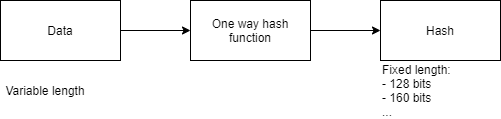

- Verifies integrity of data.
- Keys in hash function add sender authentication.
- One way algorithm.

**MD5 hashing algorithm**

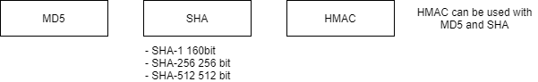

**SHA hashing algorithm**

- SHA-1: (160 bit) 40 hex characters.
- SHA-256: (256 bits) 64 hex characters.
- SHA-512: (512 bits) 128 hex characters.
- HMAC: `Data + Key = Hash`

### Asymmetric Keys

- **Private Key**: Always kept secret.
- **Public Key**: Available for anyone.
- Public, Private key can be used for encryption.
- Signing data using private key.
- Sign and verify signature using asymmetric keys.

### RSA

- RSA: public-key crypto-system.
- Key length (bits):
    - 1024
    - **2048**
    - 3072
    - 4096

### PKI - Public Key Infrastructure

- CA: certification authority:
    - Sign certificate.
    - Delegate certificate signature (intermediate CA).
    - Stores public key of owner of certificate.

### Certificate

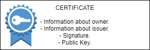

- If certificate is signed by CA (certification authority) and we truct CA, we trust owner of
the certificate too.
- Public key in a oglcertificate ALWAYS belongs to the owner of certificate.

***

### Open SSL

```console
openssl genrsa

openssl genrsa -aes256
# Enter pass phrase:
# used for encryption Private Key

openssl genrsa -des3

openssl genrsa -aes256 -out private.pem

# Extract Public Key (public.pem)
openssl rsa -in private.pem -outform PEM -pubout -out public.pem

openssl genrsa 4096
```

### Chain of trust

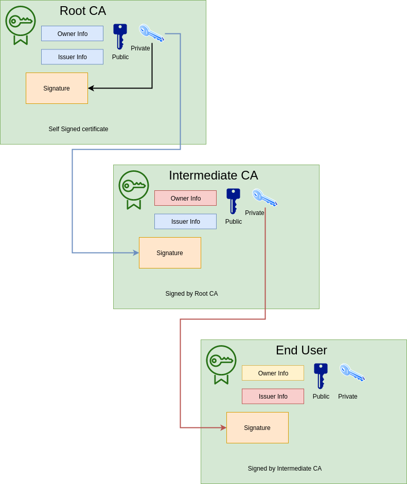

- How end user certificate was securely signed by private key of the Intermediate CA ?
    - Signing occurs on the Intermediate CA server.
    - With it's private key it securely sign, CSR (Certificate Signing Request) received from the end user.

### Verify chain of certificates

- Web server sends own certificate and certificates of all intermediate CAs.
- Current date and time should fall within the certificate validity interval.
- Verification of signature.
- If signature was verified successfully trust between Intermediate CA and End user is established.
- Next **Intermediate CA certificate** signature must be verified.
- Find Certificate with **Owner Info** equal to **Issuer Info** in the Intermediate CA Certificate.
- Root CA certificate is found in the builtin OS certificates store.
- Verify Intermediate CA certificate signature using public key found in the Root CA certificate.
- If signature was verified successfully trust between Root CA and Intermediate CA is established.
- `Trust Root CA > Trust Intermediate CA > Trust End User`
- Identity of End User (for example Web Server) was successfully verified.
- Certificate is valid.

### Verifying SSL certificate and certificates chain

```
> geocerts.com
> sslshopper.com
```

### PKI Public Key Infrastructure

- Set of rules, algorithms and protocols that allows you to build relationships between entities.
- Every entity owns public key, and based on build trust to public keys.
- Each Certificate contains:
    - Information about owner.
    - Information about issuer.
    - Signature
    - PUBLIC KEY.

### Certificate domain scopes

- Single domain:
    - www.instagram.com
    - www.mywebsite.com
- Wildcard:
    - *.google.com
    - *.mywebsite.com
- Multidomain:
    - *.facebook.com
    - *.fb.com
    - *.messenger.com

***

## SSL, TLS and HTTPS

- SSL: Secure Socket Layer.
- TLS: Transport Layer Security.
- SSL and TLS cryptographic protocol.
- Certificate doesn't depend on specific protocol (TLS or SSL) and could be used for both.

### History of SSL and TLS

- Why RSA is not used in HTTPS for data encryption?
    - RAS (RSA - public-key crypto-system) encryption is slow.
    - Bi-directional data encryption requires RSA key pairs on both sides (private key in client and server).

**Encryption using asymmetric keys**

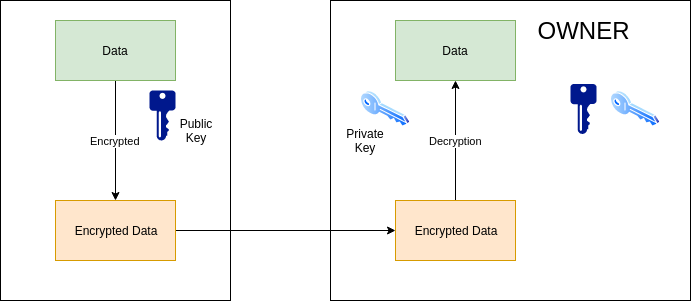

### How TLS session is established

**Establishing TLS session**

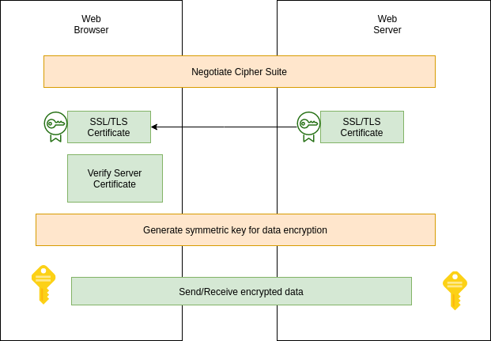

- Cipher Suite:
    - Set of protocol used in TLS communication.
    - Specify how symmetric key will be generated.
    - Which algorithm will be used for data encryption and decryption.
    - Info about hashing protocol.
- Certificate verification:
    - Verify signature.
    - Check validity period.
    - Verify whether certificate was revoked or not (optional).

### Cipher Suite

```
TLS_ECDHE-RSA-WITH_AES_128_GCM_SHA256
```

**Delivering key for Encryption in TLS (without Diffie Hellman)**

- RSA key pair is "static" and is not changed until certificate is renewed.

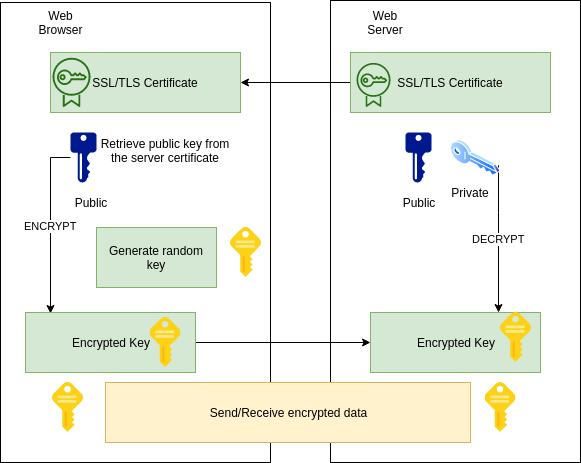

**Delivering key for Encryption in TLS (with Diffie Hellmen)**

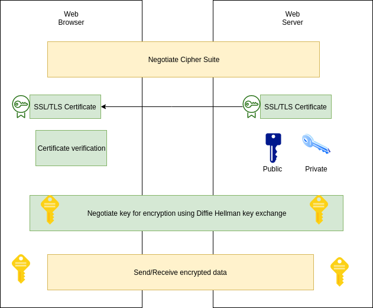

**Elliptic Curve Diffie Hellman Exchange**

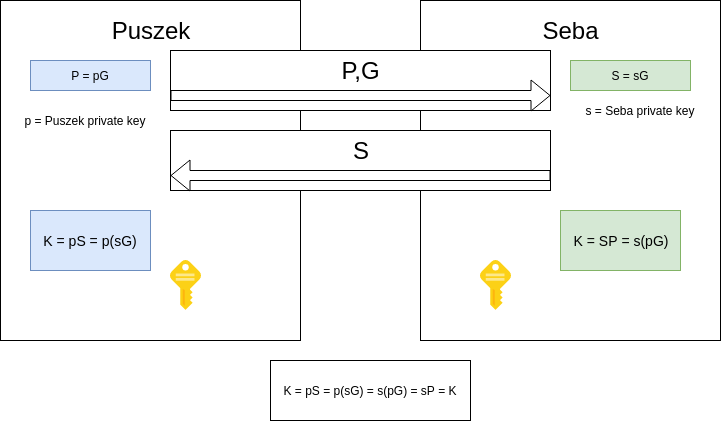

```
Cipher Suite: TLS_ECDHE_ECDSA_WITH_CHACHA20_POLY1305_SHA256

TLS
ECDHE - Elliptic Curve Diffie Hellman Exchange
ECDSA_WITH_CHACHA20 - Elliptic Curve Digital Sign Algorithm

POLY1305 - Encryption Algorithm
SHA256 - Hashing Algorithm
```

## TLS secured website

- Domain
- Hosting
- TLS Certificate

***

# SSL/TLS Operations

- How SSL works?
- Structure of SSL Certificate.
- Encryption Algorithms.
- SSL Communication.
- Certificate provisioning.
- OpenSS:- Library and CLI.
- Chain of trust.
- Trust stores.
- TLS 1.3

**Why do we need SSL certificates?**

- Source identity verification: `Trust`.
- Secure against Man-in-the-middle (MITM): `Confidentiality & Integrity`.
- `Client/Server authentication`: Can server identify the client back as well?
- `Non-Repudiation`: Can site repudiate (deny) the actions later?

**SSL/TLS Evolution**

- SSL Protocol was developed by Netscape in 1994.
- Taher Elgmal & Kipp Hickman.
- SSL certificate is produced as proof of identity in SSL protocol.
- Transport Layer Security (TLS) protocol was created by Internet Engineering Task Force (IETF) as
successor to SSL.

**How SSL works ?**

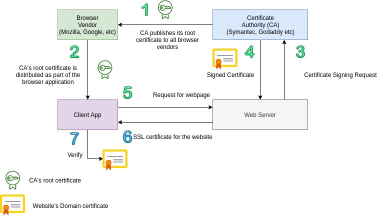

**CA Signed vs Self Signed Certificates**

| CA Signed Certs | Self Signed Certs |
|---|---|
| Signed by CA, a third party | Signed by the Website, the owner herself |
| Ideal for public use | Ideal for closed access |
| Trusted by browsers that have the root certificate of the CA in their trust store | Not trusted by browsers until you import your public key manually into browser trust store |
| Renewals / modifications in cert do not require change at browser side | Renewals / modifications requires re-import of the new cert to browser's trust store |
| You buy it from a CA | No cost as you signed it yourself |
| Leaf and intermediate certificates | Root certificates |

- What about setting up your own private CA to sign your certificates?

### Reading / Examining certificate

```console
openssl s_client -connect google.com:443 < /dev/null
openssl s_client -connect google.com:443 < /dev/null | openssl x509 -in /dev/stdin -text -noout
```

## Certificate Architecture

### Structure of certificate

```
 Data:
        Version: 3 (0x2)
        Serial Number:
            40:2a:98:23:2d:c8:6c:13:08:00:00:00:00:1d:89:b1
    Signature Algorithm: sha256WithRSAEncryption
        Issuer: C=US, O=Google Trust Services, CN=GTS CA 1O1
        Validity
            Not Before: Nov  5 07:38:32 2019 GMT
            Not After : Jan 28 07:38:32 2020 GMT
        Subject: C=US, ST=California, L=Mountain View, O=Google LLC, CN=*.google.com
        Subject Public Key Info:
            Public Key Algorithm: rsaEncryption
                Public-Key: (2048 bit)
                Modulus:

        X509v3 extensions:
            X509v3 Subject Alternative Name:
            Authority Information Access:
                OCSP - URI:http://ocsp.pki.goog/gts1o1
                CA Issuers - URI:http://pki.goog/gsr2/GTS1O1.crt
            X509v3 Basic Constraints: critical
                    CA:FALSE
            X509v3 CRL Distribution Points:
                Full Name:
                    URI:http://crl.pki.goog/GTS1O1.crl

    Signature Algorithm: sha256WithRSAEncryption

```

- Data:
    - Version
    - Serial number
    - Signature Algorithm
    - Issuer
    - Validity:
        - Start date
        - End date
    - Subject's Pub Key
    - X509 Extensions:
        - SAN
        - CRL/OCSP
- Signature:
    - Signature Algorithm
    - Signature

**Digital Signature**

- Hash of something signed by a private key.
- Verified using public key.
- Satisfies Integrity, Authenticity and Non-repudation.
- Verification is done by comparing the message digests (Hashes).
- Applications: SSL, Secure eMail, eDocuments, Watermarking.

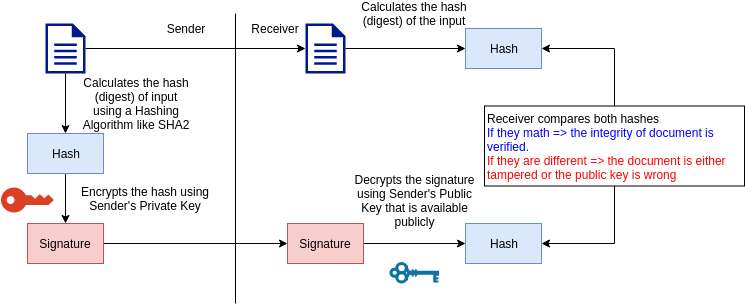

**Certificate Standards and Encoding methods**

- Standard:
    - x509: PKIX (Public Key Infrastructure) certificate.
    - Standard for SSL by NetScape.
- Encoding:
    - DER (Distinguished Encoding Rules) Std => Binary DER encodes certs. (appear as .cer/.crt files).
    - PEM (Privacy Enhance Mail) Std => ASCII (Base64) armored data prefixed with a "--- BEGIN ---" line.
    (appears as .cer/.crt/.pem files).
- File extensions:
    - .crt => *nix convention of binary DER or Base64 PEM.
    - .cer => Microsoft convention of binary DER or Base64 PEM.
    - .key => public/private PKCS#8 keys. DER or PEM.

**Encoding conversion**

```
openssl x509 -in ServerCertificate.cer -outform der -out ServerCertificate.der
openssl x509 -in ServerCertificate.der -inform der -outform pem -out ServerCertificate.pem
```

### Types of Certificates

**Based on trust level (DV, OV, EV)**

- **DV**: Domain Validated (Basic):
    - Small or medium level website owners who only wish to encrypt their domain
    can issue DV SSL certificate.
    - Features:
        - No paper work or documentation required for validation. Validated against the
        domain. It does not guarantee the identity of the website's owner nor the actual
        existence of the organization.
        - Green padlock.
        - Lower price.
        - Quick issuance within minutes.
        - 99,9% mobile and web browser compatibility.
        - Comes up with Wildcard and Multi Domain features.
        - Reissue as many times as needed during the validity period.
    - Validation process (email, file, registrar).
    - https://aboutssl.org/domain-validated-ssl-validation-process/
- **OV**: Organization Validated (Enhanced):
    - Business identity level trust. Organization name printed in the certificate. (https://reddit.com)
    - Features:
        - Green padlock.
        - 1-3 for issuance.
        - More trusted than DV.
        - Organization name is validated and part of the certificate. (Organization and Subject are filled up).
        - https://aboutssl.org/document-require-for-ov-ssl-code-signing-certificate/
- **EV**: Extended Validated (Complete):
    - For trusted and high security sites (https://www.godaddy.com)
    - Features:
        - Green Address Bar + Organization Name + Trust Seal.
        - Up to 10 business days for issuance & Very Strict Validation Process.
        - OV by default + High 256-bit encryption with 2048-bit key length.
        - Multi domain with SAN only.
        - https://aboutssl.org/document-require-for-ev-ssl-certificate/

### Encryption Algorithms

**Kerckhoff's Principle**

```
A cryptosystem should be secure even if the attacker knows all details about the system, with
the exception of the secret key. In particular, the system should be secure when the attacker
knows the encryption and decryption algorithms.
```

- Private/Symmetric Key Encryption Algorithms.
- Public/Asymmetric Key Encryption Algorithms.
- Hashing Algorithms.

**Symmetric / Private Key Algorithm**

| Key length | Security Estimation |
|---|---|
| 56-65 bits (AES, 3DES) | Short term: a few hours / days |
| 112-128 bits (AES, 3DES) | Long term several decades |
| 256 bits (AES, 3DES) | Long term several decades |

**Asymmetric / Public**

- Integer Factorization (RSA).
- Discrete Logarithm (DH, DSA, Elgamal).
- Elliptic Curves (ECDH, ECDSA).

### Private / Symmetric Key Encryption

- DES, 3DES, AES, RC4.
- Based on single common shared secret key.
- Faster than Public Key encryption.
- Both sender and receiver should have the shared secret.

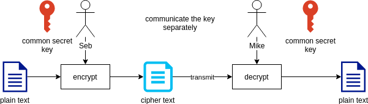

### AES

- Based on Rijndael algorithm.
- Block cipher.
- Modes:
    - Electronic Codebook (ECB)
    - Cipher Block Chaining (CBC)
    - Output Feedback (OFB)
    - Counter (CTR)
    - Galois / Counter Mode (GCM)
- 128, 192 and 256 bits.

### Public/Asymmetric Key Encryption

- RSA, DSA.
- Key bit length.
- Slower.

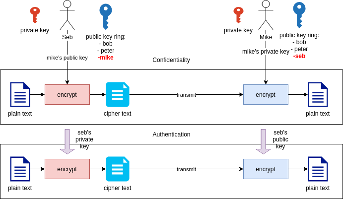

### RSA

- Ron Rivest, Adi Shamir and Leonard Adelman in 1977.
- Patented by MIT expired in 2000.
- Good for signing and encryption.
- Advanced key computation.
- Bad for key exchange.

**Integer Prime Factorization Problem**

```
For three very large positive integers e, d and n such that with modular
exponentiation for all integer m:
(m^e)^d=m(mod n)

and that even knowing e and n or even m it can be extremely difficult to
find d. The public key is represented by the integers n and e; and, the private
key, by the integer d.
```

### Elliptic Curve Cryptography

- Discovered in 1985 by Victor Miller (IBM) and Neil Koblits (University of Washington).
- Some implementations patented by Certicom.
- Low computing power requirements.
- Reduced key length and hence fast.
- Use only standard NIST curves.

**Elliptic Curve Discrete Logarithm Problem**

```
Let P and Q be two points on an elliptic curve such that
kP = Q, where k is a scalar. Given P and Q, it is
computationally infeasible to obtain k, if k is sufficiently
large. k is the discrete logarithm of Q to the base P.

On EC, Scalar multiplication is a one way function.
```

### Hashing Algorithms

- An one way digest.
- Unique.
- Fixed length (32, 40, 64 etc.).
- Collision resistance.
- MD5, SHA1, SHA2, SHA3, RIPEMD, Tiger, Whirlpool, GOST etc.

```console
openssl dgst -md5 message1.bin message2.bin
openssl dgst -sha1 message1.bin message2.bin
openssl dgst -sha256 message1.bin message2.bin
```

## SSL Communication

- Authentication (Handshake) (PublicKey Algo).
- Key Exchange (Handshake) (PublicKey Algo / Key Exchanging Protocol).
- Encrypted data transfer (Record) (PrivateKey Algo).

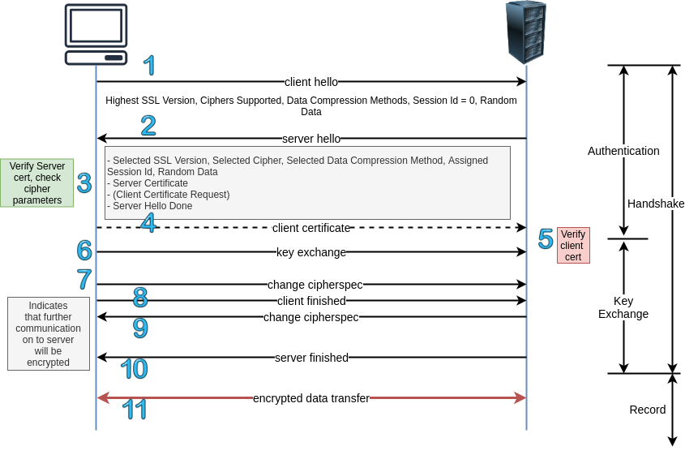

### Step 1. Authentication

- Through SSL Certificates:
    - RSA Certs.
    - 2048 bits to be safe.
- Cipher Suite.

**Cipher is**

```
TLS_ECDHE_RSA_WITH_AES256_CBC_SHA
```

- TLS: Transport layer protocol used (others: SSL)
- ECDHE: Session key exchange algorithm (others: RSA, DH, DHE)
- RSA: PKI type of the Certificate (others: DSS)
- AES256: Symmetric algorithm used to encrypt the actual data (others: RC4, 3DES, CAMELLIA, ARIA, DES40)
- CBC: Mode in which the symmetric algorithm operates (others: CCM, GCM)
- SHA: Hashing algorithm for data integrity (others: MD5, SHA2)

```
Random Data - Entropy is measure of randomness, added to message.
```

### Step 2. Key Exchange.

**RSA Method**

- Most used (XX%).
- Uses servers public key for confidentiality while exchanging secret.
- No Perfect Forward Secrecy and hence passive cryptanalysis is possible.
- Server's private key, critical point of compromise.

**Diffie Hellman Method**
- Most efficient and recommended
- Ephemeral mode for PFS. Blast radius of passive cryptoanalysis limited to a session

#### Diffie Hellman

- Whitfield Diffie and Martin Hellman in 1976.
- No long term private key involved.
- DHE provides Perfect Forward Secrecy.
- No secret key is exchanged.

**Discrete Logarithm Problem (in Zip)**

```
Even though a (alpha), p, A and B are known to the
adversary, calculating
a = loga A mod p

is practically impossible with 'p' being a large prime number.
```

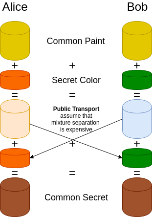

### Step 3. Encrypted data transfer (Record)

- Actual data transfer.
- Confidentiality (Symmetric Encryption).
- Message Integrity (MAC).
- MAC the Encrypt.

**Record Header**

```
Byte 0 = SSL record type
    SSL3_RT_CHANGE_CIPHER_SPEC 20 (x'14')
    SSL3_RT_ALTER 21 (x'15')
    SSL3_RT_HANDSHAKE 22 (x'16')
    SSL3_RT_APPLICATION_DATA 23 (x'17')
Byte 1-2 = SSL version (major/minor)
    SSL3_VERSION x'0300'
    TLS1_VERSION x'0301'
Bytes 3-4 = Length of data in the record (excluding the header itself). Max is 16384 (16K).
Byte 5 = Handshake type
Byte 6-8 = Length of data to follow in this record
Byte 9-n = Command-specific data
```

```console
openssl s_client -connect qualys.com:443 < /dev/null 2> /dev/null
```

***

### Certificate provisioning

1. Certificate request and CA signing.
2. Certificate installation.
3. Certificate verification.
4. Certificate revoking.

**Certificate Request & Signing**

- Administrator of the webserver/domain generate the private key and certificate signing request for your site.

```console
openssl genrsa -out mysite.key 4096
openssl req -new -key mysite.key -out mysite.csr
```

- Send `mysite.csr` to the CA of your choice.
- Get it signed by CA, say `mysite.crt`:
    - CA calculates the SHASUM of the certificate's data section.
    - Encrypts the checksum value using CA's private key.
    - Append the signature to the certificate and send back to the requester.

**Self Signed**

- Generate private key and self signed certificate for 365 days.

```console
openssl req -x509 -newkey rsa:4096 -keyout mysite.key -out mysite.crt -days 365
openssl x509 -in mysite.crt -text -noout
```

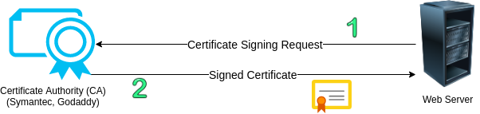

**Certificate Request & Signing**

- Security:
    - Choose your key length:
        - RSA 2048 bit
        - ECC 192 bit
    - Keep your private key secure.
    - Check your signing hashing algorithm:
        - SHA2 or more.
    - Choose a reliable CA.

**Certificate Installation**

- Loadbalancer.
- Web server.

**Apache**

```xml
<VirtualHost 192.168.0.1:443>
    DocumentRoot /var/www/html2
    ServerName www.yourdomain.com
    SSLEngine on
    SSLCertificateFile /path/to/your_domain_name.crt
    SSLCertificateKeyFile /apth/to/your_private.key
    SSLCertificateChainFile /path/to/DigiCertCA.crt
</VirtualHost>
```

**Nginx**

```properties
server {
    Listen 443;
    ssl on;
    ssl_certificate /etc/ssl/your_domain_name.pem;  // cat your_domain_name.crt DigiCertCA.crt >> bundle.crt
    ssl_certificate_key /etc/ssl/your_domain_name.key
    server_name your.domain.com;
    access_log /var/log/nginx/nginx.vhost.access.log;
    error_log /var/log/nginx/nginx.vhost.error.log
    location /
        {
            root /home/www/public_html/your.domain.com/public/;
            index index.html;
        }
}
```

```
https://www.digicert.com/ssl-certificate-installation.htm
```

**Certificate Installation contd.**

- Security:
    - Choose your ciphers:
        - No RC4 ()
        - No AES-CBC with CCL3v3 & TLSv1.0 (BEAST and Lucky13)
        - AES-GCM
        - Disable the export and null cipher suites, as well as cipher
        suites using RC4/3DES. Good to use AES256-SHA for 1.1,
        and AES256-GCM-SHA256 for TLS 1.2.
    - Choose your protocol versions:
        - TLSv1.1 / TLSv1.2

**Certificate Revoking**

- When do we revoke a cert?
    - Subscriber's private compromised.
    - CA's private key compromised.
    - Affiliation Changed.
    - Cessation of Operation etc.
- CRL: Certificate Revocation List.
- OCSP: Open Certificate Status Protocol.

```
X509v3 extensions:
    Authority Information Access:
        CA Issuers - URI:http://pki.google.com/GIAG2.crt
        OCSP - URI:http://clients1.google.com/ocsp
    ...
    X509v3 CRL Distribution Points:
        URI:http://pki.google.com/GIAG2.crt
```

### Common certificate errors

```
SSL_ERROR_NO_CERTIFICATE
SSL_ERROR_WRONG_CERTIFICATE
SSL_ERROR_UNSUPPORTED_VERSION
SSL_ERROR_BAD_CERT_DOMAIN
SSL_ERROR_UNKNOWN_CIPHER_SUITE
SSL_ERROR_UNKNOWN_CA_ALERT
SSL_ERROR_REVOKED_CERT_ALERT
```

```
https://badssl.com
```

### Open SSL - Certificate operations

```console
s_client
    openssl s_client -connect qualys.com:443 < /dev/null
    openssl s_client -showcerts -connect www.google.com:443 < /dev/null     # show all inter. certs too
    openssl s_client -connect -tls1_2 qualys.com:443 < /dev/null            # connect using TLSv1.2 only

x509
    openssl x509 -in www.google.com.crt -noout -text                        # decode the cert file
    openssl s_client -connect google.com:443 < /dev/null 2> /dev/null | openssl x509 -in /dev/stdin -noout -text
                                                                            # take input from stdin spit by s_client
    openssl s_client -connect google.com:443 < /dev/null 2> /dev?null | openssl x509 -noout -dates
                                                                            # check expiry date

genrsa/rsa
    openssl genrsa -out mysite.key 4096                                     # generate 4096 bit rsa key
    openssl rsa -noout -text -check -in mysite.key                          # display the private key components
    openssl rsa -in mysite.key -pubout > mysite.key.pub                     # extract public key
    openssl rsa -in mysite.key.pub -pubin -text -noout                      # display the public key components

req
    openssl req -new -key mysite.key -out mysite.csr                        # new CSR, send this to CA for signing
    openssl req -x509 -newkey rsa:4096 =keyout mysite.key -out mysite.crt -days 365
                                                                            # self signed cert

s_server
    openssl s_server -cert mycert.crt -key mysite.key -www -accept 4443     # start ssl server on port 4443

ciphers
    openssl ciphers -v ['DHE-RSA-AES256-SHA']                               # displays all without a cipher argument

crl
    curl -s htp://pki.google.com/GIAG2.crl | openssl crl -inform DER -text -noout -in /dev/stdin

Miscellaneous
    openssl x509 -noout -modulus mysite.crt | openssl sha256                # all md5sums should be
    openssl req -noout -modulus mysite.csr | openssl sha256                 # the same if they belong
    openssl rsa -noout -modulus mysite.key | openssl sha256                 # to the same website
```

### OpenSSL - Encryption and Decryption functions

```
dgst
    openssl dgst -sha256 -sign privkey.pem -out input_message.tar.gz.sig input_message.tar.gz           # sign
    openssl dgst -sha256 -verify pubkey.pem -signature input_message.tar.gz.sig input_message.tar.gz    # verify

enc
    openssl enc -ase-256-cbc -salt -in file.txt -out file.txt.enc [-k PASS]     # encrypt
    openssl enc -ase-256-cbc -d -in file.txt.enc -out file.txt [-k PASS]        # decrypt

base64
    openssl base64 -in file.txt -out file.txt.base64        # base64 encoding
    openssl base64 -d -in file.txt.base64 -out file.txt     # base64 decoding

ecparam
    openssl ecparam -list_curves                            # list all ECC curves
    openssl ecparam -name secp256k1 -genkey -noout -out secp256k1 -key.pem  # create key for curve secp256k1

passwd
    openssl passwd -1 -salt alphanumeric MyPassword         # create shadow-style password

rand
    openssl rand -out random-data.bin 64                    # create 64bytes random data
    head -c 64 /dev/urandom | openssl enc -base64           # get 64 random bytes for urandom and base64 encode
```

## Chain of Trust

### Intermediate CAs

- To establish Chain of Trust.
- A way to reduce the risk of compromising the Root CA's private key.
- Leaf, intermediate and root certificates.
- Leaf and intermediate to be installed at the web server / LB.
- Chain of Trust is broken if any of the Intermediate Certificate is invalid or missing.

```
Equifax (root CA) ---> Geotrust (ICA) ---> GIA (ICA) ---> Google.com (EE/Leaf)
```

```console
openssl s_client -connect google.com:443 -showcerts < /dev/null 2> /dev/null
```


## Trust Store

- Repository of trusted CA certificates.
- Shipped as part of the application.
- Truststore can be modified.
- Different from keystore.
- Application trust store:
    - Browser: Public keys of all major CAs come with release.
    - Java (tomcat, coldfusion etc.):
        - Mostly there but less frequently updated.
        - You need to take care if customized.

### Managing Trust Store

**Tomcat**

```console
/urs/local/java/jre/bin/keytool -import -v -alias SHA2_Standard_Inter_Symantec_Class_3_Standard_SSL_CA_G4 -file
/$path/SHA2_Standard_Inter_Symantec_Class_3_Standard_SSL_CA_G4.cer -keystore /myapplication/conf/jssecacerts
-storepass changeit -noprompt

/usr/local/java/jre/bin/keytool -list -v -keystore /myapplication/conf/jssecacerts -storepass changeit -noprompt
```

## SSL/TLS

### TLS 1.3

- Safer:
    - Removal of unused and unsafe ciphers and techniques.
    - Security optimization, modern encryption and analysis.
- Faster:
    - 1-RTT for fresh connections.
    - 0-RTT for resumption.

### TLS 1.3 removals

- Static RSA for key exchange because of no PFS.
- Weak hashing algorithms:
    - MD5, SHA1, SLOTH 2016 (added POLY1305 along with SHA256/SHA384..)
- Arbitrary E Curves & (EC) DHE groups: CVE-2016-0701 (added Curve25519 and Curve448).
- Arbitrary Compression: CRIME.
- Renegotiation: DoS2011, Triple Handshake 2014.
- Non-AEAD ciphers (MAC-then-Encrypt):
    - AES-CBS mode: DEAST, Lucky13, POODLE, Vaudenay 2002.
    - RC4: Statistical biases the keystream eg: cookie decryption (replaced by ChaCha20).
    - RSA-PKCS1-1.5: DROWN 2016, Jager 2015.
    - Export ciphers: Responsible for protocol downgrade - FREAK, LogJam.
    - DES/3DES: Breakable.
- Simplified resumption: Replay attacks since there is no PFS.

### TLS 1.3

- Safer optimization, analysis and encryption.
- Only (EC)DHE (based on curves 25519 and 448) and/or PSK for key exchange, no more RSA.
- Limited number of EC groups (defined in either FIPS 186-4. Includes curves 25519 and 448).
- Only suites with AEAD ciphers (AES-GCM, AES-CCM, ChaCha20):
    - TLS13-CHACHA20-POLY1305-SHA256
    - TLS13-AES-256-GCM-SHA384
    - TLS13-AES-128-GCM-SHA256
    - TLS13-AES-128-CCM-SHA256
    - TLS13-AES-128-CCM-8-SHA256
- Content Type, SNI (Server Name Indication), Certificates and Extensions are encrypted.
- Split and simplified negotiation or cipher suites.
- Full handshake signature.
- Server capability assumptions.
- Applications can do arbitrary amount of padding as opposed to 'no-padding' for streaming/AEAD modes in
previous versions of TLS.
- Digital Signature algorithms - EdDSA (Ed25519 and Ed448), ECDSA, RSA.

### TLS 1.3 Faster 1-RTT

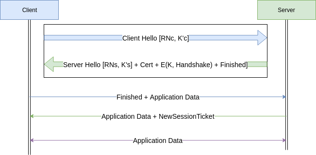

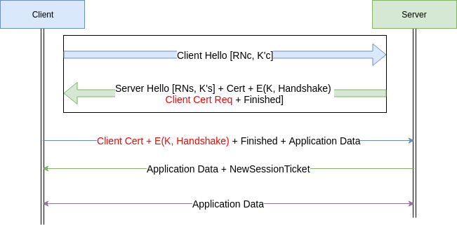

**Faster (0-RTT for resumption)**

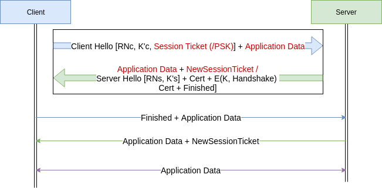

- The Session Ticket = E(Kstek, ResumptionKey) is generated and sent by the server for the previous
handshake.
- It is encrypted using the Session-Key-Encryption-Key (STEK).
- PSK is usually a key shared between the client and the server out-of-the-bound.

### TLS 1.3 Deployment

- Nginx `ssl_protocols TLSv1.2 TLSv1.3; # nginx.conf`
- Apache `SSLProtocol -all +TLSv1.2 +TLSv1.3; # ssl.conf`
- Caveats:
    - Resumption with base PSK is forward secure only if coupled with an ephemeral key (ECDHE) during derivation.
    - The early data (0-RTT) is not forward secure. So prone to reply attacks.
    - 0-RTT activation is a call that the Application developer has to make. (recommended only for idempotent calls)

### HTTP Public Key Pinning

- HPKP
- Detect fraudulent certificates.
- HTTP Header.
- HPKP header in response.

```
Public-Key-Pins:
    pin-sha256="";
    pin-sha256="";
    max-age=259200
```

```
Public-Key-Pins-Report-Only:
    max-age=259200;
    pin-sha256="sddmakf'rfdsjid;";
    pin-sha256="dsjaisd;/2r94ri[";
report-uri="https://example.net/pkp-report"
```

- HPKP header in server in server configuration (eg:-Apache).

```
Header add Public-Key-Pins "max-age=500; includeSubDomains; pin-sha256=\"asdjasdkladsjkasdad\"";
```

### Let's encrypt - Free & Open certificate

- Automatic Certificate Management Environment (ACME) + Let's Encrypt CA = Fully automated cert management system.

### Certificate Transparency

- Make it impossible (or at least very difficult) for CA to issue a SSL certificate for a domain without certificate
being visible to the owner of that domain.
- Provide an open auditing and monitoring system that lets any domain owner or CA determine whether certificates have
been mistakenly or maliciously issued.
- Protect users from being dumped by certificates that were mistakenly or maliciously issued.


