# Docker.

- Docker is a standard for Linux containers.
- A **Container** is an isolated runtime inside of Linux.
- A **Container** provides a private machine like space under Linux.
- Containers will run under any modern Linux Kernel.

## Containers.

- Have their own process space.
- Their own network interface.
- Run processes as **root** (inside the container).
- Have their own disk space:
    - Can share with a host.

## Docker Terminology.

- **Docker Image:**
    - The representation of a Docker Container.
    - :star: Like JAR or WAR file in Java.
- **Docker Container:**
    - The standard runtime of Docker.
    - Effectively a deployed and running Docker Image.
    - :star: Like a Spring Boot Executable JAR.
- **Docker Engine:**
    - The code which manages Docker stuff.
    - Creates and runs Docker Containers.

## Docker Engine Runtime.

```
Client Docker CLI ---> REST API ---> Server Docker Daemon
```

***

## Docker Editions.

### Docker Enterprise Edition.

- Announced Match 2nd, 2017.
- CaaS (Container as a Service) platform subscription.
- Enterprise class support.
- Quarterly Released.
- Back ported patches for 1 year.
- Certified infrastructure.
- Important for regulatory compliance (PCI, SOX, SAS-70).

### Docker Community Edition.

- Free Docker edition for developers and operations.
- Monthly edge release with the latest features for developers.
- Quarterly releases for operations.

### Which use.

- Functionally, the two editions are the same:
    - Like CentOS vs Red Hat Enterprise Linux.
- For Java developers fine to use Docker Community Edition.
- Docker Enterprise Edition is not available on some commercial OS such as RHEL, SUSE.

***

## Why Docker.

- Before containers and docker the apps deployed and run on Application server created on top of physical server.

### What is container.

- Container consists of:
    - Runtime Environment.
    - An Application.
    - Dependencies and Libraries.
    - Configuration files.

**Advantages.**

- Lightweight and faster.
- Consumes very less system resources.

### Docker.

- Open source platform, and it consists:
    - **Docker Engine:** A runtime and software packaging tool.
    - **Docker Hub:** Service for sharing the application in the cloud similar to github.
- The output of a Docker build is a Docker Image.
- To run Docker, we need to have docker running in our machine.
- When the Docker image runs it creates a container.

**Advantages.**

- Rapid application deployment.
- Easy sharing of artifacts.
- Faster and lightweight.

**Dockerfile.**

- **FROM:** It pulls the image from the docker hub.
    - Here it pulls the java image **alpine-oraclejdk8:slim**.
- **ADD:** Add command takes two arguments, one is source and the destination.
- **COPY:** **./docker-entrypoint.sh /docker-endpoint.sh**.
    - This step copies the **docker-entrypoint.sh** in to the docker image that gets built.
- **RUN:** **chmod +x / docker-entrypoint.sh**
- **ENTRYPOINT:**
    - Argument sets the concrete default app that is used every time a container is created using the image.
    - Often times **ENTRYPOINT** with CMS, you can remove application from CMS and just leave arguments
      which will be passed to the ENTRYPOINT.

```
sudo docker run hello-world

docker rmi $(docker images -q)
```

### Running MongoDB Docker Container.

```
docker ps
docker ps -a
docker images
docker run mongo
docker run -d mongo

docker ps

------------------------------------------------------------------------------------------------------------------
CONTAINER ID        IMAGE               COMMAND                  CREATED              STATUS              PORTS               NAMES
3d6beb4ac7a2        mongo               "docker-entrypoint.s…"   About a minute ago   Up About a minute   27017/tcp           compassionate_yalow


docker stop 3d6beb4ac7a2
docker ps
docker run -p 27017:27017 -d mongo
docker ps

-------------------------------------------------------------------------------------------------------------------
CONTAINER ID        IMAGE               COMMAND                  CREATED             STATUS              PORTS                      NAMES
b3ca782bc1cd        mongo               "docker-entrypoint.s…"   21 seconds ago      Up 20 seconds       0.0.0.0:27017->27017/tcp   cool_lumiere


docker logs -f b3ca782bc1cd
docker run -p 27017:27017 -v /home/matikomp/udemy_courses/DOCKER/dockerdata/mongo:/data/db -d mongo
docker ps
```

### Docker Images.

- Images like **Class** file in Java.
- Instance of class is docker container.
- An Image defines a **Docker Container:**
    - Similar in a concept to a snapshot of a VM.
    - Or a class vs an instance of the class.
- Images are immutable:
    - Once built, the files making up an image do not change.

**Layers.**

- Images are built layers.
- Each layer is an immutable file, but is a collection of files and directories.
- Layers receive an ID, calculated via a SHA 256 hash of the layer contents:
    - Thus, if the layer contents change, the SHA 256 hash changes also.

```
docker image inspect mongo
```

**Image Ids.**

- Image Ids are a SHA 256 hash derived from the layers:
    - Thus, if the layers of the image changes, the SHA 256 hash changes.
- The Image ID listed by docker commands (ie **docker images**) is the first 12 characters of the hash.

```
docker images -q --no-trunc
docker images
```

**Image Tag Names.**

- The hash value of images referred to by **tag** names.
- The format of the full tag name is:
    - **[REGISTRYHOST/][USERNAME/]NAME[:TAG]**
- For Registry Host **registry.hub.docker.com** is inferred.
- For **:TAG** - **latest** is default, and inferred.
- Full tag example:
    - **registry.hub.docker.com/mongo:latest**


### Running Rabbit MQ Docker Container.

```console
docker run -d --hostname panda-rabbit --name some-rabbit -p 8080:15672 -p 5671:5671 -p 5672:5672 rabbitmq:3-management
docker ps
```

### Running MySQL Docker Container.

```console
docker logs c4174507511b
docker run --name panda-mysql-4 -e MYSQL_ALLOW_EMPTY_PASSWORD=yes -v /[PATH]/DOCKER/mysqldata:/var/lib/mysql  -p 3306:3306 -d mysql
```

## Docker Housekeeping.

- There are 3 key areas of housekeeping:
    - **Containers**.
    - **Images**.
    - **Volumes**.
- Shell to running docker image.

```
docker exec -it CONTAINER_NAME bash
```

### Containers.

- Kill all Running Docker Containers.

```console
docker kill $(docker ps -q)
```

- Delete all Stopped Docker Containers.

```console
docker rm $(docker ps -a -q)
```

### Images.

- Remove a Docker Image.

```console
docker rmi IMAGE_NAME
```

- Delete Untagged (dangling) Images.

```console
docker rmi $(docker images -q -f dangling=true)
```

- Delete All Images.

```console
docker rmi $(docker images -q)
```

### Volumes.

- Once a volume is no longer associated with a container, it is considered **dangling**.
- Remove all dangling volumes.

```console
docker volume rm $(docker volume ls -f dangling=true -q)
```

- Does not remove files from host system in shared volumes.

***

## Spring Boot in CentOS.

```console
docker run -d centos tail -f /dev/null

# shell into docker centos
docker exec -it epic_snyder bash

# inside centos docker
java -version
yum install java
java -version
```

**Dockerfile.**

```Dockerfile
FROM centos

RUN yum install -y java

VOLUME /tmp
ADD /spring-boot-web-0.0.1-SNAPSHOT.jar myapp.jar
RUN sh -c 'touch /myapp.jar'
ENTRYPOINT ["java", "-Djava.security.egd=file:/dev/./urandom", "-jar", "/myapp.jar"]
```

**Run Dockerfile.**

```console
docker build -t spring-boot-docker .

docker run -d -p 8080:8080 spring-boot-docker

docker logs bcf1b6fbb61a

// localhost:8080
docker logs -f bcf1b6fbb61a
```

***

## Automatic Building of Docker Images.

### Creating Docker Image in Fabric 8.

- Add **fabric8** dependency to **pom.xml**.

**Dockerfile.**

```console
FROM openjdk

VOLUME /tmp
ADD maven/spring-boot-docker-0.0.1-SNAPSHOT.jar myapp.jar
RUN sh -c 'touch /myapp.jar'
ENTRYPOINT ["java","-Djava.security.egd=file:/dev/./urandom","-jar","/myapp.jar"]
```

```console
mvn clean package
mvn clean package docker:build
```

### Publishing to Docker Hub.

```console
mvn clean package docker:build docker:push
```

### Docker template.

```console
mvn docker:stop

mvn clean package docker:build

docker rm CONTAINER_NAME

mvn docker:start
```

### Running Docker from maven.

```console
mvn docker:run
```

**pom.xml**

```xml
<images>
    <image>
        <name>${docker.image.prefix}/${docker.image.name}</name>
        <build>
            <dockerFileDir>${project.basedir}/target/dockerfile/</dockerFileDir>

            <!--copies artficact to docker build dir in target-->
            <assembly>
                <descriptorRef>artifact</descriptorRef>
            </assembly>
            <tags>
                <tag>latest</tag>
                <tag>${project.version}</tag>
            </tags>
        </build>
        <run>
            <ports>
                <port>8080:8080</port>
            </ports>
        </run>
    </image>
</images>
```

```console
systemctl stop mysql

# Use to run mysql db docker image
docker run --name mysqldb -p 3306:3306 -e MYSQL_DATABASE=pageviewservice -e MYSQL_ALLOW_EMPTY_PASSWORD=yes -d mysql

systemctl stop rabbitmq-server.service

# Use to run RabbitMQ
docker run --name rabbitmq -p 5671:5671 -p 5672:5672 rabbitmq

# Does not work
docker run --name pageviewservice -p 8081:8081  spring/pageviewservice

// Does not work
docker run --name pageviewservice -p 8081:8081 -e SPRING_DATASOURCE_URL=jdbc:mysql://127.0.0.1:3306/pageviewservice \ 
-e SPRING_PROFILES_ACTIVE=mysql spring/pageviewservice

docker run --name pageviewservice2 -p 8081:8081 \
--link rabbitmq:rabbitmq \
--link mysqldb:mysqldb \
-e SPRING_DATASOURCE_URL=jdbc:mysql://mysqldb:3306/pageviewservice \
-e SPRING_PROFILES_ACTIVE=mysql  \
-e SPRING_RABBITMQ_HOST=rabbitmq \
springframeworkguru/pageviewservice
```

***

# Docker.

**Why use Docker?**

```console
docker run -it redis
```

- Docker makes it really easy to install and run software without worrying about setup or dependencies.

**What is Docker?**


- **What is Docker:** Docker is a platform or ecosystem around creating and running containers.


- **Image:** Single file with all the dependencies and config required to run a program.
- **Container:** Instance of an image. Runs a program (running program).

**Docker for Windows/Mac**


- **Docker Client CLI:** Tool that we are going to issue commands to.
- **Docker Server (Docker Daemon):** Tool that is responsible for creating images, running containers etc.

```console
docker run hello-world
```


**Namespacing.**


**Container.**


- **Namespacing:** Isolating resources per process (or group of processes), say - this area of hard drive is for this process:
    - Processes.
    - Hard drive.
    - Network.
    - Users.
    - Hostnames.
    - IPC.
- **Control Groups (cgroups):** Limit amount of resources used per process, say - amount of bandwidth process can use:
    - Memory.
    - CPU Usage.
    - HD I/O.
    - Network Bandwidth.
- **Container:** group of processes assignee to it.

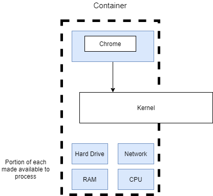

**Containers vs Images.**


**How Docker Running on Your Computer?**

- **Namespacing** and **Control groups** are Linux OS features.
- On MacOS/Windows docker runs through Linux Virtual Machine.

***

## Docker Client CLI.

```
docker run <image_name> <command>
```

```console
docker run hello-world
```

```console
docker run busybox echo hi there

# list content of container
docker run busybox ls
```

**Listing running containers.**

```console
docker ps
docker run busybox ping google.com

# on second terminal - see running busybox container
docker ps

# lists all containers ever created
docker ps -a
docker ps | wc -l
```

**Container lifecycle.**

```
docker run = docker create + docker start
docker create IMAGE_NAME
docker start CONTAINER_ID
```

```console
docker create hello-world

# '-a' watch for output from container and prints out in terminal
docker start -a CONTAINER_ID
```

**Restarting stopped container.**

```console
docker ps -all
docker start CONTAINER_ID
```

**Removing stopped container.**

```console
docker ps --all
docker system prune
```

**Retrieving log output.**

```console
docker create busybox echo hi there
docker start CONTAINER_ID

# retrieve logs from stopped container (no rerun container)
docker logs CONTAINER_ID
```

**Stopping Containers.**

```
docker stop CONTAINER_ID
docker kill CONTAINER_ID
```

- **SIGTERM:** Stop container with cleanup time.
- **SIGKILL:** Shut down immediately.

```console
docker create busybox ping google.com
docker start CONTAINER_ID
docker logs CONTAINER_ID

# after 10 s kill signal
docker stop CONTAINER_ID
docker start CONTAINER_ID

# kill immediately
docker kill CONTAINER_ID
```

### Multi command container.

```console
redis-server
redis-cli
```

**With Docker.**

- Execute an additional command in a container.

```
docker exec -it CONTAINER_ID COMMAND
```

```console
docker run redis

# it - type input to container
docker exec -it CONTEINER_ID redis-cli

# Inside redis-cli docker container
> set myvalue 5
> get myvalue
```

- Communication Channels, communicate information to linux process:
    - **STDIN:** Communicate information into a process.
    - **STDOUT:** Communicate information outside a process.
    - **STDERR:** Like STDOUT but error info.

```
-it flag
-i means execute STDIN on redis cli
-t show text pretty
```

```console
docker exec -i CONTAINER_ID redis-cli
```

**Shell access (exec) to running container.**

```console
docker exec -it CONTAINER_ID sh

> redis-cli
```

- Command Preprocessor:
    - bash.
    - powershell.
    - zsh.
    - sh.

**Starting with a shell.**

- Execute an additional command in a container.

```console
docker run -it busybox sh
```

**Container isolation.**

```console
docker run -it busybox sh
```

- No sharing data between separate running containers.

***

## Creating Docker Images.


**Creating a Dockerfile.**

- Specify a base image.
- Run some commands to install additional programs.
- Specify a command to run on container startup.

### Building Dockerfile.

**Create an image that runs redis-server.**

```Dockerfile
# Use an existing docker image as a base
FROM alpine

# Download and install a dependency
RUN apk add --update redis

# Tell the image what to do when it starts as a container
CMD ["redis-server"]
```

```console
docker build .
docker run CONTAINER_ID
```


**Writing a Dockerfile == Being given a computer with no OS and being told to install Chrome.**


### Rebuilds with cache.

**Tagging an Image.**

- **-t:** Tag argument.
    - **<docker_id>/<repo_project_name>:<version>**

```console
docker build -t majka/redis:latest .

# run image
docker run majka/redis
```

**Manual image generation.**

- **Alpine base image:** They come with a pre-installed set of programs that are useful.
- Docker commit.

```console
docker run -it alpine sh
# inside image
> apk add --update redis

# On second terminal
docker ps
# container id from previous step
docker commit -c 'CMD ["redis-server"]' CONTAINER_ID

# Container id from previous step
docker run CONTAINER_ID
```

***

## Project with Docker.


**Below steps are not quite correct.**


### Base Images issues.

- **alpine:** In Docker world image as small and compact as possible (no npm).
- **node:alpine:** Alpine version of node.

**Missing files.**

- Make sure that created **index.js** and **package.json** are copied to container image.
- Container has its own filesystem.
- **COPY:** Instruction to move file and folders from our local system to filesystem in a container.
    - `COPY <path on your machine> <path inside container>`

```console
# build with tag
docker build -t majka/simpleweb .
docker run majka/simpleweb
```

### Container port mapping.

- Any time someone makes request on a local network, take that request and port it to port in a container.
    - **LOCALHOST_PORT:INSIDE_CONTAINER_PORT**

```console
docker run -p LOCALHOST_PORT:INSIDE_CONTAINER_PORT IMAGE_ID
docker run -p 8080:8080 majka/simpleweb`
```

- On windows **http://192.168.99.100:8080/**.

**Shell into container.**

```console
docker run -it majka/simpleweb sh
```

- Any following command will be executed relative to this path in the container.

```Dockerfile
WORKDIR /usr/app
```

**Another way to shell into a container.**

```console
docker exec -it CONTAINER_ID sh
```

**Dockerfile.**

```Dockerfile
# Specify a base image
FROM node:alpine

# Execute command relative to this path
WORKDIR /usr/app

# Copy required files for npm
COPY ./package.json ./

# Install some dependencies
RUN npm install

# Copy rest of files
COPY ./ ./

# Default command
CMD ["npm", "start"]
```

***

## Docker Compose.


- Node App.
- Redis (in memory data store).


- Node App.

```Dockerfile
FROM node:alpine

WORKDIR /app

COPY package.json .
RUN npm install
COPY . .

CMD ["npm", "start"]
```

```console
docker build -t majka/visits:latest .
```

- Redis.

```console
docker run redis
```


**Docker Compose.**

- Separate CLI that gets installed along with Docker.
- Used to start up **multiple Docker containers** at the same time.
- Automates some long-winded arguments we were passing to **docker run**.


**docker-compose.yml**

```yml
version: '3'
services:
  redis-server:
    image: 'redis'
  node-app:
    build: .
    ports:
      - "4001:8081"
```

**Docker Compose commands.**

| docker             | docker-compose            |
|--------------------|---------------------------|
| docker run myimage | docker-compose up         |
| docker build .     | docker-compose up --build |
| docker run myimage | docker-compose up --build |

```console
docker-compose up
docker-compose up --build
```

```console
docker run -d redis
docker ps
docker stop CONTAINER_ID
```

**Launch in background.**

```console
docker-compose up -d
```

**Stop Containers.**

```console
docker-compose down
```

**Container restarts.**

| Status Code  | Description                             |
|--------------|-----------------------------------------|
| 0            | We exited and everything is OK          |
| 1,2,3, etc   | We exited because something went wrong! |

| Case           | Description                                                     |
|----------------|-----------------------------------------------------------------|
| no             | Never attempt to restart this container if it  stops or crashes |
| always         | If this container stops always attempt to restart it            |
| on-failure     | Only restart if the container stops with an error code          |
| unless-stopped | Always restart unless forcibly stopped                          |

**Docker Container status.**

```console
docker-compose ps
```

***

## Production Grade Workflow.


- React application.

```console
npm install -g create-react-app
create-react-app frontend
```

| Command       | Description                                              |
|---------------|----------------------------------------------------------|
| npm run start | Starts up a development server. For development use only |
| npm run test  | Runs tests associated with the project                   |
| npm run build | Builds a production version of the application           |


**Dockerfile.dev**

```Dockerfile
FROM node:alpine

WORKDIR /app

COPY package.json .
RUN npm install

COPY . .

CMD ["npm", "run", "start"]
```

- Docker build with specified file **-f** option.

```console
docker build -f Dockerfile.dev .
docker run -p 3000:3000 IMAGE_ID
```

### Docker Volumes.

```console
docker run -p 3000:3000 -v /app/node_modules -v $(pwd):/app IMAGE_ID
docker build -f Dockerfile.dev .
docker run -p 3000:3000 -v /app/node_modules -v $(pwd):/app CONTAINER_ID

# Windows
# http://192.168.99.100:3000/
docker run -it -p 3000:3000 -v /app/node_modules -v ${PWD}:/app -e CHOKIDAR_USEPOLLING=true CONTAINER_ID
```

### Docker Compose.

- Makes execute **docker run** easier.

```yml
version: '3'
services:
  web:
    build:
      context: .
      dockerfile: Dockerfile.dev
    ports:
      - "3000:3000"
    volumes:
      - /app/node_modules
      - .:/app
```

```console
docker-compose up
```

**Executing tests.**

```console
npm run test

docker build -f Dockerfile.dev .
docker run -it CONTAINER_ID npm run test

# Live updating test
docker-compose up
docker exec -it CONTAINER_ID npm run test
```

**Docker compose for running tests.**

```Dockerfile
tests:
    build:
        context: .
        dockerfile: Dockerfile.dev
    volumes:
        - /app/node_modules
        - .:/app
    # override command
    command: ["npm", "run", "test"]
```

- **docker attach:** Attach to container STDIN, STDOUT, STDERR to primary process.
    - Can now execute commands from **our terminal**.

```console
docker-compose up --build
docker attach CONTAINER_ID

# Shell into container
docker exec -it CONTAINER_ID sh

# Run test inside container
docker exec -it CONTAINER_ID npm run test
```

### NGINX.

**Dev Environment.**


***

**Prod Environment**


***

**Prod Environment nginx**


- Web server. Taking incoming traffic, route it and response to it.

**Multi Step Docker Builds**


```Dockerfile
# Build Phase
FROM node:alpine as builder
WORKDIR /app
COPY package.json .
RUN npm install
COPY . .
RUN npm run build

# Run Phase
FROM nginx
COPY --from=builder /app/build /usr/share/nginx/html
```

**Running nginx.**

```console
docker build .
# 80 in nginx port inside docker container
docker run -p 8080:80 CONTAINER_ID
```

***

## CI Deployment with AWS.

### Github Setup.


### Travis CI.


```yml
sudo: required
services:
  - docker
before_install:
  - docker build -t matn7/docker-react -f Dockerfile.dev .
script:
  - docker run -e CI=true matn7/docker-react npm run test
```

### AWS Elastic Beanstalk.


- Automatically scale up.

### Travis config for deployment.

**.travis.yml**

```yml
sudo: required
services:
  - docker
before_install:
  - docker build -t matn7/docker-react -f Dockerfile.dev .
script:
  - docker run -e CI=true matn7/docker-react npm run test
deploy:
  provider: elasticbeanstalk
  region: "us-east-1"
  app: "docker"
  env: "Docker-env"
  bucket_name: "elasticbeanstalk-us-east-1-ID"
  bucket_path: "docker"
  on:
    branch: master
  access_key_id: $AWS_ACCESS_KEY
  secret_access_key: $AWS_SECRET_KEY
```

**Exposing port in Dockerfile - final version.**

```Dockerfile
FROM node:alpine
WORKDIR /app
COPY package*.json ./
RUN npm install
COPY . .
RUN npm run build

FROM nginx
EXPOSE 80
COPY --from=0 /app/build /usr/share/nginx/html
```

***

## Multi Container Deployment.

- Single Container Deployment Issues:
    - The app was simple, no outside dependencies.
    - Our image built multiple times.
    - How do we connect to a database from a container?

**Multi container.**

- **Redis:** In memory data store.
- **Postgres:** Database.


**Application Architecture.**


```console
create-react-app client
```

**client - Dockerfile**

```Dockerfile
FROM node:alpine
WORKDIR /app
COPY ./package.json ./
RUN npm install
COPY . .
CMD ["npm", "run", "start"]
```

```console
docker build -f Dockerfile.dev .
```

**server - Dockerfile.**

```Dockerfile
FROM node:alpine
WORKDIR /app
COPY ./package.json ./
RUN npm install
COPY . .
CMD ["npm", "run", "dev"]
```

**worker - Dockerfile.**

```Dockerfile
FROM node:alpine
WORKDIR /app
COPY ./package.json ./
RUN npm install
COPY . .
CMD ["npm", "run", "dev"]
```

**Multi Service docker compose.**


### NGINX Path Routing.

- NGINX will look for all of these requests (**index.html**, **main.js**, **/api/values/all**, **/api/values/current**)
  and decide which server route request to.


**default.conf**

```conf
upstream client {
    server client:3000;
}

upstream api {
    server api:5000;
}

server {
    listen: 80;

    location / {
        proxy_pass http://client;
    }

    location /api {
        rewrite /api/(.*) /$1 break;
        proxy_pass http://api;
    }
}
```

**docker-compose.yml**

```yml
version: '3'
services:
  postgres:
    image: 'postgres:latest'
  redis:
    image: 'redis:latest'
  nginx:
    restart: always
    build:
      dockerfile: Dockerfile.dev
      context: ./nginx
    ports:
      - '3050:80'
  api:
    build:
      dockerfile: Dockerfile.dev
      context: ./server
    volumes:
      - /app/node_modules
      - ./server:/app
    environment:
      - REDIS_HOST=redis
      - REDIS_PORT=6379
      - PGUSER=postgres
      - PGHOST=postgres
      - PGDATABASE=postgres
      - PGPASSWORD=postgres_password
      - PGPORT=5432
  client:
    build:
      dockerfile: Dockerfile.dev
      context: ./client
    volumes:
      - /app/node_modules
      - ./client:/app
  worker:
    build:
      dockerfile: Dockerfile.dev
      context: ./worker
    volumes:
      - /app/node_modules
      - ./worker:/app
```

```
http://localhost:3050/
```

***

## CI Flow for Multiple Images.

### Multi Container Deployments.


**worker, server - Dockerfile.**

```Dockerfile
FROM node:alpine
WORKDIR /app
COPY ./package.json ./
RUN npm install
COPY . .
CMD ["npm", "run", "start"]
```

**nginx - Dockerfile.**

```Dockerfile
FROM nginx
COPY ./default.conf /etc/nginx/conf.d/default.conf
```

### Multiple Nginx instances.


### Travis configuration.


**.travis.yml**

```yml
sudo: required
services:
  - docker
before_install:
  - docker build -t [:secure:]/react-test -f ./client/Dockerfile.dev ./client
script:
  - docker run -e CI=true [:secure:]/react-test npm test
after_success:
  - docker build -t [:secure:]/multi-client ./client
  - docker build -t [:secure:]/multi-nginx ./nginx
  - docker build -t [:secure:]/multi-server ./server
  - docker build -t [:secure:]/multi-worker ./worker
  # Log in to the docker CLI
  - echo "$DOCKER_PASSWORD" | docker login -u "$DOCKER_ID" --password-stdin
  # Take those images and push them to docker hub
  - docker push [:secure:]/multi-client
  - docker push [:secure:]/multi-nginx
  - docker push [:secure:]/multi-server
  - docker push [:secure:]/multi-worker
```

***

## Multi Container Deployments to AWS.

### Multi Container Definition Files.


**Amazon ECS tasks definitions.**

**ECS.**

- Tell Elastic Beanstalk how to run containers.


**nginx-links**


**aws.amazon.com**

### Managed Data Service Provider.


**AWS Elastic Cache.**

- Automatically creates and maintains **Redis** instances for you.
- Easy to scale.
- Build in **logging + maintenance**.
- Good security.
- Easier to migrate off of EB with.

**AWS Relational Database Service.**

- Automatically creates and maintains Postgres instances for you.
- Easy to scale.
- Built in **logging + maintenance**.
- Good security.
- Automated backups and rollbacks.
- Easier to migrate off of EB with.

### AWS VPC's and Security Groups.


- EB Instance.
- EC (Redis).
- RDS (Postgres).
- Setup links between EB and EC and RDS.

**VPC.**

- Private little network.
- Isolated to just your account.
- Implements Security rules.


**Security Group (Firewall Rules).**


- Allow any incoming traffic on Port **80** from any IP.
- Allow traffic on Port **3010** from IP **172.0.40.2**.
- Allow any traffic from any other AWS service has this security group (new group):
    - If any instance EB, RDS, EC belong to this group let the traffic go between them.

## RDS Database Creation.

### ElasticCache (EC) Redis.

**Dockerrun.aws.json**

```json
{
    "AWSEBDockerrunVersion": 2,
    "containerDefinitions": [
        {
            "name": "client",
            "image": "[:secure:]/multi-client",
            "hostname": "client",
            "essential": false,
            "memory": 128
        },
        {
            "name": "server",
            "image": "[:secure:]/multi-server",
            "hostname": "api",
            "essential": false,
            "memory": 128
        },
        {
            "name": "worker",
            "image": "[:secure:]/multi-worker",
            "hostname": "worker",
            "essential": false,
            "memory": 128
        },
        {
            "name": "nginx",
            "image": "[:secure:]/multi-nginx",
            "hostname": "nginx",
            "essential": true,
            "portMappings": [
                {
                    "hostPort": 80,
                    "containerPort": 80
                }
            ],
            "links": ["client", "server"],
            "memory": 128
        }
    ]
}
```

**.travis.yml**

```yml
sudo: required
services:
  - docker
before_install:
  - docker build -t [:secure:]/react-test -f ./client/Dockerfile.dev ./client
script:
  - docker run -e CI=true [:secure:]/react-test npm test
after_success:
  - docker build -t [:secure:]/multi-client ./client
  - docker build -t [:secure:]/multi-nginx ./nginx
  - docker build -t [:secure:]/multi-server ./server
  - docker build -t [:secure:]/multi-worker ./worker
  # Log in to the docker CLI
  - echo "$DOCKER_PASSWORD" | docker login -u "$DOCKER_ID" --password-stdin
  # Take those images and push them to docker hub
  - docker push [:secure:]/multi-client
  - docker push [:secure:]/multi-nginx
  - docker push [:secure:]/multi-server
  - docker push [:secure:]/multi-worker
deploy:
  edge: true
  provider: elasticbeanstalk
  region: us-east-1
  app: multi-docker
  env: MultiDocker-env
  bucket_name: elasticbeanstalk-us-east-1-NUM
  bucket_path: docker-multi
  on:
    branch: master
  access_key_id: $AWS_ACCESS_KEY
  secret_access_key: $AWS_SECRET_KEY 
```

***

## Kubernetes.

**Scaling Strategy for Elastic Beanstalk.**


**Preferred Solution.**


**Kubernetes Cluster.**


**What is Kubernetes?**

- System for running **many containers over multiple different machines**.

**Why use Kubernetes?**

- When you need to run many containers with different images.

### Kubernetes DEV and PROD.

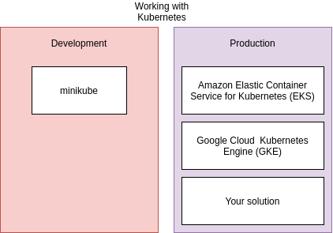


```console
minikube start
minikube status
kubectl cluster-info
```


### Object Types and API Versions.


**client-pod.yaml**

```yaml
apiVersion: v1
kind: Pod
metadata:
  name: client-pod
  labels:
    component: web
spec:
  containers:
    - name: client
      image: [:secure:]/multi-client
      ports:
        - containerPort: 3000
```

**client-node-port.yaml**

```yaml
apiVersion: v1
kind: Service
metadata:
  name: client-node-port
spec:
  type: NodePort
  ports:
    - ports: 3050
      targetPort: 3000
      nodePort: 31515
  selector:
    component: web
```

**Config File.**

- **Pod:** Run a container.
- **Service:** Setup networking inside Kubernetes cluster.
- **StatefulSet.**
- **ReplicaController.**


### Pod.

- Node used by Kubernetes to run some number of different objects.
- The smallest thing that we can deploy.
- Can run one or more container inside it.


**Containers related to each other.**


**Object Types.**

- **Pods:** Runs one or more closely related containers.
- **Services:** Sets up **networking** in a Kubernetes Cluster.
    - **ClusterIP.**
    - **NodePort:** Exposes a container to the outside world (for DEV only).
    - **LoadBalancer.**
    - **Ingress.**


**NodePort Service.**


### Connecting to Running containers.

**Feed a config file to kubectl.**

```
kubectl apply -f FILENAME
```

```console
kubectl apply -f client-node-port.yaml
kubectl apply -f client-pod.yaml

# print status of all running pods
kubectl get pods
# NAME         READY   STATUS    RESTARTS   AGE
# client-pod   1/1     Running   0          93s

# print the status of all running services
kubectl get services
# NAME               TYPE        CLUSTER-IP       EXTERNAL-IP   PORT(S)          AGE
# client-node-port   NodePort    10.106.137.174   <none>        3050:31515/TCP   71s
# kubernetes         ClusterIP   10.96.0.1        <none>        443/TCP          29h

# print ip address of minikube vm
minikube ip

# 192.168.99.100:31515
```

### Deployment Process.


### Imperative vs Declarative Deployments.

- Kubernetes is a system to deploy containerized apps.
- **Nodes** are individual machines (or vm's) that run containers.
- **Master** are machines (or vm's) with a set of programs to manage nodes.
- Kubernetes didn't build our images - it got them from somewhere else (DockerHub).
- Kubernetes (the master) decided where to run each container - each node can run a dissimilar set of containers.
- To deploy something, we update the desired state of the master with a config file.
- The master works constantly to meet your desired state.


- **Always use Declarative Approach.**

***

## Maintaining Containers.

**Imperative.**

- Run a command to list out current running pods.
- Run a command to update the current pod to use a new image.

**Declarative.**

- Update our config file that originally created the pod.
- Throw the updated config file into **kubectl**.

**Update existing object.**

```console
kubectl apply -f client-pod.yaml
# pod/client-pod configured

# Get detailed info about object
kubectl describe pod client-pod

kubectl apply -f client-pod.yaml
```

**Limitations in config updates.**

- **Pod Config:**
    - **containers:** Can't be updated.
    - **name:** Can't be updated.
    - **port:** Can't be updated.
    - **image:** Can be updated.


**Object Types.**

- **Pods:** Runs one or more closely related containers.
- **Services:** Sets up networking in a Kubernetes cluster.
- :star: **Deployment:** Maintains a set of identical pods, ensuring that they have the correct config and  that the
  right number exists.

| Pods | Deployment |
|---|---|
| Runs a single set of containers | Runs a set of identical pods (one or more) |
| Good for one-off dev purposes | Monitors the state of each pod, updating as necessary |
| Rarely used directly in production | Good for dev |
| | Good for production |


**Deployment configuration file.**

```yaml
apiVersion: apps/v1
kind: Deployment
metadata:
  name: client-deployment
spec:
  replicas: 1
  selector:
    matchLabels:
      component: web
  template:
    metadata:
      labels:
        component: web
    spec:
      containers:
        - name: client
          image: [:secure:]/multi-client
          ports:
            - containerPort: 3000
```

**Applying a Deployment.**

```console
kubectl get pods
# delete pod
kubectl delete -f client-pod.yaml
kubectl get pods

# apply deployment object
kubectl apply -f client-deployment.yaml
kubectl get pods
kubectl get deployments

minikube ip
# 192.168.99.100:31515

kubectl get pods -o wide

kubectl get deployments
kubectl describe pods
```

**Why use service?**


- Each Pods are identified from ip address.
- How to connect directly to Pod?
- Service looks at Pod that matches it selector and **automatically route traffic over to**.

**Scaling and Changing Deployments.**

- Change replicas in **yaml** file to 5.

```yaml
...
spec:
  replicas: 5
...
```

```console
kubectl apply -f client-deployment.yaml

kubectl get deployments
# NAME                READY   UP-TO-DATE   AVAILABLE   AGE
# client-deployment   4/5     5            4           23m

kubectl get pods
# NAME                                 READY   STATUS    RESTARTS   AGE
# client-deployment-79cb4cc8f5-2ltfj   1/1     Running   0          33s
# client-deployment-79cb4cc8f5-6tdkx   1/1     Running   0          33s
# client-deployment-79cb4cc8f5-8svl2   1/1     Running   0          33s
# client-deployment-79cb4cc8f5-k59kb   1/1     Running   0          2m57s
# client-deployment-79cb4cc8f5-wdv2k   1/1     Running   0          33s
```

### Update Image Version.

- Change deployment to use **multi-client** again.
- Update the **multi-client** image, push to Docker Hub.
- Get the deployment to recreate our Pods with the latest version of **multi-client**.

**Triggering Deployment updates.**

```console
kubectl apply -f client-deployment.yaml
# deployment.apps/client-deployment unchanged
```


**Imperative command to update image.**

- Tag the image with a version number, push to docker hub.

```console
docker build -t [:secure:]/multi-client:v5 .
docker push [:secure:]/multi-client:v5
```

- Run a **kubectl** command forcing the deployment to use the new image version.

```
kubectl set image OBJECT_TYPE/OBJECT_NAME CONTAINER_NAME = NEW_IMAGE_NAME
```

```console
kubectl set image deployment/client-deployment client=[:secure:]/multi-client:v5
kubectl get pods
# test on
# http://192.168.99.100:31515
```

### Reconfiguring docker CLI.


**Configure the VM to use your docker server.**

```console
eval $(minikube docker-env)
```

**This only configures current terminal window.**

```console
minikube docker-env
```

**Why use docker in Node.**

- Use debugging techniques from Docker CLI - many commands available through **kubectl**.
- Manually kill containers to test Kubernetes ability to **self-heal**.
- Delete a cached image in the node - **docker system prune -a**.

```console
# see logs/shell to console using docker cli
docker logs CONTAINER_ID
docker exec -it CONTAINER_ID sh

# see logs/shell to console using kubectl
> kubectl get pods
# NAME                                 READY   STATUS    RESTARTS   AGE
# client-deployment-ID                 1/1     Running   0          31m

> kubectl logs client-deployment-ID
> kubectl exec -it client-deployment-ID sh
```

***

## Production.


**NodePort vs ClusterIP service**


**NodePort Service (outside world).**

- **port:** Other Pod that needs multi-client Pod.
- **targetPort:** multi-client Pod.
- **nodePort:** Random 30000-32767.

**Applying files with kubectl.**

```console
# delete old deployments
kubectl get deployments
kubectl delete deployment client-deployment
# deployment.apps "client-deployment" deleted

kubectl get deployments
# No resources found in default namespace.

kubectl get services
kubectl delete service client-node-port
# service "client-node-port" deleted

# apply a group of config files
kubectl apply -f k8s
kubectl get pods
kubectl get services
```

**Express API Deployment Config.**


```console
kubectl apply -f k8s
kubectl get pods
kubectl get deployments
kubectl get services

kubectl get pods
kubectl logs SERVER-DEPLOYMENT-ID
```

### Postgres PVC (Persistent Volume Claim).


- Volume on host machine exists outside of host machine.

**Kubernetes Volumes.**

- Volume in generic container terminology.

```
Some type of mechanism that allows a container to access a filesystem outside itself.
```

- Volume in Kubernetes.

```
An object that allows a container to store data at the Pod level.
```


**Kubernetes Volume.**

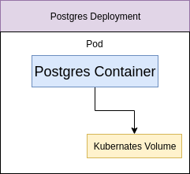

- Volumes tied to Pod.
- If Pod crashes volumes crash as well.
- Not appropriate for storing data.

**Persistent Volume.**


- Long term durable storage not tied to specific Pod or container.
- **Statically Provisioned Persistent Volume:** Persistent Volumes created ahead of time.
- **Dynamically provisioned Persistent Volume:** Persistent Volumes created on fly.
- **Persistent Volume Claim:** Advertisement for storage options.

**Persistence Volume Claim.**

- **Access Modes:**
    - **ReadWriteOnce:** Can be used by a single node.
    - **ReadOnlyMany:** Multiple nodes can read from this.
    - **ReadWriteMany:** Can be read and written by many nodes.
- Allocate Persistent Volume.

```console
kubectl get storageclass
# NAME                 PROVISIONER                RECLAIMPOLICY   VOLUMEBINDINGMODE   ALLOWVOLUMEEXPANSION   AGE
# standard (default)   k8s.io/minikube-hostpath   Delete          Immediate           false                  2d23h

kubectl describe storageclass
```

**On Cloud Provider.**


```console
kubectl apply -f k8s
kubectl get pods

#:q! get persistent volume
kubectl get pv
```

### Setup Environment Variables.

```yaml
spec:
  containers:
    - name: worker
      image: [:secure:]/multi-worker
      env:
        - name: REDIS_HOST
          value: redis-cluster-ip-service
        - name: REDIS_PORT
          value: 6379
```

**(Deployment:multi-worker pod) -- http://redis-cluster-ip-service --> ClusterIP Service (Deployment:Redis pod)**

### Secret.


**Create Secret.**

```
kubectl create secret generic SECRET_NAME --from-literal key=value
```

- **create:** Imperative command to create a new object.
- **secret:** Type of object we are going to create.
- **generic:** Type of secret.
    - tls.
    - docker-registry.
- **SECRET_NAME:** Name of secret, for later reference in a Pod config.
- **--from-literal:** We are going to add the secret info into this command, as opposed to from **.** file.
- **key=value:** Key-value pair of the secret information.

```console
kubectl create secret generic pgpassword --from-literal PGPASSWORD=12345asdf
kubectl get secrets

# NAME                  TYPE                                  DATA   AGE
# default-token-wflvs   kubernetes.io/service-account-token   3      3d5h
# pgpassword            Opaque                                1      22s
```

```yaml
env:
    - name: POSTGRES_PASSWORD
      valueFrom:
        secretKeyRef:
          name: pgpassword
          key: PGPASSWORD
```

### Load Balancer Services.

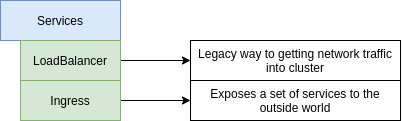

- Load Balancer give access to one set of Pods.

**Ingress.**

- NGINX Ingress.
- **ingress-nginx:** A community project.

**https://github.com/kubernetes/ingress-nginx`**

- **kubernetes-ingress:** A project led by the company nginx.
- Setup of ingress-nginx changes depending on environment (local, GC, AWS, Azure).
- Ingress routing rules to get traffic to services.


- **Ingress Controller:** Watches for changes to the ingress and updates the **thing** that handles traffic.
- **Ingress Config:** Object that has a set of configuration rules describing how traffic should be routed.


**Ingress on Google Cloud.**


- New service **default-backend** pod.
- Health checks make sure cluster is working.

### Setting up Ingress locally.

```console
# for mac
kubectl apply -f https://raw.githubusercontent.com/kubernetes/ingress-nginx/master/deploy/static/mandatory.yaml
minikube addons enable ingress
```


```yaml
spec:
  rules:
    - http:
        paths:
          - path: /
            backend:
              serviceName: client-cluster-ip-service
              servicePort: 3000
          - path: /api/
            backend:
              serviceName: server-cluster-ip-service
              servicePort: 5000
```

```console
minikube ip
kubectl apply -f k8s
```

**minikube Dashboard.**

**http://192.168.99.100**

```console
minikube dashboard
```

***

## Kubernetes Prod Deployment.


### Google Cloud vs AWS for Kubernetes.

**Why Google Cloud?**

- Google created Kubernetes!
- AWS got Kubernetes support.
- Easier to use Kubernetes on Google Cloud.
- A good documentation.

**Travis Deployment.**


### Generating a Service Account.


**Install Ruby in a container.**

```console
docker run -it -v $(pwd):/app ruby:2.4 sh
```

**Install Travis CLI inside container.**

```console
docker run -it -v $(pwd):/app ruby:2.4 sh

gem install travis --no-rdoc --no-ri
gem install travis
travis login
# copy json file form GCP into volumed dir
travis encrypt-file service-account.json -r [:secure:]/multi-k8s
```

### GCP setup.

**.travis.yml**

```yaml
sudo: required
services:
  - docker 
before_install:
  - openssl aes-256-cbc -K $encrypted_HASH_key -iv $encrypted_HASH_iv -in service-account.json.enc -out service-account.json -d
  - curl https://sdk.cloud.google.com | bash > /dev/null;
  - source $HOME/google-cloud-sdk/path.bash.inc
  - gcloud components update kubectl
  - gcloud auth activate-service-account --key-file service-account.json
  - gcloud config set project PROJECT_ID
  - gcloud config set compute/zone PROJECT_ZONE
  - gcloud container clusters get-credentials KUBERNETES_CLUSTER_NAME
```

**Run tests.**

**.travis.yml**

```yaml
  - echo "$DOCKER_PASSWORD" | docker login -u "$DOCKER_USERNAME" --password-stdin
  - docker build -t [:secure:]/react-test -f ./client/Dockerfile.dev ./client
script:
  - docker run -e CI=true [:secure:]/docker-react npm run test
```

**Travis deployment.**

**.travis.yml**

```yaml
deploy:
  provider: script
  script: bash ./deploy.sh
  on:
    branch: master
```

**Update image version.**


**GIT_SHA.**

```console
git rev-parse HEAD
```

```yaml
env:
  global:
    - SHA=$(git rev-parse HEAD)
```

**deploy.sh**

```shell script
docker build -t [:secure:]/multi-client:latest -t [:secure:]/multi-client:$SHA -f ./client/Dockerfile ./client
docker build -t [:secure:]/multi-server:latest -t [:secure:]/multi-server:$SHA -f ./server/Dockerfile ./server
docker build -t [:secure:]/multi-worker:latest -t [:secure:]/multi-worker:$SHA -f ./worker/Dockerfile ./worker
docker push [:secure:]/multi-client:latest
docker push [:secure:]/multi-server:latest
docker push [:secure:]/multi-worker:latest
docker push [:secure:]/multi-client:$SHA
docker push [:secure:]/multi-server:$SHA
docker push [:secure:]/multi-worker:$SHA
kubectl apply -f k8s
kubectl set image deployments/server-deployment server=[:secure:]/multi-server:$SHA
kubectl set image deployments/client-deployment client=[:secure:]/multi-client:$SHA
kubectl set image deployments/worker-deployment worker=[:secure:]/multi-worker:$SHA
```

### GCloud CLI on Cloud Console.

```console
gcloud config set project PROJECT_ID
gcloud config set compute/zone PROJECT_ZONE
gcloud container clusters get-credentials KUBERNETES_CLUSTER_NAME
```

**Creating a Secret on Google Cloud.**

```console
kubectl get pods

# create secret
kubectl create secret generic pgpassword --from-literal PGPASSWORD=mypgpassword123
```

**Helm setup.**

- Helm program to administrate third party software inside Kubernetes cluster.
- Tiller Pod inside Kubernetes to make configurations.

### Kubernetes Security with RBAC.

**Role Based Access Control (RBAC).**

- Limits who can access and modify objects in our cluster.
- Enabled on Google Cloud by default.
- Tiller wants to make changes to our cluster, so it needs to get some permissions set.

**Terminology.**

- **User Accounts:** Identifies a person administering our cluster.
- **Service Accounts:** Identifies a **Pod** administering a cluster.
- **ClusterRoleBinding:** Authorizes an account to do a certain set of actions across the entire cluster.
- **RoleBinding:** Authorizes an account to do a certain set of actions in a single namespace.

```console
kubectl get namespaces
# NAME              STATUS   AGE
# default           Active   165m
# kube-node-lease   Active   165m
# kube-public       Active   165m
# kube-system       Active   165m
```

**Assigning Tiller a Service Account.**

```console
# Create a new service account called tiller in the kube-system namespace
kubectl create serviceaccount --namespace kube-system tiller

# Create a new clusterrolebinding with the role 'cluster-admin' and assign it to service account 'tiller'
kubectl create clusterrolebinding tiller-cluster-role --clusterrole=cluster-admin --serviceaccount=kube-system:tiller

# init helm
helm init --service-account tiller --upgrade
```

### Ingress-NGINX with Helm.

```console
helm install stable/nginx-ingress --name my-nginx --set rbac.create=true
```

**A workflow for changing in Prod.**


```console
git checkout -b dev
```

## HTTPS setup with Kubernetes.

### Cert manager.


**issuer.yaml**

```yaml
apiVersion: certmanager.k8s.io/v1alpha1
kind: ClusterIssuer
metadata:
  name: letsencrypt-prod
spec:
  acme:
    server: https://acme-v02.api.letsencrypt.org/directory
    email: ''
    privateKeySecretRef:
     name: letsencrypt-prod
    http01: {}
```

**certificate.yaml**

```yaml
apiVersion: certmanager.k8s.io/v1alpha1
kind: Certificate
metadata:
  name: MY-DOMAIN-NAME-tls
spec:
  secretName: MY-DOMAIN-NAME
  issuerRef:
    name: letsencrypt-prod
    kind: ClusterIssuer
  commonName: MY_DOMAIN_NAME
  dnsNames:
    - MY_DOMAIN_NAME
    - www.MY_DOMAIN_NAME
  acme:
    config:
      - http01:
          ingressClass: nginx
        domains:
          - MY_DOMAIN_NAME
          - www.MY_DOMAIN_NAME
```

```console
kubectl get certificates
kubectl describe certificates 
```

### Ingress Config for HTTPS.

**ingress-service.yaml**

```yaml
    certmanager.k8s.io/cluster-issuer: 'letsencrypt-prod'
    nginx.ingress.kubernetes.io/ssl-redirect: 'true'
spec:
  tls:
    - hosts:
      - MY_DOMAIN_NAME
      - www.MY_DOMAIN_NAME
    secretName: MY-DOMAIN-NAME
  rules:
    - host: MY_DOMAIN_NAME
```

## Development with Skaffold.


**skaffold.yaml**

```yaml
apiVersion: skaffold/v1beta2
kind: Config
build:
  local:
    push: false
  artifacts:
    - image: [:secure:]/multi-client
      context: client
      docker:
        dockerfile: Dockerfile.dev
      sync:
        '**/*.js': .
        '**/*.css': .
        '**/*.html': .
    - image: [:secure:]/multi-server
      context: server
      docker:
        dockerfile: Dockerfile.dev
      sync:
        '**/*.js': .
    - image: [:secure:]/multi-worker
      context: worker
      docker:
        dockerfile: Dockerfile.dev
      sync:
        '**/*.js': .
deploy:
  kubectl:
    manifests:
      - k8s/client-deployment.yaml
      - k8s/server-deployment.yaml
      - k8s/worker-deployment.yaml
      - k8s/server-cluster-ip-service.yaml
      - k8s/client-cluster-ip-service.yaml
```

```console
skaffold dev
```

***

# GCP

## GCP Intro.

### GCP Context.

- Amazon Web Services (AWS) is the far-and-away market leader.

**Innovation.**

- Google is all about Big Data; huge scales.
- Lots of internal innovation.
- Published many white papers:
    - MapReduce, Google File System, Colossus.
- Released some things as open source:
    - Kubernetes (from Borg).
- Commercialized some things in GCP:
    - BigTable, Spanner, GCS (build on Colossus), BigQuery (from Dremel).

**Google Organization.**

- Google hires Site Reliability Engineers (SREs), not Operations people.
- GCP was built from dev towards ops/infra.
- AWS was built from infra/ops towards dev.

**History of GCP.**

- Grew some services internally:
    - Built by Googlers for Google.
    - Not originally for Enterprise.
- Purchased some services:
    - Leaks in abstractions more evident.
- Catch-up to AWS:
    - Some functionality missing.
    - Avoided some mistakes.

### GCP Structure & Design.

**Design Principles.**

- Global.
- Secure.
- Huge scale.
- For developers.

**Global System.**

- GCP is intrinsically global.
- AWS is intrinsically region-scoped.
- **Regional model:**
    - Simplifies data sovereignty.
- **Global model:**
    - Easier to handle latency and failures in global way.
    - Could be more sensitive to **multi-region/global** failure modes.
        - Due to service failures, not underlying hardware issues.

**Physical Infrastructure.**

- vCPU.
- Physical server.
- Rack.
- Data center (building).
- Zone.
- Region.
- Multi-Region.
- Private global network, (connect google global centers).
- **Points to Presence (POPs):** Network edges and CDN locations.
- Global system.

**Network Ingress & Egress.**

- **Normal Network:** Routes via Internet to edge location closest to destination.
- **Google:**
    - Routes so traffic enters from an internet at edge closest to source.
    - Enables very interesting scenarios.
    - Single global IP address can load balance worldwide.
    - Sidesteps many DNS issues.
- Can now opt for **normal** network routing to reduce price (and functionality).

**Pricing.**

- **Provisioned:** Make sure you're ready to handle X.
- **Usage:** Handle whatever I use, and charge me for that.
- **Network traffic:**
    - Free on the way in (ingress).
    - Charges on the way out (egress), by GBs used.
    - Egress to GCP services sometimes free:
        - Depends on the destination service.
        - Depends on the location of that service.

**Security.**

- Separation of duties and physical security.
- Absolutely everything always encrypted at rest.
- Strong key and identity management.
- **Network encryption:**
    - All control info encrypted.
    - All WAN traffic to be encrypted automatically.
    - Moving towards encrypting all local traffic within data centers.
- Distrust the network, anyway - BeyondCorp.

**Scale and Automation.**

- Scalability must be unbounded.
- Developers don't want to answer pages.

**Resource Quotas (Soft Limits).**

- **Scope:**
    - Regional.
    - Global.
- **Changes:**
    - Automatic.
    - By request:
        - Response in 24-48h.
        - May be refused.
- **Queryable:**
    - `gcloud compute project-info describe --project MY_PROJECT_ID`.

**Organization.**

- Projects are similar to AWS accounts.
- Projects own resources.
- Resources can be shared with other projects.
- Projects can be grouped and controlled in a hierarchy.

**Key Building Blocks.**

- **Compute Products:**
    - **Compute Engine:** Virtual Machine, Disks, Network.
    - **Cloud Functions:** Event-driven serverless functions.
    - **Kubernetes Engine:** Managed Kubernetes/Containers.
- **Storage Products:**
    - **Cloud Storage:** Object Storage and Serving.
    - **Nearline:** Archival Occasional Access Storage.
    - **Coldline:** Archival Rare Access Storage.
    - **Persistent Disk:** VM-attached Disks.
    - **Cloud Filestore:** Managed NFS Server.
- **AI and Machine Learning Products:**
    - **Cloud TPU:** Specialized Hardware for ML.
    - **Cloud Translation API:** Language Detection and Translation.
    - **Cloud Video Intelligence:** Scene-level Video Annotation.
    - **Cloud Vision API:** Image Recognition and Classification.
    - **Cloud Natural Language:** Text Parsing and Analysis.
    - **Cloud Speech-To-Text:** Convert Audio to Text.
    - **Cloud Text-To-Speech:** Convert Text to Audio.
    - **Cloud Machine Learning Engine:** Managed Platform for ML.
    - **Cloud Deep Learning VM Image:** Preconfigured VMs for deep learning.
    - **Cloud AutoML Natural Language:** Custom text classification models.
    - **Cloud AutoML Translate:** Custom domain-specific translation.
    - **Cloud AutoML Vision:** Custom image classification models.
- **Databases Products:**
    - **Cloud SQL:** Managed MySQL and PostgreSQL.
    - **Cloud Spanner:** Horizontally Scalable Relational DB.
    - **Cloud Firestore:** Strongly-consistent Serverless Document DB.
    - **Cloud Datastore:** Horizontally Scalable Document DB.
    - **Cloud Bigtable:** Petabyte-scale, low-latency non-relational.
- **Data and Analytics Products:**
    - **Cloud Dataflow:** Stream/batch data processing.
    - **Cloud Dataproc:** Managed Spark and Hadoop.
    - **Google Genomics:** Managed Genomics Platform.
    - **Cloud Pub/Sub:** Global Real-time Messaging.
    - **Google BigQuery:** Data Warehouse/Analytics.
- **Networking Products:**
    - **Virtual Private Cloud:** Software Defined Network.
    - **Dedicated Interconnect:** Dedicated private network connection.
    - **Cloud NAT:** Network Address Translation Service.
    - **Cloud Load Balancing:** Multi-region Load Distribution.
    - **Network Service Tiers:** Price vs Performance Tiers.
    - **Cloud Armor:** DDos Protection and WAF (Web Application Firewall).
    - **Cloud CDN:** Content Delivery Network.
    - **Cloud DNS:** Programmable DNS Serving.
- **Management Tools Products:**
    - **Stackdriver Debugger:** Live Production Debugger.
    - **Stackdrive Error Reporting:** App Error Reporting.
    - **Stackdriver Logging:** Centralized Logging.
    - **Stackdriver Monitoring:** Infrastructure and Application Monitoring.
    - **Stackdriver Profiler:** CPU and Heap profiling.
    - **Stackdriver Transparent SLIs:** Monitor GCP Services.
    - **Stackdriver Trace:** App Performance Insights.
- **Identity and Security Products:**
    - **Cloud Identity:** Manage Users, Devices & Apps.
    - **Cloud IAM:** Resource Access Control.
    - **Cloud HSM:** Hardware Security Module Service.
    - **Cloud Data Loss Prevention API:** Classify, Redact Sensitive Data.

***

## GCP Account.

**Free Trial Restrictions.**

- No more than 8 vCPU (total simultaneous).
- No GPUs (video card chips).
- No TPUs (custom chips for TensorFlow).
- No Quota increases.
- No crypto mining allowed.
- No SLAs (Service Layer Agreement).
- No premium OS licenses (e.g. Windows).
- No Cloud Launcher products with extra usage fees.

**Always Free.**

- Free usage does not count against your free trial credits.
- Last beyond end of free trial.
- 24/day of **f1-micro** runtime, in most US regions, only.
- 28h/day of App Engine runtime, in North America.
- 2M/month of Cloud Functions invocations (with runtime/size limits).

**Always Free - Storage Highlights.**

- Storage averaged over month.
- 5 GB of Regional Cloud Storage, including some operations.
- 1 GB of Cloud Datastore storage, including some operations.
- 10 GB of BigQuery storage, with 1 TB/month of query processing.
- 30 GB HDD storage on GCE and AE.
- 5 GB snapshot storage on GCE and AE.
- 5 GB of StackDriver logs with 7 day retention.

**Always Free - Networking Highlights.**

- Egress to China and Australia not free!
- 1 GB/month of App Engine data egress.
- 1 GB/month of Compute Engine data egress.
- 5 GB/month of egress by Cloud Function invocations.
- 5 GB/month of egress from Cloud Storage based in North America.
- 10 GB/month of Cloud PubSub messages.

**Always Free - Other.**

- 120 build-minutes/day of Google Cloud Container Builder.
- 60 minutes/month of Google Cloud Speech API recognition from audio/video.
- 1000 units/month of Cloud Vision API calls.
- 5000 units/month Google Cloud Natural Language API.
- Google Cloud Shell with 5 GB of persistent disk storage quota.
- 1 GB of Google Cloud Source Repositories private hosting.

**Least Privilege.**

```
Every program and every privileged user of the system should operate using the least amount of privilege
necessary to complete the job.
```

- Very Bad Habit to run with admin for normal activities.
- Admin account with billing access very rarely needed.

**Incognito Mode.**

- Called **Incognito Window** in Chrome.
- Called **Private Browsing** in Firefox.

**Billing Export.**

```
Tools for monitoring, analyzing and optimizing cost have become an important part of managing development. 
Billing export to BigQuery enables you to export your daily usage and cost estimates automatically throughout the day
to a BigQuery dataset you specify. You can then access your billing data from BigQuery.
```

**Recap.**

- Export must be set up per billing account.
- Resources should be placed into appropriate projects.
- Resources should be tagged with labels.
- Billing exports is not real-time, Delay is hours.

### Billing Alerts.

```
To help you with project planning and controlling costs, you can set a budget. Setting a budget lets you track
how your spend is growing toward that amount.

You can apply a budget to either a billing account or a project, and you can set the budget at a specific amount
or match it to the previous month's spend. You can also create alerts to notify billing administrators when
spending exceeds a percentage of your budget.
```

**Billing IAM.**

- **Role:** Billing Account User.
- **Purpose:** Link projects to billing accounts.
- **Level:** Organization or billing account.
- **Use Case:**
    - This role has very restricted permissions, so you can grant it broadly, typically in combination with Project Creator.
    - These two roles allow a user to create new projects linked to the billing account on which the role granted.

***

## Cloud Shell and Data Flow.

### Cloud Shell and Editor.

```
Google Cloud Shell provides you with command-line access to your cloud resources directly from your browser.
You can easily manage your projects and resources without having to install the Google Cloud SDK or other
tools on your system. With Cloud Shell, the Cloud SDK gcloud command-line tool and other utilities you need
are always available, up to data and fully authenticated when you need.
```

**Highlights.**

- **Web browser access:**
    - No need for local terminal:
        - Chromebook.
        - No PuTTY!
    - Automatic SSH key management.
- 5 GB of persistent storage.
- Easy-access to pre-installed tools.
    - **gcloud, bq, kubectl, docker, npm/node, pip/python, ruby, vim, emacs, bash, etc.**
- Pre-authorized and always up-to-date.
- Web preview of web app running on local port.

**Cloud shell.**

- `gcloud config set project`: Change to different project.

```console
pwd
> /home/matn7

cd ~

cat README-cloudshell.txt
# download file
dl README-cloudshell.txt

# Run on cloud localhost
node hello.js
# > Web Preview > Preview on port 8080
nodemon hello.js
```

### Data Flow.

- Data Flows are Everything.
- Learn to identify and control data flow.

**Three core concepts (MPR).**

- **Moving:** Network.
- **Processing:** Compute.
- **Remembering:** Storage.

**Mental Models.**

- A simplified representation of reality.
- Used to anticipate events or draw conclusions.
- **Systems combine:**
    - Build larger systems out of smaller ones (abstractions).
    - Zooming in and out.

**Key Takeaways.**

- Data flows are the foundation of every system.
- **Moving, Processing, Remembering:**
    - Not just Network, Compute, Storage.
- **Build mental models:**
    - Helps you make predictions.
- **Identify and think through data flows:**
    - Highlight potential issues.
- Requirements and options not always clear.

### Google Cloud Storage.

```console
gsutil mv -p gs://storage-lab-console-panda/README-cloudshell.txt gs://storage-lab-console-panda/README-cloudshell.txt
```

**Google Cloud storage via command line.**

```console
gcloud config list
```

- `gsutil`: Command line tool to connect to **Google Cloud Storage (GCS)**.

```console
gsutil ls
gsutil ls gs://storage-lab

# create bucket
gsutil mb --help
gsutil mb -l northamerics-northeast1 gs://storage-lab-cli

# labels
gsutil label get gs://storage-lab-console/ > bucketlabels.json
# change label
gsutil label ch -l "extralabel:extravalue" gs://storage-lab-cli

gsutil versioning get gs://storage-lab-cli/
gsutil versioning set on gs://storage-lab-cli/
gsutil ls gs://storage-lab-cli/

# copy to other bucket
gsutil cp README.txt gs://storage-lab-cli/

# info about object versioning
gsutil ls -a gs://storage-lab-cli/

# remove
gsutil rm gs://storage-lab-cli/README.md

# copy from bucket to bucket
gsutil cp gs://storage-lab-console/** gs://storage-lab-cli/
gsutil ls gs://storage-lab-cli/

# share object
gsutil acl ch -u AllUsers:R gs://storage-lab-cli/Selfie.jpg
```

**Google Compute Engine Setup.**

```console
# check project
gcloud config get-value project

# check running vms (Compute Engine API)
gcloud compute instances list
gcloud services list
gcloud services list -h
gcloud services list --enabled
gcloud services list --available | grep compute
gcloud services list

# create vm
gcloud compute instances create MY_VM

# delete vm
gcloud compute instances delete MY_VM

gcloud compute instances list
```

**Rundown on gcloud.**

- Command-line tool to interact with GCP.
- Best friends with `gsutil` and `bq`:
    - All share same configuration set via `gcloud config`.
    - `gsutil`could have been `gcloud storage`.
    - `bq` could have been `gcloud bigquery`.
- In general, more powerful than console but less powerful than REST API.
- Alpha and Beta versions available via `gcloud alpha` and `gcloud beta`:
    - `gcloud beta billing accounts list`.
    - `gcloud beta billing projects link MY_PROJECT --billing-account 0X0X0X-0X0X0X-0X0X0X`.

**Basic Syntax`**

```
gcloud GLOBAL_FLAGS SERVICE/PRODUCT GROUP/AREA COMMAND FLAGS PARAMETERS
```

- Always drill down (from left to right).
- **Examples:**
    - `gcloud --project MY_PROJECT compute instances list`.
    - `gcloud --project=MY_PROJECT compute instances list`.
    - `gcloud compute instances create MY_VM`.
    - `gcloud services list --available`.
    - `gsutil ls`.
    - `gsutil mb -l northamerica-northeast1 gs://storage-lab-cli`.
    - `gsutil label set bucketlabels.json gs://storage-lab-cli/`.

**Global Flags.**

- `--help`.
- `-h`.
- `--project PROJECT_ID`.
- `--account ACCOUNT`.
- `--filter`:
    - Not always available, but often better than using grep.
- `--format`:
    - Can choose JSON, YAML, CSV, etc.
    - Can pipe `|` JSON to `jq` command for further processing.
- `--quiet (or -q)` no prompt to confirm actions.

**Config Properties.**

- Values entered once and used by any command that needs them.
- Can be overridden on a specific command with corresponding flag.
- Used very often for account, project, region and zone:
    - Set **core/account** or **account** to replace **--account**.
    - Set **core/project** or **project** to replace **--project**.
    - Set **compute/region** to replace **--region**.
    - Set **compute/zone** to replace **--zone**.
- Set with: `gcloud config set PROPERTY VALUE`.
- Check with: `gcloud config get-value PROPERTY`.
- Clear with: `gcloud config unset PROPERTY`.

**Configurations.**

- Can maintain groups of settings and switch between them.
- Most useful when using multiple projects.
- An interactive workflow to set common properties in a config with: `gcloud init`.
- List all properties in a configuration with: `gcloud config list`.
- List all configurations with: `gcloud config configurations list`:
    - **IS_ACTIVE** columns shows which one currently used.
    - Other columns list account, project, region, zone and the name of the config.
- Make a new config with: `gcloud config configurations create ITS_NAME`.
- Start using config with: `gcloud config configurations activate ITS_NAME`:
    - Or use for just one command with: `--configuration=ITS_NAME`.

**Configurations Analogy.**

| Action          | Directory    | Configuration                                   |
|-----------------|--------------|-------------------------------------------------|
| Make New        | mkdir newdir | gcloud config configurations create newconfig   |
| Switch To       | cd newdir    | gcloud config configurations activate newconfig |
| List Contents   | ls           | gcloud config list                              |
| List Non-Active | ls ~/newdir  | gcloud --configuration=newconfig config list    |
|                 |              | gcloud config configurations describe newconfig |


**In out.**

```console
# ip address sees us connecting from
curl api.ipify.org

gcloud compute instances list

# --- create vm ---
gcloud compute instances create myhappyvm

gcloud compute machine-types list
gcloud topic filter
gcloud compute machine-types list --filter="NAME:f1-micro AND ZONE~us-west"

# set default zone and region
gcloud config set compute/zone us-west2-b
gcloud config set compute/region us-west2

gcloud compute instances create --machine-type=f1-micro myhappyvm

# --- connect to machine ---
ping -c 3 myhappyvm
ping -c 3 EXTERNAL_IP

ssh EXTERNAL_IP
gcloud compute ssh myhappyvm

curl metadata.google.internal/computeMetadata/v1/
curl -H "Metadata-Flavor:Google"  metadata.google.internal/computeMetadata/v1/
curl -H "Metadata-Flavor:Google"  metadata.google.internal/computeMetadata/v1/project/project-id

# ssh public key
curl -H "Metadata-Flavor:Google"  metadata.google.internal/computeMetadata/v1/project/attributes/ssh-keys

gsutil ls

# delete vm
# log off from myhappyvm
exit
gcloud compute instances delete myhappyvm
gcloud compute instances list
```

***

## Security.

```
Ensuring proper data flow.
```

### Proper data flow (CIA)?

- **Confidentiality:** You cannot view data you shouldn't.
- **Integrity:** You cannot change data you shouldn't.
- **Availability:** You can access data you should.

### CIA Data flow example.

**How do we control data flow? (AAA)**

- **Authentication:** Who are you?
- **Authorization:** What are you allowed to do?
- **Accounting:** What did you do?
- **Resiliency: Keep it running**.

```
AuthN
AuthZ
ACC
```

### What enables security in GCP?

- Security Products.
- Security Features.
- Security Mindset:
    - Includes Availability Mindset.

**Key Security Mindset (Principles).**

- The least privilege.
- Defense in depth.
- Fail securely.
- OWASPs **Security by Design** Principles.

**Key Security Products/Features - AuthN.**

- **Identity:**
    - Humans in G Suite, Cloud Identity.
    - Applications & services use Service Accounts.
- **Identity hierarchy:**
    - Google Groups.
- Can use Google Cloud Directory Sync (GCDS) to pull from LDAP (no push).

**Key Security Products/Features - AuthZ.**

- Identity hierarchy (Google Groups).
- Resource hierarchy (Organization, Folders, Projects).
- **Identity and Access Management (IAM):**
    - Permissions.
    - Roles.
    - Bindings.
- GCS ACLs (Access Control Lists).
- Billing management.
- Networking structure & restrictions.

**Key Security Products/Features - Acct.**

- Audit / Activity Logs (provided by Stackdriver).
- **Billing export:**
    - To BigQuery.
    - To file (in GCS bucket):
        - JSON or CSV.
- GCS Object Lifecycle Management.

### Identity and Access Management (IAM).

**Resource Hierarchy.**

- **Resource:** Something you create in GCP.
- **Project:** Container for a set of related resources.
- **Folder:** Contains any number of Projects and Subfolders.
- **Organization:** Tied to G Suite or Cloud Identity domain.

### IAM - Permissions & .

**Permissions.**

- A Permission allows you to perform a certain action.
- Each one follows the form **Service.Resource.Verb**.
- Usually correspond to REST API methods.
- Example:
    - **pubsub.subscription.consume**.
    - **pubsub.topics.publish**.

**Roles.**

- A Role is a collection of Permissions to use or manage GCP resources.
- **Primitive Roles:** Project-level and often too broad.
    - Viewer is read-only.
    - Editor can view and change things.
    - Owner can also control access & billing.
- **Predefined Roles:** Give granular access to specific GCP resources:
    - **roles/bigquery.dataEditor**.
    - **roles/pubsub.subscriber**.
- **Custom Role:** Project or Org-level collection you define of granular permissions.

**Predefined Role App Engine.**

- **roles/appengine.appAdmin**.
- **roles/appengine.serviceAdmin**.
- **roles/appengine.deployer**.
- **roles/appengine.appViewer**.
- **roles/appengine.codeViewer**.

### IAM - Members & Groups.

**Members.**

- A Member is some Google-known identity.
- Each Member is identified by a unique email address.
- Can be:
    - **user:** Specific Google account:
        - G Suite, Cloud Identity, Gmail, or validated email.
    - **serviceAccount:** Service accounts for apps/services.
    - **group:** Google group of users and service accounts.
    - **domain:** Whole domain managed by G Suite or Cloud Identity.
    - **allAuthenticatedUsers:** Any Google account or service account.
    - **allUsers:** Anyone on the Internet (Public).

**Groups.**

- A Google group is a named collection of Google accounts and service accounts.
- Every group has a unique email address this is associated with the group.
- **You never act as the group:**
    - Membership in a group can grant capabilities to individuals.
- Use them for everything!
- Can be used for an owner when within an organization.
- **Can nest groups in an organization:**
    - One group for each department, all those in group for all staff.

### IAM - Policies.

**Policies.**

- A Policy binds Members to Roles for some scope of Resources.
- Answers, who can do what to which thing(s)?
- Attached to some level in the Resource Hierarchy:
    - Organization, Folder, Project, Resource.
- Roles and Members listed in policy, but Resources identified by attachment.
- Always additive **Allow** and never subtractive (no **Deny**):
    - Child policies cannot restrict access granted at a higher level.

```json
{
    "bindings": [
        {
            "role": "roles/owner",
            "members": ["user:non@example.com"]
        },
        {
            "role": "roles/compute.networkViewer",
            "members": [
                "user:maki@example.com",
                "group:admins@example.com",
                "domain:example2.com",
                "serviceAccount:my-app@appspot.gserviceaccount.com"
            ]
        }
    ]
}
```

- One policy per resource.
- Max 1500 member bindings per policy:
    - Use groups, instead!!!
- You should use groups!
- Usually takes less than 60s to apply changes (both granting and revoking).
- May take up to 7 minutes for ... changes to fully propagate across the system.

**Managing Policy Bindings.**

- Can use **get-iam-policy**, edit the JSON/YAML, and **set-iam-policy** back (But don't! use commands).
- `gcloud [GROUP] add-iam-policy-binding [RESOURCE-NAME] --role [ROLE-ID-TO-GRANT] --member user:[USER-EMAIL]`.
- `gcloud [GROUP] remove-iam-policy-binding [RESOURCE-NAME] --role [ROLE-ID-TO-REVOKE] --member user:[USER-EMAIL]`.
- Atomic operations are better because changes:
    - Are simpler, less work, and less error-prone (then editing JSON/YAML).
    - Avoid race conditions, so can happen simultaneously.

```console
gcloud beta compute instances add-iam-policy-binding myhappyvm --role roles/compute.instanceAdmin
--member user:me@example.com
```

**Wrap up.**

- A Permission allows you to perform a certain action **Service.Resource.Verb**.
- A Role is a collection of Permissions to use or manage GCP resources:
    - Primitive Roles are Owner, Editor, Viewer.
    - Predefined Roles give granular access to specific GCP resources (IAM).
    - Custom Roles let you define your own granular permissions.
- A Member is some Google account identity tied to an email address.
- A Policy binds Members to Roles for some scope of Resources:
    - Answering, who can do what to which thing(s)?
- Prefer **add-iam-policy-binding** & **remove-iam-policy-binding**, over **get-iam-policy**, edit, then **set-iam-policy**.

### Billing Access Control.

**Billing Accounts.**

- A Billing Account represents some way to pay for GCP service usage.
- Type of Resource that lives outside of Projects.
- Can belong to an Organization (i.e. be owned by it):
    - Inherits Org-level IAM policies.
- Can be linked to projects:
    - Does not own them.
    - No impact on project IAM.

**Billing Account User.**

- **Role:** Billing Account User.
- **Purpose:** Link projects to billing accounts.
- **Level:** Organization or billing account.

**Billing IAM Roles.**

- Billing Account Creator.
- Billing Account Administrator.
- Billing Account User.
- Billing Account Viewer.
- Project Billing Manager.

**Monthly Invoiced Billing.**

- Get billed monthly and pay by an invoice due date.
- Can pay via check or write transfer.
- Can increase project and quota limits.
- Billing administrator of org's current billing account contacts Cloud Billing Support:
    - To determine eligibility.
    - To apply to switch to monthly invoicing.
- Eligibility depends on:
    - Account age.
    - Typical monthly spend.
    - Country.

***

## Networking.

- Software-Defined Networking (SDN).
- More general than the OSI 7-layer model of networking.
- Routing is about deciding where data should go next:
    - Many local decisions, no full map or path.
- Where routing happen:
    - On the way to Google's network.
    - On the way to the right resource.
    - On the way from one resource to another.
    - There and Back Again.

### Routing: to Google's Network.

### Routing: To the Right Resource.

- **Latency reduction:**
    - Use servers physically close to clients.
- **Load balancing:**
    - Separate from auto-scaling.
- **System design:**
    - Different servers may handle different parts of the system.
    - Especially when using micro-services (instead of a monolith).
- Cross-Region Load Balancing (with Global Anycast IPs).
- Cloud Load Balancer (internal and external).
- HTTP(S) Load Balancer (with URL Map).

**Unicast vs Anycast.**

- **Unicast:** There is only one unique device in the world that can handle this; send it there.
- **Anycast:** There are multiple devices that could handle this; send it to any one - but ideally the closest.

**Layer 4 vs Layer 7.**

- TCP (of TCP/IP) is usually called Layer 4 (L4):
    - It works solely with IP addresses.
- HTTP and HTTPS work at Layer 7 (L7):
    - These know about URLs and paths.
- Each layer is built on the one below it.
- Therefore:
    - To route based on URL paths, routing needs to understand L7.
    - L4 cannot route based on the URL paths defined in L7.

**DNS.**

- Name resolution (via the **Domain Name System**) can be the first step in routing:
    - **Layer 4:** Cannot route **L4** based on **L7's** URL paths.
    - **Chunky:** DNS queries often cached and reused for huge client sets.
    - **Sticky:** DNS lookup **locks on** and refreshing per request has high cost.
        - Extra latency because each request includes another round-trip!
        - More money for additional DNS request processing.
    - **Not Robust:** Relies on the client always doing the right thing (they don't).
- A **Premium Tier** **cold potato** routing with global Anycast IPs avoids these problems.

### Routing: Among Resources (VPC).

**Getting data from one resource to another.**

- VPC (global) is Virtual Private Cloud, your private SDN space in GCP:
    - Not just resource-to-resource - Also manages the doors to outside & peers.
- Subnets (regional) create logical spaces to contain resources:
    - All Subnets can reach all others - globally, without any need for VPNs.
- Routes (global) define "next hop" for traffic based on destination IP:
    - Routes are global and apply by Instance-level Tags, not by Subnet.
    - No route to the internet gateway means no such data can flow.
- Firewall Rules (global) further filter data flow that would otherwise route:
    - All Firewall Rules are global and apply by Instance-level Tags or Service Acct.
    - Default Firewall Rules are restrictive inbound and permissive outbound.

**IPs and CIDRs.**

- IP address is **abc.def.ghi.jkl** (dotted quad) where each piece is **0-255**.
- CIDR block is group of IP addresses specified in `IP/xy` notation:
    - Turn IP address into 32-bit binary number:
        - **10.10.0.254 --> 00001010 00001010 000000000 11111110**.
    - **/xy**: In CIDR notation locks highest (leftmost) bits in IP address (0-32).
    - **abc.def.ghi.jkl/32**: Is single IP address because all 32 bits are locked.
    - **abc.def.ghi.jkl/24**: Is 256 IP addresses because last 8 bits (jkl) can vary.
    - **0.0.0.0/0** means "any IP address" because no bits are locked.
- RFC1918 defines private (i.e. non-Internet) address ranges you can use:
    - **10.0.0.0/8**, **172.16.0.0/12**, and **192.168.0.0/16**.

***

## Kubernetes.

**Kubernetes Objects.**

- **pod:** Wrap one or more containers.
- **deploy:** Scalability and application releases.
- **ds:** One Pod per node.
- **sts:** Stateful app components.

### Networking.

- All Nodes can talk.
- All Pods can talk (No NAT).
- Every Pod gets its own IP.

**Kubernetes Services.**

- **ClusterIP:**
    - Gets own IP.
    - Only accessible from within a cluster.
- **NodePort:**
    - Gets cluster-wide port.
    - Accessible from outside of cluster.
- **LoadBalancer:**
    - Integrates with public cloud platform.

**Service Network.**

```console
kubectl get nodes
kubectl apply -f ping-deploy.yml
kubectl get deploy
kubectl get pods -o wide
```

**Node Network.**

- All nodes need to be able to talk:
    - Kubelet <--> API Server.
    - Pod network ports.
- Not implemented by Kubernetes.

**Pod Network.**

- Implemented via CNI plugins.
- Big & Flat.
- IP-per-Pod.
- All Pods can communicate.

**The Service Network.**

- It's not really a network.

```console
kubectl describe svc nginx-service
ipvsadm -ln
```

- Kube-proxy in IPVS mode does create dummy interfaces on the Service Network (usually called kube-ipvs0).
  Kube-proxy in IPTABLES mode does not.

### Storage in Kubernetes.

- **Kubernetes Volumes:** All about decoupling storage from Pods.

**Volumes.**

- LUNs, devices, shares, mounts, spaces.
- Storage is Vital!
- **File & Block** First-class Citizens in Kubernetes:
    - Standard-based.
    - Pluggable backend.
    - Rich API.
- Fundamental storage requirements:
    - Storage Backend:
        - Speed.
        - Replicated.
        - Resiliency.
        - ...

| Volume                | Ticker  | Details          |
|-----------------------|---------|------------------|
| PersistentVolume      | PV      | Storage: 20GB    |
| PersistentVolumeClaim | PVC     | Ticket to use PV |
| StorageClass          | SC      | Makes it dynamic |

### Container Storage Interface (CSI).

**The K8s PersistentVolume Subsystem.**

```
PV  <----- Claim -----> PVC

Size: 30GB
IOPS: 60
```

**Dynamic Provisioning with StorageClasses.**

```yml
kind: StorageClass
apiVersion: storage.k8s.io/v1
metadata:
    name: sc-fast
provisioner: kubernetes.io/aws-ebs
parameters:
    type: gp2
reclaimPolicy: Retain
```

### Kubernetes Security.

**RBAC and Admission Control.**


- Some clusters open an insecure local port!
- Bypasses **authN** and **authZ**!
- Disable for production!

**RBAC.**

- Enabled since 1.6.
- GA since 1.8.
- Deny-by-default.

**Authentication (authN).**


- Kubernetes does NOT do Users!!
- Manage Users externally:
    - Active Directory.
    - IAM.
    - Other...


- **Service Accounts:**
    - For System components.
    - Managed by Kubernetes.
    - You can (should) manage them.

**Authorization (authZ).**

- Who can perform which actions on which resources?
- Who - **Subject**.
- Actions - **Verb**.
- Powerful default users, too powerful for production.
- **Roles & RoleBindings:** For least privilege.

**RBAC Role.**

```yml
kind: Role | ClusterRole
apiVersion: rbac.authorization.k8s.io/v1
metadata:
  name: argrbac
  namespace: acg
rules:
- apiGroups: [""]
  resources: ["pods"]
  verbs: ["get", "list", "watch"]
```

**RBAC RoleBinding.**

```yml
kind: RoleBinding | ClusterRoleBinding
apiVersion: rbac.authorization.k8s.io/v1
metadata:
  name: argrbac
  namespace: acg
subjects:
- kind: User
  name: panda@panda.com
  apiGroup: ""
roleRef:
  kind: Role
  name: acgrbac
  apiGroup: ""
```

**Admission Control.**

- **Admission Control:**
    - Policy enforcement.
    - **Webhooks:** External admission controller.

```console
openssl genrsa -out mia.key 2048
openssl req -new -key  mia.key -out mia.csr -subj "/CN=mia/O=acg"

openssl x509 -req -in mia.csr -CA /home/ubuntu/ca/ca.cert -CAkey \
 /home/ubuntu/ca/ca.key -CAcreateserial -out mia.crt -days 365
```

- We got **mia.crt** certificate.

```console
kubectl config set-credentials mia --client-certificate=/home/ubuntu/mia.crt --client-key=/home/ubuntu/mia.key
kubectl config set-context mia --cluster=acg.k8s.local --namespace=acg --user=mia
kubectl get pods --namespace=acg
```

**yml / role.yml**

```yml
kind: ClusterRole
apiVersion: rbac.authorization.k8s.io/v1
metadata:
  name: acgrbac
rules:
- apiGroups: [""]
  resources: ["pods"]
  verbs: ["get", "list", "watch"]
```

```console
kubectl apply -f yml/role.yml
```

**yml / rolebinding.yml**

```yml
kind: RoleBinding
apiVersion: rbac.authorization.k8s.io/v1
metadata:
  name: acgrbac
  namespace: acg
subjects:
- kind: User
  name: mia
  apiGroup: ""
roleRef:
  kind: ClusterRole
  name: acgrbac
  apiGroup: ""
```

```console
kubectl apply -f yml/rolebinding.yml
kubectl config current-context
kubectl get pods --namespace=acg
```

- **Request:**
    - API Group: apps/v1.
    - Subject: mia.
    - Verb: create (HTTP POST method).
    - Resource: Deployments.
    - Namespace: acg.

### Other Kubernetes.

- DaemonSet.
- StatefulSet.
- Job.
- CronJob.
- PodSecurityPolicy.
- Pod resource requests and limits.
- ResourceQuota.
- CustomResourceDefinition.

### AppEngine.

- The OG: The Original Google cloud service.

### Service Breadth.

**Google Compute Engine (GCE).**

- Fast-booting Virtual Machines (VMs) you can rent, on demand.
- Infrastructure as a Service (IaaS).
- Pick set machine type - standard, highmem, highcpu - or custom CPU/RAM.
- Pay by the second (60 second min.) for CPUs, RAM.
- Automatically cheaper if you keep running it **sustained use discount**.
- Even cheaper for **pre-emptible** or long-term use commitment in a region.
- Can add GPUs and paid OSes for extra cost.
- Live Migration - Google seamlessly moves instance across hosts as needed.

**Google Kubernetes Engine (GKE).**

- Managed Kubernetes cluster for running Docker containers (with auto-scaling).
- Kubernetes DNS on by default for service discovery.
- No IAM integration (unlike AWS's ECS).
- Integrates with Persistent Disk for storage.
- Pay for underlying GCE instances:
    - Production cluster should have 3+ nodes.
- No GKE management fee, no matter how many nodes is cluster.

**App Engine (GAE).**

- Platform as a Service (PaaS) that takes your code and runs it (Elastic Beanstalk, Herooku).
- Much more than just compute - Integrates storage, queues, NoSQL.
- Flex mode **App Engine Flex** can run any container & access VPC.
- Auto-scales based on load:
    - Standard (non-Flex) mode can turn off last instance when no traffic.
- Effectively pay for underlying GCE instances and other services.

**Cloud Functions (GCF).**

- Runs code in response to an event - Node.js, Python, Java, Go.
- Functions as a Service (FaaS), Serverless.
- Pay for CPU and RAM assigned to function, per 100 ms.
- Each function automatically gets an HTTP endpoint.
- Can be triggered by GCS objects, Pub/Sub messages.
- Massively scalable (horizontally) - Runs many copies when needed.
- Often used for chatbots, message processor, IoT, automation.

### Storage.

**Local SSD.**

- Very fast 375GB solid state drives physically attached to the server:
    - EC2 Instance Store Vols.
    - Direct-Attached Storage (DAS).
- Can stripe across eight of them (3TB) for even better performance.
- Data will be lost whenever the instance shuts down:
    - Can survive a Live Migration.
- Like all data at rest, always encrypted.
- Pay by GB-month provisioned.

**Persistent Disk (PD).**

- Flexible, block-based network-attached storage; boot disk for every GCE instance:
    - Elastic Block Storage (EBS).
    - Storage Area Network (SAN).
- Perf scales with volume size; max way below Local SSD, but still plenty fast.
- Persistent disks persist, and are replicated (zone or regional) for durability.
- Can resize while in use (up to 64TB), but will need file system update within VM.
- Snapshots (and machine images) add even more capability and flexibility:
    - **Magical:** Pay for incremental ($ and time), but use/delete like full backups.
- Not file-based NAS, but can mount to multiple instances if all are read-only.
- Pay for GB/mo provisioned depending on perf. class; plus snapshot GB/mo used.

**Cloud Filestore.**

- Fully-managed file-based storage:
    - Elastic File System (EFS).
    - Network-Attached Storage (NAS).
- Predictably fast performance for your file-based workloads.
- Accessible to GCE and GKE through your VPC, via NFSv3 protocol.
- Primary use case is application migration to cloud (**lift and shift**).
- Fully manages file serving, but not backups.
- Pay for provisioned TBs in **Standard** (slow) or **Premium** (fast) mode.
- Minimum provisioned capacity of **1TB** (Standard) or **2.5TB** (Premium).

**Cloud Storage (GCS).**

- Infinitely scalable, fully-managed, versioned and highly-durable object storage:
    - Amazon S3.
- Strongly consistent (even for PUTs and DELETEs).
- Integrated site hosting and CDN functionality.
- Lifecycle transitions across classes:
    - Multi-Regional.
    - Regional.
    - Nearline.
    - Coldline.
    - Differences in cost & availabilities.
- All classes have same API, so can use `gsutil` and `gcsfuse`.
- Pay for data operations & GB-months stored by class.
- **Nearline/Coldline:** Also pay for GBs retrieved - plus early deletion fee if < 30/90 days.

### Databases.

**Cloud SQL.**

- Fully managed and reliable MySQL and PostgreSQL databases:
    - Amazon RDS.
    - Self-Managed MySQL.
- Supports automatic replication, backup, failover.
- Scaling is manual (both vertically and horizontally).
- Effectively pay for underlying GCE instances and PDs:
    - Plus some backed-in service fees.

**Cloud Spanner.**

- The first horizontally scalable, strongly consistent, relational database service:
    - Shared MySQL.
    - CockroachDB.
    - From 1 to hundreds or thousands of nodes.
    - Minimum of 3 nodes is recommended for production environments.
- Chooses Consistency and Partition-Tolerance (CP of CAP theorem).
- But still high Availability:
    - Not based on fail-over.
- Pay for provisioned node time plus used storage-time.

**BigQuery.**

- Serverless column-store data warehouse for analytics using SQL:
    - Amazon Redshift.
- Scales internally, so it **can scan TB in seconds and PB in minutes**.
- Pay for GBs actually considered (scanned) during queries:
    - Attempts to reuse cached results, which are free.
- Pay for data stored (GB-months).
- Pay for GBs added via streaming inserts.

**Cloud BigTable.**

- Low latency & high throughput NoSQL DB for large operational & analytical apps:
    - DynamoDB.
    - Cassandra.
    - Apache HBASE.
- Supports open-source HBase API.
- Integrates with Hadoop, Dataflow, Dataproc.
- Scales seamlessly and unlimitedly:
    - Storage autoscales.
    - Processing nodes must be scaled manually.
- Pay for processing node hours.
- Pay for GB-hours used for storage (cheap HDD or fast SSD).

**Cloud Datastore.**

- Managed & auto-scale NoSQL DB with indexes, queries and ACID trans. support:
    - DynamoDB.
    - MongoDB.
- NoSQL, so queries can get complicated:
    - No joins or aggregates and must line up with indexes.
    - NOT, OR and NOT EQUALS (<>,!=) operations natively supported.
- Automatic **built-in** indexes for simple filtering and sorting (ASC, DESC).
- Manual **composite** indexes for more complicated, but beware them **exploding**.
- Pay for GB-months of storage used.
- Pay for IO operations (deletes, reads, writes) performed (i.e. no pre-provisioning).

**Firebase Realtime DB, Cloud Firebase.**

- NoSQL document stores with real-time client updates via managed sockets:
    - DynamoDB.
    - MongoDB.
- Firebase DB is single JSON doc, located only in central US.
- Cloud Firestore has collections, documents and contained data.
- Free tier (Spark), flat tier (Flame) or usage-based pricing (Blaze):
    - **Realtime DB:** Pay more for GB/month stored and GB downloaded.
    - **Firestore:** Pay for operations and much less for storage and transfer.

### Data Transfer.

**Data Transfer Appliance.**

- Rackable, high-capacity storage server to physically ship data to GCS.
- Ingest only; not a way to avoid egress charges.
- 100TB or 480TB versions.
- 480TB/week is faster than saturated 6Gbps link.

**Storage Transfer Service.**

- Do copies objects for you, so you don't need to set up a machine to do it.
- Destination is always GCS bucket.
- Source can be S3, HTTP/HTTPS endpoint or another GCS bucket.
- One-time or scheduled recurring transfers.
- Free to use, but you pay for its actions.

### External Networking.

**Google Domains**

- Google's registrar for domain names:
    - Amazon Route 53.
    - GoDaddy.
- Private Whois records.
- Built-in DNS or custom nameservers.
- Supports DNSSEC.
- Email forwarding with an automatic setup of SPF and DKIM (for built-in DNS).

**Cloud DNS.**

- Scalable, reliable & managed authoritative Domain Name System (DNS) service:
    - Amazon Route 53.
    - Dyn.
- 100% uptime guarantee.
- Public and private managed zones.
- Low latency globally.
- Supports DNSSEC.
- Managed via UI, CLI or API.
- Pay fixed fee per managed zone to store and distribute DNS records.
- Pay for DNS lookups (i.e. usage).

**Static IP.**

- Reserve static IP address in projects and assign them to resources:
    - Amazon Elastic IP Address.
- Regional IPs used for GCE instances & Network Load Balancer.
- Global IPs used for global Load Balancers:
    - HTTP(s), SSL proxy, and TCP proxy.
    - **Anycast IP** simplifies DNS.
- Pay for reserved IPs that are not in use, to discourage wasting them.

**Load Balancing**

- High perf, scalable traffic distribution integrated with autoscaling & Cloud CDN:
    - Amazon Elastic Load Balancing.
    - HA PROXY
    - NGINX
- SDN naturally handles spikes without any pre-warning; no instances or devices.
- Regional Network Load Balancer: Health checks, round robin, session affinity:
    - Forwarding rules based on IP, protocol (e.g. TCP, UDP) and (optionally) port.
- Global load balancers multi-region failover for HTTP(S), SSL proxy & TCP proxy:
    - Prioritize low-latency connection to region near use, then gently fail over in bits.
    - Reacts quickly (unlike DNS) to changes in users, traffic, network, health etc.
- Pay by making ingress traffic billable (cheaper than egress) plus hourly per rule.

**Cloud CDN**

- Low-latency content delivery based on HTTP(S) CLB & integrated GCE & GCS:
    - Amazon CloudFront
    - Akamai
    - Cloudflare
- Supports HTTP/2 and HTTPS, but no custom origins (GCP only).
- A simple checkbox on HTTP(S) Load Balancer config turns this on.
- On cache miss, pay origin -> POP "cache fill" egress charges (cheaper for in-region).
- Always pay POP -> client egress charges, depending on location.
- Pay for HTTP(S) request volume.
- Pay per cache invalidation request (not per resource invalidated).
- Origin costs (e.g. CLB, GCS) can be much lower because cache hits reduce load.

### Internal Networking

**VPC**

- Global IPv4 unicast Software-Defined Network (SDN) for GCP resources:
    - Amazon VPC
    - OpenFlow
- Automatic mode; custom mode.
- Configure subnets (each with a private IP range), routes, firewalls, VPNs, BGP.
- VPC is global and subnets are regional.
- Can be shared across multiple projects in same org and peered with other VPCs.
- Can be private (internal IP) access to some GCP services (e.g. BQ, GCS).
- Free to configure VPC (container).
- Pay to use certain services (e.g. VPN) and for network egress.

**Cloud Interconnect**

- Options for connecting external networks to Google's network.
- Private connections to VPC via Cloud VPN or Dedicated / Partner Interconnect.
- Public Google services (including GCP) accessible via External Peering (no SLAs):
    - Direct Peering for high volume.
    - Carrier Peering via a partner for lower volume.
- Significantly lower egress fees:
    - Except Cloud VPN, which remains unchanged.

**Cloud VPN**

- IPsec VPN to connect to VPC via a public internet for low-volume data connections:
    - AWS VPN
    - OpenVPN
- For persistent, static connections between gateways:
    - Peer VPN gateway must have static IP.
- Encrypted link to VPC into one subnet.
- Supports both static and dynamic routing.
- Pay for tunnel-hour.
- Normal traffic charges apply.

**Dedicated Interconnect**

- Direct physical link between VPC and on-prem for high-volume data connections:
    - AWS Direct Connect.
- VLAN attachment is private connection to VPC in one region no public GCP APIs:
    - Region chosen from those supported by particular Interconnect Location.
- Links are private but not encrypted; can layer your won encryption.
- Redundant connections in different locations recommended for critical apps.
- Pay fee per 10 Gbps link plus fee per VLAN attachment.

**Cloud Router**

- Dynamic routing (BGP) for hybrid networks GCP VPCs to external networks.
- Works with Cloud VPN and Dedicated Interconnect.
- Automatically learns subnets in VPC and announces them to on-prem network.
- Without Cloud Router you must manage static routes for VPN.
- Free to setup.
- Pay for usual VPC egress.

**CDN Interconnect**

- Direct, low-latency connectivity to certain CDN providers, with cheaper egress.
- For external CDNs, not Google's Cloud CDN service:
    - Supports Akamai, Cloudflare , Fastly.
- Work for both pull and push cache fills:
    - Because it's for all traffic with that CDN.

### Identity & Access (Core Security)

**Roles**

- Roles are collections of Permissions to use or manage GCP resources:
    - AWS IAM Policies.
- Permissions allow you to perform certain actions: **Service.Resource.Verb**.
- Primitive Roles: **Owner**, **Editor**, **Viewer**:
    - Viewer is read-only.
    - Editor can change things.
    - Owner can control access & billing.
    - Pre-date IAM service, may still be useful (e.g. dev/test envs), but often too broad.
- Predefined Roles: Give granular access to specific GCP resources (IAM):
    - E.g.: **roles/bigquery.dataEditor**, **roles/pubsub.subscriber**.
- Custom Roles: Project or Org-level collections you define of granular permissions.

**Cloud IAM**

- Controls access to GCP resources: Authorization, not really authentication/identity:
    - AWS IAM.
- Member is user, group, domain, service account or the public (e.g. allUsers):
    - Individual Google account, Google group, G Suite / Cloud Identity domain.
    - Service account belongs to application/instance, not individual end user.
    - Every identity has a unique e-mail address, including service accounts.
- Policies bind Members to Roles at a hierarchy level; Org, Folder, Project, Resource:
    - Answer: Who can do what to which thing(s)?.
- IAM is free; pay for authorized GCP service usage.

**Service Accounts**

- Special type of Google account that represents an application, not an end user:
    - AWS IAM Roles.
- Can be assumed by applications or individual users (when so authorized).
- For almost all cases, whether you are developing locally or in a production application, you should use service
  accounts, rather than user accounts or API keys,
- Consider resources and permissions required by application; use least privilege.
- Cloud Platform managed keys for GCP:
    - No direct downloading: Google manages private keys & rotates them once a day.

**Cloud Identity**

- Identity as a Service (IDaaS, not DaaS) to provision and manage users and groups:
    - AWS IAM.
    - G Suite.
    - GMail/Google Account.
- Free Google Accounts for non-G-Suite users, tied to a verified domain.
- Centrally manage all users in Google Admin console; supports compliance.
- 2-Step verification (2SV/MFA) and enforcement, including security keys.
- Sync from Active Directory and LDAP directories via Google Cloud Directory Sync.
- Identity work with other Google services (e.g. Chrome).
- Identities can be used to SSO with other apps via OIDC, SAML, OAUTH2.

**Security Key Enforcement**

- USB or Bluetooth 2-step verification device that prevents phishing.
- Not like just getting a code via email or text message.
- Device also verifies the target service.
- Eliminates man-in-the-middle (MITM) attacks against GCP credentials.

**Resource Manager**

- Centrally manage & secure organization's projects with custom folder hierarchy:
    - AWS Organizations.
- Organization resource is root node in hierarchy; folders per your business needs.
- Tied 1:1 to a Cloud Identity / G Suite domain, then owns all newly-created projects:
    - Without this organization, specific identities (people) must own GCP projects.
- Recycle bin allows un-deleting projects.
- Define custom IAM roles at org level.
- Apply IAM policies at organization, folder, or project levels.

**Cloud Identity - Aware Proxy (IAP)**

- Guards apps running on GCP via identity verification, not VPN access.
- Based on CLB & IAM, and only passes authed requests through:
    - Amazon API Gateway.
- Grant access to any IAM identities, including groups & service accounts.
- Pay for load balancing / protocol forwarding rules and traffic.

**Cloud Audit Logging**

- Answers the questions "Who did what, where and when?" within GCP project:
    - AWS Cloud Trail Service.
- Maintains non-temperable audit logs for each project and organization:
    - Admin Activity and System Events (400 day retention).
    - Access Transparency (400 day retention).
    - Data Access (30 day retention).

### Security Management - Monitoring & Response

**Cloud Armor**

- Edge-level protection from DDoS & other attacks on global HTTP(S) LB:
    - AWS Shield.
- Offload work: Blocked attacks never reach your system.
- Monitor: Detailed request-level logs available in Stackdriver Logging.
- Manage IPs with CIDR-based allow/block lists (aka whitelist/blacklist).
- More intelligent rules forthcoming (e.g. XSS, SQLi, geo-based, custom).

**Security Scanner**

- Free but limited GAE app vulnerability scanner:
    - AWS Inspector.
- Can identify:
    - XSS
    - Flash injection
    - Mixed content (HTTP in HTTPS)
    - Outdated/insecure libraries

**Cloud DLP API**

**Event Threat Detection (ETD)**

**Cloud Security Command Center (SCC)**

### Encryption Keys

**Cloud Key Management Service (KMS)**

- Low-latency service to manage and use cryptographic keys.
- Supports symmetric (e.g. AES) and asymmetric (e.g. RSA, EC) algorithms:
    - AWS KMS.
- Move secrets out of code and into the environment in secure way.
- Integrated with IAM & Cloud Audit Logging to authorize & track key usage.
- Rotate keys used for new encryption either automatically or on demand:
    - Still keeps old active key versions, to allow decrypting.

**Cloud Hardware Security Module (HSM)**

- Cloud KMS keys management by FIPS 140-2 Level 3 certified HSMs.
- Device hosts encryption keys and performs cryptographic operations.
- Enables you to meet compliance that mandates hardware environment:
    - AWS CloudHSM.
- Fully integrated with Cloud KMS

***

## Linux

**Linux Distributions**

- Linux OS = Linux Distribution
    - Curated software
- Distro/Flavor = Distribution

**Linux Kernel**

- The kernel is the core.
- Linux Kernel + Apps = Distro
- RedHat
    - Banks
    - Airlines
    - Telecoms
    - Health care
- Ubuntu
    - Startups
    - SaaS
    - Social Networks
    - Cloud Based
- Linux Mint
- Debian
- Mageia
- Fedora
- openSUSE
- Arch Linux
- Slackware
- Linux concepts are universal.
- Each distro is slightly different.
- You can accomplish the same goals on most Linux distros.

***

## Linux Fundamentals

### Common Directory

- **/:** Root the top of the file system hierarchy.
- **/bin:** Binaries and other executable programs.
- **/etc:** System configuration files.
- **/home:** Home directories.
- **/opt:** Optional or third party software.
- **/tmp:** Temporary space, typically cleared on reboot.
- **/usr:** User relate programs.
- **/var:** Variable data, most notably log data.
- **/boot:** Files needed to boot the operating system.
- **/cdrom:** Mount points for CD-ROMs.
- **/cgroup:** Control Groups hierarchy.
- **/srv:** Contains data which is served by the system.
- **/srv/www:** Web server files.
- **/srv/ftp:** FTP files.
- **/sys:** Used to display and sometimes configure the devices known to the Linux kernel.

**App Directory Structure**

```
/usr/local/crashplan/bin
/usr/local/crashplan/etc
/usr/local/crashplan/lib
/usr/local/crashplan/log

/etc/opt/myapp
/opt/myapp/bin
/opt/myapp/lib
/var/opt/myapp
```

**The Shell**

- The default interface to Linux.
- A program that accepts your commands and executes those commands.
- Called a command line interpreter.
- Server distributions do not include GUIs.

**The Prompt**

```console
[majka@linuxsvr ~]$
[root@linuxsvr:~]#
```

**Root, the Superuser**

- Root is all powerful.
- Normal accounts can only do a subset of the things root can do.
- Root access typically restricted to system administrator.
- Root access may require **install**, **start**, **stop** an application.
- Day to day activities will be performed using normal account.

**Tilde Expansion**

```
~majka = /home/majka
~seb   = /home/seb
~root  = /root
~ftp   = /srv/ftp
```

**Basic Linux Commands**

- **ls:** Lists directory contents.
- **cd:** Changes the current directory.
- **pwd:** Displays the present working directory.
- **cat:** Concatenates and displays files.
- **echo:** Displays arguments to the screen.
- **man:** Displays the online manual.
- **exit:** Exits the shell or your current session.
- **clear:** Clears the screen.

### Environment Variables

- Storage location that has a name and a value.
- Typically, uppercase.
- Access the contents by executing.

```console
echo $VAR_NAME
```

**PATH**

- An environment variable.
- Controls the command search path.
- Contains a list of directories.

```console
echo $PATH
```

- **which:** Locate a command.

```console
which tac
```

**Listing Files**

- Use **ls -F** to reveal file types.

```
/   Directory
@   Link
*   Executable
```

**Symbolic Links**

- A link is a point to the actual file or directory.
- Use the link as if it were the file.
- A link can be used to create a shortcut:
    - Use for long file or directory names.
    - Use to indicate the current version of software.

```console
ls -F
ls -latr
ls -d
ls --color
```

**The tree Command**

- Similar to **ls -R**, but creates virtual output.

```
tree -d     List directories only.
tree -C     Colorized output.
```

### Permissions

```console
ls -l

-rw-rw-r--
```

| Symbol | Type |
|---|---|
| - | Regular file |
| d | Directory |
| l | Symbolic link |

| Symbol | Permission |
|---|---|
| r | Read |
| w | Write |
| x | Execute |

| Permission | File | Directory |
|---|---|---|
| Read (r) | Allows a file to be read | Allows file names in the directory to be read |
| Write (w) | Allows a file to modified | Allows entries to be modified within the directory |
| Execute (x) | Allows the execution of a file | Allows access to contents and metadata for entries |

**Permission Categories**

| Symbol | Category |
|---|---|
| u | User |
| g | Group |
| o | Other |
| a | All |

**Groups**

- Every user is in at least one group.
- Users can belong to many groups.
- Groups used to organize users.
- The **groups** command displays a user's groups.
- You can also use **id -Gn**.

```console
id -Gn
groups pat
```

**Changing Permissions**

| Item | Meaning |
|---|---|
| chmod | Change mode command |
| ugoa | User category user, group, other, all. |
| +-= | Add, subtract, or set permissions. |
| rwx | Read, Write, Execute. |

```console
chmod g+r sales.data

chmod g-w sales.data

chmod g+wx sales.data

chmod u+rwx,g-x sales.data
```

**Order has meaning**

| | u | g | o |
|---|---|---|---|
| Symbolic | rwx | r-x | r-- |
| Binary | 111 | 101 | 100 |
| Decimal | 7 | 5 | 4 |

```
-rwx------  700
-rwxr-xr-x  755
-rw-rw-r--  664
-rw-rw----  660
-rw-r--r--  644
```

**Working with Groups**

- New files belong to your primary group.
- The **chgrp** command changes the group.

```console
groups
chgrp sales sales.data
chmod g+w sales.data
```

**Directory Permissions**

- Permissions on a directory can effect the files in the directory.
- If the file permissions look correct, start checking directory permissions.
- Work your way up th the root.

```console
chmod 400 my-cat
chmod 500 my-cat
my-cat/cat
```

**File Creation Mask**

- File creation mask determines default permissions.
- If no mask were used permissions would be:
    - **777:** for directories.
    - **666:** for files.

**The Umask Command**

```
umask [-S] [mode]
```

- Sets the file creation mask to mode, if given.
- Use **-S** to for symbolic notation.

**Special Modes**

- umask **0022** is the same as umask **022**.
- chmod **0644** is the same as chmod **644**.
- The special modes are:
    - **setuid**
    - **setgid**
    - **sticky**

```console
mkdir testumask
cd testumask
umask
> 0022

umask -S
> u=rwx,g=rx,o=rx

mkdir a-dir
touch a-file
ls -l
> drwxr-xr-x a-dir
> -rw-r--r-- a-file

umask 007
umask -S
> u=rwx,g=rwx,o=

mkdir a-dir
touch a-file
ls -l
> drwxrwx--- a-dir
> -rw-rw---- a-file
```

### Finding Files and Directories

```console
find
find .
find /sbean -iname make
find /bin -name *v
find . -mtime +10 -mtime -13
find . -name s* -ls
find . -size +1M
find . -type d -newer file.txt

find . -exec file {} \;
file .bash_profile
```

**A Fast Find - `locate`**

```
locate pattern
```

- Lists file that match pattern.
- Faster than the find command.
- Queries an index.
- Results are not in real time.
- May not be enabled on all systems.

```console
locate sales
locate tpsre
```

### Viewing files

- **cat file:** Display the contents of file.
- **more file:** Browse through a text file.
- **less file:** More features than more.
- **head file:** Output the beginning (or top) portion of file.
- **tail file:** Output the ending (or bottom) portion of file.

**Head and Tail**

- Displays only 10 lines by default.
- Change this behavior with **-n**:
    - **n:** Number of lines.
    - **tail -15 file.txt**

**Viewing Files in Real Time**

```
tail -f file        Follow the file.
```

- Displays data as it is being written to the file.

**Sort Options**

- **-k F:** Sort by key. **F** is the field number.
- **-r:** Sort in reverse order.
- **-u:** Sort unique.

**Creating a Collection of Files**

```
tar [-] c|x|t f tarfile [pattern]
```

- Create, extract or list contents of a tar archive using pattern, if supplied.

**Compressing Files To Save Space**

- **gzip:** Compress files.
- **gunzip:** Uncompress files.
- **gzcat:** Concatenates compressed files.
- **zcat:** Concatenates compressed files.

**Disk Usage**

- **du:** Estimates file usage.
- **du -k:** Display sizes in Kilobytes.
- **du -h:** Display sizes in human readable format.

**Wildcards**

- A character or string used for a pattern matching.
- Globbing expands the wildcard pattern into a list of files and/or directories.
- Wildcards can be used with most commands:
    - **ls**
    - **rm**
    - **cp**
- **`*`:** Matches zero or more characters:
    - `*.txt`
    - `a*`
    - `a*.txt`
- **`?`:** Matches exactly one character:
    - `?.txt`
    - `a?`
    - `a?.txt`
- **`[]`:** A character class:
    - Matches any of the characters included between the brackets. Matches exactly one character.
    - `[eaiou]`
    - `ca[nt]`:
        - `can, cat, candy, catch`
- **`[!]`:** Matches any of the characters NOT included between the brackets. Matches exactly one character.
    - `[!aeiou]*`
        - baseball (first character in not a, e, i, o or u)
        - `cricket`
- Use two characters separated by a hyphen to create a range in a character class.
- **`[a-g]*`:** Matches all files that start with `a, b, c, d, e, f or g`.
- **`[3-6]*`:** Matches all files that start with `3,4,5 or 6`.

**Named Character Classes**

```
[[:alpha:]]
[[:alnum:]]
[[:digit:]]
[[:lower:]]
[[:space:]]
[[:upper:]]
```

**Matching Wildcard patterns**

- **`\`:** Escape character. Use if you want to match a wildcard character.
- Match all files that end with a question mark:
    - **`*\?`:** Example done?

### Input, Output and Redirection

| I/O Name | Abbreviation | File Descriptor |
|---|---|---|
| Standard Input | stdin | 0 |
| Standard Output | stdout | 1 |
| Standard Error | stderr | 2 |

**Redirection**

- **>:** Redirects standard output to a file. Overwrites (truncating) existing contents.
- **>>:** Redirects standard output to a file. Appends to any existing content.
- **<:** Redirects input from a file to a command.
- **&:** Used with redirection to signal that file descriptor used.
- **2>&1:** Combine stderr and standard output.
- **2>file:** Redirect standard error to a file.
- **>/dev/null:**  Redirect output to nowhere.

```console
ls here not-here 2> /dev/null
here

ls here not-here > /dev/null 2>&1
```

```
sort files.txt === sort < files.txt
```

**Comparing the Contents of Files**

- **diff file1 file2:** Compare two files.
- **sdiff file1 file2:** Side-by-side comparision.
- **vimdiff file1 file2:** Highlight differences in vim.

**diff Output**

```console
diff file1 file2
3c3
```

```
> LineNumFile1-Action-LineNumFile2
> Action = (A)dd (C)hange (D)elete
```

***

## Searching in files

- **grep:** Display lines matching a pattern.

```
grep pattern file

-i  Perform a search, ignoring case.
-c  Count the number of occurrences in a file.
-n  Precede output with line numbers.
-v  Invert Match. Print lines that don't match.
```

**The file Command**

```
file file_name Display the file type.
```

```console
file sales.data
sales.data: ASCII text

file *
bin directory
json.tar: POSIX tar archive
```

**Searching for Text in Binary Files**

- **strings:** Display printable strings.

**Pipes**

- **|:** Pipe symbol

```
command-output | command-input
```

```
grep pattern file

cat file | grep pattern
```

**The cut Command**

- **cut [file]:** Cut out selected portions of file. If file omitted, use standard input.
- **-d delimiter:** Use delimiter as the field separator.
- **-f N:** Display the **Nth** field.

```console
grep -i john jezz.mp3

file jezz.mp3
cat jezz.mp3
strings jezz.mp3
strings jezz.mp3 | grep -i john | head -1 | cut -d ' ' -f2
```

```console
grep bob /etc/passwd
grep bob /etc/passwd | cut -d: -f1,5
grep bob /etc/passwd | cut -d: -f1,5 | sort
grep bob /etc/passwd | cut -d: -f1,5 | sort | tr ":" " "
grep bob /etc/passwd | cut -d: -f1,5 | sort | tr ":" " " | column -t

bobb    Bob     Barker
bob     Bob     Smith
```

**Piping Output to a Pager**

- **more**
- **less**

```console
cat /etc/passwd | less
less /etc/passwd
grep bin /etc/passwd | less
```

**Transferring files over the network**

- **scp:** Secure copy.
- **sftp:** SSH file transfer protocol.

| Command | Description |
|---|---|
| scp SOURCE DESTINATION | Copy source to destination |
| sftp HOST | Start a secure file transfer session with host |
| ftp HOST | Start file transfer session with host |

**Customizing the Shell Prompt**

```console
echo 'export PS1="[\u@\h \w]\$ "' >> ~/.bash_profile
```

### Aliases

- Shortcuts.
- Use for long commands.
- Use for commands you type often.

**Creating Aliases**

```
alias [name=[=value]]
```

- List or create aliases.
- Use **name=value** to create a new alias.
- Fix Typos.

```console
alias grpe='grep'
```

- Make Linux behave like another OS.

```console
alias cls='clear'
```

**Removing Aliases**

| Command | Description |
|---|---|
| unalias NAME | Remove the "name" alias. |
| unalias -a | Remove all aliases. |

**Persisting Aliases**

- Add aliases to your personal initialization files.

```console
vim .bash_profile
```

### Environment Variables

- **Name/Value** pairs.
- Can change how an application behaves.
- An Example Environment Variable.

```
EDITOR=nano
```

**Viewing Environment Variables**

```console
printenv
echo $HOME
```

**Creating Environment Variables**

- Syntax.

```console
export VAR="value"
export EDITOR="vi"
```

**Removing Environment Variables**

- Syntax.

```console
unset VAR
unset TZ

export TZ="US/Pacific"
date
unset TZ
echo $TZ
```

### Processes and Job Control

```
ps - Display process status
```

**ps Options**

- **-e:** Everything, all processes.
- **-f:** Full format listing.
- **-u username:** Display username's processes.
- **-p pid:** Display information for PID.

**Common ps Commands**

- **ps -e:** Display all processes.
- **ps -ef:** Display all processes, full.
- **ps -eH:** Display a process tree.
- **ps -e --forest:** Display a process tree.
- **ps -u username:** Display user's processes.
- **pstree:** Display processes in a tree format.
- **top:** Interactive process viewer.
- **htop:** Interactive process viewer.

```console
ps
ps -p 1530
ps -f
pa -ef
ps -fu majka
ps -fu root
ps --forest

pstree
top
htop
```

**Background and Foreground Processes**

| Action | Description |
|---|---|
| `command` & | Start command in background |
| ctrl-c | Kill the foreground process |
| ctrl-z | Suspend the foreground process |
| `bg [%num]` | Background a suspended process |
| `fg [%num]` | Foreground a background process |
| `kill` | Kill a process by job number or PID |
| `jobs [%num]` | List jobs |

**Killing Processes**

- **Ctrl-c:** Kills the foreground process.
- **kill [-sig] pid:** Send a signal to a process.
- **kill -l:** Display a list of signals.

```console
kill 123
kill -15 123

kill -TERM 123
kill -9 123
```

```console
ps -p 2373

jobs
jobs %1

fg

jobs %%
jobs %+
jobs %-

kill %1
jobs

kill 2394
kill -9 2396
```

### Scheduling Repeated Jobs with Cron

- Cron service.
- **crontab** format.
- **crontab** command.

**Cron**

- **cron:** A time based job scheduling service.
- **crontab:** A program to create, read, update and delete your job schedules.
- Use cron to schedule and automate tasks.

**crontab Format**

```
    *   *   *   *   *   command
    |   |   |   |   |
    |   |   |   |   +-- Day of the Week     (0-6)
    |   |   |   +------ Month of the Year   (1-12)
    |   |   +---------- Day of the Month    (1-31)
    |   +-------------- Hour                (0-23)
    +------------------ Minute              (0-59)
```

**Run every Monday at 07:00.**

```
0 7 * * 1 /opt/sales/bin/weekly-report
```

**Redirecting Output**

```console
# Run at 02:00 every day and
# send output to a log file.
0 2 * * * /root/backupdb > /tmp/db.log 2>&1
```

**Examples**

```console
# Run every 30 minutes.
0,30 * * * * /opt/acme/bin/half-hour-check

# Another way to do the same thing.
*/2 * * * * /opt/acme/bin/half-hour-check

# Run for the first 5 minutes of the hour
0-4 * * * * /opt/acme/bin/first-five-minus
```

**Crontab Shortcuts**

```
@yearly     0 0 1 1 *
@annually   0 0 1 1 *
@monthly    0 0 1 * *
@weekly     0 0 * * 0
@daily      0 0 * * *
@midnight   0 0 * * *
@hourly     0 * * * *
```

**Using the Crontab Command**

- **crontab file:** Install a new crontab from a file.
- **crontab -l:** List your crontab jobs.
- **crontab -e:** Edit your cron jobs.
- **crontab -r:** Remove all of your cron jobs.

### Switching Users and Running Commands

**The su Command**

- **su [username]:** Change user ID or become superuser.

**su Options**

- **-:** A hyphen is used to provide an environment similar to what the user would expect had the user
  logged in directly.
- **-c command:** Specify a command to be executed.
- **whoami:** Displays the effective username.

**sudo - Super User Do**

- **sudo:** Execute a command as another user, typically the superuser.
- **sudo -l:** List available commands.
- **sudo command:** Run command as root.
- **sudo -u root command**
- **sudo -u user command**
- **sudo su:** Switch to the superuser account.
- **sudo su -:** Switch to the superuser account with root's environment.
- **sudo su - username` : Switch to the username account.
- **sudo -s:** Start a shell.
- **sudo -u root -s**
- **sudo -u user -s**

**sudoers Format**

```
user host=(users)[NOPASSWD:]commands
```

```console
adminuser ALL=(ALL)NOPASSWD:ALL
majka linuxsvr=(root) /etc/init.d/oracle
```

### History command

- **history:** Displays the shell history.
- **HISTSIZE:** Controls the number of commands to retain in history.

```console
export HISTSIZE=1000
```

### Installing Software

**Package**

- A collection of files.
- Data / Metadata:
    - Package description
    - Version
    - Dependencies

**Package Manager**

- Installs, upgrades, and removes packages.
- Manages dependencies.
- Keeps track of what is installed.

**RPM**

- RedHat; CentOS; Fedore; Oracle Linux; Scientific Linux.
- **rpm -qa:** List all installed packages.
- **rpm -qf /path/to/file:** List the file's package.
- **rpm -ql package:** List package's files.
- **rpm -ivh package.rpm:** Install package.
- **rpm -e package:** Erase (uninstall) package.

**yum**

- **yum search string:** Search for string.
- **yum info [package]:** Display info.
- **yum install [-y] package:** Install package.
- **yum remove package:** Remove package.

**APT - Advanced Packaging Tool**

- **apt-cache search string:** Search for string.
- **apt-get install [-y] package:** Install package.
- **apt-get remove package:** Remove package, leaving configuration.
- **apt-get purge package:** Remove package, deleting configuration.
- **apt-cache show package:** Display information about package.

**dpkg**

- **dpkg -l:** List installed packages.
- **dpkg -S /apth/to/file:** List file's package.
- **dpkg -L package:** List all files in package.
- **dpkg -i package.deb:** Install package.

### Linux Boot Process

**BIOS**

- Basic Input/Output System.
- Special firmware.
- It's operating system independent:
    - This is not unique to the Linux OS.
- Primary purpose is to find and execute boot loader.
- Performs the POST:
    - Power-On Self Test.
- Knows about bootable devices:
    - Hard drives.
    - USB drives.
    - DVD drives.
- The boot device search order can be changed.

**Boot Loaders**

- **LILO:** Linux Loader.
- **GRUB:**
    - Grand Unified Bootloader.
    - Replaced LILO.
- Boot loaders start the operating system.
- Boot loaders can start the operating system with different options.

**Initial RAM Disk**

- **initrd:** Initial RAM disk.
- A temporary filesystem that is loaded from disk and stored in memory.
- Contains helpers and modules required to load the permanent OS file system.

**The /boot Directory**

- **/boot:**
    - Contains the files required to boot Linux.
    - **initrd**
    - **kernel**
    - Boot loader configuration.

```console
ls -F /boot
```

**Kernel Ring Buffer**

- Contains messages from the Linux kernel.
- **dmesg**
- **/var/log/dmesg**

**Runlevels / Description**

| Runlevel | Description |
|---|---|
| 0 | Shuts down the system |
| 1,S,s | Single user mode, used for maintenance |
| 2 | Multi-user mode with graphical interface |
| 3 | Multi-user text mode (RedHat/CentOS)
| 4 | Undefined |
| 5 | Multi-user mode with graphical interface. (RedHat/CentOS) |
| 6 | Reboot |

**Init**

```console
/etc/inittab:

id:3:initdefault:
```

- Being phased out by systemd.

**Systemd**

- Use targets instead of run-levels.

```console
cd /lib/systemd/system
ls -l runlevel5.target

systemctl set-default graphical.target
```

**Changing runlevels or targets**

- **telinit RUNLEVEL:** `telinit 5`
- **systemctl isolate TARGET:** `systemctl isolate graphical.target`

**Rebooting**

```console
telinit 6
systemctl isolate reboot.target
reboot
```

```
shutdown    [options]   time    [message]
```

```console
shutdown -r 15:30 "rebooting!"
shutdown -r +5 "rebooting soon!"
shutdown -r now
```

**Poweroff**

```console
telinit 0
systemctl isolate poweroff.target
poweroff
```

***

## System Logging

**The Syslog Standard**

- Aids in the processing of messages.
- Allows logging to be centrally controlled.
- Uses facilities and severities to categorize messages.

**Syslog Servers**

- Process syslog messages based on rules.
- **syslogd**
- **rsyslog**
- **syslog-ng**

**rsyslog**

```console
/etc/rsyslog.conf:

$IncludeConfig /etc/rsyslog.d/*.conf
```

**Logging Rules**

- **Selector field:**
    - **FACILITY.SEVERITY**
    - **main.***
    - **main**
    - **FACILITY.none**
    - **FACILITY_1.SEVERITY;FACILITY_2.SEVERITY**
- **Action field:** Determines how to process a message.

**Caching vs Non-caching**

- Caching is used if the path starts with a hyphen: **mail.info    -/var/log/mail.info**.
- You may lose some messages during a system crash if you are using caching mode.
- Using caching mode can improve I/O performance.

**logger**

```
logger [options] message
```

- **Options:**
    - **-p FACILITY.SEVERITY**
    - **-t TAG**

**logrotate**

```console
/etc/logrotate.conf:

include /etc/logrotate.d
```

**Example logrotate.conf**

```conf
weekly
rotate 4
create
compressed
include /etc/logrotate.d
```

**Test the logrotate configuration**

```console
logrotate -fv /etc/logrotate.conf
```

***

## Disk Management

- Partitions
- MBR
- GPT
- Mount points
- **fdisk**

**Partitions**

- Disks can be divided into parts, called partitions.
- Partitions allow you to separate data.
- Partitioning schemes:
    - OS, Application, User, Swap.
    - OS, User home directories.
    - As a system admin, you decide.
- Can protect the overall system.
- Keep users from creating outages by using a home directory partition.

```console
df -h
```

**MBR**

- Master Boot Record.
- Can only address 2 TB of disk space.
- Being phased out by GPT:
    - **GPT = GUID Partition Table**
- 4 Primary Partitions.
- Extended partitions allow you to create logical partitions.

**GPT**

- **GPT:** GUID Partition Table.
- **GUID:** Global Unique Identifier.
- Replacing the MBR partitioning scheme.
- Part of UEFI.
- **UEFI:** Unified Extensible Firmware Interface.
- UEFI is replacing BIOS.
- Supports up to 128 partitions.
- Supports up to 9.4 ZB disk sizes.
- Not supported by older operating systems.
- May require newer or special tools.

**Mount Points**

- A directory used to access the data on a partition.
- **/:** Is always a mount point.
- **/home:** **/home/majka** is on the partition mounted on **/home**.
- **/export/home**: ((/export/home/majka**.

:star: **Mounting over existing data**

```console
mkdir /home/sarah
mount /dev/sdb2 /home
```
- You will not be able to see **/home/sarah** now.

```console
unmount /home
```

- You can now see **/home/sarach** again.

**Mount Points on Mount Points**

```console
/home
/home/majka
```

**fdisk**

- **Alternatives:** **gdisk**, **parted**.
- Earlier versions of **fdisk** did not support GPT.

```console
fdisk /path/to/device
```

```console
fdisk -l
fdisk /dev/sdb
fdisk /dev/sdc
fdisk -l
```

**File System**

- **ext:** Extended file system:
    - **ext2**, **ext3** and **ext4** are later releases.
    - Often the default file system type.
- Other file systems:
    - **ReiserFS**
    - **JFS**
    - **XFS**
    - **ZFS**
    - **Btrfs**

**mkfs**

```
mkfs -t TYPE DEVICE
```

```console
mkfs -t ext3 /dev/sdb2
mkfs -t ext4 /dev/sdb3
mkfs.ext4 /dev/sdb3
ls -1 /sbin/mkfs*
```

**Mounting with mount**

```
mount DEVICE MOUNT_POINT
```

```console
mount /dev/sdb3 /opt
```

**The df command**

```console
df -h
```

- In order to make mounts persist between reboots, add an entry in the **/etc/fstab** file.

**Unmount**

```
unmount DEVICE_OR_MOUNT_POINT
```

```console
umount /opt
umount /dev/sdb3
```

**Preparing swap space**

```console
mkdwp /dev/sdb1

swapon /dev/sdb1
swapon -s
```

**`/etc/fstab` - The File System Table**

- Controls what devices get mounted and where on a **boot**.
- Each entry made up of 6 fields:
    - device
    - mount point
    - file system type
    - mount options
    - dump
    - fsck order

**Viewing Labels and UUIDs**

```console
lsblk 0f
blkid
```

**Labeling a file system**

```console
e2label /dev/sdb3 opt
```

***

## LVM - The Logical Volume Manager

**Flexible Capacity**

- You can create file systems that extend across multiple storage devices.
- You can aggregate multiple storage devices into a single logical volume.
- Expand or shrink file systems in real-time while the data remains online and fully accessible.
- Easily migrate data from one storage device to another while online.
- You can use human-readable device names of your choosing.

```console
/dev/vg_database/lv_db_logsvs/dev/sdb3
```

- Increase throughput by allowing your system to read data in parallel.
- Increase fault tolerance and reliability by having more than one copy of your data.
- Create point-in-time snapshots of your filesystems.

**Layer of abstraction**


**Logical Volume Creation Process**

- Create one or more physical volume.
- Create a volume group from those one or more physical volumes.
- Create one or more logical volumes from volume group.

**Extending Volume**

```console
lvmdiskscan
pvcreated /dev/sdc
vgextend vg_app /dev/sdc
pvs
lvextend -L +5G -r /dev/vg_app/lv_data
lvs
df -h /data
```

**Mirroring Logical Volume**

```console
pvcreate /dev/sdd /dev/sde
vgcreate vg_safe /dev/sdd /dev/sde

lvcreate -m 1
```

- Logical Volume Manager introduces layers abstraction including:
    - Physical Volumes (PVs).
    - Volume Groups (VGs).
    - Logical Volumes (LVs).

**Creating LVs**

```console
pvcreate /dev/sdb
vgcreate vg_name /dev/sdb
lvcreate -L 100G -n lv_name vg_name
mkfs -t ext4 /dev/vg_name/lv_name
```

**Extending LVs**

```console
lvextend -L +10G -r /dev/vg_name/lv_name
pvcreate /dev/sdc
vgextend cg_name /dev/sdc
```

**Mirrored LVs**

```console
lvcreate -m 1 -L 100G -n lv_name vg_name
```

**Removing LVs**

```console
lvremove /dev/vg_name/lv_name
vgreduce vg_name /dev/sdb
vgremove vg_name
pvremove /dev/sdb
```

***

## User Management

**Accounts have**

- Username (or login ID).
- **UID (user ID):** This is unique number.
- Default group.
- Comments.
- Shell.
- Home directory location.

**/etc/passwd**

```console
root:x:0:0:root:/root:/bin/bash
```

- The format of the **/etc/passwd**.

```
username:password:UID:GUI:comments:home_dir:shell
```

```console
joe:x:1000:1000:Joe Jones:/home/joe:bin/bash
```

**Custom for username `< 8` characters**

```console
ps -fu joe
```

**Usernames**

- Less than 8 characters in length by convention.
- Case sensitive.
- In all lowercase by convention.
- Numbers are allowed in usernames.
- Special characters are not allowed.

**Passwords are stored in /etc/shadow**

- An encrypted password used to be stored in **/etc/passwd**.
- **/etc/passwd:** Is readable by everyone.
- Now, encrypted passwords stored in **/etc/shadow**.
- **/etc/shadow:** Is only readable by a root.
- Prevents users trying to crack passwords.

**UIDs**

- The root account is always UID 0.
- UIDs are unique numbers.
- System accounts have **UIDs < 1000**, configured in **/etc/login.defs**.

**GID**

- The GID listed in the **/etc/passwd** for is the default group for an account.
- New files belong to a user's default group.
- Users can switch groups by using the **newgrp** command.

**Comment Field**

- Typically, contains the user's full name.
- In the case of a system or application account, it often contains what the account is used for.
- May contain additional information like a phone number.
- Also called the GECOS field.

**Home Directory**

- Upon a login the user placed in their home directory.
- If that directory does not exist, they are placed in **/**.

**Shell**

- The shell will be executed when a user logs in.
- A list of available shells are in **/etc/shells**.
- The shell doesn't have to be a shell.
- To prevent interactive use of an account, use **/usr/sbin/nologin** or **/bin/false** as the shell.
- Shells can be command line applications.

**useradd**

```
useradd [options] username

-c "COMMENT"        Comments for the account
-m                  Create the home directory
-s /shell/path      The path to the user's shell

-g GROUP            Specify the default group
-G GROUP1,GROUPN    Additional groups

-r                  Create a system account
-d /home/dir        Specify the home directory
```

```console
useradd -c "Majka Majka" -m -s /bin/bash majk
useradd -c "Eddie Harris" -m -s /bin/bash -g sales -G projectx
```

**Create a password using passwd**

```console
passwd majk
```

**Account information for "majk"**

```console
tail -1 /etc/passwd
tail -1 /etc/shadow
```

**System or Application Accounts**

```console
useradd -c "Apache Web Server User" -d /opt/apache -r -s /usr/sbin/nologin apache
tail -1 /etc/passwd
```

**/etc/skel**

- When using **-m** the home directory for the account created.
- The contents of **/etc/skel** are copied into the home directory.
- **/etc/skel** typically, contains shell configuration files (**.profile**, **.bashrc**).

**Use -u to specify the UID**

```console
useradd -c "MySQL Server" -d /opt/mysql -u 97 -s /usr/sbin/nologin mysql
tail -1 /etc/passwd
```

**userdel [-r] username**

```console
userdel eharris
userdel -r grant
```

**usermod**

```
usermod [ options ] username

-c "COMMENT"        Comments account
-g GROUP            Specify the default group
-D GROUP1,GROUPN    Additional groups
-s /shell/path      Path to the user's shell
```

**/etc/group**

```console
root:x:0:
sales:x:1001:john,mary
```

- The format of **/etc/group** file.

```
group_name:password:GID:account1,accountN
```

**groups [username]**

```console
groups root
```

**groupadd [options] group_name**

```console
groupadd web
tail -1 /etc/group
> web:x:1003:

groupadd -g 2500 db
tail -1 /etc/group
> db:x:2500:
```

**groupdel group_name**

```console
groupdel db
```

**groupmod**

```
groupmod [options] group_name

-g GID      Change the group ID to GID
-n GROUP    Rename the group to GROUP
```

- Create groups:
    - writers
    - tv
    - movie
- Create user accounts:
    - All users will have the default group of writers.
    - Some will also be on the tv group.
    - Others will be in the movie group.

```console
groupadd writers
groupadd tv
groupadd movie
tail -3 /etc/group
> writers:x:1002:
> tv:x:1003
> movie:x:1004

useradd -c "Carlot Cuse" -g writers -G tv -m -s /bin/bash ccuse
passwd ccuse
groups ccuse
> ccuse : writers tv

useradd -c "Levis Fury" -g writers -G tv -m -s /bin/bash lfury
passwd lfury

useradd -c "Mike Tyson" -g writers -G movie -m -s /bin/bash mtyson
passwd mtyson

useradd -c "Ben Franklin" -g writers -G movie,tv -s /bin/bash bfra
passwd bfra

tail -3 /etc/group
```

- Account information stored in:
    - **/etc/passwd**
    - **/etc/shadow**
- Accounts have the following attributes:
    - username
    - UID
    - GID (default group)
    - Comment
    - home directory
    - shell
- **useradd:** Create accounts.
- **userdel:** Delete accounts.
- **usermod:** Modify accounts.
- Group information stored in: **/etc/group**.
- **groupadd:** Create groups.
- **groupdel:** Delete group.
- **groupmod:** Modify groups.
- To view group memberships use **groups**.

***

## Networking TCP/IP

- TCP/IP
- Class full networks
- Subnet masks
- Broadcast addresses
- CIDR
- Private address space

### TCP/IP Networking for Linux System Admin

- **TCP/IP:**
    - Used for network communications.
    - **TCP:** Transmission Control Protocol.
    - **IP:** Internet Protocol.
- **TCP:** Controls data exchange.
- **IP:** Sends data from one device to another.
- **Hosts:** Devices on a network that have an IP address.

**IP Networking**

- **IP address:** 201.88.129.187
- **Subnet mask:** 255.255.255.0
- **Broadcast address:** 201.88.129.255
- Network Address
- Host Address
- Each must be unique for proper routing
- **Address Classes:** Used to determine the network address and host address.

**Class full Networks**

| Class | Network | Example | Hosts Allowed |
|---|---|---|---|
| A | 1 -> 127 | 17.24.88.9 | 16,777,216 |
| B | 128.0 -> 191.255 | 183.194.46.31 | 65,536 |
| C | 192.0.0 -> 233.255.255 | 199.83.131.186 | 255 |


**Subnet Masks**

| Class | Subnet Mask |
|---|---|
| A | 255.0.0.0 |
| B | 255.255.0.0 |
| C | 255.255.255.0 |

**Broadcast Addresses**

| Class | Network | Subnet Mask | Broadcast |
|---|---|---|---|
| A | 17.0.0.0 | 255.0.0.0 | 17.255.255.255 |
| B | 183.194.0.0 | 255.255.0.0 | 183.194.255.255 |
| C | 199.83.131.0 | 255.255.255.0 | 199.83.131.255 |

**Classless Inter-Domain Routing / CIDR**

- **IP 121.67.198.94:**
    - Class A network: 121.0.0.0
    - Class A subnet: 255.0.0.0
    - Class A broadcast: 121.255.255.255
- **IP 121.67.198.94:**
    - Subnet: 255.255.255.0
    - CIDR network: 121.67.198.0
    - CIDR subnet: 255.255.255.0
    - CIDR broadcast: 121.67.198.255

**Reserved Private Address Space**

| Class | Range | Private Address Space |
|---|---|---|
| A | 1.0.0.0 - 127.255.255.255 | 10.0.0.0 - 10.255.255.255 |
| B | 128.0.0.0 - 191.255.255.255 | 172.16.0.0 - 172.31.255.255 |
| C | 192.0.0.0 - 233.255.255.255 | 192.168.0.0 - 192.168.255.255 |


### Networking - DNS and Hostnames

- Determining your IP address.
- **ip** and **ifconfig** utilities.
- **hostnames**
- DNS and name resolution.
- **/etc/hosts**.
- **/etc/nsswitch.conf**.

**Determining your IP address**

```console
ip address

# deprecated
ifconfig
```

**hostnames**

- Human-readable name for an IP address: **webprod01 => 10.109.155.174**

**DNS hostnames**

- FQDN, Fully Qualified Domain Name: **webprod01.mycompany.com**
- TLD: **.com, .net, .org, etc.**
- Domains: Below (to the left of) TLD.
- Sub domain:
    - Below (to the left of) the domain.
    - **webprod01.ny.us.mycompany.com**

**Displaying the hostname**

```console
hostname
uname -n
hostname -f
```

**Setting the hostname**

```console
hostname webprod01

# ubuntu, redhat
echo 'webprod01' > /etc/hostname

vim /etc/sysconfig/network
> HOSTNAME=webprod01
```

**Resolving DNS Names**

- **host**
- **dig**

```console
host www.mycompany.com
```

**The /etc/hosts file**

- Format:
    - IP FQDN alias(es).
    - **10.11.12.13 webprod02.mycorp.com webprod02**.
- Now we can refer to the host by name:
    - **webprod02.mycorp.com OR webprod02**
- **/etc/hosts:** Is local to your linux system. It does not propagate to the rest of the network.

**/etc/hosts**

```
127.0.0.1       localhost
1.2.1.6         webprod01.mycorp.com webprod01
10.11.13.7      dbcluster
```

**/etc/nsswitch.conf**

- **NSS:** Name Service Switch.
- Controls the search order for resolutions.

```
hosts: files dns        // /etc search first
hosts: files nis dns
```

### Networking - DHCP, Dynamic and Static Addressing

- Network ports
- DHCP
- Static IP addresses
- **ifup / ifdown**
- **GUI / TUI tools**

**Network Ports**

- When a service starts it binds itself to a port.
- Ports **1 - 1023** are well-known ports:
    - 22: SSH
    - 25: SMTP
    - 80: HTTP
    - 143: IMAP
    - 389: LDAP
    - 443: HTTPS

**/etc/services**

- Maps port names to port numbers.

```
ssh     22/tcp      # SSH Remote Login Protocol
smtp    25/tcp      # SMTP
http    80/tcp      # http
ldap    389/tcp     # LDAP
https   443/tcp     # http protocol over TLS/SSL
```

**DHCP**

- Dynamic Host Configuration Protocol.
- DHCP server assign IP address to DHCP clients:
    - IP Address
    - netmask
    - gateway
    - DNS servers
- Each IP is **leased** from the pool of IP addresses the DHCP server manages:
    - The lease expiration time is configurable on DHCP server. (1hr, 1day, 1week, etc.)
    - The client must renew the lease if it wants to keep using the IP address.
    - If no renewal received, the IP is available to other DHCP clients.

**Configuring a DHCP Client - RHEL**

```console
ifconfig -a or -ip link
```

```console
/etc/sysconfig/network-scripts/ifcfg-DEVICE
/etc/sysconfig/network-scripts/ifcfg-eth0
/etc/sysconfig/network-scripts/ifcfg-enp5s2
BOOTPROTO=dhcp
```

**Configuring a DHCP Client - Ubuntu**

```console
/etc/network/interfaces

auto eth0
iface eth0 inet dhcp
```

**Assigning a Static IP Address - RHEL**

- **/etc/sysconfig/network-scripts/ifcfg-eth0**

```console
DEVICE=eth0
BOOTPROTO=static
IPADDR=10.109.155.174
NETMASK=255.255.255.0
NETWORK=10.109.155.0
BROADCAST=10.109.155.255
GATEWAY=10.109.155.1
ONBOOT=yes
```

**Assigning a Static IP Address - Ubuntu**

- **/etc/network/interfaces**

```
auto eth0
iface eth0 inet static
> address 10.109.155.174
> netmask 255.255.255.0
> gateway 10.109.155.1
```

**Manually Assigning an IP Address**

- Format.

```
ip address add IP[/netmask] dev NETWORK_DEVICE
```

```console
ip address add 10.11.12.13 dev eth0

ip address add 10.11.12.13/255.255.255.0 dev eth0

ip link set eth0 up
```

**ifconfig NETWORK_DEVICE addr netmask SUBNET_MASK**

```console
ifconfig eth0 10.11.12.13
ifconfig eth0 10.11.12.13 netmask 255.255.255.0

ifconfig eth0 up
```

**ifup / ifdown**

- Can be used instead of **ifconfig / ip**.
- Distribution dependent.
- Uses configuration files.
- Examples.

```console
ifup eth0
ifup enp5s2
ifdown eth0
ifdown enp5s2
```

**GUI / TUI Tools**

- RedHat:
    - nmtui
    - system-config-network
- SUSE:
    - YaST
- Ubuntu:
    - No official tool available.

### Network Troubleshooting

- **ping**
- **traceroute** / **tracepath**
- **netstat**
- **tcpdump**
- **telnet**

**Testing Connectivity with Ping**

- Uses ICMP.

```
ping HOST
ping -c COUNT HOST
```

```console
ping -c 3 google.com
ping -c 3 10.0.2.2
```

**traceroute**

```console
tracerout -n google.com
```

**tracepath**

```console
tracepath -n google.com
```

**The netstat Command**

- **-n:** Display numerical address and ports.
- **-i:** Displays a list of network interfaces.
- **-r:** Displays the route table (netstat -rn).
- **-p:** Display the PID and program used.
- **-l:** Display listening sockets (netstat -nlp).
- **-t:** Limit the output to TCP (netstat -ntlp).
- **-u:** Limit the output to UDP (netstat -nulp).

```console
netstat -l
netstat -rn
sudp netstat -ntlp
```

**Packet sniffing with tcpdump**

- **-n:** Display numerical addresses and ports.
- **-A:** Display ASCII (text) output.
- **-v:** Verbose mode. Produce more output.
- **-vvv:** Even more verbose output.

```console
sudo tcpdump
sudo tcpdump -Anvvv
```

```
telnet HOST_OR_IP PORT_NUMBER
```

```console
telnet google.com 80
```

***

## Advanced Linux Permissions

**Setuid**

- When a process started, it runs using starting user's UID and GID.
- **setuid:** Set User ID upon execution.

```console
-rwsr-xr-x 1 root root /usr/bin/passwd
```

- ping
- chsh
- setuid files are an attack surface.
- Not honored on shell scripts.

| setuid | setgid | sticky | |
|---|---|---|---|
| 0 | 0 | 0 | Value for off |
| 1 | 1 | 1 | Binary value for on |
| 4 | 2 | 1 | Base 10 value for on |

**Adding the setuid Attribute**

```console
chmod u+s /path/to/file

chmod 4755 /path/to/file
```

**Removing the setuid Attribute**

```console
chmod u-s /path/to/file

chmod 0755 /path/to/file
```

**Finding setuid Files**

```console
find / -perm /4000
find / -perm /4000 -ls
```

**Only the Owner Should Edit setuid Files**

| | Symbolic | Octal |
|---|---|---|
| Good | -rwsr-xr-x | 4755 |
| Bad | -rwsrwxr-x | 4775 |
| Really bad | -rwsrwxrwx | 4777 |

**setgid**

- **setgid:** Set Group ID upon execution.
- `-rwxr-sr-x 1 root tty /usr/bin/wall`.
- `crw--w---- 1 bob  tty /dev/pts/0`.

**Finding setgid Files**

```console
find / -perm /2000 -ls
```

**Adding the setgid Attribute**

```console
chmod g+s /path/to/file
chmod 2755 /path/to/file
```

**Adding the setuid & setgid Attribute**

```console
chmod ug+s /path/to/file
chmod 6755 /path/to/file
```

**Removing the setgid Attribute**

```console
chmod g-s /path/to/file

chmod 0755 /path/to/file
```

**setgid on Directories**

- **setgid** on a directory causes new files to inherit the group of the directory.
- **setgid** causes directories to inherit the **setgid** bit.
- Is not retroactive (changes only new directories cannot modify existing one).
- Great for working with groups.

**The sticky bit**

- Use on a directory to only allow the owner of the fle/directory to delete it.
- Used on **/tmp** (rw t --> t).
- **drwxrwxrwt 10 root root 4096 Apr 1 08:48 /tmp**

**Adding the Sticky Bit**

```console
chmod o+t /path/to/directory
chmod 1777 /path/to/directory
```

**Removing the Sticky Bit**

```console
chmod o-t /path/to/directory
chmod 0777 /path/to/directory
```

**Reading ls Output**

- A capitalized special permission means the underlying normal permission is not set.
- A lowercase special permission means the underlying normal permission set.

***

## Shell Scripting

- Contain a series of commands.
- An interpreter executes commands in the script.
- Anything you can type at the command line, you can put in a script.

```bash
#!/bin/bash
echo "Hello world"
```

```console
chmod 755 script.sh
./script.sh
```

**More than shell scripts**

```python
#!/usr/bin/python
```

**Variables**

- Storage locations that have a name.
- Name-value pairs.
- **Syntax:** **VARIABLE_NAME="Value"**.
- Variables are a case sensitive.
- By convention variables are uppercase.

**Variable Usage**

```bash
#!/bin/bash
MY_SHELL="bash"
echo $MY_SHELL

echo ${MY_SHELL}
```

**Assign command output to a variable**

```bash
#!/bin/bash
SERVER_NAME=$(hostname)
SERVER_NAME_2=`hostname`    # older syntax
echo ${SERVER_NAME}
```

**Tests**

- **Syntax:** `[ condition-to-test-for ]`
- **Example:** `[ -e /etc/passwd ]`

**The `if/elif/else` statement**

```bash
if [ condition-is-true ]
then
    command 1
    command N
elif [ condition-is-true ]
then
    command N
else
    command N
fi
```

**For loop**

```bash
for VARIABLE_NAME in ITEM_1 INTEM_N
do
    command 1
    command N
done
```

**Positional Parameters**

```console
script.sh parameter1 parameter2 parameter3
```

**Accepting User Input (STDIN)**

- The read command accepts STDIN.

```bash
read -p "PROMPT" VARIABLE
```

```nasg
#!/path/to/interpreter
VARIABLE_NAME="Value"
$VARIABLE_NAME
${VARIABLE_NAME}
VARIABLE_NAME=$(command)
```

- **Positional Parameters:**

```
$0, $1, $2 ... $9
$@
```

- Comments start with **#**.
- Use **read** to accept input.

***

# Linux

- Commands are text you type in terminal.
- Commands are interpreted by the shell.
- Different shells can interpret the same text in different ways.
- Terminal is the window to the shell.
- Commands are case-sensitive.

```
commandName options input
```

```console
echo $PATH

which cal
/usr/bin/cal
```

### Redirection - Standard Output

- Data Streams have numbers associated with them:
    - **0:** Standard input.
    - **1:** Standard output.
    - **2:** Standard error.

```console
cat 1> output.txt
cat > output.txt
cat 1>> output.txt
cat >> output.txt
```

### Redirection - Standard Error, Standard Input

```console
cat 2>> error.txt
cat -k bla 2>> error.txt

cat 1>> output.txt 2>> error.txt

cat > input.txt

cat < input.txt     // standard input

cat 0< input.txt 1> hello.txt
```

**On one terminal**

```console
cat tty     # /dev/pts/1
```

**On second terminal**

```console
cat 0< input.txt > /dev/pts/1
```

- Standard Input, Standard Output and Standard Error are Data Streams.
- Using redirection you can control where those streams flow.
- Standard Input = 0, Standard Output = 1, Standard Error = 2.
- **>** will overwrite a file before writing to it.
- **>>** will append to what's already there.

### Piping

```console
date 1> date.txt

cut 0< date.txt --delimiter " " --fields 1

date | cut --delimiter " " --fields 1
```

### tee command

```console
date

date | cut --delimiter " " --fields 1
```

```console
ls -l | tee file.txt | less
```

```console
date | tee fulldate.txt | cut --delimiter " " --field 1

date | tee fulldate.txt | cut --delimiter " " --field 1 > today.txt
```

- **tee:** Take a snapshot and continue piping.

### xargs command

- :star: **xargs:** Takes data from standard input and convert to command line arguments.
- **echo:** Does not accept standard input.

```console
date | xargs echo

date | xargs echo "hello"

date | cut --delimiter " " --fields 1 | xargs echo

rm deleteme.txt

# filetodelete.txt
# --> fulldate.txt
# --> today.txt
cat filestodelete.txt | xargs rm
```

- Piping connects STDOUT of one command to STDIN of another.
- Redirection of STDOUT breaks pipelines.
- To save a data "snapshot" without breaking pipelines, use the **tee** command.
- If a command doesn't accept STDIN, but you want to pipe to it, use **xargs**.
- Commands you use with **xargs** can still have their own arguments.

### Aliases

- **.filename:** A hidden file.

**.bash_aliases**

```bash
alias getdates='date | tee /home/matikomp/fulldate.txt | cut --delimiter " " --fields 1 | tee /home/matikomp/shortdate.txt | xargs echo hello'
alias calmagic='xargs cal -A 1 -B 1 > /home/matikomp/thing.txt'
```

```console
getdates

echo "12 2017" | calmagic
```

- An alias is a custom nickname for a command or pipeline.
- Aliases go in a **.bash_aliases** file in your home folder.
- Alias **aliasName="command1 -options args | command2 -options args ..."**
- Aliases are accessible when you restart your terminal.

### Linux filesystem

**The Linux File System**

- The Linux File system follows a tree like structure.
- Everything can be tracked back to the **/** directory.
- The root user has absolute power of the system.
- **/home** stores home directories for all regular users on the system.
- **/root** is the home directory for the root user.


- **/** The Very Top (Root) of The File Tree. Holds Everything Else.
- **/bin** Stores Common Linux user command binaries, e.g. date, cat, cal commands are in there.
- **/boot** Bootable linux Kernel and bootloader config files **http://192.168.99.100**.
- **/dev** Files representing devices, **tty=terminal**, **fd=floppydisk**, **(sd or hd)=harddisk**, **ram=RAM**, **cd=CD-ROM**.
- **/etc** Administrative Configuration files.
- **/home** Where the home directories for regular users are stored.
- **/media** Is usually where removable media (USB sticks, external hard drives etc.) are mounted.
- **/lib** Contains shared libraries needed by applications in **/bin** and **/sbin** to boot the system.
- **/mnt** A place to mount external devices. Superseded by **/media**.
- **/misc** A directory used to sometimes automount filesystems on request.
- **/opt** Directory Structure used to store additional (i.e. optional) software.
- **/proc** Information about System Resources.
- **/root** The home folder for the root user aka the superuser (similar to the administrator on Windows).
- **/sbin** Contains administrative commands (binaries) for the root (super) user.
- **/tmp** Contains temporary files used by running applications.
- **/usr** Contains files pertaining to users that in theory don't change after installation.
- **/var** Contains directives of variable data that could be used by various applications. System log files are
  usually found there.

### Navigating the File System

```console
pwd
ls
ls -F
ls -l
ls -lh

cd /home/KOMP_NAME/Downloads
cd ~/Downloads
cd Downloads

ls -a
```

### File Extensions

```console
file today.txt
```

### Wildcards

- Wildcards used to build patterns called **regular expressions**.
- Anything that matches the pattern will pass as a command line argument to a command.
- **`*`:** Matches anything, regardless of length.
- **`?`:** Matches anything, but just for one place.
- **`[]`:** Matches just one place, but allows you to specify options.

```console
ls Documents/ Downloads/ Pictures/

# list contant of all folders
ls *

ls D*

# list only files in txt format
ls *.txt

# Match A.txt, B.txt etc.
ls ?.txt

# Match AA.txt, BB.txt etc.
ls ??.txt

# [] match letters or nums listed
# match file1.txt, file2.txt
ls file[1234567890].txt
ls file[0-9].txt

# match fileA.txt, fileB.txt
ls file[A-Z].tzt

# match file9Aa.txt
ls file[0-9][A-Z][a-z].tzt

# match file9a.txt
ls file[0-9abc].txt
```

### Creating Files and Directories

```console
touch file1
echo "hello" > hello.txt

# create entire path of folders
mkdir -p thing/more/things
```

- Create 100 files.
- Braces expansion.

```console
mkdir {jan,feb,mar,apr,may,jun,jul,aug,sep,oct,nov,dec}_{2017,2018,2019,2020,2021,2022}
mkdir {jan,feb,mar,apr,may,jun,jul,aug,sep,oct,nov,dec}_{2017..2022}

touch {jan,feb,mar,apr,may,jun,jul,aug,sep,oct,nov,dec}_{2017..2022}/file{1..100}

ls {jan,feb,mar,apr,may,jun,jul,aug,sep,oct,nov,dec}_{2017..2022}

touch file{A..C}.txt
```

- **mkdir -p:** Can be used to create entire folder paths.
- Don't put spaces in your filenames. User underscores instead.

### Deleting Files and Folders

```console
rm file1 Documents/file2.txt Downloads/file3.txt

rm *.txt
rm file*
rm *[2,3]*

rm -r Linux
touch delfolder/deleteme{1,2,3}/file{1,2,3}
rm -r delfolder
rm -ri delfolder

mkdir -p delfolder/deleteme{1,2,3}
touch delfolder/deleteme{1,2,3}/file{1,2,3}

mkdir -p delfolder/folder{1..3}
touch delfolder{1,2}/file{1..10}.txt

rmdir delfolder/*
```

### Copying Files and Folders

```console
cp file1.txt file2.txt destination/
rm file*
cp destination/* .

cp -r source/ destination/
```

### Moving and Renaming Files and Folders

```console
mv oldname.txt newname.txt
mv oldfolder/ newfolder/
mv newfolder/* .

mv file* newfolder/
mv newfolder/ ~/Documents/
mv ~/Documents/newfolder

mv ~/Documents/newfolder/ ./jackpot
```

### Locate Command

- Locate command searches a database for files and returns a list of results.
- Using a database is very fast, but requires updating.
- To help protect against errors you can use the **--existing** and **--follow** options.
- The best thing to do is a update the database (done automatically daily).
- This requires admin privileges and therefore the sudo command used.

```console
locate *.conf
locate -i *.CONF
locate -i --limit 3 *.conf
locate -S
locate -e *.conf

locate --follow *.conf

touch findme.txt
locate findme.txt
updatedb

sudo updatedb
```

### The find command

- The find command can be used to execute sophisticated search tasks.
- You can search by **-name**, **-type**, **-size** and more.
- You can use the **-exec** option to execute another command on each of the results - remember to end with **\**.

```console
find /
find /etc

find . -maxdepth 1

# find only files
find . -type f

# find only directories
find . -type d

find . -maxdepth 1 -type d

find . -name "5.txt"

find / -type f -size +100k
sudo find / -type f -size -100k -o -size -5M | wc -l

find -iname "*.TXT"

mkdir copy_here
sudo find / -type f -size +100k -size -5M
sudo find / -type f -size +100k -size -5M | wc -l

sudo find / -type f -size +100k -size -5M -exec cp {} ~/Desktop/copy_here \;

sudo find / -maxdepth 3 -type f -size +100k -size -5M -exec cp {} ~/Desktop/copy_here \;

# asks for confirmation
sudo find / -maxdepth 3 -type f -size +100k -size -5M -ok cp {} ~/Desktop/copy_here \;

mkdir haystack
mkdir haystack/folder{1..500}
touch haystack/folder{1..500}/file{1..100}

touch haystack/folder$(shuf -i 1-500 -n 1)/needle.txt

# find needle
find haystack/ -type f -name "needle.txt" -exec mv {} ~/Desktop \;
```

### Viewing Files

- **cat:** Concatenate.
- You can join files together using the **cat** command.
- Reverse files vertically using **tac** command.
- Reverse files horizontally using the **rev** command.
- Use **less** to page through large amounts of output.
- Use **head** and **tail** to cut out just what you want.

```console
cat file1.txt
> hello

cat file2.txt
> there

cat file1.txt file2.txt > hello_there.txt
cat file[1-5].txt > hello_there.txt

# cat - works also for mp3 format and so on

echo "abc" > alpha.txt
echo "def" >> alpha.txt
cat alpha.txt
> abc
> def

tac alpha.txt
> def
> abc

cat file[1-5].txt | tac > reversed.txt

tac myfile.mp3 > myreversedfile.mp3

# reverse content of each line
cat file[1-5].txt | rev

cat file[1-5].txt | rev | rev

sudo find / -maxdepth 4 -name "*.conf" -size +20k
cat /etc/brltty.conf

less /etc/brltty.conf

cat /etc/brltty.conf | less

find | less

# see first 3 lines
cat file[1-5].txt | head -n 3

find | head -n 5
find | head -n 5 | tac

cat /etc/brltty.conf | wc -l
head -n 20 /etc/brltty.conf

cat file[1-5].txt | tail -n 2

head -n 20 /etc/brltty.conf | tail -n 3

find | tail -n 3 > filtered.txt
```

### Sorting data

- You can sort data using the **sort** command.
- The **sort** command tends to sort "the smallest first" (a-z, 0-9 etc).
- You can reverse this using the **-r** option.
- To sort numerically give the **-n** option.
- To only provide unique results, use the **-u** option.
- You can sort tabular data using the **-k** option.
- You need to give the **-k** option a KEYDEF.
- **3nr** means sort using column 3, and use the **-n** and **-r** option.
- To sort human readable data use the **-h** option.
- To sort month data use the **-M** option.
- Order of options in the KEYDEF don't matter.

```console
sort words.txt

sort words.txt > sorted.txt
sort words.txt | tac

sort -r words.txt | less

sort -n numbers.txt | less
sort -nr numbers.txt | less

# unique
sort -u numbers0-9.txt | less

# sort tabular data
ls -l /etc | head -n 20
ls -l /etc | head -n 20 | sort -k 5nr
ls -lh /etc | head -n 20 | sort -k 5nr
ls -lh /etc | head -n 20 | sort -k 5hr

# sort by month
ls -lh /etc | head -n 20 | sort -k 6M
ls -lh /etc | head -n 20 | sort -k 2n
ls -lh /etc | head -n 20 | sort -k 2nr
```

### Searching File Content

- **grep** is used to search data for certain text.
- **grep** returns lines that contain a piece of text (wildcards too).
- The **-c** option will return the line count.
- The **-i** option will search in a case-insensitive manner.
- The **-v** option will invert the search.
- **grep** works great with piped data.

```console
cat hello.txt
grep e hello.txt

grep e hello.txt | wc -l
grep -c e hello.txt

grep Gadsby gadsby_manuscript.txt
grep -i gadsby gadsby_manuscript.txt
grep -ic a gadsby_manuscript.txt

# how many time used letter e
grep -ic e gadsby_manuscript.txt

grep -ic "our boys" gadsby_manuscript.txt

wc -l gadsby_manuscript.txt
# line without letter e
grep -vc e gadsby_manuscript.txt

grep -i "e" gadsby/gadsby_manuscript.txt hello.txt
grep -ci "e" gadsby/gadsby_manuscript.txt hello.txt

touch hello/file{1..100}
ls hello/

ls hello/ | grep hello.txt

ls -lF / | grep root
ls -F /etc | grep -v /
ls -F /etc | grep -v / | sort -r > files.txt

man -k print | grep files
```

### File Archiving and Compression

- Tarballs are containers to store files in for compression.
- Tarball can be compressed using various compression algorithms.
- **gzip** and **bzip2** are common options on Linux. **xz** is another option.
- You can also use the **zip** and **unzip** commands to create/extract **.zip** files.

```
1) make tarball
2) compress tarball
```

```console
ls -lh

# c - create new archive
# v - verbose, display output
# f - accept files
tar -cvf ourarchive.tar file[1-3].txt
ls -lh | grep .tar
file ourarchive.tar

# x - extract archive
tar -xvf ourarchive.tar

# list content
tar -tf ourarchive.tar
```

- **gzip:** Faster compression, less power.
- **bzip2:** Compress to smaller size, require more power.

```console
gzip ourarchive.tar
gunzip ourarchive.tar.gz

bzip2 ourarchive.tar

zip ourthing.zip file1.txt file2.txt file3.txt

# z - compress using gzip
tar -cvzf ourarchive.tar file[1-3].txt
file ourarchive.tar.gz

# j - compress using bzip2
tar -cvjf ourarchive.tar file[1-3].txt
file ourarchive.tar.gz

# extract
tar -xvzf ourarchive.tar.gz
tar -xvjf ourarchive.tar.bz2
```

***

```
dig algo.io

// T1 - terminal 1
// T2 - terminal 2
T1> nc -l 8081
T2> nc 127.0.0.1 8081
```

## Task Automation

### Bash Scripts

***

## Linux Version

- The Unix operating system released by Ken Thompson and Dennis Ritchie of AT@T Bell Lab in 1970.
- Unix later rewritten in C, to make it portable.
- In 1977 Berkley Software Distribution (BSD) was developed.
- In 1985 Intel released the 80386, the first x86 microprocessor.
- Commercial Unix was too expensive for private users using Intel 386 PCs.
- In 1987, Andrew Tanebaum released MINIX, a Unix like system intended for academic use:
    - Source code was available, but modification and redistribution restricted.
    - The 16 bit design of MINIX was not well suited for the 32 bit design of the cheap and popular Intel 386 PCs.
- In 1991 Linus Torvalds released a project called **Freax** which later become **Linux**.
- In 1992 Torvalds released the Linux kernel under GNU license.
- Initially Linux only referred to the kernel, not the distribution as a whole (shell, compilers, editors).
- The Debian project started in 1993 to create a distribution of GNU tools (shell, compilers, editors) and was called
  GNU/Linux.

### Popular Linux Distributions

- **Debian:** Non commercial, maintained by a volunteer developer community.
    - Knoppix
    - Linux Mint Debian Edition.
    - Ubuntu maintained by Canonical Ltd.
- **Fedora:** A community distribution sponsored by Red Hat.
    - **Red Hat Enterprise Linux (RHEL):** Commercially licensed and supported by Red Hat.
        - CentOS same sources as RHEL.
        - Oracle Linux based on RHEL.
        - Amazon Linux based on RHEL.
- **openSUSE:** A community edition sponsered by the company SUSE.
    - SUSE Linux Enterprise: Commercially licensed and supported by SUSE.

### Which Linux Distribution to Use

- Mint / Ubuntu highly popular with desktop users.
- RHEL dominates with 67% of the enterprise market.
- SUSE Enterprise Linux has 20%.
- Oracle Linux has 12%.
- Fedora derived Linux Distributions have 79% of the enterprise market share (RHEL / Oracle).
- CentOS effectively RHEL, with any references to **Red Hat** removed.
    - Red Hat enforces licensing via Trademark low of the term **Red Hat**.

## Amazon Web Services

- **EC2:** Virtual Machines via AMIs (Amazon Machine Images).
- **RDS:** Relational Database Service - Managed MySQL.
- **Route 53:** DNS Services.

## Docker

```console
# list all images
docker images -a
docker ps
docker images -q --no-trunc

# delete all images
docker rmi $(docker images -q)
docker rmi -f $(docker images -a -q)
docker rm $(docker ps --all -q)

# docker inspect NAME
# run hello world
docker run hello-world
docker images -a

# running mongo db
docker pull mongo
docker run --name some-mongo -d mongo:tag
docker run mongo
docker run -d mongo
docker run -p 27017:21017 -d mongo
docker run -p 27017:21017 -d mongo:4.0.5
docker run -p 27017:21017 -v /{some_path}/dockerdata/mongo:/data/db -d mongo
docker image inspect mongo

# see docker logs
docker logs -f facfcd7e8e01

# running rabbitmq
docker run -d --hostname panda-rabbit --name some-rabbit -p 8080:15672 -p 5671:5671 -p 5672:5672 rabbitmq:3-management
docker kill fa6a7240010f

# running mysql
docker run --name panda-mysql -e MYSQL_ALLOW_EMPTY_PASSWORD=yes -v /{some_path}/mysql:/var/lib/mysql -p 3306:3306 -d mysql
```

### Docker Hub

- Public docker registry, like maven centrals.

### Docker Images

- An Image defines a Docker Container:
    - Similar in a concept to a snapshot of a VM.
    - Or a class vs an instance of the class.
- Images are immutable:
    - Once built, the files making up an image do not change.
- Images are built in layers.
- Each layer is an immutable file, but is a collection of files and directories.
- Layers receive an ID, calculated via a SHA 256 hash of the layer contents:
    - Thus, if the layer contents change, the SHA 256 hash changes also.
- Image Ids are a SHA 256 hash derived from the layer:
    - Thus if the layers of the image changes, the SHA 256 hash changes.
- The Image ID listed by docker commands (**docker image**) is the first 12 characters of the hash.
- The hash values of images referred to by **tag** names.
- The format of the full tag name is: **[REGISTRYHOST/][USERNAME/]NAME[:TAG]**.
- For Registry Host **registry.hub.docker.com** is inferred.
- For **:TAG** - **latest** is default, an inferred.
- Full tag example: **registry.hub.docker.com/mongo:latest**.

## Docker

- There are 3 key areas of house keeping:
    - Containers
    - Images
    - Volumes

### Containers cleaning up

- Kill all Running Docker Containers:
    - **docker kill $(docker ps -q)**
- Delete all Stopped Docker Containers:
    - **docker rm $(docker ps -a -q)**

### Images cleaning up

- Remove a Docker Image:
    - **docker rmi IMAGE_NAME**
- Delete Untagged (dangling) Images:
    - **docker rmi $(docker images -q -f dangling=true)**
- Delete All Images:
    - **docker rmi $(docker images -q)**

### Volumes cleaning up

- Once a volume is no longer associated with a container, it is considered **dangling**.
- Remove all dangling volumes:
    - **docker volume rm $(docker volume ls -f dangling=true -q)**
- Does not remove files from host system in shared volumes.

### Questions

- Show running containers:
    - **docker ps**
- Show all containers? Running and stopped:
    - **docker ps -a**
- What s the default tag?
    - **latest** is selected if no other value is specified.
- Command to run docker image:
    - **docker run IMAGE_NAME**
- How to see the console output of a docker container?
    - **docker logs CONTAINER_NAME**
- Command to build a docker image?
    - **docker build -t TAG_NAME**
- Stop a docker container:
    - **docker stop CONTAINER_NAME** or **docker kill CONTAINER_NAME**
- Parameter tells docker to run the container as a background process:
    - **-d**, **docker run -d IMAGE_NAME**
- List all docker images on your system:
    - **docker images**
- Map a host port to a container port:
    - **-p HOST_PORT:CONTAINER_PORT**
    - **docker run -p 8080:8080 IMAGE_NAME**
- Tail the console output of a running docker container?
    - **docker logs -f CONTAINER_NAME**
- What is like a .java file to a docker image? ie, the source code?
    - The Dockerfile.
- Command to remove a stopped docker container?
    - **docker rm CONTAINER_NAME**
- Specify an environment variable for a docker container:
    - **docker run -e MY_VAR=my_prop IMAGE_NAME**
- Remove a docker image from your system:
    - **docker rmi IMAGE_NAME**
- Shell into a running docker container:
    - **docker exec -it CONTAINER_NAME bash**
- Share storage on the host system with a docker container:
    - **-v HOST_PATH:CONTAINER_PATH**
    - **docker run -v MY_HOST_PATH:THE_CONTAINER_PATH IMAGE_NAME**

***

## Spring Boot in CentOS

- **docker run -d centos**
- **docker ps**
- **docker run -d centos tail -f /dev/null**
- **docker exec -it lucid_turing(<NAMES>) bash**

```console
java -version
yum install java
```

### Running Spring Boot from docker

**Dockerfile**

```Dockerfile
FROM centos

RUN yum install -y java

VOLUME /tmp
ADD /spring-boot-web-0.0.1-SNAPSHOT.jar myapp.jar
RUN sh -c 'touch /myapp.jar'
ENTRYPOINT ["java","-Djava.security.egd=file:/dev/./urandom","-jar","/myapp.jar"]
```

- At location where dockerfile is.

```console
ll
> -rw-r--r-- 1 Mati 197121      209 kwi 29  2017 Dockerfile
> -rw-r--r-- 1 Mati 197121 37845015 lut 15  2017 spring-boot-web-0.0.1-SNAPSHOT.jar

docker build -t spring-boot-docker .

docker run -d -p 8080:8080 spring-boot-docker
```

### :red_circle: MySQL Service account

```sql
SHOW VARIABLES LIKE 'validate_password%';

SET GLOBAL validate_password_length = 0;
SET GLOBAL validate_password_number_count = 0;
SET GLOBAL validate_password_policy=LOW;
```

- Create custom user without root privileges.

```sql
# -- ptr-dev is databasename
# -- panda - password

CREATE USER 'ptr-dev'@'localhost' IDENTIFIED BY 'panda';

GRANT SELECT ON ptr-dev.* to 'ptr'@'localhost';
GRANT INSERT ON ptr-dev.* to 'ptr'@'localhost';
GRANT DELETE ON ptr-dev.* to 'ptr'@'localhost';
GRANT UPDATE ON ptr-dev.* to 'ptr'@'localhost';
```

### :red_circle: Encrypting properties

- SpringDevOps Lecture 30

```xml
<dependency>
    <groupId>com.github.ulisesbocchio</groupId>
	<artifactId>jasypt-spring-boot-starter</artifactId>
	<version>1.6</version>
</dependency>
```

- Use jasypt shell script to encode.

```console
jasypt-1.9.2/bin$ ./encrypt.sh input=panda password=password__this__one
```

- Use in properties files

```properties
jasypt.encryptor.password=password__this__one

spring.datasource.username=ENC(AB2jknGes56KGq1ABPAqr8eUjfdrEeUu)
spring.datasource.password=ENC(WR7WN1GGfcqdhi0VU9hMhQ==)
```

***

## Amazon Web Service

- Provisioning server
- EC2

### Installing Jenkins

```console
# ssh -i "/home/matikomp/Downloads/dev_ops_course.pem" ec2-user@abcdef123.amazonaws.com

which wget
sudo su

# install java
yum install wget
pwd
mkdir install
cd install
wget ---[rest of commands] java
tar xzf jdk-8u201-linux-x64.tar.gz
cp -r ./jdk1.8.0_201/ /opt/
cd /opt
ll
alternatives --install /usr/bin/java java /opt/jdk1.8.0_201/bin/java 2
alternatives --config java
alternatives --install /usr/bin/jar jar /opt/jdk1.8.0_201/bin/jar 2
alternatives --install /usr/bin/javac javac /opt/jdk1.8.0_201/bin/javac 2
alternatives --set jar /opt/jdk1.8.0_201/bin/jar
alternatives --set javac /opt/jdk1.8.0_201/bin/javac
java -version

# install jenkins
cd /home/ec2-user/install/
sudo wget -O /etc/yum.repos.d/jenkins.repo http://pkg.jenkins-ci.org/redhat/jenkins.repo
sudo rpm --import https://jenkins-ci.org/redhat/jenkins-ci.org.key
sudo yum install jenkins
service jenkins start
ps -ef | grep jenkins
```

### How DNS (Domain Names Server) works

- Protocol for obtaining an IP address associated with text.
- Check domain from command line.

**nslookup panda.com**

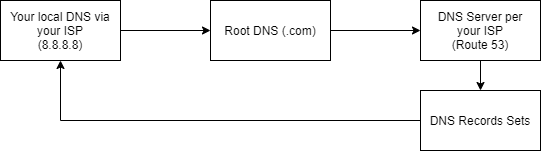

### Route 53

**Setting up Apache with Jenkins**

```console
yum install httpd
service httpd start
cd /etc/httpd/conf
vi httpd.conf
```

```xml
<VirtualHost *:80>
servername http://xxx.yyy.zzz.www:8080/
ProxyRequests Off
ProxyPreserveHost On
AllowEncodedSlashes NoDecode
ProxyPass / http://localhost:8080/ nocanon
ProxyPassReverse / http://localhost:8080
ProxyPassReverse / http://xxx.yyy.zzz.www:8080
<Proxy http://localhost:8080/* >
Order deny,allow
Allow from all
</Proxy>
</VirtualHost>
```

```console
service httpd restart
setsebool -P httpd_can_network_connect true

# block jenkins on port 8080
cd /etc
cd sysconfig/
vi jenkins

# Type:        string
# Default:     ""
# ServiceRestart: jenkins
#
# IP address Jenkins listens on for HTTP requests.
# Default is all interfaces (0.0.0.0).
#
# JENKINS_LISTEN_ADDRESS="127.0.0.1"

service jenkins restart
```

**Creating ssh keys**

```console
whoami
su -s /bin/bash jenkins

cd /var/lib/jenkins
mkdir .ssh
cd .ssh
ssh-keygen -t rsa -C 'jenkins@example.com'
```

**Installing GIT on Jenkins server**

```console
sudo yum install git
```

**Installing docker**

```console
uname -r
sudo yum update

from page
sudo systemctl start docker
```

***

# Security techniques

- Protect BIOS configuration with password

***

# TLS

## Encryption and hashing

### Encryption algorithms

| algorithm | key |
|---|---|
| DES | Symmetric |
| 3DES | Symmetric |
| AES | Symmetric |
| RSA | Asymmetric |

### Hash

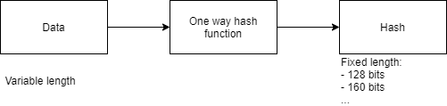

- Verifies integrity of data.
- Keys in hash function add sender authentication.
- One way algorithm.

**MD5 hashing algorithm**

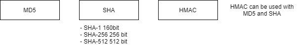

**SHA hashing algorithm**

- **SHA-1:** (160 bit) 40 hex characters.
- **SHA-256:** (256 bits) 64 hex characters.
- **SHA-512:** (512 bits) 128 hex characters.
- **HMAC:** **Data + Key = Hash**

### Asymmetric Keys

- **Private Key:** Always kept secret.
- **Public Key:** Available for anyone.
- Public, Private key can be used for encryption.
- Signing data using private key.
- Sign and verify signature using asymmetric keys.

### RSA

- **RSA:** public key crypto system.
- **Key length (bits):**
    - 1024
    - **2048**
    - 3072
    - 4096

### PKI - Public Key Infrastructure

- **CA:** certification authority.
    - Sign certificate.
    - Delegate certificate signature (intermediate CA).
    - Stores public key of owner of certificate.

### Certificate


- If certificate signed by CA (certification authority), and we trust CA, we trust an owner of the certificate too.
- Public key in a certificate ALWAYS belongs to the owner of certificate.

***

### Open SSL

```console
openssl genrsa

openssl genrsa -aes256
# Enter pass phrase:
# used for encryption Private Key

openssl genrsa -des3

openssl genrsa -aes256 -out private.pem

# Extract Public Key (public.pem)
openssl rsa -in private.pem -outform PEM -pubout -out public.pem

openssl genrsa 4096
```

### Chain of trust


- How end user certificate securely signed by a private key of the Intermediate CA?
    - Signing occurs on the **Intermediate CA server**.
    - With private key it securely sign, CSR (Certificate Signing Request) received from the end user.

### Verify a chain of certificates

- Web server sends own certificate and certificates of all intermediate CAs.
- Current date and time should fall within the certificate validity interval.
- Verification of signature.
- If signature verified successfully trust between Intermediate CA and End user established.
- Next **Intermediate CA certificate** signature must be verified.
- Find Certificate with **Owner Info** equal to **Issuer Info** in the Intermediate CA Certificate.
- Root CA certificate is found in the builtin OS certificates store.
- Verify Intermediate CA certificate signature using public key found in the Root CA certificate.
- If signature verified successfully trust between Root CA and Intermediate CA is established.
- **Trust Root CA > Trust Intermediate CA > Trust End User**
- Identity of End User (for example Web Server) was successfully verified.
- Certificate is valid.

### Verifying SSL certificate and certificates chain

```
> geocerts.com
> sslshopper.com
```

### PKI Public Key Infrastructure

- Set of rules, algorithms and protocols that allows you to build relationships between entities.
- Every entity owns public key, and based on build trust to public keys.
- Each Certificate contains:
    - Information about an owner.
    - Information about an issuer.
    - Signature
    - Public key.

### Certificate domain scopes

- Single domain:
    - www.instagram.com
    - www.mywebsite.com
- Wildcard:
    - *.google.com
    - *.mywebsite.com
- Multi domain:
    - *.facebook.com
    - *.fb.com
    - *.messenger.com

***

## SSL, TLS and HTTPS

- **SSL:** Secure Socket Layer.
- **TLS:** Transport Layer Security.
- SSL and TLS cryptographic protocol.
- Certificate doesn't depend on specific protocol (TLS or SSL) and could be used for both.

### History of SSL and TLS

- Why RSA is not used in HTTPS for data encryption?
    - RSA (RSA - public key crypto system) encryption is slow.
    - Bi-directional data encryption requires RSA key pairs on both sides (private key in client and server).

**Encryption using asymmetric keys**

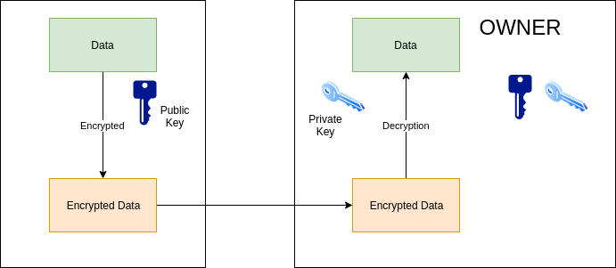

### How TLS session is established

**Establishing TLS session**

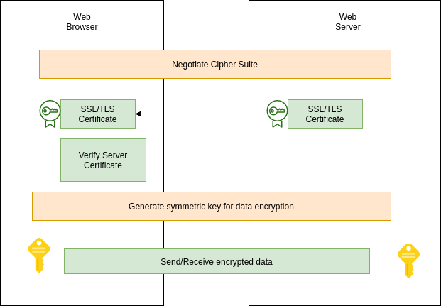

- **Cipher Suite:**
    - Set of protocol used in TLS communication.
    - Specify how symmetric key will be generated.
    - Which algorithm will be used for data encryption and decryption.
    - Info about hashing protocol.
- **Certificate verification:**
    - Verify signature.
    - Check validity period.
    - Verify whether certificate revoked or not (optional).

### Cipher Suite

```
TLS_ECDHE-RSA-WITH_AES_128_GCM_SHA256
```

**Delivering key for Encryption in TLS (without Diffie Hellman)**

- RSA key pair is **static** and is not changed until certificate renewed.


**Delivering key for Encryption in TLS (with Diffie Hellmen)**


**Elliptic Curve Diffie Hellman Exchange**

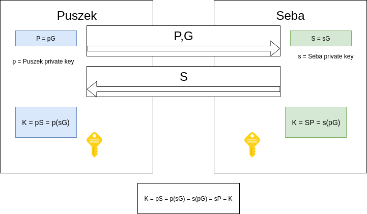

```
Cipher Suite: TLS_ECDHE_ECDSA_WITH_CHACHA20_POLY1305_SHA256

TLS
ECDHE - Elliptic Curve Diffie Hellman Exchange
ECDSA_WITH_CHACHA20 - Elliptic Curve Digital Sign Algorithm

POLY1305 - Encryption Algorithm
SHA256 - Hashing Algorithm
```

***

# SSL/TLS Operations

- How SSL works?
- Structure of SSL Certificate.
- Encryption Algorithms.
- SSL Communication.
- Certificate provisioning.
- **OpenSSL:** Library and CLI.
- Chain of trust.
- Trust stores.
- TLS 1.3

**Why do we need SSL certificates?**

- Source identity verification: **Trust**.
- Secure against Man-in-the-middle (MITM): **Confidentiality & Integrity**.
- **Client/Server authentication:** Can server identify the client back as well?
- **Non-Repudiation:** Can site repudiate (deny) the actions later?

**SSL/TLS Evolution**

- SSL Protocol was developed by Netscape in 1994.
- Taher Elgmal & Kipp Hickman.
- SSL certificate produced as proof of identity in SSL protocol.
- Transport Layer Security (TLS) protocol created by Internet Engineering Task Force (IETF) as successor to SSL.

**How SSL works ?**

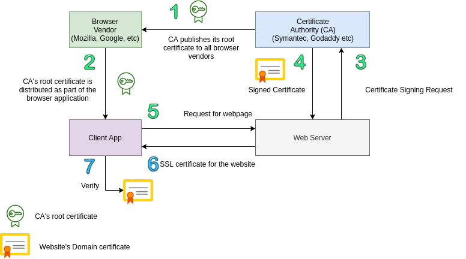

**CA Signed vs Self Signed Certificates**

| CA Signed Certs | Self Signed Certs |
|---|---|
| Signed by CA, a third party | Signed by the Website, the owner herself |
| Ideal for public use | Ideal for closed access |
| Trusted by browsers that have the root certificate of the CA in their trust store | Not trusted by browsers until you import your public key manually into browser trust store |
| Renewals / modifications in cert do not require change at browser side | Renewals / modifications requires re-import of the new cert to browser's trust store |
| You buy it from a CA | No cost as you signed it yourself |
| Leaf and intermediate certificates | Root certificates |

- What about setting up your own private CA to sign your certificates?

### Reading / Examining certificate

```console
openssl s_client -connect google.com:443 < /dev/null
openssl s_client -connect google.com:443 < /dev/null | openssl x509 -in /dev/stdin -text -noout
```

***

## Certificate Architecture

### Structure of certificate

```
 Data:
        Version: 3 (0x2)
        Serial Number:
            40:2a:98:23:2d:c8:6c:13:08:00:00:00:00:1d:89:b1
    Signature Algorithm: sha256WithRSAEncryption
        Issuer: C=US, O=Google Trust Services, CN=GTS CA 1O1
        Validity
            Not Before: Nov  5 07:38:32 2019 GMT
            Not After : Jan 28 07:38:32 2020 GMT
        Subject: C=US, ST=California, L=Mountain View, O=Google LLC, CN=*.google.com
        Subject Public Key Info:
            Public Key Algorithm: rsaEncryption
                Public-Key: (2048 bit)
                Modulus:

        X509v3 extensions:
            X509v3 Subject Alternative Name:
            Authority Information Access:
                OCSP - URI:http://ocsp.pki.goog/gts1o1
                CA Issuers - URI:http://pki.goog/gsr2/GTS1O1.crt
            X509v3 Basic Constraints: critical
                    CA:FALSE
            X509v3 CRL Distribution Points:
                Full Name:
                    URI:http://crl.pki.goog/GTS1O1.crl

    Signature Algorithm: sha256WithRSAEncryption

```

- **Data:**
    - Version
    - Serial number
    - Signature Algorithm
    - Issuer
    - **Validity:**
        - Start date
        - End date
    - Subject's Pub Key
    - **x509 Extensions:**
        - SAN
        - CRL/OCSP
- **Signature:**
    - Signature Algorithm
    - Signature

**Digital Signature**

- Hash of something signed by a private key.
- Verified using public key.
- Satisfies **Integrity**, **Authenticity** and **Non Repudation**.
- Verification done by comparing the message digests (Hashes).
- Applications: SSL, Secure eMail, eDocuments, Watermarking.

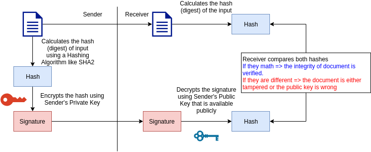

**Certificate Standards and Encoding methods**

- **Standard:**
    - **x509:** PKIX (Public Key Infrastructure) certificate.
    - Standard for SSL by NetScape.
- **Encoding:**
    - DER (Distinguished Encoding Rules) Std => Binary DER encodes certs. (appear as .cer/.crt files).
    - PEM (Privacy Enhance Mail) Std => ASCII (Base64) armored data prefixed with a "--- BEGIN ---" line.
      (appears as .cer/.crt/.pem files).
- **File extensions:**
    - **.crt:** *nix convention of binary DER or Base64 PEM.
    - **.cer:** Microsoft convention of binary DER or Base64 PEM.
    - **.key:** public/private PKCS#8 keys, DER or PEM.

**Encoding conversion**

```
openssl x509 -in ServerCertificate.cer -outform der -out ServerCertificate.der
openssl x509 -in ServerCertificate.der -inform der -outform pem -out ServerCertificate.pem
```

### Types of Certificates

**Based on trust level (DV, OV, EV)**

- **DV: Domain Validated (Basic).**
    - Small or medium level website owners who only wish to encrypt their domain
      can issue DV SSL certificate.
    - **Features:**
        - No paper work or documentation required for validation.
        - Validated against the domain.
        - It does not guarantee the identity of the website's owner nor the actual existence of the organization.
        - Green padlock.
        - Lower price.
        - Quick issuance within minutes.
        - 99,9% mobile and web browser compatibility.
        - Comes up with Wildcard and Multi Domain features.
        - Reissue as many times as needed during the validity period.
    - Validation process (email, file, registrar).
    - **https://aboutssl.org/domain-validated-ssl-validation-process/**
- **OV: Organization Validated (Enhanced).**
    - Business identity level trust.
    - Organization name printed in the certificate. (https://reddit.com)
    - **Features:**
        - Green padlock.
        - 1-3 for issuance.
        - More trusted than DV.
        - Organization name validated and part of the certificate, (Organization and Subject filled up).
        - **https://aboutssl.org/document-require-for-ov-ssl-code-signing-certificate/**
- **EV: Extended Validated (Complete).**
    - For trusted and high security sites **(https://www.godaddy.com)**
    - **Features:**
        - **Green Address Bar + Organization Name + Trust Seal.**
        - Up to 10 business days for issuance & Very Strict Validation Process.
        - OV by default + High 256-bit encryption with 2048-bit key length.
        - A multi domain with SAN only.
        - **https://aboutssl.org/document-require-for-ev-ssl-certificate/**

### Encryption Algorithms

**Kerckhoff's Principle**

```
A cryptosystem should be secure even if the attacker knows all details about the system, with
the exception of the secret key. In particular, the system should be secure when the attacker
knows the encryption and decryption algorithms.
```

- Private/Symmetric Key Encryption Algorithms.
- Public/Asymmetric Key Encryption Algorithms.
- Hashing Algorithms.

**Symmetric / Private Key Algorithm**

| Key length | Security Estimation |
|---|---|
| 56-65 bits (AES, 3DES) | Short term: a few hours / days |
| 112-128 bits (AES, 3DES) | Long term several decades |
| 256 bits (AES, 3DES) | Long term several decades |

**Asymmetric / Public**

- Integer Factorization (RSA).
- Discrete Logarithm (DH, DSA, Elgamal).
- Elliptic Curves (ECDH, ECDSA).

### Private / Symmetric Key Encryption

- DES, 3DES, AES, RC4.
- Based on single common shared a secret key.
- Faster than Public Key encryption.
- Both sender and receiver should have the shared secret.


**AES**

- Based on Rijndael algorithm.
- Block cipher.
- Modes:
    - Electronic Codebook (ECB)
    - Cipher Block Chaining (CBC)
    - Output Feedback (OFB)
    - Counter (CTR)
    - Galois / Counter Mode (GCM)
- 128, 192 and 256 bits.

### Public / Asymmetric Key Encryption

- RSA, DSA.
- Key bit length.
- Slower.


**RSA**

- Ron Rivest, Adi Shamir and Leonard Adelman in 1977.
- Patented by MIT expired in 2000.
- Good for signing and encryption.
- Advanced key computation.
- Bad for key exchange.

**Integer Prime Factorization Problem**

```
For three very large positive integers e, d and n such that with modular
exponentiation for all integer m:
(m^E)^d=m(mod N)

and that even knowing e and n or even m it can be extremely difficult to
find d. The public key is represented by the integers N and E; and, the private
key, by the integer d.
```

### Elliptic Curve Cryptography

- Discovered in 1985 by Victor Miller (IBM) and Neil Koblits (University of Washington).
- Some implementations patented by Certicom.
- Low computing power requirements.
- Reduced key length and hence fast.
- Use only standard NIST curves.

**Elliptic Curve Discrete Logarithm Problem**

```
Let P and Q be two points on an elliptic curve such that
kP = Q, where k is a scalar. Given P and Q, it is
computationally infeasible to obtain k, if k is sufficiently
large. k is the discrete logarithm of Q to the base P.

On EC, Scalar multiplication is a one way function.
```

### Hashing Algorithms

- One way digest.
- Unique.
- Fixed length (32, 40, 64 etc.).
- Collision resistance.
- MD5, SHA1, SHA2, SHA3, RIPEMD, Tiger, Whirlpool, GOST etc.

```console
openssl dgst -md5 message1.bin message2.bin
openssl dgst -sha1 message1.bin message2.bin
openssl dgst -sha256 message1.bin message2.bin
```

## SSL Communication

- Authentication (Handshake) (PublicKey Algo).
- Key Exchange (Handshake) (PublicKey Algo / Key Exchanging Protocol).
- Encrypted data transfer (Record) (PrivateKey Algo).


### Step 1. Authentication

- Through SSL Certificates:
    - RSA Certs.
    - 2048 bits to be safe.
- Cipher Suite.

**Cipher is**

```
TLS_ECDHE_RSA_WITH_AES256_CBC_SHA
```

- **TLS:** Transport layer protocol used (others: SSL)
- **ECDHE:** Session key exchange algorithm (others: RSA, DH, DHE)
- **RSA:** PKI type of the Certificate (others: DSS)
- **AES256:** A symmetric algorithm used to encrypt the actual data (others: RC4, 3DES, CAMELLIA, ARIA, DES40)
- **CBC:** Mode in which the symmetric algorithm operates (others: CCM, GCM)
- **SHA:** Hashing algorithm for data integrity (others: MD5, SHA2)

```
Random Data - Entropy is measure of randomness, added to message.
```

### Step 2. Key Exchange.

**RSA Method**

- Most used (XX%).
- Uses servers public key for confidentiality while exchanging secret.
- No Perfect Forward Secrecy and hence passive cryptanalysis is possible.
- Server's private key, critical point of compromise.

**Diffie Hellman Method**

- Most efficient and recommended
- Ephemeral mode for PFS. Blast radius of passive cryptoanalysis limited to a session

#### Diffie Hellman

- Whitfield Diffie and Martin Hellman in 1976.
- No long term private key involved.
- DHE provides Perfect Forward Secrecy.
- No secret key is exchanged.

**Discrete Logarithm Problem (in Zip)**

```
Even though a (alpha), p, A and B are known to the
adversary, calculating
a = loga A mod p

is practically impossible with 'p' being a large prime number.
```

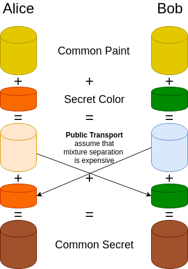

### Step 3. Encrypted data transfer (Record)

- Actual data transfer.
- Confidentiality (Symmetric Encryption).
- Message Integrity (MAC).
- MAC encrypt.

**Record Header**

```
Byte 0 = SSL record type
    SSL3_RT_CHANGE_CIPHER_SPEC 20 (x'14')
    SSL3_RT_ALTER 21 (x'15')
    SSL3_RT_HANDSHAKE 22 (x'16')
    SSL3_RT_APPLICATION_DATA 23 (x'17')
Byte 1-2 = SSL version (major/minor)
    SSL3_VERSION x'0300'
    TLS1_VERSION x'0301'
Bytes 3-4 = Length of data in the record (excluding the header itself). Max is 16384 (16K).
Byte 5 = Handshake type
Byte 6-8 = Length of data to follow in this record
Byte 9-n = Command-specific data
```

```console
openssl s_client -connect qualys.com:443 < /dev/null 2> /dev/null
```

***

### Certificate provisioning

1. Certificate request and CA signing.
2. Certificate installation.
3. Certificate verification.
4. Certificate revoking.

**Certificate Request & Signing**

- Administrator of the webserver/domain generate the private key and certificate signing request for your site.

```console
openssl genrsa -out mysite.key 4096
openssl req -new -key mysite.key -out mysite.csr
```

- Send **mysite.csr** to the CA of your choice.
- Get it signed by CA, say **mysite.crt**:
    - CA calculates the SHA SUM of the certificate's data section.
    - Encrypts the checksum value using CA's private key.
    - Append the signature to the certificate and send back to the requester.

**Self Signed**

- Generate private key and self signed certificate for 365 days.

```console
openssl req -x509 -newkey rsa:4096 -keyout mysite.key -out mysite.crt -days 365
openssl x509 -in mysite.crt -text -noout
```


**Certificate Request & Signing**

- **Security:**
    - **Choose your key length:**
        - RSA 2048 bit
        - ECC 192 bit
    - Keep your private key secure.
    - Check your signing hashing algorithm:
        - SHA2 or more.
    - Choose a reliable CA.

**Certificate Installation**

- Load balancer
- Web server

**Apache**

```xml
<VirtualHost 192.168.0.1:443>
    DocumentRoot /var/www/html2
    ServerName www.yourdomain.com
    SSLEngine on
    SSLCertificateFile /path/to/your_domain_name.crt
    SSLCertificateKeyFile /apth/to/your_private.key
    SSLCertificateChainFile /path/to/DigiCertCA.crt
</VirtualHost>
```

**Nginx**

```
server {
    Listen 443;
    ssl on;
    ssl_certificate /etc/ssl/your_domain_name.pem;  // cat your_domain_name.crt DigiCertCA.crt >> bundle.crt
    ssl_certificate_key /etc/ssl/your_domain_name.key
    server_name your.domain.com;
    access_log /var/log/nginx/nginx.vhost.access.log;
    error_log /var/log/nginx/nginx.vhost.error.log
    location /
        {
            root /home/www/public_html/your.domain.com/public/;
            index index.html;
        }
}
```

**https://www.digicert.com/ssl-certificate-installation.htm**

**Certificate Installation contd.**

- **Security:**
    - **Choose your ciphers:**
        - No RC4
        - No AES-CBC with CCL3v3 & TLSv1.0 (BEAST and Lucky13)
        - AES-GCM
        - Disable the export and null cipher suites, as well as cipher suites using RC4/3DES.
        - Good to use AES256-SHA for 1.1, and AES256-GCM-SHA256 for TLS 1.2.
    - Choose your protocol versions:
        - TLSv1.1 / TLSv1.2

**Certificate Revoking**

- When do we revoke a cert?
    - Subscriber's private compromised.
    - CA's private key compromised.
    - Affiliation Changed.
    - Cessation of Operation etc.
- **CRL:** Certificate Revocation List.
- **OCSP:** Open Certificate Status Protocol.

```
X509v3 extensions:
    Authority Information Access:
        CA Issuers - URI:http://pki.google.com/GIAG2.crt
        OCSP - URI:http://clients1.google.com/ocsp
    ...
    X509v3 CRL Distribution Points:
        URI:http://pki.google.com/GIAG2.crt
```

### Common certificate errors

```
SSL_ERROR_NO_CERTIFICATE
SSL_ERROR_WRONG_CERTIFICATE
SSL_ERROR_UNSUPPORTED_VERSION
SSL_ERROR_BAD_CERT_DOMAIN
SSL_ERROR_UNKNOWN_CIPHER_SUITE
SSL_ERROR_UNKNOWN_CA_ALERT
SSL_ERROR_REVOKED_CERT_ALERT
```

**https://badssl.com**

### Open SSL - Certificate operations

```console
s_client
    openssl s_client -connect qualys.com:443 < /dev/null
    openssl s_client -showcerts -connect www.google.com:443 < /dev/null     # show all inter. certs too
    openssl s_client -connect -tls1_2 qualys.com:443 < /dev/null            # connect using TLSv1.2 only

x509
    openssl x509 -in www.google.com.crt -noout -text                        # decode the cert file
    openssl s_client -connect google.com:443 < /dev/null 2> /dev/null | openssl x509 -in /dev/stdin -noout -text
                                                                            # take input from stdin spit by s_client
    openssl s_client -connect google.com:443 < /dev/null 2> /dev?null | openssl x509 -noout -dates
                                                                            # check expiry date

genrsa/rsa
    openssl genrsa -out mysite.key 4096                                     # generate 4096 bit rsa key
    openssl rsa -noout -text -check -in mysite.key                          # display the private key components
    openssl rsa -in mysite.key -pubout > mysite.key.pub                     # extract public key
    openssl rsa -in mysite.key.pub -pubin -text -noout                      # display the public key components

req
    openssl req -new -key mysite.key -out mysite.csr                        # new CSR, send this to CA for signing
    openssl req -x509 -newkey rsa:4096 =keyout mysite.key -out mysite.crt -days 365
                                                                            # self signed cert

s_server
    openssl s_server -cert mycert.crt -key mysite.key -www -accept 4443     # start ssl server on port 4443

ciphers
    openssl ciphers -v ['DHE-RSA-AES256-SHA']                               # displays all without a cipher argument

crl
    curl -s htp://pki.google.com/GIAG2.crl | openssl crl -inform DER -text -noout -in /dev/stdin

Miscellaneous
    openssl x509 -noout -modulus mysite.crt | openssl sha256                # all md5sums should be
    openssl req -noout -modulus mysite.csr | openssl sha256                 # the same if they belong
    openssl rsa -noout -modulus mysite.key | openssl sha256                 # to the same website
```

### OpenSSL - Encryption and Decryption functions

```
dgst
    openssl dgst -sha256 -sign privkey.pem -out input_message.tar.gz.sig input_message.tar.gz           # sign
    openssl dgst -sha256 -verify pubkey.pem -signature input_message.tar.gz.sig input_message.tar.gz    # verify

enc
    openssl enc -ase-256-cbc -salt -in file.txt -out file.txt.enc [-k PASS]     # encrypt
    openssl enc -ase-256-cbc -d -in file.txt.enc -out file.txt [-k PASS]        # decrypt

base64
    openssl base64 -in file.txt -out file.txt.base64        # base64 encoding
    openssl base64 -d -in file.txt.base64 -out file.txt     # base64 decoding

ecparam
    openssl ecparam -list_curves                            # list all ECC curves
    openssl ecparam -name secp256k1 -genkey -noout -out secp256k1 -key.pem  # create key for curve secp256k1

passwd
    openssl passwd -1 -salt alphanumeric MyPassword         # create shadow-style password

rand
    openssl rand -out random-data.bin 64                    # create 64bytes random data
    head -c 64 /dev/urandom | openssl enc -base64           # get 64 random bytes for urandom and base64 encode
```

***

## Chain of Trust

### Intermediate CAs

- To establish Chain of Trust.
- A way to reduce the risk of compromising the Root CA's private key.
- Leaf, intermediate and root certificates.
- Leaf and intermediate to be installed at the web server / LB.
- Chain of Trust is broken if any of the Intermediate Certificate is invalid or missing.

**Equifax (root CA) ---> Geotrust (ICA) ---> GIA (ICA) ---> Google.com (EE/Leaf)**

```console
openssl s_client -connect google.com:443 -showcerts < /dev/null 2> /dev/null
```

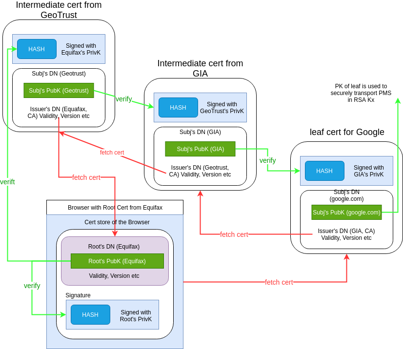

***

## Trust Store

- Repository of trusted CA certificates.
- Shipped as part of the application.
- Truststore can be modified.
- Different from keystore.
- Application trust store:
    - **Browser:** Public keys of all major CAs come with release.
    - Java (tomcat, cold fusion etc.):
        - Mostly there but less frequently updated.
        - You need to take care if customized.

### Managing Trust Store

**Tomcat**

```console
/urs/local/java/jre/bin/keytool -import -v -alias SHA2_Standard_Inter_Symantec_Class_3_Standard_SSL_CA_G4 -file
/$path/SHA2_Standard_Inter_Symantec_Class_3_Standard_SSL_CA_G4.cer -keystore /myapplication/conf/jssecacerts
-storepass changeit -noprompt

/usr/local/java/jre/bin/keytool -list -v -keystore /myapplication/conf/jssecacerts -storepass changeit -noprompt
```

***

## TLS 1.3

- **Safer:**
    - Removal of unused and unsafe ciphers and techniques.
    - Security optimization, modern encryption and analysis.
- **Faster:**
    - 1-RTT for fresh connections.
    - 0-RTT for resumption.

### TLS 1.3 removals

- Static RSA for key exchange because of no PFS.
- **Weak hashing algorithms:**
    - MD5, SHA1, SLOTH 2016 (added POLY1305 along with SHA256/SHA384..)
- Arbitrary E Curves & (EC) DHE groups: CVE-2016-0701 (added Curve25519 and Curve448).
- **Arbitrary Compression:** CRIME.
- **Renegotiation:** DoS2011, Triple Handshake 2014.
- **Non-AEAD ciphers (MAC-then-Encrypt):**
    - **AES-CBS mode:** DEAST, Lucky13, POODLE, Vaudenay 2002.
    - **RC4:** Statistical biases the keystream eg: cookie decryption (replaced by ChaCha20).
    - **RSA-PKCS1-1.5:** DROWN 2016, Jager 2015.
    - **Export ciphers:** Responsible for protocol downgrade - FREAK, LogJam.
    - **DES/3DES:** Breakable.
- **Simplified resumption:** Replay attacks since there is no PFS.

### TLS 1.3

- Safer optimization, analysis and encryption.
- Only (EC)DHE (based on curves 25519 and 448) and/or PSK for key exchange, no more RSA.
- Limited number of EC groups (defined in either FIPS 186-4. Includes curves 25519 and 448).
- Only suites with AEAD ciphers (AES-GCM, AES-CCM, ChaCha20):
    - TLS13-CHACHA20-POLY1305-SHA256
    - TLS13-AES-256-GCM-SHA384
    - TLS13-AES-128-GCM-SHA256
    - TLS13-AES-128-CCM-SHA256
    - TLS13-AES-128-CCM-8-SHA256
- Content Type, SNI (Server Name Indication), Certificates and Extensions are encrypted.
- Split and simplified negotiation or cipher suites.
- Full handshake signature.
- Server capability assumptions.
- Applications can do an arbitrary amount of padding as opposed to 'no-padding' for streaming/AEAD modes in
  previous versions of TLS.
- Digital Signature algorithms - EdDSA (Ed25519 and Ed448), ECDSA, RSA.

### TLS 1.3 Faster 1-RTT


**Faster (0-RTT for resumption)**

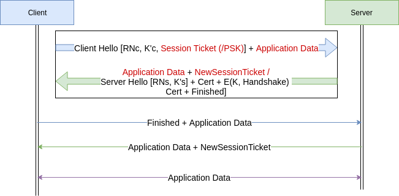

- The Session Ticket = E(Kstek, ResumptionKey) is generated and sent by the server for the previous
  handshake.
- It is encrypted using the Session-Key-Encryption-Key (STEK).
- PSK is usually a key shared between the client and the server out-of-the-bound.

### TLS 1.3 Deployment

- Nginx **ssl_protocols TLSv1.2 TLSv1.3; # nginx.conf**
- Apache **SSLProtocol -all +TLSv1.2 +TLSv1.3; # ssl.conf**
- **Caveats:**
    - Resumption with base PSK is forward secure only if coupled with an ephemeral key (ECDHE) during derivation.
    - The early data (0-RTT) is not forward secure. So prone to reply attacks.
    - 0-RTT activation is a call that the Application developer has to make. (recommended only for idempotent calls)

### HTTP Public Key Pinning

- HPKP
- Detect fraudulent certificates.
- HTTP Header.
- HPKP header in response.

```
Public-Key-Pins:
    pin-sha256="";
    pin-sha256="";
    max-age=259200
```

```
Public-Key-Pins-Report-Only:
    max-age=259200;
    pin-sha256="sddmakf'rfdsjid;";
    pin-sha256="dsjaisd;/2r94ri[";
report-uri="https://example.net/pkp-report"
```

- HPKP header in server in server configuration (eg:-Apache).

```
Header add Public-Key-Pins "max-age=500; includeSubDomains; pin-sha256=\"asdjasdkladsjkasdad\"";
```

### Let's encrypt - Free & Open certificate

- Automatic Certificate Management Environment **(ACME) + Let's Encrypt CA = Fully automated cert management system.**

### Certificate Transparency

- Make it impossible (or at least very difficult) for CA to issue a SSL certificate for a domain without certificate
  being visible to the owner of that domain.
- Provide an open auditing and monitoring system that lets any domain owner or CA determine whether certificates have
  been mistakenly or maliciously issued.
- Protect users from being dumped by certificates that were mistakenly or maliciously issued.

