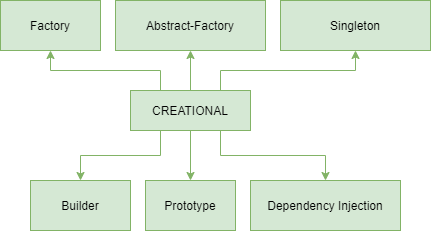
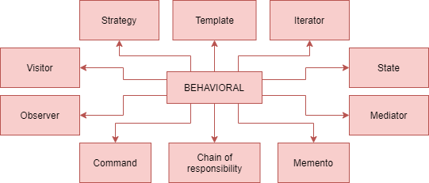
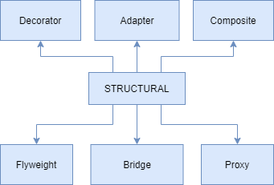

# DESIGN PATTERNS

- Frameworks are complicated collections of interconnected classes.
- Libraries are simpler version of frameworks.
- Design patterns are canonical solutions to recurring problems.

## Creational

- How should objects be created.



## Behavioral

- How should objects behave and interact with each other.



## Structural

- How should classes behave and interact with each other.



## Concurrency

- Double checked locking.

## MVC

- Creational:
    - Relate to how objects are constructed.
    - Decouple construction of an object from its use.
    - Hide implementation of object only reveal its interface.
    - Defer instantiation until runtime.
    - Have families of related objects that must be used together.
    - Only allow creation of a finite number of instances.
- Behavioral:
    - How do object of class behave and interact with each other?
    - If the pattern governs how the logical unit as a whole interacts with the outside world.
    - Iterator pattern:
        - The logical unit includes just 1 class, the iterator class.
        - This pattern governs how the iterator is used by the client (outside world).
- Structural:
    - How do classes behave and interact with each other?
    - If the pattern governs how classes within the logical unit interact with each other.
    - MVC pattern:
        - 3 classes the model, view, controller.
        - The pattern governs how M, V, C interact with each other.
        - If the interaction between the M, V, C were change, the UI would not look or behave any different!

***

## Design Principle

### Program to an interface, not an implementation

- Think of the interface as the surface that a unit offers to the outside world.
- Unit could be a single class or collection of classes.
- The implementation is the inside of that unit.
- Never make assumptions about the inside of eny unit ever.

:worried:

```java
public ArrayList<Integer> getList() {
    return new ArrayList<>();
}
```

:blush:

```java
public List<Integer> getList() {
    return new ArrayList<>();
}
```

### The Open / Close principle, "Classes should be open for extension but closed for modification"

- New application via extension.
- Inheritance:
    - If you structure your code into abstract base classes, other can find new way to use it, via Inheritance
    **(Template pattern)**.
- Delegation:
    - If fire event and expose properties, other code can listen in, and use your code via delegation
    **(Observer, MVC, Chain of Responsibility)**.
- Composition:
    - If take in member variables to determine behavior, you allow extension via Composition **(Strategy pattern)**.

### Principle of least knowledge, "Only talk to friends, don't talk to strangers"

:disappointed_relieved:

```java
int number = document.getCurrentPage().getNumber();
```

:blush:

```java
int number = document.getCurrentPageNumber();
```

### 4. Dependency Inversion and Hollywood Principle

- Depend on abstraction, never on details.
- Don't call us we will call you.
- Idea high level components calling low-level components, ubiquitous in frameworks.
- Our code usually calls libraries and is often called by frameworks, but is structured using design patterns.

***

## MVC

- Model - Storing the data underlying the user interface.
- View - Visual representation of data.
- Controller - Interacts with the user and modifies the model and view.
- What is the basic of the MVC pattern:
    - Separating data from its visual representation.
    - Separating data from its manipulation.
    - Allowing different simultaneous representations of the same data.
- How does the client interact with the model in the MVC paradigm:
    - User sees the model through the view, and manipulates it via the controller.
- Model, View, Controller:
    - Controller - A slider to adjust volume in a media player app.
    - Model - The MP4 file of a movie to be played in a media player app.
    - View - The area of the media player app that actually displays video.

***

## Single Responsibility Principle

### Cohesion

- Is a way to measure how much the code segments withing one module (methods of a class, classes inside a package)
belong together.
- The higher the cohesion the better, since high cohesion implies easier maintenance and debugging,
greater code functionality and reusability.
- Loose coupling of modules is related to high cohesion.

### Robustness

- Ability of a computer system or algorithm to handle mistakes and malfunctions
(which could be caused by various factors such as programmer’s mistake or incorrectly formatted user input).
- A robust system is one that can handle these unwanted situations elegantly.
- There are various ways for a software engineer to achieve robustness, such as testing the code for different kinds of inputs,
but generally, in order to achieve robustness (and high cohesion), programmers follow a certain set of rules and principles
for better organization of object-oriented programs.

**Single Responsibility Principle**

- The single responsibility principle revolves around the claim that a certain code module (most often, a class)
should only have responsibility over one part of the functionality provided by the software.
- This approach contributes to the **high cohesion** – since methods related to the same concern (same part of the functionality)
will be members of the same class, and **robustness** – since this reduces the possibility of error.

**:disappointed_relieved: Bad example**

```java
class Text {
    String text;
    String author;
    int length;
    String getText() { ... }
    void setText(String s) { ... }
    String getAuthor() { ... }
    void setAuthor(String s) { ... }
    int getLength() { ... }
    void setLength(int k) { ... }
    /*methods that change the text*/
    void allLettersToUpperCase() { ... }
    void findSubTextAndDelete(String s) { ... }
    /*method for formatting output*/
    void printText() { ... }
}
```

**:blush: Better example**

```java
class Text {
    String text;
    String author;
    int length;
    String getText() { ... }
    void setText(String s) { ... }
    String getAuthor() { ... }
    void setAuthor(String s) { ... }
    int getLength() { ... }
    void setLength(int k) { ... }
    /*methods that change the text*/
    void allLettersToUpperCase() { ... }
    void findSubTextAndDelete(String s) { ... }
}
class Printer {
    Text text;
    Printer(Text t) {
       this.text = t;
    }
    void printText() { ... }
}
```

**Open Closed Principle**

- For good application design and the code writing part, you should avoid change in the existing code when requirements change.
- Instead, you should extend the existing functionality by adding new code to meet the new requirements.

> “software entities (classes, modules, functions, etc.) should be open for extension, but closed for modification“

- “Open for extension “: This means that the behavior of a software module, say a class can be extended to make it behave
in new and different ways
- “Closed for modification “: This means that the source code of such a module remains unchanged

### :blush: Better example

```java
public abstract class InsuranceSurveyor {
    public abstract boolean isValidClaim();
}
```

```java
public class HealthInsuranceSurveyor extends InsuranceSurveyor{
    public boolean isValidClaim(){
        System.out.println("HealthInsuranceSurveyor: Validating health insurance claim...");
        /*Logic to validate health insurance claims*/
        return true;
    }
}
```

```java
public class VehicleInsuranceSurveyor extends InsuranceSurveyor{
    public boolean isValidClaim(){
       System.out.println("VehicleInsuranceSurveyor: Validating vehicle insurance claim...");
        /*Logic to validate vehicle insurance claims*/
        return true;
    }
}
```

```java
public class ClaimApprovalManager {
    public void processClaim(InsuranceSurveyor surveyor){
        if(surveyor.isValidClaim()){
            System.out.println("ClaimApprovalManager: Valid claim. Currently processing claim for approval....");
        }
    }
}
```

## Liskov Substitution Principle

```
“in a computer program, if S is a subtype of T, then objects of type T may be replaced with objects of type S
(i.e., objects of type S may substitute objects of type T) without altering any of the desirable properties of that
program (correctness, task performed, etc.)”.
```

- Simply said, any object of some class in an object-oriented program can be replaced by an object of a child class.

### Inheritance

- It is when an object or a class are based on another object or class.
- When a class is “inherited” from another class, it means that the inherited class
(also called subclass, or child class) contains all the characteristics of the superclass
(parent class), but can also contain new properties:
    - Class Watch , you can inherit from that class to get a class PocketWatch.
    - A pocket watch is still a watch, it just has some additional features.

### Polymorphism

- Objects can behave in one way in a certain situation and in another way in some other situation.
- In object-oriented programming, this is called context-dependent behavior.

### Liskov Substitution Principle Examples

- Functions that reference base classes must be able to use objects of derived (child) classes without knowing it.

### :disappointed_relieved: Bad example

```java
class TrasportationDevice
{
   String name;
   double speed;
   Engine engine;

   String getName() { ... }
   void setName(String n) { ... }

   double getSpeed() { ... }
   void setSpeed(double d) { ... }

   Engine getEngine() { ... }
   void setEngine(Engine e) { ... }
   void startEngine() { ... }
}
class Car extends TransportationDevice
{
   @Override
   void startEngine() { ... }
}

class Bicycle extends TransportationDevice
{
   @Override
   void startEngine() /*problem!*/
}
```

### :blush: Better example

```java
class TrasportationDevice
{
   String name;
   double speed;

   String getName() { ... }
   void setName(String n) { ... }

   double getSpeed() { ... }
   void setSpeed(double d) { ... }
}

class DevicesWithoutEngines extends TransportationDevice
{
   void startMoving() { ... }
}

class DevicesWithEngines extends TransportationDevice
{
   Engine engine;

   Engine getEngine() { ... }
   void setEngine(Engine e) { ... }

   void startEngine() { ... }
}

class Car extends DevicesWithEngines
{
   @Override
   void startEngine() { ... }
}

class Bicycle extends DevicesWithoutEngines
{
   @Override
   void startMoving() { ... }
}
```


