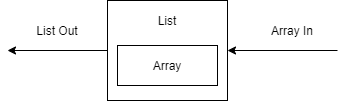
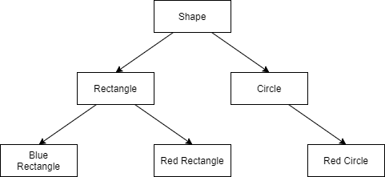
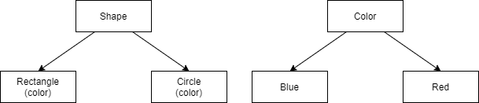

# Structural Pattern

## :star: Decorator Pattern

### Inputs, outputs streams

- Adding the new functionality to existing classes should be easily done while extending the class inherited from
it we use it within a composite or any other way.
- You should not force user to modify this class in order to change functionality.
- All input stream derive from a common abstract class **InputStream**.
- Which contains standard operations shared by all streams, `close()`, `read()`, `reset()`.
- For each type of input stream, there is a separate class deriving from input stream:
    - FileInputStream
    - AudioInputStream
    - ByteArrayInputStream
- Each of there objects can be constructed from an object of type InputStream.
- Saving objects to files is a standard operation called **serialization**.

**Chain of Input Stream**

```java
ObjectInputStream ois = new ObjectInputStream(
    new GZipInputStream(
        new BufferedInputStream(
            new FileInputStream("/serializedObject.gz");
        )
    )
);
```

- Use decorator when you have lots of objects each with a specific behavior independent of all other.
- Each class can be constructed from an object of the common interface or base class.

**When should switching to Decorator Pattern?**

- When a class is constantly being modified to implement new interfaces.

**Implementing Decorator Pattern**

```java
public interface Order {
    // Decorated class must implements this interface
    double getPrice();
    String getLabel();
}
```

```java
public class Pizza implements Order {
    // Class that must be decorated implements interface Order
    // Decorator means dynamically add responsibilities to object

    private String label;
    private double price;

    public Pizza(String label, double price) {
        this.label = label;
        this.price = price;
    }

    @Override
    public double getPrice() {
        return this.price;
    }

    @Override
    public String getLabel() {
        return this.label;
    }
}
```

```java
public abstract class Extra implements Order {
    protected Order order;
    protected String label;
    protected double price;

    public Extra(String label, double price, Order order) {
        this.label = label;
        this.price = price;
        this.order = order;
    }

    // price delegate to other implementation
    public abstract double getPrice();

    public String getLabel() {
        return order.getLabel() + ", " + this.label;
    }

}
```

```java
public class DoubleExtra extends Extra {
    public DoubleExtra(String label, double price, Order order) {
        super(label, price, order);
    }

    @Override
    public double getPrice() {
        return (this.price * 2) + order.getPrice();
    }

    @Override
    public String getLabel() {
        return order.getLabel() + ", double " + this.label;
    }
}
```

```java
public class Main {
    public static void main(String[] args) {
        Order fourSeasonPizza = new Pizza("Four season", 10); // Reason why program to interface
        fourSeasonPizza = new DoubleExtra("Mozzarella", 2, fourSeasonPizza);

        System.out.println(fourSeasonPizza.getPrice() + " : " + fourSeasonPizza.getLabel());
    }

}
```

***

## Adapter Pattern

- An adapter takes in an object that implements an interface, and gives out object that
implements a different interface.



**What is the basic point of the Adapter pattern?**

- Convert an object from one interface to another.

***

## :star: Facade Pattern

- A facade provides a simple interface for a larger body of complicated code.
- Multiple systems can and work together behind a facade, however the user will see only the simple interface.

### Code in Java to download URL

```java
URL url = new URL("panda.com");
BufferedReader reader = new BufferedReader(new InputStreamReader(url.openStream()));
String line;

while ((line = reader.readLine()) != null) {
    System.out.println(line);
}
reader.close();
```

**Code in C very complicated**

- The Java NET library which manages complexity assures that you neither know nor care how exactly
the contents of url are obtained.

### The principle of least knowledge

- Design guideline for developing software, particularly object-oriented programs. Specify case of loose coupling.
- Each unit should have only limited knowledge about other units; only unit closely related to current unit.
- Each unit should only talk to its friends.
- Only talk to your immediate friends.
- Facade pattern is used in:
    - Reflection, networking, database access, file access.
- However complicated your classes and their interactions, offer up a very simple interface to use them.
- Don't relay on the internal implementation of any code written by others that you use.
- Provide a clean interface so that others using your code don't need to reach inside your classes to done stuff.

### Downsides

- Hard to understand.
- Complicate structure, down of performance.

### What is a basic point of the Facade?

- Use a wrapper to abstract the complexity of a group of interconnected classes.

### What motivates a facade pattern?

- Classes should know as little as possible about other classes that they use (principle of least knowledge).
- Relay on abstractions - interfaces, not on concrete implementation.
- Loosely coupled code is always preferable to tightly code.

```java
public class WashingMachine {

    public static void main(String[] args) {
        new WashingMachine().lightlySoiled();
    }

    public void heavilySoiled() {
        setWaterTemp(90);
        setDuration(30);
        addDetergent();
        heatWater();
        startWash();
    }

    public void lightlySoiled() {
        setWaterTemp(60);
        setDuration(20);
        addDetergent();
        heatWater();
        startWash();
    }

    private void setWaterTemp(int i) {
        System.out.println("Water temp " + i);
    }

    private void setDuration(int i) {
        System.out.println("Duration time " + i);
    }

    private void addDetergent() {
        System.out.println("Add detergent");
    }

    private void heatWater() {
        System.out.println("Heat water");
    }

    private void startWash() {
        System.out.println("Start wash");
    }
}
```

***

## Composite Pattern

- What is a basic idea of composite pattern:
    - Create a class hierarchy to reflect dependent objects, all of which share a common interface.
    - Allow the user to interact with every dependent object in a tree like hierarchy of objects.
- Objects are created from object like themselves i.e. share the same interface.
- This is a definition of Composite Pattern.
- Composite Pattern is the basic of most UI Containers in Java.
- Example Swing Container.

***

## Flyweight pattern

- Is an object that minimalize memory use by sharing as much data as possible with other similar objects.
- It is a way to use objects in large numbers when a simple repeated representation would use an
unacceptable amount of memory.
- Often some parts of object state can be shared, and it is common practice to hold them in external data structure
(extrinsic state) and pass them to the flyweight objects temporarily when they are used.
- Java makes use of String interning optimization mechanism to store string.
- Strings in Java are **immutable** which means that Java only stores one copy of each distinct string value.

**What is the basic idea of the flyweight pattern?**

- Some objects - String, for instance should be represented by immutable instances.
- The Flyweight pattern creates new objects only for unique values - all instances with the same value reference the same
underlying immutable object.

### Multithreading

- The flyweight pattern involves creating new objects only for distinct values, and having variables **reference**
only these distinct values.
- It is typically used where creating new objects for each distinct value would be wasteful, or lead to an unacceptable
performance hit.
- :star: By default equals method tests for object identity it returns true if and only if the 2 objects are
literally the same (point to the same location in memory).
- In flyweight pattern we need this method to return true if the 2 objects have the same value, even if they are actually
different objects.

### :star: Why does the implementation of `.equals()` matter in the flyweight pattern?

- Default implementation of `.equals()` return true if and only if the two objects being compared one literally
the same object, in the flyweight pattern this method should return true if two objects share the same value,
even if they are different.
- The default implementation of `.equals()` relies on object identity, which may cause problems
if we end up with multiple flyweights referring to the same underlying value.
- Concurrency issues sometimes give rise to decouple flyweight - there duplicates are fine so long
as they return true when called `.equals()`.

***

## Bridge Pattern

- Decouple an abstraction from implementation so that the two can vary independently.
- The bridge uses encapsulation, aggregation and can use inheritance to separate responsibilities into different classes.

```
                A
               / \
              Ab Aa
             /  \  \
            Ab1 Ab2 Aa1
```

- If you find a class hierarchy getting out of control, too many derived classes.

```
            A               N
           / \             / \
        Aa(N) Ab(N)       1   2
```

- There now 2 class hierarchies instead of 1 and objects of the first
hierarchy have member variables of objects of the second hierarchy.



- Refactor into 2 class hierarchies, one each for shape and for class.



- The bridge pattern is very similar to the strategy pattern.
- Bridge and Strategy both plug in member variables to determine behavior - thus prefer composition (Has-A)
over inheritance (Is-A).
- And also similar to template pattern:
    - Since bridge and template both **plug-in** important or complex parts of their behavior.
- Bridge and adapter are quite different:
    - Adapter takes in objects of one interface and wraps them into objects of another interface.

**What is a basic idea of the Bridge Pattern ?**

- When class hierarchies got too complicated, they can be simplified using bridges.
- The Bridge Pattern uses composition (has-a) as a bridge between two independent class hierarchies.

***

## Proxy Pattern

- Prototypical example is remote method invocation RMI.
- RMI was a way in Java to make method calls to code that resided on a different machine.
- When you made an RMI call, you would get a proxy object a stand-in for the actual object that resided on a
different computer.
- The underlying principle of the proxy pattern is that one object controls access to another.
- This controlling object is called the proxy or the surrogate.
- Proxies might also be useful if expensive calls can be cached.
- The proxy for a command object could meant a cache where the key = set of parameters
from each call to the command, and value = Result of the command.
- This technique is called `MEMOIZATION`. And can lead to big performance savings for computationally intensive commands,
or those involving file or database IO.

**What is the basic idea of the Proxy Pattern ?**

- Proxies are objects that **stand in** for other objects.
- Proxy objects control access or abstract functionality of other objects.


