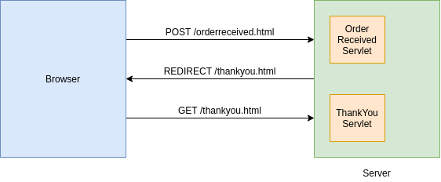
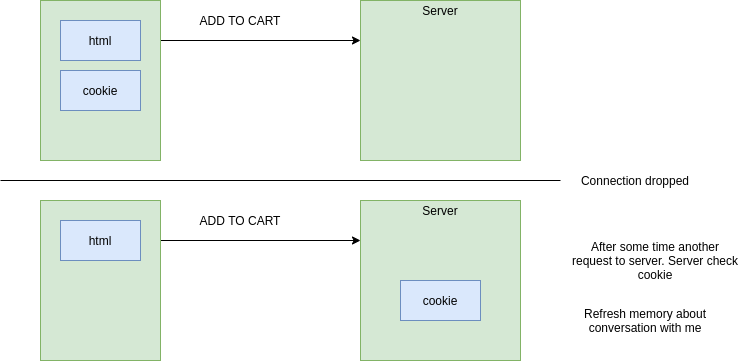
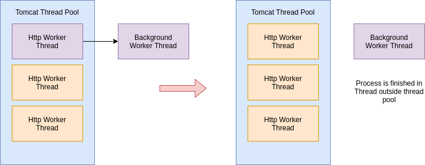
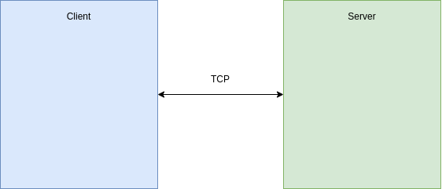
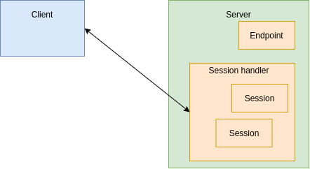

# Java Web Development

## Web development with Java

- Most projects use a framework.
- Java web development uses **servlets**.

### WAR file

- Static files
- **WEB-INF:**
    - All hidden files from webapp
    - Classes
    - Lib
    - **web.xml** - configuration of application
- **META-INF:**
    - Any info about war file
    - **Manifest.mf**
    
***    
    
## Servlets

```java
public class HelloWorldServlet extends HttpServlet {
    public void service(HttpServletRequest request, HttpServletResponse response) {
        PrintWriter out = response.getWriter();
        response.setContentType("text/html");
        out.println("<html><body><h1>Hello World!</h1>");
        out.close();
    }
}
```

### web.xml

```xml
<servlet>
    <servlet-name>MyServlet</servlet-name>
    <servlet-class>com.virtualpairprogrammers.servlets.HelloWorldServlet</servlet-class>
</servlet>

<servlet-mapping>
    <servlet-name>MyServlet</servlet-name>
    <url-pattern>/hello.html</url-pattern>
</servlet-mapping>
```

### Handling Forms

```html
<form action="/searchResults.html" method="GET">
    Find all dishes containing : <input type="text" name="searchTerm" id="searchTerm" /> <input type="submit" value="search" />
</form>
```

***

## GET and POST

### POST-REDIRECT-GET



***

## Sessions and Cookies

### Cookies



### Server Sessions

```java
public void service(HttpServletRequest request, HttpServletResponse response) throws IOException {
    PrintWriter out = response.getWriter();
    response.setContentType("text/html");

    HttpSession session = request.getSession();
    
    session.setAttribute("cart", cart);

    out.println("...");
    out.close();
}
```

***

## Servlet Security

- **Authentication:**
    - Who users are
    - Username and password
- **Authorization:**
    - Guest: 
        - /
    - User:
        - /order.html
        - thankyou.html
    - Admin:
        - /kitchen.html
        - /accounts.html

### Authorization

```xml
<security-constraint>

    <web-resource-collection>
        <web-resource-name>User only page</web-resource-name>
        <url-pattern>/order.html</url-pattern>
    </web-resource-collection>

    <auth-constraint>
        <role-name>user</role-name>    
    </auth-constraint>

</security-constraint>
```

***

## Asynchronous Servlets

### Comet / Reverse Ajax

- Streaming
- Long Polling

**HTTP 1.0**

- Connection a short lived

**HTTP 1.1**

- Connection kept open

### Asynchronous Servlets



## Websockets






