# Performance and Memory Management.

## What happens inside the JVM?

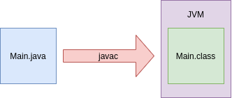

**Traditional interpreted language.**

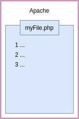

### JVM bytecode interpretation.

**Just In Time (JIT) compilation.**

- Code runs faster the longer it is left to run. 
- VM can profile your code.

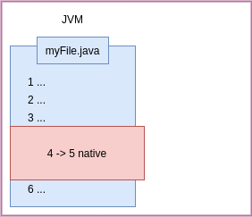

### Compiler Flags.

```
-XX:+PrintCompilation

java -XX:+PrintCompilation main.Main 10
```

### JVM JIT Compilers.

```
java -XX:+UnlockDiagnosticVMOptions -XX:+LogCompilation main.Main 5000
```

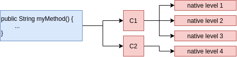

**Tuning the code cache size.**

```
VM warning: CodeCache is full. Compiler has been disabled.
```

```
-XX:+PrintCodeCache
```

- `InitialCodeCacheSize`.
- `ReservedCodeCacheSize`.
- `CodeCacheExpansionSize`.

```console
java -XX:ReservedCodeCacheSize=28m -XX:+PrintCodeCache main.Main 5000
```

**Remotely monitoring the code cache with JConsole.**

```
/usr/lib/jvm/java-11-amazon-corretto/bin/jconsole
```

### The differences between 32 bit and 64 bit JVM.

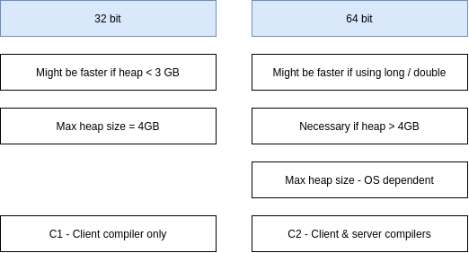

**Which compiler to use at runtime.**

- Client compilation, quicker startup time.

```
-client

java -client -XX:+PrintCompilation main.Main 15000
```

**JVM Compiler flags.**

- `-client`.
- `-server`.
- `-d64`.

**Turn off Tiered Compilation.**

- Run in interpreted mode only.

```
-XX:-TieredCompilation

java -XX:-TieredCompilation main.Main 5000
```

**Native Compilation Tuning.**

```
-XX:CICompilerCount=n

-XX:CompileThreshold=n
```

```console
java -XX:+PrintFlagsFinal
java -XX:+PrintFlagsFinal | grep CICompilerCount
```

- Check all running java processes.

```console
jps

jinfo -flag CICompilerCount <PID>

java -XX:CICompilerCount=6 -XX:+PrintCompilation main.Main 15000
```

***

## How Memory Works.

- Objects stored on the heap.
- Variables are a reference to the object.
- Local variables stored on the stack.

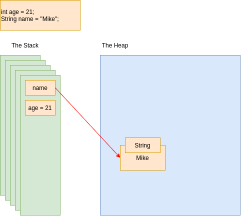

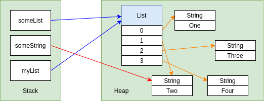

### Passing Values.

- For objects passed into methods, the REFERENCE to the object passed BY VALUE.

### The final Keyword.

```java
final Customer c = new Customer("John");
```

```java
final Customer c;
c = new Customer("John");
c = new Customer("Susan"); // compile error

s.setName("Susan"); // ok
```

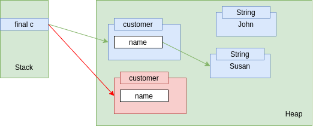

## Escaping References.

```java
public class CustomerRecords {
    private Map<String, Customer> records;
    
    public CustomerRecords() {
        this.records = new HashMap<String, Customer>();
    }

    public void addCustomer(Customer c) {
        this.records.put(c.getName(), c);
    }

    public Map<String, Customer> getCustomers() {
        return this.records; // problem: violate encapsulation
    }   
}
```

**1. Duplicating collections.**

- Creating new collection in memory.

```java
public Map<String, Customer> getCustomers() {
    return new HashMap<>(this.records); // duplicating collections
}  
```

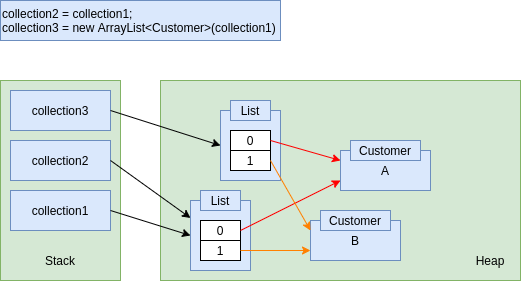

**2. Using Immutable Collections.**

```java
public Map<String, Customer> getCustomers() {
//    return Collections.unmodifableMap(records); // JDK <= 10 always create copy

    return Map.copyOf(records); // JDK >= 11 create copy if version not already unmodifable
}  
```

**3. Duplicating Objects.**

```java
public Customer find(String name) {
    return new Customer(records.get(name));
}
```

**4. Using interfaces to create immutable objects.**

```java
public interface ReadonlyCustomer {
    String getName();
}
```

**5. Using modules to hide implementation.**

***

## The Metaspace.

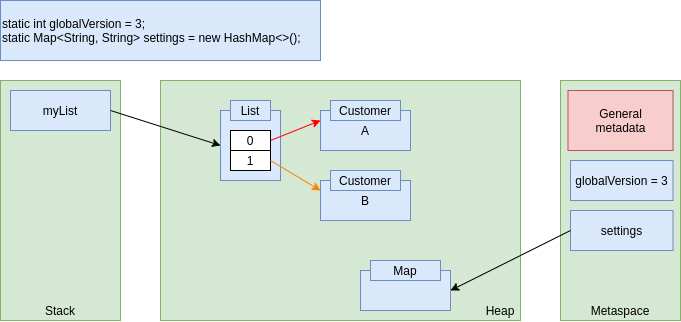

### Public vs Private.

```java
public class Customer {
    private Integer id;
    public String name;
    // ...
}
```

```java
Customer c = new Customer();
c.name = "Maciek";
```

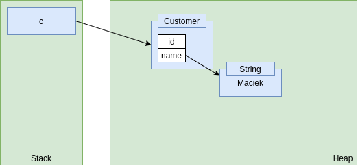

### Java 7 - the PermGen.

```
java.lang.OutOfMemoryError:PermGen
```

```
-XX:PermSize=N
-XX:MaxPermSize=N
```

### Are objects always on the heap?

- Sometimes JVM created objects on the stack, based on most efficient choice.

### String pool.

***

## JVM Tuning - Flags.

- HashMap.

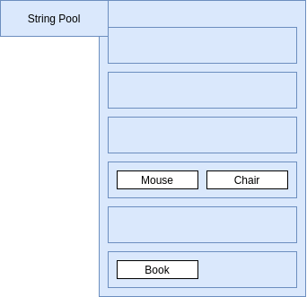

```
-XX:+PrintStringTableStatistics
```

```
-XX:StringTableSize=120121
```

### Tuning JVM Heap Size.

```
java -XX:+UnlockDiagnosticVMOptions -XX:+PrintFlagsFinal main.Main 5000
java -XX:+UnlockDiagnosticVMOptions -XX:+PrintFlagsFinal main.Main 5000 | grep MaxHeapSize
java -XX:+UnlockDiagnosticVMOptions -XX:+PrintFlagsFinal main.Main 5000 | grep InitialHeapSize
```

```console
java -XX:MaxHeapSize=600m -XX:+PrintStringTableStatistics -XX:StringTableSize=120121 main.Main 5000 


java -XX:InitialHeapSize=1g -XX:+PrintStringTableStatistics -XX:StringTableSize=120121 main.Main 5000 
```

**JVM Tuning**

- **-XX:+PrintStringTableStatistics:** How big String pool is.
- **-XX:StringTableSize=n:** Change number of buckets. 
- **-XX:MaxHeapSize=n:** **-Xmx**
- **-XX:InitialHeapSize=n:** **-Xms**
- **-XX:+UnlockDiagnosticVMOptions:** Default values of Max and Initial Heap Size.
- **-XX:+PrintFlagsFinal**

***

## Garbage Collection.

### Managed Languages.

- Java works out when objects are no longer needed.
- Memory leaks shouldn't be possible in Java.
- Garbage Collection is the process to free up memory.
- Any object on the heap which cannot be reached through a reference from the stack is "eligible for garbage collection".

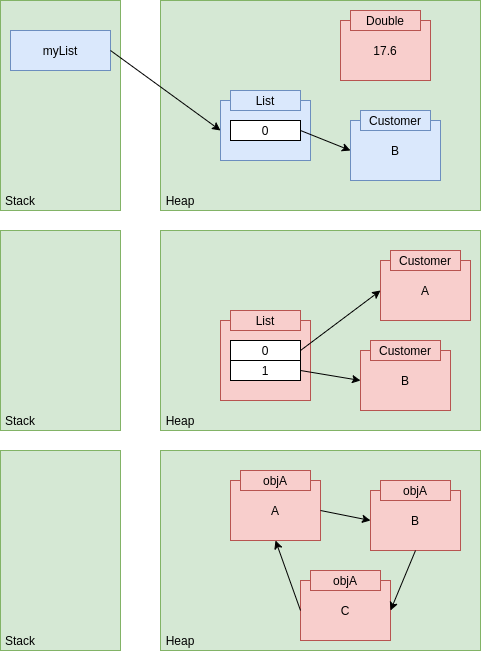

- Java 11 garbage collector can give unused memory back to the OS.

**When should you tell GC to run?**

- Evaluate performance of some code block.
- It is recommended to never run `System.gc()`.

***

## Monitoring the Heap.

### Memory Leaks.

- Memory leaks shouldn't be possible in Java.
- **Soft leaks:** when an object remains referenced when no longer needed.

```
jvisualvm
```

### :star: Generating a Heap Dump.

- Use **jvisualvm** (Java VisualVM): click **Heap Dump** button.
- Command line argument:
    - `-XX:+HeapDumpOnOutOfMemoryError -XX:HeapDumpPath=someFilePath`

### Viewing a heap dump.

- Use **Memory Analyzer (MAT)** from eclipse.
    - Also this tool can get Heap Dump.
- :star: **Heap Dump:**
    - jvisualvm
    - Command line argument `-XX:+HeapDumpOnOutOfMemoryError`
    - Memory Analyzer Tool    

***

## Generational GC.

### Garbage Collection.

- The "Mark and Sweep" process:

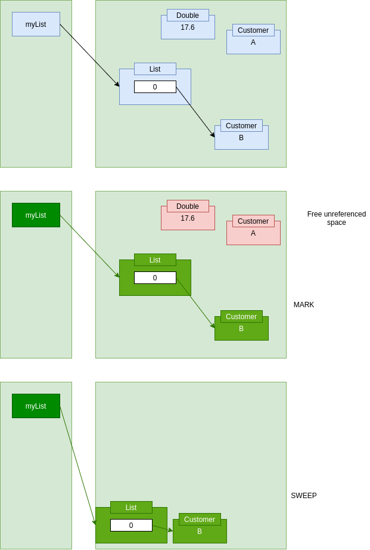

### Generational Garbage Collection.

- Most objects don't live for long.
- If an object survives it is likely to live forever.
- **Minor collection:** GC on young generation space.
- **Major collection:** GC on old generation space.

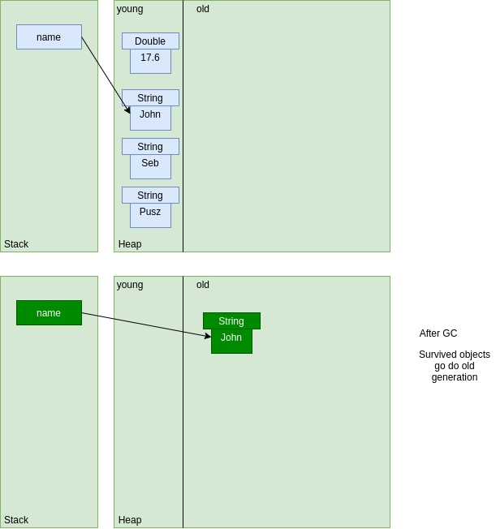

### Young generation - survivor spaces.

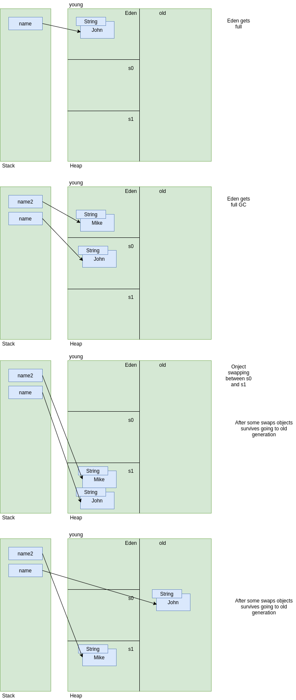

***

## GC Tuning & Selection.

```
-verbose:gc
```

### Tuning off automated heap allocation sizing.

```
-XX:-UseAdaptiveSizePolicy
```

```console
jinfo -flag UseAdaptiveSizePolicy <PID> 

jinfo -flag UseAdaptiveSizePolicy 62794
```

### Tuning Garbage Collection.

- **-XX:NewRatio=n**

```
jinfo -flag NewRatio <PID>
2
# Old gen will be 2x bigger that young
```

- **-XX:SurvivorRatio=n**

```
jinfo -flag SurvivorRatio <PID>
8
# s0 and s1 should be 1/8 th of young generation
```

- **-XX:MaxTenuringThreshold=n:**
    - How many times object survives before moving to old generation.
    
```
jinfo -flag MaxTenuringThreshold <PID>
15
```

### Choosing a Garbage Collector.

- Types of collectors:
    - Serial: `-XX:+UseSerialGC`.
    - Parallel: `-XX:+UseParallelGC`.
    - Mostly Concurrent: 
        - `-XX:UseConcMarkSweepGC`.
        - `-XX:+UseG1GC`.

### How G1 works.

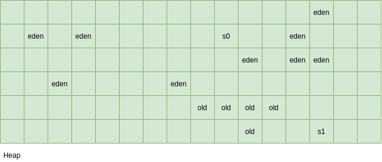

### Tuning G1.

```
-XX:ConcGCThreads=n

-XX:InitiatingHeapOccupancyPercent=n
```

### String De-duplication.

```
-XX:UseStringDeDuplication
```

- Only available if using G1.

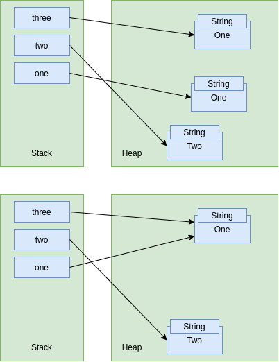

***

## Using a profiler.

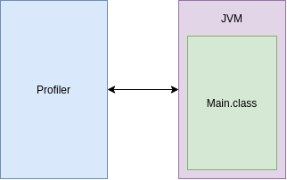

### Flight Recording.

```
-XX:StartFlightRecording=delay=2min,
duration=60s,name=Test,
filename=recording.jfr,
settings=profile
```

***

## Assessing Performance.

- Complications:
    - Native Compilation.
    - Garbage Collection.
    
### Benchmarking.

- Microbenchmark: Measuring the performance of a small piece of code
- More Complications:
    - Assessing in isolation.
    - Different Hardware.
    
**Turn off native compilation.**

```
-XX:-TiredCompilation
```

**Check whether native compilation took place.**

```
-XX:+PrintCompilation
```

***

## Benchmarking with JHM.

## How Lists Works.

### Types of List.

- ArrayList.
- CopyOnWriteArrayList.
- LinkedList.
- AttributeList.
- RoleList.
- RoleUnresolvedList.
- Stack.
- Vector.

**CopyOnWriteArrayList.**

- Consider using it when:
    - Multi-threaded application.
    - Multiple threads accessing the same list.
    - Lots of iterations / reads.
    - Few writes / additions / deletions.

**ArrayList.**

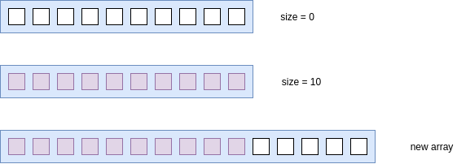

- Resizing ArrayList cost performance.
- Allocate size in advance to not require resizing.

```java
List<Book> books = new ArrayList<Book>(500000);
```

**Vector.**

- Thread safe.

**Stack.**

- LIFO operations.

**LinkedList.**

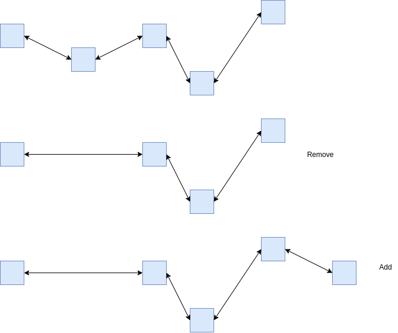

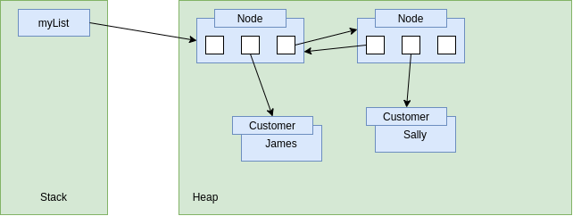

**Choosing List.**

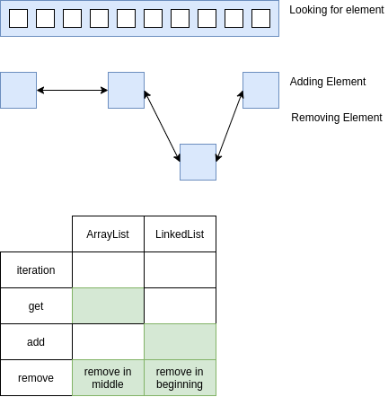

**Sorting Lists.**

- ArrayList and LinkedList using `Arrays.sort()`. 
- Difference is LinkedList is converted `toArray()` before sort.
- Pretty much the same performance.

***

## How maps work.

### HashMap.

```java
Map<Integer, Book> books = new HashMap<>();

books.put(3, book1);
```

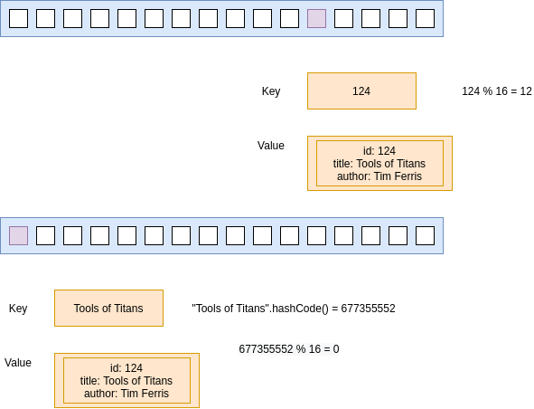

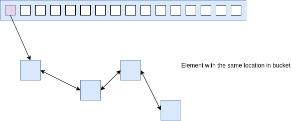

**HashMap factor**

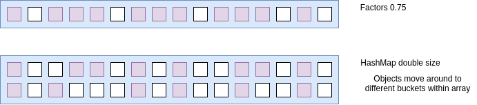

```java
Map<String, Book> books = new HashMap<>(500000, 0.6f); // 0.6f factor
```

- Larger array gives better performance, than smaller and navigate within linkedlist of the same bucket entry.

**Rules for hashcodes.**

- HashCodes:
    - Good range of numbers.
    - Equal objects must have equal hashcodes.

**LinkedHashMap.**

- HashMap:
    - Items iterate in a "random" order.
- LinkedHashMap:
    - Items iterate in a defined order.

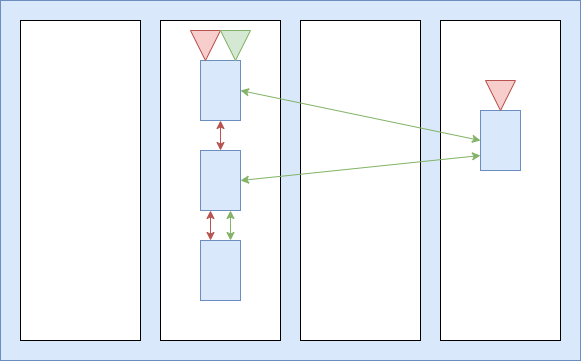

**Hashtable and TreeMap.**

- Hashtable thread safe HashMap.
- TreeMap maintains insertion order insert **(a,c,b,d) -> retrieve (a,b,c,d)**.

***

## Coding Choices.

- Primitives vs Objects.
- BigDecimal vs Double.
- StringBuilder vs Concatenating Strings.
    - StringBuilder better performance.
    - Strings in single line concatenation, optimized by JVM. 
    - JVM detects that and convert to StringBuilder.
- Loops vs Streams.

***

## GraalVM.

- Alternative JVM.
- Alternative Java Compiler.
- Native Compiler (no JVM required).
- Using the Graal compiler with OpenJDK 11 (Linux Only).

```
-XX:+UnlockExperimentalVMOptions
-XX:+EnableJVMCI
-XX:+UseJVMCICompiler
```

## Other JVM Languages.

- Java.
- JRuby.
- Clojure.
- Kotlin.
- Scala.
- Groovy.

**javap.**

- Look at bytecode using **javap**.

**decompiler.**

- CFR.
