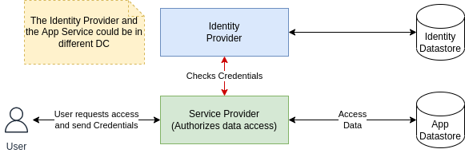
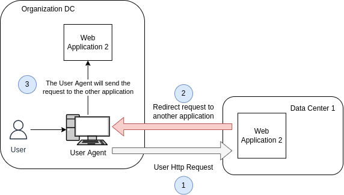
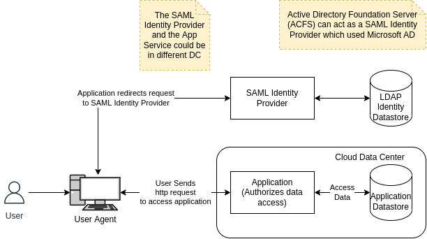
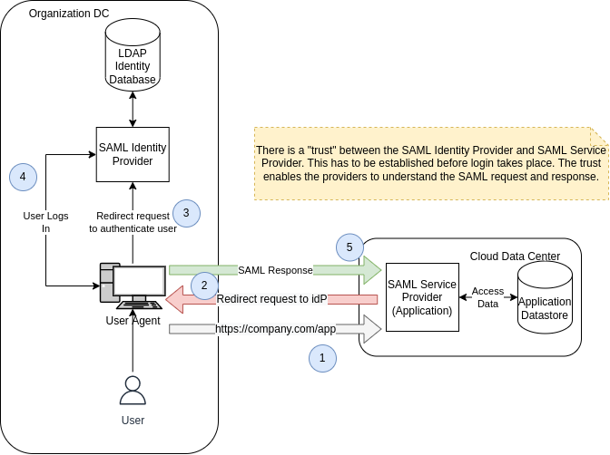

# OAuth2

## Security Basics - Providers

- User Identity:
  - Where are the user credentials stored?
- Authentication:
  - Who does this ? idP
  - How does it happen?
- Authorization:
  - Application does this.
  - Uses information for IdP

### LDAP

- Identity:
  - Stored in LDAP database.
  - Microsoft Active Directory.
- Authentication:
  - Done by LDAP (AD)
- Authorization:
  - Done by Application.
- LDAP and Application in the same data center.

### SAML (Security Assertion Markup Language)

- Communicating across data centers (use HTTP Redirect).

- Arrow 2 is an HTTP 302 Redirection response to Request marked as 1.

### SSO

- Avoid entering the user credentials (use SSO).
- The network user is already a part of AD.
- Single Sign On (SSO):
  - Enterprise SSO.

### SAML

- Identity:
  - Stored in LDAP database.
  - Microsoft Active Directory.
- Authentication:
  - SAML Identity Provider does the authentication.
  - ADFS.
- Authorization:
  - Application controls it.
  - Can use LDAP groups.

- SAML Request is a request to get user information from SAML Identity Provider (No password sent).
- SAML Metadata File.
- Trust between:
  - SAML Identity Provider.
  - SAML Service Provider.
- SAML Response:
  - Contains SAML Token.
  - Token contains claims.
- Federated User.
- Single Sign On.
- Redirect importance.

### Enterprise Problem use cases

- Problem 1 - Microservices.
- Problem 2 - Cloud apps:
  - How does REST calls across network boundaries get secured?
  - Basic Authentication is usually used to make a REST API call.
- Problem 3 - Machine to Machine:
  - Scheduled Tasks, Daemons sometimes need to call REST APIs. How are they secured?
  - No user involved.

### Social Media Platform

- Social Media Sites:
  - Facebook
  - LinkedIn
  - Google
  - Twitter
  - GitHub
  - Yahoo
- A user usually has Multiple Identities:
  - Many Identity Providers.
- What if a third party application wants to access or publish to these sites on behalf of its user?
  - User/password would be a bad idea.

***

## OAuth 2.0 Fundamentals

- The OAuth 2.0 authorization framework enables a **third-party application** to obtain **limited** access to an 
**HTTP service**, either **on behalf of a resource owner** by orchestrating an **approval interaction** between the
resource owner and the HTTP service, or by allowing the third-party application to obtain **access on its own behalf.**

**OAuth 2.0 - Roles**

- Resource Owner, should never send the password to the Third Party (untrusted) Application:
  - The User
  - User Agent
- Resource Server:
  - REST API which protects resource
- Client:
  - Application that needs access
- Authorization Server:
  - Authorizes the client
  - Gives out access tokens
  - Many on the internet
  - OAuth Endpoints

**OAuth 2.0 - Client Registration**

- Administration utility to register a Client.
- Redirect URIs.
- Client ID, Client Secret.
- When Client sends request to Authorization Server, it will send Client ID, Client Secret as well.

**OAuth 2.0 - Opaque Token**

- Access Token is sent in an HTTP Header.
- **Authorization: Bearer <token>**

**OAuth 2.0 - JWT Token**

- JWT Token is sent in a HTTP Header.
- **Authorization: Bearer <jwt token>**

**Grant Types**

