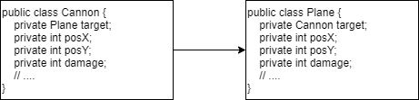
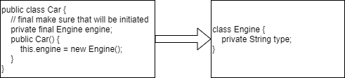
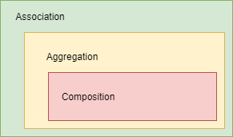
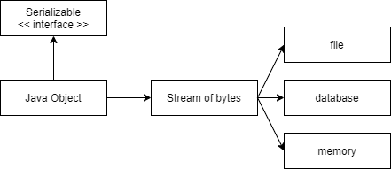
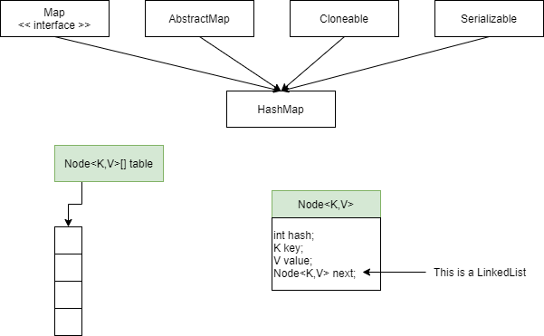
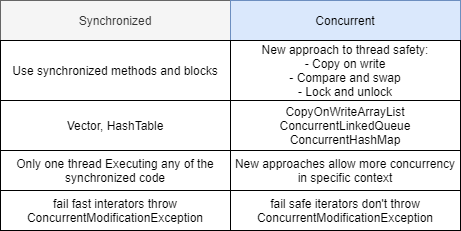
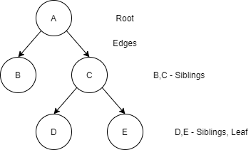
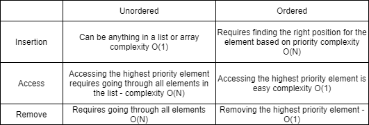
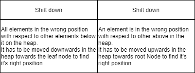

# Basic Java

### ClassCastException

- When references to object points to objects different classes.
- When argument is wrong type, method `compareTo` should throw ClassCastException.
- No explicit casting.
- Try add wrong data type to collection or array.
- SerialVersionUID.

### Constructor Chaining

- Call in the same class `this()`.
- Call from parent class `super()`.
- Used to execute more tasks in one constructor.
- Improve readability of code.

```java
public Temporary(int x, int y) { // 23, 34
   this(5);
   System.out.print(" " + x * y + " ");
}

public Temporary(int x) {     //5
    this();
    System.out.print(" " + x + " ");
}

public Temporary() {
    System.out.print(" Default ");
}

//Temporary temp = new Temporary(23, 34);
//-> Default  5  782
```

### Overloading

- Compile time polymorphism.
- Use the same method name but with different arguments.
- Static binding binds private, final, static method, fields, class, variables.

### Overriding

- Runtime polymorphism.
- The same method name with exactly the same arguments.
- Dynamic binding.

```
We cannot override private methods in Java as if we declare any variable, method as private that variable or method
will be visible for that class only and also if we declare any method as private than they are bounded with class at 
compile time not in runtime so we can't reference those method using any object.
```

- You cannot override static method in Java because method overriding is based upon dynamic binding at runtime
and **static method bounded using static binding at compile time**.

### final

- Value of member variable cannot be changed.
- Object reference cannot be changed.
- Class cannot be inherited.
- Method cannot be Overriding.

### finally

- Try, catch block. 
- Stuff in finally always be executed, even when in try return statement.
- `Finally` doesn't execute in cases like program crash before go to this block or `System.exit(0)` in `try`.

### finalize

- JVM call this method when GC is about to be called.

### `==` vs `equals`

- `==:` Check whether object are the same (point to the same place in memory, the same object).
- `.equals():` When compare content of objects.

### Class Loaders

- A Java class made up of a number of custom classes (written by programmers) and core classes, which come 
pre-packed with Java.
- When program executed, JVM needs to load the content of the needed class.
- JVM uses class loader to find the classes:
    - **Bootstrap Class Loader:** Loads all the Java core files.
    - **Extension Class Loader:** Loads all classes from extension directory.
    - **System Class Loader:** Loads all classes from CLASSPATH.
- When JVM needs to find a class, it starts with **System Class Loader**.
- If it is not found, it checks with **Extension Class Loader**.
- If it not found, it goes to the **Bootstrap Class Loader**.
- If class still not found, a **ClassNotFoundException** is thrown.

System Class Loader :arrow_right: Extension Class Loader :arrow_right: Bootstrap Class Loader :arrow_right: ClassNotFoundException

### Autoboxing

- Autoboxing is the automatic conversion that the Java compiler makes between the primitive types, and their
corresponding object wrapper classes.
- For example, converting an int to an Integer, double to a Double.
- If conversions goes the other way it is called **unboxing**.
- Autoboxing helps in saving memory by reusing already created wrapper objects.
- However, wrapper classes created using new are not reused.
- Two wrapper objects created using new are not same object.

```java
Integer nineA = new Integer(9);
Integer nineB = new Integer(9);
System.out.println(nineA == nineB); // false
System.out.println(nineA.equals(nineB)); // true
```

- Two wrapper objects created using boxing are same object.

```java
Integer nineC = 9;
Integer nineD = 9;
System.out.println(nineC == nineD); // true
System.out.println(nineC.equals(nineD)); // true
```

- Wrapper classes are **final and immutable**.

### SerialVersionUID

- Mark added to class to during deserialization, reconstruct proper class (unique identifier).
- Useful when there is some complex class hierarchies parent class, child class.

### this

- Can separate local variables from instance variables.
- `this` determines instance variables.
- Use `this` reference when instance and local variables have the same name.

### static

- For specified class can be only one static variable.
- Initialization is during class loading. 
- Static method does not work on objects, `Math.pow(x,a)`.
- Gets memory only once in class are at time class loading.
- Refer to common property of all objects, company name for example.
- Static methods belongs to class rather than object of class.
- Can be invoked without creating an instance of class.
- `this` and `super` cannot be used in static context.

### Why java main method is static?

- Because object not required to call static method if it were non static method, JVM creates object first
then call `main()` method that will lead the problem of extra memory allocation.
- A static block used to initialize the static data member. 
- It is executing before main method at the time of class loading.
- Static, variable (class variable), method (class method), block, nested class.
- Factories methods: Static methods that returns new class instance.
- You cannot override static method in Java because they are resolved at compile time rather than runtime.
- In Java6 it was possible to run program without main method by using static initialization block. 
- It is not a case anymore.

```java
public class Foo {
    static {
         System.out.println("Message");
         System.exit(0);
    }
}
```

### What are Initialization Blocks.

- Initialization Blocks: Code which runs when an object created or class loaded.
- There are two types of Initialization blocks.
    - **Static Initializer:** Code runs when a class loaded.
    - **Instance Initializer:** Code runs when a new object created.

### What is a static initializer.

- Code within `static {}` is called a static initializer. 
- This is run only when class is first loaded.
- Only static variables can be accessed in a static initializer.
- Even though three instances are created static initializer is run only once.

```java
public class InitializerExamples() {
    static int count;
    int i;
    static {
        // Static initializer is run only when class is first loaded.
        // only static vars can be accessed
        // i = 6; // ERROR
        count = 2; // OK
    }
}
```

### What is Regular Expression

- Regular Expression makes parsing, scanning and splitting a String very easy.
    - Pattern
    - Matcher
    - Scanner

### Enum

- Sometimes you need to define connected constants like.

```java
public static final int MONDAY = 0;
public static final int TUESDAY = 1;
```

- You can do this using enum. 
- Now weekday is data type with value `Weekday.MON`.

```java
enum Weekday {MON, TUE};

public Enum Size { SMALL, MEDIUM, LARGE; }
```

- Named constants. 
- No need to use equals method. 
- No need to override toString.
- Thread safe.
- Enum is subclass class of Enum class, which contains toString, valueOf and compareTo method.
- Compare element using `==`.
- Methods valueOf, ordinal.
- Enum constructors are always private.
- Variables Enum type can contain static variables.
- static import now can use **SMALL** instead of **Size.SMALL**.
- Enum allows specifying a list of values for a Type.
- Example below declares an enum Season with 4 possible values

```java
enum Season {
  WINTER, SPRING, SUMMER, FALL
};
```

- Value of enums can be compared using `==` or `equals` function.

### Variable arguments

- Variable arguments allow calling method with different number of parameters.

```java
public int sum(int... numbers) {
    // ...
}
```

### String

- Immutable and final:
    - Thread safe: Prevents from change cache.
    - String pool cache: Optimization.
    - Hash codes: Keys in hashCodes are Strings.

### Why String is immutable?

- Value of a String once created cannot be modified.
- Any modification on a String object creates a new object.

```java
String str3 = "string1";
str3.concat("string2");
System.out.println(str3); // string1
```

- The result should be assigned to a new reference variable (or some variable can be reused).

```java
String concat = str3.concat("string2");
System.out.println(concat); // string1string2
```

### Where are String literals store in memory?

- All strings literals stored in **String constant pool**.
- If compiler finds a String literal, it checks if it exists, if is reused.
- Following statement creates 1 String object **created on pool** and 1 referenced variable.

```java
String str1 = "Value";
```

- However if `new` operator is used to create String object, the new object is created on **heap**.
- Following piece of code created 2 objects.

```java
// 1. String Literal "Value" - created in the "string constant pool"
// 2. String object - created on the heap
String str1 = "Value"
String str2 = new String("Value");
```

- Some methods:
    - `charAt()`
    - `length()`
    - `equalsIgnoreCase()`
    - `substring()`

### toString method

- Is used to print a content of an object.
- If not overridden default implementation is printed.
- It prints hashCode and class name.
- If overridden new content printed.

### Interfaces

- All methods public abstract (Since Java8 can also be static and default methods).
- All properties public static final.
- Implement interfaces, want to imitate behavior of class. 
- Used to impose behavior on other classes.
- You can implement more than one interface (impose behavior), example implements Comparable interface (strategy pattern)
to extort sorting behavior.
- You cannot put instance variables. 
- Interface determines behavior not state of object.
- You can provide default implementation of interface. 
- Mark such method with `default` modifier.

```java
public interface IntSequence {
    default boolean hasNext() {
        return true;
    }
}
```

- Keyword super allows to call super type methods.
- A comparable interface when class want to allow sort their elements.
- Callback: Code fragment is call as a result on user response.
- Interface is used heavily in API to define contract of a class.
- You cannot create non abstract method in an interface. 
- All methods are for default abstract.
- Since Java 8 methods in interfaces can contain `default`, `static` and `abstract` methods.

### Class Object

- Parent class of all classes:
    - `hashCode()`
    - `equals()`
    - `toString()`
    - `clone()`
    - `finalize()`
    - `notify()`
    - `notifyAll()`
    - `wait()`

### Abstract class and methods.

- Cannot instantiate abstract class.
- Are needed during inheritance.
- Want something to be overridden to not forget about it later.
- Additional responsibilities added to class.

### OOP

- Objects: Containers that keep variables functions thematically connected to each other, to use it easier later.
- Classes: Frame to build instances of objects.
- Objects have:
    - properties
    - methods
- Constructor: Reserve space in memory for object.
- Creating an object from a class is called instantiation.
- Constructor references: Are counterpart to method references.

```java
Employee::new
int[]::new === n->new int[n]
```

- Local class not declared as public or private as it isn't available outside of method.
- Abstract method does not have implementation, abstract class can not have instantiation.
- Class can define methods without implementation forcing subclasses to implement them. 
- Such method and class that contain it called abstract.
- Abstract classes can have instance variables or constructors.
- **Abstract class is used to provide default implementation with something left to customize.**
- Encapsulation: Use of objects implemented by someone else, use their methods without know what sits inside.
- Instance variable are in default initialized.
- Local variables need to be explicitly initialized.
- If part can exist without whole then relationship between two class known as **aggregation**.
- If part cannot exists without whole the relationship between two class known as **composition**.

### What is the difference between composition and inheritance ?

- Composition refers to defining behavior by member variables a class includes.
- Inheritance refers to defining behavior by the interfaces or classes that a class inherits from.
- Composition = "has-a", Inheritance = "is-a".

### Association

- The Association relationship indicates that class know about and holds reference to another class.
- Association can be described as "has-a" relationship



### Aggregation

- One object is User of another object.


### Composition

- One object is an owner of another.



- Relations between objects only differ in their strength.
- Composition the strongest relationship, ASSOCIATION the most general.



***

### How are the Strategy Pattern and Dependency Injection related ?

- Each defines behavior by setting member variables of a class.

### Reflection

- Reflection is a way to invoke methods of objects on the fly at run-time.
- Reflection is slow and complicated. Method calls via reflection may take **10x** longer than usual.
- Instantiation an object from a name of a class.
- Reflection is the ability at runtime to actually create objects of classes, invoke methods, manipulate metadata.
- **Type introspection:** Is the ability at runtime to explore the type of object.
- Reflection drawbacks:
    - Complexity
    - Performance overhead
    - Security consideration
    - Violation of abstraction
- Reflection is good for unit testing jUnit.

### Volatile

- Declaring variable volatile means the value of this variable will never be cached thread locally.
- All reads and writes will go straight to main memory.
- Access to the variable acts as through it is enclosed in a synchronized bock, synchronized on itself.
- Slower than cache, make sure value read every time.
- Happens-before relationship means any writes happens before any read in volatile variable (write first then read).
- Every thread reads its value from main memory and don't used cached value available in every thread stack.
- Volatile variable prevents compiler from reordering which can compromise synchronization.
- Only applicable to field or properties of class.
- You cannot use a volatile keyword during class or method declaration in Java.

### Synchronized

- Every object in Java has a lock associated with it.
- This lock called the intrinsic lock or monitor.
- It is possible to specify that only one thread can execute a section of code once it has acquired the lock on same object.
- If some other thread currently holds that lock, the current thread must waits its turn.
- This is achieved using synchronized keyword.
- Using right making a method synchronized can help eliminate thread interference and memory consistency error.
- Making method synchronized is a shortcut to making the entire body of the method as synchronized on "this".
- If we use synchronized we don't need to use a volatile keyword.

### Enumerator and Iterator differences.

- Iterator allows you to remove elements from collection. 
- Methods for iterator `hasNext()`, `next()`.
- Iterator does not allow other thread to modify the collection object while some thread is iterating over it and throws
`ConcurrentModificationException`.
- Enumerator `hasMoreElements()`: For Collections read only.

### What is load factor of HashMap.

- HashMap performance depends on two things:
    - Initial capacity.
    - Load factor.
- Whenever create HashMap initial capacity number of buckets is created initially.
- Load factor is criteria to decide when we have to increase the size of HashMap when its about to get full.

### Why wait and notify is declared in Object class instead Thread?

- Both are communication mechanism between two threads in Java.
- Object class makes them available for every object.
- If this mechanism is not available via any Java keyword like synchronized.
- Locks are available on per Object basis, which is another reason wait and notify is declared in Object class
rather than Thread class.

### Why wait and notify called from synchronized method in Java?

- To avoid:
    - **IllegalMonitorStateException** which will occur if we don't call `wait()`, `notify()` or `notifyAll()` method
    from synchronized context.
    - Any potential race condition between `wait()` and `notify()` method in Java.

### What will happen if we put a key object in a HashMap which is already there?

- It will replace the old mapping because HashMap doesn't allow duplicate keys.
- The same key will result in the same hashcode and will end up at the same position in the bucket.
- Each bucket contains a Linked List of `Map.Entry` object, which contains both Key and Value.
- Now Java will take the Key object from each entry and compare with this new key using `equals()` method.
- If that return true then value object in that entry will be replaced by new value.

### Casting

- Casting used when we want to convert one data type to another. 
- Two types of casting:
    - Implicit casting (Widening).
    - Explicit casting (Narrowing).
- Implicit Casting is done by a compiler.
- Good example of implicit casting are all the automatic widening conversions i.e. storing smaller values in larger 
variables types.

```java
int value = 100;
long number = value; // Implicit casting
float f = 100; // Implicit casting
```

- Explicit Casting done through code.
- Example are narrowing conversions, storing larger values into smaller variables.
- Explicit casting would cause truncation of value if the value stored is greater than the size of variable.

```java
long number1 = 12345;
int x = (int) numer1; // Explicit casting
```

### Variables initialization in Java.

- Member object and static class variables always initialized with default values.
- Local / block variables are **NOT** initialized by a compiler.

```java
public class VariableInit {
  public static void main(String[] args) {
      Player player = new Player();
      // score is an int variable default 0
      System.out.println(player.score); // 0
      // name is a member reference variable default null
      System.out.println(player.name); // null
      int local; // not initialized
      // System.out.println(local); // ERROR
      String value = null; // initialized
      System.out.println(value); // null
  }
}
```

### Variables in JAVA.

- Instance Variables (Non-Static Fields): Declared outside a method but inside a class.
- Class Variables (Static Fields): One copy of this variable in existence.
- Local Variables: Methods stores its temporary state in local variables.
    - Declared between `{}` in method.
    - Accessible only in method declared.
- Parameters: Classified as variables.

***

## Java Memory Management.

### Stack

- All local variables defined in a stack.
- No more data after last `}`. 
- Tide scoping.
- Local variable short lifetime.

### Heap

- Longer lifetime store data.
- Objects are in Heap.
- Huge area of storing data.
- All memory from your application except data on a stack.
- One heap for all threads, number of stacks for each Thread.

**Java Memory - Rule**

- Objects stored on the heap.
- Variables are a reference to the object.
- Local variables stored on the stack.

### Passing variables by value.

```java
class Main {
   public static void main(String[] args) {
       int localValue = 5;
       calculate(localValue);
       System.out.println(localValue); // 5
   }
   // copy of local variable
   public static void calculate(int calcValue) {
       calcValue = calcValue * 100;
   }
}
```

### How objects passed.

- For an object passed into methods, the **REFERENCE** to the object is passed **BY VALUE**.
- :star: No object passed to method but rather pointer to object.
- Passing Values.

```java
public class Main {
    public static void main(String[] args) {
        Customer c = new Customer("Betty");
        renameCustomer(c);
        System.out.println(c.getName()); // Grazyna
    }
    public static void renameCustomer(Customer cust) {
        cust.setName("Grazyna");
    }
}
```

### The final keyword.

- Can be assigned only once.

```java
final Customer c;
c = new Customer("Mark");
c = new Customer("Amanda"); // ERROR
c.setName("Robert"); // OK
```

### Immutable collections.

- `Collections.unmodifableMap()`
- `Collections.unmodifableList()`

```java
String three = new Integer(67).toString().intern(); // JVM optimizes of building object
String four = "67";
```

### Garbage Collector.

- In other languages you must state when an object is no longer needed by calling a method like `free()`.
- Object that are not freed continue to consume memory ... this is a memory leak.
- Java avoids memory leak by:
    - Running on a virtual machine.
    - Adapts a Garbage Collection strategy.
- Garbage Collection: Any object on the Heap which cannot be reached through a reference from a stack
is eligible for garbage collection.
- Soft Leaks: An object referenced on the stack even though it will never be used again.
- Vm arguments.
    - `-Xmx100m:` Run application with small heap size.
    - `jvisualvm.exe`
- Generational Garbage Collection:
    - Most object's don't live for long.
    - If an object survives it is likely for live forever.
- GC young generation deletes unused objects.
- After that String go to old generation.
- Actually it can be 8 GC, but the VM changes the number of generations based on the amount of memory available.
- **Program VirtualGC to view some memory leaks**.

### PermGen / MetaSpace

- PermGen is never GC.
- On PermGen internalize String metadata of class stored in this.
- Info about class.
- Problem to many classes or internalized strings.
- Increase size of PermGen.
- If you redeploy number of times the PermGen will run out of space.
- **Java 7**:
    - No internalized Strings stored in PermGen.
    - They are an old part of heap and can be GC.
- **Java 8**:
    - Remove PermGen introduce metaspace where all metadata of classes placed. 
    - No part of Heap.
    - Max size of metaspace is your computer Space.

### Tuning the VM.

- `-Xmx:` Set the maximum heap size.
- `-Xms:` Set starting heap size.

```
-Xmx512m -Xms150m
```

- PermGen Size `-XX:MaxPermSize`.

```
-XX:MaxPermSize=256m
```

- `-verbose:gc:` Print to the console when garbage collection takes place.

```
-Xmx10m -verbose:gc
```

- Young generation, **1/3 heap size**:
    - `-Xmn:` Set the size of young generation.
    - `-Xms256m`.

### Generating heap dumps.

- Creates a heap dump file "hprof".

```
-XX:HeapDumpOnOutOfMemory 
```

### Choosing a GC

- Types of GC:
    - Serial: `-XX:+UseSerialGC`
    - Parallel young generation: `-XX:+UseParallelGC`
    - Mostly Concurrent:
        - `-XX:+UseConcMarkSweepGC`
        - `-XX:+UseG1GC`
- Use `-XX:+PrintCommandLineFlag` to find out which is your default.
- **jmeter** to generate load.

```
apache-jmeter
```

- **WeakReferences:** Might not survive GC. 
    - If not variable will be equal to null.
- **Soft:** Stronger than weak, can be destroyed if GC claims that space needed.

```java
WeakReferencs<Book> mybook = book1;
SoftReference<Book> mybook = book2;
```

- **WeakHashMap:** Reference between key and values are weak.

```java
Map<Book, BookImage> imageCache = new WeakHashMap<>();
```

- Guava Library can make soft HashMap.

### hashCode, equals, toString

**hashCode**

- You must override hashcode in every class that overrides equals.
- Failure to do so affect working with hash based collections like **HashMap**, **HashSet**.
- In **Map** objects stored as key and value.
- `put(key,value)` method used to store objects in **HashMap** at this time.
- `hashCode()` method used to calculate the hash code of key object and both key and value object stored
as `map.entry`.
- If two keys object have some hash code then only one value object is stored in the same bucket location but
as a linked list value stored and if hash code is different then another bucket location created.
- While retrieving `get(key)` method used at this time hashCode of key object calculated and then `equals()` method
called to compare value object.

**equals**

- Check whether one object can be equal to another.
- Equals method implemented in Object class, check whether two references to object are identical.
- Override equal method if you want to check equality based on state of object.
- Two object are equals when they have the same value.
- Equals method used when we compare two objects.
- Default implementation of equals method defined in Object class.
- Two object references are equals only if they are pointing to the same object.
- We need to override equals method, if we would want to compare the contents of an object.
- We can override equals method in the class to check the content of the objects.
- The implementation of equals method checks if the id's of both objects are equal. If so return true.

```java
@Override
public boolean equals(Object obj) { 
    Client other = (Client) obj;
    if (id != other.id) {
        return false;
    }
    return true;
 }
```

- Important things to consider when implementing equals method:
    - **Reflexive:** For any reference value x, `x.equals(x)` return true.
    - **Symmetric:** For any reference values x and y, if `x.equals(y)` should return true if and only if `y.equals(x)`
    returns true.
    - **Transitive:** For any reference values x, y and z, if `x.equals(y)` returns true and `y.equals(z)` returns true,
    then `x.equals(z)` must return true.
    - **Consistent:** For any reference values x and y, multiple invocations of `x.equals(y)` consistently return true
    if no information used in equals modified.
    - For any non-null reference value x, `x.equals(null)` should return false.

```java
@Override
public boolean equals(Object obj) {
    if (this == obj) {
        return true;
    }

    if (obj == null) {
        return false;
    }

    if (getClass() != obj.getClass()) {
        return false;
    }
    
    Client other = (Client) obj;
    if (id != other.id) {
        return false;
    }
    return true;
}
```

**hashCode**

- Hash is integer number that identify an object.
- If x and y are different objects, `x.hashCode` and `y.hashCode` should also be different (but not always are).

```java
@Override
public int hashCode() {
    int hash = 1;
    for (int i = 0; i < str.length(); i++) {
        hash = 31 * hash + chartAt(i)
    }
    return hash;
}
```

- HashCode must be compatible.
- If `x.equals(y)` return true, `x.hashCode() == y.hashCode()`.
- If you change equals method you have to change `hashCode()`.
- Failure to do so results in objects put in hash based data structures **HashSet**, **HashMap** could be lost.

```java
Object.hash(some, some2);
```

- HashCode's are used in hashing to decide which group (or bucket) an object should be placed into.
- A group of object's might share the same hashCode.
- The implementation of hashCode decides effectiveness of Hashing.
- A good hashing function evenly distributes objects into different groups or buckets.
- A good hashCode should have the following properties:
    - If `obj1.equals(obj2)` is true, then `obj1.hashCode()` should be equal to `obj2.hashCode()`.
    - `obj.hashCode()` should return the same value when run multiple times, if values of obj used in `equals()`
    have not changed.
    - If `obj1.equals(obj2)` is false, it is **NOT** required that `obj1.hashCode()` is not equal to `obj2.hashCode()`.
    Two unequals objects might have the same hashCode.

```java
@Override
public int hashCode() {
    final int prime = 31;
    int result = 1;
    result = prime * result + id;
    return result;
}
```

### :star: Serialization

- Abstract class: High level class, by who inherits.
- Data serialization allows to know about all references (extends).
- Serialized object will be read to file.
- They will acquire some special identification number (SerialVersionUID), object will use this number to other objects.
- To perform serialization class need to implements **Serializable** interface.
- Serializable marker interface (without method), safety guard to make sure you know what you are doing.
- **transient** data that we don't want to be serialized.
- Fragile data should be marked as transient, or should not implement **Serializable**.
- Serialization is a mechanism to transform in collection of bytes, which can be then deliver to other place
save on disk, and reconstruct objects based on this collection of bytes.
- Deliver object from one VM to another.
- To make object serializable that means can transform to bytes states it has to be an instance of Serializable interface.
- Serializable mechanism supports version `serialVersionUID = 1L;` is used to enhanced state,
what would happen when class would change.
- Static variables are no serialized only instance variables are serialized.



- Serialization helps us to save and retrieve state of an object:
    - Serialization: Convert object state to some internal object representation.
    - Deserialization: To reverse convert internal representation to object.
- Two important methods:
    - `ObjectOutputStream.writeObject():` Serialize and write to file.
    - `ObjectInputStream.readObject():` Read from file and deserialize.

**How to serialize a object using Serializable interface**

- To serialize a object it should implement a Serializable interface.
- In the example below, Rectangle class implements Serializable interface.
- Note that Serializable interface does not declare any method to be implemented.
- Create new Rectangle object and serializing it to a file Rectangle.ser.

```java
class Rectangle implements Serializable {
    int length;
    int breadth;
    int area;

    public Rectangle(int length, int breadth) {
        this.length = length;
        this.breadth = breadth;
        area = length * breadth;
    }
}

// ...
FileOutputStream fileStream = new FileOutputStream("Rectangle.ser");
ObjectOutputStream objectStream = new ObjectOutputStream(fileStream);
objectStream.writeObject(new Rectangle(5,6));
objectStream.close();
```

**How to deserialize on Java**

- A rectangle object is deserialize from file Rectangle.ser.

```java
FileInputStream fileInputStream = new FileInputStream("Rectangle.ser");
ObjectInputStream objectInputStream = new ObjectInputStream(fileInputStream);
Rectangle rectangle = (Rectangle) objectInputStream.readObject();
objectInputStream.close();
```

- We mark all the properties of the Object that should not be serialized as transient.
- Transient attributes in an object not serialized. 
- As we don't need to serialize **area** we can calculate it later mark this variable as transient.
- All classes that need to be serialized have to implement Serializable interface.

**Are the constructors in an object invoked when it is de-serialized?**

- No when a class is de-serialized, initialization (constructor's initializer's) does not take place.
- The state of an object retained as it is.

**Are the values of static variables stored when object serialized?**

- Static variables are not part of the object they are not serialized.

**Different between Serializable and Externalizable**

- Serializable is marker interface with no method defined. 
- Use default serialization process which can be very slow for some application.
- Externalizable interface has two methods `readExternal()` and `writeExternal()` which allows you to control
the serialization process.

### :star: How HashMap works?

- It's a Map implementation.
- A Map is an associative array data structure `"key1"->value`, `"key2"->value`.
- **Hashing:** Transformation of a string of characters(Text) to a shorted fix-length value that represents original string.
- A shorter value helps in indexing and faster searches.
- In Java every object has a method `public int hashCode()` that will return a hash value for given object.
- If two objects are equal they should have the same hashcode as well.
- **Hashcode** is used to storing values in HashMap. 
- If hashcode is wrong you could not get corresponding value.
- Index of null key is always 0, as hash of null is always 0.



**PUT**

- Each index in this table known as bucket. 
- Each bucket is a node that can be linked list of a node.

```
                                                    +---+
    scores.put("QUEEN",120);                        | 0 |--> WALL | 70772256 | 70 | null
    scores.put("KNIGHT",100);                       +---+
    scores.put("CASTLE",10);                        | 1 |
    scores.put("RAM",110);                          +---+
    scores.put("SWORD",99);                         | 2 |--> KNIGHT | 64205538 | 100 | null
    scores.put("GALLEON",80);                       +---+
    scores.put("WALL",70);                          | 3 |
                                                    +---+
    +------------------------+                      | 4 |--> QUEEN | 2306996 | 120 | * --> CASTLE | 63281940 | 10 | * --> GALLEON | 2656852 | 80 | null
    | put(K k, V v)          |                      +---+
    |   hash(k)              |                      | 5 |
    |                        |                      +---+
    |   index = hash & (n-1) |                      | 6 |--> SWORD | 79019862 | 99 | null
    | n = 16                 |                      +---+
    +------------------------+                      | 7 |
    scores.put("QUEEN",120);                        +---+
    hash("QUEEN") = 2306996                         | 8 |
    index = 2306996 & 15 = 4                        +---+
                                                    | 9 |
    scores.put("KNIGHT",100);                       +---+
    hash("KNIGHT") = 64205538                       | 10|--> RAM | 2163866 | 110 | null
    index = 64205538 & 15 = 2                       +---+
                                                    | 11|
    scores.put("CASTLE",10);                        +---+
    hash("CASTLE") = 63281940                       | 12|
    index = 63281940 & 15 = 4 (COLLISION)           +---+
                                                    | 13|
    scores.put("RAM",110);                          +---+
    hash("RAM") = 2163866                           | 14|
    index = 2163866 & 15 = 10                       +---+
                                                    | 15|
    scores.put("SWORD",99);                         +---+
    hash("SWORD") = 79019862
    index = 79019862 & 15 = 6

    scores.put("GALLEON",80);
    hash("GALLEON") = 2656852
    index = 2656852 & 15 = 4 (COLLISION)

    scores.put("WALL",70);
    hash("WALL") = 70772256
    index = 70772256 & 15 = 0
```

**GET**

```
    scores.get("KNIGHT");
    scores.get("QUEEN");
    scores.get("GALLEON");

    +------------------------+
    | V get(Object key)      |
    |   hash(key)            |
    |                        |
    |   index = hash & (n-1) |
    +------------------------+
    scores.get("KNIGHT");
    hash = 64205538
    index = 64205538 & 15 = 2

        Compare hash with hash that is stored under index = 2, 64205538 == 64205538 = true
        Compare key using equals method "KNIGHT".equals("KNIGHT") = true

    scores.get("KNIGHT") = 100; // FOUND VALUE


    scores.get("QUEEN");
    hash = 2306996
    index = 2306996 & 15 = 4

        Compare hash with hash that is stored undex index = 4, 2306996 == 2306996 = true
        Compare key using equals method "QUEEN".equals("QUEEN") = true

    scores.get("QUEEN") = 120; // FOUND VALUE


    scores.get("GALLEON");
    hash = 2656852
    index = 2656852 & 15 = 4

        Compare hash with that is stored under index = 4, 2656852 == 2306996 = false
            Compare hash with that is stored under index = 4, next node, 2656852 == 63281940 = false
                Compare hash with that is stored under index = 4, next node, 2656852 == 2656852 = true
        Compare key using equals method "GALLEON".equals("QUEEN") = false
            Compare key using equals method, next node, "GALLEON".equals("CASTLE") = false
                Compare key using equals method, next node, "GALLEON".equals("GALLEON") = true

    scores.get("GALLEON") = 80; // FOUND VALUE
```

- In Java 8, when we have too many unequal keys which gives some `hashcode(index)`.
- When the number of items in a hash bucket grows beyond `threshold(TREEIFY_TRESHOLD = 8)`, content of that bucket
switches from using LinkedList of Entry objects to a Balanced Tree.
- This theoretically improves the worst-case performance from `O(n)` to `O(log n)`.
- Balanced Search Tree, where leaf nodes have lesser weight (HashCode or Comparable result) for the Keys involved.

### Exception Handling

- Exception handling helps us to recover from an unexpected situations like file not found, connection lost.
- Important part is try-catch block.
- If exception handled it does not propagate further.
- In a try block, the lines after the line throwing exception not executed.

**finally block**

- When an exception happens the code after the line throwing exception not executed.
- If code like closing connection is present in these lines of code, it is not executed.
- This leads to connection and other resource leaks.
- Code written in finally block executed even when there is an exception.
- Dangling unclosed connection.
- Finally block used when code needs to be executed irrespective of whether an exception thrown.

```java
} finally {
    connection.close();
}
```

- In what scenarios finally block not executed:
    - If exception thrown in finally.
    - If JVM crashes in between (for example `System.exit()`).
- Finally block execute even when there is a return statement in try block.
- try without catch block is allowed for instance since Java 7.

```java
try {
    // ...
} finally {
    // ...
}
```

- Java 7 try with resources (automatic resource management).

```java
try (FileInputStream input = new FileInputStream("file.txt")) {
    // ...
}
```

- Hierarchy of Exception class in Java:
    - Throwable is the highest level of Error Handling classes.

```java
// Pre defined Java Classes
class Error extends Throwable {}
class Exception extends Throwable {}
class RuntimeException extends Exception {}
```

### Difference between Error and Exception

- Error used in a situation where there is nothing programmer can do about an error, StackOverflow, OutOfMemory.
- Programmer can handle Exception.

### Difference between checked and un-checked exceptions

- Runtime Exceptions and classes that extends RuntimeException are called unchecked exception.
- Other Exception classes are called Checked Exceptions.
- They are Subclasses of Exception which are not subclass of RuntimeException.
- Checked exceptions should be handled or thrown.

### Create custom Exception

- By extending Exception class or RuntimeException class.
- If extends Exception class it will be checked exception.
- If extends RuntimeException it will be un-checked exception.

```java
class CustomException extends Exception {
    // ...
}
```

### Order of Exceptions

- Specific Exception should be before the Generic Exception.

```java
try {
    // ...
} catch (CurrenciesDoNotMatchException e) {
    // ...
} catch (Exception e) {
    // ...
}

// Multiple repeated exception
catch (IOException | SQLException e)
```

### Checked and Unchecked Exceptions

- Checked Exceptions ensures that handling of exception is provided and its verified by compiler also.
- For throwing unchecked (Runtime) exception no special provision is needed.

### :star: Generics

- Generics used to create Generic Classes and Generic Methods which can work with different Types (classes).
- Make class type parameter to a class.

```java
class MyListGeneric<T> {
   private List<T> values;

   void add(T value) {
       values.add(value);
   }

   void remove(T value) {
       values.remove(value);
   }

   T get(int index) {
       return values.get(index);
   }
}
```

- To restrict Generics to a subclass of particular class we can use Generic Restrictions `T extends Number`.
- We can use the class MyListRestricted with any class extending (subclass) of Number:
    - Float
    - Integer
    - Double
- String is not valid substitute for `T extends Number`.

```java
class MyListRestricted<T extends Number> {
   private List<T> values;

   void add(T value) {
       values.add(value);
   }

   void remove(T value) {
       values.remove(value);
   }

   T get(int index) {
       return values.get(index);
   }
}
```

- **PECS:** Produces extends, Consumer super.

### File API

| Action | Usage Example |
|---|---|
| Create file | `File file = new File("nazwa.txt");` |
| Check if exists | `file.exists();` |
| Create new file | `file.createNewFile();` |
| Full path | `file.getAbsolutePath();` |
| Create new directory | `File newDir = new File("newDir"); newDir.mkdir();` |

- File class represents files and directories.
- Write to file using FileWriter:
    - `write()`
    - `flush()`
    - `close()`
- Read from file using FileReader:
    - `read()`
    - `close()`
- BufferedWriter and BufferedReader provide better buffering in addition to basic file writing and reading operations.
- For example instead reading entire file, we can read file line by line.
- BufferedWriter class helps writing to a class with better Buffering than FileWriter.
- BufferedWriter constructor only accept another writer as argument.

```java
FileWriter fileWriter = new FileWriter("text.txt");
BufferedWriter bufferedWriter = new BufferedWriter(fileWriter);
bufferedWriter.write("Elephant");
bufferedWriter.newLine();
bufferedWriter.write("Africa");
bufferedWriter.flush();
bufferedWriter.close();
fileWriter.close();
```

- BufferedReader helps to read the file line by line. 
- BufferedReader constructors only accept another Reader as argument.

```java
FileReader fileReader = new FileReader("text.txt");
BufferedReader bufferedReader = new BufferedReader(fileReader);
String line;

while ((line = bufferedReader.readLine()) != null) {
    System.out.println(line);
}

bufferedReader.close();
fileWriter.close();
```

- PrintWriter Provides advanced methods to write formatted test to the file.
- It supports printf function.
- PrintWriter constructor supports varied kind of arguments, File, String Path and Writer.

```java
PrintWriter printWriter = new PrintWriter("text.txt");
printWriter.format("%15s", "My Name");
printWriter.println();
printWriter.printf("Formatted number: %5.5f", 4.5);
printWriter.flush();
printWriter.close();
```

### Collections

**Why need collections**

- Arrays are not dynamic.
- Once an array of particular size is created, the size cannot be modified.
- To add a new element new array have to be created with bigger size and all elements from the old array copied to new array.
- Collections are used in situations where data is dynamic.
- Collections allow adding elements, deleting an elements and lots of other operations.
- Some methods in collection class:
    - `add()`
    - `remove()`
    - `size()`
    - `isEmpty()`
    - `clear()`
    - `contains()`
    - `containsAll()`
    - `retainAll()`
- Collection interface provides methods for all collections except **Map** which are provided by **Map** interface.

### Thread safe data structures

- In such collections iterators presents elements which exists on the beginning of iteration but can reflect
all modifications that being processed after their creation.
- Such iterator does not throw ConcurrentModificationException.
- In multithreading Java application synchronized collection classes like **HashTable** and **Vector** quickly becomes
the bottleneck, to address that Java 5 introduced some concurrent collections.

| **Interface** | **Collection** | **Concurrent** |
|---|---|---|
| List | ArrayList | CopyOnWriteArrayList |
| List | LinkedList | Vector |
| Set | HashSet | CopyOnWriteArraySet |
| Set | TreeSet | ConcurrentSkipListSet |
| Set | LinkedHashSet | ConcurrentSkipListSet |
| Map | HashMap | ConcurrentHashMap |
| Map | TreeMap | HashTable |
| Map | LinkedHashMap | ConcurrentSkipListMap |
| Queue | PriorityQueue | LinkedBlockingQueue |
| Queue | ArrayDequeue | ArrayBlockingQueue |
| Queue | **-** | BlockingQueue |
| Queue | **-** | PriorityBlockingQueue |

### List

- List interface extends Collection interface. 
- It contains all methods defined in Collection interface.
- In addition, List interface allows operation specifying the position of the element in the Collection.
- Any implementation of List interface would maintain the insertion order.
- When new element inserted without specifying a position it is inserted at the end of the List of elements.
- We can also use void `add(int position, E param)` method to insert an element at specific position.
- Methods:
    - `get()`, `set()`, `add()`, `remove()`, `indexOf()`, `lastIndexOf()`
- List is sequential collection in which every element has index in form of integral number.
- List interface has methods which allow access to **n'th** element of List.
- To do so Class should implement **RandomAccess** interface.
- It is a marker interface which does not have any methods.
- For instance **ArrayList** implements **List** and **RandomAccess**, but **LinkedList** only **List** interface.
- RandomAccess means random search if you know the index, LinkedList only allows sequential search.
- Adding and removing elements from middle of LinkedList is fast compared to ArrayList, because it only
requires to modify links and no other elements are rearranged.

**ArrayList**

- ArrayList implements the List interface. 
- ArrayList stores the elements in insertion order.
- Elements can be inserted into and removed from ArrayList based on their positions.
- ArrayList can have duplicate elements.
- Iterate around ArrayList using Iterator.

```java
Iterator<String> arrayListIterator = arrayList.iterator();

while (arrayListIterator.hasNext()) {
    String str = arrayListIterator.next();
    System.out.println(str);
}
```

- We can sort ArrayList using `Collection.sort()` method.
- We can also use Comparable interface, with method `compareTo()`.

```java
class DescendingSorter implements Comparator<Cricket> {
    @Override
    public int compareTo(Cricket cricket1, Cricket cricket2) {
       if (cricket1.points > cricket2.points) {
           return -1;
       }
       else if (cricket1.points < cricket2.points) {
           return 1;
       }
       return 0;
    }
}
// Use
Collections.sort(cricket, new DescendingSorter());
```

- Convert List to an Array.

```java
Object[] numObj = numberArray.toArray();
```

- Convert Array to List.

```java
List<String> valueList = Arrays.asList(valueArray);
```

### Set

- Java has implementation of **HashSet** and **TreeSet**.
- Does not allow duplicates.

**What is a difference between Set and SortedSet?**

- SortedSet interface extends the Set interface. 
- Both Set and SortedSet does not allow duplicate elements.
- SortedSet maintains its elements in a sorted order. 
- Set interface does not guarantee any order.
- Methods of SortedSet:
    - `subset()`, `headSet()`, `tailSet()`

**HashSet**

- HashSet implements Set interface.
- HashSet does not allow duplicates.
- HashSet does not support ordering.
- The order in which elements inserted not maintained.

```java
Set<String> hashSet = new HashSet<>();
```

**LinkedHashSet**

- LinkedHashSet implements Set interface and exposes similar operations to HashSet.
- Maintains insertion order.

**TreeSet**

- TreeSet implements:
    - **Set**
    - **SortedSet**
    - **NavigableSet**
- TreeSet is similar to HashSet except that it stores elements in sorted order.
- Some methods:
    - `lower()`, `floor()`, `higher()`, `ceiling()`

```java
Set<String> treeSet = new TreeSet<>();
```

### Map

- Map interface does not extends Collection.
- A Map interface supports Collections that use a key value pair.
- A key-value pair is a set of linked data items a key, which is a unique identifier for some item data, and the value
which is either data or pointer to a data.
- Key-value pairs are used in lookups tables, hash tables and configuration files.
- A key-value pair in Map interface is called Entry.
- Put method allows to add a key-value pair to the Map.
- Get method allows to get a value from the Map based on key.
- Other methods:
    - `size()`, `isEmpty()`, `remove()`, `putAll()`, `clear()`, `containsKey()`, `containsValue()`
- In Map you can choose between HashMap or TreeMap. 
- LinkedHashMap maintains insertion order and process elements based on this order.
- HashMap implements Map interface there by supporting key values pairs.
- TreeMap is similar to HashMap except that it stores keys in sorted order.
- TreeMap implements:
    - **NavigableMap**
    - **SortedMap**
    - **Map**

**:star: ConcurrentHashMap**

- Methods in atomic ways sets or replace elements if it is the same at a point of time.
- There are a couple of mass operations to search, modify or look for ConcurrentHashMap:
    - `search()`, `reduce()`, `forEach()`
- ConcurrentHashMap does not allow null values for keys or values.
- ConcurrentHashMap and CopyOnWriteArrayList implementations provide much higher concurrency while preserving
thread safety, ConcurrentSkipListMap.

### Queues

- Queue interface extends Collection interface.
- Queue interface typically used for implementation holding elements in order for some processing.
- Queue interface offers methods `peek()` and `poll()`, which get element at the head of a queue.
- The difference is that `poll()` method removes the head from queue.
- `peek()` would keep head of the queue unchanged.
- Queue methods:
    - `offer()`, `remove()`, `pull()`, `element()`, `peek()`

**BlockingQueue**

- `pool()`, `peek()` methods return null to signal failure. 
- In that reason insert null vales to them is incorrect.
- Implementations:
    - **LinkedBlockingQueue**
    - **ArrayBlockingQueue**

**PriorityQueue**

- Implements Queue interface.
    - `offer():` Adding an element to priority queue.
    - `peek():` Get the element with the highest priority.

**Iterator**

- Iterator interface allows us to iterate (loop around) a collection.
- All collections define a method `iterator()` that gets an iterator of collection.
- `hasNext()` check if there are another elements in the collection. 
- `next()` gets the next element.

```java
public interface Iterator<E> {
    boolean hasNext();
    E next();
}
```

**What is the difference between synchronized and Concurrent Collections?**

- Synchronized collections implemented using synchronized methods and synchronized blocks.
- Only one Thread can executing any of the synchronized code at given point in time.
- This places severe restrictions on the concurrency of thread - there by affecting performance of the application.
- All the pre Java 5 synchronized collections **HashTable** & **Vector** use this approach.
- Post Java 5 collections using new approach to synchronization are available in Java.
- These are concurrent collections.



- Post Java 5 collections using new approach to synchronization are available in Java.
- These are called concurrent collections. 
- Examples of new approaches are:
    - Copy on Write.
    - Compare and Swap.
    - Lock and Unlock.
- New approaches to concurrency provide better performance in specific context.

**Copy on Write?**

- All collections sorted in an immutable array.
- A new array created if there is any modification to the collection.
- Read operations not synchronized.
- Writes operations synchronized.
- Copy on Write scenario is used where reads greatly out number writes on a collection.
- CopyOnWriteArrayList and CopyOnWriteArraySet are implementations of this approach.
- Copy on Write collections typically used in **subject - observer** scenario, where the observed very
rarely change.
- Most frequent operations would be iteration around the observers and notifying them.

**What is Compare and Swap approach?**

- In compare and swap approach instead of synchronizing entire method, the value of member variable before
calculation cached.
- After the calculation the cache value compared with the current value of member variable.
- If the value not modified the calculated result stored into the member variable.
- If another thread has modified the value, then the calculation can be performed again, or skipped as the need might be.
- ConcurrentLinkedQueue uses this approach.

**What is a Lock? How is it different from using synchronized approach?**

- When 10 methods declared as synchronized, only any of them is executed by any of the threads at any point in time.
- This has severe performance impact.
- Another new approach introduced in Java 5 is to use lock and unlock methods.
- Lock and unlock methods used to divide methods into different blocks and help enhance concurrency.
- The 10 methods can be divided into different blocks which can be synchronized on different variables.

**What is initial capacity of a HashMap?**

- An instance of HashMap has two parameters that affect its performance **initial capacity** and **load factor**.
- The capacity is the number of buckets in the hash table, and the initial capacity is the capacity at the time the
hash table created.
- The load factor a measure of how full the hash table allowed get before its capacity automatically increased.
- When the number of entries in the hash table exceeds the product of load factor and the current capacity, the hash
table rehashed (internal structure rebuild). 
- So the hash table has approximately twice the number of buckets.
- As a general rule the default load factor `.75` offers a good trade off between time and space cost.
- Higher value decrease space overhead but increase the lookup cost (put and get operations).

**What is a different between fail safe and fail fast?**

- Fail fast iterators throw ConcurrentModificationException if there is a modification to the underlying
collection modified.
- This was the default behavior of the synchronized collections of pre Java 5.
- Fail safe iterators do not throw ConcurrentModificationException even when there are changes in the collection.
- This is the default behavior of the concurrent collections, introduced since Java 5.

**ConcurrentHashMap vs HashTable vs SynchronizedMap**

- All are thread safe.
- HashTable uses synchronized method to achieve thread-safety. 
- Quite slow if number of thread increases.
- SynchronizedMap not very different from HashTable similar performance in concurrent Java program.
- You can create synchronized Map version by using `Collections.synchronizedMap()`.
- ConcurrentHashMap is specially designed for concurrent use i.e. more than one thread.
- By default, it simultaneously allows 16 threads to read and write from Map without any external synchronization.
- It is very scalable because of stripped locking technique used in the internal implementation of ConcurrentHashMap class.
- Unlike HashTable and Synchronized Map, ConcurrentHashMap never locks whole Map, instead, it divides the Map into
segments and locking done on those.
- It performs better if number of reader are greater than the number of writer threads.

**What are atomic operations in Java?**

- In programming an atomic action is one that effectively happens all at once.
- An atomic action cannot stop in the middle.
- It either happens completely, or it doesn't happen at all.
- No side effect of an atomic action are visible until the action is completed.
- Even small operation like `i++` is not thread safe. 
- `i++` operation involves three steps:
    - Read the value which is currently stored in `i`.
    - Add one to it (atomic operation).
    - Store it in `i`.
- In multithreaded environment there can be unexpected results.
- For example if thread 1 is reading the value and immediately after that thread 2 store the value.
- To prevent these, Java provides atomic operations.
- Atomic operations performed as a single unit without interference from other threads ensuring data consistency.
- A good example is AtomicInteger.
- To implement a value of AtomicInteger we use the `incrementAndGet()` method Java ensures this operation is Atomic.

**What is the BlockedQueue in Java?**

- BlockedQueue interface introduced in Java specifically to address specific needs of some Producer Consumer scenarios.
- BlockedQueue allows the consumer to wait (for a specific time of infinitely) for an element to become available.

**TreeSet and TreeMap differences?**

- TreeSet and TreeMap are both sorted. 
- TreeSet is a Set data structure, so it does not allow duplicates.
- TreeMap is an implementation of Map.
- TreeSet is implemented via TreeMap much like how HashSet is implemented using HashMap.

**Vector Class**

- Vector class has the same operations as ArrayList.
- All methods in Vector are synchronized.
- We can use Vector if we share a List between two threads that we would want them synchronized.

**What is a LinkedList**

- LinkedList extends List and Queue interfaces. 
- Other than operations exposed by Queue interface, LinkedList has the same operations as ArrayList.
- ArrayList uses an Array kind of structure to share elements. 
- Inserting and deleting from an ArrayList are expensive operations.
- However, search of an ArrayList is faster than LinkedList.
- LinkedList uses Linked representation. 
- Each object holds a link to the next element. 
- Insertion and deletion are faster than ArrayList, but searching is slower.

**HashMap, Collections.synchronizedMap, ConcurrentHashMap**

- The Map object is an associative container that store elements, formed by a combination of a unique identify key, 
and a mapped value.
- If very highly concurrent application in which may want to modify or read key value in different threads then
it's ideal to use ConcurrentHashMap.
- If multiple threads access a hash map concurrently, and at least one of the threads
modifies the map structurally, it must be synchronized externally to avoid inconsistent view of contents.
- Two ways to synchronize HashMap:
    - Java `Collections.synchronizedMap()`.
    - ConcurrentHashMap.

```java
// Hashtable
Map<String, String> normalMap = new Hashtable<>();

// synchronizedMap
synchronizedHashMap = Collections.synchronizedMap(new HashMap<String, String>());
ConcurrentHashMap concurrentHashMap = new ConcurrentHashMap<String, String>();
```

**ConcurrentHashMap**

- To achieve high concurrency in project.
- Thread safe without synchronizing whole map.
- Reads happen very fast while write is done with a lock.
- Not locking at object level.
- Lock is at HashMap bucket level.
- Does not throw ConcurrentModificationException if one thread tries to modify it while another is iterating over it.
- Uses multitude of locks.

**SynchronizedHashMap**

- Synchronized at object level.
- Every read/write operations need to acquire lock.
- Locking the entire collection leads to performance overhead.
- May cause contention.
- Returns iterator which fail fast on concurrent modification.

***

## Big-O Notation

### Complexity and the Big-O notation

- Performance is a measured along resource consumption and code consumes variety of resources.
- Improving code performance beyond a certain point involves Trade offs.
- Consuming more of one resource can help consume less of another.

### Measures of performance

- **Time:** The amount of processing or number of operations code has to perform to accomplish its objectives.
- **Space:** This is both the memory needed by code to store information at run-time and disk space needed by code
for persistent storage.
- **Network:** The bandwidth code uses to pass information to clients or other machines.
- Performance indicates how much of these resources the code uses.
- Code is also more efficient when it uses the resources we have in plenty rather that those we lack.

### Complexity

- Complexity is a measure of how resource requirements change as the size of the problem gets larger.
- The higher the complexity the problem the lower the performance
- Time required by code to run depends on the basic operations it performs.
    - Arithmetic operations read, assignment write. 
    - How performance changes based on input size.
- Focus on the worst case performance.
- Code uses time, space and network resource. 
- The amount of resource used determines code's performance.
- Complexity is a measure of performance.
- **Big O Notation** allows us express complexity as a measure of input size. 
    - This express the complexity of an algorithm.
    - An algorithm which complexity does not change with input size is **O(1)**, is said to have constant time complexity.
    - The Complexity of an algorithm is **O(N)** is the time taken by the algorithm increases linearly when N increases.
    - The Complexity of an algorithm is **O(N^2)** if the time taken by the algorithm increases quadratically when N increases.

| Lists and Sets |  get  | add   | remove | contains |
|---|---|---|---|---|
| ArrayList      | O(1)  |  O(1) |  O(n)  |  O(n)    |
| LinkedList     | O(n)  |  O(1) |  O(1)  |  O(n)    |
| HashSet        | O(1)  |  O(1) |  O(1)  |  O(1)    |
| LinkedHashSet  | O(1)  |  O(1) |  O(1)  |  O(1)    |
| TreeSet        |O(logN)|O(logN)| O(logN)| O(logN)  |

| Maps | get | add | remove | contains |
|---|---|---|---|---|
| HashMap        | O(1)  |  O(1) |  O(1)  |  O(1)    |
| LinkedHashMap  | O(1)  |  O(1) |  O(1)  |  O(1)    |
| TreeMap        |O(logN)|O(logN)| O(logN)| O(logN)  |

| Queue | offer | peek | pull | size |
|---|---|---|---|---|
| PriorityQueue | O(logN)| O(1) | O(logN)| O(1) |


| Sorting algorithms | Time Complexity | Space Complexity |
|---|---|---|
| MergeSort          |     O(n log(n))    |       O(n)       |
| TreeSort           |     O(n log(n))    |       O(n)       |


### Sorting

- Trade offs in sorting:
    - What is the complexity of the algorithm used.
    - How does it scale as the input size increases?
    - How much space does it occupy?
    - Does it need extra space to hold information during sorting?
    - Is the sort stable?
    - Do equal elements maintain their original order after sorting?
    - How many comparisons and elements swaps needed?
    - Do the algorithm work better with nearly sorted list?
    - Is the sort adaptive?
    - Does it break early when the list sorted?
- Sorting algorithms:
    - Selection Sort
    - Bubble Sort
    - Insertion Sort
    - Shell Sort
    - Merge Sort
    - Quick Sort
    - Binary Search

### Data Structure

**Tree Data Structure**

- Tree is a structure which is made up of nodes.
- Each node can point to a number of nodes.
- Unlike stacks, queues, linked lists the order of elements is not important in a tree.
- It is non-linear data structure.
- Tree used to represent hierarchical information.

**The Binary Tree**

- A general tree data structure can have number of children, but these trees are less useful and not very commonly used
in data structure.
- In binary tree each node can have 0, 1 or 2 children.
- **Root:** A node with no parents, every tree has exactly one root.
- **Edge:** A link from a parent to a child node.
- **Leaf:** Node with no children.
- **Siblings node:** Are in the same level in a tree.



- Visiting nodes of a tree called **TRAVERSING TREE**

**Breadth-First Traversal**

- Involves visiting nodes at every leaf before moving on to the next level.
- Start at root node it is at level 0 and is the first node to visit.
- Next step check whether there are other Nodes at the same level and visit them.
- Once a level exhausted then we can move to the next level.
- Continue process till every node visited.
- A root node is ancestor of all nodes.
- A Binary tree is one where every node can have a maximum of two children - the left and right.
- Two binary trees are the same if:
    - Every corresponding node has the same value.
    - The structure of the tree at every corresponding node is the same.

**Depth-First Traversal**

- Depth first traversal involves going right to the leaf of the binary Tree first before moving up tree.
- Depth first can be:
    - **Pre-order**
    - **In-order**
    - **Post-order**
- All depth first traversal are most efficiently and intuitively implemented using recursion.

**Pre-order**

- Each node processed first (pre) before it's right and left subtrees.
- The left sub-trees are processed before the right sub trees.

**In-order**

- The Left subtree is processed first, then the NODE, then RIGHT SUBTREE.

**Post-order**

- Both subtrees are processed BEFORE the node itself. 
- The node processed AFTER (POST) the subtree.

### The Binary Search Tree.

- Called an Ordered binary tree, and it's a tree with some specific characteristics.
- For Every Node in the TREE:
    - Each node in the **left** subtree of that node has a value **less than or equal** to the value of the **node**.
    - Each node in the **right** subtree of that node has a value **greater than** the value of the **node**.

```
            8                   Every node in the left subtree is <= 8
           / \
          7   14                Every node in the right subtree in > 8
         /   /  \
        4   12   16
       / \    \    \
      2   5    13   18
```

- Binary search tree typically used for **Fast Instertion** and **Fast Lookup**.
- The structure of a tree depends on the order in which the nodes added:
    - Insertion
- We can simply follow the RIGHT or LEFT subtrees based on the value we want to find:
    - Lookup
- Insertion and Lookup:
    - Insert the Node 2 in the tree

```
            8       step-1) Compare Node to be inserted with root node
           / \      step-2) 8 has left child so continue compare node values
          6   14    step-3) 6 already has a left child continue compare node values
         / \    \   step-4) 2 < 4 so move down to the left subtree
        4   7    16
       /           \
     +-+            18
     |2|
     +-+
```

- Lookup in a Binary Search Tree:
    - Lookup the value 7 in the tree

```
            8       step-1) Compare 7 with the root value
           / \      step-2) 8 has a left child so continue comparing the node
          6   14    step-3) Compare 7 to 6. Go to right child
         / \    \   step-4) Match. The Node has been found
        4  +-+   16
           |7|     \
           +-+      18
```

- Insertion:
    - The Complexity for Node insertion is `O(logN)`.
    - The actual complexity depends on the shape of the tree, i.e. all right or left child can have `O(N)`.
- Lookup:
    - The Complexity for value lookup is `O(logN)` in average case.
    - For both insertion and lookup we have the TREE we have to traverse at every step. 
    - This gives us the `log(N)` complexity.

### Heaps

**The priority queue**

- When a certain element in a collection has HIGHEST WEIGHT-AGE OR PRIORITY - A common use case is to process that first.
- The data structure to store elements where the highest priority has to be processed first can be called a 
**Priority Queue**.
- At every step we access the element with the highest priority.
- Common operations on a priority Queue:
    - Insert elements.
    - Access the highest priority element.
    - Remove the highest priority element.
- An Array or List.



**Balanced Binary Heap**

| Action | Complexity |
|---|---|
| Insertion | O(log(n)) |
| Access | O(log(n)) |
| Remove | O(log(n)) |

- Both insertion and access moderately fast.
- List solutions make one of these super fast while comparing heavily on the other.

**Binary Heap**

| Action | Complexity |
|---|---|
| Insertion | O(log(n)) |
| Access | O(1) |
| Remove | O(log(n)) |

- A Heap is just a tree with a special property or constraints on the vales of its Nodes.
- This is called a Heap Property.
- Types of Heap:
    - Minimum Heap:
        - Every node value should be `<=` value of its children.
        - The node with the smallest value should be the root of the tree.
    - Maximum Heap:
        - Every Node value should be `>=` Value of its children.
        - The node with the largest value should be the root of the tree.
- The heap should form a complete binary tree:
    - All levels except the last one should be filled.
- Node at index 0, left child at index 1, right child at index 2.
- Node at index `i`:
    - Has a left child at an index: `2i + 1`.
    - Has a right child at an index: `2i + 2`.
- Node at index i GetParent at index: `(i-1)/2`.

```
            5
          /   \
         8     6
        / \    /\
       9   12 11 7
      / \
     15 10

     5 | 8 | 6 | 9 | 12 | 11 | 7 | 15 | 10
```

**The Binary Heap**

- Place a single element in the wrong place.
- Then try to find the right position for the element.
- This process called **HEAPIFY**.

```
            13
          /    \
         8      6
        / \    /  \
       9  12  11   7
      / \
     15  10
```



```
            6
          /    \
         7      8
        / \    /  \
       9  12  11   13
      / \
     15  10
```

| Action | Complexity |
|---|---|
| Insertion | O(log(n)) |
| Access highest priority element | O(1) |
| Remove | O(log(n)) |

**Heap Sort**

| Action | Complexity |
|---|---|
|Insertion and removal | O(log(n)) |
|Sorting | O(n log(n)) |

- Heap sort is not adaptive.
- It's not a stable sort.
- It does not need additional space - space complexity is `O(1)`.

### Stack Data Structure

- A stack is data structure to hold elements such that the last element you add to the stack is first one you access.
- LIFO list in first out.
- Major operations that you performed on the stack always focused on one end of the stack, called the TOP.
- Adding new elements to the stack called:
    - **PUSH** an element to the top of a stack
    - Removing an element from the top a stack called **POP** an element from the top of stack
    - See what element on a stack is do not remove it **PEEK** at the top of a stack
- Peek let's you access the top element in the stack without actually changing the Data Structure.
- If you try to POP from an empty element or PUSH into full stack:
    - It's an ERROR throw an Exception!
- The most common operations on a stack involve pushing and popping elements from the TOP.
- The operations are on one end of the stack.
- A LinkedList match perfectly to build a stack.
- Performance:
    - `push()` and `pop()` from a stack **O(1)** constant time complexity.
    - `isEmpty()` and `isFull()` also **O(1)**.
    - `size()` **O(1)**.
- Useful:
    - Implementing Undo in application.
    - Implementing back button in a browser.
    - Holding the memory for recursive calls in a programing language.

| | PUSH | POP | PEEK | isFull | isEmpty | Size |
|---|---|---|---|---|---|---|
| Stack | O(1) | O(1) | O(1) | O(1) | O(1) | O(1) |

### Queue Data Structure

- Queue is a Data Structure where you add elements to the End of the Queue and remove elements
from the beginning of the QUEUE.
- **FIFO:** First in first out.
- **LILO:** Last in last out.
- The operations performed at two ends. 
- Removal is at the beginning and addition is at the end of the queue.
- Adding a new element to the end of the Queue called **ENQUEUE** - enqueue an element from the queue.
- Removing an element from the beginning of a queue called **DEQUEUE** - dequeue an element from the queue.
- Similar to stack you might just want to see what the first element in a queue is without removing it **PEEK** 
the first element in a queue.
- The Queue implementation in Java:
    - **OFFER:** Adds to a queue if space is available.
- If you try to dequeue from an empty queue or enqueue into full queue:
    - It's an error throw Exception.
- The most common operations on queue involve enqueueing and dequeuing elements.
- The operations are on both ends of queue.
- A LinkedList which is a pointer to head and tail works well.
- Performance:
    - Enqueueing and dequeueing implemented in this way is **O(1)**.
    - `isEmpty()`, `isFull()`,  **O(1)**.
    - Space complexity **O(n)**.
- Useful:
    - Calls.
    - Queueing job to be printed.
    - Order processing system E-Commerce websites or bank transactions.

| | Enqueue | Dequeue | isFull | isEmpty |
|---|---|---|---|---|
| Queue | O(1) | O(1) | O(1) | O(1) |

### :star: Garbage Collection GC

- Java provides automatic memory management through a program called Garbage Collector. 
- Remove object that are not use:
    - **Live object:** Reachable (referenced by someone else, from stack).
    - **Dead object:** Unreachable (unreferenced).
- Objects allocated in the **heap** of java memory.
- Static members, class definition stored in **method area** PermGen/Metaspace.
- Garbage Collection carried out by a daemon thread called **Garbage Collector**.
- Force GC to happen `System.gc()` (no guaranteed).
- When failed to allocated because of full heap. 
    - Error message `java.lang.OutOfMemoryError`.
- Garbage Collector involves:
    - **Mark:** Go through all program structure, mark reachable objects as live.
    - **Delete/Sweep:** Delete unreachable objects.
    - **Compacting:** Compact memory by moving around objects.
- Typed of Garbage Collector:
    - **Serial Collector:** Runs on a single thread, useful in basic applications.
    - **Concurrent Collector:** GC execute as application runs, not wait the old generation to full stop the world
      execute only during mark/re-mark phase.
    - **Parallel Collector:**
        - Uses multiple CPUs to perform GC. 
        - Multiple threads doing mark/sweep.
        - Does not start until a heap is full/near-full.
        - "Stop the world" when runs.
- Use Concurrent collector when:
    - There is more memory.
    - High number of CPUs.
    - Short pauses required.
- Use parallel collector when:
    - There is less memory.
    - Lesser numbers of CPUs.
    - High throughput required.
    - Pauses are OK.

```
java -XX:+UseSerialGC
java -XX:+UseParallelGC
java -XX:+UseConcMarkSweepGC
```

- Garbage Collector example.

```java
void method() {
    Calendar calendar = new GregorianCalendar(2000,12,12);
    System.out.println(calendar);
}
```

- Object of class GregorianCalendar is created on the heap by the first line in method with one reference a variable 
calendar.
- After method ends execution the reference variable calendar is no longer valid.
- Hence, there are no reference to the object created in the method.
- JVM recognizes this and removes the object from the heap. 
- This is called GC.

**When Garbage Collection run**

- Based on fancies of JVM. 
- Possible situations:
    - When available memory on the heap is low.
    - When CPU is free.

***

## Concurrency

- **fail-safe:** Does not throw ConcurrentModificationException.
- **fail-fast:** throw ConcurrentModificationException.
- **volatile:** Value read always from main memory no cache.
- **synchronize:d** Acquire intrinsic lock on a object. 
    - Only one object can execute this part of code.
- **join:** Wait until other thread finish executing.
- **wait and notify for inter thread communication:**
    - Must be called from synchronized context method, block.

### Process and threads

- In concurrent programming two units of execution process and treads.
- Processing time for a single core shared among processes and threads, **time slicing**.
- **Process:**
    - Has a self contained execution environment.
    - Private set of runtime resources.
    - Each process has its own memory space.
    - Process can communicate with each other IPC.
- **Threads:**
    - Lightweight process.
    - Creating a new thread requires fewer resources than creating a new process.
    - Exists within a process.
    - Every process has at least one thread.
- `join():` Method waits until a thread to finish.
- **Threads priority:** Importance of a thread to the scheduler.
- An Owner priority thread tend to run less often.
    - `setPriority()`
    - `getPriority()`
    - MAX_PRIORITY, NORM_PRIORITY, MIN_PRIORITY
- `yield():` This static method essentially used to notify the system that the current thread is willing to
give up CPU for a while, but scheduler can immediately pick them back. 
- Is put back into the ready queue of the processor, and waits for it next turn.

**Start Thread**

- **Extends Thread:**
    - Override `run()` method.
- **Implements Runnable:**
    - Override `run()` method, pass Runnable object to Thread class constructor.
    - Call start method on thread object.
- **Executor Service:** 
    - Dynamically reuse thread. 
    - Check if threads are already working.
- **Executors.newCachedThreadPool()**:
    - Return an executor service can dynamically reuse threads before starting a job, it go to check whether
    there are any threads that finished the job if so reuse them.
    - If no create new one, good for a processor effective solution.
- **Executors.newSingleThreadPool()**:
    - Uses single thread for the job.
- **Executors.newFixedThreadPool()**:
    - Maximize the number of threads.
    - If all the thread are busy we have to wait for one to terminate.
- `executorService.execute(Runnable)`
- `executorService.submit(Callable or Runnable)`

### Concurrent Collections

**ConcurrentHashMap**

- Full concurrency during retrieval.
- Reads can happen fast, while writes require lock.
- Whole table not locked only segment locked.
- Iterations do not throw ConcurrentModificationException.
- Null key not allowed.
- Operations are atomic.

**BlockingQueue**

- Interface that represents a queue that is thread safe. `put()`, `take()`.

**DelayQueue**

- Like BlockingQueue that implements Delay interface. 
- Cannot put null into it.

**PriorityBlockingQueue**

- Implements Comparable interface. 
- Determine what will be the order of a Queue.

### Threads complications

- Thread interference and memory consistency errors:
    - If two thread access the same variable, it is possible for them to get in each others way.
    - For example two threads incrementing the same variable at the same time.
    - To fix this make sure that section of code only accessed by one thread at a time,
    by using **synchronized** keyword for example.
    - This slows down performance, and can lead to thread contention issues (starvation, livelock, deadlock).
- **Thread Contention:**
    - **Deadlock:** Two thread each is blocked by a lock held by the other.
    - **Livelock:** Two threads don't deadlock, but keep blocking on locks held by each other, neither can progress.
    - **Starvation:** Same thread keep acquiring locks, and cause other threads to be unable to get anything done.

**Semaphores**

- Variables that are used to controlling access to common resources, important in OS.
- Is a record of how many units of particular resource are available.
- Semaphores track how many resources are free, it does not keep track of which of the resources are free.
- Mutexes are binary semaphores.
- Mutex has a concept of an owner. 
- Only process that locked a mutex is supposed to unlock it.
- Methods `acquire()` if permit is a available take it, `release()` add a permit.

**Callable and Future**

- Returns something from a thread implements Callable instead of Runnable.

**Thread States**

- **Runnable:** Create a new thread and call start method.
- **Blocked:** Enter a synchronized block, lock.
- **Waiting:** After `wait()`.
- **Terminated:** Run method is over.

### Concurrent Libraries

**CountDownLatch**

- Used to synchronize one or more tasks by forcing them to wait for completion of a set of operations being performed 
by other tasks.
- Give initial count to count down latch object and task that calls `await()` on that object will block until count 
reaches zero.
- The count cannot be reset.
- Typically, use is to divide a problem into "n" independently solvable tasks and create a CountDownLatch with
value of "n".
- When each task finished it calls `countDown()` on Latch.
- Task waiting to solve call `await()` on the Latch to hold themselves back until it is completed.

**CyclicBarrier**

- Used in a situation where you want to create a group of tasks to perform work in parallel plus wait
until they are still finished before moving on to the next step, like `join()` or `countDownLatch()`.
- Can be reused.

### From Java 8 Book

**Concurrent Programming**

- Runnable: Describes a task that might be executed asynchronously.
- Executor: Plans execute runnable instance.
- Callable: Tasks that return results or throw exception.
- Results without synchronization are unpredictable.
- Better use thread safe data structures than use locks.
- ConcurrentHashMap: Is thread safe array allows update elements using atomic operations.
- To interrupt task set interrupt flag or throw InterruptedException.
- Thread is mechanism that allow execute sequence of instruction, these instructions provided by OS.
- Couple of threads work in parallel using multiple processors of different time slice of the same processor.
- Executor executes a task by choosing threads that might be executed with.

```java
Runnable task = () -> {};
Executor exec = Executors...;
exec.execute(task);
```

- Factory method Executor class.
- `Executors.newCachedThreadPool():` Each task execute in a safe thread, couple of small tasks.
- `Executors.newFixedThreadPool(threadNum):` Good for grater amount of tasks.
- To acquire number of thread based on number of processors.

```java
int processors = Runtime.getRuntime().availableProcessors();
```

- Objects Future and Executor.
- **Callable:** Method `call()` opposite to method `run()` from Runnable interface returns value or throw Exceptions.
- **To execute callable there is a need for ExecutorService instance**.

```java
ExecutorService exec = ExecutorService.newFixedThreadPool(2);
Callable<V> call = ...;
Future<V> result = exec.submit(call);
```
// --->
- Future is an object that represents a calculation, which results will be accessible in a future.
- **Thread safety:**
    - RAM memory are slow, couple of time slower than modern processors.
    - Processor try to collect needed data in registers or cache memory on a main board, and at the end make changes
    in main memory.
    - This cache memory is key factor for performance optimization.
- :star: **Thread Visibility:**
    - **final** value is visible after initialization.
    - Initial value of static variable is visible after static initialization.
    - Changes variable with a volatile keyword are visible.
    - Changes after release a lock are visible for all that acquire this lock.
    - **A volatile keyword:** Compiler generates needed instructions to make sure that all changes that being applied in
    one task are visible in another.
- **Chasing:** Are problems always when shared variables modified. 
- Locks to critical section make atomic.
- :star: **Strategy of safety concurrency:**
    - Avoid shared data between tasks. 
        - One task z1, second task z2, third z3 = z1 + z2.
    - Use immutable objects.
    - Lock allows only one task access to data at a time. 
    - Use data structures and algorithms from java concurrent libraries.
- **Immutable classes:**
    - Class is immutable if instance after creation cannot change.
    - Implement immutable class:
        - Variable with a final keyword.
        - Non method can modify data.
        - Do not allow leaking modification.
        - Do not allow to **this** reference pass outside constructor.

**Concurrent Algorithms**

- Parallel Streams.

```java
Long results = coll.parallelStream().filter(s->s.startsWith('a')).count();
```

- ParallelStream method returns parallel stream. 
- Stream is parted on segments.
- Filtering and counting is executed for each segments and results are joined together without your further interactions.
- Parallel operations on arrays:
    - Arrays operations part array on segments, parallelly process them and join results.
    - `Arrays.pararellSetAll()`, `parallelSort()`
    - Process array into a stream.

```java
long sum = IntStream.of(value).parallel().sum();
```

**Thread safe data structures**

- ConcurrentHashMap:
    - Map on which operations are thread safe.
    - Can support large number of parallel read, and some number of parallel writes.
    - To actualize data `compute()` method.
    - `compute()` method is atomic, no other thread can modify map content while executing operation.
- BlockingQueues:
    - Is one of the most commonly used tool for synchronized work.
    - One task put element into the queue, while another take element from a queue.
    - Allows safely pass tasks from one task to another.
- LinkedBlockingQueue, ArrayBlockingQueue.
- ConcurrentSkipListMap: Compare keys.
- ConcurrentSkipListSet.
- CopyOnWriteArrayList, CopyOnWriteArraySet:
    - Are thread safe thanks the fact that all methods that modify collection make copy used array.
    - Good in a situation when number of threads go through queue is larger than number of thread that modify queue.

**Atomic Values**

```java
AtomicLong nextNumber = new AtomicLong();
long id = nextNumber.incrementAndGet();
```

- Atomic operation:
    - Load data, modify data and save data cannot be interrupted in between.

### Other

**Design Principle #1 : Relay on Interfaces, not implementation**

```
Program to an interface not implementation: 
    * decorator
    * iterator
    * adapter
```

- Interface is a surface, a unit offers to outside world.
- That unit could be a single class, or even be a collection of classes.
- The implementation is a guts of that unit.
- Never get assumption about content of any unit.

```java
ArrayList<String> list = new ArrayList<>(); // wrong
List<String> list = new ArrayList<>(); // correct
```

**Design Principle #2 : The Open / Close Principle**

```
Classes should be open for extension but closed for modification
```

- Once you have written a class, it's done. 
- Never add anything to it after that.
- No new member variables, no new methods, no new interfaces implemented, no modification.
- Other code should be able to use your class in new ways. 
- New applications via extension.
- Inheritance, **template pattern:**
    - If you structure your code into abstract base class, other classes can find new way to use it via Inheritance.
- Delegation, **observer, MVC, Chain of Responsibility:**
    - If you fire events and expose properties, other code can listen in, and use your code via Delegation.
- Composition, **strategy pattern:**
    - If you take in member variable to determine behavior, you allow extension via Composition.

**Design Principle #3 : Principle of Least Knowledge**

```
Only talk to friends, don't talk to strangers
```

- Only make method calls to friends.
- Friends: Object passed in as parameter to methods of your classes. Object created inside your class.
- Code should never include multiple `.` operators in the same function call.

```java
int friendNumber = media.getRelatives().getFriend(); // not OK
int friendNumber = media.getFriend(); // OK
```

- But this rule is not always a case.
- Summarized, each unit should have only limited knowledge about other units. 
- Each unit should only talk to its friend.

**Design Principle #4 : Dependency Injection**

```
Depend on abstraction never on details
```

- Used technique to set member variables of objects on the fly.

**Design Principle #5 : Hollywood Principle**

```
Don't call us we will call you
```

- Class notifies other class of changes when they occur via events or messages.
- Idea high-level component calling low-level is used components in frameworks.

**MVC Paradigm**

- Model View Controller is an architectural pattern. 
- In Java API Swing.
- Basic idea of MVC is to separate data from its representation, separating data from its manipulation, 
allowing different simultaneous representations of the same data.
- MediaPlayer Example:
    - Controller: A slider to adjust volume in a media player app.
    - Model: The mp4 file of a movie to be played in a media player app.
    - View: The area of the media-player app that actually displays video.
- User sees the model through a view, and manipulates it via the controller.

**What is a basic point of observer pattern?**

- An object announces updates to its value, and other objects can read to these updates.

**When a publisher fires an update, how do a subscriber become aware of it?**

- The publisher has a list of listeners, and Java cycles through them and Executes the callback function they
had specified.

**How are properties and bindings different from each other?**

- Properties are **ONE:ONE**, bindings are **ONE:MANY**.

**How Observer and MVC related?**

- The View act as publisher, controller as subscriber.
