# Basic Java.

### ClassCastException.

- When references to object points to objects different classes.
- When argument is wrong type, method `compareTo` should throw ClassCastException.
- No explicit casting.
- Try add wrong data type to collection or array.
- SerialVersionUID.

### Constructor Chaining.

- Call in the same class `this()`.
- Call from parent class `super()`.
- Used to execute more tasks in one constructor.
- Improve readability of code.

```java
public Temporary(int x, int y) { // 23, 34
   this(5);
   System.out.print(" " + x * y + " ");
}

public Temporary(int x) {     //5
    this();
    System.out.print(" " + x + " ");
}

public Temporary() {
    System.out.print(" Default ");
}

//Temporary temp = new Temporary(23, 34);
//-> Default  5  782
```

### Overloading.

- Compile time polymorphism.
- Use the same method name but with different arguments.
- Static binding, binds private, final, static method, fields, class, variables.

### Overriding.

- Runtime polymorphism.
- The same method name with exactly the same arguments.
- Dynamic binding.
- We cannot override private methods in Java as if we declare any variable, method as private that variable or method
will be visible for that class only and also if we declare any method as private as they are bounded with class at 
compile time not in runtime so we can't reference those method using any object.
- You cannot override static method in Java because method overriding is based upon dynamic binding at runtime
and **static method bounded using static binding at compile time**.

### final.

- Value of member variable cannot be changed.
- Object reference cannot be changed.
- Class cannot be inherited.
- Method cannot be Overriding.

### finally.

- Try, catch block. 
- Stuff in finally always be executed, even when in try return statement.
- `Finally` doesn't execute in cases like program crash before go to this block or `System.exit(0)` in `try`.

### finalize.

- JVM call this method when GC is about to be called.

### `==` vs `equals`.

- `==`: Check whether object are the same (point to the same place in memory, the same object).
- `.equals()`: When compare content of objects.

### Class Loaders.

- A Java class made up of a number of custom classes (written by programmers) and core classes, which come 
pre-packed with Java.
- When program executed, JVM needs to load the content of the needed class.
- JVM uses class loader to find the classes:
    - **Bootstrap Class Loader**: Loads all the Java core files.
    - **Extension Class Loader**: Loads all classes from extension directory.
    - **System Class Loader*:* Loads all classes from CLASSPATH.
- When JVM needs to find a class, it starts with **System Class Loader**.
- If it is not found, it checks with **Extension Class Loader**.
- If it not found, it goes to the **Bootstrap Class Loader**.
- If class still not found, a **ClassNotFoundException** is thrown.
System Class Loader :arrow_right: Extension Class Loader :arrow_right: Bootstrap Class Loader :arrow_right: ClassNotFoundException.

### Autoboxing.

- Autoboxing is the automatic conversion that the Java compiler makes between the primitive types, and their
corresponding object wrapper classes.
- For example, converting an int to an Integer, double to a Double.
- If conversions goes the other way it is called **unboxing**.
- Autoboxing helps in saving memory by reusing already created wrapper objects.
- However, wrapper classes created using new are not reused.
- Two wrapper objects created using new are not same object.

```java
void example() {
    Integer nineA = new Integer(9);
    Integer nineB = new Integer(9);
    System.out.println(nineA == nineB); // false
    System.out.println(nineA.equals(nineB)); // true
}
```

- Two wrapper objects created using boxing are same object.

```java
void example() {
    Integer nineC = 9;
    Integer nineD = 9;
    System.out.println(nineC == nineD); // true
    System.out.println(nineC.equals(nineD)); // true
}
```

- Wrapper classes are **final and immutable**.

### SerialVersionUID.

- Mark added to class to during deserialization, reconstruct proper class (unique identifier).
- Useful when there is some complex class hierarchies parent class, child class.

### this.

- Can separate local variables from instance variables.
- `this` determines instance variables.
- Use `this` reference when instance and local variables have the same name.

### static.

- For specified class can be only one static variable.
- Initialization is during class loading. 
- Static method does not work on objects, `Math.pow(x,a)`.
- Gets memory only once in class are at time class loading.
- Refer to common property of all objects, company name for example.
- Static methods belongs to class rather than object of class.
- Can be invoked without creating an instance of class.
- `this` and `super` cannot be used in static context.

### Why java main method is static?

- Because object not required to call static method if it were non-static method, JVM creates object first then call 
`main()` method that will lead the problem of extra memory allocation.
- A static block used to initialize the static data member. 
- It is executing before main method at the time of class loading.
- Static, variable (class variable), method (class method), block, nested class.
- Factories methods: Static methods that returns new class instance.
- You cannot override static method in Java because they are resolved at compile time rather than runtime.
- In Java6 it was possible to run program without main method by using static initialization block. 
- It is not a case anymore.

```java
public class Foo {
    static {
         System.out.println("Message");
         System.exit(0);
    }
}
```

### What are Initialization Blocks.

- Initialization Blocks: Code which runs when an object created or class loaded.
- There are two types of Initialization blocks:
    - **Static Initializer**: Code runs when a class loaded.
    - **Instance Initializer**: Code runs when a new object created.

### What is a static initializer.

- Code within `static {}` is called a static initializer. 
- This is run only when class is first loaded.
- Only static variables can be accessed in a static initializer.
- Even though three instances are created static initializer is run only once.

```java
public class InitializerExamples() {
    static int count;
    int i;
    static {
        // Static initializer is run only when class is first loaded.
        // only static vars can be accessed
        // i = 6; // ERROR
        count = 2; // OK
    }
}
```

### What is Regular Expression.

- Regular Expression makes parsing, scanning and splitting a String very easy.
    - Pattern.
    - Matcher.
    - Scanner.

### Enum.

- Sometimes you need to define connected constants like.

```java
public static final int MONDAY = 0;
public static final int TUESDAY = 1;
```

- You can do this using enum. 
- Now weekday is data type with value `Weekday.MON`.

```java
enum Weekday {MON, TUE};

public enum Size { SMALL, MEDIUM, LARGE; }
```

- Named constants. 
- No need to use equals method. 
- No need to override toString.
- Thread safe.
- Enum is subclass class of Enum class, which contains `toString`, `valueOf` and `compareTo` method.
- Compare element using `==`.
- Methods valueOf, ordinal.
- Enum constructors are always private.
- Variables Enum type can contain static variables.
- static import now can use **SMALL** instead of **Size.SMALL**.
- Enum allows specifying a list of values for a Type.
- Example below declares an enum Season with 4 possible values.

```java
enum Season {
  WINTER, SPRING, SUMMER, FALL
};
```

- Value of enums can be compared using `==` or `equals` function.

### Variable arguments.

- Variable arguments allow calling method with different number of parameters.

```java
public int sum(int... numbers) {
    // ...
}
```

### String.

- Immutable and final:
    - Thread safe: Prevents from change cache.
    - String pool cache: Optimization.
    - Hash codes: Keys in hashCodes are Strings.

### Why String is immutable?

- Value of a String once created cannot be modified.
- Any modification on a String object creates a new object.

```java
void example() {
    String str3 = "string1";
    str3.concat("string2");
    System.out.println(str3); // string1
}
```

- The result should be assigned to a new reference variable (or some variable can be reused).

```java
String concat = str3.concat("string2");
System.out.println(concat); // string1string2
```

### Where are String literals store in memory?

- All strings literals stored in **String constant pool**.
- If compiler finds a String literal, it checks if it exists, if is reused.
- Following statement creates 1 String object **created on pool** and 1 referenced variable.

```java
String str1 = "Value";
```

- However if `new` operator is used to create String object, the new object is created on **heap**.
- Following piece of code created 2 objects.

```java
// 1. String Literal "Value" - created in the "string constant pool"
// 2. String object - created on the heap
String str1 = "Value"
String str2 = new String("Value");
```

- Some methods:
    - `charAt()`.
    - `length()`.
    - `equalsIgnoreCase()`.
    - `substring()`.

### toString() method.

- Is used to print a content of an object.
- If not overridden default implementation is printed.
- It prints hashCode and class name.
- If overridden new content printed.

### Interfaces.

- All methods public abstract (Since Java8 can also be static and default methods).
- All properties public static final.
- Implement interfaces, want to imitate behavior of class. 
- Used to impose behavior on other classes.
- You can implement more than one interface (impose behavior), example implements Comparable interface (strategy pattern)
to extort sorting behavior.
- You cannot put instance variables. 
- Interface determines behavior not state of object.
- You can provide default implementation of interface. 
- Mark such method with `default` modifier.

```java
public interface IntSequence {
    default boolean hasNext() {
        return true;
    }
}
```

- Keyword super allows to call super type methods.
- A comparable interface when class want to allow sort their elements.
- Callback: Code fragment is call as a result on user response.
- Interface is used heavily in API to define contract of a class.
- You cannot create non-abstract method in an interface. 
- All methods are for default abstract.
- Since Java 8 methods in interfaces can contain `default`, `static` and `abstract` methods.

### Class Object.

- Parent class of all classes:
    - `hashCode()`.
    - `equals()`.
    - `toString()`.
    - `clone()`.
    - `finalize()`.
    - `notify()`.
    - `notifyAll()`.
    - `wait()`.

### Abstract class and methods.

- Cannot instantiate abstract class.
- Are needed during inheritance.
- Want something to be overridden to not forget about it later.
- Additional responsibilities added to class.

### OOP.

- Objects: Containers that keep variables functions thematically connected to each other, to use it easier later.
- Classes: Frame to build instances of objects.
- Objects have:
    - Properties.
    - Methods.
- Constructor: Reserve space in memory for object.
- Creating an object from a class is called instantiation.
- Constructor references: Are counterpart to method references.

```java
void example() {
    Employee::new;
    // int[]::new == n->new int[n];
}
```

- Local class not declared as public or private as it isn't available outside of method.
- Abstract method does not have implementation, abstract class can not have instantiation.
- Class can define methods without implementation forcing subclasses to implement them. 
- Such method and class that contain it called abstract.
- Abstract classes can have instance variables or constructors.
- **Abstract class is used to provide default implementation with something left to customize.**
- Encapsulation: Use of objects implemented by someone else, use their methods without know what sits inside.
- Instance variable are in default initialized.
- Local variables need to be explicitly initialized.
- If part can exist without whole then relationship between two class known as **aggregation**.
- If part cannot exists without whole the relationship between two class known as **composition**.

### What is the difference between composition and inheritance ?

- Composition refers to defining behavior by member variables a class includes.
- Inheritance refers to defining behavior by the interfaces or classes that a class inherits from.
- Composition = "has-a", Inheritance = "is-a".

### Association.

- The Association relationship indicates that class know about and holds reference to another class.
- Association can be described as "has-a" relationship.


### Aggregation.

- One object is User of another object.


### Composition.

- One object is an owner of another.


- Relations between objects only differ in their strength.
- Composition the strongest relationship, ASSOCIATION the most general.


***

### How are the Strategy Pattern and Dependency Injection related?

- Each defines behavior by setting member variables of a class.

### Reflection.

- Reflection is a way to invoke methods of objects on the fly at run-time.
- Reflection is slow and complicated. Method calls via reflection may take **10 times** longer than usual.
- Instantiation an object from a name of a class.
- Reflection is the ability at runtime to actually create objects of classes, invoke methods, manipulate metadata.
- **Type introspection:** Is the ability at runtime to explore the type of object.
- Reflection drawbacks:
    - Complexity.
    - Performance overhead.
    - Security consideration.
    - Violation of abstraction.
- Reflection is good for unit testing jUnit.

### Volatile.

- Declaring variable volatile means the value of this variable will never be cached thread locally.
- All reads and writes will go straight to main memory.
- Access to the variable acts as through it is enclosed in a synchronized block, synchronized on itself.
- Slower than cache, make sure value read every time.
- Happens-before relationship means any writes happens before any read in volatile variable (write first then read).
- Every thread reads its value from main memory and don't used cached value available in every thread stack.
- Volatile variable prevents compiler from reordering which can compromise synchronization.
- Only applicable to field or properties of class.
- You cannot use a volatile keyword during class or method declaration in Java.

### Synchronized.

- Every object in Java has a lock associated with it.
- This lock called the intrinsic lock or monitor.
- It is possible to specify that only one thread can execute a section of code once it has acquired the lock on same object.
- If some other thread currently holds that lock, the current thread must waits its turn.
- This is achieved using synchronized keyword.
- Using right making a method synchronized can help eliminate thread interference and memory consistency error.
- Making method synchronized is a shortcut to making the entire body of the method as synchronized on `this`.
- If we use synchronized we don't need to use a volatile keyword.

### Enumerator and Iterator differences.

- Iterator allows you to remove elements from collection. 
- Methods for iterator `hasNext()`, `next()`.
- Iterator does not allow other thread to modify the collection object while some thread is iterating over it and throws
`ConcurrentModificationException`.
- Enumerator `hasMoreElements()`: For Collections read only.

### What is load factor of HashMap.

- HashMap performance depends on two things:
    - Initial capacity.
    - Load factor.
- Whenever create HashMap initial capacity number of buckets is created initially.
- Load factor is criteria to decide when we have to increase the size of HashMap when its about to get full.

### Why wait and notify is declared in Object class instead Thread?

- Both are communication mechanism between two threads in Java.
- Object class makes them available for every object.
- If this mechanism is not available via any Java keyword like synchronized.
- Locks are available on per Object basis, which is another reason wait and notify is declared in Object class
rather than Thread class.

### Why wait and notify called from synchronized method in Java?

- To avoid:
    - **IllegalMonitorStateException** which will occur if we don't call `wait()`, `notify()` or `notifyAll()` method
    from synchronized context.
    - Any potential race condition between `wait()` and `notify()` method in Java.

### What will happen if we put a key object in a HashMap which is already there?

- It will replace the old mapping because HashMap doesn't allow duplicate keys.
- The same key will result in the same hashcode and will end up at the same position in the bucket.
- Each bucket contains a Linked List of `Map.Entry` object, which contains both Key and Value.
- Now Java will take the Key object from each entry and compare with this new key using `equals()` method.
- If that return true then value object in that entry will be replaced by new value.

### Casting.

- Casting used when we want to convert one data type to another. 
- Two types of casting:
    - Implicit casting (Widening).
    - Explicit casting (Narrowing).
- Implicit Casting is done by a compiler.
- Good example of implicit casting are all the automatic widening conversions i.e. storing smaller values in larger 
variables types.

```java
int value = 100;
long number = value; // Implicit casting
float f = 100; // Implicit casting
```

- Explicit Casting done through code.
- Example are narrowing conversions, storing larger values into smaller variables.
- Explicit casting would cause truncation of value if the value stored is greater than the size of variable.

```java
long number1 = 12345;
int x = (int) numer1; // Explicit casting
```

### Variables initialization in Java.

- Member object and static class variables always initialized with default values.
- Local / block variables are **NOT** initialized by a compiler.

```java
public class VariableInit {
  public static void main(String[] args) {
      Player player = new Player();
      // score is an int variable default 0
      System.out.println(player.score); // 0
      // name is a member reference variable default null
      System.out.println(player.name); // null
      int local; // not initialized
      // System.out.println(local); // ERROR
      String value = null; // initialized
      System.out.println(value); // null
  }
}
```

### Variables in JAVA.

- Instance Variables (Non-Static Fields): Declared outside a method but inside a class.
- Class Variables (Static Fields): One copy of this variable in existence.
- Local Variables: Methods stores its temporary state in local variables.
    - Declared between `{}` in method.
    - Accessible only in method declared.
- Parameters: Classified as variables.

***

## Java Memory Management.

### Stack.

- All local variables defined in a stack.
- No more data after last `}`. 
- Tide scoping.
- Local variable short lifetime.

### Heap.

- Longer lifetime store data.
- Objects are in Heap.
- Huge area of storing data.
- All memory from your application except data on a stack.
- One heap for all threads, number of stacks for each Thread.

**Java Memory - Rule.**

- Objects stored on the heap.
- Variables are a reference to the object.
- Local variables stored on the stack.

### Passing variables by value.

```java
class Main {
   public static void main(String[] args) {
       int localValue = 5;
       calculate(localValue);
       System.out.println(localValue); // 5
   }
   // copy of local variable
   public static void calculate(int calcValue) {
       calcValue = calcValue * 100;
   }
}
```

### How objects passed.

- For an object passed into methods, the **REFERENCE** to the object is passed **BY VALUE**.
- :star: No object passed to method but rather pointer to object.
- Passing Values.

```java
public class Main {
    public static void main(String[] args) {
        Customer c = new Customer("Betty");
        renameCustomer(c);
        System.out.println(c.getName()); // Grazyna
    }
    public static void renameCustomer(Customer cust) {
        cust.setName("Grazyna");
    }
}
```

### The final keyword.

- Can be assigned only once.

```java
void example() {
    final Customer c;
    c = new Customer("Mark");
    c = new Customer("Amanda"); // ERROR
    c.setName("Robert"); // OK
}
```

### Immutable collections.

- `Collections.unmodifableMap()`.
- `Collections.unmodifableList()`.

```java
String three = new Integer(67).toString().intern(); // JVM optimizes of building object
String four = "67";
```

### Garbage Collector.

- In other languages you must state when an object is no longer needed by calling a method like `free()`.
- Object that are not freed continue to consume memory ... this is a memory leak.
- Java avoids memory leak by:
    - Running on a virtual machine.
    - Adapts a Garbage Collection strategy.
- Garbage Collection: Any object on the Heap which cannot be reached through a reference from a stack
is eligible for garbage collection.
- Soft Leaks: An object referenced on the stack even though it will never be used again.
- Vm arguments.
    - `-Xmx100m:` Run application with small heap size.
    - `jvisualvm.exe`.
- Generational Garbage Collection:
    - Most object's don't live for long.
    - If an object survives it is likely for live forever.
- GC young generation deletes unused objects.
- After that String go to old generation.
- Actually it can be 8 GC, but the VM changes the number of generations based on the amount of memory available.
- **Program VirtualGC to view some memory leaks**.

### PermGen / MetaSpace.

- PermGen is never GC.
- On PermGen internalize String metadata of class stored in this.
- Info about class.
- Problem to many classes or internalized strings.
- Increase size of PermGen.
- If you redeploy number of times the PermGen will run out of space.
- **Java 7**:
    - No internalized Strings stored in PermGen.
    - They are an old part of heap and can be GC.
- **Java 8**:
    - Remove PermGen introduce metaspace where all metadata of classes placed. 
    - No part of Heap.
    - Max size of metaspace is your computer Space.

### Tuning the VM.

- `-Xmx`: Set the maximum heap size.
- `-Xms`: Set starting heap size.

```
-Xmx512m -Xms150m
```

- PermGen Size `-XX:MaxPermSize`.

```
-XX:MaxPermSize=256m
```

- `-verbose:gc:` Print to the console when garbage collection takes place.

```
-Xmx10m -verbose:gc
```

- Young generation, **1/3 heap size**:
    - `-Xmn:` Set the size of young generation.
    - `-Xms256m`.

### Generating heap dumps.

- Creates a heap dump file "hprof".

```
-XX:HeapDumpOnOutOfMemory 
```

### Choosing a GC.

- Types of GC:
    - Serial: `-XX:+UseSerialGC`.
    - Parallel young generation: `-XX:+UseParallelGC`.
    - Mostly Concurrent:
        - `-XX:+UseConcMarkSweepGC`.
        - `-XX:+UseG1GC`.
- Use `-XX:+PrintCommandLineFlag` to find out which is your default.
- **jmeter** to generate load.

```
apache-jmeter
```

- **WeakReferences:** Might not survive GC. 
    - If not variable will be equal to null.
- **Soft:** Stronger than weak, can be destroyed if GC claims that space needed.

```java
WeakReferencs<Book> mybook = book1;
SoftReference<Book> mybook = book2;
```

- **WeakHashMap:** Reference between key and values are weak.

```java
Map<Book, BookImage> imageCache = new WeakHashMap<>();
```

- Guava Library can make soft HashMap.

### hashCode(), equals(), toString().

**hashCode().**

- You must override hashcode in every class that overrides equals.
- Failure to do so affect working with hash based collections like **HashMap**, **HashSet**.
- In **Map** objects stored as key and value.
- `put(key,value)` method used to store objects in **HashMap** at this time.
- `hashCode()` method used to calculate the hash code of key object and both key and value object stored
as `map.entry`.
- If two keys object have some hash code then only one value object is stored in the same bucket location but
as a linked list value stored and if hash code is different then another bucket location created.
- While retrieving `get(key)` method used at this time hashCode of key object calculated and then `equals()` method
called to compare value object.

**equals().**

- Check whether one object can be equal to another.
- Equals method implemented in Object class, check whether two references to object are identical.
- Override equal method if you want to check equality based on state of object.
- Two object are equals when they have the same value.
- Equals method used when we compare two objects.
- Default implementation of equals method defined in Object class.
- Two object references are equals only if they are pointing to the same object.
- We need to override equals method, if we would want to compare the contents of an object.
- We can override equals method in the class to check the content of the objects.
- The implementation of equals method checks if the id's of both objects are equal. If so return true.

```java
@Override
public boolean equals(Object obj) { 
    Client other = (Client) obj;
    if (id != other.id) {
        return false;
    }
    return true;
 }
```

- Important things to consider when implementing equals method:
    - **Reflexive**: For any reference value x, `x.equals(x)` return true.
    - **Symmetric**: For any reference values x and y, if `x.equals(y)` should return true if and only if `y.equals(x)`
    returns true.
    - **Transitive**: For any reference values x, y and z, if `x.equals(y)` returns true and `y.equals(z)` returns true,
    then `x.equals(z)` must return true.
    - **Consistent**: For any reference values x and y, multiple invocations of `x.equals(y)` consistently return true
    if no information used in equals modified.
    - For any non-null reference value x, `x.equals(null)` should return false.

```java
@Override
public boolean equals(Object obj) {
    if (this == obj) {
        return true;
    }

    if (obj == null) {
        return false;
    }

    if (getClass() != obj.getClass()) {
        return false;
    }
    
    Client other = (Client) obj;
    if (id != other.id) {
        return false;
    }
    return true;
}
```

**hashCode().**

- Hash is integer number that identify an object.
- If x and y are different objects, `x.hashCode` and `y.hashCode` should also be different (but not always are).

```java
@Override
public int hashCode() {
    int hash = 1;
    for (int i = 0; i < str.length(); i++) {
        hash = 31 * hash + chartAt(i)
    }
    return hash;
}
```

- HashCode must be compatible.
- If `x.equals(y)` return true, `x.hashCode() == y.hashCode()`.
- If you change equals method you have to change `hashCode()`.
- Failure to do so results in objects put in hash based data structures **HashSet**, **HashMap** could be lost.

```java
Object.hash(some, some2);
```

- HashCode's are used in hashing to decide which group (or bucket) an object should be placed into.
- A group of object's might share the same hashCode.
- The implementation of hashCode decides effectiveness of Hashing.
- A good hashing function evenly distributes objects into different groups or buckets.
- A good hashCode should have the following properties:
    - If `obj1.equals(obj2)` is true, then `obj1.hashCode()` should be equal to `obj2.hashCode()`.
    - `obj.hashCode()` should return the same value when run multiple times, if values of obj used in `equals()`
    have not changed.
    - If `obj1.equals(obj2)` is false, it is **NOT** required that `obj1.hashCode()` is not equal to `obj2.hashCode()`.
    Two unequals objects might have the same hashCode.

```java
@Override
public int hashCode() {
    final int prime = 31;
    int result = 1;
    result = prime * result + id;
    return result;
}
```

### :star: Serialization.

- Abstract class: High level class, by who inherits.
- Data serialization allows to know about all references (extends).
- Serialized object will be read to file.
- They will acquire some special identification number (SerialVersionUID), object will use this number to other objects.
- To perform serialization class need to implements **Serializable** interface.
- Serializable marker interface (without method), safety guard to make sure you know what you are doing.
- **transient** data that we don't want to be serialized.
- Fragile data should be marked as transient, or should not implement **Serializable**.
- Serialization is a mechanism to transform in collection of bytes, which can be then deliver to other place
save on disk, and reconstruct objects based on this collection of bytes.
- Deliver object from one VM to another.
- To make object serializable that means can transform to bytes states it has to be an instance of Serializable interface.
- Serializable mechanism supports version `serialVersionUID = 1L;` is used to enhanced state,
what would happen when class would change.
- Static variables are no serialized only instance variables are serialized.


- Serialization helps us to save and retrieve state of an object:
    - Serialization: Convert object state to some internal object representation.
    - Deserialization: To reverse convert internal representation to object.
- Two important methods:
    - `ObjectOutputStream.writeObject():` Serialize and write to file.
    - `ObjectInputStream.readObject():` Read from file and deserialize.

**How to serialize a object using Serializable interface.**

- To serialize a object it should implement a Serializable interface.
- In the example below, Rectangle class implements Serializable interface.
- Note that Serializable interface does not declare any method to be implemented.
- Create new Rectangle object and serializing it to a file Rectangle.ser.

```java
class Rectangle implements Serializable {
    int length;
    int breadth;
    int area;

    public Rectangle(int length, int breadth) {
        this.length = length;
        this.breadth = breadth;
        area = length * breadth;
    }
}

// ...
FileOutputStream fileStream = new FileOutputStream("Rectangle.ser");
ObjectOutputStream objectStream = new ObjectOutputStream(fileStream);
objectStream.writeObject(new Rectangle(5,6));
objectStream.close();
```

**How to deserialize in Java.**

- A rectangle object is deserialize from file Rectangle.ser.

```java
FileInputStream fileInputStream = new FileInputStream("Rectangle.ser");
ObjectInputStream objectInputStream = new ObjectInputStream(fileInputStream);
Rectangle rectangle = (Rectangle) objectInputStream.readObject();
objectInputStream.close();
```

- We mark all the properties of the Object that should not be serialized as transient.
- Transient attributes in an object not serialized. 
- As we don't need to serialize **area** we can calculate it later mark this variable as transient.
- All classes that need to be serialized have to implement Serializable interface.

**Are the constructors in an object invoked when it is de-serialized?**

- No when a class is de-serialized, initialization (constructor's initializer's) does not take place.
- The state of an object retained as it is.

**Are the values of static variables stored when object serialized?**

- Static variables are not part of the object they are not serialized.

**Different between Serializable and Externalizable.**

- Serializable is marker interface with no method defined. 
- Use default serialization process which can be very slow for some application.
- Externalizable interface has two methods `readExternal()` and `writeExternal()` which allows you to control
the serialization process.

### :star: How HashMap works?

- It's a Map implementation.
- A Map is an associative array data structure `"key1"->value`, `"key2"->value`.
- **Hashing:** Transformation of a string of characters(Text) to a shorted fix-length value that represents original string.
- A shorter value helps in indexing and faster searches.
- In Java every object has a method `public int hashCode()` that will return a hash value for given object.
- If two objects are equal they should have the same hashcode as well.
- **Hashcode** is used to storing values in HashMap. 
- If hashcode is wrong you could not get corresponding value.
- Index of null key is always 0, as hash of null is always 0.


**PUT.**

- Each index in this table known as bucket. 
- Each bucket is a node that can be linked list of a node.

```
                                                    +---+
    scores.put("QUEEN",120);                        | 0 |--> WALL | 70772256 | 70 | null
    scores.put("KNIGHT",100);                       +---+
    scores.put("CASTLE",10);                        | 1 |
    scores.put("RAM",110);                          +---+
    scores.put("SWORD",99);                         | 2 |--> KNIGHT | 64205538 | 100 | null
    scores.put("GALLEON",80);                       +---+
    scores.put("WALL",70);                          | 3 |
                                                    +---+
    +------------------------+                      | 4 |--> QUEEN | 2306996 | 120 | * --> CASTLE | 63281940 | 10 | * --> GALLEON | 2656852 | 80 | null
    | put(K k, V v)          |                      +---+
    |   hash(k)              |                      | 5 |
    |                        |                      +---+
    |   index = hash & (n-1) |                      | 6 |--> SWORD | 79019862 | 99 | null
    | n = 16                 |                      +---+
    +------------------------+                      | 7 |
    scores.put("QUEEN",120);                        +---+
    hash("QUEEN") = 2306996                         | 8 |
    index = 2306996 & 15 = 4                        +---+
                                                    | 9 |
    scores.put("KNIGHT",100);                       +---+
    hash("KNIGHT") = 64205538                       | 10|--> RAM | 2163866 | 110 | null
    index = 64205538 & 15 = 2                       +---+
                                                    | 11|
    scores.put("CASTLE",10);                        +---+
    hash("CASTLE") = 63281940                       | 12|
    index = 63281940 & 15 = 4 (COLLISION)           +---+
                                                    | 13|
    scores.put("RAM",110);                          +---+
    hash("RAM") = 2163866                           | 14|
    index = 2163866 & 15 = 10                       +---+
                                                    | 15|
    scores.put("SWORD",99);                         +---+
    hash("SWORD") = 79019862
    index = 79019862 & 15 = 6

    scores.put("GALLEON",80);
    hash("GALLEON") = 2656852
    index = 2656852 & 15 = 4 (COLLISION)

    scores.put("WALL",70);
    hash("WALL") = 70772256
    index = 70772256 & 15 = 0
```

**GET.**

```
    scores.get("KNIGHT");
    scores.get("QUEEN");
    scores.get("GALLEON");

    +------------------------+
    | V get(Object key)      |
    |   hash(key)            |
    |                        |
    |   index = hash & (n-1) |
    +------------------------+
    scores.get("KNIGHT");
    hash = 64205538
    index = 64205538 & 15 = 2

        Compare hash with hash that is stored under index = 2, 64205538 == 64205538 = true
        Compare key using equals method "KNIGHT".equals("KNIGHT") = true

    scores.get("KNIGHT") = 100; // FOUND VALUE


    scores.get("QUEEN");
    hash = 2306996
    index = 2306996 & 15 = 4

        Compare hash with hash that is stored undex index = 4, 2306996 == 2306996 = true
        Compare key using equals method "QUEEN".equals("QUEEN") = true

    scores.get("QUEEN") = 120; // FOUND VALUE


    scores.get("GALLEON");
    hash = 2656852
    index = 2656852 & 15 = 4

        Compare hash with that is stored under index = 4, 2656852 == 2306996 = false
            Compare hash with that is stored under index = 4, next node, 2656852 == 63281940 = false
                Compare hash with that is stored under index = 4, next node, 2656852 == 2656852 = true
        Compare key using equals method "GALLEON".equals("QUEEN") = false
            Compare key using equals method, next node, "GALLEON".equals("CASTLE") = false
                Compare key using equals method, next node, "GALLEON".equals("GALLEON") = true

    scores.get("GALLEON") = 80; // FOUND VALUE
```

- In Java 8, when we have too many unequal keys which gives some `hashcode(index)`.
- When the number of items in a hash bucket grows beyond `threshold(TREEIFY_TRESHOLD = 8)`, content of that bucket
switches from using LinkedList of Entry objects to a Balanced Tree.
- This theoretically improves the worst-case performance from `O(n)` to `O(log n)`.
- Balanced Search Tree, where leaf nodes have lesser weight (HashCode or Comparable result) for the Keys involved.

### Exception Handling.

- Exception handling helps us to recover from an unexpected situations like file not found, connection lost.
- Important part is try-catch block.
- If exception handled it does not propagate further.
- In a try block, the lines after the line throwing exception not executed.

**finally block.**

- When an exception happens the code after the line throwing exception not executed.
- If code like closing connection is present in these lines of code, it is not executed.
- This leads to connection and other resource leaks.
- Code written in finally block executed even when there is an exception.
- Dangling unclosed connection.
- Finally block used when code needs to be executed irrespective of whether an exception thrown.

```java
} finally {
    connection.close();
}
```

- In what scenarios finally block not executed:
    - If exception thrown in finally.
    - If JVM crashes in between (for example `System.exit()`).
- Finally block execute even when there is a return statement in try block.
- try without catch block is allowed for instance since Java 7.

```java
try {
    // ...
} finally {
    // ...
}
```

- Java 7 try with resources (automatic resource management).

```java
try (FileInputStream input = new FileInputStream("file.txt")) {
    // ...
}
```

- Hierarchy of Exception class in Java:
    - Throwable is the highest level of Error Handling classes.

```java
// Pre defined Java Classes
class Error extends Throwable {}
class Exception extends Throwable {}
class RuntimeException extends Exception {}
```

### Difference between Error and Exception.

- Error used in a situation where there is nothing programmer can do about an error, StackOverflow, OutOfMemory.
- Programmer can handle Exception.

### Difference between checked and un-checked exceptions.

- Runtime Exceptions and classes that extends RuntimeException are called unchecked exception.
- Other Exception classes are called Checked Exceptions.
- They are Subclasses of Exception which are not subclass of RuntimeException.
- Checked exceptions should be handled or thrown.

### Create custom Exception.

- By extending Exception class or RuntimeException class.
- If extends Exception class it will be checked exception.
- If extends RuntimeException it will be un-checked exception.

```java
class CustomException extends Exception {
    // ...
}
```

### Order of Exceptions.

- Specific Exception should be before the Generic Exception.

```java
void example() {
    try {
      // ...
    } catch (CurrenciesDoNotMatchException e) {
      // ...
    } catch (Exception e) {
      // ...
    }
    
    // Multiple repeated exception
    // catch (IOException | SQLException e)    
}
```

### Checked and Unchecked Exceptions.

- Checked Exceptions ensures that handling of exception is provided and its verified by compiler also.
- For throwing unchecked (Runtime) exception no special provision is needed.

### :star: Generics.

- Generics used to create Generic Classes and Generic Methods which can work with different Types (classes).
- Make class type parameter to a class.

```java
class MyListGeneric<T> {
   private List<T> values;

   void add(T value) {
       values.add(value);
   }

   void remove(T value) {
       values.remove(value);
   }

   T get(int index) {
       return values.get(index);
   }
}
```

- To restrict Generics to a subclass of particular class we can use Generic Restrictions `T extends Number`.
- We can use the class MyListRestricted with any class extending (subclass) of Number:
    - Float.
    - Integer.
    - Double.
- String is not valid substitute for `T extends Number`.

```java
class MyListRestricted<T extends Number> {
   private List<T> values;

   void add(T value) {
       values.add(value);
   }

   void remove(T value) {
       values.remove(value);
   }

   T get(int index) {
       return values.get(index);
   }
}
```

- **PECS:** Produces extends, Consumer super.

### File API.

| Action | Usage Example |
|---|---|
| Create file | `File file = new File("nazwa.txt");` |
| Check if exists | `file.exists();` |
| Create new file | `file.createNewFile();` |
| Full path | `file.getAbsolutePath();` |
| Create new directory | `File newDir = new File("newDir"); newDir.mkdir();` |

- File class represents files and directories.
- Write to file using FileWriter:
    - `write()`.
    - `flush()`.
    - `close()`.
- Read from file using FileReader:
    - `read()`.
    - `close()`.
- BufferedWriter and BufferedReader provide better buffering in addition to basic file writing and reading operations.
- For example instead reading entire file, we can read file line by line.
- BufferedWriter class helps writing to a class with better Buffering than FileWriter.
- BufferedWriter constructor only accept another writer as argument.

```java
void example() {
    FileWriter fileWriter = new FileWriter("text.txt");
    BufferedWriter bufferedWriter = new BufferedWriter(fileWriter);
    bufferedWriter.write("Elephant");
    bufferedWriter.newLine();
    bufferedWriter.write("Africa");
    bufferedWriter.flush();
    bufferedWriter.close();
    fileWriter.close();
}
```

- BufferedReader helps to read the file line by line. 
- BufferedReader constructors only accept another Reader as argument.

```java
void example() {
    FileReader fileReader = new FileReader("text.txt");
    BufferedReader bufferedReader = new BufferedReader(fileReader);
    String line;
    
    while ((line = bufferedReader.readLine()) != null) {
      System.out.println(line);
    }
    
    bufferedReader.close();
    fileWriter.close();
}
```

- PrintWriter Provides advanced methods to write formatted test to the file.
- It supports printf function.
- PrintWriter constructor supports varied kind of arguments, File, String Path and Writer.

```java
void example() {
    PrintWriter printWriter = new PrintWriter("text.txt");
    printWriter.format("%15s", "My Name");
    printWriter.println();
    printWriter.printf("Formatted number: %5.5f", 4.5);
    printWriter.flush();
    printWriter.close();
}
```

### Collections.

**Why need collections.**

- Arrays are not dynamic.
- Once an array of particular size is created, the size cannot be modified.
- To add a new element new array have to be created with bigger size and all elements from the old array copied to new array.
- Collections are used in situations where data is dynamic.
- Collections allow adding elements, deleting an elements and lots of other operations.
- Some methods in collection class:
    - `add()`.
    - `remove()`.
    - `size()`.
    - `isEmpty()`.
    - `clear()`.
    - `contains()`.
    - `containsAll()`.
    - `retainAll()`.
- Collection interface provides methods for all collections except **Map** which are provided by **Map** interface.

### Thread safe data structures.

- In such collections iterators presents elements which exists on the beginning of iteration but can reflect
all modifications that being processed after their creation.
- Such iterator does not throw ConcurrentModificationException.
- In multithreading Java application synchronized collection classes like **HashTable** and **Vector** quickly becomes
the bottleneck, to address that Java 5 introduced some concurrent collections.

| **Interface** | **Collection** | **Concurrent** |
|---|---|---|
| List | ArrayList | CopyOnWriteArrayList |
| List | LinkedList | Vector |
| Set | HashSet | CopyOnWriteArraySet |
| Set | TreeSet | ConcurrentSkipListSet |
| Set | LinkedHashSet | ConcurrentSkipListSet |
| Map | HashMap | ConcurrentHashMap |
| Map | TreeMap | HashTable |
| Map | LinkedHashMap | ConcurrentSkipListMap |
| Queue | PriorityQueue | LinkedBlockingQueue |
| Queue | ArrayDequeue | ArrayBlockingQueue |
| Queue | **-** | BlockingQueue |
| Queue | **-** | PriorityBlockingQueue |

### List.

- List interface extends Collection interface. 
- It contains all methods defined in Collection interface.
- In addition, List interface allows operation specifying the position of the element in the Collection.
- Any implementation of List interface would maintain the insertion order.
- When new element inserted without specifying a position it is inserted at the end of the List of elements.
- We can also use void `add(int position, E param)` method to insert an element at specific position.
- Methods:
    - `get()`, `set()`, `add()`, `remove()`, `indexOf()`, `lastIndexOf()`.
- List is sequential collection in which every element has index in form of integral number.
- List interface has methods which allow access to **n'th** element of List.
- To do so Class should implement **RandomAccess** interface.
- It is a marker interface which does not have any methods.
- For instance **ArrayList** implements **List** and **RandomAccess**, but **LinkedList** only **List** interface.
- RandomAccess means random search if you know the index, LinkedList only allows sequential search.
- Adding and removing elements from middle of LinkedList is fast compared to ArrayList, because it only
requires to modify links and no other elements are rearranged.

**ArrayList.**

- ArrayList implements the List interface. 
- ArrayList stores the elements in insertion order.
- Elements can be inserted into and removed from ArrayList based on their positions.
- ArrayList can have duplicate elements.
- Iterate around ArrayList using Iterator.

```java
void example() {
    Iterator<String> arrayListIterator = arrayList.iterator();
  
    while (arrayListIterator.hasNext()) {
        String str = arrayListIterator.next();
        System.out.println(str);
    }
}
```

- We can sort ArrayList using `Collection.sort()` method.
- We can also use Comparable interface, with method `compareTo()`.

```java
class DescendingSorter implements Comparator<Cricket> {
    @Override
    public int compareTo(Cricket cricket1, Cricket cricket2) {
       if (cricket1.points > cricket2.points) {
           return -1;
       }
       else if (cricket1.points < cricket2.points) {
           return 1;
       }
       return 0;
    }
}

void method() {
    // Use
    Collections.sort(cricket, new DescendingSorter());
}
```

- Convert List to an Array.

```java
Object[] numObj = numberArray.toArray();
```

- Convert Array to List.

```java
List<String> valueList = Arrays.asList(valueArray);
```

### Set.

- Java has implementation of **HashSet** and **TreeSet**.
- Does not allow duplicates.

**What is a difference between Set and SortedSet?**

- SortedSet interface extends the Set interface. 
- Both Set and SortedSet does not allow duplicate elements.
- SortedSet maintains its elements in a sorted order. 
- Set interface does not guarantee any order.
- Methods of SortedSet:
    - `subset()`, `headSet()`, `tailSet()`.

**HashSet.**

- HashSet implements Set interface.
- HashSet does not allow duplicates.
- HashSet does not support ordering.
- The order in which elements inserted not maintained.

```java
Set<String> hashSet = new HashSet<>();
```

**LinkedHashSet.**

- LinkedHashSet implements Set interface and exposes similar operations to HashSet.
- Maintains insertion order.

**TreeSet.**

- TreeSet implements:
    - **Set**.
    - **SortedSet**.
    - **NavigableSet**.
- TreeSet is similar to HashSet except that it stores elements in sorted order.
- Some methods:
    - `lower()`, `floor()`, `higher()`, `ceiling()`.

```java
Set<String> treeSet = new TreeSet<>();
```

### Map.

- Map interface does not extend Collection.
- A Map interface supports Collections that use a key value pair.
- A key-value pair is a set of linked data items a key, which is a unique identifier for some item data, and the value
which is either data or pointer to a data.
- Key-value pairs are used in lookups tables, hash tables and configuration files.
- A key-value pair in Map interface is called Entry.
- Put method allows to add a key-value pair to the Map.
- Get method allows to get a value from the Map based on key.
- Other methods:
    - `size()`, `isEmpty()`, `remove()`, `putAll()`, `clear()`, `containsKey()`, `containsValue()`.
- In Map you can choose between HashMap or TreeMap. 
- LinkedHashMap maintains insertion order and process elements based on this order.
- HashMap implements Map interface there by supporting key values pairs.
- TreeMap is similar to HashMap except that it stores keys in sorted order.
- TreeMap implements:
    - **NavigableMap**.
    - **SortedMap**.
    - **Map**.

**:star: ConcurrentHashMap.**

- Methods in atomic ways sets or replace elements if it is the same at a point of time.
- There are a couple of mass operations to search, modify or look for ConcurrentHashMap:
    - `search()`, `reduce()`, `forEach()`.
- ConcurrentHashMap does not allow null values for keys or values.
- ConcurrentHashMap and CopyOnWriteArrayList implementations provide much higher concurrency while preserving
thread safety, ConcurrentSkipListMap.

### Queues.

- Queue interface extends Collection interface.
- Queue interface typically used for implementation holding elements in order for some processing.
- Queue interface offers methods `peek()` and `poll()`, which get element at the head of a queue.
- The difference is that `poll()` method removes the head from queue.
- `peek()` would keep head of the queue unchanged.
- Queue methods:
    - `offer()`, `remove()`, `pull()`, `element()`, `peek()`.

**BlockingQueue.**

- `pool()`, `peek()` methods return null to signal failure. 
- In that reason insert null vales to them is incorrect.
- Implementations:
    - **LinkedBlockingQueue**.
    - **ArrayBlockingQueue**.

**PriorityQueue.**

- Implements Queue interface.
    - `offer():` Adding an element to priority queue.
    - `peek():` Get the element with the highest priority.

**Iterator.**

- Iterator interface allows us to iterate (loop around) a collection.
- All collections define a method `iterator()` that gets an iterator of collection.
- `hasNext()` check if there are another elements in the collection. 
- `next()` gets the next element.

```java
public interface Iterator<E> {
    boolean hasNext();
    E next();
}
```

**What is the difference between synchronized and Concurrent Collections?**

- Synchronized collections implemented using synchronized methods and synchronized blocks.
- Only one Thread can execute any of the synchronized code at given point in time.
- This places severe restrictions on the concurrency of thread - there by affecting performance of the application.
- All the pre Java 5 synchronized collections **HashTable** & **Vector** use this approach.
- Post Java 5 collections using new approach to synchronization are available in Java.
- These are concurrent collections.


- Synchronized:
  - Use synchronized methods and blocks.
  - Vector, HashTable.
  - Only one thread Executing any of the synchronized code.
  - Fail fast iterators throw ConcurrentModificationException.
- Concurrent:
  - New approach to thread safety:
    - Copy on write.
    - CCompare and swap.
    - Lock and unlock.
  - CopyOnWriteArrayList, ConcurrentLinkedQueue, ConcurrentHashMap.
  - New approaches allow more concurrency in specific context.
  - Fail-safe iterators don;t throw ConcurrentModificationException.

- Post Java 5 collections using new approach to synchronization are available in Java.
- These are called concurrent collections. 
- Examples of new approaches are:
    - Copy on Write.
    - Compare and Swap.
    - Lock and Unlock.
- New approaches to concurrency provide better performance in specific context.

**Copy on Write?**

- All collections sorted in an immutable array.
- A new array created if there is any modification to the collection.
- Read operations not synchronized.
- Writes operations synchronized.
- Copy on Write scenario is used where reads greatly out number writes on a collection.
- CopyOnWriteArrayList and CopyOnWriteArraySet are implementations of this approach.
- Copy on Write collections typically used in **subject - observer** scenario, where the observed very
rarely change.
- Most frequent operations would be iteration around the observers and notifying them.

**What is Compare and Swap approach?**

- In compare and swap approach instead of synchronizing entire method, the value of member variable before
calculation cached.
- After the calculation the cache value compared with the current value of member variable.
- If the value not modified the calculated result stored into the member variable.
- If another thread has modified the value, then the calculation can be performed again, or skipped as the need might be.
- ConcurrentLinkedQueue uses this approach.

**What is a Lock? How is it different from using synchronized approach?**

- When 10 methods declared as synchronized, only any of them is executed by any of the threads at any point in time.
- This has severe performance impact.
- Another new approach introduced in Java 5 is to use lock and unlock methods.
- Lock and unlock methods used to divide methods into different blocks and help enhance concurrency.
- The 10 methods can be divided into different blocks which can be synchronized on different variables.

**What is initial capacity of a HashMap?**

- An instance of HashMap has two parameters that affect its performance **initial capacity** and **load factor**.
- The capacity is the number of buckets in the hash table, and the initial capacity is the capacity at the time the
hash table created.
- The load factor a measure of how full the hash table allowed get before its capacity automatically increased.
- When the number of entries in the hash table exceeds the product of load factor and the current capacity, the hash
table rehashed (internal structure rebuild). 
- So the hash table has approximately twice the number of buckets.
- As a general rule the default load factor `.75` offers a good trade-off between time and space cost.
- Higher value decrease space overhead but increase the lookup cost (put and get operations).

**What is a different between fail-safe and fail fast?**

- Fail fast iterators throw ConcurrentModificationException if there is a modification to the underlying
collection modified.
- This was the default behavior of the synchronized collections of pre Java 5.
- Fail-safe iterators do not throw ConcurrentModificationException even when there are changes in the collection.
- This is the default behavior of the concurrent collections, introduced since Java 5.

**ConcurrentHashMap vs HashTable vs SynchronizedMap?**

- All are thread safe.
- HashTable uses synchronized method to achieve thread-safety. 
- Quite slow if number of thread increases.
- SynchronizedMap not very different from HashTable similar performance in concurrent Java program.
- You can create synchronized Map version by using `Collections.synchronizedMap()`.
- ConcurrentHashMap is specially designed for concurrent use i.e. more than one thread.
- By default, it simultaneously allows 16 threads to read and write from Map without any external synchronization.
- It is very scalable because of stripped locking technique used in the internal implementation of ConcurrentHashMap class.
- Unlike HashTable and SynchronizedMap, ConcurrentHashMap never locks whole Map, instead, it divides the Map into
segments and locking done on those.
- It performs better if number of reader are greater than the number of writer threads.

**What are atomic operations in Java?**

- In programming an atomic action is one that effectively happens all at once.
- An atomic action cannot stop in the middle.
- It either happens completely, or it doesn't happen at all.
- No side effect of an atomic action are visible until the action is completed.
- Even small operation like `i++` is not thread safe. 
- `i++` operation involves three steps:
    - Read the value which is currently stored in `i`.
    - Add one to it (atomic operation).
    - Store it in `i`.
- In multithreaded environment there can be unexpected results.
- For example if thread 1 is reading the value and immediately after that thread 2 store the value.
- To prevent these, Java provides atomic operations.
- Atomic operations performed as a single unit without interference from other threads ensuring data consistency.
- A good example is AtomicInteger.
- To implement a value of AtomicInteger we use the `incrementAndGet()` method Java ensures this operation is Atomic.

**What is the BlockedQueue in Java?**

- BlockedQueue interface introduced in Java specifically to address specific needs of some Producer Consumer scenarios.
- BlockedQueue allows the consumer to wait (for a specific time of infinitely) for an element to become available.

**TreeSet and TreeMap differences?**

- TreeSet and TreeMap are both sorted. 
- TreeSet is a Set data structure, so it does not allow duplicates.
- TreeMap is an implementation of Map.
- TreeSet is implemented via TreeMap much like how HashSet is implemented using HashMap.

**Vector Class.**

- Vector class has the same operations as ArrayList.
- All methods in Vector are synchronized.
- We can use Vector if we share a List between two threads that we would want them synchronized.

**What is a LinkedList.**

- LinkedList extends List and Queue interfaces. 
- Other than operations exposed by Queue interface, LinkedList has the same operations as ArrayList.
- ArrayList uses an Array kind of structure to share elements. 
- Inserting and deleting from an ArrayList are expensive operations.
- However, search of an ArrayList is faster than LinkedList.
- LinkedList uses Linked representation. 
- Each object holds a link to the next element. 
- Insertion and deletion are faster than ArrayList, but searching is slower.

**HashMap, Collections.synchronizedMap(), ConcurrentHashMap?**

- The Map object is an associative container that store elements, formed by a combination of a unique identify key, 
and a mapped value.
- If very highly concurrent application in which may want to modify or read key value in different threads then
it's ideal to use ConcurrentHashMap.
- If multiple threads access a hash map concurrently, and at least one of the threads
modifies the map structurally, it must be synchronized externally to avoid inconsistent view of contents.
- Two ways to synchronize HashMap:
    - Java `Collections.synchronizedMap()`.
    - ConcurrentHashMap.

```java
// Hashtable
Map<String, String> normalMap = new Hashtable<>();

// synchronizedMap
Map<String, String> synchronizedHashMap = Collections.synchronizedMap(new HashMap<String, String>());
Map<String, String> concurrentHashMap = new ConcurrentHashMap<String, String>();
```

**ConcurrentHashMap.**

- To achieve high concurrency in project.
- Thread safe without synchronizing whole map.
- Reads happen very fast while write is done with a lock.
- Not locking at object level.
- Lock is at HashMap bucket level.
- Does not throw ConcurrentModificationException if one thread tries to modify it while another is iterating over it.
- Uses multitude of locks.

**SynchronizedHashMap.**

- Synchronized at object level.
- Every read/write operations need to acquire lock.
- Locking the entire collection leads to performance overhead.
- May cause contention.
- Returns iterator which fail fast on concurrent modification.

***

## Big-O Notation.

### Complexity and the Big-O notation.

- Performance is a measured along resource consumption and code consumes variety of resources.
- Improving code performance beyond a certain point involves Trade offs.
- Consuming more of one resource can help consume less of another.

### Measures of performance.

- **Time**: The amount of processing or number of operations code has to perform to accomplish its objectives.
- **Space**: This is both the memory needed by code to store information at run-time and disk space needed by code
for persistent storage.
- **Network**: The bandwidth code uses to pass information to clients or other machines.
- Performance indicates how much of these resources the code uses.
- Code is also more efficient when it uses the resources we have in plenty rather that those we lack.

### Complexity.

- Complexity is a measure of how resource requirements change as the size of the problem gets larger.
- The higher the complexity the problem the lower the performance.
- Time required by code to run depends on the basic operations it performs.
    - Arithmetic operations read, assignment write. 
    - How performance changes based on input size.
- Focus on the worst case performance.
- Code uses time, space and network resources. 
- The amount of resource used determines code's performance.
- Complexity is a measure of performance.
- **Big O Notation** allows us express complexity as a measure of input size. 
    - This express the complexity of an algorithm.
    - An algorithm which complexity does not change with input size is `O(1)`, is said to have constant time complexity.
    - The Complexity of an algorithm is `O(N)` is the time taken by the algorithm increases linearly when N increases.
    - The Complexity of an algorithm is `O(N^2)` if the time taken by the algorithm increases quadratically when N increases.

| Lists and Sets |  get  | add   | remove | contains |
|---|---|---|---|---|
| ArrayList      | O(1)  |  O(1) |  O(n)  |  O(n)    |
| LinkedList     | O(n)  |  O(1) |  O(1)  |  O(n)    |
| HashSet        | O(1)  |  O(1) |  O(1)  |  O(1)    |
| LinkedHashSet  | O(1)  |  O(1) |  O(1)  |  O(1)    |
| TreeSet        |O(logN)|O(logN)| O(logN)| O(logN)  |

| Maps | get | add | remove | contains |
|---|---|---|---|---|
| HashMap        | O(1)  |  O(1) |  O(1)  |  O(1)    |
| LinkedHashMap  | O(1)  |  O(1) |  O(1)  |  O(1)    |
| TreeMap        |O(logN)|O(logN)| O(logN)| O(logN)  |

| Queue | offer | peek | pull | size |
|---|---|---|---|---|
| PriorityQueue | O(logN)| O(1) | O(logN)| O(1) |


| Sorting algorithms | Time Complexity | Space Complexity |
|---|---|---|
| MergeSort          |     O(n log(n))    |       O(n)       |
| TreeSort           |     O(n log(n))    |       O(n)       |


### Sorting.

- Trade-offs in sorting:
    - What is the complexity of the algorithm used.
    - How does it scale as the input size increases?
    - How much space does it occupy?
    - Does it need extra space to hold information during sorting?
    - Is the sort stable?
    - Do equal elements maintain their original order after sorting?
    - How many comparisons and elements swaps needed?
    - Does the algorithm work better with nearly sorted list?
    - Is the sort adaptive?
    - Does it break early when the list sorted?
- Sorting algorithms:
    - Selection Sort.
    - Bubble Sort.
    - Insertion Sort.
    - Shell Sort.
    - Merge Sort.
    - Quick Sort.
    - Binary Search.

### Data Structure.

**Tree Data Structure.**

- Tree is a structure which is made up of nodes.
- Each node can point to a number of nodes.
- Unlike stacks, queues, linked lists the order of elements is not important in a tree.
- It is non-linear data structure.
- Tree used to represent hierarchical information.

**The Binary Tree.**

- A general tree data structure can have number of children, but these trees are less useful and not very commonly used
in data structure.
- In binary tree each node can have 0, 1 or 2 children.
- **Root**: A node with no parents, every tree has exactly one root.
- **Edge**: A link from a parent to a child node.
- **Leaf**: Node with no children.
- **Siblings node**: Are in the same level in a tree.


- Visiting nodes of a tree is called **TRAVERSING TREE**.

**Breadth-First Traversal.**

- Involves visiting nodes at every leaf before moving on to the next level.
- Start at root node it is at level 0 and is the first node to visit.
- Next step check whether there are other Nodes at the same level and visit them.
- Once a level exhausted then we can move to the next level.
- Continue process till every node visited.
- A root node is ancestor of all nodes.
- A Binary tree is one where every node can have a maximum of two children - the left and right.
- Two binary trees are the same if:
    - Every corresponding node has the same value.
    - The structure of the tree at every corresponding node is the same.

**Depth-First Traversal.**

- Depth first traversal involves going right to the leaf of the binary Tree first before moving up tree.
- Depth first can be:
    - **Pre-order**.
    - **In-order**.
    - **Post-order**.
- All depth first traversal are most efficiently and intuitively implemented using recursion.

**Pre-order.**

- Each node processed first (pre) before it's right and left subtrees.
- The left sub-trees are processed before the right sub trees.

**In-order**

- The Left subtree is processed first, then the NODE, then RIGHT SUBTREE.

**Post-order**

- Both subtrees are processed BEFORE the node itself. 
- The node processed AFTER (POST) the subtree.

### The Binary Search Tree.

- Called an Ordered binary tree, and it's a tree with some specific characteristics.
- For Every Node in the TREE:
    - Each node in the **left** subtree of that node has a value **less than or equal** to the value of the **node**.
    - Each node in the **right** subtree of that node has a value **greater than** the value of the **node**.

```
            8                   Every node in the left subtree is <= 8
           / \
          7   14                Every node in the right subtree in > 8
         /   /  \
        4   12   16
       / \    \    \
      2   5    13   18
```

- Binary search tree typically used for **Fast Insertion** and **Fast Lookup**.
- The structure of a tree depends on the order in which the nodes added:
    - Insertion.
- We can simply follow the RIGHT or LEFT subtrees based on the value we want to find:
    - Lookup.
- Insertion and Lookup:
    - Insert the Node 2 in the tree.

```
            8       step-1) Compare Node to be inserted with root node
           / \      step-2) 8 has left child so continue compare node values
          6   14    step-3) 6 already has a left child continue compare node values
         / \    \   step-4) 2 < 4 so move down to the left subtree
        4   7    16
       /           \
     +-+            18
     |2|
     +-+
```

- Lookup in a Binary Search Tree:
    - Lookup the value 7 in the tree

```
            8       step-1) Compare 7 with the root value
           / \      step-2) 8 has a left child so continue comparing the node
          6   14    step-3) Compare 7 to 6. Go to right child
         / \    \   step-4) Match. The Node has been found
        4  +-+   16
           |7|     \
           +-+      18
```

- Insertion:
    - The Complexity for Node insertion is `O(log N)`.
    - The actual complexity depends on the shape of the tree, i.e. all right or left child can have `O(N)`.
- Lookup:
    - The Complexity for value lookup is `O(log N)` in average case.
    - For both insertion and lookup we have the TREE we have to traverse at every step. 
    - This gives us the `log(N)` complexity.

### Heaps.

**The priority queue.**

- When a certain element in a collection has HIGHEST WEIGHT-AGE OR PRIORITY - A common use case is to process that first.
- The data structure to store elements where the highest priority has to be processed first can be called a 
**Priority Queue**.
- At every step we access the element with the highest priority.
- Common operations on a priority Queue:
    - Insert elements.
    - Access the highest priority element.
    - Remove the highest priority element.
- An Array or List.
  - Unordered:
    - Insertion: Can be anything in a list or array complexity O(1)
    - Access: Accessing the highest priority element requires going through all elements in the list - complexity O(n).
    - Remove: Requires going through all elements O(n).
  - Ordered:
    - Insertion: Requires finding the right position for the element based on priority complexity O(n).
    - Access: Accessing the highest priority element is easy, complexity O(1).
    - Remove: Removing the highest priority element O(1).


**Balanced Binary Heap.**

| Action | Complexity |
|---|---|
| Insertion | O(log(n)) |
| Access | O(log(n)) |
| Remove | O(log(n)) |

- Both insertion and access moderately fast.
- List solutions make one of these super-fast while comparing heavily on the other.

**Binary Heap.**

| Action | Complexity |
|---|---|
| Insertion | O(log(n)) |
| Access | O(1) |
| Remove | O(log(n)) |

- A Heap is just a tree with a special property or constraints on the vales of its Nodes.
- This is called a Heap Property.
- Types of Heap:
    - Minimum Heap:
        - Every node value should be `<=` value of its children.
        - The node with the smallest value should be the root of the tree.
    - Maximum Heap:
        - Every Node value should be `>=` Value of its children.
        - The node with the largest value should be the root of the tree.
- The heap should form a complete binary tree:
    - All levels except the last one should be filled.
- Node at index 0, left child at index 1, right child at index 2.
- Node at index `i`:
    - Has a left child at an index: `2 * i + 1`.
    - Has a right child at an index: `2 * i + 2`.
- Node at index i GetParent at index: `(i - 1)/2`.

```
            5
          /   \
         8     6
        / \    /\
       9   12 11 7
      / \
     15 10

     5 | 8 | 6 | 9 | 12 | 11 | 7 | 15 | 10
```

**The Binary Heap.**

- Place a single element in the wrong place.
- Then try to find the right position for the element.
- This process called **Heapify**.

```
            13
          /    \
         8      6
        / \    /  \
       9  12  11   7
      / \
     15  10
```

- Shift down:
  - All elements in the wrong position with respect to other elements below in on the heap.
  - It has to be moved downwards in the heap towards the leaf node to find it;s right position.
- Shift down:
  - An element is in the wrong position with respect to other above in the heap.
  - It has to be moved upwards in the heap towards root Node to find it's right position.


```
            6
          /    \
         7      8
        / \    /  \
       9  12  11   13
      / \
     15  10
```

| Action | Complexity |
|---|---|
| Insertion | O(log(n)) |
| Access highest priority element | O(1) |
| Remove | O(log(n)) |

**Heap Sort.**

| Action | Complexity |
|---|---|
|Insertion and removal | O(log(n)) |
|Sorting | O(n log(n)) |

- Heap sort is not adaptive.
- It's not a stable sort.
- It does not need additional space - space complexity is `O(1)`.

### Stack Data Structure.

- A stack is data structure to hold elements such that the last element you add to the stack is first one you access.
- LIFO list in first out.
- Major operations that you performed on the stack always focused on one end of the stack, called the TOP.
- Adding new elements to the stack called:
    - **PUSH** an element to the top of a stack.
    - Removing an element from the top a stack called **POP** an element from the top of stack.
    - See what element on a stack is do not remove it **PEEK** at the top of a stack.
- Peek lets you access the top element in the stack without actually changing the Data Structure.
- If you try to POP from an empty element or PUSH into full stack:
    - It's an ERROR throw an Exception!
- The most common operations on a stack involve pushing and popping elements from the TOP.
- The operations are on one end of the stack.
- A LinkedList match perfectly to build a stack.
- Performance:
    - `push()` and `pop()` from a stack **O(1)** constant time complexity.
    - `isEmpty()` and `isFull()` also **O(1)**.
    - `size()` **O(1)**.
- Useful:
    - Implementing Undo in application.
    - Implementing back button in a browser.
    - Holding the memory for recursive calls in a programing language.

| | PUSH | POP | PEEK | isFull | isEmpty | Size |
|---|---|---|---|---|---|---|
| Stack | O(1) | O(1) | O(1) | O(1) | O(1) | O(1) |

### Queue Data Structure.

- Queue is a Data Structure where you add elements to the End of the Queue and remove elements
from the beginning of the QUEUE.
- **FIFO**: First in first out.
- **LILO**: Last in last out.
- The operations performed at two ends. 
- Removal is at the beginning and addition is at the end of the queue.
- Adding a new element to the end of the Queue called **ENQUEUE** - enqueue an element from the queue.
- Removing an element from the beginning of a queue called **DEQUEUE** - dequeue an element from the queue.
- Similar to stack you might just want to see what the first element in a queue is without removing it **PEEK** 
the first element in a queue.
- The Queue implementation in Java:
    - **OFFER:** Adds to a queue if space is available.
- If you try to dequeue from an empty queue or enqueue into full queue:
    - It's an error throw Exception.
- The most common operations on queue involve enqueueing and de-queuing elements.
- The operations are on both ends of queue.
- A LinkedList which is a pointer to head and tail works well.
- Performance:
    - Enqueueing and de-queueing implemented in this way is **O(1)**.
    - `isEmpty()`, `isFull()`,  **O(1)**.
    - Space complexity **O(n)**.
- Useful:
    - Calls.
    - Queueing job to be printed.
    - Order processing system E-Commerce websites or bank transactions.

| | Enqueue | Dequeue | isFull | isEmpty |
|---|---|---|---|---|
| Queue | O(1) | O(1) | O(1) | O(1) |

### :star: Garbage Collection GC.

- Java provides automatic memory management through a program called Garbage Collector. 
- Remove object that are not use:
    - **Live object**: Reachable (referenced by someone else, from stack).
    - **Dead object**: Unreachable (unreferenced).
- Objects allocated in the **heap** of java memory.
- Static members, class definition stored in **method area** PermGen/Metaspace.
- Garbage Collection carried out by a daemon thread called **Garbage Collector**.
- Force GC to happen `System.gc()` (no guaranteed).
- When failed to allocated because of full heap. 
    - Error message `java.lang.OutOfMemoryError`.
- Garbage Collector involves:
    - **Mark**: Go through all program structure, mark reachable objects as live.
    - **Delete/Sweep**: Delete unreachable objects.
    - **Compacting**: Compact memory by moving around objects.
- Typed of Garbage Collector:
    - **Serial Collector**: Runs on a single thread, useful in basic applications.
    - **Concurrent Collector**: GC execute as application runs, not wait the old generation to full stop the world
      execute only during mark/re-mark phase.
    - **Parallel Collector**:
        - Uses multiple CPUs to perform GC. 
        - Multiple threads doing mark/sweep.
        - Does not start until a heap is full/near-full.
        - "Stop the world" when runs.
- Use Concurrent collector when:
    - There is more memory.
    - High number of CPUs.
    - Short pauses required.
- Use parallel collector when:
    - There is less memory.
    - Lesser numbers of CPUs.
    - High throughput required.
    - Pauses are OK.

```
java -XX:+UseSerialGC
java -XX:+UseParallelGC
java -XX:+UseConcMarkSweepGC
```

- Garbage Collector example.

```java
void method() {
    Calendar calendar = new GregorianCalendar(2000,12,12);
    System.out.println(calendar);
}
```

- Object of class GregorianCalendar is created on the heap by the first line in method with one reference a variable 
calendar.
- After method ends execution the reference variable calendar is no longer valid.
- Hence, there are no reference to the object created in the method.
- JVM recognizes this and removes the object from the heap. 
- This is called GC.

**When Garbage Collection run.**

- Based on fancies of JVM. 
- Possible situations:
    - When available memory on the heap is low.
    - When CPU is free.

***

## Concurrency.

- **fail-safe**: Does not throw ConcurrentModificationException.
- **fail-fast**: throw ConcurrentModificationException.
- **volatile**: Value read always from main memory no cache.
- **synchronized**: Acquire intrinsic lock on a object. 
    - Only one object can execute this part of code.
- **join**: Wait until other thread finish executing.
- **wait and notify for inter thread communication**:
    - Must be called from synchronized context method, block.

### Process and threads.

- In concurrent programming two units of execution process and treads.
- Processing time for a single core shared among processes and threads, **time slicing**.
- **Process**:
    - Has a self contained execution environment.
    - Private set of runtime resources.
    - Each process has its own memory space.
    - Process can communicate with each other IPC.
- **Threads**:
    - Lightweight process.
    - Creating a new thread requires fewer resources than creating a new process.
    - Exists within a process.
    - Every process has at least one thread.
- `join()`: Method waits until a thread to finish.
- **Threads priority**: Importance of a thread to the scheduler.
- An Owner priority thread tend to run less often.
    - `setPriority()`.
    - `getPriority()`.
    - MAX_PRIORITY, NORM_PRIORITY, MIN_PRIORITY.
- `yield()`: This static method essentially used to notify the system that the current thread is willing to
give up CPU for a while, but scheduler can immediately pick them back. 
- Is put back into the ready queue of the processor, and waits for it next turn.

**Start Thread.**

- **Extends Thread**:
    - Override `run()` method.
- **Implements Runnable**:
    - Override `run()` method, pass Runnable object to Thread class constructor.
    - Call start method on thread object.
- **Executor Service**: 
    - Dynamically reuse thread. 
    - Check if threads are already working.
- **Executors.newCachedThreadPool()**:
    - Return an executor service can dynamically reuse threads before starting a job, it go to check whether
    there are any threads that finished the job if so reuse them.
    - If no create new one, good for a processor effective solution.
- **Executors.newSingleThreadPool()**:
    - Uses single thread for the job.
- **Executors.newFixedThreadPool()**:
    - Maximize the number of threads.
    - If all the thread are busy we have to wait for one to terminate.
- `executorService.execute(Runnable)`.
- `executorService.submit(Callable or Runnable)`.

### Concurrent Collections.

**ConcurrentHashMap.**

- Full concurrency during retrieval.
- Reads can happen fast, while writes require lock.
- Whole table not locked only segment locked.
- Iterations do not throw ConcurrentModificationException.
- Null key not allowed.
- Operations are atomic.

**BlockingQueue.**

- Interface that represents a queue that is thread safe. `put()`, `take()`.

**DelayQueue.**

- Like BlockingQueue that implements Delay interface. 
- Cannot put null into it.

**PriorityBlockingQueue.**

- Implements Comparable interface. 
- Determine what will be the order of a Queue.

### Threads complications.

- Thread interference and memory consistency errors:
    - If two thread access the same variable, it is possible for them to get in each other's way.
    - For example two threads incrementing the same variable at the same time.
    - To fix this make sure that section of code only accessed by one thread at a time,
    by using **synchronized** keyword for example.
    - This slows down performance, and can lead to thread contention issues (starvation, livelock, deadlock).
- **Thread Contention**:
    - **Deadlock**: Two thread each is blocked by a lock held by the other.
    - **Livelock**: Two threads don't deadlock, but keep blocking on locks held by each other, neither can progress.
    - **Starvation**: Same thread keep acquiring locks, and cause other threads to be unable to get anything done.

**Semaphores.**

- Variables that are used to controlling access to common resources, important in OS.
- Is a record of how many units of particular resource are available.
- Semaphores track how many resources are free, it does not keep track of which of the resources are free.
- Mutexes are binary semaphores.
- Mutex has a concept of an owner. 
- Only process that locked a mutex is supposed to unlock it.
- Methods `acquire()` if permit is a available take it, `release()` add a permit.

**Callable and Future.**

- Returns something from a thread implements Callable instead of Runnable.

**Thread States.**

- **Runnable**: Create a new thread and call start method.
- **Blocked**: Enter a synchronized block, lock.
- **Waiting**: After `wait()`.
- **Terminated**: Run method is over.

### Concurrent Libraries.

**CountDownLatch.**

- Used to synchronize one or more tasks by forcing them to wait for completion of a set of operations being performed 
by other tasks.
- Give initial count to count down latch object and task that calls `await()` on that object will block until count 
reaches zero.
- The count cannot be reset.
- Typically, use is to divide a problem into "n" independently solvable tasks and create a CountDownLatch with
value of "n".
- When each task finished it calls `countDown()` on Latch.
- Task waiting to solve call `await()` on the Latch to hold themselves back until it is completed.

**CyclicBarrier.**

- Used in a situation where you want to create a group of tasks to perform work in parallel plus wait
until they are still finished before moving on to the next step, like `join()` or `countDownLatch()`.
- Can be reused.

### From Java 8 Book.

**Concurrent Programming.**

- Runnable: Describes a task that might be executed asynchronously.
- Executor: Plans execute runnable instance.
- Callable: Tasks that return results or throw exception.
- Results without synchronization are unpredictable.
- Better use thread safe data structures than use locks.
- ConcurrentHashMap: Is thread safe array allows update elements using atomic operations.
- To interrupt task set interrupt flag or throw InterruptedException.
- Thread is mechanism that allow to execute sequence of instruction, these instructions provided by OS.
- Couple of threads work in parallel using multiple processors of different time slice of the same processor.
- Executor executes a task by choosing threads that might be executed with.

```java
Runnable task = () -> {};
Executor exec = Executors...;
exec.execute(task);
```

- Factory method Executor class.
- `Executors.newCachedThreadPool():` Each task execute in a safe thread, couple of small tasks.
- `Executors.newFixedThreadPool(threadNum):` Good for grater amount of tasks.
- To acquire number of thread based on number of processors.

```java
int processors = Runtime.getRuntime().availableProcessors();
```

- Objects Future and Executor.
- **Callable**: Method `call()` opposite to method `run()` from Runnable interface returns value or throw Exceptions.
- **To execute callable there is a need for ExecutorService instance**.

```java
ExecutorService exec = ExecutorService.newFixedThreadPool(2);
Callable<V> call = ...;
Future<V> result = exec.submit(call);
```

- Future is an object that represents a calculation, which results will be accessible in a future.
- **Thread safety**:
    - RAM memory are slow, couple of times slower than modern processors.
    - Processor try to collect needed data in registers or cache memory on a main board, and at the end make changes
    in main memory.
    - This cache memory is key factor for performance optimization.
- :star: **Thread Visibility**:
    - **final** value is visible after initialization.
    - Initial value of static variable is visible after static initialization.
    - Changes variable with a volatile keyword are visible.
    - Changes after release a lock are visible for all that acquire this lock.
    - **A volatile keyword**: Compiler generates needed instructions to make sure that all changes that being applied in
    one task are visible in another.
- **Chasing**: Are problems always when shared variables modified. 
- Locks to critical section make atomic.
- :star: **Strategy of safety concurrency**:
    - Avoid shared data between tasks. 
        - One task z1, second task z2, third z3 = z1 + z2.
    - Use immutable objects.
    - Lock allows only one task access to data at a time. 
    - Use data structures and algorithms from java concurrent libraries.
- **Immutable classes**:
    - Class is immutable if instance after creation cannot change.
    - Implement immutable class:
        - Variable with a final keyword.
        - Non method can modify data.
        - Do not allow leaking modification.
        - Do not allow to **this** reference pass outside constructor.

**Concurrent Algorithms.**

- Parallel Streams.

```java
Long results = coll.parallelStream().filter(s->s.startsWith('a')).count();
```

- ParallelStream method returns parallel stream. 
- Stream is parted on segments.
- Filtering and counting is executed for each segment and results are joined together without your further interactions.
- Parallel operations on arrays:
    - Arrays operations part array on segments, parallel process them and join results.
    - `Arrays.pararellSetAll()`, `parallelSort()`
    - Process array into a stream.

```java
long sum = IntStream.of(value).parallel().sum();
```

**Thread safe data structures.**

- ConcurrentHashMap:
    - Map on which operations are thread safe.
    - Can support large number of parallel read, and some number of parallel writes.
    - To actualize data `compute()` method.
    - `compute()` method is atomic, no other thread can modify map content while executing operation.
- BlockingQueues:
    - Is one of the most commonly used tool for synchronized work.
    - One task put element into the queue, while another take element from a queue.
    - Allows safely pass tasks from one task to another.
- LinkedBlockingQueue, ArrayBlockingQueue.
- ConcurrentSkipListMap: Compare keys.
- ConcurrentSkipListSet.
- CopyOnWriteArrayList, CopyOnWriteArraySet:
    - Are thread safe thanks the fact that all methods that modify collection make copy used array.
    - Good in a situation when number of threads go through queue is larger than number of thread that modify queue.

**Atomic Values.**

```java
AtomicLong nextNumber = new AtomicLong();
long id = nextNumber.incrementAndGet();
```

- Atomic operation:
    - Load data, modify data and save data cannot be interrupted in between.

### Other.

**Design Principles.**
- Rely on Interfaces, not implementations.
- The open/close principle.
- Principle of the least knowledge.
- Dependency injection.
- Hollywood principle.

**Design Principle #1 : Relay on Interfaces, not implementation.**
- Program to an interface not implementation:
  - Decorator.
  - Iterator.
  - Adapter.
- Interface is a surface, a unit offers to outside world.
- That unit could be a single class, or even be a collection of classes.
- The implementation is a guts of that unit.
- Never get assumption about content of any unit.

```java
ArrayList<String> list = new ArrayList<>(); // wrong
List<String> list = new ArrayList<>(); // correct
```

**Design Principle #2 : The Open / Close Principle.**
- Classes should be open for extension but closed for modification.
- Once you have written a class, it's done. 
- Never add anything to it after that.
- No new member variables, no new methods, no new interfaces implemented, no modification.
- Other code should be able to use your class in new ways. 
- New applications via extension.
- Inheritance, **template pattern:**
    - If you structure your code into abstract base class, other classes can find new way to use it via Inheritance.
- Delegation, **observer, MVC, Chain of Responsibility:**
    - If you fire events and expose properties, other code can listen in, and use your code via Delegation.
- Composition, **strategy pattern:**
    - If you take in member variable to determine behavior, you allow extension via Composition.

**Design Principle #3 : Principle of Least Knowledge**
- Only talk to friends, don't talk to strangers.
- Only make method calls to friends.
- Friends: Object passed in as parameter to methods of your classes. Object created inside your class.
- Code should never include multiple `.` operators in the same function call.

```java
int friendNumber = media.getRelatives().getFriend(); // not OK
int friendNumber = media.getFriend(); // OK
```

- But this rule is not always a case.
- Summarized, each unit should have only limited knowledge about other units. 
- Each unit should only talk to its friend.

**Design Principle #4 : Dependency Injection/**
- Depend on abstraction never on details
- Used technique to set member variables of objects on the fly.

**Design Principle #5 : Hollywood Principle.**
- Don't call us we will call you
- Class notifies other class of changes when they occur via events or messages.
- Idea high-level component calling low-level is used components in frameworks.

**MVC Paradigm.**

- Model View Controller is an architectural pattern. 
- In Java API Swing.
- Basic idea of MVC is to separate data from its representation, separating data from its manipulation, 
allowing different simultaneous representations of the same data.
- MediaPlayer Example:
    - Controller: A slider to adjust volume in a media player app.
    - Model: The mp4 file of a movie to be played in a media player app.
    - View: The area of the media-player app that actually displays video.
- User sees the model through a view, and manipulates it via the controller.

**What is a basic point of observer pattern?**

- An object announces updates to its value, and other objects can read to these updates.

**When a publisher fires an update, how do a subscriber become aware of it?**

- The publisher has a list of listeners, and Java cycles through them and Executes the callback function they
had specified.

**How are properties and bindings different from each other?**

- Properties are **ONE:ONE**, bindings are **ONE:MANY**.

**How Observer and MVC related?**

- The View act as publisher, controller as subscriber.

***

## Java's hash code conventions.

- All Java classes inherit a method `hashCode()`, which returns a 32-bit int. 
- **Requirement**: If `x.equals(y)`, then (`x.hashCode() == y.hashCode()`).
- **Highly desirable**: If `!x.equals(y)`, then (`x.hashCode() ! y.hashCode()`).
- **Default Implementation**: Memory address of `x`..
- **Legal (but poor) implementation**: Always return `17`.
- **Customized implementations**: `Integer`, `Double`, `String`, `File`, `URL`, `Date`, ...

**Implementing hash code: doubles.**

```java
public final class Double {
    private final double value;
    // ...
    public int hashCode() {
        long bits = doubleToLongBits(value);
        return (int) (bits ^ (bits >> 32)); // xor most significant 32-bits with least significant 32-bits
    }
}
```

**Implementing hash code: strings.**

```java
public final class String {
    private final char[] s;
    // ...
    public int hashCode() {
        int hash = 0;
        for (int i = 0; i < length(); i++) {
            hash = s[i] + (31 * hash);
        }
        return hash;
    }
}
```
**Performance optimization.**

- Cache the hash value in an instance variable.
- Return cached value.

```java
public final class String {
    private int hash = 0;       // cache of hash
    private final char[] s;
    // ...
    public int hashCode() {
        int h = hash;
        if (h != 0) {
            return h;   // return cache value
        }
        for (int i = 0; i < length(); i++) {
            hash = s[i] + (31 * hash);
        }
        hash = h;   // store cache of hash code
        return h;
    }
}
```

**Implementing hash code: user-defined types**

```java
public final class Transaction implements Comparable<Transaction> {
    private final String who;
    private final Date when;
    private final double amount;

    public Transaction(String who, Date when, double amount) {}

    public boolean equals(Object y) {}

    public int hashCode() {
        int hash = 17;      // nonzero constant
        hash = 31*hash + who.hashCode();
        hash = 31*hash + when.hashCode();   // for reference types, use hashCode()
        hash = 31*hash + ((Double) amount).hashCode(); // for primitive types, use hashCode() of wrapper type
        return hash;
    }
}
```

**HashCode design.**

- **"Standard" recipe for user-defined types**:
    - Combine each significant field using the `31 * x + y` rule.
    - If field is primitive type, use wrapper type `hashCode()`.
    - If field is `null`, return `0`.
    - If field is a reference type, use `hashCode()`.
    - If field is an array, apply to each entry (or use `Arrays.deepHashCode()`).

**BST, hash usage.**

- Red-black BSTs: `java.util.TreeMap`, `java.util.TreeSet`.
- Hash tables: `java.util.HashMap`, `java.util.IdentityHashMap`.

**Java Generics.**

- Java Generics is a feature introduced in Java 5 that allows for the definition and use of generic classes and methods. 
- The main idea behind generics is to provide a way to write code that can work with different types of objects, 
without having to specify the exact type of object at compile time.
- A generic class is a class that can work with different types of objects, and is defined using a type parameter. 
- The type parameter is specified in angle brackets (<>) following the class name. 
- For example, a simple generic class called "Container" that can hold a single object of any type might be defined like this:

```java
public class Container<T> {
    private T object;

    public Container(T object) {
        this.object = object;
    }

    public T getObject() {
        return object;
    }
}
```

- A generic class can be instantiated with a specific type, like this:

```java
Container<Integer> container = new Container<Integer>(5);
```

- A generic method is a method that can work with different types of objects, and is defined using a type parameter. 
- The type parameter is specified before the return type of the method. 
- For example, here's a simple generic method that can compare two objects of any type:

```java
public class Utils {
    public static <T extends Comparable<T>> boolean areEqual(T x, T y) {
        return x.compareTo(y) == 0;
    }
}
```

- And it can be used like this:

```java
Integer x = 5;
Integer y = 5;
Boolean areEqual = Utils.areEqual(x, y);
```

- Java Generics also provide compile-time type checking, this means that it can catch type errors at compile-time, 
rather than at runtime. 
- For example, if you try to insert a String object into a `Container<Integer>` instance, the compiler will give an error, 
rather than allowing the code to run and fail at runtime.
- In summary, Java Generics is a feature that allows developers to write reusable, type-safe code that can work with 
different types of objects. 
- It provides a way to write code that is more flexible and can be reused across different types, 
while also providing compile-time type checking to catch errors early.

**Questions.**

1) What is generics in Java and how does it differ from normal data types?
    - Generics in Java is a feature that allows for the creation of classes and methods that can operate on different 
    types of data. 
    - It is similar to templates in C++. 
    - Generics enable types (classes and interfaces) to be parameters when defining classes, interfaces and methods. 
    - With the help of generics, we can provide a single method/class/interface to handle multiple data types. 
    - For example, instead of having separate classes for handling integers, strings, and other data types, we can use 
    a single class that can handle all types of data.
2) What is the purpose of wildcards in generics?
    - Wildcards in generics are used to represent an unknown type. 
    - They are represented by the `?` character. 
    - Wildcards can be used in method arguments and return types to indicate that the method can accept or return any type.
    - For example, the method, can accept a list of any type, because the parameter is defined as `List<?>`:
    ```java
    public void printList(List<?> list) {
        for (Object element : list) {
            System.out.println(element);
        }
    }
    ```
3) How do you use bounded type parameters in generics?
    - Bounded type parameters in generics are used to restrict the types that can be used as arguments. 
    - They are defined by using the "extends" keyword, followed by the upper bound class or interface.
    - For example, the class, only accepts arguments of type Number or its subtypes.
    ```java
    public class MyClass<T extends Number> {
        // class implementation
    }
    ```
4) How do you use generics with interfaces?
    - Generics can be used with interfaces in a similar way as with classes. 
    - A type parameter can be added after the interface name, and it can be used throughout the interface. For example:
    ```java
    interface MyInterface<T> {
        T getValue();
        void setValue(T value);
    }
    ```
    - This interface can be implemented by a class, and the type parameter can be replaced with a specific data type, such as:
    ```java
    class MyClass implements MyInterface<Integer> {
        // class implementation
    }    
   ```
5) What is type erasure in Java generics?
    - Type erasure is a process that occurs during compilation in Java generics. 
    - It removes all information about the type parameters and their bounds, replacing them with their upper bound, 
    if any. 
    - This allows for backwards compatibility with pre-generics Java code.
    - For example, the following class:
    ```java
    class MyClass<T extends Number> {
        // class implementation
    }
    ```
    - is internally represented as:
    ```java
    class MyClass {
        // class implementation
    }
    ```
    - This is why, for example, it is not possible to call `myClass.getClass().getTypeParameters()` and get information 
    about `T`.
6) How do you use generics with arrays in Java?
    - Java generics do not work with arrays, as arrays are covariant, which means that the type of array 
    is not checked at runtime. 
    - This creates a potential for a `ClassCastException` at runtime. 
    - To work around this, it is recommended to use collections such as `ArrayList` or `LinkedList`, which do support 
    generics.
7) What is the difference between a raw type and a parameterized type in Java generics?
    - A raw type is a class or interface that is not parameterized with a type argument. 
    - It is used when the type parameter is not specified. 
    - For example, `List` is a raw type and `List<String>` is a parameterized type.
    - A parameterized type is a class or interface that is parameterized with a type argument. 
    - It is used when the type parameter is specified. 
    - For example, `List<String>` is a parameterized type and `List<T>` is a generic type.
8) How do you use generics with methods in Java?
    - Java generics can be used with methods by specifying a type parameter before the method return type. 
    - The type parameter can then be used in the method signature and implementation. 
    - For example:
    ```java
    public static <T> T getMiddleElement(T[] a) {
        return a[a.length / 2];
    }
    ```
    - This method takes an array of any type, and returns the middle element of the array.
9) How do you use generics with exceptions in Java?
    - Java generics can be used with exceptions by specifying a type parameter before the exception class. 
    - The type parameter can then be used in the exception message and methods. 
    - For example:
    ```java
    public class MyException<T> extends Exception {
        T value;
        public MyException(T value) {
            this.value = value;
        }
        public T getValue() {
            return value;
        }
    }
    ```
    - This exception class can be thrown and caught with a specific type:
    ```java
    try {
        throw new MyException<String>("Error message");
    } catch (MyException<String> e) {
        System.out.println(e.getValue());
    }
    ```
10) How do you use generics with inner classes in Java?
    - Java generics can be used with inner classes by specifying a type parameter before the inner class. 
    - The type parameter can then be used in the inner class signature and implementation. 
    - For example:
    ```java
    class MyClass<T> {
        class InnerClass {
            T value;
            public InnerClass(T value) {
                this.value = value;
            }
        }
    }
    ```
    - This inner class can be instantiated with a specific type:
    ```java
    MyClass<String>.InnerClass inner = new MyClass<String>().new InnerClass("Hello");
    ```
    - It's also possible to use the enclosing class type parameter as the inner class type parameter. 
    - For example:
    ```java
    class MyClass<T> {
        class InnerClass<S extends T> {
            S value;
            public InnerClass(S value) {
                this.value = value;
            }
        }
    }
    ```
    - This inner class can be instantiated with a specific type that is extending the enclosing class type parameter:
    ```java
    MyClass<Number>.InnerClass<Integer> inner = new MyClass<Number>().new InnerClass<Integer>(5);
    ```

***

### :star: Immutable class

**With final class**

```java
public final class Complex {
    /**
     * Rules:
     * 1. No setter methods
     * 2. Declare class as final to prevent inheritance
     * 3. All fields as final
     * 4. All fields as private
     * 5. Return new object in all calls
     */

    private final float re;
    private final float im;

    public Complex(float re, float im) {
        this.re = re;
        this.im = im;
    }

    // only getters
    public float getRe() {
        return re;
    }

    public float getIm() {
        return im;
    }

    // Return new Complex object
    public Complex add(Complex c) {
        return new Complex(re + c.re, im + c.im);
    }
}
```

- Add operation creates and return **new** object without modify a current object.
- Immutable objects are simple.
- They have exactly one state one created.
- Immutable objects are thread safe, don't require synchronization.

**Class no final but with static factory method**

```java
public class Complex2 {
    /**
     * Rules:
     * 1. No setter methods
     * 2. All fields as final
     * 3. All fields as private
     * 4. Return new object in all calls
     */

    private final float re;
    private final float im;

    private Complex2(float re, float im) {
        this.re = re;
        this.im = im;
    }

    // only getters
    public float getRe() {
        return re;
    }

    public float getIm() {
        return im;
    }

    // Return new Complex object
    public static Complex2 valueOf(float re, float im) {
        return new Complex2(re, im);
    }
}
```

- Alternative for declare class as final.
- Declare all constructors as private or protected, next add public static factory methods.

**Rules**

- Class should be immutable.
- All fields should be final.

***

### Which classes can you use for-each with?

- Class which implements the `Iterable<T>` interface can be used in for-each statement.

### When topological sort is impossible

- When there no vertices with 0 in degree, then there would have been no topological sort.

### Negative hashCode

- Sometimes hashCode calculation itself goes beyond their `Integer.MAX = 2147483647`.
- What happen then is that we got a negative integer after the overflow.

### ACID

- **Atomicity:** Cannot stop in between.
- **Consistence:** Data should meet validation requirements.
- **Isolation:** Multithreading protection.
- **Durability:** Once committed transaction leave committed even after power loss.

### `Optional<T>` methods

- `orElse()`
- `orElseGet()`
- `orElseThrow()`
- `ifPresent()`

## Rules that DB follows

- **Entity integrity:** Every table has primary key.
- **Referential integrity:** A foreign key points to value that is a primary key of another table.

### final

- Cannot change reference but can modify object.

```java
final Customer c;
c = new Customer("Dagmara");
// c = new Customer("Brajan") // ERROR
c.setName("Misiek");
```

### Maps

```java
for (Map.Entry<String, Integer> wpis : counts.entrySet()) {
    key.add(wpis.getKey());
    value.add(wpis.getValue());
}
```

### :star: equals

```java
public class Item {
    private String desc;
    private double price;

    public boolean equals(Object otherObject) {
        // check whether objects are equals
        if (this == otherObject) return true;

        // Must return false if parameter is null
        if (otherObject == null) return false;

        // Check whether object is instance of Item class
        if (getClass() != otherObject.getClass()) return false;

        // Check value
        Item other = (Item) otherObject;
        return Object.equals(desc.equals(other.desc) && price == other.price);
    }
}
```

### Constructor chaining.

```java
public class Temporal {
    public Temporal(int x, int y) {
        this(5);
        System.out.println(x * y);
    }

    public Temporal(int x) {
        this();
        System.out.println(x);
    }

    public Temporal() {
        System.out.println("Default");
    }
}

public class Main {
    public static void main(String[] args) {
        Temporal temp = new Temporal(23,34); // output : "Default", "5", "782"
    }
```

### Some DB.

- An object of **entity type** has its own DB identity primary key.
- An object of **value type** has no DB identity, it belongs to an entity.
- By default, equals comparing an object by comparing their address in memory.
- Leave unimplemented hashCode will always create **new object** as if they different objects.
- To declare side as not responsible for relationship the attribute **mapped by** is used.
- A **Business Key** is also called natural key.
- **Synthetic Identifier** is an identifier with no business meaning.
- **Object states:**
  - **TRANSIENT STATE:** Object don't associated with any table row.
  - **PERSISTENT STATE:** Object with database identity. Primary key is set of database identity.
  - **DETACHED:** No longer manage by Entity Manager.
- No argument constructor for hibernate to be able to instantiate objects using Java Reflection.
- Owner is the entity that is persisted to the table that has the foreign key column.
- **LazyInitializationException:** When we try to Lazy Load data but entity manager is closed.

| Hibernate | JPA |
|---|---|
| SessionFactory | EntityManagerFactory |
| Session | EntityManager |
| Transaction | EntityTransaction |

**HashTable vs HashMap.**

| HashTable | HashMap |
|---|---|
| synchronized | not synchronized |
| null key or values not allowed | Allows one null kay and any number of null values |
| | Subclass is LinkedHashMap (maintain insertion order) |

**Optimistic Locking.**

- An official name of the **versioning**.
- Strategy to prevent lost updates.
- No database locking.

**When to use pessimistic locking.**

- When you've got multiple database queries executed on the same data within a single transaction.

**ConcurrentHashMap.**

- Provides thread safety and memory consistent atomic operations.
- `getOrDefault`, `forEach`, `replaceAll`, `computeIfPresent`, `computeIfAbsent`, `compute`, `merge`.
- ConcurrentMap does not allow null key or value.

### Garbage collectors.

- **Serial GC:**
  - One thread on single CPU.
  - Stop application execution.
  - Small apps up to 100 MB, that do not have low pause time requirements.
- **Parallel GC:**
  - Multiple threads on multiple CPU.
  - Faster GC through use multiple CPU.
  - Do not want to stop application, performance of application is key.
- **Parallel Compaction Collector:**
  - Parallel GC plus algorithm which reduce GC time.
  - Use in app with a pause time constraint.
- **Concurrent Mark Sweep Collector CMS:**
  - CMS has algorithm which service big collections which results in long pauses.
  - Reply time is more important than throughput.
- **Garbage first G1 Collector:**
  - Multi processors machines with vast memory.
  - Server style GC, high time probability and high throughput.
  - Late heap operations Global Marking executed parallelly with application thread.

***

# Java 11

## OOP.

- **Object:** State, behavior.
- **Class:** Template for objects.

### Reference vs Object vs Instance vs Class.

- A class is a blueprint for a house, using the blueprint (plans) we can build as many houses as we like based on
  those plans.
- Each house you build (in other words **instantiate** using the **new** operator) is an `Object` also known as an instance.
- Each house you build has an address (a physical location).
- In other words if you want to tell someone where you live, you give them your address (perhaps written on a piece of paper).
- This is known as a **reference**.
- You can copy that **reference** as many times as you like but there is still just one house.
- In other words we are copying the paper that has address on it not the house itself.
- We can pass **references** as **parameters** to **constructors** and **methods**.
- In Java you always have **reference** to an **object** in memory, there is no way to access an **object** directly
  everything is done using a **reference**.

### this vs super.

- The keyword **super** is used to access / call the parent class members (variables and methods).
- The keyword **this** is used to call the current class members (variables and methods).
- This is required when we have a parameter with the same name as an instance variable (field).
- We can use both of them anywhere is a class except static area (the static block or a static method).
- Any attempt to do so will lead to compile-time error.

**Keyword this.**

- The keyword **this** is commonly used with **constructors** and **setters**, and optionally in getters.

```java
class House {
    private String color;
    
    public House(String color) {
        // this keyword is required, same parameter name as field
        this.color = color;
    }
    
    public String getColor() {
        // this is optional
        return color;
    }   
    
    public void setColor(String color) {
        // this keyword is required, same parameter name as field
        this.color = color; 
    }   
}
```

**Keyword super.**

- The keyword **super** is commonly used with **method overriding**, when we call a method with the same name from the
  parent class.
- In example, we have a method `printMethod` that calls `super.printMethod`.

```java
class SuperClass { // parent class aka super class
    public void printMethod() {
        System.out.println("Printed in Superclass.");
    }
}

class SubClass extends SuperClass { // subclass aka child class
    // overrides method from parent
    @Override
    public void printMethod() {
        super.printMethod(); // calls method in SuperClass (parent)
        System.out.println("Printed in Subclass");
    }
}

class MainClass {
    public static void main(String[] args) {
        SubClass s = new SubClass();
        s.printMethod();
    }
}
```

**`this()` vs `super()` call.**

- In Java, we have the `this()` call, and the `super()` call.
- Notice the braces it is known as a call since it looks like  a regular method call.
- Use `this()` to call a constructor from another overloaded constructor is the same class.
- The call to `this()` can be used only in a constructor, and it must be the first statement in a constructor.
- It's used with constructor chaining, in other words when one constructor calls another constructor, and helps to
  reduce duplicated code.
- The only way to call a parent constructor is by calling `super()`.
- This calls the parent constructor.
- The Java Compiler puts a default call to `super()` if we don't add it, and it is always the no-args `super` which is
  inserted by a compiler (constructor without arguments).
- The call to `super()` must be the first statement in each constructor.
- Even Abstract classes have constructors, although you can never instantiate an abstract class using the **new** keyword.
- An abstract class is still a **super** class, so its constructors run when someone makes an instance of a
  concrete subclass.
- A constructor can have a call to `super()` or `this()` but never both.

```java
class Rectangle {
    private int x;
    private int y;
    private int width;
    private int height;
        
    // 1st constructor
    public Rectangle() {
        this(0, 0); // calls 2nd constructor
    }

    // 2nd constructor
    public Rectangle(int width, int height) {
        this(0, 0, width, height); // calls 3rd constructor
    }   
    
    // 3rd constructor
    public Rectangle(int x, int y, int width, int height) {
        // initialize variables
        this.x = x;
        this.y = y;
        this.width = width;
        this.height = height;
    }
}
```

- The 1st constructor calls the 2nd, the 2nd constructor calls the 3rd constructor, and 3rd constructor initializes
  the instance variables.
- **The 3rd constructor does all the work.**
- No matter what constructor we call, the variables will always be initialized in 3rd constructor.
- This is known as **constructor chaining**, the last constructor has the "responsibility" to initialize the variables.

**super() call example.**

```java
class Shape {
    private int x;
    private int y;

    public Shape(int x, int y) {
        this.x = x;
        this.y = y;
    }   
}

class Rectangle extends Shape {
    private int width;
    private int height;

    // 1st constructor
    public Rectangle(int x, int y) {
        this(x, y, 0, 0); // calls 2nd constructor
    }

    // 2nd constructor
    public Rectangle(int x, int y, int width, int height) {
        super(x, y); // calls constructor from parent (Shape)
        this.width = width;
        this.height = height;
    }
}
```

- The parent constructor will initialize **x**, **y** variables while 2nd Rectangle constructor will initialize the **width**
  and, **height** variables.

## Method overriding vs overloading.

### Method Overloading.

- Method **Overloading** means providing two or more separate methods in a class with **same name** but
  **different parameters**.
- Method return type may or may not be different and that allows us to **reuse** the same method name.
- **Overloading** is very handy, it reduces duplicated code and we don't have to remember multiple method names.
- **Overloading** does not have anything to do with **polymorphism** but Java developers often refer to
  overloading as Compile Time Polymorphism.
- In other words the compiler decided which method is going to be called based on the method name, return type and
  argument list.
- We **can overload static** and **instance** methods.
- Usually **Overloading** happens inside a single class, but a method can also be treated as **Overloaded** in the
  subclass of that class.
- That is because a **subclass inherits** one version of the method from the parent class and then the subclass can have
  another overloaded version of the method.

**Method Overloading Rules.**

- Methods will be considered overloaded if both follow the following rules:
  - Methods must have the same method name.
  - Methods must have different parameters.
- If methods follow the rules above then they may or may not:
  - Have different return types.
  - Have different access modifiers.
  - Throw different checked or unchecked exceptions.

```java
class Dog {
    public void bark() {
        System.out.println("woof");
    }

    public void bark(int number) { // same name different parameters
        for (int i = 0; i < number; i++) {
            System.out.println("woof");
        }
    }
}
```    

### Method Overriding.

- Method **Overriding** means defining a method in a child class that already exists in the parent class with same
  signature (same name, same arguments).
- By extending the parent class the child class gets all the methods defined in the parent class
  (those methods known as derived methods).
- Method **Overriding** is also known as **Runtime Polymorphism** and **Dynamic Method Dispatch**, because the method
  that is going to be called is decided at runtime by the JVM.
- When we **Override** a method it's recommended to put **@Override** immediately above the method definition.
- :star: This is an annotation that the compiler reads and will then show us an error if we don't follow overriding rules
  correctly.
- We **can't override static** methods **only instance** methods.
- There are also some important points about method overriding to keep in mind:
  - **Only inherited methods can be overriden**, in other words methods can be overridden only in child classes.
  - **Constructors and private methods cannot be overridden**.
  - Methods that are final cannot be overridden.
  - A subclass can use `super.methodName()` to call the superclass version of an overridden method.

**Method Overriding Rules.**

- Method will be considered overridden if we follow these rules:
  - It must have same name and same arguments.
  - Return type can be a subclass of the return type in the parent class.
  - It can't have a lower access modifier.
  - For example if the parent method is protected then using private in the child is not allowed but using public
    in the child would be allowed.

```java
// ***** OVERRIDING *****
class Dog {
    public void bark() {
        System.out.println("woof");
    }
}

class GermanShepherd extends Dog {
    @Override
    public void bark() { // same name, same parameters
        System.out.println("woof woof woof");
    }
}
```
**Recap**

| Method Overloading | Method Overriding                                                                |
|---|----------------------------------------------------------------------------------|
| Provides functionality to reuse a method name with different parameters. | Used to override a behavior which the class has inherited from the parent class. |
| Usually in a single class but may also be used in a child class. | Always in two classes that have a child-parent or IS-A relationship.             |
| Must have different parameters. | Must have the same parameters and same name.                                     |
| May have different return types. | Must have the same return type or covariant return type (child class).           |
| May have different access modifiers (private, protected, public). | Must NOT have a lower modifier but may have a higher modifier.                   |
| May throw different exceptions. | Must NOT throw a new or broader checked exception.                               |

**Covariant return type.**

```java
class Burger {
    // fields, methods ...
}

class HealthyBurger extends Burger {
    // fields, methods ...
}

class BurgerFactory {
    public Burger createBurger() {
        return new Burger();
    }
}

class HealthyBurgerFactory extends BurgerFactory {
    @Override
    public HealthyBurger createBurger() {
        return new HealthyBurger();
    }
}
```

***

## Static vs Instance methods.

### Static Methods.

- **Static methods** are declared using a **static** modifier.
- **Static methods can't** access instance methods and instance variables directly.
- They are usually used for operations that don't require any data from an instance of the class (from 'this').
- **this** keyword is the current instance of a class.
- In **static methods** we can't use the **this** keyword.
- :star: Whenever you see a method that **does not use instance variables** that method should be declared as a **static method**.
- For example main is a static method, and it is called by the JVM when it starts an application.

**Static Method Example.**

```java
class Calculator {
    public static void printSum(int a, int b) {
        System.out.println("sum= " + (a + b));
    }
}

public class Main {
    public static void main(String[] args){
        Calculator.printSum(5, 10);
        printHello(); // shorter form of Main.printHello(); 
    }
    
    public static void printHello() {
        System.out.println("Hello");
    }
}
```

### Instance Methods.

- **Instance methods** belong to an instance of a class.
- To use an **instance method** we have to instantiate the class first usually by using the **new** keyword.
- **Instance methods** can access instance methods and instance variables directly.
- **Instance methods** can also access static methods and static variables directly.

**Instance Methods Example.**

```java
class Dog {
    public void bark() {
        System.out.println("woof");
    }
}

public class Main {
    public static void main(String[] args){
        Dog rex = new Dog(); // create instance
        rex.bark(); // call instance method
    }
}
```

**Static or Instance Method?**


***

## Static vs Instance Variables.

### Static Variables.

- Declared by using the keyword **static**.
- **Static variables** are also known as **static member variables**.
- Every instance of that class **shares** the same static variables.
- If changes are made to that variable, all other instances will see the same effect of the change.
- **Static variables** are not used very often but can sometimes be very useful.
- For example when reading user input using **Scanner** we will declare scanner as a static variable.
- That way **static methods** can access it directly.

```java
class Dog {
    private static String name;
    
    public Dog(String name) {
        Dog.name = name;
    }
    
    public void printName() {
        System.out.println("name= " + name);
    }
}

public class Main {
    public static void main(String[] args){
        Dog rex = new Dog("rex"); // create instance (rex)
        Dog fluffy = new Dog("fluffy"); // create instance (fluffy)
        rex.printName(); // prints fluffy
        fluffy.printName(); // prints fluffy
    }
}
```

### Instance Variables.

- They **don't** sue the **static** keyword.
- Instance variables known as fields or member variables.
- **Instance variables** belong to an instance of a class.
- Every instance has its own copy of an instance variable.
- Every instance can have a different value (state).
- Instance variables represent the state of an instance.

```java
class Dog {
    private String name;
    
    public Dog(String name) {
        this.name = name;
    }

    public void printName() {
        System.out.println("name= " + name);
    }
}

public class Main {
    public static void main(String[] args){
        Dog rex = new Dog("rex"); // create instance (rex)
        Dog fluffy = new Dog("fluffy"); // create instance (fluffy)
        rex.printName(); // prints rex
        fluffy.printName(); // prints fluffy
    }
}
```

***

## Arrays.

- An array is a data structure that allows you to store multiple values of the same type into a single variable.
- The default values of numeric array elements are set to zero.
- Arrays are zero indexed: an array with n elements is indexed from `0` to `n - 1`, for example 10 elements index
  range is from 0 to 9.
- If we try to access index that is out of range Java will give us an `ArrayIndexOutOfBoundsException`, which indicates
  that the index is out of range in other words out of bounds.
- To access array elements we use the square braces `[` and `]`, also known as array access operator.

```java
int[] array = new int[5];
```

- This array contains elements from `array[0]` to `array[4]`.
- It has 5 elements and index range 0 to 4.
- The **new** operator or keyword used to create the array and initialize the array elements to their default values.
- In this example, all the array elements initialized to 0:
  - For boolean array elements they would be initialized false.
  - For string and other objects that would be null.

```java
int[] myNumbers = {12. 34, 56, 1, 234};
```    

- We can also initialize an array inline by using array initializer block `{` and `}`.
- Values we defined need to be separated by a comma.
- This way of initializing an array known as an anonymous array.
- It has 5 elements and index range 0 to 4.

### Reference Types vs Value Types.

```java
void example() {
    int[] myIntArray = new int[5];
    int[] anotherArray = myIntArray;
    
    System.out.println("myIntArray = " + Arrays.toString(myIntArray));
    System.out.println("anotherArray = " + Arrays.toString(anotherArray));
    
    System.out.println("=====");
    
    anotherArray[0] = 111;
    System.out.println("myIntArray = " + Arrays.toString(myIntArray));
    System.out.println("anotherArray = " + Arrays.toString(anotherArray));
}
```


***

## Abstract class vs an Interface.

### Abstract Class.

- Abstract classes are similar to Interfaces.
- You cannot instantiate them, and they may contain a mix of methods declared with or without an implementation.
- However, with Abstract classes, you can declare fields that are not static and final, and define public, protected
  and private concrete methods.
- An Abstract class can extend only one parent class, but it can implement multiple interfaces.
- When an Abstract class is subclassed, the subclass usually provides implementations for abstract methods
  in its parent class.
- However, if it does not, then the subclass must also be declared abstract.

**Use an Abstract class when...**

- You want to share code among several closely related classes (Animal - with fields name, age...)
- You expect classes that extend your abstract class to have many common methods or fields or required access
  modifiers other than (public, protected, private).
- You want to declare non-static or non-final fields (for example name, age), this enables you to define methods
  that can access and modify the state of an object (getName, setName).
- When you have a requirement for your base class to provide a default implementation of certain methods but other
  methods should be open to be overridden by child classes.
- **Summary:** The purpose of an Abstract class is to provide a common definition of a base class that multiple derived
  classes can share.

### Interface.

- An interface is just the declaration of methods of an Class, it's not the implementation.
- In an Interface, we define what kind of operation an object can perform.
- These operations defined by the class implement the Interface.
- Interfaces form a contract between the class and the outside world, and this contract is enforced at build time
  by the compiler.
- You cannot instantiate them, and they may contain a mix of methods declared with or without an implementation.
- All methods in interfaces are automatically public and abstract.
- An Interface can extend another interface.
- Interfaces are more flexible and can deal with a lot more stress on the design of your program than the
  implementation.
- By introducing interfaces into your program, you are really introduce points of variation at which you can plug in
  different implementations for that interface.
- An Interfaces primary purpose is abstraction, decoupling the "what" from the "how".
- Since Java 8 interfaces can contain default methods.
- In other words methods with implementation.
- The keyword default is used (mostly for backward compatibility), and static methods as well before Java 8 that was
  not possible.
- Since Java 9 an Interface can also contain private methods (commonly used when two default methods
  in an Interface share common code).

**Use an Interface when...**

- You expect that unrelated classes will implement your interface.
- For example, the interfaces Comparable and Cloneable are implemented by many unrelated classes.
- You want to specify the behavior of a particular data type, but you are not concerned about who implements
  its behavior.
- You want to separate different behavior.
- The Collections API is an excellent example, we have the List interface and implementations ArrayList and
  LinkedList.
- The JDBC API is another example. It exist of almost only interfaces. The concrete implementations are provided
  as "JDBC drivers".
- This enables you to write all the JDBC code independent of the database (DB) vendor.

**Series, Factorial, Fibonacci.**

```java
public class Series {

    public static long nSum(int n) {
        return (n * (n + 1)) / 2;
    }

    public static long factorial(int n) {
        if (n == 0) {
            return 1;
        }
        long fact = 1;
        for (int i = 1; i <= n; i++) {
            fact *= i;
        }
        return fact;
    }

    public static long fibonacci(int n) {
        if (n == 0) {
            return 0;
        } else if (n == 1) {
            return 1;
        }
        long nMinus1 = 1;
        long nMinus2 = 0;
        long fib = 0;
        for (int i = 0; i < n; i++) {
            fib = (nMinus2 + nMinus1);
            nMinus2 = nMinus1;
            nMinus1 = fib;
        }
        return fib;
    }

}
```

***

## Access Modifiers.

### Top Level.

- Only classes, interfaces and enums can exist at the top level, everything else must be included within on of
  these.
- **public:** The object is visible to all classes everywhere, whether they are in the same package of have
  imported the package containing the public class.
- **package-private:** The object is only available within its own package (and is visible to every class within
  the same package).
- Package-private is specified by not specifying, i.e it is the default is you do not specify
  public.
- There is not a "package-private" keyword.

### Member level.

- **public:** At the member level, public has the same meaning as at a top level.
- A public class member (or field) and public method can be accessed from any other class anywhere,
  even in different package.
- **package-private:** This also has the same meaning as it does at the top level. An object with no access
  modifier is visible to every class within the same package (but not to classes in external packages).
- **private:** The object is only visible within the class it is declared. It is not visible anywhere else
  (including in subclasses of its class).
- **protected:** The object is visible anywhere in its own package (like package-private) but also in subclasses
  even if they are in another package.

***

## Concurrency in Java.

- A process is a unit of execution that has its own memory space.
- Each instance of JVM runs as a process.
- When we run a Java console application, we're kicking off a process.
- If one Java application is running and we run another one, each application has its own memory space of **heap**.
- The first Java application can't access the heap that belongs to the second Java application.
- The heap isn't shared between them. They each have their own.

### Thread.

- A **thread** is a unit of execution within a process.
- Each process can have multiple threads.
- In Java, every process (or application) has at least one thread, the **main thread** (for UI applications, this is
  called the JavaFX  application thread).
- In fact, just about every Java process also has multiple system threads that handle tasks like memory management and I/O.
- We the developers, don't explicitly create and code those threads.
- Our code runs on the main thread, or in other threads that we explicitly create.
- Creating a thread doesn't require as many resources as creating a process.
- Every thread created by process shares the process's memory and files.
- In addition to the process's memory, or heap, each thread has what's called a thread stack, which is the memory
  that only that thread can access.
- Every Java application runs as a single process, and each process can have multiple threads.
- Every process has a heap, and every thread has a thread stack.

### Concurrency.

- Refers to an application doing more than one thing at a time.
- That doesn't necessarily mean the application is doing more than one thing at the same time.
- It means that progress can be made on more than one task.
- Concurrency means that one task doesn't have to complete before another can start.
- Java provides thread-related classes so that we can create Java concurrent applications.

### Producer - Consumer.

```java
public class Messages {
    public static void main(String[] args) {
        Message message = new Message();
        (new Thread(new Writer(message))).start();
        (new Thread(new Reader(message))).start();
    }
}

class Message {
    private String message;
    private boolean empty = true;

    public synchronized String read() {
        while (empty) {
            try {
                wait();
            } catch (InterruptedException e) {

            }
        }
        empty = true;
        notifyAll();
        return message;
    }

    public synchronized void write(String message) {
        while (!empty) {
            try {
                wait();
            } catch (InterruptedException e) {

            }
        }
        empty = false;
        this.message = message;
        notifyAll();
    }
}

class Writer implements Runnable {
    private Message message;

    public Writer(Message message) {
        this.message = message;
    }

    public void run() {
        String messages[] = {
                "Humpty Dumpty sat on a wall",
                "Humpty Dumpty had a great fall",
                "All the king's horses and all the king's men",
                "Couldn't put Humpty together again"
        };

        Random random = new Random();

        for (int i = 0; i < messages.length; i++) {
            message.write(messages[i]);
            try {
                Thread.sleep(random.nextInt(2000));
            } catch (InterruptedException e) {

            }
        }
        message.write("Finished");
    }
}

class Reader implements Runnable {
    private Message message;

    public Reader(Message message) {
        this.message = message;
    }

    public void run() {
        Random random = new Random();
        for (String latestMessage = message.read(); !latestMessage.equals("Finished");
            latestMessage = message.read()) {
            System.out.println(latestMessage);
            try {
                Thread.sleep(random.nextInt(2000));
            } catch (InterruptedException e) {

            }
        }
    }
}
```

### Deadlock,

**Deadlock synchronized example**

```java
public class Deadlock {

    public static Object lock1 = new Object();
    public static Object lock2 = new Object();

    public static void main(String[] args) {
        new Thread1().start();
        new Thread2().start();
    }

    private static class Thread1 extends Thread {
        public void run() {
            synchronized (lock1) {
                System.out.println("Thread 1: Has lock1");
                try {
                    Thread.sleep(100);
                } catch (InterruptedException e) {

                }
                System.out.println("Thread 1: Waiting for lock2");
                synchronized (lock2) {
                    System.out.println("Thread 1: Has lock1 and lock2");
                }
                System.out.println("Thread 1: Released lock2");
            }
            System.out.println("Thread 1: Released lock1. Exiting...");
        }
    }

    private static class Thread2 extends Thread {
        public void run() {
            synchronized (lock2) {
                System.out.println("Thread 2: Has lock2");
                try {
                    Thread.sleep(100);
                } catch (InterruptedException e) {

                }
                System.out.println("Thread 2: Waiting for lock1");
                synchronized (lock1) {
                    System.out.println("Thread 2: Has lock2 and lock1");
                }
                System.out.println("Thread 2: released lock1");
            }
            System.out.println("Thread 2: Released lock2. Exiting...");
        }
    }
}
```

**Deadlock synchronized fix.**

```java
public class Deadlock {

    public static Object lock1 = new Object();
    public static Object lock2 = new Object();

    public static void main(String[] args) {
        new Thread1().start();
        new Thread2().start();
    }

    private static class Thread1 extends Thread {
        public void run() {
            synchronized (lock1) {
                System.out.println("Thread 1: Has lock1");
                try {
                    Thread.sleep(100);
                } catch (InterruptedException e) {

                }
                System.out.println("Thread 1: Waiting for lock2");
                synchronized (lock2) {
                    System.out.println("Thread 1: Has lock1 and lock2");
                }
                System.out.println("Thread 1: Released lock2");
            }
            System.out.println("Thread 1: Released lock1. Exiting...");
        }
    }

    private static class Thread2 extends Thread {
        public void run() {
            synchronized (lock1) { // <-- lock 1
                System.out.println("Thread 2: Has lock1"); // <-- thread 2
                try {
                    Thread.sleep(100);
                } catch (InterruptedException e) {

                }
                System.out.println("Thread 2: Waiting for lock2");
                synchronized (lock2) {
                    System.out.println("Thread 2: Has lock1 and lock2");
                }
                System.out.println("Thread 2: released lock2");
            }
            System.out.println("Thread 2: Released lock1. Exiting...");
        }
    }
}
```

### Live Lock.

**Live lock example.**

```java
public class Worker {
    private String name;
    private boolean active;

    public Worker(String name, boolean active) {
        this.name = name;
        this.active = active;
    }

    public String getName() {
        return name;
    }

    public boolean isActive() {
        return active;
    }

    public synchronized void work(SharedResource sharedResource, Worker otherWorker) {
        while (active) {
            if (sharedResource.getOwner() != this) {
                try {
                    wait(10);
                } catch (InterruptedException e) {

                }
                continue;
            }

            if (otherWorker.isActive()) {
                System.out.println(getName() + " : give the resource to the worker " + otherWorker.getName());
                sharedResource.setOwner(otherWorker);
                continue;
            }

            System.out.println(getName() + ": working on the common resource");
            active = false;
            sharedResource.setOwner(otherWorker);
        }
    }
}

public class LiveLocks {
    public static void main(String[] args) {
        final Worker worker1 = new Worker("Worker 1", true);
        final Worker worker2 = new Worker("Worker 2", true);

        final SharedResource sharedResource = new SharedResource(worker1);

        new Thread(new Runnable() {
            @Override
            public void run() {
                worker1.work(sharedResource, worker2);
            }
        }).start();

        new Thread(new Runnable() {
            @Override
            public void run() {
                worker2.work(sharedResource, worker1);
            }
        }).start();

    }
}
```

### Slipped condition.

- Slipped condition is a specific type of race condition (aka thread interference).
- It can occur when a thread can be suspended between reading a condition and acting on it.
- Two threads reading from a buffer, each does the following:
  - Checks the status.
  - If it's OK, reads data from the buffer.
  - If the data is EOF, it sets the status to EOF and terminates. If the data isn't EOF, it sets the status to OK.
- If we haven't synchronized the code properly, the following can happen:
  - Thread1 check the status and gets OK. It suspends.
  - Thread2 checks the status and gets OK. It reads EOF from the buffer and sets the status to EOF, then terminates.
  - Thread1 runs again. It tries to read data from the buffer, but, there's no data. It throws an exception or crashes.
- Because the threads can interfere with each other when checking and setting the condition, Thread1 tried to do
  something based on obsolete information. When it checked the status, it was OK.
- But by the time it acted on the condition it checked, the status had been updated by Thread2. Unfortunately, Thread1
  doesn't see the updated information, and because of that, it does something erroneous.
- The solution to this is the same as it is for any type of thread interference: use synchronized blocks or locks
  to synchronize the critical section of code.
- When using multiple locks, the order in which the locks can be acquired can also result in a slipped condition.

### Thread Issues.

- An atomic action can't be suspended in the middle of being executed. It either completes, or it doesn't happen at all.
  Once a thread starts to run an atomic action, we can be confident that it won't be suspended until it has completed
  the action.
- :star: In Java, we mentioned that the following operations are atomic:
  - Reading and writing reference variables:
    - For example, the statement **myObject1 = myObject2** would be atomic.
    - A thread can't be suspended in the middle of executing this statement.
  - Reading and writing primitive variables, except those of type long and double:
    - The JVM may require two operations to read and write longs and doubles, and a thread can be suspended between
      each operation.
    - For example, a thread can't be suspended in the middle of executing **myInt = 10**.
    - It can be suspended in the middle of executing **myDouble = 1.234**.
  - Reading and writing all variables declared **volatile**.

**volatile.**

- Since we don't have to worry about thread interference with atomic actions, that we don't need to synchronize them,
  but that isn't true.
- Because of the way Java manages memory, it's possible to get memory consistency error when multiple threads can read
  and write the same variable.
- Each thread has a CPU cache, which can contain copies of values that are in main memory.
- Since it's faster to read from the cache, this can improve the performance of an application.
- There wouldn't be a problem if there was only one CPU, but these days, most computers have more than one CPU.
- When running an application, each thread may be running on a different CPU, and each CPU has its own cache.
- It's possible for the values in the caches to become out of synch with each other, and with the value in main memory
  (a memory consistency error).
- Suppose we have two threads that use the same int counter.
- Thread1 reads and writes the counter.
- Thread2 only reads the counter.
- Reading and writing to an int is an atomic action.
- A thread won't be suspended in the middle of reading or writing the value to memory.
- Let's suppose that Thread1 is running on CPU1, and Thread2 is running on CPU2.
- Because of CPU caching, the following can happen:
  - The value of the counter is 0 in main memory.
  - Thread1 reads the value of 0 from main memory.
  - Thread1 adds 1 to the value.
  - Thread1 writes the value of 1 to its CPU cache.
  - Thread2 reads the value of counter from main memory and gets 0, rather than the latest value, which is 1.
- This is where volatile variables came in.
- When we use a non-volatile variable the JVM doesn't guarantee when it writes and updated value back to main memory.
- When we use a volatile variable, the JVM writes the value back to main memory immediately after a thread updates the
  value in its CPU cache.
- It also guarantees that every time a variable reads from a volatile variable, it will get the latest value.
- If more than one thread can update the value of a volatile variable, we can still get a race condition.
- Let's assume that we have two threads that share a volatile int counter, and each thread can run the following code.

```java
counter++;
```

- This isn't an atomic operation. A thread has to do the following:
  - Read the value of counter from memory.
  - Add 1 to counter.
  - Write the new value of counter back to memory.
- A thread can be suspended after any of those steps. Because of that, the following can happen:
  - The value of the counter is 1 in main memory and in Thread1 and Thread2's CPU caches.
  - Thread1 reads the value of counter and gets 1.
  - Thread2 reads the value of counter and gets 1.
  - Thread1 increments the value and gets 2. It writes 2 to its cache. The JVM immediately writes 2 to main memory.
  - Thread2 increments the value and gets 2. It writes 2 to its cache. The JVM immediately writes 2 to main memory.
  - The counter has been incremented twice, so its value should now be 3.
- A memory consistency error like this can occur when a thread can update the value of the variable in a way that
  depends on the existing value of the variable.
- In the `counter++` case, the result of the increment depends on the existing value of the variable.
- Whether to synchronize when using a volatile variable will depend on the code and what the threads will be doing.
- A common use of volatile is with variables of type long and double.
- Reading and writing longs and doubles isn't atomic.
- Using volatile makes them atomic, but we'd still have to use synchronization, when a thread reads the value of a
  variable and then uses the value, which may be stale, to generate a new value for the variable.
- When only one thread can change the value of a shared variable, or none of the threads update the value of a shared
  variable in a way that depends on its existing value, using the volatile keyword does mean that we don't need to synchronize
  the code.
- We can be confident the value in main memory is always the latest value.
- `java.util.concurrent.atomic` package provides us with classes that we can use to ensure that reading and writing
  variables is atomic.

```java
class Counter {
    private int counter = 0;
    
    public void inc() {
        counter++;
    }

    public void dec() {
        counter--;
    }

    public int value() {
        return counter;
    }
}
``` 

- When using one of the Atomic types, we don't have to worry about thread interference.
- Classes in `java.util.concurrent.atomic` package "support lock-free thread-safe programming on single variables".

```java
import java.util.concurrent.atomic.AtomicInteger;

class Counter {
    private AtomicInteger counter = new AtomicInteger(0);
    
    public void inc() {
        counter.incrementAndGet();
    }

    public void dec() {
        counter.decrementAndGet();
    }

    public int value() {
        return counter.get();
    }
}
```

- We can't use AtomicInteger as a substitute for an Integer object.
- AtomicIntegers are meant to be used in specific situations like the one above, when thread interference can take place
  because a thread is changing the value of the variable in a way that depends on the existing value.
- There are Atomic classes for the following types: boolean, integer, integer array, long, long array, object reference
  and double.
- Atomic classes to be used in situations when a value incremented or decremented.
- They're intended used when the code is using a loop counter, or generating a sequence of numbers for some other
  reason.
- `compareAndSet()` method takes two parameters, the expected value, and the new value that you want to set.
- If the current value doesn't equal the expected value, the method returns false and set doesn't take place.
- If the current value equals the expected value, then the set goes ahead, and the method return true.
- We can see how this would be useful when a thread knows that it might be suspended between getting a value and updating it.

## Lambdas/

### java.util.function Functions/

| Interface | Functional Method | Num of args | Return value | Can be chained |
|---|---|---|---|---|
| Consumer | accept() | 1 or 2 (Bi) | No | Yes |
| Supplier | get() | 0 | Yes | No |
| Predicate | test() | 1 or 2 (Bi) | Yes - boolean | Yes |
| Function | apply() | 1 or 2 (Bi) | Yes | Yes |
| UnaryOperator | depends on type | 1 | Yes - same type s argument | Yes |

### Best Practices/

- Specified the types of parameters vs. letting the compiler infer them.
- Used a return statement with curly braces for one-statement lambda expressions vs. not using return because
  it's implied (and hence not requiring curly braces).
- Used lambda expressions that contain one statement vs. Lambda expressions that have more than one statement.
- Using parenthesis when a lambda expression only has one argument vs. not using parenthesis, since they're optional
  when there's only one argument.

***

# Performance and Memory Management.

## What happens inside the JVM?


**Traditional interpreted language.**

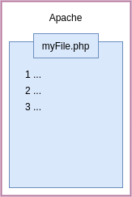

### JVM bytecode interpretation.

**Just In Time (JIT) compilation.**

- Code runs faster the longer it is left to run.
- VM can profile your code.

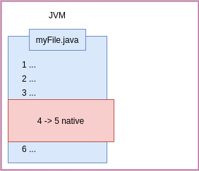

### Compiler Flags.

```
-XX:+PrintCompilation

java -XX:+PrintCompilation main.Main 10
```

### JVM JIT Compilers.

```
java -XX:+UnlockDiagnosticVMOptions -XX:+LogCompilation main.Main 5000
```

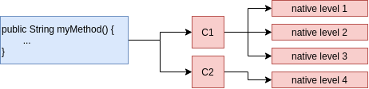

**Tuning the code cache size.**

```
VM warning: CodeCache is full. Compiler has been disabled.
```

```
-XX:+PrintCodeCache
```

- `InitialCodeCacheSize`.
- `ReservedCodeCacheSize`.
- `CodeCacheExpansionSize`.

```console
java -XX:ReservedCodeCacheSize=28m -XX:+PrintCodeCache main.Main 5000
```

**Remotely monitoring the code cache with JConsole.**

```
/usr/lib/jvm/java-11-amazon-corretto/bin/jconsole
```

### The differences between 32 bit and 64 bit JVM.


**Which compiler to use at runtime.**

- Client compilation, quicker startup time.

```
-client

java -client -XX:+PrintCompilation main.Main 15000
```

**JVM Compiler flags.**

- `-client`.
- `-server`.
- `-d64`.

**Turn off Tiered Compilation.**

- Run in interpreted mode only.

```
-XX:-TieredCompilation

java -XX:-TieredCompilation main.Main 5000
```

**Native Compilation Tuning.**

```
-XX:CICompilerCount=n

-XX:CompileThreshold=n
```

```console
java -XX:+PrintFlagsFinal
java -XX:+PrintFlagsFinal | grep CICompilerCount
```

- Check all running java processes.

```console
jps

jinfo -flag CICompilerCount <PID>

java -XX:CICompilerCount=6 -XX:+PrintCompilation main.Main 15000
```

***

## How Memory Works.

- Objects stored on the heap.
- Variables are a reference to the object.
- Local variables stored on the stack.


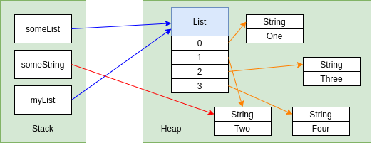

### Passing Values.

- For objects passed into methods, the REFERENCE to the object passed BY VALUE.

### The final Keyword.

```java
final Customer c = new Customer("John");
```

```java
final Customer c;
c = new Customer("John");
c = new Customer("Susan"); // compile error

s.setName("Susan"); // ok
```

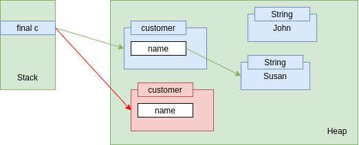

## Escaping References.

```java
public class CustomerRecords {
    private Map<String, Customer> records;
    
    public CustomerRecords() {
        this.records = new HashMap<String, Customer>();
    }

    public void addCustomer(Customer c) {
        this.records.put(c.getName(), c);
    }

    public Map<String, Customer> getCustomers() {
        return this.records; // problem: violate encapsulation
    }   
}
```

**1. Duplicating collections.**

- Creating new collection in memory.

```java
public Map<String, Customer> getCustomers() {
    return new HashMap<>(this.records); // duplicating collections
}  
```


**2. Using Immutable Collections.**

```java
public Map<String, Customer> getCustomers() {
//    return Collections.unmodifableMap(records); // JDK <= 10 always create copy

    return Map.copyOf(records); // JDK >= 11 create copy if version not already unmodifable
}  
```

**3. Duplicating Objects.**

```java
public Customer find(String name) {
    return new Customer(records.get(name));
}
```

**4. Using interfaces to create immutable objects.**

```java
public interface ReadonlyCustomer {
    String getName();
}
```

**5. Using modules to hide implementation.**

***

## The Metaspace.

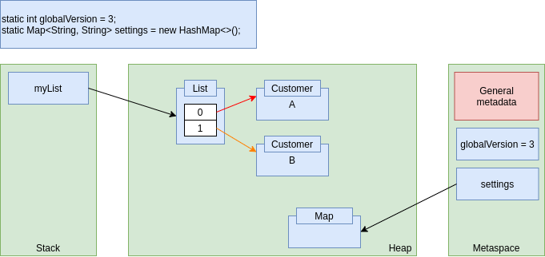

### Public vs Private.

```java
public class Customer {
    private Integer id;
    public String name;
    // ...
}
```

```java
Customer c = new Customer();
c.name = "Maciek";
```

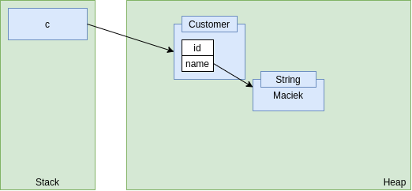

### Java 7 - the PermGen.

```
java.lang.OutOfMemoryError:PermGen
```

```
-XX:PermSize=N
-XX:MaxPermSize=N
```

### Are objects always on the heap?

- Sometimes JVM created objects on the stack, based on most efficient choice.

### String pool.

***

## JVM Tuning - Flags.

- HashMap.

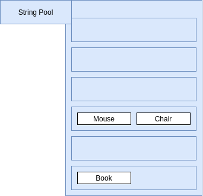

```
-XX:+PrintStringTableStatistics
```

```
-XX:StringTableSize=120121
```

### Tuning JVM Heap Size.

```
java -XX:+UnlockDiagnosticVMOptions -XX:+PrintFlagsFinal main.Main 5000
java -XX:+UnlockDiagnosticVMOptions -XX:+PrintFlagsFinal main.Main 5000 | grep MaxHeapSize
java -XX:+UnlockDiagnosticVMOptions -XX:+PrintFlagsFinal main.Main 5000 | grep InitialHeapSize
```

```console
java -XX:MaxHeapSize=600m -XX:+PrintStringTableStatistics -XX:StringTableSize=120121 main.Main 5000 


java -XX:InitialHeapSize=1g -XX:+PrintStringTableStatistics -XX:StringTableSize=120121 main.Main 5000 
```

**JVM Tuning**

- **-XX:+PrintStringTableStatistics:** How big String pool is.
- **-XX:StringTableSize=n:** Change number of buckets.
- **-XX:MaxHeapSize=n:** **-Xmx**
- **-XX:InitialHeapSize=n:** **-Xms**
- **-XX:+UnlockDiagnosticVMOptions:** Default values of Max and Initial Heap Size.
- **-XX:+PrintFlagsFinal**

***

## Garbage Collection.

### Managed Languages.

- Java works out when objects are no longer needed.
- Memory leaks shouldn't be possible in Java.
- Garbage Collection is the process to free up memory.
- Any object on the heap which cannot be reached through a reference from the stack is "eligible for garbage collection".


- Java 11 garbage collector can give unused memory back to the OS.

**When should you tell GC to run?**

- Evaluate performance of some code block.
- It is recommended to never run `System.gc()`.

***

## Monitoring the Heap.

### Memory Leaks.

- Memory leaks shouldn't be possible in Java.
- **Soft leaks:** when an object remains referenced when no longer needed.

```
jvisualvm
```

### :star: Generating a Heap Dump.

- Use **jvisualvm** (Java VisualVM): click **Heap Dump** button.
- Command line argument:
  - `-XX:+HeapDumpOnOutOfMemoryError -XX:HeapDumpPath=someFilePath`

### Viewing a heap dump.

- Use **Memory Analyzer (MAT)** from eclipse.
  - Also this tool can get Heap Dump.
- :star: **Heap Dump:**
  - jvisualvm
  - Command line argument `-XX:+HeapDumpOnOutOfMemoryError`
  - Memory Analyzer Tool

***

## Generational GC.

### Garbage Collection.

- The "Mark and Sweep" process:

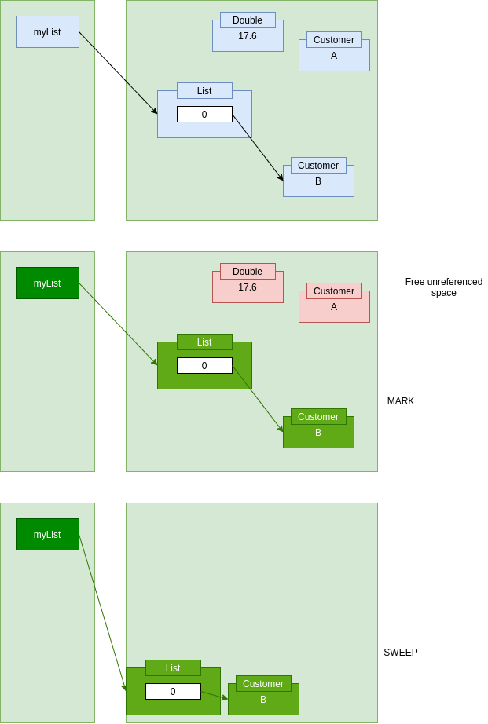

### Generational Garbage Collection.

- Most objects don't live for long.
- If an object survives it is likely to live forever.
- **Minor collection:** GC on young generation space.
- **Major collection:** GC on old generation space.

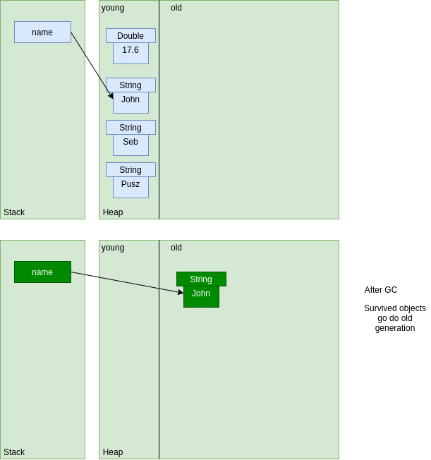

### Young generation - survivor spaces.


***

## GC Tuning & Selection.

```
-verbose:gc
```

### Tuning off automated heap allocation sizing.

```
-XX:-UseAdaptiveSizePolicy
```

```console
jinfo -flag UseAdaptiveSizePolicy <PID> 

jinfo -flag UseAdaptiveSizePolicy 62794
```

### Tuning Garbage Collection.

- **-XX:NewRatio=n**

```
jinfo -flag NewRatio <PID>
2
# Old gen will be 2x bigger that young
```

- **-XX:SurvivorRatio=n**

```
jinfo -flag SurvivorRatio <PID>
8
# s0 and s1 should be 1/8 th of young generation
```

- **-XX:MaxTenuringThreshold=n:**
  - How many times object survives before moving to old generation.

```
jinfo -flag MaxTenuringThreshold <PID>
15
```

### Choosing a Garbage Collector.

- Types of collectors:
  - Serial: `-XX:+UseSerialGC`.
  - Parallel: `-XX:+UseParallelGC`.
  - Mostly Concurrent:
    - `-XX:UseConcMarkSweepGC`.
    - `-XX:+UseG1GC`.

### How G1 works.

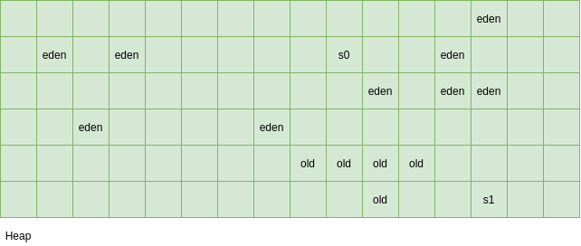

### Tuning G1.

```
-XX:ConcGCThreads=n

-XX:InitiatingHeapOccupancyPercent=n
```

### String De-duplication.

```
-XX:UseStringDeDuplication
```

- Only available if using G1.


***

## Using a profiler.


### Flight Recording.

```
-XX:StartFlightRecording=delay=2min,
duration=60s,name=Test,
filename=recording.jfr,
settings=profile
```

***

## Assessing Performance.

- Complications:
  - Native Compilation.
  - Garbage Collection.

### Benchmarking.

- Microbenchmark: Measuring the performance of a small piece of code
- More Complications:
  - Assessing in isolation.
  - Different Hardware.

**Turn off native compilation.**

```
-XX:-TiredCompilation
```

**Check whether native compilation took place.**

```
-XX:+PrintCompilation
```

***

## Benchmarking with JHM.

## How Lists Works.

### Types of List.

- ArrayList.
- CopyOnWriteArrayList.
- LinkedList.
- AttributeList.
- RoleList.
- RoleUnresolvedList.
- Stack.
- Vector.

**CopyOnWriteArrayList.**

- Consider using it when:
  - Multi-threaded application.
  - Multiple threads accessing the same list.
  - Lots of iterations / reads.
  - Few writes / additions / deletions.

**ArrayList.**

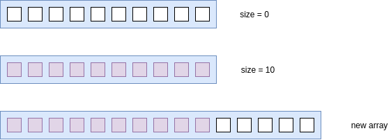

- Resizing ArrayList cost performance.
- Allocate size in advance to not require resizing.

```java
List<Book> books = new ArrayList<Book>(500000);
```

**Vector.**

- Thread safe.

**Stack.**

- LIFO operations.

**LinkedList.**

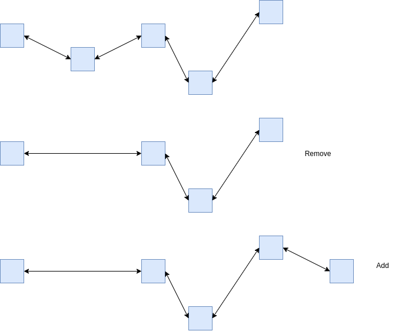


**Choosing List.**


**Sorting Lists.**

- ArrayList and LinkedList using `Arrays.sort()`.
- Difference is LinkedList is converted `toArray()` before sort.
- Pretty much the same performance.

***

## How maps work.

### HashMap.

```java
Map<Integer, Book> books = new HashMap<>();

books.put(3, book1);
```

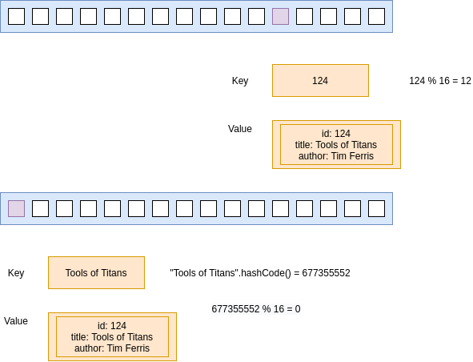


**HashMap factor**

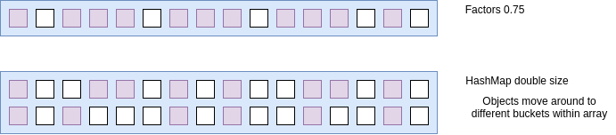

```java
Map<String, Book> books = new HashMap<>(500000, 0.6f); // 0.6f factor
```

- Larger array gives better performance, than smaller and navigate within linkedlist of the same bucket entry.

**Rules for hashcodes.**

- HashCodes:
  - Good range of numbers.
  - Equal objects must have equal hashcodes.

**LinkedHashMap.**

- HashMap:
  - Items iterate in a "random" order.
- LinkedHashMap:
  - Items iterate in a defined order.


**Hashtable and TreeMap.**

- Hashtable thread safe HashMap.
- TreeMap maintains insertion order insert **(a,c,b,d) -> retrieve (a,b,c,d)**.

***

## Coding Choices.

- Primitives vs Objects.
- BigDecimal vs Double.
- StringBuilder vs Concatenating Strings.
  - StringBuilder better performance.
  - Strings in single line concatenation, optimized by JVM.
  - JVM detects that and convert to StringBuilder.
- Loops vs Streams.

***

## GraalVM.

- Alternative JVM.
- Alternative Java Compiler.
- Native Compiler (no JVM required).
- Using the Graal compiler with OpenJDK 11 (Linux Only).

```
-XX:+UnlockExperimentalVMOptions
-XX:+EnableJVMCI
-XX:+UseJVMCICompiler
```

## Other JVM Languages.

- Java.
- JRuby.
- Clojure.
- Kotlin.
- Scala.
- Groovy.

**javap.**

- Look at bytecode using **javap**.

**decompiler.**

- CFR.

***

# OAuth2.

## Security Basics - Providers.

- User Identity:
  - Where are the user credentials stored?
- Authentication:
  - Who does this ? idP
  - How does it happen?
- Authorization:
  - Application does this.
  - Uses information for IdP.


### LDAP.

- Identity:
  - Stored in LDAP database.
  - Microsoft Active Directory.
- Authentication:
  - Done by LDAP (AD).
- Authorization:
  - Done by Application.
- LDAP and Application in the same data center.

### SAML (Security Assertion Markup Language).

- Communicating across data centers (use HTTP Redirect).


- Arrow 2 is an HTTP 302 Redirection response to Request marked as 1.

### SSO.

- Avoid entering the user credentials (use SSO).
- The network user is already a part of AD.
- Single Sign On (SSO):
  - Enterprise SSO.

### SAML.

- Identity:
  - Stored in LDAP database.
  - Microsoft Active Directory.
- Authentication:
  - SAML Identity Provider does the authentication.
  - ADFS.
- Authorization:
  - Application controls it.
  - Can use LDAP groups.

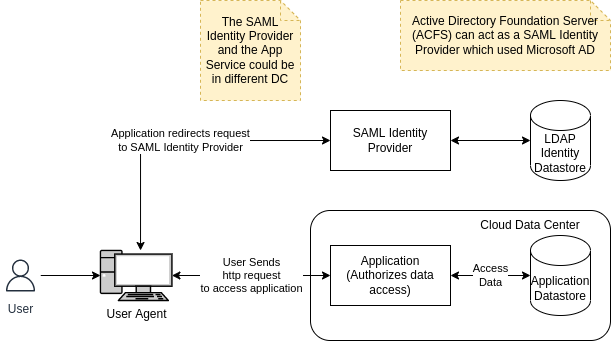

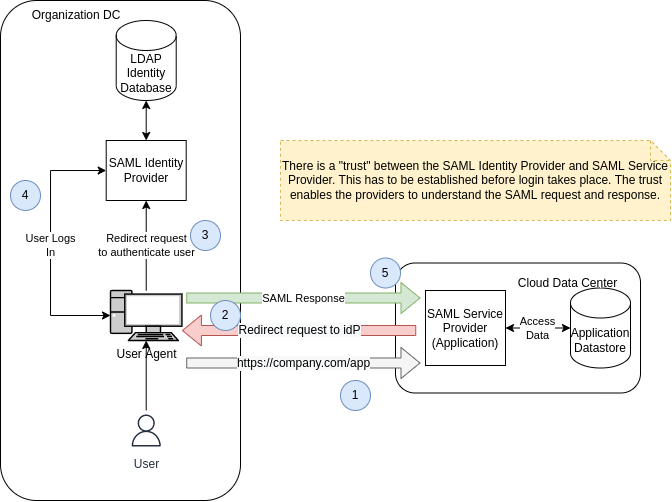

- SAML Request is a request to get user information from SAML Identity Provider (No password sent).
- SAML Metadata File.
- Trust between:
  - SAML Identity Provider.
  - SAML Service Provider.
- SAML Response:
  - Contains SAML Token.
  - Token contains claims.
- Federated User.
- Single Sign On.
- Redirect importance.

### Enterprise Problem use cases.

- Problem 1 - Microservices.
- Problem 2 - Cloud apps:
  - How does REST calls across network boundaries get secured?
  - Basic Authentication is usually used to make a REST API call.
- Problem 3 - Machine to Machine:
  - Scheduled Tasks, Daemons sometimes need to call REST APIs. How are they secured?
  - No user involved.

### Social Media Platform.

- Social Media Sites:
  - Facebook.
  - LinkedIn.
  - Google.
  - Twitter.
  - GitHub.
  - Yahoo.
- A user usually has Multiple Identities:
  - Many Identity Providers.
- What if a third party application wants to access or publish to these sites on behalf of its user?
  - User/password would be a bad idea.

***

## OAuth 2.0 Fundamentals.

- The OAuth 2.0 authorization framework enables a **third-party application** to obtain **limited** access to an
  **HTTP service**, either **on behalf of a resource owner** by orchestrating an **approval interaction** between the
  resource owner and the HTTP service, or by allowing the third-party application to obtain **access on its own behalf.**

**OAuth 2.0 - Roles.**

- Resource Owner, should never send the password to the Third Party (untrusted) Application:
  - The User.
  - User Agent.
- Resource Server:
  - REST API which protects resource.
- Client:
  - Application that needs access.
- Authorization Server:
  - Authorizes the client.
  - Gives out access tokens.
  - Many on the internet.
  - OAuth Endpoints.

**OAuth 2.0 - Client Registration.**

- Administration utility to register a Client.
- Redirect URIs.
- Client ID, Client Secret.
- When Client sends request to Authorization Server, it will send Client ID, Client Secret as well.

**OAuth 2.0 - Opaque Token.**

- Access Token is sent in an HTTP Header.
- **Authorization: Bearer [token].**

**OAuth 2.0 - JWT Token.**

- JWT Token is sent in a HTTP Header.
- **Authorization: Bearer [jwt token].**

**Grant Types**

***

## Complexity.

- Is a measure of how resource requirements change as the size of problem gets larger.
- **Big O Notation:** allows express complexity as a resource of input size.

## Sorting.

### 1. Selection sort O(N^2).

- At each iteration 1 element is selected and compared with every other element in the list to find the smallest.
- Complexity **O(N^2)**.
- **O(N^2)** comparisons.
- **O(N)** swaps.

```java
public static void selectionSort(int[] list) {
    for (int i = 0; i < list.length; i++) {
        for (int j = i + 1; j < list.length; j++) {
            if (list[i] > list[j]) {
                swap(listToSort, i, j);
                print(listToSort);
            }
        }
    }
}
```

### 2. Bubble sort O(N^2).

- At each iteration, every element compared with its neighbor and swapped if they are not in order.
- Smaller element bubbling to the beginning of the list.
- If no swaps that means list is sorted.
- Complexity **O(N^2)**.
- **O(N^2)** comparisons.
- **O(N^2)** swaps.

```java
public static void bubbleSort(int[] list) {
    for (int i = 0; i < list.length; i++) {
        boolean swapped = false;
        for (int j = list.length - 1; j > i; j--) {
            if (list[j] < list[j-1]) {
                swap(list, j, j-1);
                swapped = true;
            }
        }
        print(list);
        if (!swapped) {
            break;  // if no swap break
        }
    }
}
```

### 3. Insertion Sort O(N^2).

- Start with sorted list of size 1.
- Insert next element into list at right position.
- Complexity **O(N^2)**.
- **O(N^2)** comparisons.
- **O(N^2)** swaps.

```java
public static void insertionSort(int[] list) {
    for (int i = 0; i < list.length - 1; i++) {
        for (int j = i + 1; j > 0; j--) {
            if (list[j] < list[j-1]) {
                swap(list, j, j-1);
            } else {
                break;
            }
            print(list);
        }
    }
}
```

### 4. Shell Sort between O(N) and O(N^2).

- Partitions the original list into sub-list where a sub-list is made of elements separated by an increment.
- Each sub-list is then sorted using insertion sort.
- The increment reduced by 1.
- Sort on almost sorted list.
- Complexity depends on increment value chosen.
- Complexity **O(N)** and **O(N^2)**.

### 5. Merge Sort O(N(Log(N))).

- Follows divide and conquer approach to create smaller sub problems.
- Then merge together sorted lists to get fully sorted list.
- Complexity **O(N(Log(N)))**.
- Is not adaptive = takes advantage over input (nearly sorted list).

### 6. Quick Sort O(N(Log(N))).

- Divide and conquer algorithm which partitions the list at every step.
- Partition based on **pivot** element from the list.
- The list partitioned with all elements smaller than pivot on one side and larger than pivot on the other.
- Pivots is usually first or last element in the list.
- Complexity **O(N(Log(N)))**.
- **O(Log(N))** extra space.
- Is not adaptive.

### :star: 7. Binary Search O(Log(N)).

- How to search **sorted list**.
- Choose an element at mid-point of sorted list.
- Check whether it is smaller or greater than element you are looking for.
- Complexity **O(Log(N))**.

```java
public static int binarySearch(int[] list, int number) {
    int min = 0;
    int max = list.length - 1;
    while (min <= max) {
        int mid = (max + min)/2;
        if (list[mid] == number) {
            return mid;
        }
        if (list[mid] > number) {
            max = mid - 1; // first half
        } else {
            min = mid + 1; // second half
        }
    }
    return -1;
}
```

```java
public static int binarySearch(int[] sortedArray, int number, int min, int max) {
    if (min > max) {
        return -1;
    }

    int mid = (max + min) / 2;
    if (sortedArray[mid] == number) {
        return mid;
    }

    if (sortedArray[mid] > number) {
        return binarySearch(sortedArray, number, min, mid - 1);
    } else {
        return binarySearch(sortedArray, number, mid + 1, max);
    }
}
```

## Recursion,

- Iterative solutions involves loops.
- The recursive solutions involves functions that call themselves.
- Better space complexity comparing iterative binary search.

## Binary Tree.

- A binary tree is one where every node can have maximum of two children.
  - Left children and right children.
- Two binary trees are the same if:
  - Every corresponding node has the same value.
  - The structure of the tree at every corresponding node is the same.
- Complexity **O(N)**.

```java
public static class Node {
    private int id;
    private Node left;
    private Node right;

    public Node(int id) {
        this.id = id;
    }

    public int getId() {
        return id;
    }

    public void addChildren(Node left, Node right) {
        this.left = left;
        this.right = right;
    }

    public Node getLeft() {
        return left;
    }

    public Node getRight() {
        return right;
    }
}
```

**Check whether trees are the same.**

```java
public static boolean sameTree(Node head1, Node head2) {
    if (head1 == null && head2 == null) {
        return true;
    }

    if (head1 == null) {
        return false;
    }

    if (head2 == null) {
        return false;
    }

    if (sameTree(head1.getLeft(), head2.getLeft()) && sameTree(head1.getRight(), head2.getRight()) {
        return head1.getId() == head2.getId();
    }

    return false;
}
```

***

## Stack and Queues.

### Stack.

- The stack last in first out **LIFO**.
- **PUSH:** Adding element at the top of stack **O(1)**.
- **POP:** Removing element from the top of stack **O(1)**.
- **PEEK:** See what element at top of the stack is.
- **IsEmpty:** **O(1)**.
- **IsFull:** **O(1)**
- **SIZE:** **O(1)**
- **StackOverflowException:** Pushing into full stack.
- **StackUnderflowException:** Popping or peeking empty element.
- **LinkedList:** Is used to build a stack.
- Stack used to implementing undo, back button.

```java
public static class Element<T> {
    private T data;
    private Element next;

    public T getData() {
        return data;
    }

    public void setData(T data) {
        this.data = data;
    }

    public Element getElement() {
        return element;
    }

    public void setElement(Element next) {
        this.next = next;
    }

    public Element(T data, Element next) {
        this.data = data;
        this.element = element;
    }
}
```

### Queue.

- Add an element to the End of the Queue and remove elements from the beginning of the queue.
- FIFO, LIFO.
- Removal at beginning, addition at the end.
- **ENQUEUE:** Adding new element at the end of the queue **O(1)**.
- **DEQUEUE:** Removing an element from the beginning of the queue **O(1)**.
- **PEEK:** See first element.
- **OFFER:** Add to a queue if space is available.
- **IsEmpty**.
- **IsFull**.
- Linked List with a pointer to the head and tail works well, or stack (2 stacks).

***

## Trees.

### Binary Tree.

- Tree is a data structure which is made up of nodes.
- The order of element is not important in a Tree.
- Non-linear data structure (data organized without any sequence).
- In binary tree each node can have 0, 1 or 2 children.
  - **ROOT:** Parent node.
  - **EDGE:** Link from parent to leaf.
  - **LEAF:** Border Nodes no children.
  - **SIBLINGS:** Nodes at the same level.

```java
public static class Node<T> {
    private T data;
    private Node<T> leftChild;
    private Node<T> rightChild;
    public Node(T data) {
        this.data = data;
    }
    // getters, setters
}
```

### Binary Tree Traversal.

- **Breadth-First:** Visit node at every level before moving the next level.
- **Depth-First:** Involves going right to the leaf of the binary tree first before moving up the tree.
  - **PRE-ORDER:** `NODE - LEFT SUBTREE - RIGHT SUBTREE`.
  - **IN-ORDER:** `LEFT SUBTREE - NODE - RIGHT SUBTREE`.
  - **POST-ORDER:** `LEFT SUBTREE - RIGHT SUBTREE - NODE`.

```java
public static void preOrder(Node<Character> root) {
    if (root == null) {
        // Base case nothing to traverse
        return;                 
    }

    // process the node before recurse to the left and right subtrees
    print(root);                        // NODE
    preOrder(root.getLeftChild());      // LEFT SUBTREE
    preOrder(root.getRightChild());     // RIGHT SUBTREE
}
```

### Binary Search Tree.

- Each node in the left subtree of Node has a value less than or equal to the value of the Node.
- Each node in the right subtree of Node has a value greater than the value of the Node.
- Binary search tree typically used for **Fast insertion and fast lookup**.
- INSERTION: **O(Log(N))**
- LOOKUP: **O(Log(N))**
- Complexity based on shape.
- For example if only right or left child both insertion and lookup **O(N)**.

***

## Heaps.

### Priority Queue.

- The highest priority element has to be processed first.
  - **INSERT**.
  - **ACCESS:** The highest priority element.
  - **REMOVE:** The highest priority element.

| Operation| Array or List unordered | Array or List ordered | Balanced Binary Search Tree | The Binary Heap |
|---|---|---|---|---|
| INSERTION | `O(1)` | `O(N)` | `O(Log(N))` | `O(Log(N))` |
| ACCESS | `O(N)` | `O(1)` | `O(Log(N))` | `O(1)` |
| REMOVE | `O(N)` | `O(1)` | `O(Log(N))` | `O(Log(N))` |

### The Binary Heap.

- A heap is a tree with special properties or constraints on the values of its nodes.
- Two types of Heaps.
  - **MINIMUM HEAP:** Node with the smallest value is root.
  - **MAXIMUM HEAP:** Node with the largest value is root.
    - Operation travels upwards `(leaf -> root)`.
    - Travels downwards `(root -> leaf)`.
    - Heaps can be represented using tree or array.
- **GET PARENT:** Node at an index `i` has a parent at index `(i - 1) / 2`.
- **GET LEFT CHILD:** Node at an index`(2 * i + 1)`.
- **GET RIGHT CHILD:** Node at an index `(2 * i + 2)`

```
             5
           /   \
          8     6
         / \   /  \
        9  12 11   7
       / \
      15  10

[5, 8, 6, 9, 12, 11, 7, 15, 10]
```

- **Heapify:** which is the right position of element.
  - SIFT DOWN.
  - SIFT UP.

### Heap Sort.

- Use Heap to help sort elements in ascending or descending order.
- Use the heap to access the maximum element and put it in right position in array.
- **O(1)** access to smallest and highest element.
- Complexity **O(N(Log(N)))**.
- Space complexity **O(1)**.

***

## GRAPH.

- Graph used to represent relationship between entities.
  - VERTEX.
  - EDGE.
- Graphs are set of vertices and edges.
- A and B are **Adjacent** Nodes.


- 3 edges are **Indicent** of vertex `F`.
- `F` is said to have a degree of 3.
- Series of edges called **PATH**.

### UNDIRECTED ACYCLIC GRAPH/

- A connected graph with no cycles is a TREE.


### DIRECTED ACYCLIC GRAPH (DAG).


- 3 ways to represent Graph:
  - Adjacency matrix.
  - Adjacency list.
  - Adjacency set.

### ADJACENCY MATRIX.

- Use a matrix with ROWS and COLUMNS a matrix is table.
- The Row labels, and the column labels represent the Vertices.
- Each cell represent relationship between the vertices i.e. the EDGES.

```
        +---+     +---+                   A  B  C  D  E
        | A +---->+ B |                 +----------------
        +-+-+     +-+-+               A | 0  1  1  0  0
          |         A   V             B | 0  0  0  1  0
          |         |    +---+        C | 0  0  0  0  1
          |         |    | D |        D | 0  0  0  0  0
          |         |    +---+        E | 0  1  0  1  0
          V         |  A
        +-+-+     +-+-+
        | C +---->+ E |
        +---+     +---+
```

### ADJACENCY LIST.

- Each vertex is a node.
- Each vertex has a pointer to LinkedList.
- Problem deleting node need to go through all data structure.

### ADJACENCY SET.

- Instead of List use Set.

### Graph representation.

- **E:** Number of Edges.
- **V:** Number of Vertices.

| | Adjacency Matrix | Adjacency List | Adjacency Set |
|---|---|---|---|
| SPACE | `V^2` | `E + V` | `E + V` |
| IS EDGE PRESENT | `1` | `Degree of V` | `log(Degree of V)` |
| ITERATE OVER EDGES ON VERTEX | `V` | `Degree of V` | `Degree of V` |

### Graph Traversal.

- Depth First.
- Breadth First.
- In a tree is usually one path from root to a specific Node.
- In graph multiple paths can lead from one node to another.
- Graph can have cycles.

### Graph Algorithms.

- **Topological Sort:** Directed Acyclic Graph.
- If no vertices with in degree of **0**, no topological sort.
- Running time **O(V + E)**.

***

## MVC.

- Separating data from its visual representation.
- Separating data from its manipulation.
- Allowing different simultaneous representations of the same data.
- The user "sees" the model through the view, and "manipulates" it via a controller.

### Charts.

- Charts and tables are views.
- Numeric data are model.
- **Controller:** A slider to adjust volume in a media player app.
- **Model:** The MP3 file of a movie to be played in a media-player app.
- **View:** The area of the media player app that actually displays video.

***

## Questions.

### 1. How to interrupt thread.

```java
} catch (InterruptedException e) {
    Thread.currentThread().interrupt();
}
```

### 2. Sleep a current thread.

```java
TimeUnit.SECONDS.sleep(1);
```

### 3. What happened if extends String.

- Failed String is **final** so cannot be extended.

### 4. Why private constructor in inner class.

- TODO ???

### 5. Where apply synchronization.

- Methods.
- Code blocks.

### 6. Remote exception.

- Super class for exception related to remote method execution.

### 7. Ways to parse XML in Java.

- `DOM:` Entire XML structure in tree.
- `SAX:` Parse line after line and triggers events while meet elements like open tag, close tag etc.

### 8. Iterate through enum values.

```java
public enum Numbers {
    ONE("One"),
    TWO("Two"),
    THREE("Three");
}

for (Numbers n : Numbers.values()) {
    System.out.println(n.getName());
}
```

### 9. Class to work with dates.

- **java.time.Date**.
- **Duration**.
- **LocalDateTime**.
- **TemporalAdjuster**.
- **LocalTime**.

### 10. Iterator and how it works.

- Mechanism to process elements in order.
- `Iterable<T>` interface defines `Iterator<T> iterator()` method which returns an iterator, which can be used to visit all
  elements in collection.

### 11. How parallel streams works in Java?

- Stream split and then each part processed and then join.
- When task last for long time it blocks all threads in pools.
- As a result it blocks rest of task that uses parallelStream.

### 12. Stream API in Java 8.

- Java use Fork Join Framework.
- ParallelStream split big task on small sub tasks process them and then join together.
- Java 8 Streams based on convert collection to streams.

### 13. Collections vs Streams.

- Collections in memory data structures.
- Each element calculated before become part of collection.
- Streams computed on demand.
- Streams can be defined as sequences of elements that supports aggregate operations like:
  - `filter`, `map`, `reduce`, `find`.
- Streams don't have methods like foreach which internally iterate through elements.
- Code is unaware iteration logic.

### 14. How map and filter works in Java.

- `map:` Process data to stream.
- `filter:` Argument of filter is `Predicate<T>`, function that converts `T` to boolean.

```java
List<String> names = students.stream().map(student::getName).filter(name->name.startsWith("A"))
    .collect(Collectors.toList());
```

### 15. How Optional works?

- It helps work with null pointers.
- `ofNullable:` Create optional value if exists.
- `ifPresent:` Is triggered when `Optional` is null.

### 16. Default methods in interfaces.

- It is possible to provide default implementation of method in a interface.

```java
public interface IntSeq {
    default boolean hasNext() {
        return true;
    }
}
```

- Class that implements this interface can override this method or provide new implementation.

### 17. In what format keep prices.

- **BigDecimal**.

### 18. Factorial.

```java
public class Factorial {
    public static void main(String[] args) {
        System.out.println(factorial(5));
    }

    public static int factorial(int num) {
        int result = 1;
        if (num == 0 || num == 1) {
            return result;
        } else {
            for (int i = 2; i < num; i++) {
                result *= i;
            }
            return result;
        }
    }
}
```

```java
public class FactorialRecursive {
    public int calculateFactorial(int num) {
        if (num == 0 || num == 1) {
            return 1;
        } else {
            return num * calculateFactorial(num - 1);
        }
    }

}
```

### 19. Fibonacci.

```java
public class FibonacciIterative {
    public int calculateFibo(int number) {
        int result = 0;
        int a = 1; // for 1
        int b = 1; // for 2
        if (number == 0) {
            return 0;
        } else if (number == 1 || number == 2) {
            return 1;
        } else {
            for (int i = 3; i <= number; i++) {
                result = a + b;
                a = b;
                b = result;
            }
        }
        return result;

    }

    public int[] calculateFiboArr(int number) {
        int[] result = new int[number];
        for (int i = 0; i < number; i++) {
            result[i] = calculateFibo(i);
        }
        return result;
    }
}
```

### 20. Is power of.

```java
public class IsPowerOf {
    public boolean check(int num, int power) {
        int j = power;
        for (int i = 1; i < 10; i++) {
            if (Math.pow(j, 1.0/i) == power) {
                System.out.println(j + " is power of " + power);
            }
            j *= power;
        }
    }
}
```

### 21. Reverse String.

```java
public class ReverseString {
    public static void main(String[] args) {
        reverseString("Panda");
    }

    public static void reverseString(String str) {
        char[] strChar = str.toCharArray();
        for (int i = 0; i < str.length(); i++) {
            strChar[i] = str.charAt(str.length() - i - 1);
        }
        String strValue = String.valueOf(strChar);
        System.out.println(strValue);
    }
}
```

### 22. Big or small.

```java
public class BigOrSmall {
    public static void main(String[] args) {
        Scanner scanner = new Scanner(System.in);
        String str = scanner.nextLine();
        char ch = str.charAt(0);
        // check unicode
        if (ch >= 65 || ch < 90) {
            System.out.println("First letter is Big");
        } else {
            System.out.println("First letter is small");
        }
    }
}
```

### 23. hashCode.

- If objects are equal by equals, they also need to have the same hashCode.
- If hashCode has the following implementation.

```java
public int hashCode() {
    return 42;
}
```

- Then all objects are signed to the same bucket and hash table will degrade to normal list.

### 24. :star: Palindrome.

```java
public class Palindrome {
    public static boolean isPalindrome(String str) {
        if (str.length() == 0 || str.length() == 1) {
            return true;
        }
        if (str.charAt(0) == str.charAt(str.length() - 1) {
            return isPalindrome(str.substring(1,str.length()-1));
        }
        return false;
    }
}

// ABCDCBA ==> true
// BCDCB   ==> true
// CDC     ==> true
// D       ==> true
```

### 25. First not repeat.

```java
public class FirstNonRepeat {
    public static Character firstNonRepeat(String str) {
        Map<Character, Integer> map = new HashMap<>();

        for (int i = 0; i < str.length(); i++) {
            if (map.contains(str.charAt(i)) {
                map.put(str.charAt(i), map.get(str.charAt(i)) + 1);
            } else {
                map.put(str.charAt(i), 1);
            }
        }

        for (int i = 0; i < str.length(); i++) {
            if (map.get(str.charAt(i)) == 1) {
                return str.charAt(i);
            }
        }
        return null;
    }
}
```

### 26. Bigger and Smaller.

```java
public class BiggerAndSmaller {
    private int bigger = Integer.MIN_VALUE;
    private int smaller = Integer.MAX_VALUE;

    public void find(int[] numbers) {
        for (int next : numbers) {
            if (next > bigger) bigger = next;
            if (next < smaller) smaller = next;
        }
    }

    public int getBigger() {
        return bigger;
    }

    public int getSmaller() {
        return smaller;
    }
}
```

### 27. Linked List.

- Sequence of elements in which every element links to next element.
- Can contain any type of data.
- Elements Unsorted, Sorted, Duplicates, Unique.
- **Disadvantages:** Slow to get **k-th** element **O(N)**.
- **Advantages:** Insert and delete can be quick **O(1)** prepend, **O(n)** append.

### 28. Stacks and Queues.

- Linear data structure.
- Flexible sizes.

### 29. Heap.


### 30. Tree.

- The binary TREE 2 child nodes (left, right).
- The binary tree.
  - A left node is less than root node.
  - Insert like find.
- Balanced:
  - Insert: **O(log(N))**.
  - Find: **O(log(N))**.
- Unbalanced (H height of tree):
  - Insert: **O(H)**.
  - Find: **O(H)**.

### 31. Big O Notation.

- Equation that describes how the run time change with respect to input:
  - Different steps got added **O(a + b)**.
  - Drop constants **O(2N) => O(N)**.
  - Different inputs => different variable **O(a * b)**.
  - Drop non dominate terms **O(N + N^2) => O(N^2)**.

### 32. Algorithm efficiencies.

| Algorithm | Concrete Type | Time |
|---|---|---|
| get, set | ArrayList | O(1) |
| add, remove | ArrayList | O(N) |
| contains, index of | ArrayList | O(N) |
| get, put, remove, contains key | HashMap | O(1) |
| add, remove, contains | HashSet | O(1) |
| add, remove, contains | LinkedHashSet | O(1) |
| get, set, add, remove (from either end) | LinkedList | O(1) |
| get, set, add, remove (from index) | LinkedList | O(N) |
| contains, index of | LinkedList | O(N) |
| peek | PriorityQueue | O(1) |
| add, remove | PriorityQueue | O(log(N)) |
| remove, get, put, contains key | TreeMap | O(log(N)) |
| add, remove, contains | TreeSet | O(log(N)) |

- **Big O notation** is used to indicate time efficiencies, where `n` is the number of elements.

| Notation | Description |
|---|---|
| `O(1)` | Time is constant, regardless of the number of element. |
| `O(N)` | Time is linear to the number of elements. |
| `O(log(N))` | Time is logarithmic to the number of elements. |
| `O(N(log(N)))` | Time is linearithmic to the number of elements. |

### 33. Collections.

- The Collections are objects that group multiple elements and store, retrieve and manipulate these objects.
- The Collection interface is the root of the Collection hierarchy.
- Sub interfaces of Collection include List, Queue and Set.

| Interface | Ordered | Duplications | Notes |
|---|---|---|---|
| List | Yes | Yes | Positional access, element insertion control |
| Map | Can be | No | Unique keys, one value mapping max per key |
| Queue | Yes | Yes | Holds elements, usually FIFO |
| Set | Can be | No | Unique matters |

- `Collection.stream()`: Returns a sequential stream with the context collection as its source.
- `Collection.parallelStream()`: Returns a parallel stream with the context collection as its source.
- `Collection.addAll()`, `.max()`, `.min()`, `.remove()`, `.rotate()`.

### 34. Garbage Collector.


- Permanent generation used to store metadata.
- Store String pool as well.
- Types of Garbage collectors:
  - **Throughput GC:** Parallel version young generation `-XX:+UseParallelGC`.
  - **Concurrent low pause collector:** `-XX:+UseConcMarkSweepGC`.
    - Most GC executed multithreaded at the same time app executed.
  - **Incremented low pause collector:** `-XX:+UseTrainGC`.
- Full GC Concurrent GC.
  - Executed on single GC thread, which executes with app thread to execute before tenured generation.
  - Full GC, application stopped and GC executed as all application thread stopped.

### 35. How XML DOM parser works.

- DOM standard to access and manipulate XML document.

### 36. How SAX parser works.

- Streaming API.
- Read only, no for creating XML.
- Event based parser.
- Faster and uses less memory than tree based processors.
- **Push parser:** Pusher data into callback methods.
- Works on Android.
- An entire document does not need to be put in memory.
- :star: One way impossible to parse from the end to begin of document.

| Data Event | Error Handling Events | Other Events |
|---|---|---|
| StartDocument | Warning | Notation Detected |
| EndDocument | Error | IgnoreWhiteSpaces |
| StartElement | Fatal Error | |
| EndElement | | |
| Characters | | |

### :star: 37. How to build own annotation.

**TrackTimer.java**

```java
@Target(ElementType.METHOD)
@Retention(RetentionPolicy.RUNTIME)
public @interface TrackTime {
}
```

**JoinPointConfig.java**

```java
public class JoinPointConfig {
    @Pointcut("@annotation(com.panda.spring.aop.aspect.TrackTime)")
    public void trackTime() {
    }
}

```

**AroundAspect.java**

```java
@Aspect
@Configuration
public class AroundAspect {

    @Around("com.panda.spring.aop.aspect.JoinPointConfig.trackTime()")
    public void around(ProceedingJoinPoint joinPoint) throws Throwable {
        long startTime = System.currentTimeMillis();
        joinPoint.proceed();
        long entTime = System.currentTimeMillis() - startTime;
        logger.info("Time taken by this {} is {}", joinPoint, entTime);
    }

}
```

**Use.**

```java
@Repository
public class Dao1 {

    @TrackTime
    public String retrieve() {
        return "Dao Repo";
    }
}
```

### 38. Thread Local.

- Allow building variables that can be saved and read through the same thread.
- Thus, ever though two threads executed the same code, and it has a reference to thread local, as a result both threads
  cannot see their ThreadLocal variables.

```java
private ThreadLocal myThreadLocal = new ThreadLocal();
// ...
myThreadLocal.set("A thread local");
String myThreadLocalValue = (String) myThreadLocal.get();
```

### 39. How Garbage Collector works?

- Objects created on Heap.
- Class variables are on method area.
- Before destroy an object from memory GC thread start `finalize()` method as a result needed cleanup operation can be executed.
- Ergonomics to allow good performance JVM with minimal code lines to tuning.

### 40. When object is candidate to GC?

- All reference to this object set to null.
- Object created in a block which range changed after leave block.
- Parent object set to null.
- Object has only weak reference via **WeakHashMap**.

### 41. Heap Generations.

- Heap separated with three parts:
  - Young Generation.
  - Tenured or Old Generation.
  - Perm Area.
- Generation are then separated on 3 parts:
  - Eden Space.
  - Survivor 1.
  - Survivor 2.
- A new object is then created on a heap in new generation in **Eden** space, and after few GCs it goes to **Survivor1**
  and then to **Survivor2**.

### 42. WSDL file?

- Web service description language.
  - Determines what is required in service.
  - How to consume and how to deliver them.
- Definitions:
  - types.
  - binding.
  - messages.
  - service.
  - operation.
  - prototype.

### 43. What is RMI?

- Remote execute object methods.
- Object can be placed in different JVM on other computers.

### 44. XML Schema.

- Grammar, blueprint to xml document.
- XSD extension.
  - Deliver contract between 2 users (to not send unnecessary information).
  - If xml follows scheme that means it is valid document.

```xml
<xsd:schema>            <!-- root element -->
    <xsd:restriction>   <!-- restricted data -->
    <xsd:sequence>      <!-- elements order assured -->
```

### 45. HTTP errors protocols qualification.

- **1xx**: Information.
- **2xx**: Success 201 created, 200 OK, 204.
- **3xx**: Redirection.
- **4xx**: Client error, 404, 400, 403 forbidden, 401 unauthorized.
- **5xx**: Server error.

### 46. SOLID

- **Single Responsible Principle**: One class should have one and only one responsibility.
- **Open closed principle**: Software component should be open for extension, but closed for modification.
- **Liskov substitution principle**: Derived type must be completely substitutable for their base type.
- **Interface segregation principle**: Client should not be forced to implement unnecessary methods which they will not use.
- **Dependency Inversion principle**: Dependent on abstraction not on concretion.

**SOLID.**

- Single Responsible Principle:
  - Every class should have a single responsibility.
  - Class should be small.
  - Avoid very big classes, split it into smaller classes.
- Open close principle:
  - Class should be open for extension but closed for modification.
  - You should be able to extend class behavior without modifying it.
  - Use private variables with getters and setters only when you need them.
  - Use abstract base class.
- Liskov substitution principle:
  - Objects in a program would be replaceable with instances of their subtypes WITHOUT altering the correctness
    of the program.
  - Violations will often fail the "Is a" test.
  - A Square "Is a" Rectangle.
  - Rectangle "Is not" a Square.
- Interface Segregation principle:
  - Make fine-grained interfaces that are client specific.
  - Keep component focused and minimize dependencies between them.
  - Avoid a super interface.
- Dependency Inversion Principle:
  - Abstraction should not depend upon detail.
  - Details should not depend upon abstraction.
  - How object obtain dependent objects.

### 47. ACID.

- Atomic: Cannot stop in between.
- Consistency: Data must follow validation rules.
- Isolation: Concurrency control.
- Durability: Committed transaction stays committed even in case of power loss.

### 48. What is a primary key?

- A primary key is a combination of fields which uniquely specify a row.
- This is a special kind of unique key, and it has implicit not null constraint.
- Primary value cannot be null.

### 49. What is a unique key?

- A unique key constraint uniquely identified each record in the db.

### 50. What is a foreign key?

- A foreign key is one table which can be related to the primary key of another table.

### 51. What is a view?

- A view is a virtual table which consists of subset of data contained in a table.
- View not virtually stored, and it takes less space to store.

### 52. What is an index?

- An index is performance tuning method of allowing faster retrieval of records from the table.
- An index creates an entry for each value, and it will be faster to retrieve data.

### 53. What is a cursor?

- Is a control which enables traversal over the rows or records in the table.

### 54. What is a trigger?

- Code or programs that automatically execute with response to some event on a table or view in a database.
- Mainly trigger helps to maintain the integrity of the database.
- Student is added to DB, new record should be created in related tables like Exams, Score.

### 55. What is constraint?

- **Not Null**.
- **Check**.
- **Default**.
- **Unique**.
- **Primary Key**.
- **Foreign Key**.

### 56. What is Union?

- A union operator is used to combine the results of two tables, and it eliminates duplicate row from the table.

### 57. :star: How to generate stack overflow ?

```java
public class StackOverflowException {

    public static void main(String[] args) {
        new StackOverflowException().generateException(89);
    }

    public int generateException(int i) {
        return i * generateException(i);
    }

}
```

### 58. Big O notation.

- What is a resource requirements as input of a problem gets larger:
  - Access to element in table **O(N)**.
  - Access to element in sorted table **O(1)**.
  - Access to element in hashTable **O(1)**.
  - Access to element in tree (binary tree) **O(log(N))** or **O(N)**.
  - Quick Sort **O(N(log(N)))**.
  - Bubble Sort **O(N^2)**.

###  59. Stability of sorting algorithms.

- Elements with the same hashCode stays on the same position after sorting.
- For example in bubble sort, panda, panda, dog.
- panda would change position with other panda in even though of a fact that they have the same hashCode.

***

## Multithreading.

- Access to variable marked **volatile** is synchronized on the variable itself.
- Variable marked as **volatile** are safe to use in a different thread.
- The default single thread is called the main thread.
- **Command Pattern:** Separates execution of an action from an action itself.
  - In Threading we define the action that we would like to new thread to undertake.
- The **volatile** keyword ensures a variable never cached, and only read from main memory,
  and wraps the action in the body of an object that implements an interface with just one method.
- Threads controlled by process:
  - PROGRAM : PROCESS, `1 : 1`.
  - PROCESS : THREADS, `1 : MANY`.
  - CALLABLE.
  - LOCK OBJECTS.
  - EXECUTORS.
  - CONCURRENT COLLECTIONS.
  - THREAD POOLS.
  - ATOMIC VARIABLES.

### Synchronization problems.

- **Thread interference:** Different thread access the same data.
- **Memory consistency error:** Inconsistent value of variable.
- **Thread contention:** Threads get in each other way and slow down or even have to be killed by java:
  - Starvation.
  - Livelock.
  - Deadlock.

### Completion Service.

- Returns the queue of feature objects in the order in which they finish.

### Callable.

- It's a generic class, explicitly returns the thread results.
- Correctly passes exception from one thread to another.
- Submit the callable to an Executor object and get a Future object as the result.
- `Future.cancel():` Interrupt operation midway.
- `Future.get():` To wait for the callable to finish running.

| Old school | New school |
|---|---|
| Runnable Interface | Callable interface |
| Thread class | Executors in build class |
| `Thread.join()` | `Future.get()` |

- `Future<Integer> oneFuture = executor.submit(oneCallable);`
- To interrupt another thread, call the `.interrupt()` member function on that thread.
- Calling `Future.cancel()` is like calling `thread.interrupt()`.
- Two ways for a thread to check if it has been interrupted:
  - Catch an InterruptedException.
  - `Thread.interrupt()` static method.

| Process | Thread |
|---|---|
| Self execution environment | Fewer resources |
| Run-time resources provide | Exists within process |
| Own memory space | Share process resources |
| IPC Process Builder | |

***

## Concurrency.

- Threads in Java allow the use of multiple processors or multiple cores in one processor more efficiently.
- On a single processor, threads provide for concurrent options such as overlapping I/O with processing.
- Java supports it with the Thread class or Runnable interface.

### Creating threads.

- Extends Thread class.
- **Implements Runnable interface:** A single Runnable instance can be processed to multiple thread objects.

### Thread states.

- Enumerated `Thread.state` provides six thread states.

| State | Description |
|---|---|
| New | A thread that is created but not started. |
| RUNNABLE | A thread state that is available to run. |
| BLOCKED | An alive thread that is blocked waiting for a monitor lock. |
| WAITING | An alive thread that calls its own `wait()` and `join()` while waiting on another thread. |
| THREAD_WAITING | An alive thread that is waiting on another thread for a specified period of time, sleeping. |
| TERMINATED | A thread that is completed. |

### Thread priorities.

- MIN_PRIORITY.
- NORM_PRIORITY.
- MAX_PRIORITY.
- Lower priority threads yield to higher priority thread.

### Common methods.

- `getPriority()`.
- `getState()`.
- `interrupt()`.
- `isAlive()`.
- `isInterrupted()`.
- `join():` Causes the thread that invokes this method to wait for the thread that this object represents to finish.

### Common methods used for threads from the Object class.

- `notify()`: Tells the thread to wake up and run.
- `notifyAll()`: Threads that are waiting on a thread or resource to wake up, and then the scheduler will
  select one of the thread to run.
- `wait()`: Pauses a thread in a wait state until another thread calls `notify()` or `notifyAll()`.
- Common static methods used for threads from Thread class.
  - `activeCount()`.
  - `concurrentThread()`.
  - `interrupted()`.
  - `sleep()`.
- `yield()`: Pauses the current thread to allow another thread to run.
- **Synchronization**: Apply locks to blocks and methods.
- A lock also known as monitor or mutex (mutually exclusive lock).

### Concurrent utilities.

- Executors:
  - **ThreadPoolExecutor** as well as its subclass **ScheduledThreadPoolExecutor** implements the **Executor**
    interface to provide configurable, flexible thread pools.

| Collections | Concurrent Collections |
|---|------------------------|
| HashMap | ConcurrentHashMap.     |
| TreeMap | ConcurrentSkipListMap. |
| TreeSet | ConcurrentSkipListSet. |
| Map sub types | ConcurrentMap.         |
| List sub types | CopyOnWriteArrayList.  |
| Set sub types | CopyOnWriteArraySet.   |
| PriorityQueue | PriorityBlockingQueue. |
| Dequeue | BlockingDequeue.       |
| Queue | BlockingQueue.         |

### Synchronizers.

- Special purpose synchronization tools.

| Semaphore | Maintain a Set of permits |
|---|---|
| CountDownLatch | Implements waits against sets of operations being performed. |
| CyclicBarrier | Implements waits against common barrier parts. |
| Exchanger | Synchronization point where threads can exchange elements. |

***

## Memory Management.

- **Garbage collector principal tasks are**:
  - Allocating memory.
  - Maintaining referenced objects in memory.
  - Recovering memory from objects that no longer have reference to them.
- **Tune GC**:
  - Maximum pause time goal: Time GC pauses application to recover memory.
- **Throughput goal**:
  - Time spent outside of GC.

### Serial GC.

- Is performed via a single thread on a single CPU.
- When this GC thread run, the execution of the application will pause until the collection completed.
- Small data setup up to 100 MB, no requirement for low pause time.

### Parallel Collector.

- Can be performed with multiple threads across several CPUs.
- Using those multiple threads significantly speeds up GC.
- No pause time constraints and app performance is the most important aspect of your program.

### Parallel Compacting Collector.

- Similar to parallel Collector except for refined algorithms that reduce collection pause times.
- This collector is best used for apps that do have pause time constraints.

### Concurrent Mark Sweep Collector

- CMS low latency collector, implements algorithm to handle large collections that might warrant long pauses.
- Use when response time take precedence over throughput times and GC pauses.

### Garbage-First G1 Collector.

- Is used for multiprocessor machines with large memories.
- This server-style GC meets pause time goal with high probability, while achieving high throughput.
- Whole heap operations (global marking) are performed concurrently with the app thread, which prevents interruptions
  proportional to the heap or live-data size.

| Memory Management Tools | Description |
|---|---|
| jvisualvm | |
| jconsole | Java Management Extensions (JMX) |
| jinfo | |
| jmap | Memory map tool. |
| jstack | Stack trace tool. |
| jstat | JVM statistics monitoring tool. |
| jhat | Heap analysis tool. |
| hprof profiler | CPU usage, heap statistics, and monitor contentions profiler. |
| jdb | Java debugger tool. |

### Resizing the JVM.

- The heap is an area in memory that stores all objects created by executing Java program.
- If you are having performance problems or seeing the Permanent Generation (PermGen) error message:
  - **java.lang.OutOfMemory**: You may be running out of heap space.
- **Metaspace**: Used for representation class metadata.
- Metaspace is a successor to PermGen model.

***

## TDD.

### Test Parts.

- Scenario.
- Execute actions.
- Validate behavior.
- Refactor.
- All jUnit test must be public void.
- Eliminating repeated code:
  - `@Before:` Execute setup before unit test.

### Mock.

- Simulating objects, dependencies.
- Impossible to mock static method.
- Avoid static methods.
- Programming for testability.

### Clean Code.

- `SRP` (Single responsible principle):
  - A functional unit on a given level of abstraction should only be responsible for a single aspect of
    system's requirements.
  - An aspect of requirements, which can change independently of other aspects.
- The language you wrote your code should look like it was made for the problem.
- `DRY` (Don't repeat yourself).
- `KISS` (Keep it simple stupid).
- `YANGE` (You ain't going to need it).
- Can be easy extended by other developers.
- Should have minimal dependencies.
- Smaller is better.
- It should have unit and acceptable tests.
- It should be expressive.

***

# Tree

## The tree

- A tree is a data structure which is made up of nodes.
- Each node can point to a number of nodes.
- Unlike Stacks, Queues, LinkedLists the order of the elements is not important in a tree.
- It is a non linear data structure.
- Trees typically used to represent hierarchical information.

## The Binary Tree

- In general tree Data Structure can have any number of children, but these trees are less useful and not very commonly
  used as data structure.
- In binary tree each node can have, **0**, **1** or **2** children.
- **Root:** A node with no parents, every tree has exactly one root.
- **Edge:** Link from a parent node to a child node.

### A tree node

```java
public static class Node<T> {
    private T data;
    private Node<T> leftChild;  // A generic tree node can hold data of any type
    private Node<T> rightChild; // A node can have a maximum of 2 children

    public Node(T data) {
        this.data = data;
    }

    public T getData() {
        return data;
    }

    public Node<T> getLeftChild() {
        return leftChild;
    }

    public void setLeftChild(Node<T> leftChild) {
        this.leftChild = leftChild;
    }

    public Node<T> getRightChild() {
        return rightChild;
    }

    public void setRightChild(Node<T> rightChild) {
        this.rightChild = rightChild;
    }
}
```

### Breadth first traversal

- There are a wide number of ways to visit the nodes of a tree.
- They vary based on the order in which the Nodes accessed.
- Visiting nodes of a tree called **traversing a tree**.

**Breadth-First**

- Breadth first traversal involves visiting nodes at every level before moving on the next level.
- Start with the root node it's at level 0 and is the first node to visit.
- Next step is to check whether there are other Nodes at the same level and visit them.
- Once a level exhausted then we move to the next level.
- We continue this till every node of the tree has been visited.

**Implementing Breadth First Traversal**

- Start from the root and add it to the Queue.
- Dequeue and process the Node.
- Add it's left and then right child.
- Continue this as long as the queue is not empty.
- The nodes get added level wise from left to right to the queue.
- And are de queued and processed in that order.

```java
public static void breadthFirst(Node root) throws Queue.QueueUnderflowException, Queue.QueueOverflowException {

    // null root indicating nothing to traverse
    if (root == null) {
        return;
    }

    Queue<Node> queue = new Queue<>(Node.class);

    // Set up a queue and start by enqueueing the root node
    queue.enqueue(root); 

    // As long as the queue is not empty, process the node at the head of the queue
    while (!queue.isEmpty()) { 
        Node node = queue.dequeue();
        print(node);

        if (node.getLeftChild() != null) {
            queue.enqueue(node.getLeftChild());
        }

        if (node.getRightChild() != null) {
            queue.enqueue(node.getRightChild());    // Add its left and right child to queue
        }
    }
}
```

- Adding the left child first ensures that the nodes at the same level and processed from left to right.

### Depth first traversal

- Depth first traversal involves going right to the leaf of the binary tree first before moving up the tree.
- Going deep before moving up.
- Here there are a whole variety of possibilities in how the nodes processed.
- Depth first traversal can be:
  - Pre Order
  - In Order
  - Post Order
- All depth first traversal are most efficiently and intuitively implemented using recursion.
- The base case is when the root is null.
- At every point we work with a subtree rooted at some Node.
- The recursive step is on 2 subtrees the left and right.
- The processing can be performed:
  - Before: **PRE-ORDER**.
  - In between: **IN-ORDER**.
  - After: **POST-ORDER**.

**PRE-ORDER**

- Each node processed first, before it's right and left subtrees.
- The left sub-trees are processed before the right subtrees.

```java
public static void preOrder(Node<Character> root) {

    // Base case nothing to traverse
    if (root == null) {
        return;                 
    }

    // process the node before recurse to the left and right subtrees
    print(root);                        // NODE
    preOrder(root.getLeftChild());      // LEFT SUBTREE
    preOrder(root.getRightChild());     // RIGHT SUBTREE
}
```

**IN-ORDER**

- The left subtree is processed first, then the node, then the right subtree.
- The subtree rooted at B is processed before A and the subtree rooted at C.
- Each time a node not a left child, we have to move deeper into the left subtree.

```java
public static void inOrder(Node root) {

    // base case nothing to traverse
    if (root == null) {
        return;                 
    }

    inOrder(root.getLeftChild());
    print(root);                // Process the left subtree before the node and then recurse to the right subtree
    inOrder(root.getRightChild());
}
```

**POST-ORDER**

- Both subtrees are processed before the node itself.
- The node processed after POST the subtree.
- The subtree rooted at B is processed before the subtree rooted at C, A processed last.

```java
public static void postOrder(Node root) {

    // base case nothing to traverse
    if (root == null) {
        return;                 
    }

    postOrder(root.getLeftChild());
    postOrder(root.getRightChild());
    print(root);                // Process the left and right subtree before processing the node itself.
}
```

### Binary Search Trees

- This is also called an Ordered binary tree, and it's a tree with some specific characteristics.
- For every node in the tree:
  - Each node in the left subtree of that node has a value less than or equal to the value of the node.
  - Each node in the right subtree of that node has a value greater than the value of the node.

```
Every node on                   Every node on
the left subtree is <= 8        the right subtree is > 8

                        8
                       / \
                      7   14
                     /   /  \
                    4   12   16
                   / \    \    \
                  2   5    13   18
```

- Recursively every node in the tree should obey the same constraint.
- Binary search tree typically used for fast insertion and fast lookup.

**Insertion**

- In a tree when a new node added there is exactly one place that it can be.
- The structure of a tree depends on the order in which the nodes added.

**Lookup**

- While searching for a node in the tree there is only one place where that node can be found.
- We can simply follow the right or left subtrees based on the value we want to find.

**Insertion and lookup in binary search tree**

- Insert the node **2** into the tree.

```
        8
       / \
      6   14
     / \    \
    4   7    16
               \
                18
```

- Steps:
  - Compare node `2` with root `8`.
  - Root `8` has left child so continue comparing.
  - `6` has left child continue comparing.
  - `2` < `4` insert `2` in this place.

```
        8
       / \
      6   14
     / \    \
    4   7    16
   /           \
 [2]            18
```

```java
public static Node<Integer> insert(Node<Integer> head, Node<Integer> node) {

    // Base case if the head is null then the node itself is the head
    if (head == null) {
        return node;
    }

    if (node.getData() <= head.getData()) {
        // If the Node values is smaller then the head then it's correct place is somewhere in the left subtree
        // we insert the node into the left subtree
        head.setLeftChild(insert(head.getLeftChild(), node));
    } else {
        // If the Node is greater than the head then it's correct place is somewhere in the right subtree
        // we insert the node into the right subtree
        head.setRightChild(insert(head.getRightChild(), node));
    }

    return head;
}
```

**Lookup in a binary search tree**

- Lookup the value `7` in the tree.

```
        8
       / \
      6   14
     / \    \
    4   7    16
               \
                18
```

- Steps:
  - Compare `7` with root `8`.
  - `8` has left child, so we continue comparing.
  - Compare `7` with `6` go to right child.
  - Match the node has been found.

```java
public static Node<Integer> lookup(Node<Integer> head, int data) {

    // Base case if the head is null then the node has not been found, return null
    if (head == null) {
        return null;        
    }

    // Check if the value of the head matches the value we're looking for, if yes we have found a match
    if (head.getData() == data) {
        return head;
    }

    // If the lookup value is smaller than or equal to the head then lookup the left subtree otherwise
    // lookup he right subtree
    if (data <= head.getData()) {
        return lookup(head.getLeftChild(), data);
    } else {
        return lookup(head.getRightChild(), data);
    }
}
```

### The Binary Search Tree

- Insertion:
  - The Complexity for node insertion is **O(log(n))** in average case **O(lg(n)) ln(e^x) = x**.
  - The actual complexity depends on the shape of the tree for example if all left or right children only complexity
    is **O(N)**.
- Lookup:
  - The Complexity for value lookup is **O(log(n))** in the average case.
  - For both insertion and lookup we have tree traverse at every step.
  - This gives us the **log(n)** complexity.

### Binary Tree Problems

**:star: Find the minimum value in a binary search tree**

- The minimum value in a binary search tree can be found by traversing the left subtree of every node.
- For every node it's left child will have a value smaller than the node's value.
- If a node has no left child that is the node with the smallest value.
- The left most leaf node in the tree.

```java
public static int minimumValue(Node<Integer> head) {

    // Base case, if the head is null then the tree has no nodes, return the minimum integer value
    if (head == null) {
        return Integer.MIN_VALUE;
    }

    // Follows the left child for every node, if the left child is null then this is the minimum value node
    if (head.getLeftChild() == null) {
        return head.getData();
    }

    // Recurse till a left child is Available
    return minimumValue(head.getLeftChild());   
}
```

**:star: Find the maximum depth of a binary tree**

- The max depth will be the furthest distance of the leaf node from the root.

```java
public static int maxDepth(Node root) {

    // Base case if the root is null then the tree has no nodes, the max depth is 0
    if (root == null) {
        return 0;   
    }

    // If both left and right child of the node is null then there is a leaf and has a depth of 0
    if (root.getLeftChild() == null && root.getRightChild() == null) {
        return 0;   
    }

    // Find the max depth on the left and right subtrees. 
    // Add 1 to account for the current depth of the tree.
    int leftMaxDepth = 1 + maxDepth(root.getLeftChild());
    int rightMaxDepth = 1 + maxDepth(root.getRightChild());

    // Find the max depth between the left and right subtrees
    return Math.max(leftMaxDepth, rightMaxDepth);   
}
```

**:star: Mirror a binary tree**

- Every left child is now right child and vice versa.

```java
public static void mirror(Node<Integer> root) {

    // Base case if the head is null then the tree has no nodes, there is nothing to mirror
    if (root == null) {
        return; 
    }

    // Call mirror recursively on every node in the left and right subtrees
    mirror(root.getLeftChild());    
    mirror(root.getRightChild());

    // swap the left and the right child of each node
    Node<Integer> temp = root.getLeftChild();
    root.setLeftChild(root.getRightChild());
    // Swap the left and right children of this node
    root.setRightChild(temp);      
}
```

**Count trees**

- Count the number of structurally unique binary trees possible.
- For example for 3 nodes.

```
        O           O               O
       / \           \               \
      O   O           O               O        .....
                       \             /
                        O           O
```

```java
public static int countTrees(int numNodes) {

    // When the number of nodes is 1 there is just one possible tree, this is the base case
    if (numNodes <= 1) {
        return 1;       
    }

    int sum = 0;

    // Consider that at every node can be the root, the nodes before it will be on the left and the nodes after it
    // on the right.
    // Nodes on the left and right from their own subtrees.
    for (int i = 1; i < numNodes; i++) {
        int countLeftTrees = countTrees(i - 1);
        int countRightTrees = countTrees(numNodes - i);
        // This is the number of possible trees with this root, the combination of right and left subtrees
        sum = sum + (countLeftTrees + countRightTrees);
    }
}
```

**Print all nodes within a range in a binary search tree**

- A range will include a subset to nodes in binary search tree.
- This subset can include 0 nodes as well.
- Check every node to see if it's in within the range, print it to screen if the range constraints met.

```java
public static void printRange(Node<Integer> root, int low, int high) {

    // Pass in the min and max indicating the range we care about

    // Base case
    if (root == null) {
        return;     
    }

    // If the range low values is less than the current node, run the operation on the left node
    if (low <= root.getData()) {
        printRange(root.getLeftChild(), low, high);
    }

    // Check the node value to see if it's within the range if yes print
    if (low <= root.getData() && root.getData() <= high) {
        System.out.println(root.getData());
    }

    // If range high value is greater than the current node, run the operation on the right subtree
    if (high > root.getData()) {
        printRange(root.getRightChild(), low, high);
    }
}
```

**Check if a binary tree is a binary search tree.**

- For every node in a binary search tree the nodes with values `<=` node are in the left subtree and nodes with
  values `>` node are in a right subtree.
- Check every node to see if this constraint violated.
- It can be solved iteratively and recursively.

```java
public static boolean isBinarySearchTree(Node<Integer> root, int min, int max) {

    // Pass in the min and max indicating the range for the subtree

    // A null node is a valid binary tree
    if (root == null) {
        return true;    
    }

    // If a node lies outside the range then the BST constraint has been violated and we return false
    if (root.getData() <= min || root.getData() > max) {
        return false;
    }

    // Check the left and Right subtrees to see if they're valid search trees
    return isBinaryTree(root.getLeftChild(), min, root.getData()) &&
           isBinaryTree(root.getRightChild(), root.getData(), max);
}

```

- For the left subtree the current nodes value should be the max.
- For the right subtree the current node's value should be the min.

**Has path sum**

- Check if a path from root leaf node sums up to a certain value.
- At every leaf node check if the path to it sums to the value specified.
- Subtract the current node's value from the sum when recursing left and right towards the leaf node.

```java
public static boolean hasPathSum(Node<Integer> root, int sum) {

    // Pass in the current running sum

    // In the case of a leaf node, check if the sum is exactly equal to the value of the node
    if (root.getLeftChild() == null && root.getRightChild() == null) {
        return sum = root.getData();    
    }

    // For internal non leaf nodes subtract the current node value from the sum
    int subSum = sum - root.getData();  

    // Recurse left and right to see if the sub sum is satisfied in any of the paths
    if (root.getLeftChild() != null) {
        boolean hasPathSum = hasPathSum(root.getLeftChild(), subSum);
        if (hasPathSum) {
            return true;
        }
    }

    if (root.getRightChild() != null) {
        boolean hasPathSum = hasPathSum(root.getRightChild(), subSum);
        if (hasPathSum) {
            return true;
        }
    }
    return false;
}
```

**Print paths**

- Keep track of the current path followed to reach the leaf node.
- At a leaf node print the current path.
- For internal nodes add the node to the path and recurse to the left and right children.

```java
public static void printPaths(Node<Integer> root, List<Node<Integer>> pathList) {

    // A list keep track of the current path to this node

    // Base case
    if (root == null) {
        return;     
    }

    pathList.add(root);

    // Add the current node to the path and recurse to the left and right child
    printPaths(root.getLeftChild(), pathList);
    printPaths(root.getRightChild(), pathList);

    // If this is leaf node, print the current path, which has all nodes leading to this leaf node
    if (root.getLeftChild() == null && root.getRightChild() == null) {
        print(pathList);
    }

    // Remove the current node from the pathList as all paths from this node has been processed and printed
    pathList.remove(root);

}
```

**Find the least common ancestor for 2 nodes.**

```
        1
       / \
      2   3
         / \
        7  [6]
       / \    \
     [8]  5    4
```

- 3 is the least common ancestor for 8 and 6.
- 1 is also a common ancestor but not the least one.

```java
// I. leastCommonAncestor(1, 6, 8) <-- 1 root
public static Node<Integer> leastCommonAncestor(Node<Integer> root, Node<Integer> a, Node<Integer> b) {
    // III. null == null -> null
    if (root == null) {
        return null;
    }

    // I. 1 == 6 || 1 == 8
    // II. 2 == 6 || 2 == 8
    // IV. 3 == 6 || 3 == 8
    // V. 6 == 6 || 6 == 8
    // If the current root is either of two nodes then return the root itself
    if (root == a || root == b) {
        return root;
    }

    // II. leastCommonAncestor(2, 6, 8)
    // III. leastCommonAncestor(null, 6, 8)
    Node<Integer> leftCA = leastCommonAncestor(root.getLeftChild(), a, b); // null
    // IV. leastCommonAncestor(3, 6, 8)
    // V. leastCommonAncestor(6, 6, 8)
    Node<Integer> rightCA = leastCommonAncestor(root.getRightChild(), a, b); // 6

    // If both exists it means either the node or it's ancestor exists in the left and right subtree so the current 
    // node is LCA
    if (leftCA != null && rightCA != null) {
        return root;    
    }

    // If only of the common ancestor is non null return that
    if (leftCA != null)  {
        return leftCA;  
    }

    // 6 ??
    return rightCA;
}
```

***

## Heaps

### The Priority Queue

- When a certain element in a collection has the highest weightage or priority a common use case is to process
  that first.
- The data structure used store elements where the highest priority has to be processed first can be called
  a **priority queue**.
- At every step we access the element with the highest priority.
- The data structure needs to understand the priorities of the elements it holds.
- Common operations on a priority queue:
  - Insert elements.
  - Access the highest priority element.
  - Remove the highest priority element.
- Priority queues has a whole number of practical use cases in event simulation, thread scheduling, handling emergency
  room cases.

**An Array or a List**

| Event | Unordered | Ordered |
|---|---|---|
| Insertion | Can be anywhere in the list or array **O(1)** | Requires finding right position **O(N)** |
| Access | Accessing the highest priorities element requires going through all elements of list **O(N)** | Easy access highest priority element **O(1)** |
| Remove | Removing the highest priorities element requires going through all elements of list **O(N)** | Easy access highest priority element **O(1)** |

**Balanced binary search tree**

| Action | Complexity |
|---|---|
| Insertion | `O(log(n))` |
| Access | `O(log(n))` |
| Remove | `O(log(n))` |

- Both insertion and access moderately fast.
- List solutions make one of these super fast while comparing heavily on the other.

**The Binary Heap**

| Action | Complexity |
|---|---|
| Insertion | `O(log(n))` |
| Access | `O(1)` |
| Remove | `O(log(n))` |

### The Binary Heap

- A heap is just a tree with a special property or constraints on the values of its nodes.
- This is called heap property.
- Heaps can be of two types:
  - **Minimum Heap:** Every node should be `<=` value of its children, the node with the smallest value should
    be the root of the tree.
  - **Maximum heap:** Every node should be `>=` value of its children, the node with the largest value should
    be the root of the tree.
- If **H** is the high of the tree - the leaf nodes should be only at level **H** or **H - 1** (shape property).
- The heap should form a **complete binary tree**, all levels except the last should be filled.

```
        47          maximum value in the entire tree
       /  \
      32   28
     /  \    \
    9   12    7
```

- All leaf nodes are at high **H** or **H - 1**.
- These nodes cannot have children till all the nodes at level **H-1** have both left and right children.
- All nodes at level **H-1** have to be filled before moving on to level **H**.

**The binary heap implementation**

- The logical structure of a binary heap is a tree so theoretically we could represent a heap just as we would
  represent a tree.
- The operations typically performed on a heap requires us to use:
  - Traverse downwards from the root towards the leaf nodes.
  - Traverse upwards from the leaf node towards the root.
- Each node would have a pointer to the left and right child.
- On a heap we want to be able to:
  - Get left child.
  - Get right child.
  - Get parent.
- A node would need 2 children pointers and a parent pointer.
- This is a lot of extra space.
- Heaps can be represented much more efficiently by using an array and having an implicit relationship to determine
  the parent, left and right child of a node.
- Contiguous slots in an array can be used to represent binary tree levels.
- Node at index 0 `(i)`
  - Left child at index 1: `(2*i + 1)`
  - Right child at index 2: `(2*i + 2)`
  - Node at index `i` get parent has parent at index: `(i-1)/2`.

```
                 5                  [ 5 8 6 9 12 11 7 15 10 ]
               /   \
              8     6
             / \   / \
            9  12 11  7
           / \
          15 10
```

```java
// A generic heap, can hold data of any type.
// Note that the generic type has to extends Comparable this is how we check for highest priority.
public abstract class Heap<T extends Comparable> {

    private static int MAX_SIZE = 40;
    // Use an array to store the heap elements
    private T[] array;
    private int count;

    public Heap(Class<T> clazz) {
        this(clazz, MAX_SIZE);
    }

    public Heap(Class<T> clazz, size) {
        // This is how instantiate a generic array in Java
        array = (T[]) Array.newInstance(clazz, size);
    }
}
```

**Get the left child index**

```java
public int getLeftChildIndex(int index) {

    // Calculate the left child index using the formula
    int leftChildIndex = 2 * index + 1;     

    if (leftChildIndex >= count) {
        // Check to see if a left child of this node is present.
        // If it's less than count (the number of nodes) then it is a valid left child.
        return -1;
    }
    return leftChildIndex;
}
```

**Get the right child index**

```java
public int getRightChildIndex(int index) {

    // Calculate the right child index using the formula
    int rightChildIndex = 2 * index + 2;     

    if (rightChildIndex >= count) {
        // Check to see if a right child of this node is present.
        // If it's less than count (the number of nodes) then it is a valid left child.
        return -1;
    }

    return rightChildIndex;
}
```

**Get parent index**

```java
public int getParentIndex(int index) {  

    // Check that the index is not out of range
    if (index < 0 || index > count) {       
        return -1;
    }

    // Formula to get the parent index
    return (index - 1) / 2;                   
}
```

**Helper methods**

```java
protected void swap(int index1, int index2) {
    // Swap 2 elements in the heap array
    T tempValue = array[index1];
    array[index1] = array[index2]; 
    array[index2] = tempValue;
}

public int getCount() {
    return count;
}

public boolean isEmpty() {
    return count == 0;
}

public boolean isFull() {
    return count == array.length;
}

public T getElementAtIndex(int index) {
    return array[index];
}
```

### The Binary Heap

- While inserting or removing an element into the heap how do we know which is the right position for the element
  to occupy?
- We place a single element in the wrong place.
- Then try to find the right position for the element.
- This process called **heapify**.

**Shift down**

- An element is in the wrong position with respect to other elements below it in the heap.
- It has to be moved downwards in the heap towards the leaf node to find its right position.

**Shift up**

- An element is in the wrong position with respect to other elements above it in the heap.
- It has to be moved upwards in the heap towards the root node to find its right position.

**Heap**

- Insertion: `O(log(n))`
- Access the highest priority element: `O(1)`
- Remove: `O(log(n))`

### The Heap Sort

- First converts the unsorted list or array into the heap.
- Use the heap to access the maximum element and put it in the right position in the Array.
- Heapify:
  - First converts the unsorted list or array into a heap.
  - Take a position of the array make all elements in that position satisfy the heap property.
  - Keep adding additional elements into the heap portion ensuring that these additional elements also
    satisfy the heap property.
  - The heap will grow to encompass all elements in the array.
- Sort:
  - Use the heap to access the maximum element and put it in the right position in the array.
  - A heap offers `O(1)` access to the largest or the smallest element.
  - Remove the largest element from the heap and position it at the end of sorted array.
  - The sorted array will grow to encompass all elements in the array.

**Heap Sort Heapify**

- We'll use a maximum heap, so we can always access the largest element in `O(1)` time.
- A heap can be represented using an array.
- Heapify is the operation to convert the unsorted array to a heap.
- We use the same array with no additional space to do the heapify.
- Insertion done N times to get all the elements in heap form.
- Removal of the maximum element done N times, followed by heapify.
- Insertion and removal have `log(n)` time complexity so doing it for N elements means the average case complexity of
  heap sort id `O(n log(n))`.
- Heap sort is not adaptive.
- It is not a stable sort.
- It does not need additional space, space complexity `O(1)`.

### Heap Problems

**Find the maximum element in a minimum heap**

- One of the leaf nodes is the maximum element if we only scan the leaf nodes we will find it.
- The first left node comes after the last internal node, it's the parent of the last node in the heap.

```java
public static int getMaximum(MinHeap<Integer> minHeap) {

    // Get the last node in the heap - present at the last index of the array
    int lastIndex = minHeap.getCount() - 1;

    // Find the parent of the very last index, this is the last internal node
    int lastParentIndex = minHeap.getParentIndex(lastIndex);
    int findChildIndex = lastParentIndex + 1;

    int maxElement = minHeap.getElementAtIndex(firstChildIndex);

    // Iterate through all the leaf nodes starting at the index after the index of the last parent node
    for (int i = firstChildIndex; i < lastIndex; i++) {
        if (maxElement < minHeap.getElementAtIndex(i)) {
            maxElement = minHeap.getElementAtIndex(i);
        }
    }
    // Return the maximum element this is now a simple scan
    return maxElement;
}
```

***

## The Graph

- A graph used to represent relationship between entities.
- The entities can be anything, graphs find applications in variety of ways in the real world.
- These relationships can be arbitrarily complicated and of a variety of different types.

**VERTEX**

- The entities are people (professional graph, social graph).
- Entities are locations (maps).

**EDGE**

- Professional relationships: People work together.
- Personal relationships: People are friends.
- A way to get from one location to another road, rail, air.
- Graphs used to represent information in many real world applications.
- There are many algorithms to optimize different problems represented using graph.

**What is a graph**

- Graph is a set of vertices and edges.

```
(V, E) A --------------- B
```

- Two vertices and a single edge is also valid graph.

```
A, B                | Vertex
---------------     | Edge
```

- Arrow on the edge means the relationship directed.

```
A --------------> B
```

- Undirected edges represent 2 way relationship such as:
  - Two ways road.
  - I am his friend, and he is mine.
- Directed edges represent 1 way relationship such as:
  - One way road.
  - I report to my manager.

**Undirected Graph**


- `A - C` are ADJACENT Nodes.
- 3 edges are INDICENT Vertex F.
- The way to go from C to B:
  - `C -> A -> B`
- This series of edges called a `PATH`.

**Undirected Acyclic Graph**


- Every Node is CONNECTED TO EVERY OTHER NODE via a series of edges.
- This Graph has no cycles.
- A Connected graph with no cycles.
- This is a connected graph.

```
               B
             / | \
            A  D  F
           /     / \
          C     G   H
         /
        E
```

- :star: Graph with no cycle is tree.

**Directed Graph**


- Nodes **A,B,D,A** form a cycle.

**Directed Acyclic Graph (DAG)**


**A Graph Representation**

- To represent a Graph there is a need a way to model a vertex which may held some information.
- A way to model directed or undirected EDGES.
- There are 3 standard ways that Graphs can be represented:
  - ADJACENCY MATRIX
  - ADJACENCY SET
  - ADJACENCY LIST

```java
// Set up an interface with methods all graph should implement, the implementations can use the 
// adjacency matrix, adjacency list or adjacency set
public interface Graph {

    // An Enum to indicate whether the Graph represents an Undirected or Directed Graph
    enum GraphType {
        DIRECTED,
        UNDIRECTED
    }

    // An edge lies between two vertices, vertices are represented by numbers
    void addEdge(int v1, int v2);

    // Helper to get the Adjacent vertices from any vertex,
    // a method which is required for all algorithms involving graphs
    List<Integer> getAdjacentVertices(int v);
}
```

**ADJACENCY MATRIX**

- Use a matrix with Rows and Columns a matrix is table.
- The Row labels and, the column labels represent the Vertices.
- Each cell represent relationship between the vertices i.e. the EDGES.

```
        DIRECTED GRAPH

        +---+     +---+                   A  B  C  D  E
        | A +---->+ B |                 +----------------
        +-+-+     +-+-+               A | 0  1  1  0  0
          |         A   V             B | 0  0  0  1  0
          |         |    +---+        C | 0  0  0  0  1
          |         |    | D |        D | 0  0  0  0  0
          |         |    +---+        E | 0  1  0  1  0
          V         |  A
        +-+-+     +-+-+
        | C +---->+ E |
        +---+     +---+
```

- A value 1 or true in (row A, column B) indicates Edge from A to B.

```
        UN DIRECTED GRAPH

        +---+     +---+                   A  B  C  D  E
        | A +-----+ B |                 +----------------
        +-+-+     +-+-+               A | 0  1  1  0  0
          |         |   \             B | 1  0  0  1  1
          |         |    +---+        C | 1  0  0  0  1
          |         |    | D |        D | 0  1  0  0  1
          |         |    +---+        E | 0  1  1  1  0
          |         |  /
        +-+-+     +-+-+
        | C +-----+ E |
        +---+     +---+
```

```java
class Graph {
    int[][] adjacencyMatrix;
    int numVertices;
}
```

```java
// This implements the graph interface to use of the adjacency matrix is an implementation details
public class AdjacencyMatrixGraph implements Graph {

    // Set up a V x V matrix to hold the vertices and Edges relationship
    private int[][] adjacencyMatrix;

    private GraphType graphType = GraphType.DIRECTED;

    private int numVertices = 0;

    public AdjacencyMatrixGraph(int numVertices, GraphType graphType) {
        this.numVertices = numVertices;
        this.graphType = graphType;
        adjacencyMatrix = new int[numVertices][numVertices];

        for (int i = 0; i < numVertices; i++) {
            for (int j = 0; j < numVertices; j++) {
                // initialize the matrix and other information in the constructor
                adjacencyMatrix[i][j] = 0;
            }
        }
    }

    @Override
    public void addEdge(int v1, int v2) {
        if (v1 > numVertices || v1 < 0 || v2 >= numVertices || v2 < 0) {
            throw new IllegalArgumentException("Vertex number is not valid");
        }
        // Set the cell at row v1 and column v2
        adjacencyMatrix[v1][v2] = 1;

        if (graphType == GraphType.UNDIRECTED) {
            // If the graph is undirected then the connection goes both ways - set row v2 and column v2 as well
            adjacencyMatrix[v2][v1] = 1;
        }
    }

    @Override
    public List<Integer> getAdjacencyVertices(int v) {
        if (v >= numVertices ||  v < 0) {
            throw new IllegalArgumentException("Vertex number is not valid");
        }

        List<Integer> adjacencyVerticesList = new ArrayList<>();

        for (int i = 0; i < numVertices; i++) {
            if (adjacencyMatrix[v][i] == 1) {
                adjacencyVerticesList.add(i);
            }
        }

        Collections.sort(adjacentVerticesList);
        return adjacentVerticesList;
    }
}
```

**Adjacency List (adjacent means neighbors cells)**

- Each vertex is a node.
- Each vertex as a pointer to a LinkedList.
- This LinkedList contains all the other nodes this vertex connects to directly.
- If a vertex V has an Edge leading to Another Vertex U.
- Then U is present in V's LinkedList.

```
        +---+     +---+                   DIRECTED GRAPH
        | A +---->+ B |               A -> B -> C
        +-+-+     +-+-+               B -> D
          |         A   V             C -> E
          |         |    +---+        D
          |         |    | D |        E -> B -> D
          |         |    +---+
          V         |  A
        +-+-+     +-+-+
        | C +---->+ E |
        +---+     +---+

        +---+     +---+                   UNDIRECTED GRAPH
        | A +-----+ B |
        +---+     +-+-+               A -> B -> C
          |         |   \             B -> A -> D -> E
          |         |    +---+        C -> A -> E
          |         |    | D |        D -> B -> E
          |         |    +---+        E -> C -> B -> D
          |         |  /
        +-+-+     +-+-+
        | C +-----+ E |
        +---+     +---+
```

- Adjacency List Downsides:
  - The ORDER of the Vertices in the AdjacencyList is MATTER.
  - The same Graph can have MULTIPLE REPRESENTATIONS.
  - Certain operation become tricky e.g. deleting a Node involves looking through all the adjacency List
    to remove the Node from all Lists.

**Adjacency Set**

- Similar to AdjacencyList.
- Instead of a LinkedList to maintain the adjacent vertices Use A Set.
- The Graph Representations.


- **E** Number of Edges.
- **V** Number of Vertices.

| | Adjacency Matrix | Adjacency List | Adjacency Set |
|---|---|---|---|
| Space | V^2 | E + V | E + V |
| Is edge present | 1 | Degree of V | Log(Degree of V) |
| Iterate over edges on a vertex | V | Degree of V | Degree of V |

### The Graph Traversal

- DEPTH-FIRST, BREADTH-FIRST:
  - In a graph multiple paths can lead from one node to another
- A Graph can also have cycles, the same Node can be visited multiple times.
- In order to avoid infinite looping In a Graph we need to keep track of the Node previously visited.

### Topological Sort

- It is an ordering of vertices in a directed acyclic graph in which each node comes before all the nodes to which
  it has outgoing edges


- A graph can have multiple topological sort.
- We first find a vertex which has no incoming edges.
- It is the destination of no edge no arrow points to it.
- **A** is the only vertex with no incoming edge - this is the first element of the sort.
- Indegree number of inward directed graph edges for a given graph vertex.
- Indegree of A is 0.
- **If there are no vertices with 0 indegree, then there would have been no topological sort**.
- If remove A from a graph we have to reduce the indegree of all its immediate neighbors.
- The next vertex in this sort the one with indegree 0, C is the next element.
- Remove C from graph decrease indegree next element is E.
- Running time of topological sort is `O(V + E)`.
- Every edge and every vertex visited once.

**Indegree in Adjacency List**

```java
public int getIndegree(int v) {
    if (v < 0 || v >= numVertices) {
        throw new IllegalArgumentException("Vertex number is not valid");
    }

    int indegree = 0;
    for (int i = 0; i < numVertices; i++) {
        // If the current vertex is present as an adjacent vertex for any other vertex then increment the indegree
        // count for the current vertex
        if (getAdjacentVertex(i).contains(v)) {
            indegree++;
        }
    }

    return indegree;
}
```

**Indegree in Adjacency Matrix**

```java
public int getIndegree(int v) {
    if (v < 0 || v >= numVertices) {
        throw new IllegalArgumentException("Vertex number is not valid");
    }

    int indegree = 0;
    for (int i = 0; i < numVertices; i++) {
        if (adjacencyMatrix[i][v] != 0) {
            indegree++;
        }
    }

    return indegree;
}
```
