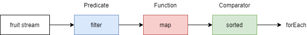
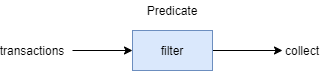

## Stream.

- With Java 8 Collection interface has two methods to generate a Stream: `stream()` and `parallelStream()`.
- Stream operations are either intermediate or terminal:
    - Intermediate operations return a Stream so multiple intermediate operations can be chained before the Stream closed.
    - Terminal operations are either void or return a non-stream result.

### 1. Using Streams.

- A Stream is a sequence of elements upon which sequential and parallel aggregate operations can be performed.
- Any given Stream can potentially have an unlimited amount of data flowing through it. 
- As a result, data received from a Stream processed individually as it arrives, as opposed to performing 
batch processing on the data altogether. 
- When combined with lambda expressions they provide a concise way to perform operations on sequences
of data using a functional approach.

```java
Stream<String> fruitStream = Stream.of("apple", "orange", "grapes");

fruitStream.filter(s -> s.contains("a"))
    .map(String::toUpperCase)
    .sorted()
    .forEach(System.out::println);
```

- Create a `Stream<String>` containing a sequenced ordered Stream of fruit String elements using the static factory method
`Stream.of(values)`.
- The `filter()` operation retains only elements that match a given predicate. In this case the elements containing
an "a".
- The `map()` operation transforms each element using a given function, called a mapper. In this case, each fruit String
is mapped to its uppercase String version:
    - That the `map()` operation will return a stream with a different generic type if the mapping
    function returns a type different to its input parameter.
     - For example on a `Stream<String> calling.map(String::isEmpty)` returns a `Stream<Boolean>`.
- The `sorted()` operation sorts the elements of the Stream according to their natural ordering.
- `forEach(action)` operation performs an action which acts on each element of the Stream, passing it to a Consumer. 
    - In the example, each element simply being printed to the console. 
    - This operation is a terminal operation, thus making it impossible to operate on it again.
- Operations defined on the Stream performed because of the terminal operation.
- **Without a terminal operation, the stream not processed**. 
- Streams can't be reused. Once a terminal operation called, the Stream object becomes unusable.



### Closing Streams.

- Stream generally does not have to be closed. 
- It is only required to close streams that operate on IO channels. 
- Most Stream types don't operate on resources and therefore don't require closing.
- The Stream interface extends **AutoCloseable**. 
- Streams can be closed by calling the `close()` method or by using  try-with-resource statement.
- Example use case where a Stream should be closed is when you create a Stream of lines from a file:

```java
try (Stream<String> lines = Files.lines(Paths.get("somePath"))) {
    lines.forEach(System.out::println);
}
```

- The Stream interface also declares the `Stream.onClose()` method which allows you to register Runnable handlers
which will be called when the stream closed. 
- An example use case is where code which produces a stream needs to know when it is consumed to perform some cleanup.

```java
public Stream<String> streamAndDelete(Path path) throws IOException {
    return Files.lines(path).onClose(() -> someClass.deletePath(path));
}
```

- The run handler will only execute if the `close()` method gets called, either explicitly or implicitly by a 
try-with-resources statement.

### Processing Order.

- A Stream objects processing can be sequential or parallel:
    - In a sequential mode, the elements processed in the order of the source of the Stream. 
    - If the Stream ordered (such as a SortedMap implementation, or a List) the processing guaranteed to match the ordering 
    of the source.

```java
List<Integer> integerList = Arrays.asList(0, 1, 2, 3, 44);

// sequential
long howManyOddNumbers = integerList.stream()
                                    .filter(e -> (e%2) == 1)
                                    .count();
System.out.println(howManyOddNumbers);
```

- Parallel mode allows the use of multiple threads on multiple cores but there is no guarantee of the order in which elements
processed.
- If multiple methods called on a sequential Stream, not every method has to be invoked. 
- For example, if a Stream is filtered, and the number of elements reduced to one, a subsequent call to a method such as sort 
will not occur.
- This can increase the performance of a sequential Stream an optimization that is not possible with a parallel Stream.

```java
long howManyOddNumbers = integerList.parallelStream()
                                    .filter(e -> (e%2) == 1)
                                    .count();
System.out.println(howManyOddNumbers);
```

**Difference from Containers (or Collections).**

- While some actions can be performed on both Containers and Streams, they ultimately serve different purposes
and support different operations.
- Containers are more focused on how the elements stored and how those elements can be accessed efficiently.
- A Stream, on the other hand, doesn't provide direct access and manipulation to its elements; it is more dedicated
to the group of objects as a collective entity and performing operations on that entity as a whole.
- Stream and Collections are separate high-level abstractions for these differing purposes.

### 2. Consuming Streams.

- A Stream will only be traversed when there is a **terminal operation**, like `count()`, `collect()` or `forEach()`.
- Otherwise, no operation on the Stream will be performed.
- In the following example, no terminal operation added to the Stream, so the `filter()` operation will not be
invoked and no output will be produces because `peek()` is **NOT** a terminal operation.

```java
IntStream.range(1, 10).filter(a -> a % 2 == 0).peek(System.out::println);
```

- This is a Stream sequence with a valid terminal operation, thus an output is produced.
- You could use forEach instead of peek.

```java
IntStream.range(1, 10).filter(a -> a % 2 == 0).forEach(System.out::println);
```

- After the terminal operation performed, the Stream consumed and cannot be reused.
- Although a given stream object cannot be reused, it's easy to create a reusable Iterable that delegates to a Stream pipeline.
- This can be useful for returning a modified view of a live data set without having to collect results into a temporary structure.

```java
List<String> list = Arrays.asList("FOO", "BAR");
Iterable<String> iterable = () -> list.stream().map(String::toLowerCase).iterator();

for (String str : iterable) {
    System.out.println(str);
}
```

- This works because Iterable declares a single abstract method `Iterator<T> iterator()`. 
- That makes it effectively a functional interface, implemented by a lambda that creates a new stream on each call.
- In general, a Stream operates as shown in the following image:



- Argument checks always performed, even without a terminal operation.

```java
try {
    IntStream.range(1, 10).filter(null);
} catch (NullPointerException e) {
    System.out.println("We got a NPE as null was passed as an argument to filter()");
}
```

### 3. :star: Creating a Frequency Map

- The `groupingBy(classifier, downstream)` collector allows the collection of Stream elements into a Map by
classifying each element in a group and performing a downstream operation on the elements classified in the same group.
- Example of this principle is to use Map to count the occurrences of elements in a Stream. 
- In this example the classifier is simply the identity function which returns the element as-is. 
- The downstream operation counts the number of equal elements, using `counting()`.

```java
Stream.of("apple", "orange", "banana", "apple")
      .collect(Collectors.groupingBy(Function.identity(), Collectors.counting()))
      .entrySet()
      .forEach(System.out::println);
```

- The downstream operation is itself a collector `Collectors.counting()` that operates on elements of type String
and produces a result of type Long. 
- The result of the collect method call is a `Map<String, Long>`.

```
banana=1
orange=1
apple=2
```

### 4. Infinite Streams.

- It is possible to generate a Stream that does not end. 
- Calling a terminal method on an infinite Stream causes the Stream to enter an infinite loop. 
- The **limit** method of a Stream can be used to limit the number of terms of the Stream that Java processes.
- Example generates a Stream of all natural numbers, starting with the number 1. 
- Each successive term of the Stream is one higher than the previous. 
- By calling the `limit()` method of this Stream, only the first five terms of the Stream considered and printed.

```java
// Generate infinite stream - 1, 2, 3, 4, 5, 6, 7, ...
IntStream naturalNumbers = IntStream.iterate(1, x -> x + 1);

// Print out only the first 5 terms
naturalNumbers.limit(5).forEach(System.out::println);
```

- Another way of generating an infinite stream is using the `Stream.generate()` method. 
- This type takes a lambda of type Supplier.

```java
// Generate an infinite stream of random numbers
Stream<Double> infiniteRandomNumbers = Stream.generate(Math::random);

// Print out only the first 10 random numbers
infiniteRandomNumbers.limit(10).forEach(System.out::println);
```

### 5. Collect Elements of a Stream into a Collection.

**Collect with toList() and toSet().**

```java
Arrays.asList("apple", "banana", "orange")
    .stream()
    .filter(s -> s.contains("a"))
    .collect(Collectors.toList();
```

- `Collectors.toSet()` collects the elements of a Stream into a Set.

**Explicit control over the implementation of List or Set.**

- There are no guarantees on the type, mutability, serializability or thread safety of the List or Set returned.
- For explicit control over the implementation to be returned, `Collectors#toCollection(Supplier)` can be used instead,
where the given supplier returns a new and empty collection.

```java
strings.stream()
    .filter(s -> s != null && s.length() <= 3)
    .collect(Collectors.toCollection(ArrayList::new));

// syntax with lambda
strings.stream()
    .filter(s -> s != null && s.length() <= 3)
    .collect(Collectors.toCollection(() -> new LinkedHashSet<>()));
```

**Collecting Elements using toMap.**

- Collector accumulates elements into a Map, where key is the Student id and value is Student name.

```java
List<Student> students = new ArrayList<Student>();
students.add(new Student(1, "Majka"));
students.add(new Student(2, "Bozenka"));
students.add(new Student(3, "Majk"));

Map<Integer, String> idToName = students.stream()
    .collect(Collectors.toMap(Student::getId, Student::getName));

System.out.println(idToName);
```

- The `Collectors.toMap()` has another implementation. 
- The mergeFunction is mostly used to select either new value or retain old value if the key repeated when adding 
a new member in the Map from a List.
- The mergeFunction often looks like, `(s1, s2) -> s1` to retain value corresponding to the repeated key, or
`(s1, s2) -> s2` to put new value for the repeated key.

**:star: Collecting Elements to Map of Collections.**

- Requires to make a map of list out of a primary list. 
- Example: From a student of list, we need to make a map of list of subjects for each student.

```java
List<Student> list = new ArrayList<>();
list.add(new Student("Davis", SUBJECT.MATH, 35.0));
list.add(new Student("Davis", SUBJECT.SCIENCE, 12.9));
list.add(new Student("Davis", SUBJECT.GEOGRAPHY, 37.0));
list.add(new Student("Sascha", SUBJECT.ENGLISH, 85.0));
list.add(new Student("Sascha", SUBJECT.MATH, 80.0));
list.add(new Student("Sascha", SUBJECT.SCIENCE, 12.0));
list.add(new Student("Sascha", SUBJECT.LITERATURE, 50.0));
list.add(new Student("Robert", SUBJECT.LITERATURE, 12.0));

Map<String, List<SUBJECT>> map = new HashMap<>();
list.stream().forEach(s -> {
    map.computeIfAbsent(s.getName(), x -> new ArrayList<>()).add(s.getSubject());
});
System.out.println(map);
```

**Output**

```
{ 
    Robert=[LITERATURE],
    Sascha=[ENGLISH, MATH, SCIENCE, LITERATURE],
    Davis=[MATH, SCIENCE, GEOGRAPHY]
}
```

### 6. Streams to Implement Mathematical Functions.

- IntStreams especially is an elegant way of implementing summation terms.

```java
double pi = Math.sqrt(12) *
            IntStream.rangeClosed(0, 100)
                     .mapToDouble(k -> Math.pow(-3, -1 * k) / (2 * k + 1))
                     .sum();
```

- With double's precision, selecting an upper bound of 29 is sufficient to get a result that's indistinguishable
from Math.Pi.

### 7. Flatten Streams with flatMap().

- A Stream of items that are in turn Streamable can be flattened into a single continuous Stream:
    - Array of List of items can be converted into a single List.

```java
List<String> list1 = Arrays.asList("one", "two")
List<String> list2 = Arrays.asList("three", "four", "five");
List<String> list3 = Arrays.asList("six");

List<String> finalList = Stream.of(list1, list2, list3)
    .flatMap(Collection::stream).collect(Collectors.toList());

System.out.println(finalList);

// [one, two, three, four, five, six]
```

- Map containing List of Items as values can be Flattened to combined List.

```java
Map<String, List<Integer>> map = new LinkedHashMap<>();
map.put("a", Arrays.asList(1,2,3));
map.put("b", Arrays.asList(4,5,6));

List<Integer> allValues = map.values() // Collection<List<Integer>>
        .stream()                      // Stream<List<Integer>>
        .flatMap(List::stream)         // Stream<Integer>
        .collect(Collectors.toList());

System.out.println(allValues);

// [1, 2, 3, 4, 5, 6]
```

- List of Map can be flattened into a single continuous Stream.

```java
List<Map<String, String>> list = new ArrayList<>();
Map<String, String> map1 = new HashMap<>();
map1.put("1", "one");
map1.put("2", "two");
Map<String,String> map2 = new HashMap<>();
map2.put("3", "three");
map2.put("4", "four");
list.add(map1);
list.add(map2);

Set<String> output= list.stream() // Stream<Map<String, String>>
    .map(Map::values) // Stream<List<String>>
    .flatMap(Collection::stream) // Stream<String>
    .collect(Collectors.toSet()); //Set<String>

// [one, two, three, four]
```

## 8. Parallel Stream.

- When you want to perform Stream operations concurrently.

```java
List<String> data = Arrays.asList("One", "Two", "Three", "Four", "Five");
Stream<String> aParallelStream = data.stream().parallel();
```

```java
Stream<String> aParallelStream = data.parallelStream();
aParallelStream.forEach(System.out::println);
```

- The order might change as all the elements are processed in parallel (Which may make it faster). 
- **Use parallelStream when ordering does not matter**.

**Performance impact.**

- In case networking involved, **parallelStreams** may degrade the overall performance of an application because all
**parallelStreams** use a common fork-join thread pool for the network.
- On the other hand, **parallelStreams** may significantly improve performance in many other cases, depending on the
number of available cores in the running CPU at the moment.

### 9. Creating a Stream.

- All java `Collection<E>` have `stream()` and `parallelStream()` methods for which a `Stream<E>` can be constructed.

```java
Collection<String> stringList = new ArrayList<>();
Stream<String> stringStream = stringList.parallelStream();
```

- A `Stream<E>` can be created from an array using one of two methods.

```java
String[] values = { "aaa", "bbbb", "ddd", "cccc" };
Stream<String> stringStream = Arrays.stream(values);
Stream<String> stringStreamAlternative = Stream.of(values);
```

- The difference between `Arrays.stream()` and `Stream.of()` is that `Stream.of()` has a varargs parameter, 
so it can be used like:

```java
Stream<Integer> integerStream = Stream.of(1,2,3);
```

- There are also primitive Streams that you can use.

```java
IntStream intStream = IntStream.of(1,2,3);
DoubleStream doubleStream = DoubleStream.of(1.0, 2.0, 3.0);
```

- These primitive streams can also be constructed using the `Arrays.stream()` method.

```java
IntStream intStream = Arrays.stream(new int[] {1,2,3});
```

- Create a Stream from an array with a specified range.

```java
int[] values = new int[] {1,2,3,4,5};
IntStream intStream = Arrays.stream(values, 1, 3);
```

- Any primitive stream can be converted to boxed type using the `boxed()` method.

```java
Stream<Integer> integerStream = intStream.boxed();
```

### :star: Reusing intermediate operations of a stream chain.

- Stream closed when ever terminal operation called. 
- Reusing the stream of intermediate operations, when only terminal operation is only varying, we could create a stream 
supplier to construct a new stream with all intermediate operations already set up.

```java
Supplier<Stream<String>> streamSupplier = () -> Stream.of("apple", "banana","orange", "grapes",
    "melon","blueberry","blackberry").map(String::toUpperCase).sorted();

streamSupplier.get().filter(s -> s.startsWith("A")).forEach(System.out::println);
// APPLE

streamSupplier.get().filter(s -> s.startsWith("B")).forEach(System.out::println);
// BANANA
// BLACKBERRY
// BLUEBERRY
```

- `int[]` arrays can be converted to `List<Integer>` using streams.

```java
int[] ints = {1,2,3};
List<Integer> list = IntStream.of(ints).boxed().collect(Collectors.toList());
```

### 10. Statistics about Numerical Streams.

```java
List<Integer> naturalNumbers = Arrays.asList(1, 2, 3, 4, 5, 6, 7, 8, 9, 10);
IntSummaryStatistics stats = naturalNumbers.stream()
    .mapToInt((x) -> x)
    .summaryStatistics();

System.out.println(stats);

// IntSummaryStatistics{count=10, sum=55, min=1, max=10, average=5.500000}
```

### 11. Converting an iterator to a Stream.

- Use `Spliterators.spliterator()` or `Spliterators.spliteratorUnknownSize()` to convert an iterator to a stream.

```java
Iterator<String> iterator = Arrays.asList("A", "B", "C").iterator();
Spliterator<String> spliterator = Spliterators.spliteratorUnknownSize(iterator, 0);
Stream<String> stream = StreamSupport.stream(spliterator, false);
```

### 12. Using IntStream to iterate over indexes.

- Streams of elements usually do not allow access to the index value of the current item. 
- To iterate over an array or ArrayList while having access to indexes, use `IntStream.range(start, endExclusive)`.

```java
String[] names = { "Ferrari", "Merc", "RedBull", "Hass", "Renault" };
IntStream.range(0, names.length)
    .mapToObj(i -> String.format("#%d %s", i + 1, names[i]))
    .forEach(System.out::println);
```

- This is very similar to using a normal for loop with a counter, but with the benefit of pipelining and parallelization.

```java
for (int i = 0; i < names.length; i++) {
    String newName = String.format("#%d %s", i + 1, names[i]);
    System.out.println(newName);
}
```

### 13. Concatenate Streams.

```java
Collection<String> abc = Arrays.asList("a", "b", "c");
Collection<String> digits = Arrays.asList("1", "2", "3");
Collection<String> greekAbc = Arrays.asList("alpha", "beta", "gamma");
```

**Example 1 - Concatenate two Streams.**

```java
final Stream<String> concat1 = Stream.concat(abc.stream(), digits.stream());
concat1.forEach(System.out::println);
```

**Example 2 - Concatenate more than two Streams.**

```java
final Stream<String> concat2 = Stream.concat(
    Stream.concat(abc.stream(), digits.stream()), greekAbc.stream());

System.out.println(concat2.collect(Collectors.joining(", ")));

// prints: a, b, c, 1, 2, 3, alpha, beta, gamma
```

- Alternatively to simplify the nested `concat()` syntax the Streams can also be concatenated with `flatMap()`.

```java
final Stream<String> concat3 = Stream.of(
    abc.stream(), digits.stream(), greekAbc.stream())
    .flatMap(s -> s);
    // or `.flatMap(Function.identity());` (java.util.function.Function)

System.out.println(concat3.collect(Collectors.joining(", ")));
// prints: a, b, c, 1, 2, 3, alpha, beta, gamma
```

- Be careful when constructing Streams from repeated concatenation, because accessing an element of a deeply
concatenated Stream can result in deep call chains or even a **StackOverflowException**.

### 14. Reduction with Streams.

- Reduction is the process of applying a binary operator to every element of a stream to result in one value.
- The `sum()` of an `IntStream` is an example of a reduction; it applies addition to every term of the Stream,
resulting in one final value.
- `reduce()` method of Stream allows one to create a custom reduction. 
- It is possible to use the reduce method to implement the `sum()` method.

```java
IntStream istr;

OptionalInt istr.reduce((a,b)->a+b);
```

- The Optional version returned, so the empty Streams can be handled appropriately.
- Another example of reduction is combining a `Stream<LinkedList<T>>` into a single `LinkedList<T>`.

```java
Stream<LinkedList<T>> listStream;

// Create a Stream<LinkedList<T>>
Optional<LinkedList<T>> bigList = listStream.reduce((LinkedList<T> list1, LinkedList<T> list2)->{
    LinkedList<T> retList = new LinkedList<T>();
    retList.addAll(list1);
    retList.addAll(list2);
    return retList;
});
```

- You can also provide an identity element. 
- For example, the identity element for addition is 0, as `x+0==x`. 
- For multiplication, the identity element is 1, as `x*1==x`. 
- In the case above, the identity element is an empty `LinkedList<T>`, because if you add an empty list to another list, 
the list that you are "adding" to doesn't change.

```java
Stream<LinkedList<T>> listStream;

// Create a Stream<LinkedList<T>>
LinkedList<T> bigList = listStream.reduce(new LinkedList<T>(), (LinkedList<T> list1, LinkedList<T> list2)->{
    LinkedList<T> retList = new LinkedList<T>();
    retList.addAll(list1);
    retList.addAll(list2);
    return retList;
});
```

- Note that when an identity element provided, the return value not wrapped in an Optional - if called on an
empty stream, `reduce()` will return the identity element.
- The binary operator must also be associative, meaning that `(a+b)+c==a+(b+c)`. 
- This is because the elements may be reduced in any order.

### 15. Using Streams of `Map.Entry` to Preserve Initial Values after Mapping.

- When you have a Stream you need to map but want to preserve the initial values as well, you can map the Stream to
a `Map.Entry<K,V>` using.

```java
public static <K, V> Function<K, Map.Entry<K, V>> entryMapper(Function<K, V> mapper) {
    return (k) -> new AbstractMap.SimpleEntry<>(k, mapper.apply(k));
}
```

- Then you can use your converter to process Streams having access to both the original and mapped values.

```java
Set<K> mySet;
Function<K, V> transformer = SomeClass::transformerMethod;
Stream<Map.Entry<K, V>> entryStream = mySet.stream().map(entryMapper(transformer));
```

- You can then continue to process that Stream as normal. 
- This avoids the overhead of creating an intermediate collection.

### 16. IntStream to String.

- Java does not have a CharStream, so when working with Strings and constructing a Stream of Characters, an
option is to get a IntStream of code points using `String.codePoints()` method.

```java
public IntStream stringToIntStream(String in) {
    return in.codePoints();
}
```

- It is a bit more involved to do the conversion other way around.

```java
public String intStreamToString(IntStream intStream) {
    return intStream.collect(StringBuilder::new, StringBuilder::appendCodePoint,
                             StringBuilder::append).toString();
}
```

### 17. Finding the First Element that Matches a Predicate.

- It is possible to find the first element of a Stream that matches a condition.
- For example find the first Integer whose square is over 50000.

```java
IntStream.iterate(1, i -> i + 1) // Generate an infinite stream 1,2,3,4,...
    .filter(i -> (i*i) > 50000)  // Filter to find elements where the square is > 50000
    .findFirst();
```

- This expression will return an `Optional<Integer>` with the result.
- With an infinite Stream, Java will keep checking each element until it finds a result. 
- With a finite Stream, if Java runs out of elements but still can't find a result, it returns an empty `Optional<Integer>`.

### 18. Using Streams and Method References to Write Self-Documenting Processes.

- Method references make excellent self-documenting code, and using method references with Streams makes
complicated processes simple to read and understand.

```java
public <V extends Ordered> List<V> myMethod(List<Thing<V>> things) {
    return things.stream()
        .filter(Thing::hasPropertyOne)
        .map(Thing::getValuedProperty)
        .filter(Objects::nonNull)
        .filter(Valued::hasPropertyTwo)
        .map(Valued::getValue)
        .filter(Objects::nonNull)
        .sorted(Comparator.comparing(Ordered::getOrder))
        .collect(Collectors.toList());
}
```

### 19. Converting a Stream of Optional to a Stream of Values.

- You may need to convert a Stream emitting Optional to a Stream of values, emitting only values from existing
Optional. ie: without null value and not dealing with `Optional.empty()`.

```java
Optional<String> op1 = Optional.empty();
Optional<String> op2 = Optional.of("Hello World");

List<String> result = Stream.of(op1, op2)
                            .filter(Optional::isPresent)
                            .map(Optional::get)
                            .collect(Collectors.toList());

System.out.println(result); //[Hello World]
```

### 20. Get a Slice of a Stream.

```java
final long n = 20L; // the number of elements to skip
final long maxSize = 30L; // the number of elements the stream should be limited to
final Stream<T> slice = collection.stream().skip(n).limit(maxSize);
```

- **IllegalArgumentException** is thrown if n is negative of maxSize is negative.
- Both `skip(long)` and `limit(long)` are intermediate operations.
- If a stream contains fewer than n elements then `skip(n)` returns an empty stream.
- Both `skip(long)` and `limit(long)` are cheap operations on sequential stream pipelines, but can be quite
expensive on ordered parallel pipelines.

### 21. Create a Map based on a Stream.

**Simple case without duplicate keys.**

```java
Stream<String> characters = Stream.of("A", "B", "C");
Map<Integer, String> map = characters.collect(Collectors.toMap(element -> element.hashCode(), element -> element));
// map = {65=A, 66=B, 67=C}
```

- To make things more declarative, we can use static method in Function interface - `Function.identity()`. 
- We can replace this `lambda element -> element` with `Function.identity()`.

**Case where there might be duplicate keys**

- If the mapped keys contains duplicates (according to `Object.equals(Object)`), an IllegalStateException is thrown when 
the collection operation is performed. 
- If the mapped keys may have duplicates, use `toMap(Function, Function, BinaryOperator)` instead.

```java
Stream<String> characters = Stream.of("A", "B", "B", "C");
Map<Integer, String> map = characters
    .collect(Collectors.toMap(
        element -> element.hashCode(),
        element -> element,
        (existingVal, newVal) -> (existingVal + newVal)));
// map = {65=A, 66=BB, 67=C}
```

- The **BinaryOperator** passed to `Collectors.toMap(...)` generates the value to be stored in the case of a collision:
    - Return the old value, so that the first value in the stream takes precedence.
    - Return the new value, so that the last value in the stream takes precedence.
    - Combine the old and new values.

### :star: Grouping by value.

- You can use `Collectors.groupingBy` when you need to perform the equivalent of a database cascaded "group by" operation. 
- To illustrate, the following creates a map in which people's names are mapped to surnames.

```java
List<Person> people = Arrays.asList(
    new Person("Sam", "Rossi"),
    new Person("Sam", "Verdi"),
    new Person("John", "Bianchi"),
    new Person("John", "Rossi"),
    new Person("John", "Verdi")
);

Map<String, List<String>> map = people.stream()
    .collect(
        // function mapping input elements to keys
        Collectors.groupingBy(Person::getName,
        // function mapping input elements to values,
        // how to store values
        Collectors.mapping(Person::getSurname, Collectors.toList()))
    );
// map = {John=[Bianchi, Rossi, Verdi], Sam=[Rossi, Verdi]}
```

### 22. Joining a stream to a single String.

- A use case that comes across frequently, is creating a String from a stream, where the stream-items are separated
by a certain character. 
- The `Collectors.joining()` method can be used for this.

```java
Stream<String> fruitStream = Stream.of("apple", "banana", "pear", "kiwi", "orange");
String result = fruitStream.filter(s -> s.contains("a"))
    .map(String::toUpperCase)
    .sorted()
    .collect(Collectors.joining(", "));

System.out.println(result);

// APPLE, BANANA, ORANGE, PEAR
```

- `Collectors.joining()` method can also cater for pre and postfixes.

```java
String result = fruitStream.filter(s -> s.contains("e"))
    .map(String::toUpperCase)
    .sorted()
    .collect(Collectors.joining(", ", "Fruits: ", "."));

System.out.println(result);
// Fruits: APPLE, ORANGE, PEAR.
```

### 23. Sort Using Stream.

```java
List<String> data = new ArrayList<>();
data.add("Sydney");
data.add("London");
data.add("New York");
data.add("Amsterdam");
data.add("Mumbai");
data.add("LA");

System.out.println(data);

List<String> sortedData = data.stream().sorted().collect(Collectors.toList());
System.out.println(sortedData);
```

- Use a lambda expression for sorting.

```java
List<String> sortedData2 = data.stream().sorted((s1,s2) -> s2.compareTo(s1)).collect(Collectors.toList());
```

- You can use `Comparator.reverseOrder()` to have a comparator that imposes the reverse of the natural ordering.

```java
List<String> reverseSortedData = data.stream().sorted(Comparator.reverseOrder()).collect(Collectors.toList());
```

### 24. Streams of Primitives.

- Java provides specialized Streams for three types of primitives `IntStream` (for ints), `LongStream` (for longs) and
`DoubleStream` (for doubles).

```java
IntStream is = IntStream.of(10, 20, 30);
double average = is.average().getAsDouble(); // average is 20.0
```

### 25. Stream operations categories.

- Stream operations fall into two main categories, intermediate and terminal operations, and two sub-categories,
stateless and stateful.

**Intermediate Operations**

- An intermediate operation is always lazy, such as `Stream.map`. 
- It is not invoked until the stream is actually consumed.

```java
Arrays.asList(1, 2 ,3).stream().map(i -> {
    throw new RuntimeException("not gonna happen");
    return i;
});
```

- Intermediate operations are the common building blocks of a stream, chained after the source and are usually
followed by a terminal operation triggering the stream chain.

**Terminal Operations.**

- Terminal operations are what triggers the consumption of a stream. 
- Some of the more common are `Stream.forEach` or `Stream.collect`. 
- They are usually placed after a chain of intermediate operations and are almost always eager.

**Stateless Operations.**

- Statelessness means that each item is processed without the context of other items. 
- Stateless operations allow for memory-efficient processing of streams. 
- Operations like `Stream.map` and `Stream.filter` that do not require information on other items of the stream 
considered stateless.

**Stateful operations.**

- Statefulness means the operation on each item depends on (some) other items of the stream. 
- This requires a state to be preserved. 
- Statefulness operations may break with long, or infinite, streams. 
- Operations like `Stream.sorted` require the entirety of the stream to be processed before any item is emitted 
which will break in a long enough stream of items. 
- This can be demonstrated by a long stream.

```java
// works - stateless stream
long BIG_ENOUGH_NUMBER = 999999999;
IntStream.iterate(0, i -> i + 1).limit(BIG_ENOUGH_NUMBER).forEach(System.out::println);
```

- This will cause an out-of-memory due to Statefulness of `Stream.sorted`.

```java
// Out of memory - stateful stream
IntStream.iterate(0, i -> i + 1).limit(BIG_ENOUGH_NUMBER).sorted().forEach(System.out::println);
```

### 26. Collect Results of a Stream into an Array.

```java
List<String> fruits = Arrays.asList("apple", "banana", "pear", "kiwi", "orange");
String[] filteredFruits = fruits.stream()
    .filter(s -> s.contains("a"))
    .toArray(String[]::new);

// prints: [apple, banana, pear, orange]
System.out.println(Arrays.toString(filteredFruits));
```

- `String[]::new` is a special kind of method reference, a constructor reference.

### 27. Generating random String using Streams.

- First we need to initialize a random number generator. 
- To enhance security for the generated Strings, it is a good idea to use SecureRandom.
- Creating a SecureRandom is quite expensive, so it is best practice to only do this once and call one of its
`setSeed()` methods from time to time to reseed it.

```java
private static final SecureRandom rng = new SecureRandom(SecureRandom.generateSeed(20));
```

- When creating random Strings, we usually want them to use only certain characters (e.g. only letters and digits).
- Therefore, we can create a method returning a boolean which can later be used to filter the Stream.

```java
//returns true for all chars in 0-9, a-z and A-Z
boolean useThisCharacter(char c){
    //check for range to avoid using all unicode Letter (e.g. some chinese symbols)
    return c >= '0' && c <= 'z' && Character.isLetterOrDigit(c);
}
```

- Next we can utilize the RNG to generate a random String of specific length containing the charset which pass our
useThisCharacter check.

```java
public String generateRandomString(long length) {
    // Since there is no native CharStream, we use an IntStream instead
    // and convert it to a Stream<Character> using mapToObj.
    // We need to specify the boundaries for the int values to ensure they can safely be cast to char
    Stream<Character> randomCharStream = rng.ints(Character.MIN_CODE_POINT,
        Character.MAX_CODE_POINT).mapToObj(i -> (char)i)
        .filter(c -> this::useThisCharacter).limit(length);

    // Now we can use this Stream to build a String utilizing the collect method.
    String randomString = randomCharStream.collect(StringBuilder::new, StringBuilder::append, StringBuilder::append).toString();
    return randomString;
}
```

### Lambdas Programs.

**1. Arithmetic Binary Tree.**
```java
class Solution {
    
    @FunctionalInterface
    interface Operator<T> {
        T process(T a, T b);
    }
    
    public int evaluate(Node node) {
        Map<String, Operator<Integer>> op = new HashMap<>();
        op.put("+", (a, b) -> a + b);
        op.put("-", (a, b) -> a - b);
        op.put("*", (a, b) -> a * b);
        op.put("/", (a, b) -> a / b);
        return helper(node, op);
    }
    
    private int helper(Node node, Map<String, Operator<Integer>> op) {
        if (op.containsKey(node.value)) {
            Operator<Integer> fn = op.get(node.value);
            return fn.process(helper(node.left, op), helper(node.right, op));
        }
        return Integer.parseInt(node.value);
    }
    
    static class Node {
        String value;
        Node left;
        Node right;
        
        public Node(String value) {
            this.value = value;
        }
    }
}
```

**2. Evaluate Expression.**
```java
class Solution {
    public int evaluateExpression(Node node) {
        if (node == null) {
            return 0;
        }
        return helper(node);
    }
    
    private int helper(Node node) {
        if (node.value > 0) {
            return node.value;
        }
        int left = helper(node.left);
        int right = helper(node.right);
        Operation<Integer> op = operationsMap.get(node.value);
        return op.calc(left, right);
    }
    
    static Map<Integer, Operation<Integer>> operationsMap = new HashMap<>();
    static {
        operationsMap.put(-1, (a, b) -> a + b);
        operationsMap.put(-2, (a, b) -> a - b);
        operationsMap.put(-3, (a, b) -> a / b);
        operationsMap.put(-4, (a, b) -> a * b);
    }
    
    static class Node {
        int value;
        Node left;
        Node right;
        public Node(int value) {
            this.value = value;
        }
    }
    
    @FunctionalInterface
    interface Operation<T> {
        T calc(T a, T b);
    }
}
```

**3. Reverse Polish Notation.**
```java
class Solution {
    @FunctionalInterface
    interface Operator<T> {
        T process(T a, T b);
    }
    
    public int calc(String[] inputs) {
        Stack<String> stack = new Stack<>();
        Map<String, Operator<Integer>> operators = new HashMap<>();
        operators.put("+", (a, b) -> a + b);
        operators.put("-", (a, b) -> a - b);
        operators.put("*", (a, b) -> a * b);
        operators.put("/", (a, b) -> a / b);
        
        for (String i : inputs) {
            if (operators.containsKey(i)) {
                int b = Integer.parseInt(stack.pop());
                int a = Integer.parseInt(stack.pop());
                Operator<Integer> fn = operators.get(i);
                Integer val = fn.process(a, b);
                stack.push(String.valueOf(val));
            } else {
                stack.push(i);
            }
        }
        return Integer.parseInt(stack.pop());
    }
}
```

**4. Do not allow blank links, do not allow links containing 's', convert link text to upper case, print to console.**
```java
var res = this.driver
    .findElements(By.tagName("a")) // List<WebElement>
    .stream() // Stream<WebElement>
    .map(WebElement.getText()) // Stream<String>
    .map(String::trim) // Stream<String>
    .filter(e -> e.length() > 0) // Stream<String>
    .filter(e -> !e.toLowerCase().contains("s")) // Stream<String>
    .map(String::toUpperCase) // Stream<String>
    .forEach(System.out::println);
```

**5. Stream Intermediate Operations.**
```java
void example() {
    var stream =
            Stream.iterate(0, i -> i < maxSeats, i -> i + 1)
                    .map(i -> new Seat((char) ('A' + 1 / seatInRow), 1 & seatInRow + 1))
                    .skip(5)
                    .limit(10)
                    .peek(s -> System.out.println("--->" + s))
                    .sorted(Comparator.comparing(Seat::price).thenComparing(Seat::toString));
  
    stream.forEach(System.out::println);
}
```

**6. Count students by gender.**
```java
void example() {
    for (String gender : List.of("M", "F")) {
        var myStudents = Arrays.stream(students)
                .filter(s -> s.getGender().equals(gender));
      System.out.println("#of " + gender + " students " + myStudents.count());
    }   
}
```

**7. Terminal Operations for statistical information and matching.**
```java
long reservationCount = Arrays.stream(seats).filter(Seat::isReserved).count();

boolean hasBooking = Arrays.stream(seats).anyMatch(Seat::isReserved);

boolean fullyBooked = Arrays.stream(seats).allMatch(Seat::isReserved);

boolean eventWashedOut = Arrays.stream(seats).noneMatch(Stream::isReserved);
```

**8. Terminal Operations.**
```java
void example() {
    List<Student> students = IntStream
            .rangeClosed(1, 5000)
            .mapToObj(s -> Student.getRandomStudent(jmc, pymc))
            .toList();
    
    double totalPercent = students.stream() // Student
            .mapToDouble(s -> s.getPercentComplete("JMC"))
            .reduce(0, Double::sum);
    
    Comparator<Student> longTermStudent = Comparator.comparingLong(Student::getYearEnrolled);
    List<Student> hardWorkers = students.stream()
            .filter(s -> s.getMonthsSinceActive("JMC") == 0)
            .filter(s -> s.getPercentComplete("JMC") >= topPercent)
            .sorted(longTermStudent)
            .limit(10)
            .toList();
    // .collect(Collectors.toList())
    // .collect(Collectors.toSet())
    // .collect(() -> new TreeSet<>(uniqueSorted), TreeSet::add, TreeSet::addAll))
}
```

**9. Stream's collect & reduce terminal operations.**
```java
void example() {
    List<Student> students = Stream.generate(() -> Student.getRandomStudent(jmc, pymc)).limit(1000);
  
    Set<Student> australianStudents = students.stream()
            .filter(s -> s.getCountryCode().equals("AU"))
            .collect(Collectors.toSet());
  
    Set<Student> underThirty = students.stream()
            .filter(s -> s.getAgeEnrolled() < 30)
            .collect(Collectors.toSet());
  
    Set<Student> young = new treeSet<>(Comparator.comparing(Student::getStudentId));
    young.addAll(australianStudents);
    young.retainAll(underThirty);
    
    Set<Student> young2 = students.stream()
            .filter(s -> s.getCountryCode().equals("AU"))
            .filter(s -> s.getEnrolled() < 30)
            .collect(() -> new TreeSet<>(Comparator.comparing(Student::getStudentId)), TreeSet::add, TreeSet::addAll);
    
    String countryList = students.stream().map(Student::getCountryCode).distinct().sorted().reduce("", (r,v) -> r + "" + v);

}
```

**10. Streams to Map.**
```java
void example() {
    Map<String, List<Student>> mappedStudents = students.stream()
            .collect(groupingBy(Student::getCountryCode));
    int minAge = 25;
    Map<String, List<Student>> younger = students.stream()
            .collect(groupingBy(Student::getCountryCode, filtering(s -> s.getAge() <= minAge, toList())));
    
    Map<Boolean, List<Student>> experienced = students.stream()
            .collect(partitioningBy(Student::hasExperienced));
    
    Map<Boolean, Long> expCount = students.stream()
            .collect(partitioningBy(Student::hasExperienced, counting()));
    
    Map<Boolean, Long> expAndActive = students.stream()
            .collect(partitioningBy(s -> s.hasExpericend() && s.getMonthsSinceActive() == 0, counting()));
    
    Map<String, Map<String, List<Student>>> multiLevel = students.stream()
            .collect(groupingBy(Student::getCountryCode, groupingBy(Student::getGender)));
}
```

**11. Invoking Method References.**
1. Static method call - pass as parameter:
    ```
    (data) -> System.out.println(data);
    System.out::println;
    ```
2. Static method call - pass as parameter:
    ```
    (o) -> Objects.isNull(o);
    Objects::isNull;
    ```
3. Given Object - Instance method call:
    ```
    (data) -> data.toUpperCase();
    String::toUppseCase;
    ```
4. Given object - instance method call with parameter:
    ```
    (s1,s2) -> s1.concat(s2);
    String::concat;
    ```
5. Given object - instance method call with parameters:
    ```
    (s1, s2, s3) -> s1.replaceAll(s2, s3);
    String::replaceAll;
    ```
6. Given object - pass as parameter:
    ```
    (data) -> list.add(data);
    list::add;
    ```
7. Create new object:
    ```
    () -> new Cat();
    Cat::new;
    ```

**12. Different Stream Creation Methods.**
```java
void example() {
    var streamB = Stream.iterate(seed, i -> i <= 15, i -> i + 1);
    var streamI = Stream.iterate(seed, i -> i + 1)
            .limit(15)
            .map(i -> "I" + i);
    int nSeed = seed;
    String[] oLabels = new String[15];
    Arrays.setAll(oLabels, i -> "N" + (nSeed + i));
    var streamN = Arrays.stream(oLabels);
    
    var streamG = Stream.of("G46", "G47");
    int rSeed = seed;
    var streamO = Stream.generate(Main::generator)
            .limit(15)
            .map(i -> "0" + (rSeed + i));
}
```

**13. Creating a Frequency Map.**
```java
void example() {
    Stream.of("apple", "orange", "banana", "apple")
            .collect(Collectors.groupingBy(Function.identity(), Collectors.counting()))
            .entrySet()
            .forEach(System.out::println);
    // Map<String, Long> result;
    // banana = 1
    // orange = 1
    // apple = 2
}
```

**14. List of courses, map to Collection with all individual characters.**
```java
void example() {
    courses.stream()
            .map(course -> course.split(" "))
            .flatMap(Arrays::stream)
            .collect(Collectors.toList());
    // ["Spring", "Spring Boot"]
    // [S, p, r, i, n, g, S, p, r, i, n, g, , B, o, o, t]
}
```

**15. Lambda squared numbers using behavioral parametrization.**
```java
void example() {
    List<Integet> squared = mapAndCreateList(numbers, x -> x * x);
}

private List<Integer> mapAndCreateList(List<Integer> numbers, Function<Integer, Integer> fn) {
    return numbers.stream()
            .map(fn)
            .collect(Collectors.toList());
}
```

**16. Multiple comparators.**
```java
import java.util.Comparator;

void example() {
    // by number of students and scores
    Comparator<Course> compByNumOfStudentsAndScores = Comparator
            .comparing(Course::getNoOfStudents)
            .thenComparing(Course::getReviewScore)
            .reversed();
    
    courses.stream()
            .sorted(compByNumOfStudentsAndScores)
            .collect(Collectors.toList());
}
```

**17. Sorted and Comparators.**
```java
void example() {
    // sorted by num of students
    Comparator<Course> byNumOfStudents = Comparator.comparing(Course::getNoOfStudents);
    Comparator<Course> byNumOfStudents2 = Comparator.comparing(c -> c.getNoOfStudents());
    courses.stream().sorted(byNumOfStudents).toList();
    
    // reverse order
    Comparator<Course> byNumOfStudentsDec = Comparator.comparing(Course::getNoOfStudents).reversed();
}
```

**18. Predicate, Function, Consumer.** 
```java
void example() {
    List<Integer> numbers = List.of(12, 9, 8);
    Perdicate<Integer> isEvenPredicate = x -> x % 2 == 0;
    Function<Integer, Integer> squareFun = x -> x * x;
    Consumer<Integer> sysout = System.out::println;
    
    numbers.stream()
            .filter(isEvenPredicate)
            .map(squareFun)
            .forEach(sysout);
    
    //  Predicate<Integer> isEvenPredicate = 
    //      new Predicate<Integer>() {
    //          public boolean test(Integer x) {
    //              return x % 2 == 0;
    //          }
    //      }
    //  };        
}
```

**19. Function, Consumer.**
```java
void example() {
    Function<Integer, Integer> squareFun = x -> x * x;
    Function<Integer, Integer> squareFun2 = 
      new Function<Integer, Integer>() {
          public Integer apply(Integer x) {
              return x * x;
          }
      };
    
    Consumer<Integer> sysout = System.out::println;
    Consumer<Integer, Integer> sysout2 =
        new Consumer<Integer>() {
            public void accept(Integer x) {
                System.out.println(x);
            }
        };
}
```

**20. Grouping Courses.**
```java
void example() {
    // map by category
    Map<String, List<Course>> map1 = courses.stream().collect(Collectors.groupingBy(Course::getCategory));
    // { Cloud = [AWS:21:92, AZURE:11:95], Framework = [SP:1:25]}
    
    Map<String, Integer> map2 = courses.stream().collect(Collectors.groupingBy(Course::getCategory, Collectors.counting()));
    // {Cloud = 2, Framework = 1}
    
    // map by category and highest score
    Map<String, Optional<Course>> map3 = courses.stream().collect(Collectors.groupingBy(Course::getCategory,
            Collectors.maxBy(Comparator.comparing(Course::getReview))));
    // { Cloud = Optional[Azure:11:95], Framework = Optional[SP:1:25]}
    
    // map by category, list of names as value only
    Map<String, List<String>> map4 = courses.stream().collect(Collectors.groupingBy(Course::getCategory,
            Collectors.mapping(Course::getName, Collectors.toList())));
    // { Cloud = [AWS, Azure], Framework = [SP] }
    
}
```

**21. Stream Factorial.**
```java
void example() {
    IntStream.rangeClosed(1,5).redice(1, (x,y) -> x * y);
    
    LongStream.range(1,50)
            .mapToObj(BigInteger::valueOf)
            .reduce(BigInteger.ONE, BigInteger::multiply);
}
```

**22. Group movies by genre.**
```java
void example() {
    Map<String, List<Movie>> yearToMovies = movies.stream().collect(Collectors.groupingBy(Movie::getGenre));
}
```

The `Collectors.groupingBy` method is the right way to perform that grouping. Notice that the return type is 
`Map<K, List<T>>` and not `Map<K, T>` because there may be multiple objects for a given key.

**23. Group by category, value avg products price.**
```java
void example() {
    Map<String, Double> avgPriceByCategory = products.stream()
            .collect(Collectors.groupingBy(Product::getCategory, Collectors.averagingDouble(Product::getPrice)));
}
```
* Key - category.
* Value - avg products price.

**24. Selecting checkbox based on Gender.**
```java
@Test(dataProvider = "gender")
public void googleTest(String gender) {
    this.driver.get("URL")
            .findElements(By.tagName("td"))
            .stream()
            .skip(1)
            .map(tr -> tr.findElements(By.tagName("td")))
            .filter(tdList -> tdList.get(1).getText().equalsIgnoreCase(gender))
            .map(tdList -> tdList.get(3))
            .map(td -> td.findElement(By.tagName("input")))
            .forEach(WebElement::click);
}

@DataProvider(name = "gender")
public Object[] testdata() {
    return new Object[] {"male", "female"};
}
```

**25. Test Predicates.**
```java
void example() {
    Predicate<List<WebElement>> allMale = (l -> l.get(1).getText().equalsIgnoreCase("male"));
    
    Predicate<List<WebElement>> allFemale = (l -> l.get(1).getText().equalsIgnoreCase("female"));
    
    Predicate<List<WebElement>> allGender = allMale.or(allFemale);
    
    Predicate<List<WebElement>> allAu = (l -> l.get(2).getText().equalsIgnoreCase("AU"));
    
    Predicate<List<WebElement>> allFemaleAu = allGemale.and(allAu);
}
```

**26. Terminal Operations.**
1. `forEach`: Used for consuming the given object.
2. `collect`: To collect the object into a list, map, set.
3. `count`: To count the object.
4. `min`: First element after comparing all.
5. `max`: Last element after comparing all.
6. `findAny`: Just give one from the stream.
7. `findFirst`: Give the first one from the stream.
8. `anyMatch`: Is there any element in the stream which satisfies the condition.
9. `noneMatch`: Stream elements should not satisfy the given condition.

**27. Optional.**
```java
void example() {
    Optional<String> optional = list.stream()
            .filter(s -> s.length() > 10)
            .findFirst();
    optional.ifPresent(System.out::println);
}
```

**28. Terminal Operations - collect.**
1. Collect to a list: `.collect(Collectors.toList())`.
2. To a set (no duplicate): `.collect(Collectors.toSet())`.
3. Join all: 
   * `.collect(Collectors.joining())`.
   * `.collect(Collectors.joining(","))`.
4. To a map: `.collect(Collectors.groupingBy(...))`.


**29.Sum using IntStream.**
```java
int sum = list.stream()
        .mapToInt(a -> a)
        .sum();
```

**30. Find the name which has the most number of characters.**
```java
int max = list.stream().max(Comparator.comparing(s -> s.length())).get();
```

**31. Find the names containing '-' in it and replace it with a space, collect them into a list.**
```java
List<String> names = list.stream()
        .filter(name -> name.contains("-"))
        .map(name -> name.replaceAll("-", ""))
        .collect(Collectors.toList());
```

**32. Print the total of chars for all the names start with 'M'.**
```java
long res = list.stream()
        .filter(name -> name.startsWith("M"))
        .map(name -> name.trim())
        .map(name -> name.length())
        .mapToInt(u -> i)
        .sum();

list res2 = list.stream()
        .filter(name -> name.startsWith("M"))
        .map(String::trim)
        .map(String::length)
        .mapToInt(i -> i)
        .sum();
```

**33. Create a list of names which start with 'C' and contains 's' in it.**
```java
List<String> names = list.stream()
        .filter(name -> name.startsWith("C"))
        .filter(name -> name.contains("s"))
        .collect(Collectors.toList());
```

**34. Print the count of names which start with B.**
```java
int count = list.stream()
        .filter(name -> name.startsWith("B"))
        .count();
```

**35. Default Methods In Interface.**
```java
public interface CustomList {
    void add(int item);
    int size();
    int get(int index);
    default void forEach(Consumer<Integer> c) {
        for (int i = 0; i < size(); i++) {
            c.accept(get(i));
        }
    }
}
```

**36. Primitive Streams.**
1. `Stream<Integer>` - `IntStream`.
2. `Stream<Long>` - `LongStream`.
3. `Stream<Double>` - `DoubleStream`.

**37. Are there any students that are still active, that'd been enrolled ro more than 7 years? And engage course within 
last year?**
```java
void example() {
    boolean longTerm = Arrays.steram(students).anyMatch(s -> (s.getAge() - s.getAgeEnrolled() >= 7)
            && (s.getMonthsSinceActive() < 12));

    long longTermCount = Arrays.stream(students)
            .filter(s -> (s.getAge() - s.getAgeEnrolled() >= 7) && (s.getMonthsSinceActive() < 12)).count();

    Predicate<Student> enrolled = s -> (s.getAge() - s.getEnrolledAge() <= 7) && (s.getMonthsSinceActive() < 12);

    Arrays.stream(students).filter(enrolled)
            .filter(s -> !s.hasProgrammingExperience())
            .limit(5)
            .forEach(System.out::println);    
}
```

**38. What countries are students from?**
```java
void example() {
    Arrays.stream(students)
            .map(Student::getCountryCode)
            .distinct()
            .sorted()
            .forEach(s -> System.out.println(s + " "));
}
```

**39. More terminal operations.**
```java
void example() {
    int minAge = 21;
    students.stream()
            .filter(s -> s.getAge() <= minAge)
            .findAny()
            .ifPresentOrElse(s -> System.out.println("Found"), () -> System.out.println("Didn't find"));
    
    students.stream()
            .filter(s -> s.getAge() <= minAge)
            .min(Comparator.comparing(Student::getAge))
            .ifPresentOrElse(s -> System.out.println("Found"), () -> System.out.println("Didn't find"));
    
    students.stream()
            .filter(s -> s.getAge() <= minAge)
            .mapToInt(Student::getAge).average()
            .ifPresentOrElse(a -> System.out.println("Average age " + a), () -> System.out.println("Didn't find"));
    
    students.stream()
            .filter(s -> s.getAge() <= minAge)
            .distinct()
            .reduce((a,b) -> String.join(",", a, b))
            .ifPresentOrElse(System.out.println, () -> System.out.println("None Found"));
}
```

**40. Optional.**
```java
void example() {
    List<Student> students = Stream.generate(() -> Student.getRand(jmc, pmc)).limit(1000).collect(Collectors.toList());
    Optional<Student> o1 = getSudent(new ArrayLis<>(), "first");
    o1.ifPresentOrElse(System.out::println, () -> System.out.println("---> Empty"));
    
    Optional<Student> o2 = getStudent(students, "first");
    o2.idPresent(System.out::println);
    
    Student firstStudent = o2.orElseGet(() -> getDummyStudent(jmc));
    
    List<String> countries = students.stream()
            .map(Student::getCountryCode)
            .distinct().toList();
    
    Optional.ofNullable(countries)
            .map(l -> String.join(",", l))
            .filter(l -> l.contains("FR"))
            .ifPresentOrElse(System.out::println, () -> System.out.println("Missing FR"));
}

private Optional<Student> getStudent(List<Student> list, String type) {
    if (list == null || list.size() == 0) {
        return Optional.empty();
    } else if (type.equals("first")) {
        return Optional.ofNullable(list.get(0));
    } else if (type.equals("last")) {
        return Optional.ofNullable(list.get(list.size() -1));
    }
    return Optional.ofNullable(list.get(new Random().nextInf(list.size())));
}
```

**41. Streams from Map.**
```java
void example() {
    Map<Integer, Integer> map = new HashMap<>();
    IntStream.range(0,10).forEach(i -> map.put(i, i + 1));
    
    int sum = map.values().stream()
            .mapToInt(entry -> entry)
            .sum();
}
```

**42. Stream of primitives example.**
```java
void example() {
    IntStream stream = Arrays.stream(new int[] {1, 2, 3});
    
    IntStream stream = IntStream.range(1, 4);
}
```


