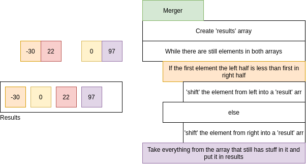
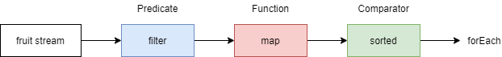
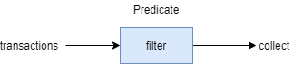

# Concurrent Programming
# Concurrent Programming.

## :star: Concurrent Programming (Threads).

- Concurrent computing is a form of computing in which several computations executed concurrently instead of 
sequentially.
- Java support concurrent programming through the usage of threads.
- Objects and resources can be accessed by multiple threads; each thread can potentially access any object in the 
program, and the programmer must ensure read and write access to objects properly synchronized between threads.

### 1. Callable and Future.

- While **Runnable** provides a means to wrap code to be executed in a different thread, it has a limitation
in that it **cannot return a result from the execution**. 
- The only way to get some return value from the execution of a Runnable is to assign the result to a variable 
accessible in a scope outside the Runnable.
- **Callable**: Was introduced in Java 5 as peer to **Runnable**. **Callable** is essentially the same except it has a 
**call()** method instead of **run()**. 
- The call method has the additional capability to **return a result, and it also allowed throw checked exceptions**.
- The result from a Callable task submission is available to be tapped via a Future.
- **Future**: Can be considered as container of sorts that houses the result of the **Callable** computation.
- Computation of the **Callable** can carry on in another thread, and any attempt to tap the result of a **Future** 
will block and will only return the result once it is available.

**Callable Interface.**

```java
public interface Callable<V> {
    V call() throws Exception;
}
```

**Future.**

```java
interface Future<V> {
    V get();
    V get(long timeout, TimeUnit unit);
    boolean cancel(boolean mayInterruptIfRunning);
    boolean isCancelled();
    boolean isDone();
}
```

**Using Callable and Future example.**

```java
public class Main {
    public static void main(String[] args) throws Exception {
        ExecutorService es = Executors.newSingleThreadExecutor();
    
        System.out.println("Time At Task Submission: " + new Date());
    
        Future<String> result = es.submit(new ComplexCalculator());
    
        // the call to Future.get() blocks until the result is available.
        System.out.println("Result of Complex Calculation is: " + result.get());
        System.out.println("Time At the Point of Printing the Result: " + new Date());
    }
}

class ComplexCalculator implements Callable<String> {
    @Override
    public String call() throws Exception {
        // sleep for 10 seconds
        Thread.sleep(10000);
        return "Complex result";
    }
}
```

**Other operations permitted on Future.**

- **get(long timeout, TimeUnit unit)**: Defines maximum time period during a current thread will wait for a result.
- To cancel the task call **cancel(mayInterruptIfRunning)**. The flag mayInterrupt indicates that task should be
interrupted if it was started and is running right now.
- To check if task completed, finished by calling **isDone()**.
- To check if the lengthy task cancelled **isCancelled()**.

### 2. CountDownLatch.

- A synchronization aid that allows one or more threads to wait until a set of operations performed
in other threads completes.
- A **CountDownLatch** is initialized with a given count.
- The **await()** methods block until the current count reaches zero due to invocations of the **countDown()** method,
after which all waiting threads released and any subsequent invocations of await return immediately.
- This is a one-shot phenomenon - the count cannot be reset. If you need a version that resets the count,
consider using **CyclicBarrier**.

**Methods.**

- **await():** Causes the current thread to wait until the latch has counted down to zero, unless the thread interrupted.

```java
public void await() throws InterruptedException
```

- **countDown():** Determines to count of the latch, releasing all waiting threads if the count reaches zero.

```java
public void countDown()
```

```java
class DoSomething implements Runnable {
    CountDownLatch latch;

    public DoSomething(CountDownLatch latch) {
        this.latch = latch;
    }

    public void run() {
        try {
            System.out.println("Do something");
            latch.countDown();
        } catch (Exception err) {
            err.printStackTrace();
        }
    }
}

public class CountDownLatchDemo {
    public static void main(String[] args) {
        try {
            int numberOfThreads = 5;
            if (args.length < 1) {
                System.out.println("java CountDownLatch numberOfThreads");
                return;
            }
            try {
                numberOfThreads = Integer.parseInt(args[0]);
            } catch (NumberFormatException ne) {
            }
            CountDownLatch latch = new CountDownLatch(numberOfThreads);
            for (int n = 0; n < numberOfThreads; n++) {
                Thread t = new Thread(new DoSomething(latch));
                t.start();
            }
            latch.await();
            System.out.println("In main thread after completion of " + numberOfThreads + " threads");
        } catch (Exception err) {
            err.printStackTrace();
        }
    }
}
```

- **CountDownLatch** is initialized with a counter of 5 in Main thread.
- Main thread is waiting by using **await()** method.
- Five instances of DoSomething have been created. 
- Each instance decremented the counter with **countDown()** method.
- Once the counter becomes zero, Main thread will resume.

### 3. Basic Multi threading.

- If you have many tasks to execute, and all these tasks are not dependent of the result of the precedent ones,
you can use Multithreading for your computer to do all this tasks at the same time using more processors if
your computer can.
- This can make your program execution faster if you have some big independent tasks.

```java
class CountAndPrint implements Runnable {
    private final String name;

    CountAndPrint(String name) {
        this.name = name;
    }

    // CountAndPrint will do
    @Override
    public void run() {
        for (int i = 0; i < 10000; i++) {
            System.out.println(this.name + " : " + i);
        }
    }

    public static void main(String[] args) {
        // Launching 4 parallel threads
        for (int i = 1; i <= 4; i++) {
            // `start` method will call the `run` method
            // of CountAndPrint in another thread
            new Thread(new CountAndPrint("Instance " + i)).start();
        }

        // Doing some others tasks in the main Thread
        for (int i = 0; i < 10000; i++) {
            System.out.println("Main : " + i);
        }
    }
}
```

### 4. Locks as Synchronisation aids.

- Locks are thread synchronisation mechanisms that essentially serve the same purpose as synchronized blocks or keywords.
- Intrinsic Locking.

```java
int count = 0; // shared among multiple threads

public void doSomething() {
    synchronized(this) {
        ++count; // a non-atomic operation
    }
}
```

- Synchronisation using Locks.

```java
int count = 0; // shared among multiple threads

Lock lockObj = new ReentrantLock();

public void doSomething() {
    try {
        lockObj.lock();
        ++count; // a non-atomic operation
    } finally {
        lockObj.unlock();
    }
}
```

- Locks also have functionality that intrinsic locking does not offer, such as locking but remaining responsive
to interruption, or trying to lock, and not block when unable to.

**Locking, responsive to interruption.**

```java
class Locky {
    int count = 0; // shared among multiple threads

    Lock lockObj = new ReentrantLock();

    public void doSomething() {
        try {
            try {
                lockObj.lockInterruptibly();
                ++count; // a non-atomic operation
            } catch (InterruptedException e) {
                Thread.currentThread().interrupt(); // stopping
            }
        } finally {
            if (!Thread.currentThread().isInterrupted()) {
                lockObj.unlock(); // sure to release the lock without fail
            }
        }
    }
}
```

**Only do something when able to lock.**

```java
public class Locky2 {
    int count = 0; // shared among multiple threads

    Lock lockObj = new ReentrantLock();

    public void doSomething() {
        boolean locked = lockObj.tryLock(); // returns true upon successful lock
        if (locked) {
            try {
                ++count; // a non-atomic operation
            } finally {
                lockObj.unlock(); // sure to release lock without fail
            }
        }
    }
}
```

### 5. Semaphores.

- **Semaphore** is a high level synchronize that maintains a set of permits that can be acquired and released by threads.
- A **Semaphore** can be imagined as a counter of permits that will be decremented when a thread acquires,
and incremented when a thread releases.
- If the amount of permits is **0** when a thread attempts to acquire, then the thread will block until permits made
available (or until the thread interrupted).

```java
Semaphore semaphore = new Semaphore(2);     // The int value being the number of permits
```

- The **Semaphore** constructor accepts an additional boolean parameter for fairness.
- When set false, this class makes no guarantees about the order in which threads acquire permits.
- When fairness set true, the semaphore guarantees that threads invoking any of acquire methods selected to
obtain permits in the order in which their invocation of these methods processed.

```java
Semaphore semaphore = new Semaphore(1, true);
```

**Use of Semaphore example.**

```java
class Pool {
    private static final int MAX_AVAILABLE = 100;
    private final Semaphore available = new Semaphore(MAX_AVAILABLE, true);

    /**
    * Obtains the next available item and reduces the permit count by 1.
    * If there are no items available, block.
    */
    public Object getItem() throws InterruptedException {
        available.acquire();
        return getNextAvailableItem();
    }

    /**
    * Puts the item into the pool and add 1 permit.
    */
    public void putItem(Object x) {
        if (markAsUnused(x)) {
            available.release();
        }
    }

    private Object getNextAvailableItem() {
        // Implementation
    }

    private boolean markAsUnused(Object o) {
        // Implementation
    }
}
```

### :star: 6. Synchronization.

- The synchronization block, which can use any Java object as an intrinsic lock.

```java
private static int t = 0;
private static Object mutex = new Object();

public static void main(String[] args) {
    ExecutorService executorService = Executors.newFixedThreadPool(400);

    for (int i = 0; i < 100; i++) {
        executorService.execute(() -> {
            synchronized(mutex) {
                t++;
                System.out.println(MessageFormat.format("t: {0}", t));
            }
        });
    }
    executorService.shutdown();
}
```

- If it weren't for the synchronized block, there would have been multiple concurrency issues involved.
- The first one would be with the post increment operator (it isn't atomic in itself), and the second would be that we
would be observing the value of **t** after an arbitrary amount of other threads has had the chance to modify it.
- Since we acquired an intrinsic lock, there will be no race conditions, and the output will contain
numbers from 1 to 100 in their normal order.
- Intrinsic locks in Java are mutexes (mutual execution locks).
- Mutual execution means that if one thread has acquired the lock, the second will be forced to wait for the first
one to release it before it can acquire the lock for itself.
- An operation that may put the thread into wait (sleep) state called a blocking operation. Thus
acquiring a lock is a blocking operation.
- Intrinsic locks in Java are reentrant. This means that if a thread attempts to acquire a lock it already owns, 
it will not block, and it will successfully acquire it. The following code will not block when called:

```java
public void bar() {
    synchronized(this) {
        // ...
    }
}

public void foo() {
    synchronized(this) {
        bar();
    }
}
```

- The following blocks of code are practically equivalent:
    - **A synchronized block on this**

```java
public void foo() {
    synchronized(this) {
        doStuff();
    }
}
```

- synchronized method.

```java
public synchronized void foo() {
    doStuff();
}
```

- Likewise, for static methods.

```java
class MyClass {
    public static void bar() {
        synchronized(MyClass.class) {
            doSomeOtherStuff();
        }
    }
}
```
- Has the same effect as this.

```java
class MyClass {
    public static synchronized void bar() {
        doSomeOtherStuff();
    }
}
```

### 7. Runnable Object.

- Runnable interface defines a single method, **run()**, meant to obtain the code executed in the thread.
- The Runnable object passed to the Thread constructor, and Thread's **start()** method called:

```java
class HelloRunnable implements Runnable {
    @Override
    public void run() {
        System.out.println("Hello from thread");
    }

    public static void main(String[] args) {
        new Thread(new HelloRunnable()).start();
    }
}

public class Main {
    public static void main(String[] args) {
        Runnable r = () -> System.out.println("Hello world");
        new Thread(r).start();
    }
}
```

**Runnable vs Thread subclass.**

- A Runnable object is more general, because the Runnable object can subclass a class other than Thread.
- Thread subclassing is easier to use in simple applications, but is limited by the fact that your task class must be a
descendant of Thread.
- A Runnable object is applicable to the high-level thread management APIs.

### 8. Creating basic deadlocked system.

- A deadlock occurs when two competing actions wait for the other to finish, and thus neither ever does.
- In Java there is one lock associated with each object. 
- To avoid concurrent modification done by multiple threads on a  single object we can use a synchronized keyword.
- Using synchronized keyword wrongly can lead to stuck systems called as deadlocked system.
- The 2 threads working on 1 instance, lets call threads as First and Second, and let's say we have 2
resources **R1** and **R2**.
- First acquires **R1** and, also needs **R2** for its completion while Second acquires **R2** and needs **R1** 
for completion.
    - At time **t = 0**. First has **R1** and Second has **R2**, now First is waiting for **R2** while Second 
    is waiting for **R1**, this wait identified and this leads to deadlock.

```java
public class Example2 {
    public static void main(String[] args) throws InterruptedException {
        final DeadLock d1 = new DeadLock();
        Thread t1 = new Thread(new Runnable() {
            @Override
            public void run() {
                d1.methodA();
            }
        });

        Thread t2 = new Thread(new Runnable() {
            @Override
            public void run() {
                d1.method2();
            }
        });

        t1.setName("First");
        t2.setName("Second");
        t1.start();
        t2.start();
    }
}

class DeadLock {
    Object mLock1 = new Object();
    Object mLock2 = new Object();

    public void methodA() {
        System.out.println("methodA wait for mLock1 " + Thread.currentThread().getName());
        synchronized (mLock1) {
            System.out.println("methodA mLock1 acquired " + Thread.currentThread().getName());
            try {
                Thread.sleep(100);
                method2();
            } catch (InterruptedException e) {
                e.printStackTrace();
            }
        }
    }

    public void method2() throws InterruptedException {
        System.out.println("method2 wait for mLock2 " + Thread.currentThread().getName());
        synchronized (mLock2) {
            System.out.println("method2 mLock2 acquired " + Thread.currentThread().getName());
            Thread.sleep(100);
            method3();
        }
    }

    public void method3() throws InterruptedException {
        System.out.println("method3 mLock1 "+ Thread.currentThread().getName());
        synchronized (mLock1) {
            System.out.println("method3 mLock1 acquired " + Thread.currentThread().getName());
        }
    }
}
```

```
methodA wait for mLock1 First
method2 wait for mLock2 Second
method2 mLock2 acquired Second
methodA mLock1 acquired First
method3 mLock1 Second
method2 wait for mLock2 First
```

### 9. Creating a Thread Instance.

- In Java, a thread represented by an object - an instance of **java.lang.Thread** or its subclass.
- First approach is to create that subclass and override the **run()** method.

```java
class MyThread extends Thread {
    @Override
    public void run() {
        for (int i = 0; i < 10; i++) {
            System.out.println("Thread running!");
        }
    }
}
```

- The thread can be created.

```java
MyThread t = new MyThread();
```

- A Thread class also contains a constructor accepting a string, which will be used as the thread's name.

```java
class MyThread extends Thread {
    public MyThread(String name) {
        super(name);
    }

    @Override
    public void run() {
        for (int i = 0; i < 10; i++) {
            System.out.println("Thread running!");
        }
    }
}

MyThread t = new MyThread("Producer");
```

- The second approach is to define the code using **java.lang.Runnable** and its only method **run()**.
- The Thread class then allows you to execute that method in a separated thread. 
- To achieve this, create the thread using a constructor accepting an instance of Runnable interface.

```java
Thread t = new Thread(aRunnable);
```

- Can be combined with lambdas or methods references.

```java
Thread t = new Thread(operator::hardWork);
```

- You can specify the thread's name, too.

```java
Thread t = new Thread(operator::hardWork, "Operator");
```

- Alternative accepting an instance of **java.lang.ThreadGroup** as the first parameter.

```java
ThreadGroup tg = new ThreadGroup("Operators");
Thread t = new Thread(tg, operator::hardWork, "Operators");
```

- The **ThreadGroup** represents a set of threads. You can only add a **Thread** to a **ThreadGroup** using a 
Thread's constructor.
- The **ThreadGroup** can then be used to manage all its **Threads** together, as well as the **Thread** can gain 
information from its **ThreadGroup**.
- Often the code readability suffers when creating and configuring many Threads with same properties or from the
same pattern. 
- That's when **java.util.concurrent.ThreadFactory** can be used. 
- This interface allows you to encapsulate the procedure of creating the thread through the factory pattern and 
its only method **newThread(Runnable)**.

```java
class WorkerFactory implements ThreadFactory {
    private int id = 0;

    @Override
    public Thread newThread(Runnable r) {
        return new Thread(r, "Worker " + id++);
    }
}
```

### 10. Atomic operations.

- An atomic operation is an operation that is executed all at once, without any chance of other threads observing or
modifying state during the atomic operation's execution.

**Bad example**

```java
private static int t = 0;

public static void main(String[] args) {
    ExecutorService executorService = Executors.newFixedThreadPool(400);

    for (int i = 0; i < 100; i++) {
        executorService.execute(() -> {
            t++;
            System.out.println(MessageFormat.format("t: {0}", t));
        });
    }
    executorService.shutdown();
}
```

- In this case there are two issues. 
- The first issue is that the post increment operator is not atomic. 
- It comprises multiple operations; get value, add 1 to the value, set the value. 
- That's why if we run the example it is likely we won't see 100 in the output - two threads may concurrently 
get the value, increment it, and set it.
- Let's say the value of **t** is 10, and two threads are incrementing **t**. 
- Both threads will set the value of **t** to 11, since the second thread observes the value of **t** before the first 
thread had finished incrementing it.
- The second issue is how we are observing **t**. 
- When we are printing the value of **t**, the value may have already been changed by a different thread after this 
thread's increment operation.
-  **java.util.concurrent.atomic.AtomicInteger** has many atomic operations.

```java
private static AtomicInteger t = new AtomicInteger(0);

public static void main(String[] args) {
    ExecutorService executorService = Executors.newFixedThreadPool(400);

    for (int i = 0; i < 100; i++) {
        executorService.execute(() -> {
            int currentT = t.incrementAndGet();
            System.out.println(MessageFormat.format("t: {0}", currentT));
        });
    }
    executorService.shutdown();
}
```

- The **incrementAndGet()** method of **AtomicInteger** atomically increments and returns the new value, thus 
eliminating the previous race condition.

### 11. Exclusive write / Concurrent read access.

- Concurrently write and read the same data.
- The **ReadWriteLock** interface, and its **ReentrantReadWriteLock** implementation allows for an access pattern 
that can be described as follows:
    - There can be any number of concurrent readers of the data. If there is at least one reader access granted, then
    no writer access is possible.
    - There can be at most one single writer to the data. If there is a writer access granted, then no reader can access
    the data.

```java
public class Sample {
    // Our lock. The constructor allows a fairness setting, which guarantees the chronology of lock attributes
    protected static final ReadWriteLock RW_LOCK = new ReentrantReadWriteLock();

    // This is a typical data that needs to be protected for concurrent access
    protected static int data = 0;

    // This will write to the data, in an exclusive access
    public static void writeToData() {
        RW_LOCK.writeLock().lock();
        try {
            data++;
        } finally {
            RW_LOCK.writeLock().unlock();
        }
    }

    public static int readData() {
        RW_LOCK.readLock().lock();
        try {
            return data;
        } finally {
            RW_LOCK.readLock().unlock();
        }
    }
}
```

- This precise use case has a cleaner solution using **AtomicInteger**, but what is described here is an access
pattern, that works regardless of the fact that data here is an integer that as an Atomic variant.
- The lock on the reading part needed? If you do not lock on the reader side, any number of things can go wrong:
    - The writes of primitive values not guaranteed to be atomic on all JVMs, so the reader could see only
    32 bits of a 64 bits write if data were a 64 bits long type.
    - The visibility of write from a thread that did not perform it is guaranteed by the JVM only if we establish
    Happen Before relationship between the writes and the reads. This relationship established when both readers and
    writers use their respective locks.
- In case higher performance required, an under certain types of usage, there is a faster lock type available, called
the **StampedLock**, that amongst other things implements an optimistic lock mode. 
- This lock works very different from the **ReadWriteLock**, and this sample is not transposable.

### :star: 12. Producer-Consumer.

```java
public class Producer implements Runnable {
    private final BlockingQueue<ProducedData> queue;

    public Producer(BlockingQueue<ProducedData> queue) {
        this.queue = queue;
    }

    public void run() {
        int producedCount = 0;
        try {
            while (true) {
                producedCount++;
                // put throws an InterruptedException when the thread is interrupted
                queue.put(new ProducedData());
            }
        } catch (InterruptedException e) {
            // the thread has been interrupted: cleanup and exit
            producedCount--;
            // re-interrupt the thread in case the interrupt flag is needed higher up
            Thread.currentThread().interrupt();
        }
        System.out.println("Produced " + producedCount + " objects");
    }
}

public class Consumer implements Runnable {
    private final BlockingQueue<ProducedData> queue;

    public Consumer(BlockingQueue<ProducedData> queue) {
        this.queue = queue;
    }

    public void run() {
        int consumedCount = 0;
        try {
            while (true) {
                // Pool throws an InterruptedException when the thread is interrupted
                ProducedData data = queue.pool(10, TimeUnit.MILLISECONDS);
                // process data
                consumedCount++;
            }
        } catch (InterruptedException e) {
            // the thread has been interrupted: cleanup and exit
            consumedCount--;
            // re-interrupt the thread in case the interrupt flag is needed higher up
            Thread.currentThread().interrupt();
        }
        System.out.println("Consumed " + consumedCount + " objects");
    }
}

public class ProducerConsumerExample {
    static class ProducedData {
        // empty data object
    }

    public static void main(String[] args) throws InterruptedException {
        BlockingQueue<ProducedData> queue = new ArrayBlockingQueue<ProducedData>(1000);

        // choice of queue determines the actual behavior
        Thread producer = new Thread(new Producer(queue));

        Thread consumer = new Thread(new Consumer(queue));

        producer.start();
        consumer.start();

        Thread.sleep(1000);
        producer.interrupt();
        Thread.sleep(10);
        consumer.interrupt();
    }
}
```

### 13. Visualizing read/write barriers while using synchronized/volatile.

- We should use a synchronized keyword to make execution of a method or block exclusive.
- Apart from making a code atomic synchronized and volatile keywords also provides read/write barrier.

```java
class Counter {
    private Integer count = 10;

    public synchronized void incrementCount() {
        count++;
    }

    public Integer getCount() {
        return count;
    }
}
```

- ThreadA calls **incrementCount()** first then ThreadB calls **getCount()**. 
In this scenario there is no guarantee that B will see updated value of count. 
- It may still see count as 10, even it is also possible that it never sees updated value of count ever.
- How Java memory model integrates with hardware architecture. 
- In Java each thread has its own thread stack.
- :star: This stack contains, **method call stack and local variable created in that thread**.
- In a multi core system, it is quite possible that two threads are running concurrently in separate cores.
- In such a scenario it is possible that part of thread's stack lies inside register/cache of a core.
- If inside a thread, an object accessed using synchronized (or volatile) keyword, after synchronized block that thread
syncs it's a local copy of that variable with the main memory. 
- This creates a read/write barrier and makes sure the thread is seeing the latest value of that object.
- In our case since ThreadB has not used synchronized access to count, it might be referring value of count
stored in register and may never see updates from ThreadA. Need to make **getCount()** synchronized.

```java
public synchronized Integer getCount() {
    return count;
}
```

- Now when ThreadA done updating count it unlocks Counter instance, at the same time creates write a barrier
and flushes all changes done inside block to the main memory. 
- Similarly, when ThreadB acquires lock on the same instance of Counter, it enters into read barrier and reads 
value of count from main memory and sees all updates.

```
Thread A    Acquire lock
            Increment 'count'
            Release lock    (flush everything to main memory)
            ------------------------------------------------------------------------------------
                            (Updates its local copy with main memory)   Acquire lock    Thread B
                                                                        Read 'count'
                                                                        Release lock
```

- Same visibility effect goes for **volatile** read/writes as well. 
- All variables updated prior to write to volatile will be flushed to main memory and all reads after volatile 
variable read will be from main memory.

### 14. Get status of all threads started by your program excluding system threads.

```java
public class ThreadStatus {
    public static void main(String[] args) throws Exception {
        for (int i = 0; i < 5; i++) {
            Thread t = new Thread(new MyThread());
            t.setName("MyThread:" + i);
            t.start();
        }
        int threadCount = 0;
        Set<Thread> threadSet = Thread.getAllStackTraces().keySet();
        for (Thread t : threadSet) {
            if (t.getThreadGroup() == Thread.currentThread().getThreadGroup()) {
                System.out.println("Thread: " + t + ":state: " + t.getState());
                ++threadCount;
            }
        }
        System.out.println("Thread count started by Main thread: " + threadCount);
    }
}

class MyThread implements Runnable {
    public void run() {
        try {
            Thread.sleep(2000);
        } catch (Exception err) {
            err.printStackTrace();
        }
    }
}
```

- **Thread.getAllStackTraces().keySet()** returns all Threads including application threads and system threads. 
- If you are interested only in status of Threads, started by your application, iterate the Thread set by checking 
ThreadGroup of a particular thread against your main program thread.
- In absence of above ThreadGroup condition, the program returns status of below System Threads:
    - Reference Handler.
    - Signal Dispatcher.
    - Attach Listener.
    - Finalizer.

### 15. Using ThreadLocal.

- ThreadLocal allows you to have a variable that will be unique to a given thread. 
- If the same code runs in different threads, these executions will not share the value, but instead each thread 
has its own variable that is local to the thread.
- For example, this is frequently used to establish the context (such as authorization information) of handling a request
in a servlet. You might do something like this.

```java
private static final ThreadLocal<MyUserContext> contexts = new ThreadLocal<>();

public static MyUserContext getContext() {
    return contexts.get(); // get returns the variable unique to this thread
}

public void doGet(...) {
    MyUserContext context = magicGetContextFromRequest(request);
    contexts.put(context); // save that context to our thread-local - other threads
                           // making this call don't overwrite ours
    try {
        // business logic
    } finally {
        contexts.remove(); // 'ensure' removal of thread-local variable
    }
}
```

- Now instead of passing MyUserContext into every single method, you can instead use **MyServlet.getContext()** where
you need it. 
- Now of course, this does introduce a variable that needs to be documented, but it's thread-safe,
which eliminates a lot of the downsides to using such highly scoped variable.
- The key advantage here is that every thread has its own thread local variable in that context's container. 
- As long as you use it from a defined entry point you can rely on this context being there when you need it.

### 16. Multiple producer/consumer example with shared global queue.

```java
public class ProducerConsumerWithES {
    public static void main(String args[]) {
        BlockingQueue<Integer> sharedQueue = new LinkedBlockingQueue<Integer>();

        ExecutorService pes = Executors.newFixedThreadPool(2);
        ExecutorService ces = Executors.newFixedThreadPool(2);

        pes.submit(new Producer(sharedQueue, 1));
        pes.submit(new Producer(sharedQueue, 2));
        ces.submit(new Consumer(sharedQueue, 1));
        ces.submit(new Consumer(sharedQueue, 2));

        pes.shutdown();
        ces.shutdown();
    }
}

/* Different producers produces a stream of integers continuously to a shared queue,
which is shared between all Producers and consumers */
class Producer implements Runnable {
    private final BlockingQueue<Integer> sharedQueue;
    private int threadNo;
    private Random random = new Random();
    public Producer(BlockingQueue<Integer> sharedQueue,int threadNo) {
        this.sharedQueue = sharedQueue;
        this.threadNo = threadNo;
    }

    @Override
    public void run() {
        // Producer produces a continuous stream of numbers for every 200 milli seconds
        while (true) {
            try {
                int number = random.nextInt(1000);
                System.out.println("Produced:" + number + ":by thread:"+ threadNo);
                sharedQueue.put(number);
                Thread.sleep(200);
            } catch (Exception err) {
                err.printStackTrace();
            }
        }
    }
}

/* Different consumers consume data from shared queue, which is shared by both producer and consumer threads */
class Consumer implements Runnable {
    private final BlockingQueue<Integer> sharedQueue;
    private int threadNo;
    public Consumer(BlockingQueue<Integer> sharedQueue, int threadNo) {
        this.sharedQueue = sharedQueue;
        this.threadNo = threadNo;
    }

    @Override
    public void run() {
        // Consumer consumes numbers generated from Producer threads continuously
        while(true){
            try {
                int num = sharedQueue.take();
                System.out.println("Consumed: "+ num + ":by thread:"+threadNo);
            } catch (Exception err) {
                err.printStackTrace();
            }
        }
    }
}
```

- Output

```
Produced:69:by thread:2
Produced:553:by thread:1
Consumed: 69:by thread:1
Consumed: 553:by thread:2
Produced:41:by thread:2
Produced:796:by thread:1
Consumed: 41:by thread:1
Consumed: 796:by thread:2
Produced:728:by thread:2
Consumed: 728:by thread:1
```

- **SharedQueue**, which is a **LinkedBlockingQueue** is shared among all Producer and Consumer threads.
- Producer threads produces one integer for every 200 milli seconds continuously and append it to sharedQueue.
- Consumer thread consumes integer from sharedQueue continuously.
- This program implemented without explicit synchronized of Lock constructs. BlockingQueue is the key to achieve it.
- BlockingQueue implementations are designed to be used primarily for producer-consumer queues.
- BlockingQueue implementations are thread-safe. All queuing methods achieve their effects
atomically using internal locks or other form of concurrency control.

### 17. Add two 'int' arrays using a ThreadPool.

- A ThreadPool has a Queue of tasks, of which each will be executed on one these Threads.

```java
int[] firstArray = {2,4,6,8};
int[] secondArray = {1,3,5,7};
int[] result  = {0,0,0,0};

ExecutorService pool = Executors.newCachedThreadPool();

// Setup the ThreadPool:
// for each element in the array, submit a worker to the pool that adds elements
for (int i = 0; i < result.length; i++) {
    final int worker = i;
    pool.submit(() -> result[worker] = firstArray[worker] + secondArray[worker]);
}

// Wait for all Workers to finish
try {
    // execute all submitted tasks
    pool.shutdown();
    // waits until all workers finish, or the timeout ends
    pool.awaitTermination(12, TimeUnit.SECONDS);
} catch (InterruptedException e) {
    pool.shutdownNow(); // kill thread
}

System.out.println(Arrays.toString(result));
```

- This example is purely illustrative. In practice, there won't be any speedup by using threads for a task this small. 
- A slowdown is likely, since the overheads of task creation and scheduling will swap the time taken to run a task.
- If you were using Java 7 and earlier, you would use anonymous classes instead of lambdas to implement the
tasks.

### 18. Pausing execution.

- **Thread.sleep()** causes the current thread to suspend execution for a specified period. 
This is an efficient means of making processor time available to the other threads of an application 
or other applications that might be running on a computer system.
- Specifies the sleep time to the millisecond.

```java
public static void sleep(long millis) throws InterruptedException
```

- Specifies sleep time to the nanosecond.

```java
public static void sleep(long millis, int nanos)
```

- Pausing Execution for 1 second.

```java
Thread.sleep(1000);
```

- This is a hint to the operating system's kernel scheduler. 
- This may not necessarily be precise, and some implementations do not even consider the nanosecond parameter.
- It is recommended to enclose a call to **Thread.sleep()** in try/catch and catch InterruptedException.

### 19. Thread Interruption/Stopping Threads.

- Each Java Thread has an interrupted flag, which is initially false. 
- Interrupting a thread, is essentially nothing more than setting that flag to true.
- There are methods that behave in a special way when the thread they're running on is interrupted. 
- These methods called blocking methods. These are methods that put the thread in the:
    - WAITING.
    - TIMED_WAITING.
- When a thread is in this state, interrupting it, will cause an **InterruptedException** to be thrown on the 
interrupted thread, rather than the interrupt flag set to true, and the thread becomes RUNNABLE again. 
- Lastly a thread that has its interrupt flag set, that enters a blocking method (i.e. tries to get into a waiting state), 
will immediately throw an **InterruptedException**, and the interrupt flag will be cleared.
- Stopping a thread is a collaboration. 
- When a thread interrupted its running code can be several levels deep into the stacktrace. 
- Most code doesn't call a blocking method, and finishes timely enough to not delay the stopping of the thread unduly.
- Loops that handle possibly infinite tasks (i.e. they keep running in principle) should check the interrupt flag 
in order to exit the loop.

**Example of code that stops handling tasks upon interruption.**

```java
class TaskHandler implements Runnable {

    private final BlockingQueue<Task> queue;

    TaskHandler(BlockingQueue<Task> queue) {
        this.queue = queue;
    }

    @Override
    public void run() {
        // check for interrupt flag, exit loop when interrupted
        while (!Thread.currentThread().isInterrupted()) {
            try {
                Task task = queue.take(); // blocking call, responsive to interrupt
                handle(task);
            } catch (InterruptedException e) {
                // cannot throw InterruptedException (due to Runnable interface restriction)
                Thread.currentThread().interrupt();
                // so indicating interruption by setting the flag
            }
        }
    }

    private void handle(Task task) {
        // handling
    }
}
```

**Example of code that delays setting the interrupt flag until completely done.**

```java
class MustFinishHandler implements Runnable {
    private final BlockingQueue<Task> queue;

    MustFinishHandler(BlockingQueue<Task> queue) {
        this.queue = queue;
    }

    @Override
    public void run() {
        boolean shouldInterrupt = false;

        while (true) {
            try {
                Task task = queue.take();
                if (task.isEndOfTasks()) {
                    if (shouldInterrupt) {
                        Thread.currentThread().interrupt();
                    }
                    return;
                }
                handle(task);
            } catch (InterruptedException e) {
                shouldInterrupt = true; // must finish, remember to set interrupt flag when we're done
            }
        }
    }

    private void handle(Task task) {
        // handling
    }
}
```

**Example of code that has a fixed list of tasks but may quit early when interrupt**

```java
class GetAsFarAsPossible implements Runnable {
    private final List<Task> tasks = new ArrayList<>();

    @Override
    public void run() {
        for (Task task : tasks) {
            if (Thread.currentThread().isInterrupted()) {
                return;
            }
            handle(task);
        }
    }

    private void handle(Task task) {
        // handling
    }
}
```

***

## Executor, ExecutorService and Thread Pools.

- The Executor interface in Java provides a way of decoupling task submission from the mechanics of how each task
will be run, including details of thread use, scheduling etc. 
- An Executor normally used instead of explicitly creating threads. 
- With Executors, developers won't have to significantly rewrite their code to be able to easily tune
their program's task-execution policy.

### 1. ThreadPoolExecutor.

- ThreadPoolExecutor takes care of Thread handling. 
- You can configure the minimal amount of Threads the executor always has to maintain when there's not much to do 
(it's called core size), and a maximal Thread size to which the Pool can grow, if there is more work to do. 
- Once the workload declines, the Pool slowly reduces the Thread count again until it reaches min size.

```java
void example() {
    ThreadPoolExecutor pool = new ThreadPoolExecutor(
            1,      // keep at least one thread ready, even if no Runnables are executed
            5,      // at most five Runnables/Threads executed in parallel
            1, TimeUnit.MINUTES,    // idle Threads terminated after one minute, when min Pool size exceeded
            new ArrayBlockingQueue<Runnable>(10)); // outstanding runnables are kept here
  
    pool.execute(new Runnable() {
        @Override
        public void run() {
          // code to run
        }
    });   
}
```

- If you configure the ThreadPoolExecutor with an unbounded queue, then the thread count will not exceed
corePoolSize since new threads only created if the queue is full.

```java
ThreadPoolExecutor(int corePoolSize, int maximumPoolSize, long keepAliveTime,
TimeUnit unit, BlockingQueue<Runnable> workQueue, ThreadFactory threadFactory,
RejectedExecutionHandler handler)
```

- If there are more than corePoolSize but less than maximumPoolSize threads running, a new thread will be created
only if the queue is full.
- **Advantages**:
    - BlockingQueue size can be controlled and out-of-memory scenario can be avoided. 
    - Application performance won't be degraded with limited queue size.
    - You can use existing or create new Rejection Handler policies:
        - In the default **ThreadPoolExecutor.AbortPolicy**, the handler throws a runtime RejectedExecutionException
        upon rejection.
        - In **ThreadPoolExecutor.CallerRunsPolicy**, the thread that invokes execute itself runs the task.
        This provides a simple feedback control mechanism that will slow down the rate that new tasks submitted.
        - In **ThreadPoolExecutor.DiscardPolicy**, a task that cannot be executed is simply dropped.
        - In **ThreadPoolExecutor.DiscardOldestPolicy**, if the executor not shut down, the task at the head
        of the work queue dropped, and then execution retired.
    - Custom **ThreadFactory** can be configured, which us useful:
        - To set a more descriptive thread name.
        - To set thread daemon status.
        - To set thread priority.

### 2. Callable.

- If your computation produces some return value which later is required, a simple Runnable task isn't sufficient.
- For such causes you can use **ExecutorService.submit(Callable<T>)** which returns a value after execution completes.
- The Service will return a **Future** which you can use to retrieve the result of the task execution.

```java
// Submit a callable for execution
ExecutorService pool = anExecutorService;
Future<Integer> future = pool.submit(new Callable<Integer>() {
    @Override
    public Integer call() {
        return new Random().nextInt();
    }
}

// ... perform other task in a different thread
```

- When you need to get the result of the future, call **future.get()**.
- Wait indefinitely for future to finish with a result.

```java
try {
    // Blocks current thread until future is completed
    Integer result = future.get();
} catch (InterruptedException || ExecutionException e) {
    // handle
}
```

- Wait for future to finish, but no longer than specified time.

```java
try {
    // Blocks current thread for a maximum of 500 milliseconds
    // If the future finishes before that, result is returned,
    // otherwise TimeoutException is thrown
    Integer result = future.get(500, TimeUnit.MILLISECONDS);
} catch (InterruptedException || ExecutionException || TimeoutException e) {
    // handle
}
```

- If the result of a scheduled or running task is no longer required, you can call **Future.cancel(boolean)** 
to cancel it.
- Calling **cancel(false)** will just remove the task from the queue of tasks to be run.
- Calling **cancel(true)** will also interrupt the task if it is currently running.

### 3. submit() vs execute() exception handling differences.

- **execute()** command used for fire and forget calls (without need of analyzing the result) and **submit()** command
used for analyzing the result of Future object.
- Exceptions from **submit()** are swallowed by a framework if you did not catch them.

**Case 1: submit the Runnable with execute() command, which reports the Exception.**

```java
public class ExecuteSubmitDemo {
    public ExecuteSubmitDemo() {
        System.out.println("creating service");
        ExecutorService service = Executors.newFixedThreadPool(2);

        for (int i = 0; i < 2; i++) {
            service.execute(new Runnable() {
                public void run() {
                    int a = 4;
                    int b = 0;
                    System.out.println("a and b=" + a + ":" + b);
                    System.out.println("a/b:" + (a / b));
                    System.out.println("Thread Name in Runnable after divide by zero:"
                        + Thread.currentThread().getName());
                }
            });
        }
        service.shutdown();
    }
    public static void main(String[] args) {
        ExecuteServiceDemo demo = new ExecuteServiceDemo();
    }
}

class ExtendedExecutor extends ThreadPoolExecutor {

    public ExtendedExecutor() {
        super(1, 1, 60, TimeUnit.SECONDS, new ArrayBlockingQueue<Runnable>(100));
    }

    protected void afterExecute(Runnable r, Throwable t) {
        super.afterExecute(r, t);
        if (t == null && r instanceof Future<?>) {
            try {
                Object result = ((Future<?>) r).get();
            } catch (CancellationException ce) {
                t = ce;
            } catch (ExecutionException ee) {
                t = ee.getCause();
            } catch (InterruptedException ie) {
                Thread.currentThread().interrupt(); // ignore rest
            }
        }
        if (t != null) {
            System.out.println(t);
        }
    }
}
```

**Case 2: Replace execute() with submit().**

- `service.submit(new Runnable() {}):` In this case, Exceptions swallowed by a framework since `run()` method did
not catch them explicitly.

**Case 3: Change the newFixedThreadPool to ExtendedExecutor**

```java
// ExecutorService service = Executors.newFixedThreadPool(2);
ExtendedExecutor service = new ExtendedExecutor();
```

- Use your custom ThreadPoolExecutor and handle Exception with custom ThreadPoolExecutor.

### 4. Handle Rejected Execution.

- If you try to submit tasks to a shutdown Executor, or the queue saturated and maximum number of Threads has been reached,
`RejectedExecutionHandler.rejectedExecution(Runnable, ThreadPoolExecutor)` will be called.
- `ThreadPoolExecutor.AbortPolicy` default, will throw REE.
- `ThreadPoolExecutor.CallerRunsPolicy` executes a task on caller's thread - blocking it.
- `ThreadPoolExecutor.DiscardPolicy` silently discard task.
- `ThreadPoolExecutor.DiscardOldestPolicy` silently discard the oldest task in queue and retry execution of the new task.
- Set using ThreadPool constructors.

```java
public ThreadPoolExecutor(int corePoolSize,
    int maximumPoolSize,
    long keepAliveTime,
    TimeUnit unit,
    BlockingQueue<Runnable> workQueue,
    RejectedExecutionHandler handler) // <--

public ThreadPoolExecutor(int corePoolSize,
    int maximumPoolSize,
    long keepAliveTime,
    TimeUnit unit,
    BlockingQueue<Runnable> workQueue,
    ThreadFactory threadFactory,
    RejectedExecutionHandler handler) // <--
```

### 5. Runnable Tasks.

- Executors accept a `java.lang.Runnable` which contains (potentially computationally or otherwise 
long-running or heavy) code to be run in another Thread.

```java
Executor exec = Executors.newFixedThreadPoolExecutor(5);
exec.execute(new Runnable() {
    @Override
    public void run() {
        // work to do, no need to get result back
    }
});
```

- Using Java 8.

```java
Executor exec = anExecutor;
exec.execute(() -> {
    // result
});
```

### 6. :star: Use cases for different types of concurrency constructs.

**1. ExecutorService**

```java
ExecutorService executor = Executors.newFixedThreadPool(50);
```

- It is simple and easy to use. 
- It handles low level details of ThreadPoolExecutor.
- Prefer when number of Callable/Runnable tasks are small and piling of tasks in a unbounded queue does
not increase memory & degrade the performance of the system. 
- If you have CPU/Memory constraints, prefer use ThreadPoolExecutor with capacity constraints & RejectedExecutionHandler 
to handle rejection of tasks.

**2. CountDownLatch**

- CountDownLatch will be initialized with a given count. 
- This count decremented by calls to the `countDown()` method. 
- Threads waiting for this count to reach zero can call one of the `await()` methods. 
- Calling `await()` blocks the thread until the count reaches zero. 
- This class enables java thread to wait until other set of threads completes their tasks.
- **Achieving Maximum Parallelism:** Sometimes we want to start a number of threads at the same time to achieve
maximum parallelism.
- Wait N threads to complete before start execution.
- Deadlock detection.

**3. ThreadPoolExecutor**

- It provides more control. If application constrained by number of pending Runnable/Callable tasks, you can
use bounded queue by setting the max capacity.
- Once the queue reaches maximum capacity, you can define RejectionHandler.
- Java provides four types of RejectedExecutionHandler policies:
    - `ThreadPoolExecutor.AbortPolicy:` The handler throws a runtime RejectedExecutionException upon rejection.
    - `ThreadPoolExecutor.CallerRunsPolicy:` The thread that invokes execute itself runs the task. 
    This provides a simple feedback control mechanism that will slow down the rate that new tasks submitted.
    - `ThreadPoolExecutor.DiscardPolicy:` A task that cannot be executed is simply dropped.
    - `ThreadPoolExecutor.DiscardOldestPolicy:` If the executor not shut down, the task at the head of the work queue
    dropped, and then execution retried.
- If you want to simulate **CountDownLatch** behavior, you can use `invokeAll()` method.

**4. ForkJoinPool**

- The **ForkJoinPool** was added in Java 7. 
- The **ForkJoinPool** is similar to the Java **ExecutorService** but with one difference.
- The **ForkJoinPool** makes it easy for tasks to split their work up into smaller tasks which are then submitted
to the **ForkJoinPool** too. 
- Task stealing happens in **ForkJoinPool** when free worker threads steal tasks from busy worker thread queue.
- Java 8 has introduced one more API in ExecutorService to create work stealing pool.

```
Creates a work-stealing thread pool using all available processors as its target parallelism level.
```

- By default, it will take number of CPU cores as parameter.

### 7. Wait for completion of all tasks in ExecutorService.

**1. ExecutorService.invokeAll()**

```
Executes the given tasks, returning a list of Features holding their status and results when everything is completed.
```

```java
public class InvokeAllDemo {
    public InvokeAllDemo() {
        System.out.println("creating service");
        ExecutorService service = Executors.newFixedThreadPool(Runtime.getRuntime()
            .availableProcessors());

        List<MyCallable> futureList = new ArrayList<>();

        for (int i = 0; i < 10; i++) {
            MyCallable myCallable = new MyCallable((long) i);
            futureList.add(myCallable);
        }

        System.out.println("Start");
        try {
            List<Future<Long>> futures = service.invokeAll(futureList);
        } catch (Exception err) {
            err.printStackTrace();
        }
        System.out.println("Completed");
        service.shutdown();
    }

    public static void main(String[] args) {
        InvokeAllDemo demo = new InvokeAllDemo();
    }

    class MyCallable implements Callable<Long> {
        Long id = 0L;
        public MyCallable(Long val) {
            this.id = val;
        }
        public Long call() {
            return id;
        }
    }
}
```

**2. CountDownLatch**

- A synchronization aid that allows one or more threads to wait until a set of operations performed in other
threads completes.
- A **CountDownLatch** is initialized with a given count.
- That await methods block until the current count reaches zero due to invocations of the `countDown()` method, 
after which all waiting threads released and any subsequent invocations of await return immediately. 
- This is a one-shot phenomenon, the count cannot be reset. 
- If you need a version that resets the count, consider using a **CyclicBarrier**.

**3. ForkJoinPool or newWorkStealingPool() in Executors.**

**4. Iterate through all Future objects created after submitting to ExecutorService.**

**5. Recommended way to shut down ExecutorService.**

```java
void shutDownAndAwaitTermination(ExecutorService pool) {
    pool.shutdown(); // Disable new tasks from being submitted
    try {
        // Wait a while for existing tasks to terminate
        if (!pool.awaitTermination(60, TimeUnit.SECONDS)) {
            pool.shutdownNow(); // Cancel currently executing tasks
            // Wait a while for tasks to respond to being cancelled
            if (pool.awaitTermination(60, TimeUnit.SECONDS)) {
                System.out.println("Pool did not terminate");
            }
        }
    } catch (InterruptedException ie) {
        // (Re-)Cancel if current thread also interrupted
        pool.shutdownNow();
        // Preserve interrupt status
        Thread.currentThread().interrupt();
    }
}
```

- `shutdown():` Initiates an orderly shutdown in which previously submitted tasks are executed, but no new tasks will
be accepted.
- `shutdownNow():` Attempts to stop all actively executing tasks, halts the processing of waiting tasks, and
returns a list of the tasks that were awaiting execution.
- In above example, if your tasks are taking more time to complete, you can change if condition to while condition.

**Replace**

```java
if (!pool.awaitTermination(60, TimeUnit.SECONDS))
```

**With**

```java
while (!pool.awaitTermination(60, TimeUnit.SECONDS)) {
    Thread.sleep(60000);
}
```

### 8. Use cases for different types of ExecutorService.

- Executor returns different type of ThreadPools catering to specific need.

**1. newSingleThreadExecutor**

```java
public static ExecutorService newSingleThreadExecutor()
```

- Creates an Executor that uses a single worker thread operating off an unbounded queue.
- There is a difference between `newFixedThreadPool(1)` and `newSingleThreadExecutor()` as the java doc says for the latter:
    - Unlike the otherwise equivalent `newFixedThreadPool(1)` the returned executor guaranteed not to
    be reconfigurable to use additional threads.
- Which means that a **newFixedThreadPool** can be reconfigured later in the program by:
    - `((ThreadPoolExecutor) fixedThreadPool).setMaximumPoolSize(10):` This is not possible for newSingleThreadExecutor.
- Use cases:
    - :one: You want to execute the submitted tasks in a sequence.
    - :two: You need only one Thread to handle all your request.
- Cons:
    - :one: An unbounded queue is harmful.

**2. newFixedThreadPool**

```java
public static ExecutorService newFixedThreadPool(int nThreads)
```

- Creates a thread pool that reuses a fixed number of threads operating off a shared unbounded queue. 
- At any point, at most nThreads threads will be active processing tasks. 
- If additional tasks submitted when all threads are active, they will wait in the queue until a thread is available.
- Use cases:
    - :one: Effective use of available cores. Configure nThreads as `Runtime.getRuntime().availableProcessors()`.
    - :two: When you decide that number of thread should not exceed a number in the thread pool.
- Cons:
    - :one: An unbounded queue is harmful.

**3. newCachedThreadPool**

```java
public static ExecutorService newCachedThreadPool()
```

- Creates a thread pool that creates new threads as needed, but will reuse previously constructed threads when they are
available.
- Use cases:
    - :one: For short-lived asynchronous tasks.
- Cons:
    - :one: An unbounded queue is harmful.
    - :two: Each new task will create a new thread if all existing threads are busy. If the task is taking long duration,
    more number of threads will be created, which will degrade the performance of the system. Alternative in this case:
    newFixedThreadPool.

**4. newScheduledThreadPool**

```java
public static ScheduledExecutorService newScheduledThreadPool(int corePoolSize)
```

- Creates a thread pool that can schedule commands to run after a given delay, or to execute periodically.
- Use cases:
    - :one: Handling recurring events with delays, which will happen in future at a certain interval of times.
- Cons:
    - :one: An unbounded queue is harmful.

**5. newWorkStealingPool**

```java
public static ExecutorService newWorkStealingPool()
```

- Creates a work-stealing thread pool using all available processors as its target parallelism level.
- Use cases:
    - :one: For a divide and conquer type problem.
    - :two: Effective use of idle threads. Idle threads steals tasks from busy threads.
- Cons:
    - :one: Unbounded queue size is harmful.
- Common drawbacks in all this Executor service; an unbounded queue. This will be addressed with ThreadPoolExecutor.
- With ThreadPoolExecutor, you can:
    - :one: Control Thread pool size dynamically.
    - :two: Set the capacity for BlockingQueue.
    - :three: Define RejectionExecutionHandler when queue is full.
    - :four: CustomThreadFactory to add some additional functionality during Thread creation.

### 9. Scheduled tasks to run at fixed time, after a delay or repeatedly.

- The ScheduledExecutorService class provides methods for scheduling single or repeated tasks in number of ways. 
- The following code sample assume that pool has been declared and initialized as follows.

```java
ScheduledExecutorService pool = Executors.newScheduledThreadPool(5);
```

- In addition to the normal ExecutorService methods, the ScheduledExecutorService API adds 4 methods that
schedule tasks and return ScheduledFuture objects. 
- The latter can be used to retrieve results (in some cases) and cancel tasks.

**Starting a task after a fixed delay.**

- Example schedules a task to start after ten minutes.

```java
ScheduledFuture<Integer> future = pool.schedule(new Callable<>() {
    @Override
    public Integer call() {
        // do something
        return 18;
    }
},
10, TimeUnit.MINUTES);
```

**Starting tasks at a fixed rate.**

- Example schedules a task to start after ten minutes, and then repeatedly at a rate of once every one minute.

```java
ScheduledFuture<?> future = pool.scheduleAtFixedRate(new Runnable() {
    @Override
    public void run() {
        // do something
    }
},
10, 1, TimeUnit.MINUTES);
```

- Task execution will continue according to the schedule until the pool shut down, the future canceled, or one of
the tasks encounters an exception.
- It guaranteed that the tasks scheduled by a given scheduledAtFixedRate call will not overlap in time. 
- If a task takes longer than the prescribed period, then the next and subsequent task executions may start late.

**Starting tasks with a fixed delay**

- Example schedules a task to start after ten minutes, and then repeatedly with a delay of one minute
between one task ending and the next one starting.

```java
ScheduledFuture<?> future = pool.scheduleWithFixedDelay(new Runnable() {
    @Override
    public void run() {
        // something
    }
},
10, 1, TimeUnit.MINUTES);
```

- Task execution will continue according to the schedule until the pool shuts down, the future cancelled, or one of
the tasks encounters an exception.

### 10. Using Thread Pools.

- Thread Pools used mostly calling methods in ExecutorService.
- The following methods can be used to submit work for execution.

| Method | Description |
|---|---|
| submit | Executes a submitted work and return a future which can be used to get the result |
| execute | Execute the task sometime in the future without getting any value |
| invokeAll | Execute a list of tasks and return a list of Futures |
| invokeAny | Executes all the but return only the result of one that has been successful (without exceptions) |

- Once you are done with the Thread Pool you can call **shutdown()** to terminate the Thread Pool. 
- This executes all pending tasks. 
- To wait for all tasks to execute you can loop around awaitTermination or **isShutDown()**.

***

## ThreadLocal

### 1. Basic ThreadLocal usage.

- Java **ThreadLocal** is used to create thread local variables. 
- It know that threads of an Object share its variables, so the variable is not thread safe. 
- We can use synchronization for thread safety but if we want to avoid
synchronization, **ThreadLocal** allows us to create variables which are local to the thread, i.e. only thread can
read or write to these variables, so the other threads executing the same piece of code will not be able to access
each other **ThreadLocal** variables.
- We can use **ThreadLocal** variables in a situation where you have thread pool like in a web service.
- Creating a SimpleDateFormat object every time for every request is time-consuming, and
a Static one cannot be created as SimpleDateFormat is not thread safe, so we can create a ThreadLocal so that we
can perform thread safe operations without the overhead of creating SimpleDateFormat every time.
- Every thread has its own ThreadLocal variable, and they can use it's **get()** and **set()** methods to get the default
value or change its value to Thread.
- ThreadLocal instances are typically **private static** fields in classes that wish to associate state with a thread.

```java
public class ThreadLocalExample implements Runnable {
    // SimpleDateFormat is not thread safe, so give to each thread
    private static final ThreadLocal<SimpleDateFormat> formatter = new ThreadLocal<SimpleDateFormat>() {
        @Override
        protected SimpleDateFormat initialValue() {
            return new SimpleDateFormat("yyyyMMdd HHmm");
        }
    };

    public static void main(String[] args) throws InterruptedException {
        ThreadLocalExample obj = new ThreadLocalExample();
        for (int i = 0; i < 10; i++) {
            Thread t = new Thread(obj, " " + i);
            Thread.sleep(new Runnable().nextInt(1000));
            t.start();
        }
    }

    @Override
    public void run() {
        System.out.println("Thread Name = " + Thread.currentThread().getName() +
            " default formatter = " + formatter.get().toPattern());

        try {
            Thread.sleep(new Random().nextInt(1000));
        } catch (InterruptedException e) {
            e.printStackTrace();
        }

        formatter.set(new SimpleDateFormat());

        System.out.println("Thread Name = " + Thread.currentThread().getName() + " formatter = " +
            formatter.get().toPattern());
    }
}
```

### 2. ThreadLocal Java 8 functional initialization.

```java
public static class ThreadLocalExample {
    private static final ThreadLocal<SimpleDateFormat> format = ThreadLocal.withInitial(
        () -> new SimpleDateFormat("yyyyMMdd_HHmm"));

    public String formatDate(Date date) {
        return format.get().format(date);
    }
}
```

### 3. Multiple threads with one shared object.

- Ordinary usage of fields to save state would not be possible because the other thread would see that too.

```java
public class Test {
    public static void main(String[] args) {
        Foo foo = new Foo();
        new Thread(foo, "Thread 1").start();
        new Thread(foo, "Thread 2").start();
    }
}
```

- In Foo, we count starting from zero. 
- Instead of saving the state to a field we store our current number in the **ThreadLocal** object which is statically 
accessible. 
- The synchronization in this example not related to the usage of ThreadLocal but rather ensures a better console output.

```java
public class Foo implements Runnable {
    private static final int ITERATIONS = 10;
    private static final ThreadLocal<Integer> threadLocal = new ThreadLocal<Integer>() {
        @Override
        protected Integer initialValue() {
            return 0;
        }
    };

    @Override
    public void run() {
        for (int i = 0; i < ITERATIONS; i++) {
            synchronized (threadLocal) {
                // Although accessing a static field, we get our own (previously saved) value
                int value = threadLocal.get();
                System.out.println(Thread.currentThread().getName() + ": " + value);

                // Update our own variable
                threadLocal.set(value + 1);

                try {
                    threadLocal.notifyAll();
                    if (i < ITERATIONS - 1) {
                        threadLocal.wait();
                    }
                } catch (InterruptedException ex) {

                }
            }
        }
    }
}
```

***

## Using ThreadPoolExecutor in MultiThreaded applications.

### 1. Performing Asynchronous Tasks Where No Return Value Is Needed Using a Runnable Class Instance.

- **Fire & Forget** tasks which can be periodically triggered and do not need to return any type of value
returned upon completion of the assigned task.

```java
public class AsyncMaintenanceTaskCompleter implements Runnable {
    private int taskNumber;

    public AsyncMaintenanceTaskCompleter(int taskNumber) {
        this.taskNumber = taskNumber;
    }

    public void run() {
        int timeout = ThreadLocalRandom.current().nextInt(1, 20);
        try {
            log.info(String.format("Task %d is sleeping for %d seconds", taskNumber, timeout));
            TimeUnit.SECONDS.sleep(timeout);
            log.info(String.format("Task %d is done sleeping", taskNumber));
        } catch (InterruptedException e) {
            log.warning(e.getMessage());
        }
    }

}
```

- AsyncExample 1.

```java
public class AsyncExample1 {
    public static void main(String[] args) {
        ExecutorService executorService = Executors.newCachedThreadPool();
        for (int i = 0; i < 10; i++) {
            executorService.execute(new AsyncMaintenanceTaskCompleter(i));
        }
        executorService.shutdown();
    }
}
```

- Notes:
    - The tasks did not execute in a predictable order.
    - Since each task was sleeping for a pseudo random amount of time, they did not necessarily complete in the order
    in which they were invoked.

### 2. Performing Asynchronous Tasks Where a Return Value Is Needed Using a Callable Class Instance.

```java
public class AsyncValueTypeTaskCompiler implements Callable<Integer> {
    private int taskNumber;

    public AsyncValueTypeTaskCompiler(int taskNumber) {
        this.taskNumber = taskNumber;
    }

    @Override
    public Integer call() throws Exception {
        int timeout = ThreadLocalRandom.current().nextInt(1, 20);

        try {
            log.info(String.format("Task %d is sleeping", taskNumber));
            TimeUnit.SECONDS.sleep(timeout);
            log.info(String.format("Task %d si done sleeping", taskNumber));
        } catch (InterruptedException e) {
            log.warning(e.getMessage());
        }

        return timeout;
    }
}
```

**Use**

```java
public class AsyncExample2 {
    public static void main(String[] args) {
        ExecutorService executorService = Executors.newCachedThreadPool();
        List<Future<Integer>> futures = new ArrayList<>();

        for (int i = 0; i < 10; i++) {
            Future<Integer> submittedFuture = executorService.submit(
                new AsyncValueTypeTaskCompiler(i));
            futures.add(submittedFuture);
        }

        executorService.shutdown();
        while(!futures.isEmpty()) {
            for (int j = 0; j < futures.size(); j++) {
                Future<Integer> f = futures.get(j);
                if (f.isDone()) {
                    try {
                        int timeout = f.get();
                        log.info(String.format("A task just completed after sleeping for %d seconds",
                            timeout));
                        futures.remove(f);
                    } catch (InterruptedException | ExecutionException e) {
                        log.warning(e.getMessage());
                    }
                }
            }
        }
    }
}
```

**Notes**

- Each call to **ExecutorService.submit()** returned an instance of **Future**, which was stored in a list for later use.
- **Future** contains a method called **isDone()** which can be used to check whether our task has been completed
before attempting to check its return value. 
- Calling the **Future.get()** method on a **Future** that is not yet done will block the current thread until 
the task is complete, potentially negating many benefits gained from performing the task Asynchronously.
- The **executorService.shutdown()** method called prior to checking the return values from the Future objects.
- The **executorService.shutdown()** method does not prevent the completion of tasks which have already been submitted to 
the **ExecutorService**, but rather prevents new tasks from being added to the Queue.

### 3. Defining Asynchronous Tasks Inline using Lambdas.

```java
public class AsyncExample3 {
    public static void main(String[] args) {
        ExecutorService executorService = Executors.newCachedThreadPool();
        List<Future<Integer>> futures = new ArrayList<>();

        for (int i = 0; i < 5; i++) {
            final int index = i;
            executorService.execute(() -> {
                int timeout = getTimeout();
                log.info(String.format("Runnable %d has been submitted and will sleep for %d seconds",
                    index, timeout));
                try {
                    TimeUnit.SECONDS.sleep(timeout);
                } catch (InterruptedException e) {
                    log.warning(e.getMessage());
                }
                log.info(String.format("Runnable %d has finished sleeping", index));
            });

            Future<Integer> submittedFuture = executorService.submit(() -> {
                int timeout = getTimeout();
                log.info(String.format("Callable %d will begin sleeping", index));
                try {
                    TimeUnit.SECONDS.sleep(timeout);
                } catch (InterruptedException e) {
                    log.warning(e.getMessage());
                }
                log.info(String.format("Callable %d is done sleeping", index));
                return timeout;
            });

            futures.add(submittedFuture);
        }

        executorService.shutdown();
        while(!futures.isEmpty()) {
            for (int j = 0; j < futures.size(); j++) {
                Future<Integer> f = futures.get(j);
                if (f.isDone()) {
                    try {
                        int timeout = f.get();
                        log.info(String.format("A task just completed after sleeping for %d seconds", timeout));
                        futures.remove(f);
                    } catch (InterruptedException | ExecutionException e) {
                        log.warning(e.getMessage());
                    }
                }
            }
        }
    }

    public static int getTimeout(){
        return ThreadLocalRandom.current().nextInt(1, 20);
    }
}
```

**Notes**

- :star: Lambda expressions have access to variable and methods which are available to the scope in which they are
defined, but **all variables must be final (or effectively final)** for use inside a lambda expression.
- We do not have to specify whether our Lambda expression is a **Callable** or **Runnable<T>** explicitly, the return
type inferred automatically by the return type.

***

## :star: Processes and Threads

- Processes and Threads are two fundamental units of execution in a concurrent program.

### Processes and Threads

- In Java, concurrent programming is mostly thread-based.
- Processing time for each core in a system shared among processes and threads through an OS feature called time 
slicing.


### Processes

- Self contained execution environment.
- Independent set of basic run-time resources, such as memory space.
- A single application may implemented by set of cooperating processes.
- Most OS support Inter Process Communication (IPC) resources.
- IPC can also be used for communication between processes on different systems.
- Most implementations of the JVM run on a single process.

### Threads

- Lightweight processes.
- Creating a new thread requires fewer resources than creating new process.
- Threads exist within a process; every process has at least one.
- Threads share the process's resources, including memory and open files.
- Multithreaded execution is Java:
    - Every application has at least one thread.
    - System thread do memory management, event/signal handling.
- In programming, we start with one thread a main thread.
- Any thread can create a new thread.
- Threads can share data/objects and so their concurrent behaviors are inter-dependent.

### Threads and Synchronization Issues

- Thread can share state (objects).
- This is very powerful, and makes for very efficiently inter-thread communication.
- This makes two kinds of errors possible:
    - Thread interference.
    - Memory inconsistency.
- **Interference** happens when two operations, running in different threads, but acting on the same data interleave.
- Two operations consist of multiple steps, and the sequences of steps overlap. 
- Because they are unpredictable, thread interference bugs can be difficult to detect and fix.
- :star: Constructors cannot be synchronized.
- Synchronization is effective for keeping systems safe, but can present problems with a liveness.

***

**1. Which methods will bring the thread into a WAITING state?**
- `Object.wait()`, `LockSupport.park()`, `Thread.join()`.

**2. Example using 'synchronized'.**
```java
class SynchronizedExample {
    private int count = 0;
    public synchronized void increment() {
        count++;
    }
    public static void main(String[] args) {
        SynchronizedExample example = new SynchronizedExample();
        Thread t1 = new Thread(() -> {
            for (int i = 0; i < 1000; i++) {
                example.increment();
            }
        });
        Thread t2 = new Thread(() -> {
            for (int i = 0; i < 1000; i++) {
                example.increment();
            }
        });
        t1.start();
        t2.start();
        try {
            t1.join();
            t2.join();
        } catch(InterruptedException e) {
            e.printStackTrace();
        }
        System.out.println("Count: " + example.count);
    }
}
```

**3. ThreadLocal example.**
```java
class ThreadLocalExample {
    private static ThreadLocal<Integer> threadLocal = ThreadLocal.withInitial(() -> 0);

    public static void main(String[] args) {
        threadLocal.set(42);
        Thread t1 = new Thread(() -> {
            threadLocal.set(10);
            System.out.println("T1: " + threadLocal.get()); // 10
        });
        Thread t2 = new Thread(() -> {
            System.out.println("T2: " + threadLocal.get()); // 0
        });
        t1.start();
        t2.start();
    }
}
```

**4. What is the purpose of the 'wait' and 'notify()' methods in Java? Provide an example of how to use them for inter-thread
communication.**
* The 'wait()' and 'notify()' methods are used for inter-thread communication and synchronization. 'wait()' is called by
a thread to release the lock and wait for another thread to notify it. 'notify()' is called by a thread to wake up a
waiting thread.
```java
class WaitAndNotifyExample {
    public static void main(String[] args) {
        final Object lock = new Object();
        Thread producer = new Thread(() -> {
            synchronized (lock) {
                System.out.println("Producer is producing.");
                try {
                    lock.wait(); // Release the lock and wait
                } catch (InterruptedException e) {
                    e.printStackTrace();
                }
                System.out.println("Producer resumed.");
            }
        });
        Thread consumer = new Thread(() -> {
            synchronized (lock) {
                try {
                    Thread.sleep(2000);
                } catch (InterruptedException e) {
                    e.printStackTrace();
                }
                System.out.println("Consumer is notifying.");
                lock.notifyAll(); // Notify the waiting thread
            }
        });
        producer.start();
        consumer.start();
        // Producer is producing. -> 2s wait -> Consumer is notifying. -> Producer resumed.
    }
}
```

**4. wait() and notifyAll() example.**
```java
public class ShoeWarehouse() {
    private List<Order> shippingItems;
    public final static String[] PRODUCT_LIST = { "Running Shoes", "Sandals", "Boots", "Slippers", "High Tops" };
    
    public ShoeWarehouse() {
        this.shippingItems = new ArrayList<>();
    }
    
    public synchronized void receiveOrder(Order item) {
        while (shippingItems.size() > 0) {
            try {
                wait();
            } catch (InterruptedException e) {
                throw new RuntimeException(e);
            }
        }
        shippingItems.add(item);
        System.out.println("Incomming: " + item);
        notifyAll();
    }

    public synchronized Order fulfillOrder() {
        while (shippingItems.isEmpty()) {
            try {
                wait();
            } catch (InterruptedException e) {
                throw new RuntimeException(e);
            }
        }
        Order item = shippingItems.remove(0);
        System.out.println(Thread.currentThread().getName() + " fulfilled: " + item);
        notifyAll();
        return item;
    }
}
```

**5. Which code will always trigger the thread to stop executing on CPU and cause OS to perform a context switch?**
* `Thread.sleep(2000);`.
* `this.wait();`.
* `LockSupport.parkNamos(1000000);`.

**6. Which is blocking call, or a potentially blocked call?**
* `Thread.sleep(2000);`.
* `this.wait();`.
* `synchronized(this) {}`.
* `lockObject.lock();`.
* `thread.join();`.

**7. Thread Safe Bounded Queue.**
```java
public class BoundedQueue {
    private Queue<Item> queue = new LinkedList<>();
    private Semaphore full = new Semaphore(0);
    private Lock lock = new ReentrantLock();
    
    public BoundedQueue(int capacity) {
        this.empty = new Samphore(capacity);
    }
    
    public void produce(Item item) {
        empty.acquire();
        lock.lock();
        try {
            queue.offer(item);
        } finally {
            lock.unlock();
        }
        full.release();
    }
    
    public Item consume() {
        Item item;
        full.acquire();
        lock.lock();
        try {
            item = queue.poll();
        } finally {
            lock.unlock();
        }
        empty.release();
        return item;
    }
}
```

---

# Diagrams
### String Reversal

- Turn 'str' into an array.
- Call 'reverse' method on the array.
- Join the array back into a string.
- Return the result.

### Max Chars

- What is the most common character in the string?
- Does string A have the same characters as string B (is it an anagram)?
- Does the given string have any repeated characters in it?

**Use Map**


### Array Chunking


### Recursion Tips


## Complexity

### Determining Complexity


### Big 'O' Notation


### Identifying Runtime Complexity


## Data Structures

- Ways of organizing information with optimal **runtime complexity** for adding or removing records.

### Queue

- **FIFO:** First in first out.


| Queue | Array Equivalent - Java Script |
|---|---|
| Add to queue | array.unshift(); |
| Remove from queue | array.pop(); |

### Stack

- **FILO:** First in last out.
- **LIFO:** Last in first out.


- **push:** Add a record to the stack.
- **pop:** Remove the "top" record in the stack.
- **peek:** Return the "top" record without popping it.

**Build Queue using 2 Stacks**


### Tree

**Breadth-First Traversal**


**Depth-First Traversal**


**Minimum Value**


### Linked List


- Linked List only knows about first node.


**Linked List Remove Last**


**Linked List Insert Last**


**Linked List get at**


**Linked List remove at**


**Linked List insert at**


**Midpoint**

- Advance slow by one node.
- Advance fast by two nodes.


**Circular Linked List**


**From Last**


### Tree


- Iterating through a tree = traversal.
- There are different orders of traversal.


**Tree add**


**Tree remove**


**Tree class**


### Binary Search Tree


**Validate**


## Sorting Algorithms

### Bubble Sort


### Selection Sort


### Merge Sort

**Merge**



**Merge Sort**


---

# Exceptions
# Exceptions and exception handling.

- Object of type Throwable and its subtypes can be sent up the stack with the throw keyword and caught
with **try...catch** statement.

### Catching an exception.

```java
try {
    doSomething();
} catch (SomeException e) {
    handle(e);
}
// next statement
```

- The statements in the try block executed.
- If no exception thrown by the statements in the try block, then control passes to the next statement after
the **try...catch**.
- If an exception thrown in the try block:
    - The exception object tested to see if it is an instance of SomeException or a subtype.
    - If it is, then the catch block will catch the exception:
        - The variable **e** is bound to exception object.
        - The code within the catch block executed.
        - If that code throws an exception, then the newly thrown exception propagated in place to the original one.
        - Otherwise, control process to the next statement after the **try...catch**.
    - If it is not, the original exception continues to propagate.

### Try-catch with multiple catches.

```java
try {
    doSomething();
} catch (SomeException e) {
    handleOneWay(e)
} catch (SomeOtherException e) {
    handleAnotherWay(e);
}
// next statement
```

- If there are multiple catch blocks, they are tried one at a time starting with the first one, until a match found for
the exception.
- The corresponding handler executed, and then control passed to the next statement after **try...catch**.
- The catch blocks after the one matches always skipped, even if the handler code throws the exception.

```java
try {
    throw new RuntimeException("test");
} catch (Exception e) {
    System.out.println("Exception");
} catch (RuntimeException e) {
    System.out.println("RuntimeException");
}
```

- Will output "Exception". 
- Since RuntimeException is a subtype of Exception, the first more general catch will be matched.
- Second more specific catch will never be executed.
- Most specific catch blocks (in terms of the exception types) should appear first, and most general one should be last.
- Some Java compilers will warn you if a catch will never be executed but this is not a compilation error.

### Multi-exception catch blocks.

```java
try {
    doSomething();
} catch (SomeException | SomeOtherException e) {
    handleSomeException(e);
}
```

- The behavior of a multi-exception catch is a simple extension for the single-exception case.
- The catch matches if the thrown exception matches (at least) one of the listed exceptions.
- The type of **e** is a synthetic union of the exception types in the list. 
- When the value of e is used, its static type is the last common supertype of the type union.
- However, if **e** is rethrown within the catch block, the exception types that are rethrown are the types in the union.

```java
public void method() throws IOException, SQLException {
    try {
        doSomething();
    } catch (IOException | SQLException e) {
        report(e);
        throw e;
    }
}
```

- IOException and SQLException are checked exceptions whose least common supertype is Exception.
- This means that the report method must match report(Exception).
- The compiler knows that the throw can throw only an IOException or SQLException.
- Method can be declared as thrown IOException, SQLException rather than throws Exception.

### The try-witch-resources statement.

- :star: What is resource, Java 7 introduced the **java.lang.AutoCloseable** interface to allow classes to be managed 
using **try-with-resources** statement.
- :star: **Instances of classes that implement AutoCloseable are referred to as resources.**
- These typically need to be disposed of in a timely fashion rather than relying on the **GC** to dispose them.
- The AutoCloseable interface defines a single method.

```java
public void close() throws Exception
```

- **close()** method should dispose of the resource in appropriate fashion.
- Classes that implement AutoCloseable are strongly encouraged to declare the **close()** method to throw a more
specific exception than Exception, or no exception at all.
- Java Classes that implements AutoCloseable:
    - InputStream, OutputStream and their subclasses.
    - Reader, Writer and their subclasses.
    - Socket and ServerSocket and their subclasses.
    - Channel and its subclasses.
    - JDBC interfaces Connection, Statement and ResultSet and their subclasses.

**The basic try-with resource statement.**

```java
try (PrintStream stream = new PrintStream("hello.txt")) {
    stream.println("Hello");
}
```

**The enhanced try-with-resource statement.**

```java
try (PrintStream stream = new PrintStream("hello.txt")) {
    stream.println("Hello");
} catch (FileNotFoundException ex) {
    System.err.println("Cannot open the file");
} finally {
    System.out.println("All done");
}
```

- The resource variable is out of scope in the catch and finally blocks.
- The resource cleanup will happen before the statement tries to match the catch block.
- If the automatic resource cleanup threw an exception, then that could be caught in one of the catch blocks.

**Managing multiple resources.**

```java
try (InputStream is = new FileInputStream(file1);
    OutputStream os = new FileOutputStream()) {
    // Copy 'is' to 'os'
}
```

- The initializations occur in the code order, and later resource variable initializers can use of the values of
the earlier ones.
- All resource variables that were successfully initialized will be cleaned up.
- Resource variables cleaned up in reverse order of their declarations.
- **is** is initialized before **os** and cleaned up after it, and **is** will be cleaned up if there is an exception
while initializing **os**.

**Equivalence of try-with-resource and classical try-catch-finally.**

```java
try (PrintStream stream = new PrintStream("hello.txt")) {
    stream.println("Hello world!");
}
```

**equivalent with try-catch-finally.**

```java
// Note that the constructor is not part of the try-catch statement
PrintStream stream = new PrintStream("hello.txt");

// This variable is used to keep track of the primary exception thrown
// in the try statement. If an exception is thrown in the try block,
// any exception thrown by AutoCloseable.close() will be suppressed.
Throwable primaryException = null;

// The actual try block
try {
    stream.println("Hello world!");
} catch (Throwable t) {
    // If an exception is thrown, remember it for the finally block
    primaryException = t;
    throw t;
} finally {
    if (primaryException == null) {
        // If no exception was thrown so far, exceptions thrown in close() will
        // not be caught and therefore be passed on to the enclosing code.
        stream.close();
    } else {
        // If an exception has already been thrown, any exception thrown in
        // close() will be suppressed as it is likely to be related to the
        // previous exception. The suppressed exception can be retrieved
        // using primaryException.getSuppressed().
        try {
            stream.close();
        } catch (Throwable suppressedException) {
            primaryException.addSuppressed(suppressedException);
        }
    }
}
```

**The enhanced form of try-with-resources is specified as an equivalence with basic form.**

```java
try (PrintStream stream = new PrintStream(fileName)) {
    stream.println("Hello world!");
} catch (NullPointerException ex) {
    System.err.println("Null filename");
} finally {
    System.out.println("All done");
}
```

**is equivalent to.**

```java
try {
    try (PrintStream stream = new PrintStream(fileName)) {
        stream.println("Hello world!");
    }
} catch (NullPointerException ex) {
    System.err.println("Null filename");
} finally {
    System.out.println("All done");
}
```

### Custom exceptions

- It is simpler from a code-design standpoint to use existing generic Exception classes when throwing exceptions.
- If you need the exception to carry a simple error message.
    - In that case, RuntimeException is usually preferred, since it is not checked Exception.
- Other exception classes exist for common classes of errors:
    - **UnsupportedOperationException:** A certain operation not supported.
    - **IllegalArgumentException:** An invalid parameter value passed to a method.
    - **IllegalStateException**
- Cases where you do want to use a custom exception class include the following:
    - You are writing an API or library for use by others, and you want to allow users of your API to be able to
    specifically catch and handle exceptions from your API, and be able to differentiate those exceptions from other,
    more generic exceptions.
    - You are throwing exceptions for a specific kind of error in one part of your program, which you want to
    catch and handle in another part of your program, and you want to be able to differentiate these errors from other
    more generic errors.
- You can create your own custom exceptions by extending RuntimeException for an unchecked exception, or checked
exception by extending any Exception which is not also subclass of RuntimeException because:
    - Subclasses of Exception that are not also subclasses of RuntimeException are checked exceptions

```java
public class StringTooLongException extends RuntimeException {
    // Exceptions can have methods and fields like other classes
    // those can be useful to communicate information to pieces of code catching
    // such an exception
    public final String value;
    public final int maximumLength;
    public StringTooLongException(String value, int maximumLength){
        super(String.format("String exceeds maximum Length of %s: %s", maximumLength, value));
        this.value = value;
        this.maximumLength = maximumLength;
    }
}
```

**Use:

```java
void validateString(String value) {
    if (value.length() > 30) {
        throw new StringTooLongException(value, 30);
    }
}
```

**Used where the exception caught and handled**

```java
void anotherMethod(String value) {
    try {
        validateString(value);
    } catch (StringTooLongException e) {
        System.out.println("The string '" + e.value +
            "' was longer than the max of " + e.maximumLength);
    }
}
```

- :star: If a client can reasonably be expected or recover from an exception, make it checked exception.
- :star: If client cannot do anything to recover from the exception, make it unchecked exception (Runtime).

**Why does runtime exception not require an explicit exception handling.**

```
For Java, RuntimeException is considered to be system exception, generally, it's not recoverable,
so you needn't add throws declaration on the method or use try catch block to handle it.
However, Exception is considered to be application exception, it is recoverable.
```

### :star: Handling InterruptedException.

- If an InterruptedException is caught it means someone, somewhere, called **Thread.interrupt()** on the thread your 
code is currently running in.

```java
// Bad. Don't do this.
try {
     Thread.sleep(1000);
} catch (InterruptedException e) {
    // disregard
}
```

- Wrong way to handle an impossible event occurring. 
- If you know your application will never encounter an **InterruptedException** you should treat such an event as 
a serious violation of your program's assumptions and exit as quickly as possible.
- The proper way to handle an **impossible** interrupt is.

```java
// When nothing will interrupt your code
try {
     Thread.sleep(1000);
} catch (InterruptedException e) {
    Thread.currentThread().interrupt();
    throw new AssertionError(e);
}
```

- It restores interrupt status of the thread, and then throws an AssertionError indicating the basic invariants of your 
application have been violated.
- If you know for certain you'll never interrupt the thread this code runs in this is safe since the catch
block should never be reached.
- You cannot guarantee that your thread will never be interrupted. 
- In particular if you're writing code that will be executed by an Executor, or some other thread management 
it's critical your code responds promptly to interrupts, otherwise your application will stall or even deadlock.
- In such cases the best thing to do is generally to allow the InterruptedException to propagate up the call stack,
adding throws InterruptedException to each method in turn.

```java
// Let the caller determine how to handle the interrupt if you're unsure
public void myLongRunningMethod() throws InterruptedException {
    // ...
}
```

- In limited cases (when overriding a method that doesn't throw any checked exceptions) you can reset the interrupted
status without raising an exception, expecting whatever code executed next to handle the interrupt.

```java
// Suppresses the exception but resets the interrupted state letting later code
// detect the interrupt and handle it properly.
try {
    Thread.sleep(1000);
} catch (InterruptedException e) {
    Thread.currentThread().interrupt();
    return; // your expectations are still broken at this point - try not to do more work.
}
```

### Return statements in try catch block

- Bad practice but possible.

```java
public static int returnTest(int number){
    try {
        if (number % 2 == 0) {
            throw new Exception("Exception thrown");
        } else {
            return x;
        }
    } catch(Exception e) {
        return 3;
    } finally {
        return 7;
    }
}
```

- Finally, returns 7, this value supersedes the try/catch return value.
- If the catch block returns a primitive value and that primitive value subsequently changed in the finally block,
the value returned to the catch block will be returned, and the changes from finally block will be ignored.

```java
public class FinallyExample {
    public static void main(String[] args) {
        int n = returnTest(4);

        System.out.println(n); // will print "0"
    }

    public static int returnTest(int number) {
        int returnNumber = 0;

        try {
            if (number % 2 == 0) {
                throw new Exception("Exception thrown"):
            } else {
                return returnNumber;
            }
        } catch (Exception e) {
            return returnNumber;
        } finally {
            returnNumber = 1;
        }
    }

}
```

### Exception Introduction

- Exceptions are errors which occur when a program is executing.

```java
class Division {
    public static void main(String[] args) {
        int a, b, result;

        Scanner input = new Scanner(System.in);
        System.out.println("Input two integers");

        a = input.nextInt();
        b = input.nextInt();

        result = a / b;

        System.out.println("Result = " + result);
    }
}
```

- Division by zero is an invalid operation that would produce a value that cannot be represented as an integer.
- Java deals with it by throwing as exception. 
- In this case ArithmeticException.

```java
a = input.nextInt();
b = input.nextInt();
try {
    result = a / b;
} catch (ArithmeticException e) {
    System.out.println("An ArithmeticException occurred. Perhaps you tried to divide by zero.");
    return;
}
```

- A try catch block executed as follows:
    - Begin executing the code in the try block.
    - If an exception occurs in the try block, immediately abort and check to see if this exception caught by the
    catch block.
    - If the exception caught, it is assigned to the variable **e**, and the catch block executed.
    - If either the try or catch block completed then continue to execute code below the try-catch block.
- Instead of returning null when a method fails, it is usually better practice to throw and exception so that 
the application making use of the method can define its own flow control for the situation via exception handling.

### The Java Exception Hierarchy - Unchecked and Checked Exceptions.

- All Java exceptions are instances of classes in the Exception class hierarchy.
- **java.lang.Throwable** this is the base class for all exception classes. 
- Its methods and constructors implement a range of functionality common to all exceptions:
    - **java.lang.Exception** this is the superclass of all normal exceptions.
        - Various standard and custom exception classes.
        - **java.lang.RuntimeException** this the superclass of all normal exceptions that are unchecked exceptions.
            - Various standard and custom runtime exception classes.
    - **java.lang.Error** this is the superclass of all "fatal error" exceptions.
- The Throwable, Exception and RuntimeException class should be treated as abstract.
- The Error exceptions thrown by the JVM in situations where it would be unsafe or unwise for an application
to attempt to recover.
- It would be unwise to declare custom subtypes of Throwable. 
- Java tools and libraries may assume that Error and Exception are the only direct subtypes of Throwable, 
and misbehave if that assumption is incorrect.

### Checked vs Unchecked Exceptions.

- Unhandled exception is liable to cause a program to crash.
- Checked exceptions typically represent anticipated events that an application should be able to deal with.
- IOException and its subtypes represent error conditions that can occur in I/O operations.
- Examples include, file opens failing because a file or directory does not exist, network reads and writes failing
because a network connection has been broken.
- Unchecked exceptions typically represent unanticipated events that an application cannot deal with. 
- These are typically the result of a bug in the application.
- When checked exception may occur:
    - When a checked exception thrown or propagated in a method, it must either be caught by the method, or
    listed in the method's throws clause.
    - When a checked exception thrown or propagated in an intializer block, it must be caught the block.
    - A checked exception cannot be propagated by a method call in a field initialization expression.
- Checked exception must be either handled, or declared.

### Checked exception examples.

```java
// This declares a custom checked exception
public class MyException extends Exception {
    // ...
}

// This declares a custom unchecked exception
public class MyException2 extends RuntimeException {
    // ...
}
```

**Incorrect**

```java
// INCORRECT
public void methodThrowingCheckedException(boolean flag) {
    int i = 1 / 0; // Compiles OK
    if (flag) {
        throw new MyException(); // Compilation error
    } else {
        throw new MyException2(); // Compiles OK
    }
}
```

**Correct**

```java
// CORRECTED
public void methodThrowingCheckedException(boolean flag) throws MyException {
    int i = 1 / 0; // Compiles OK
    if (flag) {
        throw new MyException(); // Compilation OK
    } else {
        throw new MyException2(); // Compiles OK
    }
}
```

**How a propagated checked exception can be dealt with.**

```java
// INCORRECT
public void methodWithPropagatedCheckedException() {
    InputStream is = new FileInputStream("someFile.txt"); // Compilation error
    // FileInputStream throws IOException or a subclass if the file cannot
    // be opened. IOException is a checked exception.
    // ...
}

// CORRECTED (Version A)
public void methodWithPropagatedCheckedException() throws IOException {
    InputStream is = new FileInputStream("someFile.txt");
    // ...
}

// CORRECTED (Version B)
public void methodWithPropagatedCheckedException() {
    try {
        InputStream is = new FileInputStream("someFile.txt");
        // ...
    } catch (IOException ex) {
        System.out.println("Cannot open file: " + ex.getMessage());
    }
}
```

**:star: How to deal with a checked exception in a static field initializer.**

```java
// INCORRECT
public class Test {
    private static final InputStream is = new FileInputStream("someFile.txt"); // compilation error
}

// CORRECTED
public class Test {
    private static final InputStream is;
    static {
        InputStream tmp = null;
        try {
            tmp = new FileInputStream("someFile.txt");
        } catch (IOException ex) {
            System.out.println("Cannot open file: " + ex.getMessage());
        }
        is = tmp;
    }
}
```

- Note that we also have to deal with the problems that is cannot be assigned to more than once,
and yet also has to be assigned to, even in the case of an exception.

### Creating and reading stacktrace

- When an exception object created, the Throwable constructor captures information about the context in which
the exception created. 
- Later on, this information can be output in the form of a stacktrace, which can be used to help diagnose 
the problem that caused the exception in the first place.

**Printing stacktrace**

- The stacktrace does not include the details of the exception itself.
- Stacktrace printing should be used sparingly.

**Understanding a stacktrace**

- Each line represents a method (or constructor) call on the call stack:
    - The name of the class and method that was being executed.
    - The source code filename.
    - The source code line number of the statement that was being executed.
- The class and method names in the stack frames are the internal names for the classes and methods. 
- You will need to recognize the following unusual cases:
    - A nested or inner class will look like **"OuterClass$InnerClass"**.
    - An anonymous inner class will look like **"OuterClass$1"**, **"OuterClass$2"**, etc.
    - When code in a constructor, instance field initializer, or an instance initializer block executed, the
    method name will be "".
    - When code in a static field initializer or static initializer block executed, the method name will be "".

**Exception chaining and nested stacktraces**

- Exception chaining happens when a piece of code catches an exception, and then creates and throws a new one,
passing the first as the cause.

```java
public class Test {
    int foo() {
        return 1 / 0;
    }

    public Test() {
        try {
            foo();
        } catch (ArithmeticException ex) {
            throw new RuntimeException("A bad thing happened " + ex);
        }
    }

    public static void main(String[] args) {
        new Test();
    }
}
```

- The cause mechanism only exposed in the Throwable API in Java 1.4.0. Prior to that, exception chaining
needed to be implemented by the application using a custom exception field to represent the cause, and a custom
printStackTrace method.

### Throwing an exception.

```java
public void checkNumber(int number) throws IllegalArgumentException {
     if (number < 0) {
        throw new IllegalArgumentException("Number must be positive: " + number);
    }
}
```

- When the exception thrown, it causes the enclosing statements to terminate abnormally until the exception handled.
- It is good practice to both create and throw the exception object in a single statement.
- Code immediately after a throw statement is unreachable.

```java
throw new IllegalArgumentException("Bad");
return;     // unreachable
```

- The compiler would report a compilation error for the return statement.

**Exception chaining**

```java
public class AppErrorException extends RuntimeException {
    public AppErrorException() {
        super();
    }
    public AppErrorException(String message) {
        super(message);
    }
    public AppErrorException(String message, Throwable cause) {
        super(message, cause);
    }
}
```

### Advanced features of Exceptions

**Examining the call stack programmatically**

```java
Exception ex = new Exception(); // this captures the call stack
StackTraceElement[] frames = ex.getStackTrace();
System.out.println("This method is " + frames[0].getMethodName());
System.out.println("Called from method " + frames[1].getMethodName());
```

- The information available in a StackTraceElement is limited. 
- There is no more information available than is displayed by printStackTrace.

**Optimizing exception construction**

- Constructing an exception is rather expensive because it entails capturing the recording information about all
stack frames on the current thread. 
- Sometimes, we know that that information is never going to be used for a given
exception; e.g. the stacktrace will never be printed. 
- In that case, there is an implementation trick we can use in a custom exception to cause the information 
to not be captured.
- The stack frame information needed for stack traces, is captured when the Throwable constructors call the
**Throwable.fillInStackTrace()** method. 
- This method is public, which means that a subclass can override it.

```java
public class MyException extends Exception {
    @Override
    public void fillInStackTrace() {
        // ...
    }
}
```

### Erasing or replacing the stacktrace

- **Throwable.setStackTrace** can be used to replace the array of StackTraceElement objects that holds the information.

```java
exception.setStackTrace(new StackTraceElement[0]);
```

### Suppressed exceptions

- Java 7 introduced the try-with-resources construct, and the associated concept of exception suppression.

```java
try (Writer w = new BufferedWriter(new FileWriter(someFilename))) {
    // do stuff
    int temp = 1/0; // throws an ArithmeticException
}
```

- When the exception thrown, the try will call `close()` on the `w` which will flush any buffered output and then close
the FileWriter.
- When IOException is thrown while flushing output data exception while cleaning up a resource suppressed.
- The exception caught, and added to the primary exception's suppressed exception list. 
- Next the try-with-resources will continue with cleanup of the other resources. 
- Finally, primary exception will be rethrown.
- A similar pattern occurs if an exception it throw during the resource initialization, or if the try block completes
normally. 
- The first exception thrown becomes the primary exception, and subsequent ones arising from cleanup suppressed.
- The suppressed exceptions can be retrieved from the primary exception object by calling getSuppressedExceptions.

### The try-finally and try-catch-finally.

- The finally block contains code that will be executed in all circumstances. 
- This makes them suitable for resource management, and other kind of cleanups.

**try-finally**

```java
try {
    doSomething();
} finally {
    cleanUp();
}
```

- The code in the try block executed.
- If no exception thrown in the try block:
    - The code in the finally block executed.
    - If the finally block throws an exception, that exception propagated.
    - Otherwise, control passes to the next statement after the **try...finally**.
- If an exception thrown in the try block:
    - The code in the finally block executed.
    - If the finally block throws an exception, that exception propagated.
    - Otherwise, the original exception continues to propagate.
- The code within finally block will always be executed.
- The only exceptions are if **System.exit(int)** is called or JVM crashes.
- Finally block is the correct place code that always need to be executed, like closing files, releasing locks.

```java
// This code snippet writes the first line of a file to a string
String result = null;
Reader reader = null;
try {
    reader = new BufferedReader(new FileReader(fileName));
    result = reader.readLine();
} catch (IOException ex) {
    Logger.getLogger.warn("Unexpected IO error", ex); // logging the exception
} finally {
    if (reader != null) {
        try {
            reader.close();
        } catch (IOException ex) {
            // ignore / discard this exception
        }
    }
}
```

- We declare the resource (reader variable) before the try block so that it will be in scope for the finally block.
- By putting the **new FileReader(...)**, the catch is able to handle any IOError exception from thrown when opening file.
- We need a reader **.close()** in the finally block because there are some exception paths that we cannot intercept
either in the try block or in catch block.
- However, since an exception might have been thrown before reader initialized, we also need an explicit null test.
- Finally, the reader **.close()** call might throw an exception.

**The `throws` clause in a method declaration**

- Java's checked exception mechanism requires the programmer to declare that certain methods could throw specified
checked exceptions. 
- This is done using the throws.

```java
public class OddNumberException extends Exception { // checked exception
}

public void checkEven(int number) throws OddNumberException {
    if (number % 2 != 0) {
        throw new OddNumberException();
    }
}
```

- The throws OddNumberException declares that a call to checkEven could throw an exception that is of type
OddNumberException.
- A throws clause can declare a list of types, and can include unchecked exceptions as well as checked exceptions.

```java
public void checkEven(Double number) throws OddNumberException, ArithmeticException {
    if (!Double.isFinite(number)) {
        throw new ArithmeticException("INF or NaN");
    } else if (number % 2 != 0) {
        throw new OddNumberException();
    }
}
```

**What is the point of declaring unchecked exceptions as thrown?**

- The throws clause in a method declaration serves two purposes:
    - :one: It tells the compiler which exceptions thrown so that the compiler can report uncaught (checked) exceptions
    as errors.
    - :two: It tells a programmer who is writing code that calls the method what exceptions to expect. For this purpose,
    it often makes to senses to include unchecked exceptions in throws list.

**Throws and method overriding.**

- An override method can be declared with the same set of checked exceptions as thrown by the overriden method, or with
a subset. 
- However, the override method cannot add extra checked exceptions.

```java
@Override
public void checkEven(int number) throws NullPointerException {
    // OK - NullPointerException is an unchecked exception
}

@Override
public void checkEven(Double number) throws OddNumberException { // OKidentical to the superclass
}

class PrimeNumberException extends OddNumberException {}

class NonEvenNumberException extends OddNumberException {}

@Override
public void checkEven(int number) throws PrimeNumberException, NonEvenNumberException // OKthese
// are both subclasses

@Override
public void checkEven(Double number) throws IOExcepion // ERROR
```

- The reason for this rule is that if an overriden method can throw a checked exception that the overriden method
could not throw, that would break the type substitutability.

***

## :star: Exceptions

```
If one of the threads of your program throws an exception that isn't caught
by any method along the method invocation stack, that thread will expire.
```

**:star: Question: If exception in catch block will be catch again ?**

- Answer NO

```java
public class Catch {
    public static void main(String[] args) {
        try {
            throw new java.io.IOException();
        } catch (java.io.IOException exc) {
            System.err.println("In catch IOException: "+exc.getClass());
            throw new RuntimeException();
        } catch (Exception exc) {
            System.err.println("In catch Exception: "+exc.getClass());
        } finally {
            System.err.println("In finally");
        }
    }
}
```

- Output

```
In catch IOException: class java.io.IOException
In finally
Exception in thread "main" java.lang.RuntimeException
        at Catch.main(Catch.java:8)
```

### Checked vs unchecked exceptions

- There are two kinds of exceptions in Java, checked and unchecked, and only checked exceptions need
appear in throws clauses.
- The general rule is: 
    - Any checked exceptions that may be thrown in a method must either be caught or declared in the method's 
    throws clause.
- Checked exceptions called because both the Java compiler and, the Java Virtual Machine check to make sure this 
rule obeyed.


---

# Generics
# Generics

- Generics used to create Generic Classes and Generic Methods which can work with different Types (classes).
- Make class type parameter to a class.

```java
class MyListGeneric<T> {
    private List<T> values;

    void add(T value) {
        values.add(value);
    }

    void remove(T value) {
        values.remove(value);
    }

    T get(int index) {
        return values.get(index);
    }
}
```

- To restrict Generics to a subclass of particular class we can use Generic Restrictions, **T extends Number**.
- We can use the class MyListRestricted with any class extending (subclass) of Number - Float, Integer, Double
valid substitute for **T extends Number**.

```java
class MyListRestricted<T extends Number> {
    private List<T> values;

    void add(T value) {
        values.add(value);
    }

    void remove(T value) {
        values.remove(value);
    }

    T get(int index) {
        return values.get(index);
    }
}
```

- To restrict Generic class to a super class of particular class we can use Generic Restrictions, **T super Number**.
- We can use the class MyListRestricted with any class that is super to class Number.
- Number is the super class to BigDecimal, Byte, Double, Float.

```
PECS - Produces extends, Consumer super
```

***

## Generics

- Allow type or method to operate on objects of various types while providing compile-time type safety.
- In particular, the Java Collection framework supports generics to specify the type of objects stored in 
collection instance.

### Creating a Generic class.

- Generics enable classes, interfaces and methods to take other classes and interfaces as type parameters.

```java
public class Param<T> {
    private T value;

    public T getValue() {
        return value;
    }

    public void setValue(T value) {
        this.value = value;
    }
}
```

**Use**

```java
Param<Integer> integerParam = new Param<Integer>();

// The param argument can be any reference type like arrays and other generic types
Param<String[]> stringArrayParam;
Param<int[][]> int2dArrayParam;
Param<Param<Object>> objectNestedParam;
```

### Extending a generic class.

```java
public abstract class AbstractParam<T> {
    private T value;

    public T getValue() {
        return value;
    }

    public void setValue(T value) {
        this.value = value;
    }
}
```

```java
public class Email extends AbstractParam<String> {
    // ...
}
public class Age extends AbstractParam<Integer> {
    // ...
}
public class Height<T> extends AbstractParam<T> {
    // ...
}
public class ObjectParam extends AbstractParam {
    // ...
}
public class MultiParam<T, E> extends AbstractParam<E> {
    // ...
}
```

**Use**

```java
Email email = new Email();
email.setValue("test@example.com");
String retrievedEmail = email.getValue();

Age age = new Age();
age.setValue(25);
Integer retrievedAge = age.getValue();
int autounboxedAge = age.getValue();

Height<Integer> heightInInt = new Height<>();
heightInInt.setValue(125);

Height<Float> heightInFloat = new Height<>();
heightInFloat.setValue(120.3f);

MultiParam<String, Double> multiParam = new MultiParam<>();
multiParam.setValue(3.3);

AbstractParam<Double> height = new AbstractParam<Double>(){};
height.setValue(198.6);
```

### Multiple type parameters.

- Use more than one type parameter in a generic class or interface.

```java
public class MultiGenericParam<T, S> {
    private T firstParam;
    private S secondParam;

    public MultiGenericParam(T firstParam, S secondParam) {
        this.firstParam = firstParam;
        this.secondParam = secondParam;
    }

    public T getFirstParam() {
        return firstParam;
    }

    public void setFirstParam(T firstParam) {
        this.firstParam = firstParam;
    }

    public S getSecondParam() {
        return secondParam;
    }

    public void setSecondParam(S secondParam) {
        this.secondParam = secondParam;
    }
}
```

**Use**

```java
MultiGenericParam<String, String> aParam = new MultiGenericParam<String, String>("name1","name2");
MultiGenericParam<Integer, Double> dayOfWeekDegrees = new MultiGenericParam<Integer, Double>(12, 12.6);
```

### `T`, `? super T` or `? extends T`

- The syntax for Java generics bounded wildcards, representing the unknown type by **?** is:
    - **? extends T:** represents an upper bounded wildcard. The unknown type represents a type that must be a 
    subtype of T, or type T itself.
    - **? super T:** represents a lower bounded wildcard. The unknown type represents a type that must be a 
    supertype of T, or type T itself.
    - **? extends T:** if you only need "read" access ("input").
    - **? super T:** if you need "write" access ("output").
    - **T:** if you need both ("modify").
- Using extends and super is usually better because it makes your code more flexible.

```java
class Shoe {}
class IPhone {}
interface Fruit {}
class Apple implements Fruit {}
class Banana implements Fruit {}

class GrannySmith extends Apple {}  // GrannySmith -> Apple -> Fruit

public class FruitHelper {
    public void eatAll(Collection<? extends Fruit> fruits) {}
    public void addApple(Collection<? super Apple> apples) {}
}
```

**Use**

```java
public class GenericTest {

    public static void main(String[] args) {
        FruitHelper fruitHelper = new FruitHelper();
        List<Fruit> fruits = new ArrayList<Fruit>();

        fruits.add(new Apple()); // Allowed apple is fruit
        fruits.add(new Banana()); // allowed banana is fruit
        fruitHelper.addApple(fruits); // allowed, Fruit super Apple ---> Apple implements Fruit
        fruitHelper.addApple(Arrays.asList(new Apple()));
        fruitHelper.eatAll(fruits); // Allowed

        Collection<Banana> bananas = new ArrayList<>();
        bananas.add(new Banana());  // Allowed
//        fruitHelper.addApple(bananas); // not allowed
        fruitHelper.eatAll(bananas); // Allowed

        Collection<Apple> apples = new ArrayList<>();
        fruitHelper.addApple(apples); // Allowed
        apples.add(new GrannySmith()); // Allowed, GrannySmith extends Apple
        fruitHelper.eatAll(apples); // Allowed

        Collection<GrannySmith> grannySmithsApples = new ArrayList<>();
//        fruitHelper.addApple(grannySmithsApples); // Not Allowed, GrannySmith is not supertype of Apple
        apples.add(new GrannySmith()); // Allowed
        fruitHelper.eatAll(grannySmithsApples); // Allowed

        Collection<Object> objects = new ArrayList<>();
        fruitHelper.addApple(objects); // Allowed as Object super Apple
        objects.add(new Shoe());
        objects.add(new IPhone());
//        fruitHelper.eatAll(objects);
    }
}
```

### Declaring a Generic Method.

```java
public class Example {
    // The type parameter T is scoped to the method
    // and is independent of type parameters of other methods
    public <T> List<T> makeList(T t1, T t2) {
        List<T> result = new ArrayList<T>();
        result.add(t1);
        result.add(t2);
        return result;
    }

    public void usage() {
        List<String> listString = makeList("Majka", "Boenka");
        List<Integer> listInteger = makeList(2,3);
    }
}
```

```java
void usage() {
    consumeObjects(this.<Object>makeList("Majka", "Boenka").stream());
}

void consumeObjects(Stream<Object> stream) { ... }
```

### Requiring multiple upper bounds ("extends A & B").

```java
public <T extends Number & Comparable<T>> void sortNumbers(List<T> list) {
    Collections.sort(list);
}
```

- In example T must extends Number and implement Comparable<T> which should fit all "normal" built in number
implementations like Integer and BigDecimal but doesn't fit the more exotic ones like Striped64.
- :star: Since multiple inheritance is not allowed, you can use at most one class as bound and, it must be the 
first listed.
- For example **<T extends Comparable<T> & Number>** is not allowed because Comparable is an interface, and not a class.

### Benefits of Generic class and interface.

- Stronger type checks at compile time:
    - A Java compiler applies strong type checking to generic code and issues errors if the code violates type safety.
    - Fixing compile-time errors is easier than fixing runtime errors, which can be difficult to find.
- Elimination of casts:
    - Code without generics require casting
    
```java
List list = new ArrayList();
list.add("majka");
String s = (String) list.get(0);
```

- Using generics, the code does not require casting.

```java
List<String> list = new ArrayList<>();
list.add("majka");
String s = list.get(0);
```

- Enabling programmers to implement generic algorithms:
    - By using generics programmers can implement generic algorithms that work on collections of different types, can
    be customized and are type safe and easier to read.

### Instantiating a generic type.

```java
public <T> void genericMethod() {
    T t = new T();  // Can not instantiate the type T
}
```

- At runtime the JVM does not know what T originally was, it does not know which constructor to call. The type T is erased.
- Passing T's class when calling genericMethod.

```java
public <T> void genericMethod(Class<T> cls) {
    try {
        T t = cls.newInstance();
    } catch (InstantiationException | IllegalAccessException e) {
        System.err.println("Could not instantiate: " + cls.getName());
    }
}
genericMethod(String.class);
```

- Which throws exception, since there is no way to know if the passed class has an accessible default constructor.
- Passing a reference to T's constructor:

```java
public <T> void genericMethod(Supplier<T> cons) {
    T t = cons.get();
}
genericMethod(String.class);
```

### Creating a Bounded Generic Class.

- You can restrict the valid types used in a generic class by bounding that type in a class definition.

```java
public abstract class Animal {
    public abstract String getSound();
}
```

```java
public class Cat extends Animal {
    public String getSound() {
        return "Meow";
    }
}
```

```java
public class Dog extends Animal {
    public String getSound() {
        return "Woof";
    }
}
```

- Without bounded generics, we cannot make a container class is both generic and knows that each element is an 
animal.

```java
public class AnimalContainer<T> {
    private Collection<T> col;

    public AnimalContainer() {
        col = new ArrayList<T>();
    }

    public void add(T t) {
        col.add(t);
    }

    public void printAllSounds() {
        for (T t : col) {
            // Illegal, type T doesn't have makeSound()
            // it is used as an java.lang.Object here
            System.out.println(t.makeSound());
        }
    }
}
```

- :star: With generic bounded in class definition, this is now possible.

```java
public class BoundedAnimalContainer<T extends Animal> { // Note bound here
    private Collection<T> col;

    public AnimalContainer() {
        col = new ArrayList<T>();
    }

    public void add(T t) {
        col.add(t);
    }

    public void printAllSounds() {
        for (T t : col) {
            // Now works because T is extending Animal
            System.out.println(t.makeSound());
        }
    }
}
```

- This also restricts the valid instantiations of the generic type.

```java
// Legal
AnimalContainer<Cat> cat = new AnimalContainer<Cat>();

// Legal
AnimalContainer<String> dog = new AnimalContainer<String>();

// Legal because Cat extends Animal
BoundedAnimalContainer<Cat> b = new BoundedAnimalContainer<Cat>();

// Illegal because String doesn't extends Animal
BoundedAnimalContainer<String> b = new BoundedAnimalContainer<String>();
```

### Binding generic parameter to more than 1 type.

- Generic parameters can also be bound to more than one type using the **T extends Type1 & Type2 & ...**.
- Class whose Generic type should implement both Flushable and Closeable.

```java
class ExampleClass<T extends Flushable & Closeable> {
}
```

```java
ExampleClass<BufferedWriter> arg1; // Works because BufferedWriter implements both Flushable and Closeable
ExampleClass<Console> arg4; // Does NOT work because Console only implements Flushable
ExampleClass<ZipFile> arg5; // Does NOT work because ZipFile only implements Closeable
ExampleClass<Flushable> arg2; // Does NOT work because Closeable bound is not satisfied.
ExampleClass<Closeable> arg3; // Does NOT work because Flushable bound is not satisfied.
```

- Class methods can choose to infer generic type arguments as either Closeable or Flushable.

```java
class ExampleClass<T extends Flushable & Closeable> {
    // Assign it to a valid type as you want
    public void test(T param) {
        Flushable arg1 = param; // OK
        Closeable arg2 = param; // OK
    }

    public void test2(T param) {
        param.flush();
        param.close();
    }
}
```

### Using Generics to auto-cast.

```java
private Map<String, Object> data;
public <T> T get(String key) {
    return (T) data.get(key);
}
```

- Java runtime will do a cast when you use it:

```java
Bar bar = foo.get("bar");
```

- Use generic types.

```java
List<Bar> bars = foo.get("bars");
```

- Here the cast will work when the returned type is any kind of List (i.e. returning List<String> would not trigger a
ClassCastException; you'd eventually get it when taking elements out of the list).
- To work around this problem, you can create API which uses typed keys.

```java
public final static Key<List<Bar>> BARS = new Keys<>("BARS");
```

- Along with put method.

```java
public <T> T put(Key<T> key, T value);
```

- With this approach, you can't put the wrong type into the map, so the result will always be correct (unless you
accidentally create two keys with the same name but different types).

### Use of instanceof with Generics.

```java
class Example<T> {
    public boolean isTypeAString(String s) {
        return s instanceof T; // Compilation error, cannot use T as class type here
    }
}
```

- This will always give us a Compilation error because as soon as the compiler compiles the Java source into Java
bytecode it applies a process known as **erasurem which converts all generic code into non-generic code**, making
impossible to distinguish among T types at runtime.
- The type used with instanceof has to be relifable which means that all information about the type has to be available
at runtime, and this is usually not the case for generic types.

```java
class Example { // formal parameter is gone
    public boolean isTypeAString(String s) {
        return s instanceof Object; // Both <String> and <Number> are now Object
    }
}
```

- Since types gone, it's not possible for the JVM to know which type is **T**.
- You can always use unbounded wildcard **(?)** for specifying a type in the instanceof as follows.

```java
public boolean isAList(Object obj) {
    return obj instanceof List<?>;
}

System.out.println(isAList("foo")); // prints false
System.out.println(isAList(new ArrayList<String>()); // prints true
System.out.println(isAList(new ArrayList<Float>()); // prints true
```

- Unbounded wildcard considered a reifiable type.
- The other side of the coin is that using an instance t of **T** with instanceof is legal, as shown in the following 
example.

```java
class Example<T> {
    public boolean isTypeAString(T t) {
        return t instanceof String; // No compilation error this time
    }
}
```

```java
class Example { // formal parameter is gone
    public boolean isTypeAString(Object t) {
        return t instanceof String; // No compilation error this time
    }
}
```

- Since, even if the type erasure happen anyway, now the JVM can distinguish among different types in memory, even
if they use the same reference type (Object), as the following snippet shows.

```java
Object obj1 = new String("foo"); // reference type Object, object type String
Object obj2 = new Integer(11); // reference type Object, object type Integer
System.out.println(obj1 instanceof String); // true
System.out.println(obj2 instanceof String); // false, it's an Integer, not a String
```

### Implementing a Generic interface (or extending a Generic Class).

```java
public interface MyGenericInterface<T> {
    public void foo(T t);
}
```

**Ways to implement it.**

- **Non generic class implementation with a specific type.**
- Choose a specific type to replace the formal type parameter **<T>** of MyGenericClass and implement it.

```java
public class NonGenericClass implements MyGenericInterface<String> {
    public void foo(String t) { } // type T has been replaced by String
}
```

- This class only deals with String, and this means that using MyGenericInterface with different parameters (e.g.
Integer, Object etc.) won't compile

```java
myClass.foo("foo_string"); // OK, legal
myClass.foo(11); // NOT OK, does not compile
myClass.foo(new Object()); // NOT OK, does not compile
```

- **Generic class implementation.**
- Declare another generic interface with the formal type parameter **<T>** which implements MyGenericInterface.

```java
public class MyGenericSubclass<T> implements MyGenericInterface<T> {
    public void foo(T t) { } // type T is still the same
    // other methods...
}
```

- Note that a different formal type parameter may have been used.

```java
public class MyGenericSubclass<U> implements MyGenericInterface<U> { // equivalent to the previous declaration
    public void foo(U t) { }
    // other methods...
}
```

- **Raw type class implementation.**
- Declare a non-generic class which implements MyGenericInteface as a raw type (not using generic at all).

```java
public class MyGenericSubclass implements MyGenericInterface {
    public void foo(Object t) { } // type T has been replaced by Object
    // other possible methods
}
```

- This way not recommended, since it is not 100% safe at runtime because it mixes up raw type (of the subclass)
with generics (of the interface) and, it is also confusing. 
- Modern java compilers will rise a warning with this kind of implementation.
- All the ways listed above are also allowed when using a generic class as a supertype instead of a generic interface.

---

# Immutable
# :star: Immutable class.

- Immutable objects are instances whose state doesn't change after it has been initialized.
- Advantage of immutability comes with **concurrency**. 
- It is difficult to maintain correctness in mutable objects as multiple threads could be trying to change the state of 
the same object, leading to some threads seeing a different state of the same object, depending on the timing of the 
reads and writes to the said object.
- By having an immutable object, one can ensure that all threads that are looking at the object will be seeing the same state, as
the state of an immutable object will not change.
- Rules define a simple strategy for creating immutable objects:
    - Don't provide **setter methods** - methods that modify fields or objects referred to by fields.
    - Make all fields **final** and **private**.
    - Don't allow subclasses to override methods. The simplest way to do this is to declare the class as **final**.
        - A more sophisticated approach is to make the constructor private and construct instances in factory methods.
    - If the instance fields include reference to mutable objects, don't allow these objects to be changed.
    - Don't provide methods that modify the mutable objects.
    - Don't share references to the mutable objects. Never store references to external, mutable object passed to constructor.
        - If necessary create copies, and store reference to the copies. 
        - Similarly, create copies of your internal mutable objects when necessary to avoid returning the originals 
        in your methods.

### Example with mutable refs

```java
class Point {
    private int x;
    private int y;

    public Point(int x, int y) {
        this.x = x;
        this.y = y;
    }

    public int getX() {
        return x;
    }

    public void setX(int x) {
        this.x = x;
    }

    public int getY() {
        return Y;
    }

    public void setY(int y) {
        this.y = y;
    }
}
```

```java
public final class ImmutableCircle {
    private final Point center;
    private final double radius;

    public ImmutableCircle(Point center, double radius) {
        this.center = new Point(center.getX(), center.getY());
        this.radius = radius;
    }
}
```

**Rules**

- Class should be immutable.
- All fields should be final.

***

## Immutable Objects

- Some basic types and classes in Java are fundamentally mutable:
    - All array types are mutable.
    - Classes like **java.util.Date**.
- Create immutable wrapper for the mutable type.

```java
public class ImmutableIntArray {
    private final int[] array;

    public ImmutableIntArray(int[] array) {
        this.array = array.clone();
    }

    public int[] getValue() {
        return this.clone();
    }
}
```

- This class works by using defensive copying to isolate the mutable state **(int[])** from any code that might mutate it:
    - The constructor uses **clone()** to create a distinct copy of the parameter array.
    - The **getValue()** method also uses **clone()** to create the array that is returned.

### Recipe for an immutable class

- An immutable object is an object whose state cannot be changed.
- An immutable class is a class whose instances are immutable by design, and implementation.

```java
public final class Person {
    private final String name;
    private final String ssn;

    public Person(String name, String ssn) {
        this.name = name;
        this.ssn = ssn;
    }

    public String getName() {
        return name;
    }

    public String getSSN() {
        return ssn;
    }
}
```

- A variation on this is to declare the constructor as private and provide a public static factory method instead.
- A standard recipe for an immutable class:
    - All properties must be set in constructors or factory methods.
    - There should be no setter.
    - If necessary to include setters, setters should do nothing or throw exceptions.
    - All properties should be declared as **private** and **final**.
    - For all properties that are references to mutable types:
        - The property should be initialized with a deep copy of the value passed via the constructor.
        - The property's getter should return a deep copy of the property value.
    - The class should be declared as **final** to prevent someone creating a mutable subclass of an immutable class.
    - Immutability does not prevent object from being nullable, null can be assigned to a String variable.
    - If an immutable classes properties declared as **final**, instances are inherently thread safe.

### Design flow which prevent class from being immutable.

**1. Using some setters, without setting all needed properties in the constructors.**

```java
// example of a bad immutability
public final class PersonBadExample {
    private final String name;
    private String surname;

    public PersonBadExample(String name) {
        this.name = name;
    }

    public String getName() {
        return name;
    }

    public String getSurname() {
        return surname;
    }

    public void setSurname(String surname) {
        this.surname = surname;
    }
}
```

- Proof that Person class is not immutable.

```java
Person person = new Person("Samara");
person.setSurname("Perm"); // NOT OK, change surname field after creation
```

- Fix, delete **setSurname()** and change constructor.

```java
public final class Person {
    private final String name;
    private final String surname;

    public Person(String name, String surname) {
        this.name = name;
        this.surname = surname;
    }

    public String getName() {
        return name;
    }

    public String getSurname() {
        return surname;
    }
}
```

**2. Not making instance variables as private and final.**

```java
public final class Person {
    public String name;

    public Person(String name) {
        this.name = name;
    }

    public String getName() {
        return name;
    }
}
```

- Proof Person class is not immutable.

```java
Person person = new Person("Majk");
person.name = "Boenka";    // NOT OK, new name for person after creation
```

- Fix declare name property as private final.

```java
public final class Person {
    private final String name;

    public Person(String name) {
        this.name = name;
    }

    public String getName() {
        return name;
    }
}
```

**3. Exposing a mutable object of the class in a getter.**

```java
public final class Names {
    private final List<String> names;

    public Names(List<String> names) {
        this.names = new ArrayList<String>(names);
    }

    public List<String> getNames() {
        return names;
    }

    public int size() {
        return names.size();
    }
}
```

- Proof Person class is not immutable.

```java
List<String> namesList = new ArrayList<String>();
namesList.add("Boenka");
Names names = new Names(namesList);
System.out.println(names.size()); // 1, containing "Boenka"

namesList = names.getNames();
namesList.add("Mike");
System.out.println(names.size()); // 2, NOT OK, now names contains "Boenka", "Mike"
```

- Fix defensive copies.

```java
public final class Names {
    private final List<String> names;
    public Names(List<String> names) {
        this.names = new ArrayList<String>(names);
    }
    public List<String> getNames() {
        return new ArrayList<String>(this.names);
    }
    public int size() {
        return names.size();
    }
}
```

**4. Injecting constructor with objects that can be modified outside the immutable class.**

```java
public final class NewNames {
    private final List<String> names;

    public Names(List<String> names) {
        this.names = names;
    }

    public List<String> getNames(int index) {
        return names.get(index);
    }

    public int size() {
        return names.size();
    }
}
```

- Proof NewNames class is not immutable.

```java
List<String> namesList = new ArrayList<String>();
namesList.add("Boenka");
NewNames names = new NewNames(namesList);
System.out.println(names.size()); // 1, containing "Boenka"

namesList.add("Mike");
System.out.println(names.size()); // 2, containing "Boenka" and "Mike"
```

- Fix defensive copy.

```java
public final class NewNames {
    private final List<String> names;

    public Names(List<String> names) {
        this.names = new ArrayList<String>(names);
    }

    public List<String> getNames(int index) {
        return names.get(index);
    }

    public int size() {
        return names.size();
    }
}
```

**5. Letting methods of the class being override.**

```java
public class Person {
    private final String name;

    public Person(String name) {
        this.name = name;
    }

    public String getName() {
        return name;
    }
}
```

```java
public class MutablePerson extends Person {
    private String newName;

    public MutablePerson(String name) {
        super(name);
    }

    @Override
    public String getName() {
        return newName;
    }

    public void setName(String name) {
        newName = name;
    }
}
```

- Proof that Person class is not immutable through polymorphism.

```java
Person person = new MutablePerson("Boenka");
System.out.println(person.getName()); // Prints "Boenka"
person.setName("Mike"); // NOT OK, person has now a new name
System.out.println(person.getName()); // Prints "Mike"
```

- Fix declare class as **final**, so it cannot be extended or declare all its constructors as private.

```java
public final class Person {
    private final String name;

    public Person(String name) {
        this.name = name;
    }

    public String getName() {
        return name;
    }
}
```

### Immutable example.

```java
// Planet is an immutable class, since there is no way to change its state after construction
public final class Planet {

    // final primitive data is always immutable
    private final double mass;

    // An immutable object field. String object never change state
    private final String name;

    // A mutable object field. In this case, the state of this mutable field
    // is to be changed only by this class. In other cases, it makes perfect
    // sense to allow the state of a field to be changed outside the native
    // class; this is the case when a field acts as a "pointer" to an object
    // created elsewhere).
    // java.util.Date is used here only because its convenient for illustrating
    // a point about mutable objects. In new code, you should use
    // java.time classes, not java.util.Date
    private final Date dateOfDiscovery;

    public Planet(double mass, String name, Date dateOfDiscovery) {
        this.mass = mass;
        this.name = name;
        // make a private copy of dateOfDiscovery
        // this is the only way to keep the dateOfDiscovery
        // field private, and shields this class from any changes that
        // the caller may make to may make to the original dateOfDiscovery object
        this.dateOfDiscovery = new Date(dateOfDiscovery.getTime());
    }

    // Returns a primitive value.
    // The caller can do whatever they want with the return value, without
    // affecting the internals of this class. Why? Because this is a primitive
    // value. The caller sees its "own" double that simply has the
    // same value as fMmass
    public double getMass() {
        return mass;
    }

    // Returns an immutable object.
    // The caller gets a direct reference to the internal field. But this is not
    // dangerous, since String is immutable and cannot be changed.
    public String getName() {
        return name;
    }

    // Returns a mutable object - likely bad style.
    // The caller gets a direct reference to the internal field. This is usually dangerous,
    // since the Date object state can be changed both by this class and its caller.
    // That is, this class is no longer in complete control of dateOfDiscovery
    // public Date getDateOfDiscovery() {
    //      return dateOfDiscovery;
    // }

    // Returns a mutable object - good style.
    // Returns a defensive copy of the field.
    // The caller of this method can do anything they want with the
    // returned Date object, without affecting the internals of this
    // class in any way. Why? Because they do not have a reference to
    // dateOfDiscovery. Rather, they are playing with a second Date that initially has the
    // same data as dateOfDiscovery.
    public Date getDateOfDiscovery() {
        return new Date(dateOfDiscovery.getTime());
    }

}
```

---

# Jmm
# Java Memory Model

## Motivation for the Memory Model.

```java
public class Example {
    public int a, b, c, d;

    public void doIt() {
        a = b + 1;
        c = d + 1;
    }
}
```

- If class is used in a single-threaded application, then the observable behavior will be exactly as you would expect.

```java
public class SingleThreaded {
    public static void main(String[] args) {
        Example ex = new Example();
        System.out.println(ex.a + ", " + ex.c);
        ex.doIt();
        System.out.println(ex.a + ", " + ex.c);
    }
}
```

**Output**

```
0, 0
1, 1
```

- As far as the **main** thread can tell, the statements in the **main()** method and the **doIt()** method will be executed in
the order that they are written in the source code. 
- This is a clear requirement of the **Java Language Specification (JLS)**.
- Now consider the same class used in a multi-threaded application.

```java
public class MultiThreaded {
    public static void main(String[] args) {
        final Example ex = new Example();
        new Thread(new Runnable() {
            public void run() {
                while (true) {
                    ex.doIt();
                }
            }
        }).start();
        while (true) {
            System.out.println(ex.a + ", " + ex.c);
        }
    }
}
```

- According to the JLS is not possible to predict that this will print:
    - You will probably see a few lines of 0, 0 to start with.
    - Then you probably see lines like N, N or N, N + 1.
    - You might see lines like N + 1, N.
    - In theory, you might even see that the 0, 0 lines continue forever.
- In practice the presence of the println statements is liable to cause serendipitous synchronization and
memory cache flushing. 
- That is likely to hide some effect that would cause the above behavior.

### Reordering of assignments.

- One possible explanation for unexpected results is that the JIT compiler has changed the order of the assignments in
the `doIt()` method. 
- The JLS requires that statements appear to execute in order from perspective of the current thread.
- In this case, nothing in the code of the `doIt()` method can observe the effect of a (hypothetical) reordering
of those two statement. 
- This means that the JIT compiler would be permitted to do that.
- On typical modern hardware, machine instructions executed using a instruction pipeline which allows a sequence
of instructions to be in different stages. 
- Some phases of instruction execution take longer than others, and memory operations tend to take a longer time. 
- A smart compiler can optimize the instruction throughput of the
pipeline by ordering the instructions to maximize the amount of overlap. 
- This may lead to executing parts of statements out of order. 
- The JLS permits this provided that not affect the result to the computation from the perspective of the current thread.

### Effects of memory caches.

- A second possible explanation is effect of memory caching. 
- In a classical computer architecture, each processor has a small set of registers, and a larger amount of memory. 
- Access the register is much faster than access to main memory.
- In modern architectures, there are memory caches that are slower than registers, but faster than main memory.
- A compiler will exploit this by trying to keep copies of variables in registers, or in the memory caches. 
- If a variable does not need to be flushed to main memory, or does not need to be read from memory, there are significant
performance benefits in not doing this. 
- In cases where the JLS does not require memory operations to be visible to
another thread, the Java JIT compiler is likely to not add the "read barrier" and "write barrier" instructions that will
force main memory reads and writes. 
- Once again, the performance benefits of doing this is significant.

### Proper synchronization

- So far, we have seen that the JLS allows the JIT compiler to generate code that makes single-threaded code faster by
reordering or avoiding memory operations. 
- What happens when other threads can observe the state of the (shared) variables in main memory?
- The answer is, that the other threads are liable to observe variable states which would appear to be impossible ...
based on the code order of the Java statements. 
- The solution to this is to use appropriate synchronization.
- The three main approaches are:
    - Using primitive mutexes and the synchronized constructs.
    - Using volatile variables.
    - Using higher level concurrency support, classes in the **java.util.concurrent** packages.
- Even with this, it is important to understand where synchronization needed, and what effects that you can relay on.
- This is where the Java Memory Model comes in.

### The Memory Model

- The Java Memory Model is the section of the JLS that specifies the conditions under which one thread guaranteed
to see the effects of memory writes made by another thread. 
- The Memory Model specified with a fair degree of formal rigor, and (as a result) requires detailed and careful 
reading to understand. 
- The basic principle is that certain constructs create a "happens-before" relation between write of a variable by 
one thread, and a subsequent read of the same variable by another thread. 
- Of the "happens before" relation exists, the JIT compiler obliged to generate code that will ensure that the read 
operation sees the value written by write.
- Armed with this, it is possible to reason about memory coherency in a Java program, and decide whether this will
be predictable and consistent for all execution platforms.

## Happens-before relationships

- Happens-before relationships are the part of the Memory Model that allow us to understand and reason about memory
visibility.

```
Two actions can be ordered by a happens-before relationship. If one action happens-before another, then
the first is visible to and ordered before second.
```

### Actions

- There are 5 kinds of action listed defined by the spec:
    - **Read:** Reading a non-volatile variable.
    - **Write:** Writing a non-volatile variable.
    - **Synchronization actions:**
        - **Volatile read:** Reading a volatile variable.
        - **Volatile write:** Writing a volatile variable.
        - **Lock:** Locking a monitor.
        - **Unlock:** Unlocking a monitor.
        - The (synthetic) first and last actions of a thread.
        - Actions that start a thread or detect that a thread has terminated.
    - **External Actions:** An action that has a result that depends on the environment in which the program.
    - **Thread divergence actions:** These model the behavior of certain kinds of infinite loop.

### Program Order and Synchronization Order

- These two orderings govern the execution of statements in a Java.
- Program order describes the order of statement execution within a single thread.
- Synchronization order describes the order of statement execution for two statements connected by a
synchronization:
    - Unlock action on monitor synchronizes-with all subsequent lock actions on that monitor.
    - Write to a volatile synchronizes-with all subsequent reads of the same variable by any thread.
    - An action that starts a thread (Thread.start()) synchronizes-with the first action in the thread it starts
    (i.e. the call to the thread's run() method).
    - The default initialization of fields synchronizes-with the first action in every thread.
    - The final action in thread synchronizes-with any action in another thread that detects the termination, e.g.
    the return of a **join()** call or **isTerminated()** call that returns true.
    - If one thread interrupts another thread, the interrupt call in the first thread synchronizes-with the point
    where another thread detects that the thread interrupted.

### Happens-before order

- This ordering is what determines whether a memory write guaranteed to be visible to a subsequent memory read.
- More specifically, a read of a variable **v** is guaranteed to observe write to **v** if and only if **write(v)**
happens-before **read(v)** AND there is no intervening write to **v**. 
- If there are intervening writes, then the **read(v)** may see the results of them rather than the earlier one.
- The rules that define the happens-before ordering:
    - **Happens-Before Rule #1:** If x and y are actions of the same thread and x comes before y in program order, then
    x happens-before y.
    - **Happens-Before Rule #2:** There is a happens-before edge from the end of a constructor of an object to the start
    of a finalizer for that object.
    - **Happens-Before Rule #3:** If an action x synchronized-with a subsequent action y, then x happens-before y.
    - **Happens-Before Rule #4:** If x happens-before y and y happens-before z then x happens-before z.
- Various classes in the Java standard libraries specified as defining happens-before relationships. 
- You can interpret this as meaning it happens somehow, without needing to know exactly how to guarantee is going to be met.

## How to avoid needing to understand the Memory Model

- Memory Model is useful if you need to reason about the correctness of multi-threaded code, but you do not want to have
to do this reasoning for every multi-threaded application that you write.
- :star: Following principles when writing concurrent code in Java, you can largely avoid the need to resort to happens-before
reasoning:
    - Use immutable data structures where possible:
        - A properly implemented immutable class will be thread safe, and will not introduce thread-safety issues when 
        you use it with other classes.
    - Understand and avoid "unsafe publication".
    - Use primitive mutexes or Lock object to synchronize access to state in mutable objects that need to be thread-safe.
    - Use **Executor / ExecutorService** or the fork join framework rather than attempting to create manage thread directly.
    - Use the **java.util.concurrent** classes that provide advanced locks, semaphores, latches and barriers, instead
    of using **wait/notify/notifyAll** directly.
    - Use the **java.util.concurrent** versions of maps, sets, lists, queues and de queues rather than external
    synchronization of non-concurrent collections.
- The general principle is to try to use Java's built-in concurrency libraries rather than "rolling your own" concurrency.
- Not all objects need to be thread safe. For example, if an object or objects is thread-confined (i.e. it is only accessible
to one thread), then its thread-safety is not relevant.

## Happens-before reasoning applied to some examples

### Single-threaded code

- Writes are always visible to subsequent reads in a single-threaded program.

```java
public class SingleThreadExample {
    public int a, b;

    public int add() {
        a = 1;          // write(a)
        b = 2;          // write(b)
        return a + b;   // read(a) followed by read(b)
    }
}
```

- By Happens-Before Rule #1:
    - **write(a)** action happens-before **write(b)** action.
    - **write(b)** action happens-before the **read(a)** action.
    - **read(a)** action happens-before the **read(b)** action.
- By Happens-Before Rule #4:
    - **write(a)** happens-before **write(b)** AND **write(b)** happens-before **read(a)** IMPLIES **write(a)** happens-before **read(a)**.
    - **write(b)** happens-before **read(a)** AND **read(a)** happens-before **read(b)** IMPLIES **write(b)** happens-before **read(b)**.
- Summing up:
    - **write(a)** happens-before **read(a)** relation means that a + b statement guaranteed to see the correct value of a.
    - **write(b)** happens-before **read(b)** relation means that the a + b statement guaranteed to see the correct value of b.

### Behavior of `volatile` in an example with 2 threads.

- Example code to explore some implications of the Memory Model for **volatile**.

```java
public class VolatileExample {
    private volatile int a;
    private int b;          // NOT volatile

    public void update(int first, int second) {
        b = first;          // write(b)
        a = second;         // write-volatile(a)
    }

    public int observe() {
        return a + b;       // read-volatile(a) followed by read(b)
    }
}
```

- Consider the following sequence of statements involving 2 threads:
    - A single instance of VolatileExample is created; call it **ve**
    - **ve.update(1,2)** is called in one thread, and.
    - **ve.observe()** is called in another thread.
- By Happens-Before Rule #1:
    - **write(a)** action happens-before the **volatile-write(a)** action.
    - **volatile-read(a)** action happens-before the **read(b)** action.
- By Happens-Before Rule #2:
    - **volatile-write(a)** action in the first thread happens-before the **volatile-read(a)** action in the second thread.
- By Happens-Before Rule #4:
    - **write(b)** action in the first thread happens-before the **read(b)** action in the second thread.
- In other words, for this particular sequence, we are guaranteed that the 2nd thread will see the update to non-volatile
variable b made by the first thread. 
- However, it should also be clear that if the assignments in the update
method were the other way around, or **observe()** method read the variable b before a, then the happens-before
chain would be broken. 
- The chain would also be broken if **volatile-read(a)** in the second thread was not after the
**volatile-write(a)** in the first thread.
 - When the chain broken, there is no guarantee that observe() will see the correct value of b.

### Volatile with three threads.

- Add a third thread into the previous example:
    - A single instance of VolatileExample is created; call it **ve**.
    - Two threads call update:
        - **ve.update(1,2)** is called on one thread.
        - **ve.update(3,4)** is called in the second thread.
    - **ve.observe()** is subsequently called in a third thread.

#### Scenario #1

```
write(b, 1), write-volatile(a, 2)       // first thread
write(b, 3), write-volatile(a, 4)       // second thread
read-volatile(a), read(b)               // third thread
```

- In this case it is easy to see that there is an unbroken happens-before chain from write(b, 3) to read(b).
- Furthermore, there is no intervening write to b. 
- So, for this scenario, the third thread guaranteed to see b as having value 3.

#### Scenario #2 - suppose that update(1, 2) and update(3, 4) overlap, and the actions interleaved as follows:

```
write(b, 3)                 // second thread
write(b, 1)                 // first thread
write-volatile(a, 2)        // first thread
write-volatile(a, 4)        // second thread
read-volatile(a), read(b)   // third thread
```

- Now, while there is a happens-before chain from write(b, 3) to read(b), there is an intervening write(b, 1)
action performed by the other thread. 
- This means we cannot be certain which value read(b) will see.
- This demonstrates that we cannot relay on **volatile** for ensuring visibility of non-volatile variables, except in
very limited solutions.

---

# Readme
# Stream Pipeline

**Loops can be messy**

- Looping a **ArrayList** is tedious.

**Stream Pipeline**

```java
prices.stream()
    .filter(price -> {
        return price < 5;
    })
    .map(price -> {
        return price * 1.13;
    });
```

- Series of functions.
- Sequence of elements that can run through a pipeline.
- Filters elements less than 5.
- Map updates every price.

**filter()**

- Filters elements based on a **boolean** (Predicate).

**Lambda Expression**

- Receives each element.
- Returns a boolean.

```java
filter(element -> {
    return boolean;
})
```

**forEach()**

- Terminal Operation: ends the pipeline.

**Lambda Expression**

- Receives each element.
- Executes code.

```java
forEach(element -> {
    // code
})
```

**Collect()**

```java
prices.stream()
    .filter(price -> {
        return price < 5;
    })
    .collect(Collectors.toList())
```

- Terminal Operation: ends the pipeline.
- Return the updated sequence as a **List**.

**map()**

- Updates every element in the sequence.

**Lambda Expression**

```java
map(element -> {
    return // updated element;
})
```

- Receives each element.
- Returns updated element.

**Chaining Intermediate Operations**

---

# Streams
## Stream.

- With Java 8 Collection interface has two methods to generate a Stream: `stream()` and `parallelStream()`.
- Stream operations are either intermediate or terminal:
    - Intermediate operations return a Stream so multiple intermediate operations can be chained before the Stream closed.
    - Terminal operations are either void or return a non-stream result.

### 1. Using Streams.

- A Stream is a sequence of elements upon which sequential and parallel aggregate operations can be performed.
- Any given Stream can potentially have an unlimited amount of data flowing through it. 
- As a result, data received from a Stream processed individually as it arrives, as opposed to performing 
batch processing on the data altogether. 
- When combined with lambda expressions they provide a concise way to perform operations on sequences
of data using a functional approach.

```java
Stream<String> fruitStream = Stream.of("apple", "orange", "grapes");

fruitStream.filter(s -> s.contains("a"))
    .map(String::toUpperCase)
    .sorted()
    .forEach(System.out::println);
```

- Create a `Stream<String>` containing a sequenced ordered Stream of fruit String elements using the static factory method
`Stream.of(values)`.
- The `filter()` operation retains only elements that match a given predicate. In this case the elements containing
an "a".
- The `map()` operation transforms each element using a given function, called a mapper. In this case, each fruit String
is mapped to its uppercase String version:
    - That the `map()` operation will return a stream with a different generic type if the mapping
    function returns a type different to its input parameter.
     - For example on a `Stream<String> calling.map(String::isEmpty)` returns a `Stream<Boolean>`.
- The `sorted()` operation sorts the elements of the Stream according to their natural ordering.
- `forEach(action)` operation performs an action which acts on each element of the Stream, passing it to a Consumer. 
    - In the example, each element simply being printed to the console. 
    - This operation is a terminal operation, thus making it impossible to operate on it again.
- Operations defined on the Stream performed because of the terminal operation.
- **Without a terminal operation, the stream not processed**. 
- Streams can't be reused. Once a terminal operation called, the Stream object becomes unusable.



### Closing Streams.

- Stream generally does not have to be closed. 
- It is only required to close streams that operate on IO channels. 
- Most Stream types don't operate on resources and therefore don't require closing.
- The Stream interface extends **AutoCloseable**. 
- Streams can be closed by calling the `close()` method or by using  try-with-resource statement.
- Example use case where a Stream should be closed is when you create a Stream of lines from a file:

```java
try (Stream<String> lines = Files.lines(Paths.get("somePath"))) {
    lines.forEach(System.out::println);
}
```

- The Stream interface also declares the `Stream.onClose()` method which allows you to register Runnable handlers
which will be called when the stream closed. 
- An example use case is where code which produces a stream needs to know when it is consumed to perform some cleanup.

```java
public Stream<String> streamAndDelete(Path path) throws IOException {
    return Files.lines(path).onClose(() -> someClass.deletePath(path));
}
```

- The run handler will only execute if the `close()` method gets called, either explicitly or implicitly by a 
try-with-resources statement.

### Processing Order.

- A Stream objects processing can be sequential or parallel:
    - In a sequential mode, the elements processed in the order of the source of the Stream. 
    - If the Stream ordered (such as a SortedMap implementation, or a List) the processing guaranteed to match the ordering 
    of the source.

```java
List<Integer> integerList = Arrays.asList(0, 1, 2, 3, 44);

// sequential
long howManyOddNumbers = integerList.stream()
                                    .filter(e -> (e%2) == 1)
                                    .count();
System.out.println(howManyOddNumbers);
```

- Parallel mode allows the use of multiple threads on multiple cores but there is no guarantee of the order in which elements
processed.
- If multiple methods called on a sequential Stream, not every method has to be invoked. 
- For example, if a Stream is filtered, and the number of elements reduced to one, a subsequent call to a method such as sort 
will not occur.
- This can increase the performance of a sequential Stream an optimization that is not possible with a parallel Stream.

```java
long howManyOddNumbers = integerList.parallelStream()
                                    .filter(e -> (e%2) == 1)
                                    .count();
System.out.println(howManyOddNumbers);
```

**Difference from Containers (or Collections).**

- While some actions can be performed on both Containers and Streams, they ultimately serve different purposes
and support different operations.
- Containers are more focused on how the elements stored and how those elements can be accessed efficiently.
- A Stream, on the other hand, doesn't provide direct access and manipulation to its elements; it is more dedicated
to the group of objects as a collective entity and performing operations on that entity as a whole.
- Stream and Collections are separate high-level abstractions for these differing purposes.

### 2. Consuming Streams.

- A Stream will only be traversed when there is a **terminal operation**, like `count()`, `collect()` or `forEach()`.
- Otherwise, no operation on the Stream will be performed.
- In the following example, no terminal operation added to the Stream, so the `filter()` operation will not be
invoked and no output will be produces because `peek()` is **NOT** a terminal operation.

```java
IntStream.range(1, 10).filter(a -> a % 2 == 0).peek(System.out::println);
```

- This is a Stream sequence with a valid terminal operation, thus an output is produced.
- You could use forEach instead of peek.

```java
IntStream.range(1, 10).filter(a -> a % 2 == 0).forEach(System.out::println);
```

- After the terminal operation performed, the Stream consumed and cannot be reused.
- Although a given stream object cannot be reused, it's easy to create a reusable Iterable that delegates to a Stream pipeline.
- This can be useful for returning a modified view of a live data set without having to collect results into a temporary structure.

```java
List<String> list = Arrays.asList("FOO", "BAR");
Iterable<String> iterable = () -> list.stream().map(String::toLowerCase).iterator();

for (String str : iterable) {
    System.out.println(str);
}
```

- This works because Iterable declares a single abstract method `Iterator<T> iterator()`. 
- That makes it effectively a functional interface, implemented by a lambda that creates a new stream on each call.
- In general, a Stream operates as shown in the following image:



- Argument checks always performed, even without a terminal operation.

```java
try {
    IntStream.range(1, 10).filter(null);
} catch (NullPointerException e) {
    System.out.println("We got a NPE as null was passed as an argument to filter()");
}
```

### 3. :star: Creating a Frequency Map

- The `groupingBy(classifier, downstream)` collector allows the collection of Stream elements into a Map by
classifying each element in a group and performing a downstream operation on the elements classified in the same group.
- Example of this principle is to use Map to count the occurrences of elements in a Stream. 
- In this example the classifier is simply the identity function which returns the element as-is. 
- The downstream operation counts the number of equal elements, using `counting()`.

```java
Stream.of("apple", "orange", "banana", "apple")
      .collect(Collectors.groupingBy(Function.identity(), Collectors.counting()))
      .entrySet()
      .forEach(System.out::println);
```

- The downstream operation is itself a collector `Collectors.counting()` that operates on elements of type String
and produces a result of type Long. 
- The result of the collect method call is a `Map<String, Long>`.

```
banana=1
orange=1
apple=2
```

### 4. Infinite Streams.

- It is possible to generate a Stream that does not end. 
- Calling a terminal method on an infinite Stream causes the Stream to enter an infinite loop. 
- The **limit** method of a Stream can be used to limit the number of terms of the Stream that Java processes.
- Example generates a Stream of all natural numbers, starting with the number 1. 
- Each successive term of the Stream is one higher than the previous. 
- By calling the `limit()` method of this Stream, only the first five terms of the Stream considered and printed.

```java
// Generate infinite stream - 1, 2, 3, 4, 5, 6, 7, ...
IntStream naturalNumbers = IntStream.iterate(1, x -> x + 1);

// Print out only the first 5 terms
naturalNumbers.limit(5).forEach(System.out::println);
```

- Another way of generating an infinite stream is using the `Stream.generate()` method. 
- This type takes a lambda of type Supplier.

```java
// Generate an infinite stream of random numbers
Stream<Double> infiniteRandomNumbers = Stream.generate(Math::random);

// Print out only the first 10 random numbers
infiniteRandomNumbers.limit(10).forEach(System.out::println);
```

### 5. Collect Elements of a Stream into a Collection.

**Collect with toList() and toSet().**

```java
Arrays.asList("apple", "banana", "orange")
    .stream()
    .filter(s -> s.contains("a"))
    .collect(Collectors.toList();
```

- `Collectors.toSet()` collects the elements of a Stream into a Set.

**Explicit control over the implementation of List or Set.**

- There are no guarantees on the type, mutability, serializability or thread safety of the List or Set returned.
- For explicit control over the implementation to be returned, `Collectors#toCollection(Supplier)` can be used instead,
where the given supplier returns a new and empty collection.

```java
strings.stream()
    .filter(s -> s != null && s.length() <= 3)
    .collect(Collectors.toCollection(ArrayList::new));

// syntax with lambda
strings.stream()
    .filter(s -> s != null && s.length() <= 3)
    .collect(Collectors.toCollection(() -> new LinkedHashSet<>()));
```

**Collecting Elements using toMap.**

- Collector accumulates elements into a Map, where key is the Student id and value is Student name.

```java
List<Student> students = new ArrayList<Student>();
students.add(new Student(1, "Majka"));
students.add(new Student(2, "Bozenka"));
students.add(new Student(3, "Majk"));

Map<Integer, String> idToName = students.stream()
    .collect(Collectors.toMap(Student::getId, Student::getName));

System.out.println(idToName);
```

- The `Collectors.toMap()` has another implementation. 
- The mergeFunction is mostly used to select either new value or retain old value if the key repeated when adding 
a new member in the Map from a List.
- The mergeFunction often looks like, `(s1, s2) -> s1` to retain value corresponding to the repeated key, or
`(s1, s2) -> s2` to put new value for the repeated key.

**:star: Collecting Elements to Map of Collections.**

- Requires to make a map of list out of a primary list. 
- Example: From a student of list, we need to make a map of list of subjects for each student.

```java
List<Student> list = new ArrayList<>();
list.add(new Student("Davis", SUBJECT.MATH, 35.0));
list.add(new Student("Davis", SUBJECT.SCIENCE, 12.9));
list.add(new Student("Davis", SUBJECT.GEOGRAPHY, 37.0));
list.add(new Student("Sascha", SUBJECT.ENGLISH, 85.0));
list.add(new Student("Sascha", SUBJECT.MATH, 80.0));
list.add(new Student("Sascha", SUBJECT.SCIENCE, 12.0));
list.add(new Student("Sascha", SUBJECT.LITERATURE, 50.0));
list.add(new Student("Robert", SUBJECT.LITERATURE, 12.0));

Map<String, List<SUBJECT>> map = new HashMap<>();
list.stream().forEach(s -> {
    map.computeIfAbsent(s.getName(), x -> new ArrayList<>()).add(s.getSubject());
});
System.out.println(map);
```

**Output**

```
{ 
    Robert=[LITERATURE],
    Sascha=[ENGLISH, MATH, SCIENCE, LITERATURE],
    Davis=[MATH, SCIENCE, GEOGRAPHY]
}
```

### 6. Streams to Implement Mathematical Functions.

- IntStreams especially is an elegant way of implementing summation terms.

```java
double pi = Math.sqrt(12) *
            IntStream.rangeClosed(0, 100)
                     .mapToDouble(k -> Math.pow(-3, -1 * k) / (2 * k + 1))
                     .sum();
```

- With double's precision, selecting an upper bound of 29 is sufficient to get a result that's indistinguishable
from Math.Pi.

### 7. Flatten Streams with flatMap().

- A Stream of items that are in turn Streamable can be flattened into a single continuous Stream:
    - Array of List of items can be converted into a single List.

```java
List<String> list1 = Arrays.asList("one", "two")
List<String> list2 = Arrays.asList("three", "four", "five");
List<String> list3 = Arrays.asList("six");

List<String> finalList = Stream.of(list1, list2, list3)
    .flatMap(Collection::stream).collect(Collectors.toList());

System.out.println(finalList);

// [one, two, three, four, five, six]
```

- Map containing List of Items as values can be Flattened to combined List.

```java
Map<String, List<Integer>> map = new LinkedHashMap<>();
map.put("a", Arrays.asList(1,2,3));
map.put("b", Arrays.asList(4,5,6));

List<Integer> allValues = map.values() // Collection<List<Integer>>
        .stream()                      // Stream<List<Integer>>
        .flatMap(List::stream)         // Stream<Integer>
        .collect(Collectors.toList());

System.out.println(allValues);

// [1, 2, 3, 4, 5, 6]
```

- List of Map can be flattened into a single continuous Stream.

```java
List<Map<String, String>> list = new ArrayList<>();
Map<String, String> map1 = new HashMap<>();
map1.put("1", "one");
map1.put("2", "two");
Map<String,String> map2 = new HashMap<>();
map2.put("3", "three");
map2.put("4", "four");
list.add(map1);
list.add(map2);

Set<String> output= list.stream() // Stream<Map<String, String>>
    .map(Map::values) // Stream<List<String>>
    .flatMap(Collection::stream) // Stream<String>
    .collect(Collectors.toSet()); //Set<String>

// [one, two, three, four]
```

## 8. Parallel Stream.

- When you want to perform Stream operations concurrently.

```java
List<String> data = Arrays.asList("One", "Two", "Three", "Four", "Five");
Stream<String> aParallelStream = data.stream().parallel();
```

```java
Stream<String> aParallelStream = data.parallelStream();
aParallelStream.forEach(System.out::println);
```

- The order might change as all the elements are processed in parallel (Which may make it faster). 
- **Use parallelStream when ordering does not matter**.

**Performance impact.**

- In case networking involved, **parallelStreams** may degrade the overall performance of an application because all
**parallelStreams** use a common fork-join thread pool for the network.
- On the other hand, **parallelStreams** may significantly improve performance in many other cases, depending on the
number of available cores in the running CPU at the moment.

### 9. Creating a Stream.

- All java `Collection<E>` have `stream()` and `parallelStream()` methods for which a `Stream<E>` can be constructed.

```java
Collection<String> stringList = new ArrayList<>();
Stream<String> stringStream = stringList.parallelStream();
```

- A `Stream<E>` can be created from an array using one of two methods.

```java
String[] values = { "aaa", "bbbb", "ddd", "cccc" };
Stream<String> stringStream = Arrays.stream(values);
Stream<String> stringStreamAlternative = Stream.of(values);
```

- The difference between `Arrays.stream()` and `Stream.of()` is that `Stream.of()` has a varargs parameter, 
so it can be used like:

```java
Stream<Integer> integerStream = Stream.of(1,2,3);
```

- There are also primitive Streams that you can use.

```java
IntStream intStream = IntStream.of(1,2,3);
DoubleStream doubleStream = DoubleStream.of(1.0, 2.0, 3.0);
```

- These primitive streams can also be constructed using the `Arrays.stream()` method.

```java
IntStream intStream = Arrays.stream(new int[] {1,2,3});
```

- Create a Stream from an array with a specified range.

```java
int[] values = new int[] {1,2,3,4,5};
IntStream intStream = Arrays.stream(values, 1, 3);
```

- Any primitive stream can be converted to boxed type using the `boxed()` method.

```java
Stream<Integer> integerStream = intStream.boxed();
```

### :star: Reusing intermediate operations of a stream chain.

- Stream closed when ever terminal operation called. 
- Reusing the stream of intermediate operations, when only terminal operation is only varying, we could create a stream 
supplier to construct a new stream with all intermediate operations already set up.

```java
Supplier<Stream<String>> streamSupplier = () -> Stream.of("apple", "banana","orange", "grapes",
    "melon","blueberry","blackberry").map(String::toUpperCase).sorted();

streamSupplier.get().filter(s -> s.startsWith("A")).forEach(System.out::println);
// APPLE

streamSupplier.get().filter(s -> s.startsWith("B")).forEach(System.out::println);
// BANANA
// BLACKBERRY
// BLUEBERRY
```

- `int[]` arrays can be converted to `List<Integer>` using streams.

```java
int[] ints = {1,2,3};
List<Integer> list = IntStream.of(ints).boxed().collect(Collectors.toList());
```

### 10. Statistics about Numerical Streams.

```java
List<Integer> naturalNumbers = Arrays.asList(1, 2, 3, 4, 5, 6, 7, 8, 9, 10);
IntSummaryStatistics stats = naturalNumbers.stream()
    .mapToInt((x) -> x)
    .summaryStatistics();

System.out.println(stats);

// IntSummaryStatistics{count=10, sum=55, min=1, max=10, average=5.500000}
```

### 11. Converting an iterator to a Stream.

- Use `Spliterators.spliterator()` or `Spliterators.spliteratorUnknownSize()` to convert an iterator to a stream.

```java
Iterator<String> iterator = Arrays.asList("A", "B", "C").iterator();
Spliterator<String> spliterator = Spliterators.spliteratorUnknownSize(iterator, 0);
Stream<String> stream = StreamSupport.stream(spliterator, false);
```

### 12. Using IntStream to iterate over indexes.

- Streams of elements usually do not allow access to the index value of the current item. 
- To iterate over an array or ArrayList while having access to indexes, use `IntStream.range(start, endExclusive)`.

```java
String[] names = { "Ferrari", "Merc", "RedBull", "Hass", "Renault" };
IntStream.range(0, names.length)
    .mapToObj(i -> String.format("#%d %s", i + 1, names[i]))
    .forEach(System.out::println);
```

- This is very similar to using a normal for loop with a counter, but with the benefit of pipelining and parallelization.

```java
for (int i = 0; i < names.length; i++) {
    String newName = String.format("#%d %s", i + 1, names[i]);
    System.out.println(newName);
}
```

### 13. Concatenate Streams.

```java
Collection<String> abc = Arrays.asList("a", "b", "c");
Collection<String> digits = Arrays.asList("1", "2", "3");
Collection<String> greekAbc = Arrays.asList("alpha", "beta", "gamma");
```

**Example 1 - Concatenate two Streams.**

```java
final Stream<String> concat1 = Stream.concat(abc.stream(), digits.stream());
concat1.forEach(System.out::println);
```

**Example 2 - Concatenate more than two Streams.**

```java
final Stream<String> concat2 = Stream.concat(
    Stream.concat(abc.stream(), digits.stream()), greekAbc.stream());

System.out.println(concat2.collect(Collectors.joining(", ")));

// prints: a, b, c, 1, 2, 3, alpha, beta, gamma
```

- Alternatively to simplify the nested `concat()` syntax the Streams can also be concatenated with `flatMap()`.

```java
final Stream<String> concat3 = Stream.of(
    abc.stream(), digits.stream(), greekAbc.stream())
    .flatMap(s -> s);
    // or `.flatMap(Function.identity());` (java.util.function.Function)

System.out.println(concat3.collect(Collectors.joining(", ")));
// prints: a, b, c, 1, 2, 3, alpha, beta, gamma
```

- Be careful when constructing Streams from repeated concatenation, because accessing an element of a deeply
concatenated Stream can result in deep call chains or even a **StackOverflowException**.

### 14. Reduction with Streams.

- Reduction is the process of applying a binary operator to every element of a stream to result in one value.
- The `sum()` of an `IntStream` is an example of a reduction; it applies addition to every term of the Stream,
resulting in one final value.
- `reduce()` method of Stream allows one to create a custom reduction. 
- It is possible to use the reduce method to implement the `sum()` method.

```java
IntStream istr;

OptionalInt istr.reduce((a,b)->a+b);
```

- The Optional version returned, so the empty Streams can be handled appropriately.
- Another example of reduction is combining a `Stream<LinkedList<T>>` into a single `LinkedList<T>`.

```java
Stream<LinkedList<T>> listStream;

// Create a Stream<LinkedList<T>>
Optional<LinkedList<T>> bigList = listStream.reduce((LinkedList<T> list1, LinkedList<T> list2)->{
    LinkedList<T> retList = new LinkedList<T>();
    retList.addAll(list1);
    retList.addAll(list2);
    return retList;
});
```

- You can also provide an identity element. 
- For example, the identity element for addition is 0, as `x+0==x`. 
- For multiplication, the identity element is 1, as `x*1==x`. 
- In the case above, the identity element is an empty `LinkedList<T>`, because if you add an empty list to another list, 
the list that you are "adding" to doesn't change.

```java
Stream<LinkedList<T>> listStream;

// Create a Stream<LinkedList<T>>
LinkedList<T> bigList = listStream.reduce(new LinkedList<T>(), (LinkedList<T> list1, LinkedList<T> list2)->{
    LinkedList<T> retList = new LinkedList<T>();
    retList.addAll(list1);
    retList.addAll(list2);
    return retList;
});
```

- Note that when an identity element provided, the return value not wrapped in an Optional - if called on an
empty stream, `reduce()` will return the identity element.
- The binary operator must also be associative, meaning that `(a+b)+c==a+(b+c)`. 
- This is because the elements may be reduced in any order.

### 15. Using Streams of `Map.Entry` to Preserve Initial Values after Mapping.

- When you have a Stream you need to map but want to preserve the initial values as well, you can map the Stream to
a `Map.Entry<K,V>` using.

```java
public static <K, V> Function<K, Map.Entry<K, V>> entryMapper(Function<K, V> mapper) {
    return (k) -> new AbstractMap.SimpleEntry<>(k, mapper.apply(k));
}
```

- Then you can use your converter to process Streams having access to both the original and mapped values.

```java
Set<K> mySet;
Function<K, V> transformer = SomeClass::transformerMethod;
Stream<Map.Entry<K, V>> entryStream = mySet.stream().map(entryMapper(transformer));
```

- You can then continue to process that Stream as normal. 
- This avoids the overhead of creating an intermediate collection.

### 16. IntStream to String.

- Java does not have a CharStream, so when working with Strings and constructing a Stream of Characters, an
option is to get a IntStream of code points using `String.codePoints()` method.

```java
public IntStream stringToIntStream(String in) {
    return in.codePoints();
}
```

- It is a bit more involved to do the conversion other way around.

```java
public String intStreamToString(IntStream intStream) {
    return intStream.collect(StringBuilder::new, StringBuilder::appendCodePoint,
                             StringBuilder::append).toString();
}
```

### 17. Finding the First Element that Matches a Predicate.

- It is possible to find the first element of a Stream that matches a condition.
- For example find the first Integer whose square is over 50000.

```java
IntStream.iterate(1, i -> i + 1) // Generate an infinite stream 1,2,3,4,...
    .filter(i -> (i*i) > 50000)  // Filter to find elements where the square is > 50000
    .findFirst();
```

- This expression will return an `Optional<Integer>` with the result.
- With an infinite Stream, Java will keep checking each element until it finds a result. 
- With a finite Stream, if Java runs out of elements but still can't find a result, it returns an empty `Optional<Integer>`.

### 18. Using Streams and Method References to Write Self-Documenting Processes.

- Method references make excellent self-documenting code, and using method references with Streams makes
complicated processes simple to read and understand.

```java
public <V extends Ordered> List<V> myMethod(List<Thing<V>> things) {
    return things.stream()
        .filter(Thing::hasPropertyOne)
        .map(Thing::getValuedProperty)
        .filter(Objects::nonNull)
        .filter(Valued::hasPropertyTwo)
        .map(Valued::getValue)
        .filter(Objects::nonNull)
        .sorted(Comparator.comparing(Ordered::getOrder))
        .collect(Collectors.toList());
}
```

### 19. Converting a Stream of Optional to a Stream of Values.

- You may need to convert a Stream emitting Optional to a Stream of values, emitting only values from existing
Optional. ie: without null value and not dealing with `Optional.empty()`.

```java
Optional<String> op1 = Optional.empty();
Optional<String> op2 = Optional.of("Hello World");

List<String> result = Stream.of(op1, op2)
                            .filter(Optional::isPresent)
                            .map(Optional::get)
                            .collect(Collectors.toList());

System.out.println(result); //[Hello World]
```

### 20. Get a Slice of a Stream.

```java
final long n = 20L; // the number of elements to skip
final long maxSize = 30L; // the number of elements the stream should be limited to
final Stream<T> slice = collection.stream().skip(n).limit(maxSize);
```

- **IllegalArgumentException** is thrown if n is negative of maxSize is negative.
- Both `skip(long)` and `limit(long)` are intermediate operations.
- If a stream contains fewer than n elements then `skip(n)` returns an empty stream.
- Both `skip(long)` and `limit(long)` are cheap operations on sequential stream pipelines, but can be quite
expensive on ordered parallel pipelines.

### 21. Create a Map based on a Stream.

**Simple case without duplicate keys.**

```java
Stream<String> characters = Stream.of("A", "B", "C");
Map<Integer, String> map = characters.collect(Collectors.toMap(element -> element.hashCode(), element -> element));
// map = {65=A, 66=B, 67=C}
```

- To make things more declarative, we can use static method in Function interface - `Function.identity()`. 
- We can replace this `lambda element -> element` with `Function.identity()`.

**Case where there might be duplicate keys**

- If the mapped keys contains duplicates (according to `Object.equals(Object)`), an IllegalStateException is thrown when 
the collection operation is performed. 
- If the mapped keys may have duplicates, use `toMap(Function, Function, BinaryOperator)` instead.

```java
Stream<String> characters = Stream.of("A", "B", "B", "C");
Map<Integer, String> map = characters
    .collect(Collectors.toMap(
        element -> element.hashCode(),
        element -> element,
        (existingVal, newVal) -> (existingVal + newVal)));
// map = {65=A, 66=BB, 67=C}
```

- The **BinaryOperator** passed to `Collectors.toMap(...)` generates the value to be stored in the case of a collision:
    - Return the old value, so that the first value in the stream takes precedence.
    - Return the new value, so that the last value in the stream takes precedence.
    - Combine the old and new values.

### :star: Grouping by value.

- You can use `Collectors.groupingBy` when you need to perform the equivalent of a database cascaded "group by" operation. 
- To illustrate, the following creates a map in which people's names are mapped to surnames.

```java
List<Person> people = Arrays.asList(
    new Person("Sam", "Rossi"),
    new Person("Sam", "Verdi"),
    new Person("John", "Bianchi"),
    new Person("John", "Rossi"),
    new Person("John", "Verdi")
);

Map<String, List<String>> map = people.stream()
    .collect(
        // function mapping input elements to keys
        Collectors.groupingBy(Person::getName,
        // function mapping input elements to values,
        // how to store values
        Collectors.mapping(Person::getSurname, Collectors.toList()))
    );
// map = {John=[Bianchi, Rossi, Verdi], Sam=[Rossi, Verdi]}
```

### 22. Joining a stream to a single String.

- A use case that comes across frequently, is creating a String from a stream, where the stream-items are separated
by a certain character. 
- The `Collectors.joining()` method can be used for this.

```java
Stream<String> fruitStream = Stream.of("apple", "banana", "pear", "kiwi", "orange");
String result = fruitStream.filter(s -> s.contains("a"))
    .map(String::toUpperCase)
    .sorted()
    .collect(Collectors.joining(", "));

System.out.println(result);

// APPLE, BANANA, ORANGE, PEAR
```

- `Collectors.joining()` method can also cater for pre and postfixes.

```java
String result = fruitStream.filter(s -> s.contains("e"))
    .map(String::toUpperCase)
    .sorted()
    .collect(Collectors.joining(", ", "Fruits: ", "."));

System.out.println(result);
// Fruits: APPLE, ORANGE, PEAR.
```

### 23. Sort Using Stream.

```java
List<String> data = new ArrayList<>();
data.add("Sydney");
data.add("London");
data.add("New York");
data.add("Amsterdam");
data.add("Mumbai");
data.add("LA");

System.out.println(data);

List<String> sortedData = data.stream().sorted().collect(Collectors.toList());
System.out.println(sortedData);
```

- Use a lambda expression for sorting.

```java
List<String> sortedData2 = data.stream().sorted((s1,s2) -> s2.compareTo(s1)).collect(Collectors.toList());
```

- You can use `Comparator.reverseOrder()` to have a comparator that imposes the reverse of the natural ordering.

```java
List<String> reverseSortedData = data.stream().sorted(Comparator.reverseOrder()).collect(Collectors.toList());
```

### 24. Streams of Primitives.

- Java provides specialized Streams for three types of primitives `IntStream` (for ints), `LongStream` (for longs) and
`DoubleStream` (for doubles).

```java
IntStream is = IntStream.of(10, 20, 30);
double average = is.average().getAsDouble(); // average is 20.0
```

### 25. Stream operations categories.

- Stream operations fall into two main categories, intermediate and terminal operations, and two sub-categories,
stateless and stateful.

**Intermediate Operations**

- An intermediate operation is always lazy, such as `Stream.map`. 
- It is not invoked until the stream is actually consumed.

```java
Arrays.asList(1, 2 ,3).stream().map(i -> {
    throw new RuntimeException("not gonna happen");
    return i;
});
```

- Intermediate operations are the common building blocks of a stream, chained after the source and are usually
followed by a terminal operation triggering the stream chain.

**Terminal Operations.**

- Terminal operations are what triggers the consumption of a stream. 
- Some of the more common are `Stream.forEach` or `Stream.collect`. 
- They are usually placed after a chain of intermediate operations and are almost always eager.

**Stateless Operations.**

- Statelessness means that each item is processed without the context of other items. 
- Stateless operations allow for memory-efficient processing of streams. 
- Operations like `Stream.map` and `Stream.filter` that do not require information on other items of the stream 
considered stateless.

**Stateful operations.**

- Statefulness means the operation on each item depends on (some) other items of the stream. 
- This requires a state to be preserved. 
- Statefulness operations may break with long, or infinite, streams. 
- Operations like `Stream.sorted` require the entirety of the stream to be processed before any item is emitted 
which will break in a long enough stream of items. 
- This can be demonstrated by a long stream.

```java
// works - stateless stream
long BIG_ENOUGH_NUMBER = 999999999;
IntStream.iterate(0, i -> i + 1).limit(BIG_ENOUGH_NUMBER).forEach(System.out::println);
```

- This will cause an out-of-memory due to Statefulness of `Stream.sorted`.

```java
// Out of memory - stateful stream
IntStream.iterate(0, i -> i + 1).limit(BIG_ENOUGH_NUMBER).sorted().forEach(System.out::println);
```

### 26. Collect Results of a Stream into an Array.

```java
List<String> fruits = Arrays.asList("apple", "banana", "pear", "kiwi", "orange");
String[] filteredFruits = fruits.stream()
    .filter(s -> s.contains("a"))
    .toArray(String[]::new);

// prints: [apple, banana, pear, orange]
System.out.println(Arrays.toString(filteredFruits));
```

- `String[]::new` is a special kind of method reference, a constructor reference.

### 27. Generating random String using Streams.

- First we need to initialize a random number generator. 
- To enhance security for the generated Strings, it is a good idea to use SecureRandom.
- Creating a SecureRandom is quite expensive, so it is best practice to only do this once and call one of its
`setSeed()` methods from time to time to reseed it.

```java
private static final SecureRandom rng = new SecureRandom(SecureRandom.generateSeed(20));
```

- When creating random Strings, we usually want them to use only certain characters (e.g. only letters and digits).
- Therefore, we can create a method returning a boolean which can later be used to filter the Stream.

```java
//returns true for all chars in 0-9, a-z and A-Z
boolean useThisCharacter(char c){
    //check for range to avoid using all unicode Letter (e.g. some chinese symbols)
    return c >= '0' && c <= 'z' && Character.isLetterOrDigit(c);
}
```

- Next we can utilize the RNG to generate a random String of specific length containing the charset which pass our
useThisCharacter check.

```java
public String generateRandomString(long length) {
    // Since there is no native CharStream, we use an IntStream instead
    // and convert it to a Stream<Character> using mapToObj.
    // We need to specify the boundaries for the int values to ensure they can safely be cast to char
    Stream<Character> randomCharStream = rng.ints(Character.MIN_CODE_POINT,
        Character.MAX_CODE_POINT).mapToObj(i -> (char)i)
        .filter(c -> this::useThisCharacter).limit(length);

    // Now we can use this Stream to build a String utilizing the collect method.
    String randomString = randomCharStream.collect(StringBuilder::new, StringBuilder::append, StringBuilder::append).toString();
    return randomString;
}
```

### Lambdas Programs.

**1. Arithmetic Binary Tree.**
```java
class Solution {
    
    @FunctionalInterface
    interface Operator<T> {
        T process(T a, T b);
    }
    
    public int evaluate(Node node) {
        Map<String, Operator<Integer>> op = new HashMap<>();
        op.put("+", (a, b) -> a + b);
        op.put("-", (a, b) -> a - b);
        op.put("*", (a, b) -> a * b);
        op.put("/", (a, b) -> a / b);
        return helper(node, op);
    }
    
    private int helper(Node node, Map<String, Operator<Integer>> op) {
        if (op.containsKey(node.value)) {
            Operator<Integer> fn = op.get(node.value);
            return fn.process(helper(node.left, op), helper(node.right, op));
        }
        return Integer.parseInt(node.value);
    }
    
    static class Node {
        String value;
        Node left;
        Node right;
        
        public Node(String value) {
            this.value = value;
        }
    }
}
```

**2. Evaluate Expression.**
```java
class Solution {
    public int evaluateExpression(Node node) {
        if (node == null) {
            return 0;
        }
        return helper(node);
    }
    
    private int helper(Node node) {
        if (node.value > 0) {
            return node.value;
        }
        int left = helper(node.left);
        int right = helper(node.right);
        Operation<Integer> op = operationsMap.get(node.value);
        return op.calc(left, right);
    }
    
    static Map<Integer, Operation<Integer>> operationsMap = new HashMap<>();
    static {
        operationsMap.put(-1, (a, b) -> a + b);
        operationsMap.put(-2, (a, b) -> a - b);
        operationsMap.put(-3, (a, b) -> a / b);
        operationsMap.put(-4, (a, b) -> a * b);
    }
    
    static class Node {
        int value;
        Node left;
        Node right;
        public Node(int value) {
            this.value = value;
        }
    }
    
    @FunctionalInterface
    interface Operation<T> {
        T calc(T a, T b);
    }
}
```

**3. Reverse Polish Notation.**
```java
class Solution {
    @FunctionalInterface
    interface Operator<T> {
        T process(T a, T b);
    }
    
    public int calc(String[] inputs) {
        Stack<String> stack = new Stack<>();
        Map<String, Operator<Integer>> operators = new HashMap<>();
        operators.put("+", (a, b) -> a + b);
        operators.put("-", (a, b) -> a - b);
        operators.put("*", (a, b) -> a * b);
        operators.put("/", (a, b) -> a / b);
        
        for (String i : inputs) {
            if (operators.containsKey(i)) {
                int b = Integer.parseInt(stack.pop());
                int a = Integer.parseInt(stack.pop());
                Operator<Integer> fn = operators.get(i);
                Integer val = fn.process(a, b);
                stack.push(String.valueOf(val));
            } else {
                stack.push(i);
            }
        }
        return Integer.parseInt(stack.pop());
    }
}
```

**4. Do not allow blank links, do not allow links containing 's', convert link text to upper case, print to console.**
```java
var res = this.driver
    .findElements(By.tagName("a")) // List<WebElement>
    .stream() // Stream<WebElement>
    .map(WebElement.getText()) // Stream<String>
    .map(String::trim) // Stream<String>
    .filter(e -> e.length() > 0) // Stream<String>
    .filter(e -> !e.toLowerCase().contains("s")) // Stream<String>
    .map(String::toUpperCase) // Stream<String>
    .forEach(System.out::println);
```

**5. Stream Intermediate Operations.**
```java
void example() {
    var stream =
            Stream.iterate(0, i -> i < maxSeats, i -> i + 1)
                    .map(i -> new Seat((char) ('A' + 1 / seatInRow), 1 & seatInRow + 1))
                    .skip(5)
                    .limit(10)
                    .peek(s -> System.out.println("--->" + s))
                    .sorted(Comparator.comparing(Seat::price).thenComparing(Seat::toString));
  
    stream.forEach(System.out::println);
}
```

**6. Count students by gender.**
```java
void example() {
    for (String gender : List.of("M", "F")) {
        var myStudents = Arrays.stream(students)
                .filter(s -> s.getGender().equals(gender));
      System.out.println("#of " + gender + " students " + myStudents.count());
    }   
}
```

**7. Terminal Operations for statistical information and matching.**
```java
long reservationCount = Arrays.stream(seats).filter(Seat::isReserved).count();

boolean hasBooking = Arrays.stream(seats).anyMatch(Seat::isReserved);

boolean fullyBooked = Arrays.stream(seats).allMatch(Seat::isReserved);

boolean eventWashedOut = Arrays.stream(seats).noneMatch(Stream::isReserved);
```

**8. Terminal Operations.**
```java
void example() {
    List<Student> students = IntStream
            .rangeClosed(1, 5000)
            .mapToObj(s -> Student.getRandomStudent(jmc, pymc))
            .toList();
    
    double totalPercent = students.stream() // Student
            .mapToDouble(s -> s.getPercentComplete("JMC"))
            .reduce(0, Double::sum);
    
    Comparator<Student> longTermStudent = Comparator.comparingLong(Student::getYearEnrolled);
    List<Student> hardWorkers = students.stream()
            .filter(s -> s.getMonthsSinceActive("JMC") == 0)
            .filter(s -> s.getPercentComplete("JMC") >= topPercent)
            .sorted(longTermStudent)
            .limit(10)
            .toList();
    // .collect(Collectors.toList())
    // .collect(Collectors.toSet())
    // .collect(() -> new TreeSet<>(uniqueSorted), TreeSet::add, TreeSet::addAll))
}
```

**9. Stream's collect & reduce terminal operations.**
```java
void example() {
    List<Student> students = Stream.generate(() -> Student.getRandomStudent(jmc, pymc)).limit(1000);
  
    Set<Student> australianStudents = students.stream()
            .filter(s -> s.getCountryCode().equals("AU"))
            .collect(Collectors.toSet());
  
    Set<Student> underThirty = students.stream()
            .filter(s -> s.getAgeEnrolled() < 30)
            .collect(Collectors.toSet());
  
    Set<Student> young = new treeSet<>(Comparator.comparing(Student::getStudentId));
    young.addAll(australianStudents);
    young.retainAll(underThirty);
    
    Set<Student> young2 = students.stream()
            .filter(s -> s.getCountryCode().equals("AU"))
            .filter(s -> s.getEnrolled() < 30)
            .collect(() -> new TreeSet<>(Comparator.comparing(Student::getStudentId)), TreeSet::add, TreeSet::addAll);
    
    String countryList = students.stream().map(Student::getCountryCode).distinct().sorted().reduce("", (r,v) -> r + "" + v);

}
```

**10. Streams to Map.**
```java
void example() {
    Map<String, List<Student>> mappedStudents = students.stream()
            .collect(groupingBy(Student::getCountryCode));
    int minAge = 25;
    Map<String, List<Student>> younger = students.stream()
            .collect(groupingBy(Student::getCountryCode, filtering(s -> s.getAge() <= minAge, toList())));
    
    Map<Boolean, List<Student>> experienced = students.stream()
            .collect(partitioningBy(Student::hasExperienced));
    
    Map<Boolean, Long> expCount = students.stream()
            .collect(partitioningBy(Student::hasExperienced, counting()));
    
    Map<Boolean, Long> expAndActive = students.stream()
            .collect(partitioningBy(s -> s.hasExpericend() && s.getMonthsSinceActive() == 0, counting()));
    
    Map<String, Map<String, List<Student>>> multiLevel = students.stream()
            .collect(groupingBy(Student::getCountryCode, groupingBy(Student::getGender)));
}
```

**11. Invoking Method References.**
1. Static method call - pass as parameter:
    ```
    (data) -> System.out.println(data);
    System.out::println;
    ```
2. Static method call - pass as parameter:
    ```
    (o) -> Objects.isNull(o);
    Objects::isNull;
    ```
3. Given Object - Instance method call:
    ```
    (data) -> data.toUpperCase();
    String::toUppseCase;
    ```
4. Given object - instance method call with parameter:
    ```
    (s1,s2) -> s1.concat(s2);
    String::concat;
    ```
5. Given object - instance method call with parameters:
    ```
    (s1, s2, s3) -> s1.replaceAll(s2, s3);
    String::replaceAll;
    ```
6. Given object - pass as parameter:
    ```
    (data) -> list.add(data);
    list::add;
    ```
7. Create new object:
    ```
    () -> new Cat();
    Cat::new;
    ```

**12. Different Stream Creation Methods.**
```java
void example() {
    var streamB = Stream.iterate(seed, i -> i <= 15, i -> i + 1);
    var streamI = Stream.iterate(seed, i -> i + 1)
            .limit(15)
            .map(i -> "I" + i);
    int nSeed = seed;
    String[] oLabels = new String[15];
    Arrays.setAll(oLabels, i -> "N" + (nSeed + i));
    var streamN = Arrays.stream(oLabels);
    
    var streamG = Stream.of("G46", "G47");
    int rSeed = seed;
    var streamO = Stream.generate(Main::generator)
            .limit(15)
            .map(i -> "0" + (rSeed + i));
}
```

**13. Creating a Frequency Map.**
```java
void example() {
    Stream.of("apple", "orange", "banana", "apple")
            .collect(Collectors.groupingBy(Function.identity(), Collectors.counting()))
            .entrySet()
            .forEach(System.out::println);
    // Map<String, Long> result;
    // banana = 1
    // orange = 1
    // apple = 2
}
```

**14. List of courses, map to Collection with all individual characters.**
```java
void example() {
    courses.stream()
            .map(course -> course.split(" "))
            .flatMap(Arrays::stream)
            .collect(Collectors.toList());
    // ["Spring", "Spring Boot"]
    // [S, p, r, i, n, g, S, p, r, i, n, g, , B, o, o, t]
}
```

**15. Lambda squared numbers using behavioral parametrization.**
```java
void example() {
    List<Integet> squared = mapAndCreateList(numbers, x -> x * x);
}

private List<Integer> mapAndCreateList(List<Integer> numbers, Function<Integer, Integer> fn) {
    return numbers.stream()
            .map(fn)
            .collect(Collectors.toList());
}
```

**16. Multiple comparators.**
```java
import java.util.Comparator;

void example() {
    // by number of students and scores
    Comparator<Course> compByNumOfStudentsAndScores = Comparator
            .comparing(Course::getNoOfStudents)
            .thenComparing(Course::getReviewScore)
            .reversed();
    
    courses.stream()
            .sorted(compByNumOfStudentsAndScores)
            .collect(Collectors.toList());
}
```

**17. Sorted and Comparators.**
```java
void example() {
    // sorted by num of students
    Comparator<Course> byNumOfStudents = Comparator.comparing(Course::getNoOfStudents);
    Comparator<Course> byNumOfStudents2 = Comparator.comparing(c -> c.getNoOfStudents());
    courses.stream().sorted(byNumOfStudents).toList();
    
    // reverse order
    Comparator<Course> byNumOfStudentsDec = Comparator.comparing(Course::getNoOfStudents).reversed();
}
```

**18. Predicate, Function, Consumer.** 
```java
void example() {
    List<Integer> numbers = List.of(12, 9, 8);
    Perdicate<Integer> isEvenPredicate = x -> x % 2 == 0;
    Function<Integer, Integer> squareFun = x -> x * x;
    Consumer<Integer> sysout = System.out::println;
    
    numbers.stream()
            .filter(isEvenPredicate)
            .map(squareFun)
            .forEach(sysout);
    
    //  Predicate<Integer> isEvenPredicate = 
    //      new Predicate<Integer>() {
    //          public boolean test(Integer x) {
    //              return x % 2 == 0;
    //          }
    //      }
    //  };        
}
```

**19. Function, Consumer.**
```java
void example() {
    Function<Integer, Integer> squareFun = x -> x * x;
    Function<Integer, Integer> squareFun2 = 
      new Function<Integer, Integer>() {
          public Integer apply(Integer x) {
              return x * x;
          }
      };
    
    Consumer<Integer> sysout = System.out::println;
    Consumer<Integer, Integer> sysout2 =
        new Consumer<Integer>() {
            public void accept(Integer x) {
                System.out.println(x);
            }
        };
}
```

**20. Grouping Courses.**
```java
void example() {
    // map by category
    Map<String, List<Course>> map1 = courses.stream().collect(Collectors.groupingBy(Course::getCategory));
    // { Cloud = [AWS:21:92, AZURE:11:95], Framework = [SP:1:25]}
    
    Map<String, Integer> map2 = courses.stream().collect(Collectors.groupingBy(Course::getCategory, Collectors.counting()));
    // {Cloud = 2, Framework = 1}
    
    // map by category and highest score
    Map<String, Optional<Course>> map3 = courses.stream().collect(Collectors.groupingBy(Course::getCategory,
            Collectors.maxBy(Comparator.comparing(Course::getReview))));
    // { Cloud = Optional[Azure:11:95], Framework = Optional[SP:1:25]}
    
    // map by category, list of names as value only
    Map<String, List<String>> map4 = courses.stream().collect(Collectors.groupingBy(Course::getCategory,
            Collectors.mapping(Course::getName, Collectors.toList())));
    // { Cloud = [AWS, Azure], Framework = [SP] }
    
}
```

**21. Stream Factorial.**
```java
void example() {
    IntStream.rangeClosed(1,5).redice(1, (x,y) -> x * y);
    
    LongStream.range(1,50)
            .mapToObj(BigInteger::valueOf)
            .reduce(BigInteger.ONE, BigInteger::multiply);
}
```

**22. Group movies by genre.**
```java
void example() {
    Map<String, List<Movie>> yearToMovies = movies.stream().collect(Collectors.groupingBy(Movie::getGenre));
}
```

The `Collectors.groupingBy` method is the right way to perform that grouping. Notice that the return type is 
`Map<K, List<T>>` and not `Map<K, T>` because there may be multiple objects for a given key.

**23. Group by category, value avg products price.**
```java
void example() {
    Map<String, Double> avgPriceByCategory = products.stream()
            .collect(Collectors.groupingBy(Product::getCategory, Collectors.averagingDouble(Product::getPrice)));
}
```
* Key - category.
* Value - avg products price.

**24. Selecting checkbox based on Gender.**
```java
@Test(dataProvider = "gender")
public void googleTest(String gender) {
    this.driver.get("URL")
            .findElements(By.tagName("td"))
            .stream()
            .skip(1)
            .map(tr -> tr.findElements(By.tagName("td")))
            .filter(tdList -> tdList.get(1).getText().equalsIgnoreCase(gender))
            .map(tdList -> tdList.get(3))
            .map(td -> td.findElement(By.tagName("input")))
            .forEach(WebElement::click);
}

@DataProvider(name = "gender")
public Object[] testdata() {
    return new Object[] {"male", "female"};
}
```

**25. Test Predicates.**
```java
void example() {
    Predicate<List<WebElement>> allMale = (l -> l.get(1).getText().equalsIgnoreCase("male"));
    
    Predicate<List<WebElement>> allFemale = (l -> l.get(1).getText().equalsIgnoreCase("female"));
    
    Predicate<List<WebElement>> allGender = allMale.or(allFemale);
    
    Predicate<List<WebElement>> allAu = (l -> l.get(2).getText().equalsIgnoreCase("AU"));
    
    Predicate<List<WebElement>> allFemaleAu = allGemale.and(allAu);
}
```

**26. Terminal Operations.**
1. `forEach`: Used for consuming the given object.
2. `collect`: To collect the object into a list, map, set.
3. `count`: To count the object.
4. `min`: First element after comparing all.
5. `max`: Last element after comparing all.
6. `findAny`: Just give one from the stream.
7. `findFirst`: Give the first one from the stream.
8. `anyMatch`: Is there any element in the stream which satisfies the condition.
9. `noneMatch`: Stream elements should not satisfy the given condition.

**27. Optional.**
```java
void example() {
    Optional<String> optional = list.stream()
            .filter(s -> s.length() > 10)
            .findFirst();
    optional.ifPresent(System.out::println);
}
```

**28. Terminal Operations - collect.**
1. Collect to a list: `.collect(Collectors.toList())`.
2. To a set (no duplicate): `.collect(Collectors.toSet())`.
3. Join all: 
   * `.collect(Collectors.joining())`.
   * `.collect(Collectors.joining(","))`.
4. To a map: `.collect(Collectors.groupingBy(...))`.


**29.Sum using IntStream.**
```java
int sum = list.stream()
        .mapToInt(a -> a)
        .sum();
```

**30. Find the name which has the most number of characters.**
```java
int max = list.stream().max(Comparator.comparing(s -> s.length())).get();
```

**31. Find the names containing '-' in it and replace it with a space, collect them into a list.**
```java
List<String> names = list.stream()
        .filter(name -> name.contains("-"))
        .map(name -> name.replaceAll("-", ""))
        .collect(Collectors.toList());
```

**32. Print the total of chars for all the names start with 'M'.**
```java
long res = list.stream()
        .filter(name -> name.startsWith("M"))
        .map(name -> name.trim())
        .map(name -> name.length())
        .mapToInt(u -> i)
        .sum();

list res2 = list.stream()
        .filter(name -> name.startsWith("M"))
        .map(String::trim)
        .map(String::length)
        .mapToInt(i -> i)
        .sum();
```

**33. Create a list of names which start with 'C' and contains 's' in it.**
```java
List<String> names = list.stream()
        .filter(name -> name.startsWith("C"))
        .filter(name -> name.contains("s"))
        .collect(Collectors.toList());
```

**34. Print the count of names which start with B.**
```java
int count = list.stream()
        .filter(name -> name.startsWith("B"))
        .count();
```

**35. Default Methods In Interface.**
```java
public interface CustomList {
    void add(int item);
    int size();
    int get(int index);
    default void forEach(Consumer<Integer> c) {
        for (int i = 0; i < size(); i++) {
            c.accept(get(i));
        }
    }
}
```

**36. Primitive Streams.**
1. `Stream<Integer>` - `IntStream`.
2. `Stream<Long>` - `LongStream`.
3. `Stream<Double>` - `DoubleStream`.

**37. Are there any students that are still active, that'd been enrolled ro more than 7 years? And engage course within 
last year?**
```java
void example() {
    boolean longTerm = Arrays.steram(students).anyMatch(s -> (s.getAge() - s.getAgeEnrolled() >= 7)
            && (s.getMonthsSinceActive() < 12));

    long longTermCount = Arrays.stream(students)
            .filter(s -> (s.getAge() - s.getAgeEnrolled() >= 7) && (s.getMonthsSinceActive() < 12)).count();

    Predicate<Student> enrolled = s -> (s.getAge() - s.getEnrolledAge() <= 7) && (s.getMonthsSinceActive() < 12);

    Arrays.stream(students).filter(enrolled)
            .filter(s -> !s.hasProgrammingExperience())
            .limit(5)
            .forEach(System.out::println);    
}
```

**38. What countries are students from?**
```java
void example() {
    Arrays.stream(students)
            .map(Student::getCountryCode)
            .distinct()
            .sorted()
            .forEach(s -> System.out.println(s + " "));
}
```

**39. More terminal operations.**
```java
void example() {
    int minAge = 21;
    students.stream()
            .filter(s -> s.getAge() <= minAge)
            .findAny()
            .ifPresentOrElse(s -> System.out.println("Found"), () -> System.out.println("Didn't find"));
    
    students.stream()
            .filter(s -> s.getAge() <= minAge)
            .min(Comparator.comparing(Student::getAge))
            .ifPresentOrElse(s -> System.out.println("Found"), () -> System.out.println("Didn't find"));
    
    students.stream()
            .filter(s -> s.getAge() <= minAge)
            .mapToInt(Student::getAge).average()
            .ifPresentOrElse(a -> System.out.println("Average age " + a), () -> System.out.println("Didn't find"));
    
    students.stream()
            .filter(s -> s.getAge() <= minAge)
            .distinct()
            .reduce((a,b) -> String.join(",", a, b))
            .ifPresentOrElse(System.out.println, () -> System.out.println("None Found"));
}
```

**40. Optional.**
```java
void example() {
    List<Student> students = Stream.generate(() -> Student.getRand(jmc, pmc)).limit(1000).collect(Collectors.toList());
    Optional<Student> o1 = getSudent(new ArrayLis<>(), "first");
    o1.ifPresentOrElse(System.out::println, () -> System.out.println("---> Empty"));
    
    Optional<Student> o2 = getStudent(students, "first");
    o2.idPresent(System.out::println);
    
    Student firstStudent = o2.orElseGet(() -> getDummyStudent(jmc));
    
    List<String> countries = students.stream()
            .map(Student::getCountryCode)
            .distinct().toList();
    
    Optional.ofNullable(countries)
            .map(l -> String.join(",", l))
            .filter(l -> l.contains("FR"))
            .ifPresentOrElse(System.out::println, () -> System.out.println("Missing FR"));
}

private Optional<Student> getStudent(List<Student> list, String type) {
    if (list == null || list.size() == 0) {
        return Optional.empty();
    } else if (type.equals("first")) {
        return Optional.ofNullable(list.get(0));
    } else if (type.equals("last")) {
        return Optional.ofNullable(list.get(list.size() -1));
    }
    return Optional.ofNullable(list.get(new Random().nextInf(list.size())));
}
```

**41. Streams from Map.**
```java
void example() {
    Map<Integer, Integer> map = new HashMap<>();
    IntStream.range(0,10).forEach(i -> map.put(i, i + 1));
    
    int sum = map.values().stream()
            .mapToInt(entry -> entry)
            .sum();
}
```

**42. Stream of primitives example.**
```java
void example() {
    IntStream stream = Arrays.stream(new int[] {1, 2, 3});
    
    IntStream stream = IntStream.range(1, 4);
}
```

**43. Group the movies by genre?**
```java
void example() {
    Map<String, List<Movie>> yearToMovie = movies.stream().collect(Collectors.groupingBy(Movie::getGenre));
}
```

**44. Passing Grade is 65. Divide students into 2 groups. Students who passed the exam. Students who did not pass exam.**
```java
void example() {
    Map<Boolean, List<Student>> passing = students.stream()
            .collect(Collectors.partitioningBy(student -> student.getGrade() >= 65));
}
```

**45. Calculate total average of the student's grades throughout the year.**
```java
void example() {
    double average = students.stream()
            .flatMap(s -> s.getGrades().stream())
            .collect(Collectors.averagingDouble(g -> g));
    
    double avg = students.stream()
            .flatMapToDouble(s -> s.getGrades().stream().mapToDouble(g -> g))
            .average()
            .getAsDouble();
}
```

**46. Count number of students with certain ages, < 30, >= 30 < 60, >= 60.**
```java
void example() {
    List<Predicate<Student>> list = List.of(
            (s) -> s.getAge() < 30, 
            (Student) s -> s.getAge() >= 30 && s.getAge() < 60);
    long total = 0;
    for (int i = 0; i < list.size(); i++) {
        var myStudents = Arrays.stream(students).filter(list.get(i));
        long cnt = myStudents.count();
        total += cnt;
        System.out.println(total);
    }
}
```

## Lambda Labs.

### Consumer.

* 'Printable<T>' is a functional interface i.e. one abstract method.
    * `void print(T t)`, similar to `java.util.function.Consumer`.
```java
interface Printable<T> {
    void print(T t); // similar to Consumer
}

void example() {
    Printable<String> lambda = s -> System.out.println(s);
    lambda.print("Printable Lambda");
}
```

* Consumer is a functional interface i.e. one abstract method.
    * `void accept(T t)`.
```java
void example() {
    Consumer<String> consumer = s -> System.out.println(s); // lambda
    consumer.accept("Consumer Lambda");
    
    Consumer<String> consumerMR = System.out::println; // method reference
    consumerMR.accept("Consumer method reference");
}
```

### Supplier.

* 'Retrivable<T>' is a functional interface i.e. one abstract method:
    * `T retrieve()`, similar to `java.util.function.Supplier`.
```java
interface Retrivable<T> {
    T retrieve();
}

void example() {
    Retrivable<Integer> lambda = () -> 77;
    System.out.println("Retrivable: " + lambda.retrieve());
}
```

* `Supplier<T>` is a functional interface i.e. one abstract method:
    * `T get()`.
```java
void example() {
    Supplier<Integer> supplier = () -> 77;
    System.out.println("Supplier: " + supplier.get());
}
```

### Predicate.

* 'Evaluate<T>' is a functional interface i.e. one abstract method:
    * `boolean isNegative(T t)`, similar to `java.util.functional.Predicate`.
```java
interface Evaluate<T> {
    boolean isNegative(T t);
}
void example() {
    Evaluate<Integer> lambda = i -> i < 0;
    System.out.println("Evaluate: " + lambda.isNegative(-1));
    System.out.println("Evaluate: " + lambda.isNegative(1));
}
```

* 'Predicate<T>' is a functional interface i.e. one abstract method:
    * `boolean test(T t)`.
```java
void example() {
    Predicate<Integer> predicate =  i -> i < 0;
    System.out.println("Predicate: " + predicate.test(-1));
    System.out.println("Predicate: " + predicate.test(1));
}
```

```java
void example() {
    int x = 4;
    System.out.println("Is " + x + " even? " + check(x, n -> n % 2 == 0));
    
    x = 7;
    System.out.println("Is " + x + " even? " + check(x, n -> n % 2 == 0));
    
    String name = "Mr Joe Bloogs";
    System.out.println("Does " + name + " start with Mr? " + check(name, s -> s.startsWith("Mr")));

    name = "Ms Ann Bloogs";
    System.out.println("Does " + name + " start with Mr? " + check(name, s -> s.startsWith("Mr")));    
    
    Person person = new Person("Mike", 33, 1.8);
    System.out.println("Is " + person.getName() + " adult? " + check(person, p -> p.getAge() >= 18));

    person = new Person("Ann", 13, 1.4);
    System.out.println("Is " + person.getName() + " adult? " + check(person, p -> p.getAge() >= 18));
}

// The compiler can infer type i.e. the compiler can figure it out.
public static <T> boolean check(T t, Predicate<T> lambda) {
    return lambda.test(t);
}
```

* Lambdas are sometimes called "anonymous methods".

### Function.

* 'Functionable<T, R>' is a functional interface i.e. one abstract method:
    * `R apply(T t)`, similar to `java.util.function.Function`.
```java
interface Functionable<T, R> {
    R apply(T t);
}

void example() {
    Functionable<Integer, String> lambda = i -> "Number is " + i;
    System.out.println("Functionable: " + lambda.apply(25));
}
```

* 'Function<T, R>' is a functional interface i.e. one abstract method:
    * `R apply(T t)`.
```java
void example() {
    Function<Integer, String> function = i -> "Number is: " + i;
    System.out.println("Function: " + function.apply(25));
}
```

### Sort.

* Method references are used where the lambda expression consists of just one method call.

```java
private static void sortAge(List<Person> listPerson) {
    listPerson.sort(Comparator.comparingg(p -> p.getAge())); // lambda syntax
                 // Comparator.comparing(Person::getAge))
    listPerson.forEach(s -> System.out.println(s)); // lambda
    // list.forEach(System.out::println); // method reference
}
```

### Streams.

* The Pipeline.
```java
void example() {
    List<Double> temps = Arrays.asList(98.4, 100.2, 87.9, 102.8);
    int count = temps.stream()              // create a stream
            .peek(System.out::println)      // show the value
            .filter(temp -> temp > 100)     // filter it
            .peek(System.out::println)      // show the value
            .count();
    System.out.println("Number of temps > 100 is: " + count);
}
```

* Streams are lazy.
```java
void example() {
    Stream.of("Alex", "David", "April", "Edward")
            .filter(s -> {
                System.out.println("filter is: " + s);
                return true;
            })
            .forEach(s -> System.out.println("forEach: " + s));
    
    Stream.of("Alex", "David", "April", "Edward")
            .map(s -> {
                System.out.println("map: " + s);
                return s.toUpperCase();
            })
            .anyMatch(s -> {    // ends when first true is returned (Alex)
                System.out.println("anyMatch: " + s);
                return s.startsWith("A");
            });
    
    List<String> names = Arrays.asList("April", "Ben", "Charlie", "David", "Ben");
    names.stream()
            .peek(System.out::println)
            .filter(s -> {
                System.out.println("filter1: " + s);
                return s.startsWith("B") || s.startsWith("C");
            })
            .filter(s -> {
                System.out.println("filtr2: " + s);
                return s.length() > 3;
            })
            .limit(1)   // intermediate operation Stream<T> limit(long)
            .forEach(System.out::println);  // terminal operation
}
```

**Creating a Stream from an Array.**
```java
void example() {
    Double[] numbers = {1.1, 2.2, 3.3};
    Stream<Double> stream = Arrays.stream(numbers);
}
```

**Creating a Stream from a Collection.**
```java
void example() {
    List<String> animalList = Arrays.asList("cat", "dog", "sheep");
    // using stream() which is a default method in Collection interface
    Stream<String> streamAnimal = animalList.stream();
    System.out.println("Number of elements: " + streamAnimal.count());
    
    Map<String, Integer> namesToAges = new HashMap<>();
    namesToAges.put("Mike", 22);
    namesToAges.put("Mary", 24);
    namesToAges.put("Alice", 31);
    System.out.println("Number of entries: " + 
        namesToAges
                .entrySet() // get a Set (i.e. Collection) view of the Map
                .stream()   // stream() is a default method in Collection
                .count()
    );
}
```

**Creating a stream with Stream.of().**
```java
void example() {
    Stream<Dog> stream = Stream.of(new Dog());
}
```

**Creating a Stream from a File.**
```java
void example() {
    List<Cat> cats = new ArrayList<>();
    try (Stream<String> stream = Files.lines(Paths.get(filename))) {
        stream.forEach(line -> {
            String[] catsArray = line.split("/");
            cats.add(new Cat(catsArray[0], catsArray[1]));
        });
    } catch (IOException ioe) {
        ioe.printStackTrace();
    }
}
```

**Infinite Streams.**
```java
void example() {
    Stream<Integer> infStream = Stream.generate(() -> {
        return (int) (Math.random() * 10);
    });
    infStream.forEach(System.out::println);
    
    Stream<Integer> infStream2 = Stream.iterate(2, n -> n + 2);
    infStream2.forEach(System.out::println);
    
    Stream.iterate(2, n -> n + 2)
            .limit(10)  // limit is a short-circuiting stateful intermediate operation
            .forEach(System.out::println);  // forEach(Consumer) is a terminal operation
}
```

**Stream terminal operations.**

* `count()`.
* `min()`, `max()`.
* `findAny()`, `findFirst()`.
* `allMatch()`, `anyMatch()`, `noneMatch()`.
* `forEach()`.
* `reduce()`.
* `collect()`.

```java
void example() {
    Optional<String> min = Stream.of("deer", "horse", "pig").min((s1, s2) -> s1.length() - s2.length());
    min.ifPresent(System.out::println); // pig
  
    // Terminal Operations findAny(), findFirst()
    optional<String> any = Stream.of("John", "Paul").findAny();
    any.ifPresent(System.out::println);
    
    // Terminal Operations anyMatch(), allMatch(), noneMatch()
    List<String> names = Arrays.asList("Alan", "Brian", "Colin");
    Predicate<String> pred = name -> name.startsWith("A");
    System.out.println(names.stream().anyMatch(pred));
    
    // Terminal operations forEach()
    Stream<String> names = Stream.of("Cathy", "Pauline", "Zoe");
    names.forEach(System.out::println);
    
    // Streams cannot be used the source of a for-each loop
    // because streams do not implement the Iterable interface
    Stream<Integer> s = stream.of(1);
    for (Integer i : s) {} // error; required array or Iterable
  
    // Terminal Operations reduce()
    String name = Stream.of("s", "e", "a", "n")
            .reduce("", (s,c) -> s + c);
    System.out.println(name); // sean
  
    Integer product = Stream.of(2, 3, 4).reduce(1, (a,b) -> a * b);
    System.out.println(product); // 24
  
    BinaryOperator<Integer> op = (a, b) -> a + b;
    Stream<Integer> empty = Stream.empty();
    Stream<Integer> oneElement = Stream.of(6);
    Stream<Integer> multipleElements = Stream.of(3, 4, 5);
    
    empty.reduce(op).ifPresent(System.out::println);
    oneElement.reduce(op).ifPresent(System.out::println);
    multipleElements.reduce(op).ifPresent(System.out::println);
    
    Stream<String> stream = Stream.of("car", "bus", "train", "aeroplance");
    int length = stream.reduce(0,           // identity
            (n, str) -> n + str.length(),   // n is Integer
            (n1, n2) -> n1 + n2);           // both are integers
    System.out.println(length); // 20
}
```

**Terminal Operations collect().**
```java
void example() {
    StringBuilder word = Stream.of("od", "jud", "i", "cate")
            .collect(() -> new StringBuilder(),     // StringBuilder::new
                    (ab, str) -> sb.append(str),    // StringBuilder::append
                    (sb1, sb2) -> sb1.append(sb2)); // StringBuilder::append
    System.out.println(word);
}
```

**Terminal Operations collect(Collectors).**
```java
void example() {
    String s = Stream.of("cake", "biscuits", "apple tart")
            .collect(Collectors.joining(", "));
    System.out.println(s); // cake, biscuits, apple tart
    
    Double avg = Stream.of("cake", "biscuits", "apple tart")
            .collect(Collectors.averagingDouble(s -> s.length()));
    System.out.println(avg);
}
```

**Terminal Operations collectors.toMap().**
```java
void example() {
    Map<String, Integer> map = Stream.of("cake", "biscuits", "apple tart")
            .collect(Collectors.toMap(s -> s,   // Function for the key
                    s -> s.length())            // Function for the values
            );
    System.out.println(map); // {biscuits = 8, cake = 4, apple tart = 10}
  
    Map<Integer, String> map = Stream.of("cake", "biscuits", "apple tart")
            .collect(
                    Collectors.toMap(s -> s.length(),       // key is the length
                            s -> s,                         // value is the string
                            (s1, s2) -> s1 + ", " + s2)     // merge function - what ti dio if we have duplicate keys -
            );                                              // append the values
    System.out.println(map);
    
    TreeMap<String, Integer> map = Stream.of("cake", "biscuits", "apple tart", "cake")
            .collect(
                    Collectors.toMap(
                            s -> s,                         // key is a string
                            s -> s.length(),                // value is the length of the string
                            (len1, len2) -> len1 + len2,    // what to do if we have duplicate keys - add the values
                            () -> new TreeMap<>()));        // TreeMap::new works
    System.out.println(map);    // {apple tart = 10, biscuits = 8, cake = 4}
}
```

**Terminal Operations Collectors.groupingBy().**
```java
void example() {
    Stream<String> names = Stream.of("Joe", "Tom", "Tom", "Alan", "Pater");
    
    Map<Integer, List<String>> map = names.collect(
        // passing in a Function that determines the key in the Map
        Collectors.groupingBy(String::length)   // s -> s.length()    
    );
    
    System.out.println(map);    // {3 = [Joe, Tom, Tom], 4 = [Alan], 5 = [Peter]}
  
    Map<Integer, Set<Integer>> map2 = names.collect(
            Collectors.groupingBy(
                    String::length,         // key function
                    Collectors.toSet())     // what to do with the value
    );
    System.out.println(map2);   // {3 = [Joe, Tom], 4 = [Alan], 5 = [Pater]}
  
    TreeMap<Integer, List<String>> map3 = names.collect(
            Collectors.groupingBy(
                    String::length,
                    TreeMap::new,           // map type Supplier
                    Collectors.toList())    // downstream Collectors
    );
    System.out.println(map3);   // {3 = [Joe, Tom, Tom], 4 = [Alan], 5 = [Peter]}
}
```

**Terminal operations Collectors.partitioningBy().**
* Partitioning is a special case of grouping where there are only two possible groups - true and false.
```java
void example() {
    Stream<String> names = Stream.of("Thomas", "Teresa", "Mike", "Alan", "Peter");
    Map<Boolean, List<String>> map = names.collect(
        // pass in a Predicate
        Collectors.partitioningBy(s -> s.startsWith("T"))    
    );
    System.out.println(map); // { false = [MIKE, Alan, Pater], true = [Thomas, Teresa] }
 
    Map<Boolean, List<String>> map2 = names.collect(
        // pass in a predicate
        Collectors.partitioningBy(s -> s.length() > 4)    
    );
    System.out.println(map2); // { false = [Mike, Alan], true = [Thomas, Teresa, Peter] }
  
    Map<Boolea, Set<String>> map3 = names.collect(
        Collectors.partitioningBy(s -> s.length() > 4, Collectors.toSet())            
    ); 
    System.out.println(map3); // { false = [Mike, Alan], true = [Teresa, Pater] }
  
}
```

**Intermediate operations filter().**
```java
void example() {
    Stream.of("galway", "mayo", "roscommon")
            .filter(countryName -> countrytName.length() > 5)
            .forEach(System.out::println); // galwayroscommon
}
```

**Intermediate operations distinct().**
```java
void example() {
    Stream.of("eagle", "eagle", "EAGLE")
            .peek(s -> System.out.println("1. " + s)); // 1.eagle, 2.eagle 2.eagle 1.EAGLE 2.EAGLE
}
```

**Intermediate operations limit().**
```java
void example() {
    Stream.of(11,22,33,44,55,66,77,88,99)
            .peek(n -> System.out.println("A - " + n))
            .filter(n -> n > 40)
            .peek(n -> System.out.println("B - " + n))
            .limit(2)
            .forEach(n -> System.out.print("C - " + n));
    // A-11   A-22   A-33   A-44   B-44   C-44   A-55   B-55   C-55
}
```

**Intermediate operations map().**
* Map creates a one-to-one mapping between elements in the stream and elements in the next stage of the stream.
```java
void example() {
    Stream.of("book", "pen", "ruler")
            .map(s -> s.length())
            .forEach(System.out::println);
}
```

**Intermediate operations flatMap().**
* flatMap() takes each element in the stream e.g. Stream<List<String>> and makes any elements it contains top-level
  elements in a single stream e.g. Stream<String>.
```java
void example() {
    List<String> list1 = Arrays.asList("sean", "desmond");
    List<String> list2 = Arrays.asList("marry", "ann");
    Stream<List<String>> streamOfLists = Stream.of(list1, list2);
    
    streamOfLists.flatMap(list -> list.stream())
            .forEach(System.out::print);    // seandesmondmarryann
}
```

**Intermediate operations sorted().**
```java
void example() {
    Person john = new Person("John", 25);
    Person mary = new Person("Mary", 23);
    Stream.of(mary, john)
            .sorted(Comparator.comparing(p -> p.getAge()))
            .forEach(System.out::println);
    
    Stream.of("Tim", "Jim", "Peter", "Ann", "Mary")
            .filter(name -> name.length() == 3)
            .sorted()
            .limit(2)
            .forEach(name -> System.out.print(name)); // Tim, Ann, Jim
}
```

### Primitive Streams.

**Creating Primitive Streams.**
```java
void example() {
    int[] ia = {1, 2, 3};
    double[] da = {1.1, 2.2, 3.3};
    long[] la = {1L, 2L, 3L};
    
    IntStream iStream1 = Arrays.stream(ia);
    DoubleStream dStream1 = Arrays.stream(da);
    LongStream lStream1 = Arrays.stream(la);
    System.out.println(iStream1.count() + ", " + dStream1.count() + ", " + lStream1.count());
    
    IntStream iStream2 = IntStream.of(1, 2, 3);
    DoubleStream dStream2 = DoubleStream.of(1.1, 2.2, 3.3);
    LongStream lStream2 = LongStream.of(1L, 2L, 3L);
    System.out.println(iStream2.count() + ", " + dStream2.count() + ", " + lStream2.count());
}
```

**Primitive Streams - reduce.**
```java
void example() {
    Stream<Integer> numbers = Stream.of(1, 2, 3);
    System.out.println(numbers.reduce(0, (n1, n2) -> n1 + n2));
}
```

**IntStream and sum().**
```java
void example() {
    IntStream intS = Stream.of(3, 2, 3)
            .mapToInt(n -> n); // unboxed
    int total = intS.sum();
    System.out.println(total);
}
```

**Common Primitive stream method.**
```java
void example() {
    OptionalInt max = IntStream.of(10,20,30).max(); // terminal operation
    max.ifPresent(System.out::println); // 30
  
    OptionalDouble min = DoubleStream.of(10.0, 20.0, 30.0).min(); // terminal operation
    System.out.println(min.orElseThrow()); // 10.0
  
    OptionalDouble average = LongStream.of(10L, 20L, 30L).average();
    System.out.println(average.orElseGet(() -> Math.random())); // 20.0
}
```

**Summarising Statistics.**
```java
void example() {
    IntSummaryStatistics intStats = numbers.summaryStatistics();
    int min = intStats.getMin();
}
```

### Mapping Object Streams.
```java
void example() {
    Stream.of("ash", "beech", "sycomore")
            .map(tree -> tree.toUpperCase())
            .forEach(System.out::println);  // ASH, BEECH, SYCOMORE
  
    DoubleStream dblStream = Stream.of("ash", "beech", "sycomore")
            .mapToDouble(tree -> tree.length());    // upcast in background
    dblStream.foeEach(System.out::println);
    
    IntStream intStream = Stream.of("ash", "beech", "sycomore")
            .mapToInt(tree -> tree.length());
    intStream.forEach(System.out::println); // 3, 5, 8
  
    // Stream<T> to LongStream
    LongStream longStream = Stream.of("ash", "beech", "sycomore")
            .mapToLong(tree -> tree.length());  // upcast in background
    longStream.forEach(System.out::println);    // 3, 5, 8
}
```

### Mapping Primitive Streams.
```java
void example() {
    // IntStream to Stream<T>
    Stream<String> streamAges = IntStream.of(1, 2, 3)
            .mapToObj(n -> "Number: " + n);
    streamAges.forEach(System.out::println);    // Number:1, Number:2, Number:3
  
    // IntStream to DoubleStream
    DoubleStream dblStream = IntStream.of(1, 2, 3)
            .mapToDouble(n -> (double) n);
    dblStream.forEach(System.out::println);
    
    // IntStream to IntStream
    IntStream.of(1, 2, 3)
            .map(n -> n * 2)
            .forEach(System.out::println);
}
```

### Optionals.
```java
public static Optional<Double> calcAverage(int... scores) {
    if (scores.length() == 0) {
        return Optional.empty();
    }
    int sum = 0;
    for (int score : scores) {
        sum += score;
    }
    return Optional.of((double) sum / scores.length);
}
```

**Example.**
```java
void example() {
    Optional<Double> optAvg = calcAverage(50, 60, 70);
    if (optAvg.isPresent()) {
        System.out.println(optAvg.get()); // 60.0
    }
    optAvg.ifPresent(System.out::println); // 60.0
    System.out.println(optAvg.orElse(Double.NaN)); // 60.0
  
    Optional<Double> optAvg2 = calcAverage(); // will return an empty Optional
    System.out.println(optAvg2.orElse(Double.NaN)); // NaN
    System.out.println(optAvg2.orElseGet(() -> Math.random()));
} 
```

**Optional Examples.**
```java
public static void doOptionalNull() {
    Optional<String> optSk = howToDealWithNull("SK");
    optSk.isPresent(System.out::println);   // SK
    Optional<String> optNull = howToDealWithNull(null);
    System.out.println(optNull.orElseGet(() -> "Empty Optional")); // Empty Optional
}

public static Optional<String> howToDealWithNull(String param) {
    // Optional optReturn = param == null ? Optional.empty() : Optional.of(param)
    Optional optReturn = Optional.ofNullable(param);
    return optReturn;
}
```

**Optional Example.**
```java
public static void doOptionalPrimitiveAverage() {
    OptionalDouble optAvg = IntStream.rangeClosed(1,10).average();
    optAvg.ifPresent((d) -> System.out.println(d)); // 5.5
    System.out.println(optAvg.getAsDouble());       // 5.5
    System.out.println(optAvg.orElseGet(() -> Double>NaN)); // 5.5
}
```

**Parallel Stream.**
```java
void example() {
    // Sequential Stream
    int sum = Stream.of(10, 20, 30, 40, 50, 60)
            .mapToInt(n -> n.intValue())
            .sum();
    System.out.println("Sum == " + sum); // 210
}
```