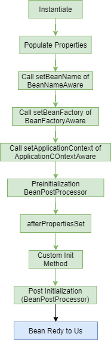

# :star: Sorting

```java
public static void swap(int[] listToSort, int iIndex, int jIndex) {
    int temp = listToSort[iIndex];
    listToSort[iIndex] = listToSort[jIndex];
    listToSort[jIndex] = temp;
}
```

### 1. Selection sort `O(N^2)`

- At each iteration 1 element is selected and compared with every other element in the list to find the smallest.
- Complexity `O(N^2)`.
- `O(N^2)` comparisons.
- `O(N)` swaps.

```java
public static void selectionSort(int[] list) {
    for (int i = 0; i < list.length; i++) {
        for (int j = i + 1; j < list.length; j++) {
            if (list[i] > list[j]) {
                swap(listToSort, i, j);
                print(listToSort);
            }
        }
    }
}
```

### 2. Bubble sort `O(N^2)`

- At each iteration, every element is compared with its neighbor and swapped if they are not in order.
- Smaller element bubbling to the beginning of the list.
- If no swaps that means list is sorted.
- Complexity `O(N^2)`.
- `O(N^2)` comparisons.
- `O(N^2)` swaps.

```java
public static void bubbleSort(int[] list) {
    for (int i = 0; i < list.length; i++) {
        boolean swapped = false;
        for (int j = list.length - 1; j > i; j--) {
            if (list[j] < list[j-1]) {
                swap(list, j, j-1);
                swapped = true;
            }
        }
        print(list);
        if (!swapped) {
            break;  // if no swap break
        }
    }
}
```

### 3. Insertion Sort `O(N^2)`

- Start with sorted list of size 1. 
- Insert next element into list at right position.
- Find element bubbling to right position.
- Complexity `O(N^2)`.
- `O(N^2)` comparisons.
- `O(N^2)` swaps.

```java
public static void insertionSort(int[] list) {
    for (int i = 0; i < list.length - 1; i++) {
        for (int j = i + 1; j > 0; j--) {
            if (list[j] < list[j-1]) {
                swap(list, j, j-1);
            } else {
                break;
            }
            print(list);
        }
    }
}
```

### 4. Shell Sort between `O(N)` and `O(N^2)`

- Partitions the original list into sub-list where a sub-list is made of elements separated by an increment.
- Each sub-list is then sorted using insertion sort, the increment is reduced by 1.
- Sort on almost sorted list. 
- Complexity depends on increment value chosen.
- Complexity `O(N) and O(N^2)`.

### 5. Merge Sort `O(N(Log(N)))`

- Follows divide and conquer approach to create smaller sub problems.
- Then merge together sorted lists to get fully sorted list.
- Complexity `O(N(Log(N)))`.
- Is not adaptive = takes advantage over input (nearly sorted list).

### 6. Quick Sort `O(N(Log(N)))`

- Divide and conquer algorithm which partitions the list at every step.
- Partition is based on **pivot** element from the list.
- The list is partitioned with all elements smaller than pivot on one side and larger than pivot on the other.
- Pivots is usually first or last element in the list.
- `Complexity O(N(Log(N)))`.
- `O(Log(N))` extra space.
- Is not adaptive.

**Stability of sorting algorithm**

- Elements with the same hashCode stays on the same position after sorting.
- For example in bubble sort, **panda**, **panda**, **dog**:
    - **panda** would change position with other **panda** in even though of a fact that they have the same hashCode.

***

### :star: Check Rectangle.

```java
public class Rectangle {
    public boolean check(int a, int b, int c) {
        if ((a < b + c) && (b < a + c) && (c < a + b)) {
            if ((Math.pow(a,2) + Math.pow(b, 2)) == Math.pow(c, 2)) {
                return true;
            }
            return false;
        }
        return false;
    }
}
```

***

### :star: Singleton vs GOF singleton.

- GOF singleton, one singleton per JVM.
- Spring singleton, one singleton per Application Context.

***

### :star: equals

- By default, equals comparing a object by comparing their address in memory
- By default, equals method tests for object identity it returns true if and only if the 2 objects are literally the same
(point to the same location in memory).
- In a flyweight pattern we need this method to return true if the 2 objects have the same value, even if they are 
actually different objects.
- The default implementation of `equals()` relies on object identity, which may cause problems if we end up with multiple
flyweights referring to the same underlying value.
- Concurrency issues sometimes give rise to decouple flyweight - there duplicates are fine so long as they return true 
when called `equals()`.

```java
public class Item {
    private String desc;
    private double price;

    public boolean equals(Object otherObject) {
        // Check whether objects are equals
        if (this == otherObject) return true;

        // Must return false if parameter is null
        if (otherObject == null) return false;

        // Check whether object is instance of Item class
        if (getClass() != otherObject.getClass()) return false;

        // Check value
        Item other = (Item) otherObject;
        return Object.equals(desc == other.desc && price == other.price);
    }
}
```

***

### :star: How to build own annotation.

```java
@Target(ElementType.METHOD)
@Retention(RetentionPolicy.RUNTIME)
public @interface TrackTime {
}
```

```java
public class JoinPointConfig {
    @Pointcut("@annotation(com.panda.spring.aop.aspect.TrackTime)")
    public void trackTime() {
    }
}

```

```java
@Aspect
@Configuration
public class AroundAspect {

    @Around("com.panda.spring.aop.aspect.JoinPointConfig.trackTime()")
    public void around(ProceedingJoinPoint joinPoint) throws Throwable {
        long startTime = System.currentTimeMillis();
        joinPoint.proceed();
        long endTime = System.currentTimeMillis() - startTime;
        logger.info("Time taken by this {} is {}", joinPoint, endTime);
    }

}
```

```java
@Repository
public class Dao1 {
    @TrackTime
    public String retrieve() {
        return "Dao Repo";
    }
}
```

***

### :star: How to generate stack overflow?

```java
public class StackOverflowException {

    public static void main(String[] args) {
        new StackOverflowException().generateException(89);
    }

    public int generateException(int i) {
        return i * generateException(i);
    }

}
```

***

### :star: Count numbers.

```java
public class CountNumbers {
    public int countNum(int number) {
        int k;
        int n = number;

        for (k = 1; (n /= 10) != 0; k++){
            System.out.println(number /= 10);
        }
        System.out.println(number /= 10);
        return k;

    }
}
```

***

### :star: Find the least common ancestor for 2 nodes.

```
                1
               / \
              2   3
                 / \
                7  [6]
               / \    \
             [8]  5    4
```

- 3 is the least common ancestor for 8 and 6
- 1 is also a common ancestor but not the least one

```java
public static Node<Integer> leastCommonAncestor(Node<Integer> root, Node<Integer> a, Node<Integer> b) {
    if (root == null) {
        return null;
    }

    if (root == a || root == b) {
        // If the current root is either of two nodes then return the root itself
        return root;
    }

    Node<Integer> leftCA = leastCommonAncestor(root.getLeftChild(), a, b);
    Node<Integer> rightCA = leastCommonAncestor(root.getRightChild(), a, b);

    if (leftCA != null && rightCA != null) {
        // If both exists it means either the node or it's ancestor exists in the left and right
        // subtree so the current node is LCA
        return root;
    }

    if (leftCA != null)  {
        // If only of the common ancestor is non null return that
        return leftCA;
    }

    return rightCA;
}
```

```
leastCommonAncestor(1,8,6)
lCA = leastCommonAncestor(2,8,6)
    lCA = leastCommonAncestor(null,8,6) -> null
rCA = leastCommonAncestor(3,8,6)
    lCA = leastCommonAncestor(7,8,6)
        lCA = leastCommonAncestor(8,8,6) -> 7
    rCA = leastCommonAncestor(6,8,6) -> *3

```

***

### :star: Builder design patterns [Creational].

```java
public class Customer {
    private String name;
    private String age;
    private String salary;

    public void setName(String name) {
        this.name = name;
    }

    public String getName() {
        return name;
    }

    public void setAge(String age) {
        this.age = age;
    }

    public String getAge() {
        return age;
    }

    public void setSalary(String salary) {
        this.salary = salary;
    }

    public String getSalary() {
        return salary;
    }

    public String toString() {
        return age + " - " + name + " - " + salary;
    }

}
```

```java
public class CustomerBuilder {
    private Customer customer = new Customer();

    public static CustomerBuilder defaultCustomer() {
        return new CustomerBuilder();
    }

    public CustomerBuilder withName(String name) {
        customer.setName(name);
        return this;
    }

    public CustomerBuilder withAge(String age) {
        customer.setAge(age);
        return this;
    }

    public CustomerBuilder withSalary(String amount) {
        customer.setSalary(amount);
        return this;
    }

    public Customer build() {
        return customer;
    }

}

```

```java
public class Main {
    public static void main(String[] args) {
        CustomerBuilder builder = CustomerBuilder.defaultCustomer();

        Customer customer = builder.withAge("89").withSalary("2500").build();

        System.out.println(customer);
    }
}
```

***

### :star: Decorator Pattern [Structural].

```java
public interface Order {
    // Decorated class must implement this interface
    double getPrice();
    String getLabel();
}
```

```java
public class Pizza implements Order {

    // Class that must be decorated implements interface Order
    // Decorator means dynamically add responsibilities to object

    private String label;
    private double price;

    public Pizza(String label, double price) {
        this.label = label;
        this.price = price;
    }

    @Override
    public double getPrice() {
        return this.price;
    }

    @Override
    public String getLabel() {
        return this.label;
    }
}
```

```java
public abstract class Extra implements Order {

    protected String label;
    protected double price;
    protected Order order;

    public Extra(String label, double price, Order order) {
        this.label = label;
        this.price = price;
        this.order = order;
    }

    // price delegate to other implementation
    public abstract double getPrice();

    public String getLabel() {
        return order.getLabel() + ", " + this.label;
    }

}
```

```java
public class DoubleExtra extends Extra {
    public DoubleExtra(String label, double price, Order order) {
        super(label, price, order);
    }

    @Override
    public double getPrice() {
        return (this.price * 2) + order.getPrice();
    }

    @Override
    public String getLabel() {
        return order.getLabel() + ", double " + this.label;
    }
}
```

```java
public class Main {
    public static void main(String[] args) {
        Order fourSeasonPizza = new Pizza("Four season", 10); // Reason why program to interface
        fourSeasonPizza = new DoubleExtra("Mozarella", 2, fourSeasonPizza);

        System.out.println(fourSeasonPizza.getPrice() + " : " + fourSeasonPizza.getLabel());
    }

}
```

***

### :star:  Factory Pattern [Creational].

```java
public interface Plane {
    // Any Plane that factory returns must implement this interface
    void model();
}
```

```java
public class Junkers implements Plane {
    // Concrete Plane implementation
    @Override
    public void model() {
        System.out.println("Junkers Ju 87 Stuka produced");
    }
}
```

```java
public class PlaneFactory {
    // Factory says that it returns something that implements plane
    public static Plane getPlane(PlaneType planeType) {
        switch (planeType){
            case HEINKEL:
                return new Heinkel();
            case JUNKERS:
                return new Junkers();
            case MESSERSCHMITT:
                return new Messerschmitt();
        }
        return null;
    }
}
```

```java
public class Main {
    public static void main(String[] args) {
        Plane plane = PlaneFactory.getPlane(PlaneType.JUNKERS);
        plane.model();
    }
}
```

***

### :star: Observer pattern [Behavioral].

```java
public interface Publisher {
}
```

```java
public class NewsAgency extends Observable implements Publisher {

    // Add List of Observers in our case Radio and TV
    private List<Observer> channels = new ArrayList<>();

    // Add some news. NewsAgency is kind of things that delegates news to different providers
    // (TV, Radio)
    public void addNews(String newsItem) {
        notifyObserver(newsItem);
    }

    // Observer is registered media
    public void notifyObserver(String newsItem) {
        for (Observer outlet : this.channels) {
            outlet.update(this, newsItem);
        }
    }

    // Register observer. We can think of this as some news are proper
    // for TV only some for Radio only.
    // Simply add Class that implements Observer to ArrayList.
    // Here register where we want to display our message.
    public void register(Observer outlet) {
        channels.add(outlet);
    }

}
```

```java
public class RadioChannel implements Observer {
    @Override
    public void update(Observable agency, Object newsItem) {
        // Only add news when news agency implements Publisher interface.
        // We can think of it as only valid news agency implements Publisher.
        // If for some reason we acquire news from unreliable source
        // (does not implements Publisher) just ignore it.
        if (agency instanceof Publisher) {
            System.out.println((String) newsItem + " Radio");
        }
    }
}
```

```java
public class TVChannel implements Observer {
    @Override
    public void update(Observable agency, Object newsItem) {
        // Another media in this case TV
        if (agency instanceof Publisher) {
            System.out.println((String) newsItem + " TV");
        }
    }
}
```

```java
public class Main {

    public static void main(String[] args) {
        // Create observer and listener
        NewsAgency newsAgency = new NewsAgency();
        RadioChannel radioChannel = new RadioChannel();
        TVChannel tvChannel = new TVChannel();

        // registration observer
        newsAgency.register(radioChannel);
        //newsAgency.register(tvChannel);

        newsAgency.addNews("News 1");
        newsAgency.addNews("News 2");
        newsAgency.addNews("News 3");
    }
}
```

***

### :star: Factorial

```java
public class Factorial {
    public int calculateFactorial(int num) {
        int result = 1;
        if (num == 0 || num == 1) {
            return result;
        } else {
            for (int i = 2; i < num; i++) {
                result *= i;
            }
        }
        return result;
    }
}

public class FactorialRecursive {
    public int calculateFactorial(int num) {
        if (num == 0 || num == 1) {
            return 1;
        } else {
            return num * calculateFactorial(num - 1);
        }
    }
}
```

***

### :star: Fibonacci

```java
// 0, 1, 1, 2, 3, 5, 8, 13
public class FibonacciIterative {
    public int calculateFibonacci(int number) {
        int result = 0;
        int a = 1; // for 1
        int b = 1; // for 2
        if (number == 0) {
            return 0;
        } else if (number == 1 || number == 2) {
            return 1;
        } else {
            for (int i = 3; i <= number; i++) {
                result = a + b;
                a = b;
                b = result;
            }
        }
        return result;

    }

    public int[] calculateFibonacciArr(int number) {
        int[] result = new int[number];
        for (int i = 0; i < number; i++) {
            result[i] = calculateFibonacci(i);
        }
        return result;
    }
}

public class FibonacciRecursive {
    public int calculate(int number) {
        if (number == 0) {
            return 0;
        }
        if (number == 1) {
            return 1;
        } else {
            return calculate(number - 1) + calculate(number - 2);
        }
    }
}
```

***

### :star: Synchronized

```java
public class SomeClass {
    synchronized static void foo() {
    }

    // Equivalent of above is
    static void foo() {
        synchronized(SomeClass.class) {
        }
    }
}
```

```java
public class SomeClass {
    synchronized void foo() {
    }

    // Equivalent of above is
    void foo() {
        synchronized(this) {
        }
    }
}
```

***

## :star: Object Class Methods

### hashCode

- HashCode if two objects are equals then their hashCode values should be equals as well,
so if implement just equals method and leave hashCode unimplemented the hashCode will always
**create 2 students** objects as if they are different objects. Even when their enrId are the same.
- If two objects are equal, then their hashCode values must also be equal. Whenever you implement `equals(Object)`, 
you must also implement `hashCode()`.
- For List Collection, even if you had not implement hashCode method in the Student class you would have a true in return.
- If your entity will be part of a Set collection, override its equals and hashCode methods.
- Hash is integer number that identify an object.
- If x and y are different objects, `x.hashCode()` and `y.hashCode()` should also be different (but not always are).

```java
@Override
public int hashCode() {
    int hash = 1;
    for (int i = 0; i < str.length(); i++) {
         hash = 31 * hash + chartAt(i)
    }
    return hash;
}
```

- HashCode must be compatible.
    - If `x.equals(y)` return true, **x.hashCode() == y.hashCode()**
- If you change equals method you have to change hashCode also. 
- Failure to do so results in objects put in hash based data structures HasSet, HashMap could be lost.

```java
Object.hash(some, some2);
```

- HashCode's are used in hashing to decide which group (or bucket) an object should be placed into.
- A group of object's might share the same hashCode.
- The implementation of hashCode decides effectiveness of Hashing. 
- A good hashing function evenly distributes objects into different groups or buckets.
- A good hashCode should have the following properties:
    - If `obj1.equals(obj2)` is true, then `obj1.hashCode()` should be equal to `obj2.hashCode()`.
    - `obj.hashCode()` should return the same value when run multiple times, if values of obj used in `equals()` have not changed.
    - If `obj1.equals(obj2)` is false, it is **NOT** required that `obj1.hashCode()` is not equal to `obj2.hashCode()`.
        - Two unequals objects might have the same hashCode.

```java
@Override
public int hashCode() {
    final int prime = 31;
    int result = 1;
    result = prime * result + id;
    return result;
}
```

### toString

### equals

- Check whether one object can be equal to another.
- Equals method implemented in Object class, check whether two references to object are identical.
- Override equal method if you want to check equality based on state of object.
- Two object are equals when they have the same value.
- Equals method is used when we compare two objects. 
- Default implementation of equals method is defined in Object class.
- Two object references are equals only if they are pointing to the same object.
- We need to override equals method, if we would want to compare the contents of an object.
- We can override equals method in the class to check the content of the objects.
- The implementation of equals method checks if the id's of both objects are equal, if so return true.

```java
@Override
public boolean equals(Object obj) {
    Client other = (Client) obj;
    if (id != other.id)
        return false;
    return true;
}
```

- Important things to consider when implementing equals method:
    - Reflexive: For any reference value x, `x.equals(x)` return true.
    - Symmetric: For any reference values x and y, if `x.equals(y)` should return true if and only if `y.equals(x)` 
    returns true.
    - Transitive: For any reference values x, y and z, if `x.equals(y)` returns true and `y.equals(z)` returns true,
    then `x.equals(z)` must return true.
    - Consistent: For any reference values x and y, multiple invocations of `x.equals(y)` consistently return true
    if no information used in equals is modified.
    - For any non-null reference value x, `x.equals(null)` should return false.

```java
@Override
public boolean equals(Object obj) {
    if (this == obj) {
        return true;
    }

    if (obj == null) {
        return false;
    }

    if (getClass() != obj.getClass()) {
        return false;
    }

    Client other = (Client) obj;
    if (id != other.id) {
        return false;
    }
    return true;
}
```

### wait and notify

- Work in tandem. 
- When one thread calls `wait()` on an object, that thread will block until another thread calls `notify()` 
or `notifyAll()` on that same object.

### getClass

### clone

- For the method to be used all classes calling the method must implement the Cloneable interface.

### Object constructor

- All constructors in Java must make a call to the Object constructor. 
- This is done with the call `super()`.
- This has to be the first line in a constructor. 
- The reason for this is so that the object can actually be created on the heap before any additional initialization 
is performed.

### finalize

- This is a protected and non-static method of the Object class.
- This method is used to perform some final operations or clean up operations on an object before it gets removed from memory.
- According to the doc, this method gets called by the garbage collector on an object when garbage
collection determines that there are no more references to the object.
- But there are no guarantees that `finalize()` method would gets called if the object is still reachable or no Garbage
Collectors run when the object become eligible. 
- That's why it's better not rely on this method.
- Generally it's considered bad practice to use `finalize()` method in applications of any kind and should be avoided.
- Finalizers are not meant for freeing resources (e.g., closing files). 
- The garbage collector gets called when (if!) the system runs low on heap space. 
- You can't rely on it to be called when the system is running low on file handles or, for any other reason.
- The intended use-case for finalizers is for an object that is about to be reclaimed to notify some other object about
its impending doom. 
- A better mechanism now exists for that purpose, the `java.lang.ref.WeakReference<T>` class. 
- If you think you need write a `finalize()` method, then you should look into whether you can solve the same
problem using WeakReference instead. 
- If that won't solve your problem, then you may need to re-think your design on a deeper level.

***

## :star: Concurrent Collections

### Thread Safe collections

```java
List<String> threadSafeList = Collections.synchronizedList(new ArrayList<String>());
Set<String> threadSafeSet = Collections.synchronizedSet(new HashSet<String>());
Map<String, String> threadSafeMap = Collections.synchronizedMap(new HashMap<String, String>());
```

**Since Java 5**

```java
List<String> threadSafeList = new CopyOnWriteArrayList<String>();
Set<String> threadSafeSet = new ConcurrentHashSet<String>();
Map<String, String> threadSafeMap = new ConcurrentHashMap<String, String>();
```

**ConcurrentHashMap insertions.**

```java
SomeObject previousValue = concurrentHashMap.putIfAbsent(1, value);
```

- Methods in atomic ways sets or replace elements if it is the same at a point of time.
- There are a couple of mass operations to search, modify or look for ConcurrentHashMap:
    - `search`
    - `reduce`
    - `forEach`
- ConcurrentHashMap **does not allow null for keys or values**.
- ConcurrentHashMap and CopyOnWriteArrayList implementations provide much higher concurrency while preserving
thread safety, ConcurrentSkipListMap.

### Concurrent Collections

- Concurrent collections are a generalization of thread-safe collections, that allow for a broader usage in a concurrent
environment.
- While thread-safe collections have safe element addition or removal from multiple threads, they do not necessarily
have safe iteration in the same context (one may not be able to safely iterate through the collection in one thread,
while another one modifies it by adding/removing elements).
- **java.util.concurrent.CopyOnWriteArrayList**:
    - The **snapshot** style iterator method uses a reference to the state of the array at the point that the
    iterator was created. 
    - This array never changes during the lifetime of the iterator, so interference is impossible and the iterator 
    is guaranteed not to throw ConcurrentModificationException.
- **ConcurrentLinkedQueue**:
    - Iterators are weakly consistent, returning elements reflecting the state of the queue at some point at or
    since the creation of the iterator. 
    - They do not throw **java.util.ConcurrentModificationException**, and may proceed concurrently with other operations. 
    - Elements contained in the queue since the creation of the iterator will be returned exactly once.

```java
public static final List<Integer> list = Collections.synchronizedList(new ArrayList<>());
```

- Could (and statistically will on most modern, multi CPU/core architectures) lead to exceptions.
- Synchronized collections from the Collections utility methods are thread safe for addition/removal of elements,
but not iteration (unless the underlying collection being passed to it already is).

***

### :star: WeakHashMap

- Weak References: The objects that are referenced only by weak references are garbage collected eagerly; the GC
won’t wait until it needs memory in that case.
- **Difference between HashMap and WeakHashMap**:
    - If the Java memory manager no longer has a strong reference to the object specified as a key, then the entry in the
    map will be removed in WeakHashMap.

***

## :star: Design Patterns

### Creational

- Builder
- Singleton
- Factory
- AbstractFactory
- Prototype

### Behavioral

- Strategy
- Dependency Injection
- Template
- Iterator
- Observer
- Command
- Chain of Responsibility
- Memento
- Visitor
- State
- Mediator

### Structural

- Decorator
- Adapter
- Facade
- Composite
- Flyweight
- Bridge
- Proxy

***

### :star: Example `@Override`

- Override method, we are telling a compiler we override method exactly as present in interface or parent class.
- Compiler checks that we actually override method, if some issue they will be compiled time error.

***

### :star: Spring Bean Lifecycle



### Destroy a Bean

- Container Shutdown :arrow_right: Disposable Bean's `destroy()` :arrow_right: Call Custom destroy method :arrow_right: Terminated

***

### :star: Rules that Relational Database follows

- **Entity Integrity**: Every table has a primary key.
- **Referential Integrity**: A foreign key points at a value that is the primary key of another table. Null value are valid for FK.

***

### :star: Object states

- Transient state: Object does not associated with any table row.
- Persistent: Object with database identify. Primary key is set as database identifier.
- Detached: No longer managed by EntityManager. setText will only change state in JVM memory.

***

### :star: Declaring a `volatile` Java variable

- Means the value of this variable will never be called thread-locally all reads and writes will go straight to 
**main memory**. 
- Access to the variable acts as through it is enclosed in a synchronized block, synchronized on itself.
- A class loader is a part of JVM. 
- Technically namespaces are unique per class loader. 
- Usually there is just 1 class  loader per program.
- In Java Threading support, thread mostly communicate with each other via shared objects or shared member variables with 
the same object:
    - Thread Interference: Different thread access the same data.
    - Memory Consistency Errors: A thread sees a state inconsistent value of a variable.
    - Thread Contention: Thread get in each other's way, and slow down-or sometimes even have to be killed in Java.
- Thread interference and memory consistency errors:
    - If two thread access the same variable, it's possible for them to get in each other's way.
    - That's because Java might switch execution from one thread to another even midway through a simple, seemingly 
    atomic instruction.
    - For example two threads incrementing the same variable could simply lose one of the two increments.
    - Restricting access to an object or a variable-akin to locking the variable so only thread can access at a time
      is a powerful concept used widely in computer science especially in databases.
    - Locking variables correctly can eliminate thread interference and memory consistency error:
        - It slows down performance and can lead to thread contention issues (Starvation, Livelock, Deadlock).

***

### :star: What is the best way to subclass Singleton?

- Singleton classes should never be subclassed or extended.
- Every object in Java has a lock associated with it:
    - This lock is called the intrinsic lock or monitor.
    - This lock is usually always open, any number of threads can access the object simultaneously.
    - It is possible to specify that a thread can only execute a section of code once it has acquired the lock on 
    source object.
    - If some other thread currently holds that lock, the current thread must wait its turn.
    - **This is achieved using the Synchronized keyword**.

***

## :star: Synchronized

### Methods

- Any method in java can be marked as synchronized.
- Only one thread at a time only applies to the same method of the same object.
- Only one thread can be executing this member function on this object at a given point in time.
- So for instance if the same method does something to a static class variable (not an object variable), errors can 
still result.
- Used right making a method as synchronized can help eliminate thread interference and memory consistency error.

```java
public class SynchronizedCounter {
    private int counter = 0;
    public synchronized void increment() {
        counter++;
    }
    public synchronized void decrement() {
        counter--;
    }
    public synchronized int value() {
        return counter;
    }
}
```

### Blocks of code

- Since every object in Java has an intrinsic lock associated with it, it is possible to lock any section of code 
by making it as synchronized.
- Any object can be used as lock using a synchronized statement.

```java
public void addName(String name) {
    synchronized(this) {
        lastName = name;
        nameCount++;
    }
    nameList.add(name);
}
```

- Threads never gets blocked on itself which means that one synchronized method of an object can always call
another synchronized method of the same object without blocking.
- Making method as synchronized is a shortcut to making the entire body of the method as synchronized on **this**.

### Thread Contention

| Contention | Description |
|---|---|
| Deadlock | Two thread each is blocked on a lock held by the other. |
| Livelock | Two thread don't deadlock, but keep blocking on locks held by each other, neither really can progress. |
| Starvation | Some threads keep acquiring locks greedily. And cause other threads to be unable to get anything done. |

***

## :star: Make sure your singleton objects can't be cloned

- The `.clone()` method belongs to object class (every object has this method), when it ought to belong to cloneable 
interface.
- Object have a `.clone()` method, but if you try to clone an object that does not implement cloneable, 
a not cloneable exception is thrown.
- So make sure that your singleton class does not implement cloneable - or if for some reason it does.
Override the `.clone()` method to thrown an exception.

```java
public class SingletonImproved implements Cloneable {

    // mark member variable as volatile, so each access this variable is fresh read from memory
    private volatile static SingletonImproved singleton;

    private SingletonImproved() {
    }

    // double-check-locking
    // reduce overhead of acquiring a lock, by first testing lock creation
    public static SingletonImproved getInstance() {
        if (singleton == null) {
            synchronized (SingletonImproved.class) { // lock in between
                if (singleton == null) {
                    singleton = new SingletonImproved();
                }
            }
        }
        return singleton;
    }

    // make sure that singleton object can't be cloned
    @Override
    protected Object clone() throws CloneNotSupportedException {
        throw new CloneNotSupportedException();
    }
}
```
