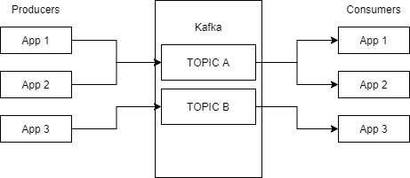
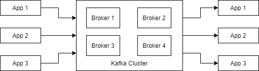
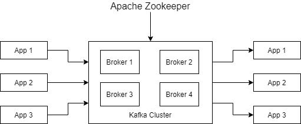
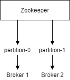
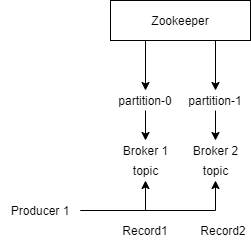
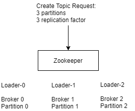

# Kafka

## Why Apache Kafka

- Messaging is one of the popular trend in sharing the data between the applications/systems real time.
- There are two popular legacy messaging solutions **Publish-Subscribe(Topic)** and **Queue**:
    - Publish-Subscribe:
        - Messages are published to a message broker and message will be distributed to all of the consumers.
        - Topics retain messages only as long as it takes to distribute them to current subscribers.
        - The subscriber must continue to be active for it to consume the messages.
    - Queue:
        - Messages are published to a queue and the consumer will read from it.
        - Limitation is you can have only one consumer per queue.
- There is always a limit on the size of the message because larger message may end up breaking
the message broker or make the broker to perform slower.
- Legacy Messaging solutions have zero **Fault-Tolerance**.

## What is Apache Kafka

- Apache Kafka is a scalable, reliable, high volume and high throughput distributed messaging system.
- Apache Kafka is mainly used for sharing high volume data from one system to another system
in real time and retention of data.
- LinkedIn started their development in 2009 and implemented in 2010.
- Outsourced to Apache software foundation by 2011.
- Currently this is one of the mostly used tools in Apache software foundation.
- Advantages:
    - Messages are not removed from the topic as soon as the consumers consume it.
    - Kafka is Horizontally scalable.
    - Kafka has stronger ordering guarantees than a traditional messaging system.
    - Kafka can handle high volume and it has very high throughput.
    - Kafka design supports loosely coupled Producers and Consumers.
    - Kafka can also be used as a storage system.

## Kafka Architecture



- Topic live inside KAFKA BROKER (server that can hold n number of topics).



- Kafka CLUSTER (group of Kafka Brokers).

### What is a Distributed System

- Systems are designed in such a way that it distributes the load within the system
and process the load simultaneously.
- To achieve simultaneous processing the load needs to be distributed across the cluster and
there needs to be coordination mechanism - meaning each and every system in the cluster needs
to talk to each other.
- In world of distributed systems these are achieved using a protocol called **gossip protocol**.
- There need to be a system in place in order to monitor the health and metadata information
about the brokers:
    - That's when **Zookeeper** comes in to picture.

### Zookeeper

- Zookeeper is a centralized service for maintaining configuration information, naming,
providing distributed synchronization and providing group services.
- Zookeeper is responsible for maintaining cluster metadata, overall health of the
Kafka cluster and balancing the broker assignments and reassignments:
    - If any new broker gets added to the cluster then how this new broker can participate
    in taking up the load.
    - If any existing broker in the cluster goes down then the load should not be distributed to this
    particular broker.



### Kafka Topics and Partitions

- The Kafka cluster stores streams of records in categories called **topics**.
- A topic is a category or feed name to which records are published.
- We can compare this to a data store in which data is persisted.
- For each topic, Kafka maintains one or more physical log file based on the number
of partitions in a topic.
- When a producer sends a record to the topic the records are appended in an **ordered, sequence of records**.
- In topics messages are stored in **partitions**.
- A topic can have n number of partitions and this will be defined during the topic creation.
- Each record in the partition will be assigned a sequential id number called the **offset** that
uniquely identifies each record within the partition.
- Each record in the partition will have the following attributes:
    - Topic Name
    - Partition
    - Offset Value
    - Payload (Actual Message content)
- From consumer point of view, it is possible to have infinite number of consumers.
- Each and every consumers are autonomous to each other.
- Some erroneous behavior of one of the consumer does not impact the other one.
- Offset which is available in the message. The Offset is maintained by the consumer and
it is independent of each other with the other consumers.
- When the consumers are created you can either create the consumer to start reading the message
from the beginning or read it from the least.
- **Multiple Partition Topic**:
    - In real world most of the topics will have more than one partition.
- Each and every partition maintains its own offset and ordering is guaranteed only within the partition:
    - Multiple partitions are foundation for:
        - Scaling.
        - Fault tolerance.
        - High levels of throughput.

#### Message Retention in Kafka

- The retention period of records in Kafka is configurable.
- On cluster each topic can have their own retention period.
- The record will sit in the cluster until the retention period expires.

***

## Kafka Core

- Producer API
- Consumer API
- Streams API
- Connect API

***

## Zookeeper, Brokers, Consumers, Producers

### Create Topic

- Create Topic Request - 2 partitions, 1 Replication factor.





### Leader

- In the world of distributed systems. Each server in the cluster needs to talk to each other
in order to maintain the state of the cluster this is called as **QUORUM**.
- So when a broker is created there will be a Leader assigned to it by the zookeeper.
- This leader is responsible for communicating to other brokers about the partitions it owns.



### Replication Factor

- **Replication factor > 1** for any topic in Kafka.
- Higher availability.
- Stronger Durability.
- Fault Tolerance.

### ISR (IN SYNC REPLICA)

- Ideal Scenario **ISR == REPLICATION FACTOR**

### Partitioning Mechanism in Kafka Producer.

- Approach 1 - Providing the Partition Number as part of the Producer Record. This is sometimes called Direct partitioning.

```java
myProducer.send(new  ProducerRecord<String, String>("demo-topic", 0, "message 1",
                        "Message Value : " + Integer.toString(i)));
```

- Approach 2: (Round-Robin)
    - No key and partition is provided as part of the producer record.
    - This will follow a round robin approach in order to allocate the messages to the partitions.

```java
myProducer.send(new  ProducerRecord<String, String>("demo-topic",
                        "Message Value : " + Integer.toString(i)));
```

- Approach 3: (Key-Hashing)
    - If you provide a key and ther is no custom partition implementation then the partition is
    decided by the formula. key.hashcode % no of Partitions.
    - There is a drawback with this approach, If the key is the same for every record then some
    of the partitions will never receive any message.

```java
myProducer.send(new  ProducerRecord<String, String>("demo-topic", "message",
                    "Message Value : " + Integer.toString(i)));
```

- Approach 4: (Custom Partition Implementation)
    - We need to provide a custom partition implementation as part of this approach.
    - This can be done by providing the implementation class against the.

## Kafka Consumers

```java
Properties properties=new Properties();
properties.put("bootstrap.servers", "localhost:9092,localhost:9093");
properties.put("key.deserializer", "org.apache.kafka.common.serialization.StringDeserializer");
properties.put("value.deserializer", "org.apache.kafka.common.serialization.StringDeserializer");
properties.put("group.id","test1");
```

- `bootstrap.servers` - You need to provide the Broker address against this property.
- `key.deserializer` - How to deserialize the key that was published from the producer.
- `value.deserializer` - Similar to key deserializer.
- `group.id` - Unique string that identifies the consumer group this consumer belongs to.

### Consumer Pool API

```java
ConsumerRecords<String, String> records = consumer.poll(10);
```

- Consumers sends heartbeat to cluster which makes sure this broker is an active consumer.
- If not heart bet is received within the session.timeout.ms then this will indicate the consumer and
rebalance will happen at the consumer end.

***

## Kafka - Camel

**Camel**

- Enterprise apps needs to talk to different apps or departments. Integration in order to interact with each system.
- Integrations always involves some challenges.
- Enterprise Integration Pattern.
- Lightweight integration framework.
- Supports multiple DSL's programming languages.
- Easily configurable.
- Can handle any payload.

***

### Run kafka

```bash
./zookeeper-server-start.sh ../config/zookeeper.properties
./kafka-server-start.sh ../config/server.properties

./kafka-topics.sh --create --topic my-first-topic --zookeeper localhost:2181 --replication-factor 1 --partitions 1
./kafka-topics.sh --describe --zookeeper localhost:2181

./kafka-console-producer.sh --broker-list localhost:9092 --topic my-first-topic
./kafka-console-consumer.sh --bootstrap-server localhost:9092 --topic my-first-topic --from-beginning

./kafka-topics.sh --zookeeper localhost:2181 --alter --topic demo-topic --partitions 4

ps -aux | grep kafka | awk '{print $2}' | xargs kill -9
```

**delete topic**

```properties
delete.topic.enabled=true
```

```bash
./kafka-topics.sh --delete --zookeeper localhost:2181 --topic your_topic_name
```

### Kafka security

```properties
listeners=SSL://localhost:9092
advertised.listeners=SSL://localhost:9092
security.inter.broker.protocol = SSL or SASL or ACL
ssl.client.auth=required or requested
ssl.keystore.location=<path>/server.keystore.jsk
ssl.keystore.password=kafka123
ssl.keystore.type=JSK
ssl.truststore.location=<path>/server.truststore.jks
ssl.truststore.password=kafka123
ssl.tructstore.type=JKS
ssl.key.password=kafka123
```

- **TrustStore** and **KeyStore** are very much similar in terms of construct and structure
as both are management by the keytool command.
- **KayStore**:
    - The keystore file stores the certificate and private key of that certificate.
    - This is server side set up and this file is required at the server level.
- **TrustStore**:
    - The truststore of a client stores all the certificates that the client should trust.
    - This is required at client side.
- **How SSL works?**:
    - Anytime a client will connect to the server, server will present its certificate
    stored in KeyStore and client will verify that certificate by comparing with
    certificates stored on its truststore.
    - Once the validation is successful then the connection will be succeeded.

```console
keytool -keystore server.keystore.jks -alias localhost -validity 365 -genkey
openssl req -new -x509 -keyout ca-key -out ca-cert -days 365
keytool -keystore server.truststore.jks -alias CARoot -import -file ca-cert
keytool -keystore server.keystore.jks -alias localhost -certreq -file cert-file
openssl x509 -req -CA ca-cert -CAkey ca-key -in cert-file -out cert-signed -days 365 -CAcreateserial -passin pass:kafka123

keytool -keystore server.keystore.jks -alias CARoot -import -file ca-cert
keytool -keystore server.keystore.jks -alias localhost -import -file cert-signed
```


