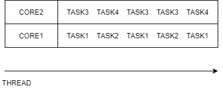
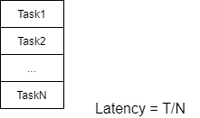
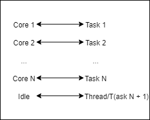
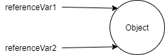
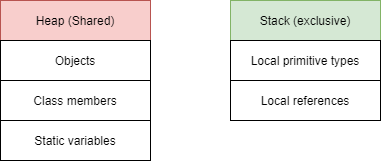
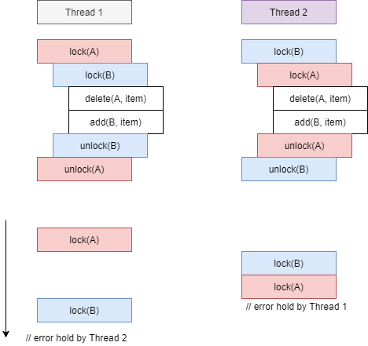
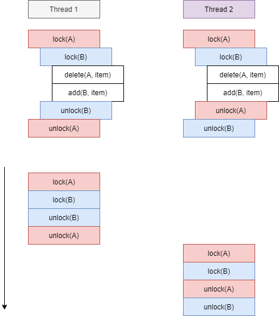
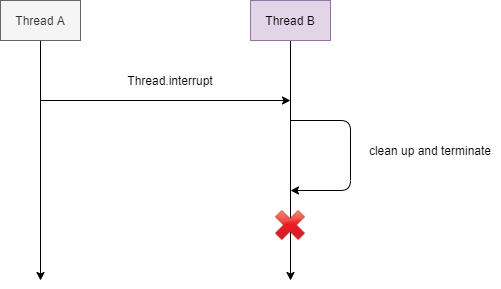
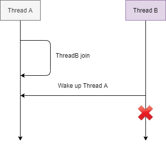
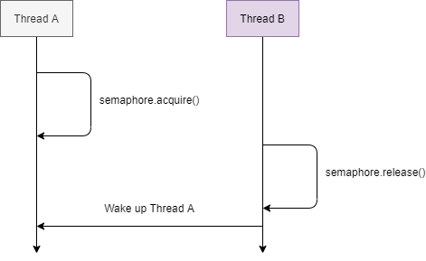

## Concurrency - Multitasking

> Responsiveness - Concurrency
> Performance - Parallelism

- Responsiveness can be achieved by using multiple threads, separate thread for each task.
- Achieved by multi-tasking between threads.
- We don't need multiple cores to achieve concurrency.
- We can create an illusion of multiple tasks executing in parallel using just a single core.
- With multiple cores we can truly run tasks completely in parallel.
- Completing a complex task much faster.
- Finishing more work in the same period of time.
- For high scale service:
    - Fewer machines.
    - Less money spent on hardware.



- Stack - Region in memory where local variable are stored, and passed into functions.
- Instruction pointer - Address of the next instruction to execute.

## OS

### Context Switch

- Stop thread 1.
- Schedule thread 1 out.
- Schedule thread 2 in.
- Start thread 2.
- Context switch is not cheap, and is the price of multitasking (concurrency).
- Each thread consumes resources in the CPU and memory.
- Context switch involves storing data for one thread, and restoring data for another thread.
- Too many threads - **Thrashing**, spending more time in management than real productive work.
- Threads consume less resources than processes.
- Context switching between threads from the same process is cheaper.

### Thread scheduling

- First Come First Serve:
    - Problem - Long thread can cause starvation.
- Shortest Job first.
- **Epochs**.
- Dynamic Priority.

> Dynamic Priority = Static Priority + Bonus

- Static Priority is set by the developer programmatically.
- Bonus is adjusted by the OS in every epoch, for each thread.
- Using Dynamic Priority, the OS will give preference for Interactive threads (such as UI threads).
- OS will give preference to threads that did not complete in the last epochs, or did not get enough time
to run - Preventing Starvation.

### Threads vs Processes

- When to prefer Multithreaded Architecture:
    - Prefer if the tasks share a lot of data.
    - Threads are much faster to create and destroy.
    - Switching between threads of the same process is faster (shorted context switching).
- When to prefer Multi-Process Architecture:
    - Security and stability are of high importance.
    - Tasks are unrelated to each other.
- Thread class - Encapsulates all thread related functionality.
- Two ways to run code on a new thread:
    - Implement Runnable interface, and pass to a new Thread object.
    - Extend Thread class, and create object of that class.

### Thread termination

- Thread consume resources:
    - Memory and kernel resources.
    - CPU cycles and cache memory.
- If a thread finished its work, but the application is still running, we want to clean up the thread's resources.
- If a thread is misbehaving, we want to stop it.
- The application will not stop as long as at least one thread is still running.

**Thread.interrupt()**

```java
// Currently in thread A:
threadB.interrupt(); // Sends a signal from Thread A to interrupt Thread B
```

- If the thread is executing a method that throws an InterruptedException.
- If the thread's code is handling the interrupt signal explicitly.

### Daemon Threads

- Background thread that do not prevent the application from exiting if the main thread terminates.
- Background tasks, that should not block our application from terminating:
    - Example - File saving thread in a Text Editor.
- Code in a worker thread is not under our control, and we do not want it to block our application
from terminating:
    - Example - Worker thread that uses an external library.
- To prevent a thread from blocking our app from exiting, we set the thread to be a Daemon thread.

### Thread.join()

- Thread coordination with Thread.join().
- Different thread runs independently.
- Order of execution is out of our control.
- What if one thread depends on each other.
- ThreadB runs in a loop and keeps checking if ThreadA result is ready.

```java
void waitForThreadA() {
    while(!thread.isFinished()) {
        // burn CPU cycles
    }
}
```

> public final void join()
> public final void join(long millis, int nanos)
> public final void join(long millis)

- More control over independent threads.
- Safely collect and aggregate results.
- Gracefully handle runway threads using Thread.join(timeout).
- Do not relay on the order of execution.
- Always use thread coordination.
- Design code for worst case scenario.
- Thread may take unreasonably long time. Always use Thread.join() with a time limit.
- Stop the thread if it's not done in time.

***

## Performance & Optimization

### Latency

- Latency - The time to completion of task. Measured in time units.
- Throughput - The amount of tasks completed in a given period. Measured in tasks/time unit.

**Latency**



- Theoretical reduction of latency by N = Performance improvement by a factor of N.
- N = ?:
    - How many subtasks/threads to break the original task?
- Does breaking original task and aggregate results come for free?
- Can we break any task into subtasks?

**N = ?**

- On a general purpose computer - **N = number of cores**.



- num threads - # cores is optimal only if all threads are runnable and can run without interruption
(no IO/blocking calls/sleep etc).
- The assumption is nothing else is running that consumes a lot of CPU.
- Hyperthreading - Virtual Cores vs Physical Cores.

**Inherent Cost of Parallelization and Aggregation**

- Breaking task into multiple tasks.
- Thread creation, passing tasks to threads.
- Time between thread.start() to thread getting scheduled.
- Time until the last thread finishes and signals.
- Time until the aggregating thread runs.
- Aggregation of the sub-results into a single artifact.

**Can we break any task into subtasks?**

- Type1 - Parallelizable Tasks.
- Type2 - Unbreakable, Sequential Task.
- Type3 - Partially Parallelizable, Partially Sequential.

### Throughput

- **Throughput** - The number of tasks completed in a given period.
- Measured in tasks/time unit.
- **Throughput = 1/T**
- **Latency = T/N**
- T - time to execute original task.
- N - # subtasks / # threads.
- Throughput = N/T (theoretical).
- Throughput < N/T (in practice).
- Running task in parallel.

**Thread Pooling**

- Creating pool of threads once and then use them in future tasks.
- Implementing a thread pool is not trivial.
- JDK comes with a few implementations of thread pools.
- `FixedThreadPool` executor.

```java
int numberOfThreads = 4;
Executor executor = Executors.newFixedThreadPool(numberOfThreads);

Runnable task = ...;
executor.execute(task);
```

- By serving each task on a different thread, in parallel, we can improve throughput by N.
- **N = # threads = # cores**
- Using a FixedThreadPool, we maintain constant number of threads, and eliminate the need to recreate the threads.
- Significant performance improvement (xN).
- Right number of threads (# threads = # cores).
- Handling each request on a different thread.
- Eliminate some of the cost of multithreading by using a thread pool.

**Apache Jmeter**

- Java performance automation tool.

## Data Sharing between Threads

### Stack

- Memory region where:
    - Methods are called.
    - Arguments are passed.
    - Local variables are stored.
- Stack + Instruction Pointer = State of each thread's execution.
- All variables belong to the thread executing on that stack.
- Statically allocated when the thread is created.
- The stack's size is fixed, and relatively small (platform specific).
- If our calling hierarchy is too deep. We may get an StackOverflow Exception (Risky with recursive calls).

### Heap

- Belongs to Process.
- Objects (anything created with the new operator).
- Members of classes.
- Static variables.
- Governed and managed by Garbage Collector.
- Objects - stay as long as we have a reference to them.
- Members of classes - exist as long as their parent object exist (same life cycle as their parents).
- Static variables - stay forever.

**Objects vs References**

```java
Object referenceVar1 = new Object();
Object referenceVar2 = referenceVar1;
```



- References:
    - Can be allocated on the stack.
    - Can be allocated on heap if they are members of a class.
- Objects:
    - Always allocated on heap.



### Resources

- Represents data or state.

**:star: What is a resource ?**

- Variables (integers, Strings).
- Data structure.
- File or connection handlers.
- Message or work queues.
- Any Objects.

**Why share resources ?**

- Work Queue (Work dispatcher).
- Database Microservice.
- **What is the problem of sharing resources**

### Atomic Operations

- InventoryCounter is a shared object:
    - The items member is shared between two threads.
- Items++ and Items--:
    - Are happening in the same time.
    - Are not atomic operations.
- An operation or a set of operations is considered atomic, if it appears to the rest of the
system as if it occurred at once.
- Single step - "all or nothing".
- No intermediate states.
- Items++ - Not an atomic operation:
    - Get current value of items.
    - Increment current value by 1.
    - Store the result into items.
    - CurrentValue -> 0
    - newValue -> currentValue + 1 = 1
    - Items -> newValue = 1

***

## Critical section & synchronization

- Two threads sharing the items counter.
- Both threads are reading and modifying that counter in the same time.
- The operations were not atomic.

```java
void aggregateFunction() {
    // enter critical section
    operation1();
    operation2();
    operation3();
    // exit critical section
    // ...
}
```

### Synchronized

- Locking mechanism.
- Used to restrict access to a critical section of entire method to a single thread at a time.
- Synchronized is based on object if threadA executing any of method method1() or method2()
threadB are not able to access any of them.

**Synchronized - Monitor**

```java
public class ClassWithCriticalSections {

    public synchronized void method1() {
        // ...
    }

    public synchronized void method2() {
        // ...
    }
}
```

**Synchronized - Lock**

```java
public class ClassWithCriticalSections {

    Object lockingObject1 = new Object();
    Object lockingObject2 = new Object();

    public void method1() {
        synchronized(lockingObject1) {
            // critical section
        }
    }

    public void method2() {
        synchronized(lockingObject2) {
            // critical section
        }
    }

}
```

- Synchronized block is Reentrant.
- A thread cannot prevent itself from entering a critical section.

### :star: Atomic operations

- All reference assignments are atomic.
- We can get and set references to objects atomically.

```java
Object a = new Object();
Object b = new Object();
a = b; // atomic
```

- All assignments to primitive (except long and double).
- That means reading from, and writing to the following types:
    - `int, short, byte, float, char, boolean`
- Are thread safe.

```java
long x = 5;
long y = 10;

// Upper 32 bits | lower 32 bits
```

- Assignments to long and double if declared **volatile**.

```java
volatile double x = 1.0;
volatile double y = 9.0;

x = y; // atomic, guarenteed to be performed by single HW operation
```

- Classes in the java.util.concurrent.atomic.
- Those are more advanced operations.

```java
public class BusinessLogicClass {

    public void businessLogic() {
        long start = System.currentTimeMillis();
        // important operation
        long end = System.currentTimeMillis();

        long duration = end - start;
        captureSample(duration);
    }

}
```

- Atomic operations:
    - Assignments to primitive types (excluding double and long).
    - Assignments to references.
    - Assignments to double and long using volatile keyword.

### Race condition

- Condition when multiple threads are accessing a shared resources.
- At least one thread is modifying the resource.
- The timing of threads scheduling may cause incorrect results.
- The core of the problem is non atomic operations performed on shared resource.
- Identification of the critical section where the race condition is happening.
- Protection of the critical section by synchronized block.

```java
public synchronized void increment() {
    // start of critical section
    items++;
    // end of critical section
}

public synchronized void decrement() {
    // start of critical section
    items--;
    // end of critical section
}
```

**Data Race**

```java
public class SharedClass {
    int x = 0;
    int y = 0;

    public void increment() {
        x++;
        y++;
    }

    public void checkForDataRace() {
        if (y > x) {
            throw new DataRaceException("This should not be possible");
        }
    }
}
```

**Data Race Problem**

- Compiler and CPU may execute the instructions Out Of Order to optimize performance and utilization.
- They will do so while maintaining the logical correctness of the code.
- Out Of Order execution by the compiler and CPU are important features to speed up the code.
- The compiler re-arranges instructions fo better:
    - Branch prediction (optimized loops, "if" statements etc.).
    - Vectorization - parallel instruction execution (SIMD).
    - Prefetching instructions - better cache performance.
- CPU re-arranges instructions for better hardware units utilization.
- May Lead to unexpected, paradoxical and incorrect results.

**Data Race - Solutions**

- Establish a Happens - Before semantics by one of these methods:
    - Synchronization of methods which modify shared variables.
    - Declaration of shared variables with the volatile keyword.

```java
volatile int sharedVar;
public void method() {
    // All instructions will be executed before
    // read/write(sharedVar);
    // All instructions will be executed after
}
```

- Two problems with multithreaded applications:
    - Race Conditions.
    - Data Races.
- Both involve:
    - Multiple threads.
    - At least one is modifying a shared variable.
- Both problems may result in unexpected and incorrect results.
- `Synchronized` - Solves both Race Condition and Data Race. But has a performance penalty.
- Volatile:
    - Solves Race Condition for read/write from/to long and double.
    - Solves all Data Races by guaranteeing order.
- Every shared variable (modified by at least one thread) should be either:
    - Guaranteed by a synchronized block (or any type of lock).
    - Declared volatile.

### Locking Strategies

**Coarse-Grained Locking**

```java
public class SharedClass {
    private DatabaseConnection dbConnection;
    private List<Task> tasksQueue;

    public synchronized Item getItemFromDB() {
        // ...
    }

    public synchronized void addTaskToQueue() {
        // ...
    }
}
```

**Fine-Grained Locking**

```java
public class SharedClass {
    private DatabaseConnection dbConnection;
    private List<Task> tasksQueue;

    public Item getItemFromDB() {
        synchronized(dbConnection) {
            // ...
        }
    }

    public void addTaskToQueue() {
        synchronized(tasksQueue) {
            // ...
        }
    }
}
```



**Conditions for Deadlock**

- Mutual Exclusion - Only one thread can have exclusive access to a resource.
- Hold and Wait - At least one thread is holding a resource and is waiting for another resource.
- Non-preemptive allocation - A resource is released only after the thread is done using it.
- Circular wait - A chain of at least two threads each one is holding one resource and waiting for another resource.

**Avoid deadlock**

- Avoid Circular wait - Enforce a strict order in lock acquisition.



- Enforcing a strict order on lock acquisition prevents deadlocks.
- Easy to do with a small number of locks.
- Maybe hard to accomplish if there are many locks in different places.
- Other techniques:
    - Deadlock detection - Watchdog.
    - Thread interruption (not possible with synchronized).
    - tryLock operations (not possible with synchronized).
- Locking strategies:
    - Coarse-grained locking.
    - Fine-grained locking.
- Deadlock:
    - Solved by avoiding circular wait and hold.
    - Lock resources in the same order, everywhere.

***

## Advanced Locking

### ReentrantLock

- Works just like the synchronized keyword applied on an object.
- Requires explicit locking and unlocking.

**synchronized**

```java
Object lockObject = new Object();
Resource resource = new Resource();

// ...

public void method() {
    synchronized(lockObject) {
        use(resource);
    }
}
```

**ReentrantLock**

```java
Lock lockObject = new ReentrantLock();
Resource resource = new Resource();

public void method() {
    lockObject.lock();

    use(resource);

    lockObject.unlock();
}
```

**ReentrantLock - Disadvantages**

```java
Lock lockObject = new ReentrantLock();

public int use() {
    lockObject.lock();
    // ...
    return value;
    // forget to unlock
}
```

```java
Lock lockObject = new ReentrantLock();

public int use() throws SomeException {
    lockObject.lock();
    throwExceptionMethod();
    lockObject.unlock();    // Never reached
}
```

**ReentrantLock - Solution**

```java
Lock lockObject = new ReentrantLock();

public int use() throws SomeException {
    lockObject.lock();
    try {
        someOperations();
        return value;
    } finally {
        lockObject.unlock();
    }
}
```

- For this complexity we are rewarded with more:
    - Control over the lock.
    - More Lock operations.
- Query methods - For Testing:
    - `getQueuedThreads()` - Returns a list of threads waiting to acquire a lock.
    - `getOwner()` - Returns the thread that currently owns the lock.
    - `isHeldByCurrentThread()` - Queries if the lock is held by the current thread.
    - `isLocked()` - Queries if the lock is held by any thread.
- ReentrantLock control over lock's fairness.
- By default, the ReentrantLock as well as synchronized keyword do NOT guarantee any fairness.
- Fairness:
    - `ReentrantLock(true);`
    - May reduce the throughput of the application.

**LockInterruptibly**

```java
public class SomeThread extends Thread {
    @Override
    public void run() {
        while(true) {
            lockObject.lockInterruptibly();
            // ...
            if (Thread.currentThread().isInterrupted()) {
                cleanUpAndExit();
            }
        }
    }
}
```

- Watchdog for deadlock detection and recovery.
- Waking up threads to do clean and close the application.
- `boolean tryLock();`
- `boolean tryLock(long timeout, TimeUnit unit);`:
    - Returns **true** and acquires a lock if available.
    - Returns **false** and does not get suspended, if the lock is unavailable.

**lock() vs tryLock()**

```java
lockObject.lock();              if (lockObject.tryLock()) {
                                    try {
try {                                   useResource();
    useResources();                 } finally {
} finally {                             lockObject.unlock();
    lockObject.unlock();            }
}                               } else {
                                    // ...
                                }
```

- Under no circumstances does the tryLock() method block!
- Regardless of the state of the lock, it always returns immediately.

**TryLock() - Use Cases**

- Real Time applications where suspending thread on a lock() method is unacceptable.
- Examples:
    - Video/Image processing.
    - High Speed/Low latency trading systems.
    - User Interface applications.
- ReentrantLock:
    - Same functionality and properties as the synchronized lock.
    - Provides more control and advanced features:
        - Query methods for testing lock's internal state.
        - `lockInterruptibly()`
        - `tryLock()`
- Using `tryLock()`:
    - We avoid blocking the real time thread.
    - Kept application responsive.
    - Performed operations atomically.

### ReentrantReadWriteLock

- Race Conditions require:
    - Multiple threads sharing a resource.
    - At least one thread modifying the resource.
- Solution - Complete mutual exclusion:
    - Regardless of operation (read/write/both).
- Synchronized and ReentrantLock do not allow multiple readers to access a shared resource concurrently.
- Not a big problem in the general case.
- If we keep the critical sections short, the chances of a contention over a lock are minimal.
- When read operations are predominant.
- Or when the read operations are not as fast:
    - Read from many variables.
    - Read from a complex data structure.
- Mutual exclusion of reading threads negatively impacts the performance.
- Only a single thread is allowed to lock a writeLock.

```java
ReentrantReadWriteLock rwLock = new ReentrantReadWriteLock();
Lock readLock = reLock.readLock();
Lock writeLock = rwLock.writeLock();

writeLock.lock();
try {
    modifySharedResources();
} finally {
    writeLock.unlock();
}
```

- Multiple threads can acquire the readLock.

```java
readLock.lock();
try {
    readFromSharedResources();
} finally {
    readLock.unlock();
}
```

- Mutual Exclusion between **readers** and **writers**:
    - If a write lock is acquired, no thread can acquire a read lock.
    - If at least one thread holds a read lock, no thread can acquire a write lock.
- Using regular binary locks with read intensive workloads, prevents concurrent read from shared resource.
- ReentrantReadWriteLock:
    - ReadLock
    - WriteLock
    - Allows multiple readers, read shared resource concurrently.
- Read Intensive use-case where we increased the performance and finished 3x faster.
- ReentrantReadWriteLock is not always better than a conventional lock.

***

## Inter-Thread Communication

### Semaphore

- Can be used to restrict the number of "users" to a particular resource or a group of resources.
- Unlike the locks that allows only one "user" per resource.
- The semaphore can restrict any given number of users to a resource.

```java
Semaphore semaphore = new Semaphore(NUMBER_OF_PERMITS);
semaphore.acquire(5);    // NUMBER_OF_PERMITS - 5 now available

useResource();

semaphore.release(5);   // NUMBER_OF_PERMITS now available
```

**Semaphore vs Lock**

```java
int NUMBER_OF_PERMITS = 1;
Semaphore semaphore = new Semaphore(NUMBER_OF_PERMITS);

semaphore.acquire();    // lock

useResource();

semaphore.release();    // unlock
```

- Semaphore doesn't have a notion of owner thread.
- Many threads can acquire a permit.
- The same thread can acquire the semaphore multiple times.
- The binary semaphore (initialized with 1) is not reentrant.

```java
Semaphore semaphore = new Semaphore();

void function1() {
    semaphore.acquire();
    semaphore.acquire();    // Thread is blocked
}
```

- Semaphore can be released by any thread.
- Even can be released by a thread that hasn't actually acquire it.

**Semaphore - Producer Consumer**

```java
Semaphore full = new Semaphore(0);
Semaphore empty = new Semaphore(1);
Item item = null;
```

**Consumer**

```java
while (true) {
    full.acquire();
    consume(item);
    empty.release();
}
```

**Producer**

```java
while (true) {
    empty.acquire();
    item = produceNewItem();
    full.release();
}
```

**Semaphore - Producer Consumer with Queue**

```java
Semaphore full = new Semaphore(0);
Semaphore empty = new Semaphore(CAPACITY);
Queue queue = new ArrayDequeue();
Lock lock = new ReentrantLock();
```

**Consumer**

```java
while (true) {
    full.acquire();
    lock.lock();
    Item item = queue.poll();
    lock.unlock();
    consume(item);
    empty.release();
}
```

**Producer**

```java
while (true) {
    Item item = produce();
    empty.acquire();
    lock.lock();
    queue.offer(item);
    lock.unlock();
    full.release();
}
```

- Semaphore as general case for a lock - permit issuing authority.
- Can restrict the number of users per critical section/resource.
- Different between locks and semaphores:
    - Any thread can release a semaphore (no ownership).
- Inter-thread communication for producer consumer using semaphore.

### Inter-thread communication

**Thread.interrupt()**



**Thread.join()**



**Semaphore**



**Semaphore as Condition Var**

- Calling the `acquire()` on a Semaphore is equivalent to checking the condition "Is Number of Permits > 0?".
- If the condition is not met - Thread A goes to sleep until another thread changes the semaphore's state.
- When Thread B calls the `release()` method, Thread A wakes up.
- Thread A checks the condition "Is Number of Permits > 0?":
    - If it is, Thread A continues to the next instruction.

**Condition Variable**

- Condition Variable is always associated with a lock.
- The lock ensures atomic check and modification of the shared variables, involved in the condition.

```java
Lock lock = new ReentrantLock();
Condition condition = lock.newCondition();
String username = null;
String password = null;

lock.lock();
try {
    while(username == null || password == null) {
        condition.await();  // unlocks lock, and puts thread to sleep
    }
} finally {
    lock.unlock();
}
doStuff();
```

```java
lock.lock();
try {
    username = userTextbox.getText();
    password = passwordTextbox.getText();
    condition.signal();
} finally {
    lock.unlock();
}
```

- `void await()` - unlock lock, wait until signalled.
- `long awaitNanos(long nanosTimeout)`
- `boolean await(long time, TimeUnit unit)`
- `boolean awaitUntil(Date deadline)`
- `void signal()` - wakes up a single thread, waiting on the condition variable.
- A thread that wakes up has to reacquire the lock associated with the condition variable.
- If currently no thread is waiting on the condition variable, the signal method doesn't do anything.
- `void signalAll()` - Broadcast a signal to all threads currently waiting on the condition variable.
- Doesn't need to know how many (if at all) threads are waiting on the condition variable.
- Semaphore as a particular case of condition variable.
- Condition Variable:
    - Condition.await() - suspend the thread, and wait for a state change.
    - Condition.signal()/signalAll() - wake all waiting threads.

**wait(), notify() and notifyAll()**

- The Object Class contains the following methods:
    - `public final void wait() throws InterruptedException`
    - `public final void notify()`
    - `public final void notifyAll()`
- Every Java Class inherits from the Object Class.
- We can use any object as a condition variable and a lock (using synchronized keyword).
- `wait()` - Causes the current thread to wait until another thread wakes it up:
    - In the wait state, the thread is not consuming any CPU.
- Two ways to wake up the waiting thread:
    - `notify()` - Wakes up a single thread waiting on that object.
    - `notifyAll()` - Wakes up all the threads waiting on that object.
- To call wait(), notify() or notifyAll() we need to acquire the monitor of that object
(use synchronized on that object).

```java
public class MySharedClass {
    private volatile boolean isComplete = false;
    public void waitUntilComplete() {
        synchronized(this) {
            while (isComplete == false) {
                this.wait();
            }
        }
    }
}

public void complete() {
    synchronized(this) {
        isComplete = true;
        this.notify();
    }
}
```

**Object Signalling vs Condition Variables**

| Object Signalling | Condition Variable |
|---|---|
| synchronized(object) | lock.lock() |
|| lock.unlock() |
| object.wait() | condition.await() |
| object.notify() | condition.signal() |
| object.notifyAll() | condition.signalAll() |

***

## Lock Free

- Majority of multi-threaded programming is still done with locks.
- Locks have great software and hardware support.
- Most concurrency issues (race conditions, data races) can be addressed with locks.

**DeadLocks**

- Deadlocks are generally unrecoverable.
- Can bring the application to a complete halt.
- The more locks in the application, the higher the chances for a lock.

**Slow Critical Section**

- Multiple threads using the same lock.
- One thread holds the lock for every long, makes all the other threads wait for a long time.
- All threads become as slow as the slowest thread.

**Priority Inversion**

- Two threads sharing a lock:
    - Low priority thread (document saver).
    - High priority thread (UI).
- Low priority thread acquires the lock, and is preempted (scheduled out).
- High Priority thread cannot progress because of the low priority thread is not scheduled to release the lock.

**Thread Not Releasing a lock (Kill Tolerance)**

- Thread dies, gets interrupted or forgets to release a lock.
- Leaves all thread hanging forever.
- As bad as of a situation as a deadlock.
- To avoid, developers need to write more complex code.

**Preformance**

- Performance overhead in having contention over a lock:
    - Thread A acquires a lock.
    - Thread B tries to acquire a lock and gets blocked.
    - Thread B is scheduled out (context switch).
    - Thread B is scheduled back (context switch).
- Additional overhead that is generally not a deal breaker for most applications.
- A real problem for latency sensitive, high speed trading systems.

### Lock Free Technique

- Why did we need locks?
    - Multiple threads accessing shared resources.
    - At least one thread is modifying the shared resources.
    - Non atomic operations.
- Non atomic operation on one shared resource:
    - Example - counter++ turns into multiple hardware instructions:
        - Read count.
        - Calculate new value.
        - Store new value to count.
- Utilize operations which are guaranteed to be one hardware operation.
- Single hardware operation is atomic by definition and thread safe.

**Atomic Instruction**

- Read/Assignment on all primitive types (except for long and double).
- Read/Assignment on all references.
- Read/Assignment on volatile long and double.

**Avoiding Data Races**

- Read/Assignment on all volatile primitive types and references.

**AtomicX Classes**

- Class located in the **java.util.concurrent.atomic.package**.
- Internally uses the Unsafe Class which provides access to low level, native methods.
- Utilize platform specific implementation of atomic operations.

### AtomicInteger

```java
int initialValue = 0;
AtomicInteger atomicInteger = new AtomicInteger(initialValue);

// atomically increment the integer by one
atomicInteger.incrementAndGet();    // return the new value
atomicInteger.getAndIncrement();    // return the previous value

// atomically decrement the integer by one
atomicInteger.decrementAndGet();    // return the new value
atomicInteger.getAndDecrement();    // return the previous value

int delta = 5;
// atomically add any integer
atomicInteger.addAndGet(delta);     // return the new value
atomicInteger.getAndAdd(delta);     // return the previous value
```

**AtomicInteger - Pros & Cons**

- Pros:
    - Simplicity.
    - No need to for locks or synchronization.
    - No race conditions or data races.
- Cons:
    - Only the operation itself is atomic.
    - There's still race condition between 2 separate atomic operations.
- AtomicInteger is a great tool for concurrent counting without the complexity of using a locks.
- AtomicInteger should be used only when atomic operations are needed.
- It's on pair and sometimes more performant than a regular integer with a lock as protection.
- If used only by a single thread, a regular integers is preferred.
- If long use the AtomicLong, which provides the same capabilities as AtomicInteger.
- AtomicBoolean provides atomic operations on boolean values.

### Lock free data structure

**`AtomicReference<T>`**

- AtomicReference(V initialValue).
- V get() - Returns the current value.
- void set(V newValue) - Sets the value to newValue.
- `boolean compareAndSet(V expectedValue, V newValue)`:
    - Assigns new value if current value == expected value.
    - Ignores the new value if the current value != expected value.

**CAS - CompareAndSet**

- Available in all Atomic Class.
- Compiles into an atomic hardware operation.
- Many other atomic methods are internally implemented using CAS.
- `AtomicReference<T>` - wraps a reference to an object, allows us to perform atomic operations on that reference,
including the `compareAndSet()`.
- `compareAndSet()` - Atomic operation available in all atomic classes.
- Implemented a lock free data structure - stack, using the `AtomicReference<T>` and `compareAndSet()`.
- Lock Free Stack, outperforming blocking stack implementation x3.
