## Concurrency

- Handling many tasks at the same time span.

## Parallelism

- Processing many tasks at the same time.

***

## Single processor machine with time-sliced scheduling

- `Time Span (TS) = Start to finish`


- `*` is one system-clock tick.
- Task1 and Task2 share the processor.

- **Task1 and Task2 are processed concurrently during time span TS, their processing overlaps during TS.**
- Task1 and Task2 are not processed in parallel, single processor must be shared.
- Example shows concurrency, but not true parallelism.

## Multi processor machine

- Better throughput.

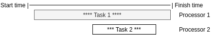

- Task2 can happen anywhere within TS.
- **Task1 and Task2 are processed concurrently (during the same TS).**
- Task1 and Task2 are processed in parallel.

***

## C programming language concurrency / parallelism

- Most libraries written in C.
- C **multiprocessing** library functions:
    - `fork()`
    - `execv()`
    - `kill()`
- C **multithreading** library functions::
    - `pthread_create()`
    - `pthread_exit()`
    - `pthread_join()`
    - `pthread_exit()`
    - `pthread_mutex_lock()`
    - `pthread_mutex_unlock()`
- C non-blocking I/O functions:
    - `fcntl()`
    - `epoll_create1()`
    - `epoll_wait()`
- **Java (C#) favor multithreading for an concurrency.**
- **Go** have emphasized to multithreading.
- **JavaScript, Ruby, Perl, Python favor multiprocessing.**

***

## System call

### The system context: user-space and kernel-space code

- **User-space code does not control shared physical resources (processors, memory, I/O devices).**
- Applications execute in user space.
- Kernel-space code comprises the core OS routines that control shared physical resources.
- A **system-call** originates in user-space, but results in execution of a kernel space routine:
    - Standard library functions (user-space) mediate between ordinary app code, and the core OS routines (kernel-space)
    that some library functions call.
    - Standard library goes by various names: on Unix-type systems (libc) or variants thereof (glibc on Ubuntu) on
    Windows (Win32 API).

### Node.js example

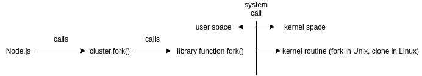

- Standard libraries and kernel routines written in C with some assembly language.

### Summary

- Concurrency and parallelism are different:
    - Concurrency involves handling multiple tasks in the same time span.
    - Parallelism involves processing multiple tasks literally at the same time:
        - True parallelism requires multiple processors.
- The classic approaches to concurrency are multiprocessing and multithreading:
    - Non blocking I/O concurrency without parallelism.
- Programming languages:
    - C is close to the metal, the system libraries and core OS routines at work under the hood.
    - Whatever app language, multiprocessing, multithreading and non-blocking I/O calls in the language hit
    the C libraries and, from there, kernel-space routines.
    - Java, Go, Node.js have particular styles and strengths with respect to concurrency in particular.

***

## Processes and threads

- A **process** is a 'program in execution', each with its own address space.
- The address space comprises the memory location accessible to the process (segmentation failed).
- Separate address spaces effectively partition memory among the processes.
- A **thread** is a sequence of executable instructions within a process.
- Threads within a process share the same address space, they have access to exactly the same memory location.
- This is a root cause of **race condition**.
- A race condition arises when two or more threads concurrently access the same memory location and at least one of the
threads tries to update the location.

```
n = random_num();
```

- `n` is shared memory location among the threads, the result is unpredictable.
- Scheduling on modern systems: To schedule a process on a processor is to schedule one of its threads.

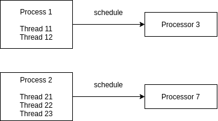

## Concurrency & Parallelism: Multithreading

```console
cat names.txt | sort
```

- `cat` and `sort` are executing processes.
- `sort` performs blocking I/O, it waits for all the bytes from `cat` before doing the sorting.
- If multiprocessors machine, `cat` and `sort` can execute on different processors.
- Pipe operator `|` performs automatic multithreading:
    - :star: A pipe is a mechanism for inter-process communication (IPC).
- Task (producing the bytes in the file and then sorting the lines) are divided between two processed.
- General approaches in code:
    - A parent process `forks` (clones, spawns) a child process, and both execute code from the same program:
        - If-else separates the parent code from the child code.
    - A parent process `forks` a child, which then executes a separate program.

### Tomcat

- Tomcat implements the **one-thread-per-request** model for handling client requests.
- Tomcat runs as a single process, which is multithreaded.
- Tomcat delegates each request for any WAR file to a thread, the **one-thread-per-request** model.
- Tomcat creates a thread pool at start-up: indeed, two thread pools one for requests over HTTP,
another for HTTPS if enables:
    - Thread creation and destruction is relatively expensive process.
- Other Java web services like Jetty, implement the **one-thread-per-request** model as well.


### Non-blocking-io

- `print('Hello World');` is blocking.

### Review

- Multiprocessing: Dispatch each task to a separate process (program in execution):
    - **prefork:** The processes by building a pool of these at start-up. Then grab a process from the pool
    to act as the **task handler**.
    - When the task-handling process finishes its work, put it to sleep.
    - Apache2, nginx, IIS are production example.
- Multithreading: Dispatch each task to a separate thread within process:
    - For efficiency, build a thread-pool at start-up, and grab a thread from the pool to act as the **task handler**.
    - When the task-handling thread finishes its work, put it to sleep.
    - Tomcat, Jetty examples.
- Non-blocking I/O: A single-threaded process that jumps quickly from one task to another, doing partial
processing of each task:
    - Read from cache by several Task1 and Task2 doing the same things.
    - Node.js example.

### Hybrid

- `Multiprocessing + Multithreading` IIS (Windows web server) and AspNet runtime:
    - Each worker process is multithreaded (10 thread per worker process), each thread handle single request
    (one-thread-per-request model).
- `Multiprocessing + Non-blocking I/O` nginx:
    - nginx has a **master process** to read conf file and to watch over worker processes.
    - A **worker-process** handles a client request.
    - Other processes cache loader and manager.
- `Non-blocking I/O + Multithreading` Node.js:
    - A single threaded process managing an event loop.
    - **workers** are JavaScript functions reads and handles a clients requests uning non-blocking I/O and
    callbacks to signal task completion.
    - Long running tasks (DB accessing) are delegated to other threads, with callbacks to signal task completion.

***

## Multiprocessing

- The processes communicate through a **named pipe** (aka FIFO).
- A named pipe is a mechanism designed to support IPC among processes on the same host.


- The system implements a FIFO as a temporary file.
- Named pipe are quite similar in functionality to Unix Domain Sockets, also called **local sockets**:
    - Network sockets support communication between processes running on different hosts, whereas named pipes
    and local sockets do the same for processes running on the same host.
- In the C code, the FIFO written and read as if it were a regular disk file: the I/O API is the same.

### Multiprocessing nginx Web Server

- Multiprocessing in production-grade software: the nginx web server.
- www.nginx.com
    - The web server written in C.
    - nginx combines multiprocessing and non-blocking I/O as concurrency mechanism.
- nginx, like any modern web server that relies on a multiprocessing for a concurrency, is a **pre-forking** server.
    - nginx can be started as a system service (at boot time) and is platform-natural.

**nginx.conf**

- Configuration entries are key/value pairs: no XML.

```configuration
user www-data;              # www-data (name is arbitrary) is owner of workers
worker_processes 4;         # default number of workers, might be set to processor count
pid /var/run/nginx.pid;     # file /var/run/nginx.pid stores pid of master process

events {
    worker_connections 1024; # Max of 1024 connections per worker
                             # Typical browsers open at least two connections to a site per client session
}
```

```console
ps -ef | grep nginx

    Owner       pid     ppid    nginx process type

    root        1803        1   master process /usr/sbin/nginx  # command that started nginx
    www-data    1804     1803   worker process
    www-data    1805     1803   worker process
    www-data    1807     1803   worker process
    www-data    1808     1803   worker process
```

### Multiprocessing - Execing And Forking Options

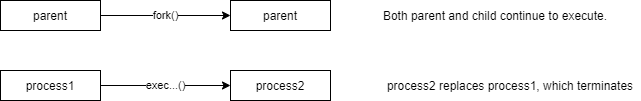

- In system, an **image** is an executable program. 
- For instance, copying the system from one machine to another is called **re-imaging**.
- A new process can be spawned (created) under one of two distinct scenarios, which the difference between the
**fork()** function, and the **exec-family** of functions illustrates.
    - The **exec-family** consists of library functions that, under the hood, make the same system call.
- :star: In a successful call to **fork()**, the new child process executes the same image as the parent that spawned it: the
forked process is a clone.

```c
pid_t pid = fork();     // parent executes this
...
if (0 == pid) {         // 0 returned for the child
    ...                 // child code
}
else {
    ...                 // parent code: fork returns child's pid to parent
}
```

- :star: In a successful call to an **exec-function**, replaces the current process image with a new images that's
loaded into memory.

```c
int flag = execl("/usr/bin/myGame", "myGame", 0);
if (-1 == flag) {
    perror("Couldn't exec...");
}
// on success, the 'myGame' program now executes
```

- The new image has its own address space and other features. 
- In summary, the old process stops execution, and a new one begins execution.
- The new process retains the pid (and ppid) of the one it replaces:
    - The user and group properties are likewise unchanged.

### Multiprocessing - Process Tracking & Management

- Each process has a unique ID (pid), a non-negative integer:
    - :star: A process's pid recorded in system's **process table**.
    - Library function `getpid()` and `getppid()` get the pid and the parent's pid.
    - The pid of `0` is typically reserved for the **idle process**, the one runs when there's nothing else to run.
    - The **init process** has a pid of `1` the first user-space process that the OS kernel spawns in the boot-up:
        - On a shutdown, the init process is the last process to terminate: it waits for all of its children.
        - The init process starts other processes: system services such as the login service, etc.
- :star: Key data structures in a process 'context':
    - **process table:** 
        - Tracks information per process, in particular information that allows a pre-empted process to restart later.
    - **page table(s):** 
        - Translate virtual into physical address. 
        - Each process has its own, which effectively partitions virtual address spaces among processes.
    - **file table:**
        - Tracks, per process, files that a process has opened.
- Every process has a user and group 'owner', which determines the process's access rights to resources.
- Every process likewise belongs to a 'process group', which facilitates sending signals to every process in a group,
to getting information about related processes, and so on:
    - In the default case, a child process belongs to the same as its parent.
- Most modern systems use pre-emptive scheduling, with either fixed-length or variable-length time-slices:
    - A process that exceeds the time-slice on a given run pre-empted and sent back to a scheduling queue.
    - A process and a thread 'context' consists of key information about it:
        - :star: For a process, key data structures such as the process table, the file table, and its page tables
        define the 'context'.
- Context switches, which occur during pre-emption, come in two flavors:
    - From one thread to another within the same process **intraprocess switching**.
    - From one process to another **interprocess switching**:
        - The big cost is the swapping out of one (virtual) address space for another, page table.
    - A process-level context switch is significantly more expensive than a thread-level context switch:
        - The cost of thread-level switching is near zero on modern systems.
        - Depiction:
```
Process1    Process2    Processor7
  Thread11    Thread21
  Thread12

1st scenario: Thread12 replaces Thread11 on processor7      # Virtually no overhead

2nd scenario: Thread21 replaces Thread11 on processor7      # High overhead-process context switch
```

***

## Multiprocessing In Depth

### Inter-process communication

- A process execute in splendid isolation from on another because each has its own address space.
    - A process sees itself as alone on the host, in ownership of all the host's resources.
- What if processes need to cooperate on a task?
    - In a production-grade web server such as nginx, the **master** does oversee the workers, creating a
    new worker, for example, if an existing one goes down; but the workers have essentially no contact with one another.
- IPC covers the various ways in which processes can share information if required to do so.
- :star: List of IPC mechanisms:
    - A **signal** is a simple command that one process can send to another.
        - Example `kill` signal to terminate process.
        - Signal represent a very lightweight IPC mechanism.
    - A **local file** is accessible to any process that has the file's name. 
        - Processes can communicate with one another by writing to and reading from a local file.
    - A **pipe** is byte-level stream that connects two processes, one of which sends bytes that the other receives.
        - The output of one process is **piped** into the other process input.
    - A **socket** is a communication endpoint that complies with a protocol (e.g. UDP or TCP), the endpoint supports
    data exchange. 
        - Network sockets allow a process on one host to communicate with a process on another. 
        - Local sockets (aka Unix domain sockets) allow process to communicate with a process on the same host. 
        - Sockets support the interchange of arbitrary large amounts of information as byte stream.
    - A **message queue** supports asynchronous communication in that the sender, and the receiver of a message need
    not coordinate explicitly in order to communicate. 
        - For example one process might send a message to a queue, although no other process is awaiting the message. 
        - At some later time, another process could retrieve the message from the queue. 
        - Message queues designed for asynchronous communication among processes.
    - **Shared memory** consists of memory location to which various processes have access.
        - Shared memory thus represents an exception to the memory-isolation rule for processes.

**Shared memory as an IPC mechanism**


- Access is significantly faster than it would be for a shared file.
- Any number of processes can share a memory segment, whose size given in bytes.

**API overview**

- One process allocates the shared memory segment, specifying the requested size in bytes:
    - The process can specify a memory address, but also let the OS make the decision.
- This process then 'attaches' the allocated memory to its own address space so that standard operations (read/write)
can be performed on the shared memory.
- Another process references this same memory segment, and likewise 'attaches' the segment to its virtual address space.
- The shared memory is then accessible to each process.
- The main library functions are:
    - `shmget` shared memory get, which requests a shared memory segment.
    - `shmat` shared memory attached, which attaches a shared memory segment to the virtual address space
    of a process.

**The Nginx Web Server & Unicorn App Server Arch**

- Using a local socket (Unix domain socket) for IPC.


- Arch pieces:
    - Unicorn is an 'app server' that loads the Rail framework. 
    - Unicorn and the Rails app talk via 'Rack' middleware.
    - Unicorn workers handle requests against the Rails app.
    - The nginx web server, in this context, acts as a 'reverse server proxy' that forwards incoming HTTP
    requests to the app server (in effect, one of the Unicorn workers), which in turn dispatches the request
    to the appropriate code in the Rails app.

**Role of local socket**

- The Unix-domain socket provides IPC between the nginx web server and the Unicorn app server.
- Requests go from nginx through the socket to a Unicorn worker, and from there to the Rails app.
- Requests go from the Rails app through the Unicorn worker through the local socket to nginx, and from
there to the client.

**Unix domain sockets vs named pipes**

- The basic roles are very much alike, although the UDS has a richer API.

### Multiprocessing Tradeoffs

**Upsides**

- Each process insulated within its own address space from other processes: the OS is in charge:
    - The programmer need not worry about 'race conditions' in which two processes inappropriately access the same
    memory location.
    - The OS, not the programmer, keeps processes from stepping on one another memory locations.
- On modern systems, process creation is relatively efficient, but not cost-free:
    - If multiple processes needed and can be created at a startup, the cost of spawning amortized across the app's lifetime.
        - Standard examples are 'pre-forking' web servers.
    - Processes can be put in a 'wait' state when there's no work to be done.
- :star: Standard libraries afford a rich assortment of mechanism for IPC, including:
    - signals
    - disk files (local and even remote)
    - named and unnamed pipes
    - local sockets on same host, network sockets across hosts
    - message queues
    - shared memory

**Downsides**

- Process-level context switches ('interprocess' context switches) are relatively expensive.
    - The OS needs to do bookkeeping, in particular with the process and page tables.
    - Process-scheduling algorithms that try to minimize context switches are in place, and system admins can balance
    processes against host processors.
- The library APIs for putting a process in a quiet state are relatively low-level and tricky.

***

## Multithreading

- The chief **advantage** of multithreading over multiprocessing is that threads are 'lighter' than processes:
    - A process consists of one or more threads of execution.
    - A thread-level context switch has a near-zero cost for threads in the same process.
    - A process-level context switch is significantly more expensive, in milliseconds range.
- The chief **disadvantage** is that threads in the same process share the same address space:
    - The programmer, rather than OS, must ensure that two threads in the same process don't inappropriately access
    the same memory location (e.g. by trying to update the location).
    - The programmer must coordinate threads in the same process to avoid 'race conditions':
        - If the coordination overdone, 'deadlock' may result.
    - Thread communication must be just right:
        - Too little brings the thread of race condition and, therefore, unpredictable results.
        - Too much hurts efficiency and may result in deadlock.
- Some system (e.g. Linux) implement threads as processes that happen to share an address space; other system
(e.g. Windows) have distinct kernel-level support for threads.
    - Under any implementation, the standard behavior is that distinct process have distinct spaces, whereas
    threads in the same process share an address space.
- C# and Java have very similar support for threading.

### Multithreading - Analysis of The Race Condition

- T1 and T2 are threads in process P. 
    - T1 and T2 have access to the same memory locations.
- `N` is memory location within the address space T1 and T2 share.
- T1 tries to increment `N` at the same time T2 tries to decrement `N`.

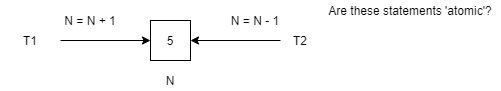

- Each pseudo-code instruction involves two operations an addition or subtraction, then an assignment:
    - Assume that the result of the addition/subtraction stored in a CPU register or on the stack,
    in either case, in a temporary location.
    - Temp1 is T1's temporary location, Temp2 is T2's temporary location.

```
Temp1 = N + 1   # increment N and save the incremented value (N is unchanged so far)
N = Temp1       # assign the incremented value to N
```

- The machine has multiple CPUs, T1 executes on one of these as T2 executes on another.
- The following depicts one possible outcome of a race condition.

```
    Clock ticks:

C1: Temp1 = 5 + 1 = 6   # T1's addition
C2: Temp2 = 5 - 1 = 4   # T2's subtraction (T1's assignment has not occurred yet).
C3: N = Temp2           # T2's assignment operation (N is decremented to 4).
C4: N = Temp1           # T1's assignment operation (N is incremented to 6).
```

- After a single increment by 1 and a single decrement by 1, N winds up as 6 not 5.
    - Improper interleaving of the operations is at fault.
    - Whichever thread starts its arithmetic operation (addition/subtraction) must be allowed to complete the
    assignment without interruption:
        - This is precisely what 'thread synchronization' through locking of N ensures,
        - Single-threaded execution of the arithmetic operation and the subsequent assignment.

**Explicit thread locking**

- A 'critical section' of code must be executed in a single-threaded fashion because otherwise a race condition could
arise.
    - For example, if threads T1 and T2 can both execute:
        - `N = N + 1 # the same storage N is accessible to T1 and T2`
        - This statement is a critical section of code. 
        - T1 and T2 should not execute this section at the same time.
- Locking mechanism should provide the following services:
    - The mechanism should ensure 'mutual exclusion'. 
    - If T1 manages to grab the lock, then T2 is excluded from the critical section that the lock protects 
    while T1 holds the lock; and vice versa.
    - The mechanism should ensure 'progress'. 
    - If no thread holds lock, then some thread should be able to grab it and thereby enter the critical section 
    that the lock protects.
- Various locking mechanism:
    - A 'semaphore' restricts the number of threads allowed to access a shared resource (e.g. shared function).
    - For example, 'semaphore' might allow two threads to access a chunk of code simultaneously, but no more than two.
    - A semaphore is thus a set of permission tickets, which enable a thread access a resource.
        - Semaphores add 'tickets' a semaphore is like a ticket that grants access to a resource. 
        - A semaphore with a value of three grant access to three threads at most at a time.
    - A 'mutex' is a semaphore with a value of 1. 
        - Whichever thread holds the mutex has access to the protected resource, whereas all others excluded.
        - A mutex enforces mutual exclusion, but a semaphore with a value > 1 would not.
    - :star: A 'monitor' (which the Java 'synchronized' block provides) is a mechanism that enforces mutual exclusion,
    supports progress, and has addition mechanisms for thread cooperation. 
    - In Java's case, the 'wait' mechanism supports quiet waiting for a lock to be released, and the 'notify' mechanism 
    notifies waiters that a lock has been released.

**deadlock example**

```java
public class DeadLock {
    // use a static field as the lock to ensure there's a single instance of the lock
    static Object lock1 = new Object(); // a single lock1
    static Object lock2 = new Object(); // a single lock2

    public static void main(String[] args) {
        Thread thread1 = new Thread() {
            public void run() {
                synchronized(lock1) {
                    print("thread1 holds lock1");
                    try {
                        Thread.sleep(2);
                    } catch(Exception e) {}
                    print("thread1 waiting for lock2");
                    print("\t(thread1 needs lock2 to release lock1...)");
                    synchronized(lock2) {
                        print("thread1 holds lock1 and lock2");
                    } // lock2 released here
                } // lock1 released here
            }
        };
        Thread thread2 = new Thread() {
            public void run() {
                synchronized(lock2) {
                    print("thread2 holds lock2");
                    try {
                        Thread.sleep(2);
                    } catch(Exception e) {}
                    print("thread1 waiting for lock2");
                    print("\t(thread2 needs lock1 to release lock2...)");
                    synchronized(lock1) {
                        print("thread2 holds lock2 and lock1");
                    } // lock1 released here
                } // lock2 released here
            }
        };
        thread1.start();
        thread2.start();
    }
}
```

### Multithreading - Concurrency Management

- Multithreading is far trickier to manage than multiprocessing:
    - The OS keeps the processes in multiprocessing from stepping on one another's storage.
    - The programmer must do the same for threads within process, thread coordination.
- How to support to thread-safety (i.e. safety from race conditions)?
    - Consider an in-memory mutable list, and an 'add' operation.


- Basic Java approach: Ensure mutual exclusion on shared storage through locking:
    - Locking allows only single-threaded access to the list **L** during ADD operation.
- Basic Clojure approach: Make in-memory objects immutable by default, with a few exceptions:
    - ADD operation first makes a copy of the original list, and then changes the copy.

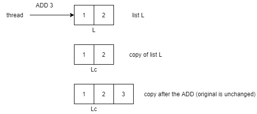

- The preferred Go approach: Have a single thread control access to list **L**, with other threads sending messages
such as ADD to this controlling thread:
    - The messages are sent through a thread-safe channel.

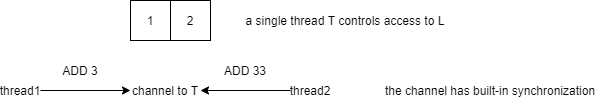

### Multithreading - summary

- Multithreading can be highly efficient way to do concurrent programming, as thread-level context switches are
very cheap.
    - It's the preferred approach to concurrency in languages such as Java and C#.
- Multithreading has twin challenges for the programmer:
    - Avoid race conditions by ensuring that multiple threads don't access shared memory locations inappropriate way:
        - Ensure that critical sections executed in single-threaded mode.
    - Avoid 'over synchronization' that degrades performance and may result in deadlock.
- Languages now offer programmers high-level constructs and types to ease the challenges of multithreaded programming:
    - But sometimes a simple mutex is still the way to go.

**Native vs green threads, and the Global Interpreter Lock (GIL)**

- A 'native thread' is under kernel OS control when it comes to scheduling:
    - Since roughly 2000, Java Thread instances map to 'native' threads. (Same for C#)
    - C's 'pthreads' (the 'p' for POSIX API standardization) are 'native' threads.
- A 'green threads' (aka 'microthread', 'tasklet') is under a particular language's runtime control.
    - In effect, 'green threads' emulate native threads, and may provide better performance for operations such as
    thread creation and synchronization.
    - Prior to version 1.9, for example, Ruby's standard implementation (CRuby) has only green threads.
- A GIL is a mechanism (in implementation, a mutex) that a runtime uses to allow only one thread to execute at a time,
even in multithreaded environment: no thread-level parallelism:
    - The standard implementations of Ruby (CRuby) and Python (CPython) have a GIL.

***

## Multithreading in depth

### Thread Synchronization As Cooperation

**Cooperation - the flip side of locking in thread synchronization**

- Java's synchronized block implements a 'monitor', a programming mechanism that supports mutual exclusion for
thread coordination, but also supports thread cooperation:
    - In Java, some cooperative mechanisms (e.g., one thread explicitly yielding others) have been deprecated.

**Depiction of a queue with multiple 'producers' and 'consumers':**

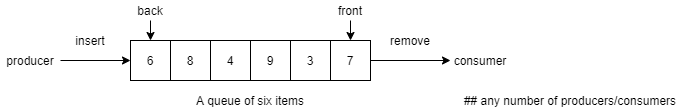

- Consider the example of two threads that manipulate a shared data structure: one thread ('producer') inserts
items into the shared structure (for example, a queue), whereas another thread ('consumer') removes items
from this structure.
    - If the queue is empty, a consumer should wait until a producer inserts an item.
        - A producer thread awakens waiting consuming threads after the insertion of an item.
    - If the queue is full, a producer should wait until a consumer removes an item, thereby freeing up room.
        - A consumer thread awakens waiting producing threads after the removal of an item.

**Stack instead a queue**

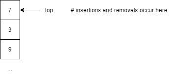

### The Thread Safe Stack Example in Java

**StackTS.java**

```java
public class StackTS {
    private static final int capacity = 8;
    private int top = -1;   // empty stack when top == -1
    private int[] stack = new int[capacity];

    // when entire method is synchronized, the implicit lock is the current object---'this' in Java.
    // Hence, methods push and pop are effectively locked together: only one may be accessed at a time.
    public synchronized void push(Integer n) {
        while ((top + 1) == capacity) { // full?
            try {
                wait(); // if so, wait for pop
            } catch(InterruptedException e) {}
        }
        log(n + " pushed at " + (top + 1));
        stack[++top] = n;
        notifyAll();
    }

    public synchronized void pop() {
        while (top < 0) {   // empty?
            try {
                wait();
            } catch(InterruptedException e) {}
        }
        log(stack[top] + " popped at " + top);
        top--;
        notifyAll();
    }

    private void log(String msg) {
        System.out.println(msg);
    }
}
```

**Pusher.java**

```java
class Pusher extends Thread {
    private Random rand = new Random();
    private StackTS stack;

    Pusher(StackTS stack) {
        this.stack = stack;
    }

    @Override
    public void run() {
        while (true) {
            stack.push(rand.nextInt(100)); // 0 through 99
            try {
                Thread.sleep(rand.nextInt(200)); // sleep 0 to 199 milliseconds
            } catch(InterruptedException e) {}
        }
    }
}
```

**Popper.java**

```java
class Popper extends Thread {
    private Random rand = new Random();
    private StackTS stack;

    Popper(StackTS stack) {
        this.stack = stack;
    }

    @Override
    public void run() {
        while (true) {
            stack.pop(); // 0 through 99
            try {
                Thread.sleep(rand.nextInt(200)); // sleep 0 to 199 milliseconds
            } catch(InterruptedException e) {}
        }
    }
}
```

**MainTS.java**

```java
class MainTS {
    public static void main(String[] args) {
        StackTS stack = new StackTS();
        new Popper(stack).start();
        new Pusher(stack).start();
        new Pusher(stack).start();
    }
}
```

### Multithreading summary

- Thread coordination constructs range from explicit mutexes in the source code to thread-safe types such as
Java's AtomicInteger.
    - Richer thread-safe data structures: efficient thread-safe lists and maps.
        - Classic Java types such as Vector and Hashtable are thread-safe, but inefficient.
- Thread 'synchronization' includes not just coordination to avoid race conditions and deadlock, but also
cooperation to boost performance:
    - Having a thread wait is a quiet state is better than having a thread use up resources trying to gain a lock.
    - The StackTS example in Java illustrates with waiting and notifying.
- The multithreading_server highlights multithreading as a concurrency mechanism with this upside:
    - The 'division of labor' or 'separation of concerns' between a 'listening' thread and 'request handlers'
    prevents the disaster of having a huge request interfere with others.
    - On a multiprocessor host, the 'one-thread-per-request' model can lead to true parallelism.
    - The example illustrates the concurrent programming style of real-world web servers such as Tomcat and Jetty.
- The multithreading_server underscores that local variables (and parameters) are thread-safe: the idea of a
'pure function'.
    - Modern systems allocate separate stack storage per thread, and it's the stack that holds local variables
    and params by default.

***

## Concurrent Types - Thread-Safety & High Level

- `java.util.concurrent.atomic` toolkit to support thread-safe, lock-free programming for counters and the like.
- The types include:
    - `AtomicInteger`
    - `AtomicIntegerArray`
    - `AtomicLong`
    - `AtomicLongArray`

```java
// how an 'atomic counter' might be implemented
public final class Counter {
    private long value = 0; // initialized for emphasis

    public synchronized long getValue() {
        return value;
    }

    public synchronized long increment() {
        if (value == Long.MAX_VALUE) {
            throw new IllegalStateException("Counter Overflow");
        }
        return ++value;
    }
}
```

- A 'retrieval' operation is a 'read' operation: it has no side-effect.
- An 'update' operation has side-effects: of changes the data structure.
- `java.util.concurrent.ConcurrentHashMap:`
    - Same functionality as the `Hashtable`, but highly efficient:
        - The map partitioned: for example, an update locks only part of the map. 
        - Two updates could occur at the same time if in different partitions.
        - Retrieval operations generally don't block.
        - The whole map cannot be locked in any case.
- `java.util.concurrent.CopyOnWriteArrayList:`
    - Update operations cause a copy of the underlying array to be made.
        - In effect, an immutable data structure in the script of Clojure.
- `java.util.concurrent.BlockingQueue:`
    - A retrieval waits for the queue to become non-empty before retrieving the 1st element.
    - Various implementations, e.g., `ArrayBlockingQueue` and `PriorityBlockingQueue`.

**Executors and thread pools**

- The Executor interface provides a single method, `execute()`, designed to replace the old Thread idiom.
- For example, if reference 'runnable' points to a Runnable object and 'exec' to an Executor, then:
    - `new Thread(runnable).start();        // create a new Thread to run runnable`
    - becomes:
    - `exec.execute(runnable);      // may use an already existing worker thread to run runnable`
- Thread pools:
    - Most executor implementations use thread pools, which hold 'worker threads'.
    - A single worker might reused to execute many tasks.
    - Eliminates cost of continually creating and destroying Threads.

**Fork/Join as an Executor Service**

- The Fork/Join framework implements the ExecutorService interface in a way meant to take full advantage of a
multiple-processor machine.
- Designed for work on recursive structures: structures such as trees whose subparts are also, in this case,
(sub)trees. 
- Here's a tree representation of expression `(A * B) + (C + D):`

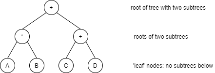

- The framework distributes tasks to workers from a thread pool, but workers that run of something to do
can 'steal' work from some other thread: highly cooperative task management.

### Concurrent Types - The BlockingQueue Example

- The interface `java.util.concurrent.BlockingQueue` has several standard implementations, including
`java.util.concurrent.SynchronousQueue`:
    - This implementation is 'synchronous' in that an 'insert' operation blocks (waits) for a corresponding
    'remove' operation:
        - In different terms, s SynchronousQueue does no buffering and, in this sense, act like a pipe. 
        - Indeed, the documentation characterizes this queue as an 'empty collection'.
        - By contrast, an ArrayBlockingQueue does have a buffering capacity.
    - Here's a depiction, using the familiar pipe symbol | to represent the SynchronousQueue, with the
    producer and consumer as threads:

    - The SynchronousQueue is thread-safe.
- The `java.lang.Thread` class implements the `java.lang.Runnable` interface, which defines one method:

```java
public void run();
```

- The Thread class has an empty implementation ('adapter' pattern):

```java
public void run() {} // returns immediately
```

### Concurrent Types - The BlockingQueue Example

```java
public class ProducerConsumerQueue {
    public static void main(String[] args) {
        BlockingQueue<String> dropbox = new SynchronousQueue<String>();
        new Thread(new Producer(dropbox)).start();
        new Thread(new Consumer(dropbox, 12)).start();
        new Thread(new Producer(dropbox)).start();
    }
}

class Producer implements Runnable {
    private BlockingQueue<String> dropbox;

    Producer(BlockingQueue<String> dropbox) {
        this.dropbox = dropbox;
    }

    @Override
    public void run() {
        String importantInfo[] = {"A", "B", "C", "D", "E", "F"};
        try {
            for (String info : importantInfo) {
                dropbox.put(info);
            }
        } catch(InterruptedException e) {}
    }
}

class Consumer implements Runnable {
    private BlockingQueue<String> dropbox;
    private int maxTakes;

    Consumer(BlockingQueue<String> dropbox, int maxTakes) {
        this.dropbox = dropbox;
        this.maxTakes = maxTakes;
    }

    @Override
    public void run() {
        Random random = new Random();
        try {
            for (int i = 0; i < this.maxTakes; i++) {
                String message = dropbox.take();
                System.out.format("Message received: %s\n", message);
                Thread.sleep(random.nextInt(3000));
            }
        } catch(InterruptedException e) {}
    }
}
```

### Concurrent Types - The Semaphore

**Semaphore vs mutexes**

- A semaphore allows 'counted access' to a resource, and a mutex is the special case for `count == 1`:
    - A semaphore might allow 10 threads to hit a protected resource, but not 11.
    - A mutex would allow 1 thread at most to hit a protected resource.
- Semaphores that allow 'counted access' are called 'counting semaphores'.

**ExecutorService**

- Executor service: The service builds and then manages a thread pool, drawing upon 'worker threads' in the pool
as needed.

```java
new Thread(runnable).start();   // explicitly create and start a Thread to handle the task
```

```java
exec.execute(runnable);         // get a Thread from a pool to handle task
```

- Various option for how the Executor can work: Use the same thread for a given task, use any thread from a pool
for a given task.

```java
final class SkiPair {
    private String name;
    private boolean inUse;

    public SkiPair(String name, boolean inUse) {
        setName(name);
        setInUse(inUse);
    }
    public String getName() {
        return this.name;
    }
    public void setName(String name) {
        this.name = name;
    }
    public void setInUse(boolean inUse) {
        this.inUse = inUse;
    }
    public boolean isInUse() {
        return this.inUse;
    }
}

final class SkisForRent {
    public static final int maxSkiPairs = 150;
    private static final int minInStock = 5;
    private final Semaphore semaphore = new Semaphore(maxSkiPairs - minInStock);
    private SkiPair[] inventory;

    SkisForRent() {
        inventory = new SkiPair[maxSkiPairs];
        for (int i = 0; i < maxSkiPairs; i++) {
            inventory[i] = new SkiPair("skiPair-" + i, false);
        }
    }

    public SkiPair rentSkiPair() throws Exception {
        semaphore.acquire();    // get the ticket (acquire() is thread safe)
        return getSkiPair();    // use tick to retrieve pair
    }

    public void returnSkiPair(SkiPair sp) {
        if (isReturnable(sp)) {
            semaphore.release();    // release() is thread-safe
        }
    }

    protected synchronized SkiPair getSkiPair() {
        for (SkiPair sp : inventory) {
            if (!sp.isInUse()) {
                sp.setInUse(true);
                return sp;
            }
        }
        return null;    // put of luck
    }

    protected synchronized boolean isReturnable(SkiPair sp) {
        if (sp.isInUse()) {
            sp.setInUse(false);
            return true;
        }
        return false;
    }
}

public class Semaphores {
    public static void main(String[] args) {
        Random rand = new Random();
        final SkisForRent sfr = new SkisForRent();

        Runnable runnable = new Runnable() {
            @Override
            public void run() {
                String name = Thread.currentThread().getName();
                try {
                    while(true) {
                        SkiPair sp = sfr.rentSkiPair();
                        System.out.printf("%s renting %s%n", name, sp.getName());
                        Thread.sleep(rand.nextInt(2000));
                        System.out.printf("%s returning %s%n", name, sp.getName());
                        sfr.returnSkiPair(sp);
                    }
                } catch(Exception e) {
                    System.err.println(e);
                }
            }
        };

        ExecutorService[] executors = new ExecutorService[SkisForRent.maxSkiPair + 1];

        for (ExecutorService executor : executors) {
            executor = Executors.newSingleThreadExecutor();
            executor.execute(runnable);
        }
    }
}
```

### Concurrent Types: The Fork-Join Framework

- An example that uses the fork/join framework meant to encourage the partitioning of a problem into subproblems,
which executing on separate processors handling each subproblem:
    - The thread management the multithreading is under the hood for a very high-level API.
    - Suited for processing recursive structures such as trees whose parts are likewise trees.
- The 'fork' in the fork/join API announces a subproblem suited for a new Thread. 
- The 'join' aggregates results from the work of the threads.
- Base case and recursive case in the FileSearcher:
    - Base case: A search thread finds a file with the desired extension a non-directory file rather than
    a directory and adds this file to the list.
    - Recursive case: A search-thread finds a (sub)directory, which is suitable for separate processing.

### Concurrent Types: Futures And Callables

- A 'callable' is like a 'runnable' except that the executed method is now 'call' instead of 'run'.
- A 'callable' can return a value of a specified type.

```java
public class AsyncJob implements Callable<Long> {
    @Override
    public Long call() throws Exception {
        long sum = 0;
        final int n = 1000;
        for (long i = 0; i < n; i++) {
            sum += i;
        }
        return sum;
    }
}

class MainAJ {
    public static void main(String[] args) {
        final int poolSize = 10;
        final int n = 20000;

        ExecutorService executor = Executors.newFixedThreadPool(poolSize);
        List<Future<Long>> jobList = new ArrayList<>();

        for (int i = 0; i < n; i++) {
            Callable<Long> job = new AsyncJob();
            Future<Long> pendingJob = executor.submit(job);
            jobList.add(pendingJob);
        }

        long sum = 0;
        // Try to retrieve the results.
        for (Future<Long> result : jobList) {
            try {
                sum += result.get();
            } catch(Exception e) {
                e.printStackTrace();
            }
        }
        executor.shutdown();

        System.out.println("List size: " + jobList.size());
        System.out.println("Sum: " + sum);
    }
}
```

### Concurrent Types: Thread Safety Through Immutable Types and Pure Functions

- Thread safety through 'pure' functions, free of side effects.
- 'stateless' service consisting of 'pure functions', no fields.

```java
@WebService
public class TempConverter {
    @WebMethod
    public float c2f(float t) {
        return 32.0f + (t * 0.9f / 0.5f);
    }

    @WebMethod
    public float f2c(float f) {
        return (5.0f / 9.0f) * (t - 32.0f);
    }
}
```

- String example.

```java
String s1 = new String("HI");
System.out.println(s1);         // HI
String s2 = s1.toLowerCase();   // original string is unchanged
System.out.println(s1);         // HI
System.out.println(s2);         // hi
```

- ImmutableRGB example.

```java
public final class ImmutableRGB {
    private final int red;
    private final int green;
    private final int blue;
    private final String name;

    public ImmutableRGB(int red, int green, int blue, String name) {
        check(red, green, blue);
        this.red = red;
        this.green = green;
        this.blue = blue;
        this.name = name;
    }

    // Store three 8-bit values in a 32-bit int
    public int getRGB() {
        return ((red << 16) | (green << 8) | blue);
    }

    public String getName() {
        return name;
    }

    public ImmutableRGB invert() {
        return new ImmutableRGB(255 - red,
                        255 - green,
                        255 - blue,
                        "Inverse of " + name);
    }

    private void check(int red, int green, int blue) {
        if (red < 0 || red > 255 || green < 0 || green > 255 || blue < 0 || blue > 255) {
            throw new IllegalArgumentException();
        }
    }
}
```

### Concurrent Types: Summary

- Producer-consumer pattern using a synchronous queue:
    - In effect, a thread-safe channel from one thread to another:
        - Two producers with one consumer to illustrate the thread safety.
        - The particular queue used in this example acts like a pipe, as there's no buffering.
- File searcher: 
    - The fork/join framework as a way to 'divide and conquer' recursive tasks.
    - Java's fork/join framework allows less busy threads from an executor-service to 'steal' work from busier threads.
    - A basic pattern: Divide task into subtasks (etc.), and then aggregate the results.
- Semaphores: A resource needs limited access, but not mutual exclusion.
- An asynchronous multithreading using futures, dispatch a task to a thread, and check later for the result.
- Immutable types and 'pure functions' are inherently thread-safe:
    - There's a cost to immutable types, as mutating operations (write-edit-delete) require that a copy be made, and
    it's the copy that's changed, not the original.
    - Pure functions have no side-effects, as they work only with parameters and local variables, both of which are
    thread safe.

***

## Thread Synchronization & Cooperation

### Options for thread synchronization (including cooperation)

**Basic mutex approach**

- Storage location `N` is accessible across many threads.


- The locking ensures mutual exclusion for thread access to critical-section code.
- C (`pthread_mutex_t` data type) and Java (`synchronized` block) illustrate this approach:
    - Java has various data types (e.g. AtomicInteger) with the synchronization backed in.

**The thread-safe channel approach**

- Don't lock the storage, but instead designate a single thread as its controller:
    - In this example, thread N-controller would have sole access to storage `N`.
    - The N-thread treats `N` as if it were its own scratchpad storage, other threads have to communicate with
    the N-thread to gain any access to `N`.
    - Messages (perhaps parametrized) are suited to requirement.


### Goroutines and channels

- Java's executor service illustrates a modern approach to multithreading, an approach with emphasis on efficiency:
    - Let the runtime system manage a pool of threads, which might grow and shrink dynamically or be fixed
    in size from the start.
    - API-level Runnable are multiplexed onto this pool. 
    - A given API-level Runnable might execute be assigned, at different times, to different threads form the pool.
    - The programmer focuses on the application logic for the Runnable, not on the implementation details.
    - Yet another separation of concerns. (e.g. semaphore approach)
- Go and goroutine:
    - A goroutine is a function that can execute concurrently with other in the same address space:
        - `go list.Sort()   // execute the list.Sort() function concurrently`
        - `go foo()         // execute the user-defined function foo() concurrently`
        - Each has its own scratchpad storage (stack).
        - Goroutines multiplexed onto native threads, multiple goroutines can share a thread.
        - Like Java executors, goroutines hide implementation details to keep the API high-level.
    - Channels are thread-safe queues for communication among goroutines:
        - Two flavors, buffered ('async' behavior) and unbuffered ('sync' behavior):
            - A writer to an unbuffered channel would block until there's a read, and a reader would block until
            there's write.
        - For buffered channels, the size specified. 
        - For instance, a buffer of size 4 would allow 4 non-blocking writes.

### Multithreading - summary

- A primary upside, switching between threads in the same process is faster than switching between processes
(that is, between threads in different processes):
    - Cost of thread-level context switches is close to negligible.
- A Primary downside, threads within a process share an address space, which means that their concurrent execution can
lead to a 'race condition', which results in an unpredictable state for some shared memory location:
    - The challenge of multithreading (multiple threads in the same process) is thus thread coordination:
        - Too much coordination can lead to inefficiency and even deadlock.
        - So coordination must be 'just enough', too little cause race conditions, too much may cause inefficiencies
        and even deadlock.
        - There's an efficiency cost to thread coordination, period:
            - Can the cost of thread coordination approach, say, the cost of process-level context switching?

**Basic thread synchronization**

- Memory location locking: The locking mechanism should support 'mutual exclusion' where appropriate, but without
compromising 'progress' (if no thread holds a lock to a 'critical section', a thread should be able to grab the
lock and enter the 'critical section'):
    - Low-level constructs such as the `pthread_mutex_t` and the Java `synchronized` block.
    - High-level types (e.g. Java's AtomicInteger and ConcurrentHashMap) with the locking backed in.
        - Challenge is to make such types efficient as well.
- Message-passing: 1 thread controls the shared memory, other threads communicate with the controller for access.

**Other approach and efficiency improvements**

- The 'Clojure approach': Make most data structures immutable and thereby thread-safe; a few exceptions to the
rule (in Clojure, the 'reference' types):
    - The challenge now becomes efficiency, for example, an immutable list must be copied on every update.
- Multiplexing API-level Runnable objects onto a system-managed thread pool (Java ExecutorService, Go goroutine).

***

## Concurrency & Non-Blocking I-O

**What exactly is non-blocking I/O**

- :star: Standard categories for instruction types, characterized for speed from fastest to slowest:
    - arithmetic/logic (e.g. 'add' and 'equals')
    - control (e.g. 'if <test> ... else ...')
    - data movement (e.g. 'load-from-memory', 'read-from-disk')
    - I/O (e.g. 'print-to-screen', 'read-from-disk')
- Blocking (i.e. waiting) on an I/O instruction is thus time-consuming on a computer system.
- The four basic I/O operations: 'open', 'close', 'read', 'write' an I/O device (e.g. a disk drive).

**Example blocking I/O**

```
byteBuffer[4]   ## array to hold 4 bytes
try {
    read(byteBuffer)            ## attempt to read 4 bytes
    processBuffer(byteBuffer)   ## do something with the bytes
}
catch(IOError e) {
    print(e)        ## executes if there's an error on the read
}
```

- The call to `read(...)` 'blocks' or waits until all the requested bytes read or an error occurs.

**Example for non-blocking I/O**

```
byteBuffer[4]       ## array to hold 4 bytes
index = 0           ## 1st position in byteBuffer
expectedCount = byteBuffer.size
howManySoFar = 0
try {
    loop
        byteCount = read(byteBuffer, index, expectedCount)  ## args: buffer, where to start, how many
        if byteCount == 0
            continue                                        ## if nothing is read, try again
        if byteCount < expectedCount {                      ## we got some but not all
            howManySoFar += byteCount
            if howManySoFar == byteBuffer.size
                break
            expectedCounted = expectedCount - byteCount     ## count the bytes we just got
            index = index + byteCount - 1                   ## adjust index
            continue                                        ## keep looping
        }
} catch(IOError e) {
    print(e)
}
```

- In the call to non-blocking `read(...)`, none, some or all of the bytes might returned.
    - The programmer, therefore, must employ some mechanism to determine which case occurred.

**Blocking I/O is the easier API, non-blocking I/O is the more efficient way to do I/O, the age-old tradeoff**

- Upside of non-blocking I/O: Application can move on to other tasks instead of waiting for the I/O operation
to complete.
- Downside of non-blocking I/O: Tricky coding logic.

### Non-Blocking I-O As A Concurrency Mechanism

- Node.js is a general purpose JavaScript implementation, but tailored for web servers.
- At the API level, a Node.js server is a single-threaded process that uses non-blocking I/O as the concurrency
mechanism:
    - Under the hood, there's multithreading to handle long-running tasks.
    - The `cluster.fork()` method provides API-level support for multiprocessing.

**A depiction of the Node.js web server's 'event loop'**

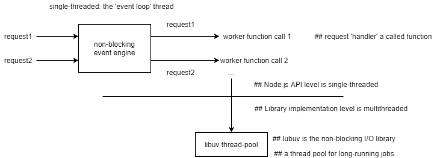

- The single thread that manages the event loop jumps quickly from one task to the next, not working ('blocking')
on any particular task:
    - In particular, the event-loop thread does not block on a request read or response write.
- A long-running job would arise because, for example the HTTP request is large (e.g. in the MB rather than
KB range, handling the request requires going agains a remote DB or other data source and so on.
- The 'event loop' approach works best if the requests and responses are relatively small, and the application logic is
short.
- As Node.js example illustrates, non-blocking I/O tends to be used in a supplementary role.
    - The nginx web server uses multiprocessing together with non-blocking I/O.

***

## Parallelism

- Parallelism as concurrency made efficient: Multiple concurrent tasks distributed among processors so that the
tasks can be processed literally at the same time, in parallel.
    - In a multiprocessing approach to concurrency, multiple processes execute on multiple processors:
        - The OS handles the scheduling.
    - In a multithreading approach to concurrency, multiple threads within a process execute on multiple processors.
        - If API thread map to 'native' threads, then the OS handles the scheduling. (Assuming no GIL).
    - In hybrid approaches (e.g. Asp.Net's multithreaded worker processes), there's still the distribution
    of task processing among multiple processors.
- The goal now is to focus on broader uses of parallel computing.
- Some reasons why parallelism:
    - Consumer desktop, laptop, and even handled machines are now multi-core, with one or more processors per core.
        - In fact, these machines are parallel computers.
            - At issue is how to exploit this possibility for parallel computations.
    - Consumer-level machines may come with GPU (graphics-processing units) and FPUs (floating-point unit
    or 'math coprocessor') as well as CPUs (central or 'generic' processing units):
        - GPUs and FPUs are designed for parallelism.
        - 'gpgpu' (general-purpose computing on a GPU) refers to the use of a GPU for 'general purposes', that is,
        purposes beyond just graphics. So gpgpu approaches a GPU as if it were a (specialized) CPU.
    - Distributed software systems such as email, and the WWW have code modules that execute on
    physically distinct devices:
        - The network as the computer describes networked hosts, each with its own collection of processors, as
        a resource for distributed parallel computation.
        - The key challenge is how to coordinate such computations and to share information among them.
            - Message-passing is a popular, general method.
- Parallel computations may use shared, centralized memory, distributed memory, or some hybrid of the two:
    - The point of interest is how to write programs that execute as parallel computations.
    - Support from toolchains (in particular, compilers therein) is critical to encourage widespread use of
    hardware support for parallel computing.


### Parallelism: Flynn Taxonomy

**Flynn's taxonomy of parallel architectures**

- Flynn's taxonomy is neutral about whether the architecture is for single or distributed systems:
    - For instance, an SIMD architecture might realized on either a single computer system or network of these.
- The taxonomy has been modified and expanded in various ways.
- SIMD is especially relevant nowadays.
- Abbreviations:
    - `D - Data`
    - `I - Instructions`
    - `P - Processor:` 'S' is for 'single' and 'M' is for 'multiple'.
    - Parallelism in any form requires multiple processors, the `Ps` in the following depictions.
- **SISD:** Single instruction, single data.
    - Represents the base case, neither data nor instruction parallelism.


- **SIMD:** Single instruction, multiple data:
    - Various languages now have support.
    - Lots of interest in modern computing.

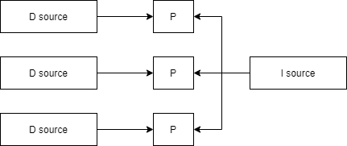

- **MISD:** Multiple instruction, single data:
    - Fault-tolerant system?

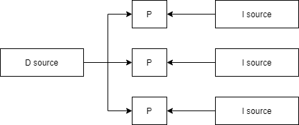

- **MIMD:** Multiple instruction, multiple data:
    - Distributed systems?

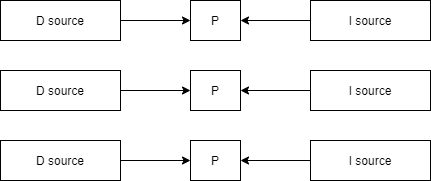

### A SIMD Auto Vectorization

```c
#include <stdio.h>
#define Length 8

int main() {
    int array1[] = {1,2,3,4,5,6,7,8};
    int array2[] = {8,7,6,5,4,3,2,1};
    int sum[Length];

    int i;
    for (i = 0; i < Length; i++) {
        sum[i] = array1[i] + array2[i]; // serial computation
    }
    for (i = 0; i < Length; i++) {
        printf("%i", sum[i]);
    }
    return 0;
}
```

- A better way: `SSE = Streaming SIMD Extensions` = additional instruction set, more CPU registers.
- In the lae 1990s, Intel introduced an `SSE` instruction set for their Pentium III processors. 
- This become known as the `MMX` instruction set.
- AMD earlier introduced a comparable instruction set known as `3DNow!`.
- In any case, the hardware support included new registers with names that start with 'xmm'.
- In the original SSE, there was support only for integer operations.
- `SEE` has progressed, with new versions: `SSE2, SSE3, SSSE3 and SSE4`.
- The newer versions bring `SIMD` support for both integer and floating-point operations.
- At the same time, C/C++ compilers such as GNU and Clang provided support, eventually automatic,
for `SIMD` friendly core.
- Nowadays both compilers are capable of 'automatic vectorization' of appropriately written source code.
- Elements in the arrays 'array1' and 'array2' should be added pairwise in parallel in order to boost performance.

```c
#include <stdio.h>

// The typedef includes special information for the compiler, in particular the '__attribute__' and 'vector_size'
// terms.
// 'intV8' aliases 'int' but as a vector (1-dimensional array) rather than as a scalar type.
#define Length 8
typedef int intV8 __attribute__ ((vector_size(Length * sizeof(int)))); // 32 bytes needed

int main() {
    intV8 dataV1 = {1,2,3,4,5,6,7,8};
    intV8 dataV2 = {8,7,6,5,4,3,2,1};

    intV8 add = dataV1 + dataV2;
    intV8 mul = dataV1 * dataV2;
    intV8 div = dataV2 / dataV1;

    int i;
    for (i = 0; i < Length; i++) {
        printf("%i", add[i]);
    }
    putchar('\n');
    return 0;
}
```

**Some compiler-generated assembly code**

- C compilation.

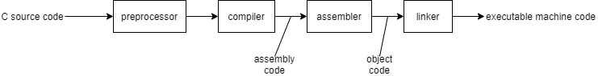

```
main:
    ## The identifiers that start with $ are constants.
    ## %rsp is the 'stack pointer', which points to the TOP position on the stack.
    ## An expression as 96(%rsp) is an address or pointer expression: %rsp is the base address, 96 is of the
    offset therefrom. The offset is in bytes, so in this case it's 96 bytes.
    (The Intel stack grows downwards, from high to low addresses.)

    ## The full expression 'mov1 $1, 96(%rsp)' copies the 32-bit value 1 into stack location %rsp + 96;

    The stack
     ...                        ## high address
    +---+
    | 1 |<-------- %rsp + 96    ## instruction 'mov1 $1, 96(%rsp)' puts 1 in this location
    +---+
     ...
    +---+
    |   |
    +---+
    |   |<-------- %rsp is the 64-bit 'stack pointer'
    +---+
     ...                        ## low addresses
```

### Parallelism: The OpenMP Framework For Auto Vectorization

**OpenMP for data-level (SIMD) parallelism**

- The SSE examples have focused on 'instruction-set level data parallelism':
    - Special additions to the Intel-compatible instruction set such as 'paddd' together with hardware support,
     in particular the 128-bit %xmm registers:
        - The 'paddd' instruction occurs in `simdDoc.s` file, which holds assembly code.
            - The assembly code resulted from 'auto vectorization' on the compiler's part.
        - The '_mm_mul_ps' library function is part of the 'SSE extensions', and gets called directly in the C code.
    - No multiprocessing or multithreading involved.
- Data-level parallelism through multithreading:
    - OpenMP is API specification for thread-based parallel computing with shared memory.
    - Various C/C++ compilers, in particular GNU, support OpenMP.
    - The OpenMP library supports thread-based parallelism.
    - OpenMP is not just parallelism for an efficient concurrency; it's for parallel computing in general.

### Summary

**The basics of data parallelism and 'auto vectorization'**

- Use a 'typedef' to describe a vector, but otherwise let the compiler do almost all the work.
- Use an API (in this case, 'SSE Extensions') to do some parallel work ourselves by calling library functions
that, in turn, are compiled into data-parallel instructions.
- Use a framework such as OpenMP, with special compiler support for 'auto vectorization':
    - Thread-level rather instruction-level data parallelism.
    - High-level API.

***

## Parallelism & Performance

**How to measure performance?**

- Response time ('latency'): elapsed time.
    - Program P1 takes 10 units, whereas program P2 takes 5. 
    - P1/P2 = 2, a speedup of 2.
- Throughput: Number of tasks completed in a fixed amount of time:
    - On single-processor machine M1, with required times for processing.

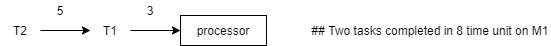

- On multiple-processor machine M2.

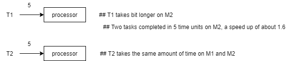

- Parallelism is a good way to boost performance:
    - Parallelism tends to increase throughput, and thereby performance.

### The ParallelSort Program in Java

- Java 8 `Arrays.parallelSort()`) method, and the `Arrays.parallelSetAll()` method for initialization.

### Amdahls Law

- The law, named after its creator sets a theoretical limit on the speedup that can be achieved in a computation.
    - The law has the practical benefit of sharpening intuitions about how speed up should be pursued.
- A sample problem for Amdahl's law:
    - Compute the arithmetic mean of M4 floating-point values on single-processor machine M1. Call this problem P.
    - Compute the speedup of porting the solution to quad-processor machine M4.
        - Assume that M1 and M4 differ only in the number of processors.
- A step-by-step application of the law:
    - Compute response time for P on M1: `RT1`.
    - Compute response time for P on M4: `RT4`.
    - Compute the ratio: `RT1/RT4`:
        - If `RT1/RT4` == 1, the response times are the same: no difference between M1 and M4 performance.
        E.g. if RT1 == RT4 == 2, the performance is the same.
        - If `RT1/RT4 < 1`, there is a slowdown rather than speedup.
        E.g. if RT1 is 4 and TR4 is 8, then 4/8 = 1/2: M4 runs P half as fast as does M1.
        - If `RT1/RT4 > 1`, there's a speedup.
        E.g. if RT1 is 8 and RT4 is 4, then 8/4 = 2: M4 runs P twice as fast as does M1.
    - Normalize RT1 to 1 time unit.
    - Break RT4 into two parts: Enhanced (in this case, parallel) and unenhanced (in this case, serial).
        - The 'unenhanced' part of `RT4` is the part still done in serial mode, no benefit of parallelism.
            - The data set needs to be partitioned, assigned to workers (threads or processes), the results
            from the workers need to be aggregated.
        - The 'enhanced' part of `RT4` is the part benefits from the speedup due to parallelism.
        - `Speedup = RT1/RT4 = 1/(unenhanced + enhanced)`
        - The 'enhanced' depends on two factors: what fraction of time is spedup, and by what amount.
            - How much time does M4 speed in 'parallel mode' when solving P, and how much faster is M4 in
            'parallel mode' than M1 in a serial mode.
        - Assume M4 is four time faster than M1 when M4 is in 'parallel mode', and that M4 is in
        'parallel mode' 80% of the time when solving P.
        - `Speedup = RT1/RT4 = 1/(unenhanced + enhanced) = 1/(0.2 + (0.8/4.0)) = 2.5`
        - Under the given assumptions, M4 solves P 2.5 times faster than does M1.
- The big picture of Amdahal's Law:
    - M4 is four time faster than M1 when M4 is in 'parallel mode'.
    - It's critical to focus on the fraction of time spent in enhanced mode.

| Machine | Fraction in local speedup | Local speedup | Global speedup |
|---|---|---|---|
| M4 | 0.8 | 4.0 | 2.5 |
| M8 | 0.7 | 8.0 | 2.6 |
| M12 | 0.6 | 12.0 | 2.2 |
| M16 | 0.5 | 16.0 | 1.9 |
| M20 | 0.4 | 20.0 | 1.6 |
| M24 | 0.3 | 24.0 | 1.4 |

***

## Parallelism & Distributed Computing

- Transition from `SIMD` parallelism (instruction-based and thread-based) to parallelism in distributed system:
    - Parallelism in distributed systems is not so easy to categorize (MIMD?).
- A 'distributed system' is a software system whose modules execute on physically distant devices:
    - The web itself is a distributed system.
    - Social networking sites (Facebook, Twitter, Tumblr) are distributed systems.
- Distributed systems challenges:
    - Their reliability and robustness depend, in the end,  on networking infrastructure.
    - The host (devices) involved are likely heterogenous, different hardware, different OSes, etc.
    - Communication among the modules requires sound practices, and is subject to failure for various reasons.

**Simplest distributed systems**

- Assume just two hosts, which together run distributed system DS1.
- If both hosts are running DS1 modules (M1 on host1, M2 on host2) at the same time, there's parallelism,
now in distributed form.
- How M1 and M2 cooperate in processing a shared task?
    - Message passing in various forms:
        - DS module executed
        - Device


- Message-passing software:
    - MPI (Message Passing Interface) is a set of industrial-strength standards for message passing.
        - OpenMPI is an open-source implementation of MPI.
    - There are OpenMPI bindings for various programming languages, including Java, although C/C++ remain
    standard language.
    - MPI and OpenMPI are infrastructure for HPC (High Performance Computing) in its distributed form.

### Parallelism & Distributed Computing: Map-Reduce

- Origin lies in the Lisp function 'map' and 'reduce': map an operation such as '+' across a list to get the sum:
    - Pseudo-lisp example: `(map + (1 2 3 4)) ==> 10`
    - Better name 'scatter/gather':
        - Scatter to work to be done, then gather the results together, reducing the results to an appropriate
        value.
        - Scatter work across various hosts, then gather results from these hosts: distributed computing.
    - Pioneered by Google engineers:
        - The map/reduce programming model is designed to process large data sets.
    - The Apache Hadoop project and open-source software is popular.

### Java 8 Support For Map-Reduce Operations

```java
public class Streams {
    public static void main(String[] args) {
        List<Integer> list = new ArrayList<>();
        for (int i = 0; i < 16; i++) {
            list.add(i);
        }

        // example 1
        list
            .stream()                           // streamify the list: values are made available only 'on demand'
            .map(n -> n + 1)                    // map each value to its successor (new stream created)
            .forEach(System.out::println);      // print each of the successor values
        System.out.println();

        // example 2
        list
            .stream()
            .map(n -> Arrays.asList(n-1,n,n+1)) // more complicated mapping
            .forEach(System.out::println);
        System.out.println();

        // example 3
        list
            .stream()   // non-parallel stream
            .map(n -> n+1)
            .forEach(n -> System.out.format("%d %s\n", n, Thread.currentThread().getName())); // main
        System.out.println();

        // example 4
        list
            .parallelStream()   // parallel stream
            .map(n -> n+1)
            .forEach(n -> System.out.format("%d %s\n", n, Thread.currentThread().getName())); // ForkJoinPool
        System.out.println();

        // example 5
        int intSum =
            list
            .parallelStream()
            .map(n -> n+1)
            // the 3 arguments are: 0 is the 'identity value' == the initial value of
            //   the reduction and the default when no more stream values are available
            // (sum, n) -> sum + n is the 'accumulator',
            // and (sum1, sum2) -> sum1 + sum2 is the 'combiner' function
            .reduce(0, (sum,n) -> sum += n, (sum1, sum2) -> sum1 + sum2);
        System.out.println("\n### The sum: " + intSum);
        System.out.println();
    }

}
```

```java
// reduce a list of lists such as [[1,2,3],[9,8,7,6],...] tp [1,2,3,9,8,7,6,...]
List<Integer> flatten(final List<List<Integer>> lol) {
    List<Integer> flatList =
        lol
        .parallelStream()               // parallelize the work across worker threads
        .flatMap(n -> n.stream())       // 'flatten' a list-of-lists-of-ints to a list of ints
        .collect(Collectors.toList());  // aggregate the pieces from the workers into a single list
    return flatList;
}
```

### OpenMPI

- MPI is the Message-Passing Interface, a specification for passing messages among component processes of a possibly
distributed software system.
    - The OpenMPI emphasis is on parallelism through multiprocessing.
    - MPI is an IPC mechanism.

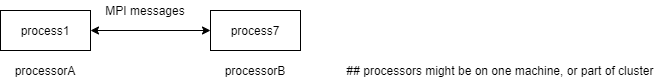

- MPI supports the `SPMD` ('Single Program, Multiple Data') model of parallel programming, arguably the most popular
style.
    - `SPMD` can be viewed as s subcategory of Flynn's `MIMD`: one program generates multiple processes, which
    can divide the work (and corresponding) among themselves.
    - `SPMD` supports HPC ('High Performance Computing') precisely through parallelism.
- OpenMPI and MPICH are two MPI implementations.
    - OpenMPI can use the multiple processors on a given machine together with other processors distributed
    among the 'nodes' (hosts) in a cluster.

### Distributed Systems & Parallelism Summary

- Multiple processors accessible at the same time.
- A means for the processes to communicate (e.g. message passing as an IPC mechanism)

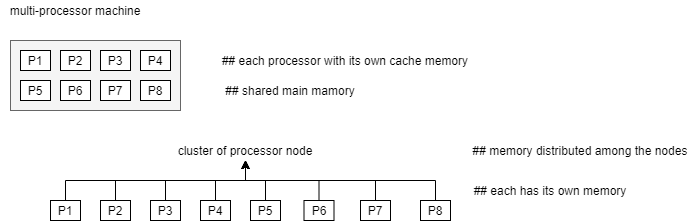

- There is little difference, from a programmer's perspective, between a multi-processor single machine
and a cluster of networked devices, each with one or more processors.
    - Clusters of Raspberry Pi and even more basic devices are relatively easy to build.
- The architectural detail, single machine, cluster of device nodes, is an implementation detail.
- We want frameworks and programming models that abstract from implementation detail, and work on either single
multi-processor devices or cluster of computing nodes.
- The map/reduce programming model is suited for dividing work on large data sets among workers.

***

## Summary

**Concurrency**

- Many modern apps must support concurrency:
    - The support is typically hybrid:
        - The nginx web server uses multiprocessing and non-blocking I/O.
        - The IIS web server and Asp.Net together use a mix of multiprocessing and multithreading.
        - Node.js server supplements its non-blocking I/O API with library-level multithreading.

**Parallelism**

- Is an efficient way to farm out the concurrent tasks to workers (single-threaded processes, multiple threads within
a process, a mix of the two).
- Parallelism has uses beyond concurrent: `SIMD` programming (instruction-level, thread-level, process-level),
`SPMD` programming (OpenMPI).
    - Popular programming models such as map/reduce exploit the power inherent in parallelism.
    - Modern computing devices are parallel-computing devices with CPUs, GPUs, FPUs and others that invite
    parallel computing.
- Distributed systems are thereby parallel-processing systems, with processes on physically distinct devices.
    - Processors are processors, whether on a single machine or distributed within cluster: programming
    models and frameworks adapt readily to either.

**Non-blocking I/O**

- I/O instructions remain the slowest of instruction categories: to block on an I/O operation is thus to wait,
which is to waste time better spent on some other task.
- Non-blocking I/O can boost performance in general, and now is an established technique in concurrent systems,
typically in conjuction with multiprocessing or multithreading.
