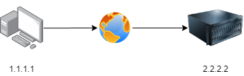

# TCP UDP

## IP Connectionless



- Every packet treated individually and separately.
- No guarantee packets arrived.
- Need to ensure reordering of packets.

## OSI MODEL


- Session Multiplexing:
    - Single host with single IP address is able to communicate with a multiple server.
    - Connection must first established between server and receiver.
- Segmentation:
    - MTU (Maximum Transmission Unit) depends on physical medium.
    - MTU of fast ethernet is 1500 bytes.
    - TCP support 65495 bytes.
    - Maximum segment size (MSS) is the largest amount of data.
    - MSS should be set small enough.
    - TCP support MSS and Path MTU discovery:
        - Sender and receiver can automatically determine maximum transmission.
- Flow Control:
    - To avoid sending data too quickly.
    - If sender send data faster than receiver can handle receiver drop data and require retransmission:
        - TCP have sliding window to control flow of data.
        - UDP does not implement flow control.
- Connection Oriented:
    - TCP is Connection Oriented.
    - UDP is Connectionless.
    - Once transmission is complete session terminated.
- Reliability:
    - Every segment transmitted is acknowledge.
    - UDP does not implement reliability.

### UDP (User Datagram Protocol)

- UDP is connection less.
- Does not guarantee delivery.
- Unreliability.
- Transport Layer Protocol.
- Access to layer 3 without the overhead of reliability mechanisms.
- Connectionless protocol.
- Provides limited error delivery.
- Provides best effort delivery.
- Has no data recovery features.

**UDP Header**


- **Minimum 8 bytes**.
- **Maximum 65,535 bytes**.

***

### TCP (Transmission Control Protocol)

- Provide delivery acknowledgement and reliability.
- Connection Oriented.
- Transport Layer Protocol.
- Access to the network layer for applications.
- Connection oriented.
- Full duplex mode operation - both host can transmit and receive.
- Error checking.
- Sequencing of data packets.
- Acknowledgement of receipt.
- Data recovery features.

**TCP Header**


- If **SYN** is set, actual sequence number plus 1.
- If **SYN** is not set, sequence number is the accumulated sequence number.
- If **ACK** is set, ack number value is equal to next sequence number that receiver is expecting to receive.
- **Header Length**:
    - Minimum size is 5 words.
    - Min size of header is 20 bits.
    - Maximum size is 15 words.
    - Max size of header is 60 bits.
- Reserved is set to **0** (reserved for future used).
- Congestion Window Reduced `CWR` flag.
- Echo Congestion Notification Echo flag `ECE`.
- Urgent flag indicate segment is urgent `URG`.
- Acknowledgement `ACK` flag used for an acknowledgement of data.
- Push `PSH`.
- Reset `RST` reset connection (connection is down).
- Synchronize `SYN`.
- Finish `FIN` no more data from a sender.
- Window size:
    - Window size is 16 bit.
    - Specify the size of the received window.
    - The number of bits receiver is currently willing to receive.

#### Applications

- File transfer:
    - FTP
    - TFTP
    - NFS
- Email:
    - SMTP
- Remote login:
    - Telnet
    - SSH
- Network Mgmt:
    - SNMP
- Name Mgmt:
    - DNS

***

### Socket

- Combination of:
    - IP address of host.
    - Port number used.
    - Transport protocol used.

### TCP / UDP comparision

|| Reliable | Best Effort / Unreliable |
|---|---|---|
| Protocol | TCP | UDP |
| Connection type | Connection Oriented | Connectionless |
| Sequencing | Yes | No |
| Application | HTTP, E-mail, FTP | Voice Streaming, Video Streaming |


### How layers connect together


- Data Link :arrow_right: Number (Type number):
    - Allow to differentiate between multiple layer 3 protocol.
    - Data Link - need to know which layer 3 protocol to send traffic and the type of number used.
- Network :arrow_right: Transport (Protocol number):
    - TCP, UDP.
- Transport :arrow_right: Application (Port number).

## Port Number


- Apache: Listen to traffic on port 80.
- Transport layer (TCP): Send traffic to port 80.
- Application layer: Process the data received.


- Well known ports `<= 1023`.
- Registered port `1024` to `49151`.
- Dynamically assigned ports `49152` to `65535`.

| Application | Port number | Transport layer |
|---|---|---|
| HTTP | 80 | TCP |
| FTP | 21 | TCP |
| FTP Data | 20 | TCP |
| Telnet | 23 | TCP |
| DNS | 53 | TCP / UDP |
| TFTP | 69 | UDP |
| SNMP | 161 | UDP |

- IANA port numbers.
- Used UDP on port number `5`3 to serve request.
- TCP used when response data exceeds to 512 bytes:
    - Zone transfers are used for replication of databases.

### Ephemeral Port Numbers

- Short lived port used for client side of connection.
- Temporary and only last for the duration of the session.
- IANA suggest `49151` to `65535`.
- BSD uses ports `1024` through `4999`.
- Linux used ports `32768` to `61000`.
- Windows through server 2003 use `1025` to `5000`.
- Vista / Windows 7 use IANA range.
- Free BSD uses IANA range since release 4.6

## Establishing a Connection


- Users of TCP must establish a connection oriented session with a peer system.

### Three Way Handshake

**Step 1**


- Send `SYN`:
    - `SEQ = 100`
    - `CTL = SYN`
- Specify the number of port sender wants to connect.

**Step 2**


- Received `SYN`.
- Send `SYN`, `ACK`:
    - `CTL = SYN, ACK`
    - `SEQ = 300`
    - `ACK = 101`
- Ack flag indicates the next portion of data host expect to receive.

**Step 3**


- `SYN` received & Session established:
    - `CTL = ACK`
    - `ACK = 301`
    - `SEQ = 101`
- Syn flag is unset, confirm that a three-way handshake has completed successfully.

```
STEP 1
    Send SYN
    SEQ = 100   CTL = SYN

STEP 2
    SYN received
    Send SYN, ACK
    CTL = SYN, ACK  SEQ = 300   ACK = 101
    SYN & ACK is set to 1

STEP 3
    SYN received & Session established
        CTL = ACK   ACK = 301   SEQ = 101
    - Syn flag is unset, confirm that three way handshake has completed successfully
```

### TCP Seq & ACK

- Window Size is 1:
    - A maximum amount of data that receiver can receive.

### Flow Control

- Prevents the issuer of a sender overflowing the buffers of a receiver.
- Receive buffer full:
    - Not ready by setting window size to 0.
- Receive buffer ready:
    - Ready GO.

## TCP Acknowledgement

- Window size = 1:
    - Number of data segments the sender allowed sending.
- Sender cannot transmit data.
- TCP allow greater window size.

### Flow Control - Fixed Window Size

- Fixed Window Size 3.
- Weighted Random Early Detection `WERD`:
    - Improve efficiency of TCP transmission.
    - Global synchronization.
