# TCP/IP

## What is TCP/IP system

**What is a difference between standard and protocol implementation**

- Standard is a set of rules. 
- Implementation is software that works based of these rules that allows connect a computer to network.

**Why data verification is crucial on end devices in ARPAnet**

- By definition network should not be controlled by any centralized system. 
- This is a reason why sending and receiving computers are responsible for data verification.

**Why in a large network there is name translate**

- IP Addresses are difficult to memorize and easy to type mistakely.
- Domain names are easier to memorize DNS system used to bind words with IP addresses.

***

- What is network protocol?
    - Is a set of rules and data formats that allows communication between computers (or other devices) in a network.
- What two features of TCP/IP standard allows computers to work in decerntralized network?
    - Data verification on end devices and dynamic routing.
- What system used to bind domain names with IP addresses?
    - `DNS` (Domain Name System)
- What is RFC?
    - RFC (Request for Comment) is a official document that contains standard descriptions obligatory in Internet 
    or report made by task force team that regulates Internet working.
- What is PORT?
    - Is logical channel that is used to sending data to proper application.
    
***

- **Physical Address:** 
    - Address bind to network card. 
    - In case of Ethernet network address is bind during production process.
- **IP Address:** 
    - Logical address used to identify a computer or other devices (e.g. printer) in a network.
- **Logical Address:** 
    - Network address binded using software that implements network protocol.
- **ARPAnet:** 
    - Experimental network where TCP/IP standard born.     
- **Gate:** 
    - Router connects LAN network with larger network. 
    - At the when in LAN network companies own protocols (AppleTalk, NetBEUI, Novell IPX/SPX) was used, 
    gate sometimes was referred to router that perform protocol conversions.
- **Protocol Implementation:** 
    - Softwer that implements set of rules in communication specified by protocol.
- **Domain Name:** 
    - Name bind with IP address by DNS system.
- **Port:** 
    - Logical channel, interface between application and transport layer in TCP/IP model.
- **Network protocol:** 
    - Set of rules that describes specified aspects of computer communication process.
- **RFC (Request for Comment):** 
    - Is an official document that contains standard descriptions obligatory in Internet or report made by task force 
    team, regulates Internet working.
- **Router:** 
    - Network devices that is used to send data to destination based on logical address. 
    - Router also used to split a large network into smaller sub-networks.
- **LAN network (Local Area Network):** 
    - Small network that include office, institution or home, that exists in one specific place.
- **System or protocol set:** 
    - System of binded together standards and procedures (protocols) that allows computer to communicate over network.
- **TCP/IP:** 
    - Set of network protocols used in Internet and other networks around the world.
- **Domain Name Service:** 
    - Service binds human descriptive names wih network addresses. 
    - Computer that performing Name translation is called **name server** and process changing names to corresponding addresses
    is **name translate**.
- **Own protocol:** 
    - Communication technology developed by private company, institution etc.

## How TCP/IP works

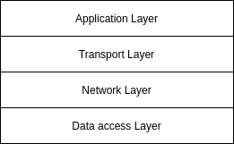

### TCP/IP and OSI model

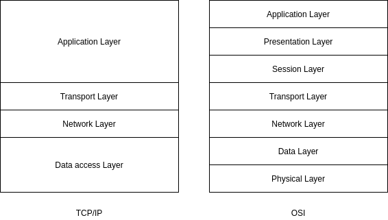

### Data packets

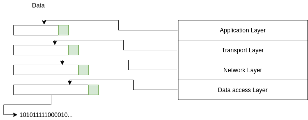

**Simplified TCP/IP**

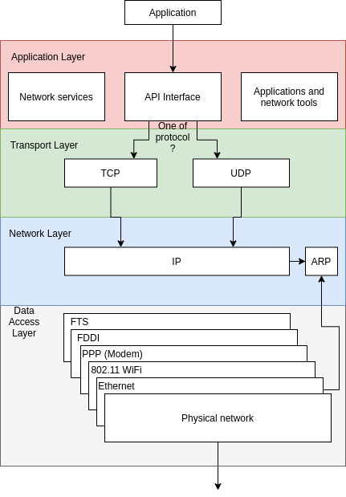

***

**What is the main advantages of modular structure of TCP/IP protocols?**

- Thanks of modular structure TCP/IP can be easily adapt to specific device or OS.
- Each system layer can be modified independently.

**What is a purpose of Data Access Layer?**

- Offer services specific to physical network layer, including preparing, sending and receiving 
frames from transmission medium (like Ethernet cable). 

**Which Layer from OSI model corresponds to network layer in TCP/IP model?**

- Network Layer from TCP/IP model corresponds to Network Layer in OSI model.

**Why header added to data in each TCP/IP model layer?**

- Headers added in source computer as in each layer in destination computer there are information needed to process 
those incoming data.

***

- Which 2 layers OSI model corresponds data access layer in TCP/IP?
    - Data Access, Physical Layers.
- Which layer in TCP/IP model is responsible for sending data from one network to another?
    - Network Layer.
- What are advantages and disadvantages of UDP over TCP protocol?
    -  UDP is simpler than TCP, but it does not contains transmission error detection and data control.
- What is data encapsulation in model layer?
    - Adding some data to headers specific to layer before carry over to another layer.
    
***

- Exchange operations executed in each TCP/IP model layer:
    - **Access Layer:** Contains procedures support physical access to network.
    - **Network Layer:** Contains procedures to logical data addressation, and datagrams routes.
    - **Transport Layer:** Contains procedures to transmission error detection, flow control and 
    data acknowledgement.
    - **Application Layer:** 
        - Contain tools to network diagnostics, to send files to remote devices control and other network operations. 
        - This Layer contains API interfaces that allows program that works in OS use network.
- Exchange layers, in which datagrams are created:
    - In Transport and Network Layer.
- How can TCP/IP standard adapted to new versions of network cards:
    - Only network layer should be adapted.
- What reliable data transmission using TCP protocol means:                   
    - Means that TCP protocol used, that allows detects errors in data transmission and receiving 
    acknowledgement if possible.

***

- ARP (Address Resolution Protocol): Protocol binds logical addresses with physical addresses.
- Datagram: Data packet transfer between Network Layer and Access Layer or packet processed by UDP protocol
in network and transport layer.
- IP (Internet Protocol): Network layer protocol implementing logical data addresses and routing.
- Statement: 
    - Data packet transmitted between application layer and transport layer. 
    - Data chunk send over network from one device to another.
- Header: Information added to data packets in each system layer.
- Frame: Data packet created in Access Layer.
- Segment: Data packet created by using TCP protocol in transport and network layers.
- TCP: Reliables, connectionless transport layer protocol.
- UDP: Connectionless transport level protocol, does not provide reliable data transfer.
- Application Layer: Layer that controls network applications, interface for OS.
- Data Access Layer: Interface of physical network.
- Network Layer: Logical data addressing and routing.
- Transport Layer: 
    - Data transmission errors detected and data acknowledged. 
    - Interface for network applications.

## Data Access Layer

**What kind of services defined in data access layer?**

- Services and specifications connected to maintaining access to physical network.

**Which OSI layer corresponds to data access in TCP/IP model?**

- Data Layer, Physical Layer

**Which LAN technology is most popular?**

- Ethernet, in wireless WiFi.

**What CSMA/CD means?**

- CSMA/CD means co-sharing access to transmission medium with collision detection. 
- Used in Ethernet.
- Computers connected to network waits for proper moment to send data, if 2 computers send data simultaneously
then transmission stopped, wait random number of time and then retry transmission. 

***

- What CRC means?
    - Cyclic Redundancy Check is a control sum used to check whether data in frame was not corrupted
    during data transfer.
- Describe collision detection in Ethernet?
    - Collision occurs when two computers send data at the same time. 
    - When computers states that  collision occured, that means collision detected.
- What is a size of physical address field in Ethernet frame?
    - 48 bits.
- What is a role of ARP protocol?
    - Is used to bind physical addresses with logical addresses.
    
***

- Exchange two protocols that binds physical with addresses with IP addresses.
    - ARP and RARP.
- Exchange three network technologies.
    - Ethernet, 801.11 (WiFi), 802.16 (WiMax)
- Describe function MAC and LLC layers in OSI model.
    - MAC layer handle network layer. 
    - In LCC layer error in frames received from network detected and connection between devices supported. 

***

- **MAC Address:** 
    - Address that identifies network card. 
    - In case of Ethernet address is binded to card at production step, in modern network card there is possibility 
    to configure this address.
- **CRC:** 
    - Control sum used to verify valid data in frame.
- **CSMA/CD:** 
    - Medium access method used in Ethernet technology.
- **Ethernet:** 
    - Popular technology in LAN network, use CSMA/CD method to medium access.
- **FCS (Frame Check Sequence):** 
    - Field in Ethernet frame that contains CRC used to verify validity of data.
- **LLC (Logical Link Control):** 
    - Sublayer in data link layer in OSI model, responsible for detecting errors in transmission and maintaining 
    connections between network devices.
- **MAC:** 
    - Sublayer in data link layer in OSI model, used to support network card.
- **Access Control:** 
    - Procedures that describes access to transmission medium.
- **Preamble:** 
    - Bits sequence indicating start of frame.
- **Network Technology:** 
    - Network physical specification, that include medium access methods, data frame  format and type of cable.
- **Physical Layer:** 
    - First layer in OSI model, is used to process data frame into sequence of bits adapted to transmit over medium (cable).
- **Data Link Layer:** 
    - Second layer of OSI model.
 
## Network Layer

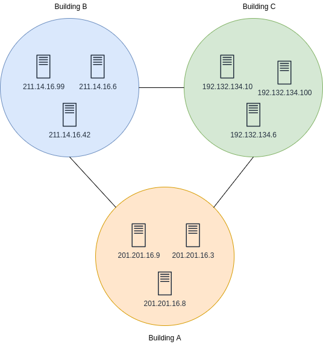

| Class | Binary address start | First octet range | Disabled Address range |
|---|---|---|---|
| A | 0 | 0 to 127 | 10.0.0.0 to 10.255.255.255 / 127.0.0.0 to 127.255.255.255 |
| B | 10 | 128 to 191 | 127.16.0.0 to 127.31.255.255 |
| C | 110 | 192 to 223 | 192.168.0.0 to 192.168.255.255 |

**What data format is used to simplify 32-bit binary IP address?**

- Decimal format.

**What info about IP address delivers ARP protocol?**

- About assigned to it physical address (MAC).

**What statement sends router to source computer, when receive to much data?**

- *Source Quench*

**To which IP class belongs address with 3 first bits 110?**

- C Class

***

- What is a role of TTL field in IP header?
    - Is used to calculate routers before remove IP datagram. 
    - Purpose is to avoid processing data in infinite loop inside network.
- What size have `network` id and host id in A Class address?
    - Network `8 bits`, host 24 bits.
- What it is octet?
    - Is 8 bits of data (byte).
- What is IP address?
    - Is used to identify computer interfaces or network devices.
- What is difference between ARP and RARP protocol?
    - ARP assigns IP address with physical address. 
    - RARP assigns physical addresses with IP addresses.
    
***

| 128 | 64 | 32 | 16 | 8 | 4 | 2 | 1 | Res |
|---|---|---|---|---|---|---|---|---|
| 0 | 0 | 1 | 0 | 1 | 0 | 1 | 1 | 43 |
| 0 | 1 | 0 | 1 | 0 | 0 | 1 | 0 | 82 |
| 1 | 1 | 0 | 1 | 0 | 1 | 1 | 0 | 214 |
| 1 | 0 | 1 | 1 | 0 | 1 | 1 | 1 | 183 |
| 0 | 1 | 0 | 0 | 1 | 0 | 1 | 0 | 74 |
| 0 | 1 | 0 | 1 | 1 | 1 | 0 | 1 | 93 |
| 1 | 0 | 0 | 0 | 1 | 1 | 0 | 1 | 141 | 
| 1 | 1 | 0 | 1 | 1 | 1 | 1 | 0 | 222 |

**Dec to Bin**

| Num | Res | Reminder | Bin |
|---|---|---|---|
| 238 / 2 | 119 | 1 | 0 |
| 119 / 2 | 59 | 1 | 1 |
| 59 / 2 | 29 | 1 | 1 |
| 29 / 2 | 14 | 1 | 1 |
| 14 / 2 | 7 | 0 | 0 |
| 7 / 2 | 3 | 1 | 1 |
| 3 / 2 | 1 | 1 | 1 |
| 1 / 2 | 0 | 1 | 1 |

| 128 | 64 | 32 | 16 | 8 | 4 | 2 | 1 | Res |
|---|---|---|---|---|---|---|---|---|
| 1 | 1 | 1 | 0 | 1 | 1 | 1 | 0 | 238 |

***

- **ARP:** 
    - Is used to ge physical address corresponding to IP address. 
    - Protocol used to create address IP and physical addresses table pair.
- **BOOTP:** 
    - Protocol used to load computer or other network device operating system from a different computer.
- **Decimal format with dot:** 
    - Format used in IP addresses represents four octetc decimal number separated by dots (209.121.131.14).
- **ICMP:** 
    - Used in a router to send to source computers information about problem with sending data.
    - Used in `ping` command to check status of chosen computer in a network.
- **Host id:** 
    - Part of IP address that identifies computer in network.
- **Network ID:** 
    - Part of IP address that identifies network.
- **IP:** 
    - Network layer protocol, used to process IP addresses, sending data and laying out transmission paths.
- **Address Class:** 
    - System to qualify IP addresses. Defines way to separate IP address to host and network id.
- **Multicast:** 
    - Technique to simultaneous sending datagrams to specified group of computers.
- **Octet:** 
    - Eight bits binary number.
- **Sub network:** 
    - Logical part of address space in TCP/IP standard.
- **RARP** 
    - Protocol used to determine a computer IP address based on physical address. 
    - Used in computer without disks, in which OS loaded from different computer used software saved in memory 
    PROM network card.

***

## Sub-networks CIDR

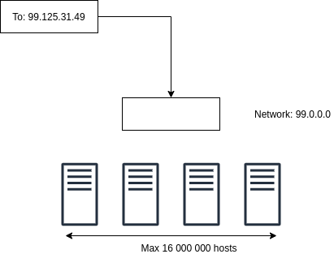 

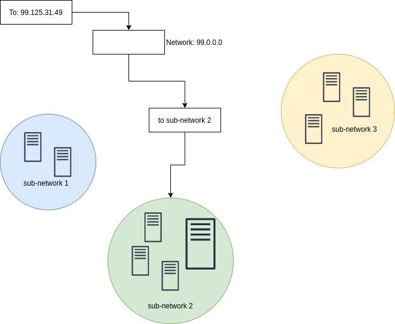 

**Address IP / subnetwork mask pair**

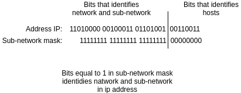 

**Class and Class less network bits allocation**

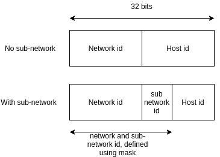 

**Datagram send in network separated by sub-networks**

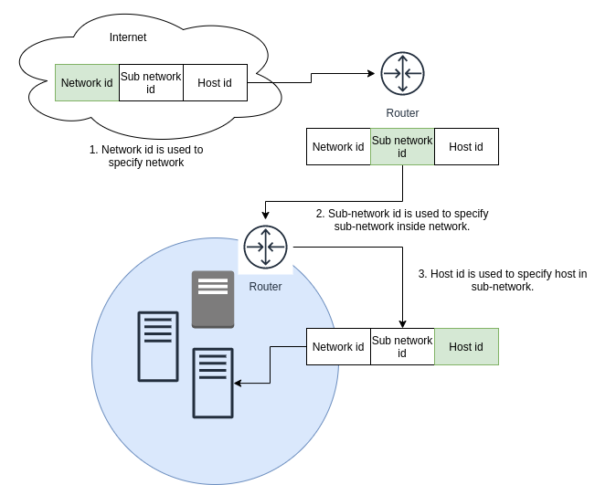 

**Sub Network C Class**

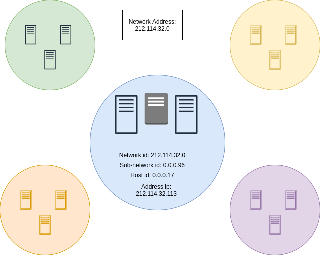 

***

**What length in bits has sub-network identifier in address B class with mask 255.255.0.0**

- 0 bits we are not able to create sub-network id. 
- Mask `255.255.0.0` is default mast for class B.
- Network identifier occupies all 16 bits, and we cannot create sub-net identifier.

**Administrator decided that mask will contains of 21 bits. What is a decimal format of this mask?**

- `11111111 11111111 11111000 00000000 = 255.255.248.0`

**B class network separated by 10 localizations 12 components each. What mask will be needed to
address all computers?**

- In mask `255.255.255.240` there are 4 bits to identify host, which are enough to address all users.

**Administrator needs three bits to separate addresses in class A on sub-networks. Which mask should be
used?**

- Three first bits of second octets are 128 + 64 + 32 = 224. Mask should be `255.224.0.0`.

**What is a range of IP addresses with CIDR 212.100.192.0/20?**

- First address has format: `11010100.01100100.11000000.00000000`
- Last address has format: `11010100.01100100.11001111.11111111`
- Answer: `212.100.192.0` to `212.100.207.255`

***

- From where we get bits that identifies sub-network?
    - Are taken from host identifier.
- Why separate network on sub-networks is not as essential as before?
    - Because separation on sub-networks is defined in CIDR addressing.
- What classless in CIDR addressing means?
    - Means that traditional classes (A, B, C and D) are not in use, as CIDR prefix replaces them. 
- How many hosts addresses we can create with mask /26?
    - `2 ^ 6 - 2 = 62` host addresses. 
    - 32 - 26 = 6, 6 bits identified minus 2 (broadcast 0 and 255)
- What is a term used to describe couple of smaller sub-network into larger network?
    - Creating supernetwork.

***

- Describe with CIDR notation ip range from `180.4.0.0` to `180.7.255.255`.
    - `180.4.0.0/14`
- How many hosts we can define in sub-network od IP 192.100.50.192 and mask 255.255.255.224.
    -   Sub-network identifier consists of 3 bits, so host identifier is 5 bits. 2^5 - 2 = 30 addresses.
- How many subnetworks we can define with address and mask from previous point?
    - Sub-network identifier consists of 3 bits. 2 ^ 3 - 2 = 6.  
- What is the first address of host in sub-network 195.50.100.0/23.
    - `195.50.100.1`
- What is the last address of host in sub-network 195.50.100.0/23.        
    - `195.50.101.254`
    
***

- **CIDR:** Technique allows to define sub-network block creating one whole.
- **Sub-network mask:** 32 bits binary value in which couple of hosts bits used to identify sub-network.
- **Super-network mask:** 32 bits binary value, that groups couple sub-network id in one whole.
- **Sub-network:** logical part of address space defined by network identifier.    

## Transport Layer

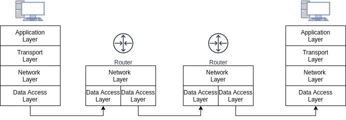

**Why in data transfer multiplexing and demultiplexing is required?**

- Without data multiplexing and demultiplexing from software that needs data transmission only one
application at a time can use, and from application running on a server only one client.

**Why programmers sometimes use UDP, instead of TCP?**

- Price for data reliability is lower performance. 
- In case when data flow function or error detections not required UDP is better choice as its allow faster data transmission.

**Why on Telnet or FTP application, where interactive sessions used TCP over UDP?**

- TCP offers function of flow control and error detection which are crucial to start interactive sessions.

**Why administrator use firewalls to block access from internet to ports used by TCP or UDP?**

- Firewall blocks access to specified port for user from an internet. 
- Moreover, can block access users from LAN network to some service over internet.

**Why routers do not use TCP to send ACK to computers that initiates connections?**

- Routers work on Network Layer, so they not process any data connected to TCP protocol.

**In which state is port in FTP server, open passive, open active or closed?**

- Port in FTP server is in state open passive, as it is adapted to receive request open connections.

**Why in so called triple hand shake third operation is required?**

- After two first operations computers know each others ISN numbers, so theoretically have information needed 
to start connection. 
- However, computer which in second operation send their ISN number did not receive acknowledge. 
- So third operation in to send acknowledge of receiving ISN number.

**Which fields from UDP header are optional and why?**

- Source port is optional, as UDP is connectionless protocol, so software from destination computer do not have to use that. 
- Source port number is send in case when destination application use that to detect transmission errors and data 
validity verification.

**What happen when all bits from field containing source port will have value of 0?**

- Application on destination computer will not be able to send ack to source computer.

***

- Which application use TCP protocol on port 25?
    - SMTP
- Which application use protocol UDP on port 53?
    - DNS
- What is max size of message that can be sent using TCP protocol?
    - TCP used to send a stream of bytes without partitioning it to data.
- What is a difference between active and passive state of open port in TCP protocol?
    - Passive open means that app is ready to start connection. 
    - Active open means app sends request starting connection to app working on a different computer.
- What is the min number of operation required to initiate connection by TCP protocol?
    - 3

***

- **ACK:** Control bit means field Acknowledge Number in TCP header has specified value.
- **Active open:** Port state in a device that initiates connection using TCP protocol.
- **Control bit:** Bit that contains special info about TCP segment.
- **Demultiplexing:** Simultaneous sending data from one source to many destination places.
- **FIN:** Control bit means closing connection in TCP protocol.
- **Socket:** Data pair containing computer IP address and port used in working on its app.
- **ISN:** Initial byte sequence number sent by TCP protocol.
- **Multiplexing:** Simultaneous sending data from many sources to one destination.
- **Ack Number:** 
    - Field in TCP header containing sequence number of next sequence which destination computer awaits. 
    - Value indicating that all data segments with number lesser that this number successfully received.
- **Sequence Number:** Unique number of byte data send by using TCP protocol.
- **Passive open:** Port state awaiting on connection by using TCP protocol.
- **Port:** Internal address used to go between transport and app layer.
- **Destination Port:** Number used to deliver segments of TCP and UDP datagrams to a proper application on destination computer.
- **Source Port:** Number used to use by app on source computer TCP segments and UDP datagrams.
- **Cleaning up segments:** Set up received TCP sequences in order which they were sent.
- **Triple handshake:** Three stage operation of initiating connection by using TCP protocol, in which
sequence number synchronized.
- **Connectionless protocol:** Communication protocol in which data sent between computers without initiating connection 
between them.
- **Connection oriented protocol:** Communication protocol in which between two computers connection initiated.
- **Pseudo-header:** Structure with IP header, used to calculate checksum in TCP and UDP protocols, and 
to check whether proper datagram IP was received without changing address.
- **Sliding window:** 
    - Range of numbers indicating number of data in which destination computer is able to receive. 
    - A sliding window is used in TCP protocol to control data flow.
- **Standard ports:** Set up by IANA, ports used in popular apps.
- **Data process streams:** Receiving bytes a real time (bit after bit) not in predefined blocks.
- **SYN:** Control bit indicating sequence number synchronization used in TCP protocol during connection initiation 
in triple handshake.
- **TCP:** Transport protocol in TCP/IP model used to reliable data sent.
- **UDP:** Transport protocol in TCP/IP model not assuring reliable data sent.
- **Firewall:** Device that secure network from unauthorized access from Internet.                       

## Application Layer

**Computer has a role of file server and is connected to network but user cannot access it.**

- There can be couple of reasons. 
- It is worth to check whether on this computer file sharing service enabled.

**Why OSI mode application layer separated on 3 parts (application, presentation and session)?**

- App layer contains wide range of services. 
- Additional layers introduced in OSI model creating more modular structure and help programmers tide up model components. 
- Additional layers allows programmers functions allow using network by applications.

***

- By using which tool can we check network connection?
    - `ping`
- Which protocol of app layer used to send internet website?
    - `HTTP`
- What two apps layers protocol used to receiving e-mail messages?
    - `POP3`, `IMAP`
- What protocol used to bind host name with IP?
    - `DNS`
- Which protocol used to synchronize computer clock?
    - `NTP` (Network Time Protocol)             

***

- **API:** Set of components that allows use in app different features of operating system. 
- **Readresator:** Service checking availability of requested resource in local system, if needed
sending request to other computer in a network.
- **Sockets:** API interface developed by BDX Unix that allows use TCP/IP protocol in apps.
- **File sharing service:** Service handles saving or reading files on disk.
- **Printing service:** Service handle printing request.

## Routing

**Why in a computer that should be used as router, IP datagrams sending capabilities must be configured?**

- Router adapted to receiving datagrams which destination addresses are different from its own.
- Usually software that implements TCP/IP standard in computer rejects datagrams addressed to different computers.
- IP Datagrams transfer relies on receiving them, processing included information and transfer to different networks.

**Why in a large network, better option is link state data transfer?**

- Distance Vector routing is ineffective in a network that contains of many routers, as each router need to create a
table containing routes to all destination networks. 
- Routing data modified in each router. 
- Moreover, routers must transfer whole routing tables between each other, even if most of including data not used.

**What External router used for?**

- Main goal is to exchange data between other routers about autonomous systems. 
- Thanks transfer this task  to special routers we can avoid using other routers in autonomous system to boring routes 
to different network segments.

**Why in RIP protocol there is 15 hop route limit?**

- If number of hops will be too large, they would be a problem long term creating routing tables by routers.

***

- What are two types of dynamic routing?
    - Distance Vector
    - Link State
- Why router must be provided with couple of network cards?
    - Router used to send packets between two or more segments of network, for each segment they need to
    be different network interface.
- What is the most popular protocol used in external routers?
    - BGP (Border Gateway Protocol)
- Why classless routing is more efficient than classical routing?
    - Couple of entries in routing table can be aggregated to one entry, and sub-network into super-network.
- What type of protocol is OSPF?
    - Link State

***

- Name three currently used routing protocols.
    - RIPv2, OSPF, BGP.
- Explain why choosing routes used in OSPF protocol is better than RIP.
    - In OSPF protocol rout cost calculated based on multiple parameters, in RIP cost is number of hops.
- Name advantages and disadvantages of static routing.
    - Is simple but not flexible. 
    - In a large network become very complicated as every change require route modification by system administrator.
    
***

- **BGP:** 
    - Protocol used to transfer data between autonomous systems. 
    - Is used as internal protocol in autonomous system.
- **OSPF (Open Shortest Path First):** Popular internal routing protocol link state type.
- **Routing protocol:**  Protocol used in a router to gather info about networks.
- **IP datagrams sending:** Process transfers IP datagrams between two interfaces of the same device.
- **RIP:** Popular internal routing protocol, distance vector type.
- **Internal Router:** Router is part of autonomous system and exchanging data about routes with other
routers in the same system.
- **External Router:** Router being part of autonomous system and sending data about routes to other autonomous
systems.
- **SPT (Shortest Path Tree):** Tree like network map created by OSPF protocol.
- **Autonomous system:** Sub-network being part of larger network, managed by independent authority.
- **Dynamic Routing:** Method that creates routing tables based of information received from other routers based
on routing protocols.
- **Indirect Routing:** Set up routes between two networks, which are not directly connected.
- **Static Routing:** Routing method that requires manual data processing by system administrator about 
routing information.

***

## Connection to network

**LAN devices to switch - switch to router - router to Internet**

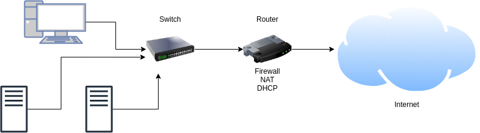

**Why in PPP physical address system, similar to Ethernet, is not required**

- Point to point connection initiated only between two computers connected to opposite end of wire.
- PPP and SLIP fully support logical IP addresses and network layer protocol.

**Why mobile devices required to switch (register) to access points**

- Frames in a conventional network transferred to mobile devices through access points, in which
those devices connected. 
- Devices by switching to specifies which access point will receive frames.

***

**What is the name of most popular protocol used to send IP datagrams through phone line?**

- PPP (Point to Point Protocol).

**Name two broadband wired technologies used in home networks.**

- TV cable and DSL (Digital Subscriber Line).

**Name four technologies used in wide area networks.**

- Frame Relay, HDLC, ISDN, ATM

**What is an other name of wireless network IBSS?**

- *ad hoc*

**What is a difference between hub and switch?**

- Hub create network similar to single shared Ethernet cable, sends all frames to its own ports.
- Switch creates physical address table and send frames only to specified computers.

**What are disadvantages of dial-in connections?**

- Much slower than broadband e.g. DSL or tv cable.
- While dial in phone wire taken, so after dial-in ends connection interrupted. 

***

- **802.11:**
    - Protocol sets used in wireless communication. 
    - Protocol used in data access layer in TCP/IP model, equivalent of data ink and physical layer in OSI model.
- **Bluetooth:** Technology used in communication in low distance.
- **CMTS (Cable Modem Transmition System):** Device being interface between TV cable network and Internet Provider network.
- **Cut-through:** 
    - Method used by a switch to transfer frames. 
    - Fames are transfered as soon as frame fragment containing destination address received.
- **DOCSIS (Data Over Cable Service Interface Specification):** Standard used in TV cable network.
- **DSL (Digital Subscriber Line):** Broadband data transfer technology, use phone cable.
- **DSLAM (Digital Subscriber Line Access Multiplexer):** Device being interface between DSL lines and ISP network.
- **Hub:** 
    - Network device to which devices in LAN network connected. 
    - Hubs do not filter frames, transfer through all their interfaces. 
    - Was replaced by switches.
- **IBSS (Independent Basic Service Set):** Wireless network containing two or more directly connected devices. 
- **BSS Infrastructure:** Wireless network in which devices communicate with each other through one or more access
points to conventional network.
- **Intelligent hub:** Hub executing other operations like blocking interface after connection problem detected.
- **LCP (Link Control Protocol):** Protocol used in PPP to initiate dial-in connection, manage and close it.
- **MIP (Mobile IP):** Method to address mobile device.
- **Modem:** Device that converts analog to digital signal and digital to analog.
- **Bridge:** Physical device using physical addresses to transfer frames.
- **NCP (Network Control Protocol):** Protocol used in PPP and other protocol communication.
- **Point to Point connection:** Connection between two computers using single line.
- **PPP (Point to Point Protocol):** 
    - Used in dial-in connection using TCP/IP standard and other protocol. 
    - PPP is modern and more advanced than SLIP.
- **Switch:** 
    - Network device. 
    - Associates physical addresses with own interface and transfers received frames through proper interfaces.
- **Binding:** Process of registering mobile device to the nearest access point.
- **Access Point:** 
    - Device that connects wireless device with a conventional network. 
    - Is a bridge that transfer frames between wireless network and conventional Ethernet network.
- **SLIP (Serial Line Internet Protocol):** First protocol used in dial-in connections handles TCP/IP standard.
- **Store and forward:** 
    - Method used by a switch to transfer frames. 
    - Frame is transfer after is fully received.
- **WAN (Wide Area Network):** Technology used connect on wide distance.
- **WEP (Wired Equivalent Privacy):** Standard to secure wireless networks, obsolete.
- **WPA2 (Wi-Fi Protected Access II):** 
    - Advanced standard to save wireless networks, replace WEP. 
    - Using AES ciphering protocol.

## Name mapping

**What is Domain Name**

- Is name used to identify a network. 
- Central authority manages it.

**What is hostname**

- Is name given to computer binded with IP address.

**What is FQDN**

- It is hostname and domain name connected with dot, `ftp.helion.pl`.

**What is DNS record**

- Posts in DNS zone system file. 
- Used to identify various types of computers and services.

***

- What record type is used to identify aliases? 
    - CNAME
- Why DS and DNSKEY records are saved on files on different servers?
    - In DNSSEC record DS in master zone is being used to identify and authorize DNSKEY record slave zone.
    - DS record saved in master zone, can be processed by authorized servers, what is necessary to verify
    authentity response on request.

***

- **DDNS (Dynamic DNS):** Technique to bind static computer name with IP address.
- **DNS (Domain Name System):** Mapping computer name in a network.
- **DNSSEC (DNS Security Extensions):** System to verify response authority in DNS query.
- **Domain:** Part of hierarchical name structure in DNS system name.
- **FQDN:** Name containing hostname and domain name.
- **Domain Name:** Name binded to hierarchical part of DNS system structure.
- **Hostname:** Name that identifies computer (host).
- **NetBIOS:** API interface and domain name system developed in IBM, used in Microsoft Windows network.
- **hosts file:** File containing IP address and binded name.
- **LMHotst file:** Dile contains IP addresses and binded names in NetBIOS system.
- **Zone file:** Configuration text file in DNS system.
- **DNS record:** Record in zone file. Used in couple types of records with different destinations.
- **WINS (Windows Internet Name Service):** NetBIOS implementation developed in Microsoft.    

## Security

**What are advantages of state firewall?**

- Thanks capability to monitor state of connection, DoS attacks can be avoided and block wrong packets. 
- Attempt to capture or modify session.

**What is a purpose of DMZ?**

- DMZ is security zone, to which access is easier than to internal network, but harder to Internet.

***

- How proxy server can improve response time?
    - A lot of proxy servers save in their memory pages opened by users. 
    - Technique called memorize content, allow locally handle request to page, which is much faster than download page 
    from an internet.
- Why often software updates are important?
    - A lot of software has some hidden bugs witch are regularly fixed.
- Why in scripts it is required to check type and length of input data?
    - Is to avoid attack to overflow buffer with special char sequence, which can result in unpredictable and
    often dangerous function of program.
    
***

- **Dos Attack:** Attack to overflow system by use all its resource.
- **Admin access:** Access with wide privileges, give unlimited control over system.
- **Packet Filter:** Firewall that filters packet based on port numbers and other information about its destination.
- **Trojan Horse:** -Program looks safe but executes harmful tasks.
- **Reverse Proxy Server:** Device or app that process incoming request from Internet and send them to internal servers.
- **Phishing:** Attempt to force user to open harmful link.
- **Session Hijacking:** Method to send based on existing TCP connection harmful packets.
- **Buffer Overflow:** Method to overflow memory buffer used by application.
- **Rootkit:** Tool set used by hackers to take over and advance control over system.
- **Proxy Server:** Device or app that process requests sent by a client.
- **DMZ zone:** Zone between two firewalls, first from Internet second to internal network.
- **Firewall:** Device or app that limits access to internal network.
- **State Firewall:** Firewall that monitors connection state.

## Configuration

**How PC after start communicate with DHCP?**

- By sending and receiving broadcast data.

**How NAT increase network safety?**

- Local address IP are not connected to internet address and cannot be used in a network.
- Hacker from outside network cannot connect to local network. 

***

- What should be done to user computer could gain IP address from DHCP server from a different network?
    - Use intermediary DHCP agent.
- What kind of records mainly used in DNS-SD?
    - - PTR record to create instances lists and SRV records to gain hostnames and port number used by service.
    TXT record contains additional info about service.
    
***    

- **APIPA (Automatic Private IP Addressing):** Technique to sign local addresses used in some Windows OS versions.
- **BOOTP:** Protocol used to sign addresses for computers without hard drive.
- **DHCP (Dynamic Host Configuration Protocol):** Protocol to dynamically sign IP addresses.
- **DNS-SD (DNC Service Discovery):** Method used to discover services in automatically configured systems.
- **DHCP client:** Computer that receives dynamic IP address by DHCP protocol.
- **LLMNR (Link-Local Multicast Name Resolution):** Alternative method to DNS, developed in Microsoft.
- **Local link addressing:** Method to automatically bind IP addresses.
- **Multicast DNS:** Technique to map names without DNS server and hosts file. 
- **DHCP Server:** Computer allocating users computers TCP/IP configuration settings by using DHCP protocol.
- **SSDP (Simple Service Discovery Protocol):** 
    - Method used to discovery services based on HTTP protocol, not DNS service. 
    - Is connected to UPnP.
- **Zeroconf:** Protocol sets that allows an automatic configuration of TCP/IP settings.

## IPv6

**What are advantages to add additional information in extension header, and not in a basic header?**

- Extension header used only when in packet additional information have to be put. 
- More of extension headers used in routers, thanks sending packet not delayed.

**In what way IPv6 protocol improve app functionality, which has to work at real time like video conference?**

- Fields *movement class* and *mark stream* in IPv6 header contains information about type and priority of
data.

***

- Why multicast is more effective than broadcast?
    - Broadcast reach all computers in network even not interested. 
    - Multicast is bounded to specific group in a network.
- Why automatic configuration functionality from IPv6 protocol is more reliable than Zeroconf from IPv4 protocol?
    - Creating logical address based on physical MAC address. 
    - Before computer binds itself automatically configured address checks whether address is in use. 
    - Limits probability of address collisions.
- Which prefix IPv6 address reserved for 6to4 tunnel?
    - 2002::/16
  
***

- **6in4:** Method for creating tunnels that requires static configuration devices on both ends.
- **6to4:** Method for creating tunnels in which IPv4 address placed inside IPv6 address.
- **Anycast:** Method that sends packets to nearest or the best destination.
- **IPv6:** IP standard, contains 128 bits.
- **MTU (Maximum Transmission Unit):** Max packet, that router can transfer.
- **MTU routes:** 
    - The smallest value of MTU parameters in all routers on the route to destination computer. 
    - It is max size of packet in which you can send through route.
- **Multicast:** Method to send messages to computer groups in part of network.
- **Streams mark:** Mark IPv6 packets that require special treatment (like send in real time).
- **Jumbo packet:** 
    - Packet that contains more than `65 535` bytes of data. 
    - IPv6 allows to send this types of packets through network.
- **IPv6 tunnel:** Connection that allows sending IPv6 packets through IPv4 network.
- **Neighbors discovery:** Process to bind IPv6 addresses with physical address (MAC).

***

## Tools

**Which command used to show routes which packets follow?**

- `traceroute`

**How to check how many packets received from Internet lost?**

- `netstat`

**How to check whether my computer can connect to computer with IP address 192.168.1.18?**

- `ping`

**How to check routing table?**

- `route`

**Which transport protocol and which port numbers used in SNMP protocol?**

- UDP and port 161. 
- Port 162 used to send trap messages.

**What is a name of message sent by SNMP agent at a time of events occurrence?**

- Trap.

**Which TCP/IP model layer is handled by RMON 1 protocol?**

- Data Access Layer.

**Which TCP/IP model layer is handled by RMON 2 protocol?**

- All Layers.

**To monitor cyclic changes of network load, which protocol should be used? SNMP or RMON.**

- SNMP to monitor devices, RMON read data directly from network medium. 
- RMON is better choice.

***

- While surfing over internet pages suddenly stop work. Which tool should be used to diagnose problem?
    - `ping`
- Which command used to show content of ARP table?
    - `arp -a` (in Unix `arp -g`).
- How can you check in which hosts your computer connected through TCP protocol?
    - `netstat -p tcp`
- Some version of `route` tool do not show routing tables. Which other tool can be used?
    - `netstat -r`
- Why you should use SSH over Telnet?
    - SSH allows cipher and other methods of protecting data, is more secure than Telnet.
    
***

- **Agent:** 
    - Software that works on monitored devices, it saves in MIB base info about state of monitored device and 
    reply using SNMP protocol to monitor requests. 
    - Can send info to monitor when detect a problem.
- **arp:** Tool that allows show and modify content of ARP table.
- **Broadcast storm:** Large number of packets send by for example damaged network card.
- **hostname:** Tool displays computer name.
- **ifconfig:** Tools displays TCP/IP configuration in Linux/Unix systems.
- **MIB (Management Information Base):** 
    - Hierarchical data base used by agent and SNMP monitor. 
    - Parameters of monitored device saved inside data base. 
    - Data identified by addresses containing level of hierarchy.
- **Social name:** Name added to network or devices monitored using SNMP protocol.
- **netstat:** Tool displays statistics and information about TCP/IP protocol.
- **ping:** Diagnostic tool used to check communication between computers.
- **shell:** OS interface, allows type commands.
- **Trap:** 
    - Message send through SNMP protocol by an agent. 
    - Informs about events.                     
- **rcp:** Tool to send files.
- **rexec:** Tools used to send commands to external computer.
- **rlogin:** Tool to login to external computer.
- **RMON (Remote Monitoring):** Part of SNMP protocol that offers additional functions.
- **route:** Tool to display and modify routing tables.
- **rsh:** Tool to send command to external computer.
- **rwho:** Tool to display info about currently connected computers to system.
- **SNMP (Simple Network Management Protocol):** Protocol to manage devices through network.
- **probe:** Other name of agent, use in context of RMON.
- **SSH (Secure Shell):** Tool set creates save and cipher shell.
- **Telnet:** Protocol to connect to external devices, replaced by SSH.
- **traceroute:** Tool displays packet routes to destination.
- **tracert:** Traceroute equivalent in Windows OS.
- **Safe access:** Secure system, administrator marks users or hosts as trusted, have access to local system.

***

## Classical services

**What is default mode to send files over FTP protocol?**

- Text

**Which commands cannot use anonymous user logged in FTP server?**

- `put, mkdir, rmdir, mput` are blocked.

**What is basic function of LDAP protocol in modern networks?**

- LDAP displays data folders about users and network resources based on TCP/IP standard.

***

- What is a difference between `put` and `mput`?
    - `put` allows sending 1 file at time, `mput` multiple files at the same time.
- Can TFTP protocol can display files and directories list?
    - No, use only to send files.
- Which protocol to share files is use in Samba software in Unix/Linux systems?
    - Samba was created to improve cooperation between Linux/Unix and Windows systems. 
    - Is open software that handles SMB protocol used in Windows. 
    - CISF is open version of SMB protocol. 
    - Samba supports CISF.
    
***

- **CIFS (Common Internet File System):** Open version of SMB protocol to share files developed by Microsoft.
- **DN (Distinguished Name):** 
    - Unique name that identify object in data directory. 
    - Contains RDN name and name of hierarchical level in which object exists.
- **FTP (File Transfer Protocol):** Protocol to send files between computers, create, remove directories and 
displays their content.
- **LDAP (Lightweight Directory Access Protocol):** Protocol allows easy access to directory services.
- **LDIF (LDAP Data Interchange Format):** Human readable format displaying data by LDAP protocol.     
- **NFS (Network File System):** Protocol allows in invisible mode gain access to files on an external computer.
- **RDN (Relative Distinguished Name):** Unique attribute that identifies object in LDAP service.
- **SMB (Server Message Block):** Application layer protocol allows gain access using computer with
Windows OS to printers and files on external computers.
- **TFTP (Trivial File Transfer Protocol):** Protocol based on UDP, used in file transfer process.
- **Directory service:** Service to collect hierarchical data structure about users and resources and to manage
these data.

***

## Internet

**What is a difference between URI and URL?**

- URI is sequence of characters that identifies service in net.
- URL is special case of URI containing service location. 
- In http URL used to identify pages.

**Why in URL address port numbers often skipped?**

- Popular services use predefined well-known port numbers. 

***

- What is difference between networks layer 1 and 2?
    - 1 Tier network operator agrees to not charge data send through their network.
    - Tier 2 operators can have similar agreements or make some fees to Tier 1 operators.  
- What is use of **schema** part in URL address?
    - Specify data format contains information about protocol and service.
- Where in URL address is **schema** part?
    - In the beginning part of URL before `:` sign.
- What are 4 most popular schemas used in an internet?
    - `http`, `https`, `ftp`, `file`, `mailto` and `pop`.
- What file sent by default from WWW server, when in URL address no file name specified?
    - `index.html`
    
***

- **IXP (Internet Exchange Point):** Place when Tier 1 and Tier 2 connects.
- **Subject:** Part of URL address specifies host, user and port.
- **POP (Point of Presence):** Place where ISP operator give share users network.   
- **Schema:** Part of URL address that identifies protocol or system processing remaining part of address.
- **Tier 1 network:** Large network core of Internet, sends data based of agreement signed between operators.
- **Tier 2 network:** Middle network in Internet structure, in which operator by free or not send data
based of agreement signed with other operators.
- **Tier 3 network:** 
    - Network which operator buys from other operators access to internet and sell it to companies or individual users.
    - A lot of this type of network belongs to ISP.
- **URI (Uniform Resource Identifier):** Char sequences that identifies service in an internet.
- **URL (Uniform Resource Locator):** 
    - Specific character of URI identifier that localize the service. 
    - Is commonly used to identify WWW pages.          

### WWW, HTML and HTTP

- **CGI (Common Gateway Interface):** API allows page creator integrate a page with scripts and programs.
- **Semantic network:** Technology set that allows put on page informations that describes meaning contents.

### WWW services

- What is a difference between peer-to-peer and normal network?
    - In P2P every computer can be client and server simultaneously.
- What is XML schema?
    - Describes data structure. 
    - Is used to define XSD file defined by W3C.
- What is a difference between PUT and POST in HTTP protocol?
    -  PUT replaces resource, wheras POST send to server information to actualize resource.                
- Why in REST architecture PUT command is favored?
    - PUT is idempotent, result of use is always the same regardles how many time used. 
    - POST is not idempotent.
- Why some claims that REST architecture is more secure than other architectures in WWW services?
    - Communication interface does not show any operation executed on server.
    
***

- **Peer-to-peer (P2P):** Method to initiate direct connections between Internet users to share files.
- **REST (Representational State Transfer):** Architecture that allows creating easy, portable WWW applications.
- **SOAP (Simple Object Access Protocol):** Protocol to send messages in WWW apps.
- **WSDL (Web Services Description Language):** Language to describe network services based on XML.
    
***    
    
## Ciphering and Data Integrity
    
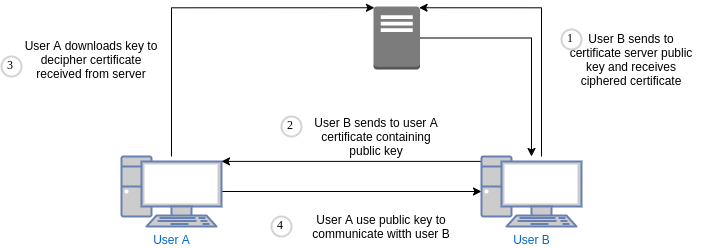

- What will happen when hacker impersonate Kerberos system client and initiate send session id to wrong server?
    - Session ID is ciphered by long-term key. 
    - When hacker will not have access to key will not be able to send wrong id.
- What is a difference between session cookie and persistent cookie?
    - Session cookie has no expiration period, is stored till session closed.
    - Persistent cookie stored during all validity period and can contain info about users that visit page.
    
***

- **AES (Advanced Encryption Standard):** Symmetric algorithm to cipher data use key lengths 128, 192 and 256 bits.
- **Blowfish:** Symmetric encryption algorithm, uses 488 bits key lengths.
- **CA (Certificate Authority):** Office that handles creation and sending certificates.
- **Digital certificate:** Encrypted data used to send public key.
- **Cookie:** Char sequence send in http header, contains information about visited page.
- **DES (Data Encryption Standard):** Symmetric cipher algorithm, use short 56 bits key, not secure.
- **DNT (Do not Track):** HTTP header contains user request to not follow his activity.
- **IPsec (IP Security):** Safety protocol system set, extension on IP protocol.
- **KDC (Key Distribution Center):** Server manages sending key process in Kerberos system.
- **Kerberos:** Authentication system allow secure access to service through unsecure network.
- **Private Key:** Secret key used to asymmetric data ciphering, send over network.
- **Public Key:** Key used to assymetric data ciphering, send over network.     
- **Ciphering Key:** Data (secret) used to ciphering and deciphering data.
- **Digital signature:** Ciphered sequence of chars used to identify a sender and data integrity.
- **Anonymous network:** Network that allows anonymous use by hide source of messages.
- **SSL (Secure Socket Layer):** Protocol to safety send data use TCP protocol.
- **Asymmetric ciphering:** Technique to protect data, use to keys one to cipher one to decipher.
- **Symmetric ciphering:** Technique in which to cipher and decipher single key used.
- **TLS (Transport Level Security):** Protocol to safety send data.
- **TOR:** Popular tool to anonymously surf internet.
- **X.509:** Standard defines process of creating certificate and format.
- **External cookie:** Cookie containing information about domain other than page domain in which cookie linked.
