# Postgres.

## 1. SQL Statements.

**Add data.**

```sql
INSERT INTO
  cities(name, lat, lng, country, iso3, population)
VALUES
  ('San Francisco', 37.7, 122.4, 'United States', 'USA', 883305);
```

**Read data.**

```sql
SELECT name FROM cities;
```

**Update data.**

```sql
UPDATE 
  cities
SET
  population = 19354921
WHERE
  name = 'New York';
```

**Delete data.**

```sql
DELETE FROM
  cities
WHERE
  id = 300;
```

**Challenges of Postgres.**

- Writing efficient queries to retrieve information.
- Designing the schema, or structure, of the database.
- Understanding when to use advanced features.
- Managing the database in a production environment.

**Database Design Process.**

- What kind of thing are we storing?
  - We are storing the list of **cities**.
    - We should create a **table** called **'cities'**.
- What properties does this thing have?
  - Each city has a **name**, **country**, **population**, and **area**.
    - The table should have **columns** of name, country, population, area.
- What type of data does each of those properties contain?
  - `name` -> string.
  - `country` -> string.
  - `population` -> number.
  - `area` -> number.
    - Each **column** should indicate the type of data that it is going to store.

**Table.**

- Collection of records.

**Columns.**

- Each column records one property about a thing.

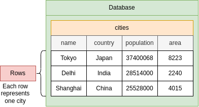

### Analyzing Create Table.

**Creating Tables.**

```sql
CREATE TABLE cities (
    name VARCHAR(50),
    country VARCHAR(50),
    population INTEGER,
    area INTEGER
);
```

**Keywords.**

- Tell the database that we want to do something. 
- Always written out in capital letters.
- `CREATE TABLE`.

**Identifiers.**

- Tell the database what thing we want to act on. 
- Always written out in lower case letters.
- `cities`.

**Column Data Types.**

- `VARCHAR(50)`: 
  - Variable length character. 
  - Text! If we put in a string longer than 50 characters, we'll get an error.
- `INTEGER`: 
  - Number without a decimal. 
  - -2,147,438,647 to +2,147,483,647. 
  - Anything larger or smaller = error!

### Inserting data into a Table.

```sql
INSERT INTO cities (name, country, population, area)
VALUES ('Tokyo', 'Japan', 38505000, 8223);
```

```sql
INSERT INTO cities (name, country, population, area)
VALUES 
    ('Dehli', 'India', 28125000, 2240),
    ('Shanghai', 'China', 22125000, 4015),
    ('Sao Paulo', 'Brazil', 2093500, 3043);
```

### Retrieving data with SELECT.

```sql
SELECT * FROM cities;
```

```sql
SELECT name, country FROM cities;
```

**Create, Insert, and Select.**

```sql
CREATE TABLE movies (
    title VARCHAR(60),
    box_office INTEGER
);

INSERT INTO movies (title, box_office)
VALUES 
    ('The Avengers', 1500000000),
    ('Batman v Superman', 873000000);
    
SELECT title, box_office FROM movies;
```

### Calculated Columns.

- SQL is not just about pulling raw data out of a table.
- We can write SQL to transform or process data before we receive it.

```sql
SELECT name, population / area AS population_density 
FROM cities;
```

**Write a query that will select the name of each phone and calculate the total revenue for each phone (price X units_sold).
Rename this calculated column to revenue.**

```sql
SELECT name, price * units_sold AS revenue FROM phones;
```

### String Operators and Functions.

- `||` - Join two strings.
- `CONCAT()` - Join two strings.
- `LOWER()` - Gives a lower case string.
- `LENGTH()` - Gives number of characters in a string.
- `UPPER()` - Gives an upper case string.

```sql
SELECT name || ', ' || country AS location FROM cities;
```

```sql
SELECT CONCAT(name, ', ', country) AS location FROM cities;
```

```sql
SELECT CONCAT(UPPER(name), ', ', UPPER(country)) AS location FROM cities;
```

## 2. Filtering Records.

### Filtering Rows with "WHERE"

```sql
SELECT name, area FROM cities WHERE area > 4000;
```

```
SELECT name   FROM cities   WHERE area > 4000
-----------   -----------   -----------------
   Third          First           Second
```

```sql
SELECT name, area FROM cities WHERE area != 8223;

SELECT name, area FROM cities WHERE area <> 8223;

SELECT name, area FROM cities WHERE area BETWEEN 2000 AND 4000;

SELECT name, area FROM cities WHERE name IN ('Dehli', 'Shanghai');

SELECT name, area FROM cities WHERE area NOT IN (3043, 8223) OR name = 'Dehli' OR name = 'Tokyo';
```

**Ex 3: Write a query that will print the name and price of all phones that sold greater than 5000 units.**

```sql
SELECT name, price FROM phones WHERE units_sold > 5000;
```

**Ex 4: Write a query that will select the name and manufacturer for all phones created by Apple or Samsung.**

```sql
SELECT name, manufacturer 
FROM phones 
WHERE manufacturer = 'Apple' OR manufacturer = 'Samsung';

SELECT name, manufacturer 
FROM phones 
WHERE manufacturer IN ('Apple', 'Samsung');
```

### Calculations in "WHERE".

```sql
SELECT 
  name, 
  population / area AS population_density 
FROM 
  cities 
WHERE 
  population / area  > 6000;
```

**Ex 5: Write a query that will print the name and total_revenue of all phones with a total_revenue greater than 1,000,000.**

```sql
SELECT 
  name, 
  price * units_sold AS total_revenue 
FROM 
  phones 
WHERE 
  price * units_sold > 1000000;
```

### Updating Rows.

```sql
UPDATE cities 
SET population = 39505000 
WHERE name = 'Tokyo';
```

### Deleting Rows.

```sql
DELETE FROM cities 
WHERE name = 'Tokyo';
```

**Ex 6: Write two separate queries.**

- The first query should update the units_sold of the phone with name N8 to 8543.
- The second query should select all rows and columns of the phones table.

```sql
-- Write query here to update the 'units_sold' of the phone with name 'N8' to 8543

UPDATE phones 
SET units_sold = 8543 
WHERE name = 'N8';

-- Write query here to select all rows and columns of the 'phones' table

SELECT * FROM phones;
```

**Ex 7: Write two separate queries.**

- The first query should delete all phones that were created by Samsung.
- The second query should select all rows and columns of the phones table.

```sql
-- Write your delete SQL here

DELETE FROM phones 
WHERE manufacturer = 'Samsung';

-- Write query here to select all rows and columns from phones

SELECT * FROM phones;
```

## 3. Working with Tables.

### Database Design.

**What Tables Should We Make?**

- Common features (like authentication, comments, etc) are frequently build with conventional table names and columns.
- What type of resources exist in your app? Create a separate table for each of these features.
- Features that seem to indicate a relationship of ownership between two types of resources need to be reflected
in our table design.

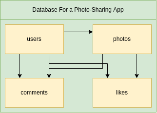

## One-to-Many and Many-to-One Relationships.

- One-to-Many Relationship:
  - A user has many photos.
  - A photos has many comments.
- Many-to-One Relationship:
  - A photo has one user.

**One-to-Many / Many-to-One Relationships**

- Boat (A boat **has many** crew members, A crew member **has one** boat):
  - Crew member.
- School (A school **has many** students, A student **has one** school):
  - Student.
- Company (A company **has many** employee, An employee **has one** company):
  - Employee.

## One-to-One and Many-to-Many Relationships.

- **One-to-One Relationships**:
  - Boats - Captains.
  - Company - CEO.
  - Capitol - Country.
  - Student - Desk.
  - Person - Driver's License.
- **Many-to-Many Relationships**:
  - Students - Classes.
  - Tasks - Engineers.
  - Players - Football Matches.
  - Movies - Actors/Actress.
  - Conference Calls - Employees.

### Primary Keys and Foreign Keys.

- **Primary Key**: Uniquely identifies record in table.
- **Foreign Key**: Identifies a record (usually in another table) that this row is associated with.

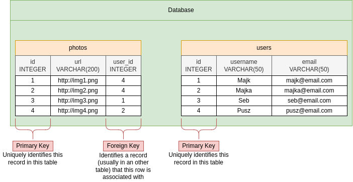

### Understanding Foreign Keys.

- Comments have one photo.
  - Comments table should get a foreign key column pointing at the photo each comment belongs to.
- Comments have one user.
  - Comments table should get foreign key column pointing at the user each comment belongs to.

**The 'many' side of the relationship gets the foreign key column.**

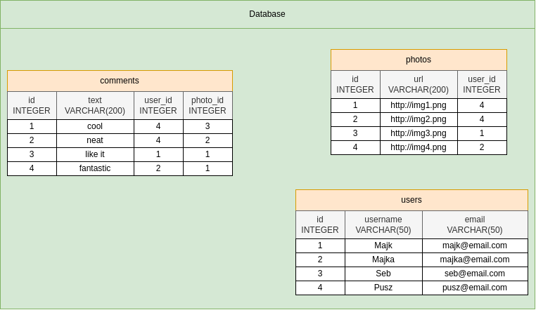

**Primary Keys.**

- Each row in every table has one primary key.
- No other row in the same table can have the same value.
- 99% of the time called 'id'.
- Either an integer or a UUID.
- Will never change.

**Foreign Key.**

- Rows only have this if they belong to another record.
- Many rows in the same table can have the same foreign key.
- Name varies, usually called something like 'xyz_id'.
- Exactly equal to the primary key of the reference row.
- Will change if the relationship changes.

### Auto Generated ID's.

```sql
CREATE TABLE users (
  id SERIAL PRIMARY KEY,
  username VARCHAR(50)
);
```

```sql
INSERT INTO users(username)
VALUES
  ('monahan93'),
  ('pferrer'),
  ('si93onis'),
  ('99stroman');
```

```sql
CREATE TABLE photos (
  id SERIAL PRIMARY KEY,
  url VARCHAR(200),
  user_id INTEGER REFERENCES users(id)
);
```

```sql
INSERT INTO photos(url, user_id)
VALUES
    ('http://one.jpg', 4);
```

### Running Queries on Associated Data.

```sql
INSERT INTO photos (url, user_id)
VALUES
  ('http://two.jpg', 1),
  ('http://25.jpg', 1),
  ('http://26.jpg', 1),
  ('http://754.jpg', 2),
  ('http://35.jpg', 3),
  ('http://256.jpg', 4);
```

**Find all the photos created by user with ID 4.**

```sql
SELECT * FROM photos WHERE user_id = 4;
```

**List all photos with details about the associated user for each.**

```sql
SELECT * FROM photos 
JOIN users ON users.id = photos.user_id;
```

***

**Ex 8: Creating and Using Foreign Keys.**

- Add a column to the crew_members table definition that will relate crew_members to boats.  
- You should call this foreign key column boat_id.
- Write a query that will fetch all columns for all crew_members associated with the boat that has an ID of 1.

```sql
-- Create table called 'boats'
CREATE TABLE boats (
    id INTEGER PRIMARY KEY SERIAL,
    name VARCHAR
);

-- Insert two boats 
INSERT INTO boats (name)
VALUES ('Rogue Wave'), ('Harbor Master');

-- Create table called 'crew_members'
CREATE TABLE crew_members (
    id INTEGER PRIMARY KEY SERIAL,
    first_name VARCHAR,
    boat_id INTEGER REFERENCES boats(id)
);

-- Insert three crew members
INSERT INTO crew_members (first_name, boat_id)
VALUES ('Alex', 1), ('Lucia', 1), ('Ari', 2);

-- Write query here to fetch all columns for all crew_members associated with the boat that has an ID of 1
SELECT * FROM crew_members WHERE boat_id = 1;
```

***

### Foreign Key Constraints Around Insertion.

- We insert a photo that is tied to a user that exists.
  - Everything OK!
- We insert a photo that refers to a user that doesn't exists.
  - An error!
- We insert a photo that isn't tied to any user.
  - Put in a value of 'NULL' for the user_id!

### Constraints Around Deletion.

| On Delete Option          | What happen if you try to delete a user when a photo is still referencing it |
|---------------------------|------------------------------------------------------------------------------|
| **ON DELETE RESTRICT**    | Throw an error                                                               |
| **ON DELETE NO ACTION**   | Throw an error                                                               |
| **ON DELETE CASCADE**     | Delete the photo too!                                                        |
| **ON DELETE SET NULL**    | Set the 'user_id' of the photo to 'NULL'                                     |
| **ON DELETE SET DEFAULT** | Set the 'user_id' of the photo to a default value, if one is provided        |

**ON DELETE CASCADE.**

```sql
DROP TABLE photos;

CREATE TABLE photos (
	id SERIAL PRIMARY KEY,
	url VARCHAR(200),
	user_id INTEGER REFERENCES users(id) ON DELETE CASCADE
);

DELETE FROM users WHERE id = 1;

SELECT * FROM photos;
```

```
id	url	            user_id
---------------------------
1	http:/one.jpg	4
5	http:/754.jpg	2
6	http:/35.jpg	3
7	http:/256.jpg	4
```

**ON DELETE SET NULL.**

```sql
DROP TABLE photos;

CREATE TABLE photos (
	id SERIAL PRIMARY KEY,
	url VARCHAR(200),
	user_id INTEGER REFERENCES users(id) ON DELETE SET NULL
);

DELETE FROM users WHERE id = 4;

SELECT * FROM photos;
```

```
id	url	            user_id
---------------------------
2	http:/754.jpg	2
3	http:/35.jpg	3
1	http:/one.jpg	null
4	http:/256.jpg	null
```

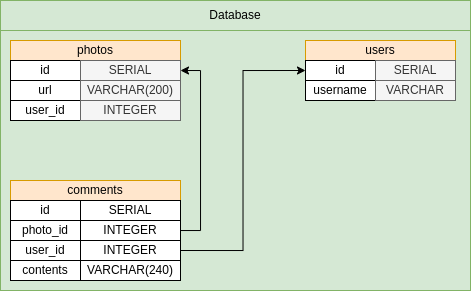

## 4. Joins And Aggregation.

### Queries with Joins and Aggregations.

**Some answers with Joins and Aggregations.**

- Find all the comments for the photo with ID = 3, along with the username of the comment author - **JOIN**.
- Find the **average number** of comments per photo - **AGGREGATION**.
- Find the photo with the **most comments** attached to it - **AGGREGATION**.
- Find the photo with ID = 10 and get the number of comments attached to it.
- Find the user with the **most activity** (most comments + most photos) - **AGGREGATION**.
- Calculate the average number of characters per comment.

**Joins.**

- Produces values by merging together rows from different related tables.
- Use a join most times that you're asked to find data involves multiple resources.

**Aggregation.**

- Looks at many rows and calculates a single value.
- Words like 'most', 'average', 'least' are a sign that you need to use an aggregation.

### Joining Data from Different Tables

**For each comment, show the contents of the comment and the username of the user who wrote the comment.**

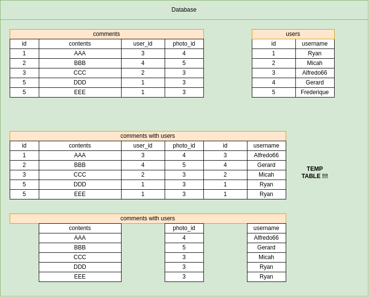

```sql
SELECT contents, username, photo_id 
FROM comments 
JOIN users ON users.id = comments.user_id;
```

***

**For each comment, list the contents of the comment and the URL of the photo the comment was added to.**

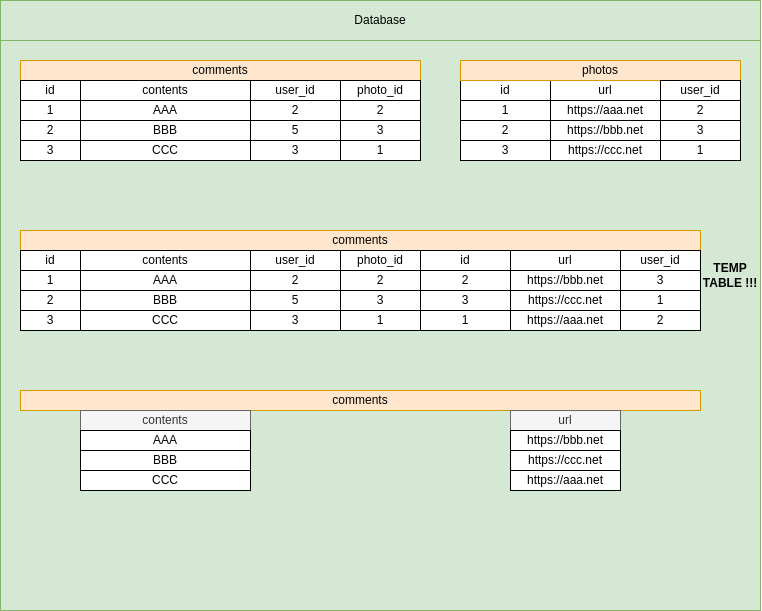

```sql
SELECT contents, url 
FROM comments 
JOIN photos on photos.id = comments.photo_id;
```

**Ex 9: Write a query that will join together two tables. For each book, print the title of the book and the name 
of the author.**

```sql
SELECT title, name 
FROM books 
JOIN authors on authors.id = books.author_id;
```

### Alternate Joins Syntax.

**Notes on Joins.**

- Table order between 'FROM' and 'JOIN' frequently makes a difference.
- We must give context if column name collide.
- Tables can be renamed using the 'AS' keyword.
- There are a few kinds of joins!

### Missing Data in Joins.

**Show each photo url and the username of the poster**

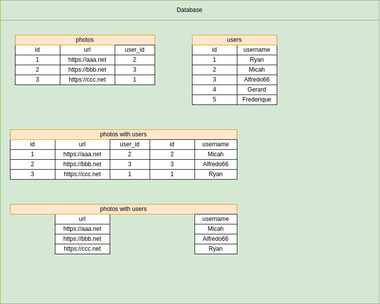

```sql
SELECT url, username 
FROM photos 
JOIN users ON user.id = photos.user_id;
```

***

### Why wasn't it included.

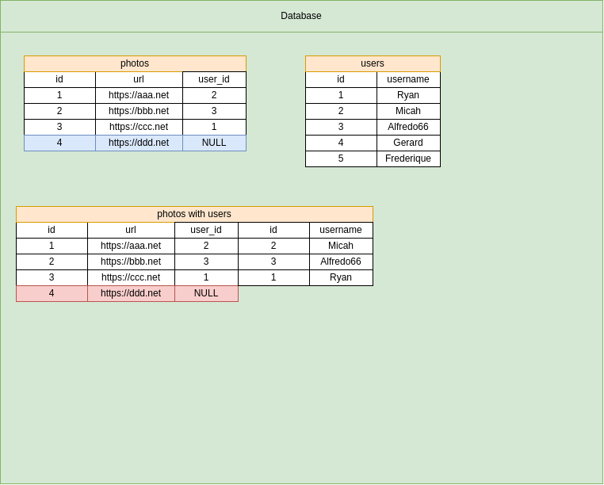

- Photos `ddd.net` wasn't included as it does not have corresponding field in users table.

```sql
SELECT url, username
FROM photos
JOIN users ON users.id = photos.user_id;
```

***

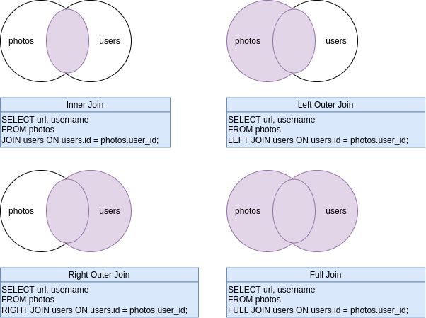

***

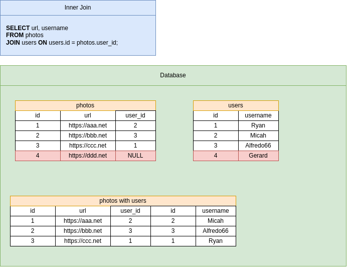

***

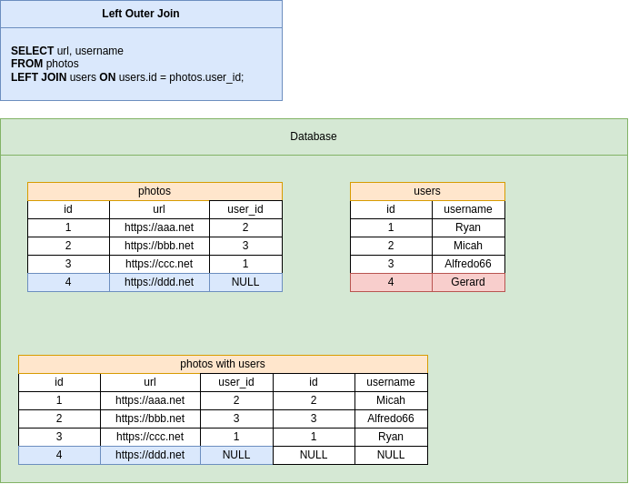

***

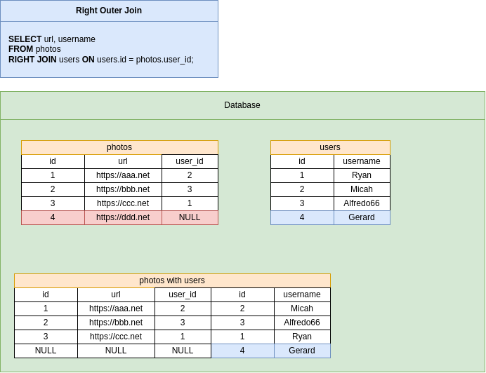

***

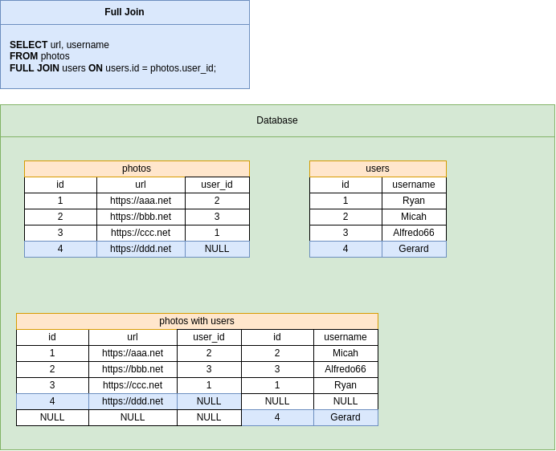

***

### Each Join in Practice.

**LEFT JOIN.**

```sql
SELECT url, username
FROM photos
LEFT JOIN users ON users.id = photos.user_id;
```

**RIGHT JOIN.**

```sql
SELECT url, username
FROM photos
RIGHT JOIN users ON users.id = photos.user_id;
```

**FULL JOIN.**

```sql
SELECT url, username
FROM photos
FULL JOIN users ON users.id = photos.user_id;
```

***

### Does Order Matter?

**Does the order of tables in 'FROM' and 'JOIN' make a difference?**

- YES,

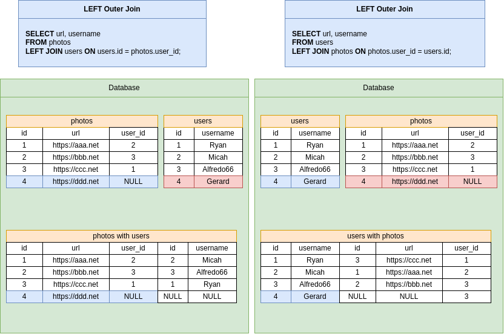

***

**Ex 10: Write a query that will return the title of each book, along with the name of the author.  
All authors should be included, even if they do not have a book associated with them.**

```sql
-- LEFT JOIN
SELECT title, name
FROM authors
LEFT JOIN books ON books.author_id = authors.is;

-- RIGHT JOIN
SELECT title, name 
FROM books 
RIGHT JOIN authors ON books.author_id = authors.id;
```

### WHERE with JOIN.

**Users can comment on photos that they posted. List the url and contents for every photo/comment where this occurred.**

- Who is commenting on their own photos?

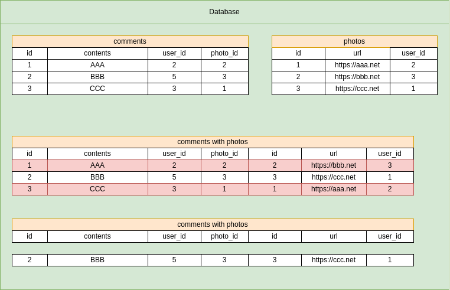

```sql
SELECT url, contents 
FROM comments 
JOIN photos ON photos.id = comments.photo_id
WHERE comments.user_id = photos.user_id;
```

### Three Way Joins.

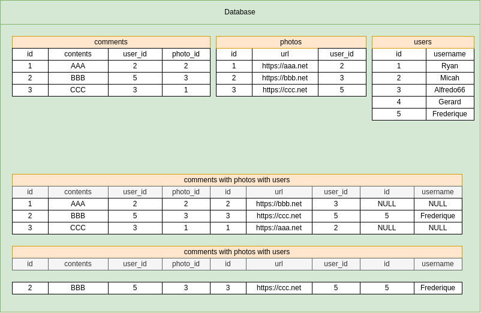

```sql
SELECT url, contents, username
FROM comments
JOIN photos ON photos.id = comments.photo_id
JOIN users ON users.id = comments.user_id AND users.id = photos.user_id;
```

**Ex 11: Write a query that will return the title of each book, along with the name of the author, and the rating of a review.  
Only show rows where the author of the book is also the author of the review.**

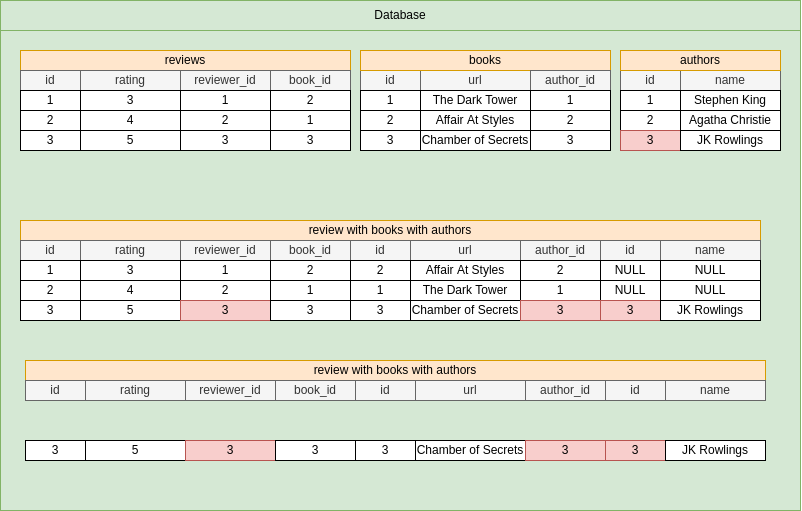

```
SELECT title, name, rating
FROM reviews
JOIN books ON books.id = reviews.book_id
JOIN authors ON authors.id = reviews.reviewer_id AND authors.id = books.author_id;
```

***

## Aggregation of Records.

**Grouping.**

- Reduces many rows down to fewer rows.
- Done by using the 'GROUP BY' keyword.
- Visualizing the result is key to use.

**Aggregates.**

- Reduces many values down to one.
- Done by using 'aggregate functions'.

### Picturing Group By.

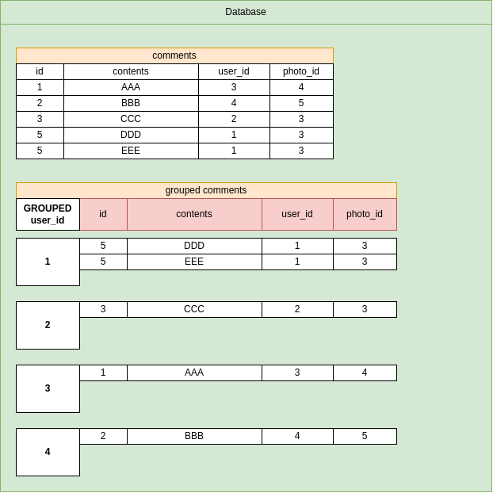

```sql
SELECT user_id 
FROM comments GROUP BY user_id;
```

### Aggregate Functions.

- `COUNT()`: Returns the number of values in a group of values.
- `SUM()`: Finds the **sum** of a group of numbers.
- `AVG()`: Finds the **average** of a group of numbers.
- `MIN()`: Returns the **minimum** value from a group of numbers.
- `MAX()`: Returns the **maximum** value from a group of numbers.

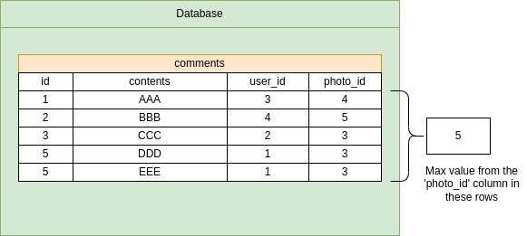

```sql
SELECT MAX(id) 
FROM comments;
```

### Combining Group By and Aggregates.


```sql
SELECT user_id, MAX(id)
FROM comments
GROUP BY user_id;
```

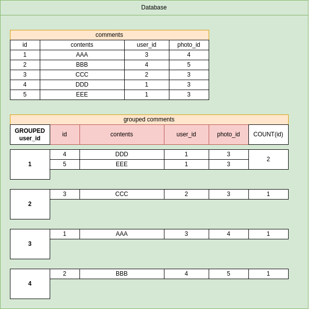

```sql
SELECT user_id, COUNT(id) AS num_comments_created
FROM comments
GROUP BY user_id;
```

### A Gotcha with Count.

```
SELECT COUNT(user_id) FROM photos;

-- Just count number of all rows
SELECT COUNT(*) FROM photos;

SELECT user_id, COUNT(*)
FROM comments
GROUP BY user_id;
```

### Visualizing More Grouping.

**Find the number of comments for each photo.**

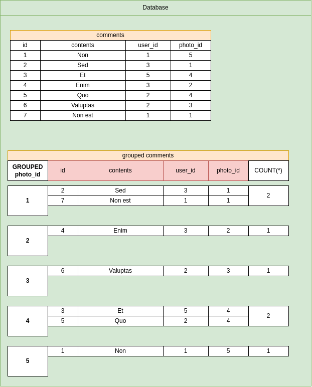

```sql
SELECT photo_id, COUNT(*)
FROM comments
GROUP BY photo_id;
```

**Write a query that will print an author's 'id' and the number of books they have authored.**

```sql
SELECT author_id, COUNT(*)
FROM books
GROUP BY author_id;
```

**Write a query that will print an author's 'name' and the number of books they have authored.**

```sql
SELECT name, COUNT(*)
FROM books
JOIN authors ON authors.id = books.author_id
GROUP BY authors.name
```

### Filtering Groups with Having.

- `FROM`: Specifies starting set of rows to work with.
- `JOIN`: Merges in data from additional tables.
- `WHERE`: Filters the set of rows.
- `GROUP BY`: Groups rows by a unique set of values.
- `HAVING`: Filters the set of groups.

### HAVING Examples.

**Find the number of comments for each photo where the photo_id is less than 3 and the photo has more than 2 comments.**

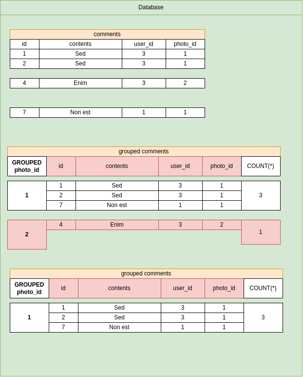

```sql
SELECT photo_id, COUNT(*)
FROM comments
WHERE photo_id < 3
GROUP BY photo_id
HAVING COUNT(*) > 2;

-- WHERE photo_id < 3   (filer individual rows from comments)
-- GROUP BY photo_id    (group photos_id with id 1 and 2 to separate buckets)
-- HAVING COUNT(*) > 2; (only return bucket with num of elements greater than 2)
```

**Find the users (user_id) where the user has commented on the first 50 photos and the user added more than  
20 comments on these photos.**

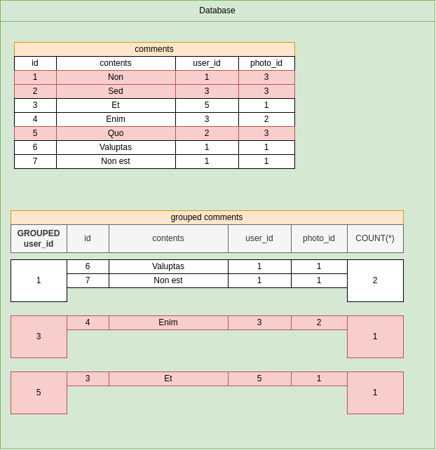

```sql
SELECT user_id, COUNT(*)
FROM comments
WHERE photo_id < 50
GROUP BY user_id
HAVING COUNT(*) > 20;
```

**Given a table of phones, print the names of manufacturers and total revenue (price * units_sold) for all phones.
Only print the manufacturers who have revenue greater than 2,000,000 for all the phones they sold.**

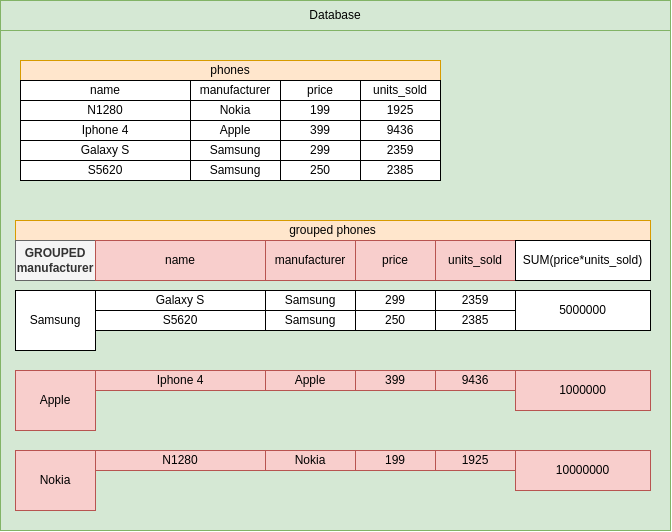

```sql
SELECT manufacturer, SUM(price * units_sold)
FROM phones
GROUP BY manufacturer
HAVING SUM(price * units_sold) > 2000000;
```

### Working with large datasets.

**Ex 15: Write a query to print the number of paid and unpaid orders.**

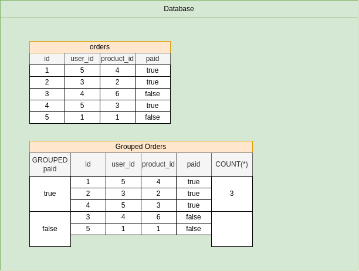

```sql
SELECT paid, COUNT(*) 
FROM orders 
GROUP BY paid;
```

**Ex 16: Join together the users and orders tables. Print the first_name and last_name of each user, 
then whether, or not they have paid for their order.**

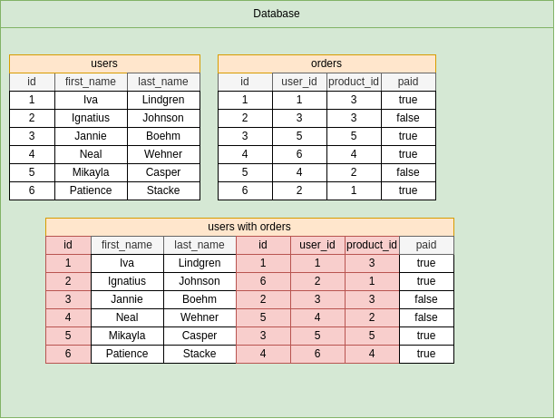

```sql
SELECT first_name, last_name, paid
FROM users 
JOIN orders ON orders.user_id = users.id
```

***

## Sorting Records.

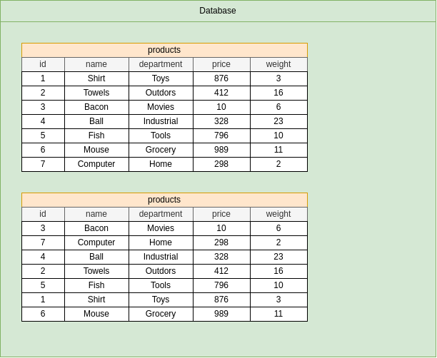

```sql
SELECT * 
FROM products
ORDER BY price ASC;
```

### Two Variations on Sorting.

```sql
SELECT *
FROM products
ORDER BY name;

-- Second ordering rule
SELECT *
FROM products
ORDER BY price, weight;
```

### Offset and Limit.

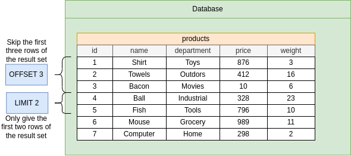

```sql
-- Out of 50 users, skip first 40 and print last 10
SELECT * 
FROM users 
OFFSET 40;
```

```sql
SELECT * 
FROM users
LIMIT 50;

-- Select 5 most expensive products
SELECT *
FROM products
ORDER BY price
LIMIT 5;

-- Only show user 20 items at a time (pagination)
SELECT *
FROM products
ORDER BY price
LIMIT 20
OFFSET 0;
```

**Ex 17: Write a query that shows the names of only the second and third most expensive phones.**

```sql
SELECT name
FROM phones 
ORDER BY price DESC
LIMIT 2
OFFSET 1;
```

***

## Unions and Sets.

**Find the 4 products with the highest price and the 4 products with the highest price/weight ratio**

```sql
(
    SELECT *
    FROM products
    ORDER BY price DESC
    LIMIT 4
)
UNION ALL
(
    SELECT *
    FROM products
    ORDER BY price / weight DESC
    LIMIT 4   
);
```

### Commonalities with Intersects.

- `UNION`: Join together the results of two queries and remove duplicate rows.
- `UNION ALL`: Join together results of two queries.
- `INTERSECT`: Find the rows common in the results of two queries. Remove duplicates.
- `INTERSECT ALL`: Find the rows common in the results of two queries.
- `EXCEPT`: Find the rows that are present in first query but not second query. Remove duplicates.
- `EXCEPT ALL`: Find the rows that are present in first query but not second query.

### Intersect.

```sql
(
    SELECT *
    FROM products
    ORDER BY price DESC
    LIMIT 4
)
INTERSECT ALL
(
    SELECT *
    FROM products
    ORDER BY price / weight DESC
    LIMIT 4   
);
```

### Except.


```sql
(
  SELECT *
  FROM products
  ORDER BY price DESC
  LIMIT 4
)
EXCEPT
(
  SELECT *
  FROM products
  ORDER BY price / weight DESC
  LIMIT 4   
);
```

**Ex 18: Write a query that will print the manufacturer of phones where the phone's price is less than 170.  
Also print all manufacturer that have created more than two phones.
IMPORTANT: You don't need to wrap each query with parenthesis! Your solution should not have any parens in it.**

```sql
SELECT manufacturer
FROM phones
WHERE price < 170
UNION 
SELECT manufacturer
FROM phones
GROUP BY manufacturer
HAVING COUNT(*) > 2;
```

***

## Assembling Queries with SubQueries.

**List the name and price of all products that are more expensive than all products in the 'Toys' department.**

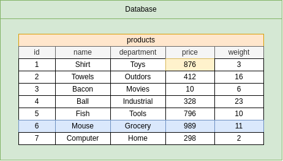

```sql
SELECT name,price
FROM products
WHERE price > 876;
```

```sql
SLECT name, price
FROM products
WHERE price > (
  SELECT MAX(price) FROM products WHERE department = 'Toys'
)
```

### Thinking About the Structure of Data.

**Understanding the shape of a query result.**

- `SELECT * FROM orders`: Many rows, many columns.
- `SELECT id FROM orders`: Many rows, one column.
- `SELECT COUNT(*) FROM orders`: One row, one column (single value) Scalar query.

### Subqueries in SELECT.

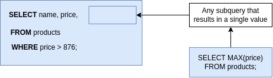

```sql
SELECT name, price, (
  SELECT MAX(price) FROM products 
)
FROM PRODUCTS
WHERE price > 867;
```

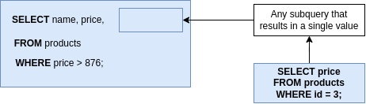

```sql
SELECT name, price, (
  SELECT price FROM products WHERE id = 3
) AS id_3_price
FROM products
WHERE price > 867;
```

**Write a query that prints the name and price for each phone.  In addition, print out the ratio of the phones price 
against max price of all phones (so price / max price).  Rename this third column to price_ratio.**

```sql
SELECT name, price, price / (SELECT MAX(price) FROM phones) AS price_ratio
FROM phones;
```

### Subqueries in FROM.

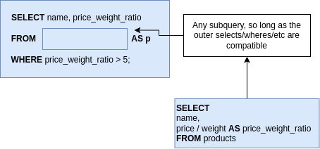

- Subquery must have an alias applied to is (**AS p**)

```sql
SELECT name, price / weight AS price_weight_ratio
FROM products;
```

```sql
SELECT name, price_weight_ratio
FROM (
  SELECT name, price / weight AS price_weight_ratio
  FROM products
) AS p 
WHERE price_weight_ration > 5;
```

```sql
SELECT *
FROM (SELECT MAX(price) FROM products) AS p;
```

**Find the average number of orders for all users**

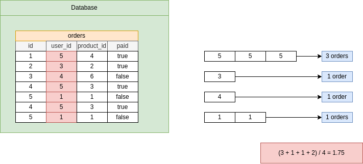

```sql
SELECT AVG(p.order_count)
FROM (
  SELECT user_id, COUNT(*) AS order_count
  FROM orders
  GROUP BY user_id
) AS p;
```

**Calculate the average price of phones for each manufacturer. Then print the highest average price. Rename this value 
to max_average_price.**

```sql
SELECT MAX(p.avg_price) AS max_average_price
FROM (
  SELECT AVG(price) AS avg_price
  FROM phones
  GROUP BY manufacturer
) AS p;
```

### Subqueries in a JOIN Clause.

```sql
SELECT first_name
FROM users
JOIN (
  SELECT user_id FROM orders WHERE product_id = 3
) AS o
ON o.user_id = users.id;
```

### Subqueries with WHERE

**Show the id of orders that involve a product with a price/weight ratio greater than 5.**

```sql
SELECT id
FROM orders
WHERE product_id IN (
  SELECT id FROM products WHERE price / weight > 5
);
```

**Show the name of all products with a price grater than the average product price.**

```sql
SELECT name
FROM products
WHERE price > (
  SELECT AVG(price) FROM products;
);
```

**Write a query that prints out the name and price of phones that have a price greater than the Samsung S5620 Monte.**

```sql
SELECT name, price 
FROM phones
WHERE price > (SELECT price FROM phones WHERE name = 'S5620 Monte'); 
```

**Show the name of all products that are not in the same department as products with a price less than 100**

```sql
SELECT name, department
FROM products
WHERE department NOT IN (
  SELECT department FROM products WHERE price < 100
);
```

**Show the name, department, and price of products that are more expensive than all products in the 'industrial' 
department.**

```sql
SELECT name, department, price
FROM products
WHERE price > ALL (
  SELECT price FROM products WHERE department = 'Industrial'
);
```

**Show the name of products that are more expensive that at least one product in the 'Industrial' department**

```sql
SELECT name, department, price
FROM products
WHERE price > SOME (
  SELECT price
  FROM products
  WHERE department = 'Industrial'
);
```

### Questions.

**1. Is the following a valid use of a subquery?** 

```sql
SELECT price, (SELECT manufacturer, units_sold FROM phones)
FROM phones;
```

- No, the subquery is returning more than one column in a `SELECT` clause.

**2. Is the following a valid use of a subquery?**

```sql
SELECT price * units_sold
FROM (SELECT * FROM phones);
```

- No, a subquery in a `FROM` must be given an alias.

**3. Is the following a valid use of a subquery?**

```sql
SELECT price * units_sold
FROM phones
WHERE price > ALL (SELECT price FROM phones WHERE manufacturer = 'Nokia');
```

**Write a query that print the name of all phones that have a price greater than any phone made by Samsung.**

```sql
SELECT name
FROM phones
WHERE price > ALL (
  SELECT price FROM phones WHERE manufacturer = 'Samsung'
);
```

**Show the name, department, and price of the most expensive product in each department**

```sql
SELECT name, department, price
FROM products AS p1
WHERE p1.price = (
  SELECT MAX(price)
  FROM products AS p2
  WHERE p1.department = p2.department
);
```

**Without using a join or a group by, print the number of orders for each product**

```sql
SELECT p1.name,
  (
    SELECT 
    FROM orders AS o1
    WHERE o1.product_id = p1.id
  ) AS num_orders
FROM products AS p1;
```

### A SELECT Without a FROM.

```sql
SELECT (
  SELECT MAX(price) FROM products
) / (
  SELECT MIN(price) FROM products
)
```

**Using only subqueries, print the max price, min price, and average price of all phones.  Rename each column to 
max_price, min_price, avg_price.**

```sql
SELECT 
  (SELECT MAX(price) FROM phones) AS max_price,
  (SELECT MIN(price) FROM phones) AS min_price,
  (SELECT AVG(price) FROM phones) AS avg_price;
```

***

## 10. Selecting Distinct Records.

**What unique departments are there?**

```sql
SELECT DISTINCT department 
FROM products;
```

**Count unique departments.**

```sql
SELECT COUNT(DISTINCT department) 
FROM products;
```

**Write a query that will print the number of unique phone manufacturers.**

```sql
SELECT COUNT(DISTINCT manufacturer)
FROM phones;
```

***

## 11. Utility Operators, Keywords, and Functions.

**The Greatest Value in a List.**

```sql
SELECT GREATEST(20, 10, 30);
```

**Compute the cost to ship each item.**

- Shipping is the maximum of (weight * $2) or $30.

```sql
SELECT name, weight, GREATEST(30, 2 * weight)
FROM products;
```

**The Least Value in a List!**

```sql
SELECT LEAST(1, 20, 50, 100);
```

**All products are on sale!**

- Price is the least of the products price * 0.5 or $400.

```sql
SELECT name, price, LEAST(price * 0.5, 400)
FROM products;
```

**Print each product and its price. Also print a description of the price.**

- If price > 600 then 'high'.
- If price > 300 then 'medium'.
- else print 'cheap'.

```sql
SELECT
  name,
  price,
  CASE
    WHEN price > 600 THEN 'high'
    WHEN price > 300 THEN 'medium'
    ELSE 'cheap'
  END
FROM products;
```

***

## Flashcards.

**1. Given table `id | name | email`. Crate a hash index on the email column of this table called, so we can quickly find
users by their email.**

```sql
CREATE INDEX email_idx ON users USING hash(email);
```

**2. Given a Pokemon table `id | name | type_id`. Create an index called name_id on the name column of this table.**

```sql
CREATE INDEX name_idx ON pokenom (name);
```

**3. Given employees table `id | name | department | salary`. Return the name of all employees. You should also add another
column to the result named is_engineering which is yes if the employee is the 'Engineering' department and no otherwise.**

```sql
SELECT name,
  CASE
    WHEN department = 'Engineering'
    THEN 'yes'
    ELSE 'no'
  END AS is_engineering
FROM employees
ORDER BY name;
```

**4. Given customers `id | name`. And orders `id | customer_id | price`. Return the names of customers which have made an
order with a max price less than 100.**

```sql
SELECT e.name
FROM customers c JOIN orders o ON c.id = o.customer_id
WHERE o.price < 100;
```

```sql
WITH max_price_orders AS (
  SELECT customer_id, MAX(price) AS max_price
  FROM orders
  GROUP BY customer_id
  HAVING MAX(price) < 100
)

SELECT c.name
FROM customers c
JOIN max_price_orders mpo ON c.id = mpo.customer_id
ORDER BY c.name;
```

**5. Given Customers, `id | name` and Orders, `id | customer_id | price`. Return the names of customers who have made an
order with price less than 100.**

```sql
SELECT c.name
  FROM customers c JOIN
    orders o ON c.id = o.customer_id
  WHERE o.price < 100
ORDER BY c.name;
```

```sql
SELECT name
  FROM customers
  WHERE is = AND(
    SELECT DISTINCT customer_id
    FROM orders
    WHRER price < 100 
  )
ORDER BY name;
```

**6. Given Users table, `id | name` and Posts table, `id | user_id | title | content`. Return the names of users who have 
not made any posts.**

```sql
SELECT name
  FROM users u
  WHERE NOT EXISTS(
    SELECT 1
    FROM posts p
    WHERE p.user_id = u.id
  )
ORDER BY name ASC;
```

**7. Given Employees table, `id | name | salary | department`. Return all employees who have a salary below the average 
salary from the marketing department.**

```sql
SELECT e.name, e.salary
  FROM employees e
    JOIN (
      SELECT AVG(salary) AS avg_salary
      FROM employees 
    ) AS abg
    ON e.salary < avg.avg_salary
  WHERE department = 'marketing'
ORDER BY e.salary;
```

**8. Given Sports table, `id | name | total_viewers`. Return sports that have less than the average number of viewers among
all sports.**

```sql
SELECT name, total_viewers
  FROM sports
  WHERE total_viewers < (
    SELECT AVG(total_viewers) FROM sports
  )
ORDER BY total_viewers DESC;
```

**9. Normalization. Order schema `user_id | user_name | product_id | product_name | order_id`. Create three different tables
that normalize the three above: users, products, orders.**

```sql
CREATE TABLE users(
  id INTEGER PRIMARY KEY,
  name TEXT
);

CREATE TABLE products(
  id INTEGER PROMARY KEY,
  name TEXT
);

CREATE TABLE orders(
  id INTEGER PRIMARY KEY,
  user_id INTEGER REFERENCES users(id),
  product_id INTEGER REFERNCES products(id)
);
```

**10. Given a table players: `id | name | team_id`. And table teams: `id | name`. And table contracts: `id | player_id | salary`.
Return the following columns is order. The player name renamed as player_name. 
The team name renamed as team_name.
The salary of the player.**

```sql
SELECT p.name AS player_name, t.name AS team_name, c.calary
  FROM players AS p
    JOIN teams AS t ON p.team_id = t.id
    JOIN contracts AS c ON c.player_id = p.id
ORDER BY c.salary DESC;    
```

**11. Given a table called Pokemon `id | name | type_id`. And a table called Pokemon Types `id | name | weakness`.
Return all the following columns in the given order: pokemon types, pokemon names, and the weakness of the pokemon types.
If a pokemon type does not have any pokemon, the result should contain NULL for the pokemon name column.**

```sql
SELECT t.name AS type, p.name AS pokemon, t.weakness
  FROM pokemon AS p RIGHT JOIN
    pokemon_types AS t
  ON p.type_id = t.id
ORDER BY type;
```

**12. Given a humans table `id | name`, and pats table `id | owner | name`. Return the names of all humans along with their
pet names. If a human does not have a pet, the pet name should be null. Order the results by the human's name and their
pet name.**

```sql
SELECT h.name AS human_name, p.name AS pet_name
  FROM humans AS h LEFT JOIN pets p
  ON h.id = p.owner_id
ORDER BY human_name, pet_name;
```

**13. Given users table: `id | name | email`, and employment_records: `id | user_id | company_name | job_title`.
Your task is to return the name, email, company_name and job_title of each user. Order the results by the company_name in
ascending order.**

```sql
SELECT u.name, u.email, e.company_name, e.job_title
  FROM users AS u 
    INNER JOIN employment_record AS e
  ON u.id = e.user_id
ORDER BY e.company_name ASC;
```

**14. Return the name of each student, along with all the course names they are registered for. Order the results by the 
student name in ascending order.**

```sql
SELECT students.name, course_registration.course_name
  FROM students INNER JOIN course_registrations
    ON students.id = course_registrations.student_id
ORDER BY student.name ASC;
```

**15. Write a query that will return the following table.**

| user_id | name | order_id | total_price |
|---|---|---|---|
| 1 | John | 1 | 100.00 |
| 2 | Jane | 2 | 200.00 |

```sql
SELECT users.user_id, users.name, orders.order_id, orders.total_price
  FROM users CROSS JOIN orders
WHERE users.user_id = orders.user_id'
```

**16. Write a query that returns three columns in this order: country, year and total_medals. The total_medals column
should be the same of all the medals won by the country in that year.
The result should not include 'Gymnastics' category.
The result should only include results where the total_medals is greater than 20.
The result should be sorted by the total_medals in descending order.
The result should only include at most 5 rows.**

```sql
SELECT country, year, SUM(gold) + SUM(silver) + SUM(bronze) AS total_medals
  FROM olimpic_medals
WHERE category != 'Gymnastics'
GROUP BY country, year
HAVING SUM(gold) + SUM(silver) + SUM(bronze) > 20
ORDER BY total_medals DESC
LIMIT 5;
```

**17. Return only the names of the countries that have won more than 100 medals in total, across all years.
The result should be sorted by the countries in descending order.**

```sql
SELECT country
FROM olimpic_medals
GROUP BY country
HAVING SUM(total_medals) > 100
ORDER BY country DESC;
```

**18. Write a query that groups the medals by country and sums the number of gold, silver, and bronze medals for each country.**

```sql
SELECT country, SUM(gold) AS gold_medals, SUM(silver) AS silver_medals, SUM(bronze) AS bronze_medals
  FROM olimpic_medals
GROUP BY country;
```

**19. Select title of the longest book.**

```sql
SELECT title, pages 
  FROM books
WHERE pages = (SELECT MAX(pages) FROM books);
```

**20. Find the full name of the author who wrote the largest book.**

```sql
SELECT CONCAT(author_name, ' ', author_lname) AS full_name, pages
  FROM books
WHERE pages = (SELECT MAX(pages) FROM books);
```

```sql
SELECT CONCAT(author_fname, ' ', author_lname) AS author, pages
  FROM books
WHERE books ORDER BY pages DESC
LIMIT 1;
```

**21. How many times does the average user post?**

```sql
SELECT 
  (SELECT COUNT(*) FROM phosts) /
  (SELECT COUNT(*) FROM users) AS avg;
```

**22. Query the western longitude (log_w) for the largest northern latitude (lat_n) in station that is less than 137.2345.
Round your answer to 4 decimal places.**

```sql
SELECT ROUND(log_w, 4) FROM STATION
WHERE
lan_n = (SELECT MAX(lat_n) FROM STATION WHERE lat_n < 137.2345);
```

**23. Find users who have liked every single photo on the site.**

```sql
SELECT username, COUNT(*) AS num_likes
  FROM users
  INNER JOIN likes ON users.id = likes.user_id
GROUP BY likes.user_id
HAVING num_likes = (SELECT COUNT(*) FROM photos);
```

**24. We have 3 tables users, product and orders. Select user who doesn't have any row in orders table.**

```sql
SELECT * FROM user u
  LEFT JOIN order o ON u.id = o.user_id
WHERE o.id IS null;  
```

**25. What are the top 5 most commonly used hashtags?**

```sql
SELECT tags.tag_name, COUNT(*) AS total
  FROM photo_tags
  JOIN tags ON photo_tags.tag_id = tags.id
GROUP BY tags.id
ORDER BY total DESC
LIMIT 5;
```

**26. Department top three salaries.**

```sql
WITH RankedSalaries AS (
  SELECT dep.name AS Department, emp.name AS Employee, emp.salary AS Salary
    DENSE_RANK() OVER (PARTITION BY dep.id ORDER_BY emp.salary DESC)
    AS SalaryRank
  FROM Department dep
  JOIN Employee emp ON dep.id = emp.department_id
)

SELECT Department, Employee, Salary
  FROM RankedSalaries
WHERE SalaryRank <= 3;
```

**27. How do you calculate the cumulative salary for each department using window functions?**

```sql
SELECT 
    employee_id, department, salary, 
    SUM(salary) OVER (PARTITION BY department ORDER BY employee_id) AS cumulative
  FROM employees; 
```

**28. Update 'status' column of an 'orders' table for all orders placed by a specific customer. How to update query?**

```sql
UPDATE orders SET status = 'new_status'
WHERE customer_id IN
  (SELECT customer_id FROM customers WHERE name = 'specific customer');
```

**29. How to calculate average using group by clause?**

```sql
SELECT dept_id, AVG(salary) AS average_salary FROM employee GROUP BY dept_id;
```

```sql
SELECT dept_id, AVG(salary) AS average_salary
  FROM employee GROUP BY dept_id
HAVING AVG(salary) < 1000;
```

**30. Group by clause - calculating sum.**

```sql
SELECT dept_id, SUM(salary) AS total_salary
  FROM employee GROUP BY dept_id;
```

```sql
SELECT dept_id, SUM(salary) AS total_salary
  FROM Employee GROUP BY dapt_id
HAVING SUM(salary) > 3000;
```

**31. Group by clause example 1 - finding duplicate.**

```sql
SELECT emp_name, COUNT(emp_name) 
  FROM employee GROUP BY emp_name
HAVING COUNT(emp_name) > 1;
```

**32. How do you remove the duplicate rows from the table?**

```sql
SELECT emp_name, row_number()
    OVER (ORDER BY emp_name DESC) row_number 
  FROM Employee; 
```

```sql
DELETE FROM table WHERE row_number > 1;
```

**33. How do you find the duplicate rows in a table?**

```sql
SELECT emp_name, COUNT(*) 
  FROM employee
  GROUP BY emp_name
HAVING COUNT(*) > 1;
```

**34. Write an SQL query to list Departments that have less than 3 people in it?**

```sql
SELECT dept_id, COUNT(emp_name) AS 'Number of Employee'
  FROM Employee
  GROUP BY dept_id
HAVING COUNT(emp_name) < 3;
```

**35. Query that finds the users from a 'users' table who have not posted any comments in a 'comments' table.**

```sql
SELECT u.user_id
  FROM users u
WHERE NOT EXISTS (SELECT 1 FROM comments c WHERE c.user_id = u.user_id);
```

**36. Query that finds the products from a 'products' table that have never been ordered from an 'orders' table.**

```sql
SELECT p.product_id
  FROM products p
WHERE NOT EXISTS (SELECT 1 FROM orders o WHERE o.product_id = p.product_id);
```

**37. Find the customers from a 'customers' table who have placed at least one order in an 'orders' table.**

```sql
SELECT c.customer_id
  FROM customers c
WHERE EXISTS (SELECT 1 FROM orders o WHERE o.customer_id = c.customer_id);
```

**38. The second-highest salary from Employees table.** 

```sql
SELECT 
  IFNULL (
    (SELECT DISTINCT salary 
      FROM Employee
      ORDER BY salary DESC
      LIMIT 1 OFFSET 1),
      NULL
  ) AS SecondHighestSalary;
```

**39. How would you find the second-highest salary from an Employees table?**

```sql
SELECT * 
  FROM (
    SELECT employee_id, first_name, last_name, Salary, DENSE_RANK() OVER (ORDER BY salary DESC) AS s_rank
    FROM hr.employees
  ) 
WHERE s_rank = 2;
```

**40. Write an SQL query to show Employees (names) who have a bigger salary than their manager?**

```sql
SELECT a.emp_name FROM Employee a
  JOIN Employee b ON a.mngr_id = b.emp_id
WHERE a.salary > b.salary;
```

**41. How can you find the average salary of employees in each department using SQL joins?**

```sql
SELECT d.dep_id, d.dep_name, AVG(e.salary) AS avg_salary
  FROM departments d
    JOIN employees e ON d.dep_id = e.dep_id
  GROUP BY d.dep_id, d.dep_name;
```

**42. Write SQL query to find Employees who have the biggest salary in their Department?**

```sql
SELECT a.emp_name, a.dep_id
  FROM Employees a JOIN 
    (SELECT a.dept_id, MAX(salary) AS max_salary
      FROM Employee a JOIN Department d
        ON a.dept_id = b.dept_id
        GROUP BY a.dept_id) b
    ON a.salary = b.max_salary AND a.dept_id = b.dept_id;
```

**43. Can you write an SQL query to show all Employees that don't have manager in the same department?**

```sql
SELECT a.emp_name
  FROM Employee a JOIN Employee b
    ON a.mngr_id = b.emp_id
WHERE a.dept_id != b.dept_id;
```

**44. Write SQL query to list all Departments along with the total salary there?**

```sql
SELECT b.dept_name, SUM(a.salary) AS 'Total Salary'
  FROM Employee a FULL OUTER JOIN Department b
    ON a.dept_id = b.dept_id
  GROUP BY b.dept_name;
```

**45. Query to find the customers from an 'orders' table who have places more than 10 orders.**

```sql
SELECT customer_id FROM orders
  GROUP BY customer_id
HAVING COUNT(order_id) > 10;
```

**46. Find the product categories from a 'sales' table that have total sales over $10000.**

```sql
SELECT category 
  FROM sales GROUP BY category
HAVING SUM(sales_amount) > 10000;
```

**47. Retrieve a list of all orders, and the details of the customers who places them from an 'orders' table and a
'customers' table using RIGHT JOIN.**

```sql
SELECT * FROM orders
  RIGHT JOIN customers
    ON orders.customer_id = customers.customer_id;
```

**48. How can you find employees who have the same manager using a self join?**

```sql
SELECT e1.emp_id, e1.name AS emp_name, e2,name AS manager_name 
  FROM employees e1
    JOIN employees e2 ON e1.manager_id = e2.manager_id
WHERE e1.emp_id <> e2.emp_id;
```

**49. How can you perform a LEFT JOIN between two tables and keep only the rows that do not match.**

```sql
SELECT * 
  FROM table1
    LEFT JOIN table2 ON
      table1.column_name = table2.column_name 
WHERE table2.column_name IS NULL;
```

**50. Write a SQL query to show all Departments along with the number of people there.**

```sql
SELECT b.dept_id, COUNT(a.dept_id) AS 'Number of Employee'
  FROM Employee a 
    FULL OUTER JOIN Department b ON a.dept_id = b.dept_id
  GROUP BY b.dept_name;
```

**51. Print out the current day and time using this format: 'mm/dd/yyyy'.**

```sql
SELECT DATE_FORMAT(CURDATE(), '%m/%d/%Y');
```

**52. Print out the current day of the week (the day name).**

```sql
SELECT DATNAME(CURDATE());

SELECT DATNAME(NOW());

SELECT DATA_FORMAT(NOW(), '%W');
```

**53. Print out the current Day of the Week (the number)?**

```sql
SELECT DAYOFWEEK(CURDATE());
```

**54. How do you perform a LEFT JOIN in SQL?**

```sql
SELECT * 
  FROM hr.employees
    LEFT JOIN hr.departments ON hr.employees.department_id = hr.departments.department_id;
```

**55. Write a SQL query to retrieve data from two tables using an INNER JOIN?**

```sql
SELECT *
  FROM hr.employees
    INNER JOIN hr.departments ON hr.employees.department_id = hr.departments.department_id;
```

**56. Write a query to count the number of records in a table named ORDERS?**

```sql
SELECT COUNT(*) FROM co.orders;
```

**57. Evaluate.**

```sql
SELECT 10 != 10;  -- 0

SELECT 15 > 14 AND 99 - 5 <= 94; -- 1

SELECT 1 IN (5,3) OR 9 BETWEEN 8 AND 10; -- 1
```

**58. Create a tweets table that stores. The tweet content, a username, time it was created.**

```sql
CREATE TABLE tweets(
  content VARCHAR(180),
  username VARCHAR(20),
  created_at TIMESTAMP DEFAULT NOW()
);
```

**59. How do you find records with overlapping data ranges in SQL?**

```sql
SELECT * FROM table_name
  WHERE start_date
    BETWEEN '2023-01-01' AND '2023-12-31'
  OR end_date
    BETWEEN '2023-01-01' AND '2023-12-31';
```

**60. How do you find all records modified between two dates in SQL?**

```sql
SELECT * 
  FROM orders
WHERE order_date >= '20160901' AND order_date < '20160930';
```

**61. How can you calculate the age of a person from their birthdate?**

```sql
SELECT DATEDIFF(YEAR, birthdate, GETDATE()) AS age
  FROM table_name;
```

**62. Group by - counting records find the number of employees per department.**

```sql
SELECT dept_id, COUNT(emp_id) AS num_of_employees
  FROM employee
GROUP BY dept_id;
```

**63. Query the list of city names from Station which have vowels (a, e, i, o, u) as both their first and last 
characters. Your result cannot contain duplicates.**

```sql
SELECT DISTINCT city FROM station
WHERE
  (city LIKE "a%" OR city LIKE "e%" OR city LIKE "i%" OR city LIKE "o%" OR city LIKE "u%")
  AND
  (city LIKE "%a" OR city LIKE "%e" OR city LIKE "%i" OR city LIKE "%o" OR city LIKE "%u");
```

**64. How to use group by clause with more than one column?**

```sql
SELECT dept_id, emp_id 
  FROM employee
GROUP BY dept_id, emp_id;
```

**65. Query the list of city names ending with vowels (a, e, i, o, u) from station. Your result cannot contain duplicates.**

```sql
SELECT DISTINCT city
  FROM station
WHERE
  city LIKE '%a' OR city LIKE '%e' OR city LIKE '%i' OR city LIKE '%o' OR city LIKE '%u';
```

**66. Query a list of city names starting with vowels (a, e, i, o, u) from station. Your result cannot contain duplicates.**

```sql
SELECT DISTINCT city
  FROM station
WHERE city LIKE 'a%' OR city LIKE 'e%' OR city LIKE 'i%' OR city LIKE 'o%' OR city LIKE 'u%';
```

**67. Update a 'users' table so that all users with a 'last_login' data of more than a year ago are marked as 'inactive'.**

```sql
UPDATE users SET status = 'inactive'
WHERE last_login < CURRENT_DATA_INTERVAL '1 year';
```

**68. Query that retrieves all customers from a 'customers' table and any corresponding records from a 'sales' table, using
LEFT JOIN. If a customer has no corresponding sales record, the sales details should be NULL.**

```sql
SELECT * 
  FROM customers
    LEFT JOIN sales ON customers.customer_id = sales.customer_id;
```

**69. Query that retrieves all products from a 'products' table, along with any orders for those products from an 'orders' 
table, using LEFT JOIN.**

```sql
SELECT * 
  FROM products
    LEFT JOIN orders ON products.product_id = orders.product_id;
```

**70. Retrieve a list of all customers and the details of any orders they have placed from a 'customers' table and an
'orders' table using a LEFT JOIN.**

```sql
SELECT * FROM customers
  LEFT JOIN orders ON customers.customer_id = orders.customer_id;
```

**71. Query that retrieves all pairs of customers from a 'customers' table who live in the same city using an INNER JOIN.**

```sql
SELECT A.customer_id, B.customer_id 
  FROM customers A
    INNER JOIN customers B ON A.city = B.city AND A.customer_id != B.customer_id;
```

**72. Query that retrieves all products from a 'products' table, along with any orders for those products from an
'orders' table, using an INNER JOIN.**

```sql
SELECT *
  FROM products
    INNER JOIN orders ON products.product_id = orders.product_id;
```

**73. Retrieve a list of orders and the details of the customers who places them from an 'orders' table and 'customers'
table using an INNER JOIN.**

```sql
SELECT *
  FROM orders
    INNER JOIN customers ON orders.customer_id = customers.customer_id;
```

**74. Query that retrieves all pairs of customers from a 'customers' table who live in the same city.**

```sql
SELECT A.customer_id, B.customer_id
  FROM customers A, customers B
WHERE A.city = B.city AND A.customer_id != B.customer_id;
```

**75. Query that retrieves all products from a 'products' table, along with any orders for those products from an 'orders'
table. You should include products that have no orders.**

```sql
SELECT *
  FROM products
    LEFT JOIN orders ON products.product_id = orders.product_id;
```

**76. Add constraints to an 'email' column in an 'users' table to ensure that all emails are unique.**

```sql
ALTER TABLE users ADD CONSTRAINT unique_email UNIQUE(email);
```

**77. 'users' table with a 'name' column that currently allows NULL values. You need to change this so that 'name' does
not allow NULLs. How would you handle this in PostgreSQL, considering that there are already users with NULL names?**

```sql
UPDATE users SET name = 'Default'
WHERE name IS NULL;

ALTER TABLE users
ALTER COLUMN name
SET NOT NULL;
```

**78. Retrieve a list of orders, and the details of the customers who places them from an 'orders' table and a 'customers'
table.**

```sql
SELECT *
  FROM orders
    INNER JOIN customers ON orders.customer_id = customers.customer_id;
```

**79. Query that calculates the total order amount for each customer from an 'orders' table, and you want the results set
to have the column name 'Total Amount'.**

```sql
SELECT customer_id, SUM(order_amount) AS 'Total Amount'
  FROM orders
GROUP BY customer_id;
```

**80. Query that joins a 'users' table and an 'orders' table, and you want to use table aliases to simplify a query.**

```sql
SELECT u.name, o.order_id
  FROM users AS u
    JOIN ordser AS o ON u.user_id = o.user_id;
```

**81. Compute the average price for each product category in 'products' table.**

```sql
SELECT category, AVG(price)
  FROM products
GROUP BY category;
```

**82. Compute the total sales amount for each product category in a 'sales' table.**

```sql
SELECT category, SUM(sales_amount)
  FROM sales
GROUP BY category;
```

**83. Count the number of products in each category in a 'products' table.**

```sql
SELECT category, COUNT(*)
  FROM products
GROUP BY category;
```

**84. Query that retrieves the earliest and latest signup date for users in each city from 'users' table.**

```sql
SELECT city, MIN(signup_date), MAX(signup_date)
  FROM users
GROUP BY city;
```

**85. Query to find the highest and lowest priced product in each category in a 'products' table.**

```sql
SELECT category, MIN(price), MAX(price) 
  FROM products
GROUP BY category;
```

**86. Print out the current day and time using this format: January 2nd at 3:15.**

```sql
SELECT DATE_FORMAT(NOW(), '%M %D at %k:%i');
```

**87. Retrieve a list of all distinct products sold in 2022 and 2023 from two tables 'sales_2022' and 'sales_2023'.**

```sql
SELECT product
  FROM sales_2022
    UNION SELECT product 
      FROM sales_2023;
```

**88. Query that retrieves a list of all distinct users who signed up in 2022 and 2023 from two tables 'users_2022' and
'users_2023'.**

```sql
SELECT user FROM users_2022
  UNION
    SELECT user FROM users_2023;
```

**89. Calculate the total sales amount for each product category from a 'sales' table.**

```sql
SELECT category, SUM(sales_amount) 
  FROM sales
GROUP BY category;
```

**90. Query that calculates the average order amount for each customer from an 'orders' table.**

```sql
SELECT customer_id, AVG(order_amount)
  FROM orders
GROUP BY customer_id;
```

**91. Write a query to display the number of employees working in each region?**

```sql
SELECT region, COUNT(*) AS num_employees
  FROM employees
GROUP BY region;
```

**92. Query that counts the number of products in each category from a 'products' table that have a price greater than $100.**

```sql
SELECT category, COUNT(product_id) 
  FROM products
WHERE price > 100 GROUP BY category;
```

**93. Query that finds the products from a 'products' table that have an average price over $100.**

```sql
SELECT product_name
  FROM products
GROUP BY product_name HAVING AVG(price) > 100; 
```

**94. Query that generates all possible pairs of students from a 'students' table using a CROSS JOIN.**

```sql
SELECT A.name, B.name
  FROM students A
CROSS JOIN students B;
```

**95. Make this happer, sorted Alphabetically by last name.**

| yell                            |
|---------------------------------|
| MY FAVORITE AUTHOR IS MAJKA.    |
| MY FAVORITE AUTHOR IS FARMAZON. |

```sql
SELECT UPPER(CONCAT('my favorite author is', author_name, ' ', author_lname, '!')) AS yell
  FROM books 
ORDER BY author_lname;
```

**96. Print title and author_lname, sorted first by author_lname and then by title.**

```sql
SELECT title, author_lname
  FROM books
ORDER BY author_lname, title;
```

**97. Find the 3 books with the lowest stock.**

| title                   | released_year | stock_quantity |
|-------------------------|---------------|----------------|
| American God.           | 2021          | 12             |
| Where I'm calling from. | 1989          | 12             |
| Wont we talk.           | 1981          | 23             | 

```sql
SELECT title, released_year, stock_quantity
  FROM books 
ORDER BY stock_quantity LIMIT 3;
```

**98. How many books are in database?**

```sql
SELECT COUNT(*) FROM books;

SELECT COUNT(author_fname) FROM books;

SELECT COUNT(DISTINCT author_fname) FROM books;

SELECT COUNT(DISTINCT released_year) FROM books;
```

**99. How many titles contain "the"?**

```sql
SELECT COUNT(*)
  FROM books
WHERE title LIKE '%the%';
```

**100. Count how many books each author has written.**

```sql
SELECT author_lname, COUNT(*) AS books_written
  FROM books
GROUP BY author_lname;
```

```sql
SELECT author_lname, COUNT(*) AS books_written
  FROM books
GROUP BY author_lname
ORDER BY books_written;
```

**101. Count how many books were released on each year.**

```sql
SELECT released_year, COUNT(*) AS nums
  FROM books
GROUP BY released_year
ORDER BY nums DESC;
```

**102. Find the minimum released_year.**

```sql
SELECT MIN(released_year) 
  FROM books;
```

**103. Select author group by number of books written.**

```sql
SELECT author_fname, author_lname, COUNT(*)
  FROM books
GROUP BY author_lname, author_fname;
```

```sql
SELECT CONCAT(author_fname, ' ', author_lname) AS author, COUNT(*) 
  FROM books
GROUP BY author;
```

**104. Find the year each author published their first book.**

```sql
SELECT author_fname, author_lname, MIN(released_year)
  FROM books
GROUP BY author_lname, author_fname;
```

**105. Find the longest page count for each author.**

```sql
SELECT author_fname, author_lname, MAX(pages)
  FROM books
GROUP BY author_lname, author_fname;
```

**106. Sum all pages each author has written.**

```sql
SELECT author_lname, author_fname, SUM(pages)
  FROM books
GROUP BY author_lname, author_fname;
```

**107. Calculate the average released_year across all books.**

```sql
SELECT AVG(released_year) 
  FROM books;
```

**108. Calculate the average stock quantity for books released in the same year.**

```sql
SELECT AVG(stock_quantity)
  FROM books
GROUP BY released_year;
```

**109. Print how many books were released in each year.**

```sql
SELECT COUNT(*), released_year
  FROM books
GROUP BY released_year;
```

**110. Print out the total number of books in stock.**

```sql
SELECT SUM(stock_quantity)
  FROM books;
```

**111. Find the average released_year for each author.**

```sql
SELECT author_fname, author_lname, AVG(released_year)
  FROM books
GROUP BY author_fname, author_lname;
```

**112. Make this happen.**

| year | #books | avg pages |
|------|--------|-----------|
| 1945 | 1      | 181.000   |
| 2001 | 3      | 443.333   |
| 2010 | 1      | 304.000   |
| 2017 | 1      | 367.000   |

```sql
SELECT released_year AS year, COUNT(*) AS '#books', AVG(pages) AS 'avg pages'
  FROM books
GROUP BY released_year
ORDER BY released_year;  
```

**113. Create inventory table.**

```sql
CREATE TABLE inventory(
  item_name VARCHAR(100),
  price DECIMAL(7, 2),
  quantity INT
);
```

**114. Print out the current time.**

```sql
SELECT CURTIME();

SELECT CURDATE();
```

**115. Retrieve a list of all customers and the details of any orders they have places from a 'customer' table and
'orders' table using a FULL JOIN.**

```sql
SELECT * FROM customers
  FULL JOIN orders
ON customers.customer_id = orders.customer_id;
```

**116. Query that retrieves all products from a 'products' table and any orders for those products from an 'orders' table
using a FULL JOIN.**

```sql
SELECT * FROM products
  FULL JOIN orders
ON products.product_id = orders.product_id;
```

**117. Query that retrieve all orders from an 'orders' table, along with any customers who placed those orders from a
'customers' table using a RIGHT JOIN.**

```sql
SELECT * FROM orders
  RIGHT JOIN customers
ON orders.customer_id = customer.customer_id;
```

**118. Query the list of city names from station that do not end with vowels. Your result cannot contain duplicates.**

```sql
SELECT DISTINCT city FROM station
WHERE NOT(
  city LIKE '%a' OR city LIKE '%e' OR city LIKE '%i' OR city LIKE '%o' OR city like '%u'  
);
```

**119. Query the list of city names from station that do not start with vowels. Your result cannot contain duplicates.**

```sql
SELECT DISTINCT city
  FROM station
WHERE NOT(
  city LIKE 'a%' OR city LIKE 'e%' OR city LIKE 'i%' OR city LIKE 'o%' OR city LIKE 'u%'
);
```

**120. Delete all orders from an 'orders' table where placed more than a year ago?**

```sql
DELETE 
  FROM orders
WHERE order_date < NOW() - INTERVAL '1 year';
```

**121. Select query that retrieves users 11 through 20 (inclusive) from a 'users' table, sorted by signup date.**

```sql
SELECT *
  FROM users
ORDER BY signup_date
OFFSET 10 LIMIT 10;
```

**122. Query all users from an 'users' table, sorted by city in ascending order and name in descending order.**

```sql
SELECT *
  FROM users
ORDER BY city ASC, name DESC;
```

**123. Query the two cities in station with the shortest and longest city names, as well as their respective length
(i.e. number of characters in the name). If there is more than one smallest or largest city, choose the one that comes
first when ordered alphabetically.**

```sql
SELECT city AS c, LENGTH(city) AS l
  FROM station
ORDER BY l DESC, c ASC LIMIT 1;
```

```sql
SELECT city AS c, LENGTH(city) AS l
  FROM station
ORDER BY l ASC, c ASC LIMIT 1;
```

**124. Query to find all orders in an 'orders' table that have a status of either 'Pending', 'Shipped' or 'Delivered'.**

```sql
SELECT *
  FROM orders
WHERE status IN ('Pending', 'Shipped', 'Delivered');
```

**125. Select rows where a certain column is NULL.**

```sql
SELECT *
  FROM table
WHERE column IS NULL;
```

**126. Select query that retrieves the total quantity of each product sold, grouped by product, from an 'orders' table.**

```sql
SELECT product, SUM(quantity)
  FROM orders
GROUP BY product;
```

**127. Query that retrieves all orders from an 'orders' table placed within the last 30 days.**

```sql
SELECT *
  FROM orders
WHERE
  order_date > CURRENT_DATE - 30;
```

**128. Query to increase the price of all products in a 'products' table by 10%.**

```sql
UPDATE products 
  SET price = price * 1.1;
```

**129. Query that joins a 'users' table to itself to find pairs of users who live in the same city.**

```sql
SELECT A., B. 
  FROM users A, users B 
WHERE A.city = B.city;
```

**130. Find the difference between the total number of city entries in the table and the number of distinct city entries
in the table.**

```sql
SELECT (COUNT(city) - COUNT(DISTINCT city))
  FROM station;
```

**131. Query a list of city names from station for cities that have an even ID number. Print the result in any order but 
exclude duplicates from the answer.**

```sql
SELECT DISTINCT city
  FROM station
WHERE MOD(id, 2) = 0 ORDER BY city ASC;
```

**132. Query that retrieves the latest order for each customer from an 'orders' table.**

```sql
SELECT DISTINCT ON(customer) *
  FROM orders
ORDER BY customer, date DESC;
```

**133. Query to retrieve the total count of distinct users in each city from a 'users' table.**

```sql
SELECT city, COUNT(DISTINCT users)
  FROM users
GROUP BY city;
```

**134. Query a list of city names from station that either do not start with vowels or do not end with vowels. Your result
cannot contain duplicates.**

```sql
SELECT DISTINCT city 
  FROM station
WHERE LOWER(SUBSTR(city, 1, 1)) NOT IN ('a','e','i','o','u')
  OR LOWER(SUBSTR(city, LENGTH(city), 1)) NOT IN ('a','e','i','o','u')
```

**135. Query the list of city names from station that do not start with vowels and do not end with vowels. Your result 
cannot contain duplicates.**

```sql
SELECT DISTINCT city 
  FROM station
WHERE LOWER(SUBSTR(city, 1, 1)) NOT IN ('a','e','i','o','u')
  AND LOWER(SUBSTR(city, LENGTH(city), 1)) NOT IN ('a','e','i','o','u')  
```

**136. How to delete duplicate rows in SQL?**

```sql
DELETE
  FROM table_name
WHERE column_name NOT IN (
  SELECT MIN(column_name) 
    FROM table_name GROUP BY duplicate_column
);
```

**137. How to find the second-highest number in SQL?**

```sql
SELECT column_name
  FROM table_name
ORDER BY column_name DESC LIMIT 1 OFFSET 1;
```

**138. How to find duplicate records in SQL?**

```sql
SELECT column_name, COUNT()
  FROM table_name
GROUP BY column_name HAVING COUNT() > 1;
```

**139. How to fetch alternate records from a table?**

```sql
SELECT * 
  FROM (
    SELECT *, ROW_NUMBER() OVER(ORDER BY column_name) AS row_num
      FROM table_name) t
WHERE MOD(row_num, 2) = 1;
```

**140. How to copy a table in SQL?**

```sql
CREATE TABLE new_table AS SELECT * FROM existing_table;
```

**141. Query the western longitude (long_w) where the smallest northern latitude (lat_n) in station is greater than
38.7780. Round your answer to 4 decimal places.**

```sql
SELECT ROUND(long_w, 4) 
  FROM station
WHERE
  lat_n = (SELECT MIN(lat_n) FROM station WHERE lat_n > 38.7780);
```

**142. Find all books with an author_lname that contains a space(" ").**

| title                | author_lname   |
|----------------------|----------------|
| Oblivion: stories    | Faster Wallace |
| Consider the Lobster | Faster Wallace |

```sql
SELECT title, author_lname
  FROM books
WHERE author_lname LIKE '% %';
```

**142. Print a summary containing the title and year, for the 3 most recent books.**

| summary                |
|------------------------|
| Lincoln - 2017         |
| Norse Mythology - 2016 |
| 10% Happier - 2014     |

```sql
SELECT CONCAT(title, '-', released_year) AS summary
  FROM books
ORDER BY released_year DESC LIMIT 3;
```

**143. Make this happen.**

| full name in caps |
|-------------------|
| LHUMPA LAHURU     |
| NEIL GAIMAN       | 

```sql
SELECT UPPER(CONCAT(author_fname, ' ', author_lname))
  AS 'full name in caps'
FROM books;
```

**144. Make this happen.**

| forwards | backwards |
|----------|-----------|
| Lahiri   | irihaL    |

```sql
SELECT author_lname AS forwards, REVERSE(author_lname) AS backwards
  FROM books;
```

**145. How can you find top N employees based on their salary using joins?**

```sql
SELECT employee_id, name, salary
  FROM employees
ORDER BY salary DESC LIMIT N;
```

**146. Make this happen.**

| short title   | author       | quantity     |
|---------------|--------------|--------------|
| Amarican G... | Gaiman, Neil | 12 in Stock  |
| A Heartbre... | Eggers, Dave | 104 in Stock | 

```sql
SELECT 
    CONCAT(LEFT(title, 10), '...') AS 'short title', 
    CONCAT(author_lname, ',', author_fname) AS author,
    CONCAT(stock_quantity, 'in Stock') AS quantity
  FROM books;
```

**147. Make this happen.**

| title           | character count |
|-----------------|-----------------|
| The Namesake    | 12              |
| Norse Mythology | 15              |

```sql
SELECT title, CHAR_LENGTH(title) AS 'character count'
  FROM books;
```

**148. Select distinct rows based on author_fname and author_lname.**

```sql
SELECT DISTINCT CONCAT(author_fnale, ' ', author_lname)
  FROM books;
```

```sql
SELECT DISTINCT author_fname, author_lname
  FROM books;
```

**149. Select title that contains 'stories'.**

| title                |
|----------------------|
| What we talk stories |
| Selected stories     |
| Oblivion: stories    |

```sql
SELECT title
  FROM books
WHERE title LIKE '%stories%';
```

**150. Find the longest book.**

| title                 | pages |
|-----------------------|-------|
| The Amazing Adventure | 634   | 

```sql
SELECT title, pages
  FROM books
ORDER BY pages DESC LIMIT 1;
```


