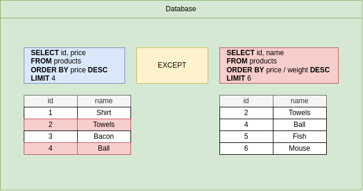

# Postgres

## 1: SQL Statements

**Add data**

```
INSERT INTO
  cities(name, lat, lng, country, iso3, population)
VALUES
  ('San Francisco', 37.7, 122.4, 'United States', 'USA', 883305);
```

**Read data**

```
SELECT name FROM cities;
```

**Update data**

```
UPDATE 
  cities
SET
  population = 19354921
WHERE
  name = 'New York';
```

**Delete data**

```
DELETE FROM
  cities
WHERE
  id = 300;
```

**Challenges of Postgres**

- Writing efficient queries to retrieve information.
- Designing the schema, or structure, of the database.
- Understanding when to use advanced features.
- Managing the database in a production environment.

**Database Design Process**

- What kind of thing are we storing?
  - We are storing the list of **cities**
    - We should create a **table** called **'cities'**
- What properties does this thing have?
  - Each city has a **name**, **country**, **population**, **and area**
    - The table should have **columns** of name, country, population, area
- What type of data does each of those properties contain?
  - `name` -> string
  - `country` -> string
  - `population` -> number
  - `area` -> number
    - Each **column** should indicate the type of data that it is going to store.

**Table**

- Collection of records.

**Columns**

- Each column records one property about a thing.


### Analyzing Create Table

**Creating Tables**

```
CREATE TABLE cities (
    name VARCHAR(50),
    country VARCHAR(50),
    population INTEGER,
    area INTEGER
);
```

**Keywords**

- Tell the database that we want to do something. 
- Always written out in capital letters.
- `CREATE TABLE`

**Identifiers**

- Tell the database what thing we want to act on. 
- Always written out in lower case letters.
- `cities`

**Column Data Types**

- `VARCHAR(50)`: 
  - Variable length character. 
  - Text! If we put in a string longer than 50 characters, we'll get an error.
- `INTEGER`: 
  - Number without a decimal. 
  - -2,147,438,647 to +2,147,483,647. 
  - Anything larger or smaller = error!

### Inserting data into a Table

```
INSERT INTO cities (name, country, population, area)
VALUES ('Tokyo', 'Japan', 38505000, 8223);
```

```
INSERT INTO cities (name, country, population, area)
VALUES 
    ('Dehli', 'India', 28125000, 2240),
    ('Shanghai', 'China', 22125000, 4015),
    ('Sao Paulo', 'Brazil', 2093500, 3043);
```

### Retrieving data with SELECT

```
SELECT * FROM cities;
```

```
SELECT name, country FROM cities;
```

**Create, Insert, and Select**

```
CREATE TABLE movies (
    title VARCHAR(60),
    box_office INTEGER
);

INSERT INTO movies (title, box_office)
VALUES 
    ('The Avengers', 1500000000),
    ('Batman v Superman', 873000000);
    
SELECT title, box_office FROM movies;
```

### Calculated Columns

- SQL is not just about pulling raw data out of a table.
- We can write SQL to transform or process data before we receive it.

```
SELECT name, population / area AS population_density 
FROM cities;
```

**Write a query that will select the name of each phone and calculate the total revenue for each phone (price X units_sold).
Rename this calculated column to revenue.**

```
SELECT name, price * units_sold AS revenue FROM phones;
```

### String Operators and Functions

- `||` - Join two strings.
- `CONCAT()` - Join two strings.
- `LOWER()` - Gives a lower case string.
- `LENGTH()` - Gives number of characters in a string.
- `UPPER()` - Gives an upper case string.

```
SELECT name || ', ' || country AS location FROM cities;
```

```
SELECT CONCAT(name, ', ', country) AS location FROM cities;
```

```
SELECT CONCAT(UPPER(name), ', ', UPPER(country)) AS location FROM cities;
```

## 2: Filtering Records

### Filtering Rows with "WHERE"

```
SELECT name, area FROM cities WHERE area > 4000;
```

```
SELECT name   FROM cities   WHERE area > 4000
-----------   -----------   -----------------
   Third          First           Second
```

```
SELECT name, area FROM cities WHERE area != 8223;
```

```
SELECT name, area FROM cities WHERE area <> 8223;
```

```
SELECT name, area FROM cities WHERE area BETWEEN 2000 AND 4000;
```

```
SELECT name, area FROM cities WHERE name IN ('Dehli', 'Shanghai');
```

```
SELECT name, area FROM cities WHERE area NOT IN (3043, 8223) OR name = 'Dehli' OR name = 'Tokyo';
```

**Ex 3: Write a query that will print the name and price of all phones that sold greater than 5000 units.**

```
SELECT name, price FROM phones WHERE units_sold > 5000;
```

**Ex 4: Write a query that will select the name and manufacturer for all phones created by Apple or Samsung.**

```
SELECT name, manufacturer 
FROM phones 
WHERE manufacturer = 'Apple' OR manufacturer = 'Samsung';

SELECT name, manufacturer 
FROM phones 
WHERE manufacturer IN ('Apple', 'Samsung');
```

### Calculations in "WHERE"

```
SELECT 
  name, 
  population / area AS population_density 
FROM 
  cities 
WHERE 
  population / area  > 6000;
```

**Ex 5: Write a query that will print the name and total_revenue of all phones with a total_revenue greater than 1,000,000.**

```
SELECT 
  name, 
  price * units_sold AS total_revenue 
FROM 
  phones 
WHERE 
  price * units_sold > 1000000;
```

### Updating Rows

```
UPDATE cities 
SET population = 39505000 
WHERE name = 'Tokyo';
```

### Deleting Rows

```
DELETE FROM cities 
WHERE name = 'Tokyo';
```

**Ex 6: Write two separate queries.**

- The first query should update the units_sold of the phone with name N8 to 8543
- The second query should select all rows and columns of the phones table

```
-- Write query here to update the 'units_sold' of the phone with name 'N8' to 8543

UPDATE phones 
SET units_sold = 8543 
WHERE name = 'N8';

-- Write query here to select all rows and columns of the 'phones' table

SELECT * FROM phones;
```

**Ex 7: Write two separate queries.**

- The first query should delete all phones that were created by Samsung
- The second query should select all rows and columns of the phones table

```
-- Write your delete SQL here

DELETE FROM phones 
WHERE manufacturer = 'Samsung';

-- Write query here to select all rows and columns from phones

SELECT * FROM phones;
```

## 3: Working with Tables

### Database Design

**What Tables Should We Make?**

- Common features (like authentication, comments, etc) are frequently build with conventional table names and columns.
- What type of resources exist in your app? Create a separate table for each of these features.
- Features that seem to indicate a relationship of ownership between two types of resources need to be reflected
in our table design.


## One-to-Many and Many-to-One Relationships

- One-to-Many Relationship:
  - A user has many photos.
  - A photos has many comments.
- Many-to-One Relationship:
  - A photo has one user.

**One-to-Many / Many-to-One Relationships**

- Boat (A boat **has many** crew members, A crew member **has one** boat):
  - Crew member
- School (A school **has many** students, A student **has one** school):
  - Student
- Company (A company **has many** employee, An employee **has one** company):
  - Employee

## One-to-One and Many-to-Many Relationships

- **One-to-One Relationships**:
  - Boats - Captains
  - Company - CEO
  - Capitol - Country
  - Student - Desk
  - Person - Driver's License
- **Many-to-Many Relationships**
  - Students - Classes
  - Tasks - Engineers
  - Players - Football Matches
  - Movies - Actors/Actress
  - Conference Calls - Employees

### Primary Keys and Foreign Keys

- **Primary Key**: Uniquely identifies record in table.
- **Foreign Key**: Identifies a record (usually in another table) that this row is associated with.


### Understanding Foreign Keys

- Comments have one photo.
  - Comments table should get a foreign key column pointing at the photo each comment belongs to.
- Comments have one user.
  - Comments table should get foreign key column pointing at the user each comment belongs to.

**The 'many' side of the relationship gets the foreign key column**


**Primary Keys**

- Each row in every table has one primary key.
- No other row in the same table can have the same value.
- 99% of the time called 'id'.
- Either an integer or a UUID.
- Will never change.

**Foreign Key**

- Rows only have this if they belong to another record.
- Many rows in the same table can have the same foreign key.
- Name varies, usually called something like 'xyz_id'.
- Exactly equal to the primary key of the reference row.
- Will change if the relationship changes.

### Auto Generated ID's

```
CREATE TABLE users (
  id SERIAL PRIMARY KEY,
  username VARCHAR(50)
);
```

```
INSERT INTO users(username)
VALUES
  ('monahan93'),
  ('pferrer'),
  ('si93onis'),
  ('99stroman');
```

```
CREATE TABLE photos (
  id SERIAL PRIMARY KEY,
  url VARCHAR(200),
  user_id INTEGER REFERENCES users(id)
);
```

```
INSERT INTO photos(url, user_id)
VALUES
    ('http://one.jpg', 4);
```

### Running Queries on Associated Data

```
INSERT INTO photos (url, user_id)
VALUES
  ('http://two.jpg', 1),
  ('http://25.jpg', 1),
  ('http://26.jpg', 1),
  ('http://754.jpg', 2),
  ('http://35.jpg', 3),
  ('http://256.jpg', 4);
```

**Find all the photos created by user with ID 4.**

```
SELECT * FROM photos WHERE user_id = 4;
```

**List all photos with details about the associated user for each.**

```
SELECT * FROM photos 
JOIN users ON users.id = photos.user_id;
```

***

**Ex 8: Creating and Using Foreign Keys**

- Add a column to the crew_members table definition that will relate crew_members to boats.  
- You should call this foreign key column boat_id
- Write a query that will fetch all columns for all crew_members associated with the boat that has an ID of 1.

```
-- Create table called 'boats'
CREATE TABLE boats (
    -- Note that this environment doesn't support 'SERIAL' keyword
    -- so 'AUTOINCREMENT' is used instead. Postgres always uses 'SERIAL'
    id INTEGER PRIMARY KEY AUTOINCREMENT,
    name VARCHAR
);

-- Insert two boats 
INSERT INTO boats (name)
VALUES ('Rogue Wave'), ('Harbor Master');

-- Create table called 'crew_members'
CREATE TABLE crew_members (
    -- Note that this environment doenst support 'SERIAL' keyword
    -- so 'AUTOINCREMENT' is used instead. Postgres always uses 'SERIAL'
    id INTEGER PRIMARY KEY AUTOINCREMENT,
    first_name VARCHAR,
    -- >>>>>>>> TODO #1 HERE!!!
    boat_id INTEGER REFERENCES boats(id)
);

-- Insert three crew members
INSERT INTO crew_members (first_name, boat_id)
VALUES ('Alex', 1), ('Lucia', 1), ('Ari', 2);

-- Write query here to fetch all columns for all crew_members associated with the boat that has an ID of 1
-- >>>>>>>> TODO #2 HERE!!!
SELECT * FROM crew_members WHERE boat_id = 1;
```

***

### Foreign Key Constraints Around Insertion

- We insert a photo that is tied to a user that exists.
  - Everything OK!
- We insert a photo that refers to a user that doesn't exists.
  - An error!
- We insert a photo that isn't tied to any user.
  - Put in a value of 'NULL' for the user_id!

### Constraints Around Deletion

| On Delete Option       | What happen if you try to delete a user when a photo is still referencing it |
|------------------------|---|
| **ON DELETE RESTRICT** | Throw an error |
| **ON DELETE NO ACTION** | Throw an error |
| **ON DELETE CASCADE** | Delete the photo too! |
| **ON DELETE SET NULL** | Set the 'user_id' of the photo to 'NULL' |
| **ON DELETE SET DEFAULT** | Set the 'user_id' of the photo to a default value, if one is provided |

**ON DELETE CASCADE**

```
DROP TABLE photos;
```

```
CREATE TABLE photos (
	id SERIAL PRIMARY KEY,
	url VARCHAR(200),
	user_id INTEGER REFERENCES users(id) ON DELETE CASCADE
);
```

```
DELETE FROM users WHERE id = 1;
```

```
SELECT * FROM photos;
```

```
id	url	            user_id
---------------------------
1	http:/one.jpg	4
5	http:/754.jpg	2
6	http:/35.jpg	3
7	http:/256.jpg	4
```

**ON DELETE SET NULL**

```
DROP TABLE photos;
```

```
CREATE TABLE photos (
	id SERIAL PRIMARY KEY,
	url VARCHAR(200),
	user_id INTEGER REFERENCES users(id) ON DELETE SET NULL
);
```

```
DELETE FROM users WHERE id = 4;
```

```
SELECT * FROM photos;
```

```
id	url	            user_id
---------------------------
2	http:/754.jpg	2
3	http:/35.jpg	3
1	http:/one.jpg	null
4	http:/256.jpg	null
```


## 4: Joins And Aggregation

### Queries with Joins and Aggregations

**Some answers with Joins and Aggragations**

- Find all the comments for the photo with ID = 3, along with the username of the comment author. **JOIN**
- Find the **average number** of comments per photo. **AGGREGATION**
- Find the photo with the **most comments** attached to it. **AGGREGATION**
- Find the photo with ID = 10 and get the number of comments attached to it.
- Find the user with the **most activity** (most comments + most photos). **AGGREGATION**
- Calculate the average number of characters per comment.

**Joins**

- Produces values by merging together rows from different related tables.
- Use a join most times that you're asked to find data involves multiple resources.

**Aggregation**

- Looks at many rows and calculates a single value.
- Words like 'most', 'average', 'least' are a sign that you need to use an aggregation.

### Joining Data from Different Tables

**For each comment, show the contents of the comment and the username of the user who wrote the comment.**


```
SELECT contents, username, photo_id FROM COMMENTS JOIN users ON users.id = comments.user_id;
```

***

**For each comment, list the contents of the comment and the URL of the photo the comment was added to.**


```
SELECT contents, url FROM COMMENTS JOIN photos on photos.id = comments.photo_id;
```

**Ex 9: Write a query that will join together these two tables. For each book, print the title of the book and the name 
of the author.**

```
SELECT title, name 
FROM books 
JOIN authors on authors.id = books.author_id;
```

### Alternate Joins Syntax

**Notes on Joins**

- Table order between 'FROM' and 'JOIN' frequently makes a difference.
- We must give context if column name collide.
- Tables can be renamed using the 'AS' keyword.
- There are a few kinds of joins!

### Missing Data in Joins

**Show each photo url and the username of the poster**


```
SELECT url, username 
FROM photos 
JOIN users ON user.id = photos.user_id;
```

***

### Why wasn't it included


- Photos `ddd.net` wasn't included as it does not have corresponding field in users table.

```
SELECT url, username
FROM photos
JOIN users ON users.id = photos.user_id;
```

***


***

### Each Join in Practice

**LEFT JOIN**

```
SELECT url, username
FROM photos
LEFT JOIN users ON users.id = photos.user_id;
```

**RIGHT JOIN**

```
SELECT url, username
FROM photos
RIGHT JOIN users ON users.id = photos.user_id;
```

**FULL JOIN**

```
SELECT url, username
FROM photos
FULL JOIN users ON users.id = photos.user_id;
```

***

### Does Order Matter?

**Does the order of tables in 'FROM' and 'JOIN' make a difference?**

- YES


***

**Ex 10: Write a query that will return the title of each book, along with the name of the author.  
All authors should be included, even if they do not have a book associated with them.**

```
-- LEFT JOIN
SELECT title, name
FROM authors
LEFT JOIN books ON books.author_id = authors.is;

-- RIGHT JOIN
SELECT title, name 
FROM books 
RIGHT JOIN authors ON books.author_id = authors.id;
```

### Where with Join

**Users can comment on photos that they posted. List the url and contents for every photo/comment where this occurred.**

- Who is commenting on their own photos?


```
SELECT url, contents 
FROM comments 
JOIN photos ON photos.id = comments.photo_id
WHERE comments.user_id = photos.user_id;
```

### Three Way Joins


```
SELECT url, contents, username
FROM comments
JOIN photos ON photos.id = comments.photo_id
JOIN users ON users.id = comments.user_id AND users.id = photos.user_id;
```

**Ex 11: Write a query that will return the title of each book, along with the name of the author, and the rating of a review.  
Only show rows where the author of the book is also the author of the review.**


```
SELECT title, name, rating
FROM reviews
JOIN books ON books.id = reviews.book_id
JOIN authors ON authors.id = reviews.reviewer_id AND authors.id = books.author_id;
```

***

## Aggregation of Records

**Grouping**

- Reduces many rows down to fewer rows.
- Done by using the 'GROUP BY' keyword.
- Visualizing the result is key to use.

**Aggregates**

- Reduces many values down to one.
- Done by using 'aggregate functions'.

### Picturing Group By


```
SELECT user_id 
FROM comments GROUP BY user_id;
```

### Aggregate Functions

- `COUNT()`: Returns the number of values in a group of values.
- `SUM()`: Finds the **sum** of a group of numbers.
- `AVG()`: Finds the **average** of a group of numbers.
- `MIN()`: Returns the **minimum** value from a group of numbers.
- `MAX()`: Returns the **maximum** value from a group of numbers.


```
SELECT MAX(id) 
FROM comments;
```

### Combining Group By and Aggregates


```
SELECT user_id, MAX(id)
FROM comments
GROUP BY user_id;
```


```
SELECT user_id, COUNT(id) AS num_comments_created
FROM comments
GROUP BY user_id;
```

### A Gotcha with Count

```
SELECT COUNT(user_id) FROM photos;

-- Just count number of all rows
SELECT COUNT(*) FROM photos;

SELECT user_id, COUNT(*)
FROM comments
GROUP BY user_id;
```

### Visualizing More Grouping

**Find the number of comments for each photo.**


```
SELECT photo_id, COUNT(*)
FROM comments
GROUP BY photo_id;
```

**Write a query that will print an author's 'id' and the number of books they have authored.**

```
SELECT author_id, COUNT(*)
FROM books
GROUP BY author_id;
```

**Write a query that will print an author's 'name' and the number of books they have authored.**

```
SELECT name, COUNT(*)
FROM books
JOIN authors ON authors.id = books.author_id
GROUP BY authors.name
```

### Filtering Groups with Having

- `FROM`: Specifies starting set of rows to work with.
- `JOIN`: Merges in data from additional tables.
- `WHERE`: Filters the set of rows.
- `GROUP BY`: Groups rows by a unique set of values.
- `HAVING`: Filters the set of groups.

### HAVING Examples

**Find the number of comments for each photo where the photo_id us less than 3 and the photo has more than 2 comments.**


```
SELECT photo_id, COUNT(*)
FROM comments
WHERE photo_id < 3
GROUP BY photo_id
HAVING COUNT(*) > 2;

-- WHERE photo_id < 3   (filer individual rows from comments)
-- GROUP BY photo_id    (group photos_id with id 1 and 2 to separate buckets)
-- HAVING COUNT(*) > 2; (only return bucket with num of elements greater than 2)
```

**Find the users (user_id) where the user has commented on the first 50 photos and the user added more than  
20 comments on these photos.**


```
SELECT user_id, COUNT(*)
FROM comments
WHERE photo_id < 50
GROUP BY user_id
HAVING COUNT(*) > 20;
```

**Given a table of phones, print the names of manufacturers and total revenue (price * units_sold) for all phones.
Only print the manufacturers who have revenue greater than 2,000,000 for all the phones they sold.**


```
SELECT manufacturer, SUM(price * units_sold)
FROM phones
GROUP BY manufacturer
HAVING SUM(price * units_sold) > 2000000;
```

### Working with large datasets

**Ex 15: Write a query to print the number of paid and unpaid orders.**


```
SELECT paid, COUNT(*) 
FROM orders 
GROUP BY paid;
```

**Ex 16: Join together the users and orders tables. Print the first_name and last_name of each user, 
then whether or not they have paid for their order.**


```
SELECT first_name, last_name, paid
FROM users 
JOIN orders ON orders.user_id = users.id
```

***

## Sorting Records


```
SELECT * 
FROM products
ORDER BY price ASC;
```

### Two Variations on Sorting

```
SELECT *
FROM products
ORDER BY name;

-- Second ordering rule
SELECT *
FROM products
ORDER BY price, weight;
```

### Offset and Limit


```
-- Out of 50 users, skip first 40 and print last 10
SELECT * 
FROM users 
OFFSET 40;
```

```
SELECT * 
FROM users
LIMIT 50;

-- Select 5 most expensive products
SELECT *
FROM products
ORDER BY price
LIMIT 5;

-- Only show user 20 items at a time (pagination)
SELECT *
FROM products
ORDER BY price
LIMIT 20
OFFSET 0;
```

**Ex 17: Write a query that shows the names of only the second and third most expensive phones.**

```
SELECT name
FROM phones 
ORDER BY price DESC
LIMIT 2
OFFSET 1;
```

***

## Unions and Sets

**Find the 4 products with the highest price and the 4 products with the highest price/weight ratio**

```
(
    SELECT *
    FROM products
    ORDER BY price DESC
    LIMIT 4
)
UNION ALL
(
    SELECT *
    FROM products
    ORDER BY price / weight DESC
    LIMIT 4   
);
```

### Commonalities with Intersects

- `UNION`: Join together the results of two queries and remove duplicate rows.
- `UNION ALL`: Join together results of two queries.
- `INTERSECT`: Find the rows common in the results of two queries. Remove duplicates.
- `INTERSECT ALL`: Find the rows common in the results of two queries.
- `EXCEPT`: Find the rows that are present in first query but not second query. Remove duplicates.
- `EXCEPT ALL`: Find the rows that are present in first query but not second query.

### Intersect

```
(
    SELECT *
    FROM products
    ORDER BY price DESC
    LIMIT 4
)
INTERSECT ALL
(
    SELECT *
    FROM products
    ORDER BY price / weight DESC
    LIMIT 4   
);
```

### Except



```
(
  SELECT *
  FROM products
  ORDER BY price DESC
  LIMIT 4
)
EXCEPT
(
  SELECT *
  FROM products
  ORDER BY price / weight DESC
  LIMIT 4   
);
```

**Ex 18: Write a query that will print the manufacturer of phones where the phone's price is less than 170.  
Also print all manufacturer that have created more than two phones.
IMPORTANT: You don't need to wrap each query with parenthesis! Your solution should not have any parens in it.**

```
SELECT manufacturer
FROM phones
WHERE price < 170
UNION 
SELECT manufacturer
FROM phones
GROUP BY manufacturer
HAVING COUNT(*) > 2;
```

***

## Assembling Queries with SubQueries

**List the name and price of all products that are more expensive than all products in the 'Toys' department.**


```
SELECT name,proce
FROM products
WHERE price > 876;
```

```
SLECT name, price
FROM products
WHERE price > (
  SELECT MAX(price) FROM products WHERE department = 'Toys'
)
```

### Thinking About the Structure of Data

**Understanding the shape of a query result**

- `SELECT * FROM orders`: Many rows, many columns.
- `SELECT id FROM orders`: Many rows, one column.
- `SELECT COUNT(*) FROM orders`: One row, one column (single value) Scalar query.

### Subqueries in SELECT


```
SELECT name, price, (
  SELECT MAX(price) FROM products 
)
FROM PRODUCTS
WHERE price > 867;
```


```
SELECT name, price, (
  SELECT price FROM products WHERE id = 3
) AS id_3_price
FROM products
WHERE price > 867;
```

**Write a query that prints the name and price for each phone.  In addition, print out the ratio of the phones price 
against max price of all phones (so price / max price).  Rename this third column to price_ratio**

```
SELECT name, price, price / (SELECT MAX(price) FROM phones) AS price_ratio
FROM phones;
```

### Subqueries in FROM


- Subquery must have an alias applied to is (**AS p**)

```
SELECT name, price / weight AS price_weight_ratio
FROM products;
```

```
SELECT name, price_weight_ratio
FROM (
  SELECT name, price / weight AS price_weight_ratio
  FROM products
) AS p 
WHERE price_weight_ration > 5;
```

```
SELECT *
FROM (SELECT MAX(price) FROM products) AS p;
```

**Find the average number of orders for all users**


```
SELECT AVG(p.order_count)
FROM (
  SELECT user_id, COUNT(*) AS order_count
  FROM orders
  GROUP BY user_id
) AS p
```

**Calculate the average price of phones for each manufacturer. Then print the highest average price. Rename this value 
to max_average_price**

```
SELECT MAX(p.avg_price) AS max_average_price
FROM (
  SELECT AVG(price) AS avg_price
  FROM phones
  GROUP BY manufacturer
) AS p;
```

### Subqueries in a JOIN Clause

```
SELECT first_name
FROM users
JOIN (
  SELECT user_id FROM orders WHERE product_id = 3
) AS o
ON o.user_id = users.id;
```

### Subqueries with WHERE

**Show the id of orders that involve a product with a price/weight ratio greater than 5**

```
SELECT id
FROM orders
WHERE product_id IN (
  SELECT id FROM products WHERE price / weight > 50
);
```

**Show the name of all products with a price grater than the average product price**

```
SELECT name
FROM products
WHERE price > (
  SELECT AVG(price) FROM products;
);
```

**Write a query that prints out the name and price of phones that have a price greater than the Samsung S5620 Monte.**

```
SELECT name, price 
FROM phones
WHERE price > (SELECT price FROM phones WHERE name = 'S5620 Monte'); 
```

**Show the name of all products that are not in the same department as products with a price less than 100**

```
SELECT name, department
FROM products
WHERE department NOT IN (
  SELECT department FROM products WHERE price < 100
);
```

**Show the name, department, and price of products that are more expensive than all products in the 'industrial' 
department.**

```
SELECT name, department, price
FROM products
WHERE price > ALL (
  SELECT price FROM products WHERE department = 'Industrial'
);
```

**Show the name of products that are more expensive that at least one product in the 'Industrial' department**

```
SELECT name, department, price
FROM products
WHERE price > SOME (
  SELECT price
  FROM products
  WHERE department = 'Industrial'
);
```

**Questions**

1) Is the following a valid use of a subquery? 

```
SELECT price, (SELECT manufacturer, units_sold FROM phones)
FROM phones;
```

- No, the subquery is returning more than one column in a `SELECT` clause.

2) Is the following a valid use of a subquery?

```
SELECT price * units_sold
FROM (SELECT * FROM phones);
```

- No, a subquery in a `FROM` must be given an alias.

3) Is the following a valid use of a subquery?

```
SELECT price * units_sold
FROM phones
WHERE price > ALL (SELECT price FROM phones WHERE manufacturer = 'Nokia');
```

**Write a query that print the name of all phones that have a price greater than any phone made by Samsung.**

```
SELECT name
FROM phones
WHERE price > ALL (
  SELECT price FROM phones WHERE manufacturer = 'Samsung'
);
```

**Show the name, department, and price of the most expensive product in each department**

```
SELECT name, department, price
FROM products AS p1
WHERE p1.price = (
  SELECT MAX(price)
  FROM products AS p2
  WHERE p1.department = p2.department
);
```

**Without using a join or a group by, print the number of orders for each product**

```
SELECT p1.name,
  (
    SELECT 
    FROM orders AS o1
    WHERE o1.product_id = p1.id
  ) AS num_orders
FROM products AS p1
```

### A Select Without a From.

```
SELECT (
  SELECT MAX(price) FROM products
) / (
  SELECT MIN(proce) FROM products
)
```

**Using only subqueries, print the max price, min price, and average price of all phones.  Rename each column to 
max_price, min_price, avg_price**

```
SELECT 
  (SELECT MAX(price) FROM phones) AS max_price,
  (SELECT MIN(price) FROM phones) AS min_price,
  (SELECT AVG(price) FROM phones) AS avg_price;
```

***

## 10: Selecting Distinct Records

**What unique departments are there?**

```
SELECT DISTINCT department 
FROM products;
```

**Count unique departments.**

```
SELECT COUNT(DISTINCT department) 
FROM products;
```

**Write a query that will print the number of unique phone manufacturers.**

```
SELECT COUNT(DISTINCT manufacturer)
FROM phones;
```

***

## 11: Utility Operators, Keywords, and Functions

**The Greatest Value in a List.**

```
SELECT GREATEST(20, 10, 30);
```

**Compute the cost to ship each item.**

- Shipping is the maximum of (weight * $2) or $30.

```
SELECT name, weight, GREATEST(30, 2 * weight)
FROM products;
```

**The Least Value in a List!**

```
SELECT LEAST(1, 20, 50, 100);
```

**All products are on sale!**

- Price is the least of the products price * 0.5 or $400.

```
SELECT name, price, LEAST(price * 0.5, 400)
FROM products;
```

**Print each product and its price. Also print a description of the price**

- If price > 600 then 'high'.
- If price > 300 then 'medium'.
- else print 'cheap'.

```
SELECT
  name,
  price,
  CASE
    WHEN price > 600 THEN 'high'
    WHEN price > 300 THEN 'medium'
    ELSE 'cheap'
  END
FROM products;
```


