# React

**The App function is a React Component**

- App Component: Produces JSX and handles user events
- JSX: Set of instructions to tell React what content we want to show on the screen

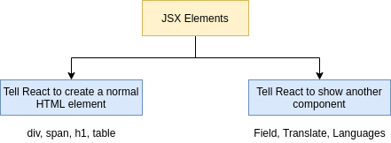

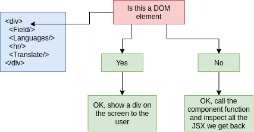

- React:
    - Knows how to work with components
    - Called a 'reconciler'
- ReactDOM:
    - Knows how to take instructions on what we want to show and turn it into HTML
    - Called a 'renderer'
- useState:
    - Function for working with React's 'state' system
    - State is used to keep track of data that changes over time
    - Used to make React update the HTML on the screen
    
**Create React project**

```
node -v

// clear cache
npx clear-npx-cache

// remove global react package
npm uninstall -g create-react-app

npm install -g create-react-app
```

```console
npx create-react-app myapp

npx create-react-app jsx
```

- Brand new React project:
    - Webpack
    - Babel: Command line tool that can take any version of JavaScript and spit out to never version.
        - `ES2015JS -- Babel --> ES5 JS`
    - Dev Server

**React Project Structure**

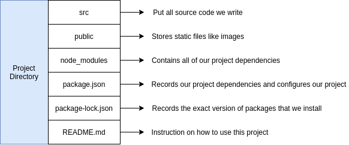

**Start and Stop React Project**

```console
npm start
```

**Functional Component**

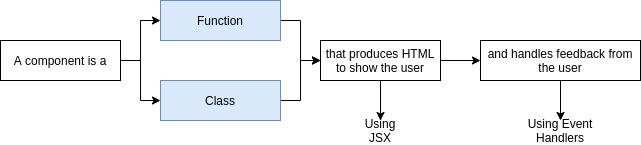

## JSX

**JSX**

- Special dialect of JS (it is not HTML!)
- Browsers don't understand JSX code! We write JSX then run tools to turn it into normal JS
- Very similar in form and function to HTML with a couple of differences

**JSX vs HTML**

- Adding custom styling to an element uses different syntax
- Adding a class to an element uses different syntax
- JSX can reference JS variables

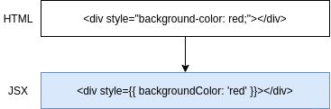
 
## Communicating with Props

- Component Nesting: A component can be shown inside of another.
- Component Reusability: We want to make components that can be easily reused throughout application.
- Component Configuration: We should be able to configure a component when it is created.

```
npm install --save faker
```

### Props

- System for passing data from a **parent** component to a **child** component.
- Goal is to customize or configure a child component.

**Providing props from parent to child**

```
<CommentDetail author="Sam" />

author - Name of the prop
"Sam" - Value of the prop
```

## Class-Based Components

### How React Used to Be

- Functional Components: 
    - Can produce JSX to show content to the user.
- Class Components:
    - Can produce JSX to show content to the user.
    - Can use the Lifecycle Method system to run code at specific points in time.
    - Can use the 'state' system to update content on the screen.

### How react Is Now

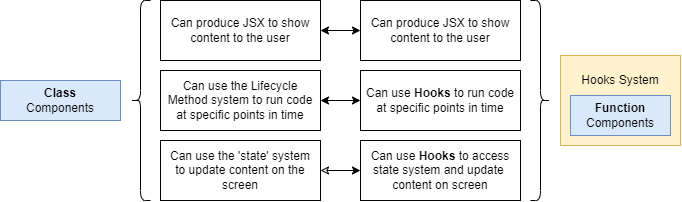

- Companies with **established projects** are using Class-based components.
- Companies with **newer projects** may be using Class-based **or** Function-based components.

### Application Timeline

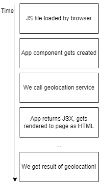

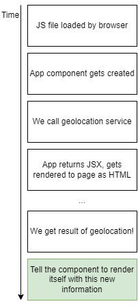

**Rules of Class Components**

- Must be a Javascript Class.
- Must extend (subclass) `React.Component`.
- Must define a 'render' method that return some amount of JSX.

**Rules of State**

- Only usable with class components.
    - Technically can be used with functional components using the 'hooks' system.
- You will confuse props with state.
- 'State' is a JS object that contains data relevant to a component.
- Updating 'state' on a component causes the component to (almost) instantly rerender.
- State must be initialized when a component created.
- State can **only** be updated using the function 'setState'.

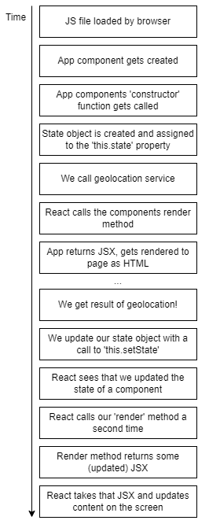

### Component Lifecycle

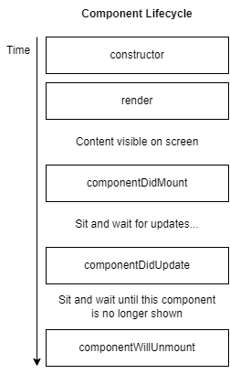

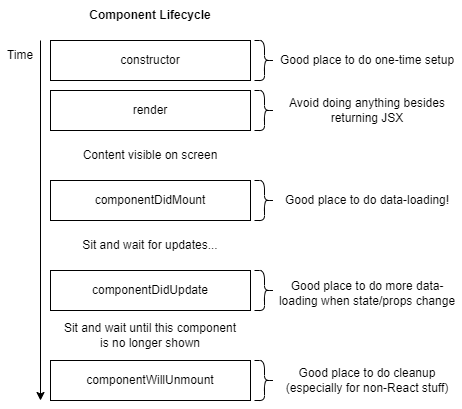

**Other lifecycle methods (rarely used)**

- `shouldComponentUpdate`
- `getDerievedStateFromProps`
- `getSnapshotBeforeUpdate`

### Event Handler

- User clicks on something: `onClick`
- User changes text in an input: `onChange`
- User submits a form: `onSubmit`

### Controlled vs Uncontrolled Elements

**Flow**

```
1. User types in input
2. Callback gets invoked
3. We call setState with the new value
4. Components rerenders
5. Input is told what its value is (coming from state)
```

### Making API Requests

```
npm install --save axios
```

```
List of 'To Do' Items                   Rendered List

{id: 1, task: 'Take out trash'}  -----> <div>Take out trash</div>
{id: 2, task: 'Wash the car' }   -----> <div>Wash the car</div>
{id: 3, task: 'Walk the dog' }   -----> <div>Walk the dog</div>
```

### React Refs

- Gives access to a single DOM element.
- We create refs in the constructor, assign them to instance variables, then pass to a particular JSX element as props.

***

## Hooks

### Hooks System

- `useState:` Function that lets you use **state** in a functional component.
- `useEffect:` Function that lets you use something like **lifecycle methods** in a functional component.
- `useRef:` Function that lets you create a **'ref'** in a function component.

```
Hooks are a way to write reusable code, instead of more classic techniques like inheritance
``` 

**Primitive Hooks**

- useState, useEffect, useContext, useReducer, useCallback, useMemo, useRef, useImperativeHandle,
useLayoutEffect, useDebugValue

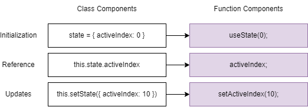

**The useEffect Hook**

- Allows function components to use something like lifecycle methods.
- We configure the hook to run some code automatically in one of three scenarios:
    - When the component is rendered for the first time only.
    - When the component is rendered **for the first time and whenever it renders.**
    - When the component is rendered **for the first time and whenever it renders, and some piece of data
    has changed.** 

**UseEffect second argument**

- `[]:` Run at initial render.
- `..nothing..:` Run at initial render - Run after every rerender.
- `[data]:` Run at initial render - Run after every rerender if data has changed since last render.

## Deployment

- Deployment Bundle

```
Vercel Deployment

Netlify Deployment
```

***

## What is Redux?

- State management library
- Makes creating complex applications easier
- Not required to create a React app!
- Not explicitly design to work with React!

```
npm install --save redux react-redux
```

***

```
npm install react-router-dom@5
```

## Routes

- BrowserRouter: Uses everything after the TLD (.com, .net) or port as the 'path'.
- HashRouter: Uses everything after a # as the 'path'.
- MemoryRouter: Doesn't use the URL to track navigation.

## Authentication

**Email/Password Authentication**

- We store a record in a database with the user's email and password.
- When the user tries to login, we compare email/password with what is stored in DB.
- A user is 'logged in' when they enter the correct email/pw.

**OAuth Authentication**

- User authenticates with outside service provider (Google, Linkedin, Facebook).
- User authorizes our app to access their information.
- Outside provider tells us about the user.
- We are trusting the outside provider to correctly handle identification of a user.
- OAuth can be used for (1) user identification in our app and (2) our app making actions on behalf of user.


