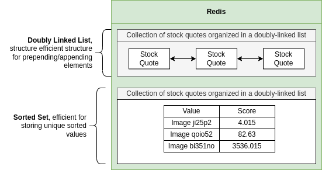

# Redis

**Why Use Redis?**

- Redis is fast.
- All data is stored in memory.
- Data is organized in simple data structures.
- Redis has a simple feature set.



| Traditional Database Feature Set | Redis Feature Set |
|---|-------------------|
| Enforced data scheme | ...Not much!      | 
| Triggers |                   |
| Foreign key constraints |                   |
| Uniqueness of arbitrary properties |                   |
| SQL Support |                   |
| Transaction rollback |                   |

```
SET key value
SET message 'Hi there!'

GET message
```


**Redis data types**

- String (Store plain string or number):
  - SET
  - GET
  - APPEND
- List (List of strings):
  - LINDEX
  - LLEN
  - LINSERT
- Hash (Collection of key-value pairs):
  - HGET
  - HSET
  - HDEL
- Set (Set of strings (each string is unique)):
  - SADD
  - SCARD
  - SDIFF
- Sorted Set (Set of strings in a particular order):
  - ZADD
  - ZDIFF
  - ZCOUNT
- Bitmap (Kind of like a collection of booleans):
  - BITOP
  - BITCOUNT
  - BITPOS
- Hyperloglog (Kind of like a collection of booleans):
  - PFADD
  - PDCOUNT
  - PFMERGE
- JSON (Nested JSON structure):
  - JSON.SET
  - JSON.GET
  - JSON.DEL
- Index (Internal data used for searching):
  - FT.SEARCH
  - FT.CREATE
  - FT.PROFILE

**Commands for Handling Strings**

```
* Getters
GET, GETDEL, GETEX, GETRANGE, LCS, MGET, SUBSTR,

* Setters
MSET, MSET, MSETNX, SET, SETEX, SETNX, SETRANGE, STRLEN, DEL, GETSET, APPEND
```

**Variations of SET**

- `SET`:
  - `key`: Key we are trying to set
  - `value`: Value we want to storage
  - `EX | PX | EXAT | PXAT | KEEPTTL`: Options for when this value should expire
  - `NX | XX`: Only set this key if...:
    - `SET asdf 'Hi there' XX`: Only run the SET if the key already exists.
    - `SET asdf 'Hi there' NX`: Only run the SET if the key does not exists.
  - `GET`: Return the previous value stored at this key

**Use Cases of Expiration Options**

- `SET`:
  - `color`: Set the key 'color'
  - `red`: Store the value 'red'
  - `EX 2`: Automatically delete this value after 2 seconds!

```
SET color red EX 2
```

**Setting multiple keys**

- `SETX` does the same thing as SET with the EX option.
- `SETNX` does the same thing as SET with the NX option.
- `MSET`:
  - `color`: Set the key 'color'
  - `red`: Store the value 'red'
  - `car`: Also, set the key 'car'
  - `toyota`: Store the value 'toyota' for 'car'
- `MSETNX` (If any of the keys already exists, no set is done):
  - `color`: Set the key 'color'
  - `red`: Store the value 'red'
  - `car`: Also, set the key 'car'
  - `toyota`: Store the value 'toyota' for 'car'  

**GET and MGET**

- `GET`:
  - `color`: Retrieve the value associated with 'color'
- `MGET`:
  - `color`: Retrieve the value associated with 'color'
  - `model`: Also, retrieve the value associated with 'model'

**String Ranges**

- Delete a key, works with any data type, not just strings.
- `DEL`:
  - `color`: Delete the key 'color'
- `GETRANGE`:
  - `color`: Find the key 'color'
  - `0`: Return all the characters between the first
  - `3`: ...and the 4th
- `SETRANGE` (update a portion of an existing string):
  - `color`: Change the string at 'color'.
  - `2`: Start replacing characters at index 2 with...
  - `blue`: ...this string

**Commands examples**

- Fetch one to three properties of a single item: `GETTANGE item:1 0 0`
- Update one to three properties of a single item: `SETRANGE item:1 0 bcd`
- Fetch all properties related to several items: `MGET item:1 item:2 item:3`
- Create several items: `MSET item:4 trq item:5 nzq`

**Dealing with Numbers**

- Using a 'number' command on a key that references a string result in an error.

```
SET, GET, MGET, MSET, DEL

DECR, DECRBY, INCRBYFLOAT, INCRBY, INCR
```

- `INCR` Adds 1 to the number stored at key:
  - `age`: Key where the number is stored.
- `DECR` Subtracts 1 from the number stored at key:
  - `age`: Key where the number is stored.
- `INCRBY` Adds an integer to the number stored at key:
  - `age`: Key where the number is stored.
  - `10`: Value to add to the number.
- `DECRBY` Subtracts an integer from the number started at key:
  - `age`: Key where the number is stored.
  - `12`: Value to subtract from the number.
- `INCRBYFLOAT` Adds a float to the number stored at key:
  - `age`: Key where the number is stored.
  - `6.400145`: Value to add to the number.

**Dealing with concurrency**

- Use a Redis transaction with 'WATCH'.
- Use a lock.
- Use `INCR`
- Redis processes all commands synchronously - one at a time

**Exercises**

- Store the value 'Toyota' at the key 'car'.

```
SET car Toyota
```

- Store the value 'triangle' at the key 'shape' only if the key 'shape' is not defined.

```
SET shape traingle NX
```

- Store the value 'Todays Headlines' at the key 'news', but automatically expire the key after three seconds.

```
SET news "Today's Headlines" EX 3
SET news "Today's Headlines" PX 3000
```

**Redis Design Methodology**

- What type of data are we storing?
  - Strings
- Should we be concerned about the size of data?
  - YES! Only cache certain pages.
- Do we want to expire this data?
  - Yes, expire after some number of minutes/hours/days.
- What will the key naming policy be for this data?
  - a
- Any business-logic concerns?
  - Nope

**Key Naming Methodology**

- Keys should be unique.
- Other engineers should understand what a key is for.
- Tip - use functions to generate your key names so you never make a typo.
- Extremely common practice is to use a ':' to separate different parts of the key.
  - users:45
  - items:19
  - users:posts:901
  - posts:jqip25jnm
- We are going to use a # before unique ID's to make implementing search easier:
  - users#45
  - items#19
  - users:posts#901
  - posts#jqip25jnm

**Redis**

- `pagecache#/about` -> '<html></html>'
- `pagecache#/privacy` -> '<html></html>'
- `pagecache#/auth/signin` -> '<html></html>'
- `pagecache#/auth/signup` -> '<html></html>'

## Hashes in Redis

- Store nested key/value structure.
- Not allow deeply nested structure.

**HSET**

- Create a hash and store nested key-value pairs.
- `HSET`:
  - `company`: Name of the key to store this hash at.
  - `name`: Name of **first** k-v pair.
  - `'Company Co'`: Value **first** k-v pair.
  - `age`: Name of **second** k-v pair.
  - `1915`: Value of **second** k-v pair.

```
HSET company name 'Concrete Co' age 1915 industry materials revenue 5.3
```

**HGET**

- Get a single field from a hash.
- `HGET`:
  - `company`: Name of the hash to look at.
  - `name`: Name of the k-v pair to retrieve.

```
HGET company name
```

**HGETALL**

- Get all k-v pairs from a hash.
- `HGETALL`:
  - `company`: Name of the hash to retrieve.

```
HGETALL company
```

**HEXISTS**

- Does the key exist in the hash? Returns '1' if it exists, '0' if not.
- `HEXISTS`:
  - `company`: Hash to look at.
  - `age`: Key to check for existence.

```
HEXISTS company age
```

**DEL**

- Deletes the hash stored at a key.
- `DEL`:
  - `company`: Hash to delete.

```
DEL company
```

**HDEL**

- Deletes a single k-v pair stored in a hash.
- `HDEL`:
  - `company`: Hash to find.
  - `age`: K-V pair to delete.

```
HDEL company age
```

**HINCRBY**

- Adds a value to a number stored in a hash. Sets the key to the 'add' value if the key isn't defined already.
- `HINCRBY`:
  - `company`: Hash to find.
  - `age`: Find the number stored at this key.
  - `10`: Value to add.

```
HINCRBY company age 10
```

**HINCRBYFLOAT**

- `HINCRBYFLOAT`:
  - `company`: Hash to find.
  - `age`: Find the number stored at this key.
  - `1.004`: Value to add.

```
HINCRBYFLOAT company age 1.004
```

**HSTRLEN**

- Get the length of a string stored in a hash. Returns 0 if no string is set.
- `HSTRLEN`:
  - `company`: Hash to find.
  - `name`: Get the length of string stored at this key.

```
HSTRLEN company name
```

**HKEYS and HVALS**

- Get all the keys of a hash.
- `HKEYS`:
  - `company`: Hash to find.
- Get all the values of a hash.
- `HVALUES`:
  - `company`: Hash to find.

```
HKEYS company
HVALS company
```

**Hashes with Code**

- Most common commands - `HGETALL`, `HSET`.
- Some behaviors are a unexpected.
- `hGetAll` returns empty object if key does not exists. More complex existence check required.

```ts
const car = await client.hGetAll('car');

if (Object.keys(car).length === 0) {
    console.log('Car not found, respond wioth 404');
    return;
}
```

**Design of queries**

- Home page:
  - Items sorted by price.
  - Items sorted by ending time.
  - Items sorted by views.
  - Search for items by name.
- Sign In:
  - Find a user with given user name.
  - Create a session (auth).
  - Find a session (auth).
  - Get a user with a given ID (auth).
- Sign Up:
  - Create a user.
- Items create:
  - Create an item.
- Items show:
  - Fetch an item with a given ID.
  - Find the # of likes tied to an item.
  - Like an item.
  - Unlike an item.
  - See if current user likes an item.
  - Create a bid tied to an item.
  - Find the big history of an item.
  - Find items similar to an existing item.
  - Increment the number of views for an item.
- Seller profile page:
  - Find items a user likes.
  - Find items two different users both like.
- List of all items:
  - Find items created by a user, sorted by various criteria.

**Things in App**

- users: Hash
- sessions: Hash
- items: Hash
- bids: Don't use hash
- views: Don't use hash
- likes: Don't use hash

**Reasons to Store as Hash**

- The record has many attributes.
- A collection of these records have to be sorted many different ways.
- Often need to access a single record at a time.

**Don't Use Hashes When...**

- The record is only for counting or enforcing uniqueness.
- Record stores only one or two attributes.
- Used only for creating relations between different records.
- The record is only used for time series data.

**Serialize and Deserialize**

- Serialize:
  - Gets an object ready to ge **INTO** Redis as a hash.
  - Removed ID
  - Turns dates into a queryable format.
  - etc...
- Deserialize:
  - Formats data coming **OUT** of Redis.
  - Add in ID.
  - Parse string numbers into plain number.
  - etc...

## Sets

- A Set is a collection of strings where each string is unique.

**Sey Commands**

```
SADD  SREM  SRANDMEMBER   SCARD
SMOVE SPOP

--------------    ---------------------
SMEMBERS  SCAN    SMISMEMBER  SISMEMBER

-------------------   ----------------
SUNION  SUNIONSTORE   SDIFF SDIFFSTORE

------------------------------
SINTER  SINTERSTORE SINTERCARD
```

**SADD**

- Adds a string to a set. Returns '1' if element added, '0' if not.
- `SADD`:
  - `colors`: Add to the set stored at this key.
  - `red`: Add this string to the set

```
SADD colors red
```

**SMEMBERS**

- Returns all the strings stored in a set.
- `SMEMBERS`:
  - `colors`: Get keys from this set.

```
SMEMBERS colors
```

**Union of Sets**

- Union: Return all unique elements from all sets.
- Intersect: Return elements that exist in all sets.
- Diff: Return elements that exist in only one set.

**Union**

```
SADD colors:1 red blue orange
SADD colors:2 blue green purple
SADD colors:3 blue red purple

SUNION colors:1 colors:2 colors:3

[
  "orange",
  "green",
  "purple",
  "red",
  "blue"
]
```

**Intersect**

```
SINTER colors:1 colors:2 colors:3

[
  "blue"
]
```

**Difference**

- Order of keys matters.

```
SDIFF colors:1 colors:2 colors:3

[
  "orange"
]
```

**Store Variations**

```
SINTERSTORE colors:results colors:1 colors:2 colors:3
```

**SISMEMBER**

- Return 1 if the element exists in the set, 0 if not.
- `SISMEMBER`:
  - `colors:1`: Look at this set...
  - `red`: ...does 'red' exists in it?

```
SISMEMBER colors:1 red
```

**SMISMEMBER**

- Runs multiple 'SISMEMBER' at the same time.
- `SMISMEMBER`:
  - `colors:1`: Look at this set...
  - `red`: ...does 'red' exist in it?
  - `green`: ...does 'green' exists in it?
  - `blue`: ...does 'blue' exist in it?

```
SMISMEMBER colors: 1 red green blue
```

**Scanning a Set**

**SCARD**

- Return the number of elements in a set.
- `SCARD`:
  - `colors:1`: Look at this set, print the number of elements in it.

```
SCARD colors:1
```

**SREM**

- Remove an element from a set.
- `SREM`:
  - `colors:1`: Look at this set...
  - `red`: ...remove the value 'red' from it.

```
SREM colors:1 red
```

**SSCAN**

- Scan through all the elements in a set.
- `SSCAN`:
  - `colors:1`: Look at this set...
  - `0`: cursor ID
  - `COUNT 2`: # of elements to return

```
SSCAN colors:1 0 COUNT 2
```

**Set Use Cases**

- Enforcing uniqueness of any value.
- Creating a relationship between different records.
- Finding common attributes between different things.
- General list of elements where order doesn't matter.

## Sorted Sets

- A mix of a hash and a set.
- No 'keys' and 'values'. There are 'members' and 'scores'.
- **Members** are unique.
- **Scores** don't have to be unique.
- Scores are sorted from least to greatest.

**ZADD**

- Add a member-score pair to a sorted set.
- `ZADD`:
  - `products`: Sorted set we want to add data to.
  - `45`: Score
  - `monitor`: Member

```
ZADD products 45 monitoe
```

**ZSCORE**

- Get the score of a member.
- `ZSCORE`:
  - `products`: Sorted set to access.
  - `monitor`: Give us the score of this member.

```
ZSCORE products monitor
```

**ZREM**

- Remove a member from a sorted set.
- `ZREM`:
  - `products`: Sorted set to access.
  - `monitor`: Member to remove.

```
ZREM products monitor
```

**ZCARD**

- Get the number of members in a sorted set.
- `ZCARD`:
  - `products`: Sorted set we want to access.

```
ZADD products 45 cpu
ZADD products 10 keyboard
ZADD products 55 power

ZCARD products
```

**ZCOUNT**

- Get the number of members in a sorted set within a range of scores.
- `ZCOUNT`:
  - `products`: Sorted set to access.
  - `0`: Minimum score to consider.
  - `50`: Maximum score to consider.

```
ZCOUNT products 0 50

# up to not including
ZCOUNT products (0 (50
```

**ZPOPMIN**

- Remove and return some number of the **lowest**-score pairs.
- `ZPOPMIN`:
  - `products`: Sorted set we want to access.
  - `2`: (Optional) Remove the 2 lowest member-score pairs.

```
ZPOPMIN products 2
```

**ZPOPMAX**

- Remove and return some number of the **highest**-score pairs.
- `ZPOPMAX`:
  - `products`: Sorted set we want to access.
  - `2`: (Optional) Remove the 2 highest member-score pairs.

**ZINCRBY**

- Adjust a member's score by the given amount.
- `ZINCRBY`:
  - `products`: Sorted set we want to access.
  - `15`: Amount to add to the score.
  - `keyboard`: Add to this member.

```
ZINCRBY products 15 keyboard
```

**ZRANGE**

- Retrieve a range of members and (optionally) scores.
- `ZRANGE`:
  - `products`: Sorted set we want to access.
  - `1`: Find members with this minimum index.
  - `2`: Find members with this maximum index.
  - `BYSCORE`: Treat the min and max as scores.
  - `WITHSCORES`: Include the score of each member in the response.
  - `REV`: Reverse the order.
  - `LIMIT 1 2`: Skip the first element, then give the next two/

```
ZRANGE products 1 2 WITHSCORES

ZRANGE products 0 50 BYSCORE WITHSCORES

ZRANGE products 1 2 REV LIMIT 1 2
```

**Sorted Set Use Cases**

- Tabulating 'the most' or 'the least' of a collection of hashes.
- Creating relationships between records, sorted by some criteria.

## Sort

- Probably the trickiest command to understand.
- Used on sets, sorted sets, and lists.
- Calling this command 'SORT' is misleading!
- Terminology we use with 'sort' conflicts with terms we use for sorted set!
- SORT operates on the MEMBERS of a sorted set, not the scores!
- SORT refers to these members as scores!

```
SORT books:likes ALPHA

SORT books:likes BY books:*->year

SORT books:likes BY books:*->year
  GET #
  GET books:*->title
  GET books:*->year
```

## HyperLogLog

- Algorithm for approximately counting the number of unique elements (like view counts).
- Similar to a set, but doesn't store the elements.

**PFADD**

```
PFADD veretables celary
```

- Each additional string in set = `~40bytes`
- Item with a million views = `40b * 1000000 / 1024 / 1014 = 38 MB`
- `User views an item` -> `PFADD views:5 username1`:
  - Did this return a 1? New view, so increment views.
  - Did this return a 0? User already viewed.

## Lists

- Store an ordered list of strings.
- Not an array!
- Implemented as doubly-linked list.
- Often used for time-series data.
- You should probably use this less often than you think.

**LPUSH**

- Add an element to the left side (start) of the list.
- `LPUSH`:
  - `temps`: Find the keys 'temps'.
  - `20`: Adds this value.

```
LPUSH temps 20
```

**RPUSH**

- Add an element to the right side (end) of the list.
- `RPUSH`:
  - `temps`: Find the key 'temps'.
  - `25`: Adds this value.

```
RPUSH temps 25
```

**LLEN**

- Get the number of elements in the list.
- `LLEN`:
  - `temps`: Find the key 'temps'.

```
LLEN temps
```

**LINDEX**

- Get the value stored at the provided index.
- `LINDEX`:
  - `temps`: Find the key 'temps'.
  - `0`: Get the value at the provided index.

```
LINDEX temps 0
```

**LRANGE**

- Gets a range of elements from a list.
- `LRANGE`:
  - `temps`: Find the key 'temps'.
  - `0`: Take all elements from this index...
  - `3`: Up to (and including!) this one.

```
LRAND temps 0 3
```

**LPOS**

- Get the index of a value stored in a list.
- `LPOS`:
  - `temps`: Find the key 'temps'.
  - `25`: Look for the value '25'.
  - `RANK 2`: Find the 2nd instance of '25'.
  - `COUNT 2`: Retrieve the index of the first 2 matches.
  - `MAXLEN 10`: Only search the first 10 elements.

```
LPOS temps 25
```

**LPOP**

- Remove and return some number of elements from the left side (start).
- `LPOP`:
  - `temps`: Find the key 'temps'.
  - `2`: (Optional) Remove the first 2 elements.

```
LPOP temps 2
```

**RPOP**

- Remove and return some number of elements from the right side (end).
- `RPOP`:
  - `temps`: Find the key 'temps'.
  - `2`: (Optional) Remove the last 2 elements.

```
RPOP temps 2
```

**LSET**

- Change the value stored at the given index.
- `LSET`:
  - `temps`: Find the key 'temps'.
  - `2`: Update the value stored at index 2.
  - `32`: Store the value '32'.

```
LSET temps 2 5
```

**LTRIM**

- Remove all elements outside of this range.
- `LTRIM`:
  - `temps`: Find the key 'temps'
  - `2`: Only keep elements from index 2...
  - `5`: ...Up to (and including) index 5.

```
LTRIM temps 2 5
```

**LINSERT**

- Find an element in a list, then insert a value before or after it.
- `LINSERT`:
  - `temps`: Find the key 'temps'.
  - `BEFORE`: Before...
  - `25`: ..the value 25...
  - `15`: ..insert the number 15.

```
LINSERT temps BEFORE 25 15
```

**LREM**

- Remove some elements from a list.
- `LREM`:
  - `temps`: Find the key 'temps'.
  - `-2`: Moving from RIGHT to LEFT, remove 2 instances of...
  - `25`: ..the value 25.

```
LREM temps -2 25
```

**List Use Cases**

- Append-only or prepend-only data (temperature readings, stock values).
- When you only need the last/first N values of something.
- Your data has no sort order besides the order it was inserted.

**Don't use lists if you have many items AND...**

- You need to apply some filtering criteria.
- Your data is sorted by some attribute.

### Options for Handling Concurrency

- Use an atomic update command (like HINCRBY or HSETNX (hash set not exist)).
- Use a transaction with the 'WATCH' command.
- Use a lock.
- Use a custom LUA update script.

**Transactions**

- Group together one or more commands to run sequentially.
- Similar to pipelining, but some big differences!
- Transactions cannot be underdone/rolledback/reversed! (Unlike other databases)


**Isolated connections for transactions**

```
          Server
---------------------------
WATCH color         // Set up WATCH's

GET color           // Get some data that our update depends upon
GET count

MULTI               // Set up and run the transaction

SET color red
SET count 5

EXEC          
```

- Connection for any command:
  - `SET key value`
  - `LRANGE ...`
  - `HGETALL ...`
- Connection for the transaction:
  - **Create a new connection just for the transaction** 
  - `WATCH`
  - `MULTI`
  - `EXEC`
  - **Close the connection**

## Lua scripting

- Script written in LUA:
  - Access sorted set.
  - Find members with score > 4.
  - Return result.
- Redis runs LUA script.
  - Filtered result on Redis server.
- Receive results.

**Loading and executing scripts**

```
SCRIPT LOAD 'return 1 + 1'
EVALSHA c301e0c5bc3538d2bad3fdbf2e281887e643ada4 0

SCRIPT LOAD 'return 10 + tonumber(ARGV[1])'
EVALSHA dec9725d1e710c57d051711e82fbe0ac1b261c73 0 89
```

**When to Use Scripts**

- Limiting the amount of data exchanged between server + redis.
- Solving some concurrency issues.
- Minimizing the number of round trips between server + redis.

**Script Down Sides**

- Keys must be known ahead of time.
- Tough to test scripts.
- Loss of language features (E.g. type checking with Typescript)
- Another language to deal with (Lua)

**Scripting Design Pattern**

- Identify all the keys and arguments you want to access.
- Assign the keys (KEYS) and arguments (ARGV) to well-labeled variables at the top of the script.
- Write your logic.
- Return a value if you need to.

## Concurrency Issues

- Implement a simplified version of the Redlock algorithm.
- On any serious project, use Redlock.

## Redis Modules

- **RedisJSON**
- **RediSearch**

**Redis Stack**

- RediSearch
- RedisJSON
- RedisGraph
- RedisTimeSeries
- RedisBloom

**Using Modules in Production**

- AWS/GC runs Redis for you. Can't use modules here!
- Run Redis yourself on a cloud provider.
- Redis Stack Redis Labs runs a copy of Redis for you on AWS/GC/AWS with a few modules preinstalled.

**Overview on Search**

- **RediSearch**"
  - Create an Index, `FT.CREATE`:
    - Find all the keys that start with 'items#'.
    - Out of those, record some info about the fields 'name', 'color' and 'price'.
  - Run a query, `FT.SEARCH`:
    - Using the index, find items with a particular name, color, price.

**Details on Indexes**

- **Querying**, gives the exact results you ask for **TAG**:
  - Get all cars made in 1955 with a color of red.
  - Get all cares made before 1960 with a name of "fast car".
  - Get all cars with a color of blue.
- **Searching**, gives results that best answer your question **TEXT**:
  - Get all cars with a name like 'car that goes fast'.
  - Get all cars related to '90 blue fast'.
  - Get all cars related to 'gast var' ---> `fast car`.

**Create an index for searching all keys starting with a particular string**

- `FT.CREATE`:
  - `idx:cars`: Name of the index. Indexes usually follow the naming convention idx:cars.
  - `ON HASH`: We want to build an index for searching hashes.
  - `PREFIX 1 cars#`: Find all the keys that start with 'cars#' can index them.
  - `SCHEMA`: Describe the fields that should be indexed for each hash.
  - `name TEXT`
  - `year NUMERIC`
  - `color TAG`

**Index Field Types**

| Type | Description |
|---|---|
| NUMERIC | This field contains numbers |
| GEO | Geographic coordinates |
| VECTOR | Similarity queries |
| TAG | Used for exact string lookups |
| TEXT | Supports fuzzy search, typos, etc. |

**Querying - Use Tag**

- ID reference to another record.
- Color of a product.
- Country that a product is made in.

**Searching - Use Text**

- Product names
- Product descriptions
- Review of a product

**FT.SEARCH**

- Run a query using an existing index.
- `FT.SEARCH`:
  - `idx:cars`: Name of the index.
  - `@year:[1955 1980]`: Query
- `@name:(fast)`: Do a **text** search on 'name'.
- `@color:{red}`: Do a **tag** search on 'color'.
- `@year:[1955 1960]`: Do a **numeric** search on 'year'.
- `FR.SEARCH idx:cars '@year:[1955 1980] @color:{blue}'`
- Wrap all search queries in quotes, even if the docs don't show it:
  - `@cities:{ New York | Los Angeles | Barcelona }`
  - `FR.SEARCH idx:locations '@cities:{ New York | Los Angeles | Barcelona }'`

**Numeric Queries**

- `@year:[1955 1980]` -> Year between 1955 and 1980, inclusive.
- `@year[(1955 (1980]` -> Year between 1955 and 1980, exclusive (1956 - 1979).
- `@year:[1955 +inf]` -> Years equal to or greater than 1955.
- `-@year:[1955 1980]` -> Years **not including** 1955 - 1980.

**Tag Queries**

- `@color{blue}` -> Color equal to blue.
- `-@color{blue}` -> Color not equal to blue.
- `@color{red | blue}` -> Use a pipe `|` for 'or'.
- `@color{light\blue}` -> Escape spaces with `\`.
- All 'stop' words are removed from tag and text queries!
  - `@cities:{ to | a | or }` -> `@cities:{ }`

**Text Queries**

- All stop words, spaces, and punctuation are removed.
  - `a fast, fast car!!!` -> `[fast, fast, car]`
- Stemming is used to reduce words down to a base form.
  - Reduced to 'fast':
    - User enters 'fasting'.
    - User enters 'fastly'.
    - User enters 'fasts'.
- `fast` -> Search all text fields for 'fast'.
- `@name:(fast car)` -> Name contains 'fast' **and** 'car'.
- `@name:(fast | car)` -> Name contains 'fast' **or** 'car'.
- `-@name:(fast)` -> Name **does not** include 'fast'.
- Wrap a term with `%` to include strings that have a slight difference in characters (Levenstein distance).
  - User meant `car` -> User typed `dar` (1 character mismatch).
  - `FT.SEARCH idx:cars '@name:(%dar%)'`
  - `FT.SEARCH idx:cars '@name:(%%dar%%)'`: (more than 1 (2) character mismatch).
- Add `*` to a string to do a prefix search:
  - At least 2 character present to do a prefix search (`fa*` OK, `f*` NOT OK).
  - `fa*` -> `fast, far, fact, fawn, fantastic...`

**Pre-Processing Search Criteria**

- For autocomplete, we probably want to do prefix searches.
- For the actual search implementation, we probably want to do a fuzzy search. 

**Prefix Search Pre-Processing**

- User entered: `fast ca`
- Split on space: `['fast', 'ca']`
- Append a `*` to last term: `['fast', 'ca*']`
- Maybe append a `*` to other terms? `['fast*', 'ca*']`
- Join with a space or a `|`: `fast* | ca*`

**Fuzzy Search Pre-Processing**

- User entered: `fast dar`
- Split on space: `['fast', 'dar']`
- Wrap both term with `%`? `['%fast%','%dar%']`
- Join with a space or a `|`: `%fast% | %dar%`

**Index Creation in Apps**

- Figure out what prefix the index will use.
- Decide on the fields/types the index will look at.
- Make a function to create the index.
- Decide when to create the index.

**When to create the index**

- When the app first connects to redis...
- ...Get a list of all the different indexes that exist.
- Does the index we're trying to create already exist?
  - Yes: Do nothing.
  - No: Create the index.

### RediSearch and TF-IDF

**TF-IDF Algorithm**

```
Term        *   Inverse     =   Score for each string (document)
Frequency       Document
                Frequency
```

- Term Frequency = `(# times search term appears in string) / (# total words in string)`
- IDF = `log(1 + (# strings / # strings containing the term))`

```
Term "fruit"

Excellent fruit, goof, fantastic, tasty fruit.

Term Freq * Inverse Doc Freq = (2 / 6) * log(1 + 2 / 2) = .1

------------------------------------------------------------
Good fruit

Term Freq * Inverse Doc Freq = 1 / 2 * log(1 + 2/2) = .15
```

**Applying Weights to Fields**

- `(@name:(chair) => { $weight: 5.0 }) | (@description:(chair))`
  - Seeing 'chair' in a name is 5x more important than in a description.
  - Find names including chair and/or descriptions including chair.

**FT.EXPLAINCLI**

- Give a summary of how RediSearch interprets your query.
- `FT.EXPLAINCLI`:
  - `idx:items`: Key your index is stored at.
  - `chair`: Give a plan on how this query will be executed.

**FT.PROFILE**

- Give a performance profile of a query.
- `FT.PROFILE`:
  - `idx:items`: Key your index is sorted at.
  - `SEARCH`: We want to profile a 'search' operation.
  - `QUERY 'chairs'`: The query to profile.
  - `LIMIT 0 0`: Don't return any results of the query.

**Searching + Sorting**

- RediSearch can sort search results.
- Fields that you plan to sort by need to be marked as 'SORTABLE' when index is created.
- Sorting can only be done by one field at a time.

## Streams

- Kind of like a cross between a list and a sorted set.
- Used for communication between different servers.
- Most useful with 'consumer groups'.

**XADD**

- Add a new message to a stream.
- `XADD`:
  - `fruits`: Where the stream is stored.
  - `*`: Have Redis generate an ID for us (a unix timestamp).
  - `name`: Key to add to the hash for this message.
  - `strawberry`: Value to add to the hash for this message.
  - `color`: Key to add to the hash for this message.
  - `red`: Value to add to the hash for this message.

**XREAD**

- Read messages from a stream.
- `XREAD`:
  - `STREAMS fruit`: The key of the stream we want to read from.
  - `19890789798789-0`: Read all messages after (but not including) this timestamp.
- `XREAD`:
  - `COUNT 2`: Read no more than 2 messages.
  - `STREAMS fruits`: The key of the stream we want to read from.
  - `0-0`: Read all messages from the beginning of time.
- `XREAD`:
  - `BLOCK 3000`: If no messages are available wait for 3000ms before returning.
  - `STREAMS fruits`: The key of the stream we want to read from.
  - `9999999-0`: Read all messages created after this time.
- `XREAD`:
  - `BLOCK 3000`: If no messages are available, wait for 3000ms before returning.
  - `STREAMS fruits`: The key of the stream we want to read from.
  - `$`: Look for messages starting at the **current** time.

**XRANGE**

- Read messages from a stream.
- `XRANGE`:
  - `fruits`: The key of the stream we want to read from.
  - `12345-0`: Look for messages starting at (AND INCLUDING) this time.
  - `555555-0`: Look for messages up to (AND INCLUDING) this time.
  - `COUNT 5`: Return no more than 5 messages.

**XGROUP CREATE**

- Create a new consumer group.
- `XGROUP CREATE`:
  - `fruits`: Key of the stream.
  - `fruits-group`: Name of the group.
  - `$`: If the stream already exists, only handle messages added from this point.
  - `MKSTREAM`: Make the stream, if it does not already exists.

**XINFO**

- Lists info for all consumer groups tied to the given stream.
- `XINFO GROUPS`:
  - `fruits`: Key of the stream.
- Lists info about consumers in a group.
- `XINFO CONSUMERS`:
  - `fruits`: Key of the stream.
  - `fruits-group`: Name of the consumer group.

**XREADGROUP**

- Do an XREAD, but with a different set of rules.
- `XREADGROUP`:
  - `GROUP fruits-group`: Name of the group.
  - `worker-1`: Name of the worker we are reading as.
  - `COUNT 1`: Optional, read at most 1 entry.
  - `BLOCK 2000`: Optional, block for 2000ms.
  - `STREAMS fruits >`: Only messages that were not delivered to any consumer in this group.

**XACK**

- Acknowledge a message as being processed/
- `XACK`:
  - `fruits`: Key of the stream.
  - `fruits-group`: Name of the group.
  - `10-0`: ACK the message with this ID.

**XAUTOCLAIM**

- Claim messages that have been pending with other works for too long.
- `XAUTOCLAIM`:
  - `fruits`: Key of the stream.
  - `fruits-group`: Name of the group.
  - `worker-2`: Addign these pending messages to worker-2.
  - `10000`: Claim any messages that have been pending longer than 10 seconds.
  - `0-0`: Look for any pending messages after this ID.


