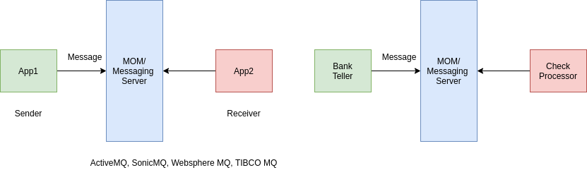
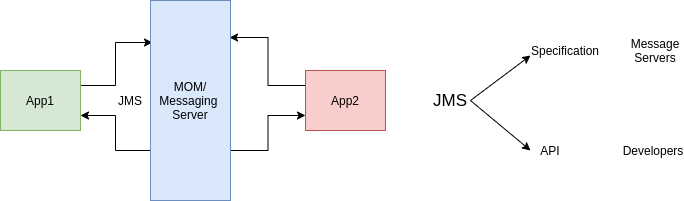
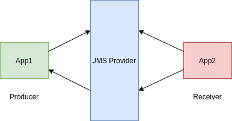
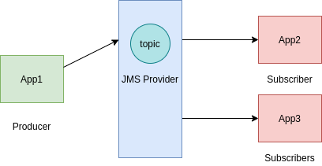
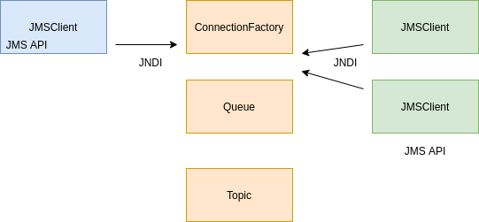
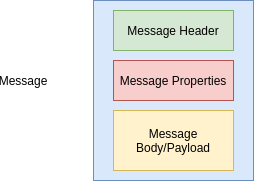
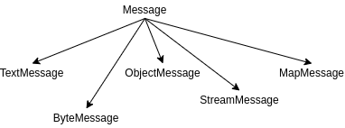
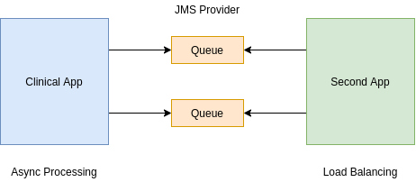
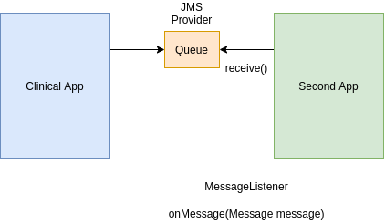

# RabbitMQ Message broker

## JMS


## Exchange and Queue


- Exchange route a message to specific Queue.
- User (Message).
- Application behind a queue are consumers.
- Exchange to apply some conditions.
- Types of exchanges:
    - Direct
    - Fanout authorities
    - Headers
    - Topics

### RabbitMQ installation

```console
systemctl enable rabbitmq-server
systemctl start rabbitmq-server
systemctl status rabbitmq-server
systemctl stop rabbitmq-server

sudo rabbitmq-plugins enable rabbitmq_management
// localhost:15672
// rabbitMQ management: guest, guest
```

## Direct Exchange

- Message Key = "mobile"


## JMS Messaging

- JMS: Java Messaging Service
- JMS is a Java API which allows a Java Application to send a message to another application.
    - Generally the other application is a Java applications
- JMS is standard Java API which requires an underlying implementation to be provided.
    - Much like JPA - where JPA is the API standard, and Hibernate is the implementation.
- JMS is highly scalable and allows you to loosely couple applications using asynchronous messaging.

**JMS Implementations**

- Amazon SQS
- Apache ActiveMQ
- JBoss Messaging
- IBM MQ (paid)
- OracleAQ (paid)
- RabbitMQ
- More

**Why Use JMS over REST**

- JMS is a true messaging service.
- Asynchronous.
- Greater throughput - the HTTP protocol is slow comparatively.
    - JMS protocols are VERY performant.
- Flexibility in message delivery - Deliver to one or many consumers.
- Security - JMS has very robust security.
- Reliability - Can guarantee message delivery.

**Types of Messaging**

- Point to Point
    - Message queued and delivered to one consumer.
    - Can have multiple consumers - but message will be delivered only ONCE.
    - Consumers connect to a queue.
- **Publish / Subscribe:**
    - Message delivered to one or more subscribers.
    - Subscribers will subscribe to a topic, then receive a copy of all messages sent to the topic.

**Point to Point**


**Publish / Subscribe**


**Key Terms**

- JMS Provider: JMS Implementation.
- JMS Client: Application which sends or receives messages from the JMS provider.
- JMS Producer or Publisher: JMS Client which sends messages.
- JMS Consumer or Subscriber: JMS Client which receives messages.
- JMS Message: The entity of data sent.
- JMS Queue: 
    - Queue for point-to-point messages. 
    - Often FIFO
- JMS Topic: Similar to queue - but for publish and subscribe.

**JMS Message**

- A JMS Message contains three parts:
    - Header: Contains metadata about the message
    - Properties: Message properties are in 3 sections:
        - Application: From Java Application sending message.
        - Provider: Used by the JMS provider and are implementation specific.
        - Standard Properties: Defined by the JMS API - Might not be supported by the provider.
    - Payload: The message itself.

**JMS Header Properties**

- JMSCorrelationID:
    - String value, typically a UUID. 
    - Set by application, often used to trace a message through multiple consumers.
- JMSExpires:
    - Long - zero, does not expire. 
    - Else, time when message will expire and be removed from queue.
- JMSMessageId: String value, typically set by the JMS Provider.
- JMSPriority: Integer - Priority of the message.
- JMSTimestamp: Long - Time message sent.
- JMSType: String - The type of the message.
- JMSReplyTo: Queue or topic which sender is expecting replies.
- JMSRedelivery: Boolean - Has message been delivered?
- JMSDeliveryMode: - Integer, set by JMS Provider for delivery mode.
    - Persistent (Default): JMS Provider should make the best effort to deliver message.
    - Non-Persistent: An occasional message lost is acceptable.
- JSMXUserId:
    - (String) User Id sending message. 
    - Set by JMS Provider
- JMSXAppID:
    - (String) Id of the application sending the message. 
    - Set by JMS Provider.
- JMSXDeliveryCount:
    - (Int) Number of delivery attempts. 
    - Set by JMS Provider.
- JMSXGroupID:
    - (String) The message group which the message is part of. 
    - Set by a Client.
- JMSXGroupSeq:
    - (Int) Sequence number of message in group. 
    - Set by a Client.
- JMSXProducerTDIX:
    - (String) Transaction id when message produced. 
    - Set by JMS Producer.
- JMSXConsumerTXID:
    - (String) Transaction Id when the message consumed. 
    - Set by JMS Provider.
- JMSXRcvTimestamp:
    - (Long) Timestamp when message delivered to consumer. 
    - Set by JMS Provider.
- JMSXState:
    - (Int) State of the JMS Message.
    - Set by JMS Provider.

**JMS Custom Properties**

- The JMS Client can set custom properties on messages.
- Properties set as key / value pairs (String value).
- Values must be one of:
    - String, boolean, byte, double, float, int, short, long or Object.

**JMS Provider Properties**

- The JMS Client can also set JMS Provider Specific properties
- These properties set as `JMS_<provider name>`.
- JMS Provider specific properties allow the client to utilize features specific to the JMS Provider

**JMS Message Types**

- Message: 
    - Just a message, no payload. 
    - Often used to notify about events.
- BytesMessage: Payload is an array of bytes.
- TextMessage:
    - Message stored as a string. 
    - JSON or XML
- StreamMessage: Sequence of Java primitives.
- MapMessage: Message is name value pairs.
- ObjectMessage: Message is a serialized Java object.

**Which Message Type to Use?**

- JMS 1.0 was originally released in 1998 - Initial focus was on Java to Java messaging
- Since 1998 Messaging and technology has grown and evolved beyond the Java ecosystem.
- JMS TextMessages with JSON or XML payloads currently favored:
    - Decoupled from Java - can be consumed by any technology.
    - Not uncommon to 'bridge' to non-java providers.
    - Makes migration to a non-JMS provider less painful.
        - Important since messaging is becoming more and more generic and abstracted.

***

## Java Message Service

### Messaging



### Why Messaging?

- Heterogeneous Integration.
- Loosely Couples.
- Reduce System Bottleneck - Scalable App.
- Flexibility and Agility.

## What is JMS?



## Messaging Models

- Point to Point.
- Publish / Subscribe.

**Point to Point**

- Message put into queue consumed only once.
- Async Fire and Forget.
- Synchronous request/reply messaging.
- Example: Mail.



**Publish / Subscribe**

- Producer sends message to topic.
- JMS Provider ensures that message sent to all Subscribers.
- Example: News Paper Subscription.



### Apache ActiveMQ Artemis

- JMS Providers:
    - JMS Specification.
    - Apache ActiveMQ Artemis.    



**Create the Message Broker**

```console
cd apache-artemis/bin
./artemis create some-path/mybroker

cd some-path/mybroker/bin
./artemis run

# configure queues
cd some-path/mybroker/bin
cd etc
vim broker.xml
```

## Messaging examples

### JMS 1.X API

- ConnectionFactory - JMS provider.
- Destination:
    - Queue or topic. 
    - Access from JNDI.
- Connection
- Session:
    - Message
    - MessageProducer
    - MessageConsumer

**Configure jndi**

```properties
java.naming.factory.initial=org.apache.activemq.artemis.jndi.ActiveMQInitialContextFactory
connectionFactory.ConnectionFactory=tcp://localhost:61616
queue.queue/myQueue=myQueue
```

**Writing a message to queue**

- Create a Connection.
- Create a session.
- Look up for the Destination.
- Send/Receive Message.

```java
InitialContext initialContext = null;
Connection connection = null;
try {
    initialContext = new InitialContext();
    ConnectionFactory cf = (ConnectionFactory) initialContext.lookup("ConnectionFactory");
    connection = cf.createConnection();
    Session session = connection.createSession();
    Queue queue = (Queue) initialContext.lookup("queue/myQueue");
    MessageProducer producer = session.createProducer(queue);
    TextMessage message = session.createTextMessage("I am message creator");
    producer.send(message);
    System.out.println("Message Sent: " + message.getText());

    // consume message part
} catch (NamingException e) {
    e.printStackTrace();
} catch (JMSException e) {
    e.printStackTrace();
} finally {
    // close initialContext and connection
}
```

**Consume message from the Queue**

```java
// consume message
MessageConsumer consumer = session.createConsumer(queue);
connection.start();
TextMessage messageReceived = (TextMessage) consumer.receive(5000);
System.out.printf("Message Received: " + messageReceived.getText());
```

**Publish Subscribe**

*jndi.properties*

```properties
topic.topic/myTopic=myTopic
```

```java
InitialContext initialContext = new InitialContext();
Topic topic = (Topic) initialContext.lookup("topic/myTopic");
ConnectionFactory cf = (ConnectionFactory) initialContext.lookup("ConnectionFactory");
Connection connection = cf.createConnection();

Session session = connection.createSession();
MessageProducer producer = session.createProducer(topic);

MessageConsumer consumer1 = session.createConsumer(topic);
MessageConsumer consumer2 = session.createConsumer(topic);

TextMessage message = session.createTextMessage("I am message creator topic");

producer.send(message);

connection.start();

TextMessage message1 = (TextMessage) consumer1.receive();
System.out.println("Consumer 1 message received: " + message1.getText());

TextMessage message2 = (TextMessage) consumer2.receive();
System.out.println("Consumer 2 message received: " + message2.getText());

connection.close();
initialContext.close();
```

**Use QueueBrawser**

```java
QueueBrowser browser = session.createBrowser(queue);
Enumeration messagesEnum = browser.getEnumeration();
while (messagesEnum.hasMoreElements()) {
    TextMessage eachMessage = (TextMessage) messagesEnum.nextElement();
    System.out.println("Browsing: " + eachMessage.getText());
}
```

### JMS 2.X

**Simple API**

```
JMSContext = Connection + Session

JMSProducer
                implements java.lang.AutoCloseable
JMSConsumer
```

**Message**
- Body
- Header
- Properties

**JEE7**

```java
@Inject
@JMSConnectionFactory("jms/connectionFactory")
private JMSContext context;

@Resource(lookup = "jms/dataQueue")
private Queue dataQueue;
```

**ConnectionFactory**

```java
@JMSConnectionFactoryDefinitions
@JMSConnectionFactoryDefinition
```

```xml
<jms-connection-factory>
```

**JMS 2.0 demo**

```java
InitialContext context = new InitialContext();
Queue queue = (Queue) context.lookup("queue/myQueue");

try (ActiveMQConnectionFactory cf = new ActiveMQConnectionFactory();
     JMSContext jmsContext = cf.createContext()) {
    jmsContext.createProducer().send(queue, "JMS 2 demo message");
    final String messageReceived = jmsContext.createConsumer(queue).receiveBody(String.class);

    System.out.println("MessageReceived --> " + messageReceived);
}
```

## Anatomy of a JMS Message



**Headers**

- Provider:
    - JMSDestination
    - JMSDeliveryMode
    - JMSMessageId
    - JMSTimestamp
    - JMSExpiration
    - JMSRedelivered
    - JMSPriority
Developer:
    - JMSReplyTo
    - JMSCorrelationID
    - JMSType
    
**Properties**

- ApplicationSpecific:    
    - setXXXProperty
    - getXXXProperty
- Provider Specific:
    - JMSUserID
    - JMSXAppID
    - JMSXProducerTXID
    - JMSXConsumerTXID
    - JMSXRcvTimestamp
    - JMSDeliveryCount
    - JMSXState
    - JMSXGroupID
    - JMSXGroupSeq
    
### Prioritize Messages

```java
final JMSProducer producer = jmsContext.createProducer();

final String[] messages = new String[3];
messages[0] = "Message One";
messages[1] = "Message Two";
messages[2] = "Message Three";

producer.setPriority(3);
producer.send(queue, messages[0]);

producer.setPriority(1);
producer.send(queue, messages[1]);

producer.setPriority(9);
producer.send(queue, messages[2]);

// consumer
final JMSConsumer consumer = jmsContext.createConsumer(queue);
for (int i = 0; i < 3; i++) {
    System.out.println(consumer.receiveBody(String.class));
}
// === OUTPUT ===
// Message Three
// Message One
// Message Two
```    

### Request Reply Message

**jndi.properties**

```properties
queue.queue/requestQueue=requestQueue
queue.queue/replyQueue=replyQueue
```    

```java
final JMSProducer producer = jmsContext.createProducer();
producer.send(queue, "JMS message request");

final JMSConsumer consumer = jmsContext.createConsumer(queue);
final String messageReceived = consumer.receiveBody(String.class);
System.out.println(messageReceived);

// Reply
JMSProducer replyProducer = jmsContext.createProducer();
replyProducer.send(replyQueue, "JMS message reply");

final JMSConsumer replyConsumer = jmsContext.createConsumer(replyQueue);
System.out.println(replyConsumer.receiveBody(String.class));
```
    
### Use replyTo JMS Header

```java
final JMSProducer producer = jmsContext.createProducer();
final TextMessage message = jmsContext.createTextMessage("JMS message request");
message.setJMSReplyTo(replyQueue);
producer.send(queue, message);

final JMSConsumer consumer = jmsContext.createConsumer(queue);
final TextMessage messageReceived = (TextMessage) consumer.receive();
System.out.println(messageReceived.getText());

// Reply
JMSProducer replyProducer = jmsContext.createProducer();
replyProducer.send(messageReceived.getJMSReplyTo(), "JMS message reply");

final JMSConsumer replyConsumer = jmsContext.createConsumer(replyQueue);
System.out.println(replyConsumer.receiveBody(String.class));
```    
    
**When use replyTo header?**

```java
// create reply queue from jmsContext
final TemporaryQueue replyQueue = jmsContext.createTemporaryQueue();
```    

### MessageId and CorrelationId Header

```java
final JMSProducer producer = jmsContext.createProducer();
final TemporaryQueue replyQueue = jmsContext.createTemporaryQueue();
final TextMessage message = jmsContext.createTextMessage("JMS message request");
message.setJMSReplyTo(replyQueue);
producer.send(queue, message);
System.out.println(message.getJMSMessageID());

Map<String, TextMessage> requestMessages = new HashMap<>();
requestMessages.put(message.getJMSMessageID(), message);

final JMSConsumer consumer = jmsContext.createConsumer(queue);
final TextMessage messageReceived = (TextMessage) consumer.receive();
System.out.println(messageReceived.getText());

// Reply
JMSProducer replyProducer = jmsContext.createProducer();
final TextMessage replyMessage = jmsContext.createTextMessage("JMS message reply");
replyMessage.setJMSCorrelationID(messageReceived.getJMSMessageID());
replyProducer.send(messageReceived.getJMSReplyTo(), replyMessage);

// Reply received
final JMSConsumer replyConsumer = jmsContext.createConsumer(replyQueue);
final Message replyReceived = replyConsumer.receive();
System.out.println(replyReceived.getJMSCorrelationID());
System.out.println(requestMessages.get(replyReceived.getJMSCorrelationID()).getText());
```

### Set message expiry

```java
// Produce Message
final JMSProducer producer = jmsContext.createProducer();
producer.setTimeToLive(2000);
producer.send(queue, "JMS 2 demo message");
Thread.sleep(5000);

// Consume Message
final Message messageReceived = jmsContext.createConsumer(queue).receive(4000);
System.out.println("MessageReceived --> " + messageReceived);
```

### Access Expired Message

```console
cd some-path/mybroker/etc
vim broker.xml
```

**broker.xml**

```xml
<expiry-address>ExpiryQueue</expiry-address>
...
<address name="ExpiryQueue">
    <anycast>
       <queue name="ExpiryQueue" />
    </anycast>
</address>
```

**jndi.properties**

```properties
queue.queue/expiryQueue=ExpiryQueue
```

```java
Queue expiryqueue = (Queue) context.lookup("queue/expiryQueue");
// ...
// Consume Message
final Message messageReceived = jmsContext.createConsumer(queue).receive(4000);
System.out.println("MessageReceived --> " + messageReceived);
System.out.println(jmsContext.createConsumer(expiryqueue).receiveBody(String.class));
```

### Delay the message delivery

```java
// Produce Message
final JMSProducer producer = jmsContext.createProducer();
producer.setDeliveryDelay(3000);
```

### Set custom message properties

```java
// Produce Message
final JMSProducer producer = jmsContext.createProducer();
TextMessage textMessage = jmsContext.createTextMessage("JMS 2 demo message");
textMessage.setBooleanProperty("loggedIn", true);
textMessage.setStringProperty("userToken", "panda");
producer.send(queue, textMessage);

// Consume Message
final Message messageReceived = jmsContext.createConsumer(queue).receive(5000);
System.out.println(messageReceived);
System.out.println(messageReceived.getBooleanProperty("loggedIn"));
System.out.println(messageReceived.getStringProperty("userToken"));
```

### Message Types



```java
// Produce Message
final JMSProducer producer = jmsContext.createProducer();
TextMessage textMessage = jmsContext.createTextMessage("JMS 2 demo message");
final BytesMessage bytesMessage = jmsContext.createBytesMessage();
bytesMessage.writeUTF("Miki");
bytesMessage.writeLong(321L);
producer.send(queue, bytesMessage);

// Consume Message
final BytesMessage messageReceived = (BytesMessage) jmsContext.createConsumer(queue).receive(5000);
System.out.println(messageReceived.readUTF());
System.out.println(messageReceived.readLong());
```

### Create Object Message

```java
final ObjectMessage objectMessage = jmsContext.createObjectMessage();
final Patient patient = new Patient();
patient.setId(1);
patient.setName("Panda");
objectMessage.setObject(patient);

producer.send(queue, objectMessage);

// Consume Message
final ObjectMessage messageReceived = (ObjectMessage) jmsContext.createConsumer(queue).receive(5000);
final Patient object = (Patient) messageReceived.getObject();
System.out.println(object.getId());
System.out.println(object.getName());
```

### JMS 2.X message types

```java
producer.send(queue, patient);

// Consume Message
final Patient messageReceived = jmsContext.createConsumer(queue).receiveBody(Patient.class)
System.out.println(messageReceived.getId());
System.out.println(messageReceived.getName());
```

## Point 2 Point Messaging

- One to one communication
- Interoperability
- Throughput/Performance
- QueueBrowser

### Use cases



### Asynchronous Processing


