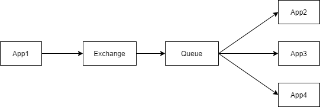
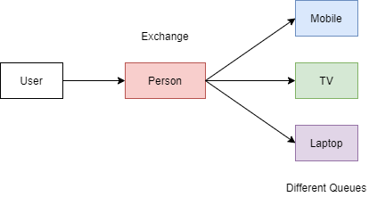
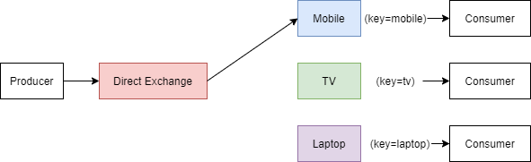
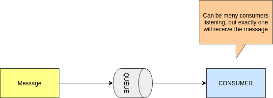
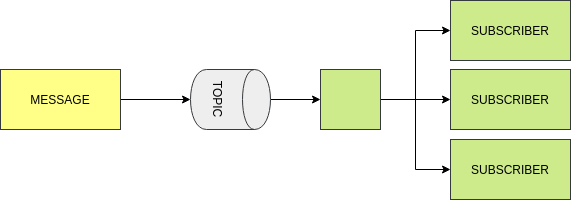

# RabbitMQ Message broker

## JMS



## Exchange and Queue



- Exchange route a message to specific Queue.
- User (Message).
- Application behind a queue are consumers.
- Exchange to apply some conditions.
- Types of exchanges:
    - Direct
    - Fanout authorities
    - Headers
    - Topics

### RabbitMQ installation

```console
systemctl enable rabbitmq-server
systemctl start rabbitmq-server
systemctl status rabbitmq-server
systemctl stop rabbitmq-server

sudo rabbitmq-plugins enable rabbitmq_management
// localhost:15672
// rabbitMQ management: guest, guest
```

## Direct Exchange

- Message Key = "mobile"



## JMS Messaging

- JMS - Java Messaging Service
- JMS is a Java API which allows a Java Application to send a message to another application
    - Generally the other application is a Java applications
- JMS is standard Java API which requires an underlying implementation to be provided
    - Much like JPA - where JPA is the API standard, and Hibernate is the implementation
- JMS is highly scalable and allows you to loosely couple applications using asynchronous messaging

**JMS Implementations**

- Amazon SQS
- Apache ActiveMQ
- JBoss Messaging
- IBM MQ (paid)
- OracleAQ (paid)
- RabbitMQ
- More

**Why Use JMS over REST**

- JMS is a true messaging service
- Asynchronous
- Greater throughput - the HTTP protocol is slow comparatively
    - JMS protocols are VERY performant
- Flexibility in message delivery - Deliver to one or many consumers
- Security - JMS has very robust security
- Reliability - Can guarantee message delivery

**Types of Messaging**

- Point to Point
    - Message is queued and delivered to one consumer
    - Can have multiple consumers - but message will be delivered only ONCE
    - Consumers connect to a queue
- Publish / Subscribe
    - Message is delivered to one or more subscribers
    - Subscribers will subscribe to a topic, then receive a copy of all messages sent to the topic

**Point to Point**



**Publish / Subscribe**



**Key Terms**

- JMS Provider - JMS Implementation
- JMS Client - Application which sends or receives messages from the JMS provider
- JMS Producer or Publisher - JMS Client which sends messages
- JMS Consumer or Subscriber - JMS Client which receives messages
- JMS Message - the entity of data sent
- JMS Queue - Queue for point to point messages. Often FIFO
- JMS Topic - Similar to queue - but for publish and subscribe

**JMS Message**

- A JMS Message contains three parts:
    - Header - contains meta data about the message
    - Properties - Message properties are in 3 sections
        - Application - From Java Application sending message
        - Provider - Used by the JMS provider and are implementation specific
        - Standard Properties - Defined by the JMS API - Might not be supported by the provider
    - Payload - the message itself

**JMS Header Properties**

- JMSCorrelationID - String value, typically a UUID. Set by application, often used to trace a message through multiple consumers
- JMSExpires - Long - zero, does not expire. Else, time when message will expire and be removed from queue
- JMSMessageId - String value, typically set by the JMS Provider
- JMSPriority - Integer - Priority of the message
- JMSTimestamp - Long - Time message was sent
- JMSType - String - The type of the message
- JMSReplyTo - Queue or topic which sender is expecting replies
- JMSRedelivery - Boolean - Has message been delivered?
- JMSDeliveryMode - Integer, set by JMS Provider for delivery mode
    - Persistent (Default) - JMS Provider should make best effort to deliver message
    - Non-Persistent - Occasional message lost is acceptable
- JSMXUserId - (String) User Id sending message. Set by JMS Provider
- JMSXAppID - (String) Id of the application sending the message. Set by JMS Provider
- JMSXDeliveryCount - (Int) Number of delivery attempts. Set by JMS Provider
- JMSXGroupID - (String) The message group which the message is part of. Set by Client
- JMSXGroupSeq - (Int) Sequence number of message in group. Set by CLient
- JMSXProducerTDIX - (String) Transaction id when message was produced. Set by JMS Producer
- JMSXConsumerTXID - (String) Transaction Id when the message was consumed. Set by JMS Provider
- JMSXRcvTimestamp - (Long) Timestamp when message delivered to consumer. Set by JMS Provider
- JMSXState - (Int) State of the JMS Message. Set by JMS Provider

**JMS Custom Properties**

- The JMS Client can set custom properties on messages
- Properties are set as key / value pairs (String value)
- Values must be one of:
    - String, boolean, byte, double, float, int, short, long or Object

**JMS Provider Properties**

- The JMS Client can also set JMS Provider Specific properties
- These properties are set as JMS_<provider name>
- JMS Provider specific properties allow the client to utilize features specific to the JMS Provider

**JMS Message Types**

- Message - Just a message, no payload. Often used to notify about events
- BytesMessage - Payload is an array of bytes
- TextMessage - Message is stored as a string. (JSON or XML)
- StreamMessage - sequence of Java primitives
- MapMessage - message is name value pairs
- ObjectMessage - Message is a serialized Java object

**Which Message Type to Use?**

- JMS 1.0 was originally released in 1998 - Initial focus was on Java to Java messaging
- Since 1998 Messaging and technology has grown and and evolved beyond the Java ecosystem
- JMS TextMessages with JSON or XML payloads are currently favored
    - Decoupled from Java - can be consumed by any technology
    - Not uncommon to 'bridge' to non-java providers
    - Makes migration to a non-JMS provider less painful
        - Important since messaging is becoming more and more generic and abstracted


