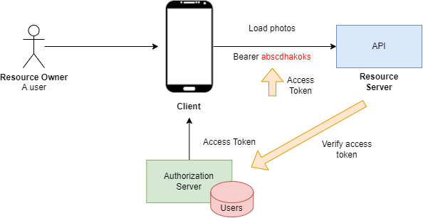
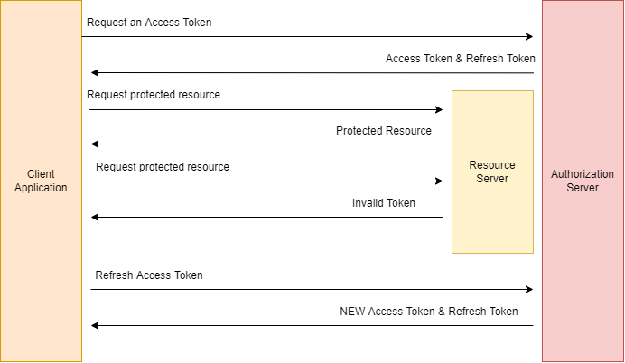

# OAuth 2.0

## What is OAuth 2.0?

```
OAuth = Open + Authorization
```

- `OAuth 2.0:` is an Authorization Framework.
- `OAuth:` is a **delegated** authorization framework.


### OAuth 2.0 Roles

- Resource Owner (A user)
- Client
- Resource Server (API)
- Authorization Server (Access Token)

### OAuth 2.0 Client Types

- Confidential Client: Can keep Client Secret safe.
- Public Client: Cannot keep the Client ID and the Client Secret safe.

### OAuth Access Token



```
The token may denote an identifier used to retrieve the authorization information or may self-contain
the authorization information in a verifiable manner (i.e., a token string consisting of some data and a
signature).
```

- Identifier type.
- Self-contain the authorization information (much longer).

```
BakoJoLija95jnabgOIkLQa
```

**Authorization Server**

| access_token | user_id | scope | expires |
|---|---|---|---|
| `BakoJoLija95jnabgOIkLQa` | JWerOL12Hfa | profile, documents | 1595557123 |

**Self-Contained**

- Header section
- Payload section
- Signature

```
Header:
{
    "alg": "RS256",
    "typ": "JWT",
    "kid": "-djsdjkjlafjdfnlkdjfndskjfnskdjlf"
}
Payload:
{
    "exp": 1595557123,
    "iat": ...
    "typ": "Bearer"
}
```

### OpenID Connect

- Identity Layer (Identity Provider).

```
Access Token + ID Token
```

- ID Token: The token used to validate that a user is who they claim to ba.
- Access Token: The token used to validate if the user is allowed to access a requested resource from the resource
server.

```
Standard Claims     Address Claims      Scopes
```

### OAuth 2.0 Grant Types

- Grant type is a way an application gets an access token.
- Authorization Code:
    - Server Side Web App
    - Mobile Native App
- Client credentials:
    - Server Side Script with no UI
- PKCE Enhanced Authorization code:
    - JavaScript Single Page App
    - Mobile Native App    
- Device code:
    - Device    

**Refresh Token Grant Type**

- Refresh Token Grant type is used to exchange a refresh token for an access token.

### Authorization Code Grant


### PKCE-enhanced Authorization Code

```
PKCE - Proof Key for Code Exchange
```


### Client Credentials

- Machine to Machine Request

**Request for Access Token + Client Authentication**

```
curl --location --request POST 'http://localhost:8080/auth/realms/apps/protocol/openid-connect/token' \
--header 'Content-Type: application/x-www-form-urlencoded' \
--data-urlencode 'grant_type=client_credentials' --data-urlencode 'scope=email' \
--data-urlencode 'client_id=photo-app-client-credentials' \
--data-urlencode 'client_secret=dsaj78-hdskahdas-798739'
```


### Password Grant

**Request an access token**

```
curl --location --request POST 'http://localhost:8080/auth/realms/apps/protocol/openid-connect/token' \
--header 'Content-Type: application/x-www-form-urlencoded' \
--data-urlencode 'username=panda'\
--data-urlencode 'password=panda'\
--data-urlencode 'grant_type=password' \
--data-urlencode 'client_id=pspring-cloud-gateway' \
--data-urlencode 'client_secret=dsaj78-hdskahdas-798739'
```


## Refresh Access Token



```json
{
    "access_token": "hsajKAOAhuiak...",
    "expires_in": 300,
    "refresh_expires_in": 1800,
    "refresh_token": "ejjakAJKmask90890",
    "token_type": "bearer",
    "not-before-policy": 1598787232,
    "session_state": "672adf-86765aacd-267261eff",
    "scope": "profile"
}
```

```json
{
    "access_token": "ewjewklwHagh",
    "expires_in": 300,
    "refresh_expires_in": 0,
    "refresh_token": "sadjkdhkaAManj89...",
    "scope": "offline_access email openid"
}
```

```
curl --location --request POST
'http://localhost:8080/auth/realms/app/protocol/openid-connect/token'\
--header 'Content-Type: application/x-www-form-urlencoded'\
--data-urlencode 'grant_type=refresh_token'\
--data-urlencode 'clien_id=offline_access_client'\
--data-urlencode 'client_secret=b88aa567-0bbfa-...'\
--data-urlencode 
'refresh_token=dsajkdasdakjsd...'
```

## Keycloak

- Authorization Server
- Keycloak: Open source Identity and Access Management Solution.
- Supports Single-Sign On (SSO).
- Social Login.
- User Federation.


