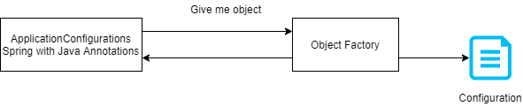
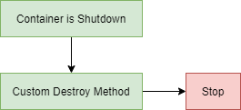

# Spring

## Goals of Spring

- Lightweight development with Java POJOs.
- Dependency injection, loose coupling.
- Declarative programming AOP.
- Minimalize boilerplate Java code.

## Components

- Core Container:
    - Factory for creating beans.
    - Manage beans dependencies:
        - :one: - Beans
        - :two: - Core
        - :three: - Spel
        - :four: - Context
- AOP - Aspect Oriented Programming, add functionality to objects declaratively:
    - Logging
    - Security
    - Transactions
- Data Access:
    - :one: - JDBC
    - :two: - ORM
    - :three: - Transactions
    - :four: - OXM
    - :five: - JMS
- Web Layer:
    - All web related classes.
    - Spring MVC Framework:
        - :one: - Servlet
        - :two: - WebSocket
        - :three: - Web
        - :four: - Portlet
- Instrumentation:
    - JMX - (Java Management Extension) Java agents to remotely monitor app.
- Test Layer.

## Spring Projects

- Additional Spring modules build on top of core Framework
    - Spring Cloud
    - Spring Data
    - Spring Batch
    - Spring LDAP
    - Spring Security
    - Spring Web Services
    - Spring Android
    - Spring Web Flow

## Inversion of Control (IoC)

- Outsourcing the construction and management of objects. Outsource to object factory.

## Spring Container

- Primary functions:
    - Create and manage objects (inversion of control).
    - Inject object's dependencies (Dependency Injection).
- Configure Spring Container:
    - XML Configuration.
    - Java Annotations.
    - Java Source Code.
- Development process:
    - Configure Spring Beans.
    - Create Spring Container.
    - Retrieve Beans from Spring Container.

### Configure Spring beans

**applicationContext.xml**

```xml
<beans>
    <bean id="myAccountBean" class="com.mybank.Account"></bean>
</beans>
```

### Create a Spring Container

- Spring Container is `ApplicationContext`.
- Specialized implementations:
    - `ClassPathXmlApplicationContext`
    - `AnnotationConfigApplicationContext`
    - `GenericWebApplicationContext`

```java
ClassPathXmlApplicationContext context = new ClassPathXmlApplicationContext("applicationContext.xml");
```

### Retrieve Beans from Spring Container

```java
ClassPathXmlApplicationContext context = new ClassPathXmlApplicationContext("applicationContext.xml");

// retrieve bean from spring container
Account theAccount = context.getBean("myAccountBean", Account.class);
```

### What is a Spring Bean?

- A **Spring Bean** is simply a Java object.
- When Java objects are created by the Spring Container, then Spring refers to them as **Spring Beans**.
- Spring Beans are created from normal Java classes like Java objects.

### Why do we specify the interface in getBean()?

- Behaves the same as getBean(String), but provides a measure of type safety by throwing a BeanNotOfRequiredTypeException
if the bean is not of the required type.
- This means that ClassCastException can't be thrown on casting the result correctly, as can happen with getBean(String).

### Dependency Injection



- Dependency = helper.
- Injection Types:
    - Constructor injection.
    - Setter Injection.
- Development Process - Constructor Injection:
    - Define the dependency interface and class.
    - Create a constructor in your class for injections.
    - Configure the dependency injection in Spring config file.

### Define the dependency interface and class

**CheckoutService.java**

```java
public interface CheckoutService {
    public String getNotification();
}
```

**TradeCheckoutService.java**

```java
public class TradeCheckoutService implements CheckoutService {
    public String getNotification() {
        return "Money disposal";
    }
}
```

###  Create a constructor in your class for injections

**Broker.java**

```java
public class Broker implements BankDepartment {
    private CheckoutService checkoutService;

    public Broker(CheckoutService checkoutService) {
        this.checkoutService = checkoutService;
    }
}
```

### Configure the dependency injection in Spring config file

```xml
<beans >
    <!-- CheckoutService service = new CheckoutService(); // java -->
    <bean id="myService" class="com.mybank.CheckoutService"></bean>

    <!-- Broker broker = new Broker(service); // java -->
    <bean id="myBroker" class="com.mybank.Broker">
        <constructor-arg ref=myService" />
    </bean>
</beans>
```

### Setter Injection

- Create setter method(s) in your class for injections.
- Configure the dependency injection in Spring config file.

```java
public class Programmer implements RNDService {
    private SecurityService securityService;

    public Programmer() {}

    public void setSecurityService(SecurityService securityService) {
        this.securityService = securityService;
    }
}
```

**applicationContext.xml**

```xml
<beans >
    <bean id="myService" class="com.mybank.SecurityService"></bean>

    <bean id="myPanda" class="com.mybank.Programmer">
        <property name="securityService" ref="myService" />
    </bean>
</beans>

```

### Inject literal values

```xml
<beans>
    <bean id="myService" class="com.mybank.SecurityService"></bean>

    <bean id="myProgrammer" class="com.mybank.Programmer"></bean>
    <property name="securityService" ref="myService" />

    <property name="emailAddress" value="email@example.com" />
    <property name="team" value="interceptors" />
</beans>

```

### Inject values from properties file

```properties
foo.email=email@example.com
foo.team=interceptors
```

**applicationContext.xml**

```xml
<context:property-placeholder location="classpath:bank.properties" />

<bean id="myProgrammer" class="com.mybank.Programmer">
    <property name="securityService" ref="myService" />

    <property name="emailAddress" value="${foo.email}" />
    <property name="team" value="${foo.team}" />
</bean>
```

## Bean scopes

- Scope refers to the lifecycle of the bean.
- How long does the bean live?
- How many instances are created?
- How is the bean shared?

### Default scope - Singleton

```xml
<beans >
    <bean id="myTeam" class="com.springdemo.FootballTeam"
        scope="singleton">
    </bean>
</beans>
```

- Spring Container creates only one instance of the bean, by default.
- It is cached in memory.
- All requests for the bean:
    - return a **SHARED** reference of the **SAME** bean.

### Spring bean scopes

| Scope | Description |
|---|---|
| singleton | Create a single shared instance of the bean. Default scope |
| prototype | Creates a new bean instance for each container request |
| request | Scoped to an HTTP web request. Only used for web apps |
| session | Scoped to an HTTP web session. Only used for web apps |
| global-session | Scoped to a global HTTP web session. Only used for web apps |

## Bean lifecycle


### Bean is ready for use



### Bean Lifecycle Methods / Hooks

- Add custom code during bean initialization:
    - Calling custom business logic methods.
    - Setting handles to resources (db, sockets).
- Add custom code during bean destruction:
    - Calling custom business logic methods.
    - Clean up handles to resources.

### Init method configuration

```xml
<beans >
    <bean id="myTeam" class="com.springdemo.FootballTeam"
        init-method="doStartupStuff"
        destroy-method="doCleanupStuff">
    </bean>
</beans>
```

- Init and destroy method signatures:
    - Any access modifier.
    - Any return types. Void most popular.
    - Any method name.
    - No arguments allowed.
- For the prototype scope spring does not call **destroy** method.
- In contrast to the other scopes, Spring does not manage the complete lifecycle of a prototype bean
the container instantiates, configures, and otherwise assembles a prototype object, and hands it to the client,
with no further record of that prototype instance.
- Thus, although initialization lifecycle callback methods are called on all objects regardless of scope,
in the case of prototypes, configured destruction lifecycle callbacks are not called.
- The client code must clean up prototype-scoped objects and release expensive resources that the prototype bean(s)
are holding.

## Configure Spring with Java Annotations

- What are Java Annotations?
    - Special labels/markers added to Java classes.
    - Provide meta-data about class.
    - Processed at compile time or run-time for special processing.
- :star: Example `@Override`:
    - Override method, we are telling a compiler we override method exactly as present in interface or parent class.
    - Compiler check that we actually override method, if some issue they will be compile time error.

### Scanning for Component Classes

- Spring will scan Java classes for special annotations.
- Automatically register the beans in the Spring container.
- Development process:
    - Enable component scanning in Spring config file.
    - Add `@Component` Annotation to Java Classes.
    - Retrieve bean from Spring container.

**Enable component scanning**

```xml
<beans>
    <context:component-scan base-package="com.mybank.springdemo" />
</beans>
```

**Add `@Component` annotations**

```java
@Component("stockService")
public class StockService implements Service {

    @Override
    public String getMarketService() {
        return "Get NASDAQ";
    }

}

```

**Retrieve bean from Spring Container**

```java
Service stockService = context.getBean("stockService", StockService.class);
```

### Constructor Injection

- What is Spring **Autowiring**:
    - For dependency injection, Spring can use Autowiring.
    - Spring will look for a class that matches the property:
        - By type.
        - By class.
        - By interface.
    - Spring will inject it automatically.
- Autowiring Injection Types:
    - Constructor injection.
    - Setter injection.
    - Field Injections.

**StockService.java**

```java
@Component
public class StockService implements Service {
    private BillingService billingService;

    @Autowired
    public StockService(BillingService billingService) {
        this.billingService = billingService;
    }

}
```

### Setter Injection

```java
private BillingService billingService;

@Autowired
public void setBillingService(BillingService billingService) {
    this.billingService = billingService;
}
```

### Method injection

```java
@Autowired
public void anyMethodName(BillingService billingService) {
    this.billingService = billingService;
}

```

### Field Injection

- Inject dependencies by setting field values on class directly.
- Accomplished by using Java Reflection.
- Configure the dependency injection with `@Autowired` Annotation:
    - Applied directly to the field.
    - No need for setter methods.

```java
@Autowired
private BillingService billingService;
```

## Autowired and Qualifier

```java
@Autowired
@Quelifier("vipBillingService")
private BillingService billingService;
```

**For Constructor Injection**

```java
@Autowired
public StockService(@Quelifier("vipBillingService") BillingService billingService) {
    this.billingService = billingService;
}
```

### How to inject properties ?

```java
@Value("${foo.email}")
```

## @Scope Annotation

- Bean Scopes:
    - Scope refers to the lifecycle of a bean.
    - How long does bean live?
    - How many instances are created?
    - How the bean is shared?
- Default scope is singleton.

```java
@Component
@Scope("singleton")
public class BillingService implements Service {
}
```

## Bean Lifecycle method Annotations

- Methods for init and destroy.
- Annotations:
    - `@PostConstruct`
    - `@PreDestroy`
- Method annotated with `@PostConstruct` or `@PreDestroy`.
- Cannot have any arguments.

```java
@Component
public class BillingService implements Service {

    @PostConstruct
    public void doStartupStuff() {
    }

    @PreDestroy
    public void doCleanupStuff() {
    }
}
```


- For Prototype Scope Spring does not call `@PreDestroy` method.
- Thus, although initialization lifecycle callback methods are called on all objects regardless of scope,
in the case of prototypes, configured destruction lifecycle callbacks are not called.
- The client code must clean up prototype-scoped objects and release expensive resources that the prototype bean(s)
are holding.
- :star: - To get the Spring container to release resources held by prototype-scoped beans,
try using a custom bean post-processor, which holds a reference to beans that need to be cleaned up.


