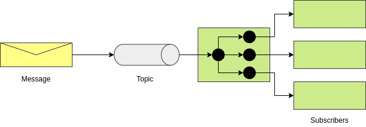

## SOLID Principles of OOP

**Why Use the SOLID Principles of OOP?**

- Object Oriented programming is a powerful concept.
- The 5 principles focus on dependency management.
- Poor dependency management leads to code that is hard to change.

**SOLID**

- Single Responsible Principle:
    - Every class should have a single responsibility.
    - Class should be small.
    - Avoid very big classes, split it into smaller classes.
- Open close principle:
    - Class should be open for extension but closed for modification.
    - You should be able to extend class behavior without modifying it.
    - Use private variables with getters and setters only when you need them.
    - Use abstract base class.
- Liskov substitution principle:
    - Objects in a program would be replaceable with instances of their subtypes WITHOUT altering the correctness
    of the program.
    - Violations will often fail the **Is a** test.
    - A Square **Is a** Rectangle.
    - Rectangle **Is not** a Square.
- Interface Segregation principle:
    - Make fine grained interfaces that are client specific.
    - Keep component focused and minimize dependencies between them.
    - Avoid a super interfaces.
- Dependency Inversion Principle:
    - Abstraction should not depend upon detail.
    - Details should not depend upon abstraction.
    - Important that higher level and lower level objects depend on the same abstract interaction.
    - This is not the same as Dependency Injection - which is how object obtain dependent objects.

### Single Responsibility Principle

- Cohesion is a way to measure how much the code segments within one module (methods of a class, classes inside
a package…) belong together.
- The higher the cohesion – the better, since high cohesion implies easier maintenance and debugging,
greater code functionality and reusability.
- The term cohesion is sometimes contrasted with the concept of coupling, and often, loose coupling of modules is
related to high cohesion.
- Robustness - which could be defined as the ability of a computer system or algorithm to handle mistakes and
malfunctions.

### Liskov Substitution Principle

- Any object of some class in an object-oriented program can be replaced by an object of a child class.
- Inheritance - if you have a class Watch , you can inherit from that class to get a class PocketWatch.
- A pocket watch is still a watch, it just has some additional features.
- Another example would be a class called Woman with a child class called Mother.
- A mother is still a woman, with the addition of having a child.
- Polymorphism - objects can behave in one way in a certain situation, and in another way in some other situation.
- In object-oriented programming, this is called context-dependent behavior.
- A mother, when taking a walk with her child or attending a school parent’s meeting, will behave as a mother.
- But when she is out with her friends, at work or simply doing errands, she will behave as a woman.
- States that functions that reference base classes must be able to use objects of derived (child) classes
without knowing it.

```java
class TransportationDevice {
   String name;
   double speed;
   Engine engine;

   String getName() { ... }
   void setName(String n) { ... }

   double getSpeed() { ... }
   void setSpeed(double d) { ... }

   Engine getEngine() { ... }
   void setEngine(Engine e) { ... }
   void startEngine() { ... }
}

class Car extends TransportationDevice {
   @Override
   void startEngine() { ... }
}

// Bad
class Bicycle extends TransportationDevice {
   @Override
   void startEngine() /*problem!*/
}
```
- Bicycle is a transportation device, however, it does not have an engine and hence, the method
`startEngine` cannot be implemented.
- Solution to fix.

```java
class TransportationDevice {
   String name;
   double speed;

   String getName() { ... }
   void setName(String n) { ... }

   double getSpeed() { ... }
   void setSpeed(double d) { ... }
}

class DevicesWithoutEngines extends TransportationDevice {
   void startMoving() { ... }
}

class DevicesWithEngines extends TransportationDevice {
   Engine engine;

   Engine getEngine() { ... }
   void setEngine(Engine e) { ... }

   void startEngine() { ... }
}
```

### Interface Segregation Principle

- Interfaces form a core part of the Java programming language and they are extensively used in enterprise applications
to achieve abstraction and to support multiple inheritance of type the ability of a class to implement more than
one interfaces.
- “Clients should not be forced to depend on methods that they do not use”. Here, the term “Clients” refers to the
implementing classes of an interface.
- What the Interface Segregation Principle says is that your interface should not be bloated with methods that
implementing classes don’t require.
- For such interfaces, also called “fat interfaces”, implementing classes are unnecessarily forced to provide
implementations (dummy/empty) even for those methods that they don’t need.
-  In addition, the implementing classes are subject to change when the interface changes.
- Highly cohesive interfaces, known as “role interfaces”.
- Each “role interface” declares one or more methods for a specific behavior.
- Thus clients, instead of implementing a “fat interface”, can implement only those “role interfaces”
whose methods are relevant to them.
- Bad examples.

```java
public interface Toy {
    void setPrice(double price);
    void setColor(String color);
    void move();
    void fly();
}
```

- Better example - The Toy interface forces clients (implementation classes) to depend on methods that they do not use.

```java
public interface Toy {
     void setPrice(double price);
     void setColor(String color);
}

public interface Movable {
    void move();
}

public interface Flyable {
    void fly();
}
```

```java
public class ToyPlane implements Toy, Movable, Flyable {
    double price;
    String color;

    @Override
    public void setPrice(double price) {
        this.price = price;
    }
    @Override
    public void setColor(String color) {
        this.color=color;
    }
    @Override
    public void move(){
        System.out.println("ToyPlane: Start moving plane.");
    }
    @Override
    public void fly(){
        System.out.println("ToyPlane: Start flying plane.");
    }
    @Override
    public String toString(){
        return "ToyPlane: Moveable and flyable toy plane- Price: "+price+" Color: "+color;
    }
}
```

- The implementation classes now implement only those interfaces they are interested in.
- Our classes do not have unnecessary code clutters, are more readable, and lesser prone to modifications due to
changes in interface methods.
- Single Responsibility Principle is concerned with classes, while Interface Segregation Principle is concerned
with interfaces.

**Interface Segregation Principle in the Spring Framework**

- Even when just for unit testing your classes, the Interface Segregation Principle has a role.
- If you’re testing a class which you’ve written for dependency injection, it is ideal that you write to an interface.
- By designing your classes to use dependency injection against an interface, any class implementing the specified
interface can be injected into your class.
- In testing your classes, you may wish to inject a mock object to fulfill the needs of your unit test.

## Dependency Inversion Principle

- Ignorance of writing “good code” is the main reason of tightly coupled code existing in applications.
- As an example, creating an object of a class using the new operator results in a class being tightly coupled to another class.
- When one class knows explicitly about the design and implementation of another class, changes to one class raise
the risk of breaking the other class.
- High-level modules should not depend on low-level modules. Both should not depend on abstractions.
- Abstractions should not depend on details. Details should depend on abstractions.
- Bad Example.

```java
public class LightBulb {
    public void turnOn() {
        System.out.println("LightBulb: Bulb turned on...");
    }
    public void turnOff() {
        System.out.println("LightBulb: Bulb turned off...");
    }
}

public class ElectricPowerSwitch {
    public LightBulb lightBulb;
    public boolean on;

    public ElectricPowerSwitch(LightBulb lightBulb) {
        this.lightBulb = lightBulb;
        this.on = false;
    }
    public boolean isOn() {
        return this.on;
    }
    public void press(){
        boolean checkOn = isOn();
        if (checkOn) {
            lightBulb.turnOff();
            this.on = false;
        } else {
            lightBulb.turnOn();
            this.on = true;
        }
    }
}
```

- Better example.

```java
public interface Switch {
    boolean isOn();
    void press();
}

public interface Switchable {
    void turnOn();
    void turnOff();
}

public class ElectricPowerSwitch implements Switch {
    public Switchable client;
    public boolean on;

    public ElectricPowerSwitch(Switchable client) {
        this.client = client;
        this.on = false;
    }
    public boolean isOn() {
        return this.on;
    }
   public void press(){
       boolean checkOn = isOn();
       if (checkOn) {
           client.turnOff();
           this.on = false;
       } else {
             client.turnOn();
             this.on = true;
       }
   }
}

public class LightBulb implements Switchable {
    @Override
    public void turnOn() {
        System.out.println("LightBulb: Bulb turned on...");
    }
    @Override
    public void turnOff() {
        System.out.println("LightBulb: Bulb turned off...");
    }
}
```

### Interface Naming Conventions

- Interface should be a good object name.
    - Example Java's List interface:
        - Implementations: ArrayList, LinkedList, CheckedList, SingletonList
- Don't Start with 'I'.
    - No **IList**

**Implementation Naming**

- When just one implementation - generally accepted to use:
    - '<Interface Name>' + Impl
- When more than one, name should indicate difference of Implementation.    
        

## Spring Dependency Injection

### Basic of Dependency Injection

- DI is where needed dependency is injected by another object.
- The class being injected has no responsibility in instantiating the object being injected.

### Types of Dependency Injection

- By class property:
    - Can be public or private properties.
- By setter.
- By constructor:
    - Most Preferred.

### Concrete classes vs interfaces

- DI can be done with concrete classes or interfaces.
- Generally DI with Concrete classes should be avoided.
- DI via Interfaces is preferred:
    - Allows runtime to decide implementation to inject.
    - Follows interface segregation principle of SOLID.
    - Code more testable.

### Inversion of Control IoC

- Is a technique to allow dependencies to be injected at runtime.
- Dependencies are not predetermined.

**IoC vs Dependency Injection**

- DI refers much to the composition of your classes:
    - Compose your classes with DI in mind.
- IoC is the runtime environment of your code:
    - Spring Framework IoC container.    
    - Spring is in control of the injection of dependencies.
    
**Best Practices with Dependency Injection**

- Favor using Constructor Injection over Setter Injection.
- Use final properties for injected components.
- Whenever practical, code to an interface.    

### :star: Spring Bean Lifecycle

**Create Bean**


**Destroy Bean**


### :star: Callback Interfaces

- Spring has two interfaces you can implement for call back events.
- `InitializingBean.afterPropertiesSet()` 
    - called after properties are set.
- `DisposableBean.destroy()` 
    - Called during bean destruction in shutdown.

### Life Cycle Annotations

- Spring has two annotations you can use to hook into the bean life cycle.
- `@PostConstruct` annotated methods will be called after the bean has been constructed, but before
its returned to the requesting object.
- `@PreDestroy` is called just before the bean is destroyed by the container.

### Bean Post Processors

- Gives you a means to tap into the Spring context life cycle and interact with beans as they are processed.
- Implement interface `BeanPostProcessor`:
    - `postProcessBeforeInitialization` - Called before bean initialization method.
    - `postProcessAfterInitialization` - Called after bean initialization.

### `Aware` Interfaces

- Spring has over 14 aware interfaces.
- These are used to access the Spring Framework infrastructure.
- These are largely used within the framework.
- Rarely used by Spring developers.

```
ApplicationContextAware, 
ApplicationEventPublisherAware, 
BeanFactoryAware
...
```

### IoC

- Inversion of Control - the runtime environment (or framework) which injects dependencies.

### Callback Interfaces

- You can implement to tap into the bean lifecycle.:
    - InitializingBean
    - DisposableBean

### Spring bean lifecycle annotations

- `@PostConstruct`
- `@PreDestroy`

## Spring Configuration

### Spring Configuration Options

- XML Based Configuration:
    - Since Spring 2.
    - Common in legacy Spring Applications.
    - Supported in Spring 5.
- Annotation Based Configuration:
    - Since Spring 3.
    - Picked up via `Component Scans`.
    - Refers to class level annotations:
        - `@Controller`, `@Service`, `@Component`, `@Repository`
- :star: Java Based Configuration:
    - Since Spring 3.
    - Java Classes to define Spring Beans.
    - Configuration classes are defined with `@Configuration` annotation.
    - Beans are defines with `@Bean` annotation.
- Groovy Bean Definition DSL Configuration:
    - Since Spring 4.
    - Declare beans in Groovy (from Grails).
- Which use:
    - You can combine all of them.
    - They will work seamlessly together to define beans in the Spring Context.
    - Industry trends is to favor Java based configuration.

### Stereotypes annotations

- **Stereotype** - a fixed general image or set of characteristics which represent a particular type of person or thing.
- Spring Stereotypes are used to define Spring Beans in the Spring context:
- **Available Stereotypes** - `@Controller`, `@RestController`, `@Service`, `@Component`, `@Repository`


- `@RestController` - Convenience annotation representing `@Controller` and `@ResponseBody`
- `@Repository` - Indicates that an annotated class is a "Repository", originally defined by Domain-Driven Design
as "a mechanism for encapsulating storage, retrieval and search behavior which emulates a collection of objects."
- `@Service` - Indicates that and annotated class is a "Service", originally defined by Domain-Driven Design as
"an operation offered as an interface that stands alone in the model, with no encapsulated state."

### Spring ComponentScan

```java
@ComponentScan(basePackages = {"com.mybank.services"})
```

### Java Configuration

```java
@Service
public class TaxCalcServiceImpl implements TaxCalcService {
    private final TaxDiscounts taxDiscounts;

    public TaxCalcServiceImpl(TaxDiscounts taxDiscounts) {
        this.taxDiscounts = taxDiscounts;
    }

    @Override
    public String getDeduction() {
        return taxDiscounts.getDeduction();
    }
}
```

```java
@Configuration
public class TaxDiscountsConfiguration {

    @Bean
    public TaxDiscounts taxDiscount() {
        return new TaxDiscounts();
    }
}
```

## Spring Boot Configuration

**Dependency Management**

- Maven or Gradle are supported for curated dependencies.
- Each version of Spring Boot is configured to work with a specific version of Spring Framework.
- Overriding the Spring Framework Version is not recommended.
- Other build systems such as Ant can be used.

### Maven Support

- Maven projects inherit from a Spring Boot Parent POM:
    - When possible, do not specify versions in your POM. Allow the versions to inherit from the parent.
- The Spring Boot Maven Plugin allows for packaging the executable jar.

### Gradle Support

- Gradle support depends on a Spring Boot Gradle plugin.
- Requires Gradle 3.4 or later.
- The Gradle plugin provides support of curated dependencies, packaging as jar or war, and allows you to run
the application from the command line.

### Ant + Ivy Support

- Spring Boot can be built using Ant with Ivy.
- Ivy is used for dependency management.
- Complete directions are available via the official Spring Boot documentation.

### Spring Boot Starters

- Starters are top level dependencies for popular Java libraries.
- Will bring in dependencies for the project and related Spring components:
    - Starter `spring-boot-starter-data-jpa` brings in:
        - Hibernate.
        - Spring Data JPA - and related Spring dependencies.

### Spring Boot Annotations

- `@SpringBootApplication` - main annotation to use includes:
    - `@Configuration` - Declares class as Spring Configuration.
    - `@EnableAutoConfiguration` - Enables auto configuration.
    - `@ComponentScan` - Scans for components in current package and all child packages.

### Disabling Specific Auto Config

- Auto-configuration will bring in **A LOT** of configuration classes in supplied Spring Boot Jars.
- You can specify classes to exclude with:
    - `@EnableAutoConfiguration(exclude = {DataSourceAutoConfiguration.class})`

## Spring Bean Scopes

- Singleton - (default) Only one instance of the bean is created in the IoC container.
- Prototype - A new instance is created each time the bean is requested.
- Request - A single instance per http request. Only valid in the context of a web-aware Spring ApplicationContext.
- Session - A single instance per http session. Only valid in the context of a web-aware Spring ApplicationContext.
- Global-session - A single instance per global session. Typically Only used in Portlet context. Only valid in the
context of a web-aware Spring ApplicationContext.
- Application - beans is scoped to the lifecycle of a ServletContext. Only valid in the context of a web aware.
- Websocket - Scopes a single bean definition to the lifecycle of a WebSocket. Only valid in the context of a web-aware
Spring ApplicationContext.
- Custom Scope - Spring Scopes are extensible, and you can define your own scope by implementing Spring's Scope
interface. You cannot override the built in Singleton and Prototype Scopes.

**Singleton Scope**


**Prototype Scope**


### Declaring Bean Scope

- No declaration needed for singleton scope.
- In Java configuration use `@Scope` annotation.
- In XML configuration is an XML attribute of the `bean` tag.

***

## MapStruct

- MapStruct is a code generator for Java bean mapping:
    - Helps reduce coding for type conversions.
    - When dealing with REST services, use case is to expose API data using DTOs (Data Transfer Object).
- MapStruct is annotation based processor plugged into the Java compiler.
- From Interfaces declared, MapStruct will generate code at build time.

### MapStruct - Example

```java
public class Car {
    private String make;
    private int numberOfSeats;
    private TypeCar type;

    // constructor, getters, setters
}
```

```java
public class CarDto {
    private String make;
    private int seatCount;
    private String type;

    // constructor, getters, setters
}
```

```java
@Mapper
public interface CarMapper {
    CarMapper INSTANCE = Mappers.getMapper(CarMapper.class);

    @Mapping(source = "numberOfSeats", target = "seatCount")
    CarDto carToCarDto(Car car);
}
```

- Use.

```java
@Test
public void shouldMapCarToDto() {
    // given
    Car car = new Car("Ford", 5, CarType.SEDAN);

    // when
    CarDto carDto = CarMapper.INSTANCE.carToCarDto(car);

    // then
    assertThat(carDto).isNotNull();
    assertThat(carDto.getMake()).isEqualTo("Ford");
    assertThat(carDto.getSeatCount()).isEqualTo(5);
    assertThat(carDto.getType()).isEqualTo("SEDAN");
}
```

***

## Spring Social

### oAuth2

- Authorization Framework.
- Delegates User Authentication.
- Accessing Data in 3rd Part API.
- Many flavors of oauth.

### Spring Social - What it is

- Spring Social Core.
- Social Integrations (API Bindings):
    - Facebook
    - Twitter
    - LinkedIn
    - Community Projects

***

## Spring Web Reactive

- Reactive systems:
    - Responsive
    - Resilient
    - Elastic
    - Message driven

### Spring Flux

- Non-blocking applications.
- Asynchronous.
- Event-driven.
- Small num of threads to scale.
- Backpressure use reactive streams.

```java
Flux<?>
Mono<?>
```

- Returns stream of resources in time interval for example each record every second.

## Spring Web MVC

- MVC pattern that divide application into three parts:
    - Model
    - View
    - Controller
- DispatcherServlet
- HandlerMapping
- Controller
- ViewResolver
- View

## Login Rest Endpoint

- @RestController (@ResponseBody + @Controller)
- @PathVariable
- @RequestParam
- @RequestHeader
- @RequestBody
- @RequestMapping

***

## Spring Security

```xml
<dependency>
    <groupId>org.springframework.boot</groupId>
    <artifactId>spring-boot-starter-security</artifactId>
</dependency>
<dependency>
    <groupId>com.google.code.gson</groupId>
    <artifactId>gson</artifactId>
    <version>2.8.5</version>
</dependency>
<dependency>
    <groupId>io.jsonwebtoken</groupId>
    <artifactId>jjwt</artifactId>
    <version>0.9.0</version>
</dependency>
```

### Initial spring security config

**WebSecurityConfigurerAdapter**

```java
@Configuration
@EnableWebSecurity
@EnableGlobalMethodSecurity(
    securedEnabled = true,
    jsr250Enabled = true,
    prePostEnabled = true
)
public class SecurityConfig extends WebSecurityConfigurerAdapter {

}
```

- WebSecurityConfigurerAdapter:
    - Default configuration.
    - Customize configuration.
    - HttpSecurity:
        - http.cors().and().csrf().disabled()
        - exceptionHandling()
        - sessionManagement()
        - sessionCreationPolicy()
        - headers().frameOptions().sameOrigin() - enable h2 db
        - authorizedRequests()
        - antMatchers().permitAll()
        - anyRequest().authenticated()

***

## :star: Equality in hibernate

- To find good identifier, that always is unique best way is to use **id** fields.
- `hashCode()` and `equals()` with id.

```java
@Override
public boolean equals(Object o) {
    if (this == o) return true;
    if (o == null || getClass() != o.getClass()) return false;
    Book book = (Book) o;
    return Objects.equals(id, book.id);
}

@Override
public int hashCode() {
    return Objects.hash(id);
}
```

- Now when working with `Set<T>`.

```java
private Set<Author> authors = new HashSet<>();
```

- Different author will have different id and different locations in Set collection.

***

## JPA Entity Relationship

- One to One - `@OneToOne` - One entity is related to one other entity.
- One to Many - `@OneToMany` - One entity is related to many entities (List, Set, Map, SortedSet, SortedMap).
- Many to One - `@ManyToOne` - The inverse relationship of One to Many.
- Many to Many - `@ManyToMany`:
    - Many entities are related to many entities.
    - Each has a List or Set reference to the other.
    - A join table is used to define the relationships.
    
### Unidirectional vs Bidirectional

- Unidirectional is one-way:
    - Mapping is only done one way. One side of the relationship will not know about the other.
- Bidirectional is two way:
    - Both sides know about each other.
    - Generally recommended to use Bidirectional, since you can navigate the graph in either direction.
    
### Fetch Type

- Lazy Fetch Type - Data is not queried until referenced.
- Eager Fetch Type - Data is queried up front.
- Hibernate 5 Supports the JPA 2.1 Fetch Type Defaults.
- JPA 2.1 Fetch Type Defaults:
    - OneToMany - Lazy.
    - ManyToOne - Eager.
    - ManyToMany - Lazy.
    - OneToOne - Eager.
    
### JPA Cascade Types

- JPA Cascade Types Control how state changes are cascaded from parent objects to child objects.
- JPA Cascade Types:
    - PERSIST - Save operations will cascade to related entities.
    - MERGE - Related entities are merged when the owning entity is merged.
    - REFRESH - Related entities are refreshed when the owning entity is refreshed.
    - REMOVE - Removes all related entities when the owning entity is deleted.
    - DETACH - Detaches all related entities if a manual detach occurs.
    - ALL - Applies all the above cascade options.
- By default, no operations are cascaded.                    

### Embeddable Types

- JPA / Hibernate support embeddable types.
- These are used to define a common set of properties.
- For example, an order might have a billing address, and a shipping address.
- An embeddable type could be used for the address properties.

### Inheritance

- MappedSuperclass - Entities inherit from a super class. A database table IS NOT created for the super class.
- Single Table - (Hibernate Default) - One Table is used for all subclasses.
- Joined Table - Base class and subclass have their own tables. Fetching subclass entities require a join to the
parent table.
- Table Per Class - Each subclass has its own table.

### Create and Update Timestamps

- Often a best practice to use create and update timestamps on your entities for audit purposes.
- JPA supports `@PrePersist` and `@PreUpdate` which can be used to support audit timestamps via JPA lifecycle
callbacks.
- Hibernate provides `@CreationTimestamp` and `@UpdateTimestamp`.

## Spring Data Repositories

- Provides an Implementation of the Repository Pattern.
- A Repository has methods for retrieving domain objects should delegate to a specialized Repository object
such that alternative storage implementations may be interchanged.
- This allows you to easily substitute the persistence layer:
    - Going from SQL to NoSQL.

### Spring Data JPA

- Spring Data JPA is part of a larger family of Spring Data projects.
- Uses Hibernate for persistence to supported RDBS systems - Just about any major relational database.
- You extend a Java Repository Interface.
- Spring Data JPA provides the implementation at run time.
- No SQL required.

***

## Spring MVC

### HTTP Protocol

```console
telnet mybank.com 80
```

- Http/1.0 - From 1991 to 1995 the HTTP/HTML specifications.
- New software "web browser" appeared.
- HTTP standards were developed by:
    - IETF - Internet Engineering Task Force.
    - W3C - World Wide Web Consortium.
- HTTP/1.1 - Originally released in 1997:
    - Solved a lot of ambiguities from earlier versions.
    - Added support for keep alive connections, chunked encoding transfers, byte-range requests,
    transfer encodings, and request pipelining.
- Http/1.1 - Updated by RFC 2616 in 1999.
- Updated again by RFC 7230 in 2014.
- Still, in use today.
- Request - Added encoding, charset, and cookies.
- Response - Added encoding, charset, and cookies.
- Http/2.0 Standardized in 2015.
- Supported by most servers and browsers by the end of 2015.
- Has high level of compatibility with HTTP/1.1.
- Transport Performance was a focus of HTTP/2.0.
- Improves page load speed by:
    - Lower Latency.
    - Higher Throughput.
- Differences from HTTP/1.1 are largely transparent for web developers.

### HTTP Request Methods

- Request methods, also known as verbs, are used to indicate the desired action to be performed.
- GET - Is a request for a resource (html file, javascript, image, etc).
- GET - Is used when you visit a website.
- HEAD - Is like a GET, but only asks for meta information without the body.
- POST - Is used to post data to the server.
- POST - Is create request.
- PUT - Is a request for enclosed entity be stored at the supplied URI. If the entity exists, it is expected to
be updated.
- PUT - Is create or update request.
- DELETE - Is a request to delete the specified resource.
- TRACE - Will echo the received request. Can be used to see if request was altered by intermediate servers.
- OPTIONS - Returns the HTTP methods supported by the server for the specified URL.
- CONNECT - Converts the request to a transparent TCP/IP tunnel, typically for HTTPS through an unencrypted 
HTTP proxy.
- PATCH - Applies partial modifications to the specified resource.

### Safe Methods

- Safe Methods are considered safe to use because they only fetch information and do not cause changes on the server.
- The Safe Methods are: GET, HEAD, OPTIONS and TRACE.

### Idempotent Methods

- Idempotent - A quality of an action such that repetitions of the action have no further effect on the outcome.
- PUT and DELETE are Idempotent.
- Safe Methods (GET, HEAD, TRACE, OPTIONS) are also Idempotent.

### Non-Idempotent Methods

- POST is NOT Idempotent.
- Multiple Posts are likely to create multiple resources.

### HTTP Status Codes

- 100 series are informational in nature.
- 200 series indicate successful request.
- 300 series are re directions.
- 400 series are client errors.
- 500 series are server side errors.

**Common HTTP Status Codes**

- 200 Ok, 201 Created, 204 Accepted.
- 301 Moved Permanently.
- 400 Bad Request, 401 Not Authorized, 404 Not Found.
- 500 Internal Server Error, 503 Service Unavailable.

## MVC

- MVC is a common design pattern for GUI and Web Applications:
    - M = Model
    - V = View
    - C = Controller


***

## Database Initialization with Spring

### Hibernate DDL Auto

- DDL - `Data Definition Language`.
- DML - `Data Manipulation Language`.
- Hibernate property is set by the Spring property `spring.jpa.hibernate.ddl-auto`.
- :star: Options are: none, validate, update, create, create-drop.
- Spring Boot will use `create-drop` for embedded databases (hsql, h2, derby) or none.

### Initialize with Hibernate

- Data can be loaded from **import.sql**:
    - Hibernate feature (not Spring specific).
    - Must be on root of class path.
    - Only executed if Hibernate's ddl-auto property is set to create or create-drop.

### Spring JDBC

- Spring's DataSource initializer via Spring Boot will by default load **schema.sql** and **data.sql**
from root of the classpath.
- Spring Boot will also load from **schema-${platform}.sql** and **data-${platform}.sql**:
    - Must set `spring.datasource.platform`.
- May conflicts with Hibernate's DDL Auto property:
    - Should use setting of 'none' or 'validate'.
    
### Q & A

**What are the 4 types of entity relationships?**    

- `@OneToOne`, `@oneToMany`, `@ManyToOne`, `@ManyToMany`

**Which JPA Relationship will require the use of a join table?**

- Many To Many

**What is the diff between a unidirectional relationship and a bidirectional relationship?**

- In unidirectional, the mapping is done one-way, meaning one side of the relationship will not know about the other.
While bidirectional both sides will know about the relationship.

**Which type of relationship is recommended?**

- bidirectional - allows to navigate the object graph from either direction.

**What two fetch types can be used with JPA?**

- LAZY, EAGER

**What do JPA Cascade Types do?**

- Cascade Types control how changes are cascaded from parent objects to child objects.

**What is the default Cascade Type in JPA 2.1?**

- None

**What are the 6 available Cascade Types in JPA 2.1?**

- PRESIST, MERGE, REFRESH, REMOVE, DETACH, ALL

**Can you embed a type in JPA for reuse?**

- Yes, Address for instance

**Does JPA supports object inheritance?**

- Yes, in JPA classes can inherit from a super class.

**What is Hibernate's default persistence strategy for inheritance?**

- Single Table - One table is created for the superclass and inheriting subclasses.

**What is a disadvantage of the Single Table strategy for inheritance?**

- Single Table can lead to a lot of unused database columns.

**What is a disadvantage of the Join Table strategy for inheritance?**

- Fetching subclass entities require a join to the table of the superclass.

**Can JPA automatically update timestamp properties for audit purposes?**

- Yes, using `@PrePersist` or `@PreUpdate` within JPA. Or Hibernate specific `@CreationTimestamp` or
`@UpdateTimestamp`

**What does DDL stands for?**

- Data Definition Language

**What does DML stands for?**

- Data Manipulation Language

**What is the difference between DDL and DML?**

- DDL is used to define database structures such as tables and indexes. While DML is used with data operations
such as inserts and updates.

**What does Hibernate's ddl-auto property control?**

- Controls what if any DDL operations Hibernate will perform on startup.

**What are the 5 valid options for Hibernate's ddl-auto property?**

- none, validate, update, create, create-drop

**When using an embedded database, which ddl-auto setting will Spring Boot set by default?**

- create-drop

**When using an NON-embedded database, which ddl-auto setting will Spring Boot set by default?**

- none

**What two file will Spring Boot use to initialize the database?**

- schema.sql and data.sql

***

## Spring Controllers

- Annotate Controller Class with `@Controller`:
    - This will register the class as a Spring Bean and as a Controller in Spring MVC.
- To map methods to http request path use `@RequestMapping`.

***

## Project Lombok

- Hooks in via the Annotation processor API.
- The AST (raw source code) is passed to Lombok for code generation before java continues.
- Thus, produces properly compiled Java code in conhuction with the Java compiler.
- Under the 'target/classes' you can view the compiled class files.
- Since compiled code is changed, and source files are not, IDEs can get confused by this.
- More of an issue for IDEs several years old.
- Modern IDEs such as IntelliJ, Eclipse, Netbeans support Project Lombok:
    - Plugin Installation may be necessary.

### Project Lombok Features

- `@Getter` - Creates getter methods for all properties.
- `@Setter` - Creates setter for all non-final properties.
- `@ToString`
- `@EqualsAndHashCode`:
    - Generates implementations of `equals(Object other)` and `hashCode()`.
    - By default will use all non-static, non-transient properties.
    - Can optionally exclude specific properties.
- `@NoArgsConstructor`:
    - Generates no args constructor.
    - Will cause compiler error if there are final fields.
    - Can optionally force, which will initialize final fields with `0 / false / null`.
- `@RequiredArgsConstructor`:
    - Generates a constructor for all fields that are final or marked `@NonNull`.
    - Constructor will throw a `NullPointerException` if any `@NonNull` fields are null.
- `@AllArgsConstructor`:
    - Generates a constructor for all properties of class.
    - Any `@NotNull` properties will have null check.    
- `@Data`:
    - Generates typical boilerplate code for POJOs.
    - Combines - `@Getter`, `@Setter`, `@ToString`, `@EqualsAndHashCode`, `@RequiredArgsConstructor`.
    - No constructor is generated if constructors have been explicitly declared.
- `@Value`:
    - The immutable variant of `@Data`.
    - All fields are made private and final by default.
- `@NonNull` - Set on parameter of method or constructor and a NullPointerException will be thrown if parameter is null.
- `@Builder`:
    - Implements the **builder** pattern for object creation.
    - `Person.builder().name("Majki").city("LA").build();`
- `@SneakyThrows` - Throw checked exceptions without declaring in calling method's throws clause.
- `@Synchronized` - A safer implementation of Java's synchronized.
- `@Getter(lazy = true)` - for expensive getters:
    - Will calculate value first time and cache.
    - Additional gets will read from cache.
- `@Log` - Creates a Java util logger.
- `@Slf4j`:
    - Creates a SLF4J logger.
    - Recommended - SLF4J is a generic logging facade.
    - Spring Boot's default logger is LogBack.

***

## Data Binding in Spring

- Command Objects (aka Backing Beans) - Are used to transfer data to and from web forms.
- Spring will automatically bind data of form posts.
- Binding done by property name (less 'get' / 'set').

***

## Exception Handling in Spring MVC

### HTTP Status Codes

- HTTP 5XX Server Error:
    - HTTP 500 - Internal Server Error - Generally, any unhandled exception.
    - Other 500 errors are generally not used with Spring MVC.
- HTTP 4XX Client Errors - Generally Checked Exceptions:
    - 400 Bad Request - Cannot process due to client error.
    - 401 Unauthorized - Authentication required.
    - 404 Not Found - Resource Not Found.
    - 405 Method Not Allowed - HTTP method not allowed.
    - 409 Conflict - Possible with simultaneous updates.
    - 417 Expectation Failed - Sometimes used with RESTful interfaces.
    - 418 I'm a Teapot.

### `@ResponseStatus`

- Allows you to annotate custom exception classes to indicate to the framework the HTTP status you want returned when
that exception is thrown.
- Global to the application.

### `@ExceptionHandler`

- `@ExceptionHandler` works at the controller level.
- Allows you to define custom exception handling:
    - Can be used with `@ResponseStatus` for just returning a http status.
    - Can be used to return a specific view.
    - Also can take total control and work with the Model and View:
        - `Model` - cannot be a parameter of an ExceptionHandler method.

### HandlerExceptionResolver

- HandlerExceptionResolver is an interface you can implement for custom exception handling.
- Used internally by Spring MVC.
- Note Model is not passed.

### Internal Spring MVC Exception Handlers

- Spring MVC has 3 implementations of HandlerExceptionResolver:
- ExceptionHandlerExceptionResolver - Matches uncaught exceptions to `@ExceptionHandler`.
- ResponseStatusExceptionResolver - Looks for uncaught exceptions matching `@ResponseStatus`.
- DefaultHandlerExceptionResolver - Converts standard Spring Exceptions to HTTP status codes.

### Custom HandlerExceptionResolver

- You can provide your own implementations of HandlerExceptionResolver.
- Typically implemented with Spring's Ordered interface to define order to handlers will run in.
- Custom implementations are uncommon due to Spring robust exception handling.

### SimpleMappingExceptionResolver

- A Spring Bean you can define to map exceptions to specific views.
- You only define the exception class name (no package) and the view name.
- You can optionally define a default error page.

### Which use

- If just the HTTP status - use `@ResponseStatus`.
- If redirection to a view, Use SimpleMappingExceptionResolver.
- If both, consider `@ExceptionHandler` on the controller.

***

## Data Validation with Spring

- JSR 303 Supported Since Spring Framework 3.
- JSR 303 Produced Standard Validation Annotations.

### JSR 303 - Java Bean Validation

- Primary focus was to define annotations for data validation.
- Standard validations are found in the package `javax.validation.constraints`.
- From the jar `javax.validation:validation-api`.
- API Implementation is - `org.hibernate.hibernate-validator`.

### JSR 380 - Bean Validation 2.0

- Primary goal is to leverage features of Java 8.
- Bean Validation 2.0 not supported in Spring yet.

### Standard Validators

- @AssertFalse
- @AssertTrue
- @DecimalMax
- @DecimalMin
- @Digits
- @Future
- @Max
- @Min
- @NotNull
- @Null
- @Past
- @Pattern
- `@Size` - checks if string or collection is between a min and max.
- `@NotEmpty` - Checks if value is null or empty (white space characters or empty collections).
- `@NonBlank` - Checks string is not null or not whitespace characters.
- `@Email` - Checks if string value is an email address.

### Hibernate Validators

- @CreditCardNumber
- @Currency
- @EAN
- `@Email`
- `@ISBN`
- @Length
- @LuhnCheck
- @Mod10Check
- @Mod11Check
- @NotBlank
- @NotEmpty
- @ParameterScriptAssert
- @Range
- @SafeHtml
- @ScriptAssert
- @URL

***

## Internationalization

- `i18n` in a Spring MVC context generally is looking at support for languages.
- Driven by `accept-language` request header.
- `en-US` - **en** is the language code, **US** is country code.
- Language identifiers were established by RFC 3066 in 2001.
- Language Codes are governed by ISO 639:
    - ISO - International Organization for Standardization.
- Region codes are governed by ISO 3166:
    - Can refer to countries, regions, territories.

### Locale Detection

- Default behavior is to use `Accept-Language` header.
- Can be configured to use system, a cookie, or a custom parameter:
    - Custom Parameter is useful to allow user to select language.

### Locale Resolver

- AcceptHeaderLocaleResolver is the Spring Boot Default.
- Optionally, can use FixedLocaleResolver - Uses the locale of the JVM.
- Available:
    - CookieLocaleResolver
    - SessionLocaleResolver

### Changing Locale

- Browsers are typically tied to the Locale of the operation system.
- Locale changing plugins are available.
- Spring MVC provides as LocaleChangeInterceptor to allow you to configure a custom parameter
to use to change the locale.

### Resource Bundles

- Resource bundles (aka messages.properties) are selected on highest match order.
- First selected will be on language region - i.e. **en-US** would match `messages_en_US.properties`.
- If no exact match is found, just the language code is used:
    - **en-GB** would match `messages_en_GB.properties`.
    - OR if no file found, would match `messages_en.properties`.
    - Finally would match `messages.properties`.

***

## Reactive Programming

- Reactive Systems - Architecture and Design:
    - ie Cloud Native.
- Reactive Programming - Generally Event Based.
- Functional Reactive Programming (FRP) - Often confused with Reactive Programming.

### Reactive Manifesto


- **Responsive**:
    - The system responds in a timely manner.
    - Responsiveness is the cornerstone of usability and utility.
    - Responsiveness also means problems may be detected quickly and dealt with effectively.
    - Responsive systems provide rapid and consistent response times.
    - Consistent behavior simplifies error handling, builds and user confidence, and encourages further interaction.
- **Resilient**:
    - System stays responsive in the face of failure.
    - Resilience is achieved by replication, containment, isolation and delegation.
    - Failures are contained within each component.
    - Parts of the system can fail, without compromising the system as a whole.
    - Recovery of each component is delegated to another.
    - High availability is ensured by replication where necessary.
- **Elastic**:
    - The system stays responsive under varying workload.
    - Reactive Systems can react to changes in the input rate by increasing or decreasing resources allocated to
    service inputs.
    - Reactive Systems achieve elasticity in a cost effective way on commodity hardware and software platforms.
- **Message Driven**:
    - Reactive Systems relay on asynchronous message passing to establish a boundary between components:
        - This ensures loose coupling, isolation, and location transparency.
    - Message passing enables load management, elasticity, and flow control.
    - Location transparent messaging makes management of failures possible.
    - Non-blocking communication allows recipients to only consume resources while active, leading to less
    system overhead.

```
Spring Cloud Natuve

Netflix OSS         Spring          Docker

CONSUL      JHipster        AngularJS       KIBANA

Zuul Proxy      Ribbon
```

- Reactive Programming is a useful implementation technique.
- Reactive Programming focuses on non-blocking asynchronous execution - a key characteristics of Reactive Systems.
- Reactive Programming is just one tool in building Reactive Systems.

### Reactive Programming

- Reactive Programming is an asynchronous programming paradigm on streams of data.

### Common Use Cases

- External Service Calls.
- Highly Concurrent Message Consumers.
- Spreadsheets.
- Abstraction Over Asynchronous Programming:
    - Abstract whether or not your program is synchronous or asynchronous.

### Features of Reactive Programming

- Data Streams
- Asynchronous
- Non-blocking
- Back Pressure
- Failures as Messages

### Data Streams

- Mouse clicks, or other user interactions.
- JMS Messages, RESTful Service calls, Twitter, Stock Trades, list data from database.
- A Stream is a sequence of events ordered in time.
- Events you want to listen to.

### Asynchronous

- Events are captured asynchronously.
- A function is defined to execute when an event is emitted.
- Another function is defined if an error is emitted.
- Another function is defined when complete is emitted.
- GoF Observer Pattern.
- ReactiveX Observable.

### Non-Blocking

- In Blocking, the code will stop and wait for more data (ie reading from disk, network).
- Non-blocking in contrast, will process available data, ask to be notified when more is available, then continue.

### Back Pressure

- The ability of the subscriber to throttle data.

### Failures as Messages

- Exceptions are not thrown in a traditional sense - Would break processing of stream.
- Exceptions are processed by a handler function.
- Reactive programming focuses on processing streams of data.
- Traditional CRUD applications are still alive and well.

## Reactive Streams API

- Goal is to create a standard for asynchronous stream processing with non-blocking back pressure.
- Reactive Streams started in 2013.
- Reactive Streams is a set of 4 interfaces which define the API.
- Under JEP-266, Reactive Streams is now part of the Java 9 JDK.
- Adaptations:
    - Akka Streams, MongoDB, Ratpack, Reactive Rabbit, Project Reactor (Spring 5), RxJava, Cassandra,
    kafka, Play.

### Spring MVC & Spring WebFlux

- `@Controller / @RequestMapping` - Router Functions.
- spring-webmvc - spring-webflux.
- Servlet API - Http / Reactive Streams.
- Servlet Container - Tomcat, Jetty, Netty, Undertow.

### Spring Reactive Types

- `Mono` - is a publisher with zero or one elements in data stream.
- `Flux` - is a publisher with zero or many elements in the data stream.
-  Both types implement the Reactive Streams Publisher interface.

***

## Questions

**What is special about the `@Repository` stereotype?**

- Spring will detect platform specific persistence exceptions and re-throw them as Spring exceptions.

**Spring Boot Profile Properties**

- application-default.properties

```java
@Component
@Profile("defualt")
public class DefaultProfile {
    @Autowired
    public DefaultProfile(@Value("${com.pandatronik.profile.message}") String msg) {
        System.out.println(msg);
    }
}
```

## Docker

**What is Docker?**

- Docker is a standard for Linux containers.
- A "Container" is an isolated runtime inside of Linux.
- A "Container" provides a private machine like space under Linux.
- Containers will run under any modern Linux Kernel.

**Containers can**

- Have their own process space.
- Their own network interface.
- 'Run' processes as root (inside the container).
- Have their own disk space:
    - can share with host too.


**Docker Terminology**

- Docker Image - The representation of a Docker Container. Kind of like a JAR or WAR file in Java.
- Docker Container - The standard runtime of Docker. Effictively a deployed and running Docker Image.
Like a Spring Boot Executable JAR.
- Docker Engine - The code which manages Docker stuff. Creates and runs Docker Containers.


### Docker Editions

- **Docker Enterprise Edition**
- **Docker Community Edition**

**Edition for Java Developers?**

- Functionally, the two editions are the same.
- Java developers should be fine using the Docker Community Edition.

**Hello World**

```console
docker run hello-world
```

**Mongo DB**

```console
docker run --name some-mongo -d mongo:tag

docker pull mongo

docker run mongo

docker run -d mongo

docker stop CONTAINER_ID

docker run -p 27017:27017 -d mongo

docker logs -f CONTAINER_ID

mvn spring-boot:run
```

### Docker Images

- An Image defines a Docker Container:
    - Similar in concept to a snapshot of a VM.
    - Or a class vs instance of the class.
- Images are immutable:
    - Once built, the files making up an image do not change.
    
**Image Layers**

- Images are built in layers.
- Each layer is an immutable file, but is a collection of files and directories.
- Layers receive an ID, calculated via a SHA 256 hash of the layer contents.
    - Thus, if the layer contents change, the SHA 256 hash changes also.        

```console
docker image inspect mongo
```

**Image Ids**

- Image Ids are a SHA 256 hash derived from the layers.
    - Thus, if the layers of the image changes, the SHA 256 hash changes.
- The Image ID listed by docker commands (docker images) is the first 12 characters of the hash.    

**Image Tag Names**

- The hash values of images are referred to by 'tag' names.

**Image Tag Names**

- The format of the full tag name is: `[REGISTRYHOST/][USERNAME/]NAME[:TAG]`
- Example: `registry.hub.docker.com/mongo:latest`

**Docker Files**


**Storage on host**

```console
docker run -p 27017:27017 -v /home/mati/dockerdata/mongo:/data/db -d mongo
```

**Rabbit MQ**

```console
docker run -d --hostname panda-rabbit --name some-rabbit -p 8080:15672 -p 5671:5671 -p 5672:5672 rabbitmq:3-management
```

**MySQL**

```console
docker run --name panda-mysql -e MYSQL_ALLOW_EMPTY_PASSWORD=yes -v /home/mati/dockerdata/mysql:/var/lib/mysql -p 3306:3306 -d mysql
```

### Cleaning Up After Docker

- There are 3 key areas of house keeping:
    - Containers
    - Images
    - Volumes
    
**Containers**

- Kill all Running Docker Containers: 
    - `docker kill $(docker ps -q)`
- Delete all Stopped Docker Containers: 
    - `docker rm $(docker ps -a -q)`

**Images**

- Remove a Docker Image:
    - `docker rmi IMAGE_NAME`
- Delete Untagged (dangling) Images:
    - `docker rmi $(docker images -q -f dangling=true)`        
- Delete All Images:
    - `docker rmi $(docker images -q)`
    
**Volumes**    

- Once a volume is no longer associated with a container, it is considered 'dangling'.
- Remove all dangling volumes:
    - `docker volumes rm $(docker volume ls -f dangling=true -q)`
- NOTE: Does not remove files from host system in shared volumes.    

**Questions**

- What command is used to build a docker image?
    - `docker build -t TAG_NAME`
- How do you list all docker images on your system?
    - `docker images`
- How do you map host port to container port?
    - `-p HOST_PORT:CONTAINER_PORT`    
- What is like a .java file to a docker image? ie, the source code?
    - The Dockerfile.
- How do you shell into a running docker container?
    - `docker exec -it CONTAINER_NAME bash`

### Docker CentOS image

```console
docker run -d centos

docker logs IMAGE_NAME

docker run -d centos tail -f /dev/null

docker exec -it NAMES bash
------------------------------------------
docker exec -it confident_brahmagupta bash
[root@c13aba60f569 /]# whoami
root
[root@c13aba60f569 /]# ls
bin  dev  etc  home  lib  lib64  lost+found  media  mnt  opt  proc  root  run  sbin  srv  sys  tmp  usr  var
[root@c13aba60f569 /]# 
[root@c13aba60f569 /]# yum install java
```

**Dockerfile**

```console
cd docker
$ ls -la
-rw-rw-r--  1 mati mati      211 wrz 29 14:40 Dockerfile
-rw-rw-r--  1 mati mati 44447242 wrz 29 14:37 spring-boot-app.jar

$ docker build -t spring-boot-docker .

------- run ------- 

$ docker run -d -p 8080:8080 spring-boot-docker
```

```
FROM centos

RUN yum install -y java-11

VOLUME /tmp
ADD /spring-boot-app.jar myapp.jar
RUN sh -c 'touch /myapp.jar'
ENTRYPOINT ["java","-Djava.security.egd=file:/dev/./urandom","-jar","/myapp.jar"]
```

## MySQL

**MySQL Features**

- Stored Procedures
- Triggers
- Cursors
- Updated Views
- Query Catching
- Subselects
- ACID Compliance:
    - Atomicity - all or nothing.
    - Consistency - transactions are valid to rules of the DB.
    - Isolation - Results of transactions are as if they are done end to end.
    - Durability - Once a transaction is committed, it remains so.
    
**RDBMS Deployment Architecture**

- Deployment typically driven by needs of scalability and availability.
- Can be done on a single non-dedicated server, or many dedicated servers.
- Communication is typically over a network socket.
- The client will need software called a 'driver' to talk to the database over the network socket.    

**Simple Non-Dedicated Server**

- Single Server (COmputer).
- RDBMS is installed.
- User logs in and accesses database from command line.
- Simplest configuration.
- Often will talk over 'localhost' and a network socket on localhost.


**LAMP Stack**

- LAMB = Linux, Apache, MySQL, PHP
- Most websites will run off a single server.
- Downside is database and Apache compete for the limited server resources.


**Client Server**

- Concept of moving application code to the client and different hardware, while using dedicated hardware for
database server.
- Offloads the application load from the database server.


**Scaling Client Server**

- Scalability is achieved by doing processing on application servers.
- Database Server is dedicated.
- Often companies will increase the size of the database server to grow further.
- Data storage is off loaded to dedicated hardware.


**Scaling Higher**

- Multiple Servers are used for the database.
- Example - Oracle Real Application Cluster.
- Improves Scalability over a single database server.
- Improves Reliability since a node can be lost, and the database cluster will continue.
- "Mainframe" like performance.


**Scaling Higher**

- Cloud Scale - Amazon, Google.
- Distributed computing - load is spread to many many servers.
- Often cheap commodity servers are used.
- Large mainframe like systems are avoided.
- Different paradigm than Client Server.
- RDBMS's are typically not used due to scalability limitations.

### MySQL Data Types

- A Data Type defines the data type of a column - ie text, number, date, etc.
- MySQL does support the standard ANSI SQL Data types.
- Data Types are broken down into the following categories:
    - Numeric Data Types
    - Date and Time Data Types.
    - String Data Types.
    - Spatial Data Types.
    - JSON Data Type.
    
**Character Sets**    

- ASCII - American Standard Code for Information Interchange:
    - One of the first 'character' sets.
    - Limited to 128 characters.
- UTF-8 is highly popular used for email/web: 1 - 4 bytes long:
    - Up to 1,112,064 characters.
    
**String Data Types**

- CHAR, VARCHAR, BINARY, VARBINARY, BLOB, TEXT, ENUM, SET

**Spatial Data Types**

- MySQL has features to support the storage and analysis of geographic features:
    - Data types for spatial values.
    - Functions for manipulating spatial values.
    - Spatial indexing for improve performance.
    
**JSON Data Type**

- JSON - JavaScript Object Notation:
    - This is a complex, structured document containing properties and values.
- Storage for JSON data types is similar to BLOB or TEXT data types.
- MySQL will convert the JSON to an internal format for optimized storage and searching:
    - Some formatting may be lost and ordering of properties may change.
- MySQL supports searching of JSON document properties.
- MySQL allows you to update portions of a JSON document (no replace needed).

**Client Protocols**

- TCP/IP - Most common.
- SOCKET - Unix/OSX/Linux Only.                     
- PIPE - Windows Only.
- MEMORY - Windows Only.

**TCP/IP**

- TCP/IP - Transmission Control Protocol / Internet Protocol.
- DNS - Domain Name Service - Associates an IP address with a human readable name.
- "localhost" is the computer you are on.
- "port" is a logical connection endpoint of an IP Address.
- Ports range from 0 to 65535.
- MySQL by default will connect on port 3306.

```console
mysql -u root -p

--------------------------

mysql> status
mysql> show databases;
mysql> use mysql;
mysql> show tables;
mysql> describe user;
mysql> select host, user from user;
```

**MySQL docker**

```console
docker run --name panda-mysql -e MYSQL_ROOT_PASSWORD=password -d mysql
docker exec -it panda-mysql bash

--------------DOCKER_CONTAINER--------------------
# mysql -u root -p
---------------------MYSQL------------------------
mysql> 
```

## Spring Boot App and MySQL

**Configure docker mysql**

```console
docker run --name mysqldb -p 3306:3306 -e MYSQL_ALLOW_EMPTY_PASSWORD=yes -d mysql
```

**Configure mysql**

```console
#Create Databases
CREATE DATABASE dev;
CREATE DATABASE prod;

------------------------
#Create database service accounts
CREATE USER 'dev_user'@'localhost' IDENTIFIED BY 'password';
CREATE USER 'prod_user'@'localhost' IDENTIFIED BY 'password';
CREATE USER 'dev_user'@'%' IDENTIFIED BY 'password';
CREATE USER 'prod_user'@'%' IDENTIFIED BY 'password';

------------------------
#Database grants
GRANT SELECT ON dev.* to 'dev_user'@'localhost';
GRANT INSERT ON dev.* to 'dev_user'@'localhost';
GRANT DELETE ON dev.* to 'dev_user'@'localhost';
GRANT UPDATE ON dev.* to 'dev_user'@'localhost';
GRANT SELECT ON prod.* to 'prod_user'@'localhost';
GRANT INSERT ON prod.* to 'prod_user'@'localhost';
GRANT DELETE ON prod.* to 'prod_user'@'localhost';
GRANT UPDATE ON prod.* to 'prod_user'@'localhost';
GRANT SELECT ON sfg_dev.* to 'sfg_dev_user'@'%';
GRANT INSERT ON sfg_dev.* to 'sfg_dev_user'@'%';
GRANT DELETE ON sfg_dev.* to 'sfg_dev_user'@'%';
GRANT UPDATE ON sfg_dev.* to 'sfg_dev_user'@'%';
GRANT SELECT ON prod.* to 'prod_user'@'%';
GRANT INSERT ON prod.* to 'prod_user'@'%';
GRANT DELETE ON prod.* to 'prod_user'@'%';
GRANT UPDATE ON prod.* to 'prod_user'@'%';
```

## MongoDB

- MongoDB is a document oriented database.
- Developed in C++.
- MongoDB is a NoSQL database.
- MongoDB documents are stored in BSON:
    - Binary JSON.
- Originally Developed as a PAAS - Platform as a Service.

**Why Use MongoDB?**

- MongoDB is great for high insert systems:
    - Such as sensor readings, social media systems, advertising systems.
- Good when you need schema flexibility.
- Can also support a high number of reads per second.

**Why Avoid MongoDB?**

- MongoDB has no concept of transactions.
    - No A.C.I.D
    - No locking for transactional support, hence faster inserts.
- Not good for concurrent updates.

| RDBMS | MongoDB |
|---|---|
| Database | Database |
| Table | Collection |
| Row | Document |
| Column | Field |
| Table Join | Embedded Documents |
| Primary Key | Primary Key |
| Aggregation | Aggregation Pipeline |

## Swagger

**REST vs SOAP**

- A cornerstone of SOAP is the WSDL (Web Services Description Language).
- WSDL is an XML document, describing a web service.
- Can also be thought of as a 'contract'.
- There is no formal WSDL for RESTful APIs. Hence Swagger.

**Swagger**

- Swagger is a Specification.
- JSON for Metadata.
- JSON for API Definition.
- JSON for Schema for the Model Specification.
- The Swagger Specification is Machine Readable.
- Also is Language Agnostic.
- Not just for Java and Spring.
- Swagger is supported for most popular server side and client side languages.

**The Swagger Eco System**

- Swagger UI - HTML, Javascript and CSS components dynamically generate documentation from a Swagger Compliant API.
- Swagger Editor - Edit API Specifications in YAML and preview documentation real time.
- Swagger Codegen - Create client libraries and server stubs from a Swagger definition.

**The Swagger Specification**

- Can be JSON or YAML.
- Field names are case sensitive.
- Data types are based on JSON-Schema.
- Models are described using Schema Object, of JSON Schema.
- Swagger 2 uses JSON Schema Draft 4.

***

## Content Negotiation in Spring

**Content Negotiating View Resolver**

- Used by Spring MVC to determine view handler to use.
- Auto Configured by Spring Boot.
- The Content Negotiating View Resolver will determine the view to use to render the data of the model 
to the client.

**Content Type**

- View to use is determined by Content Type in HTTP Header:
    - application/json, application/xml, text/html
- If view for requested Content Type is not found, HTTP Status 406 Not Acceptable is returned.    

## JMS Messaging

- **JMS** - Java Messaging Service.
- JMS is a Java API which allows a Java Application to send a message to another application.
    - Generally the other application is a Java application.
- JMS is a standard Java API which requires an underlying implementation to be provided:
    - Much like JPA - where JPA is the API standard, and Hibernate is the implementation.
- JMS is highly scalable and allows you to loosely couple applications using asynchronous messaging.        

### JMS Implementation

- Amazon SQS
- **Apache ActiveMQ**
- JBoss Messaging
- IBM MQ - (Closed source / paid)
- OracleAQ - (Closed Source / paid)
- RabbitMQ

### Why Use JMS over REST?

- JMS is a true messaging service.
- Asynchronous - send and forget!
- Greater throughput - the HTTP protocol is slow comparatively.
    - JMS protocols are VERY performant.
- Flexibility in message delivery - Deliver to one or many consumers.
- Security - JMS has a very robust security.
- Reliability - Can guarantee message delivery.    

### Types of Messaging

- **Point to Point**
    - Message is queued and delivered to one consumer.
    - Can have multiple consumers - but message will be delivered only ONCE.
    - Consumers connect to a queue.
- **Publish / Subscribe**
    - Message is delivered to one or more subscribers.
    - Subscribers will subscribe to a topic, then receive a copy of all messages sent to the topic.     

**Point to Point**


**Publish / Subscribe**



### Key Terms

- JMS Provider - JMS Implementation.
- JMS Client - Application which sends or receives messages from the JMS provider.
- JMS Producer or Publisher - JMS Client which sends messages.
- JMS Consumer or Subscriber - JMS Client which receives messages.
- JMS Message - the entity of data sent.
- JMS Queue - Queue for point to point messages. Often FIFO.
- JMS Topic - Similar to queue - but for publish and subscribe.

### JMS Message

- A JMS Message contains:
    - **Header** - contains metadata about the message.
    - **Properties** - Message properties are in 3 sections:
        - **Application** - From Java Application sending message.
        - **Provider** - Used by the JMS provider and are implementation specific.
        - **Standard Properties** - Defined by the JMS API - Might not be supported by the provider.
    - **Payload** - the message itself.        

### JMS Header Properties

- **JMSCorrelationID** - String value, typically a UUID. Set by application, often used to trace a 
message through multiple consumers.
- **JMSExpires** - Long - zero, does not expire. Else, time when message will expire and be removed from the queue.
- **JMSMessageId** - String value, typically set by the JMS Provider.
- **JMSPriority** - Integer - Priority of the message.
- **JMSTimestamp** - Long - Time message was sent.
- **JMS** - String - The type of the message.
- **JMSReplyTo** - Queue or topic which sender is expecting replies.
- **JMSRedelivery** - Boolean - Has message been re-delivered?
- **JMSDeliveryMode** - Integer, set by JMS Provider for delivery mode:
    - **Persistent** - JMS Provider should make best effort to deliver message.
    - **Non-Persistent** - Occasional message lost is acceptable.

### JMS Message Properties

- **JMSXUserID** - String User Id sending message. Set by JMS Provider.
- **JMSXAppID** - String Id of the application sending the message. Set by JMS Provider.
- **JMSXDeliveryCount** - Int Number of delivery attempts. Set by JMS Provider.
- **JMSXGroupID** - String the message group which the message is part of. Set by CLient.
- **JMSXGroupSeq** - Int sequence number of message in group. Set by CLient.
- **JMSXProducerTDIX** - String Transaction id when message was produced. Set by JMS Producer. 
- **JMSXConsumerTXID** - String Transaction Id when the message was consumed. Set by JMS Provider.
- **JMSXRcvTimestamp** - Long Timestamp when message delivered to consumer. Set by JMS Provider.
- **JMSXState** - Int state of the JMS Message. Set by JMS Provider.

### JMS Custom Properties

- The JMS Client can set custom properties on messages.
- Properties are set as key / value pairs (String value).
- Values must be of type:
    - String, boolean, byte, double, float, int, short, long, Object.
    
### JMS Provider Properties

- The JMS Client can also set JMS Provider Specific properties.
- These properties are set as JMS_<PROVIDER_NAME>
- JMS Provider specific properties allow the client to utilize features specific to the JMS Provider.

### JMS Message Types

- **Message** - Just message, no payload. Often used to notify about events.
- **ByteMessage**  - Payload is an array of bytes.
- **TextMessage** - Message is stored as a string (JSON or XML).
- **StreamMessage** - sequence of Java primitives.
- **MapMessage** - message is name value pairs.
- **ObjectMessage** - Message is a serialized Java object.

**Which Message Type Use**

- JMS 1.0 - Java to Java messaging.
- JMS TextMessages with JSON or XML payloads are favored:
    - Decoupled from Java.
    - Bridge to non-java providers.
    - Make migration to a non-JMS provider less painful.
        - Important since messaging is becoming more generic and abstracted.


