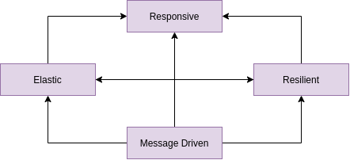

# Reactive Programming

**Reactive**

- Reactive Systems - Architecture and Design, ie Cloud Native.
- Reactive Programming - Generally Event Based.
- Functional Reactive Programming (FRP) - Often confused with Reactive Programming.

## Reactive Manifesto



**Responsive**

- The system responds in a timely manner.
- Responsiveness is the cornerstone of usability and utility.
- Responsiveness also means problems may be detected quickly and dealt with effectively.
- Responsive systems provide rapid and consistent response times.
- Consistent behavior simplifies error handling, builds end user confidence, and encourages further interaction.

**Resilient**

- System stays responsive in the face of failure.
- Resilience is achieved by replication, containment, isolation and delegation.
- Failures are contained within each component.
- Parts of the system can fail, without compromising the system as a whole.
- Recovery of each component is delegated to another.
- High-availability is ensured by replication where necessary.

**Elastic**

- The system stays responsive under varying workload.
- Reactive Systems can react to changes in the input rate by increasing or decreasing resources allocated to service inputs.
- Reactive Systems achieve elasticity in a cost effective way on commodity hardware and software platforms.

**Message Driven**

- Reactive Systems rely on asynchronous message passing to establish a boundary between components:
    - This ensures loose coupling, isolation and location transparency.
- Message passing enables load management, elasticity and flow control.
- Location transparent messaging makes management of failures possible.
- Non-blocking communication allows recipients to only consume resources whike active, leading to less system overhead.    

**Reactive Programming with Reactive Systems**

- Reactive Programming is a useful implementation technique.
- Reactive programming focuses on non-blocking, asynchronous execution - a key characteristic of Reactive Systems.
- Reactive Programming is just one tool in building Reactive Systems.

### Features of Reactive Programming

- Data Streams
- Asynchronous
- Non-blocking
- Backpressure
- Failures as Messages

**Data Stream**

- Data Streams can be just about anything.
- Mouse clicks, or other user interactions.
- JMS Messages, RESTful Service calls, Twitter feed, Stock Trades, list of data from a database.
- A stream is a sequence of events ordered in time.
- Events you want to listen to.

**Asynchronous**

- Events are captured asynchronously.
- A function is defined to execute when an event is emitted.
- Another function is defined if an error is emitted.
- Another function is defined when complete is emitted.


**ReactiveX Observable**


**Non-Blocking**

- In Blocking, the code will stop and wait for more data (ie reading from disk, network, etc).
- Non-blocking in contrast, will process available data, ask to be notified when more is available, then continue.

*Multi Threaded Server*


*Node.js Server*


**Back Pressure**

- The ability of the subscriber to throttle data.

**Failures as Messages**

- Exceptions are not thrown in a traditional sense.
    - Would break processing of stream.
- Exceptions are processed by a handler function.

### Reactive Streams API

- Goal is to create a standard for asynchronous stream processing with non-blocking back pressure.
- Reactive Streams is a set of 4 interfaces which define the API.
    - Publisher
    - Subscriber
    - Subscription
    - Processor
- Adoptions: Akka Streams, MongoDB, Reactive Rabbit, RxJava, Cassandra, ElasticSearch, Kafka, Play.

**Reactive Streams with Backpressure**


**[Spring MVC & Spring WebFlux**


**Spring Reactive Types**

- 'Mono' is a publisher with zero or one element in data stream.
- 'Flux' is a publisher with zero or MANY elements in the data stream. 
- Both implement the Reactive Streams Publisher interface.

## Spring Web Flux


## Evolution of Programming

- Past:
    - Monolith Applications.
    - Run in App Servers.
    - Does not embrace Distributed Systems.
- Now:
    - Micro Services.
    - Run in cloud.
    - Embrace Distributed Systems.
- Expectations of the App:
    - Scale based on load.
    - Use resources efficiently.
    - Latency or Response Time should be faster.

### Rest API

**Handling concurrent request**

- Thread per request model.
- Managed by property (thread pool size):
    - `server.tomcat.max-threads`
- By default it can handle 200 connections.
- Can be overriden in application.properties or application.yaml.
- Each thread takes some memory.
- Common Stack size is 1MB.
- Higher the thread pool size, Higher the memory consumption.
- Application really perform poor with less memory available.
- **Handled today**:
    - Load is handled today **horizontal scaling** - Kubernetes or some container orchestration.
- Limitation on handling many concurrent users.
- Move away from "Thread Per Request Model".

### Traditional Rest API

```java
@GetMapping("/v1/items/{id}")
public ResponseEntity<Item> getItem(@PathVariable Integer id) {
    // 1st DB call
    Price price = priceRepository.findById(id).get(); // 1.db-call 2.blocking

    // 2nd rest call
    ResponseEntity<location> locationEntity =
        restTemplate.getForEntity(locationUrl, Locatoion.class); // 1. rest call synchronous
                                                                 // 2. blocking

    Item item = buildItem(price, locationEntity.getBody());
    return ResponseEntity.ok(item);
}
```

- Imperative Style APIs:
    - Top-down approach.
    - Inefficient use of resources.
- **Blocking** and **Synchronous**.
- Need to make calls asynchronous, basically non blocking.
- Currently in Java we have::
    - Callback
    - Futures
- Callbacks:
    - Complex.
    - No return value.
    - Code is hard to read and maintain.
- Future:
    - Returns Future instance.
    - Hard to compose multiple asynchronous operations.
- Comparable Future:
    - Introduced as part of Java8.
    - Supports functional style API.
    - Easy to compose multiple Asynchronous operations.
    - Not great fit asynchronous call with multiple items.

```java
@GetMapping("/v1/items")
public ResponseEntity<Item> getAllItems() {
    List<Item> items = itemRepository.getAllItems();
    return Response.ok(items);
}
```

- Application may crash with Out Of Memory error.
- Client might be overwhelmed with huge data.
- How to avoid this?
    - BackPressure.
- **Summing up**:
    - Limit on the number of Concurrent users.
    - Synchronous and Blocking.
    - Imperative Style API.
    - No Back Pressure support.
- **Better API Design**:
    - Asynchronous and Non Blocking.
    - Move away from Thread per request model.
    - Use fewer threads.
    - Back Pressure compatible.

***

### Reactive Programming

- New programming paradigm.
- Asynchronous and Non Blocking.
- Data flow as an **Event/Message Driven** stream.
- Functional Style Code.
- Back Pressure on Data Streams.

**Data flows as an Event/Message Driven stream**

- One **Event of Message** for a every result item from Data Source.
- Data Sources:
    - Data Base.
    - External Service.
    - File.
- One **Event or Message** form **completion or error**.


- Error Flow.


- No Data / Save Data.


- **Summary - Data flow as an Event Driven stream**:
    - `OnNext(item)` - Data Stream events.
    - `OnComplete()` - Completion/Success event.
    - `OnError()` - Error Event.

**Functional Style Code**

- Simpler to Streams API.
- Easy to work with Lambdas.
- **Back Pressure on Data Stream**

**Reactive Streams Specification**

- Specification or Rules for a Reactive Stream.
- Who created specification:
    - Pivotal, Netflix, LightBend, Twitter.
- Publisher
- Subscriber
- Subscription
- Processor

**Publisher**

```java
public interface Publisher<T> {
    public void subscribe(Subscriber<? super T> s);
}
```
- Represents the Data Source:
    - Data Base.
    - External Service.

**Subscriber**

```java
public interface Subscriber<T> {
    public void onSubscribe(Subscription s);
    public void onNext(T t);
    public void onError(Throwable t);
    public void onComplete();
}
```

**Subscription**

```java
public interface Subscription {
    public void request(long n);
    public void cancel();
}
```


**Publisher/Subscriber Event Flow**


**Processor**

```java
public interface Processor<T,R extends Subscriber<T>, Publisher<R>> { }
```

**Reactive Library**

- Implementation of Reactive Stream Specification:
    - Publisher
    - Subscriber
    - Subscription
    - Processor
- Ractor or Project Reactor:
    - Recommended library for Spring Boot.

***

## Reactor types

### reactor-core

- Core library for project reactor.
- Implementation of Reactive Streams Specification.
- **Flux** and **Mono**.
- Reactive Types of project reactor.
- **Flux** - Represents 0 to N elements.
- **Mono** - Represents 0 to 1 element.

### Flux - 0 to N elements

```java
Flux.just("Spring", "Spring Boot", "Reactive Spring Boot")
    .map(s -> s.concat("flux"))
    .subscribe(System.out::println);
```

### Mono - 0 to 1 elements

```java
Mono.just("Spring")
    .map(s -> s.concat("mono"))
    .subscribe(System.out::println);
```

***

## Back Pressure on Reactive Data Streams

### Default Data Flow - Project Reactor


### What is Backpressure ?

- Subscriber controls the data flow from the Publisher.


### Project Reactor Communication Model


***

## Spring WebFlux - Functional Web:

- Use **Functions** to route the request and response.
- **RouterFunction** and **HandlerFunction**


### RouterFunction

- Use to route the incoming request.
- Similar to the functionality of **@RequestMapping** annotation.

```java
@GetMapping("/flux")
public Flux<Integer> returnFlux() {
    return Flux.just(1,2,3,4)
            .delayElements(Duration.ofSeconds(1))
            .log();
}
```

### Handler Function

- Handles the request and response.
- Similar to the body of the **@RequestMapping** annotation.

```java
@GetMapping("/flux")
public Flux<Integer> returnFlux() {
    return Flux.just(1,2,3,4)
            .delayElements(Duration.ofSeconds(1))
            .log();
}
```

- ServerRequest and ServerResponse.
- ServerRequest represents the HttpRequest.
- ServerResponse represents the HttpResponse.

### Spring WebFlux - Non Blocking Request/Response


**Flux Endpoint**

```java
@GetMapping("/flux")
public Flux<Integer> returnFlux() {
    return Flux.just(1,2,3,4)
            .delayElements(Duration.ofSeconds(1))
            .log();
}
```

**Spring WebFlux - Request/Response**


***

## Netty

- Netty is an asynchronous event-driven network application framework for rapid development
of maintainable high performance protocol servers & clients.
- Netty is build on top of Java.
- Used by:
    - Apache Cassandra, Google, Facebook.
- Protocol supported::
    - FTP
    - HTTP
    - SMTP
    - WebSocket

### Netty - Asynchronous

**Spring Webflux + Netty**


**Spring MVC + Tomcat**


- Being Asynchronous - Frees us from the blocking calls.
- Handles large number of connections.

### Events in Netty

- Client requesting for a new connection is treated as an event.
- Client requesting for data is treated as an event.
- Client posting for data is treated as an event.
- Errors are treated as event.

### Netty - Channel

- Channel - Represents the connection between the client and server.


- Inbound events:
    - Requesting for Data.
    - Posting Data.
- Outbound events:
    - Opening or closing a connection.
    - Sending response to the client.

### Netty - Event Loop

- Loop the looks for events.
- EventLoop is registered with a single dedicated thread.

### Channel LifeCycle

- Channel is Created.
- Channel registered with event loop.
- Channel is Active.
- Channel is InActive.
- Channel unregistered.

### Netty - End to End, Threads, Execution Mode

**EventLoop + Channel**

**EventLoop + Multiple Channel**


- No of EventLoops == 2 X no of processors for the virtual machine.
- `Runtime.getRuntime().availableProcessors()`
- EventLoopGroup - 2 EventLoop Groups are in Netty.
- How many threads - Number of threads == 2 X no of processors for the virtual machine.

```console
sudo service mongod start
java -jar -Dspring.profiles.active=prod build/libs/learn-reactivespring.jar
```

***

## Streaming Endpoint (SSE)

- It is an endpoint once the connection is made its going to keep pushing the data to the
client as the new data is available.


### Use Cases

- Stock Tickers.
- Weather Updates.
- Flight Arrival/Departure/Delay updates in airports.

### MongoDB

- Tailable Cursor:
    - Connections remains open after all the results are retrieved.
- Capped Collections:
    - Collection of fixed-size in MongoDB.
    - Preserves the insertion Order.

