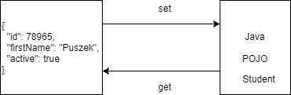

# SPRING REST

## RESTful Web Services

- Because of their simplicity and versatility, RESTful web services have cecome the de facto standard of web services.
- REST - Representational State Transfer:
    - Representation - Typically JSON or XML.
    - State Transfer - Typically via HTTP.
    
**RESTful Terminology**

- Verbs - HTTP Methods: GET, PUT, POST, DELETE.
- Messages - the payload of the action (JSON/XML).
- URI - Uniform Resource Identifier:
    - A unique string identifying a resource.
- URL - Uniform Resource Locator.
- Idempotence - execute operation multiple times, without changing the result.
    - Refreshing a web page (HTTP GET operation).    
- Stateless - Service does not maintain any client state.
- HATEOAS - Hypermedia As the Engine of application state.        

### Richardson Maturity Model (RMM)

- A model used to describe the maturity of RESTful services.
- Unlike SOAP, there is no formal specification for REST.
- RMM is used to describe the quality of the RESTful service.

**RMM Levels**


**Core Technologies**

- Hypermedia
- HTTP
- URI

**Level 0: Swamp of POX**

- POX - Plain Old XML.
- Uses implementing protocol as a transport protocol.
- Typically, uses one URI and one kind of method.
- Examples - RPC, SOAP, XML-RPC.

**Level 1: Resources**

- Uses Multiple URIs to identify specific resources.
- Still uses a single method (GET).
- Breaks large service into distinct URIs.

**Level 2: HTTP Verbs**

- HTTP Verbs are used with URIs for described actions.
    - GET /products/1234
    - PUT /products/1234
    - DELETE /products/1234
- Most common in practical use.
- Introduces Verbs to implement actions.

**Level 3: Hypermedia**

- Representation now contains URIs which may be useful to consumers.
- Helps client developers explore the resource.
- No clear standard at time.
- Spring provides an implementation of HATEOS.
- Provides discoverability, making the API more self documenting.

## JSON Data Binding

- Process of converting JSON data to a Java POJO.


- Also called as :
    - Serialization / Deserialization
    - Marshalling / Unmarshalling

## JSON Data Binding with Jackson

- Handles data binding between JSON and Java.
- Package - **com.fasterxml.jackson.databind**.



- Converts JSON to Java POJO, call setter on POJO:
    - It does not call private method, so define public setters.

```java
ObjectMapper mapper = new ObjectMapper();

// Read from file and map to Java POJO
Student student = mapper.readValue(new File("myjson.json"), Student.class);

System.out.println(student.getFirstName());

// Write JSON to output file
mapper.enable(SerializationFeature.INDENT_OUTPUT);
mapper.writeValue(new File("output.json"), student);
```

### Spring Jackson Support

- Spring automatically handle Jackson.
- JSON data binding passed to REST controller is converted to POJO.
- Java object returned from REST controller is converted to JSON.

### Creating Spring REST

- Add maven dependency:
    - spring-webmvc
    - jackson-databind
    - javax.servlet-api
- Java Configuration - `@Configuration`.

```java
@Configuration
@EnableWebMvc
@ComponentScan(basePackage = "com.panda.spring")
public class AppConfig {
}
```

- Config Servlet Initializer - `AbstractAnnotationConfigDispatcherServletInitializer`.

```java
public class SpringMVCDispatcherServlet extends AbstractAnnotationConfigDispatcherServletInitializer {
    // override methods
    // getRootConfigClasses(), getServletConfigClasses(), getServletMappings()
}
```

- Create Rest Service `@RestController`.

```java
@RestController
@RequestMapping("/test")
public class DemoController {
    @GetMapping("/hello")
    public String hello() {
        return "Hello World";
    }
}

```

- Spring REST and Jackson POJOs are automatically converted to JSON.

### Path Variables

- Retrieve by id - GET `/api/students/{id}`


```java
@GetMapping("/students/{id}")
public Student getStudent(@PathVariable int id) {
}
```

## Exception Handling

- Error response class:
    - Java POJOs.
    - Jackson converts it to JSON.
- Exception class - extends RuntimeException.
- Update REST to throw exception if necessary.
- Add exception handler `@ExceptionHandler`:
    - Exception handler will return a ResponseEntity.
    - ResponseEntity is a wrapper for the HTTP response object.
    - ResponseEntity provides control to specify:
        - HTTP status code, HTTP headers and Response body.

### @ControllerAdvice

- ControllerAdvice interceptor/filter.
- Pre-process request to controller.
- Post-process responses to handel exceptions.
- For global exception handling.


```java
@ControllerAdvice
public class GlobalExceptionHandler {
}
```

## API

- Define API Requirements.
- Identify resources:
    - Plural forms of resources `/api/customers`.
- HTTP methods to assign actions on resources:
    - GET, POST, PUT, DELETE

| Http Method | Endpoint | CRUD Action |
|---|---|---|
| POST | /api/students | Create new student |
| GET | /api/students | Read list of students |
| GET | /api/students/{id} | Read single student |
| PUT | /api/students | Update existing student |
| DELETE | /api/students/{id} | Delete student |

- Don't include actions in endpoint, instead use HTTP to assign actions.

## CRUD

### Read GET

```java
@RestController
@RequestMapping("/api")
public class StudentRestController {
    @Autowired
    private StudentService studentService;

    @GetMapping("/students")
    public List<Students> getStudents() {
        return studentService.getStudents();
    }
}
```

### Create POST

- `@RequestBody` to access the request body as POJO.

```java
@PostMapping("/students")
public Student addStudent(@RequestBody Student student) {
    student.setId(0); // id of 0 DAO code will perform INSERT new Student
    studentService.saveStudent(student);
    return student;
}

```

- Sending JSON data to Spring REST Controller.
- For controller to process JSON data, need to set a HTTP request header - `Content-type: application/json`.
- Configure REST client to send the correct HTTP request header (using Postman for instance).

### Update PUT

```java
@PutMapping("/students")
public Student updateStudent(@RequestBody Student student) {
    studentService.saveStudent(student);
    return student;
}
```

### Delete DELETE

```java
@DeleteMapping("/students/{studentId}")
public String deleteStudent(@PathVariable int studentId) {

    Student student = studentService.getStudent(studentId);

    if (student == null) {
        throw new StudentNotFoundException("Student with id not found : " + studentId);
    }

    studentService.deleteStudent(studentId);
    return "Deleted student with id : " + studentId;
}
```

## Richardson Maturity Model

- A model used to describe the maturity of RESTful services.
- No formal specification for REST.
- RMM is used to describe the quality of the RESTful service.

## RMM levels


### Level 0 - Swamp of POX

- POX - Plain Old XML.
- Uses implementing protocol as a transport protocol.
- Typically uses one URI and one kind of method.
- Examples - RPC, SOAP, XML-RPC.

```
http://localhost/getPost
http://localhost/deletePost
http://localhost/doThis
```

### Level 1 - Resources

- Uses Multiple URIs to identify specific resources.
- Examples:
    - `http://localhost:8080/panda/123`
    - `http://localhost:8080/panda/321`
- Uses a single method **GET**.

### Level 2 - HTTP Verbs

- HTTP Verbs are used with URIs for desired actions.
- Examples:
    - GET `/students/123` - return student with id 123.
    - PUT `/students/123` - (with XML/JSON body) to update data for student 123.
    - DELETE `/students/123` - to delete student with id 123.
- Most common.
- `Level1 + methods`

### Level 3: Hypermedia

- Representation contains URIs which may be useful to consumers.
- Helps clients explore the resource.
- Not standardized at this time.
- Spring provides an implementation of HATEOS.
- `Level2 + HATEOAS` - Data + Next Possible Actions.

### Summary

- Level 1 - breaks large service into distinct URIs.
- Level 2 - Introduces Verbs to implement actions.
- Level 3 - provides discoverability, making the API more self documenting.
- Best Practice:
    - Consumer first, good documentation.
    - Make best use of HTTP.
    - Proper response status:
        - 200 - success.
        - 404 - resource not found.
        - 400 - bad request.
        - 201 - created.
        - 401 - unauthorized.
        - 500 - server error.
    - No secure info in uri.
    - Use plurals - Prefer /users/1 to /user/1.
    - Use nouns for resources.

***

## Introduction to web services

### Web Service

- Software system designed to support interoperable machine-to-machine interaction over a network.
- 3 keys:
    - Designed for machine-to-machine (or application-to-application) interaction.
    - Should be interoperable - Not platform dependent.
    - Should allow communication over a network.

**Q1: How does data exchange between applications take place?**

- Request (input).
- Response (Output).

**Q2: How can we make web service platform independent?**

- Request and Response in platform independent format.
- Request format: json, xml.

**Q3: How does the Application A know the format of Request and Response?**

- Service definition:
    - Request/Response Format.
    - Request Structure.
    - Response Structure.
    - Endpoint.

### Key terminology

- Request - Input to web service.
- Response - Output of web service.
- Message Exchange Format:
    - Format of request nad response - XML and JSON.
- Service provider or Server - WebService, host the webservice.
- Service consumer or Client - Application, consuming webservice.
- Service Definition - contract between service provider and service consumer:
    - defines format request and response.
    - what is structure of request and response.
    - where is service available.
- Transport: how a service is called:
    - HTTP and MQ communication over a queue (WebSphere MQ).

## REST

- Resource has an URI (Uniform Resource Identifier):
    - `/user/majka/todos/1`
    - `/user/majka/todos`
    - `/user/majka`
- Resource representations:
    - XML
    - HTML
    - JSON
- Create a User - `POST /users`
- Delete a User - `DELETE /users/1`
- Get all Users - `GET /users`
- Get one Users - `GET /users/1`
- Data Exchange Format - No restrictions. JSON popular.
- Transport - Only HTTP.
- Service Definition - No standard. WADL/Swagger/.
- Dispatcher servlet handling all requests, front controller for Spring MVC, which is right controller
to execute this request:
    - `@RestController`
    - `@ResponseBody`

**What is dispatcher servlet?**

- Front controller pattern for spring mvc framework.

**Who is configuring dispatcher servlet?**

- SpringBootAutoConfiguration

**What does dispatcher servlet do?**

- Dispatcher servlet is handling all the requests, tells Jackson do the conversion to JSON.

**How does the HelloWorldBean object get converted to JSON?**

- SpringBootAutoConfiguration, message converter Jackson beans are getting initialized.

**Who is configuring error mapping?**

- SpringBootAutoConfiguration

### AUTO-CONFIGURATION

- `DispatcherServletAutoConfiguration` - found dispatcher servlet on classpath.
- `ErrorMvcAutoConfiguration` - configure error page, error controller, few error attributes,
 default error view resolver.
- `HttpMessageConvertersAutoConfiguration` - bean automatically converted to JSON:
    - `Jackson2ObjectMapper` - does conversion from JSON to object and object to JSON.
- Mapping servlet - `dispatcherServlet` to `[/]` - dispatcher servlet is handling all the requests:
    - Front controller pattern for spring mvc framework.
- Mapper {[hello-world], methods=[GET]}:
    - Which method is executed.
    - `@RestController`:
        - `@ResponseBody`, response from that will be mapped to message converter to the same format.

## Internationalization

### Configuration

- LocaleResolver - Default locale - Locale.US.
- ResourceBundleMessageSource.

### Usage

- Autowire MessageSource.

```java
@RequestHeader(value = "Accept-Language", required=false)
Locale locale messageSource.getMessage("helloWorld.message", null, locale) {
    // ...
}
```

## Versioning

- MediaType versioning ("content negotiation" or "accept header") - GitHub.
- Custom headers versioning - Micsosoft.
- URI versioning - Twitter.
- Request Parameter versioning - Amazon.

***

## Spring security

```xml
<dependency>
    <groupId>org.springframework.boot</groupId>
    <artifactId>spring-boot-starter-security</artifactId>
</dependency>
```

## JWT

### Basic authentication

- No expiration time.
- No user details.

### Custom token system

- Both teams should understand.
- Custom structure.
- Possible security flows.

### JWT

- Standard.
- Can contain user details and authorizations.

### Token processing

**JwtTokenUtil.java**

```json
{
    "token": "eyJhbGciOiJIUzUxMiJ9.ZsA8i14l9WB_hVoZFk7VU--"
}
```

### GET Token

```
POST to http://localhost:8080/authenticate
```

- Request.

```json
{
    "username": "panda",
    "password": "dummy"
}
```

- Response.

```json
{
    "token": "TOKEN_VALUE"
}
```

### Refresh token

```
GET to http://localhost:8080/refresh

Header - Authorization: 'Bearer JWT_TOKEN'
```

### Authorize all other requests

- GET/POST/PUT/DELETE to `http://localhost:8080/resource`:
    - Header - Authorization: "Bearer JWT_TOKEN".
- Filter - JwtTokenAuthorizationOncePerRequestFilter.

### All together

```java
JWTWebSecurityConfig extends WebSecurityConfigurerAdapterConfigures
```

- userDetailService with BCryptPasswordEncoder.
- Statelessness.
- AuthenticationEntryPoint.
- JwtTokenAuthorizationOncePerRequestFilter.
- h2-console.
