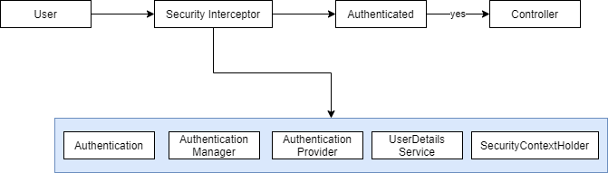

# Spring Security

## Spring Security Features

- Provides a portable security mechanism for Java enterprise apps.

### Authentication & Authorization

- **Authentication:** Ensuring a user who they claim to be:
    - HTTP basic
    - Form Based
    - LDAP
    - OpenID
    - X.509
- **Authorization:** Determining if a user allowed to perform an action.

### Security capabilities

- Protection web resources: Requires specific roles to access URLs.
- Authorizing method invocations: Requiring specific roles to access methods.
- Restricting entity access: Constantly Access Lists (CAL) to determine domain object access.

### Extra Features

- Cross Site Request Forgery `CSRF`
- Session Fixation
- Click jacking
- Cross Site Scripting `XSS`
- Password encoding via hash and salt.

### Spring Security Strengths

- Spring approach
- Annotation based
- Spring MVC
- Testing
- Layered security approach

## Security Principles

### Authentication

- Process of identifying an individual using credentials:
    - Username & password
    - Tokens

### Authorization

- Process of granting someone access to a resource:
    - Files
    - Records
    - Databases

## Spring Security Basics

- **MAVEN**:
    - `spring-security-web`
    - `spring-security-config`

### Basic XML Configuration

**web.xml**

```xml
<filter>
    <filter-name>SpringSecurityFilterChain</filter-name>
    <filter-class>org.springframework.web.filter.DelegatingFilterProxy</filter-class>
</filter>
<filter-mapping>
    <filter-name>SpringSecurityFilterChain</filter-name>
    <url-pattern>/*</url-pattern>
</filter-mapping>
<context-param>
    <param-name>ContextConfiguration</param-name>
    <param-value>
        /WEB-INF/Spring/Security-context.xml
    </param-value>
</context-param>
```

**security-context.xml**

```xml
<security:http auto-config="true" use-expressions="false">
    <security:intercept-url pattern="/**" access="ROLE_USER"/>
</security:http>
<security:authentication-manager>
    <security:authentication-provider>
        <security:user-service>
            <security:user name="user" password="password" authorities="ROLE_USER"/>
        </security:user-service>
    </security:suthentication-provider>
</security:authentication-manager>
```

### HTTP Basic Authentication

```xml
<security:http auto-config="true" use-expressions="false">
    <security:http-basic/>
</security:http>
```

### CSRF Token

- `spring-security-taglib`

**login.jsp**

```jsp
<%@ taglib uri="http://www.springframework.org/security/tags" prefix="sec" %>
<sec:csrfInput/>
```

### Authentication

- `UserDetailsService`
- `SecurityContextHolder`
- `UserDetails`
- `AuthenticationProvider`
- `Authentication`

### Security Interceptor

- Decider whether access granted to a particular sources.
- `FilterSecurityInterceptor` enforces access to HTTP resources.
- `MethodSecurityInterceptor` enforces access to method invocations.
- Config using instances of `ConfigAttribute`.

```xml
<filter>
    <filter-name>SpringSecurityFilterChain</filter-name>
    <filter-class>
        org.springframework.web.filter.DelegatingFilterProxy
    </filter-class>
</filter>

<security:http auto-config="true">
    <security:intercept-url pattern="/sample"/>
</security:http>
<security:global-method-security/>

<bean id="SpringSecurityFilterChain" class="org.springframework.security.web.FilterChainProxy">
    <constructor-arg>
        <security-filter-chain pattern="/**" filters="filterSecurityInterceptor"/>
    </constructor-arg>
</bean>
<bean id="filterSecurityInterceptor"
    class="org.springframework.security.web.accept.intercept.FilterSecurityInterceptor"/>
```

### Security Interceptor Types

```java
@Controller
@RequestMapping("/sample")
public class SampleController {
    @RequestMapping("/delete")
    @Secured("ROLE_USER")
    private String delete() {
        return "delete.html";
    }
}
```

### Process



### SecurityContextHolder

```java
SecurityContextHolder.getContext().getAuthentication().getName();
UserEntity user = this.autoUserRepository.findByUsername(username);
```

### UserDetails

**UserEntity.java**

```java
@Entity
@Table(name="USER_ENTITY")
public class UserEntity implements UserDetails {

    @Override
    public Collection<? extends GrantedAuthority> getAuthorities() {
        return AuthorUtils.createAuthority(this.role);
    }

    @Override
    public boolean isAccountNonExpired() {
        return true;
    }

    @Override
    public boolean isAccountNonLocked() {
        return true;
    }

    @Override
    public boolean isCredentialsNonExpired() {
        return true;
    }

    @Override
    public boolean isEnabled() {
        return true;
    }
}
```

**HomeController.java**

```java
@Controller
@RequestMapping("/")
public class HomeController {
    @Autowired
    private UserRepository userRepository;

    @RequestMapping(value="/register", method=RequestMethod.POST)
    public String register(@ModelAttribute UserEntity user) {
        user.setRole("ROLE_USER");
        userRepository.save(user);

        Authentication auth = new UsernamePasswordAuthenticationToken(
            user, userRepository.getPassword(), user.getAuthorities());

        SecurityContextHolder.getContext().setAuthentication(auth);

        return "redirect:/";
    }
}
```

### Custom Authentication Provider

**CustomAuthenticationProvider.java**

```java
@Component("customAuthenticationProvider")
public class CustomAuthenticationProvider implements AuthenticationProvider {

    @Autowired
    private UserRepository repo;

    @Override
    public Authentication authenticate(Authentication authentication) throws AuthenticationException {
        UsernamePasswordAuthenticationToken token =
            (UsernamePasswordAuthenticationToken) authentication;
        UserEntity user = repo.findByUsername(token.getName());

        if (!user.getPassword().equalsIgnoreCase(token.getCredentials().toString())) {
            throw new BadCredentialsException("Invalid credentials");
        }

        return new UsernamePasswordAuthenticationToken(user, user.getPassword(), user.getAuthorities());
    }

    @Override
    public boolean supports(Class<?> authentication) {
        return UsernamePasswordAuthenticationToken.class.equals(authentication);
    }
}
```

**security-context.xml**

```xml
<security:authentication-manager>
    <security:authentication-provider ref="CustomAuthenticationProvider">
</security:authentication-manager>
```

### Custom Authentication Object

**CustomAuthenticationToken.java**

```java
public class CustomAuthenticationToken extends UsernamePasswordAuthenticationToken {
    private String maki;

    public CustomAuthenticationToken(String principal, String credentials, String maki) {
        super(principal, credentials);
        this.maki = maki;
    }

    public CustomAuthenticationToken(UserEntity principal, String credentials,
        Collection<? extends GrantedAuthority> authorities, String maki) {
        super(principal, credentials, authorities);
        this.maki = maki;
    }

    public String getMaki() {
        return maki;
    }
}
```

**CustomAuthenticationFilter.java**

```java
public class CustomAuthenticationFilter extends UsernamePasswordAuthenticationFilter {
    @Override
    public Authentication attemptAuthentication(HttpServletRequest request, HttpServletResponse response)
        throws AuthenticationException {
        String username = super.obtainUsername(request);
        String password = super.obtainPassword(request);
        String maki = request.getParameter("maki");

        CustomAuthenticationToken token = new CustomAuthenticationToken(username, password, maki);
        super.setDetails(request, token);
        return this.getAuthenticationManager().authenticate(token);
    }
}
```

**security-context.xml**

```xml
<security:authentication-manager alias="authenticationManager">
    <security:authentication-provider ref="customAuthenticationProvider"/>
</security:authentication-manager>

<security:http use-expressions="false" entry-point-ref="loginEntry">
    <security:custom-filter ref="customLoginFilter" position="LOGIN_FILTER"/>
</security:http>

<bean id="loginEntry"
    class="org.springframework.security.web.authentication.LoginUrlAuthenticationEntryPoint">
    <constructor-arg value="/login"/>
</bean>
```

## JDBC Authentication

**application-context.xml**

```xml
<jdbc:embedded-database id="datasource" type="H2">
    <jdbc:script location="classpath:init.sql"/>
</jdbc:embedded-database>
```

**security-context.xml**

```xml
<security:authentication-manager>
    <security:authentication-provider>
        <security:jdbc-user-service data-source-ref="datasource"/>
    </security:authentication-provider>
</security:authentication-manager>
```

### Group Based Access Control

**security-context.xml**

```xml
<security:authentication-manager>
    <security:authentication-provider>
        <security:jdbc-user-service data-source-ref="datasource"
            group-authorises-by-username-query=" ... "/>
    </security:authentication-provider>
</security:authentication-manager>
```

### Encoding Password

**security-context.xml**

```xml
<security:authentication-manager>
    <security:authentication-provider>
        <security:jdbc-user-service />
        <security:password-encoder hash="sha-256"/>
    </security:authentication-provider>
</security:authentication-manager>
```

### Salting Hashes

**security-context.xml**

```xml
<bean id="passwordEncoder" class="org.springframework.security.crypto.password.StandardPasswordEncoder"/>
<security:password-encoder ref="passwordEncoder"/>
```

```java
public class PasswordEncoder {
    public static void main(String[] args) {
        StandardPasswordEncoder encoder = new StandardPasswordEncoder();
        String encodedPassword = encoder.encode("password");
    }
}
```

## LDAP Authentication

**spring-security.ldif** - ldap configuration.

### LDAP Authentication Provider

- **MAVEN**:
    - `spring-security-ldap`

**security-context.xml**

```xml
<security:ldap-server id="server"
    uri="ldap://localhost:10389/dc=panda,dc=panda" manager-dn="uid=admin,ou=admin"
    manager-password="pass"/>

<security:authentication-manager>
    <security:ldap-authentication-provider user-search-filter="(uid={0})" />
</security:authentication-manager>
```

### UserDetails Context Mapper

```java
@Component("contextmapper")
public class MyUserDetailsContextMapper implements UserDetailsContextMapper {
    @Override
    public UserDetails mapUserFromContext(DirContextOperations context, String name,
        Collection<? extends GrantedAuthority> auth) {
        UserEntity user = new UserEntity();
        user.setName(context.getStringAttribute("username"));
        user.setEmail(context.getStringAttribute("email"));
        user.setUsername(name);
        user.setAuthorities(auth);
        return user;
    }

    @Override
    public void mapUserToContext(UserDetails user, DirContextAdapter context) {
        UserEntity user = (UserEntity) user;
        context.setAttributeValue("name", user.getName());
        context.setAttributeValue("email", user.getEmail());
        context.setAttributeValue("password", user.getPassword());
        context.setAttributeValue("id", user.getId());
    }
}
```

**security-context.xml**

```xml
<context:component-scan base-package="com.panda.security"/>

<security:authentication-manager>
    <security:ldap-authentication-provider user-dn-pattern="id={0}"
       server-ref="server" user-context-mapper-ref="contextmapper"/>
</security:authentication-manager>
```

### Authorization

```xml
<security:http auto-config="true" use-expressions="true">
    <security:intercept-url pattern="/cart/*" access="hasRole('ROLE_ADMIN')"/>
    <security:intercept-url pattern="/main/**" access="principal.username='panda'"/>
</security:http>
```

### Authorize tag

```jsp
<%@ taglib uri="org.springframework.org/security/tags" prefix="sec" %>

<sec:authorize assess="${isAllowed}">
</sec:authorize>
```

**UserController.java**

```java
@ModelAttribute("isAllowed")
public boolean isAllowed(Authentication authentication) {
    return authentication != null && authentication.getAuthorities().contains(
        AuthorityUtils.createAuthorityList("ROLE_USER").get(0));
}
```

**`@PreAuthorize`**

```java
@ResponseBody
@RequestMapping("/authorized")
@PreAuthorize("hasRole('ROLE_ADMIN')")
public string authorized() {
    return "authorized";
}
```

**dispatcher-servlet.xml**

```xml
<security:global-method-security pre-post-annotations="enabled"/>
```

**`@PostAuthorize`**

```java
@RequestMapping("/{id}")
@PostAuthorize("return='checkout'")
public String getCheckout(@PathVariable("checkout") long id, Model model) {
    Checkout checkout = checkoutRepo.findOne(id);
    model.addAttribute("checkout", checkout);
    return "checkout";
}
```

**`@RolesAllowed`**

**dispatcher-servlet.xml**

```xml
<security:global-method-security jsr250-annotations="enabled" pre-post-annotations="enabled"/>
```

```java
@ResponseBody
@RequestMapping("/admin")
@RolesAllowed("ROLE_ADMIN")
public String adminPage() {
    return "admin";
}
```

**`@PreFilter`**

```java
@PreFilter("principal.userid=object.user.userid")
public String save(checkout);
```

**`@PostFilter`**

```java
@ResponseBody
@RequestMapping("/checkouts")
@PostFilter("principal.userid=object.user.userid")
public List<Checkout> getCheckouts(Authentication authentication) {
    return this.checkoutRepository.findAll();
}
```

## Access Control

- `acl_sid:` Store info about principals or authorities.
- `acl_class:` Qualified class name.
- `acl_object_identity:` Protected object instances.
- `acl_entry:` - Entries
- **MAVEN**:
    - `spring-security-acl`
    - `ehcache`

**dispatcher-servlet.xml**

```xml
<bean id="expressionHandler" class="org.springframework....DefaultMethodSecurityExpressionHandler">
    <property name="permissionEvaluator" ref="permissionEval"/>
    <property name="permissionCacheOptimizer" ref="permissionCacheOpt"/>
</bean>
<bean id="permissionCacheOpt" class="org.springframework.security.acl.AclPermissionCacheOptimizer">
    <constructor-arg ref="aclService"/>
</bean>
<bean id="permissionEval" class="org.springframework.acls.AclPermissionEvaluator">
    <constructor-arg ref="aclService"/>
</bean>
<bean id="aclService" class="org...JdbcMutableAclService">
    <!-- ... -->
</bean>
<security:global-method-security jsr-annotations="enabled" pre-post-annotations="enabled">
    <security:expression-handler ref="expressionHandler"/>
</security:global-method-security>
```

## Advanced

### HTTP channel Security

- Create public key using `keytool`.

**server.xml**

```xml
<connector SSLEnabled="true" KeyStoreFile=".../keystore.jks" kaystorePass="pwd"
    scheme="https" secure="true" clientAuth="false"
    sslProtocol="TLSv1" ... />
```

**security-context.xml**

```xml
<security:intercept-url pattern="/checkouts/*" access="ROLE_ADMIN" requires-channel="https"/>
```

### CSRF

- Script rely upon session after click on malicious script..

```html
<div>
    <input type="hidden" value="<TOKEN>" name="_csrf">
</div>
```

**security-context.xml**

```xml
<security:csrf disabled="true"/>
```

### Authentication tag

```jsp
<%@ taglib uri="http://www.springframework.org/security/tags/" prefix="sec"%>
<!-- ... -->
    <sec:authorize access="isAuthenticated()">
        <sec:authentication property="principal.username"/>
    </sec:authorize>
<!-- ... -->
```

### Remember me

```jsp
<div class="form-group">
    <label for="remember">Remember Me</label>
    <input type="checkbox" id="remember" name="remember-me"/>
</div>
```

**security-context.xml**

```xml
<security:remember-me key="rememberme"/>
```

### Java Configuration

**SecurityConfig.java**

```java
@Configuration
@EnableWebSecurity
@ImportResource("/WEB-INF/application-context.xml")
@ComponentScan("com.panda.security")
public class SecurityConfig extends WebSecurityConfigurerAdapter {
    @Autowired
    private DataSource dataSource;

    @Autowired
    private UserDetailsService userDetailsService;

    protected void configure(AuthenticationManagerBuilder authentication) throws Exception {
        authentication.jdbcAuthentication().dataSource(dataSource);
        authentication.userDetailsService(userDetailsService);
    }

    protected void configure(HttpSecurity http) throws Exception {
        http.formLogin().loginPage("/login").loginProcessingUrl("/login")
            .usernameParameters("username").passwordParameters("password");
    }
}
```

**SecurityAppInitializer.java**

```java
public class SecurityAppInitializer extends AbstractSecurityWebApplicationInitializer {
    public SecurityAppInitializer() {
        super(SecurityConfig.class);
    }
}
```
