# Spring, SpringBoot, JPA, Hibernate.

## What is Spring?

* The Spring Framework (shortly, Spring) is a mature, powerful and highly flexible framework focused on building web
applications in Java.
* Spring makes programming Java quicker, easier, and safer for everybody. It's focus on speed, simplicity, and
productivity has made it the world's most popular Java Framework.
* Whether you're building secure, reactive, cloud-based microservices for the web, or complex streaming data flows for
the enterprise, Spring has the tools to help.
* The reason of Spring Framework success is, it regularly introduces features/projects based on the latest market trends,
needs of the Dev community. For example SpringBoot.

## Spring Core.

* Spring Core is the heart of entire Spring. It contains some base framework classes, principles and mechanisms.
* The entire Spring Framework and other projects of Spring are developed on top of the Spring Core.
* Spring Core contains following important components:
  * IoC (Inversion of Control).
  * DI (Dependency Injection).
  * Beans.
  * Context.
  * SpEL (Spring Expression Language).
  * IoC Container.

### Inversion of control & dependency injection.

* Inversion of Control (IoC) is a Software Design Principle, independent of language, which does not actually create the
objects but describes the way in which object is being created.
* IoC is the principle, where the control flow of a program is inverted: instead of the programmer controlling the flow
of a program, the framework or service takes control of the program flow.
* Dependency Injection is the pattern through which Inversion of Control achieved.
* Through Dependency Injection, the responsibility of creating objects is shifted from the application to the Spring IoC 
container. It reduces coupling between multiple objects as it is dynamically injected by the framework.

**Advantages of IoC & DI.**

* Loose coupling between the components.
* Min the amount of code in your application.
* Makes unit testing easy with different mocks.
* Increased system maintainability & module reusability.
* Allows concurrent of independent development.
* Replacing modules has no side effect on other modules.

### Spring Beans, Context, SpEL.

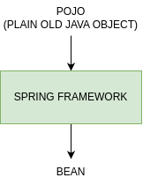

* Any normal Java classes that is instantiated, assembled, and otherwise managed by a Spring IoC container is called
Spring Beans.
* These beans are created with the configuration metadata that you supply to the container either in the form of XML
configs and Annotations.
* Spring IoC Container manages the lifecycle of Spring Bean scope and injecting any required dependencies in the bean.
* Context is like a memory location of your app in which we add all the object instances that we want the framework to
manage. By default, Spring doesn't know any of the objects you define in your application. To enable Spring to see your
objects, you need to add them to the context.
* SpEL provides a powerful expression language for querying and manipulating an object graph at runtime like setting and
getting property values, properly assignment, method invocation etc.

### Spring IoC Container.

* The IoC container is responsible:
  * To instantiate the application class.
  * To configure the object.
  * To assemble the dependencies between the objects.
* There are two types of IoC containers:
  * 'org.springframework.beans.factory.BeanFactory'.
  * 'org.springframework.context.ApplicationContext'.
* The Spring container uses dependency injection (DI) to manage the components/objects that make up an application.

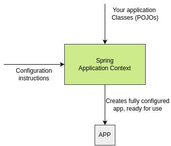

## Maven.

### Adding new Beans to Spring Context.

* When we create a java object with new operator directly as shown below, then your Spring Context/Spring IoC Container
will not have any clue of the object.
* '@Bean' annotation lets Spring know that it needs to call this method when it initializes its context and adds the
returned object/value to the Spring context/Spring IoC Container.

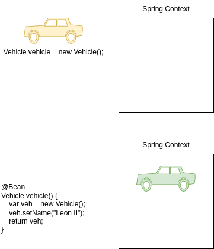

#### NoUniqueBeanDefinitionException.

When we create multiple objects of some type and try to fetch the bean from context by type, then Spring cannot guess
which instance you've declared you refer to. This will lead to NoUniqueBeanDefinitionException.

```java
@Bean
Vehicle vehicle1() {
    var veh = new Vehicle("Seat");
    return veh;
}

@Bean
Vehicle vehicle2() {
    var veh = new Vehicle("Toyota");
    return veh;
}

@Bean
Vehicle vehicle3() {
    var veh = new Vehicle("Honda");
    return veh;
}

public static void main(String[] args) {
    var context = new AnnotationConfigApplicationContext(ProjectConfig.class);
    Vehicle veh = context.getBean(Vehicle.class);
}
```

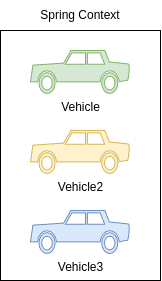

To avoid NoUniqueBeanDefinitionException in these kind of scenarios, we can fetch the bean from the context by mentioning
its name like shown below.

```java
@Bean
Vehicle vehicle1() {
    var veh = new Vehicle("Seat");
    return veh;
}

@Bean
Vehicle vehicle2() {
    var veh = new Vehicle("Toyota");
    return veh;
}

@Bean
Vehicle vehicle3() {
    var veh = new Vehicle("Honda");
    return veh;
}

public static void main(String[] args) {
    var context = new AnnotationConfigApplicationContext(ProjectConfig.class);
    Vehicle veh = context.getBean("vehicle1", Vehicle.class);
}
```

#### Different ways to name a bean.

By default, Spring will consider the method name as the bean name. But if we have a custom requirement to define a separate
bean name, then we can use any of the below approach with the help of @Bean annotation.

```java
@Bean(name = "seatVehicle")
Vehicle vehicle1() {
    var veh = new Vehicle("Seat");
    return veh;
}

@Bean(value = "toyotaVehicle")
Vehicle vehicle2() {
    var veh = new Vehicle("Toyota");
    return veh;
}

@Bean("hondaVehicle")
Vehicle vehicle3() {
    var veh = new Vehicle("Honda");
    return veh;
}

public static void main(String[] args) {
    var context = new AnnotationConfigApplicationContext(ProjectConfig.class);
    Vehicle veh1 = context.getBean("seatVehicle", Vehicle.class);
    Vehicle veh2 = context.getBean("toyotaVehicle", Vehicle.class);
    Vehicle veh3 = context.getBean("hondaVehicle", Vehicle.class);
}
```

#### @Primary Annotation.

When you have multiple beans of the same kind inside the Spring context, you can make one of them primary by using 
`@Primary` annotation. Primary bean is the one which Spring will choose if it has multiple options, and you don't specify
a name. In other words, it is the default bean that Spring Context will consider in case of confusion due to multiple 
beans present of same type.

```java
@Bean(name = "seatVehicle")
Vehicle vehicle1() {
    var veh = new Vehicle("Seat");
    return veh;
}

@Bean(value = "toyotaVehicle")
Vehicle vehicle2() {
    var veh = new Vehicle("Toyota");
    return veh;
}

@Primary
@Bean("hondaVehicle")
Vehicle vehicle3() {
    var veh = new Vehicle("Honda");
    return veh;
}

public static void main(String[] args) {
    var context = new AnnotationConfigApplicationContext(ProjectConfig.class);
    Vehicle veh1 = context.getBean(Vehicle.class);
}
```

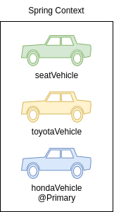

#### @Component Annotation.

`@Component` is one of the most commonly used stereotype annotation by developers. Using this we can easily create and
add a bean to the Spring context by writing less code compared to the `@Bean` option. With stereotype annotations, we
need to add the annotation above the class for which we need to have an instance in the Spring context.

Using `@ComponentScan` annotation over the configuration class, instruct Spring on where to find the classes you marked
with stereotype annotations.

```java
@Component
public class Vehicle {
    private String name;
    
    public String getName() {
        return name;
    }
    
    public void setName(String name) {
        this.name = name;
    }
    
    public void printHello() {
        System.out.println("Printing Hello from Component Vehicle Bean");
    }
}

public static void main(String[] args) {
    var context = new AnnotationConfigApplicationContext(ProjectConfig.class);
    Vehicle veh1 = context.getBean(Vehicle.class);
}
```

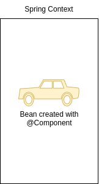

```java
@Configuration
@ComponentScan(basePackages = "com.example.beans")
public class ProjectConfig {}
```

#### Spring Stereotype Annotations.

* Spring provides special annotations called Stereotype annotations which will help to create the Spring beans automatically
in the application context. 
* The stereotype annotations in spring are `@Component`, `@Service`, `@Repository` and `@Controller`.
  * `@Component` is used as general on top of any Java class. It is the base for other annotations.
  * `@Service` can be used on top of the classes inside the service layer especially where we write business logic and make
  external API calls.
  * `@Repository` can be used on top of the classes which handles the code related to Database access related operations like
  Insert, Update, Delete etc.
  * `@Controller` can be used on top of the classes inside the Controller layer of MVC applications.

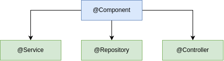

#### @Bean vs @Component.

`@Bean`:
* One or more instances of the class can be added to the Spring Context.
* We can create an object instances of any type of class including present inside libraries like String etc.
* Usually we need to write more code like separate methods to create beans instances.
* Developer will have full control in creating and configuring the bean.
* Spring framework creates the bean based on the instructions and values provided by Developers.

`@Component`:
* Only one instance of the class can be added to the Spring context.
* We can create an object instance for application class only which are created by Dev team.
* Bean instances can be created with very less code like using `@Component` on top of the class.
* Developer will not have any control in creating and configuring the bean.
* Spring framework takes charge of creating the bean and post that Developer will have access to it.

#### @PostConstruct Annotation.

* We have seen that when we are using stereotype annotations, we don't have control while creating a bean. But what if 
we want to execute some instructions post Spring created the bean. For this we can use `@PostConstruct` annotation.
* We can define a method in the component class and annotate that method with `@PostConstruct`, which instructs Spring
to execute that method after it finishes creating the bean.
* Spring borrows the `@PostConstruct` annotation from Java EE.

```java
@Component
public class Vehicle {
    private String name;
    
    public String getName() {
        return name;
    }
    
    public void setName(String name) {
        this.name = name;
    }
    
    @PostConstruct
    public void initialize() {
        this.name = "Honda";
    }
}

public static void main(String[] args) {
    var context = new AnnotationConfigApplicationContext(ProjectConfig.class);
    Vehicle veh1 = context.getBean(Vehicle.class);
}
```

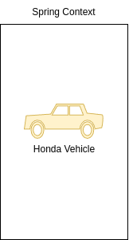

```java
@Configuration
@ComponentScan(basePackages = "com.example.beans")
public class ProjectConfig {}
```

#### @PreDestroy Annotation.

* `@PreDestroy` annotation can be used on top of the methods and Spring will make sure to call this method just before 
clearing and destroying the context.
* This can be used in the scenarios where we want ro close any IO resources, Database Connections etc.
* Spring borrows the `@PreDestroy` annotation from Java EE.

```java
@Component
public class Vehicle {
    private String name;
    
    public String getName() {
        return name;
    }
    
    public void setName(String name) {
        this.name = name;
    }
    
    @PreDestroy
    public void initialize() {
        System.out.println("Destroying Vehicle Bean");
    }
}

public static void main(String[] args) {
    var context = new AnnotationConfigApplicationContext(ProjectConfig.class);
    Vehicle veh1 = context.getBean(Vehicle.class);
    
    context.close(); // Destroying Vehicle Bean
}

@Configuration
@ComponentScan(basePackages = "com.example.beans")
public class ProjectConfig {}
```

#### Adding new beans programmatically.

* Sometimes we want to create new instances of an object and add them into the Spring context based on programming condition.
From Spring 5, a new approach is provided to create the beans programmatically by invoking the `registerBean()` method
present inside the context object. 
* `context.registerBean("volkswagen", Vehicle.class, volkswagenSupplier)`:
  * `context`: The ApplicationContext instance object.
  * `"volkswagen"`: The name we want to give to the bean that we add to the Spring context.
  * `Vehicle.class`: Type of the Bean we are creating.
  * `volkswagenSupplier`: The Supplier returning the object instance that we want to add to the Spring Context.

```java
void example() {
    if ((randomNumber % 2) == 0) {
        context.registerBean("volkswagen", Vehicle.class, volkswagenSupplier);
    } else {
        context.registerBean("audi", Vehicle.class, audiSupplier);
    }
}
```

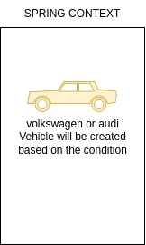

#### Adding new beans using XML configs.

* In the initial versions of Spring, the bean and other configurations used to be done using XML. But over the time, 
Spring team brings annotation based configurations to make developers life easy. Today we can see XML configurations only
in the older applications built based on initial versions of Spring.
* It is good to understand on how to create a bean inside Spring context using XML style configurations. So that, it will
be useful if ever there is a scenario where you need to work in a project based on initial versions of Spring.

```xml
<bean id="vehicle" class="com.example.beans.Vehicle">
    <property name="name" value="Honda" />
</bean>
```

```java
public static void main(String[] args) {
    var context = new ClassPathXmlAppliccationContext("beans.xml");
    Vehicle vehicle = context.getBeans(Vehicle.class);
    System.out.println("Vehicle name from Spring Context is: " + vehicle.getName());
}
```


### Behind the scenes of a web app.

* What user can see:
  * UI/UX.
  * Business logic.
  * Responsive.
* Supporting components:
  * Sessions & caching.
  * Transactions.
  * Security.
  * Batch processing.
  * Data transfer.
  * Logging.
  * DB persistence.

#### Why should we use frameworks?

**Chef Majka.**
Uses best readily available best ingredients like Cheese, Pizza Dough etc. to prepare pizza:
* Preparation time is less.
* Can easily scale restaurant pizza orders.
* Gets consistent taste for pizzas.
* Focus more on the pizza preparation.
* Fewer efforts and more results/revenue.

**Chef JD.**
Prepare all the ingredients like Cheese, Pizza Dough etc. by himself to prepare Pizza:
* Preparation time is more.
* Scaling his restaurant pizza order is not an option.
* May not get a consistent taste for his pizzas.
* Focus more on the raw material & ingredients.
* More effort and fewer results/revenue.

**Dev Majka.**
Uses best readily available best frameworks like Spring, Angular etc. to build a web app.
* Leverage Security, Logging etc. from frameworks.
* Can easily scale his application.
* App will work in a predictable manner.
* Focus more on the business logic.
* Fewer efforts and more results/revenue.

**Dev JD.**
Build his own code by himself to build a web app.
* Need to build code for Security, Logging etc.
* Scaling is not an option till tested everything.
* App may not work in a predictable manner.
* Focus more on the supporting components.
* More effort and fewer results/revenue.

#### Spring Projects.

* Spring Boot.
* Spring Data.
* Spring Cloud.
* Spring Security.
* Spring Session.
* Spring Integration.
* Spring AMQP.
* Spring code & Spring MVC.

### Introduction to beans wiring inside Spring.

* Inside Java web applications, usually the objects delegate certain responsibilities to other objects. So in these
scenarios, objects will have dependency on others.
* In very similar lines when we create various beans using Spring, is our responsibility to understand the dependencies
that beans have and wire them. This concept is called **Wiring / Autowiring**.
  * VehicleController object -> VehicleService object -> VehicleDAO object.

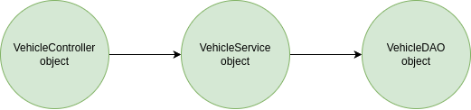

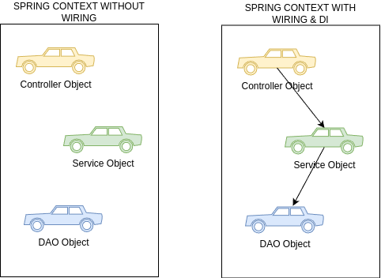

#### No wiring scenario inside spring.

Consider a scenario where we have two java classes Person and Vehicle. The Person class has a dependency to the Vehicle.
Based on the code, we are only creating the beans inside the Spring Context and no wiring will be done. Due to this both
this beans present inside the Spring Context without knowing about each other.

```java
public class Vehicle {
    private String name;
    // ...
}

public class Person {
    private String name;
    private Vehicle vehicle;
    // ...
}

@Bean
public Vehicle vehicle() {
    Vehicle vehicle = new Vehicle();
    vehicle.setName("Toyota");
    return vehicle;
}

@Bean
public Person person() {
    Person person = new Person();
    person.setName("Lucy");
    return person;
}
```

Vehicle doesn't belong to any Person.  The Person and Vehicle beans are present in context but no relation established.

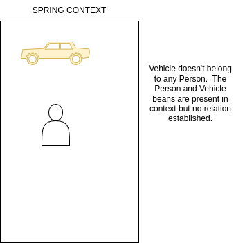

#### Wiring beans using method call.

* Here in the below code, we are trying to wire or establish a relationship between Person and Vehicle, by invoking the
`vehicle()` bean method from `person()` bean method. Now inside Spring Context, person owns the vehicle.
* Spring will make sure to only 1 vehicle bean is created and also vehicle bean will be created first always as person
bean has dependency on it.

```java
@Bean
public Vehicle vehicle() {
    Vehicle vehicle = new Vehicle();
    vehicle.setName("Toyota");
    return vehicle;
}

@Bean
public Person person() {
    Person person = new Person();
    person.setName("Majka");
    person.setVehicle(vehicle());
    return person;
}
```

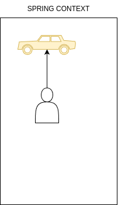

```java
var context = new AnnotationConfigApplicationContext(ProjectConfig.class);
Person person = context.getBean(Person.class);
Vehicle vehicle = context.getBean(Vehicle.class);
```

#### Wiring beans using method parameters.

* Here in the code, we are trying to wire or establish a relationship between Person and Vehicle, by passing the vehicle
as a method parameter to the `person()` bean method. Now inside Spring Context, person owns the vehicle.
* Spring injects the vehicle bean to the person bean using Dependency Injection.
* Spring will make sure to have only 1 vehicle bean created and also vehicle bean will be created first always as person
bean has dependency to it.

```java
@Bean
public Vehicle vehicle() {
    Vehicle vehicle = new Vehicle();
    vehicle.setName("Toyota");
    return vehicle;
}

@Bean
public Person person(Vehicle vehicle) {
    Person person = new Person();
    person.setName("Lucy");
    person.setVehicle(vehicle);
    return person;
}
```


#### Inject Beans using @Autowired on class fields.

* The `@Autowired` annotation marks on a field, setter method, constructor is used to autowire the beans that is 
`injecting beans` (Objects) at runtime by Spring Dependency Injection mechanism.
* With the below code, Spring injects/autowire the vehicle bean to the person bean through a class field and dependency
injection.
* The below style is not recommended for production usage as we can't mark the fields as final.

```java
@Component
public class Person {
    private String name = "Lucy";
    
    @Autowire
    private Vehicle vehicle;
}
```


`@Autowired(required = false)` will help to avoid the NoSuchBeanDefinitionException if the bean is not available during
Autowiring process.

#### Inject Beans using @Autowired on setter method.

* The `@Autowired` annotation marks on a field, setter method, constructor is used to autowire the beans that is
`injecting beans` (Objects) at runtime by Spring Dependency Injection mechanism.
* With the below code, Spring injects/autowire the vehicle bean to the person bean through a setter method and dependency
injection.
* The below style is not recommended for production usage as we can't mark the fields as final and not readable friendly.

```java
@Component
public class Person {
    private String name = "Lucy";
    private Vehicle vehicle;
    
    @Autowired
    public void setVehicle(Vehicle vehicle) {
        this.vehicle = vehicle;
    }
}
```


#### Inject Beans using `@Autowired` with constructor.

* The `@Autowired` annotation marks on a field, setter method, constructor is used to autowire the beans that is
`injecting beans` (Objects) at runtime by Spring Dependency Injection mechanism.
* With the below code, Spring injects/autowire the vehicle bean to the person bean through a constructor and dependency
injection.
* From Spring version 4.3, when we only have one constructor in the class, writing the `@Autowired` annotation is optional.

```java
@Component
public class Person {
    private String name = "Lucy";
    private final Vehicle vehicle;
    
    @Autowired
    public Person(Vehicle vehicle) {
        System.out.println("Person bean created by Spring");
        this.vehicle = vehicle;
    }
}
```


#### How Autowiring works with multiple Beans of the same type.

* By default, Spring tries autowiring with class type. But this approach will fail if the same class type has multiple 
beans.
* If the Spring context has multiple beans of same class type like below, then Spring will try to autowire based on the
parameter name/field name that we use while configuring autowiring annotation.
* In the below scenario, we used 'vehicle1' as constructor parameter. Spring will try to autowire with the bean which has
same name like shown in image below.

```java
@Component
public class Person {
    private String name = "Lucy";
    private final Vehicle vehicle;
    
    @Autowired
    public Person(Vehicle vehicle) {
        System.out.println("Person bean created by Spring");
        this.vehicle = vehicle;
    }
}
```

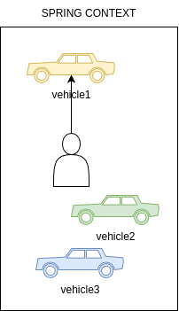

* If the parameter name/field name that we use while configuring autowiring annotation is not matching with any of the bean
names, then Spring will look for the bean which has `@Primary` configured.
* In the below scenario, we used `vehicle` as constructor parameter. Spring will try to autowire with the bean which has
same name and sice it can't find a bean with the same name, it will look for the bean with `@Primary` configured like in
the image.

```java
@Component
public class Person {
    private String name = "Lucy";
    private final Vehicle vehicle;
    
    @Autowired
    public Person(Vehicle vehicle) {
        System.out.println("Person bean created by Spring");
        this.vehicle = vehicle;
    }
}
```

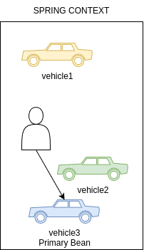

* If the parameter name/field name that we use while configuring autowiring annotation is not matching with any of the
bean names and even Primary bean is not configured, then Spring will look if `@Qualifier` annotation is used with the bean
name matching with Spring context bean names.
* In the below scenario, we used `vehicle2` with `@Qualifier` annotation. Spring will try to autowire with the bean which 
has same name like shown in the image below.

```java
@Component
public class Person {
    private String name = "Lucy";
    private final Vehicle vehicle;
    
    @Autowired
    public Person(@Qualifier("vehicle2") Vehicle vehicle) {
        System.out.println("Person bean created by Spring");
        this.vehicle = vehicle;
    }
}
```

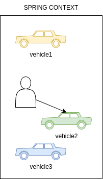

### Understanding & Avoiding Circular dependencies.

* A Circular dependency will happen if 2 beans are waiting for each other to create inside the Spring Context in order to
do autowiring.
* Consider the below scenario, where Person has a dependency on Vehicle and Vehicle has a dependency on Person. In such
scenarios, Spring will throw `UnsatisfiedDependencyException` due to circular reference.
* As a developer, it is our responsibility to make sure we are defining the configurations/dependencies that will not
result in circular dependencies.

```java
@Component
public class Person {
    private String name = "Lucy";
    private Vehicle vehicle;
    
    @Autowired
    public void setVehicle(Vehicle vehicle) {
        this.vehicle = vehicle;
    }
}

public class Vehicle {
    private String name;
    @Autowired
    private Person person;
}
```

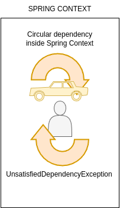

## Bean Scopes inside Spring.

1. Singleton.
2. Prototype.
3. Request.
4. Session.
5. Application.

### Singleton Bean Scope.

* Singleton is the default scope of a bean in Spring. In this scope, for a single bean we always get a same instance when
you refer or autowire inside your application.
* Unlike Singleton design pattern where we have only 1 instance in entire app, inside Singleton scope Spring will make
sure to have only 1 instance per unique bean. For example, if you have multiple beans of same type, then Spring Singleton
scope will maintain 1 instance per each bean declared of same type.

Creates a single bean inside Spring Context.
```java
@Component
@Scope(BeanDefinition.SCOPE_SINGLETON)
public class VehicleServices {}
```

The two variables refers to the same bean inside Spring context.
```java
public static void main(String[] args) {
    VehicleServices vehicleServices1 = context.getBean(VehicleServices.class);
    VehicleServices vehicleServices2 = context.getBean("vehicleServices", VehicleService.class);
}
```

#### Race Condition.

* A race condition occurs when two treads access a shared variable at the same time. The first thread reads the variable,
and the second thread reads the same value from the variable. Then the first thread and second thread perform their 
operations on the value, and they race to see which thread can write the value last to the shared variable. The value of 
the thread writes its value last is preserved, because the thread is writing over the value that the previous thread wrote.

```java
void example() {
    // Shared Value inside an object
    Map<String, String> reservedTables = new HashMap<>();
    
    // thread-1
    if (!reservedTables.containsKey("table1")) {
        reservedTables.put("table1", "USER1");
    }
    // thread-2
    if (!reservedTables.containsKey("table1")) {
        reservedTables.pur("table1", "USER2");
    }
}
```

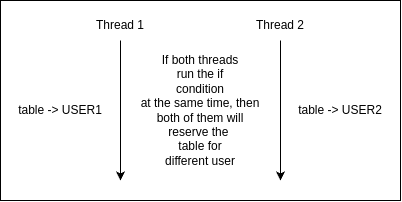

### Use cases for singleton beans.

* Since the same instance of singleton bean will be used by multiple thread inside your application, it is very important
that these beans are immutable.
* This scope is more suitable for beans which handles service layer, repository layer business logic.

1. Building mutable singleton beans, will result in the race condition inside multi thread environment.
2. There are ways to avoid race conditions due to mutable singleton beans with the help of synchronization.
3. But it is not recommended, since it brings a lot of complexity and performance issues inside your app. 

### Eager & lazy instantiation.

* By default, Spring will create all the singleton beans eagerly during the startup off the application itself. This is
called **Eager** instantiation. 
* We can change the default behavior to initialize the singleton beans lazily only when the application is trying to refer
to the beans. This approach is called **Lazy** instantiation.

```java
@Component(value = "personBean")
@Lazy
public class Person {
    // Person will be created only when app try to access it   
}
```

```java
void example() {
    var context = new AnnotationConfigApplicationContext(ProjectConfig.class);
    System.out.println("Before creating the Person object.");
    Person person = context.getBean(Person.class);
    System.out.println("After retrieving the Person object.");
}
```

#### Eager vs Lazy.

**Eager instantiation:**
1. This is the default behavior inside the Spring framework.
2. The singleton bean will be created during the startup of the application.
3. The server will not start if bean is not able to create due to any dependent exceptions.
4. Spring context will occupy a lot of memory if we try to use eager for all beans inside application.
5. Eager can be followed for all the beans which are required very commonly inside application

**lazy instantiation:**
1. This is not a default behavior and need to configure explicitly using `@Lazy`.
2. The singleton bean will be created when the app is trying to refer the bean for the first time.
3. Application will throw an exception runtime if bean creation is failed due to any dependent exceptions.
4. The performance will be impacted if we try to use lazy for all beans inside application.
5. Lazy can be followed for the beans that are used in a very remote scenario inside application.

### Prototype Bean Scope.

* With prototype scope, every time we request a reference of a bean, Spring will create a new object instance and provide it.
* Prototype scope is rarely used inside the applications, and we can use this scope only in the scenarios where your bean
will frequently change the state of the data which will result race conditions inside multi thread environment. Using
prototype scope will not create any race conditions.

```java
@Component
@Scope(BeanDefinition.SCOPE_PROTOTYPE)
public class VehicleService {}
```

2 Vehicle services instances are created.
```java
public static void main(String[] args) {
    VehicleService vehicleServices1 = context.getBean(VehicleServices.class);
    VehicleService vehicleServices2 = context.getBean("vehicleServices", VehicleServices.class);
}
```

### Singleton vs Prototype.

**Singleton Scope:**
* This is the default scope inside Spring Framework.
* The same object instance will be returned every time we refer a bean inside the code.
* We can configure to create the beans during the startup or when the first time referred.
* Immutable objects can be idle for Singleton scope.
* Most commonly used scope.

**Prototype Scope:**
* Need top explicitly configure using `@Scope(BeanDefinition.SCOPE_PROTOTYPE)`.
* New object instance will be returned every time we refer a bean inside the code.
* Spring always creates the new object when we try to refer the bean. No eager instantiation is possible.
* Mutable objects can be idle for prototype scope.
* Very rarely used scope.

### Aspect-Oriented Programming (AOP).

* An aspect is simply a piece of code the Spring framework executes when you call specific methods inside your app.
* Spring AOP enables Aspect-Oriented Programming in spring applications. In AOP, aspects enable the modularization of
concerns such as transaction management, logging or security that cut across multiple types and objects (often termed 
crosscutting concerns).

1. AOP provides the way to dynamically add cross-cutting concerns before, after or around the actual logic using simple
pluggable configurations.
2. AOP helps in separating and maintaining many non-business logic related code like logging, auditing, security,
transaction management. 
3. AOP is a programming paradigm that aims to increase modularity by allowing the separation of cross-cutting concerns.
It does this by adding additional behavior to existing code without modifying the code itself.

There is so much non-business logic code along with the main business logic.
```java
public String moveVehicle(boolean started) {
    Instant start = Instant.now();
    logger.info("method execution start");
    String status = null;
    if (started) {
        status = tyres.rotate();
    } else {
        logger.log(Level.SEVERE, "Vehicle not started to perform the operation");
    }
    logger.info("method execution end");
    Instant finish = Instance.now();
    long timeElapsed = Duration.between(start, finish).toMillis();
    logger.info("Time took to execute the method: " + timeElapsed);
    return status;
}
```

With AOP, all the non-business logic is moved to different location which will make method clean & clear.
```java
public String moveVehicle(boolean started) {
    return tyres.rotate();
}
```

**AOP Jargons.**
* When we define an Aspect or doing configurations, we need to follow WWW (3 Ws).
  * WHAT - Aspect.
  * WHEN - Advice.
  * WHICH - Pointcut.

1. WHAT code or logic we want the Spring to execute when you call a specific method. This is called as Aspect.
2. WHEN the Spring need to execute the given Aspect. For example is it before or after the method call. This is called
as Advice.
3. WHICH method inside App that framework needs to intercept and execute the given Aspect. This is called as a Pointcut.

* Join Point which defines the event that triggers the execution of an aspect. Inside Spring, this event is always a
method call.
* Target object is the bean that declares the method/pointcut which is intercepted by an aspect.

**Typical Scenario of AOP implementation.**

Developer want `some logic` (Aspect) to be executed `before` (Advice) each `execution` (Joinpoint) of method `playMusic()`
(Pointcut) present inside the bean `VehicleServices` (Target Object).

#### Weaving inside AOP.

* When we are implementing AOP inside our App using Spring framework, it will intercept each method call and apply the 
logic defined in the Aspect.
* But how does this work? Spring does this with the help of proxy object. So we try to invoke a method inside a bean,
Spring instead directly giving reference of the bean instead it will give a proxy object that will manage each call to
a method and apply the aspect logic. This process is called Weaving.

Without AOP, method is directly called and no interception by Spring.
With AOP, method executions will be intercepted by proxy object and aspect will be executed. Post that actual metod
invocation will happen.

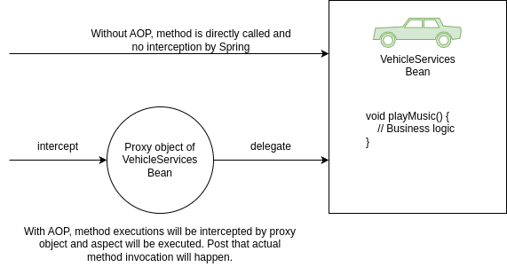

#### Advice types inside AOP.

**Type of Advices in Spring AOP:**
* `@Before`.
* `@AfterReturning`.
* `@AfterThrowing`.
* `@After`.
* `@Around`.

1. Before advice runs before a matched method execution.
2. After returning advice runs when a matched method execution completes normally.
3. After throwing advice runs when a matched method execution exits by throwing an exception.
4. After (finally) advice runs no matter how matched method execution exits.
5. Around advice runs "around" a matched method execution. It has the opportunity to do work both before and after the
method runs and to determine when, how, and even if the method actually gets to run at all.

#### Configuring Advices inside AOP.

* We can use AspectJ pointcut expression to provide details to Spring about what kind of methods it needs to intercept
by mentioning details around modifier, return type, name pattern, package name pattern, params pattern, exceptions pattern etc.

**Execution expression approach.**
* `modifiers-pattern`: Used to define method modifiers like public, private.
* `ret-type-pattern`: Used to define the desired return type of the method.
* `name-pattern(param-pattern`: Used to define any name pattern, package pattern, params pattern of the method.
* `throws-pattern?`: Used to define the specific execution pattern that can be thrown by the method.


* Like shown below, we can mention the pointcut expression as an input after advice annotations that we use.
```java
@Configuration
@ComponsntScan(basePackages = {"com.example.implementation", "com.example.services", "com.example.aspects"})
@EnableAspectJAutoProxy
public class ProjectConfig {}
```

```java
@Aspect
@Component
public class LoggerAspect {
    @Around("execution(* com.example.services.*.*(..))")
    public void log(ProceedingJoinPoint joinPoint) throws Throwable {
        // Aspect Logic
    }
}
```

* Alternatively, we can use Annotation style of configuring Advices inside AOP.

**Annotation approach.**
* Step 1: Create an annotation type.
```java
@Retention(RetentionPolicy.RUNTIME)
@Target(ElementType.METHOD)
public @interface LogAspect {}
```
* Step 2: Mention the same annotation on top of the method which we want to intercept using AOP. 
```java
@LogAspect
public String playMusic(boolean started, Song song) {
    // Business Logic
}
```
* Step 3: Use the annotation details to configure on top of the aspect method to advice.
```java
@Around("@annotation(com.example.interfaces.LogAspect)")
public void logWithAnnotation(ProceedingJoinPoint joinPoint) throws Throwable {
    // Aspect Logic
}
```

## Overview of the Web app.

1. The Web clients sends a request using protocols like HTTP to Web Application protocols like HTTP to Web Application 
asking some data like list of images, videos, text etc.
2. The web server where web app is deployed receives the client requests and process the data it receives. Post that it
will respond to client's request in the format of HTML, JSON etc.
3. In Java web app, Servlet Container (Web Server) takes care of translating the HTTP messages for Java code to understand.
One of the mostly used servlet container is Apache Tomcat.
4. Servlet Container converts the HTTP messages into ServletRequest and handover to Servlet method as a parameter. 
Similarly, ServletResponse returns as an output to Servlet Container from Servlet.

Usually Web Applications can be:
1. Only Frontend (Static Web Apps).
2. Only Backend (APIs).
3. Frontend + Backend (Ecommerce Apps).

### Role of Servlets inside Web apps.

**With Spring.**
1. With Spring, it defines a servlet called Dispatcher Servlet which maintains all the URL mapping inside a web application.
2. The servlet container calls this Dispatcher Servlet from any client request, allowing the servlet to manage the request
and the response. This way Spring internally does all the magic for Developers without the need of defining the servlets
inside a Web apps.

**Before Spring.**
1. Before Spring, developer has to create a new servlet instance, configure it in the servlet container, and assign it to
a specific URL path.
2. When the client sends a request, Tomcat calls a method of the servlet associated with the path the client requested.
The servlet gets the values on the request and builds the response that Tomcat sends back to the client.

### Evolution of web apps inside Java ecosystem.

**In 2000.**
No Web Design patterns and frameworks support present in the 2000s. So all the web application code is written in such
a way all the layers like Presentation, Business, Data Layer are tightly coupled.

**In 2010.**
With the help & invention of design patterns like MVN can frameworks like Sping, Struts, Hibernate, developers started
building web applications separating the layers of Presentation, Business, Data Layers. But all the code deployed into
a single jubmo server as monolithic application.

**In 2020.**
With the invention of UI frameworks like Angular, React and new trends like Microservices, Containers, developers started
building web application by Separating UI and backend layers. The code also deployed into multiple servers using containers
and cloud.

### Developing web applications using Spring.

**Approach 1:**
* Web Apps which holds UI elements like HTML, CSS, JS and backend logic.
* Here the App is responsible to fully prepare the view along with data in response to a client request.
* Spring Core, `Spring MVC`, Spring Boot, SpringData, Spring Rest, Spring Security will be used.

**Approach 2:**
* Web Apps which holds only backend logic. These Apps send data like JSON to separate UI Apps built based on Angular,
React etc.
* Here the App is responsible to only process the request and respond with only data ignoring view.
* Spring Core, Spring Boot, Spring Data, Spring Rest, Spring Security will be used.

Spring MVC is the key differentiator between these two approaches.

### Spring Boot.
1. SpringBoot was introduced in April 2014 to reduce some of the burdens while developing a Java web application.
2. Before Spring Boot, Developer need to configure a servlet container, establish link between Tomcat and Dispatcher servlet,
deploy into a server, define a lot of dependencies.
3. But with Spring Boot, we can create Web Apps skeleton. It helps to eliminate all the configurations we need to do.
4. Spring Boot is now one of the most appreciated projects in the Spring ecosystem. It helps us to create Spring apps more
efficiently and focus on the business code.
5. Spring Boot is a mandatory skills now due to the latest trends like Full Stack Development, Microservices, Serverless,
Containers, Docker etc.

**Before Spring Boot:**
* Configure a Maven/Gradle project with all the dependencies needed.
* Understand how servlets work & configure the DispatcherServlet inside web.xml.
* Package the web application into a WAR file. Deploy it into a server.
* Deal with complicated class loading strategies, application monitoring and management.

**After Spring Boot:**
* SpringBoot automatically configures the bare minimum components of a Spring application.
* Spring Boot applications embed a web server so that we do not require an external application server.
* SpringBoot provides several useful production-ready features out of the box to monitor and manage the application.

### The magic of Spring Boot.

**Spring Boot important features.**

**Spring Boot Starters.**
Spring Boot groups related dependencies used for a specific purposes as starter projects. We don't need to figure out all 
the must-have dependencies you need to add to your project for one particular purpose not which versions you should use
for compatibility. Example: `spring-boot-starter-web`.

**Autoconfiguration.**
Based on the dependencies present in the classpath, Spring Boot guess and autoconfigure the spring beans, property
configurations etc. However, autoconfiguration backs away from the default configuration if it detects user-configured
beans with custom configurations.
To achieve autoconfiguration Spring Boot follows the convention-over-configuration principle.

**Actuator & DevTools.**
Spring Boot provides a pre-defined list of actuator endpoints. Using this production ready endpoints, we can monitor app
health, metrics etc.
DevTools includes features such as automatic detection of application code change, LiveReload server to automatically
refresh any HTML changes to the browser all without server restart.

#### Getting started with Spring Boot.

* We can identify the SpringBoot main class by looking for an annotation `@SpringBootApplication`.
* A single `@SpringBootApplication` annotation can be used to enable these three features:
  * `@EnableAutoConfiguration`: enable Spring Boot's autoconfiguration mechanism.
  * `@ComponentScan`: enable component scan on the package where the application is located.
  * `@SpringBootConfiguration`: enable registration of extra beans in the context or the import of additional configuration
  classes. An alternative to Spring's standard `@Configuration` annotation.
* The `@RequestMapping` annotation provides "routing" information. It tells Spring that any HTTP request with the given
path should be mapped to the corresponding method. It is a Spring MVC annotation and not specific to Spring Boot.
* `server.port` and `server.servlet.context-path` properties can be mentioned inside tha `application.properties` to change
the default port number and context path of a web application.
* Mentioning `server.port=0` will start the web application at a random port number every time.
* Mentioning `debug=true` will print the Autoconfiguration report on the console. We can mention the exclusion list as
well for Spring Boot autoconfiguration by using the below config:
  * `@SpringBootApplication(exclude = { DataSourceAutoConfiguration.class })`.

**Tip.**
We can configure multiple paths against a single method using Spring MVC annotations.
```java
@Controller
public class HomeController {
    @RequestMapping(value = {"", "/", "home"})
    public String displayHomePage(Model model) {
        // Business Logic
    }
}
```

### Spring Boot DevTools.

* The SpringBoot DevTools provides features like `Automatic restart` & `LiveReload` that make the application development
experience a little more pleasant for developers.
* It can be added into any of the SpringBoot project by adding the below maven dependency.
```xml
<dependency>
  <groupId>org.springframework.boot</groupId>  
  <artifactId>spring-boot-devtools</artifactId>
</dependency>
```
* DevTools maintains 2 class loaders, one with classes that doesn't change and other one with classes that change. When
restart needed it only reload the second class loader which makes restarts faster as well.
* DevTools includes an embedded LiveReload server that can be used to trigger a browser refresh when a resource is changed.
LiveReload related browser extensions are freely available for Chrome, Firefox.
* DevTools triggers a restart when ever a build is triggered through IDE or by maven commands. DevTools disables the caching
options by default during development. Repackaged archives do not contain DevTools by default.

### Introduction to MVC Pattern.

* Controller: Controls the flow & decides which business logic needs to be executed. It acts as a Brain inside MVC pattern.
* View: Represents UI and usually takes data from the controller and display it with the help of HTML pages.
* Model: Represents the data of the application like name, age, students list etc. It stores & manages the data.

Model View Controller Design Pattern: Separation of Concerns to achieve loose coupling.

#### Spring MVC architecture & internal flow.

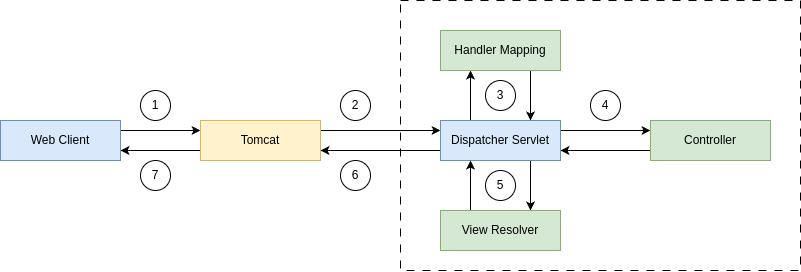

1. Web Client makes HTTP request.
2. Servlet Container like Tomcat accepts the HTTP requests and handovers the Servlet Request to Dispatcher Servlet inside
Spring Web App.
3. The Dispatcher Servlet will check the Handler Mapping to identify the controller and method names to invoke based on
the HTTP method, path etc.
4. The Dispatcher Servlet will invoke the corresponding controller & method. After execution, the controller will provide
a view name and data that needs to be rendered in the view.
5. The Dispatcher Servlet with the help of a component called View Resolver finds the view and render it with the data
provided by the controller.
6. The Servlet Container or Tomcat accepts the Servlet Response form the Dispatcher servlet and convert to HTTP response
before returning to the client.
7. The browser or client intercepts the HTTP response and display the view, data etc.

**Tip.**
We can register view controllers that create a direct mapping between the URL and the view name using the 
ViewControllerRegistry. This way, there's no need for any Controller between the two.
```java
@Configuration
public class WebConfig implements WebMvcConfigurer {
    @Override
    public void addViewControllers(ViewControllerRegistry registry) {
        registry.addViewController("/courses").setViewName("courses");
        registry.addViewController("/about").setViewName("about");
    }
}
```

### Reduce boilerplate code with Lombok.

* Java expects a lot of boilerplate code inside POJO classes like getters and setters.
* `Lombok`, which is a Java library provides you with several annotations aimed at avoiding writing Java code known to be
representative and/or boilerplate.
* It can be added into any of the Java project by adding the below maven dependency.
```xml
<dependency>
  <groupId>org.projectlombok</groupId>
  <artifactId>lombok</artifactId>
</dependency>
```
* Project Lombok works by plugging into your build process. Then, it will auto-generate the Java bytecode into your 
`.class` files required to implement the desired behavior, based on the annotations you used.
* Most commonly used Lombok annotations: `@Getter`, `@Setter`, `@NoArgsConstructor`, `@RequiredArgsConstructor`,
`@AllArgsConstructor`, `@ToString`, `@EqualsAndHashCode`, `@Data`.
* `@Data` is a shortcut annotation that combines the features of below annotation together: `@ToString`, `@EqualsAndHashCode`.
`@Getter`, `@Setter`, `@RequiredArgsConstructor`.

A sample outline of a Java POJO class with `@Data` annotation used. The source code will not have boilerplate code but the
compiled byte code will have.

### @RequestParam Annotation.

* In Spring `@RequestParam` annotation is used to map either query parameters or form data.
* For example, if we want to get parameters value from an HTTP GET requested URL then we can use `@RequestParam` annotation.

```
http://localhost:8080/holidays?festival=true&federal=true
```

```java
@GetMapping("/holidays")
public String displayHolidays(@RequestParam(required = true) boolean festival, 
                              @RequestParam(required = true) boolean federal) {
    // Business Logic
    return "holidays.html";
}
```
* The `@RequestParam` annotation supports attributes like `name`, `required`, `value`, `defaultvalue`. We can use them 
in our application based on the requirements.
* The `name` attribute indicates the name of the request parameter to bind to.
* The `required` attribute is used to make a field either optional or mandatory. If it is mandatory, an exception will 
throw in case of missing fields.
* The `value` attribute is similar to name elements and can be used as an alias.
* `defaultValue` for the parameter is to handle missing values or null values. If the parameter does not contain any value
then this default value will be considered.

### @PathVariable Annotation.

* The `@PathVariable` annotation is used to extract the value from the URI. It is most suitable for the RESTful web service
where the URL contains some value. Spring MVC allows us to use multiple `@PathVariable` annotations in the same method.
* For example, if we want to get the value from a requested URI path, then we can use `@PathVariable` annotation.

```
http://localhost:8080/holidays/all
http://localhost:8080/holidays/federal
http://localhost:8080/holidays/festival
```

* The `@PathVariable` annotation supports attributes like `name`, `required`, `value` similar to `@RequestParam`. We can
use them in our application based on the requirements.

```java
@GetMapping("/holidays/{display}")
public String displayHolidays(@PathVariable String display) {
    // Business logic
    return "holidays.html";
}
```

### Validation with Spring Boot.

* Bean Validation is the standard for implementing validations in the Java ecosystem. It's well integrated with Spring and
Spring Boot.
* Below is the maven dependency that we can add to implement Bean validations in any Spring/Spring Boot project.

```xml
<dependency>
  <groupId>org.springframework.boot</groupId>
  <artifactId>spring-boot-starter-validation</artifactId>
</dependency>
```

* Bean Validation works by defining constraints to the fields of a class by annotating them with certain annotations.
* We can put the `@Valid` annotation on method parameters and fields to tell Spring that we want a method parameter or
field to be validated.
* Below are the important packages where validations related annotations can be identified:
  * `jakarta.validation.constraints.*`.
  * `org.hibernate.validator.constraints.*`.

### Important validation Annotations.

**jakarta.validation.constraints**: `@Digits`, `@Eamil`, `@Max`, `@Min`, `@NotBlank`, `@NotEmpty`, `@NotNull`, `@Pattern`,
`@Size`.

**org.hibernate,validator.constraints**: `@CreditCardNumber`, `@Length`, `@Currency`, `@Range`, `@URL`, `@UniqueElements`,
`@EAN`, `@ISBN`.

#### Validation with Spring Boot.

* Simple validations declaration inside a java POJO.

```java
@Data
public class Contact {
    @NotBlank(message = "Email must not be blank")
    @Email(message = "Please provide a valid email address")
    private String email;
    
    @NotBlank(messsage = "Subject must not be blank")
    @Size(min = 5, message = "Subject must be at least 5 characters long")
    private String subject;
    
    @NotBlank(message = "Message must not be blank")
    @Size(min = 10, message = "Message must be at least 10 characters long")
    private String message;
}
```

* We can put the `@Valid` annotation on method parameters to tell Spring framework that we want a particular POJO object
needs to be validated based on the validation annotation configurations. For any issues, framework populates the error
details inside the Errors object. The errors can be used to display on the UI to the user.

### Spring Web Scopes.

**Web Scopes inside Spring**:
* Request (`@RequestScope`).
* Session (`@SessionScope`).
* Application (`@ApplicationScope`).

1. Request Scope: Spring creates an instance of the bean class for every HTTP request. The instance exists only for that
specific HTTP request.
2. Session Scope: Spring creates an instance and keeps the instance in the server's memory for the full HTTP session.
Spring links the instance in the context with the client's session.
3. Application Scope: The instance is unique in the app's context, and it's available while the app is running.

#### Key points of Spring Web Scopes.

**Request Scope**:
* Spring creates a lot of instances of this bean in the app's memory for each HTTP request. So these type of beans are
short-lived.
* Since Spring creates a lot of instances, please make sure to avoid time-consuming logic while creating the instance.
* Can be considered for the scenarios where the data needs to be reset after new request or page refresh etc.

**Session Scope**:
* Session scoped beans have longer life & they are less frequently garbage collected.
* Avoid keeping too much information inside data as it impacts performance. Never store sensitive information as well.
* Can be considered for the scenarios where the same data needs to be accessed across multiple pages like user information.

**Application Scope**:
* In the application scope, Spring creates a bean instance per web application runtime.
* It is similar to singleton scope, with one major difference. Singleton scoped bean is singleton per ApplicationContext
where application scoped bean is singleton per ServletContext.
* Can be considered for the scenarios where we want to store Drop Down values, Reference table values which won't change
for all the users.

## Spring Security.

* Spring Security is a powerful and highly customizable authentication and access-control framework. It is de-facto standard
for securing Spring-based applications.

```xml
<dependency>
  <groupId>org.springframework.boot</groupId>
  <artifactId>spring-boot-starter-security</artifactId>
</dependency>
```

* Spring Security is a framework that provides authentication, authorization, and protection against common attacks.
* Spring Security helps developers with easier configurations to secure a web application by using standard username/
password authentication mechanism.
* Spring Security provides out of the box features to handle common security attacks like CSRF, CORS. It also has good
integration with security standards like JWT, OAUTH2 etc.

### Authentication vs Authorization.

**Authentication.**
* In authentication, the identity of users are checked for providing the access to the system.
* Authentication done before authorization.
* It needs usually user's login details.
* If authentication fails usually we will get 401 error response.
* For example as a bank customer/employee in order to perform actions in the app, we need to prove our identity.

**Authorization.**
* In authorization, person's or user's authorities are checked for accessing the resources.
* Authorization always happens after authentication.
* It needs user's privilege or roles.
* If authorization fails usually we will get 403 error response.
* Once logged into the application, my roles, authorities will decide what kind of actions i can do.

**Tip.**
* As soon as we add spring security dependency to a web application, by default it protects all the pages/API inside it.
It will redirect to the inbuilt login page to enter credentials.
* The default credentials are `user`, and password is randomly generated & printed on the console.
* We can configure custom credentials using the below properties to get started for POCs etc. But for PROD applications, 
Spring Security supports user credentials configuration inside DB, LDAP, OAuth2 Server etc.
  * `spring.security.username=panda`.
  * `spring.security.password=54321`.

#### Default Security Configurations in Spring Security.

By default, Spring Security framework protects all the paths present inside the web application. This behavior is due to
the code present inside the method `defaultSecurityFilterChain(HttpSecurity http)` of class `SpringBootWebSecurityConfiguration`.

```java
@Bean
@Order(SecurityProperties.BASIC_AUTH_ODER)
SecurityFilterChain defaultSecurityFilterChain(HttpSecurity http) throws Exception {
    http.authorizeHttpRequests((requests) -> requests.anyRequest().authenticated());
    http.formLogin(withDefaults());
    http.httpBasic(withDefaults());
    return http.build();
}
```

#### Configure permitAll() with Spring Security.

* Using `permitAll()` configurations we can allow full/public access to a specific resource/path or all the resources/paths
inside a web application.
* Below is the sample configuration that we can do in order to allow any requests in a Web application without security.

```java
@Configuration
public class ProjectSecurityConfig {
    @Bean
    SecurityFilterChain defaultSecurityFilterChain(HttpSecurity http) throws Exception {
        http.authorizeHttpRequests((requests) -> requests.anyRequest().permitAll())
                .formLogin(Customizer.withDefaults())
                .httpBasic(Customizer.withDefaults());
        return http.build();
    }
}
```

* Form Login provides support for username and password being provided through a html form.
* HTTP Basic Auth uses an HTTP header in order to provide the username and password when making a request to a server.

#### Configure denyAll() with Spring Security.

* Using `denyAll()` configurations we can deny access to a specific resource/paths or all the resources/paths inside a web
application regardless of user authentication.
* Below is the sample configuration that we can do in order to deny any requests that is coming into a web application.

```java
@Configuration
public class ProjectSecurityConfig {
    @Bean
    SecurityFilterChain defaultSecurityFilterChain(HttpSecurity http) throws Exception {
        http.authorizeHttpRequests((requests) -> requests.anyRequest().denyAll())
                .formLogin(Customizer.withDefaults())
                .httpBasic(Customizer.withDefaults());
        return http.build();
    }
}
```

* Usually `denyAll()` is used to retire a specific API temporarily without removing the code.
* `permitAll()` is used to allow public access to public APIs, paths, CSS, images, JS files etc.

#### Configure custom security configs & csrf disable.

* We can apply custom security configurations based on our requirements for each API/URL.
* `permitAll()` can be used to allow access without security and `authenticated()` can be used to protect a web page/API.
* By default any requests with HTTP methods that can update data like POST, PUT will be stopped with 403 error due to
CSRF protection.
* Sample configuration we can do to implement custom security configs and disable CSRF.

```java
@Configuration
public class ProjectSecurityConfig {
    @Bean
    SecurityFilterChain defaultSecurityFilterChain(HttpSecurity http) throws Exception {
        http.csrf((csrf) -> csrf.disable())
                .requestMatchers("", "/", "/home").permitAll()
                .requestMatchers("/holidays/**").permitAll()
                .formLogin(Customizer.withDefaults())
                .httpBasic(Customizer.withDefaults());
        return http.build();
    }
}
```

#### In-memory authentication in spring security.

* Spring Security provide support for username/password based authentication based on the users stored in application memory.
* Like mentioned below, we can configure any number of users & their roles, passwords using in-memory authentication.

In-memory authentication is idle for POC Web Apps or any Internal Web App that get used only in non-prod environments.
Never use in-memory authentication for PROD web applications.

```java
@Configuration
public class ProjectSecurityConfig {
    @Bean
    SecurityFilterChain defaultSecurityFilterChain(HttpSecurity http) throws Exception { }
  
    @Bean
    public InMemoryUserDetailsManager userDetailsService() {
        UserDetails user = User.withDefaultPasswordEncoder()
                .username("user").password("12345").roles("USER").build();
        
        UserDetails admin = User.withDefaultPasswordEncoder()
                .username("admin").password("54321").roles("USER", "ADMIN").build();
        return new InMemoryUserDetailsManager(user, admin);
    }
}
```

#### Configuring Login & Logout page.

* Spring Security allows us to configure a custom login page to our web application instead of using the Spring Security
default provided login page.
* Similarly, we can configure logout page as well.

Configured login page will be shown, if the user tries to access the secured page/resource without a valid authenticated
session. The same behavior applies for default login page provided by Spring Security.
```java
@Configuration
public class ProjectSecurityConfig {
    @Bean
    SecurityFilterChain defaultSecurityFilterChain(HttpSecurity http) throws Exception {
        http.csrf((csrf) -> csrf.disable())
              .requestMatchers("", "/", "/home").permitAll()
              .requestMatchers("/holidays/**").permitAll()
              .formLogin(Customizer.withDefaults())
                .formLogin(loginConfigurer -> loginConfigurer.loginPage("/login")
                        .defaultSuccessUrl("/dashboard").failureUrl("/login?error=true").permitAll())
                .logout(logoutConfigurer -> logoutConfigurer.logoutSuccessUrl("/login?logout=true")
                        .invalidateHttpSession(true).permitAll())
              .httpBasic(Customizer.withDefaults());
        return http.build();
    }
}
```

### @ControllerAdvice & @ExceptionHandler.

* `@ControllerAdvice` is a specialization of the `@Component` annotation which allows to handle exceptions across the whole
application in one global handling component. You can think of it as an interceptor of exceptions thrown by methods annotated
with `@RequestMapping` or one of the shortcuts like `@GetMapping`.
* We can define the exception handle logic inside a method and annotate it with `@ExceptionHandler.`

Combination of `@ControllerAdvice` & `@ExceptionHandler` can handle the exceptions across all the controllers inside a web
application globally.

**Tip.**
* If a method annotated with `@ExceptionHandler` present inside a `@Controller` class, then the exception handling logic
will be applicable for any exceptions occurred in that specific controller class.
* If the same `@ExceptionHandler` annotated method present inside a `@ControllerAdvice` class, then the exception handling 
logic will be applicable for any exceptions occurred across all the controller classes.
* Using `@ExceptionHandler` annotation, we can handle any number of exceptions.

### Cross-site request forgery (CSRF).

* A typical Cross-Site Request Forgery (CSRF or XSRF) attack aims to perform an operation in a web application on behalf 
of a user without their explicit consent. In general, it doesn't directly steal the user's identity, but it exploits the
user to carry out an action without their will.
* Step 1: The Netflix user login to Netflix and the backend server of Netflix will provide a cookie which will store in the
browser against the domain name Netflix.com.
  * User Submits his credentials & try to login to Netflix.com.
  * Netflix server create a cookie & saved in user browser against Netflix.com domain name.
  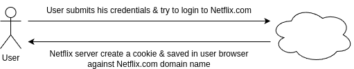
* Step 2: The same Netflix user opens an evil website in another tab of the browser.
  * User accessed an evil site hosted on evil.com.
  * evil.com returns a web page which has embedded malicious link to change email of Netflix account. But link appears with
  text like "90% off".
  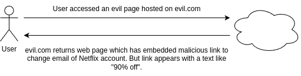
* Step 3: User tempted and clicked on the malicious link which makes a request to Netflix.com. And since the login cookie
already present in the same browser and the request to change email is being made to the same domain Netflix.com, the
backend server of Netflix.com can't differentiate from where the request come. So here the evil.com forged the request
as if it is coming from a Netflix.com UI page.
  * User clicks on a link on evil.com which has content something like.
  * The email of the Netflix account changed.
  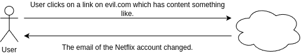

### Solution to CSRF.

* To defeat a CSRF attack, application need a way to determine if the HTTP request is legitimately generated via the
application's user interface. The best way to achieve this is through a `CSRF token`. A CSRF token is a secure random 
token that is used to prevent CSRF attacks. The token needs to be unique per users session and should be of large random
value to make it difficult to guess.
* Step 1: The Netflix user login to Netflix.com and the backend server of Netflix will provide a cookie which will store in
the browser against the domain name Netflix.com along with a randomly generated unique CSRF token for this particular
user session. CSRF token is inserted within hidden parameters of HTML forms top avoid exposure to session cookies.
  * User submit his credentials & try to login to Netflix.com.
  * Netflix server create a cookie & randomly generated CSRF token.
  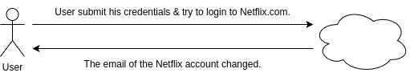
* Step 2: The same Netflix user opens an evil.com website in another tab of the browser.
  * User accessed an evil site hosted on evil.com.
  * evil.com returns web page which has embedded malicious link to change email of Netflix account. But link appears
  with a text like "90% off".
  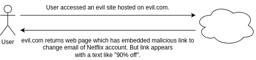
* Step 3: User tempted and clicked on the malicious link which makes a request to Netflix.com. And since the login cookie
already present in the same browser and the request to change email is being made to the same domain Netflix.com. This time
the Netflix.com backend server expects CSRF token along with the cookie. The CSRF token must be same as initial value
generated during login operation.
  * User clicks on a link on evil.com which has content like.
  * The Netflix thrown an error 403.
  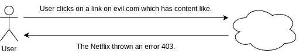

The CSRF token will be used by the application sever to verify the legitimacy of the end-user request if it is coming from
the same App UI or not. The application server rejects the request if the CSRF token fails to match the test.

**Tip.**
* By default, Spring Security enables CSRF fix for all the HTTP methods which results in data change like POST, DELETE etc.
But not GET.
* Using Spring Security configurations we can disable the CSRF protection for complete application or for only few paths
based on our requirements:
  * `http.csrf((csrf) -> csrf.disable())`.
  * `http.csrf((csrf) -> csrf.ignoringRequestMatchers("/saveMsg"))`.

# Spring Boot & H2 Database.

* H2 is an embedded, open-source, and in-memory database. SpringBoot supports integration with H2 DB which can be used
for POC applications and excellent for examples/testing.
* Maven dependency that we can add to any SpringBoot projects in order to use internal memory H2 Database.
  * groupId: `com.h2database`.
  * artifactId: `h2`.
  * scope: `runtime`.
* Since it is an internal memory DB, we need to create the schema and data that is needed during startup of the App. 
Any updates to the data will be lost after restarting the server.
* To create schema & data for the H2 DB, we can add `schema.sql` & `data.sql` inside the maven project's resources folder.
Any table creation scripts and DB records scripts can be present inside `schema.sql` and `data.sql` respectively.
* By default, the H2 web console is available at `/h2-console`. You can customize the console's path by using the
`spring.h2.console.path` property. 

## Key points of JDBC.

**Intro to JDBC.**

* JDBC or Java Database Connectivity is a specification from Core Java that provides a standard abstraction for java app
to communicate with various databases.
* JDBC API along with the database driver is capable of accessing database.
* JDBC is a base framework or standard for frameworks like Hibernate, Spring Data JPA, MyBatis etc.

**Steps in JDBC to access DB.**

We need to follow the below steps to access DB using JDBC:
1. Load Driver Class.
2. Obtain a DB connection.
3. Obtain a statement using connection object.
4. Execute the query.
5. Process the result set.
6. Close the connection.

**Problem with JDBC.**

* Developers are forced to follow all the steps mentioned to perform any kind of operation with DB which results in a lot
of duplicate code at any place.
* Developers needs to handle the checked exceptions that will throw from the API.
* JDBC is database dependent.

## Intro to Spring JDBC.

* Spring JDBC simplifies the use of JDBC and helps to avoid common errors. It executes core JDBC workflow, leaving 
application code to provide SQL and extract results. It does the magic by providing JDBC template which developers can
use inside their applications.
* Below is the maven dependency that we need to add to any Spring/SpringBoot projects in order to use Spring JDBC provided
templates.
  * groupId: `org.springframework.boot`.
  * artifactId: `spring-boot-starter-jdbc`.
* Spring provides many templates for JDBC related activities. Among them the famous ones are JdbcTemplate, 
NamedParameterJdbcTemplate.
* JdbcTemplate is the classic and most popular Spring JDBC approach. This provides "lowest-level" approach and all others
templates uses JdbcTemplate under the covers.
* NamedParameterJdbcTemplate wraps a JdbcTemplate to provide named parameters instead of the traditional JDBC `?`
placeholders. This approach provides better documentation and ease of use when you have multiple parameters for an
SQL statement.

**Spring JDBC - who does what?**

| Action | Spring JDBC | Developer |
|---|---|---|
| Define connection parameters. | NO | YES |
| Open the connection. | YES | NO |
| Specify the SQL statement. | NO | YES |
| Declare parameters and provide parameter values | NO | YES |
| Prepare and run the statement. | YES | NO |
| Set up the loop to iterate through the results (if any). | YES | NO |
| Do the work for each iteration. | NO | YES |
| Process any exception. | YES | NO |
| Handle transactions. | YES | NO |
| Close the connection, the statement, and the resultset. | YES | NO |

**Using JdbcTemplate.**

* JdbcTemplate is the central class in the JDBC core package. It handles the creation and release of resources, which 
helps you avoid common errors, such as forgetting to close the connection. It performs the basic tasks of the core JDBC
workflow (such as statement creation and execution), leaving application code to provide SQL and extract results.
* You can use JdbcTemplate within a DAO implementation through direct instantiation with a DataSource reference, or you
can configure it in a Spring IoC container and give it to DAOs as a bean reference.
* We need to follow the below steps in oder to configure JdbcTemplate inside a Spring Web application (Without Spring Boot).

1. First we need to create a DataSource Bean inside Web application with the DB credentials like mentioned below.
    ```java
    @Bean
    public DataSource myDataSource() {
        DriverManagerDataSource dataSource = new DriverManagerDataSource();
        dataSource.setDriverClassName("com.mysql.jdbc.Driver");
        dataSource.setUrl("jdbc:mysql://localhost:3306/school");
        dataSource.setUsername("user");
        dataSource.setPassword("password");
        return dataSource;
    }
    ```
2. Inside any Repository/DAO classes where we want to execute queries, we need to create a bean/object of
JdbcTemplate by injecting data source bean.
    ```java
    @Repository
    public class PersonDAOImpl implements PersonDAO {
      JdbcTemplate jdbcTemplate;
        
      @Autowired
      public PersonDAOImpl(DataSource dataSource) {
          jdbcTemplate = new JdbcTemplate(dataSource);
      }
    }
    ```
    Instances of the JdbcTemplate class are thread-safe, once configured. This is important because if needed we can configure
    a single instance of a JdbcTemplate and then safely inject this shared reference into multiple DAOs (or repositories)

**Sample usage of JdbcTemplate for SELECT queries.**

```java
// The following query gets the number of rows in a table.
int rowCount = this.jdbcTemplate.queryForObject("select count(*) from person", Integer.class);
```

```java
// The following query uses a bind variable.
int countOfPersonsNamedJoe = this.jdbcTemplate
                .queryForObject("select count(*) from person where first_name = ?", Integer.class, "Joe");
```

```java
// The following query looks for a string column based on a condition.
String lastName = this.jdbcTemplate.queryForObject("select last_name from person where id = ?", String.class, 1212L);
```

**Sample usage of JdbcTemplate for Updating (INSERT, UPDATE, and DELETE).**

```java
// The following example inserts a new entry
this.jdbcTemplate.update("insert into person (first_name, last_name) values (?, ?)", "John", "Doe");
```

```java
// The following examples updates an existing entry.
this.jdbcTemplate.update("update person set last_name = ? where id = ?", "Majka", 6543L);
```

```java
// The following example deletes an entry.
this.jdbcTemplate.update("delete from person where id = ?", 5234L);
```

**Other JdbcTemplate Operations.**

```java
// You can use the execute(..) method to run any arbitrary SQL. Consequently, the method is often used for DDL statements.
this.jdbcTemplate.execute("create table person (id integer, name varchar(100))");
```

```java
// The following example invokes a stored procedures.
this.jdbcTemplate.update("call SUPPORT.REFRESH_PERSON_SUMMARY(?)", 5234L);
```

### Using RowMapper.

* RowMapper interface allows to map a row of the relations with the instance of user-defined class. It iterates the ResultSet
internally and adds it into the collection. So we don't need to write a lot of code to fetch the records as ResultSetExtractor.
* RowMapper saves a lot of code because it internally adds the data of ResultSet into the collection.
* It defines only one method mapRow that accepts ResultSet instance and int as parameters. Below is the sample usage.

```java
private final RowMapper<Person> personRowMapper = (resultSet, rowNum) -> {
    Person person = new Person();
    person.setFirstName(resultSet.getString("first_name"));
    person.setLastName(resultSet.getString("last_name"));
    return person;
};
```

```java
public List<Person> findAllPersons() {
    return this.jdbcTemplate.query("select first_name, last_name from person", personRowMapper);
}
```

**Tip.**

Do you know if the column names in a table and field names inside a POJO/Bean are matching, then we can use 
BeanPropertyRowMapper which is provided by Spring Framework.
Spring BeanPropertyRowMapper, class saves you a lot of time since we don't have to define the mappings like we do inside
a RowMapper implementation.

```java
public List<Holiday> findAllHolidays() {
    String sql = "SELECT * FROM HOLIDAYS";
    var rowMapper = BeanPropertyRowMapper.newInstance(Holiday.class);
    return jdbcTemplate.query(sql, rowMapper);
}
```

### Using NamedParameterJdbcTemplate.

* The NamedParameterJdbcTemplate class adds support for programming JDBC statements by using named parameters, as opposed
to programming JDBC statements using only classic placeholder `?` arguments. The NamedParameterJdbcTemplate class
wraps a JdbcTemplate and delegates to the wrapped JdbcTemplate to do much of its work.
* The following example shows how to use NamedParameterJdbcTemplate.

```java
private NamedParameterJdbcTemplate namedParameterJdbcTemplate;

public void setDataSource(DataSource dataSource) {
    this.namedParameterJdbcTemplate = new NamedParameterJdbcTemplate(dataSource);
}

public int countOfPersonsByFirstName(String firstName) {
    String sql = "select count(*) from Person where first_name = :first_name";
    SqlParameterSource namedParameters = new MapSqlParameterSource("first_name", firstName);
    return this.namedParameterJdbcTemplate.queryForObject(sql, namedParameters, Integer.class);
}
```

**Tip.**

With Spring Boot working with JdbcTemplate is very easy. Spring Boot autoconfigures DataSource, JdbcTemplate and
NamedParameterJdbcTemplate classes base on the DB connection details mentioned in the property file, and you can 
`@Autowire` them directly into your own repository classes.
You can customize some properties of the template by using the `spring.jdbc.template.*` properties, like mentioned.
`spring.jdbc.template.max-rows=500`.

```java
@Repository
public class HolidaysRepository {
    private final JdbcTemplate jdbcTemplate;

    @Autowired
    public HolidaysRepository(JdbcTemplate jdbcTemplate) {
        this.jdbcTemplate = jdbcTemplate;
    }
}
```

## Intro to Spring Data.

Spring Data is a Spring ecosystem project that simplifies the persistence layer's development by providing implementations
according to the persistence technology we use. This way, we only need to write a few lines of code to define the
repositories of our Spring app.
* Spring Application Logic:
  * Spring Data:
    * JDBC - JPA/Hibernate.
    * MongoDB.
    * Cassandra.
    * Any other persistence technology.

Spring Data is a high-level layer that simplifies the persistence implementation by unifying the various technologies
under the same abstractions.

* Whichever persistence technology your app uses, Spring Data provides a common set of interfaces (contracts) you extend
to define the app's persistence capabilities.
* The central interface in the Spring Data repository abstraction is Repository.

**Repository.**
Repository is the most abstract contract. If you extend this contract, your app recognizes the interface you write as a
particular Spring Boot Data repository. Still, you won't inherit any predefined operations (such as adding a new record,
retrieving all the records, or getting a record by its primary key). The Repository interface doesn't declare any method
(it is a marker interface).

**Crud Repository.**
CrudRepository is the simplest Spring Data contract that also provides some persistence capabilities. If you extend this
contract to define your app's persistence capabilities, you get the simplest operation for creating, retrieving, updating,
and deleting records. ListCrudRepository is an extension to CrudRepository returning List instead of Iterable where ever
applicable.

**PagingAndSortingRepository.**
PagingAndSortingRepository provide methods to retrieve entities using the propagation and sorting abstraction. 
ListPagingAndSortingRepository an extension to PagingAndSortingRepository returning List instead of Iterable where ever
applicable.

To implement your app's repositories using Spring Data, you extend specific interface. The main interfaces that represent
Spring Data contracts are Repository, CrudRepository, ListCrudRepository, PagingAndSortingRepository and
ListPagingAndSortingRepository. You extend one of these contracts to implement your app's persistence capabilities.

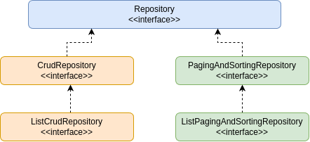

**Tip.**

* We should not confuse between `@Repository` annotation and Spring Data Repository interface.
* Spring Data provides multiple interfaces that extend one another by following the principle called interface segregation.
This helps apps to extend what they want instead of always following fat implementation.
* Some Spring Data modules might provide specific contracts to the technology they represent. For example, using 
Spring Data JPA, you also can extend the `JpaRepository` interface directly and similarly using Spring Data Mongo module
to your app provides a particular contract named `MongoRepository`.

* If you use Hibernate (which implements the JPA specifications), you could extend the JpaRepository contract, which
adds operations that are specific for using the JPA approach.
* If your app uses MongoDB, you could define your Spring Data repositories extending the MongoRepository interface, which
is particular for Spring Data Mongo.

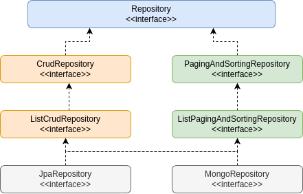

### Intro to Spring Data JPA.

* Spring Data JPA is available to Spring Boot applications with the JPA starter. This starter dependency not only brings
in Spring Data JPA, but also transitively includes Hibernate as the JPA implementation.
* Below is the maven dependency that we need to add to any SpringBoot projects in order to use Spring Data JPA.
  * groupId: `org.springframework.boot`.
  * artifactId: `spring-boot-starter-data-jpa`.
* JPA is just a specification that defines an object-relational mapping (ORM) standard for storing, accessing, and managing
Java objects in a relational database. Hibernate is the most popular and widely used implementation of JPA specifications.
By default, Spring Data JPA uses Hibernate as a JPA provider.
* We need to follow the below steps in order to query a DB using Spring Data JPA inside a SpringBoot application.

1. We need to indicate a java POJO class as an entity class by using annotations like `@Entity`, `@Table`, `@Column`.
    ```java
    @Entity
    @Table(name = "contact_msg")
    public class Contact extends BaseEntity {
        @Id
        @GeneratedValue(strategy = GenerationType.AUTO, generator="native")
        @GenericGenerator(name="native", strategy="native")
        @Column(name="contact_id")
        private int contactId;
    }
    ```
2. We need to create interfaces for a given table entity by extending framework provided Repository interfaces. This helps
us to run the basic CRUD operations on the table without writing method implementations.
    ```java
    @Repository
    public interface ContactRepository extends CrudRepository<Contact, Integer> {}
    ```
3. Enable JPA functionality and scanning by using the annotations `@EnableJpaRepositories` and `@EntityScan`.
    ```java
    @SpringBootApplication
    @EnableJpaRepositories("com.panda.school.repository")
    @EntityScan("com.panda.school.model")
    public class SchoolApplication {}
    ```
4. We can inject repository beans into any controller/service classes and execute the required DB operations.
    ```java
    @Service
    public class ContactService {
        @Autowired
        private ContactRepository contactRepository;
   
        public boolean saveMessageDetails(Contact contact) {
            boolean isSaved = false;
            Contact savedContact = contactRepository.save(contact);
            if (null != savedContact && savedContact.getContactId() > 0) {
                isSaved = true;
            }
            return isSaved;
        }
    }
    ```

#### Derived Query Methods in Spring Data JPA.

* With Spring Data JPA, we can use the method names to derive a query and fetch the results without writing code manually
like with traditional JDBC.
* As a developer we Just need to define the query methods in a repository interface that extends one of the Spring Data's
repositories such as CrudRepository. Spring Data JPA will create queries and implementation at runtime automatically by
parsing these method names.

```java
// find persons by last name
List<Person> findByLastName(String lastName);
```

```java
// find person by email
Person findByEmail(String email);
```

```java
// find person by email and last name
Person findByEmailAndLastname(String email, String lastname);
```

**Tip.**

Derived query method names has two main components separated by the first `By` keyword.
1. The `introducer` clause like `find`, `read`, `query`, `count`, or `get` which tells Spring Data JPA what you want to
do with the method. This clause can contain further expressions, such as `Distinct` to set a distinct flag on the query
to be created.
2. The `criteria` clause that starts after the first By keyword. The first By acts as a delimiter to indicate the start of
the actual query criteria. The criteria clause is where you define conditions on entity properties and concatenate them
with `And` and `Or` keywords.
Using `readBy`, `getBy`, and `queryBy` in place of `findBy` will behave the same. For example, `readByEmail(String email)` 
is the same as `findByEmail(String email)`.

Spring Data JPA is a powerful tool that provides an extra layer of abstraction on top of an existing JPA providers like
Hibernate. The derived query feature is one of the most loved features of Spring Data JPA.

### Auditing Support By Spring Data JPA.

* Spring Data provides sophisticated support to transparently keep track of who created or changed an entity and when the
change happened. To benefit from that functionality, you have to equip your entity classes with auditing metadata can be
defined either using annotations or by implementing an interfaces.
* Additionally, auditing has to be enabled either through Annotation configuration or XML configuration to register the
required infrastructure components.
* Below are the steps that needs to be followed.

1. We need to use the annotations to indicate the audit related columns inside DB tables. Spring Data JPA ships with an
entity listener that can be used to trigger the capturing of auditing information. We must register the AuditingEntityListener
to be used for all the required entities.
    ```java
    @Data
    @MappedSuperclass
    @EntityListener(AuditingEntityListener.class)
    public class BaseEntity {
        @CreatedBy
        @Column(updatable = false)
        private LocalDateTime createdAt;
   
        @CreatedBy
        @Column(updatable = false)
        private String createdBy;
   
        @LastModifiedDate
        @Column(insertable = false)
        private LocalDateTime updatedAt;
   
        @LastModifiedBy
        @Column(insertable = false)
        private String updatedBy;
    }
    ```
    `@CreatedDate`, `@CreatedBy`, `@LastModifiedDate`, `@LastModifiedBy` are the key annotations that support JPA auditing.
2. Date related info will be fetched from the server by JPA but for CreatedBy & UpdatedBy we need to let JPA know how to
   fetch that info by implementing `AuditorAware` interface like shown below.
    ```java
    @Component("auditAwareImpl")
    public class AuditAwareImpl implements AuditorAware<String> {
        @Override
        public Optional<String> getCurrentAuditor() {
            return Optional.ofNullable(SecurityContextHolder.getContext().getAythentication().getName());
        }
    }
    ```
3. Enable JPA auditing by annotating a configuration class with the `@EnableJpaAuditing` annotation.
    ```java
    @SpringBootApplication
    @EnableJpaRepositories("com.panda.school.repository")
    @EntityScan("com.panda.school.model")
    @EnableJpaAuditing(auditorAwareRef = "auditAwareImpl")
    public class SchoolApplication {}
    ```

**Tip.**

We can print the queries that are being formed and executed by Spring Data JPA by enabling the below properties.
`spring.jpa.show-sql=true`, `spring.jpa.properties.hibernate.format_sql=true`.
`show-sql` property will print the query on the console/logs whereas format_sql property will print the queries in a 
readable friendly style. Make sure to leverage them in non-prod environments only as they impact the performance of the
web application.

### Spring MVC Custom Validations.

We have seen before using Bean validations like Max, Min, Size etc. we can do validations on the input received. Now let's
try to define custom validations that are specific to our business requirements.

1. Suppose if we have a requirement to not allow some weak password inside our registration form, we first need to create
a custom annotation like below. Here we need to provide the class name where the actual validation logic is present.
    ```java
    @Documented
    @Constraint(validatedBy = PasswordStrategyValidator.class)
    @Target({ ElementType.METHOD, ElementType.FIELD })
    @Retention(RetentionPolicy.RUNTIME)
    public @inteface PasswordValidator {
        String message() default "Please choose a strong password";
        Class<?>[] groups() default {};
        Class<? extends Payload>[] payload() default {};
    }
    ```
2. We need to create a class that implements `ConstraintValidator` interface and overriding the isValid() method.
    ```java
    public class PasswordStrengthValidator implements ConstraintValidator<PasswordValidator, String> {
        List<String> weakPasswords;
   
        @Override
        public void initialize(PasswordValidator passwordValidator) {
            weakPasswords = Arrays.asList("123", "password", "qwerty");
        }    
   
        @Override
        public boolean isValid(String passwordField, ConstraintValidatorContext ctx) {
            return passwordField != null && (!weakPasswords.contains(passwordField));
        }    
    }
    ```
3. Finally, we can mention the annotation that we created on top of the field inside a POJO class.
    ```java
    @NotBlank(message = "Password must not be blank")
    @Size(min = 5, message = "Password must be at least 5 characters long")
    @PasswordValidator
    private String pwd;
    ```

### One-to-One Relationship inside the JPA.

* What is a one-to-one relationship? It's a relationship where a record in one entity (table) is associated with exactly 
one record in another entity (table).
* Below are few real-life examples of one-to-one relationships.
  * User to Email.
  * User to Address.
  * Spouse to Spouse.
  * Country to Capital.
* Spring Data JPA allow developers to build one-to-one relationship between the entities with simple configurations. 
For example if we want to build a one-to-one between Person and Address entities, then we can configure like below.
    ```java
    @Data
    @Entity
    public class Person {
        @OneToOne(fetch = FetchType.EAGER, cascade = CascadeType.ALL, targetEntity = Address.class)
        @JoinColumn(name = "address_id", referencedColumnName = "addressId", nullable = true)
        private Address address;
    }
    ```
* In Spring Data JPA, a one-to-one relationship between two entities is declared by using the `@OneToOne` annotation. Using
it we can configure `FetchType`, `cascade` effects, `targetEntity`.
* The `@JoinColumn` annotation is used to specify the foreign key column relationship details between the 2 entities.
"name" defined the name of the foreign key column, `referencedColumnName` indicates the field name inside the target
entity class, `nullable` defined whether foreign key column can be nullable or not.

### JPA Fetch.

Based on the fetch configurations that developer has done, JPA allows entities to load the objects with which they have
a relationship.

We can declare to fetch value in the `@OneToOne`, `@OneToMany`, `@ManyToOne` and `@ManyToMany` annotations. These annotations
have an attribute called fetch that serves to indicate the type of fetch we want to perform. It has two valid values:
FetchType.EAGER and FetchType.LAZY.

With LAZY configuration, we are telling JPA that we want to lazily load the relation entities, so when retrieving an entity,
its relations will not be loaded until unless we try to refer the related entity using getter method. On the contrary,
with EAGER it will load its relation entities as well.

By default, all ToMany relationships are LAZY, while ToOne relationships are EAGER.

### Cascade Types.

**Intro to Cascade.**

* JPA allows us to propagate entity state changes from Parents to Child entities. This concept is calling Cascading in JPA.
* The cascade configuration option accepts an array of CascadeTypes.

**Cascade Types.**

* The cascade types supported by JPA are as below:
  * `CascadeType.PERSIST`.
  * `CascadeType.MERGE`.
  * `CascadeType.REFRESH`.
  * `CascadeType.REMOVE`.
  * `CascadeType.DETACH`.
  * `CascadeType.ALL`.

**Best Practices.**

* Cascading makes sense only for Parent - Child associations (where the Parent entity state transition being cascaded
to its Child entities). Cascading from Child to Parent is not very useful and recommended.
* There is no default cascade type in JPA. By default, no operation is cascaded.

1. `CascadeType.PERSIST`: means that `save()` or `persist()` operations cascade to related entities.
2. `CascadeType.MERGE`: means that related entities are merged when the owning entity is merged.
3. `CascadeType.REFRESH`: means the child entity also gets reloaded from the database whenever the parent entity is refreshed.
4. `CascadeType.REMOVE`: means propagates remove operation from parent to child entity.
5. `CascadeType.DETACH`: means detach all child entities if a "manual detach" occurs for parent.
6. `CascadeType.ALL`: is shorthand for all of the above cascade operations.

### Spring Security AuthenticationProvider.

* As of now we are planning to log in operation using the inMemoryAuthentication. But the idle way is to perform login check
against a DB table or any other storage system which is more secure.
* Spring Security allow us to write our own custom logic to authenticate a user based on our requirements 
by implementing AuthenticationProvider interface. Below is the sample implementation.
```java
@Component
public class SchoolUsernamePwdAuthenticationProvider implements AuthenticationProvider {
    @Override
    public Authentication authenticate(Authentication authentication) throws AuthenticationException {
        String name = authentication.getName();
        String password = authentication.getCredentials().toString();
        if (authUser()) {
            return new UsernamePasswordAuthenticationToken(name, password, new ArrayList<>());
        } else {
            return null;
        }
    }
    
    @Override
    public boolean supports(Class<?> authentication) {
        return authentication.equals(UsernamePasswordAuthenticationToken.class);
    }
}
```

### How Passwords Validated without PasswordEncoder.

Storing the credentials in plain text inside a storage systems like Database has Integrity and Confidentiality issues.
So this is not recommended for PROD applications.

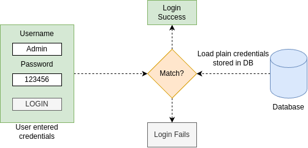

#### Different ways of password management.

**Encoding.**

* Encoding is defined as the process of converting data from one form to another and has nothing to do with cryptography.
* It involves no secret and completely reversible.
* Encoding can't be used for securing data. Below are the various publicly available algorithms used for encoding.
Ex. ASCII, BASE64, UNICODE.

**Encryption.**

* Encryption is defined as the process of transforming data in such a way that guarantees confidentiality.
* To achieve confidentiality, encryption requires the use of a secret which, in cryptographic terms, we call a "key".
* Encryption can be reversible by using decryption with the help of the "key". As long as the "key" is confidential,
encryption can be considered as secured.

**Hashing.**

* In hashing, data is converted to the hash value using come hash function.
* Data once hashed in non-reversible. One cannot determine the original data from a hash value generated.
* Given some arbitrary data along with the output of a hashing algorithm, one can verify whether this data matches the
original input data without needing to see the original data.

**Tip.**

Spring Security provides various PasswordEncoders to help developers with hashing of the secured data like password.
Different Implementations of PasswordEncoders provided by Spring Security:
* `NoOpPasswordEncoder` (No hashing stored in plain text).
* `StandardPasswordEncoder`.
* `Pbkdf2PasswordEncoder`.
* `BCryptPasswordEncoder` (Most Commonly used).
* `SCryptPasswordEncoder`.

Managing the passwords with Hashing is the recommended approach for PROD web application. With `PasswordEncoders` like
`BCryptPasswordEncoder`, Spring Security makes our life easy.

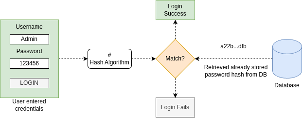

**Tip.**

We can disable the javax bean validators by the Spring Data JPA using the below property:
`spring.jpa.properties.javax.persistence.validation.mode=none`.

### One-to-Many & Many-to-One Relationship inside JPA.

* A one-to-one relationship refers to the relationship between two entities/tables A and B in which one element/row of A
may only be linked to many elements/rows of B, but a member of B is linked to only one element/row of A.
* The opposite of one-to-many is many-to-one.
* Few real-life examples off one-to-many and many-to-one relationships.
  * Class one to many Students, Students many to one Class.
  * Book one to many Pages, Pages many to one Book.
* Spring Data JPA allows developers to build one-to-many & many-to-one relationships between the entities with simple
configurations. Below are the sample configurations between Class and Person.
```java
@Entity
public class Person extends BaseEntity {
    @MantToOne(fetch = FetchType.LAZY, optional = true)
    @JoinColumn(name = "class_id", referencedColumnName = "classId", nullable = true)
    private SchoolClass schoolClass;
}
```
* The `@ManyToOne` annotation is used to define a many-to-one relationship between two entities. The child entity, that 
has yje join column, is called the owner of the relationship.
* The `@JoinColumn` annotation is used to specify the foreign key column details.
* A one-to-many relationship between two entities is defined by the `@OneToMany` annotation. It also declares the `mappedBy`
element to indicate the entity that owns the bidirectional relationship. Usually, the child entity is one that owns the
relationship and the parent entity contains the `@OneToMany` annotation.
```java
@Entity
@Table(name = "class")
public class SchoolClass extends BaseEntity {
    @OneToMany(mappedBy = "schoolClass", fetch = FatchType.LAZY, 
            cascade = CascadeType.PERSIST, targetEntity = Person.class)
    private Set<Person> persons;
}
```

### Many-to-Many inside JPA.

* A many-to-many relationship refers to the relationship between two entities/tables A and B in which one element/row of
A are associated with many elements/rows of B and vice versa.
* Below are few real-life examples of many-to-many relationship.
  * Courses many to many Students.
  * Orders many to many Products.
* Spring Data JPA allows developers to build many-to-many relationship between the entities with simple configurations.
Below are the simple configurations between Courses and Persons.
```java
@Entity
public class Person extends BaseEntity {
    @ManyToMany(fetch = FetchType.EAGER, cascade = CascadeType.PERSIST)
    @JoinTable(name = "person_courses",
            joinColumns = {@JoinColumn(name = "person_id", referencedColumnName = "personId")},
            inverseJoinColumn = {@JoinColumn(name = "course_id", referencedColumnName = "courseId")})
    private Set<Courses> courses = new HashSet<>();
}
```
* A many-to-many relationship between two entities is defined by using the `@ManyToMany` annotation.
* The `@JoinTable` annotation defines the join table between two entities.
* In a bidirectional relationship of `@ManyToMany`, only one entity can own the relationship. Here we choose Courses as the
owning entity. We usually mention `mappedBy` parameter on the owning entity.
```java
@Entity
public class Courses extends BaseEntity {
    @ManyToMany(mappedBy = "courses", fetch = FetchType.EAGER, cascade = CascadeType.PERSIST)
    private Set<Person> persons = new HashSet<>();
}
```
* Why do we really need a third table in Many-to-Many relationship? Let's assume we have below tables and records which has
many-to-many relationship between them.
* If we need to represent multiple courses that a same student enrolled, the best way is to maintain a middle third table
like shown below. Otherwise, we need to maintain a lot of duplicate rows inside Person table.

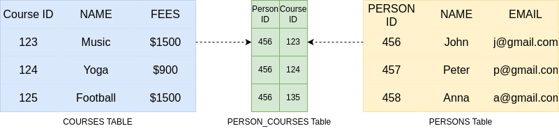

### Sorting with Spring Data JPA.

**Introduction.**

* Spring Data JPA supports Sorting to Query results with easier configurations.
* Spring Data JPA provides default implementations of Sorting with the help of PagingAndSortingRepository interface.
* There are two ways to achieve Sorting in Spring Data JPA:
  * Static Sorting.
  * Dynamic Sorting.

**Static Sorting.**

* Static sorting refers to the mechanism where the retrieved data is always sorted by specified columns and directions.
The columns and sort directions are defined at the development time and cannot be changed at runtime.
* Below is an example of Static Sorting, `List<Person> findByOrderByNameDesc();`.

**Dynamic Sorting.**

* By using dynamic sorting, you can choose the sorting column and direction at runtime to sort the query results.
* Dynamic sorting provides more flexibility in choosing sort columns and directions with the help of `Sort` parameter to
your query method. The Sort class is just a specification that provides sorting options for database queries.
```java
Sort sort = Sort.by("name").descreasing().and(Sort.by("age"));
```

### Pagination with Spring Data JPA.

* Spring Data JPA supports Pagination which helps easy to manage & display large amount of data in various pages inside
web applications.
* Just like the special Sort parameter, we have for the dynamic sorting, Spring Data JPA supports another special parameter
called `Pageable` for paginating the query results.
* We can combine both pagination and dynamic sorting with the help of Pageable.

**Dynamic Sorting.**

* Whenever we want to apply pagination to query results, all we need to do is just add Pageable parameter to the query method
definition and set the return by `Page<T>` like below.
```java
Pageable pageable = PageRequest.of(0, 5, Sort.by("name").descending());

Page<Person> findByName(String name, Pageable pageable);
```

### Custom Queries with JPA.

* Derived queries are good as long as they are not complex. As the number of query parameters goes beyond 3 to 4, you need
a more flexible strategy.
* For such complicated or custom scenarios, Spring Data JPA allow developers to write their own queries with the help of 
annotations: `@Query`, `@NamedQuery`, `@NamedNativeQuery`.

**@Query Annotation.**

* The `@Query` annotation defines queries directly on repository methods. This gives you full flexibility to run any query
without following the method naming convention.
* With the help of `@Query` annotation we can write queries in the form of JPQL or Native SQL query.
* When ever we are writing a native SQL query then we need to mention `nativeQuery = true` inside `@Query` annotation.

**Named Queries.**

* For bigger applications where they may have 1000s of queries scatted across the application, it would make sense for 
them to maintain all these queries in a single place logically by using annotations, properties and XML files.
* We can create names queries easily with the below annotations on top of an entity class.
`@NamedQuery` - Used to define a JPQL named query. `@NamedNativeQuery` - Used to define a native SQL named query.

### JPQL.

* The Java Persistence Query Language (JPQL) is a platform-independent object-oriented query language defined as part of
the Java Persistence API (JPA) specification.
* JPQL is used to make queries against entities stored in a relational database. It is heavily inspired by SQL, and its
queries resemble SQL queries in syntax, but operate against JPA entity objects rather than directly with database tables.
* The only drawback of using JPQL is that it supports a subset of the SQL commands. So, it may not be a great choice
for complex queries.

**JPQL Example.**

* Below is an example of JPQL. You can observe we are using the entity names and field present inside it instead of using
table and column names.
```java
@Query("SELECT c FROM Contact c WHERE c.contactId = ?1 ORDER BY c.createdAt DESC")
List<Contact> findByIdOrderByCreateDesc(long id);
```

**Sorting Examples.**

* Static Sorting using derived query from method name.
```java
List<Person> findByNameOrderByAgeDesc(String name);
```
* Static Sorting using `@Query` annotation with JPQL.
```java
@Query("SELECT p FROM person p WHERE p.age > ?1 ORDER BY p.name DESC")
List<Person> findByAgeGreaterThanJPQL(int age);
```
* Static Sorting using `@Query` annotation with native query.
```java
@Query(value = "SELECT * FROM person p WHERE p.name = :givenName ORDER BY p.age ASC", nativeQuery = true)
List<Person> findByGivenNameNativeSQL(@Param("givenName") String givenName);
```
* Static Sorting using NamedQuery & NamedNativeQuery annotations.
```java
@NamedQuery(name = "Person.findByAgeGreaterThanNamedJPQL", 
    query = "SELECT p FROM Person p WHERE p.age > :age ORDER BY p.name ASC")
@NamedNativeQuery(name = "Person.findAllNamedNativeSQL",
    query = "SELECT * FROM person p ORDER BY p.age DESC")
@Entity
public class Person extends BaseEntity {}
```
* Dynamic Sorting using Sort parameter. The Sort parameter can be passed with `@Query`, `@NamedQuery` annotations.
Sort fields can be added dynamically as well based on the request params from the UI/API.
```java
Sort sort = Sort.by("name").descending().and(Sort.by("age"));
List<Person> persons = personRepository.findByName("John", sort);
```
Spring Data JPA does not support dynamic sorting for native SQL queries, as it would require the updating of the actual SQL
query defined, which cannot be done correctly by the Spring Data JPA.

**Pagination Examples.**

* Below is an example where we are telling to JPA to fetch the first page by considering the total page size as 5.
```java
Pageable pageable = PageRequest.of(0, 5);
Page<Contact> msgPage = contactRepository.findByStatus("Open", pageable);
```
* Below is an example where we are applying both pagination & sorting dynamically based on the input received.
```java
public Page<Contact> findMsgsWithOpenStatus(int pageNum, String sortField, String sortDir) {
    int pageSize = 5;
    Pageable pageable = PageRequest.of(pageNum - 1, pageSize, 
            sortDir.equals("asc") ? Sort.by(sortField).ascending()
                    : Sort.by(sortField).descending());
    Page<Contact> msgPage = contactRepository.findByStatus("Open", pageable);
    return msgPage;
}
```
Dynamic sorting is not supported by named queries. So while using Pagination along with Named Queries, make sure that
Pageable interface does not contain a Sort object.

**@Query Examples.**

* @Query example with positional parameters.
```java
// Positional parameters
@Query("SELECT c FROM Contact c WHERE c.status = ?1 AND c.name = ?2 ORDER BY c.createdAt DESC")
List<Contact> findByGivenQueryOrderByCreatedDesc(String status, String name);
```
* @Query example with named parameters.
```java
// named parameters
@Query("SELECT c FROM Contact c WHERE c.status = :status AND c.name = :name ORDER BY c.createdAt DESC")
List<Contact> findByGivenQueryOrderByCreatedDesc(@Param("status") String status, @Param("name") String name);
```
* Using @Query, we can also run UPDATE, DELETE, INSERT as well.
```java
@Transactional
@Modifying
@Query("UPDATE Contact c SET c.status = ?1 WHERE c.contactId = ?2")
int updateStatusById(String status, int id);
```

Whenever we are using queries that change the state of the database, they should be treated differently. We need to 
explicitly tell Spring Data JPA that our custom query changes the data by annotating the repository method with an
additional `@Modifying` annotation. It will then execute the custom query as an upstream operation.

On whichever method/class we declare `@Transactional` the boundary of transaction starts and boundary ends when method
execution completes. Let's say you are updating entity1 and entity2. Now while saving entity2 an exception occur, then as
entity1 comes in sane transaction so entity1 will be rollback with entity2. Any exception will result in rollback of all
JPA transactions with DB.

**@NamedQuery & @NamedNativeQuery Examples.**

`@NamedQuery` example declared on top of the entity class.
```java
@Entity
@NamedQuery(name = "Contact.findOpenMsgs", query = "SELECT c FROM Contact c WHERE c.status = :status")
public class Contact extends BaseEntity {}
```

`@NamedNativeQuery` example declared on top of the entity class.
```java
@Entity
@NamedNativeQuery(name = "Contact.findOpenMsgsNative",
    query = "SELECT * FROM contact_msg c WHERE c.status = :status", resultClass = Contact.class)
public class Contact extends BaseEntity {}
```

For `@NamedQuery` as long as the method name inside Repository class matches with the name of the query we should be good.
Whereas for `@NamedNativeQuery` apart from query name & method name match, we should also mention `@Query(native = true)`
on top of the Repository method.

**Tip.**

We can create multiple named queries and named native queries using the annotations `@NamedQueries` and `@NamedNativeQueries`.
```java
@NamedQueries({
        @NamedQuery(name = "one", query = "?"),
        @NamedQuery(name = "two", query = "?")
})
// ...

@NamedNativeQueries({
        @NamedNativeQuery(name = "one", query = "?", resultClass = "?"),
        @NamedNativeQuery(name = "two", query = "?", resultClass = "?")
})
// ...
```

## Implementing REST Services.

* REST (Representational state transfer) services are one of the most often encountered ways to implement communication
between two web apps. REST offers access to functionality the server exposes through endpoints a client can call.
* Below are the different use cases where REST services are being used most frequently.
  * Mobile App - Communication using REST - Backend Server.
  * Backend Server 1 - Communication using REST - Backend Server 2.
  * Web App build using Angular, React JS etc. - Communication using REST - Backend Server.

### Implementing REST Services.

Below is the sample code implementing Rest Service using Spring MVC style but only with the addition of `@ResponseBody`
annotation. The `@ResponseBody` annotation tells the dispatcher servlet that the controller's action will not return a
view but the data send directly in the HTTP response.

```java
@Controller
public class ContactRestController {
    @Autowired
    ContactRespsitory contactRespsitory;
    
    @GetMapping("/getMessagesByStatus")
    @ResponseBody
    public List<String> getMessagesByStatus(@RequestParam(name = "status") String status) {
        return contactRespsitory.findByStatus(status);
    }
}
```


