# Readme

# Spring

## Goals of Spring

- Lightweight development with Java POJOs.
- Dependency injection, loose coupling.
- Declarative programming AOP.
- Minimize boilerplate Java code.

## Components

- Core Container:
    - Factory for creating beans.
    - Manage beans dependencies:
        - :one: Beans
        - :two: Core
        - :three: Spel
        - :four: Context
- AOP - Aspect Oriented Programming, add functionality to objects declaratively:
    - Logging
    - Security
    - Transactions
- Data Access:
    - :one: JDBC
    - :two: ORM
    - :three: Transactions
    - :four: OXM
    - :five: JMS
- Web Layer:
    - All web related classes.
    - Spring MVC Framework:
        - :one: Servlet
        - :two: WebSocket
        - :three: Web
        - :four: Portlet
- Instrumentation:
    - JMX (Java Management Extension) Java agents to remotely monitor app.
- Test Layer.

## Spring Projects

- Additional Spring modules build on top of core Framework:
    - Spring Cloud
    - Spring Data
    - Spring Batch
    - Spring LDAP
    - Spring Security
    - Spring Web Services
    - Spring Android
    - Spring Web Flow

## Inversion of Control (IoC)

- Outsourcing the construction and management of objects.
- Outsource to object factory.

## Spring Container

- Primary functions:
    - Create and manage objects (inversion of control).
    - Inject object's dependencies (Dependency Injection).
- Configure Spring Container:
    - XML Configuration
    - Java Annotations
    - Java Source Code
- Development process:
    - Configure Spring Beans.
    - Create Spring Container.
    - Retrieve Beans from Spring Container.

### Configure Spring beans

**applicationContext.xml**

```xml
<beans>
    <bean id="myAccountBean" class="com.mybank.Account"></bean>
</beans>
```

### Create a Spring Container

- Spring Container is `ApplicationContext`.
- Specialized implementations:
    - `ClassPathXmlApplicationContext`
    - `AnnotationConfigApplicationContext`
    - `GenericWebApplicationContext`

```java
ClassPathXmlApplicationContext context = new ClassPathXmlApplicationContext("applicationContext.xml");
```

### Retrieve Beans from Spring Container

```java
ClassPathXmlApplicationContext context = new ClassPathXmlApplicationContext("applicationContext.xml");

// retrieve bean from spring container
Account theAccount = context.getBean("myAccountBean", Account.class);
```

### What is a Spring Bean?

- A **Spring Bean** is simply a Java object.
- When Java objects created by the Spring Container, then Spring refers to them as **Spring Beans**.
- Spring Beans created from normal Java classes like Java objects.

### Why do we specify the interface in getBean()?

- Behaves the same as `getBean(String)`, but provides a measure of type safety by throwing a BeanNotOfRequiredTypeException
  if the bean is not of the required type.
- This means that ClassCastException can't be thrown on casting the result correctly, as can happen with getBean(String).

### Dependency Injection


- Dependency = helper.
- Injection Types:
    - Constructor injection
    - Setter Injection
- Development Process - Constructor Injection:
    - Define the dependency interface and class.
    - Create a constructor in your class for injections.
    - Configure the dependency injection in Spring config file.

### Define the dependency interface and class

**CheckoutService.java**

```java
public interface CheckoutService {
    public String getNotification();
}
```

**TradeCheckoutService.java**

```java
public class TradeCheckoutService implements CheckoutService {
    public String getNotification() {
        return "Money disposal";
    }
}
```

###  Create a constructor in your class for injections

**Broker.java**

```java
public class Broker implements BankDepartment {
    private CheckoutService checkoutService;

    public Broker(CheckoutService checkoutService) {
        this.checkoutService = checkoutService;
    }
}
```

### Configure the dependency injection in Spring config file

```xml
<beans >
    <!-- CheckoutService service = new CheckoutService(); // java -->
    <bean id="myService" class="com.mybank.CheckoutService"></bean>

    <!-- Broker broker = new Broker(service); // java -->
    <bean id="myBroker" class="com.mybank.Broker">
        <constructor-arg ref=myService" />
    </bean>
</beans>
```

### Setter Injection

- Create setter method(s) in your class for injections.
- Configure the dependency injection in Spring config file.

```java
public class Programmer implements RNDService {
    private SecurityService securityService;

    public Programmer() {}

    public void setSecurityService(SecurityService securityService) {
        this.securityService = securityService;
    }
}
```

**applicationContext.xml**

```xml
<beans >
    <bean id="myService" class="com.mybank.SecurityService"></bean>

    <bean id="myPanda" class="com.mybank.Programmer">
        <property name="securityService" ref="myService" />
    </bean>
</beans>

```

### Inject literal values

```xml
<beans>
    <bean id="myService" class="com.mybank.SecurityService"></bean>

    <bean id="myProgrammer" class="com.mybank.Programmer">
        <property name="securityService" ref="myService" />
        <property name="emailAddress" value="email@example.com" />
        <property name="team" value="interceptors" />
    </bean>
</beans>

```

### Inject values from properties file

```properties
foo.email=email@example.com
foo.team=interceptors
```

**applicationContext.xml**

```xml
<context:property-placeholder location="classpath:bank.properties" />

<bean id="myProgrammer" class="com.mybank.Programmer">
    <property name="securityService" ref="myService" />

    <property name="emailAddress" value="${foo.email}" />
    <property name="team" value="${foo.team}" />
</bean>
```

## Bean scopes

- Scope refers to the lifecycle of the bean.
- How long does the bean live?
- How many instances are created?
- How is the bean shared?

### Default scope - Singleton

```xml
<beans >
    <bean id="myTeam" class="com.springdemo.FootballTeam" scope="singleton">
    </bean>
</beans>
```

- Spring Container creates only one instance of the bean, by default.
- It is cached in memory.
- All requests for the bean:
    - return a **SHARED** reference of the **SAME** bean.

### Spring bean scopes

| Scope | Description |
|---|---|
| singleton | Create a single shared instance of the bean. Default scope |
| prototype | Creates a new bean instance for each container request |
| request | Scoped to an HTTP web request. Only used for web apps |
| session | Scoped to an HTTP web session. Only used for web apps |
| global-session | Scoped to a global HTTP web session. Only used for web apps |

## Bean lifecycle

```
Instantiate -> Populate Properties -> Call setBeanName of BeanNameAware -> Call setApplicationCOntext of ApplicationContextAware
-> Preinitialization BeanPostProcessor -> afterPropertiesSet -> Custom Init Method -> Post Initialization (BeanPostProcessor)
-> Bean Ready to use
```


### Bean is ready for use


### Bean Lifecycle Methods / Hooks

- Add custom code during bean initialization:
    - Calling custom business logic methods.
    - Setting handles to resources (db, sockets).
- Add custom code during bean destruction:
    - Calling custom business logic methods.
    - Clean up handles to resources.

### Init method configuration

```xml
<beans >
    <bean id="myTeam" class="com.springdemo.FootballTeam"
        init-method="doStartupStuff"
        destroy-method="doCleanupStuff">
    </bean>
</beans>
```

- Init and destroy method signatures:
    - Any access modifier.
    - Any return types,  void most popular.
    - Any method names.
    - No arguments allowed.
- For the prototype scope spring does not call **destroy** method.
- In contrast to the other scopes, Spring does not manage the complete lifecycle of a prototype bean
  the container instantiates, configures, and otherwise assembles a prototype object, and hands it to the client,
  with no further record of that prototype instance.
- Thus, although initialization lifecycle callback methods called on all objects regardless of scope,
  in the case of prototypes, configured destruction lifecycle callbacks not called.
- The client code must clean up prototype-scoped objects and release expensive resources that the prototype bean(s)
  are holding.

## Configure Spring with Java Annotations

- What are Java Annotations?
    - Special labels/markers added to Java classes.
    - Provide meta-data about class.
    - Processed at compile time or run-time for special processing.
- :star: Example `@Override`:
    - Override method, we are telling a compiler we override method exactly as present in interface or parent class.
    - Compiler checks that we actually override method, if some issue they will be compiled time error.

### Scanning for Component Classes

- Spring will scan Java classes for special annotations.
- Automatically register the beans in the Spring container.
- Development process:
    - Enable component scanning in Spring config file.
    - Add `@Component` Annotation to Java Classes.
    - Retrieve bean from Spring container.

**Enable component scanning**

```xml
<beans>
    <context:component-scan base-package="com.mybank.springdemo" />
</beans>
```

**Add `@Component` annotations**

```java
@Component("stockService")
public class StockService implements Service {

    @Override
    public String getMarketService() {
        return "Get NASDAQ";
    }

}

```

**Retrieve bean from Spring Container**

```java
Service stockService = context.getBean("stockService", StockService.class);
```

### Constructor Injection

- What is Spring **Autowiring**:
    - For dependency injection, Spring can use Autowiring.
    - Spring will look for a class that matches the property:
        - By type
        - By class
        - By interface
    - Spring will inject it automatically.
- Autowiring Injection Types:
    - Constructor injection
    - Setter injection
    - Field Injections

**StockService.java**

```java
@Component
public class StockService implements Service {
    private BillingService billingService;

    @Autowired
    public StockService(BillingService billingService) {
        this.billingService = billingService;
    }

}
```

### Setter Injection

```java
private BillingService billingService;

@Autowired
public void setBillingService(BillingService billingService) {
    this.billingService = billingService;
}
```

### Method injection

```java
@Autowired
public void anyMethodName(BillingService billingService) {
    this.billingService = billingService;
}

```

### Field Injection

- Inject dependencies by setting field values on class directly.
- Accomplished by using Java Reflection.
- Configure the dependency injection with `@Autowired` Annotation:
    - Applied directly to the field.
    - No need for setter methods.

```java
@Autowired
private BillingService billingService;
```

## Autowired and Qualifier

```java
@Autowired
@Quelifier("vipBillingService")
private BillingService billingService;
```

**For Constructor Injection**

```java
@Autowired
public StockService(@Quelifier("vipBillingService") BillingService billingService) {
    this.billingService = billingService;
}
```

### How to inject properties ?

```java
@Value("${foo.email}")
```

## @Scope Annotation

- Bean Scopes:
    - Scope refers to the lifecycle of a bean.
    - How long does bean live?
    - How many instances are created?
    - How the bean is shared?
- Default scope is singleton.

```java
@Component
@Scope("singleton")
public class BillingService implements Service {
}
```

## Bean Lifecycle method Annotations

- Methods for init and destroy.
- Annotations:
    - `@PostConstruct`
    - `@PreDestroy`
- Method annotated with `@PostConstruct` or `@PreDestroy`.
- Cannot have any arguments.

```java
@Component
public class BillingService implements Service {

    @PostConstruct
    public void doStartupStuff() {
    }

    @PreDestroy
    public void doCleanupStuff() {
    }
}
```


- For Prototype Scope Spring does not call `@PreDestroy` method.
- Thus, although initialization lifecycle callback methods called on all objects regardless of scope,
  in the case of prototypes, configured destruction lifecycle callbacks not called.
- The client code must clean up prototype-scoped objects and release expensive resources that the prototype bean(s)
  are holding.
- :star: To get the Spring container to release resources held by prototype-scoped beans,
  try using a **custom bean post-processor**, which holds a reference to beans that need to be cleaned up.


# Springframework

# Spring, SpringBoot, JPA, Hibernate.

## What is Spring?

* The Spring Framework (shortly, Spring) is a mature, powerful and highly flexible framework focused on building web
  applications in Java.
* Spring makes programming Java quicker, easier, and safer for everybody. It's focus on speed, simplicity, and
  productivity has made it the world's most popular Java Framework.
* Whether you're building secure, reactive, cloud-based microservices for the web, or complex streaming data flows for
  the enterprise, Spring has the tools to help.
* The reason of Spring Framework success is, it regularly introduces features/projects based on the latest market trends,
  needs of the Dev community. For example SpringBoot.

## Spring Core.

* Spring Core is the heart of entire Spring. It contains some base framework classes, principles and mechanisms.
* The entire Spring Framework and other projects of Spring are developed on top of the Spring Core.
* Spring Core contains following important components:
    * IoC (Inversion of Control).
    * DI (Dependency Injection).
    * Beans.
    * Context.
    * SpEL (Spring Expression Language).
    * IoC Container.

### Inversion of control & dependency injection.

* Inversion of Control (IoC) is a Software Design Principle, independent of language, which does not actually create the
  objects but describes the way in which object is being created.
* IoC is the principle, where the control flow of a program is inverted: instead of the programmer controlling the flow
  of a program, the framework or service takes control of the program flow.
* Dependency Injection is the pattern through which Inversion of Control achieved.
* Through Dependency Injection, the responsibility of creating objects is shifted from the application to the Spring IoC
  container. It reduces coupling between multiple objects as it is dynamically injected by the framework.

**Advantages of IoC & DI.**

* Loose coupling between the components.
* Min the amount of code in your application.
* Makes unit testing easy with different mocks.
* Increased system maintainability & module reusability.
* Allows concurrent of independent development.
* Replacing modules has no side effect on other modules.

### Spring Beans, Context, SpEL.

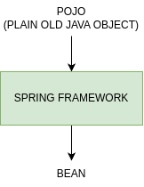

* Any normal Java classes that is instantiated, assembled, and otherwise managed by a Spring IoC container is called
  Spring Beans.
* These beans are created with the configuration metadata that you supply to the container either in the form of XML
  configs and Annotations.
* Spring IoC Container manages the lifecycle of Spring Bean scope and injecting any required dependencies in the bean.
* Context is like a memory location of your app in which we add all the object instances that we want the framework to
  manage. By default, Spring doesn't know any of the objects you define in your application. To enable Spring to see your
  objects, you need to add them to the context.
* SpEL provides a powerful expression language for querying and manipulating an object graph at runtime like setting and
  getting property values, properly assignment, method invocation etc.

### Spring IoC Container.

* The IoC container is responsible:
    * To instantiate the application class.
    * To configure the object.
    * To assemble the dependencies between the objects.
* There are two types of IoC containers:
    * 'org.springframework.beans.factory.BeanFactory'.
    * 'org.springframework.context.ApplicationContext'.
* The Spring container uses dependency injection (DI) to manage the components/objects that make up an application.


## Maven.

### Adding new Beans to Spring Context.

* When we create a java object with new operator directly as shown below, then your Spring Context/Spring IoC Container
  will not have any clue of the object.
* '@Bean' annotation lets Spring know that it needs to call this method when it initializes its context and adds the
  returned object/value to the Spring context/Spring IoC Container.


#### NoUniqueBeanDefinitionException.

When we create multiple objects of some type and try to fetch the bean from context by type, then Spring cannot guess
which instance you've declared you refer to. This will lead to NoUniqueBeanDefinitionException.

```java
@Bean
Vehicle vehicle1() {
    var veh = new Vehicle("Seat");
    return veh;
}

@Bean
Vehicle vehicle2() {
    var veh = new Vehicle("Toyota");
    return veh;
}

@Bean
Vehicle vehicle3() {
    var veh = new Vehicle("Honda");
    return veh;
}

public static void main(String[] args) {
    var context = new AnnotationConfigApplicationContext(ProjectConfig.class);
    Vehicle veh = context.getBean(Vehicle.class);
}
```

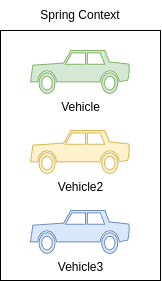

To avoid NoUniqueBeanDefinitionException in these kind of scenarios, we can fetch the bean from the context by mentioning
its name like shown below.

```java
@Bean
Vehicle vehicle1() {
    var veh = new Vehicle("Seat");
    return veh;
}

@Bean
Vehicle vehicle2() {
    var veh = new Vehicle("Toyota");
    return veh;
}

@Bean
Vehicle vehicle3() {
    var veh = new Vehicle("Honda");
    return veh;
}

public static void main(String[] args) {
    var context = new AnnotationConfigApplicationContext(ProjectConfig.class);
    Vehicle veh = context.getBean("vehicle1", Vehicle.class);
}
```

#### Different ways to name a bean.

By default, Spring will consider the method name as the bean name. But if we have a custom requirement to define a separate
bean name, then we can use any of the below approach with the help of @Bean annotation.

```java
@Bean(name = "seatVehicle")
Vehicle vehicle1() {
    var veh = new Vehicle("Seat");
    return veh;
}

@Bean(value = "toyotaVehicle")
Vehicle vehicle2() {
    var veh = new Vehicle("Toyota");
    return veh;
}

@Bean("hondaVehicle")
Vehicle vehicle3() {
    var veh = new Vehicle("Honda");
    return veh;
}

public static void main(String[] args) {
    var context = new AnnotationConfigApplicationContext(ProjectConfig.class);
    Vehicle veh1 = context.getBean("seatVehicle", Vehicle.class);
    Vehicle veh2 = context.getBean("toyotaVehicle", Vehicle.class);
    Vehicle veh3 = context.getBean("hondaVehicle", Vehicle.class);
}
```

#### @Primary Annotation.

When you have multiple beans of the same kind inside the Spring context, you can make one of them primary by using
`@Primary` annotation. Primary bean is the one which Spring will choose if it has multiple options, and you don't specify
a name. In other words, it is the default bean that Spring Context will consider in case of confusion due to multiple
beans present of same type.

```java
@Bean(name = "seatVehicle")
Vehicle vehicle1() {
    var veh = new Vehicle("Seat");
    return veh;
}

@Bean(value = "toyotaVehicle")
Vehicle vehicle2() {
    var veh = new Vehicle("Toyota");
    return veh;
}

@Primary
@Bean("hondaVehicle")
Vehicle vehicle3() {
    var veh = new Vehicle("Honda");
    return veh;
}

public static void main(String[] args) {
    var context = new AnnotationConfigApplicationContext(ProjectConfig.class);
    Vehicle veh1 = context.getBean(Vehicle.class);
}
```

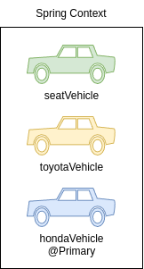

#### @Component Annotation.

`@Component` is one of the most commonly used stereotype annotation by developers. Using this we can easily create and
add a bean to the Spring context by writing less code compared to the `@Bean` option. With stereotype annotations, we
need to add the annotation above the class for which we need to have an instance in the Spring context.

Using `@ComponentScan` annotation over the configuration class, instruct Spring on where to find the classes you marked
with stereotype annotations.

```java
@Component
public class Vehicle {
    private String name;
    
    public String getName() {
        return name;
    }
    
    public void setName(String name) {
        this.name = name;
    }
    
    public void printHello() {
        System.out.println("Printing Hello from Component Vehicle Bean");
    }
}

public static void main(String[] args) {
    var context = new AnnotationConfigApplicationContext(ProjectConfig.class);
    Vehicle veh1 = context.getBean(Vehicle.class);
}
```

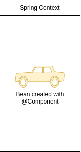

```java
@Configuration
@ComponentScan(basePackages = "com.example.beans")
public class ProjectConfig {}
```

#### Spring Stereotype Annotations.

* Spring provides special annotations called Stereotype annotations which will help to create the Spring beans automatically
  in the application context.
* The stereotype annotations in spring are `@Component`, `@Service`, `@Repository` and `@Controller`.
    * `@Component` is used as general on top of any Java class. It is the base for other annotations.
    * `@Service` can be used on top of the classes inside the service layer especially where we write business logic and make
      external API calls.
    * `@Repository` can be used on top of the classes which handles the code related to Database access related operations like
      Insert, Update, Delete etc.
    * `@Controller` can be used on top of the classes inside the Controller layer of MVC applications.

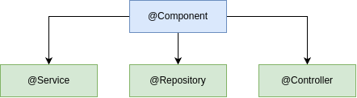

#### @Bean vs @Component.

`@Bean`:
* One or more instances of the class can be added to the Spring Context.
* We can create an object instances of any type of class including present inside libraries like String etc.
* Usually we need to write more code like separate methods to create beans instances.
* Developer will have full control in creating and configuring the bean.
* Spring framework creates the bean based on the instructions and values provided by Developers.

`@Component`:
* Only one instance of the class can be added to the Spring context.
* We can create an object instance for application class only which are created by Dev team.
* Bean instances can be created with very less code like using `@Component` on top of the class.
* Developer will not have any control in creating and configuring the bean.
* Spring framework takes charge of creating the bean and post that Developer will have access to it.

#### @PostConstruct Annotation.

* We have seen that when we are using stereotype annotations, we don't have control while creating a bean. But what if
  we want to execute some instructions post Spring created the bean. For this we can use `@PostConstruct` annotation.
* We can define a method in the component class and annotate that method with `@PostConstruct`, which instructs Spring
  to execute that method after it finishes creating the bean.
* Spring borrows the `@PostConstruct` annotation from Java EE.

```java
@Component
public class Vehicle {
    private String name;
    
    public String getName() {
        return name;
    }
    
    public void setName(String name) {
        this.name = name;
    }
    
    @PostConstruct
    public void initialize() {
        this.name = "Honda";
    }
}

public static void main(String[] args) {
    var context = new AnnotationConfigApplicationContext(ProjectConfig.class);
    Vehicle veh1 = context.getBean(Vehicle.class);
}
```


```java
@Configuration
@ComponentScan(basePackages = "com.example.beans")
public class ProjectConfig {}
```

#### @PreDestroy Annotation.

* `@PreDestroy` annotation can be used on top of the methods and Spring will make sure to call this method just before
  clearing and destroying the context.
* This can be used in the scenarios where we want ro close any IO resources, Database Connections etc.
* Spring borrows the `@PreDestroy` annotation from Java EE.

```java
@Component
public class Vehicle {
    private String name;
    
    public String getName() {
        return name;
    }
    
    public void setName(String name) {
        this.name = name;
    }
    
    @PreDestroy
    public void initialize() {
        System.out.println("Destroying Vehicle Bean");
    }
}

public static void main(String[] args) {
    var context = new AnnotationConfigApplicationContext(ProjectConfig.class);
    Vehicle veh1 = context.getBean(Vehicle.class);
    
    context.close(); // Destroying Vehicle Bean
}

@Configuration
@ComponentScan(basePackages = "com.example.beans")
public class ProjectConfig {}
```

#### Adding new beans programmatically.

* Sometimes we want to create new instances of an object and add them into the Spring context based on programming condition.
  From Spring 5, a new approach is provided to create the beans programmatically by invoking the `registerBean()` method
  present inside the context object.
* `context.registerBean("volkswagen", Vehicle.class, volkswagenSupplier)`:
    * `context`: The ApplicationContext instance object.
    * `"volkswagen"`: The name we want to give to the bean that we add to the Spring context.
    * `Vehicle.class`: Type of the Bean we are creating.
    * `volkswagenSupplier`: The Supplier returning the object instance that we want to add to the Spring Context.

```java
void example() {
    if ((randomNumber % 2) == 0) {
        context.registerBean("volkswagen", Vehicle.class, volkswagenSupplier);
    } else {
        context.registerBean("audi", Vehicle.class, audiSupplier);
    }
}
```


#### Adding new beans using XML configs.

* In the initial versions of Spring, the bean and other configurations used to be done using XML. But over the time,
  Spring team brings annotation based configurations to make developers life easy. Today we can see XML configurations only
  in the older applications built based on initial versions of Spring.
* It is good to understand on how to create a bean inside Spring context using XML style configurations. So that, it will
  be useful if ever there is a scenario where you need to work in a project based on initial versions of Spring.

```xml
<bean id="vehicle" class="com.example.beans.Vehicle">
    <property name="name" value="Honda" />
</bean>
```

```java
public static void main(String[] args) {
    var context = new ClassPathXmlAppliccationContext("beans.xml");
    Vehicle vehicle = context.getBeans(Vehicle.class);
    System.out.println("Vehicle name from Spring Context is: " + vehicle.getName());
}
```


### Behind the scenes of a web app.

* What user can see:
    * UI/UX.
    * Business logic.
    * Responsive.
* Supporting components:
    * Sessions & caching.
    * Transactions.
    * Security.
    * Batch processing.
    * Data transfer.
    * Logging.
    * DB persistence.

#### Why should we use frameworks?

**Chef Majka.**
Uses best readily available best ingredients like Cheese, Pizza Dough etc. to prepare pizza:
* Preparation time is less.
* Can easily scale restaurant pizza orders.
* Gets consistent taste for pizzas.
* Focus more on the pizza preparation.
* Fewer efforts and more results/revenue.

**Chef JD.**
Prepare all the ingredients like Cheese, Pizza Dough etc. by himself to prepare Pizza:
* Preparation time is more.
* Scaling his restaurant pizza order is not an option.
* May not get a consistent taste for his pizzas.
* Focus more on the raw material & ingredients.
* More effort and fewer results/revenue.

**Dev Majka.**
Uses best readily available best frameworks like Spring, Angular etc. to build a web app.
* Leverage Security, Logging etc. from frameworks.
* Can easily scale his application.
* App will work in a predictable manner.
* Focus more on the business logic.
* Fewer efforts and more results/revenue.

**Dev JD.**
Build his own code by himself to build a web app.
* Need to build code for Security, Logging etc.
* Scaling is not an option till tested everything.
* App may not work in a predictable manner.
* Focus more on the supporting components.
* More effort and fewer results/revenue.

#### Spring Projects.

* Spring Boot.
* Spring Data.
* Spring Cloud.
* Spring Security.
* Spring Session.
* Spring Integration.
* Spring AMQP.
* Spring code & Spring MVC.

### Introduction to beans wiring inside Spring.

* Inside Java web applications, usually the objects delegate certain responsibilities to other objects. So in these
  scenarios, objects will have dependency on others.
* In very similar lines when we create various beans using Spring, is our responsibility to understand the dependencies
  that beans have and wire them. This concept is called **Wiring / Autowiring**.
    * VehicleController object -> VehicleService object -> VehicleDAO object.


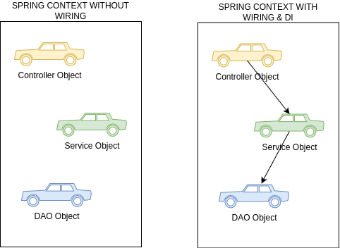

#### No wiring scenario inside spring.

Consider a scenario where we have two java classes Person and Vehicle. The Person class has a dependency to the Vehicle.
Based on the code, we are only creating the beans inside the Spring Context and no wiring will be done. Due to this both
this beans present inside the Spring Context without knowing about each other.

```java
public class Vehicle {
    private String name;
    // ...
}

public class Person {
    private String name;
    private Vehicle vehicle;
    // ...
}

@Bean
public Vehicle vehicle() {
    Vehicle vehicle = new Vehicle();
    vehicle.setName("Toyota");
    return vehicle;
}

@Bean
public Person person() {
    Person person = new Person();
    person.setName("Lucy");
    return person;
}
```

Vehicle doesn't belong to any Person.  The Person and Vehicle beans are present in context but no relation established.

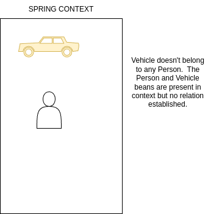

#### Wiring beans using method call.

* Here in the below code, we are trying to wire or establish a relationship between Person and Vehicle, by invoking the
  `vehicle()` bean method from `person()` bean method. Now inside Spring Context, person owns the vehicle.
* Spring will make sure to only 1 vehicle bean is created and also vehicle bean will be created first always as person
  bean has dependency on it.

```java
@Bean
public Vehicle vehicle() {
    Vehicle vehicle = new Vehicle();
    vehicle.setName("Toyota");
    return vehicle;
}

@Bean
public Person person() {
    Person person = new Person();
    person.setName("Majka");
    person.setVehicle(vehicle());
    return person;
}
```

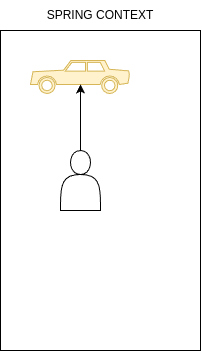

```java
var context = new AnnotationConfigApplicationContext(ProjectConfig.class);
Person person = context.getBean(Person.class);
Vehicle vehicle = context.getBean(Vehicle.class);
```

#### Wiring beans using method parameters.

* Here in the code, we are trying to wire or establish a relationship between Person and Vehicle, by passing the vehicle
  as a method parameter to the `person()` bean method. Now inside Spring Context, person owns the vehicle.
* Spring injects the vehicle bean to the person bean using Dependency Injection.
* Spring will make sure to have only 1 vehicle bean created and also vehicle bean will be created first always as person
  bean has dependency to it.

```java
@Bean
public Vehicle vehicle() {
    Vehicle vehicle = new Vehicle();
    vehicle.setName("Toyota");
    return vehicle;
}

@Bean
public Person person(Vehicle vehicle) {
    Person person = new Person();
    person.setName("Lucy");
    person.setVehicle(vehicle);
    return person;
}
```


#### Inject Beans using @Autowired on class fields.

* The `@Autowired` annotation marks on a field, setter method, constructor is used to autowire the beans that is
  `injecting beans` (Objects) at runtime by Spring Dependency Injection mechanism.
* With the below code, Spring injects/autowire the vehicle bean to the person bean through a class field and dependency
  injection.
* The below style is not recommended for production usage as we can't mark the fields as final.

```java
@Component
public class Person {
    private String name = "Lucy";
    
    @Autowire
    private Vehicle vehicle;
}
```


`@Autowired(required = false)` will help to avoid the NoSuchBeanDefinitionException if the bean is not available during
Autowiring process.

#### Inject Beans using @Autowired on setter method.

* The `@Autowired` annotation marks on a field, setter method, constructor is used to autowire the beans that is
  `injecting beans` (Objects) at runtime by Spring Dependency Injection mechanism.
* With the below code, Spring injects/autowire the vehicle bean to the person bean through a setter method and dependency
  injection.
* The below style is not recommended for production usage as we can't mark the fields as final and not readable friendly.

```java
@Component
public class Person {
    private String name = "Lucy";
    private Vehicle vehicle;
    
    @Autowired
    public void setVehicle(Vehicle vehicle) {
        this.vehicle = vehicle;
    }
}
```


#### Inject Beans using `@Autowired` with constructor.

* The `@Autowired` annotation marks on a field, setter method, constructor is used to autowire the beans that is
  `injecting beans` (Objects) at runtime by Spring Dependency Injection mechanism.
* With the below code, Spring injects/autowire the vehicle bean to the person bean through a constructor and dependency
  injection.
* From Spring version 4.3, when we only have one constructor in the class, writing the `@Autowired` annotation is optional.

```java
@Component
public class Person {
    private String name = "Lucy";
    private final Vehicle vehicle;
    
    @Autowired
    public Person(Vehicle vehicle) {
        System.out.println("Person bean created by Spring");
        this.vehicle = vehicle;
    }
}
```


#### How Autowiring works with multiple Beans of the same type.

* By default, Spring tries autowiring with class type. But this approach will fail if the same class type has multiple
  beans.
* If the Spring context has multiple beans of same class type like below, then Spring will try to autowire based on the
  parameter name/field name that we use while configuring autowiring annotation.
* In the below scenario, we used 'vehicle1' as constructor parameter. Spring will try to autowire with the bean which has
  same name like shown in image below.

```java
@Component
public class Person {
    private String name = "Lucy";
    private final Vehicle vehicle;
    
    @Autowired
    public Person(Vehicle vehicle) {
        System.out.println("Person bean created by Spring");
        this.vehicle = vehicle;
    }
}
```


* If the parameter name/field name that we use while configuring autowiring annotation is not matching with any of the bean
  names, then Spring will look for the bean which has `@Primary` configured.
* In the below scenario, we used `vehicle` as constructor parameter. Spring will try to autowire with the bean which has
  same name and sice it can't find a bean with the same name, it will look for the bean with `@Primary` configured like in
  the image.

```java
@Component
public class Person {
    private String name = "Lucy";
    private final Vehicle vehicle;
    
    @Autowired
    public Person(Vehicle vehicle) {
        System.out.println("Person bean created by Spring");
        this.vehicle = vehicle;
    }
}
```

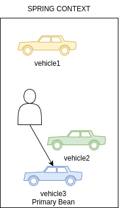

* If the parameter name/field name that we use while configuring autowiring annotation is not matching with any of the
  bean names and even Primary bean is not configured, then Spring will look if `@Qualifier` annotation is used with the bean
  name matching with Spring context bean names.
* In the below scenario, we used `vehicle2` with `@Qualifier` annotation. Spring will try to autowire with the bean which
  has same name like shown in the image below.

```java
@Component
public class Person {
    private String name = "Lucy";
    private final Vehicle vehicle;
    
    @Autowired
    public Person(@Qualifier("vehicle2") Vehicle vehicle) {
        System.out.println("Person bean created by Spring");
        this.vehicle = vehicle;
    }
}
```

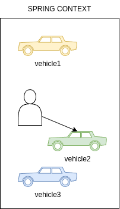

### Understanding & Avoiding Circular dependencies.

* A Circular dependency will happen if 2 beans are waiting for each other to create inside the Spring Context in order to
  do autowiring.
* Consider the below scenario, where Person has a dependency on Vehicle and Vehicle has a dependency on Person. In such
  scenarios, Spring will throw `UnsatisfiedDependencyException` due to circular reference.
* As a developer, it is our responsibility to make sure we are defining the configurations/dependencies that will not
  result in circular dependencies.

```java
@Component
public class Person {
    private String name = "Lucy";
    private Vehicle vehicle;
    
    @Autowired
    public void setVehicle(Vehicle vehicle) {
        this.vehicle = vehicle;
    }
}

public class Vehicle {
    private String name;
    @Autowired
    private Person person;
}
```

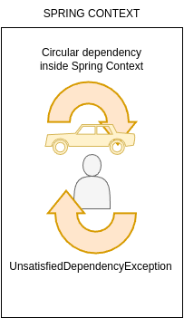

## Bean Scopes inside Spring.

1. Singleton.
2. Prototype.
3. Request.
4. Session.
5. Application.

### Singleton Bean Scope.

* Singleton is the default scope of a bean in Spring. In this scope, for a single bean we always get a same instance when
  you refer or autowire inside your application.
* Unlike Singleton design pattern where we have only 1 instance in entire app, inside Singleton scope Spring will make
  sure to have only 1 instance per unique bean. For example, if you have multiple beans of same type, then Spring Singleton
  scope will maintain 1 instance per each bean declared of same type.

Creates a single bean inside Spring Context.
```java
@Component
@Scope(BeanDefinition.SCOPE_SINGLETON)
public class VehicleServices {}
```

The two variables refers to the same bean inside Spring context.
```java
public static void main(String[] args) {
    VehicleServices vehicleServices1 = context.getBean(VehicleServices.class);
    VehicleServices vehicleServices2 = context.getBean("vehicleServices", VehicleService.class);
}
```

#### Race Condition.

* A race condition occurs when two treads access a shared variable at the same time. The first thread reads the variable,
  and the second thread reads the same value from the variable. Then the first thread and second thread perform their
  operations on the value, and they race to see which thread can write the value last to the shared variable. The value of
  the thread writes its value last is preserved, because the thread is writing over the value that the previous thread wrote.

```java
void example() {
    // Shared Value inside an object
    Map<String, String> reservedTables = new HashMap<>();
    
    // thread-1
    if (!reservedTables.containsKey("table1")) {
        reservedTables.put("table1", "USER1");
    }
    // thread-2
    if (!reservedTables.containsKey("table1")) {
        reservedTables.pur("table1", "USER2");
    }
}
```


### Use cases for singleton beans.

* Since the same instance of singleton bean will be used by multiple thread inside your application, it is very important
  that these beans are immutable.
* This scope is more suitable for beans which handles service layer, repository layer business logic.

1. Building mutable singleton beans, will result in the race condition inside multi thread environment.
2. There are ways to avoid race conditions due to mutable singleton beans with the help of synchronization.
3. But it is not recommended, since it brings a lot of complexity and performance issues inside your app.

### Eager & lazy instantiation.

* By default, Spring will create all the singleton beans eagerly during the startup off the application itself. This is
  called **Eager** instantiation.
* We can change the default behavior to initialize the singleton beans lazily only when the application is trying to refer
  to the beans. This approach is called **Lazy** instantiation.

```java
@Component(value = "personBean")
@Lazy
public class Person {
    // Person will be created only when app try to access it   
}
```

```java
void example() {
    var context = new AnnotationConfigApplicationContext(ProjectConfig.class);
    System.out.println("Before creating the Person object.");
    Person person = context.getBean(Person.class);
    System.out.println("After retrieving the Person object.");
}
```

#### Eager vs Lazy.

**Eager instantiation:**
1. This is the default behavior inside the Spring framework.
2. The singleton bean will be created during the startup of the application.
3. The server will not start if bean is not able to create due to any dependent exceptions.
4. Spring context will occupy a lot of memory if we try to use eager for all beans inside application.
5. Eager can be followed for all the beans which are required very commonly inside application

**lazy instantiation:**
1. This is not a default behavior and need to configure explicitly using `@Lazy`.
2. The singleton bean will be created when the app is trying to refer the bean for the first time.
3. Application will throw an exception runtime if bean creation is failed due to any dependent exceptions.
4. The performance will be impacted if we try to use lazy for all beans inside application.
5. Lazy can be followed for the beans that are used in a very remote scenario inside application.

### Prototype Bean Scope.

* With prototype scope, every time we request a reference of a bean, Spring will create a new object instance and provide it.
* Prototype scope is rarely used inside the applications, and we can use this scope only in the scenarios where your bean
  will frequently change the state of the data which will result race conditions inside multi thread environment. Using
  prototype scope will not create any race conditions.

```java
@Component
@Scope(BeanDefinition.SCOPE_PROTOTYPE)
public class VehicleService {}
```

2 Vehicle services instances are created.
```java
public static void main(String[] args) {
    VehicleService vehicleServices1 = context.getBean(VehicleServices.class);
    VehicleService vehicleServices2 = context.getBean("vehicleServices", VehicleServices.class);
}
```

### Singleton vs Prototype.

**Singleton Scope:**
* This is the default scope inside Spring Framework.
* The same object instance will be returned every time we refer a bean inside the code.
* We can configure to create the beans during the startup or when the first time referred.
* Immutable objects can be idle for Singleton scope.
* Most commonly used scope.

**Prototype Scope:**
* Need top explicitly configure using `@Scope(BeanDefinition.SCOPE_PROTOTYPE)`.
* New object instance will be returned every time we refer a bean inside the code.
* Spring always creates the new object when we try to refer the bean. No eager instantiation is possible.
* Mutable objects can be idle for prototype scope.
* Very rarely used scope.

### Aspect-Oriented Programming (AOP).

* An aspect is simply a piece of code the Spring framework executes when you call specific methods inside your app.
* Spring AOP enables Aspect-Oriented Programming in spring applications. In AOP, aspects enable the modularization of
  concerns such as transaction management, logging or security that cut across multiple types and objects (often termed
  crosscutting concerns).

1. AOP provides the way to dynamically add cross-cutting concerns before, after or around the actual logic using simple
   pluggable configurations.
2. AOP helps in separating and maintaining many non-business logic related code like logging, auditing, security,
   transaction management.
3. AOP is a programming paradigm that aims to increase modularity by allowing the separation of cross-cutting concerns.
   It does this by adding additional behavior to existing code without modifying the code itself.

There is so much non-business logic code along with the main business logic.
```java
public String moveVehicle(boolean started) {
    Instant start = Instant.now();
    logger.info("method execution start");
    String status = null;
    if (started) {
        status = tyres.rotate();
    } else {
        logger.log(Level.SEVERE, "Vehicle not started to perform the operation");
    }
    logger.info("method execution end");
    Instant finish = Instance.now();
    long timeElapsed = Duration.between(start, finish).toMillis();
    logger.info("Time took to execute the method: " + timeElapsed);
    return status;
}
```

With AOP, all the non-business logic is moved to different location which will make method clean & clear.
```java
public String moveVehicle(boolean started) {
    return tyres.rotate();
}
```

**AOP Jargons.**
* When we define an Aspect or doing configurations, we need to follow WWW (3 Ws).
    * WHAT - Aspect.
    * WHEN - Advice.
    * WHICH - Pointcut.

1. WHAT code or logic we want the Spring to execute when you call a specific method. This is called as Aspect.
2. WHEN the Spring need to execute the given Aspect. For example is it before or after the method call. This is called
   as Advice.
3. WHICH method inside App that framework needs to intercept and execute the given Aspect. This is called as a Pointcut.

* Join Point which defines the event that triggers the execution of an aspect. Inside Spring, this event is always a
  method call.
* Target object is the bean that declares the method/pointcut which is intercepted by an aspect.

**Typical Scenario of AOP implementation.**

Developer want `some logic` (Aspect) to be executed `before` (Advice) each `execution` (Joinpoint) of method `playMusic()`
(Pointcut) present inside the bean `VehicleServices` (Target Object).

#### Weaving inside AOP.

* When we are implementing AOP inside our App using Spring framework, it will intercept each method call and apply the
  logic defined in the Aspect.
* But how does this work? Spring does this with the help of proxy object. So we try to invoke a method inside a bean,
  Spring instead directly giving reference of the bean instead it will give a proxy object that will manage each call to
  a method and apply the aspect logic. This process is called Weaving.

Without AOP, method is directly called and no interception by Spring.
With AOP, method executions will be intercepted by proxy object and aspect will be executed. Post that actual metod
invocation will happen.

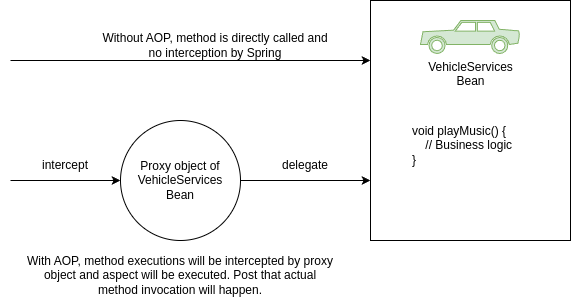

#### Advice types inside AOP.

**Type of Advices in Spring AOP:**
* `@Before`.
* `@AfterReturning`.
* `@AfterThrowing`.
* `@After`.
* `@Around`.

1. Before advice runs before a matched method execution.
2. After returning advice runs when a matched method execution completes normally.
3. After throwing advice runs when a matched method execution exits by throwing an exception.
4. After (finally) advice runs no matter how matched method execution exits.
5. Around advice runs "around" a matched method execution. It has the opportunity to do work both before and after the
   method runs and to determine when, how, and even if the method actually gets to run at all.

#### Configuring Advices inside AOP.

* We can use AspectJ pointcut expression to provide details to Spring about what kind of methods it needs to intercept
  by mentioning details around modifier, return type, name pattern, package name pattern, params pattern, exceptions pattern etc.

**Execution expression approach.**
* `modifiers-pattern`: Used to define method modifiers like public, private.
* `ret-type-pattern`: Used to define the desired return type of the method.
* `name-pattern(param-pattern`: Used to define any name pattern, package pattern, params pattern of the method.
* `throws-pattern?`: Used to define the specific execution pattern that can be thrown by the method.
  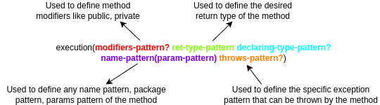

* Like shown below, we can mention the pointcut expression as an input after advice annotations that we use.
```java
@Configuration
@ComponsntScan(basePackages = {"com.example.implementation", "com.example.services", "com.example.aspects"})
@EnableAspectJAutoProxy
public class ProjectConfig {}
```

```java
@Aspect
@Component
public class LoggerAspect {
    @Around("execution(* com.example.services.*.*(..))")
    public void log(ProceedingJoinPoint joinPoint) throws Throwable {
        // Aspect Logic
    }
}
```

* Alternatively, we can use Annotation style of configuring Advices inside AOP.

**Annotation approach.**
* Step 1: Create an annotation type.
```java
@Retention(RetentionPolicy.RUNTIME)
@Target(ElementType.METHOD)
public @interface LogAspect {}
```
* Step 2: Mention the same annotation on top of the method which we want to intercept using AOP.
```java
@LogAspect
public String playMusic(boolean started, Song song) {
    // Business Logic
}
```
* Step 3: Use the annotation details to configure on top of the aspect method to advice.
```java
@Around("@annotation(com.example.interfaces.LogAspect)")
public void logWithAnnotation(ProceedingJoinPoint joinPoint) throws Throwable {
    // Aspect Logic
}
```

## Overview of the Web app.

1. The Web clients sends a request using protocols like HTTP to Web Application protocols like HTTP to Web Application
   asking some data like list of images, videos, text etc.
2. The web server where web app is deployed receives the client requests and process the data it receives. Post that it
   will respond to client's request in the format of HTML, JSON etc.
3. In Java web app, Servlet Container (Web Server) takes care of translating the HTTP messages for Java code to understand.
   One of the mostly used servlet container is Apache Tomcat.
4. Servlet Container converts the HTTP messages into ServletRequest and handover to Servlet method as a parameter.
   Similarly, ServletResponse returns as an output to Servlet Container from Servlet.

Usually Web Applications can be:
1. Only Frontend (Static Web Apps).
2. Only Backend (APIs).
3. Frontend + Backend (Ecommerce Apps).

### Role of Servlets inside Web apps.

**With Spring.**
1. With Spring, it defines a servlet called Dispatcher Servlet which maintains all the URL mapping inside a web application.
2. The servlet container calls this Dispatcher Servlet from any client request, allowing the servlet to manage the request
   and the response. This way Spring internally does all the magic for Developers without the need of defining the servlets
   inside a Web apps.

**Before Spring.**
1. Before Spring, developer has to create a new servlet instance, configure it in the servlet container, and assign it to
   a specific URL path.
2. When the client sends a request, Tomcat calls a method of the servlet associated with the path the client requested.
   The servlet gets the values on the request and builds the response that Tomcat sends back to the client.

### Evolution of web apps inside Java ecosystem.

**In 2000.**
No Web Design patterns and frameworks support present in the 2000s. So all the web application code is written in such
a way all the layers like Presentation, Business, Data Layer are tightly coupled.

**In 2010.**
With the help & invention of design patterns like MVN can frameworks like Sping, Struts, Hibernate, developers started
building web applications separating the layers of Presentation, Business, Data Layers. But all the code deployed into
a single jubmo server as monolithic application.

**In 2020.**
With the invention of UI frameworks like Angular, React and new trends like Microservices, Containers, developers started
building web application by Separating UI and backend layers. The code also deployed into multiple servers using containers
and cloud.

### Developing web applications using Spring.

**Approach 1:**
* Web Apps which holds UI elements like HTML, CSS, JS and backend logic.
* Here the App is responsible to fully prepare the view along with data in response to a client request.
* Spring Core, `Spring MVC`, Spring Boot, SpringData, Spring Rest, Spring Security will be used.

**Approach 2:**
* Web Apps which holds only backend logic. These Apps send data like JSON to separate UI Apps built based on Angular,
  React etc.
* Here the App is responsible to only process the request and respond with only data ignoring view.
* Spring Core, Spring Boot, Spring Data, Spring Rest, Spring Security will be used.

Spring MVC is the key differentiator between these two approaches.

### Spring Boot.
1. SpringBoot was introduced in April 2014 to reduce some of the burdens while developing a Java web application.
2. Before Spring Boot, Developer need to configure a servlet container, establish link between Tomcat and Dispatcher servlet,
   deploy into a server, define a lot of dependencies.
3. But with Spring Boot, we can create Web Apps skeleton. It helps to eliminate all the configurations we need to do.
4. Spring Boot is now one of the most appreciated projects in the Spring ecosystem. It helps us to create Spring apps more
   efficiently and focus on the business code.
5. Spring Boot is a mandatory skills now due to the latest trends like Full Stack Development, Microservices, Serverless,
   Containers, Docker etc.

**Before Spring Boot:**
* Configure a Maven/Gradle project with all the dependencies needed.
* Understand how servlets work & configure the DispatcherServlet inside web.xml.
* Package the web application into a WAR file. Deploy it into a server.
* Deal with complicated class loading strategies, application monitoring and management.

**After Spring Boot:**
* SpringBoot automatically configures the bare minimum components of a Spring application.
* Spring Boot applications embed a web server so that we do not require an external application server.
* SpringBoot provides several useful production-ready features out of the box to monitor and manage the application.

### The magic of Spring Boot.

**Spring Boot important features.**

**Spring Boot Starters.**
Spring Boot groups related dependencies used for a specific purposes as starter projects. We don't need to figure out all
the must-have dependencies you need to add to your project for one particular purpose not which versions you should use
for compatibility. Example: `spring-boot-starter-web`.

**Autoconfiguration.**
Based on the dependencies present in the classpath, Spring Boot guess and autoconfigure the spring beans, property
configurations etc. However, autoconfiguration backs away from the default configuration if it detects user-configured
beans with custom configurations.
To achieve autoconfiguration Spring Boot follows the convention-over-configuration principle.

**Actuator & DevTools.**
Spring Boot provides a pre-defined list of actuator endpoints. Using this production ready endpoints, we can monitor app
health, metrics etc.
DevTools includes features such as automatic detection of application code change, LiveReload server to automatically
refresh any HTML changes to the browser all without server restart.

#### Getting started with Spring Boot.

* We can identify the SpringBoot main class by looking for an annotation `@SpringBootApplication`.
* A single `@SpringBootApplication` annotation can be used to enable these three features:
    * `@EnableAutoConfiguration`: enable Spring Boot's autoconfiguration mechanism.
    * `@ComponentScan`: enable component scan on the package where the application is located.
    * `@SpringBootConfiguration`: enable registration of extra beans in the context or the import of additional configuration
      classes. An alternative to Spring's standard `@Configuration` annotation.
* The `@RequestMapping` annotation provides "routing" information. It tells Spring that any HTTP request with the given
  path should be mapped to the corresponding method. It is a Spring MVC annotation and not specific to Spring Boot.
* `server.port` and `server.servlet.context-path` properties can be mentioned inside tha `application.properties` to change
  the default port number and context path of a web application.
* Mentioning `server.port=0` will start the web application at a random port number every time.
* Mentioning `debug=true` will print the Autoconfiguration report on the console. We can mention the exclusion list as
  well for Spring Boot autoconfiguration by using the below config:
    * `@SpringBootApplication(exclude = { DataSourceAutoConfiguration.class })`.

**Tip.**
We can configure multiple paths against a single method using Spring MVC annotations.
```java
@Controller
public class HomeController {
    @RequestMapping(value = {"", "/", "home"})
    public String displayHomePage(Model model) {
        // Business Logic
    }
}
```

### Spring Boot DevTools.

* The SpringBoot DevTools provides features like `Automatic restart` & `LiveReload` that make the application development
  experience a little more pleasant for developers.
* It can be added into any of the SpringBoot project by adding the below maven dependency.
```xml
<dependency>
  <groupId>org.springframework.boot</groupId>  
  <artifactId>spring-boot-devtools</artifactId>
</dependency>
```
* DevTools maintains 2 class loaders, one with classes that doesn't change and other one with classes that change. When
  restart needed it only reload the second class loader which makes restarts faster as well.
* DevTools includes an embedded LiveReload server that can be used to trigger a browser refresh when a resource is changed.
  LiveReload related browser extensions are freely available for Chrome, Firefox.
* DevTools triggers a restart when ever a build is triggered through IDE or by maven commands. DevTools disables the caching
  options by default during development. Repackaged archives do not contain DevTools by default.

### Introduction to MVC Pattern.

* Controller: Controls the flow & decides which business logic needs to be executed. It acts as a Brain inside MVC pattern.
* View: Represents UI and usually takes data from the controller and display it with the help of HTML pages.
* Model: Represents the data of the application like name, age, students list etc. It stores & manages the data.

Model View Controller Design Pattern: Separation of Concerns to achieve loose coupling.

#### Spring MVC architecture & internal flow.


1. Web Client makes HTTP request.
2. Servlet Container like Tomcat accepts the HTTP requests and handovers the Servlet Request to Dispatcher Servlet inside
   Spring Web App.
3. The Dispatcher Servlet will check the Handler Mapping to identify the controller and method names to invoke based on
   the HTTP method, path etc.
4. The Dispatcher Servlet will invoke the corresponding controller & method. After execution, the controller will provide
   a view name and data that needs to be rendered in the view.
5. The Dispatcher Servlet with the help of a component called View Resolver finds the view and render it with the data
   provided by the controller.
6. The Servlet Container or Tomcat accepts the Servlet Response form the Dispatcher servlet and convert to HTTP response
   before returning to the client.
7. The browser or client intercepts the HTTP response and display the view, data etc.

**Tip.**
We can register view controllers that create a direct mapping between the URL and the view name using the
ViewControllerRegistry. This way, there's no need for any Controller between the two.
```java
@Configuration
public class WebConfig implements WebMvcConfigurer {
    @Override
    public void addViewControllers(ViewControllerRegistry registry) {
        registry.addViewController("/courses").setViewName("courses");
        registry.addViewController("/about").setViewName("about");
    }
}
```

### Reduce boilerplate code with Lombok.

* Java expects a lot of boilerplate code inside POJO classes like getters and setters.
* `Lombok`, which is a Java library provides you with several annotations aimed at avoiding writing Java code known to be
  representative and/or boilerplate.
* It can be added into any of the Java project by adding the below maven dependency.
```xml
<dependency>
  <groupId>org.projectlombok</groupId>
  <artifactId>lombok</artifactId>
</dependency>
```
* Project Lombok works by plugging into your build process. Then, it will auto-generate the Java bytecode into your
  `.class` files required to implement the desired behavior, based on the annotations you used.
* Most commonly used Lombok annotations: `@Getter`, `@Setter`, `@NoArgsConstructor`, `@RequiredArgsConstructor`,
  `@AllArgsConstructor`, `@ToString`, `@EqualsAndHashCode`, `@Data`.
* `@Data` is a shortcut annotation that combines the features of below annotation together: `@ToString`, `@EqualsAndHashCode`.
  `@Getter`, `@Setter`, `@RequiredArgsConstructor`.

A sample outline of a Java POJO class with `@Data` annotation used. The source code will not have boilerplate code but the
compiled byte code will have.

### @RequestParam Annotation.

* In Spring `@RequestParam` annotation is used to map either query parameters or form data.
* For example, if we want to get parameters value from an HTTP GET requested URL then we can use `@RequestParam` annotation.

```
http://localhost:8080/holidays?festival=true&federal=true
```

```java
@GetMapping("/holidays")
public String displayHolidays(@RequestParam(required = true) boolean festival, 
                              @RequestParam(required = true) boolean federal) {
    // Business Logic
    return "holidays.html";
}
```
* The `@RequestParam` annotation supports attributes like `name`, `required`, `value`, `defaultvalue`. We can use them
  in our application based on the requirements.
* The `name` attribute indicates the name of the request parameter to bind to.
* The `required` attribute is used to make a field either optional or mandatory. If it is mandatory, an exception will
  throw in case of missing fields.
* The `value` attribute is similar to name elements and can be used as an alias.
* `defaultValue` for the parameter is to handle missing values or null values. If the parameter does not contain any value
  then this default value will be considered.

### @PathVariable Annotation.

* The `@PathVariable` annotation is used to extract the value from the URI. It is most suitable for the RESTful web service
  where the URL contains some value. Spring MVC allows us to use multiple `@PathVariable` annotations in the same method.
* For example, if we want to get the value from a requested URI path, then we can use `@PathVariable` annotation.

```
http://localhost:8080/holidays/all
http://localhost:8080/holidays/federal
http://localhost:8080/holidays/festival
```

* The `@PathVariable` annotation supports attributes like `name`, `required`, `value` similar to `@RequestParam`. We can
  use them in our application based on the requirements.

```java
@GetMapping("/holidays/{display}")
public String displayHolidays(@PathVariable String display) {
    // Business logic
    return "holidays.html";
}
```

### Validation with Spring Boot.

* Bean Validation is the standard for implementing validations in the Java ecosystem. It's well integrated with Spring and
  Spring Boot.
* Below is the maven dependency that we can add to implement Bean validations in any Spring/Spring Boot project.

```xml
<dependency>
  <groupId>org.springframework.boot</groupId>
  <artifactId>spring-boot-starter-validation</artifactId>
</dependency>
```

* Bean Validation works by defining constraints to the fields of a class by annotating them with certain annotations.
* We can put the `@Valid` annotation on method parameters and fields to tell Spring that we want a method parameter or
  field to be validated.
* Below are the important packages where validations related annotations can be identified:
    * `jakarta.validation.constraints.*`.
    * `org.hibernate.validator.constraints.*`.

### Important validation Annotations.

**jakarta.validation.constraints**: `@Digits`, `@Eamil`, `@Max`, `@Min`, `@NotBlank`, `@NotEmpty`, `@NotNull`, `@Pattern`,
`@Size`.

**org.hibernate,validator.constraints**: `@CreditCardNumber`, `@Length`, `@Currency`, `@Range`, `@URL`, `@UniqueElements`,
`@EAN`, `@ISBN`.

#### Validation with Spring Boot.

* Simple validations declaration inside a java POJO.

```java
@Data
public class Contact {
    @NotBlank(message = "Email must not be blank")
    @Email(message = "Please provide a valid email address")
    private String email;
    
    @NotBlank(messsage = "Subject must not be blank")
    @Size(min = 5, message = "Subject must be at least 5 characters long")
    private String subject;
    
    @NotBlank(message = "Message must not be blank")
    @Size(min = 10, message = "Message must be at least 10 characters long")
    private String message;
}
```

* We can put the `@Valid` annotation on method parameters to tell Spring framework that we want a particular POJO object
  needs to be validated based on the validation annotation configurations. For any issues, framework populates the error
  details inside the Errors object. The errors can be used to display on the UI to the user.

### Spring Web Scopes.

**Web Scopes inside Spring**:
* Request (`@RequestScope`).
* Session (`@SessionScope`).
* Application (`@ApplicationScope`).

1. Request Scope: Spring creates an instance of the bean class for every HTTP request. The instance exists only for that
   specific HTTP request.
2. Session Scope: Spring creates an instance and keeps the instance in the server's memory for the full HTTP session.
   Spring links the instance in the context with the client's session.
3. Application Scope: The instance is unique in the app's context, and it's available while the app is running.

#### Key points of Spring Web Scopes.

**Request Scope**:
* Spring creates a lot of instances of this bean in the app's memory for each HTTP request. So these type of beans are
  short-lived.
* Since Spring creates a lot of instances, please make sure to avoid time-consuming logic while creating the instance.
* Can be considered for the scenarios where the data needs to be reset after new request or page refresh etc.

**Session Scope**:
* Session scoped beans have longer life & they are less frequently garbage collected.
* Avoid keeping too much information inside data as it impacts performance. Never store sensitive information as well.
* Can be considered for the scenarios where the same data needs to be accessed across multiple pages like user information.

**Application Scope**:
* In the application scope, Spring creates a bean instance per web application runtime.
* It is similar to singleton scope, with one major difference. Singleton scoped bean is singleton per ApplicationContext
  where application scoped bean is singleton per ServletContext.
* Can be considered for the scenarios where we want to store Drop Down values, Reference table values which won't change
  for all the users.

## Spring Security.

* Spring Security is a powerful and highly customizable authentication and access-control framework. It is de-facto standard
  for securing Spring-based applications.

```xml
<dependency>
  <groupId>org.springframework.boot</groupId>
  <artifactId>spring-boot-starter-security</artifactId>
</dependency>
```

* Spring Security is a framework that provides authentication, authorization, and protection against common attacks.
* Spring Security helps developers with easier configurations to secure a web application by using standard username/
  password authentication mechanism.
* Spring Security provides out of the box features to handle common security attacks like CSRF, CORS. It also has good
  integration with security standards like JWT, OAUTH2 etc.

### Authentication vs Authorization.

**Authentication.**
* In authentication, the identity of users are checked for providing the access to the system.
* Authentication done before authorization.
* It needs usually user's login details.
* If authentication fails usually we will get 401 error response.
* For example as a bank customer/employee in order to perform actions in the app, we need to prove our identity.

**Authorization.**
* In authorization, person's or user's authorities are checked for accessing the resources.
* Authorization always happens after authentication.
* It needs user's privilege or roles.
* If authorization fails usually we will get 403 error response.
* Once logged into the application, my roles, authorities will decide what kind of actions i can do.

**Tip.**
* As soon as we add spring security dependency to a web application, by default it protects all the pages/API inside it.
  It will redirect to the inbuilt login page to enter credentials.
* The default credentials are `user`, and password is randomly generated & printed on the console.
* We can configure custom credentials using the below properties to get started for POCs etc. But for PROD applications,
  Spring Security supports user credentials configuration inside DB, LDAP, OAuth2 Server etc.
    * `spring.security.username=panda`.
    * `spring.security.password=54321`.

#### Default Security Configurations in Spring Security.

By default, Spring Security framework protects all the paths present inside the web application. This behavior is due to
the code present inside the method `defaultSecurityFilterChain(HttpSecurity http)` of class `SpringBootWebSecurityConfiguration`.

```java
@Bean
@Order(SecurityProperties.BASIC_AUTH_ODER)
SecurityFilterChain defaultSecurityFilterChain(HttpSecurity http) throws Exception {
    http.authorizeHttpRequests((requests) -> requests.anyRequest().authenticated());
    http.formLogin(withDefaults());
    http.httpBasic(withDefaults());
    return http.build();
}
```

#### Configure permitAll() with Spring Security.

* Using `permitAll()` configurations we can allow full/public access to a specific resource/path or all the resources/paths
  inside a web application.
* Below is the sample configuration that we can do in order to allow any requests in a Web application without security.

```java
@Configuration
public class ProjectSecurityConfig {
    @Bean
    SecurityFilterChain defaultSecurityFilterChain(HttpSecurity http) throws Exception {
        http.authorizeHttpRequests((requests) -> requests.anyRequest().permitAll())
                .formLogin(Customizer.withDefaults())
                .httpBasic(Customizer.withDefaults());
        return http.build();
    }
}
```

* Form Login provides support for username and password being provided through a html form.
* HTTP Basic Auth uses an HTTP header in order to provide the username and password when making a request to a server.

#### Configure denyAll() with Spring Security.

* Using `denyAll()` configurations we can deny access to a specific resource/paths or all the resources/paths inside a web
  application regardless of user authentication.
* Below is the sample configuration that we can do in order to deny any requests that is coming into a web application.

```java
@Configuration
public class ProjectSecurityConfig {
    @Bean
    SecurityFilterChain defaultSecurityFilterChain(HttpSecurity http) throws Exception {
        http.authorizeHttpRequests((requests) -> requests.anyRequest().denyAll())
                .formLogin(Customizer.withDefaults())
                .httpBasic(Customizer.withDefaults());
        return http.build();
    }
}
```

* Usually `denyAll()` is used to retire a specific API temporarily without removing the code.
* `permitAll()` is used to allow public access to public APIs, paths, CSS, images, JS files etc.

#### Configure custom security configs & csrf disable.

* We can apply custom security configurations based on our requirements for each API/URL.
* `permitAll()` can be used to allow access without security and `authenticated()` can be used to protect a web page/API.
* By default any requests with HTTP methods that can update data like POST, PUT will be stopped with 403 error due to
  CSRF protection.
* Sample configuration we can do to implement custom security configs and disable CSRF.

```java
@Configuration
public class ProjectSecurityConfig {
    @Bean
    SecurityFilterChain defaultSecurityFilterChain(HttpSecurity http) throws Exception {
        http.csrf((csrf) -> csrf.disable())
                .requestMatchers("", "/", "/home").permitAll()
                .requestMatchers("/holidays/**").permitAll()
                .formLogin(Customizer.withDefaults())
                .httpBasic(Customizer.withDefaults());
        return http.build();
    }
}
```

#### In-memory authentication in spring security.

* Spring Security provide support for username/password based authentication based on the users stored in application memory.
* Like mentioned below, we can configure any number of users & their roles, passwords using in-memory authentication.

In-memory authentication is idle for POC Web Apps or any Internal Web App that get used only in non-prod environments.
Never use in-memory authentication for PROD web applications.

```java
@Configuration
public class ProjectSecurityConfig {
    @Bean
    SecurityFilterChain defaultSecurityFilterChain(HttpSecurity http) throws Exception { }
  
    @Bean
    public InMemoryUserDetailsManager userDetailsService() {
        UserDetails user = User.withDefaultPasswordEncoder()
                .username("user").password("12345").roles("USER").build();
        
        UserDetails admin = User.withDefaultPasswordEncoder()
                .username("admin").password("54321").roles("USER", "ADMIN").build();
        return new InMemoryUserDetailsManager(user, admin);
    }
}
```

#### Configuring Login & Logout page.

* Spring Security allows us to configure a custom login page to our web application instead of using the Spring Security
  default provided login page.
* Similarly, we can configure logout page as well.

Configured login page will be shown, if the user tries to access the secured page/resource without a valid authenticated
session. The same behavior applies for default login page provided by Spring Security.
```java
@Configuration
public class ProjectSecurityConfig {
    @Bean
    SecurityFilterChain defaultSecurityFilterChain(HttpSecurity http) throws Exception {
        http.csrf((csrf) -> csrf.disable())
              .requestMatchers("", "/", "/home").permitAll()
              .requestMatchers("/holidays/**").permitAll()
              .formLogin(Customizer.withDefaults())
                .formLogin(loginConfigurer -> loginConfigurer.loginPage("/login")
                        .defaultSuccessUrl("/dashboard").failureUrl("/login?error=true").permitAll())
                .logout(logoutConfigurer -> logoutConfigurer.logoutSuccessUrl("/login?logout=true")
                        .invalidateHttpSession(true).permitAll())
              .httpBasic(Customizer.withDefaults());
        return http.build();
    }
}
```

### @ControllerAdvice & @ExceptionHandler.

* `@ControllerAdvice` is a specialization of the `@Component` annotation which allows to handle exceptions across the whole
  application in one global handling component. You can think of it as an interceptor of exceptions thrown by methods annotated
  with `@RequestMapping` or one of the shortcuts like `@GetMapping`.
* We can define the exception handle logic inside a method and annotate it with `@ExceptionHandler.`

Combination of `@ControllerAdvice` & `@ExceptionHandler` can handle the exceptions across all the controllers inside a web
application globally.

**Tip.**
* If a method annotated with `@ExceptionHandler` present inside a `@Controller` class, then the exception handling logic
  will be applicable for any exceptions occurred in that specific controller class.
* If the same `@ExceptionHandler` annotated method present inside a `@ControllerAdvice` class, then the exception handling
  logic will be applicable for any exceptions occurred across all the controller classes.
* Using `@ExceptionHandler` annotation, we can handle any number of exceptions.

### Cross-site request forgery (CSRF).

* A typical Cross-Site Request Forgery (CSRF or XSRF) attack aims to perform an operation in a web application on behalf
  of a user without their explicit consent. In general, it doesn't directly steal the user's identity, but it exploits the
  user to carry out an action without their will.
* Step 1: The Netflix user login to Netflix and the backend server of Netflix will provide a cookie which will store in the
  browser against the domain name Netflix.com.
    * User Submits his credentials & try to login to Netflix.com.
    * Netflix server create a cookie & saved in user browser against Netflix.com domain name.
      
* Step 2: The same Netflix user opens an evil website in another tab of the browser.
    * User accessed an evil site hosted on evil.com.
    * evil.com returns a web page which has embedded malicious link to change email of Netflix account. But link appears with
      text like "90% off".
      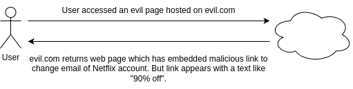
* Step 3: User tempted and clicked on the malicious link which makes a request to Netflix.com. And since the login cookie
  already present in the same browser and the request to change email is being made to the same domain Netflix.com, the
  backend server of Netflix.com can't differentiate from where the request come. So here the evil.com forged the request
  as if it is coming from a Netflix.com UI page.
    * User clicks on a link on evil.com which has content something like.
    * The email of the Netflix account changed.
      

### Solution to CSRF.

* To defeat a CSRF attack, application need a way to determine if the HTTP request is legitimately generated via the
  application's user interface. The best way to achieve this is through a `CSRF token`. A CSRF token is a secure random
  token that is used to prevent CSRF attacks. The token needs to be unique per users session and should be of large random
  value to make it difficult to guess.
* Step 1: The Netflix user login to Netflix.com and the backend server of Netflix will provide a cookie which will store in
  the browser against the domain name Netflix.com along with a randomly generated unique CSRF token for this particular
  user session. CSRF token is inserted within hidden parameters of HTML forms top avoid exposure to session cookies.
    * User submit his credentials & try to login to Netflix.com.
    * Netflix server create a cookie & randomly generated CSRF token.
      
* Step 2: The same Netflix user opens an evil.com website in another tab of the browser.
    * User accessed an evil site hosted on evil.com.
    * evil.com returns web page which has embedded malicious link to change email of Netflix account. But link appears
      with a text like "90% off".
      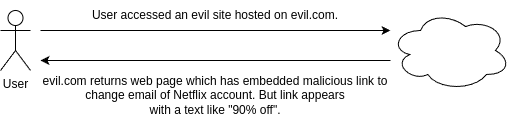
* Step 3: User tempted and clicked on the malicious link which makes a request to Netflix.com. And since the login cookie
  already present in the same browser and the request to change email is being made to the same domain Netflix.com. This time
  the Netflix.com backend server expects CSRF token along with the cookie. The CSRF token must be same as initial value
  generated during login operation.
    * User clicks on a link on evil.com which has content like.
    * The Netflix thrown an error 403.
      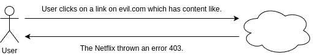

The CSRF token will be used by the application sever to verify the legitimacy of the end-user request if it is coming from
the same App UI or not. The application server rejects the request if the CSRF token fails to match the test.

**Tip.**
* By default, Spring Security enables CSRF fix for all the HTTP methods which results in data change like POST, DELETE etc.
  But not GET.
* Using Spring Security configurations we can disable the CSRF protection for complete application or for only few paths
  based on our requirements:
    * `http.csrf((csrf) -> csrf.disable())`.
    * `http.csrf((csrf) -> csrf.ignoringRequestMatchers("/saveMsg"))`.

# Spring Boot & H2 Database.

* H2 is an embedded, open-source, and in-memory database. SpringBoot supports integration with H2 DB which can be used
  for POC applications and excellent for examples/testing.
* Maven dependency that we can add to any SpringBoot projects in order to use internal memory H2 Database.
    * groupId: `com.h2database`.
    * artifactId: `h2`.
    * scope: `runtime`.
* Since it is an internal memory DB, we need to create the schema and data that is needed during startup of the App.
  Any updates to the data will be lost after restarting the server.
* To create schema & data for the H2 DB, we can add `schema.sql` & `data.sql` inside the maven project's resources folder.
  Any table creation scripts and DB records scripts can be present inside `schema.sql` and `data.sql` respectively.
* By default, the H2 web console is available at `/h2-console`. You can customize the console's path by using the
  `spring.h2.console.path` property.

## Key points of JDBC.

**Intro to JDBC.**

* JDBC or Java Database Connectivity is a specification from Core Java that provides a standard abstraction for java app
  to communicate with various databases.
* JDBC API along with the database driver is capable of accessing database.
* JDBC is a base framework or standard for frameworks like Hibernate, Spring Data JPA, MyBatis etc.

**Steps in JDBC to access DB.**

We need to follow the below steps to access DB using JDBC:
1. Load Driver Class.
2. Obtain a DB connection.
3. Obtain a statement using connection object.
4. Execute the query.
5. Process the result set.
6. Close the connection.

**Problem with JDBC.**

* Developers are forced to follow all the steps mentioned to perform any kind of operation with DB which results in a lot
  of duplicate code at any place.
* Developers needs to handle the checked exceptions that will throw from the API.
* JDBC is database dependent.

## Intro to Spring JDBC.

* Spring JDBC simplifies the use of JDBC and helps to avoid common errors. It executes core JDBC workflow, leaving
  application code to provide SQL and extract results. It does the magic by providing JDBC template which developers can
  use inside their applications.
* Below is the maven dependency that we need to add to any Spring/SpringBoot projects in order to use Spring JDBC provided
  templates.
    * groupId: `org.springframework.boot`.
    * artifactId: `spring-boot-starter-jdbc`.
* Spring provides many templates for JDBC related activities. Among them the famous ones are JdbcTemplate,
  NamedParameterJdbcTemplate.
* JdbcTemplate is the classic and most popular Spring JDBC approach. This provides "lowest-level" approach and all others
  templates uses JdbcTemplate under the covers.
* NamedParameterJdbcTemplate wraps a JdbcTemplate to provide named parameters instead of the traditional JDBC `?`
  placeholders. This approach provides better documentation and ease of use when you have multiple parameters for an
  SQL statement.

**Spring JDBC - who does what?**

| Action | Spring JDBC | Developer |
|---|---|---|
| Define connection parameters. | NO | YES |
| Open the connection. | YES | NO |
| Specify the SQL statement. | NO | YES |
| Declare parameters and provide parameter values | NO | YES |
| Prepare and run the statement. | YES | NO |
| Set up the loop to iterate through the results (if any). | YES | NO |
| Do the work for each iteration. | NO | YES |
| Process any exception. | YES | NO |
| Handle transactions. | YES | NO |
| Close the connection, the statement, and the resultset. | YES | NO |

**Using JdbcTemplate.**

* JdbcTemplate is the central class in the JDBC core package. It handles the creation and release of resources, which
  helps you avoid common errors, such as forgetting to close the connection. It performs the basic tasks of the core JDBC
  workflow (such as statement creation and execution), leaving application code to provide SQL and extract results.
* You can use JdbcTemplate within a DAO implementation through direct instantiation with a DataSource reference, or you
  can configure it in a Spring IoC container and give it to DAOs as a bean reference.
* We need to follow the below steps in oder to configure JdbcTemplate inside a Spring Web application (Without Spring Boot).

1. First we need to create a DataSource Bean inside Web application with the DB credentials like mentioned below.
    ```java
    @Bean
    public DataSource myDataSource() {
        DriverManagerDataSource dataSource = new DriverManagerDataSource();
        dataSource.setDriverClassName("com.mysql.jdbc.Driver");
        dataSource.setUrl("jdbc:mysql://localhost:3306/school");
        dataSource.setUsername("user");
        dataSource.setPassword("password");
        return dataSource;
    }
    ```
2. Inside any Repository/DAO classes where we want to execute queries, we need to create a bean/object of
   JdbcTemplate by injecting data source bean.
    ```java
    @Repository
    public class PersonDAOImpl implements PersonDAO {
      JdbcTemplate jdbcTemplate;
        
      @Autowired
      public PersonDAOImpl(DataSource dataSource) {
          jdbcTemplate = new JdbcTemplate(dataSource);
      }
    }
    ```
   Instances of the JdbcTemplate class are thread-safe, once configured. This is important because if needed we can configure
   a single instance of a JdbcTemplate and then safely inject this shared reference into multiple DAOs (or repositories)

**Sample usage of JdbcTemplate for SELECT queries.**

```java
// The following query gets the number of rows in a table.
int rowCount = this.jdbcTemplate.queryForObject("select count(*) from person", Integer.class);
```

```java
// The following query uses a bind variable.
int countOfPersonsNamedJoe = this.jdbcTemplate
                .queryForObject("select count(*) from person where first_name = ?", Integer.class, "Joe");
```

```java
// The following query looks for a string column based on a condition.
String lastName = this.jdbcTemplate.queryForObject("select last_name from person where id = ?", String.class, 1212L);
```

**Sample usage of JdbcTemplate for Updating (INSERT, UPDATE, and DELETE).**

```java
// The following example inserts a new entry
this.jdbcTemplate.update("insert into person (first_name, last_name) values (?, ?)", "John", "Doe");
```

```java
// The following examples updates an existing entry.
this.jdbcTemplate.update("update person set last_name = ? where id = ?", "Majka", 6543L);
```

```java
// The following example deletes an entry.
this.jdbcTemplate.update("delete from person where id = ?", 5234L);
```

**Other JdbcTemplate Operations.**

```java
// You can use the execute(..) method to run any arbitrary SQL. Consequently, the method is often used for DDL statements.
this.jdbcTemplate.execute("create table person (id integer, name varchar(100))");
```

```java
// The following example invokes a stored procedures.
this.jdbcTemplate.update("call SUPPORT.REFRESH_PERSON_SUMMARY(?)", 5234L);
```

### Using RowMapper.

* RowMapper interface allows to map a row of the relations with the instance of user-defined class. It iterates the ResultSet
  internally and adds it into the collection. So we don't need to write a lot of code to fetch the records as ResultSetExtractor.
* RowMapper saves a lot of code because it internally adds the data of ResultSet into the collection.
* It defines only one method mapRow that accepts ResultSet instance and int as parameters. Below is the sample usage.

```java
private final RowMapper<Person> personRowMapper = (resultSet, rowNum) -> {
    Person person = new Person();
    person.setFirstName(resultSet.getString("first_name"));
    person.setLastName(resultSet.getString("last_name"));
    return person;
};
```

```java
public List<Person> findAllPersons() {
    return this.jdbcTemplate.query("select first_name, last_name from person", personRowMapper);
}
```

**Tip.**

Do you know if the column names in a table and field names inside a POJO/Bean are matching, then we can use
BeanPropertyRowMapper which is provided by Spring Framework.
Spring BeanPropertyRowMapper, class saves you a lot of time since we don't have to define the mappings like we do inside
a RowMapper implementation.

```java
public List<Holiday> findAllHolidays() {
    String sql = "SELECT * FROM HOLIDAYS";
    var rowMapper = BeanPropertyRowMapper.newInstance(Holiday.class);
    return jdbcTemplate.query(sql, rowMapper);
}
```

### Using NamedParameterJdbcTemplate.

* The NamedParameterJdbcTemplate class adds support for programming JDBC statements by using named parameters, as opposed
  to programming JDBC statements using only classic placeholder `?` arguments. The NamedParameterJdbcTemplate class
  wraps a JdbcTemplate and delegates to the wrapped JdbcTemplate to do much of its work.
* The following example shows how to use NamedParameterJdbcTemplate.

```java
private NamedParameterJdbcTemplate namedParameterJdbcTemplate;

public void setDataSource(DataSource dataSource) {
    this.namedParameterJdbcTemplate = new NamedParameterJdbcTemplate(dataSource);
}

public int countOfPersonsByFirstName(String firstName) {
    String sql = "select count(*) from Person where first_name = :first_name";
    SqlParameterSource namedParameters = new MapSqlParameterSource("first_name", firstName);
    return this.namedParameterJdbcTemplate.queryForObject(sql, namedParameters, Integer.class);
}
```

**Tip.**

With Spring Boot working with JdbcTemplate is very easy. Spring Boot autoconfigures DataSource, JdbcTemplate and
NamedParameterJdbcTemplate classes base on the DB connection details mentioned in the property file, and you can
`@Autowire` them directly into your own repository classes.
You can customize some properties of the template by using the `spring.jdbc.template.*` properties, like mentioned.
`spring.jdbc.template.max-rows=500`.

```java
@Repository
public class HolidaysRepository {
    private final JdbcTemplate jdbcTemplate;

    @Autowired
    public HolidaysRepository(JdbcTemplate jdbcTemplate) {
        this.jdbcTemplate = jdbcTemplate;
    }
}
```

## Intro to Spring Data.

Spring Data is a Spring ecosystem project that simplifies the persistence layer's development by providing implementations
according to the persistence technology we use. This way, we only need to write a few lines of code to define the
repositories of our Spring app.
* Spring Application Logic:
    * Spring Data:
        * JDBC - JPA/Hibernate.
        * MongoDB.
        * Cassandra.
        * Any other persistence technology.

Spring Data is a high-level layer that simplifies the persistence implementation by unifying the various technologies
under the same abstractions.

* Whichever persistence technology your app uses, Spring Data provides a common set of interfaces (contracts) you extend
  to define the app's persistence capabilities.
* The central interface in the Spring Data repository abstraction is Repository.

**Repository.**
Repository is the most abstract contract. If you extend this contract, your app recognizes the interface you write as a
particular Spring Boot Data repository. Still, you won't inherit any predefined operations (such as adding a new record,
retrieving all the records, or getting a record by its primary key). The Repository interface doesn't declare any method
(it is a marker interface).

**Crud Repository.**
CrudRepository is the simplest Spring Data contract that also provides some persistence capabilities. If you extend this
contract to define your app's persistence capabilities, you get the simplest operation for creating, retrieving, updating,
and deleting records. ListCrudRepository is an extension to CrudRepository returning List instead of Iterable where ever
applicable.

**PagingAndSortingRepository.**
PagingAndSortingRepository provide methods to retrieve entities using the propagation and sorting abstraction.
ListPagingAndSortingRepository an extension to PagingAndSortingRepository returning List instead of Iterable where ever
applicable.

To implement your app's repositories using Spring Data, you extend specific interface. The main interfaces that represent
Spring Data contracts are Repository, CrudRepository, ListCrudRepository, PagingAndSortingRepository and
ListPagingAndSortingRepository. You extend one of these contracts to implement your app's persistence capabilities.


**Tip.**

* We should not confuse between `@Repository` annotation and Spring Data Repository interface.
* Spring Data provides multiple interfaces that extend one another by following the principle called interface segregation.
  This helps apps to extend what they want instead of always following fat implementation.
* Some Spring Data modules might provide specific contracts to the technology they represent. For example, using
  Spring Data JPA, you also can extend the `JpaRepository` interface directly and similarly using Spring Data Mongo module
  to your app provides a particular contract named `MongoRepository`.

* If you use Hibernate (which implements the JPA specifications), you could extend the JpaRepository contract, which
  adds operations that are specific for using the JPA approach.
* If your app uses MongoDB, you could define your Spring Data repositories extending the MongoRepository interface, which
  is particular for Spring Data Mongo.

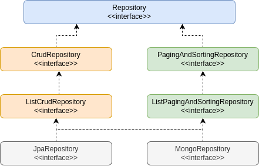

### Intro to Spring Data JPA.

* Spring Data JPA is available to Spring Boot applications with the JPA starter. This starter dependency not only brings
  in Spring Data JPA, but also transitively includes Hibernate as the JPA implementation.
* Below is the maven dependency that we need to add to any SpringBoot projects in order to use Spring Data JPA.
    * groupId: `org.springframework.boot`.
    * artifactId: `spring-boot-starter-data-jpa`.
* JPA is just a specification that defines an object-relational mapping (ORM) standard for storing, accessing, and managing
  Java objects in a relational database. Hibernate is the most popular and widely used implementation of JPA specifications.
  By default, Spring Data JPA uses Hibernate as a JPA provider.
* We need to follow the below steps in order to query a DB using Spring Data JPA inside a SpringBoot application.

1. We need to indicate a java POJO class as an entity class by using annotations like `@Entity`, `@Table`, `@Column`.
    ```java
    @Entity
    @Table(name = "contact_msg")
    public class Contact extends BaseEntity {
        @Id
        @GeneratedValue(strategy = GenerationType.AUTO, generator="native")
        @GenericGenerator(name="native", strategy="native")
        @Column(name="contact_id")
        private int contactId;
    }
    ```
2. We need to create interfaces for a given table entity by extending framework provided Repository interfaces. This helps
   us to run the basic CRUD operations on the table without writing method implementations.
    ```java
    @Repository
    public interface ContactRepository extends CrudRepository<Contact, Integer> {}
    ```
3. Enable JPA functionality and scanning by using the annotations `@EnableJpaRepositories` and `@EntityScan`.
    ```java
    @SpringBootApplication
    @EnableJpaRepositories("com.panda.school.repository")
    @EntityScan("com.panda.school.model")
    public class SchoolApplication {}
    ```
4. We can inject repository beans into any controller/service classes and execute the required DB operations.
    ```java
    @Service
    public class ContactService {
        @Autowired
        private ContactRepository contactRepository;
   
        public boolean saveMessageDetails(Contact contact) {
            boolean isSaved = false;
            Contact savedContact = contactRepository.save(contact);
            if (null != savedContact && savedContact.getContactId() > 0) {
                isSaved = true;
            }
            return isSaved;
        }
    }
    ```

#### Derived Query Methods in Spring Data JPA.

* With Spring Data JPA, we can use the method names to derive a query and fetch the results without writing code manually
  like with traditional JDBC.
* As a developer we Just need to define the query methods in a repository interface that extends one of the Spring Data's
  repositories such as CrudRepository. Spring Data JPA will create queries and implementation at runtime automatically by
  parsing these method names.

```java
// find persons by last name
List<Person> findByLastName(String lastName);
```

```java
// find person by email
Person findByEmail(String email);
```

```java
// find person by email and last name
Person findByEmailAndLastname(String email, String lastname);
```

**Tip.**

Derived query method names has two main components separated by the first `By` keyword.
1. The `introducer` clause like `find`, `read`, `query`, `count`, or `get` which tells Spring Data JPA what you want to
   do with the method. This clause can contain further expressions, such as `Distinct` to set a distinct flag on the query
   to be created.
2. The `criteria` clause that starts after the first By keyword. The first By acts as a delimiter to indicate the start of
   the actual query criteria. The criteria clause is where you define conditions on entity properties and concatenate them
   with `And` and `Or` keywords.
   Using `readBy`, `getBy`, and `queryBy` in place of `findBy` will behave the same. For example, `readByEmail(String email)`
   is the same as `findByEmail(String email)`.

Spring Data JPA is a powerful tool that provides an extra layer of abstraction on top of an existing JPA providers like
Hibernate. The derived query feature is one of the most loved features of Spring Data JPA.

### Auditing Support By Spring Data JPA.

* Spring Data provides sophisticated support to transparently keep track of who created or changed an entity and when the
  change happened. To benefit from that functionality, you have to equip your entity classes with auditing metadata can be
  defined either using annotations or by implementing an interfaces.
* Additionally, auditing has to be enabled either through Annotation configuration or XML configuration to register the
  required infrastructure components.
* Below are the steps that needs to be followed.

1. We need to use the annotations to indicate the audit related columns inside DB tables. Spring Data JPA ships with an
   entity listener that can be used to trigger the capturing of auditing information. We must register the AuditingEntityListener
   to be used for all the required entities.
    ```java
    @Data
    @MappedSuperclass
    @EntityListener(AuditingEntityListener.class)
    public class BaseEntity {
        @CreatedBy
        @Column(updatable = false)
        private LocalDateTime createdAt;
   
        @CreatedBy
        @Column(updatable = false)
        private String createdBy;
   
        @LastModifiedDate
        @Column(insertable = false)
        private LocalDateTime updatedAt;
   
        @LastModifiedBy
        @Column(insertable = false)
        private String updatedBy;
    }
    ```
   `@CreatedDate`, `@CreatedBy`, `@LastModifiedDate`, `@LastModifiedBy` are the key annotations that support JPA auditing.
2. Date related info will be fetched from the server by JPA but for CreatedBy & UpdatedBy we need to let JPA know how to
   fetch that info by implementing `AuditorAware` interface like shown below.
    ```java
    @Component("auditAwareImpl")
    public class AuditAwareImpl implements AuditorAware<String> {
        @Override
        public Optional<String> getCurrentAuditor() {
            return Optional.ofNullable(SecurityContextHolder.getContext().getAythentication().getName());
        }
    }
    ```
3. Enable JPA auditing by annotating a configuration class with the `@EnableJpaAuditing` annotation.
    ```java
    @SpringBootApplication
    @EnableJpaRepositories("com.panda.school.repository")
    @EntityScan("com.panda.school.model")
    @EnableJpaAuditing(auditorAwareRef = "auditAwareImpl")
    public class SchoolApplication {}
    ```

**Tip.**

We can print the queries that are being formed and executed by Spring Data JPA by enabling the below properties.
`spring.jpa.show-sql=true`, `spring.jpa.properties.hibernate.format_sql=true`.
`show-sql` property will print the query on the console/logs whereas format_sql property will print the queries in a
readable friendly style. Make sure to leverage them in non-prod environments only as they impact the performance of the
web application.

### Spring MVC Custom Validations.

We have seen before using Bean validations like Max, Min, Size etc. we can do validations on the input received. Now let's
try to define custom validations that are specific to our business requirements.

1. Suppose if we have a requirement to not allow some weak password inside our registration form, we first need to create
   a custom annotation like below. Here we need to provide the class name where the actual validation logic is present.
    ```java
    @Documented
    @Constraint(validatedBy = PasswordStrategyValidator.class)
    @Target({ ElementType.METHOD, ElementType.FIELD })
    @Retention(RetentionPolicy.RUNTIME)
    public @inteface PasswordValidator {
        String message() default "Please choose a strong password";
        Class<?>[] groups() default {};
        Class<? extends Payload>[] payload() default {};
    }
    ```
2. We need to create a class that implements `ConstraintValidator` interface and overriding the isValid() method.
    ```java
    public class PasswordStrengthValidator implements ConstraintValidator<PasswordValidator, String> {
        List<String> weakPasswords;
   
        @Override
        public void initialize(PasswordValidator passwordValidator) {
            weakPasswords = Arrays.asList("123", "password", "qwerty");
        }    
   
        @Override
        public boolean isValid(String passwordField, ConstraintValidatorContext ctx) {
            return passwordField != null && (!weakPasswords.contains(passwordField));
        }    
    }
    ```
3. Finally, we can mention the annotation that we created on top of the field inside a POJO class.
    ```java
    @NotBlank(message = "Password must not be blank")
    @Size(min = 5, message = "Password must be at least 5 characters long")
    @PasswordValidator
    private String pwd;
    ```

### One-to-One Relationship inside the JPA.

* What is a one-to-one relationship? It's a relationship where a record in one entity (table) is associated with exactly
  one record in another entity (table).
* Below are few real-life examples of one-to-one relationships.
    * User to Email.
    * User to Address.
    * Spouse to Spouse.
    * Country to Capital.
* Spring Data JPA allow developers to build one-to-one relationship between the entities with simple configurations.
  For example if we want to build a one-to-one between Person and Address entities, then we can configure like below.
    ```java
    @Data
    @Entity
    public class Person {
        @OneToOne(fetch = FetchType.EAGER, cascade = CascadeType.ALL, targetEntity = Address.class)
        @JoinColumn(name = "address_id", referencedColumnName = "addressId", nullable = true)
        private Address address;
    }
    ```
* In Spring Data JPA, a one-to-one relationship between two entities is declared by using the `@OneToOne` annotation. Using
  it we can configure `FetchType`, `cascade` effects, `targetEntity`.
* The `@JoinColumn` annotation is used to specify the foreign key column relationship details between the 2 entities.
  "name" defined the name of the foreign key column, `referencedColumnName` indicates the field name inside the target
  entity class, `nullable` defined whether foreign key column can be nullable or not.

### JPA Fetch.

Based on the fetch configurations that developer has done, JPA allows entities to load the objects with which they have
a relationship.

We can declare to fetch value in the `@OneToOne`, `@OneToMany`, `@ManyToOne` and `@ManyToMany` annotations. These annotations
have an attribute called fetch that serves to indicate the type of fetch we want to perform. It has two valid values:
FetchType.EAGER and FetchType.LAZY.

With LAZY configuration, we are telling JPA that we want to lazily load the relation entities, so when retrieving an entity,
its relations will not be loaded until unless we try to refer the related entity using getter method. On the contrary,
with EAGER it will load its relation entities as well.

By default, all ToMany relationships are LAZY, while ToOne relationships are EAGER.

### Cascade Types.

**Intro to Cascade.**

* JPA allows us to propagate entity state changes from Parents to Child entities. This concept is calling Cascading in JPA.
* The cascade configuration option accepts an array of CascadeTypes.

**Cascade Types.**

* The cascade types supported by JPA are as below:
    * `CascadeType.PERSIST`.
    * `CascadeType.MERGE`.
    * `CascadeType.REFRESH`.
    * `CascadeType.REMOVE`.
    * `CascadeType.DETACH`.
    * `CascadeType.ALL`.

**Best Practices.**

* Cascading makes sense only for Parent - Child associations (where the Parent entity state transition being cascaded
  to its Child entities). Cascading from Child to Parent is not very useful and recommended.
* There is no default cascade type in JPA. By default, no operation is cascaded.

1. `CascadeType.PERSIST`: means that `save()` or `persist()` operations cascade to related entities.
2. `CascadeType.MERGE`: means that related entities are merged when the owning entity is merged.
3. `CascadeType.REFRESH`: means the child entity also gets reloaded from the database whenever the parent entity is refreshed.
4. `CascadeType.REMOVE`: means propagates remove operation from parent to child entity.
5. `CascadeType.DETACH`: means detach all child entities if a "manual detach" occurs for parent.
6. `CascadeType.ALL`: is shorthand for all of the above cascade operations.

### Spring Security AuthenticationProvider.

* As of now we are planning to log in operation using the inMemoryAuthentication. But the idle way is to perform login check
  against a DB table or any other storage system which is more secure.
* Spring Security allow us to write our own custom logic to authenticate a user based on our requirements
  by implementing AuthenticationProvider interface. Below is the sample implementation.
```java
@Component
public class SchoolUsernamePwdAuthenticationProvider implements AuthenticationProvider {
    @Override
    public Authentication authenticate(Authentication authentication) throws AuthenticationException {
        String name = authentication.getName();
        String password = authentication.getCredentials().toString();
        if (authUser()) {
            return new UsernamePasswordAuthenticationToken(name, password, new ArrayList<>());
        } else {
            return null;
        }
    }
    
    @Override
    public boolean supports(Class<?> authentication) {
        return authentication.equals(UsernamePasswordAuthenticationToken.class);
    }
}
```

### How Passwords Validated without PasswordEncoder.

Storing the credentials in plain text inside a storage systems like Database has Integrity and Confidentiality issues.
So this is not recommended for PROD applications.

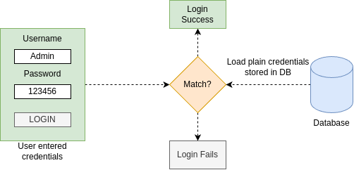

#### Different ways of password management.

**Encoding.**

* Encoding is defined as the process of converting data from one form to another and has nothing to do with cryptography.
* It involves no secret and completely reversible.
* Encoding can't be used for securing data. Below are the various publicly available algorithms used for encoding.
  Ex. ASCII, BASE64, UNICODE.

**Encryption.**

* Encryption is defined as the process of transforming data in such a way that guarantees confidentiality.
* To achieve confidentiality, encryption requires the use of a secret which, in cryptographic terms, we call a "key".
* Encryption can be reversible by using decryption with the help of the "key". As long as the "key" is confidential,
  encryption can be considered as secured.

**Hashing.**

* In hashing, data is converted to the hash value using come hash function.
* Data once hashed in non-reversible. One cannot determine the original data from a hash value generated.
* Given some arbitrary data along with the output of a hashing algorithm, one can verify whether this data matches the
  original input data without needing to see the original data.

**Tip.**

Spring Security provides various PasswordEncoders to help developers with hashing of the secured data like password.
Different Implementations of PasswordEncoders provided by Spring Security:
* `NoOpPasswordEncoder` (No hashing stored in plain text).
* `StandardPasswordEncoder`.
* `Pbkdf2PasswordEncoder`.
* `BCryptPasswordEncoder` (Most Commonly used).
* `SCryptPasswordEncoder`.

Managing the passwords with Hashing is the recommended approach for PROD web application. With `PasswordEncoders` like
`BCryptPasswordEncoder`, Spring Security makes our life easy.


**Tip.**

We can disable the javax bean validators by the Spring Data JPA using the below property:
`spring.jpa.properties.javax.persistence.validation.mode=none`.

### One-to-Many & Many-to-One Relationship inside JPA.

* A one-to-one relationship refers to the relationship between two entities/tables A and B in which one element/row of A
  may only be linked to many elements/rows of B, but a member of B is linked to only one element/row of A.
* The opposite of one-to-many is many-to-one.
* Few real-life examples off one-to-many and many-to-one relationships.
    * Class one to many Students, Students many to one Class.
    * Book one to many Pages, Pages many to one Book.
* Spring Data JPA allows developers to build one-to-many & many-to-one relationships between the entities with simple
  configurations. Below are the sample configurations between Class and Person.
```java
@Entity
public class Person extends BaseEntity {
    @MantToOne(fetch = FetchType.LAZY, optional = true)
    @JoinColumn(name = "class_id", referencedColumnName = "classId", nullable = true)
    private SchoolClass schoolClass;
}
```
* The `@ManyToOne` annotation is used to define a many-to-one relationship between two entities. The child entity, that
  has yje join column, is called the owner of the relationship.
* The `@JoinColumn` annotation is used to specify the foreign key column details.
* A one-to-many relationship between two entities is defined by the `@OneToMany` annotation. It also declares the `mappedBy`
  element to indicate the entity that owns the bidirectional relationship. Usually, the child entity is one that owns the
  relationship and the parent entity contains the `@OneToMany` annotation.
```java
@Entity
@Table(name = "class")
public class SchoolClass extends BaseEntity {
    @OneToMany(mappedBy = "schoolClass", fetch = FatchType.LAZY, 
            cascade = CascadeType.PERSIST, targetEntity = Person.class)
    private Set<Person> persons;
}
```

### Many-to-Many inside JPA.

* A many-to-many relationship refers to the relationship between two entities/tables A and B in which one element/row of
  A are associated with many elements/rows of B and vice versa.
* Below are few real-life examples of many-to-many relationship.
    * Courses many to many Students.
    * Orders many to many Products.
* Spring Data JPA allows developers to build many-to-many relationship between the entities with simple configurations.
  Below are the simple configurations between Courses and Persons.
```java
@Entity
public class Person extends BaseEntity {
    @ManyToMany(fetch = FetchType.EAGER, cascade = CascadeType.PERSIST)
    @JoinTable(name = "person_courses",
            joinColumns = {@JoinColumn(name = "person_id", referencedColumnName = "personId")},
            inverseJoinColumn = {@JoinColumn(name = "course_id", referencedColumnName = "courseId")})
    private Set<Courses> courses = new HashSet<>();
}
```
* A many-to-many relationship between two entities is defined by using the `@ManyToMany` annotation.
* The `@JoinTable` annotation defines the join table between two entities.
* In a bidirectional relationship of `@ManyToMany`, only one entity can own the relationship. Here we choose Courses as the
  owning entity. We usually mention `mappedBy` parameter on the owning entity.
```java
@Entity
public class Courses extends BaseEntity {
    @ManyToMany(mappedBy = "courses", fetch = FetchType.EAGER, cascade = CascadeType.PERSIST)
    private Set<Person> persons = new HashSet<>();
}
```
* Why do we really need a third table in Many-to-Many relationship? Let's assume we have below tables and records which has
  many-to-many relationship between them.
* If we need to represent multiple courses that a same student enrolled, the best way is to maintain a middle third table
  like shown below. Otherwise, we need to maintain a lot of duplicate rows inside Person table.


### Sorting with Spring Data JPA.

**Introduction.**

* Spring Data JPA supports Sorting to Query results with easier configurations.
* Spring Data JPA provides default implementations of Sorting with the help of PagingAndSortingRepository interface.
* There are two ways to achieve Sorting in Spring Data JPA:
    * Static Sorting.
    * Dynamic Sorting.

**Static Sorting.**

* Static sorting refers to the mechanism where the retrieved data is always sorted by specified columns and directions.
  The columns and sort directions are defined at the development time and cannot be changed at runtime.
* Below is an example of Static Sorting, `List<Person> findByOrderByNameDesc();`.

**Dynamic Sorting.**

* By using dynamic sorting, you can choose the sorting column and direction at runtime to sort the query results.
* Dynamic sorting provides more flexibility in choosing sort columns and directions with the help of `Sort` parameter to
  your query method. The Sort class is just a specification that provides sorting options for database queries.
```java
Sort sort = Sort.by("name").descreasing().and(Sort.by("age"));
```

### Pagination with Spring Data JPA.

* Spring Data JPA supports Pagination which helps easy to manage & display large amount of data in various pages inside
  web applications.
* Just like the special Sort parameter, we have for the dynamic sorting, Spring Data JPA supports another special parameter
  called `Pageable` for paginating the query results.
* We can combine both pagination and dynamic sorting with the help of Pageable.

**Dynamic Sorting.**

* Whenever we want to apply pagination to query results, all we need to do is just add Pageable parameter to the query method
  definition and set the return by `Page<T>` like below.
```java
Pageable pageable = PageRequest.of(0, 5, Sort.by("name").descending());

Page<Person> findByName(String name, Pageable pageable);
```

### Custom Queries with JPA.

* Derived queries are good as long as they are not complex. As the number of query parameters goes beyond 3 to 4, you need
  a more flexible strategy.
* For such complicated or custom scenarios, Spring Data JPA allow developers to write their own queries with the help of
  annotations: `@Query`, `@NamedQuery`, `@NamedNativeQuery`.

**@Query Annotation.**

* The `@Query` annotation defines queries directly on repository methods. This gives you full flexibility to run any query
  without following the method naming convention.
* With the help of `@Query` annotation we can write queries in the form of JPQL or Native SQL query.
* When ever we are writing a native SQL query then we need to mention `nativeQuery = true` inside `@Query` annotation.

**Named Queries.**

* For bigger applications where they may have 1000s of queries scatted across the application, it would make sense for
  them to maintain all these queries in a single place logically by using annotations, properties and XML files.
* We can create names queries easily with the below annotations on top of an entity class.
  `@NamedQuery` - Used to define a JPQL named query. `@NamedNativeQuery` - Used to define a native SQL named query.

### JPQL.

* The Java Persistence Query Language (JPQL) is a platform-independent object-oriented query language defined as part of
  the Java Persistence API (JPA) specification.
* JPQL is used to make queries against entities stored in a relational database. It is heavily inspired by SQL, and its
  queries resemble SQL queries in syntax, but operate against JPA entity objects rather than directly with database tables.
* The only drawback of using JPQL is that it supports a subset of the SQL commands. So, it may not be a great choice
  for complex queries.

**JPQL Example.**

* Below is an example of JPQL. You can observe we are using the entity names and field present inside it instead of using
  table and column names.
```java
@Query("SELECT c FROM Contact c WHERE c.contactId = ?1 ORDER BY c.createdAt DESC")
List<Contact> findByIdOrderByCreateDesc(long id);
```

**Sorting Examples.**

* Static Sorting using derived query from method name.
```java
List<Person> findByNameOrderByAgeDesc(String name);
```
* Static Sorting using `@Query` annotation with JPQL.
```java
@Query("SELECT p FROM person p WHERE p.age > ?1 ORDER BY p.name DESC")
List<Person> findByAgeGreaterThanJPQL(int age);
```
* Static Sorting using `@Query` annotation with native query.
```java
@Query(value = "SELECT * FROM person p WHERE p.name = :givenName ORDER BY p.age ASC", nativeQuery = true)
List<Person> findByGivenNameNativeSQL(@Param("givenName") String givenName);
```
* Static Sorting using NamedQuery & NamedNativeQuery annotations.
```java
@NamedQuery(name = "Person.findByAgeGreaterThanNamedJPQL", 
    query = "SELECT p FROM Person p WHERE p.age > :age ORDER BY p.name ASC")
@NamedNativeQuery(name = "Person.findAllNamedNativeSQL",
    query = "SELECT * FROM person p ORDER BY p.age DESC")
@Entity
public class Person extends BaseEntity {}
```
* Dynamic Sorting using Sort parameter. The Sort parameter can be passed with `@Query`, `@NamedQuery` annotations.
  Sort fields can be added dynamically as well based on the request params from the UI/API.
```java
Sort sort = Sort.by("name").descending().and(Sort.by("age"));
List<Person> persons = personRepository.findByName("John", sort);
```
Spring Data JPA does not support dynamic sorting for native SQL queries, as it would require the updating of the actual SQL
query defined, which cannot be done correctly by the Spring Data JPA.

**Pagination Examples.**

* Below is an example where we are telling to JPA to fetch the first page by considering the total page size as 5.
```java
Pageable pageable = PageRequest.of(0, 5);
Page<Contact> msgPage = contactRepository.findByStatus("Open", pageable);
```
* Below is an example where we are applying both pagination & sorting dynamically based on the input received.
```java
public Page<Contact> findMsgsWithOpenStatus(int pageNum, String sortField, String sortDir) {
    int pageSize = 5;
    Pageable pageable = PageRequest.of(pageNum - 1, pageSize, 
            sortDir.equals("asc") ? Sort.by(sortField).ascending()
                    : Sort.by(sortField).descending());
    Page<Contact> msgPage = contactRepository.findByStatus("Open", pageable);
    return msgPage;
}
```
Dynamic sorting is not supported by named queries. So while using Pagination along with Named Queries, make sure that
Pageable interface does not contain a Sort object.

**@Query Examples.**

* @Query example with positional parameters.
```java
// Positional parameters
@Query("SELECT c FROM Contact c WHERE c.status = ?1 AND c.name = ?2 ORDER BY c.createdAt DESC")
List<Contact> findByGivenQueryOrderByCreatedDesc(String status, String name);
```
* @Query example with named parameters.
```java
// named parameters
@Query("SELECT c FROM Contact c WHERE c.status = :status AND c.name = :name ORDER BY c.createdAt DESC")
List<Contact> findByGivenQueryOrderByCreatedDesc(@Param("status") String status, @Param("name") String name);
```
* Using @Query, we can also run UPDATE, DELETE, INSERT as well.
```java
@Transactional
@Modifying
@Query("UPDATE Contact c SET c.status = ?1 WHERE c.contactId = ?2")
int updateStatusById(String status, int id);
```

Whenever we are using queries that change the state of the database, they should be treated differently. We need to
explicitly tell Spring Data JPA that our custom query changes the data by annotating the repository method with an
additional `@Modifying` annotation. It will then execute the custom query as an upstream operation.

On whichever method/class we declare `@Transactional` the boundary of transaction starts and boundary ends when method
execution completes. Let's say you are updating entity1 and entity2. Now while saving entity2 an exception occur, then as
entity1 comes in sane transaction so entity1 will be rollback with entity2. Any exception will result in rollback of all
JPA transactions with DB.

**@NamedQuery & @NamedNativeQuery Examples.**

`@NamedQuery` example declared on top of the entity class.
```java
@Entity
@NamedQuery(name = "Contact.findOpenMsgs", query = "SELECT c FROM Contact c WHERE c.status = :status")
public class Contact extends BaseEntity {}
```

`@NamedNativeQuery` example declared on top of the entity class.
```java
@Entity
@NamedNativeQuery(name = "Contact.findOpenMsgsNative",
    query = "SELECT * FROM contact_msg c WHERE c.status = :status", resultClass = Contact.class)
public class Contact extends BaseEntity {}
```

For `@NamedQuery` as long as the method name inside Repository class matches with the name of the query we should be good.
Whereas for `@NamedNativeQuery` apart from query name & method name match, we should also mention `@Query(native = true)`
on top of the Repository method.

**Tip.**

We can create multiple named queries and named native queries using the annotations `@NamedQueries` and `@NamedNativeQueries`.
```java
@NamedQueries({
        @NamedQuery(name = "one", query = "?"),
        @NamedQuery(name = "two", query = "?")
})
// ...

@NamedNativeQueries({
        @NamedNativeQuery(name = "one", query = "?", resultClass = "?"),
        @NamedNativeQuery(name = "two", query = "?", resultClass = "?")
})
// ...
```

## Implementing REST Services.

* REST (Representational state transfer) services are one of the most often encountered ways to implement communication
  between two web apps. REST offers access to functionality the server exposes through endpoints a client can call.
* Below are the different use cases where REST services are being used most frequently.
    * Mobile App - Communication using REST - Backend Server.
    * Backend Server 1 - Communication using REST - Backend Server 2.
    * Web App build using Angular, React JS etc. - Communication using REST - Backend Server.

### Implementing REST Services.

Below is the sample code implementing Rest Service using Spring MVC style but only with the addition of `@ResponseBody`
annotation. The `@ResponseBody` annotation tells the dispatcher servlet that the controller's action will not return a
view but the data send directly in the HTTP response.

```java
@Controller
public class ContactRestController {
    @Autowired
    ContactRespsitory contactRespsitory;
    
    @GetMapping("/getMessagesByStatus")
    @ResponseBody
    public List<String> getMessagesByStatus(@RequestParam(name = "status") String status) {
        return contactRespsitory.findByStatus(status);
    }
}
```


# Spring Core

# Spring Core

## Dependencies

```java
@Component
public class HomeController {
    @Autowired
    HomeBusinessService homeBusinessService;
}
```

:arrow_down:

```java
@Component
public class HomeBusinessService {
    @Autowired
    HomeDataService homeDataService;
}
```

:arrow_down:

```java
@Component
public class HomeDataService {
    @Autowired
    JdbcTemplate template;
}
```

## Autowiring

**By name**

```java
@Component
public class SortServiceImpl {
    @Autowired
    private SortAlgorithm bubbleSortAlgorithm;
}
```

**By `@Primary` higher priority than by name**

```java
@Component
@Primary
public class BubbleSortAlgorithm implements SortAlgorithm {
}
```

**`@Qualifier` (highest priority)**

- Hint to Spring which bean we want.

```java
@Component
@Qualifier("quick")
public class QuickSortAlgorithm implements SortAlgorithm {
}
```

**use**

```java
public class SortServiceImpl {
    @Autowired
    @Qualifier("quick")
    private SortAlgorithm sortAlgorithm;
}
```

***

## Scope of Beans

- Bean Scopes default Singleton:
    - Singleton: One instance per Spring Context.
    - Prototype: A new bean whenever requested.
    - Request: One bean per HTTP request.
    - Session: One instance per HTTP session.

### Singleton

```java
public static void main(String[] args) {
    // ...
    ApplicationContext applicationContext =
        SpringApplication.run(SpringIn5StepsBasicApplication.class, args);

    BinarySearchImpl binarySearch = applicationContext.getBean(BinarySearchImpl.class);
    BinarySearchImpl binarySearch1 = applicationContext.getBean(BinarySearchImpl.class);

    // The same output
    System.out.println(binarySearch);
    System.out.println(binarySearch1);
}
```

```java
@Component
@Scope(ConfigurableBeanFactory.SCOPE_SINGLETON)
public class BinarySearchImpl {
    // ...
}
```

### Prototype

```java
@Component
@Scope(ConfigurableBeanFactory.SCOPE_PROTOTYPE)
public class BinarySearchImpl {
```

```java
@Component
@Scope(value = ConfigurableBeanFactory.SCOPE_PROTOTYPE,
       proxyMode = ScopedProxyMode.TARGET_CLASS)
public class JdbcConne {
}
```

### :star: Singleton vs GOF singleton

- GOF singleton: One singleton per JVM.
- Spring singleton: One singleton per ApplicationContext.

### Component Scan

```java
@SpringBootApplication
@ComponentScan("com.spring.basics.web")
public class Application {
}
```

### The lifecycle of a bean

- As soon as bean created post construct will be called.
- Initialize content of bean `@PostConstruct`.

```java
@RestController
@RequestMapping("/api")
public class StudentController {
    private List<Student> theStudents;

    @PostConstruct
    public void loadData() {
        theStudents.add(new Student("Samara", "Brajan"));
        theStudents.add(new Student("Mikey", "Rebeca"));
        theStudents.add(new Student("Misiek", "Brajan"));
    }
}
```

- `@PreDestroy:` Called just before bean removed.

## CDI

- JavaEE Dependency Injection Standard (JRS-330):
    - `@Inject` - `@Autowired`
    - `@Named` - `@Component` & `@Qualifier`
    - `@Singleton`

**SomeCDIBusiness.java**

```java
// @Component
@Named
public class SomeCDIBusiness {
    //@Autowired
    @Inject
    private SomeCdiDao someCdiDao;

    public SomeCdiDao getSomeCdiDao() {
        return someCdiDao;
    }

    public void setSomeCdiDao(SomeCdiDao someCDIDAO) {
        this.someCdiDao = someCDIDAO;
    }
}
```

**SomeCdiDao.java**

```java
//@Component
@Named
public class SomeCdiDao {
}
```

## Spring Configuration

**pom.xml**

```xml
<dependency>
    <groupId>org.springframework</groupId>
	<artifactId>spring-core</artifactId>
</dependency>

<dependency>
	<groupId>org.springframework</groupId>
	<artifactId>spring-context</artifactId>
</dependency>
```

```java
// Spring Boot, Spring,
//@SpringBootApplication
@Configuration
@ComponentScan("com.panda.spring.basics")
public class BasicApplication {
    // ...
    AnnotationConfigApplicationContext applicationContext =
        new AnnotationConfigApplicationContext(BasicApplication.class);
    // ...
    applicationContext.close();

    // Or use try with resources to close application context
    /*
    try (AnnotationConfigApplicationContext applicationContext =
        new AnnotationConfigApplicationContext(BasicApplication.class)) {
        // ...
    }
    */
}
```

### Application Context using xml

```xml
<context:component-scan base-package="com.mybank.spring.basics"></context:component-scan>

<bean id="xmlJdbcConnection"
    class="com.mybank.spring.basics.xml.XmlJdbcConnection">
</bean>

<bean id="xmlPersonDAO" class="com.mybank.spring.basics.xml.XmlPersonDAO">
    <property name="xmlJdbcConnection" ref="xmlJdbcConnection"></property>
</bean>
```

```java
// ...
try (ClassPathXmlApplicationContext applicationContext =
    new ClassPathXmlApplicationContext("applicationContext.xml")) {
    // ...
}
// ...
```

### Wrap up IOC, Application Context and BeanFactory

- IOC Container:
    - Manage beans.
    - Create an instance of `WelcomeService`.
    - Create beans for `WelcomeController`.
    - Autowire `WelcomeService` bean into the `WelcomeController`.
    - Wiring, creation of beans.
- Application Context - Implementation of IOC.
- Bean Factory - Implementation of IOC.
- ApplicationContext = **`Bean Factory ++`**
    - Spring AOP features.
    - `I18n` capabilities.
    - `WebApplicationContext` for web app.

### Without Spring

```java
@RestController
public class WelcomeController {
  private WelcomeService service = new WelcomeService();

  @RequestMapping("/welcome")
  public String welcome() {
      return service.retrieveMsg();
  }
}
```

### With Spring

```java
@Component
public class WelcomeService {}

@RestController
public class WelcomeController {
    @Autowired
    private WelcomeService service;

    @RequestMapping("/welcome")
    public String welcome() {
        return service.retrieveMsg();
    }
}
```

### Component Annotations

- `@Component:` Generic component.
- `@Repository:` Encapsulating storage, retrieval, typical for relational databases.
- `@Service:` Business service facade.
- `@Controller:` Controller in MVC design pattern.

```
Classify components to different categories. 
Apply different logic for each category.
```

### Read from properties file

**app.properties**

```properties
external.service.url = http://server.com/service
```

**ExternalService.java**

```java
@Component
public class ExternalService {
    // from property file
    @Value("${external.service.url}")
    private String url;

    public String getUrl() {
        return url;
    }
}
```

**PropertiesApplication.java**

```java
@Configuration
@ComponentScan("com.panda.spring.properties")
@PropertySource("classpath:app.properties")
public class PropertiesApplication {

	private static Logger LOGGER = LoggerFactory.getLogger(PropertiesApplication.class);

	public static void main(String[] args) {

		try (AnnotationConfigApplicationContext applicationContext =
		    new AnnotationConfigApplicationContext(PropertiesApplication.class)) {

			SomeExternalService service = applicationContext
			    .getBean(SomeExternalSerivce.class);
			LOGGER.info(" ===> {}", service.returnServiceURL());
		}
	}
}
```

```java
@Component
@ConfigurationProperties("limits-service")
public class Configuration {

    private int minimum;
    private int maximum;

    public int getMinimum() {
        return minimum;
    }

    public void setMinimum(int minimum) {
        this.minimum = minimum;
    }

    public int getMaximum() {
        return maximum;
    }

    public void setMaximum(int maximum) {
        this.maximum = maximum;
    }
}
```

```properties
spring.application.name=limits-service
```

- Use.

```java
@RestController
public class LimitsConfigurationController {

    @Autowired
    private Configuration configuration;

    @GetMapping("/limits")
    public LimitConfiguration retrieveLimitsFromConfigurations() {
        return new LimitConfiguration(configuration.getMaximum(),configuration.getMinimum());
    }
}
```

## Spring Boot Auto Configuration

- :star: `@SpringBootApplication`:
    - `@SpringContext`
    - `@AutoConfiguration`
    - `@ComponentScan`
- Spring boot looks at:
    - Frameworks available on **CLASSPATH**.
    - An existing configuration for the application based on these.
- Spring boot provides a basic configuration needed to configure the application with framework.
- This is called **AutoConfiguration**.

***

## Spring Boot, Spring, Spring MVC

### Spring Framework

- A most important feature of Spring Framework is Dependency Injection.
- At the core all Spring Modules is Dependency Injection or IOC Inversion of Control.
- Reduce duplication, plumbing code.
- Integration with other framework.

### Spring MVC

- Spring MVC framework provides decoupled way of developing web applications.
- With simple concepts like `DispatcherServlet`, `ModelAndView` and `ViewResolver`, it makes it easy to develop
  web applications.

### Spring boot

**pom.xml**

```xml
<dependency>
    <groupId>org.springframework.boot</groupId>
    <artifactId>spring-boot-starter-actuator</artifactId> <!-- monitor application health -->
</dependency>
<dependency>
    <groupId>org.springframework.boot</groupId>
    <artifactId>spring-boot-devtools</artifactId> <!-- Restart quickly -->
</dependency>
<dependency>
    <groupId>org.springframework.data</groupId>
    <artifactId>spring-data-rest-hal-browser</artifactId>
</dependency>
```

### AOP

**`@Before`**

```java
package com.panda.spring.aop.business;

import com.panda.spring.aop.data.DaoRepo;
import org.springframework.beans.factory.annotation.Autowired;
import org.springframework.stereotype.Service;

@Service
public class Business1 {

    @Autowired
    private DaoRepo daoRepo;

    public String calculate() {
        return daoRepo.retrieveMessage();
    }
}
```

```java
@Repository
public class DaoRepo {
    public String retrieveMessage() {
        return "DaoRepo";
    }
}
```

```java
@Aspect
@Configuration
public class BeforeAspect {

    org.slf4j.Logger logger = LoggerFactory.getLogger(this.getClass());

    @Before("execution(* com.panda.spring.aop.business.*.*(..))")
    public void before(JoinPoint joinPoint) {
        // Advice : do this
        logger.info("Validation before method call");
        logger.info("Intercepted method call - {}", joinPoint);
    }
}
```

**Join Point (pointcut)**

- `execution(* com.mybank.spring.aop.business.*.*(..)):` Expression which defines what kind of methods want to intercept.

**Advice**

```java
logger.info("Validation before method call");
logger.info("Intercepted method call - {}", joinPoint);
```

- What should I do when I do interception.

**Aspect**

- Combination of **Pointcut** and **Advice**.

**JoinPoint**

- Specific interception of method call.
- Specific execution instance.
- If called 100 method calls they will be 100 joinPoints.
- Process where this whole thing gets executed is called:
    - **Weaving:** Process of implementing AOP around your method calls.
    - **Weaver:** Framework which implements Weaving.

**`@After`**

- `@After` = `@AfterReturning` + `@AfterThrowing`

```java
// When succeed. Intercept return value
@AfterReturning(
        value = "execution(* com.mybank.spring.aop.business.*.*(..))",
        returning = "result")
public void afterReturning(JoinPoint joinPoint, Object result) {
    logger.info("{} returned with value {}", joinPoint, result);
}

// When failed. Intercept any thrown exception
@AfterThrowing(
        value = "execution(* com.mybank.spring.aop.business.*.*(..))",
        throwing = "exception")
public void afterThrowing(JoinPoint joinPoint, Object exception) {
    logger.info("{} throw exception {}", joinPoint, exception);
}
```

**`@Around`**

```java
@Around("execution(* com.mybank.spring.aop.business.*.*(..))")
public void around(ProceedingJoinPoint joinPoint) throws Throwable {
    long startTime = System.currentTimeMillis();
    joinPoint.proceed();
    long entTime = System.currentTimeMillis() - startTime;
    logger.info("Time taken by this {} is {}", joinPoint, entTime);
}
```

**Best practices**

```java
public class CommonJoinpointConfig {
    @Pointcut("execution(* com.mybank.spring.aop.business.*.*(..))")
    public void dataLayer() {}
}

// Before
@Before("com.mybank.spring.aop.aspect.CommonJoinpointConfig.dataLayer()")
public void before(JoinPoint joinPoint) {
```

### :star: Create annotation

```java
@Target(ElementType.METHOD)
@Retention(RetentionPolicy.RUNTIME)
public @interface Stopper {
}
```

```java
@Repository
public class DaoRepo {

    @Stopper
    public String retrieve() {
        return "DaoRepo";
    }
}
```

```java
public class CommonJoinpoint {
    @Pointcut("@annotation(com.mybank.spring.aop.aspect.Stopper)")
    public void stopper() {
    }
}
```

```java
@Aspect
@Configuration
public class AroundAspect {

    org.slf4j.Logger logger = LoggerFactory.getLogger(this.getClass());

    @Around("com.mybank.spring.aop.aspect.CommonJoinpoint.stopper()")
    public void around(ProceedingJoinPoint joinPoint) throws Throwable {
        long startTime = System.currentTimeMillis();
        joinPoint.proceed();
        long endTime = System.currentTimeMillis() - startTime;
        logger.info("Time taken by this {} is {}", joinPoint, endTime);
    }

}
```

## Spring Boot AutoConfiguration

- Some examples loaded by app context for us.

```
   DataSourceAutoConfiguration.EmbeddedDatabaseConfiguration:
      Did not match:
         - EmbeddedDataSource found supported pooled data source (DataSourceAutoConfiguration.EmbeddedDatabaseCondition)

   DataSourceTransactionManagerAutoConfiguration.DataSourceTransactionManagerConfiguration#transactionManager:
      Did not match:
         - @ConditionalOnMissingBean (types: org.springframework.transaction.PlatformTransactionManager; SearchStrategy: all) found beans of type 'org.springframework.transaction.PlatformTransactionManager' transactionManager (OnBeanCondition)

   H2ConsoleAutoConfiguration matched:
      - @ConditionalOnClass found required class 'org.h2.server.web.WebServlet'; @ConditionalOnMissingClass did not find unwanted class (OnClassCondition)
      - found ConfigurableWebEnvironment (OnWebApplicationCondition)
      - @ConditionalOnProperty (spring.h2.console.enabled=true) matched (OnPropertyCondition)
```

***

## JPA

**Person.java**

```java
@Entity
@Table(name="person")
@NamedQuery(name="find_all", query = "select p from Person p")
public class Person {
    @Id
    @GeneratedValue(strategy = GenerationType.AUTO)
    private int id;

    @Column(name = "name")
    private String name;

    @Column(name = "location")
    private String location;
}
```

**PersonRepository.java**

```java
@Repository
@Transactional
public class PersonRepository {

    @PersistenceContext
    EntityManager entityManager;

    public List<Person> findAll() {
        TypedQuery<Person> namedQuery = entityManager.createNamedQuery("find_all", Person.class);
        return namedQuery.getResultList();
    }

    public Person findById(int id) {
        return entityManager.find(Person.class, id);
    }

    public Person update(Person person) {
        return entityManager.merge(person);
    }

    public Person insert(Person person) {
        return entityManager.merge(person);
    }

    public void deleteById(int id) {
        Person person = findById(id);
        if (person != null) {
            entityManager.remove(person);
        }
    }
}
```

### Spring Data JPA

**SpringDataRepository.java**

```java
public interface SpringDataRepository extends JpaRepository<Person, Integer> {
}
```

**Use**

```java
repository.findById(12);
repository.save(new Person("Panda", "China", new Date());
repository.findAll();
repository.deleteBYId(12);
```

## Spring MVC

**web.xml**

```xml
<web-app>

    <!-- Front Controller -->
    <servlet>
        <servlet-name>dispatcher</servlet-name>
        <servlet-class>
            org.springframework.web.servlet.DispatcherServlet
        </servlet-class>
        <init-param>
            <param-name>contextConfigLocation</param-name>
            <param-value>/WEB-INF/todo-servlet.xml</param-value>
        </init-param>
        <load-on-startup>1</load-on-startup>
    </servlet>

    <servlet-mapping>
        <servlet-name>dispatcher</servlet-name>
        <url-pattern>/spring-mvc/*</url-pattern>
    </servlet-mapping>
</web-app>
```

**servlet.xml**

```xml
<beans>
    <context:component-scan base-package="com.panda" />
    <mvc:annotation-driven />
    <bean class="org.springframework.web.servlet.view.InternalResourceViewResolver">
        <property name="prefix">
            <value>/WEB-INF/views/</value>
        </property>
        <property name="suffix">
            <value>.jsp</value>
        </property>
    </bean>
</beans>
```


# Spring 5

## SOLID Principles of OOP.

**Why Use the SOLID Principles of OOP?**

- Object Oriented programming is a powerful concept.
- The 5 principles focus on dependency management.
- Poor dependency management leads to code that is hard to change.

**SOLID.**

- Single Responsible Principle:
    - Every class should have a single responsibility.
    - Class should be small.
    - Avoid very big classes, split it into smaller classes.
- Open close principle:
    - Class should be open for extension but closed for modification.
    - You should be able to extend class behavior without modifying it.
    - Use private variables with getters and setters only when you need them.
    - Use abstract base class.
- Liskov substitution principle:
    - Objects in a program would be replaceable with instances of their subtypes WITHOUT altering the correctness
      of the program.
    - Violations will often fail the **Is a** test.
    - A Square **Is a** Rectangle.
    - Rectangle **Is not** a Square.
- Interface Segregation principle:
    - Make a fine-grained interface that are client specific.
    - Keep component focused and minimize dependencies between them.
    - Avoid a super interfaces.
- Dependency Inversion Principle:
    - Abstraction should not depend upon detail.
    - Details should not depend upon abstraction.
    - Important higher level and lower level objects depend on the same abstract interaction.
    - This is not the same as Dependency Injection - which is how object obtain dependent objects.

### Single Responsibility Principle.

- Cohesion is a way to measure how much the code segments within one module (methods of a class, classes inside
  a package) belong together.
- The higher the cohesion  the better, since high cohesion implies easier maintenance and debugging,
  greater code functionality and reusability.
- The term cohesion sometimes contrasted with the concept of coupling, and often, loose coupling of modules
  related to high cohesion.
- Robustness - which could be defined as the ability of a computer system or algorithm to handle mistakes and
  malfunctions.

### Liskov Substitution Principle.

- Any object of some class in an object-oriented program can be replaced by an object of a child class.
- Inheritance - if you have a class Watch, you can inherit from that class to get a class PocketWatch.
- A pocket watch is still a watch, it just has some additional features.
- Another example would be class called Woman with a child class called Mother.
- A mother is still a woman, with the addition of having a child.
- Polymorphism - objects can behave in one way in a certain situation, and in another way in some other situation.
- In object-oriented programming, this is called context-dependent behavior.
- A mother, when taking a walk with her child or attending a school parents meeting, will behave as a mother.
- But when she is out with her friends, at work or simply doing errands, she will behave as a woman.
- States that functions that reference base classes must be able to use objects of derived (child) classes
  without knowing it.

```java
class TransportationDevice {
   String name;
   double speed;
   Engine engine;

   String getName() { ... }
   void setName(String n) { ... }

   double getSpeed() { ... }
   void setSpeed(double d) { ... }

   Engine getEngine() { ... }
   void setEngine(Engine e) { ... }
   void startEngine() { ... }
}

class Car extends TransportationDevice {
   @Override
   void startEngine() { ... }
}

// Bad
class Bicycle extends TransportationDevice {
   @Override
   void startEngine() /*problem!*/
}
```
- Bicycle is a transportation device, however, it does not have an engine and hence, the method
  `startEngine` cannot be implemented.
- Solution to fix.

```java
class TransportationDevice {
   String name;
   double speed;

   String getName() { ... }
   void setName(String n) { ... }

   double getSpeed() { ... }
   void setSpeed(double d) { ... }
}

class DevicesWithoutEngines extends TransportationDevice {
   void startMoving() { ... }
}

class DevicesWithEngines extends TransportationDevice {
   Engine engine;

   Engine getEngine() { ... }
   void setEngine(Engine e) { ... }

   void startEngine() { ... }
}
```

### Interface Segregation Principle.

- Interfaces form a core part of the Java programming language, and they are extensively used in enterprise applications
  to achieve abstraction and to support multiple inheritance of type the ability of a class to implement more than
  one interfaces.
- Clients should not be forced to depend on methods that they do not use.
- Here, the term Clients refers to the implementing classes of an interface.
- What the Interface Segregation Principle says is that your interface should not be bloated with methods that
  implementing classes dont require.
- For such interfaces, also called fat interfaces, implementing classes unnecessarily forced to provide
  implementations (dummy/empty) even for those methods that they dont need.
-  In addition, the implementing classes are subject to change when the interface changes.
- Highly cohesive interfaces, known as role interfaces.
- Each role interface declares one or more methods for a specific behavior.
- Thus clients, instead of implementing a fat interface, can implement only those role interfaces
  whose methods are relevant to them.
- Bad examples.

```java
public interface Toy {
    void setPrice(double price);
    void setColor(String color);
    void move();
    void fly();
}
```

- Better example - The Toy interface forces clients (implementation classes) to depend on methods that they do not use.

```java
public interface Toy {
     void setPrice(double price);
     void setColor(String color);
}

public interface Movable {
    void move();
}

public interface Flyable {
    void fly();
}
```

```java
public class ToyPlane implements Toy, Movable, Flyable {
    double price;
    String color;

    @Override
    public void setPrice(double price) {
        this.price = price;
    }
    @Override
    public void setColor(String color) {
        this.color=color;
    }
    @Override
    public void move(){
        System.out.println("ToyPlane: Start moving plane.");
    }
    @Override
    public void fly(){
        System.out.println("ToyPlane: Start flying plane.");
    }
    @Override
    public String toString(){
        return "ToyPlane: Moveable and flyable toy plane- Price: "+price+" Color: "+color;
    }
}
```

- The implementation classes now implement only those interfaces they are interested in.
- Our classes do not have unnecessary code clutters, are more readable, and lesser prone to modifications due to
  changes in interface methods.
- Single Responsibility Principle concerned with classes, while Interface Segregation Principle concerned with interfaces.

**Interface Segregation Principle in the Spring Framework**

- Even when just for unit testing your classes, the Interface Segregation Principle has a role.
- If youre testing a class which youve written for dependency injection, it is ideal that you write to an interface.
- By designing your classes to use dependency injection against an interface, any class implementing the specified
  interface can be injected into your class.
- In testing your classes, you may wish to inject a mock object to fulfill the needs of your unit test.

## Dependency Inversion Principle.

- Ignorance of writing good code is the main reason of tightly coupled code existing in applications.
- As an example, creating an object of a class using the new operator results in a class being tightly coupled to another class.
- When one class knows explicitly about the design and implementation of another class, changes to one class raise
  the risk of breaking the other class.
- High-level modules should not depend on low-level modules. Both should not depend on abstractions.
- Abstractions should not depend on details. Details should depend on abstractions.
- Bad Example.

```java
public class LightBulb {
    public void turnOn() {
        System.out.println("LightBulb: Bulb turned on...");
    }
    public void turnOff() {
        System.out.println("LightBulb: Bulb turned off...");
    }
}

public class ElectricPowerSwitch {
    public LightBulb lightBulb;
    public boolean on;

    public ElectricPowerSwitch(LightBulb lightBulb) {
        this.lightBulb = lightBulb;
        this.on = false;
    }
    public boolean isOn() {
        return this.on;
    }
    public void press(){
        boolean checkOn = isOn();
        if (checkOn) {
            lightBulb.turnOff();
            this.on = false;
        } else {
            lightBulb.turnOn();
            this.on = true;
        }
    }
}
```

- Better example.

```java
public interface Switch {
    boolean isOn();
    void press();
}

public interface Switchable {
    void turnOn();
    void turnOff();
}

public class ElectricPowerSwitch implements Switch {
    public Switchable client;
    public boolean on;

    public ElectricPowerSwitch(Switchable client) {
        this.client = client;
        this.on = false;
    }
    public boolean isOn() {
        return this.on;
    }
   public void press(){
       boolean checkOn = isOn();
       if (checkOn) {
           client.turnOff();
           this.on = false;
       } else {
             client.turnOn();
             this.on = true;
       }
   }
}

public class LightBulb implements Switchable {
    @Override
    public void turnOn() {
        System.out.println("LightBulb: Bulb turned on...");
    }
    @Override
    public void turnOff() {
        System.out.println("LightBulb: Bulb turned off...");
    }
}
```

### Interface Naming Conventions.

- Interface should be a good object name.
    - Example Java's List interface:
        - Implementations: `ArrayList`, `LinkedList`, `CheckedList`, `SingletonList`.
- Don't Start with 'I'.
    - No **IList**.

**Implementation Naming.**

- When just one implementation - generally accepted to use:
    - `[Interface Name] + Impl`
- When more than one, name should indicate difference of Implementation.

## Spring Dependency Injection.

### Basic of Dependency Injection.

- DI is where needed dependency injected by another object.
- The class being injected has no responsibility in instantiating the object injected.

### Types of Dependency Injection.

- By class property:
    - Can be public or private properties.
- By setter.
- By constructor:
    - Most Preferred.

### Concrete classes vs interfaces.

- DI can be done with concrete classes or interfaces.
- Generally DI with Concrete classes should be avoided.
- DI via Interfaces preferred:
    - Allows runtime to decide implementation to inject.
    - Follows interface segregation principle of SOLID.
    - Code more testable.

### Inversion of Control IoC.

- Is a technique to allow dependencies to be injected at runtime.
- Dependencies not predetermined.

**IoC vs Dependency Injection.**

- DI refers much to the composition of your classes:
    - Compose your classes with DI in mind.
- IoC is the runtime environment of your code:
    - Spring Framework IoC container.
    - Spring is in control of the injection of dependencies.

**Best Practices with Dependency Injection.**

- Favor using Constructor Injection over Setter Injection.
- Use final properties for injected components.
- Whenever practical, code to an interface.

### :star: Spring Bean Lifecycle

**Create Bean**


**Destroy Bean**

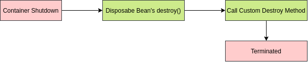

### :star: Callback Interfaces.

- Spring has two interfaces you can implement for callback events.
- `InitializingBean.afterPropertiesSet()`.
    - Called after properties set.
- `DisposableBean.destroy()`.
    - Called during bean destruction in shutdown.

### Life Cycle Annotations.

- Spring has two annotations you can use to hook into the bean life cycle.
- `@PostConstruct:` Annotated methods will be called after the bean has been constructed, but before
  its returned to the requesting object.
- `@PreDestroy:` Is called just before the bean destroyed by the container.

### Bean Post Processors.

- Gives you a means to tap into the Spring context life cycle and interact with beans as they are processed.
- Implement interface `BeanPostProcessor`:
    - `postProcessBeforeInitialization:` Called before bean initialization method.
    - `postProcessAfterInitialization:` Called after bean initialization.

### `Aware` Interfaces.

- Spring has over 14 aware interfaces.
- These are used to access the Spring Framework infrastructure.
- These are largely used within the framework.
- Rarely used by Spring developers.

```
ApplicationContextAware, 
ApplicationEventPublherAware, 
BeanFactoryAware
...
```

### IoC.

- Inversion of Control - the runtime environment (or framework) which injects dependencies.

### Callback Interfaces.

- You can implement to tap into the bean lifecycle:
    - InitializingBean.
    - DisposableBean,

### Spring bean lifecycle annotations.

- `@PostConstruct`.
- `@PreDestroy`.

## Spring Configuration.

### Spring Configuration Options.

- XML Based Configuration:
    - Since Spring 2.
    - Common in legacy Spring Applications.
    - Supported in Spring 5.
- Annotation Based Configuration:
    - Since Spring 3.
    - Picked up via **Component Scans**.
    - Refers to class level annotations:
        - `@Controller`.
        - `@Service`.
        - `@Component`.
        - `@Repository`.
- :star: Java Based Configuration:
    - Since Spring 3.
    - Java Classes to define Spring Beans.
    - Configuration classes defined with `@Configuration` annotation.
    - Beans are defines with `@Bean` annotation.
- Groovy Bean Definition DSL Configuration:
    - Since Spring 4.
    - Declare beans in Groovy (from Grails).
- Which use:
    - You can combine all of them.
    - They will work seamlessly together to define beans in the Spring Context.
    - Industry trends is to favor Java based configuration.

### Stereotypes annotations.

- **Stereotype:** A fixed general image or set of characteristics which represent a particular type of person or thing.
- Spring Stereotypes used to define Spring Beans in the Spring context:
- **Available Stereotypes:**
    - `@Controller`.
    - `@RestController`.
    - `@Service`.
    - `@Component`.
    - `@Repository`.

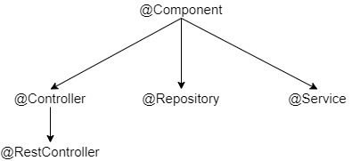

- `@RestController:` Convenience annotation representing `@Controller` and `@ResponseBody`.
- `@Repository:` Indicates that an annotated class is a "Repository", originally defined by Domain-Driven Design
  as "a mechanism for encapsulating storage, retrieval and search behavior which emulates a collection of objects".
- `@Service:` Indicates that and annotated class is a "Service", originally defined by Domain-Driven Design as
  "an operation offered as an interface that stands alone in the model, with no encapsulated state."

### Spring ComponentScan.

```java
@ComponentScan(basePackages = {"com.mybank.services"})
```

### Java Configuration.

```java
@Service
public class TaxCalcServiceImpl implements TaxCalcService {
    private final TaxDiscounts taxDiscounts;

    public TaxCalcServiceImpl(TaxDiscounts taxDiscounts) {
        this.taxDiscounts = taxDiscounts;
    }

    @Override
    public String getDeduction() {
        return taxDiscounts.getDeduction();
    }
}
```

```java
@Configuration
public class TaxDiscountsConfiguration {

    @Bean
    public TaxDiscounts taxDiscount() {
        return new TaxDiscounts();
    }
}
```

## Spring Boot Configuration.

**Dependency Management.**

- Maven or Gradle are supported for curated dependencies.
- Each version of Spring Boot configured to work with a specific version of Spring Framework.
- Overriding the Spring Framework Version not recommended.
- Other build systems such as Ant can be used.

### Maven Support.

- Maven projects inherit from a Spring Boot Parent POM:
    - When possible, do not specify versions in your POM.
    - Allow the versions to inherit from the parent.
- The Spring Boot Maven Plugin allows for packaging the executable jar.

### Gradle Support.

- Gradle support depends on a Spring Boot Gradle plugin.
- Requires Gradle 3.4 or later.
- The Gradle plugin provides support of curated dependencies, packaging as jar or war, and allows you to run
  the application from the command line.

### Ant + Ivy Support.

- Spring Boot can be built using Ant with Ivy.
- Ivy used for dependency management.
- Complete directions are available via the official Spring Boot documentation.

### Spring Boot Starters.

- Starters are top level dependencies for popular Java libraries.
- Will bring in dependencies for the project and related Spring components:
    - Starter `spring-boot-starter-data-jpa` brings in:
        - Hibernate.
        - Spring Data JPA - and related Spring dependencies.

### Spring Boot Annotations.

- `@SpringBootApplication` - main annotation to use includes:
    - `@Configuration:` Declares class as Spring Configuration.
    - `@EnableAutoConfiguration:` Enables auto configuration.
    - `@ComponentScan:` Scans for components in current package and all child packages.

### Disabling Specific Auto Config

- Auto-configuration will bring in **A LOT** of configuration classes in supplied Spring Boot Jars.
- You can specify classes to exclude with:
    - `@EnableAutoConfiguration(exclude = {DataSourceAutoConfiguration.class})`

## Spring Bean Scopes.

- Singleton (default): Only one instance of the bean created in the IoC container.
- Prototype: A new instance created each time the bean requested.
- Request:
    - A single instance per http request.
    - Only valid in the context of a web-aware Spring ApplicationContext.
- Session:
    - A single instance per http session.
    - Only valid in the context of a web-aware Spring ApplicationContext.
- Global-session:
    - A single instance per global session.
    - Typically, only used in Portlet context.
    - Only valid in the context of a web-aware Spring ApplicationContext.
- Application:
    - Beans scoped to the lifecycle of a ServletContext.
    - Only valid in the context of a web aware.
- Websocket:
    - Scopes a single bean definition to the lifecycle of a WebSocket.
    - Only valid in the context of a web-aware Spring ApplicationContext.
- Custom Scope:
    - Spring Scopes are extensible, and you can define your own scope by implementing Spring's Scope interface.
    - You cannot override the built-in Singleton and Prototype Scopes.

**Singleton Scope.**

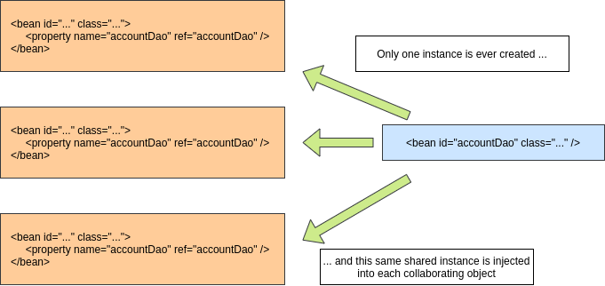

**Prototype Scope.**

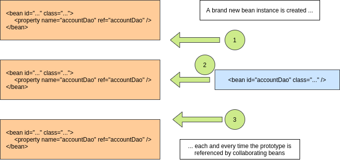

### Declaring Bean Scope.

- No declaration needed for singleton scope.
- In Java configuration use `@Scope` annotation.
- In XML configuration is an XML attribute of the `bean` tag.

***

## MapStruct.

- MapStruct is a code generator for Java bean mapping:
    - Helps reduce coding for type conversions.
    - When dealing with REST services, use case is to expose API data using DTOs (Data Transfer Object).
- MapStruct is annotation based processor plugged into the Java compiler.
- From Interfaces declared, MapStruct will generate code at build time.

### MapStruct - Example.

```java
public class Car {
    private String make;
    private int numberOfSeats;
    private TypeCar type;

    // constructor, getters, setters
}
```

```java
public class CarDto {
    private String make;
    private int seatCount;
    private String type;

    // constructor, getters, setters
}
```

```java
@Mapper
public interface CarMapper {
    CarMapper INSTANCE = Mappers.getMapper(CarMapper.class);

    @Mapping(source = "numberOfSeats", target = "seatCount")
    CarDto carToCarDto(Car car);
}
```

- Use.

```java
@Test
public void shouldMapCarToDto() {
    // given
    Car car = new Car("Ford", 5, CarType.SEDAN);

    // when
    CarDto carDto = CarMapper.INSTANCE.carToCarDto(car);

    // then
    assertThat(carDto).isNotNull();
    assertThat(carDto.getMake()).isEqualTo("Ford");
    assertThat(carDto.getSeatCount()).isEqualTo(5);
    assertThat(carDto.getType()).isEqualTo("SEDAN");
}
```

***

## Spring Social.

### OAuth2.

- Authorization Framework.
- Delegates User Authentication.
- Accessing Data in 3rd Part API.
- Many flavors of oauth.

### Spring Social - What it is.

- Spring Social Core.
- Social Integrations (API Bindings):
    - Facebook.
    - Twitter.
    - LinkedIn.
    - Community Projects.

***

## Spring Web Reactive.

- Reactive systems:
    - Responsive.
    - Resilient.
    - Elastic.
    - Message driven.

### Spring Flux.

- Non-blocking applications.
- Asynchronous.
- Event-driven.
- Small num of threads to scale.
- Backpressure uses reactive streams.

```java
Flux<?>
Mono<?>
```

- Returns stream of resources in time interval for example each record every second.

## Spring Web MVC.

- MVC pattern that divide application into three parts:
    - Model.
    - View.
    - Controller.
- DispatcherServlet.
- HandlerMapping.
- Controller.
- ViewResolver.
- View.

## Login Rest Endpoint.

- `@RestController` (`@ResponseBody` + `@Controller`).
- `@PathVariable`.
- `@RequestParam`.
- `@RequestHeader`.
- `@RequestBody`.
- `@RequestMapping`.

***

## Spring Security // here

```xml
<dependency>
    <groupId>org.springframework.boot</groupId>
    <artifactId>spring-boot-starter-security</artifactId>
</dependency>
<dependency>
    <groupId>com.google.code.gson</groupId>
    <artifactId>gson</artifactId>
    <version>2.8.5</version>
</dependency>
<dependency>
    <groupId>io.jsonwebtoken</groupId>
    <artifactId>jjwt</artifactId>
    <version>0.9.0</version>
</dependency>
```

### Initial spring security config.

**WebSecurityConfigurerAdapter.**

```java
@Configuration
@EnableWebSecurity
@EnableGlobalMethodSecurity(
    securedEnabled = true,
    jsr250Enabled = true,
    prePostEnabled = true
)
public class SecurityConfig extends WebSecurityConfigurerAdapter {

}
```

- `WebSecurityConfigurerAdapter:`
    - Default configuration.
    - Customize configuration.
    - `HttpSecurity:`.
        - `http.cors().and().csrf().disabled()`.
        - `exceptionHandling()`.
        - `sessionManagement()`.
        - `sessionCreationPolicy()`.
        - `headers().frameOptions().sameOrigin()` - enable h2 db.
        - `authorizedRequests()`.
        - `antMatchers().permitAll()`.
        - `anyRequest().authenticated()`.

***

## :star: Equality in hibernate.

- To find a good identifier, that always is unique best way is to use ID fields.
- `hashCode()` and `equals()` with ID.

```java
@Override
public boolean equals(Object o) {
    if (this == o) return true;
    if (o == null || getClass() != o.getClass()) return false;
    Book book = (Book) o;
    return Objects.equals(id, book.id);
}

@Override
public int hashCode() {
    return Objects.hash(id);
}
```

- Now when working with 'Set<T>'.

```java
private Set<Author> authors = new HashSet<>();
```

- A different author will have different id and different locations in Set collection.

***

## JPA Entity Relationship.

- `@OneToOne:` One entity related to one other entity.
- `@OneToMany:` One entity related to many entities (`List`, `Set`, `Map`, `SortedSet`, `SortedMap`).
- `@ManyToOne:` The inverse relationship of One to Many.
- `@ManyToMany:`
    - Many entities related to many entities.
    - Each has a List or Set reference to the other.
    - A join table used to define the relationships.

### Unidirectional vs Bidirectional.

- Unidirectional is one-way:
    - Mapping only done one way.
    - One side of the relationship will not know about the other.
- Bidirectional is two-way:
    - Both sides know about each other.
    - Generally recommended to use Bidirectional, since you can navigate the graph in either direction.

### Fetch Type.

- Lazy Fetch Type: Data not queried until referenced.
- Eager Fetch Type: Data queried up front.
- Hibernate 5 Supports the JPA 2.1 Fetch Type Defaults.
- JPA 2.1 Fetch Type Defaults:
    - `@OneToMany` - Lazy.
    - `@ManyToOne` - Eager (other side is One = Eager).
    - `@ManyToMany` - Lazy.
    - `@OneToOne` - Eager.

### JPA Cascade Types.

- JPA Cascade Types Control how state changes cascaded from parent objects to child objects.
- JPA Cascade Types:
    - PERSIST: Save operations will cascade to related entities.
    - MERGE: Related entities merged when the owning entity merged.
    - REFRESH: Related entities refreshed when the owning entity refreshed.
    - REMOVE: Removes all related entities when the owning entity deleted.
    - DETACH: Detaches all related entities if a manual detach occurs.
    - ALL: Applies all the above cascade options.
- By default, no operations cascaded.

### Embeddable Types.

- JPA / Hibernate support embeddable types.
- These are used to define a common set of properties.
- For example, an order might have a billing address, and a shipping address.
- An embeddable type could be used for the address properties.

### Inheritance.

- MappedSuperclass:
    - Entities inherit from a super class.
    - A database table NOT created for the super class.
- Single Table (Hibernate Default):
    - One Table used for all subclasses.
- Joined Table:
    - Base class and subclass have their own tables.
    - Fetching subclass entities require a join to the parent table.
- Table Per Class: Each subclass has its own table.

### Create and Update Timestamps.

- Often a best practice to use create and update timestamps on your entities for audit purposes.
- JPA supports '@PrePersist' and '@PreUpdate' which can be used to support audit timestamps via JPA lifecycle
  callbacks.
- Hibernate provides '@CreationTimestamp' and '@UpdateTimestamp'.

## Spring Data Repositories.

- Provides an Implementation of the Repository Pattern.
- A Repository has methods for retrieving domain objects should delegate to a specialized Repository object
  such that alternative storage implementations may be interchanged.
- This allows you to easily substitute the persistence layer:
    - Going from SQL to NoSQL.

### Spring Data JPA.

- Spring Data JPA is part of a larger family of Spring Data projects.
- Uses Hibernate for persistence to supported RDBS systems - Just about any major relational database.
- You extend a Java Repository Interface.
- Spring Data JPA provides the implementation at run time.
- No SQL required.

***

## Spring MVC.

### HTTP Protocol/

```console
telnet mybank.com 80
```

- Http/1.0 - From 1991 to 1995 the HTTP/HTML specifications.
- New software "web browser" appeared.
- HTTP standards developed by:
    - IETF - Internet Engineering Task Force.
    - W3C - World Wide Web Consortium.
- HTTP/1.1 - Originally released in 1997:
    - Solved a lot of ambiguities from earlier versions.
    - Added support for keep alive connections, chunked encoding transfers, byte-range requests,
      transfer encodings, and request pipelining.
- Http/1.1 - Updated by RFC 2616 in 1999.
- Updated again by RFC 7230 in 2014.
- Still, in use today.
- Request - Added encoding, charset, and cookies.
- Response - Added encoding, charset, and cookies.
- Http/2.0 Standardized in 2015.
- Supported by most servers and browsers by the end of 2015.
- Has high level of compatibility with HTTP/1.1.
- Transport Performance was a focus of HTTP/2.0.
- Improves page load speed by:
    - Lower Latency.
    - Higher Throughput.
- Differences from HTTP/1.1 are largely transparent for web developers.

### HTTP Request Methods.

- Request methods, also known as verbs, are used to indicate the desired action to be performed.
- GET:
    - Is a request for a resource (html file, javascript, image, etc.).
    - Is used when you visit a website.
- HEAD: Is like a GET, but only asks for meta information without the body.
- POST:
    - Is used to post data to the server.
    -  Is create request.
- PUT:
    - Is a request for enclosed entity stored at the supplied URI.
    - If the entity exists, it is expected to be updated.
    - Is create or update request.
- DELETE: Is a request to delete the specified resource.
- TRACE:
    - Will echo the received request.
    - Can be used to see if request altered by intermediate servers.
- OPTIONS: Returns the HTTP methods supported by the server for the specified URL.
- CONNECT: Converts the request to a transparent TCP/IP tunnel, typically for HTTPS through an unencrypted
  HTTP proxy.
- PATCH: Applies partial modifications to the specified resource.

### Safe Methods.

- Safe Methods considered safe to use because they only fetch information and do not cause changes on the server.
- The Safe Methods are: GET, HEAD, OPTIONS and TRACE.

### Idempotent Methods.

- :star: Idempotent: A quality of an action such that repetitions of the action have no further effect on the outcome.
- PUT and DELETE are Idempotent.
- Safe Methods (GET, HEAD, TRACE, OPTIONS) are also Idempotent.

### Non-Idempotent Methods.

- POST is NOT Idempotent.
- Multiple Posts are likely to create multiple resources.

### HTTP Status Codes.

- 100 series are informational in nature.
- 200 series indicate successful request.
- 300 series are re directions.
- 400 series are client errors.
- 500 series are server side errors.

**Common HTTP Status Codes**

- 200 OK.
- 201 Created .
- 204 Accepted.
- 301 Moved Permanently.
- 400 Bad Request.
- 401 Not Authorized.
- 404 Not Found.
- 500 Internal Server Error.
- 503 Service Unavailable.

## MVC.

- MVC is a common design pattern for GUI and Web Applications:
    - M = Model.
    - V = View.
    - C = Controller.

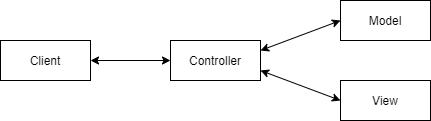


***

## Database Initialization with Spring.

### Hibernate DDL Auto.

- **DDL:** Data Definition Language.
- **DML:** Data Manipulation Language.
- Hibernate property set by the Spring property `spring.jpa.hibernate.ddl-auto`.
- :star: Options are: none, validate, update, create, create-drop.
- Spring Boot will use `create-drop` for embedded databases (hsql, h2, derby) or none.

### Initialize with Hibernate.

- Data can be loaded from **import.sql**:
    - Hibernate feature (not Spring specific).
    - Must be on root of class path.
    - Only executed if Hibernate's ddl-auto property set to create or `create-drop`.

### Spring JDBC.

- Spring's DataSource initializer via Spring Boot will by default load **schema.sql** and **data.sql**
  from root of the classpath.
- Spring Boot will also load from 'schema-${platform}.sql' and 'data-${platform}.sql':
    - Must set `spring.datasource.platform`.
- May conflicts with Hibernate's DDL Auto property:
    - Should use setting of 'none' or 'validate'.

### Q&A

**1. What are the 4 types of entity relationships?**

- `@OneToOne`, `@oneToMany`, `@ManyToOne`, `@ManyToMany`.

**2. Which JPA Relationship will require the use of a join table?**

- `@ManyToMany`.

**3. What is the difference between a unidirectional relationship and a bidirectional relationship?**

- In unidirectional, the mapping done one-way, meaning one side of the relationship will not know about the other.
- While bidirectional both sides will know about the relationship.

**4, Which type of relationship recommended?**

- bidirectional: Allows to navigate the object graph from either direction.

**5. What two fetch types can be used with JPA?**

- LAZY, EAGER.

**6. What do JPA Cascade Types do?**

- Cascade Types control how changes are cascaded from parent objects to child objects.

**7. What is the default Cascade Type in JPA 2.1?**

- None.

**8. What are the 6 available Cascade Types in JPA 2.1?**

- PRESIST, MERGE, REFRESH, REMOVE, DETACH, ALL.

**9. Can you embed a type in JPA for reuse?**

- Yes, Address for instance.

**10. Does JPA supports object inheritance?**

- Yes, in JPA classes can inherit from a super class.

**11. What is Hibernate's default persistence strategy for inheritance?**

- Single Table: One table created for the superclass and inheriting subclasses.

**12. What is a disadvantage of the Single Table strategy for inheritance?**

- Single Table can lead to a lot of unused database columns.

**13. What is a disadvantage of the Join Table strategy for inheritance?**

- Fetching subclass entities require a join to the table of the superclass.

**14. Can JPA automatically update timestamp properties for audit purposes?**

- Yes, using `@PrePersist` or `@PreUpdate` within JPA.
- Or Hibernate specific `@CreationTimestamp`, or `@UpdateTimestamp`.

**15. What does DDL stands for?**

- Data Definition Language.

**16. What does DML stands for?**

- Data Manipulation Language.

**17. What is the difference between DDL and DML?**

- DDL is used to define database structures such as tables and indexes.
- While DML used with data operations such as inserts and updates.

**18. What does Hibernate's ddl-auto property control?**

- Controls what if any DDL operations Hibernate will perform on startup.

**19. What are the 5 valid options for Hibernate's ddl-auto property?**

- none, validate, update, create, create-drop.

**20. When using an embedded database, which ddl-auto setting will Spring Boot set by default?**

- create-drop.

**21. When using an Non-embedded database, which ddl-auto setting will Spring Boot set by default?**

- none.

**22. What two file will Spring Boot use to initialize the database?**

- 'schema.sql' and 'data.sql'.

***

## Spring Controllers.

- Annotate Controller Class with `@Controller`:
    - This will register the class as a Spring Bean and as a Controller in Spring MVC.
- To map methods to http request path use `@RequestMapping`.

***

## Project Lombok.

- Hooks in via the Annotation processor API.
- The AST (raw source code) is passed to Lombok for code generation before java continues.
- Thus, produces properly compiled Java code in conjuction with the Java compiler.
- Under the 'target/classes' you can view the compiled class files.
- Since compiled code is changed, and source files are not, IDEs can get confused by this.
- More of an issue for IDEs several years old.
- Modern IDEs such as IntelliJ, Eclipse, Netbeans support Project Lombok:
    - Plugin Installation may be necessary.

### Project Lombok Features.

- `@Getter:` Creates getter methods for all properties.
- `@Setter:` Creates setter for all non-final properties.
- `@ToString`.
- `@EqualsAndHashCode:`
    - Generates implementations of `equals(Object other)` and `hashCode()`.
    - By default will use all non-static, non-transient properties.
    - Can optionally exclude specific properties.
- `@NoArgsConstructor:`
    - Generates no args constructor.
    - Will cause compiler error if there are final fields.
    - Can optionally force, which will initialize final fields with `0 / false / null`.
- `@RequiredArgsConstructor:`
    - Generates a constructor for all fields that are final or marked `@NonNull`.
    - Constructor will throw a `NullPointerException` if any `@NonNull` fields are null.
- `@AllArgsConstructor:`
    - Generates a constructor for all properties of class.
    - Any `@NotNull` properties will have null check.
- `@Data:`
    - Generates typical boilerplate code for POJOs.
    - Combines - `@Getter`, `@Setter`, `@ToString`, `@EqualsAndHashCode`, `@RequiredArgsConstructor`.
    - No constructor generated if constructors have been explicitly declared.
- `@Value:`
    - The immutable variant of `@Data`.
    - All fields made private and final by default.
- `@NonNull:` Set on a parameter of method or constructor and a NullPointerException will be thrown if parameter is null.
- `@Builder`:
    - Implements the **builder** pattern for object creation.
    - `Person.builder().name("Majki").city("LA").build();`
- `@SneakyThrows:` Throw checked exceptions without declaring in calling method's throws clause.
- `@Synchronized:` A safer implementation of Java's synchronized.
- `@Getter(lazy = true)` - for expensive getters:
    - Will calculate value first time and cache.
    - Additional gets will read from a cache.
- `@Log:` Creates a Java util logger.
- `@Slf4j`:
    - Creates a SLF4J logger.
    - Recommended - SLF4J is a generic logging facade.
    - Spring Boot's default logger is LogBack.

***

## Data Binding in Spring.

- Command Objects (aka Backing Beans) - Are used to transfer data to and from web forms.
- Spring will automatically bind data of form posts.
- Binding done by property name (less 'get' / 'set').

***

## Exception Handling in Spring MVC.

### HTTP Status Codes.

- HTTP `5XX` Server Error:
    - `HTTP 500` - Internal Server Error - Generally, any unhandled exception.
    - Other 500 errors generally not used with Spring MVC.
- HTTP `4XX` Client Errors - Generally Checked Exceptions:
    - **400 Bad Request:** Cannot process due to client error.
    - **401 Unauthorized:** Authentication required.
    - **404 Not Found:** Resource Not Found.
    - **405 Method Not Allowed:** HTTP method not allowed.
    - **409 Conflict:** Possible with simultaneous updates.
    - **417 Expectation Failed:** Sometimes used with RESTful interfaces.
    - **418 I'm a Teapot**.

### `@ResponseStatus`.

- Allows you to annotate custom exception classes to indicate to the framework the HTTP status you want returned when
  that exception thrown.
- Global to the application.

### `@ExceptionHandler`.

- `@ExceptionHandler` works at the controller level.
- Allows you to define custom exception handling:
    - Can be used with `@ResponseStatus` for just returning a http status.
    - Can be used to return a specific view.
    - Also, can take total control and work with the Model and View:
        - `Model:` Cannot be a parameter of an ExceptionHandler method.

### HandlerExceptionResolver.

- `HandlerExceptionResolver` is an interface you can implement for custom exception handling.
    - Used internally by Spring MVC.
    - Note, Model not passed.

### Internal Spring MVC Exception Handlers.

- Spring MVC has 3 implementations of HandlerExceptionResolver:
    - `ExceptionHandlerExceptionResolver:` Matches uncaught exceptions to `@ExceptionHandler`.
    - `ResponseStatusExceptionResolver:` Looks for uncaught exceptions matching `@ResponseStatus`.
    - `DefaultHandlerExceptionResolver:` Converts standard Spring Exceptions to HTTP status codes.

### Custom HandlerExceptionResolver.

- You can provide your own implementations of `HandlerExceptionResolver`.
- Typically, implemented with Spring's Ordered interface to define order to handlers will run in.
- Custom implementations are uncommon due to Spring robust exception handling.

### SimpleMappingExceptionResolver.

- A Spring Bean you can define to map exceptions to specific views.
- You only define the exception class name (no package), and the view name.
- You can optionally define a default error page.

### Which use.

- If just the HTTP status - use `@ResponseStatus`.
- If redirection to a view, Use `SimpleMappingExceptionResolver`.
- If both, consider `@ExceptionHandler` on the controller.

***

## Data Validation with Spring.

- JSR 303 Supported Since Spring Framework 3.
- JSR 303 Produced Standard Validation Annotations.

### JSR 303 - Java Bean Validation.

- Primary focus was to define annotations for data validation.
- Standard validations found in the package `javax.validation.constraints`.
- From the jar `javax.validation:validation-api`.
- API Implementation is - `org.hibernate.hibernate-validator`.

### JSR 380 - Bean Validation 2.0.

- Primary goal is to leverage features of Java 8.
- Bean Validation 2.0 not supported in Spring yet.

### Standard Validators.

- `@AssertFalse`.
- `@AssertTrue`.
- `@DecimalMax`.
- `@DecimalMin`.
- `@Digits`.
- `@Future`.
- `@Max`.
- `@Min`.
- `@NotNull`.
- `@Null`.
- `@Past`.
- `@Pattern`.
- `@Size` - Checks if string or collection is between a min and max.
- `@NotEmpty` - Checks if value is null or empty (white space characters or empty collections).
- `@NonBlank` - Checks string is not null or not whitespace characters.
- `@Email` - Checks if string value is an email address.

### Hibernate Validators.

- `@CreditCardNumber`.
- `@Currency`.
- `@EAN`.
- `@Email.`
- `@ISBN`.
- `@Length`.
- `@LuhnCheck`.
- `@Mod10Check`.
- `@Mod11Check`.
- `@NotBlank`.
- `@NotEmpty`.
- `@ParameterScriptAssert`.
- `@Range`.
- `@SafeHtml`.
- `@ScriptAssert`.
- `@URL`.

***

## Internationalization.

- `i18n` in a Spring MVC context generally is looking at support for languages.
- Driven by `accept-language` request header.
- `en-US` - **en** is the language code, **US** is country code.
- Language identifiers established by RFC 3066 in 2001.
- Language Codes governed by ISO 639:
    - ISO - International Organization for Standardization.
- Region codes governed by ISO 3166:
    - Can refer to countries, regions, territories.

### Locale Detection.

- Default behavior is to use `Accept-Language` header.
- Can be configured to use system, a cookie, or a custom parameter:
    - Custom Parameter is useful to allow user to select language.

### Locale Resolver.

- `AcceptHeaderLocaleResolver` is the Spring Boot Default.
- Optionally, can use `FixedLocaleResolver` - Uses the locale of the JVM.
- Available:
    - `CookieLocaleResolver`.
    - `SessionLocaleResolver`.

### Changing Locale.

- Browsers typically tied to the Locale of the operating system.
- Locale changing plugins are available.
- Spring MVC provides as `LocaleChangeInterceptor` to allow you to configure a custom parameter
  to used to change the locale.

### Resource Bundles.

- Resource bundles (aka 'messages.properties') are selected on highest match order.
- First selected will be on language region - i.e. **en-US** would match `messages_en_US.properties`.
- If no exact match found, just the language code is used:
    - **en-GB** would match `messages_en_GB.properties`.
    - Or if no file found, would match `messages_en.properties`.
    - Finally, would match `messages.properties`.

***

## Reactive Programming.

- Reactive Systems - Architecture and Design:
    - ie Cloud Native.
- Reactive Programming: Generally Event Based.
- Functional Reactive Programming (FRP): Often confused with Reactive Programming.

### Reactive Manifesto.


- **Responsive**:
    - The system responds in a timely manner.
    - Responsiveness is the cornerstone of usability and utility.
    - Responsiveness also means problems may detected quickly and dealt with effectively.
    - Responsive systems provide rapid and consistent response times.
    - Consistent behavior simplifies error handling, builds and user confidence, and encourages further interaction.
- **Resilient**:
    - System stays responsive in the face of failure.
    - Resilience achieved by replication, containment, isolation and delegation.
    - Failures contained within each component.
    - Parts of the system can fail, without compromising the system as a whole.
    - Recovery of each component delegated to another.
    - High availability ensured by replication where necessary.
- **Elastic**:
    - The system stays responsive under varying workload.
    - Reactive Systems can react to changes in the input rate by increasing or decreasing resources allocated to
      service inputs.
    - Reactive Systems achieve elasticity in a cost effective way on commodity hardware and software platforms.
- **Message Driven**:
    - Reactive Systems relay on asynchronous message passing to establish a boundary between components:
        - This ensures loose coupling, isolation, and location transparency.
    - Message passing enables load management, elasticity, and flow control.
    - Location transparent messaging makes management of failures possible.
    - Non-blocking communication allows recipients to only consume resources while active, leading to less
      system overhead.

```
Spring Cloud NatIve

Netflix OSS         Spring          Docker

CONSUL      JHipster        AngularJS       KIBANA

Zuul Proxy      Ribbon
```

- Reactive Programming is a useful implementation technique.
- Reactive Programming focuses on non-blocking asynchronous execution - a key characteristic of Reactive Systems.
- Reactive Programming is just one tool in building Reactive Systems.

### Reactive Programming.

- Reactive Programming is an asynchronous programming paradigm on streams of data.

### Common Use Cases

- External Service Calls.
- Highly Concurrent Message Consumers.
- Spreadsheets.
- Abstraction Over Asynchronous Programming:
    - Abstract whether your program is synchronous or asynchronous.

### Features of Reactive Programming

- Data Streams
- Asynchronous
- Non-blocking
- Back Pressure
- Failures as Messages

### Data Streams

- Mouse clicks, or other user interactions.
- JMS Messages, RESTful Service calls, Twitter, Stock Trades, list data from database.
- A Stream is a sequence of events ordered in time.
- Events you want to listen to.

### Asynchronous

- Events captured asynchronously.
- A function defined to execute when an event emitted.
- Another function defined if an error emitted.
- Another function defined when complete is emitted.
- GoF Observer Pattern.
- ReactiveX Observable.

### Non-Blocking

- In Blocking, the code will stop and wait for more data (ie reading from disk, network).
- Non-blocking in contrast, will process available data, ask to be notified when more is available, then continue.

### Back Pressure

- The ability of the subscriber to throttle data.

### Failures as Messages

- Exceptions not thrown in a traditional sense - Would break processing of stream.
- Exceptions  processed by a handler function.
- Reactive programming focuses on processing streams of data.
- Traditional CRUD applications are still alive and well.

## Reactive Streams API

- Goal is to create a standard for asynchronous stream processing with non-blocking back pressure.
- Reactive Streams started in 2013.
- Reactive Streams is a set of 4 interfaces which define the API.
- Under JEP-266, Reactive Streams is now part of the Java 9 JDK.
- Adaptations:
    - Akka Streams, MongoDB, Ratpack, Reactive Rabbit, Project Reactor (Spring 5), RxJava, Cassandra,
      kafka, Play.

### Spring MVC & Spring WebFlux

- `@Controller / @RequestMapping` - Router Functions.
- `spring-webmvc - spring-webflux`.
- Servlet API - Http / Reactive Streams.
- Servlet Container - Tomcat, Jetty, Netty, Undertow.

### Spring Reactive Types

- `Mono:` Is a publisher with zero or one element in data stream.
- `Flux:` Is a publisher with zero, or many elements in the data stream.
-  Both types implement the Reactive Streams Publisher interface.

***

## Questions

**What is special about the `@Repository` stereotype?**

- Spring will detect platform specific persistence exceptions and re-throw them as Spring exceptions.

**Spring Boot Profile Properties**

- application-default.properties

```java
@Component
@Profile("defualt")
public class DefaultProfile {
    @Autowired
    public DefaultProfile(@Value("${com.pandatronik.profile.message}") String msg) {
        System.out.println(msg);
    }
}
```

## Docker

**What is Docker?**

- Docker is a standard for Linux containers.
- A "Container" is an isolated runtime inside of Linux.
- A "Container" provides a private machine like space under Linux.
- Containers will run under any modern Linux Kernel.

**Containers can**

- Have their own process space.
- Their own network interface.
- 'Run' processes as root (inside the container).
- Have their own disk space:
    - Can share with host too.

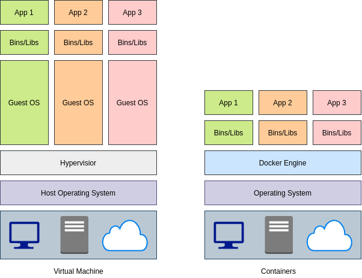

**Docker Terminology**

- Docker Image:
    - The representation of a Docker Container.
    - Kind of like a JAR or WAR file in Java.
- Docker Container:
    - The standard runtime of Docker.
    - Deployed and running Docker Image.
    - Like a Spring Boot Executable JAR.
- Docker Engine:
    - The code which manages Docker stuff.
    - Creates and runs Docker Containers.


### Docker Editions

- **Docker Enterprise Edition**
- **Docker Community Edition**

**Edition for Java Developers?**

- Functionally, the two editions are the same.
- Java developers should be fine using the Docker Community Edition.

**Hello World**

```console
docker run hello-world
```

**Mongo DB**

```console
docker run --name some-mongo -d mongo:tag

docker pull mongo

docker run mongo

docker run -d mongo

docker stop CONTAINER_ID

docker run -p 27017:27017 -d mongo

docker logs -f CONTAINER_ID

mvn spring-boot:run
```

### Docker Images

- An Image defines a Docker Container:
    - Similar in a concept to a snapshot of a VM.
    - Or a class vs instance of the class.
- Images are immutable:
    - Once built, the files making up an image do not change.

**Image Layers**

- Images built in layers.
- Each layer is an immutable file, but is a collection of files and directories.
- Layers receive an ID, calculated via a SHA 256 hash of the layer contents.
    - Thus, if the layer contents change, the SHA 256 hash changes also.

```console
docker image inspect mongo
```

**Image Ids**

- Image Ids are a SHA 256 hash derived from the layers.
    - Thus, if the layers of the image changes, the SHA 256 hash changes.
- The Image ID listed by docker commands (docker images) is the first 12 characters of the hash.

**Image Tag Names**

- The hash values of images referred to by 'tag' names.

**Image Tag Names**

- The format of the full tag name is: `[REGISTRYHOST/][USERNAME/]NAME[:TAG]`
- Example: `registry.hub.docker.com/mongo:latest`

**Docker Files**

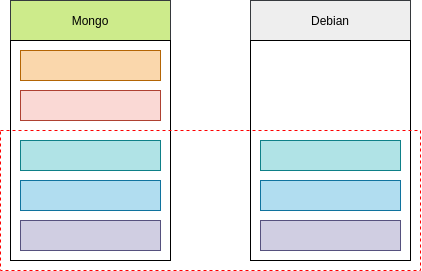

**Storage on host**

```console
docker run -p 27017:27017 -v /home/mati/dockerdata/mongo:/data/db -d mongo
```

**Rabbit MQ**

```console
docker run -d --hostname panda-rabbit --name some-rabbit -p 8080:15672 -p 5671:5671 -p 5672:5672 rabbitmq:3-management
```

**MySQL**

```console
docker run --name panda-mysql -e MYSQL_ALLOW_EMPTY_PASSWORD=yes -v /home/mati/dockerdata/mysql:/var/lib/mysql -p 3306:3306 -d mysql
```

### Cleaning Up After Docker

- There are 3 key areas of house keeping:
    - Containers
    - Images
    - Volumes

**Containers**

- Kill all Running Docker Containers:
    - `docker kill $(docker ps -q)`
- Delete all Stopped Docker Containers:
    - `docker rm $(docker ps -a -q)`

**Images**

- Remove a Docker Image:
    - `docker rmi IMAGE_NAME`
- Delete Untagged (dangling) Images:
    - `docker rmi $(docker images -q -f dangling=true)`
- Delete All Images:
    - `docker rmi $(docker images -q)`

**Volumes**

- Once a volume is no longer associated with a container, it is considered 'dangling'.
- Remove all dangling volumes:
    - `docker volumes rm $(docker volume ls -f dangling=true -q)`
- NOTE: Does not remove files from host system in shared volumes.

**Questions**

- What command used to build a docker image?
    - `docker build -t TAG_NAME`
- How do you list all docker images on your system?
    - `docker images`
- How do you map host port to container port?
    - `-p HOST_PORT:CONTAINER_PORT`
- What is like a `.java` file to a docker image? ie, the source code?
    - The Dockerfile.
- How do you shell into a running docker container?
    - `docker exec -it CONTAINER_NAME bash`

### Docker CentOS image

```console
docker run -d centos

docker logs IMAGE_NAME

docker run -d centos tail -f /dev/null

docker exec -it NAMES bash
------------------------------------------
docker exec -it confident_brahmagupta bash
[root@c13aba60f569 /]# whoami
root
[root@c13aba60f569 /]# ls
bin  dev  etc  home  lib  lib64  lost+found  media  mnt  opt  proc  root  run  sbin  srv  sys  tmp  usr  var
[root@c13aba60f569 /]# 
[root@c13aba60f569 /]# yum install java
```

**Dockerfile**

```console
cd docker
$ ls -la
-rw-rw-r--  1 mati mati      211 wrz 29 14:40 Dockerfile
-rw-rw-r--  1 mati mati 44447242 wrz 29 14:37 spring-boot-app.jar

$ docker build -t spring-boot-docker .

------- run ------- 

$ docker run -d -p 8080:8080 spring-boot-docker
```

```
FROM centos

RUN yum install -y java-11

VOLUME /tmp
ADD /spring-boot-app.jar myapp.jar
RUN sh -c 'touch /myapp.jar'
ENTRYPOINT ["java","-Djava.security.egd=file:/dev/./urandom","-jar","/myapp.jar"]
```

## MySQL

**MySQL Features**

- Stored Procedures
- Triggers
- Cursors
- Updated Views
- Query Catching
- Sub-selects
- ACID Compliance:
    - Atomicity: All or nothing.
    - Consistency:
        - Transactions are valid to rules of the DB.
        - All previous execution steps related in current form.
    - Isolation: Results of transactions are as if they done end to end.
    - Durability: Once a transaction committed, it remains so.

**RDBMS Deployment Architecture**

- Deployment typically driven by needs of scalability and availability.
- Can be done on a single non-dedicated server, or many dedicated servers.
- Communication is typically over a network socket.
- The client will need software called a 'driver' to talk to the database over the network socket.

**Simple Non-Dedicated Server**

- Single Server (Computer).
- RDBMS installed.
- User logs in and accesses database from command line.
- Simplest configuration.
- Often will talk over 'localhost' and a network socket on localhost.

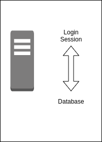

**LAMP Stack**

- LAMP = Linux, Apache, MySQL, PHP
- Most websites will run off a single server.
- Downside is database and Apache compete for the limited server resources.

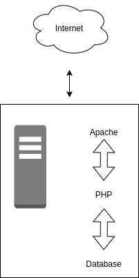

**Client Server**

- Concept of moving application code to the client and different hardware, while using dedicated hardware for
  database server.
- Offloads the application load from the database server.


**Scaling Client Server**

- Scalability achieved by doing processing on application servers.
- Database Server dedicated.
- Often companies will increase the size of the database server to grow further.
- Data storage off loaded to dedicated hardware.

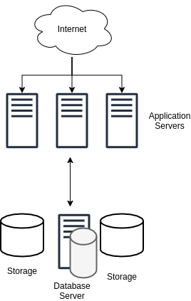

**Scaling Higher**

- Multiple Servers used for the database.
- Example - Oracle Real Application Cluster.
- Improves Scalability over a single database server.
- Improves Reliability since a node can be lost, and the database cluster will continue.
- "Mainframe" like performance.


**Scaling Higher**

- Cloud Scale - Amazon, Google.
- Distributed computing - load spread to many servers.
- Often cheap commodity servers used.
- A large mainframe like systems avoided.
- A different paradigm than Client Server.
- RDBMS's are typically not used due to scalability limitations.

### MySQL Data Types

- A Data Type defines the data type of column - ie text, number, date, etc.
- MySQL does support the standard ANSI SQL Data types.
- Data Types broken down into the following categories:
    - Numeric Data Types
    - Date and Time Data Types
    - String Data Types
    - Spatial Data Types
    - JSON Data Type

**Character Sets**

- ASCII - American Standard Code for Information Interchange:
    - One of the first 'character' sets.
    - Limited to 128 characters.
- UTF-8 is highly popular used for email/web: 1 - 4 bytes long:
    - Up to 1,112,064 characters.

**String Data Types**

- `CHAR, VARCHAR, BINARY, VARBINARY, BLOB, TEXT, ENUM, SET`

**Spatial Data Types**

- MySQL has features to support the storage and analysis of geographic features:
    - Data types for spatial values.
    - Functions for manipulating spatial values.
    - Spatial indexing for improve performance.

**JSON Data Type**

- JSON - JavaScript Object Notation:
    - This is a complex, structured document containing properties and values.
- Storage for JSON data types is similar to BLOB or TEXT data types.
- MySQL will convert the JSON to an internal format for optimized storage and searching:
    - Some formatting may lost and ordering of properties may change.
- MySQL supports searching of JSON document properties.
- MySQL allows you to update portions of a JSON document (no replace needed).

**Client Protocols**

- TCP/IP - Most common.
- SOCKET - Unix/OSX/Linux Only.
- PIPE - Windows Only.
- MEMORY - Windows Only.

**TCP/IP**

- TCP/IP - Transmission Control Protocol / Internet Protocol.
- DNS - Domain Name Service - Associates an IP address with a human readable name.
- "localhost" is the computer you are on.
- "port" is a logical connection endpoint of an IP Address.
- Ports range from 0 to 65535.
- MySQL by default will connect on port 3306.

```console
mysql -u root -p

--------------------------

mysql> status
mysql> show databases;
mysql> use mysql;
mysql> show tables;
mysql> describe user;
mysql> select host, user from user;
```

**MySQL docker**

```console
docker run --name panda-mysql -e MYSQL_ROOT_PASSWORD=password -d mysql
docker exec -it panda-mysql bash

--------------DOCKER_CONTAINER--------------------
# mysql -u root -p
---------------------MYSQL------------------------
mysql> 
```

## Spring Boot App and MySQL

**Configure docker mysql**

```console
docker run --name mysqldb -p 3306:3306 -e MYSQL_ALLOW_EMPTY_PASSWORD=yes -d mysql
```

**Configure mysql**

```console
#Create Databases
CREATE DATABASE dev;
CREATE DATABASE prod;

------------------------
#Create database service accounts
CREATE USER 'dev_user'@'localhost' IDENTIFIED BY 'password';
CREATE USER 'prod_user'@'localhost' IDENTIFIED BY 'password';
CREATE USER 'dev_user'@'%' IDENTIFIED BY 'password';
CREATE USER 'prod_user'@'%' IDENTIFIED BY 'password';

------------------------
#Database grants
GRANT SELECT ON dev.* to 'dev_user'@'localhost';
GRANT INSERT ON dev.* to 'dev_user'@'localhost';
GRANT DELETE ON dev.* to 'dev_user'@'localhost';
GRANT UPDATE ON dev.* to 'dev_user'@'localhost';
GRANT SELECT ON prod.* to 'prod_user'@'localhost';
GRANT INSERT ON prod.* to 'prod_user'@'localhost';
GRANT DELETE ON prod.* to 'prod_user'@'localhost';
GRANT UPDATE ON prod.* to 'prod_user'@'localhost';
GRANT SELECT ON sfg_dev.* to 'sfg_dev_user'@'%';
GRANT INSERT ON sfg_dev.* to 'sfg_dev_user'@'%';
GRANT DELETE ON sfg_dev.* to 'sfg_dev_user'@'%';
GRANT UPDATE ON sfg_dev.* to 'sfg_dev_user'@'%';
GRANT SELECT ON prod.* to 'prod_user'@'%';
GRANT INSERT ON prod.* to 'prod_user'@'%';
GRANT DELETE ON prod.* to 'prod_user'@'%';
GRANT UPDATE ON prod.* to 'prod_user'@'%';
```

## MongoDB

- MongoDB is a document oriented database.
- Developed in C++.
- MongoDB is a NoSQL database.
- MongoDB documents stored in BSON:
    - Binary JSON.
- Originally Developed as a PAAS - Platform as a Service.

**Why Use MongoDB?**

- MongoDB is great for high insert systems:
    - Such as sensor readings, social media systems, advertising systems.
- Good when you need schema flexibility.
- Can also support a high number of reads per second.

**Why Avoid MongoDB?**

- MongoDB has no concept of transactions.
    - No A.C.I.D
    - No locking for transactional support, hence faster inserts.
- Not good for concurrent updates.

| RDBMS | MongoDB |
|---|---|
| Database | Database |
| Table | Collection |
| Row | Document |
| Column | Field |
| Table Join | Embedded Documents |
| Primary Key | Primary Key |
| Aggregation | Aggregation Pipeline |

## Swagger

**REST vs SOAP**

- A cornerstone of SOAP is the WSDL (Web Services Description Language).
- WSDL is an XML document, describing a web service.
- Can also be thought of as a 'contract'.
- There is no formal WSDL for RESTful APIs.
- Hence Swagger.

**Swagger**

- Swagger is a Specification.
- JSON for Metadata.
- JSON for API Definition.
- JSON for Schema for the Model Specification.
- The Swagger Specification is Machine Readable.
- Also is Language Agnostic.
- Not just for Java and Spring.
- Swagger supported for most popular server side and client side languages.

**The Swagger Eco System**

- Swagger UI - HTML, Javascript and CSS components dynamically generate documentation from a Swagger Compliant API.
- Swagger Editor - Edit API Specifications in YAML and preview documentation real time.
- Swagger Codegen - Create client libraries and server stubs from a Swagger definition.

**The Swagger Specification**

- Can be JSON or YAML.
- Field names are case-sensitive.
- Data types based on JSON-Schema.
- Models are described using Schema Object, of JSON Schema.
- Swagger 2 uses JSON Schema Draft 4.

***

## Content Negotiation in Spring

**Content Negotiating View Resolver**

- Used by Spring MVC to determine view handler to use.
- Auto Configured by Spring Boot.
- The Content Negotiating View Resolver will determine the view to use to render the data of the model
  to the client.

**Content Type**

- View to use determined by Content Type in HTTP Header:
    - `application/json`, `application/xml`, `text/html`
- If view for requested Content Type not found, HTTP Status `406` Not Acceptable is returned.

## JMS Messaging

- **JMS** - Java Messaging Service.
- JMS is a Java API which allows a Java Application to send a message to another application.
    - Generally the other application is a Java application.
- JMS is a standard Java API which requires an underlying implementation to be provided:
    - Much like JPA - where JPA is the API standard, and Hibernate is the implementation.
- JMS is highly scalable and allows you to loosely couple applications using asynchronous messaging.

### JMS Implementation

- Amazon SQS
- **Apache ActiveMQ**
- JBoss Messaging
- IBM MQ - (Closed source / paid)
- OracleAQ - (Closed Source / paid)
- RabbitMQ

### Why Use JMS over REST?

- JMS is a true messaging service.
- Asynchronous - send and forget!
- Greater throughput - the HTTP protocol is slow comparatively.
    - JMS protocols are VERY performant.
- Flexibility in message delivery - Deliver to one or many consumers.
- Security - JMS has a very robust security.
- Reliability - Can guarantee message delivery.

### Types of Messaging

- **Point to Point**
    - Message queued and delivered to one consumer.
    - Can have multiple consumers - but message will be delivered only ONCE.
    - Consumers connect to a queue.
- **Publish / Subscribe**
    - Message delivered to one or more subscribers.
    - Subscribers will subscribe to a topic, then receive a copy of all messages sent to the topic.

**Point to Point**


**Publish / Subscribe**


### Key Terms

- JMS Provider - JMS Implementation.
- JMS Client - Application which sends or receives messages from the JMS provider.
- JMS Producer or Publisher - JMS Client which sends messages.
- JMS Consumer or Subscriber - JMS Client which receives messages.
- JMS Message - the entity of data sent.
- JMS Queue:
    - Queue for point-to-point messages.
    - Often FIFO.
- JMS Topic - Similar to queue - but for publish and subscribe.

### JMS Message

- A JMS Message contains:
    - **Header:** Contains metadata about the message.
    - **Properties:** Message properties are in 3 sections:
        - **Application:** From Java Application sending message.
        - **Provider:** Used by the JMS provider and are implementation specific.
        - **Standard Properties:**
            - Defined by the JMS API.
            - Might not be supported by the provider.
    - **Payload:** The message itself.

### JMS Header Properties

- **JMSCorrelationID:**
    - String value, typically a UUID.
    - Set by application, often used to trace a message through multiple consumers.
- **JMSExpires:**
    - Long - zero, does not expire.
    - Else, time when message will expire and be removed from the queue.
- **JMSMessageId:**
    - String value, typically set by the JMS Provider.
- **JMSPriority:** Integer - Priority of the message.
- **JMSTimestamp*:* - Long - Time message sent.
- **JMS:** - String - The type of the message.
- **JMSReplyTo:** Queue or topic which sender is expecting replies.
- **JMSRedelivery:** Boolean - Has message been re-delivered?
- **JMSDeliveryMode:** Integer, set by JMS Provider for delivery mode:
    - **Persistent:** JMS Provider should make the best effort to deliver a message.
    - **Non-Persistent:** Occasional message lost is acceptable.

### JMS Message Properties

- **JMSXUserID:**
    - String User Id sending message.
    - Set by JMS Provider.
- **JMSXAppID:**
    - String ID of the application sending the message.
    - Set by JMS Provider.
- **JMSXDeliveryCount:**
    - Int Number of delivery attempts.
    - Set by JMS Provider.
- **JMSXGroupID:**
    - String the message group which the message is part of.
    - Set by a client.
- **JMSXGroupSeq:**
    - Int sequence number of message in group.
    - Set by a cLient.
- **JMSXProducerTDIX:**
    - String Transaction ID when message produced.
    - Set by JMS Producer.
- **JMSXConsumerTXID:**
    - String Transaction ID when the message consumed.
    - Set by JMS Provider.
- **JMSXRcvTimestamp:**
    - Long Timestamp when message delivered to consumer.
    - Set by JMS Provider.
- **JMSXState:**
    - Int state of the JMS Message.
    - Set by JMS Provider.

### JMS Custom Properties

- The JMS Client can set custom properties on messages.
- Properties set as key / value pairs (String value).
- Values must be of type:
    - String, boolean, byte, double, float, int, short, long, Object.

### JMS Provider Properties

- The JMS Client can also set JMS Provider Specific properties.
- These properties set as `JMS_<PROVIDER_NAME>`
- JMS Provider specific properties allow the client to utilize features specific to the JMS Provider.

### JMS Message Types

- **Message:**
    - Just message, no payload.
    - Often used to notify about events.
- **ByteMessage:** Payload is an array of bytes.
- **TextMessage:** Message stored as a string (JSON or XML).
- **StreamMessage:** Sequence of Java primitives.
- **MapMessage:** Message is name value pairs.
- **ObjectMessage:** Message is a serialized Java object.

**Which Message Type Use**

- JMS 1.0 - Java to Java messaging.
- JMS TextMessages with JSON or XML payloads favored:
    - Decoupled from Java.
    - Bridge to non-java providers.
    - Make migration to a non-JMS provider less painful.
        - Important since messaging is becoming more generic and abstracted.


# Spring Reactive

# Reactive Programming

**Reactive**

- Reactive Systems - Architecture and Design, ie Cloud Native.
- Reactive Programming - Generally Event Based.
- Functional Reactive Programming (FRP) - Often confused with Reactive Programming.

## Reactive Manifesto


**Responsive**

- The system responds in a timely manner.
- Responsiveness is the cornerstone of usability and utility.
- Responsiveness also means problems may detect quickly and dealt with effectively.
- Responsive systems provide rapid and consistent response times.
- Consistent behavior simplifies error handling, builds end user confidence, and encourages further interaction.

**Resilient**

- System stays responsive in the face of failure.
- Resilience achieved by replication, containment, isolation and delegation.
- Failures contained within each component.
- Parts of the system can fail, without compromising the system as a whole.
- Recovery of each component delegated to another.
- High-availability ensured by replication where necessary.

**Elastic**

- The system stays responsive under varying workload.
- Reactive Systems can react to changes in the input rate by increasing or decreasing resources allocated to service inputs.
- Reactive Systems achieve elasticity in a cost effective way on commodity hardware and software platforms.

**Message Driven**

- Reactive Systems rely on asynchronous message passing to establish a boundary between components:
    - This ensures loose coupling, isolation and location transparency.
- Message passing enables load management, elasticity and flow control.
- Location transparent messaging makes management of failures possible.
- Non-blocking communication allows recipients to only consume resources whike active, leading to less system overhead.

**Reactive Programming with Reactive Systems**

- Reactive Programming is a useful implementation technique.
- Reactive programming focuses on non-blocking, asynchronous execution - a key characteristic of Reactive Systems.
- Reactive Programming is just one tool in building Reactive Systems.

### Features of Reactive Programming

- Data Streams
- Asynchronous
- Non-blocking
- Backpressure
- Failures as Messages

**Data Stream**

- Data Streams can be just about anything.
- Mouse clicks, or other user interactions.
- JMS Messages, RESTful Service calls, Twitter feed, Stock Trades, list of data from a database.
- A stream is a sequence of events ordered in time.
- Events you want to listen to.

**Asynchronous**

- Events captured asynchronously.
- A function defined to execute when an event emitted.
- Another function defined if an error emitted.
- Another function defined when complete is emitted.


**ReactiveX Observable**

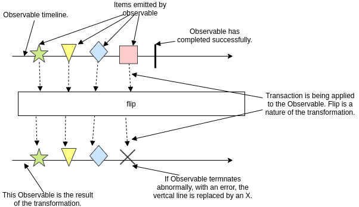

**Non-Blocking**

- In Blocking, the code will stop and wait for more data (ie reading from disk, network, etc).
- Non-blocking in contrast, will process available data, ask to be notified when more is available, then continue.

**Multi Threaded Server**


**Node.js Server**


**Back Pressure**

- The ability of the subscriber to throttle data.

**Failures as Messages**

- Exceptions not thrown in a traditional sense.
    - Would break processing of stream.
- Exceptions processed by a handler function.

### Reactive Streams API

- Goal is to create a standard for asynchronous stream processing with non-blocking back pressure.
- Reactive Streams is a set of 4 interfaces which define the API.
    - Publisher
    - Subscriber
    - Subscription
    - Processor
- Adoptions: Akka Streams, MongoDB, Reactive Rabbit, RxJava, Cassandra, ElasticSearch, Kafka, Play.

**Reactive Streams with Backpressure**


**[Spring MVC & Spring WebFlux**


**Spring Reactive Types**

- `Mono` is a publisher with zero, or one element in data stream.
  -`'Flux` is a publisher with zero, or MANY elements in the data stream.
- Both implement the Reactive Streams Publisher interface.

## Spring Web Flux

## Evolution of Programming

- Past:
    - Monolith Applications
    - Run in App Servers
    - Does not embrace Distributed Systems
- Now:
    - Micro Services
    - Run in cloud
    - Embrace Distributed Systems
- Expectations of the App:
    - Scale based on load
    - Use resources efficiently
    - Latency or Response Time should be faster

### Rest API

**Handling concurrent request**

- Thread per request model.
- Managed by property (thread pool size):
    - `server.tomcat.max-threads`
- By default, it can handle 200 connections.
- Can be overriden in `application.properties` or `application.yaml`.
- Each thread takes some memory.
- Common Stack size is 1MB.
- Higher the thread pool size, Higher the memory consumption.
- Application really perform poor with less memory available.
- **Handled today**:
    - Load handled today **horizontal scaling** - Kubernetes or some container orchestration.
- Limitation on handling many concurrent users.
- Move away from "Thread Per Request Model".

### Traditional Rest API

```java
@GetMapping("/v1/items/{id}")
public ResponseEntity<Item> getItem(@PathVariable Integer id) {
    // 1st DB call
    Price price = priceRepository.findById(id).get(); // 1.db-call 2.blocking

    // 2nd rest call
    ResponseEntity<location> locationEntity =
        restTemplate.getForEntity(locationUrl, Locatoion.class); // 1. rest call synchronous
                                                                 // 2. blocking

    Item item = buildItem(price, locationEntity.getBody());
    return ResponseEntity.ok(item);
}
```

- Imperative Style APIs:
    - Top-down approach.
    - Inefficient use of resources.
- **Blocking** and **Synchronous**.
- Need to make calls asynchronous, basically non-blocking.
- Currently, in Java we have::
    - Callback
    - Futures
- Callbacks:
    - Complex
    - No return value
    - Code is hard to read and maintain
- Future:
    - Returns Future instance
    - Hard to compose multiple asynchronous operations
- Comparable Future:
    - Introduced as part of Java8.
    - Supports functional style API.
    - Easy to compose multiple Asynchronous operations.
    - Not great fit asynchronous call with multiple items.

```java
@GetMapping("/v1/items")
public ResponseEntity<Item> getAllItems() {
    List<Item> items = itemRepository.getAllItems();
    return Response.ok(items);
}
```

- Application may crash with Out Of Memory error.
- Client might be overwhelmed with huge data.
- How to avoid this?
    - BackPressure
- **Summing up**:
    - Limit on the number of Concurrent users.
    - Synchronous and Blocking.
    - Imperative Style API.
    - No Back Pressure support.
- **Better API Design**:
    - Asynchronous and Non Blocking.
    - Move away from Thread per request model.
    - Use fewer threads.
    - Back Pressure compatible.

***

### Reactive Programming

- New programming paradigm.
- Asynchronous and Non Blocking.
- Data flow as an **Event/Message Driven** stream.
- Functional Style Code.
- Back Pressure on Data Streams.

**Data flows as an Event/Message Driven stream**

- One **Event of Message** for a every result item from Data Source.
- Data Sources:
    - Data Base
    - External Service
    - File
- One **Event or Message** form **completion or error**.


- Error Flow.

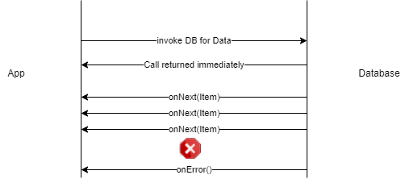

- No Data / Save Data.


- **Summary - Data flow as an Event Driven stream**:
    - `OnNext(item)` - Data Stream events.
    - `OnComplete()` - Completion/Success event.
    - `OnError()` - Error Event.

**Functional Style Code**

- Simpler to Streams API.
- Easy to work with Lambdas.
- **Back Pressure on Data Stream**

**Reactive Streams Specification**

- Specification or Rules for a Reactive Stream.
- Who created specification:
    - Pivotal, Netflix, LightBend, Twitter.
- Publisher
- Subscriber
- Subscription
- Processor

**Publisher**

```java
public interface Publisher<T> {
    public void subscribe(Subscriber<? super T> s);
}
```
- Represents the Data Source:
    - Data Base
    - External Service

**Subscriber**

```java
public interface Subscriber<T> {
    public void onSubscribe(Subscription s);
    public void onNext(T t);
    public void onError(Throwable t);
    public void onComplete();
}
```

**Subscription**

```java
public interface Subscription {
    public void request(long n);
    public void cancel();
}
```


**Publisher/Subscriber Event Flow**


**Processor**

```java
public interface Processor<T,R extends Subscriber<T>, Publisher<R>> { }
```

**Reactive Library**

- Implementation of Reactive Stream Specification:
    - Publisher
    - Subscriber
    - Subscription
    - Processor
- Ractor or Project Reactor:
    - Recommended library for Spring Boot.

***

## Reactor types

### reactor-core

- Core library for project reactor.
- Implementation of Reactive Streams Specification.
- `Flux` and `Mono`.
- Reactive Types of project reactor.
- `Flux` - Represents 0 to N elements.
- `Mono` - Represents 0 to 1 element.

### Flux - 0 to N elements

```java
Flux.just("Spring", "Spring Boot", "Reactive Spring Boot")
    .map(s -> s.concat("flux"))
    .subscribe(System.out::println);
```

### Mono - 0 to 1 elements

```java
Mono.just("Spring")
    .map(s -> s.concat("mono"))
    .subscribe(System.out::println);
```

***

## Back Pressure on Reactive Data Streams

### Default Data Flow - Project Reactor


### What is Backpressure ?

- Subscriber controls the data flow from the Publisher.


### Project Reactor Communication Model


***

## Spring WebFlux - Functional Web

- Use `Functions` to route the request and response.
- `RouterFunction` and `HandlerFunction`


### RouterFunction

- Used to route the incoming request.
- Similar to the functionality of `@RequestMapping` annotation.

```java
@GetMapping("/flux")
public Flux<Integer> returnFlux() {
    return Flux.just(1,2,3,4)
            .delayElements(Duration.ofSeconds(1))
            .log();
}
```

### Handler Function

- Handles the request and response.
- Similar to the body of the `@RequestMapping` annotation.

```java
@GetMapping("/flux")
public Flux<Integer> returnFlux() {
    return Flux.just(1,2,3,4)
            .delayElements(Duration.ofSeconds(1))
            .log();
}
```

- ServerRequest and ServerResponse.
- ServerRequest represents the HttpRequest.
- ServerResponse represents the HttpResponse.

### Spring WebFlux - Non Blocking Request/Response


**Flux Endpoint**

```java
@GetMapping("/flux")
public Flux<Integer> returnFlux() {
    return Flux.just(1,2,3,4)
            .delayElements(Duration.ofSeconds(1))
            .log();
}
```

**Spring WebFlux - Request/Response**

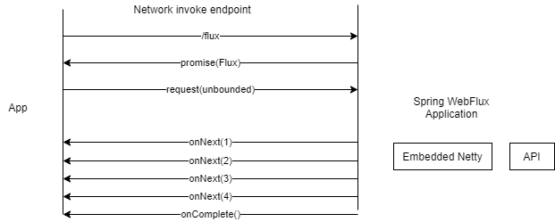

***

## Netty

- Netty is an asynchronous event-driven network application framework for rapid development
  of maintainable high performance protocol servers & clients.
- Netty is build on top of Java.
- Used by:
    - Apache Cassandra, Google, Facebook.
- Protocol supported::
    - FTP
    - HTTP
    - SMTP
    - WebSocket

### Netty - Asynchronous

**Spring Webflux + Netty**

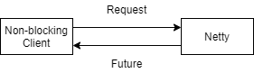

**Spring MVC + Tomcat**


- Being Asynchronous - Frees us from the blocking calls.
- Handles large number of connections.

### Events in Netty

- Client requesting for a new connection treated as an event.
- Client requesting for data treated as an event.
- Client posting for data treated as an event.
- Errors treated as event.

### Netty - Channel

- Channel - Represents the connection between the client and server.


- Inbound events:
    - Requesting for Data.
    - Posting Data.
- Outbound events:
    - Opening or closing a connection.
    - Sending response to the client.

### Netty - Event Loop

- Loop the looks for events.
- EventLoop is registered with a single dedicated thread.

### Channel LifeCycle

- Channel created.
- Channel registered with event loop.
- Channel is Active.
- Channel is InActive.
- Channel unregistered.

### Netty - End to End, Threads, Execution Mode

**EventLoop + Channel**

**EventLoop + Multiple Channel**


- No of EventLoops == 2 X no of processors for the virtual machine.
- `Runtime.getRuntime().availableProcessors()`
- EventLoopGroup - 2 EventLoop Groups are in Netty.
- How many threads - Number of threads == 2 X no of processors for the virtual machine.

```console
sudo service mongod start
java -jar -Dspring.profiles.active=prod build/libs/learn-reactivespring.jar
```

***

## Streaming Endpoint (SSE)

- It is an endpoint once the connection is made its going to keep pushing the data to the
  client as the new data is available.


### Use Cases

- Stock Tickers.
- Weather Updates.
- Flight Arrival/Departure/Delay updates in airports.

### MongoDB

- Tailable Cursor:
    - Connection remains open after all the results retrieved.
- Capped Collections:
    - Collection of fixed-size in MongoDB.
    - Preserves the insertion Order.


# Spring Webflux

# Spring WebFlux


# Spring Rest

# SPRING REST

## RESTful Web Services

- Because of their simplicity and versatility, RESTful web services have become the de-facto standard of web services.
- REST - Representational State Transfer:
    - Representation - Typically `JSON` or `XML`.
    - State Transfer - Typically via `HTTP`.

**RESTful Terminology**

- Verbs - HTTP Methods: `GET`, `PUT`, `POST`, `DELETE`.
- Messages: The payload of the action (`JSON/XML`).
- URI - Uniform Resource Identifier:
    - A unique string identifying a resource.
- URL - Uniform Resource Locator.
- Idempotence - Execute operation multiple times, without changing the result.
    - Refreshing a web page (HTTP GET operation).
- Stateless - Service does not maintain any client state.
- HATEOAS - Hypermedia As the Engine of application state.

### Richardson Maturity Model (RMM)

- A model used to describe the maturity of RESTful services.
- Unlike SOAP, there is no formal specification for REST.
- RMM is used to describe the quality of the RESTful service.

**RMM Levels**


**Core Technologies**

- Hypermedia
- HTTP
- URI

**Level 0: Swamp of POX**

- POX - Plain Old XML.
- Uses implementing protocol as a transport protocol.
- Typically, uses one URI and one kind of method.
- Examples - RPC, SOAP, XML-RPC.

**Level 1: Resources**

- Uses Multiple URIs to identify specific resources.
- Still uses a single method (GET).
- Breaks large service into distinct URIs.

**Level 2: HTTP Verbs**

- HTTP Verbs used with URIs for described actions.
    - GET `/products/1234`
    - PUT `/products/1234`
    - DELETE `/products/1234`
- Most common in practical use.
- Introduces Verbs to implement actions.

**Level 3: Hypermedia**

- Representation now contains URIs which may be useful to consumers.
- Helps client developers explore the resource.
- No clear standard at time.
- Spring provides an implementation of HATEOS.
- Provides discoverability, making the API more self documenting.

## JSON Data Binding

- Process of converting JSON data to a Java POJO.


- Also, called as:
    - `Serialization / Deserialization`
    - `Marshalling / Unmarshalling`

## JSON Data Binding with Jackson

- Handles data binding between JSON and Java.
- Package - `com.fasterxml.jackson.databind`.


- Converts JSON to Java POJO, call setter on POJO:
    - It does not call private method, so define public setters.

```java
ObjectMapper mapper = new ObjectMapper();

// Read from file and map to Java POJO
Student student = mapper.readValue(new File("myjson.json"), Student.class);

System.out.println(student.getFirstName());

// Write JSON to output file
mapper.enable(SerializationFeature.INDENT_OUTPUT);
mapper.writeValue(new File("output.json"), student);
```

### Spring Jackson Support

- Spring automatically handle Jackson.
- JSON data binding passed to REST controller converted to POJO.
- Java object returned from REST controller converted to JSON.

### Creating Spring REST

- Add maven dependency:
    - `spring-webmvc`
    - `jackson-databind`
    - `javax.servlet-api`
- Java Configuration - `@Configuration`.

```java
@Configuration
@EnableWebMvc
@ComponentScan(basePackage = "com.panda.spring")
public class AppConfig {
}
```

- Config Servlet Initializer - `AbstractAnnotationConfigDispatcherServletInitializer`.

```java
public class SpringMVCDispatcherServlet extends AbstractAnnotationConfigDispatcherServletInitializer {
    // override methods
    // getRootConfigClasses(), getServletConfigClasses(), getServletMappings()
}
```

- Create Rest Service `@RestController`.

```java
@RestController
@RequestMapping("/test")
public class DemoController {
    @GetMapping("/hello")
    public String hello() {
        return "Hello World";
    }
}
```

- Spring REST and Jackson POJOs are automatically converted to JSON.

### Path Variables

- Retrieve by id - GET `/api/students/{id}`


```java
@GetMapping("/students/{id}")
public Student getStudent(@PathVariable int id) {
}
```

## Exception Handling

- Error response class:
    - Java POJOs.
    - Jackson converts it to JSON.
- Exception class - extends `RuntimeException`.
- Update REST to throw exception if necessary.
- Add exception handler `@ExceptionHandler`:
    - Exception handler will return a `ResponseEntity`.
    - `ResponseEntity` is a wrapper for the HTTP response object.
    - `ResponseEntity` provides control to specify:
        - HTTP status code.
        - HTTP headers and Response body.

### `@ControllerAdvice`

- `ControllerAdvice` interceptor/filter.
- Pre-process request to controller.
- Post-process responses to handel exceptions.
- For global exception handling.


```java
@ControllerAdvice
public class GlobalExceptionHandler {
}
```

## API

- Define API Requirements.
- Identify resources:
    - Plural forms of resources `/api/customers`.
- HTTP methods to assign actions on resources:
    - `GET`, `POST`, `PUT`, `DELETE`

| Http Method | Endpoint | CRUD Action |
|---|---|---|
| POST | /api/students | Create new student |
| GET | /api/students | Read list of students |
| GET | /api/students/{id} | Read single student |
| PUT | /api/students | Update existing student |
| DELETE | /api/students/{id} | Delete student |

- Don't include actions in an endpoint, instead use HTTP to assign actions.

## CRUD

### Read GET

```java
@RestController
@RequestMapping("/api")
public class StudentRestController {
    @Autowired
    private StudentService studentService;

    @GetMapping("/students")
    public List<Students> getStudents() {
        return studentService.getStudents();
    }
}
```

### Create POST

- `@RequestBody` to access the request body as POJO.

```java
@PostMapping("/students")
public Student addStudent(@RequestBody Student student) {
    student.setId(0); // id of 0 DAO code will perform INSERT new Student
    studentService.saveStudent(student);
    return student;
}

```

- Sending JSON data to Spring REST Controller.
- For a controller to process JSON data, need to set a HTTP request header:
    - `Content-type: application/json`.
- Configure REST client to send the correct HTTP request header (using Postman for instance).

### Update PUT

```java
@PutMapping("/students")
public Student updateStudent(@RequestBody Student student) {
    studentService.saveStudent(student);
    return student;
}
```

### Delete DELETE

```java
@DeleteMapping("/students/{studentId}")
public String deleteStudent(@PathVariable int studentId) {

    Student student = studentService.getStudent(studentId);

    if (student == null) {
        throw new StudentNotFoundException("Student with id not found : " + studentId);
    }

    studentService.deleteStudent(studentId);
    return "Deleted student with id : " + studentId;
}
```

## Richardson Maturity Model

- A model used to describe the maturity of RESTful services.
- No formal specification for REST.
- RMM is used to describe the quality of the RESTful service.

## RMM levels


### Level 0 - Swamp of POX

- POX - Plain Old XML.
- Uses implementing protocol as a transport protocol.
- Typically, uses one URI and one kind of method.
- Examples - `RPC`, `SOAP`, `XML-RPC`.

```
http://localhost/getPost
http://localhost/deletePost
http://localhost/doThis
```

### Level 1 - Resources

- Uses Multiple URIs to identify specific resources.
- Examples:
    - `http://localhost:8080/panda/123`
    - `http://localhost:8080/panda/321`
- Uses a single method **GET**.

### Level 2 - HTTP Verbs

- HTTP Verbs used with URIs for desired actions.
- Examples:
    - GET `/students/123` - return student with id 123.
    - PUT `/students/123` - (with XML/JSON body) to update data for student 123.
    - DELETE `/students/123` - to delete student with id 123.
- Most common.
- `Level1 + methods`

### Level 3: Hypermedia

- Representation contains URIs which may be useful to consumers.
- Helps clients explore the resource.
- Not standardized at this time.
- Spring provides an implementation of HATEOS.
- `Level2 + HATEOAS` - Data + Next Possible Actions.

### Summary

- Level 1: Breaks large service into distinct URIs.
- Level 2: Introduces Verbs to implement actions.
- Level 3: Provides discoverability, making the API more self documenting.
- Best Practice:
    - Consumer first, good documentation.
    - Make best use of HTTP.
    - Proper response status:
        - 200 - Success
        - 201 - Created
        - 404 - Resource not found
        - 400 - Bad request
        - 401 - Unauthorized
        - 500 - Server error
    - No secure info in uri.
    - Use plurals.
    - Prefer `/users/1` to `/user/1`.
    - Use nouns for resources.

***

## Introduction to web services

### Web Service

- Software system designed to support interoperable machine-to-machine interaction over a network.
- 3 keys:
    - Designed for machine-to-machine (or application-to-application) interaction.
    - Should be interoperable - Not platform dependent.
    - Should allow communication over a network.

**Q1: How does data exchange between applications take place?**

- Request (Input)
- Response (Output)

**Q2: How can we make web service platform independent?**

- Request and Response in platform independent format.
- Request format: `json`, `xml`.

**Q3: How does the Application A know the format of Request and Response?**

- Service definition:
    - Request/Response Format
    - Request Structure
    - Response Structure
    - Endpoint

### Key terminology

- Request - Input to web service.
- Response - Output of web service.
- Message Exchange Format:
    - Format of request nad response - `XML` and `JSON`.
- Service provider or Server - WebService, host the webservice.
- Service consumer or Client - Application, consuming webservice.
- Service Definition - contract between service provider and service consumer:
    - Defines format request and response.
    - What is structure of request and response.
    - Where is service available.
- Transport: How a service called:
    - HTTP and MQ communication over a queue (WebSphere MQ).

## REST

- Resource has an URI (Uniform Resource Identifier):
    - `/user/majka/todos/1`
    - `/user/majka/todos`
    - `/user/majka`
- Resource representations:
    - `XML`
    - `HTML`
    - `JSON`
- Create a User - `POST /users`
- Delete a User - `DELETE /users/1`
- Get all Users - `GET /users`
- Get one Users - `GET /users/1`
- Data Exchange Format:
    - No restrictions.
    - JSON popular.
- Transport - Only HTTP.
- Service Definition:
    - No standard
    - `WADL/Swagger/`
- Dispatcher servlet handling all requests, front controller for Spring MVC, which is right controller
  to execute this request:
    - `@RestController`
    - `@ResponseBody`

**What is a dispatcher servlet?**

- Front controller pattern for spring mvc framework.

**Who is configuring dispatcher servlet?**

- `SpringBootAutoConfiguration`

**What does a dispatcher servlet do?**

- Dispatcher servlet is handling all the requests, tells Jackson to do the conversion to JSON.

**How does the HelloWorldBean object get converted to JSON?**

- `SpringBootAutoConfiguration`, message converter Jackson beans are getting initialized.

**Who is configuring error mapping?**

- `SpringBootAutoConfiguration`

### AUTO-CONFIGURATION

- `DispatcherServletAutoConfiguration:` Found a dispatcher servlet on classpath.
- `ErrorMvcAutoConfiguration:` Configure error page, error controller, few error attributes,
  default error view resolver.
- `HttpMessageConvertersAutoConfiguration:` Bean automatically converted to JSON:
    - `Jackson2ObjectMapper` - does conversion from JSON to object and object to JSON.
- Mapping servlet - `dispatcherServlet` to `[/]` - dispatcher servlet is handling all the requests:
    - Front controller pattern for spring mvc framework.
- Mapper `{[hello-world], methods=[GET]}`:
    - Which method executed.
    - `@RestController`:
        - `@ResponseBody`, response from that will be mapped to message converter to the same format.

## Internationalization

### Configuration

- `LocaleResolver:` Default locale - Locale.US.
- `ResourceBundleMessageSource`

### Usage

- Autowire MessageSource.

```java
@RequestHeader(value = "Accept-Language", required=false)
Locale locale messageSource.getMessage("helloWorld.message", null, locale) {
    // ...
}
```

## Versioning

- MediaType versioning ("content negotiation" or "accept header") - GitHub.
- Custom headers versioning - Micsosoft.
- URI versioning - Twitter.
- Request Parameter versioning - Amazon.

***

## Spring security

```xml
<dependency>
    <groupId>org.springframework.boot</groupId>
    <artifactId>spring-boot-starter-security</artifactId>
</dependency>
```

## JWT

### Basic authentication

- No expiration time.
- No user details.

### Custom token system

- Both teams should understand.
- Custom structure.
- Possible security flows.

### JWT

- Standard
- Can contain user details and authorizations.

### Token processing

**JwtTokenUtil.java**

```json
{
    "token": "eyJhbGciOiJIUzUxMiJ9.ZsA8i14l9WB_hVoZFk7VU--"
}
```

### GET Token

```
POST to http://localhost:8080/authenticate
```

- Request

```json
{
    "username": "panda",
    "password": "dummy"
}
```

- Response

```json
{
    "token": "TOKEN_VALUE"
}
```

### Refresh token

```
GET to http://localhost:8080/refresh

Header - Authorization: 'Bearer JWT_TOKEN'
```

### Authorize all other requests

- GET/POST/PUT/DELETE to `http://localhost:8080/resource`:
    - Header - `Authorization: "Bearer JWT_TOKEN"`
- Filter - `JwtTokenAuthorizationOncePerRequestFilter`.

### All together

```java
JWTWebSecurityConfig extends WebSecurityConfigurerAdapterConfigures
```

- userDetailService with BCryptPasswordEncoder
- Statelessness
- AuthenticationEntryPoint
- JwtTokenAuthorizationOncePerRequestFilter
- h2-console


# Spring Security

# Spring Security

- Spring Framework for Security.
- Using Servlet filters in background.
- Declarative and programmatic methods of securing.

## Spring Security - Servlet Filters

- Servlet filters used to pre-process / post-process web requests.
- Servlet filters can route web requests based on security logic.
- Spring provides security functionality with servlet filters.

### Spring Security - Overview


### Security concepts

- **Authentication:** Check user id and password with credentials stored in app / database.
- **Authorization:** Check if user has an authorized role.

### Declarative Security

- Security constrains defined in configuration:
    - Java config `@Configuration`.
    - Spring XML config.
- Provides separation of concerns between application code and security.

### Programmatic Security

- Spring Security API for custom application config.
- Customization for specific app requirements.

### Login Methods

- HTTP Basic Authentication.
- Default login form.
- Custom login form.

### HTTP Basic Authentication

- Build in for Browser.
- Default login form.

### Authentication and Authorization

- In-memory
- JDBC
- LDAP
- Custom / Plugable

## Spring Security - Config

### Java Configuration

- Maven dependencies:
    - `spring-webmvc`
    - `jstl`
    - `javax.servlet-api`
    - `javax.servlet.jsp-api`
- Enabling the MVC Java Config:
    - `@EnableWebMvc:`
        - Provides similar support to `<mvc:annotation-driven/>` in XML.
        - Adds conversion, formatting and validation support.
        - Processing of `@Controller` classes and `@RequestMapping` methods.

```java
@Configuration
@EnableWebMvc
@ComponentScan(basePackages="com.mybank.springsecurity")
public class AppConfig {
    // bean for view resolver
    @Bean
    public ViewResolver viewResolver() {
        InternalResourceViewResolver viewResolver = new InternalResourceViewResolver();

        viewResolver.setPrefix("/WEB-INF/view/");
        viewResolver.setSuffix(".jsp");

        return viewResolver;
    }
}

```

### Web App Initializer

- Spring MVC provides support for web app initializer.
- Code automatically detected.
- Code used to initialize the servlet container.
- `AbstractAnnotationConfigDispatcherServletInitializer:`
    - Extend this class.
    - Override methods.
    - Specify servlet mapping and location of app config.

```java
public class SpringMvcDispatcherServletInitializer extends AbstractAnnotationConfigDispatcherServletInitializer {

    protected Class<?> getRootConfigClasses() {
        return null;
    }

    protected Class<?>[] getServletConfigClasses() {
        return new Class[] { AppConfig.class };
    }

    protected String[] getServletMappings() {
        return new String[] { "/" };
    }
}
```

### Spring Controller

```java
@Controller
public class DemoController {
    @GetMapping("/")
    public String showHome() {
        return "home";
    }
}
```

### Spring Security - Configuration

- Maven dependency:
    - `spring-security-web`
    - `spring-security-config`
- Spring Security Web App Initializer:
    - Code is used to initialize the servlet container.
    - Special class to register to Spring Security Filters:
        - `AbstractSecurityWebApplicationInitializer`

```java
public class SpringSecurityWebApplicationInitializer extends AbstractSecurityWebApplicationInitializer { }
```

```java
@Configuration
@EnableWebSecurity
public class SecurityConfig extends WebSecurityConfigurerAdapter {
    // ...
}
```

### Custom Login

```java
@Configuration
@EnableWebSecurity
public class SecurityConfig extends WebSecurityConfigurarAdapter {
    @Override
    protected void configure(HttpSecurity http) throws Exception {
        http.authorizeRequests()
            .anyResult().authorized()
            .and()
            .fromLogin()
                .loginPage("/loginPage")
                .loginProcessingUrl("/authenticatePlease")
                .permitAll();
    }
}
```

**Login Controller**

```java
@Controller
public class LoginController {
    @GetMapping("/loginPage")
    public String login() {
        return "login";
    }
}

```

**Login Form**

```html
<form:form action="${pageContext.request.contextPath}/authenticatePlease" method="POST">
</form:form>
```

### Spring Security Logout

- Add logout support to Spring Security Configuration.

```java
@Configuration
@EnableWebSecurity
public class SecurityConfig extends WebSecurityConfigurarAdapter {
    @Override
    protected void configure(HttpSecurity http) throws Exception {
        http.authorizeRequests()
            .anyResult().authorized()
            .and()
            .fromLogin()
                .loginPage("/loginPage")
                .loginProcessingUrl("/authenticatePlease")
                .permitAll();
            .and()
            .logout().permitAll();
    }
}
```

```html
<form:form action="${pageContext.request.contextPath}/logout" method="POST">
    <input type="submit" value="Logout" />
</form:form>
```

### Spring Security - Cross Site Request Forgery (CSRF)

- **CSRF:**
    - A security attack where an evil website tricks you into executing an action on a web application that
      you are currently logged in.
    - Logged in an e-commerce app and buy unwanted stuff
- Protect:
    - Embed additional authentication aka/token into all HTML forms.
    - On subsequent requests, web app will verify token before processing.
- Enabled by default in Spring Security.
- Spring Security uses te Synchronized Token Pattern:
    - Each request includes a session cookie and randomly generated token.
- For request processing, Spring Security verifies token before processing.
- All handles by Spring Security Filters.
- Use for:
    - Any normal browser web requests.
    - Building a service for non-browser clients.
- Use Spring Security CSRF protection:
    - For form submission use POST.
    - Include CSRF token in form submission.
    - `<form:form>` automatically adds CSRF token.

```html
<form action="..." method="POST">
    <input type="hidden"
           name="${_csrf.parameterName}"
           value="${_csrf.token}" />
</form>
```

### Spring Security - Access based on roles

```java
@Override
protected void configure(HttpSecurity http) throws Exception {
    http.authorizeRequests()
        .antMatchers("/").hasRole("footballer")
        .antMatchers("/zoo/**").hasRole("zookeeper")
        .and()
        .formLogin()
}
```

### Spring Security - custom access denied page

```java
@Override
protected void configure(HttpSecurity http) throws Exception {
    // ...
        .exceptionHandling()
            .accessDeniedPage("/noop");
}

```

### Spring Security - display content based on roles

```html
<security:authorize access="hasRole('zookeeper')">
    <!-- ... -->
</security:authorize>
```

### Spring Security - JDBC

- Spring Security can read user account info from a database.

```sql
CREATE TABLE users (
    username varchar(60) NOT NULL,
    password varchar(60) NOT NULL,
    enabled tinyint(1) NOT NULL.
    PRIMARY KEY (username)
) ENGINE = InnoDB DEFAULT CHARSET=latin1;

```

```sql
INSERT INTO users VALUES
('brajan', '{noop}haslo',1),
('samara', '{noop}haslo',1);
```

- `{noop}` - encoding algorithm id.

```sql
CREATE TABLE authorities (
    username varchar(60) NOT NULL,
    authority varchar(60) NOT NULL,
    UNIQUE KEY authorities_idx_1 (username, authority),
    CONSTRAINT authorities_ibfk_1
    FOREIGN KEY (username)
    REFERENCES users (username)
) ENGINE = InnoDB DEFAULT CHARSET=latin1;
```

```sql
INSERT INTO authorities
VALUES
(brajan, ROLE_MANAGER),
(samara, ROLE_ADMIN);
```

- Maven:
    - `mysql-connector-java`
    - `c3p0`

**mysql.properties**

```properties
jdbc.driver=com.mysql.jdbc.Driver
jdbc.url=jdbc:mysql://localhost:3306/database?useSSL=false
jdbc.user=brajan
jdbc.password=gdziejestsamara

connection.pool.initialPoolSize=5
connection.pool.minPoolSize=5
connection.pool.maxPoolSize=20
connection.pool.maxIdelTime=3000
```

- DataSource configuration.

```java
@Configuration
@EnableWebMvc
@ComponentScan(basePackages="com.mybank")
@PropertySource("classpath:mysql.properties")
public class AppConfig {
    @Autowired
    private Environment env; // hold data read from properties file

    @Bean
    public DataSource securityDataSource() {
    	// create connection pool
    	ComboPooledDataSource dataSource = new ComboPooledDataSource();

    	try {
    		dataSource.setDriverClass(env.getProperty("jdbc.driver"));
    	} catch (PropertyVetoException e) {
    		throw new RuntimeException(e);
    	}
    	// set database connection props
    	dataSource.setJdbcUrl(env.getProperty("jdbc.url"));
        dataSource.setUser(env.getProperty("jdbc.user"));
        dataSource.setPassword(env.getProperty("jdbc.password"));

    	// set connection pool props
        dataSource.setInitialPoolSize(getIntProperty("connection.pool.initialPoolSize"));
        dataSource.setMinPoolSize(getIntProperty("connection.pool.minPoolSize"));
        dataSource.setMaxPoolSize(getIntProperty("connection.pool.maxPoolSize"));
        dataSource.setMaxIdleTime(getIntProperty("connection.pool.maxIdleTime"));

    	return dataSource;
    }

}
```

- Update Spring Security to use JDBC.

```java
@Configuration
@EnableWebSecurity
public class SecurityConfig extends WebSecurityConfigurerAdapter {

    @Autowired
    private DataSource dataSource;

    @Override
    protected void configure(AuthenicationManagerBuilder auth) throws Exception {
        auth.jdbcAuthentication().dataSource(dataSource);
    }

}

```

## Spring Security - Password Encryption

- **bcrypt algorithm:**
    - One way encrypted hashing.
    - Adds random salt to password for protection.
    - Includes support to defeat from brute force attacks.
- Password column at least 68 characters wide:
    - {bcrypt} - 8 chars.
    - encodedPassword - 60 chars.

```sql
('brajan', '{bcrypt}$2a$sdasd$50sdmkMAKdsmiamLSLM',1),
('samara', '{noop}$2a$sdasd$50sdmkMAKdsmiamLSLM',1);
```

***

## Web Application Security

- Security Threats:
    - Cross-site scripting
    - SQL injection
    - Denial-of-service attack
    - Cross-site request forgery

### Authentication & Authorization

**Authentication**

- Verifies you are who you say you are.
- Method:
    - Login form
    - HTTP authentication
    - Custom auth method

**Authorization**

- Determines if you have permission to access a resource.
- Method:
    - Access control URLs
    - Access control lists (ACLs)

### Json Web Token (JWT)

**Header**

```json
{
  "alg": "HS256",
  "typ": "JWT"
}
```

**Payload**

```json
{
  "sub": "john25",
  "name": "John Doe",
  "iat": 1782766618,
  "claims": "create,edit"
}
```

**Signature**

```
256-bit-secret
```

### Security with Json Web Token (JWT)

")

### JPA Repository


## Exception Handling

**Exception**

- An error event that can happen during the execution of a program and disrupts its normal flow.

## Brute Force Attack

```
an attacker submitting many passwords or passphrases with the hope of eventually guessing correctly
```

## Front End Design


# Spring Security 2

# Spring Security

## Spring Security Features

- Provides a portable security mechanism for Java enterprise apps.

### Authentication & Authorization

- **Authentication:** Ensuring a user who they claim to be:
    - HTTP basic
    - Form Based
    - LDAP
    - OpenID
    - X.509
- **Authorization:** Determining if a user allowed to perform an action.

### Security capabilities

- Protection web resources: Requires specific roles to access URLs.
- Authorizing method invocations: Requiring specific roles to access methods.
- Restricting entity access: Constantly Access Lists (CAL) to determine domain object access.

### Extra Features

- Cross Site Request Forgery `CSRF`
- Session Fixation
- Click jacking
- Cross Site Scripting `XSS`
- Password encoding via hash and salt.

### Spring Security Strengths

- Spring approach
- Annotation based
- Spring MVC
- Testing
- Layered security approach

## Security Principles

### Authentication

- Process of identifying an individual using credentials:
    - Username & password
    - Tokens

### Authorization

- Process of granting someone access to a resource:
    - Files
    - Records
    - Databases

## Spring Security Basics

- **MAVEN**:
    - `spring-security-web`
    - `spring-security-config`

### Basic XML Configuration

**web.xml**

```xml
<filter>
    <filter-name>SpringSecurityFilterChain</filter-name>
    <filter-class>org.springframework.web.filter.DelegatingFilterProxy</filter-class>
</filter>
<filter-mapping>
    <filter-name>SpringSecurityFilterChain</filter-name>
    <url-pattern>/*</url-pattern>
</filter-mapping>
<context-param>
    <param-name>ContextConfiguration</param-name>
    <param-value>
        /WEB-INF/Spring/Security-context.xml
    </param-value>
</context-param>
```

**security-context.xml**

```xml
<security:http auto-config="true" use-expressions="false">
    <security:intercept-url pattern="/**" access="ROLE_USER"/>
</security:http>
<security:authentication-manager>
    <security:authentication-provider>
        <security:user-service>
            <security:user name="user" password="password" authorities="ROLE_USER"/>
        </security:user-service>
    </security:suthentication-provider>
</security:authentication-manager>
```

### HTTP Basic Authentication

```xml
<security:http auto-config="true" use-expressions="false">
    <security:http-basic/>
</security:http>
```

### CSRF Token

- `spring-security-taglib`

**login.jsp**

```jsp
<%@ taglib uri="http://www.springframework.org/security/tags" prefix="sec" %>
<sec:csrfInput/>
```

### Authentication

- `UserDetailsService`
- `SecurityContextHolder`
- `UserDetails`
- `AuthenticationProvider`
- `Authentication`

### Security Interceptor

- Decider whether access granted to a particular sources.
- `FilterSecurityInterceptor` enforces access to HTTP resources.
- `MethodSecurityInterceptor` enforces access to method invocations.
- Config using instances of `ConfigAttribute`.

```xml
<filter>
    <filter-name>SpringSecurityFilterChain</filter-name>
    <filter-class>
        org.springframework.web.filter.DelegatingFilterProxy
    </filter-class>
</filter>

<security:http auto-config="true">
    <security:intercept-url pattern="/sample"/>
</security:http>
<security:global-method-security/>

<bean id="SpringSecurityFilterChain" class="org.springframework.security.web.FilterChainProxy">
    <constructor-arg>
        <security-filter-chain pattern="/**" filters="filterSecurityInterceptor"/>
    </constructor-arg>
</bean>
<bean id="filterSecurityInterceptor"
    class="org.springframework.security.web.accept.intercept.FilterSecurityInterceptor"/>
```

### Security Interceptor Types

```java
@Controller
@RequestMapping("/sample")
public class SampleController {
    @RequestMapping("/delete")
    @Secured("ROLE_USER")
    private String delete() {
        return "delete.html";
    }
}
```

### Process

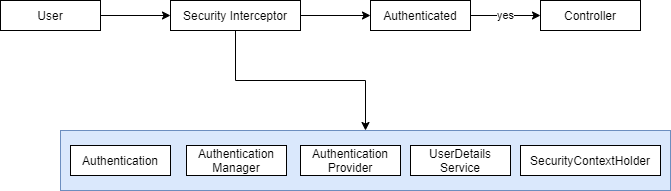

### SecurityContextHolder

```java
SecurityContextHolder.getContext().getAuthentication().getName();
UserEntity user = this.autoUserRepository.findByUsername(username);
```

### UserDetails

**UserEntity.java**

```java
@Entity
@Table(name="USER_ENTITY")
public class UserEntity implements UserDetails {

    @Override
    public Collection<? extends GrantedAuthority> getAuthorities() {
        return AuthorUtils.createAuthority(this.role);
    }

    @Override
    public boolean isAccountNonExpired() {
        return true;
    }

    @Override
    public boolean isAccountNonLocked() {
        return true;
    }

    @Override
    public boolean isCredentialsNonExpired() {
        return true;
    }

    @Override
    public boolean isEnabled() {
        return true;
    }
}
```

**HomeController.java**

```java
@Controller
@RequestMapping("/")
public class HomeController {
    @Autowired
    private UserRepository userRepository;

    @RequestMapping(value="/register", method=RequestMethod.POST)
    public String register(@ModelAttribute UserEntity user) {
        user.setRole("ROLE_USER");
        userRepository.save(user);

        Authentication auth = new UsernamePasswordAuthenticationToken(
            user, userRepository.getPassword(), user.getAuthorities());

        SecurityContextHolder.getContext().setAuthentication(auth);

        return "redirect:/";
    }
}
```

### Custom Authentication Provider

**CustomAuthenticationProvider.java**

```java
@Component("customAuthenticationProvider")
public class CustomAuthenticationProvider implements AuthenticationProvider {

    @Autowired
    private UserRepository repo;

    @Override
    public Authentication authenticate(Authentication authentication) throws AuthenticationException {
        UsernamePasswordAuthenticationToken token =
            (UsernamePasswordAuthenticationToken) authentication;
        UserEntity user = repo.findByUsername(token.getName());

        if (!user.getPassword().equalsIgnoreCase(token.getCredentials().toString())) {
            throw new BadCredentialsException("Invalid credentials");
        }

        return new UsernamePasswordAuthenticationToken(user, user.getPassword(), user.getAuthorities());
    }

    @Override
    public boolean supports(Class<?> authentication) {
        return UsernamePasswordAuthenticationToken.class.equals(authentication);
    }
}
```

**security-context.xml**

```xml
<security:authentication-manager>
    <security:authentication-provider ref="CustomAuthenticationProvider">
</security:authentication-manager>
```

### Custom Authentication Object

**CustomAuthenticationToken.java**

```java
public class CustomAuthenticationToken extends UsernamePasswordAuthenticationToken {
    private String maki;

    public CustomAuthenticationToken(String principal, String credentials, String maki) {
        super(principal, credentials);
        this.maki = maki;
    }

    public CustomAuthenticationToken(UserEntity principal, String credentials,
        Collection<? extends GrantedAuthority> authorities, String maki) {
        super(principal, credentials, authorities);
        this.maki = maki;
    }

    public String getMaki() {
        return maki;
    }
}
```

**CustomAuthenticationFilter.java**

```java
public class CustomAuthenticationFilter extends UsernamePasswordAuthenticationFilter {
    @Override
    public Authentication attemptAuthentication(HttpServletRequest request, HttpServletResponse response)
        throws AuthenticationException {
        String username = super.obtainUsername(request);
        String password = super.obtainPassword(request);
        String maki = request.getParameter("maki");

        CustomAuthenticationToken token = new CustomAuthenticationToken(username, password, maki);
        super.setDetails(request, token);
        return this.getAuthenticationManager().authenticate(token);
    }
}
```

**security-context.xml**

```xml
<security:authentication-manager alias="authenticationManager">
    <security:authentication-provider ref="customAuthenticationProvider"/>
</security:authentication-manager>

<security:http use-expressions="false" entry-point-ref="loginEntry">
    <security:custom-filter ref="customLoginFilter" position="LOGIN_FILTER"/>
</security:http>

<bean id="loginEntry"
    class="org.springframework.security.web.authentication.LoginUrlAuthenticationEntryPoint">
    <constructor-arg value="/login"/>
</bean>
```

## JDBC Authentication

**application-context.xml**

```xml
<jdbc:embedded-database id="datasource" type="H2">
    <jdbc:script location="classpath:init.sql"/>
</jdbc:embedded-database>
```

**security-context.xml**

```xml
<security:authentication-manager>
    <security:authentication-provider>
        <security:jdbc-user-service data-source-ref="datasource"/>
    </security:authentication-provider>
</security:authentication-manager>
```

### Group Based Access Control

**security-context.xml**

```xml
<security:authentication-manager>
    <security:authentication-provider>
        <security:jdbc-user-service data-source-ref="datasource"
            group-authorises-by-username-query=" ... "/>
    </security:authentication-provider>
</security:authentication-manager>
```

### Encoding Password

**security-context.xml**

```xml
<security:authentication-manager>
    <security:authentication-provider>
        <security:jdbc-user-service />
        <security:password-encoder hash="sha-256"/>
    </security:authentication-provider>
</security:authentication-manager>
```

### Salting Hashes

**security-context.xml**

```xml
<bean id="passwordEncoder" class="org.springframework.security.crypto.password.StandardPasswordEncoder"/>
<security:password-encoder ref="passwordEncoder"/>
```

```java
public class PasswordEncoder {
    public static void main(String[] args) {
        StandardPasswordEncoder encoder = new StandardPasswordEncoder();
        String encodedPassword = encoder.encode("password");
    }
}
```

## LDAP Authentication

**spring-security.ldif** - ldap configuration.

### LDAP Authentication Provider

- **MAVEN**:
    - `spring-security-ldap`

**security-context.xml**

```xml
<security:ldap-server id="server"
    uri="ldap://localhost:10389/dc=panda,dc=panda" manager-dn="uid=admin,ou=admin"
    manager-password="pass"/>

<security:authentication-manager>
    <security:ldap-authentication-provider user-search-filter="(uid={0})" />
</security:authentication-manager>
```

### UserDetails Context Mapper

```java
@Component("contextmapper")
public class MyUserDetailsContextMapper implements UserDetailsContextMapper {
    @Override
    public UserDetails mapUserFromContext(DirContextOperations context, String name,
        Collection<? extends GrantedAuthority> auth) {
        UserEntity user = new UserEntity();
        user.setName(context.getStringAttribute("username"));
        user.setEmail(context.getStringAttribute("email"));
        user.setUsername(name);
        user.setAuthorities(auth);
        return user;
    }

    @Override
    public void mapUserToContext(UserDetails user, DirContextAdapter context) {
        UserEntity user = (UserEntity) user;
        context.setAttributeValue("name", user.getName());
        context.setAttributeValue("email", user.getEmail());
        context.setAttributeValue("password", user.getPassword());
        context.setAttributeValue("id", user.getId());
    }
}
```

**security-context.xml**

```xml
<context:component-scan base-package="com.panda.security"/>

<security:authentication-manager>
    <security:ldap-authentication-provider user-dn-pattern="id={0}"
       server-ref="server" user-context-mapper-ref="contextmapper"/>
</security:authentication-manager>
```

### Authorization

```xml
<security:http auto-config="true" use-expressions="true">
    <security:intercept-url pattern="/cart/*" access="hasRole('ROLE_ADMIN')"/>
    <security:intercept-url pattern="/main/**" access="principal.username='panda'"/>
</security:http>
```

### Authorize tag

```jsp
<%@ taglib uri="org.springframework.org/security/tags" prefix="sec" %>

<sec:authorize assess="${isAllowed}">
</sec:authorize>
```

**UserController.java**

```java
@ModelAttribute("isAllowed")
public boolean isAllowed(Authentication authentication) {
    return authentication != null && authentication.getAuthorities().contains(
        AuthorityUtils.createAuthorityList("ROLE_USER").get(0));
}
```

**`@PreAuthorize`**

```java
@ResponseBody
@RequestMapping("/authorized")
@PreAuthorize("hasRole('ROLE_ADMIN')")
public string authorized() {
    return "authorized";
}
```

**dispatcher-servlet.xml**

```xml
<security:global-method-security pre-post-annotations="enabled"/>
```

**`@PostAuthorize`**

```java
@RequestMapping("/{id}")
@PostAuthorize("return='checkout'")
public String getCheckout(@PathVariable("checkout") long id, Model model) {
    Checkout checkout = checkoutRepo.findOne(id);
    model.addAttribute("checkout", checkout);
    return "checkout";
}
```

**`@RolesAllowed`**

**dispatcher-servlet.xml**

```xml
<security:global-method-security jsr250-annotations="enabled" pre-post-annotations="enabled"/>
```

```java
@ResponseBody
@RequestMapping("/admin")
@RolesAllowed("ROLE_ADMIN")
public String adminPage() {
    return "admin";
}
```

**`@PreFilter`**

```java
@PreFilter("principal.userid=object.user.userid")
public String save(checkout);
```

**`@PostFilter`**

```java
@ResponseBody
@RequestMapping("/checkouts")
@PostFilter("principal.userid=object.user.userid")
public List<Checkout> getCheckouts(Authentication authentication) {
    return this.checkoutRepository.findAll();
}
```

## Access Control

- `acl_sid:` Store info about principals or authorities.
- `acl_class:` Qualified class name.
- `acl_object_identity:` Protected object instances.
- `acl_entry:` - Entries
- **MAVEN**:
    - `spring-security-acl`
    - `ehcache`

**dispatcher-servlet.xml**

```xml
<bean id="expressionHandler" class="org.springframework....DefaultMethodSecurityExpressionHandler">
    <property name="permissionEvaluator" ref="permissionEval"/>
    <property name="permissionCacheOptimizer" ref="permissionCacheOpt"/>
</bean>
<bean id="permissionCacheOpt" class="org.springframework.security.acl.AclPermissionCacheOptimizer">
    <constructor-arg ref="aclService"/>
</bean>
<bean id="permissionEval" class="org.springframework.acls.AclPermissionEvaluator">
    <constructor-arg ref="aclService"/>
</bean>
<bean id="aclService" class="org...JdbcMutableAclService">
    <!-- ... -->
</bean>
<security:global-method-security jsr-annotations="enabled" pre-post-annotations="enabled">
    <security:expression-handler ref="expressionHandler"/>
</security:global-method-security>
```

## Advanced

### HTTP channel Security

- Create public key using `keytool`.

**server.xml**

```xml
<connector SSLEnabled="true" KeyStoreFile=".../keystore.jks" kaystorePass="pwd"
    scheme="https" secure="true" clientAuth="false"
    sslProtocol="TLSv1" ... />
```

**security-context.xml**

```xml
<security:intercept-url pattern="/checkouts/*" access="ROLE_ADMIN" requires-channel="https"/>
```

### CSRF

- Script rely upon session after click on malicious script..

```html
<div>
    <input type="hidden" value="<TOKEN>" name="_csrf">
</div>
```

**security-context.xml**

```xml
<security:csrf disabled="true"/>
```

### Authentication tag

```jsp
<%@ taglib uri="http://www.springframework.org/security/tags/" prefix="sec"%>
<!-- ... -->
    <sec:authorize access="isAuthenticated()">
        <sec:authentication property="principal.username"/>
    </sec:authorize>
<!-- ... -->
```

### Remember me

```jsp
<div class="form-group">
    <label for="remember">Remember Me</label>
    <input type="checkbox" id="remember" name="remember-me"/>
</div>
```

**security-context.xml**

```xml
<security:remember-me key="rememberme"/>
```

### Java Configuration

**SecurityConfig.java**

```java
@Configuration
@EnableWebSecurity
@ImportResource("/WEB-INF/application-context.xml")
@ComponentScan("com.panda.security")
public class SecurityConfig extends WebSecurityConfigurerAdapter {
    @Autowired
    private DataSource dataSource;

    @Autowired
    private UserDetailsService userDetailsService;

    protected void configure(AuthenticationManagerBuilder authentication) throws Exception {
        authentication.jdbcAuthentication().dataSource(dataSource);
        authentication.userDetailsService(userDetailsService);
    }

    protected void configure(HttpSecurity http) throws Exception {
        http.formLogin().loginPage("/login").loginProcessingUrl("/login")
            .usernameParameters("username").passwordParameters("password");
    }
}
```

**SecurityAppInitializer.java**

```java
public class SecurityAppInitializer extends AbstractSecurityWebApplicationInitializer {
    public SecurityAppInitializer() {
        super(SecurityConfig.class);
    }
}
```


# Oauth2

# OAuth 2.0

## What is OAuth 2.0?

```
OAuth = Open + Authorization
```

- `OAuth 2.0:` is an Authorization Framework.
- `OAuth:` is a **delegated** authorization framework.


### OAuth 2.0 Roles

- Resource Owner (A user)
- Client
- Resource Server (API)
- Authorization Server (Access Token)

### OAuth 2.0 Client Types

- Confidential Client: Can keep Client Secret safe.
- Public Client: Cannot keep the Client ID and the Client Secret safe.

### OAuth Access Token


```
The token may denote an identifier used to retrieve the authorization information or may self-contain
the authorization information in a verifiable manner (i.e., a token string consisting of some data and a
signature).
```

- Identifier type.
- Self-contain the authorization information (much longer).

```
BakoJoLija95jnabgOIkLQa
```

**Authorization Server**

| access_token | user_id | scope | expires |
|---|---|---|---|
| `BakoJoLija95jnabgOIkLQa` | JWerOL12Hfa | profile, documents | 1595557123 |

**Self-Contained**

- Header section
- Payload section
- Signature

```
Header:
{
    "alg": "RS256",
    "typ": "JWT",
    "kid": "-djsdjkjlafjdfnlkdjfndskjfnskdjlf"
}
Payload:
{
    "exp": 1595557123,
    "iat": ...
    "typ": "Bearer"
}
```

### OpenID Connect

- Identity Layer (Identity Provider).

```
Access Token + ID Token
```

- ID Token: The token used to validate that a user is who they claim to ba.
- Access Token: The token used to validate if the user is allowed to access a requested resource from the resource
  server.

```
Standard Claims     Address Claims      Scopes
```

### OAuth 2.0 Grant Types

- Grant type is a way an application gets an access token.
- Authorization Code:
    - Server Side Web App
    - Mobile Native App
- Client credentials:
    - Server Side Script with no UI
- PKCE Enhanced Authorization code:
    - JavaScript Single Page App
    - Mobile Native App
- Device code:
    - Device

**Refresh Token Grant Type**

- Refresh Token Grant type is used to exchange a refresh token for an access token.

### Authorization Code Grant


### PKCE-enhanced Authorization Code

```
PKCE - Proof Key for Code Exchange
```


### Client Credentials

- Machine to Machine Request

**Request for Access Token + Client Authentication**

```
curl --location --request POST 'http://localhost:8080/auth/realms/apps/protocol/openid-connect/token' \
--header 'Content-Type: application/x-www-form-urlencoded' \
--data-urlencode 'grant_type=client_credentials' --data-urlencode 'scope=email' \
--data-urlencode 'client_id=photo-app-client-credentials' \
--data-urlencode 'client_secret=dsaj78-hdskahdas-798739'
```


### Password Grant

**Request an access token**

```
curl --location --request POST 'http://localhost:8080/auth/realms/apps/protocol/openid-connect/token' \
--header 'Content-Type: application/x-www-form-urlencoded' \
--data-urlencode 'username=panda'\
--data-urlencode 'password=panda'\
--data-urlencode 'grant_type=password' \
--data-urlencode 'client_id=pspring-cloud-gateway' \
--data-urlencode 'client_secret=dsaj78-hdskahdas-798739'
```


## Refresh Access Token


```json
{
    "access_token": "hsajKAOAhuiak...",
    "expires_in": 300,
    "refresh_expires_in": 1800,
    "refresh_token": "ejjakAJKmask90890",
    "token_type": "bearer",
    "not-before-policy": 1598787232,
    "session_state": "672adf-86765aacd-267261eff",
    "scope": "profile"
}
```

```json
{
    "access_token": "ewjewklwHagh",
    "expires_in": 300,
    "refresh_expires_in": 0,
    "refresh_token": "sadjkdhkaAManj89...",
    "scope": "offline_access email openid"
}
```

```
curl --location --request POST
'http://localhost:8080/auth/realms/app/protocol/openid-connect/token'\
--header 'Content-Type: application/x-www-form-urlencoded'\
--data-urlencode 'grant_type=refresh_token'\
--data-urlencode 'clien_id=offline_access_client'\
--data-urlencode 'client_secret=b88aa567-0bbfa-...'\
--data-urlencode 
'refresh_token=dsajkdasdakjsd...'
```

## Keycloak

- Authorization Server
- Keycloak: Open source Identity and Access Management Solution.
- Supports Single-Sign On (SSO).
- Social Login.
- User Federation.


# Spring Test

## Testing Spring Applications

- **Test Fixture:** A test fixture is a fixed state of a set of objects used as a baseline for running tests.
- The purpose of a test fixture is to ensure that there is a well-known and fixed environment in which tests
  run so that results are repeatable.
    - Includes: Input data, mock objects, loading databases with known data etc.
- Unit Tests / Unit Testing:
    - Designed to test specific sections of code.
    - Should be `unity` and executed very fast.
    - Should have no external dependencies - no db, no Spring context.
- Integration Tests: Designed to test behaviors between objects and parts of the overall system.
    - Much larger scope.
    - Can include the Spring Context, database and message brokers.
    - Will run much slower than unit tests.
- Functional Tests: Typically means you are testing the running application.
    - Application is live, likely deployed in a known environment.
    - Functional touch points tested:
        - Using a web driver.
        - Calling web services.
        - Sending / receiving messages.
- TDD (Test Driven Development): Write tests first, which will fail, then code to fix test.
- BDD (Behavior Driven Development): Builds on TDD and specifies that tests of any unit of software should be specified
  in terms of desired behavior of the unit:
    - Often implemented with DSLs to crete natural language tests.
    - JBehave, Cucumber, Spock.
    - Example: given, when, then.
- Mock: A fake implementation of a class used for testing.
- Spy: A partial mock, allowing you to override selected methods of a real class.

### Testing Goals

- Generally, you will want the majority of your tests to be unit tests.
- Bringing up the Spring Context makes your tests exponentially slower.
- Try to test specific business logic in unit tests.
- Use integration tests to test interactions.
- Think of a pyramid.
- Base is unit tests, middle is integration tests, top is functional tests.

### Test Scope Dependencies

- Using `spring-boot-starter-test` (default from Spring Initializr) will load the following dependencies:
    - JUnit: The de-facto standard for unit testing Java applications.
    - Spring Test and Spring Boot Test: Utilities and integration test support for Spring Boot applications.
    - AssertJ: A fluent assertion library.
    - Hamcrest: A library of matcher objects.
    - Mockito: A Java mocking framework.
    - JSONassert: An assertion library for JSON.
    - JSONPath: XPath for JSON.

### Spring Boot Annotations

- `@RunWith`
- `@SpringBootTest`
- `@TestConfiguration`
- `@MockBean`
- `@SpyBean`
- `@JsonTest`
- `@WebMvcTest`
- `@DataJpaTest`
- `@TestPropertySource`
- `@Transactional`

### JUnit5

- JUnit5 leverages new features of Java 8:
    - Lambda Expressions
    - Streams
    - Java8 or Higher is required
- Designed for better integration and extensibility.

### JUnit Vintage

- Optional JUnit 5 library.
- Provides a test runner for Junit 3 and 4 tests using JUnit 5.
- Allows easy migration to JUnit 5.

### Key differences

| JUnit 4 | JUnit 5 |
|---|---|
| @Test(expected = Foo.class) | Assertions.assertThrows(Foo.class) |
| @Test(timeout = 1) | Assertions.assertTimeout(Duration) |
| @RunWith(SpringJUnit4ClassRunner.class) | @ExtendWith(SpringExtension.class) |

### New Annotations

| JUnit 4 | JUnit 5 |
|---|---|
| @Before | @BeforeEach |
| @After | @AfterEach |
| @BeforeClass | @BeforeAll |
| @AfterClass | @AfterAll |
| @Ignored | @Disabled |
| @Category | @Tag |


# Spring Cloud

## Spring Cloud

- Spring Cloud Config Server and Bus.
- Load Balancing (Ribbon, Feign).
- Naming Server (Eureka).
- Api Gateway (Zuul).
- Distributed Tracing (Zipkin).
- Fault Tolerance (Hystrix).

### Web Service

- Service delivered over the web.
- Web Layer, Business Layer, Data Layer.
- Interoperability (supports .Net, Java, Python).
- Format that other application can understand.

> Software system designed to support interoperable machine-to-machine interaction over a network.

- Designed for machine-to-machine (or app-to-app) interaction.
- Should be interoperable - Not platform dependent.
- Should allow communication over a network.

**How does data exchange between applications take place?**

- Request, Response.

**How make platform independent**

- Request, Response format platform independent (xml, json).

**How app know the format of Request and Response?**

- ServiceDefinition:
    - Request/Response Format
    - Request Structure
    - Response Structure
    - Endpoint

**Request and Response**

- Request input
- Response output

**Message Exchange Format**

- Format of request and response.

**Service Provider and Service Consumer**

- Web Service (service provider) hosts webservice.
- Consumer consuming webservice.

**Service Definition**

- Contract between service provider and consumer.
- ServiceDefinition:
    - Request/Response Format
    - Request Structure
    - Response Structure
    - Endpoint

**Transport**

- How the service called.
- HTTP and MQ.

### SOAP

```xml
<getCourseDetailsRequest>
    <id>Course1</id>
</getCourseDetailsRequest>
```

```
SOAP-ENV: Envelope
    SOAP-ENV: Header
    (metadata)

    SOAP-ENV: Body
    (content)
```

- Format:
    - SOAP XML Request.
    - SOAP XML Response.
- Transport:
    - SOAP over MQ.
    - SOAP over HTTP.
- Service Definition:
    - WSDL (Web Service Definition Language):
        - Endpoint
        - All Operations
        - Request Structure
        - Response Structure

### REST

- Make best use of HTTP.


- POST - `header + body`.

**Key abstraction - Resource**

- A resource has an URI (Uniform Resource Identifier):
    - `/user/majki/notes/1`
    - `/user/majki/notes`
    - `/user/majki`
- A resource can have different representations:
    - `XML`
    - `HTML`
    - `JSON`
- Create a User: `POST /users`
- Delete a User: `DELETE /users/1`
- Get all Users: `GET /users`
- Get one User: `GET /users/1`

**REST**

- Data Exchange Format:
    - No Restriction.
    - JSON is popular.
- Transport: Only HTTP.
- Service Definition
    - No Standard.
    - `WADL/Swagger/`.

### REST vs SOAP

- Restrictions vs Architectural Approach.
- Data Exchange Format (only XML in SOAP), (any in REST).
- Service Definition.
- Transport (SOAP any MQ, HTTP), (REST only HTTP).
- Ease of implementation.

***

### Micro services

- REST
- Small deployable units
- Cloud enabled


- Cloud enabled


### Challenges

- Bounded context
- Configuration management
- Dynamic scale up and scale down
- Visibility

### Spring Cloud

- Configuration management - Spring Cloud Config Server.


- Dynamic scale up and down:
    - Naming Server (Eureka).
    - Ribbon (Client Side Load Balancing).
    - Feign (Easier REST Clients).


- Visibility and monitoring:
    - Zipkin Distributed Tracing
    - Netflix API Gateway
- Fault Tolerance - Hystrix.

### Microservices advantages

- New technology and processes.
- Dynamic scaling.
- Faster release cycles.

***

## Feign

- Service invocation.

```java
@FeignClient(name="currency-exchange-service", url="localhost:8000")
public interface CurrencyExchangeServiceProxy {

    @GetMapping("/currency-exchange/from/{from}/to/{to}")
    public CurrencyConversionBean retrieveExchangeValue(@PathVariable("from") String from,
        @PathVariable("to") String to);
}
```

```java
@GetMapping("/currency-converter-feign/from/{from}/to/{to}/quantity/{quantity}")
public CurrencyConversionBean convertCurrencyFeign(@PathVariable String from,
                                                  @PathVariable String to,
                                                  @PathVariable BigDecimal quantity) {

    CurrencyConversionBean response = proxy.retrieveExchangeValue(from, to);

    return new CurrencyConversionBean(response.getId(), from, to, response.getConversionMultiple(),
                quantity, quantity.multiply(response.getConversionMultiple()),response.getPort());
}
```

## Ribbon Load Balancing

```java
//@FeignClient(name="currency-exchange-service", url="localhost:8000")
@FeignClient(name="currency-exchange-service")
@RibbonClient(name="currency-exchange-service")
public interface CurrencyExchangeServiceProxy {

    @GetMapping("/currency-exchange/from/{from}/to/{to}")
    public CurrencyConversionBean retrieveExchangeValue(@PathVariable("from") String from,
        @PathVariable("to") String to);
}
```

**application.properties**

```properties
currency-exchange-service.ribbon.listOfServers=http://localhost:8000,http://localhost:8001
```

**pom.xml**

```xml
<dependency>
    <groupId>org.springframework.cloud</groupId>
	<artifactId>spring-cloud-starter-netflix-ribbon</artifactId>
</dependency>
```

## Eureka Naming Server

- Service registration
- Service discovery

```java
@SpringBootApplication
@EnableEurekaServer
public class NetflixEurekaNamingServerApplication {

	public static void main(String[] args) {
		SpringApplication.run(NetflixEurekaNamingServerApplication.class, args);
	}

}
```

```xml
<dependency>
    <groupId>org.springframework.cloud</groupId>
	<artifactId>spring-cloud-starter-netflix-eureka-server</artifactId>
	<version>2.1.0.RELEASE</version>
</dependency>
```

### Client

```xml
<dependency>
    <groupId>org.springframework.cloud</groupId>
    <artifactId>spring-cloud-starter-netflix-eureka-client</artifactId>
    <version>2.0.0.RELEASE</version>
</dependency>
```

```java
@SpringBootApplication
@EnableDiscoveryClient
public class CurrencyExchangeServiceApplication {
	public static void main(String[] args) {
		SpringApplication.run(CurrencyExchangeServiceApplication.class, args);
	}
}
```

## API Gateways

- Authentication, authorization and security.
- Rate Limits
- Fault toleration
- Service Aggregation

### Run through zuul

http://localhost:8765/{application_name}/{uri}

### Spring cloud sluth

- Adding unique id to request.

### Zipkin distributed tracing

- Centralized log.

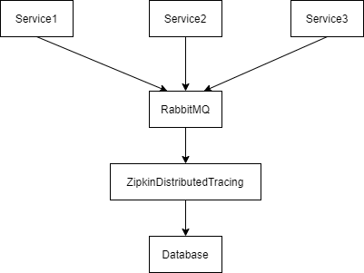

### RabbitMQ

```console
sudo apt-get update
sudo apt -y install rabbitmq-server
sudo systemctl status  rabbitmq-server.service
systemctl is-enabled rabbitmq-server.service
sudo systemctl enable rabbitmq-server
sudo rabbitmq-plugins enable rabbitmq_management

# listen tcp port
ss -tunelp | grep 15672
sudo ufw allow proto tcp from any to any port 5672,15672
```

### Zipkin

```console
java -jar zipkin-server-2.12.9-exec.jar
# localhost:9411/zipkin

# RABBIT_URI=amqp://localhost java -jar zipkin-server-2.12.9-exec.jar
```

### Spring cloud bus

> POST request http://localhost:8080/actuator/bus-refresh

### Fault tolerance with Hystrix


# Jms

# RabbitMQ Message broker

## JMS


## Exchange and Queue


- Exchange route a message to specific Queue.
- User (Message).
- Application behind a queue are consumers.
- Exchange to apply some conditions.
- Types of exchanges:
    - Direct
    - Fanout authorities
    - Headers
    - Topics

### RabbitMQ installation

```console
systemctl enable rabbitmq-server
systemctl start rabbitmq-server
systemctl status rabbitmq-server
systemctl stop rabbitmq-server

sudo rabbitmq-plugins enable rabbitmq_management
// localhost:15672
// rabbitMQ management: guest, guest
```

## Direct Exchange

- Message Key = "mobile"


## JMS Messaging

- JMS: Java Messaging Service
- JMS is a Java API which allows a Java Application to send a message to another application.
    - Generally the other application is a Java applications
- JMS is standard Java API which requires an underlying implementation to be provided.
    - Much like JPA - where JPA is the API standard, and Hibernate is the implementation.
- JMS is highly scalable and allows you to loosely couple applications using asynchronous messaging.

**JMS Implementations**

- Amazon SQS
- Apache ActiveMQ
- JBoss Messaging
- IBM MQ (paid)
- OracleAQ (paid)
- RabbitMQ
- More

**Why Use JMS over REST**

- JMS is a true messaging service.
- Asynchronous.
- Greater throughput - the HTTP protocol is slow comparatively.
    - JMS protocols are VERY performant.
- Flexibility in message delivery - Deliver to one or many consumers.
- Security - JMS has very robust security.
- Reliability - Can guarantee message delivery.

**Types of Messaging**

- Point to Point
    - Message queued and delivered to one consumer.
    - Can have multiple consumers - but message will be delivered only ONCE.
    - Consumers connect to a queue.
- **Publish / Subscribe:**
    - Message delivered to one or more subscribers.
    - Subscribers will subscribe to a topic, then receive a copy of all messages sent to the topic.

**Point to Point**


**Publish / Subscribe**


**Key Terms**

- JMS Provider: JMS Implementation.
- JMS Client: Application which sends or receives messages from the JMS provider.
- JMS Producer or Publisher: JMS Client which sends messages.
- JMS Consumer or Subscriber: JMS Client which receives messages.
- JMS Message: The entity of data sent.
- JMS Queue:
    - Queue for point-to-point messages.
    - Often FIFO
- JMS Topic: Similar to queue - but for publish and subscribe.

**JMS Message**

- A JMS Message contains three parts:
    - Header: Contains metadata about the message
    - Properties: Message properties are in 3 sections:
        - Application: From Java Application sending message.
        - Provider: Used by the JMS provider and are implementation specific.
        - Standard Properties: Defined by the JMS API - Might not be supported by the provider.
    - Payload: The message itself.

**JMS Header Properties**

- JMSCorrelationID:
    - String value, typically a UUID.
    - Set by application, often used to trace a message through multiple consumers.
- JMSExpires:
    - Long - zero, does not expire.
    - Else, time when message will expire and be removed from queue.
- JMSMessageId: String value, typically set by the JMS Provider.
- JMSPriority: Integer - Priority of the message.
- JMSTimestamp: Long - Time message sent.
- JMSType: String - The type of the message.
- JMSReplyTo: Queue or topic which sender is expecting replies.
- JMSRedelivery: Boolean - Has message been delivered?
- JMSDeliveryMode: - Integer, set by JMS Provider for delivery mode.
    - Persistent (Default): JMS Provider should make the best effort to deliver message.
    - Non-Persistent: An occasional message lost is acceptable.
- JSMXUserId:
    - (String) User Id sending message.
    - Set by JMS Provider
- JMSXAppID:
    - (String) Id of the application sending the message.
    - Set by JMS Provider.
- JMSXDeliveryCount:
    - (Int) Number of delivery attempts.
    - Set by JMS Provider.
- JMSXGroupID:
    - (String) The message group which the message is part of.
    - Set by a Client.
- JMSXGroupSeq:
    - (Int) Sequence number of message in group.
    - Set by a Client.
- JMSXProducerTDIX:
    - (String) Transaction id when message produced.
    - Set by JMS Producer.
- JMSXConsumerTXID:
    - (String) Transaction Id when the message consumed.
    - Set by JMS Provider.
- JMSXRcvTimestamp:
    - (Long) Timestamp when message delivered to consumer.
    - Set by JMS Provider.
- JMSXState:
    - (Int) State of the JMS Message.
    - Set by JMS Provider.

**JMS Custom Properties**

- The JMS Client can set custom properties on messages.
- Properties set as key / value pairs (String value).
- Values must be one of:
    - String, boolean, byte, double, float, int, short, long or Object.

**JMS Provider Properties**

- The JMS Client can also set JMS Provider Specific properties
- These properties set as `JMS_<provider name>`.
- JMS Provider specific properties allow the client to utilize features specific to the JMS Provider

**JMS Message Types**

- Message:
    - Just a message, no payload.
    - Often used to notify about events.
- BytesMessage: Payload is an array of bytes.
- TextMessage:
    - Message stored as a string.
    - JSON or XML
- StreamMessage: Sequence of Java primitives.
- MapMessage: Message is name value pairs.
- ObjectMessage: Message is a serialized Java object.

**Which Message Type to Use?**

- JMS 1.0 was originally released in 1998 - Initial focus was on Java to Java messaging
- Since 1998 Messaging and technology has grown and evolved beyond the Java ecosystem.
- JMS TextMessages with JSON or XML payloads currently favored:
    - Decoupled from Java - can be consumed by any technology.
    - Not uncommon to 'bridge' to non-java providers.
    - Makes migration to a non-JMS provider less painful.
        - Important since messaging is becoming more and more generic and abstracted.

***

## Java Message Service

### Messaging


### Why Messaging?

- Heterogeneous Integration.
- Loosely Couples.
- Reduce System Bottleneck - Scalable App.
- Flexibility and Agility.

## What is JMS?


## Messaging Models

- Point to Point.
- Publish / Subscribe.

**Point to Point**

- Message put into queue consumed only once.
- Async Fire and Forget.
- Synchronous request/reply messaging.
- Example: Mail.


**Publish / Subscribe**

- Producer sends message to topic.
- JMS Provider ensures that message sent to all Subscribers.
- Example: News Paper Subscription.

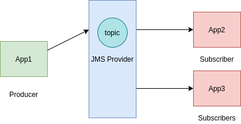

### Apache ActiveMQ Artemis

- JMS Providers:
    - JMS Specification.
    - Apache ActiveMQ Artemis.


**Create the Message Broker**

```console
cd apache-artemis/bin
./artemis create some-path/mybroker

cd some-path/mybroker/bin
./artemis run

# configure queues
cd some-path/mybroker/bin
cd etc
vim broker.xml
```

## Messaging examples

### JMS 1.X API

- ConnectionFactory - JMS provider.
- Destination:
    - Queue or topic.
    - Access from JNDI.
- Connection
- Session:
    - Message
    - MessageProducer
    - MessageConsumer

**Configure jndi**

```properties
java.naming.factory.initial=org.apache.activemq.artemis.jndi.ActiveMQInitialContextFactory
connectionFactory.ConnectionFactory=tcp://localhost:61616
queue.queue/myQueue=myQueue
```

**Writing a message to queue**

- Create a Connection.
- Create a session.
- Look up for the Destination.
- Send/Receive Message.

```java
InitialContext initialContext = null;
Connection connection = null;
try {
    initialContext = new InitialContext();
    ConnectionFactory cf = (ConnectionFactory) initialContext.lookup("ConnectionFactory");
    connection = cf.createConnection();
    Session session = connection.createSession();
    Queue queue = (Queue) initialContext.lookup("queue/myQueue");
    MessageProducer producer = session.createProducer(queue);
    TextMessage message = session.createTextMessage("I am message creator");
    producer.send(message);
    System.out.println("Message Sent: " + message.getText());

    // consume message part
} catch (NamingException e) {
    e.printStackTrace();
} catch (JMSException e) {
    e.printStackTrace();
} finally {
    // close initialContext and connection
}
```

**Consume message from the Queue**

```java
// consume message
MessageConsumer consumer = session.createConsumer(queue);
connection.start();
TextMessage messageReceived = (TextMessage) consumer.receive(5000);
System.out.printf("Message Received: " + messageReceived.getText());
```

**Publish Subscribe**

*jndi.properties*

```properties
topic.topic/myTopic=myTopic
```

```java
InitialContext initialContext = new InitialContext();
Topic topic = (Topic) initialContext.lookup("topic/myTopic");
ConnectionFactory cf = (ConnectionFactory) initialContext.lookup("ConnectionFactory");
Connection connection = cf.createConnection();

Session session = connection.createSession();
MessageProducer producer = session.createProducer(topic);

MessageConsumer consumer1 = session.createConsumer(topic);
MessageConsumer consumer2 = session.createConsumer(topic);

TextMessage message = session.createTextMessage("I am message creator topic");

producer.send(message);

connection.start();

TextMessage message1 = (TextMessage) consumer1.receive();
System.out.println("Consumer 1 message received: " + message1.getText());

TextMessage message2 = (TextMessage) consumer2.receive();
System.out.println("Consumer 2 message received: " + message2.getText());

connection.close();
initialContext.close();
```

**Use QueueBrawser**

```java
QueueBrowser browser = session.createBrowser(queue);
Enumeration messagesEnum = browser.getEnumeration();
while (messagesEnum.hasMoreElements()) {
    TextMessage eachMessage = (TextMessage) messagesEnum.nextElement();
    System.out.println("Browsing: " + eachMessage.getText());
}
```

### JMS 2.X

**Simple API**

```
JMSContext = Connection + Session

JMSProducer
                implements java.lang.AutoCloseable
JMSConsumer
```

**Message**
- Body
- Header
- Properties

**JEE7**

```java
@Inject
@JMSConnectionFactory("jms/connectionFactory")
private JMSContext context;

@Resource(lookup = "jms/dataQueue")
private Queue dataQueue;
```

**ConnectionFactory**

```java
@JMSConnectionFactoryDefinitions
@JMSConnectionFactoryDefinition
```

```xml
<jms-connection-factory>
```

**JMS 2.0 demo**

```java
InitialContext context = new InitialContext();
Queue queue = (Queue) context.lookup("queue/myQueue");

try (ActiveMQConnectionFactory cf = new ActiveMQConnectionFactory();
     JMSContext jmsContext = cf.createContext()) {
    jmsContext.createProducer().send(queue, "JMS 2 demo message");
    final String messageReceived = jmsContext.createConsumer(queue).receiveBody(String.class);

    System.out.println("MessageReceived --> " + messageReceived);
}
```

## Anatomy of a JMS Message

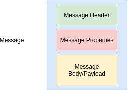

**Headers**

- Provider:
    - JMSDestination
    - JMSDeliveryMode
    - JMSMessageId
    - JMSTimestamp
    - JMSExpiration
    - JMSRedelivered
    - JMSPriority
      Developer:
    - JMSReplyTo
    - JMSCorrelationID
    - JMSType

**Properties**

- ApplicationSpecific:
    - setXXXProperty
    - getXXXProperty
- Provider Specific:
    - JMSUserID
    - JMSXAppID
    - JMSXProducerTXID
    - JMSXConsumerTXID
    - JMSXRcvTimestamp
    - JMSDeliveryCount
    - JMSXState
    - JMSXGroupID
    - JMSXGroupSeq

### Prioritize Messages

```java
final JMSProducer producer = jmsContext.createProducer();

final String[] messages = new String[3];
messages[0] = "Message One";
messages[1] = "Message Two";
messages[2] = "Message Three";

producer.setPriority(3);
producer.send(queue, messages[0]);

producer.setPriority(1);
producer.send(queue, messages[1]);

producer.setPriority(9);
producer.send(queue, messages[2]);

// consumer
final JMSConsumer consumer = jmsContext.createConsumer(queue);
for (int i = 0; i < 3; i++) {
    System.out.println(consumer.receiveBody(String.class));
}
// === OUTPUT ===
// Message Three
// Message One
// Message Two
```    

### Request Reply Message

**jndi.properties**

```properties
queue.queue/requestQueue=requestQueue
queue.queue/replyQueue=replyQueue
```    

```java
final JMSProducer producer = jmsContext.createProducer();
producer.send(queue, "JMS message request");

final JMSConsumer consumer = jmsContext.createConsumer(queue);
final String messageReceived = consumer.receiveBody(String.class);
System.out.println(messageReceived);

// Reply
JMSProducer replyProducer = jmsContext.createProducer();
replyProducer.send(replyQueue, "JMS message reply");

final JMSConsumer replyConsumer = jmsContext.createConsumer(replyQueue);
System.out.println(replyConsumer.receiveBody(String.class));
```

### Use replyTo JMS Header

```java
final JMSProducer producer = jmsContext.createProducer();
final TextMessage message = jmsContext.createTextMessage("JMS message request");
message.setJMSReplyTo(replyQueue);
producer.send(queue, message);

final JMSConsumer consumer = jmsContext.createConsumer(queue);
final TextMessage messageReceived = (TextMessage) consumer.receive();
System.out.println(messageReceived.getText());

// Reply
JMSProducer replyProducer = jmsContext.createProducer();
replyProducer.send(messageReceived.getJMSReplyTo(), "JMS message reply");

final JMSConsumer replyConsumer = jmsContext.createConsumer(replyQueue);
System.out.println(replyConsumer.receiveBody(String.class));
```    

**When use replyTo header?**

```java
// create reply queue from jmsContext
final TemporaryQueue replyQueue = jmsContext.createTemporaryQueue();
```    

### MessageId and CorrelationId Header

```java
final JMSProducer producer = jmsContext.createProducer();
final TemporaryQueue replyQueue = jmsContext.createTemporaryQueue();
final TextMessage message = jmsContext.createTextMessage("JMS message request");
message.setJMSReplyTo(replyQueue);
producer.send(queue, message);
System.out.println(message.getJMSMessageID());

Map<String, TextMessage> requestMessages = new HashMap<>();
requestMessages.put(message.getJMSMessageID(), message);

final JMSConsumer consumer = jmsContext.createConsumer(queue);
final TextMessage messageReceived = (TextMessage) consumer.receive();
System.out.println(messageReceived.getText());

// Reply
JMSProducer replyProducer = jmsContext.createProducer();
final TextMessage replyMessage = jmsContext.createTextMessage("JMS message reply");
replyMessage.setJMSCorrelationID(messageReceived.getJMSMessageID());
replyProducer.send(messageReceived.getJMSReplyTo(), replyMessage);

// Reply received
final JMSConsumer replyConsumer = jmsContext.createConsumer(replyQueue);
final Message replyReceived = replyConsumer.receive();
System.out.println(replyReceived.getJMSCorrelationID());
System.out.println(requestMessages.get(replyReceived.getJMSCorrelationID()).getText());
```

### Set message expiry

```java
// Produce Message
final JMSProducer producer = jmsContext.createProducer();
producer.setTimeToLive(2000);
producer.send(queue, "JMS 2 demo message");
Thread.sleep(5000);

// Consume Message
final Message messageReceived = jmsContext.createConsumer(queue).receive(4000);
System.out.println("MessageReceived --> " + messageReceived);
```

### Access Expired Message

```console
cd some-path/mybroker/etc
vim broker.xml
```

**broker.xml**

```xml
<expiry-address>ExpiryQueue</expiry-address>
...
<address name="ExpiryQueue">
    <anycast>
       <queue name="ExpiryQueue" />
    </anycast>
</address>
```

**jndi.properties**

```properties
queue.queue/expiryQueue=ExpiryQueue
```

```java
Queue expiryqueue = (Queue) context.lookup("queue/expiryQueue");
// ...
// Consume Message
final Message messageReceived = jmsContext.createConsumer(queue).receive(4000);
System.out.println("MessageReceived --> " + messageReceived);
System.out.println(jmsContext.createConsumer(expiryqueue).receiveBody(String.class));
```

### Delay the message delivery

```java
// Produce Message
final JMSProducer producer = jmsContext.createProducer();
producer.setDeliveryDelay(3000);
```

### Set custom message properties

```java
// Produce Message
final JMSProducer producer = jmsContext.createProducer();
TextMessage textMessage = jmsContext.createTextMessage("JMS 2 demo message");
textMessage.setBooleanProperty("loggedIn", true);
textMessage.setStringProperty("userToken", "panda");
producer.send(queue, textMessage);

// Consume Message
final Message messageReceived = jmsContext.createConsumer(queue).receive(5000);
System.out.println(messageReceived);
System.out.println(messageReceived.getBooleanProperty("loggedIn"));
System.out.println(messageReceived.getStringProperty("userToken"));
```

### Message Types


```java
// Produce Message
final JMSProducer producer = jmsContext.createProducer();
TextMessage textMessage = jmsContext.createTextMessage("JMS 2 demo message");
final BytesMessage bytesMessage = jmsContext.createBytesMessage();
bytesMessage.writeUTF("Miki");
bytesMessage.writeLong(321L);
producer.send(queue, bytesMessage);

// Consume Message
final BytesMessage messageReceived = (BytesMessage) jmsContext.createConsumer(queue).receive(5000);
System.out.println(messageReceived.readUTF());
System.out.println(messageReceived.readLong());
```

### Create Object Message

```java
final ObjectMessage objectMessage = jmsContext.createObjectMessage();
final Patient patient = new Patient();
patient.setId(1);
patient.setName("Panda");
objectMessage.setObject(patient);

producer.send(queue, objectMessage);

// Consume Message
final ObjectMessage messageReceived = (ObjectMessage) jmsContext.createConsumer(queue).receive(5000);
final Patient object = (Patient) messageReceived.getObject();
System.out.println(object.getId());
System.out.println(object.getName());
```

### JMS 2.X message types

```java
producer.send(queue, patient);

// Consume Message
final Patient messageReceived = jmsContext.createConsumer(queue).receiveBody(Patient.class)
System.out.println(messageReceived.getId());
System.out.println(messageReceived.getName());
```

## Point 2 Point Messaging

- One to one communication
- Interoperability
- Throughput/Performance
- QueueBrowser

### Use cases

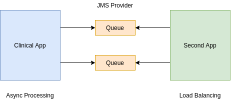

### Asynchronous Processing


# Commands

**GET**

```
curl http://localhost:8080/api/rooms

# See headers
curl -I http://localhost:8080/api/rooms

curl http://localhost:8080/api/basicAuth/validate

curl -H "Authorization: Basic bWF0dDpzZWNyZXQ=" http://localhost:8080/api/basicAuth/validate

# jane
curl -H "Authorization: Basic amFuZTpzZWNyZXQ=" http://localhost:8080/api/basicAuth/validate

# matt
curl -H "Authorization: Basic bWF0dDpzZWNyZXQ=" http://localhost:8080/api/basicAuth/validate

curl -H "Authorization: Bearer <KEY>" http://localhost:8080/api/users

curl -I -H "Authorization: Basic bWF0dDpzZWNyZXQ=" http://localhost:8080/api/basicAuth/validate
```

